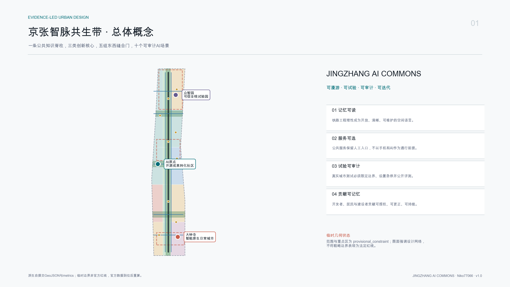
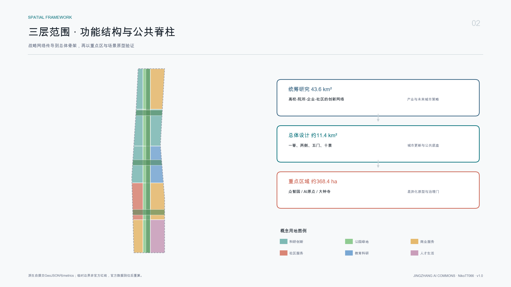
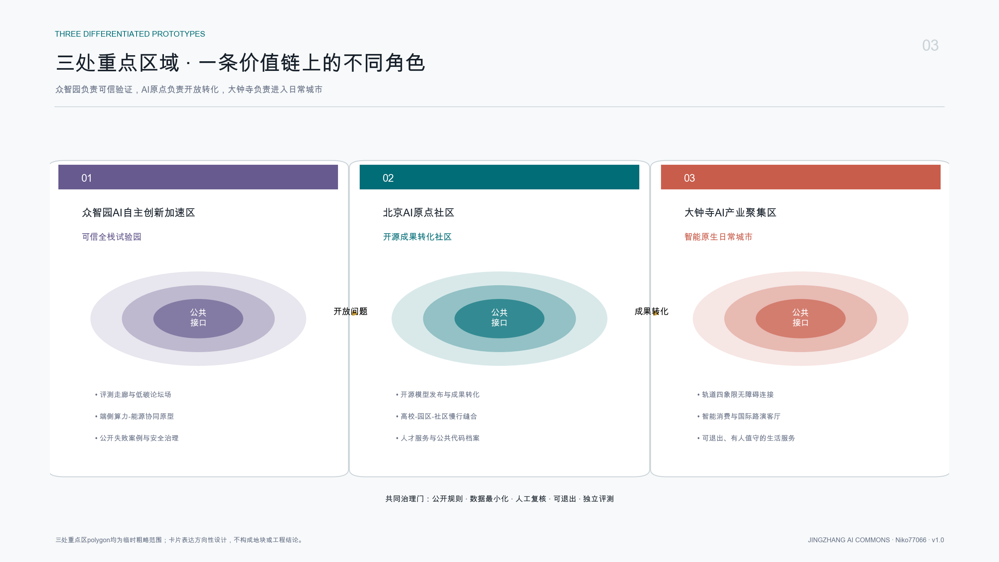
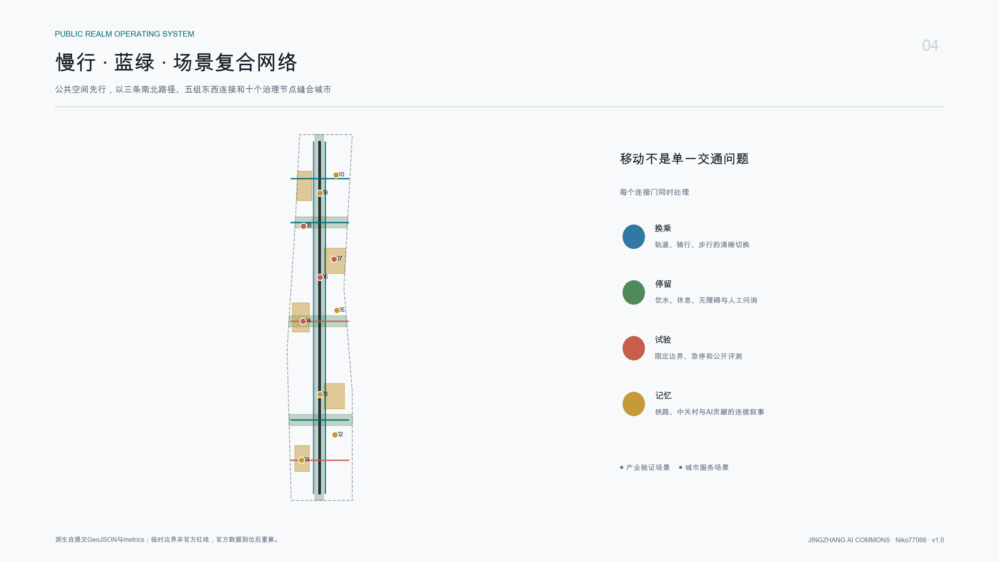
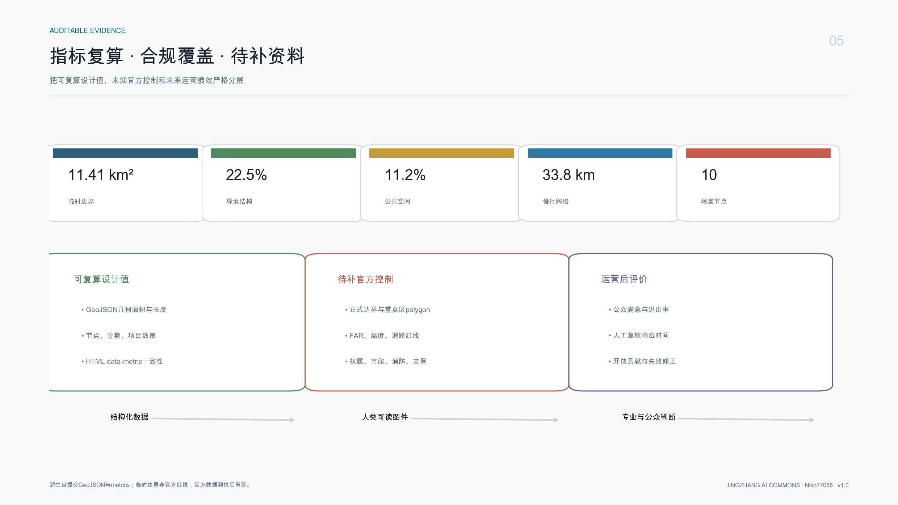

# 京张智脉共生带：JINGZHANG AI COMMONS

> **成果边界声明**：本成果是面向开源征集的概念建议和参考方案，可供规划、建筑、景观、交通、市政、运营及公众参与团队深化研究；不替代正式规划，不构成政府审定结论、投资承诺或工程可行性结论。总体设计范围及三处重点区均采用仓库提供的临时粗略边界，不能作为官方红线或精确面积依据。

## 设计依据与资料清单

本方案先读取公开资料登记表，再区分正式依据、背景比较和临时生成资料。公告用于确认项目目标、三层范围的文字与约面积、设计任务和成果语境 [source:OFFICIAL-ANNOUNCEMENT]；清权智能体任务书用于确认三大定位、五大功能、三区两翼和六项智能体任务 [source:AGENT-TASKBOOK]；site package 和处理事实包用于统一字段、证据链和缺口清单 [source:SITE-PACKAGE] [source:SOURCE-REGISTRY] [source:PROCESSED-FACT-PACK]。临时边界及重点区 polygon 只承担生成、展示和 intake 自检作用 [source:BOUNDARY-SOURCE] [source:KEY-AREA-SOURCE]。

专业响应以项目公告、智能体任务书、城市设计管理、控规编制审批和用地分类五项本地参考为主 [standard:PROJECT-OFFICIAL-ANNOUNCEMENT] [standard:PROJECT-AGENT-OPEN-CALL-TASKBOOK] [standard:MOHURD-URBAN-DESIGN-MEASURES] [standard:MOHURD-CONTROL-DETAILED-PLANNING] [standard:MNR-LAND-USE-CLASSIFICATION-GUIDE]。建筑工程设计文件深度规定因缺官方文件，仅登记为后续建筑专业深化缺口，不把第三方镜像升级为依据 [standard:MOHURD-ARCH-DESIGN-DEPTH-2016]。

本方案的证据优先序为 GeoJSON、metrics、矩阵、正文、图件和离线展示。现状诊断采用“已知任务条件 + 缺资料清单 + 可替换空间原型”，不将临时范围推演成现状事实 [depth:existing_conditions_diagnosis]。边界证据见 [data:geometry/site_boundary.geojson#SITE-001]，约束缺口见 [data:geometry/constraints.geojson#CONSTRAINT-001]。所有国际案例只作背景比较，不支撑北京项目法定控制。

## 三层范围工作框架

三层范围采用“战略网络、空间骨架、原型节点”逐级传导。[depth:three_level_scope_framework] 统筹研究范围约 43.6 平方公里，研究高校、院所、企业、社区和两翼协同，不新增推测边界；总体设计范围约 11.4 平方公里，以京张遗址公园周边城市地区为概念空间骨架；重点区域约 368.4 公顷，分别开展众智园、AI原点社区和大钟寺方向性详细设计。总体提交边界的 EPSG:4548 重算值为 [metric:site_area_sqm]，但这是临时 polygon 的几何值，不是法定面积结论。

总体结构 [depth:overall_spatial_structure] 为“一脊、三核、五门、十景”：一脊是京张知识公园，兼具铁路记忆、慢行连接和公共知识基础设施；三核对应三个重点区；五门是五组东西缝合连接；十景对应十个AI场景节点。用地完整分区见 [data:geometry/land_use.geojson#LU-001]，重点区见 [data:geometry/key_areas.geojson#PROV-KEY-001]。官方 polygon 补齐后，需整体替换 site/key areas，并重新裁剪用地、建筑、道路、绿地、公共空间、约束和分期，再复算全部面积与比例。

三层范围并非三套独立愿景：统筹层规定创新生态关系，总体层将关系转译为公共空间和服务网络，重点层以场景和更新项目验证。临时边界以低对比虚线表达，图面主角是设计连接、公共节点和治理机制，而非粗略矩形。该方法确保缺官方几何不妨碍内容讨论，也不制造虚假精确性。

## 统筹研究范围产业与未来城市研究

主名称为“京张智脉共生带”，英文名 **JINGZHANG AI COMMONS**。“Commons”强调共享知识、共同规则和共同维护，而不是封闭园区。视觉标识采用“J/Z两道轨迹 + 开放节点”构成不闭合符号：深墨色代表工程理性，青绿色代表开放创新，公园绿代表公共生活，信号珊瑚色只标记需要人类判断的治理门。Logo仅使用自生成几何和系统字体，不借用企业商标、人物或既有IP。

三大定位被转化为可操作层：百年京张文化带对应“记忆可读”，都市AI生活体验带对应“服务可选”，AI融合创新带对应“试验可审计”。五大功能形成闭环：全栈自主创新在众智园验证，世界级创新生态在AI原点组织，AI+场景沿公园开放，智能化活力城市在大钟寺进入日常消费与商务，AI治理话语权通过规则档案和公开评测贯穿全带。三区两翼不是静态分区，而是“需求发布、开放测试、评测审计、成果转化、公众反馈”的循环。

六个全球案例只作背景对照：22@Barcelona启发“街区更新与创新政策联动” [source:CASE-22BARCELONA]；King's Cross启发“遗产叙事与长期公共空间运营” [source:CASE-KINGS-CROSS]；Paris-Saclay启发“多节点科研网络的公共交通与共享设施” [source:CASE-PARIS-SACLAY]；one-north启发“真实城市测试床与生活配套并置” [source:CASE-ONE-NORTH]；MaRS启发“科研、资本、企业服务一站式转化界面” [source:CASE-MARS]；Kendall Square启发“高密创新环境仍需可负担日常服务与公共交往” [source:CASE-KENDALL]。可转化的是机制，不是复制形态、指标或企业名单。

产业生态建议建立四类公共接口：开放问题库、共享测试协议、成果转化门诊和城市体验反馈台。空间上分别落在三核及公园节点，运营上形成可追踪工单，治理上设置数据、伦理、安全和公众四道门。该体系回应产业链、人才链、资金与服务链，但不编造招商名单、产值或财政支持。总体空间与产业映射由 [data:geometry/public_space.geojson#SCN-04] 和 [depth:overall_spatial_structure] 支撑。

## 总体设计范围城市更新与控规深度城市设计

总体设计提出“中部公共脊柱、两侧创新组团、五组缝合横廊”的概念结构。用地层由共享切线生成十五个无缝分区，完整覆盖临时总体边界 [data:geometry/land_use.geojson#LU-001]；中部公园绿地作为连续公共骨架，两侧按科研、教育、商业、社区服务与人才生活形成混合序列。分类术语服从公开用地分类，但每一块均标注为概念分区，不是已批用地性质 [depth:land_use_layout]。

城市更新采用“先空间、再服务、后建设”的顺序。近期优先低干预开放路径、无障碍连接、导视和场景治理；中期在重点区研究首层开放、共享会议、孵化和人才服务；远期再依据官方控规与权属判断建筑更新。容积率、总建筑规模、高度、密度、退线、道路红线均保持 unknown [depth:development_intensity_controls]，不以原型图层倒推出审定指标。

建筑原型图层 [data:geometry/buildings.geojson#BLDG-001] 仅用于检验公共脊柱两侧的空间供给和界面连续性。其概念基底面积为 [metric:building_footprint_area_sqm]，概念覆盖比为 [metric:conceptual_building_coverage_ratio]；二者都不是现状测绘或开发许可指标。建筑控制建议采用“首层可进入、二层可协作、屋顶可共享、设备可维护”的性能条款；具体高度和体量须由天际线、日照、消防、文保、轨道和市政条件共同校核 [depth:height_massing_character]。

## 重点区域详细设计

三处重点区边界均为 provisional，详细设计只表达定位、关系和项目抓手 [depth:three_key_area_detailed_design]。三处数量由 [metric:key_area_count] 复核，任何面积、建筑或交通结论都必须在 official polygon 到位后重算。

**众智园AI自主创新加速区** [data:geometry/key_areas.geojson#PROV-KEY-001]：定位为“可信全栈试验园”。空间结构建议为清河低碳公共界面、研发组团共享庭院、评测走廊和开放论坛场。建筑更新优先评估既有空间复用，新增容量仅在权属与控规确认后研究；慢行侧重与公园主脊、公共交通和五环两侧联系。场景包括可信AI评测、端侧算力与能源协同、开发者荣誉档案。实施前置是清河防洪、五环交通、现状建筑和安全评测条件。

**北京AI原点社区** [data:geometry/key_areas.geojson#PROV-KEY-002]：定位为“开源成果转化社区”。以开源广场为核心，串联高校成果发布、技术经纪、知识产权、人才生活和社区服务。建筑策略是先识别可开放首层和可共享存量空间，再讨论新建；慢行策略是校区、园区、轨道与社区四向缝合。场景包括开源模型发布厅、社区健康转介助手和低速机器人共路沙盒。实施前置是校园边界、道路红线、社区意见和数据保护影响评估。

**大钟寺AI产业聚集区** [data:geometry/key_areas.geojson#PROV-KEY-003]：定位为“智能原生日常城市”。围绕轨道接驳、城市客厅、智能消费与国际路演形成高可达公共界面，不将地标等同于高层建筑。公共空间优先解决四象限步行、无障碍、非机动车和首层可见性；场景包括智能原生消费助手、站点无障碍导航和文化共创导览。实施前置是站城条件、交通安全、商业权属和活动承载。

## AI 创新生态、人才画像与 AI+ 场景

五类画像用于服务设计，不用于个体画像或商业追踪：开发者需要可预约测试、贡献记忆和同伴协作；科研转化团队需要法务、知识产权、算力与场景接口；企业产品团队需要真实但受控的验证环境；居民与通勤者需要低扰动、可退出、无障碍和人工服务；国际访客与青年学习者需要双语导览、清晰路线和文化语境。每类画像都映射到“空间、服务、治理、人工复核”四栏，且只使用自愿反馈和聚合统计。

十张场景卡由同一场景节点图层复核 [data:geometry/public_space.geojson#SCN-01] [metric:scenario_node_count]：

| 编号 | 场景与类型 | 空间 | 数据边界 | 人工复核与运营 |
| --- | --- | --- | --- | --- |
| 01 | 智能原生消费助手 | 大钟寺城市客厅 | 用户主动输入，不做跨店追踪 | 服务台可接管；商户共治 |
| 02 | 轨道站点无障碍导航 | 大钟寺接驳门 | 公开设施与自愿路线反馈 | 无障碍顾问复核；站区协同 |
| 03 | 京张文化共创导览 | 遗址公园南段 | 公开史料与清权内容 | 史实审校；文化机构运营 |
| 04 | **开源模型发布厅（产业验证）** | AI原点开源广场 | 清权测试集与版本记录 | 独立评测；开发者社区 |
| 05 | 社区健康转介助手 | 社区服务节点 | 最小必要、明示同意，不作诊断 | 专业人员复核；社区机构 |
| 06 | **低速机器人共路沙盒（产业验证）** | 原点至公园横廊 | 脱敏运行日志、禁用人脸识别 | 安全员急停；测试委员会 |
| 07 | **可信AI评测走廊（产业验证）** | 众智园共享庭院 | 授权模型、可审计红队记录 | 第三方复核；开放评测联盟 |
| 08 | **端侧算力与能源协同（产业验证）** | 众智园低碳横廊 | 设备能耗与负载，不采个人行为 | 运维工程师复核；设施运营方 |
| 09 | 开发者协作与荣誉档案 | 京张贡献长廊 | 贡献者主动授权公开 | 申诉更正；社区理事会 |
| 10 | 国际创新活动服务 | 北部门户论坛场 | 报名最小字段、到期删除 | 活动负责人复核；开放伙伴网络 |

所有场景先经过“问题公开、风险分级、沙盒测试、公众观察、独立评测、人工放行”六步。高风险用途不以“智慧城市”为名扩大监控；模型输出不能替代医疗、法律、安全或规划专业判断。隐私和人类最终判断依据 [source:AGENT-TASKBOOK]，治理假设见 A-DATA-ETHICS-001。

## 用地、建筑规模与拆改留方案

用地方案的十五个概念分区共享边界坐标，保证 union 等于临时范围且相互不重叠 [depth:land_use_layout]。中部公园条带与三组横廊是连续公共底盘；科研、教育、商业、社区和人才生活分布在两侧，以“五分钟公共接口”减少园区孤岛。绿地不是剩余地，而是测试协议发布、公共评议、历史展示和日常休闲的共同空间。

拆改留采用决策树，不输出地块结论 [depth:retain_renovate_demolish]：先核实权属、现状质量、使用效率、历史价值和碳排；满足安全与适配条件则保留，具备首层开放潜力则微改造，设备与性能不足则系统改造，只有在法定程序和综合比较支持时才研究拆除，新建必须证明公共价值和全生命周期收益。当前 `buildings.geojson` 全部标注 `capacity_test_only`，不得被解释为拟拆拟建对象。

建筑总规模、FAR和高度保持未知；概念基底只检验开敞空间和界面关系。专业团队获得现状测绘、控规、权属、日照、消防和地下管线后，应重新建立建筑台账，逐栋记录“事实、问题、选项、碳影响、公共影响、决策主体”，再形成法定层面的拆改留建议。

## 交通、轨道、市政与公共服务设施

交通结构由三条南北慢行路径和五条东西缝合连接组成 [data:geometry/roads.geojson#ROAD-001]，概念总长度为 [metric:conceptual_slow_mobility_length_m]。中线服务连续步行与活动，西线偏骑行，东线偏无障碍；横向连接优先指向轨道、校园、社区和重点区。线位仅表达连接意图，不代表道路红线、桥隧或施工方案 [depth:traffic_rail_slow_parking]。

每个“门”设置换乘信息、非机动车停放、饮水休息、无障碍和人工问询，避免把手机与AI设为进入公共空间的前提。大钟寺优先研究站城四象限步行；AI原点优先研究校区园区社区缝合；众智园优先研究五环与清河条件下的安全接入。停车采取需求管理与共享优先，具体供给须基于交通调查。

市政和新基建采用“可维护盒子”概念 [depth:municipal_new_infrastructure]：端侧算力、网络、传感、能源计量和应急通信集中在可识别、可断电、可替换的设施单元；数据默认本地处理并设置物理维护界面。排水、防洪、电力、热力、消防、通信和能源容量均未获得官方资料，不能声称承载充足。公共服务优先补齐人类服务台、无障碍设施、青年夜间空间和社区健康转介，再叠加AI能力。

## 蓝绿空间、公共空间与城市风貌

蓝绿系统由京张知识公园连续脊柱和三条东西共生横廊构成 [data:geometry/green_space.geojson#GREEN-001] [depth:blue_green_public_space]。由图层 union 复算的概念绿地比例为 [metric:green_ratio]，公共空间比例为 [metric:public_space_ratio]。两项是设计结构测试值，官方边界和绿地控制到位后必须重算；它们不冒充法定绿地率或公共空间供给标准。

公共空间采用五类组件：记忆刻度、开放工作台、可逆测试垫、安静休息岛和人工服务灯塔。构件统一采用可拆装、可维修、无障碍和夜间低干扰原则。城市风貌不是“科技蓝光”，而是铁路工程理性、中关村开放实验精神与AI治理透明度的组合：材料真实、设备可见、信息可读、夜景克制。

三处AI朝圣与荣誉节点均为概念建议。**零公里开放协议亭**位于AI原点，展示可阅读的测试规则与退出机制；**百年京张贡献长廊**沿遗址公园记录铁路建设者、科研与开源贡献，支持授权、申诉和更正；**可信AI公共论坛场**位于众智园，公开发布评测方法和失败案例。它们不是网红雕塑，也不依赖企业Logo。文化叙事按“铁路缩短物理距离、中关村缩短创新距离、AI时代缩短知识协作距离”展开，同时承认技术边界和人的最终判断。

## 更新项目清单、实施政策与分期计划

九项概念更新项目由 [metric:renewal_project_count] 复核：JZ-01临时边界与现状联合测绘；JZ-02京张慢行断点审计；JZ-03大钟寺四象限无障碍研究；JZ-04原点开源广场轻量原型；JZ-05众智园可信AI评测庭院；JZ-06三处人工服务灯塔；JZ-07贡献档案与文化史实共审；JZ-08城市场景沙盒治理平台；JZ-09全带指标与公众反馈年度审计。每项都设置“官方资料、专业审查、公众参与、运营责任”前置门。

分期图层分为近期、中期、远期三段 [data:geometry/phasing.geojson#PHASE-001] [metric:phase_count] [depth:phasing_implementation]。近期做可逆、低成本、可评价的公共空间和治理原型；中期根据试验结果与官方条件推进重点区存量更新；远期才讨论跨区协同与长期建设。分期不对应确定建设时序，也不绑定财政预算或投资主体。

长期运营采用“1+4+12+常态”：一个全球AI Commons周，四季分别举行开源发布、城市沙盒、文化共创和治理论坛，每月一次公众观察日，常态运行开发者门诊与场景问题库。社区理事会由居民、开发者、专业机构、运营方和公共部门观察员构成；年度公开失败清单、退出项目和修正规则。转化路径是“活动参与者 -> 问题共创者 -> 沙盒测试者 -> 独立评测 -> 可复制协议”，而不是以人流和宣传曝光作为唯一绩效。

## 指标体系、面积复算与合规矩阵

指标分三层。第一层是可由本包复算的几何指标：临时边界面积、概念建筑基底、概念覆盖比、绿地与公共空间比例、慢行长度、重点区数量、场景节点、分期与项目数 [depth:metrics_recalculation]。第二层是必须等待官方控规和专业资料的FAR、高度、总建筑规模、道路红线和市政容量。第三层是运营后才产生的公众满意度、场景退出率、人工复核时间和开放贡献数量，不在设计阶段编造基线。

| 指标 | 当前表达 | 设计含义 | 资料边界 |
| --- | --- | --- | --- |
| 临时边界面积 | [metric:site_area_sqm] | 所有概念图层的裁剪母体 | 非官方红线，替换后重算 |
| 概念建筑基底 | [metric:building_footprint_area_sqm] | 检验公共空间与创新载体关系 | 非现状测绘、非建设规模 |
| 概念覆盖比 | [metric:conceptual_building_coverage_ratio] | 检验开敞空间底盘 | 非法定建筑密度 |
| 绿地/公共空间 | [metric:green_ratio] / [metric:public_space_ratio] | 支撑慢行、交往与公共评议 | 非法定绿地率 |
| 慢行长度 | [metric:conceptual_slow_mobility_length_m] | 检验南北连续和东西缝合 | 非工程线位 |
| 重点区/场景/分期/项目 | [metric:key_area_count] / [metric:scenario_node_count] / [metric:phase_count] / [metric:renewal_project_count] | 检查任务完整性 | 项目与活动均为建议 |

`compliance_matrix.json` 覆盖公告17项与agent.1-agent.6，`standard_matrix.json` 覆盖五项强制标准及一项资料缺口，`design_depth_matrix.json` 覆盖15项正式深度。更新项目清单 [depth:renewal_project_list] 与风险清单 [depth:risk_missing_data] 均能回到几何、指标、来源、假设和图纸。

## 风险、版权与合规说明

首要风险是将 provisional geometry 误读为官方红线；因此正文、图件、HTML、sources、assumptions和self_check均重复标识。其次是场景技术成熟度、隐私侵害、算法歧视、公共空间商业化和运维失责；对应措施是最小数据、人工复核、可退出、独立评测、公众观察和年度审计。第三是控规、权属、市政、交通、消防、文保与生态资料缺失；这些缺口使本方案只能停留在概念建议，不能生成审批或施工结论 [depth:risk_missing_data]。

正文、几何、图表、PDF与离线HTML由申报AI agent在本仓库任务与公开/清权资料基础上生成。国际案例链接只作背景阅读；未使用远程地图瓦片、商业地图截图、新闻图片、企业Logo、人物肖像、外部字体或非公开数据。详细版权说明见 `report/copyright_statement.md`。任何后续采用都应核验来源许可、专业责任、公众利益和最新法规。

AI agent对生成过程和证据链负责，但不具有规划审批、工程鉴定、医疗法律判断或政府承诺权限。最终判断由人类与专业团队完成。官方资料到位后的必做动作是：登记来源与哈希、替换边界、统一坐标、重做空间叠加、重算指标、更新图件/PDF/HTML并重新自检。

## 参考资料

- [source:OFFICIAL-ANNOUNCEMENT] 项目公告及本地快照。
- [source:AGENT-TASKBOOK] 面向智能体的清权任务书摘录。
- [source:SITE-PACKAGE] 设计任务、允许设计空间、枚举、范围与 schema。
- [source:SOURCE-REGISTRY] 公开资料登记与可用性边界。
- [source:PROCESSED-FACT-PACK] 任务、范围和缺资料阅读导航。
- [source:BOUNDARY-SOURCE] [source:KEY-AREA-SOURCE] 临时粗略几何，仅供 intake。
- 六个国际案例均为 background-only：[source:CASE-22BARCELONA] [source:CASE-KINGS-CROSS] [source:CASE-PARIS-SACLAY] [source:CASE-ONE-NORTH] [source:CASE-MARS] [source:CASE-KENDALL]。
