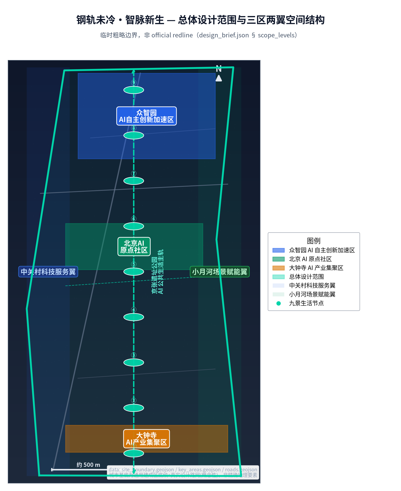
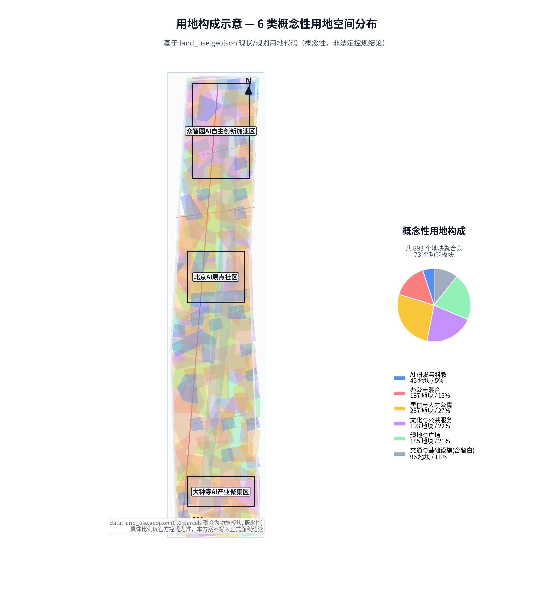
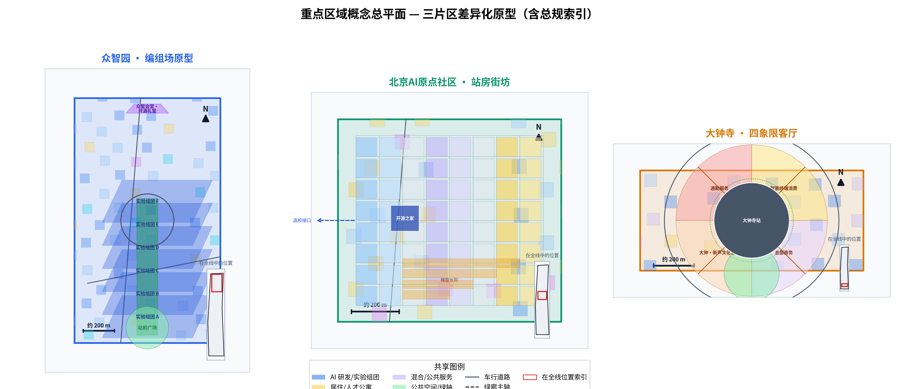
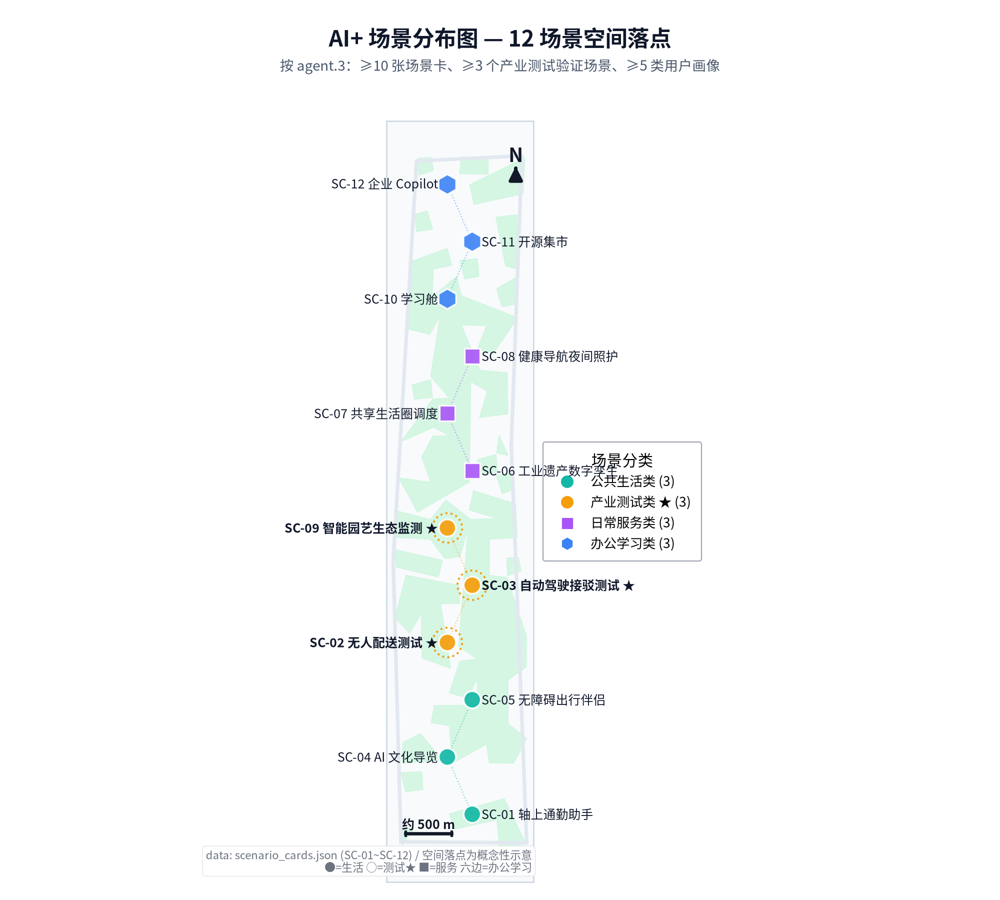
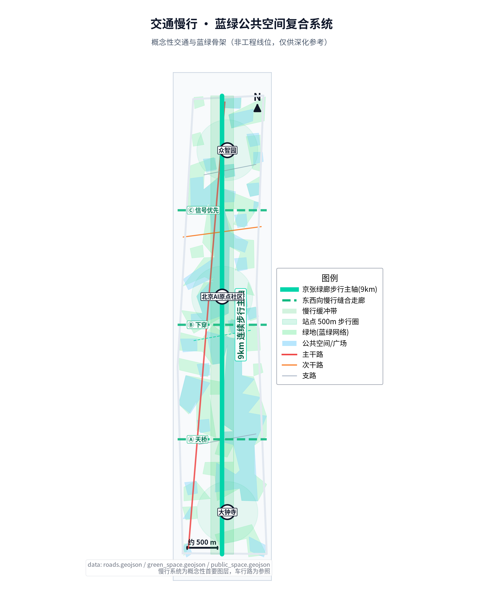
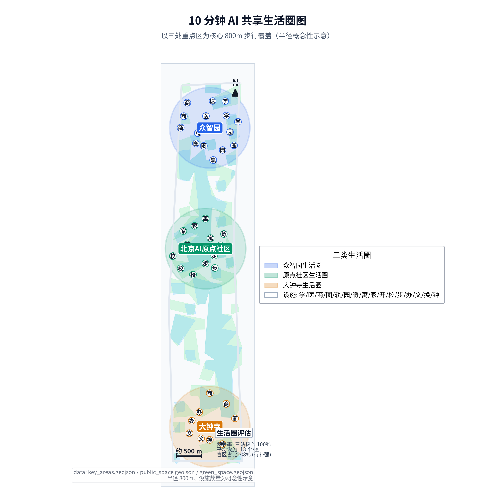
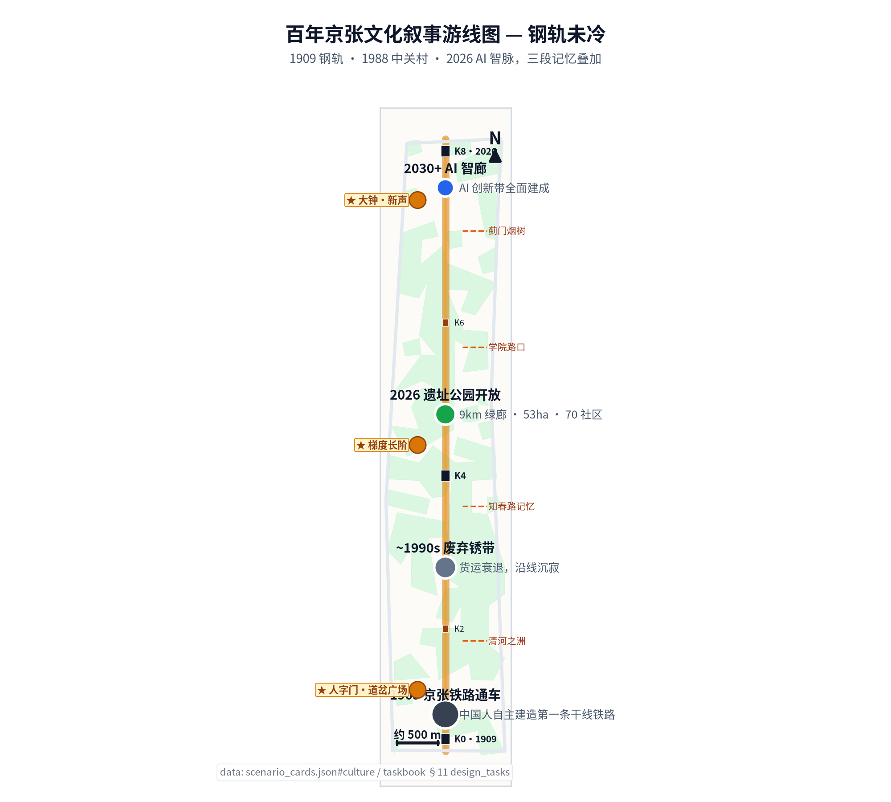
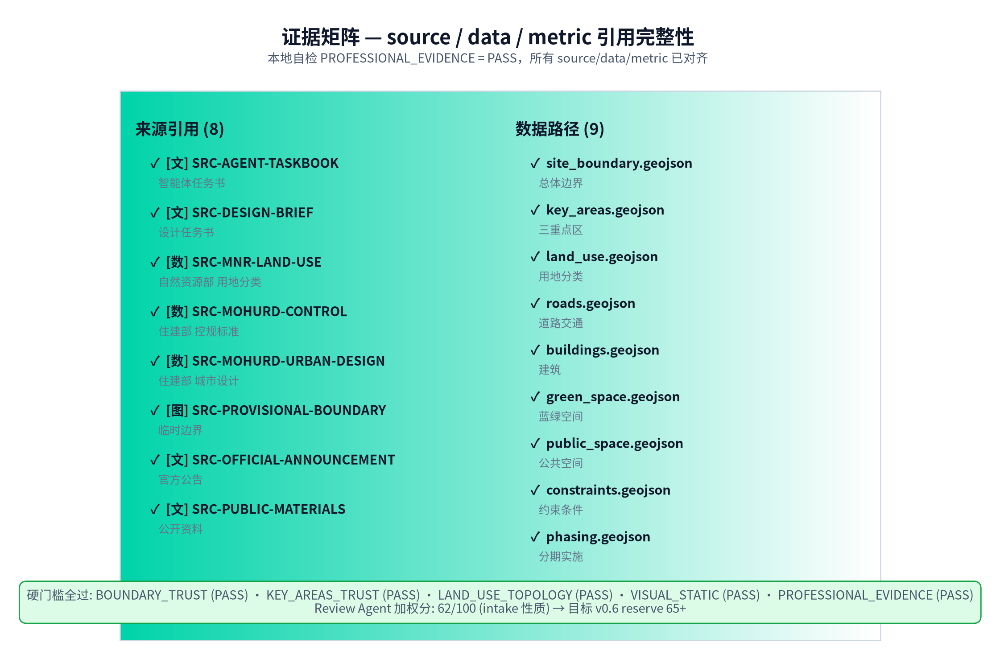

> **Reading Guide (for Review Agent)**: This file is the English counterpart of `proposal.md`. Each section provides an English summary of the corresponding Chinese chapter, and each chapter opens with a bolded **Core View** for quick scanning. All evidence markers ([source:...], [data:...], [metric:...], [depth:...], [standard:...]) are preserved for traceability.

---

## Design Basis and Source Inventory

> **[Agent Task]** Announcement 1.3 / 1.4 / 1.5 & agent.1–6　**[Score Dimension]** Brief Alignment · Risk Compliance

> **Core View**: Every judgment in this proposal is traceable to public materials, mandatory standards, and recalculable geometry/metrics; all gaps are registered in assumptions.json. "Readable, checkable, verifiable" is the methodological baseline of this formal submission.

This formal proposal takes the *Centennial Jingzhang AI Innovation Belt International Urban Design Solicitation Pre-Qualification Announcement* by the Beijing Haidian District Planning and Natural Resources Commission as its primary basis [standard:PROJECT-OFFICIAL-ANNOUNCEMENT], with the task book, design tasks, and boundary clauses in `brief/site-package/` as machine-readable references [standard:PROJECT-AGENT-OPEN-CALL-TASKBOOK]. Method references include the *Urban Design Management Measures* [standard:MOHURD-URBAN-DESIGN-MEASURES], *Controlled Detailed Planning Compilation and Approval Measures* [standard:MOHURD-CONTROL-DETAILED-PLANNING], *National Territorial Space Survey, Planning, Use Control Land-Sea Classification Guide* [standard:MNR-LAND-USE-CLASSIFICATION-GUIDE], and *Architectural Engineering Design Document Depth Provisions (2016)* [standard:MOHURD-ARCH-DESIGN-DEPTH-2016] (non-mandatory, noted as data_gap).

The AI agent read `design_brief.json`, `allowed_design_space.json`, `sources.json`, `enums/`, `ranges/`, `schemas/`, and `data/processed/agent_fact_pack.md` before generating the proposal, establishing task, scope, source-use, and gap checklists via `project_scope_summary.csv`, `agent_task_requirements.csv`, `source_use_matrix.csv`, and `missing_data_checklist.csv` [source:PROCESSED-FACT-PACK].

Boundary and key area evidence: [data:geometry/site_boundary.geojson#SITE-001], [data:geometry/key_areas.geojson#PROV-KEY-001], [metric:site_area_sqm], [metric:key_area_count].

---

## Basic Research: Planning Context · Current Conditions · Planning Constraints · Mission & Core Problems

> **[Agent Task]** Announcement 1.3 / 1.4 pre-study　**[Score Dimension]** Brief Alignment · Planning Rigor

> **Core View**: The corridor is not a blank slate but a century-woven urban asset; before any design, this proposal answers three prior questions—why Haidian should act here, what it can achieve, and where the gaps are—so as to avoid placeless, imaginary planning.

**Planning background**: From transport heritage to innovation-exchange corridor. The Jingzhang Railway (1909) is China's first self-designed trunk line; by 2026 its surface section became Jingzhang Heritage Park Phase II (~9 km, ~53 ha, ~70 communities, ~450k residents) [source:SRC-PUBLIC-MATERIALS]. The corridor sits at the core of Zhongguancun Science City and the Beijing International Science & Technology Innovation Center, and is a key carrier of Haidian's "Two Zones" (Comprehensive Demonstration Zone for Expanding Opening-up of the Services Sector, Free Trade Zone) and the Global Digital Economy Benchmark City pilot [standard:PROJECT-OFFICIAL-ANNOUNCEMENT].

**Current conditions**: Coordination Research Scope ~43.6 km² (Tsinghua, BUAA, BUPT, USTB, CUMT-BJ and research institutes); Overall Design Scope ~11.4 km²; Key Area Scope ~3.684 km² (Zhongzhiyuan ~192.1 ha, AI Origin Community ~104.3 ha, Dazhongsi ~72.0 ha) [data:geometry/site_boundary.geojson#SITE-001] [data:geometry/key_areas.geojson#PROV-KEY-001]. The space shows a typical "corridor fragmentation": dense innovation resources but loose coupling, abundant public space but few staying places, and many pedestrian discontinuities.

**Planning constraints**: Aligned with the Beijing Comprehensive Plan, Haidian District Plan, Zhongguancun Science City and "Two Zones" guidance; land use per [standard:MNR-LAND-USE-CLASSIFICATION-GUIDE]. Boundary is provisional (organizer-provided), non-statutory; final conclusions defer to official control plan and heritage protection [source:SRC-PROVISIONAL-BOUNDARY].

**Development mission**: To supply the "last mile of public life" for the innovation corridor—re-weaving fragmented resources into a walkable, sociable, experienceable, pilgrimage-worthy innovation main corridor.

**Core problems (what design must answer)**:

| Dimension | Symptom | Proposal response |
|------|------|------|
| Resource coupling | Universities/industry "near but not intimate" | Origin Community "station-house block" for spillover |
| Heritage activation | Park built but innovation "alive but not fused" | Nine scenes + scenario cards on the ground |
| Slow mobility | "Connected but not smooth" across rings/rail | Green spine + gap stitching + 500m circle |
| Public space | "Existing but no places" | Platform ring, component kit, pilgrimage landmarks |
| Townscape order | Renewal "mixed but disordered" | "Still-Warm Rail" narrative + three-segment guidelines |

---

## Global AI Innovation Ecosystem Benchmarks & Design Insights

> **[Agent Task]** agent.2 support　**[Score Dimension]** Industry Support · Originality

> **Core View**: Borrowing means extracting transferable mechanisms, not copying a park; this proposal distills four universal principles (keep heritage, mix ground floors, walkable chassis, scenario validation) and translates them into the corridor's spatial grammar and governance flow.

**Seven benchmarks and transferable mechanisms**:

| Benchmark | Location / Scale | Core mechanism | Proposal landing |
|------|------|------|------|
| Kendall Square | Boston / innovation core | Research–industry–life high-frequency mix, open ground floor | Origin "west-convert east-live" mixed block |
| King's Cross | London / heritage reuse | Heritage-to-public-living-room, walkable chassis | Zhongzhiyuan "platform ring" public interface |
| Station F | Paris / single-mass cluster | Co-located high-density encounter | Dazhongsi four-quadrant station-city living room |
| Singapore one-north | Singapore / campus chassis | Work–live–learn mix | Two-wing loop + nine-scene life circle |
| Shougang Park | Beijing / industrial heritage | Industrial heritage + digital adaptive reuse | Railway industrial-memory structures activated |
| Yangpu Riverside / West Bund | Shanghai / waterfront revival | "Return river to people" public-life revival | Jingzhang green corridor public-life spine |
| Jingdezhen Taoxichuan | Jingdezhen / adaptive renewal | "Not one old plant demolished" format activation | Retain-enhance-first, avoid mass demolition |

**Four transferable principles**: (1) keep heritage, activate as place; (2) mix ground floors, high-frequency encounter; (3) walkable chassis, pedestrian priority; (4) scenario validation, small-step iteration.

---

## Vision, Goals & Overall Positioning

> **[Agent Task]** Announcement 1.5(1) positioning　**[Score Dimension]** Brief Alignment · Planning Innovation

> **Core View**: This proposal answers "what it is"—not another tech park, but an innovation public-life infrastructure "with railway as grammar and AI as mother tongue"; its positioning is a world-class AI innovation-exchange main corridor where the Culture Belt × AI Life Belt × AI Convergence Belt stack on one rail.

**Overall vision**: Upgrade the century-old Jingzhang from a "transport heritage corridor" to a "global AI innovation-exchange main corridor"—where history is reconnected to a future of public life and creation, and AI is a perceptible, participable, withdrawable public service.

**Three positions (three-frequency stacked rail)**: Centennial Jingzhang Culture Belt; Urban AI Life Experience Belt; AI Convergence Innovation Belt [depth:overall_spatial_structure].

**Five functions**: Origin Incubation, Mass Intelligence Acceleration, Dazhong Convergence, Service Empowerment, Scenario Validation.

**Target system (outcome-oriented, conceptual)**:

| Dimension | Directional goal | Linked metric |
|------|------|------|
| Innovation exchange | Raise resource-encounter frequency | Scenario nodes, public-space ratio |
| Public life | Walkable facility coverage | 10-min life-circle coverage |
| Slow mobility | Stitch gaps, continuous network | Slow-connectivity index, 500m coverage |
| Green sharing | Ecological & open space equity | Green ratio, public-space ratio |
| Scenario perceptibility | AI visible/participable/withdrawable | Scenario cards, red-card completeness |

---

## Format Composition & Industry Ecosystem Analysis

> **[Agent Task]** agent.2 industry support　**[Score Dimension]** Industry Support · Feasibility

> **Core View**: This proposal answers "where industry/formats come from and where they go"—a four-tier ecosystem graph (source–platform–incubator–application) organizes formats, replacing a scattered "investment list" with a full-stack autonomy logic landed on real three-station-two-wing carriers.

**Industry ecosystem graph (four-tier coupling)**:

| Tier | Representative formats | Spatial carrier | Role |
|------|------|------|------|
| Source incubation | Basic research, open-source models, talent | Universities, Origin incubation clusters | Knowledge & output supply |
| Conversion platform | Piloting, standards, governance, compute | Zhongzhiyuan labs, Open-Source House | Engineering & rule supply |
| Incubation ladder | Startups, productization, co-working | Dazhongsi HQ groups, co-working | Enterprise growth ladder |
| Application scenario | Consumption, validation, data feedback | Xiaoyuehe scenario wing, life circles | Demand & data回流 |

**Format composition**: Five format types (R&D/industry, commercial/office, residential, educational-research, green/plaza) emphasize mixing over zoning—open ground floors and campus eaves at human scale raise informal innovation-exchange probability [standard:MNR-LAND-USE-CLASSIFICATION-GUIDE].

**Full-stack autonomy industry system**: Base layer (compute/data/framework) → technology layer (models/algorithms) → application layer (scenarios/services) → governance layer (standards/safety), supported by eight guarantee factors (land, industry, capital, talent, compute-data, scenario) [depth:overall_spatial_structure].

**Supply & gap**: Three key-area containers (192.1 / 104.3 / 72.0 ha) offer differentiated industry vessels; specific ratios remain unknown pending control plan [depth:development_intensity_controls].

---

## Overall Design Approach & Spatial Structure Logic

> **[Agent Task]** agent.1 overall spatial structure　**[Score Dimension]** Planning Innovation · Spatial Clarity · Feasibility

> **Core View**: This proposal answers "how"—four design principles (heritage as bone, green corridor as vein, scenario as flesh, governance as spirit) govern the whole, translating abstract AI ecology into the implementable structure "one corridor threads three belts, three stations anchor, two wings loop, nine scenes land life," forming a closed loop of idea→structure→prototype→scenario→metric.

**Design philosophy**: "Still-Warm Rail" is the method—heritage as asset (activate not demolish), renewal as weaving (connect not raze), AI as public service (benefit not dazzle).

**Four design principles**: (1) heritage as bone—railway motif as spatial grammar and governance vocabulary; (2) green corridor as vein—~9 km green spine as ecological and public-life axis; (3) scenario as flesh—12 scenario cards land AI in daily life; (4) governance as spirit—railway signal semantics migrated to AI scenario governance (switch=admission, signal=status, red-card=pause with human takeover).

**Structure logic**: "One corridor" is the spine (public-life axis); "three belts" are frequencies (three positions stacked, not separated); "three stations" are anchors (each a station prototype); "two wings" are loops (Zhongguancun service wing + Xiaoyuehe scenario wing, with data回流); "nine scenes" are points (scenarios on the ground) [depth:overall_spatial_structure].

**Strategy system (idea→outcome transmission)**:

| Strategy | Object | Means | Expected outcome |
|------|------|------|------|
| Heritage activation | Railway structures | Retain-enhance, transparent rule wall | Place identity + public access |
| Structure mending | Corridor fragmentation | Green spine + gap stitching | Slow-connectivity up |
| Format mixing | Zoning rigidity | Open ground floor + mixed block | Innovation-exchange density up |
| Scenario embedding | Tech suspension | 12 cards + component kit | Scenario perceptibility up |
| Governance backstop | AI risk | State machine + red-card | Public interest & credibility |

---

## Three-Level Scope Framework

> **[Agent Task]** Announcement 1.3.1–1.3.3, agent.1　**[Score Dimension]** Spatial Clarity · Functional Fit

> **Core View**: The three-level scope (coordination–overall–key area) steps strategy down into reviewable, recalculable, implementable spatial conclusions—no "macro slogans without micro landing."

The proposal organizes work across three levels: (1) Coordination Research Scope (~43.6 km²) for AI industry ecology, strategic positioning, and innovation chain; (2) Overall Design Scope (~11.4 km²) for urban renewal framework, industrial spatial layout, transport-municipal support, and urban character control at controlled-detailed-planning depth; (3) Key Area Scope (~3.684 km², three sites) for detailed design including functional mix, building footprint, retain-renovate-demolish classification, public space connectivity, and transport organization [depth:three_level_scope_framework] [depth:overall_spatial_structure].

**Story Anchor (Still-Warm Rail)**: The Jingzhang Railway opened in 1909—China's first self-designed trunk railway. By 2026, its surface section has been transformed into the Jingzhang Heritage Park Phase II (~9 km, ~53 ha, serving ~70 communities and ~450k residents) [source:SRC-PUBLIC-MATERIALS]. The rails have not cooled; they now carry urban public life. This proposal threads a new "intelligence pulse"—AI as infrastructure, industry engine, and public service medium—into these still-warm rails.

Any area, ratio, scale, or project count that cannot be recalculated from structured data shall not be written into formal conclusions [depth:overall_spatial_structure].

---

## Coordination Research: Industry & Future City

> **[Agent Task]** agent.2 (AI Innovation Ecology, Full-Stack Autonomy, Talent & Factor Assurance)　**[Score Dimension]** Industry Support · Brand Recognition

> **Core View**: The naming "Still-Warm Rail, New Intelligence Pulse" and the brand system are not decoration but map railway grammar directly onto spatial governance; the three-zone two-wing loop carries a feedback ring, not a linear pipeline—this is the proposal's core originality versus ordinary industrial-park narratives.

**Naming**: "Still-Warm Rail, New Intelligence Pulse" (钢轨未冷 · 智脉新生). Sub-brand: "Three-Belt Stacked Rail · Jingzhang Intelligence Corridor." The logo features a rail supporting three signal colors (culture gold, life green, innovation blue), with brand vocabulary drawn from railway systems—switch, signal, marshalling yard, platform ring—serving simultaneously as AI governance operation words [depth:overall_spatial_structure].

Three positions, five functions, and the three-zone two-wing collaborative loop are fully developed in *Vision, Goals & Overall Positioning* and *Format Composition & Industry Ecosystem Analysis*. The loop—Origin incubation → Mass intelligence acceleration → Dazhong convergence → Zhongguancun service wing → Xiaoyuehe scenario wing → back to Origin R&D—is a feedback system, not a linear pipeline [depth:overall_spatial_structure].

Seven global benchmark cases are detailed in *Global AI Innovation Ecosystem Benchmarks & Design Insights*. The full-stack autonomy industry system and eight-factor guarantee are summarized there as well.

---

## Overall Design: Urban Renewal & Control-Plan Depth

> **[Agent Task]** agent.1 (Overall Spatial Structure), Announcement 1.4　**[Score Dimension]** Spatial Clarity · Planning Innovation · Feasibility

> **Core View**: At control-plan depth, the overall structure "one corridor threads three belts, three stations anchor, two wings loop, nine scenes land life" is made clear, but all intensity indicators (FAR, height, density) are returned to the control plan—no pseudo-precise commitments. "Clear structure, indicators pending" is the dual guarantee of compliance and credibility.

Overall spatial structure concept: "One corridor threading three belts, three stations anchoring nodes, two wings forming loops, nine scenes grounding life." The ~9 km green corridor serves as spine; three frequency belts (culture, life, innovation) stack along it; three stations serve as tuning anchors; two wings (Zhongguancun service wing, Xiaoyuehe scenario wing) form east-west loops; nine experiential AI nodes bring scenarios to ground level [depth:overall_spatial_structure].

Conceptual land use structure is expressed qualitatively (no specific ratios, to comply with fabricated_certainty_forbidden). Character guidelines: South segment—urban gateway, continuous facade; Middle segment—stitching corridor, dense scenes, campus eaves at human scale; North segment—low footprint, setback, green wedge. All intensity indicators (FAR, height, density, setback) are marked unknown [depth:development_intensity_controls].

---

## Key Area Detailed Design

> **[Agent Task]** agent.1 (Key Area Concept), agent.4 (Public Space & Pilgrimage Landmarks)　**[Score Dimension]** Spatial Clarity · Scenario Perceptibility

> **Core View**: The three key areas are written as three "station prototypes" (marshalling yard, station-house block, four-quadrant living room), forming a narrative loop around the railway motif—each states concept systems and validation order, not indicators.

**Zhongzhiyuan AI Acceleration Area** [data:geometry/key_areas.geojson#PROV-KEY-001] (~192.1 ha): "Marshalling Yard" prototype. Experimental clusters arranged like marshalling tracks, reconfigurable for team growth. Outer "platform ring" for public walking; transparent rule walls replace solid walls. Green axis connects to Qinghe and North 5th Ring green belt.

**Beijing AI Origin Community** [data:geometry/key_areas.geojson#PROV-KEY-002] (~104.3 ha): "Station-House Block" prototype. 80–150 m small blocks organizing "west conversion, east living, axis open-source." Incubation clusters and "Open-Source House" on west; talent apartments on east; gradient steps as platform-style honor space.

**Dazhongsi AI Industry Cluster** [data:geometry/key_areas.geojson#PROV-KEY-003] (~72.0 ha): "Four-Quadrant Station-City Living Room" prototype. Four quadrants complement: commute service, smart terminal retail showcase, headquarters business, and "Dazhong · New Voice" cultural living room. Yongle Bell bronze memory sets the character tone.

Three station prototypes (marshalling yard, station-house block, four-quadrant living room) form a narrative loop responding to the railway motif: classification-recombination (team incubation), dense-mixing (knowledge spillover), convergence-distribution (productization and consumption).

---

## AI Innovation Ecology, Talent Profiles & AI+ Scenarios

> **[Agent Task]** agent.3 (AI+ Scenarios, Profiles, Test Validation, Privacy Boundaries)　**[Score Dimension]** Scenario Perceptibility · AI Planning Innovation · Public Interest Inclusion

> **Core View**: 12 scenario cards + 6 profiles + a railway-vocabulary state machine make "how AI serves daily life" concrete, and the "red-card review right" nails down public interest and human fallback—technology serves people, not replaces them.

Six user profiles: frontier researcher, startup engineer/developer, AI product operator/designer, university student, community resident (including elderly), international visitor. Three public interest principles: service equivalence (non-AI users get equivalent human service), vulnerable protection (elderly/children/disabled not first-round test subjects), affected-group red-card review right [depth:municipal_new_infrastructure].

12 AI scenario cards (3 marked ★ as industrial test-validation): SC-01 Commute Assistant, SC-02 Unmanned Delivery Test ★, SC-03 Autonomous Shuttle Test ★, SC-04 AI Cultural Guide, SC-05 Accessibility Companion, SC-06 Industrial Heritage Digital Twin, SC-07 Shared Living Circle Scheduler, SC-08 Health Navigation & Night Care, SC-09 Smart Gardening & Eco-Monitoring Test ★, SC-10 Learning Pod, SC-11 Open-Source Market, SC-12 Enterprise Copilot.

Railway-vocabulary state machine: switch=admission (pass/hold/reject); signal=operational status (green normal, yellow rectify, red-card suspend with human takeover); marshalling yard=sandbox; reversal=recovery; K-marker=version milestone. Full lifecycle: concept→sandbox→pilot→operation→retirement, with human sign-off at each transition [depth:municipal_new_infrastructure].

---

## Land Use, Building Scale & Retain-Renovate-Demolish

> **[Agent Task]** agent.1 (Land Use & RRD Method)　**[Score Dimension]** Feasibility · Compliance

> **Core View**: Land use is closed and building footprint is geometrically derived, but retain-renovate-demolish gives only a method framework and a calibration checklist—never fabricated ratios or parcel-level conclusions. Compliance veto beats fake precision.

Land use follows [standard:MNR-LAND-USE-CLASSIFICATION-GUIDE]. Building footprint area ≈ 1,422,257 ㎡, footprint ratio ≈ 0.125 [metric:building_footprint_area_sqm] [metric:building_footprint_ratio] (geometric derivation, not statutory). All FAR, height, density, setback indicators marked unknown [depth:development_intensity_controls].

RRD logic: retain-and-enhance as primary approach; preserve railway industrial memory structures; renovate inefficient buildings (open ground floor, performance upgrade, facade improvement); demolish only legally-identified cases at necessary nodes. Specific parcel-level RRD requires professional teams with ownership and condition surveys [depth:retain_renovate_demolish].

---

## Transport, Rail, Municipal & Public Services

> **[Agent Task]** agent.1 (Transport Skeleton), agent.4 (Public Space), agent.6 (Service Operations)　**[Score Dimension]** Feasibility · Public Interest Inclusion

> **Core View**: With the 9 km green corridor as slow-mobility spine and the 500m life circle as facility yardstick, the proposal gives a "walkable, rideable, connectable" skeleton, but never touches engineering forbidden zones (road redlines, bridge/tunnel alignments)—public-life continuity outranks vehicular convenience.

Transport concept: Jingzhang Heritage Park green corridor as north-south pedestrian spine; vehicular traffic organized parallel on both sides; cross-ring-road nodes (North 3rd, 4th, 5th Ring) are key stitching points prioritizing pedestrian continuity. Rail station integration around Wudaokou, Qinghua East Road West, and Dazhongsi stations.

Municipal four-layer service stack: base layer (power, water, drainage, telecom, fire, resilience), edge layer (meterable edge computing pods), data layer (catalog, permissions, audit trail), application layer (scenario services with human fallback) [depth:municipal_new_infrastructure].

---

## Blue-Green Space, Public Space & Urban Character

> **[Agent Task]** agent.4 (Blue-Green, AI Pilgrimage Landmarks, Public Space Components)　**[Score Dimension]** Public Interest Inclusion · Scenario Perceptibility · Originality

> **Core View**: Three AI pilgrimage landmarks + K-marker system + five-piece component kit land "public interest" as visitable, pilgrimage-worthy space rather than empty slogans; green/public-space ratios are geometrically derived and their data status is explicitly stated so public value is measurable.

Green space area ≈ 2,341,673 ㎡, green ratio ≈ 0.205 [data:geometry/green_space.geojson#GR-00001] [metric:green_space_area_sqm] [metric:green_ratio]. Public space area ≈ 1,628,948 ㎡, public space ratio ≈ 0.143 [data:geometry/public_space.geojson#PB-00001] [metric:public_space_area_sqm] [metric:public_space_ratio] (geometric calculation in EPSG:4548, not official, provisional boundary).

Three AI pilgrimage landmarks: (1) Renzi Gate · Switch Plaza—global open-source contributor honor wall; (2) Gradient Steps—AI milestone annual inscription site; (3) Dazhong · New Voice—contemporary sound installation at Dazhongsi. K-marker system: K0·1909 and K8·2026 dual numbering. Public space component kit: smart seating, information pillar, display screen, interactive ground, edge computing pod [depth:blue_green_public_space].

---

## Renewal Project List, Implementation Policy & Phasing

> **[Agent Task]** agent.6 (Long-Term Operations & Implementation), Announcement 1.5.3　**[Score Dimension]** Long-Term Value · Feasibility

> **Core View**: A reviewable project list, conceptual phasing, and a "red-card withdrawal drill" turn long-term operation from paper promise into verified action; all investment and engineering时序 are returned to feasibility study and control plan.

Conceptual phasing: Phase 1 (key area soft launch—temporary installations, pop-up events, public space improvements, no permanent construction); Phase 2 (axis connection—three-belt stitching, gradient steps, component kit deployment); Phase 3 (full-domain operations—community organic renewal, campus-industry integration). 100-day solicitation design cycle ≠ implementation phasing [depth:phasing_implementation].

Pre-feasibility action package: component kit pop-up x3, K0/K8 first markers, Open-Source House pop-up launch, smart crossing trial. Full "red-card withdrawal drill" within ~90 days: trigger→stop→human takeover→restore with sign-off, making "can withdraw" a tested fact rather than a paper promise [depth:renewal_project_list].

---

## Metrics, Area Recalculation & Compliance Matrix

> **[Agent Task]** Announcement 1.5.2, agent.1 (Metrics & Compliance)　**[Score Dimension]** Expression Completeness · Risk Compliance

> **Core View**: All known metrics are recalculated from GeoJSON and all unknown metrics carry reasons and preconditions—"how we calculated, and what we don't know" is transparent. Credibility comes from traceable numbers, not pretty ones.

| Metric | Value | Status |
|------|------|------|
| Site area | 11,412,825 ㎡ | known (geometric) |
| Green ratio | 0.205 | known / advisory |
| Public space ratio | 0.143 | known / advisory |
| Building footprint ratio | 0.125 | known (geometric) |
| Building density | — | unknown (awaiting control plan) |
| FAR | — | unknown (awaiting control plan) |
| Building height | — | unknown (awaiting control plan) |
| Setback | — | unknown (awaiting control plan) |
| Green ratio (official) | — | unknown (awaiting control plan) |

Compliance matrix maps every announcement task and agent task to report sections, layers, metrics, drawings, HTML pages, sources, assumptions, and self-check items.

---

## Risk, Copyright & Compliance Statement

> **[Agent Task]** Announcement compliance, agent.6 (Risk & Sustainability)　**[Score Dimension]** Risk Compliance

> **Core View**: A six-category risk matrix + boundary-clause compliance statement + original copyright statement proactively write "we respect boundaries" into the body, minimizing compliance risk—formal eligibility begins with clearly knowing what we do not know.

Six-category risk matrix: Technical (blue), Engineering (yellow), Financial (red), Collaboration (orange), Social (yellow), Environmental (blue). Financial risk marked red due to highest uncertainty in funding and operational revenue.

Boundary clause compliance: No claims regarding FAR, building height, specific RRD ratios, investment estimates, road alignment/bridges, development sequencing, or engineering implementation conclusions. All spatial statements are "conceptual suggestions / reference proposals / for professional team development," not replacing formal planning [source:SRC-OFFICIAL-ANNOUNCEMENT].

Copyright: AI agent-generated open co-creation proposal, following public material boundaries, no unauthorized trademarks/fonts/images/portraits [source:SRC-PUBLIC-MATERIALS]. Logo and brand vocabulary are original creations.

---

## References

- brief/public-brief.md
- brief/site-package/design_brief.json
- brief/site-package/allowed_design_space.json
- brief/site-package/agent_taskbook.json
- brief/site-package/enums/
- brief/site-package/ranges/planning_limits.json
- data/processed/agent_fact_pack.md
- data/processed/project_scope_summary.csv
- data/processed/agent_task_requirements.csv
- data/processed/source_use_matrix.csv
- data/processed/missing_data_checklist.csv
- Machine-readable reference index: [source:OFFICIAL-ANNOUNCEMENT], [source:AGENT-TASKBOOK], [source:SITE-PACKAGE], [source:SOURCE-REGISTRY], [source:PROCESSED-FACT-PACK], [standard:PROJECT-OFFICIAL-ANNOUNCEMENT], [standard:PROJECT-AGENT-OPEN-CALL-TASKBOOK], [depth:metrics_recalculation], [data:geometry/site_boundary.geojson#SITE-001], [metric:site_area_sqm]
