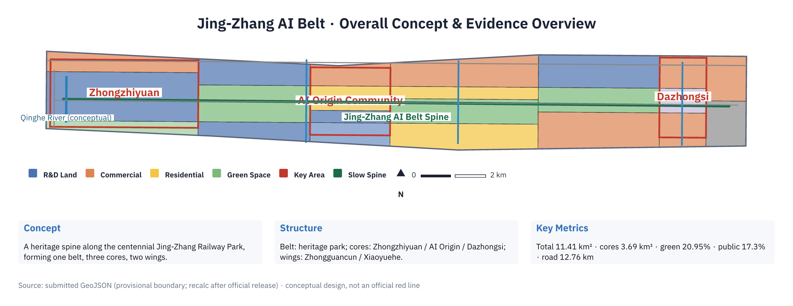
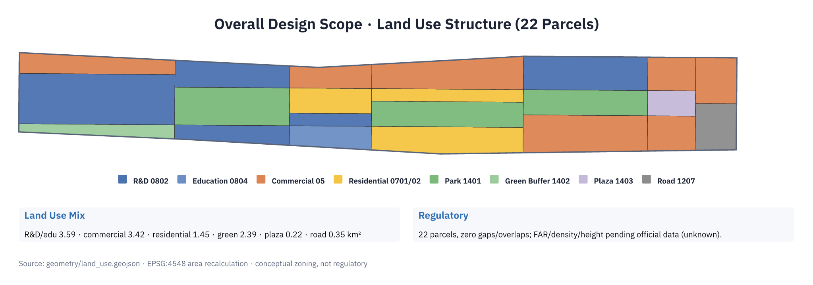
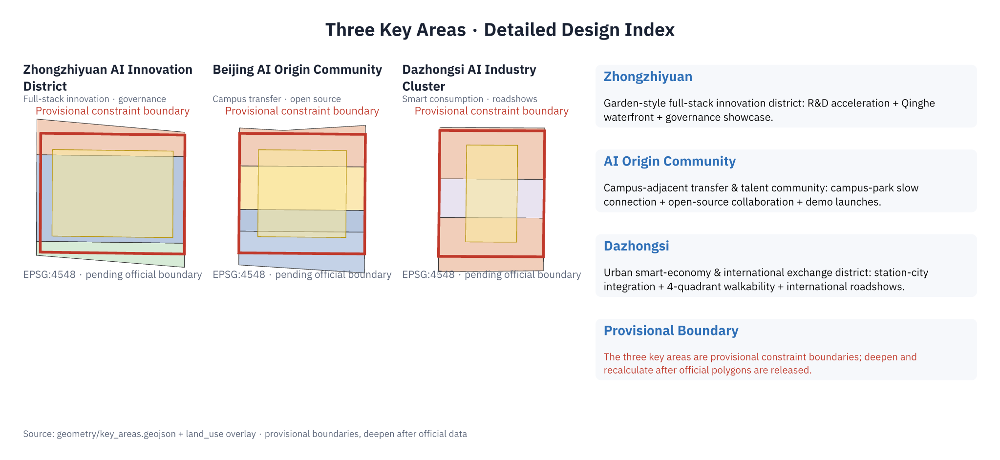
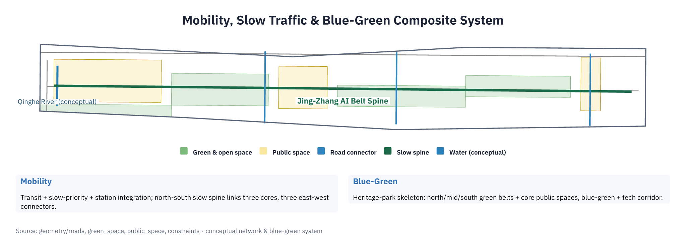
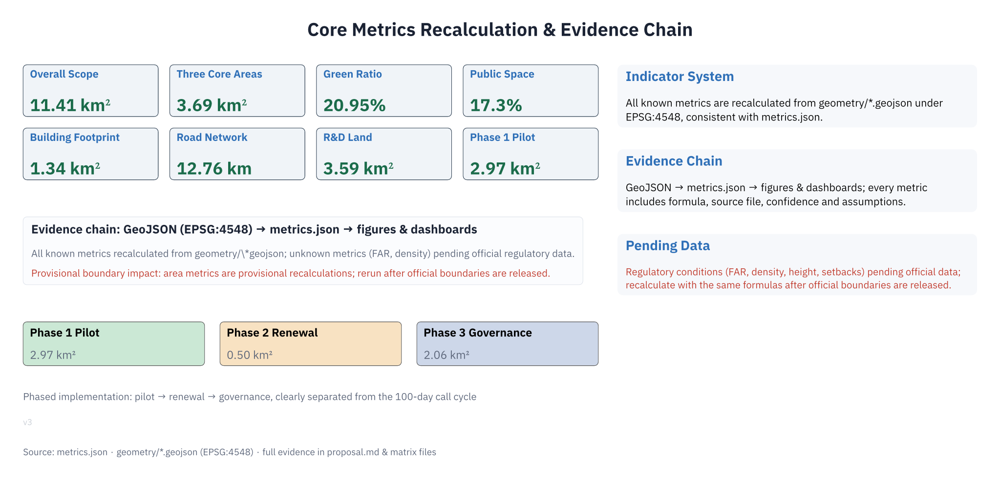

# Jing-Zhang AI Belt: Urban Design Concept Proposal — From a Century-Old Railway to an AI Symbiosis Belt

## Design Basis and Documentation Inventory

This proposal takes the *Prequalification Announcement for the International Solicitation of Urban Design Concepts for the Century Jing-Zhang AI Innovation Belt*, issued by the Haidian Branch of the Beijing Municipal Commission of Planning and Natural Resources, as its primary statutory basis [source:DATA-SRC-OFFICIAL-ANNOUNCEMENT-20260509]. It adopts the open-call task book excerpt addressed to global AI agents as its operational framework [source:DATA-SRC-AGENT-TASKBOOK-20260518], and relies on the provisional substitute boundaries and publicly available materials registered in `brief/site-package/` and verified by maintainers as its spatial and evidentiary foundation [source:SITE-PACKAGE].

Documentation usage boundaries follow the registration conclusions in `data/source_registry.json` [source:SOURCE-REGISTRY]: the announcement, task book, and professional standards are classified as formally usable (`usable_for_formal="yes"`); the approximate substitute polygons for the three-tier scope and three key areas are classified as `provisional_only`, intended solely for spatial generation, visualization, and design discussion within this proposal, and shall not serve as official red-line boundaries, approval bases, or precise area references [source:DATA-SRC-PROVISIONAL-BOUNDARIES-20260605]. Official precise boundaries, regulatory planning conditions, road red lines, land tenure, and engineering data have not yet entered the public documentation package; such information is uniformly annotated in this proposal as "pending official data supplementation" and registered as `unknown` in `assumptions.json` and `metrics.json` [data:geometry/site_boundary.geojson#SITE-001].

The proposal is not a precise survey of existing conditions but a conceptual, forward-looking, and scenario-driven deliverable oriented toward the solicitation objectives: it translates design intent into locatable functional zones, nodes, corridors, and scenarios, ensuring that every spatial recommendation is presented as a "conceptual recommendation, reference scheme, or content suitable for further study by professional teams" [source:DATA-SRC-AGENT-TASKBOOK-20260518]. All spatial metrics can be recalculated from the submitted GeoJSON geometries under EPSG:4548 projection [metric:site_area_sqm], and may be recomputed using the same methodology once official boundaries are released.

## Three-Tier Scope Working Framework

The proposal organizes design work according to the three-tier scope defined in the announcement: the Comprehensive Research Scope covers approximately 43.6 square kilometers, focusing on AI industrial ecology, innovation chains, and future urban form research; the Overall Design Scope covers approximately 11.4 square kilometers, focusing on urban regeneration within 1–2 kilometers of the Jing-Zhang Heritage Park and adjacent industrial districts; the Key Area Scope covers approximately 3.68 square kilometers, encompassing from north to south the Zhongzhiyuan AI Autonomous Innovation Acceleration Area, the Beijing AI Origin Community, and the Dazhongsi AI Industry Cluster, where detailed design is undertaken [data:geometry/key_areas.geojson#PROV-KEY-001] [source:DATA-SRC-OFFICIAL-ANNOUNCEMENT-20260509]. The three tiers operate under a linked framework: "comprehensive research sets direction, overall design establishes structure, and key areas verify depth" [depth:three_level_scope_framework].

The overarching concept is named the **Jing-Zhang AI Belt**: with the Century Jing-Zhang Railway Heritage Park as the historical and public-space spine, three key districts as AI innovation anchors, and the Zhongguancun Technology Service Wing and Xiaoyuehe Scenario Empowerment Wing as flanking supports, forming a spatial structure of "One Belt, Three Cores, Two Wings, Multiple Nodes" [depth:overall_spatial_structure]. The naming system and logo direction are elaborated in the chapter on AI Innovation Ecosystem, Talent Personas, and AI+ Scenarios. Three positioning statements (Century Jing-Zhang Cultural Belt, Metropolitan AI Life Experience Belt, AI Integrated Innovation Belt) and five functional pillars (Full-Stack AI Autonomous Innovation System, World-Class AI Innovation Ecosystem, AI+ Scenario Empowerment Paradigm, Intelligent AI Vitality City, Global Voice in AI Governance) correspond respectively to report chapters and task coverage matrices [source:DATA-SRC-AGENT-TASKBOOK-20260518] [standard:PROJECT-DATA-SRC-AGENT-TASKBOOK-20260518].

The three tiers are not disconnected drawing sets: comprehensive research determines industrial chain and urban form judgments; overall design translates these judgments into land use, building, road, green space, and phasing layers; key area detailed design validates the implementability of specific plots, public spaces, and AI scenarios [data:geometry/land_use.geojson#LU-ZZY-02]. Areas, proportions, and depth items across the three tiers are cross-referenced in `compliance_matrix.json`, `standard_matrix.json`, and `design_depth_matrix.json`; the main text retains only evidence anchors directly relevant to design judgments [depth:metrics_recalculation].

| Tier | Design Question | Proposal Response | Data Anchor |
| --- | --- | --- | --- |
| Comprehensive Research Scope | How to organize AI industrial ecology and future urban form | Establish an innovation chain of "University Origination — Open-Source Collaboration — Enterprise Translation — Public Experience — International Communication," with five functional zones in synergy | compliance_matrix.json, standard_matrix.json |
| Overall Design Scope | How to map industrial space, urban regeneration, transport/municipal infrastructure, and urban character | 22 conceptual land-use parcels, 6 building footprint groups, 4 road/slow-mobility axes, 4 blue-green spaces, and 5 phasing zones jointly express the design | [data:geometry/land_use.geojson#LU-001], etc. |
| Key Area Scope | How three districts achieve detailed design depth | Each district specifies positioning, spatial interventions, AI scenarios, and implementation dependencies, with provisional constraints annotated | [data:geometry/key_areas.geojson#PROV-KEY-001], [data:geometry/key_areas.geojson#PROV-KEY-002], [data:geometry/key_areas.geojson#PROV-KEY-003] |

## Comprehensive Research Scope: Industrial and Future Urban Studies

The core task of the comprehensive research scope is to organize Haidian’s AI innovation resources into a world-class innovation ecosystem: universities and institutes provide origination; open-source communities accumulate collaboration; leading enterprises and unicorns complete translation; public services and international engagement amplify impact [source:DATA-SRC-AGENT-TASKBOOK-20260518]. The proposal articulates a five-stage innovation chain — "University Origination — Open-Source Collaboration — Enterprise Translation — Public Experience — International Communication" — and maps five functions (full-stack autonomous innovation, world-class innovation ecosystem, AI+ scenario empowerment, intelligent vitality city, AI governance voice) onto spatial units: full-stack autonomous innovation is located in Zhongzhiyuan; world-class ecosystem in the AI Origin Community; intelligent-native new business formats in Dazhongsi; scenario empowerment along Xiaoyuehe; and factor allocation in the Zhongguancun Technology Service Wing [standard:PROJECT-DATA-SRC-AGENT-TASKBOOK-20260518] [source:DATA-SRC-AGENT-TASKBOOK-20260518].

Case studies indicate that global AI innovation hubs generally exhibit a pentad of characteristics: "research institutions — talent density — venture capital — open scenarios — international events." This proposal reviews five global cases in a case table, including Silicon Valley, Kendall Square (Boston), King’s Cross (London), one-north (Singapore), and Nanshan (Shenzhen) [source:DATA-SRC-AGENT-TASKBOOK-20260518]. The Jing-Zhang AI Belt does not replicate a single park model; instead, it leverages a distinctive combination of "university origination + railway heritage + metropolitan regeneration," integrating the autonomous innovation narrative with the century-old Jing-Zhang spirit to forge a differentiated positioning as a "Pilgrimage Destination for Autonomous Innovation" [depth:three_level_scope_framework].

Future urban form research addresses how AI transforms work, living, social interaction, and public services: the proposal envisions a "15-Minute AI Life Circle" — rail station connectivity, slow-mobility priority, mixed-use blocks, distributed edge computing, and AI public service points collectively constituting the everyday network [depth:overall_spatial_structure] [data:geometry/roads.geojson#ROAD-SPINE]. This vision is operationalized through the land-use structure of the overall design scope and the scenario configuration of key areas, rather than remaining a generic technological aspiration [metric:land_use_research_sqm].

## Overall Design Scope: Urban Regeneration and Regulatory-Depth Urban Design

The overall design scope uses the Jing-Zhang Heritage Park as the north-south spine, organizing urban regeneration along both sides: the west side strengthens Zhongguancun technology service functions and university linkages; the east side receives Xiaoyuehe scenario empowerment and residential upgrading, forming an urban regeneration structure of "West Wing Services, East Wing Scenarios, Central Spine Interaction" [data:geometry/land_use.geojson#LU-MID-02] [depth:land_use_layout]. Land-use layout adopts the project subset of the *Guidelines for Land and Sea Use Classification for Territorial Spatial Survey, Planning, and Use Control*; 22 conceptual parcels cover research, commercial, residential, green space, plaza, and road uses, forming a complete, gap-free, non-overlapping set [standard:MNR-LAND-USE-CLASSIFICATION-GUIDE] [data:geometry/land_use.geojson#LU-ZZY-02].

Building layout distinguishes three intervention types: retain, renovate, and newly build. The Zhongzhiyuan R&D cluster, Dazhongsi commercial cluster, and Origin Community incubation cluster are designated for new construction or renovation; existing communities along the Heritage Park prioritize environmental upgrading and embedded public services [data:geometry/buildings.geojson#BLDG-001] [depth:retain_renovate_demolish]. Because official regulatory planning parameters (floor area ratio, building height, building density, green space ratio, setbacks) are not publicly available, this proposal registers `floor_area_ratio` and `building_density` as `unknown` in `metrics.json`, annotating "pending official data supplementation," and avoids pseudo-precise intensity indicators in the text [metric:floor_area_ratio] [standard:MOHURD-CONTROL-DETAILED-PLANNING].

Spatially, the proposal reinforces Transit-Oriented Development (TOD): TOD nodes are organized around rail stations, with Dazhongsi Station, Wudaokou, and Tsinghua East Road West Intersection forming connectivity and public service centers; a north-south slow-mobility spine traverses the Heritage Park and links the three key areas [data:geometry/roads.geojson#ROAD-E1] [depth:traffic_rail_slow_parking]. The overall design’s carrying capacity is expressed through conceptual indicators: research land approximately 3.59 km², commercial service land approximately 3.42 km², residential land approximately 1.45 km², and green/open space ratio approximately 20.95% [metric:land_use_research_sqm] [metric:green_ratio].

## Key Area Detailed Design

The three key areas undergo detailed design following the principle of "distinct positioning, coordinated belt formation," all using provisional constraint boundaries clearly annotated [data:geometry/key_areas.geojson#PROV-KEY-001].

**Zhongzhiyuan AI Autonomous Innovation Acceleration Area** (approximately 1.92 km²) is positioned as a garden-type full-stack autonomous innovation district: centered on R&D acceleration land, supplemented with industrial services and a northern protective green belt, organized around the National AI Platform, autonomous model testing, standard-setting, and safety governance exhibition [data:geometry/land_use.geojson#LU-ZZY-02] [depth:three_key_area_detailed_design]. Spatial interventions include strengthening the Qinghe River interface, establishing industrial exhibition and low-carbon innovation interaction nodes, and organizing external traffic; AI scenarios include autonomous model testing grounds, standard-setting workshops, safety governance exhibitions, and low-carbon computing experience [source:DATA-SRC-AGENT-TASKBOOK-20260518].

**Beijing AI Origin Community** (approximately 1.04 km²) is positioned as a campus-adjacent technology transfer and talent community: centered on technology transfer land, supplemented with education/research land, talent housing land, and service/commercial land, organizing slow-mobility stitching among campus, park, and neighborhood [data:geometry/land_use.geojson#LU-OR-02] [depth:three_key_area_detailed_design]. Spatial interventions include supplementing release venues, talent services, residential life, and open-source collaboration spaces; AI scenarios include open-source community operations, achievement releases, talent zone services, and campus-adjacent incubation.

**Dazhongsi AI Industry Cluster** (approximately 0.72 km²) is positioned as an urban intelligent economy and international exchange district: centered on industrial agglomeration and intelligent consumption commercial land, supplemented with a station-front plaza, organizing four-quadrant pedestrian connectivity integrated with Dazhongsi Station [data:geometry/land_use.geojson#LU-DZ-01] [depth:three_key_area_detailed_design]. Spatial interventions include rail station integration, four-quadrant pedestrian connectivity, commercial service upgrades, and public environment renewal around key enterprises; AI scenarios include agent and intelligent terminal exhibitions, content consumption, data factor services, and international roadshows.

| Key District | Design Positioning | Spatial Interventions | AI Industry & Operational Scenarios | Evidence Reference |
| --- | --- | --- | --- | --- |
| Zhongzhiyuan AI Autonomous Innovation Acceleration Area | Garden-type full-stack autonomous innovation district | Strengthen Qinghe River interface, industrial exhibition, low-carbon innovation interaction, external traffic organization | Autonomous model testing, standard-setting workshops, safety governance exhibition, low-carbon computing experience | [data:geometry/key_areas.geojson#PROV-KEY-001] |
| Beijing AI Origin Community | Campus-adjacent technology transfer and talent community | Campus-park-neighborhood slow-mobility stitching, achievement release, talent services, open-source collaboration | Open-source community, achievement release, talent zone services, campus-adjacent incubation | [data:geometry/key_areas.geojson#PROV-KEY-002] |
| Dazhongsi AI Industry Cluster | Urban intelligent economy and international exchange district | Dazhongsi Station integration, four-quadrant pedestrian connectivity, commercial service renewal | Agent and intelligent terminal exhibition, content consumption, data factor services, international roadshow | [data:geometry/key_areas.geojson#PROV-KEY-003] |

## AI Innovation Ecosystem, Talent Personas, and AI+ Scenarios

The AI innovation ecosystem is organized as "One Belt, Three Cores, Two Wings, Multiple Nodes": the three cores respectively undertake full-stack autonomous innovation (Zhongzhiyuan), technology transfer and open source (Origin Community), and intelligent-native business formats (Dazhongsi); the two wings provide technology services (Zhongguancun Wing) and scenario empowerment (Xiaoyuehe Wing); multiple nodes are distributed along the Heritage Park and rail stations, hosting public experience and event operations [source:DATA-SRC-AGENT-TASKBOOK-20260518] [depth:overall_spatial_structure].

Naming and visual identity direction: the primary name is "Jing-Zhang AI Belt," with English abbreviation JZ-AI-Belt; the logo direction adopts the imagery of "isomorphic rails and data streams" — two parallel rails extending as data streams, converging at the Zhongzhiyuan node into a "Ren" (人)-shaped switchback, echoing the autonomous innovation spirit of the Jing-Zhang Railway’s historic "Ren"-shaped alignment. The visual language employs engineering-drafting-style straight lines, polylines, and node circles, applicable in black-and-white duotone with cyan accents [source:DATA-SRC-AGENT-TASKBOOK-20260518] [standard:PROJECT-DATA-SRC-AGENT-TASKBOOK-20260518].

User personas cover five groups: open-source developers (release, collaboration, testing, community reputation); startup teams (low-cost workspace, computing access, product testbeds); visiting executives from leading enterprises (exhibition, business meetings, international reception, talent recruitment); nearby residents (commuting, leisure, community services, low-disruption regeneration); university faculty and students (technology transfer, inter-campus collaboration, daily slow mobility) [source:DATA-SRC-AGENT-TASKBOOK-20260518]. Each persona corresponds to spatial responses and self-check boundaries; for example, developer data is used only for aggregate statistics, enterprise cases require rights clearance, and resident personas are not used for commercial recommendations [standard:PROJECT-DATA-SRC-AGENT-TASKBOOK-20260518].

At least 10 AI+ scenario cards are provided, covering transportation, services, consumption, healthcare, education, legal, and lifestyle domains, each anchored to a specific spatial carrier [source:DATA-SRC-AGENT-TASKBOOK-20260518] [depth:blue_green_public_space]:

| Scenario Card | Spatial Carrier | Design Description |
| --- | --- | --- |
| 01 Open-Source Release Hall | Beijing AI Origin Community | For universities, open-source communities, and startups; provides achievement release, code contribution showcases, and small-scale roadshow spaces |
| 02 Safety Governance Sandbox | Zhongzhiyuan | Translates standard-setting, safety evaluation, and model red-team testing into visitable, bookable, regulatable exhibition and collaboration nodes |
| 03 Edge Computing Station | Nodes within Overall Design Scope | Integrated with public services, enterprise services, and low-carbon energy strategies as a prototype for next-generation infrastructure pending further development |
| 04 AI Slow-Mobility Navigation | Jing-Zhang Heritage Park Vitality Belt | Uses explainable wayfinding and low-intrusion sensing to identify slow-mobility breakpoints, congestion nodes, and accessibility needs |
| 05 Dazhongsi International Roadshow Lounge | Dazhongsi AI Industry Cluster | Serves agents, intelligent terminals, and content consumption enterprises for exhibitions, negotiations, media launches, and international exchanges |
| 06 Qinghe Low-Carbon Innovation Corridor | Zhongzhiyuan Qinghe River Interface | Combines green space, stormwater management, walking/cycling, and AI exhibitions as the park’s public living room |
| 07 Campus-Adjacent Tech Transfer Street | Beijing AI Origin Community | For university technology transfer; organizes incubation, exhibition, legal, IP, and investment/financing services |
| 08 Data Factor Reception Hall | Dazhongsi District | With compliance, authorization, and auditability as prerequisites, showcases urban service interfaces for data factor and digital asset circulation |
| 09 AI Lifestyle Model Street | Intersection of Community and Commerce | Deploys AI+ scenarios in healthcare, education, legal, and lifestyle services into operable small-scale block spaces |
| 10 Global AI Week Route | One Belt Public Space System | Forms a walkable, communicable experience route spanning heritage culture, open-source community, industrial exhibition, and international roadshows |

AI governance recommendations adhere to principles of data minimization, open sourcing, explainability, and human review: urban AI agents may assist in identifying slow-mobility breakpoints, public space heatmaps, facility maintenance needs, and event safety risks, but shall not replace planning approvals, output unauthorized personal profiles, or claim official implementation commitments [standard:PROJECT-DATA-SRC-AGENT-TASKBOOK-20260518] [source:DATA-SRC-AGENT-TASKBOOK-20260518]. Long-term mechanisms for AI governance and event operations are further elaborated in the chapter on Renewal Project List, Implementation Policies, and Phasing Plan [depth:phasing_implementation].

## Land Use, Building Scale, and Retain/Renovate/Demolish Strategy

Land-use layout employs 22 conceptual parcels, completely covering the overall design scope without gaps or overlaps [data:geometry/land_use.geojson#LU-S-01] [standard:MNR-LAND-USE-CLASSIFICATION-GUIDE]. Research and education land totals approximately 3.59 km²; industrial service and commercial land approximately 3.42 km²; residential and community service land approximately 1.45 km²; green and open space approximately 2.39 km²; station-front plazas approximately 0.22 km²; gateway roads and transportation land approximately 0.35 km² [metric:land_use_research_sqm] [metric:land_use_commercial_sqm] [metric:land_use_residential_sqm].

Building scale is expressed conceptually: six building footprint groups (R&D centers, incubators, talent apartments, corporate headquarters, consumer experience centers, laboratory clusters, transit hubs) total approximately 1.34 km² of footprint area [data:geometry/buildings.geojson#BLDG-001] [metric:building_footprint_area_sqm]. The retain/renovate/demolish classification follows the principle of "retain heritage, upgrade communities, build innovation": Heritage Park and cultural conservation elements are retained and activated; existing communities focus on environmental upgrading and functional embedding; innovation clusters are newly built or renovated per conceptual recommendations; specific parcel-level retain/renovate/demolish conclusions await formal existing-condition surveys and tenure data supplementation [depth:retain_renovate_demolish] [standard:MOHURD-CONTROL-DETAILED-PLANNING].

Building height, massing, and character controls are expressed in guiding language: along both sides of the Heritage Park, medium-to-low intensity interfaces compatible with historic character are recommended; higher-intensity mixed-use development is permissible around rail stations. Specific height zoning, setbacks, and building control lines will be refined upon release of official regulatory plans [depth:height_massing_character]. The proposal does not provide floor area ratios, building densities, or precise height values (`status=unknown`) to avoid presenting conceptual recommendations as statutory planning determinations [metric:building_density].

## Transportation, Rail, Municipal Infrastructure, and Public Services

The transportation strategy centers on "rail connectivity + slow-mobility priority + station integration": a north-south slow-mobility spine traverses the three cores along the Heritage Park [data:geometry/roads.geojson#ROAD-SPINE]; three east-west connectors link the northern connector, central connector, and Dazhongsi Station connector respectively [data:geometry/roads.geojson#ROAD-E1] [depth:traffic_rail_slow_parking]. The conceptual road network totals approximately 12.76 km, entirely editable design layers; existing expressways and railway corridors are annotated as conceptual alignments in the constraints layer [metric:road_length_m] [data:geometry/constraints.geojson#CONST-EXPRESSWAY].

Rail station integration is organized around Dazhongsi Station, Wudaokou, and Tsinghua East Road West Intersection: station-front plazas, public spaces, and slow-mobility axes are connected; transit and shared mobility facilities are provided near key enterprises [data:geometry/public_space.geojson#PUB-003] [depth:traffic_rail_slow_parking]. Due to missing data on road red lines, cross-sections, rail station boundaries, passenger flows, and parking supply, all transportation indicators are annotated as "pending official data supplementation"; the proposal provides only conceptual corridor and node organizations [standard:MOHURD-CONTROL-DETAILED-PLANNING].

Municipal and next-generation infrastructure strategies: distributed energy, edge computing, and smart pole interfaces are reserved along the Heritage Park spine; AI public service points are co-located with community services [depth:municipal_new_infrastructure]. Pipelines, drainage, power, gas, fire protection, and sponge city indicators remain `unknown` in `metrics.json` pending official data, with reasons annotated [depth:risk_missing_data].

## Blue-Green Space, Public Space, and Urban Character

Blue-green space uses the Jing-Zhang Heritage Park Vitality Belt as its structural backbone: a northern green extension connects Zhongzhiyuan and the Qinghe River; a mid-section green belt links the Origin Community; a southern extension reaches Dazhongsi, forming a conceptual green space system of approximately 2.39 km² [data:geometry/green_space.geojson#GREEN-NM-02] [depth:blue_green_public_space] [metric:green_space_area_sqm]. Public space is organized around the three cores: Zhongzhiyuan Public Innovation Living Room, Origin Community Open Release Plaza, and Dazhongsi Station-Front AI Public Plaza together total approximately 1.98 km² [data:geometry/public_space.geojson#PUB-001] [metric:public_space_ratio].

The slow-mobility system emphasizes north-south continuity and east-west stitching: key stitching points are identified at the North Fifth Ring overpass node, and landscape nodes at the park’s southern and northern termini; pedestrian paths, cycling routes, and temporary event-day open routes are proposed [data:geometry/roads.geojson#ROAD-SPINE]. Along the Qinghe River and Heritage Park, stormwater management, low-carbon energy, and AI exhibitions combine to form a "blue-green + technology" composite corridor [data:geometry/constraints.geojson#CONST-QINGHE].

Urban character integrates Jing-Zhang Railway historical culture, Zhongguancun innovation culture, and emerging AI culture: cultural conservation elements such as the former Tsinghua Yuan Station site are retained and activated (scope pending official layer); interfaces along the Heritage Park prioritize historic character compatibility; innovation clusters adopt a modern engineering-drafting visual language [depth:height_massing_character] [source:DATA-SRC-AGENT-TASKBOOK-20260518]. Wayfinding signage uses a "rails–data stream" symbolic motif, applied consistently across station-front plazas, park entrances, and innovation clusters; public art and honor display systems (contribution walls, milestone nodes) are elaborated in subsequent chapters [depth:overall_spatial_structure].

## Renewal Project List, Implementation Policies, and Phasing Plan

The renewal project list is organized around "stitch, activate, empower": stitching projects repair slow-mobility breakpoints and overpass nodes; activation projects launch public spaces and station-front plazas in the three cores; empowerment projects deploy AI public services and edge computing nodes [data:geometry/phasing.geojson#PHASE-001] [depth:renewal_project_list].

| Project ID | Project Name | Type | Primary Dependencies | Evidence Reference |
| --- | --- | --- | --- | --- |
| JZ-01 | Jing-Zhang Heritage Park Slow-Mobility Breakpoint Stitching | Public Space / Transport | Road red lines, under-bridge spaces, traffic organization review | [data:geometry/roads.geojson#ROAD-SPINE] |
| JZ-02 | Zhongzhiyuan Qinghe Innovation Interface | Blue-Green Space / Industrial Exhibition | River blue line, ecological and flood-control conditions | [data:geometry/green_space.geojson#GREEN-ZZY-01] |
| JZ-03 | Origin Community Campus-Adjacent Tech Transfer Street | Urban Regeneration / Industrial Services | Campus boundary, land tenure, ground-floor programming | [data:geometry/buildings.geojson#BLDG-002] |
| JZ-04 | Dazhongsi Station Four-Quadrant Pedestrian Connectivity | Rail Integration / Slow Mobility | Rail station, road intersections, municipal pipelines | [data:geometry/public_space.geojson#PUB-003] |
| JZ-05 | AI Public Service and Edge Computing Nodes | New Infrastructure / Public Services | Energy, computing power, safety, operating entity | [data:geometry/constraints.geojson#CONST-RAIL-SITE] |
| JZ-06 | Global AI Week Public Route | Operations / Branding | Public space permits, event safety, copyright clearance | [data:geometry/phasing.geojson#PHASE-005] |

Phased implementation adopts a tripartite structure of "near-term pilot — mid-term regeneration — long-term governance," explicitly distinguished from the 100-day solicitation cycle [depth:phasing_implementation]: the near-term pilot focuses on public spaces and event routes in the three cores (approximately 2.97 km²), initiating lightweight facilities, operational events, and service platforms first [metric:phasing_phase1_area_sqm]; mid-term regeneration advances Dazhongsi industrial agglomeration and Origin Community transfer streets (approximately 0.50 km²) [metric:phasing_phase2_area_sqm]; long-term governance completes the Heritage Park-wide blue-green network and slow-mobility system (approximately 2.07 km²) [metric:phasing_phase3_area_sqm].

Implementation policy recommendations cover urban regeneration coordination, spatial supply, operational mechanisms, industrial services, public participation, data governance, and property-rights collaboration; all policy statements are advisory in nature and do not constitute government decisions or implementation commitments [source:DATA-SRC-AGENT-TASKBOOK-20260518] [standard:PROJECT-DATA-SRC-AGENT-TASKBOOK-20260518]. A global AI innovation event system proposes annual AI Weeks, developer community operations, open-scenario operations, and international communication/investment attraction mechanisms as directions for long-term brand equity accumulation [source:DATA-SRC-AGENT-TASKBOOK-20260518].

## Metrics System, Area Recalculation, and Compliance Matrix

The metrics system comprises recalculable spatial metrics and regulatory metrics pending supplementation [depth:metrics_recalculation]: spatial metrics include overall design scope area (approx. 11.41 km²), three-core area (approx. 3.69 km²), green space ratio (approx. 20.95%), public space ratio (approx. 17.3%), building footprint area (approx. 1.34 km²), conceptual road network length (approx. 12.76 km), and phasing areas [metric:site_area_sqm][metric:key_area_area_sqm][metric:green_ratio]；this metric：[metric:public_space_ratio]; regulatory metrics (floor area ratio, building density, building height, setbacks) are registered as `unknown` due to absence of official regulatory plans, and expressed in the text as "pending official data supplementation" [metric:floor_area_ratio]. All values are recalculated from `geometry/*.geojson` under EPSG:4548, consistent with `area_sqm_declared` and `metrics.json` [standard:MOHURD-CONTROL-DETAILED-PLANNING].

The compliance matrix is the master file for task responsiveness: `compliance_matrix.json` covers all tasks under Announcement Sections 1.3, 1.4, 1.5 and all agent tasks agent.1–agent.6, each mapped to report chapters, layers, metrics, drawings, HTML pages, sources, assumptions, and self-check items [source:DATA-SRC-AGENT-TASKBOOK-20260518] [standard:PROJECT-DATA-SRC-AGENT-TASKBOOK-20260518]. Specific anchors for the six agent tasks: agent.1 (overall concept, naming, logo) in this chapter and naming paragraphs; agent.2 (5–8 global cases and innovation ecosystem) in the comprehensive research chapter and case table; agent.3 (≥10 scenario cards, 3 test/validation scenarios, 5 personas) in this chapter’s scenario card and persona sections; agent.4 (AI public spaces, 3 pilgrimage landmarks, honor displays) in the blue-green public space chapter; agent.5 (Jing-Zhang culture, Zhongguancun culture, AI new culture narratives) in the urban character chapter; agent.6 (global event system and long-term operations) in the implementation chapter [depth:three_key_area_detailed_design] [depth:renewal_project_list].

## Risks, Copyright, and Compliance Statements

This proposal requires bilingual delivery: the primary file is Chinese `proposal.md`, accompanied by a complete English counterpart `proposal.en.md`; A3/A0 panels, offline HTML, and text-bearing drawings are provided in both Chinese and English versions [source:SITE-PACKAGE]. Terminology alignment follows `docs/terminology-glossary.md`; chapters, claims, metrics, and evidence citations remain aligned [standard:PROJECT-DATA-SRC-OFFICIAL-ANNOUNCEMENT-20260509].

Risk and missing-data inventories are jointly verified via `constraints.geojson`, `assumptions.json`, and `design_depth_matrix.json` entries under `risk_missing_data` [data:geometry/constraints.geojson#CONST-HERITAGE] [depth:risk_missing_data]: official precise boundaries, regulatory planning conditions, road red lines, land tenure, existing buildings, municipal engineering, and precise cultural conservation layers are all pending supplementation; provisional boundaries shall not serve as official red lines or precise area references [source:DATA-SRC-PROVISIONAL-BOUNDARIES-20260605].

This proposal does not claim official approval, approved regulatory plans, final land tenure, final construction scale, or guaranteed implementation [standard:PROJECT-DATA-SRC-AGENT-TASKBOOK-20260518]. All spatial implementation recommendations are conceptual recommendations, reference schemes, or content suitable for further study by professional teams; the AI agent assumes responsibility for facts, sources, copyright, spatial data, metrics, and representations; maintainers and professional reviewers may request revisions or reject based on self-check results, spatial verification, and compliance matrix requirements [source:DATA-SRC-AGENT-TASKBOOK-20260518]. Copyright and licensing: this proposal is displayed under the COMMUNITY-DISPLAY-ONLY license; drawings and text do not use unauthorized trademarks, fonts, images, or portraits [source:SITE-PACKAGE].

## References

This bibliography entry follows the site-package registry; full provenance and licenses are recorded in the structured source list and source registry [source:SITE-PACKAGE] [source:SOURCE-REGISTRY].

- brief/public-brief.md
- brief/site-package/design_brief.json
- brief/site-package/agent_taskbook.json
- brief/site-package/allowed_design_space.json
- brief/site-package/enums/ (land_use_codes, layers, building_types, road_classes, source_types)
- brief/site-package/ranges/planning_limits.json
- brief/site-package/geometry/provisional_boundaries.geojson
- brief/site-package/standards/standards.json
- data/source_registry.json
- Complete machine-readable indices: `sources.json`, `metrics.json`, `compliance_matrix.json`, `standard_matrix.json`, `design_depth_matrix.json`, and `geometry/*.geojson`