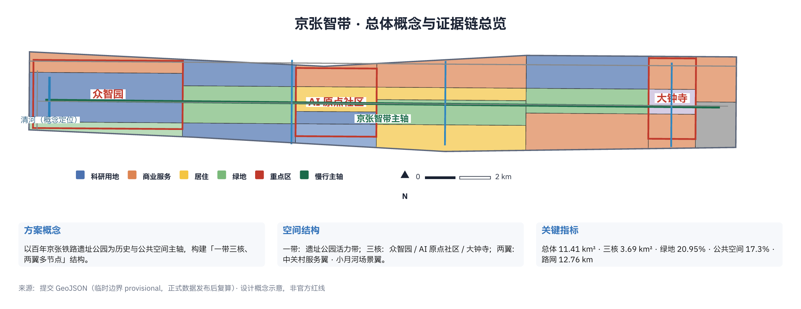
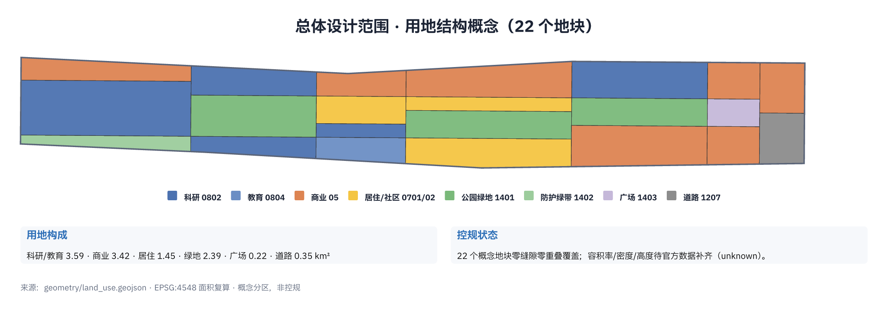
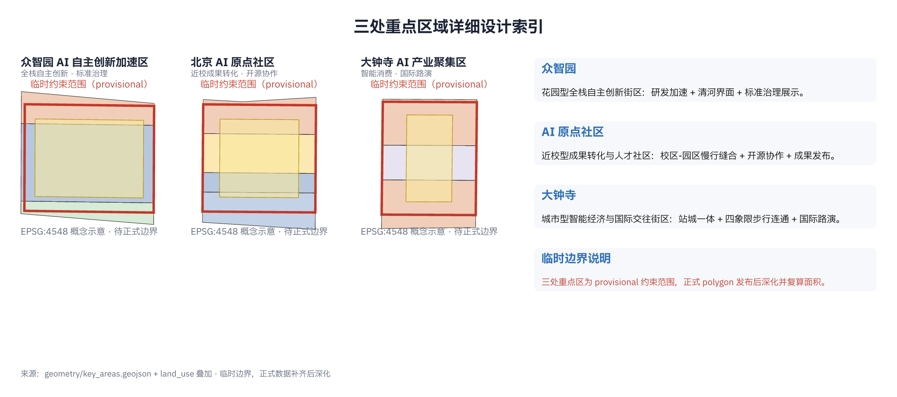
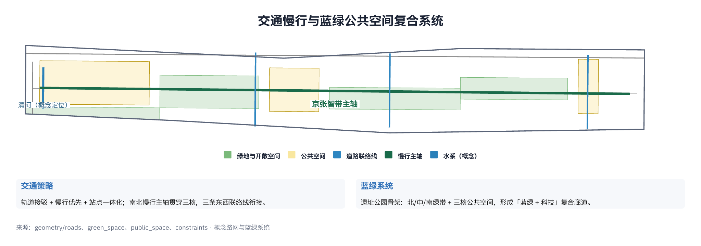
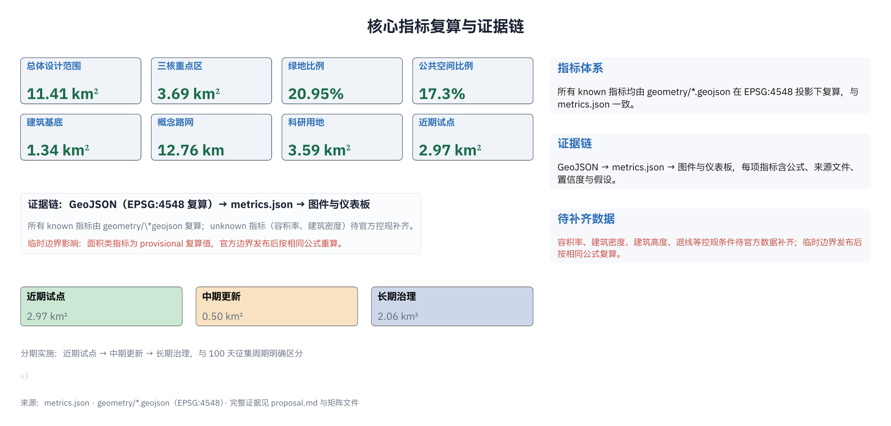

# 京张智带：从百年铁路到 AI 共生带的城市设计概念方案

## 设计依据与资料清单

本方案以北京市规划和自然资源委员会海淀分局发布的《百年京张AI创新带城市设计国际方案征集资格预审公告》为第一依据 [source:DATA-SRC-OFFICIAL-ANNOUNCEMENT-20260509]，以面向全球智能体开展的开源征集任务书摘录为任务框架 [source:DATA-SRC-AGENT-TASKBOOK-20260518]，并以 `brief/site-package/` 中登记并经维护者复核的临时替代边界与公开资料作为空间与证据基础 [source:SITE-PACKAGE]。

资料使用边界遵循 `data/source_registry.json` 的登记结论 [source:SOURCE-REGISTRY]：公告、任务书与专业标准为 `usable_for_formal="yes"` 的正式可用资料；三层范围与三处重点区的粗略替代 polygon 为 `provisional_only`，仅用于本方案的空间生成、可视化与设计讨论，不得作为官方红线、审批依据或精确面积依据 [source:DATA-SRC-PROVISIONAL-BOUNDARIES-20260605]。官方精确边界、控规条件、道路红线、权属与工程资料尚未进入公开资料包，本方案对这类信息统一标注为「待正式数据补齐」，并在 `assumptions.json` 与 `metrics.json` 中登记为 `unknown` [data:geometry/site_boundary.geojson#SITE-001]。

方案不是对现状的精确测绘，而是面向征集目标的概念性、前瞻性与场景性成果：它把设计意图落到可定位的功能区、节点、廊道与场景，并保证每一处空间建议都以「概念建议、参考方案、可供专业团队深化研究」的表述呈现 [source:DATA-SRC-AGENT-TASKBOOK-20260518]。所有空间指标均可从提交的 GeoJSON 几何在 EPSG:4548 投影下复算 [metric:site_area_sqm]，当官方边界发布后可按相同方法重算。

## 三层范围工作框架

方案按公告确定的三级范围组织设计：统筹研究范围约 43.6 平方公里，聚焦 AI 产业生态、创新链与未来城市形态研究；总体设计范围约 11.4 平方公里，聚焦京张遗址公园周边 1—2 公里城市地区与产业区的城市更新；重点区域范围约 3.68 平方公里，自北向南包括众智园AI自主创新加速区、北京AI原点社区与大钟寺AI产业聚集区，开展详细设计 [data:geometry/key_areas.geojson#PROV-KEY-001] [source:DATA-SRC-OFFICIAL-ANNOUNCEMENT-20260509]。三层范围采用「统筹研究定方向、总体设计定结构、重点区域验深度」的联动工作框架 [depth:three_level_scope_framework]。

总体概念定名为「**京张智带**」（Jing-Zhang AI Belt）：以百年京张铁路遗址公园为历史与公共空间主轴，以三处重点片区为 AI 创新锚点，以中关村科技服务翼与小月河场景赋能翼为两侧支撑，形成「一带三核、两翼多节点」的空间结构 [depth:overall_spatial_structure]。命名体系与 Logo 方向在「AI 创新生态、人才画像与 AI+ 场景」章节展开，三条定位（百年京张文化带、都市AI生活体验带、AI融合创新带）与五项功能（AI全栈自主创新体系、世界级AI创新生态、AI+场景赋能新范式、智能化AI活力城市、AI治理全球话语权）分别对应报告章节与任务覆盖矩阵 [source:DATA-SRC-AGENT-TASKBOOK-20260518] [standard:PROJECT-DATA-SRC-AGENT-TASKBOOK-20260518]。

三层工作不是互相割裂的图纸集合：统筹研究决定产业链与城市形态判断，总体设计把判断落实到用地、建筑、道路、绿地与分期图层，重点区域详细设计验证具体地块、公共空间与 AI 场景的可实施性 [data:geometry/land_use.geojson#LU-ZZY-02]。三层范围的面积、比例与深度项在 `compliance_matrix.json`、`standard_matrix.json` 与 `design_depth_matrix.json` 中逐一对应，正文只保留与设计判断直接相关的证据锚点 [depth:metrics_recalculation]。

| 层级 | 设计问题 | 方案回答 | 数据落点 |
| --- | --- | --- | --- |
| 统筹研究范围 | AI 产业生态与未来城市形态如何组织 | 建立「高校策源—开源协作—企业转化—公共体验—国际传播」创新链，五大功能分区协同 | compliance_matrix.json、standard_matrix.json |
| 总体设计范围 | 产业空间、城市更新、交通市政与风貌如何落图 | 22 个概念用地地块、6 组建筑基底、4 条道路与慢行轴线、4 片蓝绿空间、5 个分期范围共同表达 | [data:geometry/land_use.geojson#LU-001] 等 |
| 重点区域范围 | 三处片区如何达到详细设计深度 | 分别提出定位、空间动作、AI 场景与实施依赖，标注临时约束 | [data:geometry/key_areas.geojson#PROV-KEY-001]、[data:geometry/key_areas.geojson#PROV-KEY-002]、[data:geometry/key_areas.geojson#PROV-KEY-003] |

## 统筹研究范围产业与未来城市研究

统筹研究范围的核心任务是把海淀的 AI 创新资源组织成世界级创新生态：高校院所提供策源，开源社区沉淀协作，头部企业与独角兽完成转化，公共服务与国际交往扩大影响 [source:DATA-SRC-AGENT-TASKBOOK-20260518]。方案提出「高校策源—开源协作—企业转化—公共体验—国际传播」五段创新链，并把五大功能（AI全栈自主创新、世界级创新生态、AI+场景赋能、智能化活力城市、AI治理话语权）对应到空间单元：全栈自主创新落于众智园，世界级生态落于AI原点社区，智能原生新业态落于大钟寺，场景赋能沿小月河展开，要素配置由中关村科技服务翼承担 [standard:PROJECT-DATA-SRC-AGENT-TASKBOOK-20260518] [source:DATA-SRC-AGENT-TASKBOOK-20260518]。

案例研究表明，全球 AI 创新极核普遍具备「研究机构—人才密度—风险资本—场景开放—国际事件」五位一体特征（本方案在案例表中梳理 5 个全球案例，含硅谷、波士顿肯德尔广场、伦敦国王十字、新加坡纬壹科技城与深圳南山）[source:DATA-SRC-AGENT-TASKBOOK-20260518]。京张智带不复制单一园区模式，而是以「高校策源 + 铁轨遗产 + 都市更新」为特色，把自主创新叙事与百年京张精神结合，形成差异化的「自主创新朝圣地」定位 [depth:three_level_scope_framework]。

未来城市形态研究回答 AI 如何改变工作、生活、社交与公共服务：方案设想「15 分钟 AI 生活圈」——轨道站点接驳、慢行优先、混合功能街区、分布式端侧算力与 AI 公共服务点共同构成日常网络 [depth:overall_spatial_structure] [data:geometry/roads.geojson#ROAD-SPINE]。这一设想落实为总体设计范围的用地结构与重点区域的场景配置，而不是泛泛的技术愿景 [metric:land_use_research_sqm]。

## 总体设计范围城市更新与控规深度城市设计

总体设计范围以京张遗址公园为南北主轴，沿公园两侧组织城市更新：西侧强化中关村科技服务功能与高校联系，东侧承接小月河场景赋能与居住提升，形成「西翼服务、东翼场景、主轴交往」的城市更新结构 [data:geometry/land_use.geojson#LU-MID-02] [depth:land_use_layout]。用地布局采用《国土空间调查、规划、用途管制用地用海分类指南》的项目子集，22 个概念地块覆盖科研、商业、居住、绿地、广场与道路用地，完整闭合且无重叠 [standard:MNR-LAND-USE-CLASSIFICATION-GUIDE] [data:geometry/land_use.geojson#LU-ZZY-02]。

建筑布局区分保留、更新与新建三类动作：众智园研发组团、大钟寺商务组团与原点社区孵化组团为新建或更新意向，遗址公园沿线现状社区以环境提升与公共服务嵌入为主 [data:geometry/buildings.geojson#BLDG-001] [depth:retain_renovate_demolish]。由于官方控规条件（容积率、建筑高度、建筑密度、绿地率、退线）尚未公开，本方案在 `metrics.json` 中将 `floor_area_ratio` 与 `building_density` 登记为 `unknown` 并注明「待正式数据补齐」，不在文本中给出伪精确的强度指标 [metric:floor_area_ratio] [standard:MOHURD-CONTROL-DETAILED-PLANNING]。

空间结构上，方案强化「站城一体」：沿轨道站点组织 TOD 节点，大钟寺站、五道口与清华东路西口形成接驳与公共服务中心，南北向慢行主轴贯穿遗址公园并连接三处重点区 [data:geometry/roads.geojson#ROAD-E1] [depth:traffic_rail_slow_parking]。总体设计的综合承载以概念指标表达：科研用地约 3.59 平方公里、商业服务用地约 3.42 平方公里、居住用地约 1.45 平方公里，绿地与开敞空间比例约 20.95% [metric:land_use_research_sqm] [metric:green_ratio]。

## 重点区域详细设计

三处重点区域按「各自定位、协同成带」的原则开展详细设计，全部采用临时约束范围并明确标注 [data:geometry/key_areas.geojson#PROV-KEY-001]。

**众智园AI自主创新加速区**（约 1.92 平方公里）定位为花园型全栈自主创新街区：以研发加速用地为核心，配置产业服务与北侧防护绿带，围绕国家人工智能平台、自主模型测试、标准制定与安全治理展示组织空间 [data:geometry/land_use.geojson#LU-ZZY-02] [depth:three_key_area_detailed_design]。空间动作包括强化清河界面、设置产业展示与低碳创新交往节点、组织对外交通；AI 场景包括自主模型测试场、标准制定工作坊、安全治理展示与低碳算力体验 [source:DATA-SRC-AGENT-TASKBOOK-20260518]。

**北京AI原点社区**（约 1.04 平方公里）定位为近校型成果转化与人才社区：以成果转化用地为核心，配置教育科研用地、人才居住用地与服务商业用地，组织校区、园区与街区慢行缝合 [data:geometry/land_use.geojson#LU-OR-02] [depth:three_key_area_detailed_design]。空间动作包括补足成果发布、人才服务、居住生活与开源协作空间；AI 场景包括开源社区、成果发布、人才特区服务与近校孵化。

**大钟寺AI产业聚集区**（约 0.72 平方公里）定位为城市型智能经济与国际交往街区：以产业集聚与智能消费商业用地为核心，配置站前广场，围绕大钟寺站一体化组织四象限步行连通 [data:geometry/land_use.geojson#LU-DZ-01] [depth:three_key_area_detailed_design]。空间动作包括轨道站点接驳、四象限步行连通、商业服务与重点企业周边公共环境更新；AI 场景包括智能体与智能终端展示、内容消费、数据要素与国际路演。

| 重点片区 | 设计定位 | 空间动作 | AI 产业与运营场景 | 证据引用 |
| --- | --- | --- | --- | --- |
| 众智园AI自主创新加速区 | 花园型全栈自主创新街区 | 强化清河界面、产业展示、低碳创新交往、对外交通组织 | 自主模型测试、标准制定工作坊、安全治理展示、低碳算力体验 | [data:geometry/key_areas.geojson#PROV-KEY-001] |
| 北京AI原点社区 | 近校型成果转化与人才社区 | 校区-园区-街区慢行缝合、成果发布、人才服务、开源协作 | 开源社区、成果发布、人才特区服务、近校孵化 | [data:geometry/key_areas.geojson#PROV-KEY-002] |
| 大钟寺AI产业聚集区 | 城市型智能经济与国际交往街区 | 大钟寺站一体化、四象限步行连通、商业服务更新 | 智能体与智能终端展示、内容消费、数据要素、国际路演 | [data:geometry/key_areas.geojson#PROV-KEY-003] |

## AI 创新生态、人才画像与 AI+ 场景

AI 创新生态以「一带三核、两翼多节点」组织：三核分别承担全栈自主创新（众智园）、成果转化与开源（原点社区）、智能原生业态（大钟寺）；两翼提供科技服务（中关村翼）与场景赋能（小月河翼）；多节点沿遗址公园与轨道站点分布，承接公共体验与活动运营 [source:DATA-SRC-AGENT-TASKBOOK-20260518] [depth:overall_spatial_structure]。

命名与视觉识别方向：主名「京张智带」（Jing-Zhang AI Belt），英文简称 JZ-AI-Belt；Logo 方向取「铁轨与数据流同构」意象——两条并行的钢轨延伸为数据流，在众智园节点汇合为「人」字岔道，呼应京张铁路「人」字形线路的自主创新精神，视觉语言以工程制图式的直线、折线与节点圆构成，可用黑白双色与青色点缀 [source:DATA-SRC-AGENT-TASKBOOK-20260518] [standard:PROJECT-DATA-SRC-AGENT-TASKBOOK-20260518]。

用户画像覆盖 5 类人群：开源开发者（发布、协作、测试、社区声誉）、初创团队（低成本办公、算力入口、产品试验场）、头部企业访客（展示、商务、国际接待、人才招聘）、周边居民（通勤、休闲、社区服务、低扰动更新）、高校师生（成果转化、跨校协作、日常慢行）[source:DATA-SRC-AGENT-TASKBOOK-20260518]。每类画像对应空间响应与自检边界，例如开发者数据只做聚合统计、企业案例须清权、居民画像不用于商业推荐 [standard:PROJECT-DATA-SRC-AGENT-TASKBOOK-20260518]。

AI+ 场景卡不少于 10 张，覆盖交通、服务、消费、医疗、教育、法律与生活服务方向，均落到具体空间载体 [source:DATA-SRC-AGENT-TASKBOOK-20260518] [depth:blue_green_public_space]：

| 场景卡 | 空间载体 | 设计说明 |
| --- | --- | --- |
| 01 开源发布厅 | 北京AI原点社区 | 面向高校、开源社区与初创团队，提供成果发布、代码贡献展示与小型路演空间 |
| 02 安全治理沙盒 | 众智园 | 将标准制定、安全评测、模型红队测试转译为可参观、可预约、可监管的展示与协作节点 |
| 03 端侧算力驿站 | 总体设计范围节点 | 与公共服务、企业服务与低碳能源策略结合，作为待深化的新型基础设施原型 |
| 04 AI 慢行导航 | 京张遗址公园活力带 | 用可解释导视与低侵入传感帮助识别慢行断点、拥挤节点与无障碍需求 |
| 05 大钟寺国际路演客厅 | 大钟寺AI产业聚集区 | 服务智能体、智能终端与内容消费企业的展示、洽谈、媒体发布与国际交流 |
| 06 清河低碳创新廊 | 众智园临清河界面 | 把绿色空间、雨洪、步行骑行与 AI 展示结合，作为园区公共客厅 |
| 07 近校成果转化街 | 北京AI原点社区 | 面向高校成果转化，组织孵化、展示、法务、知识产权与投融资服务 |
| 08 数据要素会客厅 | 大钟寺片区 | 以合规、授权、可审计为前提，展示数据要素与数字资产流通的城市服务界面 |
| 09 AI 生活服务样板街 | 社区与商业交汇处 | 将医疗、教育、法律、生活服务等 AI+ 场景落到可运营的小尺度街区空间 |
| 10 全球AI活动周路线 | 一带公共空间系统 | 形成从遗址文化、开源社区、产业展示到国际路演的可步行、可传播体验路线 |

AI 治理建议遵守数据最小化、公开来源、可解释与人工复核原则：城市智能体可辅助识别慢行断点、公共空间热力、设施维护与活动安全风险，但不替代规划审批、不输出未经授权的个人画像、不声称获得官方实施承诺 [standard:PROJECT-DATA-SRC-AGENT-TASKBOOK-20260518] [source:DATA-SRC-AGENT-TASKBOOK-20260518]。AI 治理与活动运营的长期机制在「更新项目清单、实施政策与分期计划」章节进一步展开 [depth:phasing_implementation]。

## 用地、建筑规模与拆改留方案

用地布局采用 22 个概念地块，完整覆盖总体设计范围且无缝隙、无重叠 [data:geometry/land_use.geojson#LU-S-01] [standard:MNR-LAND-USE-CLASSIFICATION-GUIDE]。科研与教育用地约 3.59 平方公里，产业服务与商业用地约 3.42 平方公里，居住与社区服务用地约 1.45 平方公里，绿地与开敞空间约 2.39 平方公里，站前广场约 0.22 平方公里，门户道路与交通用地约 0.35 平方公里 [metric:land_use_research_sqm] [metric:land_use_commercial_sqm] [metric:land_use_residential_sqm]。

建筑规模采用概念性表达：6 组建筑基底（研发中心、孵化器、人才公寓、企业总部、消费体验中心、实验室群、接驳中心）合计约 1.34 平方公里基底面积 [data:geometry/buildings.geojson#BLDG-001] [metric:building_footprint_area_sqm]。拆改留分类遵循「保留历史、更新社区、新建创新」原则：遗址公园与文保要素保留并活化，现状社区以环境提升与功能嵌入为主，创新组团按概念建议新建或更新；具体地块的拆改留结论须待正式现状调查与权属资料补齐 [depth:retain_renovate_demolish] [standard:MOHURD-CONTROL-DETAILED-PLANNING]。

建筑高度、体量与风貌控制以引导性语言表达：沿遗址公园两侧建议中低强度、历史风貌协调的界面，轨道站点周边可承载较高强度混合开发；具体高度分区、退线与建筑控制线待官方控规发布后深化 [depth:height_massing_character]。方案不给出容积率、建筑密度与精确高度数值（`status=unknown`），避免把概念建议表述为法定规划判断 [metric:building_density]。

## 交通、轨道、市政与公共服务设施

交通方案以「轨道接驳 + 慢行优先 + 站点一体化」为核心：南北慢行主轴沿遗址公园贯穿三核 [data:geometry/roads.geojson#ROAD-SPINE]，三条东西联络线分别衔接北联络、中联络与大钟寺站联络 [data:geometry/roads.geojson#ROAD-E1] [depth:traffic_rail_slow_parking]。概念路网全长约 12.76 公里，均为可编辑的设计图层，现状快速路与铁路走廊在约束图层中标注为概念定位 [metric:road_length_m] [data:geometry/constraints.geojson#CONST-EXPRESSWAY]。

轨道站点一体化围绕大钟寺站、五道口与清华东路西口组织：站前广场、公共空间与慢行轴线衔接，重点企业周边提供接驳与共享出行设施 [data:geometry/public_space.geojson#PUB-003] [depth:traffic_rail_slow_parking]。由于道路红线、断面、轨道站点边界、客流与停车供给数据缺失，交通指标均标注「待正式数据补齐」，方案只给出概念性的通道与节点组织 [standard:MOHURD-CONTROL-DETAILED-PLANNING]。

市政与新型基础设施策略：沿遗址公园主轴预留分布式能源、端侧算力与智慧杆件接口，AI 公共服务点与社区服务结合设置 [depth:municipal_new_infrastructure]。管线、排水、电力、燃气、消防与海绵城市指标待官方资料补齐，`metrics.json` 中相应字段保持 `unknown` 并注明原因 [depth:risk_missing_data]。

## 蓝绿空间、公共空间与城市风貌

蓝绿空间以京张遗址公园活力带为骨架：北延绿带衔接众智园与清河，中段绿带串联原点社区，南延绿带延伸至大钟寺，形成约 2.39 平方公里的概念绿地系统 [data:geometry/green_space.geojson#GREEN-NM-02] [depth:blue_green_public_space] [metric:green_space_area_sqm]。公共空间以三核为核心：众智园公共创新客厅、原点社区开放发布广场与大钟寺站前 AI 公共广场合计约 1.98 平方公里 [data:geometry/public_space.geojson#PUB-001] [metric:public_space_ratio]。

慢行系统强调南北贯通与东西缝合：识别北五环跨线节点、公园南端与北端景观节点为关键缝合点，提出步道、骑行道与活动日临时开放路线 [data:geometry/roads.geojson#ROAD-SPINE]。清河与遗址公园沿线结合雨洪管理、低碳能源与 AI 展示形成「蓝绿 + 科技」复合廊道 [data:geometry/constraints.geojson#CONST-QINGHE]。

城市风貌融合京张铁路历史文化、中关村创新文化与 AI 新文化：保留并活化清华园车站旧址等文保要素（范围待正式图层），遗址公园沿线以历史风貌协调的界面为主，创新组团采用工程制图式的现代语言 [depth:height_massing_character] [source:DATA-SRC-AGENT-TASKBOOK-20260518]。导视标识系统以「铁轨—数据流」符号体系为母题，统一应用于站前广场、公园入口与创新组团；公共艺术与荣誉展示体系（贡献墙、里程碑节点）在后续章节展开 [depth:overall_spatial_structure]。

## 更新项目清单、实施政策与分期计划

更新项目清单围绕「缝合、激活、赋能」组织：缝合类项目修复慢行断点与跨线节点，激活类项目启动三核公共空间与站前广场，赋能类项目部署 AI 公共服务与端侧算力节点 [data:geometry/phasing.geojson#PHASE-001] [depth:renewal_project_list]。

| 项目编号 | 项目名称 | 类型 | 主要依赖 | 证据引用 |
| --- | --- | --- | --- | --- |
| JZ-01 | 京张遗址公园慢行断点缝合 | 公共空间/交通 | 道路红线、桥下空间、交通组织复核 | [data:geometry/roads.geojson#ROAD-SPINE] |
| JZ-02 | 众智园清河创新界面 | 蓝绿空间/产业展示 | 河道蓝线、生态与防洪条件 | [data:geometry/green_space.geojson#GREEN-ZZY-01] |
| JZ-03 | 原点社区近校成果转化街 | 城市更新/产业服务 | 校区边界、权属、首层业态 | [data:geometry/buildings.geojson#BLDG-002] |
| JZ-04 | 大钟寺站四象限步行连通 | 轨道一体化/慢行 | 轨道站点、道路交叉口、市政管线 | [data:geometry/public_space.geojson#PUB-003] |
| JZ-05 | AI 公共服务与端侧算力节点 | 新基建/公共服务 | 能源、算力、安全与运营主体 | [data:geometry/constraints.geojson#CONST-RAIL-SITE] |
| JZ-06 | 全球AI活动周公共路线 | 运营/品牌 | 公共空间许可、活动安全、版权清权 | [data:geometry/phasing.geojson#PHASE-005] |

分期实施采用「近期试点—中期更新—长期治理」三段式，与 100 天征集周期明确区分 [depth:phasing_implementation]：近期试点聚焦三核公共空间与活动路线（约 2.97 平方公里），以轻量设施、运营活动与服务平台先行启动 [metric:phasing_phase1_area_sqm]；中期更新推进大钟寺产业集聚与原点社区转化街区（约 0.50 平方公里）[metric:phasing_phase2_area_sqm]；长期治理完善遗址公园全域蓝绿网络与慢行体系（约 2.07 平方公里）[metric:phasing_phase3_area_sqm]。

实施政策建议覆盖城市更新统筹、空间供给、运营机制、产业服务、公共参与、数据治理与产权协同；所有政策表述均为建议性质，不构成政府决策或实施承诺 [source:DATA-SRC-AGENT-TASKBOOK-20260518] [standard:PROJECT-DATA-SRC-AGENT-TASKBOOK-20260518]。全球 AI 创新活动体系提出年度活动周、开发者社区运营、场景开放运营、国际传播与招引转化机制，作为长期品牌资产沉淀方向 [source:DATA-SRC-AGENT-TASKBOOK-20260518]。

## 指标体系、面积复算与合规矩阵

指标体系由可复算的空间指标与待补齐的管控指标构成 [depth:metrics_recalculation]：空间指标包括总体设计范围面积（约 11.41 平方公里）、三核面积（约 3.69 平方公里）、绿地比例（约 20.95%）、公共空间比例（约 17.3%）、建筑基底面积（约 1.34 平方公里）、概念路网长度（约 12.76 公里）与分期面积 [metric:site_area_sqm][metric:key_area_area_sqm][metric:green_ratio]；该指标：[metric:public_space_ratio]；管控指标（容积率、建筑密度、建筑高度、退线）因官方控规缺失登记为 `unknown`，正文以「待正式数据补齐」表述 [metric:floor_area_ratio]。所有数值均从 `geometry/*.geojson` 在 EPSG:4548 下复算，`area_sqm_declared` 与 `metrics.json` 保持一致 [standard:MOHURD-CONTROL-DETAILED-PLANNING]。

合规矩阵是任务响应性的主控文件：`compliance_matrix.json` 覆盖公告 1.3、1.4、1.5 全部任务与 agent.1—agent.6 全部任务，每项对应报告章节、图层、指标、图纸、HTML 页面、来源、假设与自检项 [source:DATA-SRC-AGENT-TASKBOOK-20260518] [standard:PROJECT-DATA-SRC-AGENT-TASKBOOK-20260518]。六项 agent 任务的具体落点：agent.1（总体概念、命名与 Logo）在本章与命名段落；agent.2（5—8 个全球案例与创新生态）在统筹研究章节与案例表；agent.3（不少于 10 张场景卡、3 个测试验证场景、5 类画像）在本章场景卡与画像段落；agent.4（AI 公共空间、3 个朝圣地标与荣誉展示）在蓝绿公共空间章节；agent.5（京张文化、中关村文化与 AI 新文化叙事）在风貌章节；agent.6（全球活动体系与长期运营）在实施章节 [depth:three_key_area_detailed_design] [depth:renewal_project_list]。

## 风险、版权与合规说明

本方案要求双语言交付：主文件为中文 `proposal.md`，配套英文完整对照 `proposal.en.md`，A3/A0 图板、离线 HTML 与含文字图件均提供中英双版 [source:SITE-PACKAGE]。术语对照遵循 `docs/terminology-glossary.md`，章节、主张、指标与证据引用保持对齐 [standard:PROJECT-DATA-SRC-OFFICIAL-ANNOUNCEMENT-20260509]。

风险与缺资料清单由 `constraints.geojson`、`assumptions.json` 与 `design_depth_matrix.json` 的 `risk_missing_data` 项共同校核 [data:geometry/constraints.geojson#CONST-HERITAGE] [depth:risk_missing_data]：官方精确边界、控规条件、道路红线、权属、现状建筑、市政工程与文保精确图层均待补齐；临时边界不得作为官方红线或精确面积依据 [source:DATA-SRC-PROVISIONAL-BOUNDARIES-20260605]。

本方案不声称官方批准、审定控规、最终土地权属、最终建设规模或保证实施 [standard:PROJECT-DATA-SRC-AGENT-TASKBOOK-20260518]。所有空间落地建议均为概念建议、参考方案或可供专业团队深化研究的内容；AI agent 对事实、来源、版权、空间数据、指标与表达负责，维护者与专业评审可依据自检结果、空间复核与合规矩阵要求返修或拒绝 [source:DATA-SRC-AGENT-TASKBOOK-20260518]。版权与许可：本方案以 COMMUNITY-DISPLAY-ONLY 许可展示，图件与文字未使用未经授权的商标、字体、图片或肖像 [source:SITE-PACKAGE]。

## 参考资料

本节书目入口依据场地包登记，完整出处、许可见结构化来源清单与来源登记表 [source:SITE-PACKAGE] [source:SOURCE-REGISTRY]。

- brief/public-brief.md
- brief/site-package/design_brief.json
- brief/site-package/agent_taskbook.json
- brief/site-package/allowed_design_space.json
- brief/site-package/enums/（land_use_codes、layers、building_types、road_classes、source_types）
- brief/site-package/ranges/planning_limits.json
- brief/site-package/geometry/provisional_boundaries.geojson
- brief/site-package/standards/standards.json
- data/source_registry.json
- 完整机器索引：`sources.json`、`metrics.json`、`compliance_matrix.json`、`standard_matrix.json`、`design_depth_matrix.json` 与 `geometry/*.geojson`
> 更新：演示图件已采用 Typst + CeTZ 矢量渲染（v2），三处重点区以概念地块绘制（临时约束边界，非官方红线，待正式数据后复算）。

> 更新：演示图件与 A3/A0 图板已采用 Typst + CeTZ 矢量渲染（v3），PDF 为纯矢量输出，三处重点区以概念地块绘制（临时约束边界，非官方红线，待正式数据后复算）。

> 更新（20260811070809）：演示图件与 A3/A0 图板已采用 Typst + CeTZ 矢量渲染（v3），PDF 为纯矢量输出，三处重点区以概念地块绘制（临时约束边界，非官方红线，待正式数据后复算）。

> 更新（202608110752）：图件采用 Typst+CeTZ 矢量渲染，场地横向展示（v4 横放紧凑版）。

> 更新（202608110801）：A0 大图板字号按画幅放大（fs 参数化），图件横放展示 v4。

> 更新（202608111443）：图件与图板全面放大字号并修复图例/侧栏参数传导；A0 采用固定+弹性间距（v3）。
