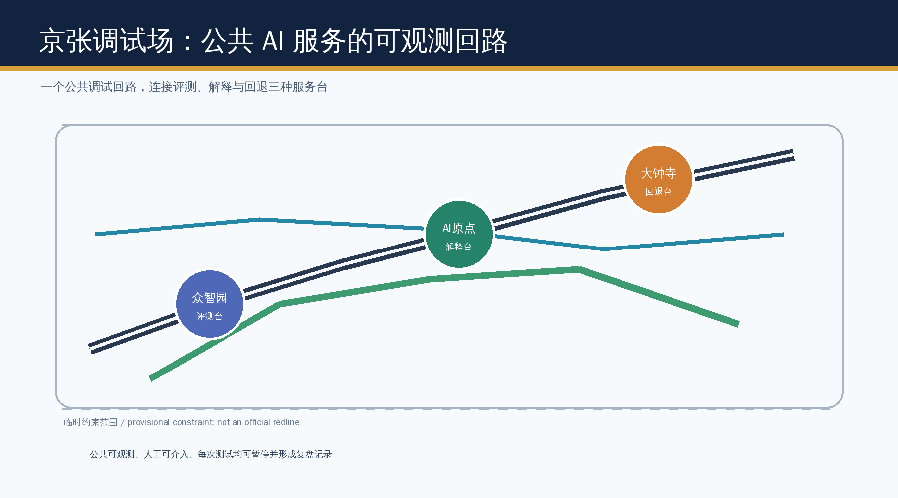
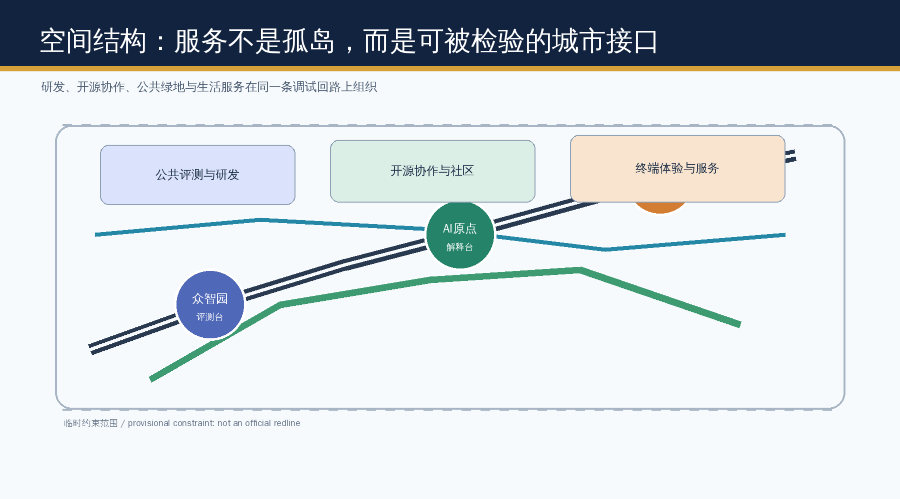
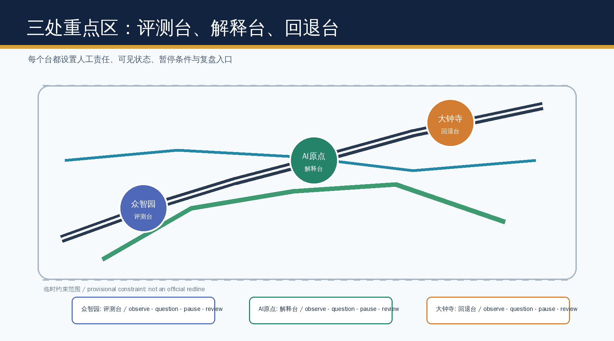
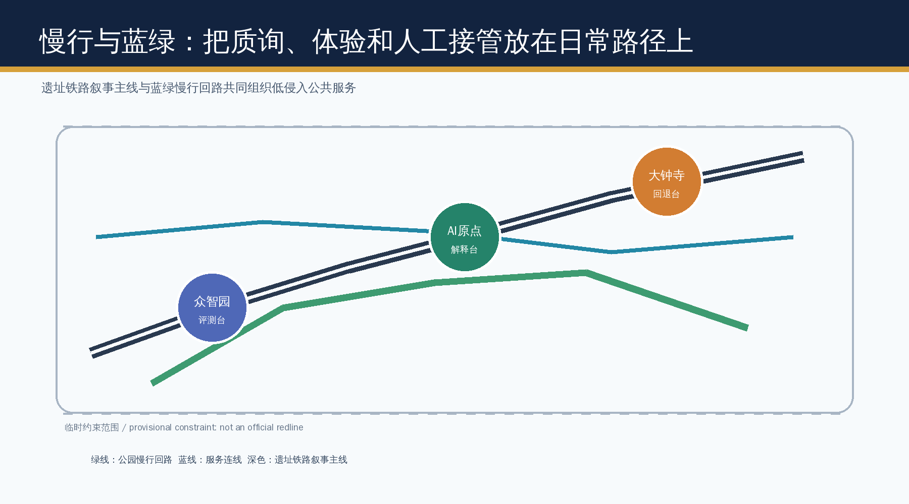
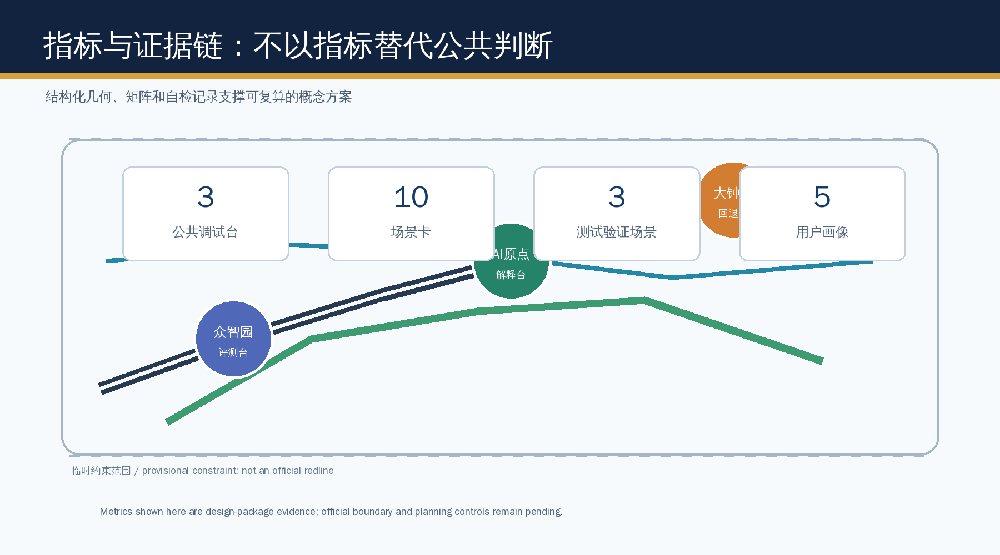

# JINGZHANG DEBUGGROUND

A complete English counterpart to the Chinese primary proposal. It keeps the same evidence, scope, spatial propositions, risk boundary, and conceptual status.

## Submission Information

The Centennial Jing-Zhang AI Innovation Belt Urban Design Open Call is led by Haidian. It opened on 7 August 2026, Beijing time; submissions close on 31 August and implementation begins in September.

- GitHub username: OT-527-nu
- Proposal path: `submissions/OT-527-nu/jingzhang-debugground/`
- Proposal title: JINGZHANG DEBUGGROUND / Jing-Zhang Debugground
- Submission level: formal

## Design Basis and Source List

This proposal uses the official call, the cleared agent taskbook, the public source registry, and the maintained provisional geometry. The geometry is a provisional constraint for package checks, intake review, and design discussion only, never an official redline or a statutory control. It does not establish professional scoring, formal acceptance, or implementation; all boundary-sensitive evidence must be recomputed when official polygons arrive. [source:OFFICIAL-ANNOUNCEMENT] [source:AGENT-TASKBOOK] [source:SOURCE-REGISTRY]

## Three-Level Scope Framework

The 43.6 km2 research scope frames ecosystem collaboration, the 11.4 km2 overall-design scope organizes renewal and public-service infrastructure, and the three key areas test detailed spatial prototypes. Every boundary-sensitive layer must be recalculated when official polygons arrive. [standard:PROJECT-OFFICIAL-ANNOUNCEMENT] [data:geometry/site_boundary.geojson#SITE-001] [metric:site_area_sqm]

## Industry and Future-City Research

JINGZHANG DEBUGGROUND treats the belt as a civic debugging environment rather than a technology showroom: services must make their data boundary, human owner, pause condition, and review record visible. It coordinates the three positioning statements and five functions through a public loop of observation, questioning, pause, and review. [source:AGENT-TASKBOOK] [standard:MOHURD-URBAN-DESIGN-MEASURES]

## Overall Urban Renewal and Regulatory-Plan Design

The spatial concept is one public debug loop, three service desks, and two support wings. Land-use, building, road, green-space, public-space, and phasing files remain design evidence, not approval controls; FAR, height, ownership, utilities, and redlines remain pending official information. [data:geometry/land_use.geojson#LU-001] [standard:MOHURD-CONTROL-DETAILED-PLANNING]

## Detailed Design for the Three Key Areas

Zhongzhiyuan hosts a model-evaluation desk, Beijing AI Origin hosts an explanation and developer desk, and Dazhongsi hosts a rollback-oriented terminal and service desk. Each is a conceptual prototype with public-space, walking, governance, and implementation dependencies to be professionally deepened. [data:geometry/key_areas.geojson#PROV-KEY-001] [metric:key_area_count]

## AI Ecosystem, Personas, and Scenarios

Ten scenario cards serve developers, start-ups, residents, students, visitors, and civic workers. Three controlled validation scenarios are the pedestrian-diagnosis desk, the service-accessibility desk, and the public-space maintenance desk; each requires opt-in or aggregated data, human review, visible appeal, and a stop condition. [source:AGENT-TASKBOOK] [standard:GENERATIVE-AI-INTERIM-MEASURES]

## Land Use, Building Scale, and Retain-Renovate Logic

The proposal allocates conceptual research, public-open-space, service, and community-support layers. Building footprints are retrofit/new-build study envelopes, not ownership or demolition decisions; all quantitative controls await the official regulatory package. [data:geometry/buildings.geojson#BLDG-001] [depth:land_use_layout]

## Mobility, Rail, Municipal, and Public Services

The heritage rail narrative, blue-green walk loop, and station-facing service connections create a low-speed, accessible public sequence. No road redline, tunnel, utility capacity, or engineering feasibility claim is made. [data:geometry/roads.geojson#ROAD-001] [depth:traffic_and_municipal_coordination]

## Blue-Green Public Space and Character

Three pilgrimage landmarks are the Evaluation Signal, the Explanation Archive, and the Rollback Lantern. They expose the civic process of an AI service rather than celebrate a vendor or promise construction. [data:geometry/green_space.geojson#GREEN-001] [standard:MOHURD-URBAN-DESIGN-MEASURES]

## Renewal Projects, Policies, and Phasing

A first phase tests the public debug loop; later phases require confirmed controls, operations partners, accessibility review, and public feedback. Annual developer clinics, scenario open days, and a public review ledger form a long-term operation concept, not a confirmed government program. [data:geometry/phasing.geojson#PHASE-001] [depth:implementation_phasing]

## Metrics, Area Recalculation, and Compliance

Known spatial metrics are derived from submitted geometry in EPSG:4548; control metrics are explicitly unknown rather than invented. The compliance matrix covers announcement sections 1.3-1.5 and agent.1-agent.6. [metric:green_ratio] [metric:public_space_ratio] [depth:metrics_recalculation]

## Professional Standards and Design Depth

The standard and design-depth matrices connect each required item to source records, drawings, layers, metrics, assumptions, and self-checks. This package supports professional review but does not substitute for statutory procedures. [standard:MNR-LAND-USE-CLASSIFICATION-GUIDE] [depth:professional_standard_response]

## Risk, Copyright, and Compliance

All visuals are original explanatory diagrams generated for this package; no third-party logos, images, tiles, or tracking assets are used. Provisional geometry, missing controls, data governance, accessibility, and human review remain explicit risks. [data:geometry/constraints.geojson#CONSTRAINTS] [depth:risk_missing_data]

## Scenario Cards

| Card | Place | Public safeguard |
| --- | --- | --- |
| 01 Slow-mobility diagnosis | Heritage park | Aggregated observation plus human confirmation |
| 02 Accessibility service desk | AI Origin | Human fallback and appeal channel |
| 03 Model evaluation sandbox | Zhongzhiyuan | Time-bounded, logged, pausable test |
| 04 Developer release clinic | AI Origin | Open-source attribution and review |
| 05 Public-space maintenance desk | Park loop | No individual tracking |
| 06 Low-carbon compute explainer | Zhongzhiyuan | No capacity claim without engineering data |
| 07 Terminal service trial | Dazhongsi | Clear consent and rollback |
| 08 Community service navigator | Neighborhood interface | Human escalation |
| 09 Railway memory interpreter | Heritage route | Curated public materials only |
| 10 Annual civic review route | All three desks | Published feedback record |

