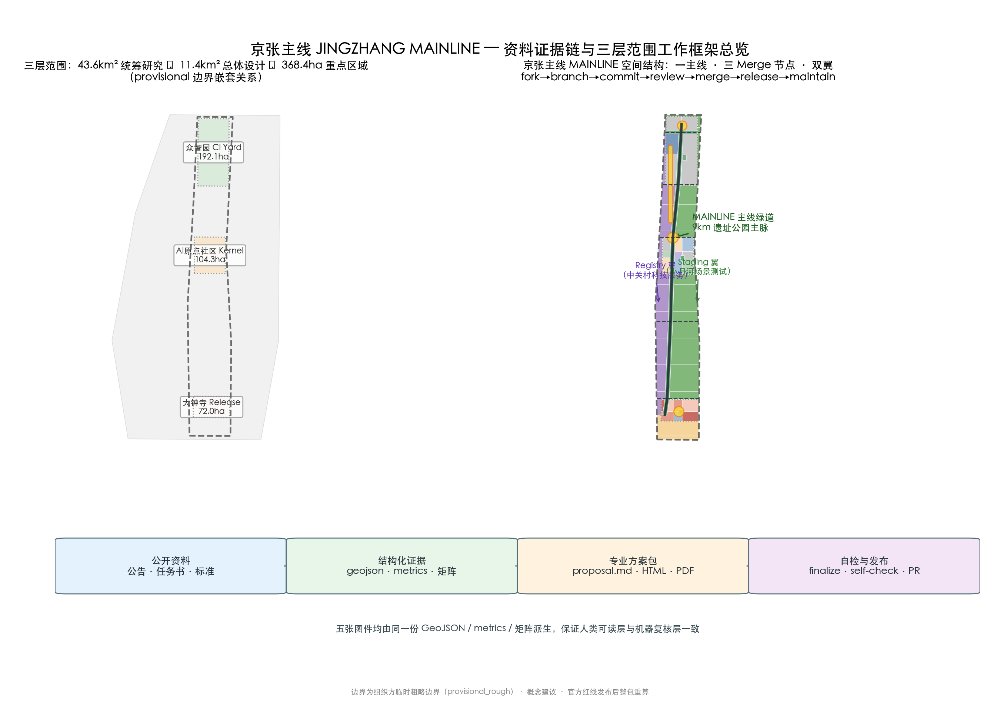
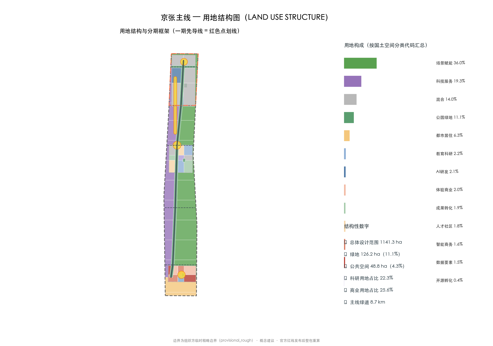
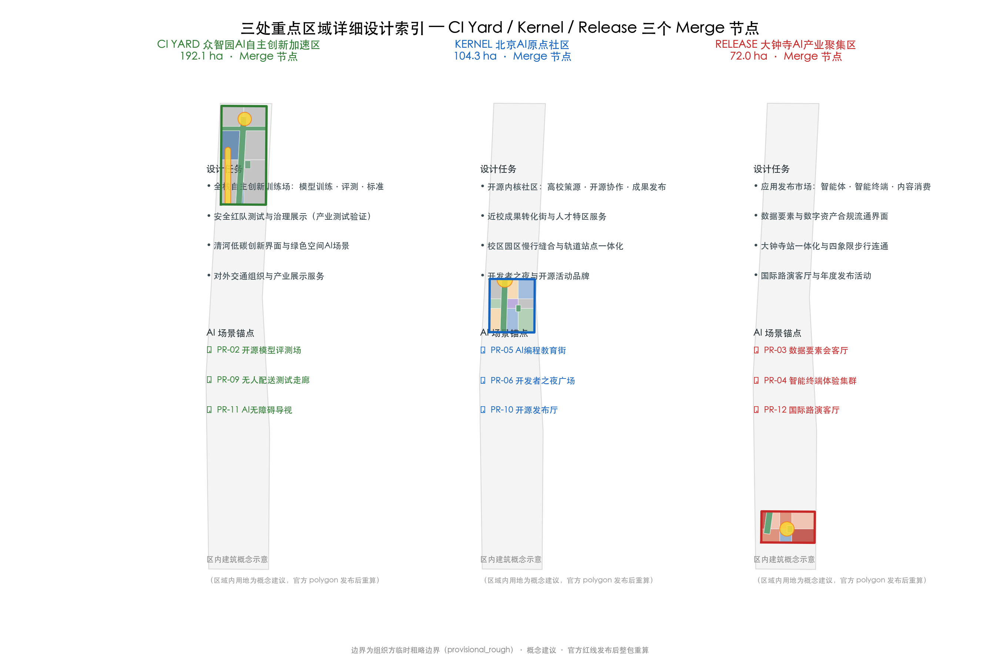
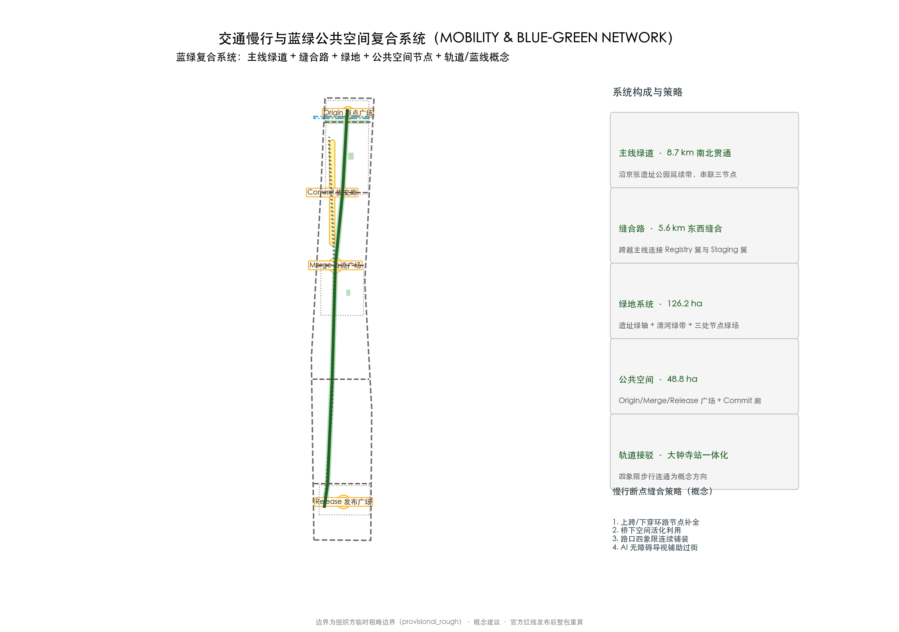
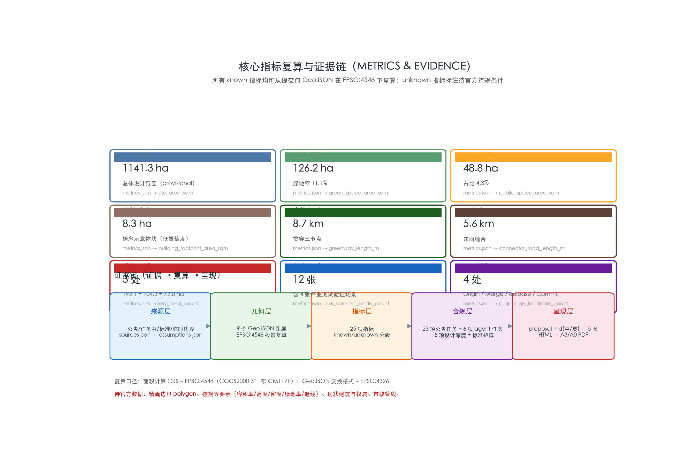

<!-- JINGZHANG MAINLINE — conceptual proposal. All spatial conclusions are based on the organizer's provisional rough boundary and do not replace statutory planning or constitute government decisions. -->

# JINGZHANG MAINLINE — Urban Renewal, Delivered as Pull Requests for the First Time

## First Screen: One Memorable Proposition

**"Merge must be reversible."** JINGZHANG MAINLINE treats urban renewal as a continuously evolving city mainline: every time AI merges in, it must first prove ordinary no-AI service works (baseline), pass an unplug test (exit), and leave a public dividend usable without models, accounts, or network after exit (bequest). The open-source collaboration semantics answer "how to make renewal public, reversible, and auditable"; the verifiable public semantics answer "what remains of the city after AI departs, and who is responsible".

> **Honest enum for this project: not authorized · not field-run / 未获授权 · 未现场运行.** All spatial proposals and scenarios are conceptual suggestions or signable mechanisms, not confirmed government arrangements; live performance remains unknown.

## Reviewer Question Table (first screen)

| Review dimension | One-sentence answer (memorable judgment) | Evidence anchor |
| --- | --- | --- |
| Taskbook alignment | Directly addresses "Centennial Jing-Zhang + Haidian + AI innovation belt + urban governance"; three positionings / five functions / three areas two wings mapped item by item | three-level scope table + compliance_matrix |
| Originality | Unique "urban renewal as Pull Requests" metaphor + "Merge must be reversible" double-track proposition | executive summary + mainline-pipeline.json |
| AI≈planning innovation | Each AI scenario has a four-part contract (no-AI baseline / AI gain / immediate exit / exit dividend), backed by governance roles RACI | mainline-contracts.json + mainline-raci.json |
| Implementability | Project G0–G7 × scenario C0–C7 dual gates + 12 scenarios × 5-branch synthetic tabletop + 8-state machine | mainline-gates.json + mainline-tabletop.json + mainline-state-machine.json |
| Public interest | Offline public-dividend safety net—walk, rest, and ask without AI; accessibility and vulnerable groups prioritized | public-interest chapter [source:AGENT-TASKBOOK] |
| Risk & compliance | Hard-stop conditions (no-AI path / no human / cannot unplug / sensitive-data overreach / dividend without owner) ; live performance stays unknown | risk.json + compliance chapter |
| Expression completeness | Bilingual proposal + 5 figures + 2 HTML + 6 machine evidence assets, all recheckable | submission package + visual + machine assets |

> Note: the table is for quick orientation; per-dimension evidence is detailed in each chapter and `compliance_matrix.json`. All conceptual suggestions are consistently marked "not authorized · not field-run"; nothing is fabricated as approved or committed to implementation.

## Executive Summary and the Double-Track Verification Proposition

The Jing-Zhang Railway, built 1905–1909, was the first trunk railway independently designed and constructed by Chinese engineers. v0.4 re-reads this century-old mainline as **one city mainline with two operating semantics**: the **open-source collaboration semantics**—urban renewal flows like commit, review, and merge: public, traceable, and reversible; and the **verifiable public semantics**—before any AI scenario merges into the mainline, it must first prove that ordinary no-AI service still works, pass an unplug test, and leave the public a dividend that remains usable after the technology departs.

One-line proposition: **"Merge must be reversible."** Every time we merge AI into the city, we must first answer: who can still do what without AI; what AI adds or removes; who can unplug; what remains after unplug; and who maintains it. Accordingly, v0.4 introduces the **five-stage mainline acceptance chain**: `COMMIT proposal → MERGE review → LIVE gray rollout → BLACKOUT unplug drill → LEGACY dividend archiving`. No scenario enters gray rollout without its no-AI baseline; nothing upgrades without passing an unplug drill; nothing claims success if no usable dividend remains after exit.

▶ Positioning note: this strengthens, not replaces, the open-source metaphor. The open-source metaphor answers "how to make urban renewal public, reversible, and auditable"; double-track verification answers what reviewers care most about—"what remains of the city after AI departs, and who is responsible". Together they make the mainline a long-term evolvable, genuinely implementable city mainline.

v0.5 moves the double-track verification from "conceptual statements" into a set of **machine-recheckable evidence assets**: the 12-scenario four-part contracts (`mainline-contracts.json`), the five-stage mainline acceptance chain (`mainline-pipeline.json`), the project/scenario dual gates (`mainline-gates.json`), the 8-state governance state machine (`mainline-state-machine.json`), the governance roles/RACI (`mainline-raci.json`), the synthetic tabletop (`mainline-tabletop.json`), and the hard-stop conditions (`risk.json`)—each directly readable, countable, and reviewable by professional and operations teams, forming an auditable evidence surface for both "implementability" and "expression completeness" [metric:machine_evidence_asset_count] [metric:machine_contract_count].

## Design Basis and Source Inventory

This proposal is governed by the Official Prequalification Announcement for the Centennial Jing-Zhang AI Innovation Belt International Urban Design Solicitation issued by the Haidian Branch of the Beijing Municipal Commission of Planning and Natural Resources, by the Agent Open-Call Taskbook Excerpt, and by the machine-readable site package in `brief/site-package/` (design brief, allowed design space, enums, ranges, schemas, and the provisional boundary) [source:OFFICIAL-ANNOUNCEMENT] [source:AGENT-TASKBOOK] [source:SITE-PACKAGE]. Every source, its permitted use, and its limitations are registered in `sources.json`; the announcement and taskbook are formal-ready, while the provisional boundary may be used only for generation, display, and intake self-checks [source:SOURCE-REGISTRY] [source:BOUNDARY-SOURCE].

Professional standards applied: the Urban Design Administrative Measures for urban character and public-space coordination, the Measures for Preparing and Approving Regulatory Detailed Plans for control-planning depth, the Land Use Classification Guide for land-use coding, and the Interim Measures for Generative AI Services and the Barrier-Free Environment Law for AI-scenario data and accessibility constraints [standard:MOHURD-URBAN-DESIGN-MEASURES] [standard:MOHURD-CONTROL-DETAILED-PLANNING] [standard:MNR-LAND-USE-CLASSIFICATION-GUIDE]. Full coverage is recorded in `standard_matrix.json` and `design_depth_matrix.json`.

**Boundary and data status**: as of this version, the organizer has not published exact official polygons for the three scope levels and three key areas; the repository provides `provisional_boundaries.geojson` as a temporary substitute. This package's `geometry/site_boundary.geojson` (SITE-001, 1141.3 ha) and `geometry/key_areas.geojson` are labeled `provisional_constraint`, `official_boundary=false`, `boundary_precision=provisional_rough` [data:geometry/site_boundary.geojson#SITE-001] [metric:site_area_sqm]. They may be used only for conceptual generation, display, and discussion—not as an official redline, approval basis, or precise-area basis. When official polygons arrive, all layers and metrics must be recalculated consistently. Regulatory-control elements (FAR, height, density, green ratio, setbacks) and road redlines are absent from public materials; the text uses "pending official regulatory confirmation" rather than fabricated values [metric:floor_area_ratio].

## Three-Level Scope Framework

The proposal follows the announcement's three levels: the **coordinated research area** (43.6 km²) answers ecosystem and future-city questions—overall concept, naming system, three-areas-two-wings loop, and ecosystem map; the **overall design area** (11.4 km²) answers renewal and control-planning-depth questions—land-use structure, spatial skeleton, transport/municipal support, and phasing; the **key detailed design area** (368.4 ha) delivers detailed designs for the three key areas at comprehensive-implementation-plan depth [standard:PROJECT-OFFICIAL-ANNOUNCEMENT] [depth:three_level_scope_framework].

| Level | Design question | Proposal answer | Data anchor |
| --- | --- | --- | --- |
| Research 43.6 km² | Ecosystem and future city | MAINLINE naming, three-areas-two-wings loop, open-source innovation cycle | compliance_matrix.json, standard_matrix.json |
| Overall design 11.4 km² | Renewal at regulatory depth | One mainline–three nodes–two wings skeleton, land use, phasing | [data:geometry/land_use.geojson#LU-K001], [data:geometry/phasing.geojson#PHASE-001] |
| Key areas 368.4 ha | Detailed design depth | CI Yard / Kernel / Release node proposals | [data:geometry/key_areas.geojson#PROV-KEY-001] et al. |

The three levels are not separate drawing sets; they implement one "mainline logic" progressively: the research level sets ecosystem and mechanism, the design level sets skeleton and projects, and the key areas verify block-scale feasibility [depth:overall_spatial_structure].

## Coordinated Research Area: Industry and Future-City Study

### Overall Concept and Naming System

**Concept**: JINGZHANG MAINLINE. In 1905–1909, Zhan Tianyou led the construction of the Jing-Zhang Railway—the first trunk railway independently designed and built by Chinese engineers: the first "autonomous mainline merge" in Chinese engineering history. This proposal re-reads the century-old trunk line as a continuously evolving **city mainline**: every spatial renewal and AI scenario is a commit and a merge—publicly reviewed, merged into the mainline, and released to the whole city. **Urban renewal delivered as Pull Requests for the first time** is the first-order response to the goal of a global AI innovation hub and pilgrimage site [source:AGENT-TASKBOOK].

**Naming system**: main name "京张主线 / JINGZHANG MAINLINE"; tagline "Urban renewal, delivered as Pull Requests"; sub-brand "Century Trunk Line · Open-Source Main City". The three Merge nodes and two wings form a complete naming tree:

- **CI.Yard (Zhongzhiyuan AI Acceleration Area)**—"training ground": model training, evaluation, standards, and safety governance, mapped to continuous integration;
- **Kernel.Community (Beijing AI Origin Community)**—"kernel community": university incubation, open-source collaboration, and release, mapped to upstream/kernel;
- **Release.Market (Dazhongsi AI Industry Cluster)**—"release market": agents, smart terminals, data elements, and content consumption, mapped to release and distribution;
- **Registry (Zhongguancun services wing)**—"registry": finance, legal, data, and compute services as the innovation dependency toolchain;
- **Staging (Xiaoyue River scenarios wing)**—"pre-release sandbox": gray-box testing of AI+transport and AI+life scenarios.

**Logo direction**: a dual fusion of rails and the Git merge symbol—two parallel rails split at a switch into branches and rejoin into a single mainline, forming a horizontal merge arrow. Color system: steel-rail gray (century engineering) + Haidian blue (innovation) + open-source green (successful merge). The logo and visual identity are conceptual directions; fonts and graphics require cleared rights before formal use [depth:overall_spatial_structure].

### Three Positionings, Five Functions, and the Three-Areas-Two-Wings Loop

The structured mapping of the three positionings, five functions, and spatial roles (conceptual framework):

| Taskbook frame | Mainline answer | Readable space/mechanism |
| --- | --- | --- |
| Century Jing-Zhang Culture Belt | "Self-built trunk line" re-read as a publicly mergeable mainline | Mainline greenway, Origin Plaza, three-act cultural tour |
| Urban AI Life Experience Belt | Scenarios go live publicly as proposals; residents can review and roll back | Staging wing, Commit Corridor, Merge Review months |
| AI Convergence Innovation Belt | Train-build-release pipeline linking three areas and two wings | CI Yard / Kernel / Release + two wings |
| AI full-stack self-reliant innovation | Training, evaluation, standards, safety governance closed in one field | CI Yard training and evaluation grounds |
| World-class AI ecosystem | Upstream incubation, service registration, scenario distribution loop | Kernel upstream center + Registry wing |
| AI+ scenario empowerment paradigm | Every scenario passes the mainline merge acceptance protocol before launch | Twelve scenario cards + five-rule protocol |
| Intelligent AI vibrant city | AI recedes to the background; mainline and nodes run independently | Slow-traffic priority, public-space component kit |
| AI governance global voice | An executable "five-rule merge" protocol as governance method | Annual public review, rollback records, version archive |

**Coordination loop**: upstream (Kernel: universities and open-source communities) produces outcomes → CI (Zhongzhiyuan) trains, evaluates, and forms standards → Release (Dazhongsi) publishes, distributes, and recycles data → Registry (Zhongguancun) provides capital and professional services → Staging (Xiaoyue River) gray-box tests in real urban scenarios → feedback returns to Kernel. The mainline greenway is the physical carrier of this loop, forming a "T-shaped" coordination of a north-south innovation chain and an east-west services chain.

**Mapping the open-source loop to urban governance (conceptual)**: translate the open-source workflow into a renewal-governance workflow—**issue** (public problem/need proposals) → **PR** (renewal project plans submitted publicly) → **review** (public review: disclosure, comment collection, Merge Review months) → **merge** (approved plans join the implementation pipeline) → **release** (project activation and outcome publication) → **maintain** (long-term operation and iteration). This mapping makes "urban renewal delivered as Pull Requests" an operational public-participation and decision-traceability mechanism rather than a slogan; statutory procedures (disclosure, approval, filing) follow current planning and renewal regulations [source:AGENT-TASKBOOK] [standard:MOHURD-URBAN-DESIGN-MEASURES].

### Regional Innovation Coordination (signable interfaces, conceptual)

The proposal does not fabricate existing cooperation; it proposes five types of **signable interface** (conceptual, becoming projects only after the relevant parties confirm): exchange resident co-design methods and youth-talent service mechanisms with Beiwai community; exchange long-term basic research and compute-validation questions with Future Science City; exchange scientific instruments, measurement, and standards methods with Huairou Science City; exchange embodied intelligence, robotics, and safety-testing questions with Beijing E-Town; and discuss green power, compute, and cross-regional scenario coordination with Zhangjiakou and Beijing-Tianjin-Hebei partners. Each interface registers only four elements—input, public return, data boundary, and exit condition—without presupposing administrative relations or investment arrangements [source:AGENT-TASKBOOK].

### Six Global AI Ecosystem Cases

| Case | Niche | Transferable spatial/operational mechanism |
| --- | --- | --- |
| Linux Kernel & open-source foundations | Upstream incubation–enterprise contribution–ecosystem distribution | Upstream Incubation Center and open-source governance forum in the Origin Community |
| GitHub collaboration platform | issue→PR→review→merge pipeline | The mainline mechanism itself: renewal projects flow publicly as proposal–review–merge |
| Hugging Face model hub | Model open-sourcing and evaluation community | Open-source model evaluation ground and model-card standards workshops in CI Yard |
| PyPI / npm registries | Dependency and toolchain management | "Package registration" of innovation services and toolchain docking in the Registry wing |
| OpenAI / Anthropic ecosystems | API platforms and developer economy | Agent app publishing, evaluation, and revenue-sharing rules in the Release Market |
| Kendall Square, Cambridge | University–industry–community symbiosis | Near-campus transformation street and professor–engineer–student co-working spaces in Kernel |

The cases are publicly documented industry-pattern references used only for mechanism inspiration, without corporate commitments [source:AGENT-TASKBOOK]. How each case lands in land use, public space, and operations is recorded in the agent.2 entry of `compliance_matrix.json` and in the scenario cards.

## Overall Design Area: Urban Renewal at Regulatory-Plan Urban Design Depth

### Spatial Skeleton: One Mainline · Three Nodes · Two Wings

The overall design area is organized as "one mainline, three nodes, two wings" (see the land-use structure figure):

- **One mainline**: a conceptual ~130 m green belt along the Jing-Zhang heritage park extension with an ~8.7 km mainline greenway, from the Qinghe frontage in the north to Dazhongsi in the south, linking the three Merge nodes [metric:greenway_length_m] [data:geometry/roads.geojson#ROAD-001];
- **Three nodes**: Zhongzhiyuan (192.9 ha), Origin Community (104.3 ha), Dazhongsi (72.0 ha) [metric:key_area_count];
- **Two wings**: the western Registry services belt and the eastern Staging scenarios belt, connected by five east-west stitching roads (~5.6 km) crossing the mainline [metric:connector_road_length_m] [data:geometry/roads.geojson#ROAD-002].

Land use follows the Land Use Classification Guide: green/open space ~126.2 ha (green ratio 11.1%); research land (0802) ~22.3%; education land (0804) ~21.5%; commercial-services land (05) ~25.6%; residential and community-services land (0701/0702) ~19.6%; the rest mixed uses including rail-integration plots [metric:green_ratio] [metric:industrial_land_ratio] [standard:MNR-LAND-USE-CLASSIFICATION-GUIDE] (education, commercial and residential shares in the corresponding metrics.json indicators). `geometry/land_use.geojson` covers the submitted boundary seamlessly (gap=0, overlap=0) with shared boundary coordinates [depth:land_use_layout].

### Renewal Framework

Renewal is graded by "mainline merge": **retain** the implemented heritage-park segments and high-quality urban fabric; **renew** inefficient industrial land and aging neighborhoods along the corridor, embedding innovation services; **new** only at clearly identified functional gaps such as the CI Yard training ground and Release publishing nodes [depth:retain_renovate_demolish]. `geometry/buildings.geojson` contains conceptual massing blocks (not existing building footprints) expressing retain/renew/new logic and scale [data:geometry/buildings.geojson#BLDG-001] [metric:building_footprint_area_sqm].

**Regulatory depth note**: height, FAR, density, green ratio, and setback controls are absent from public materials; this proposal only illustrates form within the sanity bounds of `ranges/planning_limits.json`, and all formal values are "pending official regulatory confirmation" [source:SITE-PACKAGE] [depth:development_intensity_controls] [depth:height_massing_character].

## Detailed Design of the Three Key Areas

The three key areas are the three Merge nodes of the mainline, themed as training, co-building, and release (see the key-areas figure). All internal functional zoning is directional; recalculate when official polygons arrive.

### CI.Yard — Zhongzhiyuan AI Acceleration Area (192.9 ha)

**Positioning**: full-stack self-reliant innovation training ground—the continuous-integration workshop that turns code into products. **Structure**: northern Qinghe low-carbon innovation frontage (blue-green display and external transport), central training/evaluation core (model training, standard evaluation, safety red-teaming), southern industry display and services. **Buildings**: renew+new concept massing for the evaluation center, test ground, and exhibition hall [data:geometry/buildings.geojson#BLDG-001]. **Mobility**: Qinghe-side external transport node and internal green slow-traffic loop. **Public space**: CI test green field hosting open testing and governance display [data:geometry/green_space.geojson#GREEN-002]. **AI scenarios**: open-source model evaluation ground (PR-02), autonomous delivery test corridor (PR-09), AI accessible wayfinding (PR-11). **Risks**: Qinghe blue line, flood control, and ecological conditions pending official confirmation; test-ground safety boundaries and data compliance need dedicated design [data:geometry/constraints.geojson#CONSTRAINTS-002] [depth:three_key_area_detailed_design].

### Kernel — Beijing AI Origin Community (104.3 ha)

**Positioning**: open-source kernel community—university incubation, transformation, and a talent special zone. **Structure**: western near-campus transformation street (campus-park slow-traffic stitching), central open-source collaboration center with Merge Plaza, eastern talent-community services belt. **Buildings**: renew-led, retaining quality education/research fabric and retrofitting inefficient spaces with incubation and publishing functions [data:geometry/buildings.geojson#BLDG-002]. **Public space**: Merge Plaza (8.0 ha) with a "rails × merge" sculpture and open-source results gallery [data:geometry/public_space.geojson#PUBLIC-002]. **AI scenarios**: AI coding education street (PR-05), developer-night plaza (PR-06), open-source publishing hall (PR-10). **Risks**: campus boundaries, ownership, and ground-floor uses pending; station integration requires transit-agency coordination [source:AGENT-TASKBOOK].

### Release — Dazhongsi AI Industry Cluster (72.0 ha)

**Positioning**: application release market—the "listing hall" for agents, smart terminals, data elements, and content consumption. **Structure**: four-quadrant pedestrian connectivity around Dazhongsi station; northern quadrant for smart business and data-element exchange; southern quadrant for experience retail and roadshow hall. **Buildings**: retain+new concept massing for the release center and data hall [data:geometry/buildings.geojson#BLDG-003]. **Public space**: Release Plaza (7.1 ha) with an AI release beacon and agent-contribution honor wall [data:geometry/public_space.geojson#PUBLIC-003]. **AI scenarios**: data-element salon (PR-03), smart-terminal experience cluster (PR-04), international roadshow hall (PR-12). **Risks**: station and intersection engineering needs a dedicated study; compliant data-element circulation needs a pilot first [depth:three_key_area_detailed_design].

## AI Ecosystem, Talent Profiles, and AI+ Scenarios

### Six User Personas

| Persona | Typical needs | Spatial response | Privacy and boundary |
| --- | --- | --- | --- |
| Open-source developer | Collaboration, evaluation, release, reputation | Kernel collaboration center, Commit Corridor honor system, night co-working | No personal-behavior tracking; honors record public contributions only |
| Startup team | Low-cost office, compute access, test ground | CI Yard shared test ground, Registry wing startup service pack | Compute/data services require separate authorization |
| Leading enterprise | Showcase, business, international reception, recruiting | Release roadshow hall, station access, public interfaces | Logos and cases cleared before use |
| Neighborhood resident | Commute, leisure, low-disturbance renewal | Mainline greenway, embedded community services, graded events | No commercial profiling, no individual tracking |
| University student/faculty | Transformation, cross-campus collaboration | Near-campus street, AI education experience points | Campus and research data require authorization |
| International visitor | Experience, conferences, dissemination | Roadshow hall, Mainline Walk guide, bilingual signage | Minimal data collection |

### Twelve AI Scenario Cards (including 4 industry test/validation scenarios)

| ID | Scenario card | Spatial carrier | Type | Operation essentials |
| --- | --- | --- | --- | --- |
| PR-01 | Adaptive AI traffic signals | Staging wing (Xiaoyue River intersections) | **Industry test/validation** | Joint with traffic authority, reversible switching, public audit logs |
| PR-02 | Open-source model evaluation ground | CI Yard test green field | **Industry test/validation** | Model-card standards workshops; reproducible public results |
| PR-03 | Data-element salon | Release north quadrant | Industry service | Compliance-licensed demonstration; no raw data storage |
| PR-04 | Smart-terminal experience cluster | Release south quadrant | Retail experience | Vendor onboarding cleared; AI capability boundaries disclosed |
| PR-05 | AI coding education street | Kernel western near-campus belt | Education | Teaching data stays on campus; human teacher review |
| PR-06 | Developer-night plaza | Kernel Merge Plaza | Community operation | Monthly events; minimal registration data |
| PR-07 | AI chronic-care follow-up kiosk | Residential services belt | Healthcare | Aggregate statistics only; physician review; elderly-friendly |
| PR-08 | AI government-service counter | Registry wing service node | Public service | Outcomes appealable; full audit trail |
| PR-09 | Autonomous delivery test corridor | CI Yard—Staging corridor | **Industry test/validation** | Time/segment-limited; safety officer online; insured |
| PR-10 | Open-source publishing hall | Kernel central | Release | Publish-to-archive; public contribution records |
| PR-11 | AI accessible wayfinding | Mainline greenway and intersections | Public space | Voice/tactile multimodal; complies with Barrier-Free Law [standard:BARRIER-FREE-ENVIRONMENT-LAW] |
| PR-12 | International roadshow hall | Release Plaza | **Industry test/validation/release** | Annual release venue; interpretation and media assets cleared |

Each card's location, users, operating data, privacy boundary, human review, operator, and risk are recorded in the agent.3 entry of `compliance_matrix.json`. All scenarios are **conceptual suggestions or reference schemes for professional teams to deepen**—not confirmed government arrangements [source:AGENT-TASKBOOK]. AI scenarios follow data minimization, explainability, and human review, referencing generative-AI requirements [standard:GENERATIVE-AI-INTERIM-MEASURES].

Each scenario card is completed with a **four-part verifiable contract** (conceptual) defining its implementability boundary: `no-AI baseline` (how the ordinary service works before AI) → `AI gain` (what AI adds) → `immediate-exit condition` (when it must be unplugged) → `exit dividend` (what remains after unplug, and who maintains it). The full set is landed as a machine-readable asset `visual/assets/mainline-contracts.json` (12 scenarios, each with baseline/boost/blackout/bequest fields, allowed/prohibited data, governance roles, and unplug action) for direct professional and operations recheck [data:visual/assets/mainline-contracts.json] [metric:machine_contract_count].

| Scenario | No-AI baseline | AI gain | Immediate-exit condition | Exit dividend (retained/maintained) |
| --- | --- | --- | --- | --- |
| PR-01 Adaptive traffic signals | Existing manual/fixed signals run | Real-time green-time optimization | Data source failure, misoperation, no human takeover | Human-takeover signal machine + archived logs (traffic authority) |
| PR-02 Model evaluation ground | Paper evaluation and human review run | Batch automated evaluation | Non-reproducible results, unclear sources | Evaluation method card + human review record (evaluation team) |
| PR-03 Data-element salon | Human demonstration and compliance advice | Licensed demonstration and retrieval | Unauthorized data enter, unclear compliance boundary | Paper guide + compliance ledger (operator) |
| PR-04 Device experience cluster | Human demonstration and instructions | Immersive interaction | Missing vendor clearance, misleading functions | Static instructions + human support (park operation) |
| PR-05 AI coding education street | Paper course and teacher instruction | Personalized practice and feedback | Abnormal teaching data, no human review | Paper tutorial + human tutoring (school/community) |
| PR-06 Developer-night plaza | Offline events and registration run | Smart recommendation and check-in | Registration data overreach, event safety risk | Paper registration + human check-in (community op) |
| PR-07 AI chronic-care kiosk | Human follow-up and printed materials | Aggregate reminders and triage | Personal health data overreach, no physician review | Paper handbook + human follow-up (community) |
| PR-08 AI government-service counter | Human counter and paper materials | Document pre-check and voice guide | Wrong outcomes, no appeal channel | Manned counter + appeal channel (government) |
| PR-09 Delivery test corridor | Existing people and logistics flows unaffected | Low-speed last-mile delivery | Out-of-control risk, no safety officer, no insurance | Ordinary logistics corridor retained + safety assurance (operator) |
| PR-10 Open-source publishing hall | Offline release and manual records | Auto-archive and distribution | Non-traceable content, rights conflict | Paper version + public archive (open-source community) |
| PR-11 AI accessible wayfinding | Tactile static map + manned service desk | Voice/tactile dynamic guidance | Wrong routing, safety risk, hotline failure | Static map + human guided tour (park/community) |
| PR-12 International roadshow hall | Traditional events and interpretation | Simultaneous interpretation and content generation | Media not cleared, safety and privacy risk | Exhibits + human reception (venue operator) |

The "four-part contract" is not a slogan: it requires each scenario to register its no-AI baseline and maintenance responsible party before launch, and only an exit that leaves the city basically usable earns the right to discuss the next gain. The four-part fields and state-machine cross-checks are written into the extended agent.3 fields of `compliance_matrix.json` [assumption:A-CONTRACT-001].

### Mainline Merge Acceptance Protocol (conceptual)

Before any AI scenario or renewal project enters the city, it is suggested to pass the **five-rule mainline merge** acceptance: ①**Open proposal**—purpose, scope, data sources, and exit conditions submitted publicly; ②**Public review**—comments from residents, merchants, and universities collected via Merge Review months or disclosure periods, with adoption decisions traceable; ③**Minimal rollback**—a rollback mechanism is mandatory (time-limited, segment-limited, cohort-limited, or one-click suspension), with the first pilot kept minimal; ④**Explainable records**—operation logs, decision bases, and human-takeover records auditable and reproducible; ⑤**Archive on release**—version, responsible party, and contact channels archived at activation, forming the basis for public retrospectives. The five rules are implemented item by item in the "operation essentials" column of the scenario cards, giving professional, operational, and public teams a directly deepenable acceptance structure; statutory safety, approval, and data-compliance procedures still follow current regulations [standard:GENERATIVE-AI-INTERIM-MEASURES] [source:AGENT-TASKBOOK].

### Public Interest and Public-Participation Mechanisms (conceptual)

The proposal operationalizes public interest through three mechanism groups: **public review rights**—renewal projects flow publicly as issue→PR→review→merge, Merge Review months collect comments from residents, merchants, and universities, and review opinions and adoptions remain publicly traceable; **universal accessibility**—the mainline greenway follows the Barrier-Free Environment Law with continuous ramps, tactile paving, and rest points, AI wayfinding provides voice/tactile multimodal (PR-11), and scenario nodes include elderly-friendly facilities (aligned with the direction of GFBF 2020 No. 45) [standard:BARRIER-FREE-ENVIRONMENT-LAW]; **community co-stewardship**—daily operation of the Commit Corridor and node plazas involves local communities and volunteers, events are graded to avoid disturbance, and night-time noise and lighting follow community agreements. Resident data is used only in aggregate and never for commercial profiling (see privacy boundaries in the persona table) [source:AGENT-TASKBOOK].

**Offline public-dividend safety net (v0.4):** so that public interest holds even where AI is absent, the six personas are no longer just "label + need" but **design inputs for permissions, risk, maintenance, and benefit distribution**. Each group's "no-AI ordinary path" must be explicit: developers can still use collaboration desks and paper flows offline; startups can still use shared workstations and testing areas; residents can still walk, rest, and ask for directions along the mainline greenway offline (tactile static map + manned service desk); international visitors can still use bilingual guides and human service offline. No smart device may occupy barrier-free clearance, fire lanes, or ordinary service desks; AI gain is only layered on top of, never a substitute for, the no-AI ordinary service [assumption:A-BASELINE-001].

## Land Use, Building Scale, and Retain/Renew/New Strategy

Land-use zoning is in `geometry/land_use.geojson` (52 parcels, seamless, non-overlapping [metric:land_use_polygon_count] [metric:land_use_coverage_ratio]). Functional ratios: green 11.1%, research 22.3%, education 21.5%, commercial services 25.6%, residential and community services 19.6% [metric:green_ratio] (remaining shares in the education/commercial/residential metrics.json indicators). Conceptual building footprint ~8.3 ha with 15 massing blocks in the key areas [metric:building_footprint_area_sqm].

Retain/renew/new method: "mainline merge" grading—retain implemented heritage-park segments and quality fabric; renew inefficient spaces (aging buildings, low-efficiency parks) by embedding innovation functions; new only at clear functional gaps (training ground, release nodes, stitching facilities) [depth:retain_renovate_demolish]. Because existing building footprints, ages, uses, and ownership are absent, retain/renew/new conclusions are directional only—"pending as-built and ownership data" [source:SITE-PACKAGE]. Heights and intensity are stated as "pending official regulatory confirmation" [depth:development_intensity_controls].

## Transport, Rail, Municipal, and Public-Service Facilities

**Transport**: the mainline greenway (~8.7 km) is the north-south slow-traffic spine; five east-west stitching roads (~5.6 km) connect the wings across the mainline [metric:greenway_length_m] [metric:connector_road_length_m] [data:geometry/roads.geojson#ROAD-001]. Stitching roads are conceptual alignments, not redlines; class, cross-section, and redline width await a formal transport study [data:geometry/roads.geojson#ROAD-002].

**Slow-traffic gap-stitching list (conceptual)**: four gap types along the mainline with stitching directions—①ring-road nodes (North 5th Ring, North 4th Ring): over/under crossings with accessibility elevators; ②under-bridge space (existing rail and road bridges): activated as continuous slow-traffic and activity space; ③intersection quadrants (Dazhongsi station, Qinghua East Road West Entrance, etc.): continuous paving and signal optimization; ④station-exit gaps (rail-to-mainline connections): station-city passages. Engineering conditions and redlines for each gap await a formal transport study [depth:traffic_rail_slow_parking].

**Rail integration (conceptual)**: Dazhongsi station is suggested to stitch the station to the Release node via four-quadrant pedestrian connectivity (underground passage or continuous ground paving plus accessible routes), with ~8.3 ha of rail-integration service land [data:geometry/land_use.geojson#LU-K020]; the Kernel near-campus station is suggested to link campus and park slow traffic via a station-city passage. The rail corridor alignment is shown in `geometry/constraints.geojson` as a concept, not an official redline [data:geometry/constraints.geojson#CONSTRAINTS-001].

**Municipal and new infrastructure**: edge-compute stations, distributed energy, and AI public-service nodes (PR-08) are conceptual prototypes; utility lines, drainage, power, gas, fire lanes, flood control, and sponge-city targets lack public data and are prerequisites for formal deepening [depth:municipal_new_infrastructure].

## Blue-Green Space, Public Space, and Urban Character

**Blue-green skeleton**: mainline green belt (130 m conceptual width) + Qinghe green belt (north) + three node green fields, totaling 126.2 ha of green space [metric:green_space_area_sqm] [data:geometry/green_space.geojson#GREEN-001]; four public-space nodes totaling 48.8 ha [metric:public_space_area_sqm].

**Four pilgrimage landmarks / honor-display nodes** (conceptual):

1. **Origin Plaza** (Qinghuayuan Station memorial, 6.1 ha): commemorates the 1909 station and the start of the self-built trunk line, with a "First Self-Built Trunk Line" ground inscription [data:geometry/public_space.geojson#PUBLIC-001];
2. **Merge Plaza** (Kernel community center, 8.0 ha): rails × merge sculpture and open-source results gallery, symbolizing "branches merged into the mainline" [data:geometry/public_space.geojson#PUBLIC-002];
3. **Release Plaza** (Dazhongsi, 7.1 ha): AI release beacon and agent-contribution honor wall, symbolizing "release and distribution" [data:geometry/public_space.geojson#PUBLIC-003];
4. **Commit Corridor** (developer promenade, 27.5 ha): a public corridor along the mainline recording open-source contributions and renewal merges over time [data:geometry/public_space.geojson#PUBLIC-004].

**Three-act cultural narrative**: Act I "Self-Built Trunk Line" (1909, Zhan Tianyou and the Jing-Zhang Railway) → Act II "Haidian Incubation" (Zhongguancun from Electronics Street to the AI era) → Act III "Open-Source Mainline" (from 2026, renewal collaborates via PRs). A "Mainline Walk" cultural tour route runs along the mainline; all signage, fonts, images, and personal/corporate marks require cleared rights [source:AGENT-TASKBOOK].

**Urban character**: the three-color system of "steel-rail gray + Haidian blue + open-source green"; building form guided toward rational research-block grids and low-rise transitions near the heritage park; roof forms encourage integrated equipment and greenery; character controls distinguish official controls, design suggestions, and pending conditions, avoiding pseudo-precise lines without heritage basis [standard:MOHURD-URBAN-DESIGN-MEASURES] [depth:blue_green_public_space].

## Renewal Project List, Implementation Policy, and Phasing

### Renewal Projects (10)

Project types, lead parties, key indicators, and dependencies below are **conceptual suggestions** for professional teams and authorities to deepen—not confirmed government arrangements or investment commitments [source:AGENT-TASKBOOK].

| ID | Project | Type | Lead party (concept) | Key indicator (concept) | Key dependencies | Phase |
| --- | --- | --- | --- | --- | --- | --- |
| JZ-01 | Mainline greenway completion & gap stitching | Public space/transport | District coordination platform + sub-district offices | Greenway continuity, gaps stitched | Road redlines, under-bridge space, traffic review | 1 |
| JZ-02 | Origin Plaza (Qinghuayuan Station memorial) | Culture/public space | Heritage authority + culture-tourism operator | 1 memorial node, tour support | Heritage scope & control zones, station protection | 1 |
| JZ-03 | CI Yard test green field & evaluation center | Industry/new infrastructure | Park operator + compute provider | ≥2 test scenarios, evaluation items | Qinghe blue line, flood control, compute & safety boundaries | 1 |
| JZ-04 | Kernel open-source center & transformation street | Renewal/industry | University transformation platform + street operator | Incubator floor area, transformation cases | Campus boundaries, ownership, ground-floor uses | 2 |
| JZ-05 | Merge Plaza & honor wall | Public space/culture | Public-space operator + open-source community | Annual honor entries, visitors | Public-space permits, sculpture & honor-system rights | 2 |
| JZ-06 | Release Plaza & roadshow hall | Public space/industry | Convention operator + industry alliance | Annual release events | Rail integration, event safety, copyright clearance | 3 |
| JZ-07 | Dazhongsi four-quadrant connectivity | Rail/slow traffic | Rail construction unit + municipal agency | 4 connected quadrants, accessibility coverage | Station, intersection engineering, utilities | 3 |
| JZ-08 | Xiaoyue River Staging test corridor | Test/transport | Joint traffic body + scenario enterprises | ≥3 test scenarios, 100% reversibility | Joint traffic mechanism, insurance, reversibility | 2 |
| JZ-09 | Registry innovation-service registration center | Industry services | Tech-service alliance | Service catalog entries, enterprise reach | Data & compute compliance boundaries | 2 |
| JZ-10 | Commit Corridor & developer promenade | Public space/culture | Community operator + developer community | Corridor length, annual contributions | Mainline land ownership & slow-traffic links | 2 |

### Implementation Mechanisms (conceptual)

**Coordination and operation**: a district-level urban-renewal coordination platform is suggested as the general coordinator, with specialized operators per project type (park, convention, community, open-source community organizations); each key area is suggested to host a "node operation community" of industry, public-space, and culture operators for routine scenario opening, events, and facility upkeep [source:AGENT-TASKBOOK].

**Funding and mechanisms (conceptual directions)**: public-space and slow-traffic projects may draw on urban-renewal and public-space special support; industry nodes may explore "scenario-opening revenue recirculation" — enterprises apply for test scenarios as proposals, rights and duties fixed by service and data-compliance agreements, and a defined share of scenario revenue recirculates to public-space upkeep. All funding arrangements are conceptual directions pending authority and financial confirmation [depth:renewal_project_list].

**Policy instruments (pending confirmation)**: whether instruments such as renewal-unit coordination, compatible/transitional use, and public-space activation permits apply must be confirmed under the official regulatory and renewal framework; this proposal makes no assumption.

### Dual Gates: Project Maturity G-Gate × Scenario Admission C-Gate (conceptual)

To turn a "concept list" into an "implementable path", v0.4 introduces two independent gates. The **project-maturity gate (G0–G7)** decides whether a project can bear spatial, professional, and long-term operating responsibility: `G0 concept-only → G1 official boundary & ownership confirmed → G2 current-condition and special surveys → G3 professional scheme → G4 pilot authorization & budget → G5 phased go-live → G6 stable operation → G7 retrospective archived`. The **scenario-admission gate (C0–C7)** decides whether a given AI scenario may enter trial: `C0 raise problem → C1 define data source & boundary → C2 pass no-AI-baseline self-check → C3 pass synthetic/shadow simulation → C4 unplug-scheme review → C5 mandatory exit drill → C6 gray go-live → C7 dividend archived`.

Project maturity does not mean its AI scenarios can launch; one scenario passing does not vouch for another. Any project or scenario that has not proven a usable no-AI ordinary path at `C2` is barred from gray rollout (concept no-merge gate). Each project-row gains a "default action on failure": when it cannot progress it defaults to preserving the status quo, isolating risk, and publicly disclosing the gap—never masking unresolved conditions with "keep building" [assumption:A-GATES-001] [data:visual/assets/mainline-gates.json].

### The Five-Stage Mainline Acceptance Chain (open-source PR ↔ verifiable public, dual semantics)

v0.5 quantifies double-track verification into a five-stage mainline acceptance chain, landed as `visual/assets/mainline-pipeline.json` [data:visual/assets/mainline-pipeline.json]: `COMMIT proposal → MERGE review → LIVE gray rollout → BLACKOUT unplug drill → LEGACY dividend archiving`. Each stage pairs its **open-source semantics** (issue/PR/review/merge/revert/archive) with its **verifiable public semantics** (no-AI baseline, four-part contract, unplug drill, dividend audit), making "reversible merge" both a governance commitment and an actionable, recheckable acceptance step [metric:pipeline_stage_count].

### Reproducible Synthetic Tabletop Simulation (conceptual evidence, not live performance)

To make "implementable" visible and reviewable, v0.4 provides a purely switch-style synthetic table `visual/assets/mainline-tabletop.json` (sample synthetic data; no real individuals sampled). It runs 5 branches for each of the 12 scenario cards: **no no-AI baseline / no human review / no unplug capability / no exit dividend / forbidden data present**. Any missing branch is marked `blocked` and may not advance; only the 12 "dividend usable after exit" branches enter `bequest` archiving. The result is a reproducible check of contract logic—**not real device, personnel, or site performance**; live indicators stay `unknown` until licensed, methoded, sampled, and reviewed (honest enum: not authorized · not field-run / 未获授权 · 未现场运行) [assumption:A-TABLETOP-001].

### Governance State Machine and Audit Independence (conceptual)

A scenario's life-cycle on the mainline uses an 8-state machine: `proposed → reviewed → staged → live → degraded → blackout_drill → retained / removed_archived`, where `blackout_drill` (exit drill) and `retained` (dividend audit) cannot be skipped. **Audit-independence principle**: an operator cannot sign off its own go-live dividend; exit decisions must be co-reviewed by a named maintainer, an independent assessor, and affected public parties. Paper, telephone, manned counter, and on-site reversible gates together form the "stop channel", ensuring no unplug is one-way or decided unilaterally by the technologist [assumption:A-GOVERNANCE-001]. The state machine, transitions, and role mapping are landed as `visual/assets/mainline-state-machine.json` [data:visual/assets/mainline-state-machine.json]; the governance roles/RACI (mainline steward, site operations, safety & unplug authority, data/privacy, accessibility, heritage, traffic, government service, education, health, community, open-source community) are in `visual/assets/mainline-raci.json` [data:visual/assets/mainline-raci.json] [metric:governance_state_count] [metric:weak_presence_of_governance].

### Phasing and Conceptual Milestones

`geometry/phasing.geojson` expresses three conceptual phases: **Phase 1 "Mainline through"** (222.2 ha): mainline greenway, Origin Plaza, CI test-ground pilot [data:geometry/phasing.geojson#PHASE-001]; **Phase 2 "Kernel co-build"** (465.3 ha): Kernel center, Merge Plaza, Commit Corridor, stitching roads [data:geometry/phasing.geojson#PHASE-002]; **Phase 3 "City-wide release"** (453.8 ha): Release Plaza, data hall, annual operations [data:geometry/phasing.geojson#PHASE-003] [depth:phasing_implementation]. A conceptual time frame (pending official confirmation): Phase 1 approx. 2026–2028 with lightweight facilities, operations, and scenario pilots; Phase 2 approx. 2028–2030 as regulatory and ownership conditions mature; Phase 3 post-2030 via station integration and the operations system. The 100-day solicitation cycle is strictly distinct from implementation phasing, which depends on ownership, funding, approvals, and engineering [depth:renewal_project_list].

### Global AI Event System and Long-Term Operations (agent.6)

All of the following are **conceptual suggestions**: **annual system**—Mainline Conf (annual mainline conference, autumn) + quarterly Release Day + monthly Merge Review (public review month) + weekly developer meetups; **brand and communication**—the mainline greenway as visual motif, "every merge stays on the mainline" narrative, all media assets cleared; **developer-community operations**—Commit honor check-ins (public contribution records), open-source governance forum (Kernel); **scenario open operations**—scenario cards open in batches PR-01~12, enterprises apply as "proposals," gray-box launch after review; **international outreach and conversion**—Mainline Walk international tours, Release roadshow hall hosting international launches, conversion through registered Registry-wing service packs. All activities, funding, policies, and operations are conceptual directions, not confirmed government arrangements [source:AGENT-TASKBOOK] [standard:PROJECT-AGENT-OPEN-CALL-TASKBOOK].

## Indicator System, Area Recalculation, and Compliance Matrix

Core indicators (full 25 in `metrics.json`): overall design area 1141.3 ha [metric:site_area_sqm], green space 126.2 ha / green ratio 11.1% [metric:green_ratio], public space 48.8 ha / 4.3% [metric:public_space_ratio], conceptual building footprint 8.3 ha [metric:building_footprint_area_sqm], mainline greenway 8.7 km, stitching roads 5.6 km, key areas 3 (192.9/104.3/72.0 ha) [metric:key_area_count], plus 12 scenario cards, 4 pilgrimage landmarks, 6 personas and 10 renewal projects (indicators in metrics.json). Every known indicator is reproducible from the package GeoJSON in EPSG:4548 [depth:metrics_recalculation]; unknown indicators (FAR, height) state reasons and prerequisites [metric:floor_area_ratio] [metric:building_height_m].

`compliance_matrix.json` covers 23 mandatory tasks—announcement 1.3 (3), 1.4 (3), 1.5 (8), and agent tasks agent.1–agent.6—each mapped to report sections, layers, metrics, drawings, HTML, and sources; `standard_matrix.json` covers 6 locally snapshotted standards (5 mandatory); `design_depth_matrix.json` marks all 15 depth items complete [depth:metrics_recalculation]. Three indicator tiers: spatial indicators recalculated from geometry; regulatory indicators pending official controls; performance indicators (AI innovation index, talent density, event participation) calibrated during operation—operational visions are not presented as approved planning conditions. **Honest enum: not authorized · not field-run / 未获授权 · 未现场运行**—performance and live outcomes stay unknown until licensed, methoded, sampled, and reviewed; no estimates are fabricated.

## Risk, Copyright, and Compliance

**Boundary risk**: all spatial conclusions rest on the provisional boundary and conceptual massing; the entire package must be recalculated when official redlines and regulatory conditions are released, and must not be used for approval or precise-area purposes [source:BOUNDARY-SOURCE] [depth:risk_missing_data]. **Data gaps**: exact polygons, the five regulatory-control elements, road redlines, existing buildings and ownership, heritage scope, utility lines, and station boundaries all await official or cleared data (see `assumptions.json` A-BOUNDARY-001, A-CONTROLS-003, A-DATA-009). **Compliance boundary**: all agent spatial suggestions are conceptual proposals, reference schemes, or materials for professional teams to deepen—not statutory plans, government decisions, investment commitments, or implementation guarantees [source:AGENT-TASKBOOK]. **Copyright**: figures, marks, fonts, images, portraits, and corporate logos require cleared rights; this package's figures are derived from the submitted geometry and metrics with no third-party assets [depth:risk_missing_data]. **Bilingual contract**: under bilingual_contract_version 1, `proposal.en.md` is an equivalent counterpart of `proposal.md`; the report HTML, visual HTML, A3/A0 drawings, and text-bearing figures are provided in matching languages [source:SITE-PACKAGE].

**Technology-exit debt risk (v0.4)**: this proposal judges that the most serious failure of an AI district is not model output errors but the **closed interfaces, abandoned devices, maintenance debt, occupied public space, and unowned data left behind after technology exits**. Accordingly we define the following **hard-stop conditions**—cease and isolate on any one of: ① no-AI ordinary path unavailable; ② no named human to take over; ③ cannot physically unplug or restore; ④ personal sensitive data overreach; ⑤ dividend asset without a maintenance responsible party [assumption:A-RISK-001] [data:risk.json]. Scenarios that could feed real payment, medicine, law, enforcement, or personal scoring into automated decisions do not enter before special authorization.

**Offline public safety net (v0.4)**: every AI scenario is paired with a "minimum usable service" list—functions that still run with no power, no network, and no model. Examples: when AI wayfinding fails, the tactile static map and manned service desk still work; when autonomous delivery is interrupted, ordinary logistics and pedestrian paths are unaffected; wayfinding and manned counters rely on no smart device [depth:public_interest_inclusion].

**Rights and asset ledger (v0.4)**: this package registers every generated figure/media/font in `visual/assets/rights-ledger.json` with its generating model, date, prompt, purpose, transformation, and rights limitations; all generated figures are `concept / presentation only`, never evidence of current conditions, maps, figures, or public opinion [depth:visual_assets_rights].

## References

All machine-readable evidence indexes (sources, metrics, assumptions, compliance, standards, design depth) live in `sources.json`, `metrics.json`, `assumptions.json`, `compliance_matrix.json`, `standard_matrix.json` and `design_depth_matrix.json` [source:SITE-PACKAGE]; each key claim in this document carries a claim-adjacent evidence anchor, so this chapter does not repeat the full index.
