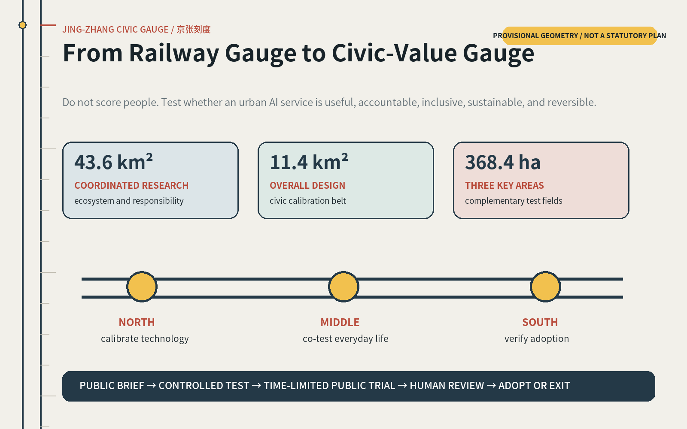
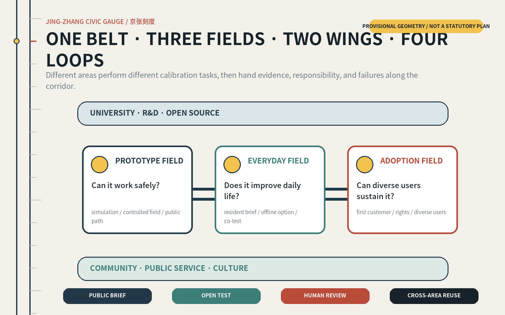
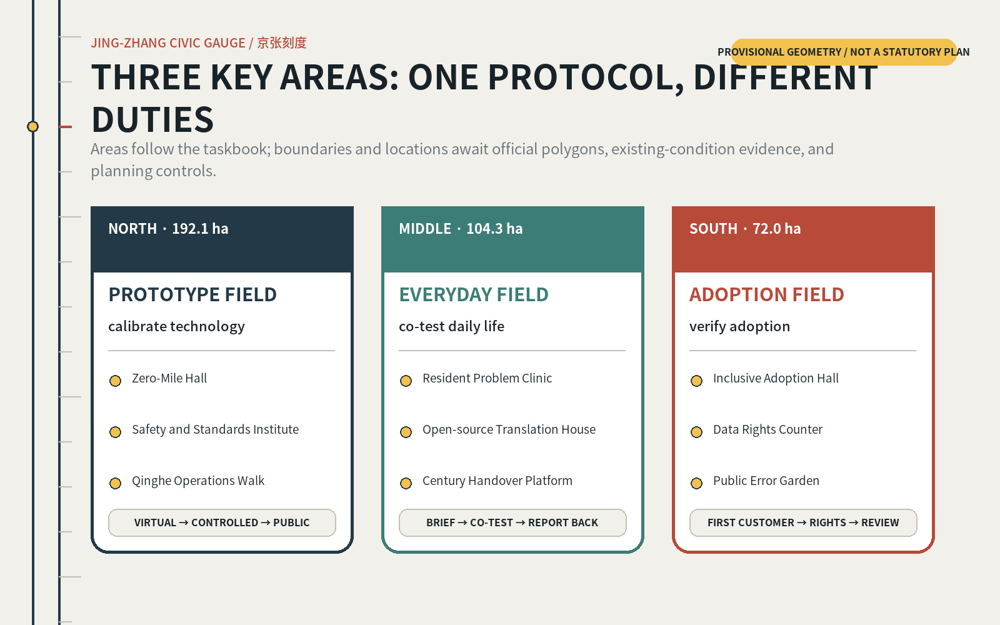
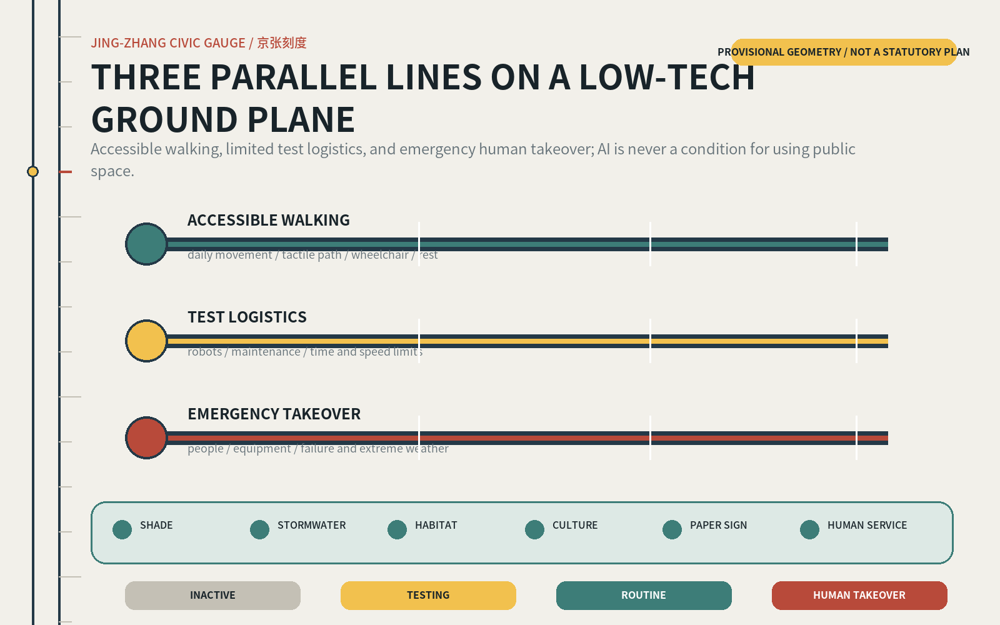
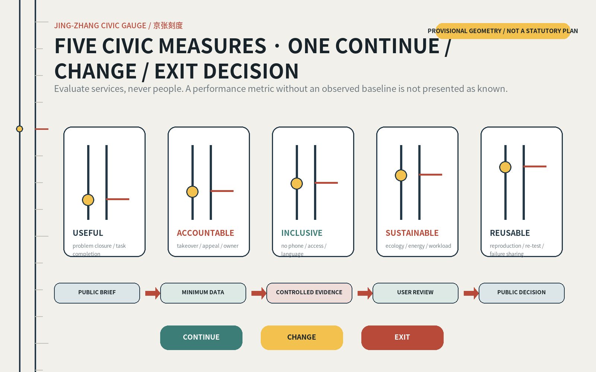

# JING-ZHANG CIVIC GAUGE

> Make every urban AI service answerable to a civic gauge.

Railways turned unfamiliar people, machines, and places into a trusted public system through a shared gauge, mileposts, timetables, maintenance, and handovers. A century later, the AI city beside the Jing-Zhang corridor needs a new civic gauge. It does not score people. It tests whether a technology solves a real problem, treats different groups fairly, has an accountable operator, and can fall back safely to a human service when it fails.

## Design Basis and Source List

This proposal participates in the Agent open call launched through `open-city-ai/haidian` in August 2026. The official international urban design prequalification announcement published in May 2026 provides project context, the three-level scope, and urban-design tasks, but it is not the registration channel for this GitHub submission. The proposal responds to both the official announcement and the Agent taskbook and follows the repository's proposal v2, bilingual, spatial-data, figure, and validation rules [source:OFFICIAL-ANNOUNCEMENT] [source:AGENT-TASKBOOK].

The public task describes an approximately 43.6km² coordinated research area, an approximately 11.4km² overall design area, and three key areas: the northern Zhongguancun Science City International Innovation Center area, also called the Zhongzhiyuan AI Independent Innovation Acceleration Area in the taskbook, at approximately 192.1ha; the central Beijing AI Origin Community at approximately 104.3ha; and the southern Dazhongsi AI Industry Cluster at approximately 72.0ha. The three key areas total approximately 368.4ha. These are brief figures, not proof that official GIS redlines are available [source:SITE-PACKAGE].

The current site package does not include official boundaries, existing buildings, road redlines, rail and walking networks, parcel ownership, heritage inventories, regulatory controls, utilities, or public-facility basemaps. The submitted site and key-area polygons are provisional. An OSM cross-check documented in Issue #846 also suggests a substantial displacement between one identifiable Jing-Zhang Heritage Park object and the provisional overall boundary. OSM is not official evidence either. The proposal therefore uses these geometries only for structural communication and machine validation, never for statutory, engineering, or precise-capacity claims [data:geometry/site_boundary.geojson#SITE-001] [depth:risk_missing_data].

Sources are used in four ways: the official announcement and national or ministerial rules define the task and professional boundaries; the Agent taskbook defines Agent-specific requirements; repository provisional geometry supports temporary drawings; and global cases support mechanism transfer only. Each external source, permitted use, and limitation is registered in `sources.json`. Land-use, mobility, building, and metric proposals must be recalculated as a whole when formal data arrives, not repaired by replacing a single basemap [source:SOURCE-REGISTRY].

## Three-Level Scope Framework

The Civic Gauge is not a newly invented redline. It organizes the three scope levels into different degrees of precision within one operational loop. The 43.6km² scale asks who defines problems, supplies technology, and assumes adoption responsibility. The 11.4km² scale organizes public space, innovation services, and cross-area translation. The three key areas test specific prototypes. Every spatial move is a conceptual recommendation for professional refinement after official boundaries, regulatory controls, and engineering data become available [depth:three_level_scope_framework].

| Level | Core question | Civic Gauge response | Current precision |
|---|---|---|---|
| 43.6km² coordinated research | How do technology, talent, public problems, and adoption actors collaborate? | A chain of public briefs, open testing, human review, and cross-area reuse | Strategic relationships; actors and facilities need verification |
| 11.4km² overall design | How do three key areas and the corridor public realm work as one system? | One civic-value calibration belt, three calibration fields, two input wings, and four operating loops | Structural diagram on a provisional boundary |
| 368.4ha key areas | What does each area validate? | Calibrate technology in the north, co-test everyday life in the middle, and verify inclusive adoption in the south | Brief areas may be cited; exact placement awaits official polygons |

The overall structure is “one belt, three fields, two wings, and four loops.” The belt is the Civic Gauge. The fields are the northern Prototype Calibration Field, central Everyday Co-testing Field, and southern Inclusive Adoption Field. The two wings are the university/R&D network and the community/public-service network. The four loops commission problems, run open tests, conduct human review, and transfer qualified outcomes. The structure replaces “more AI” with “more AI services that have demonstrated public value and can exit safely” [data:geometry/key_areas.geojson#PROV-KEY-001] [metric:key_area_count].

Five portable modules support the framework: Calibration Halls publish problems and evidence; Scenario Bays host time-limited trials; Human Takeover Desks preserve equal offline service; Open Evidence Walks show benefits and errors; and Annual Review Forums decide whether projects continue, change, or stop. The modules do not depend on one rectangular parcel and can move, scale, merge, or disappear when authoritative data replaces the provisional geometry.

## Coordinated Research Area: Industry and Future City Research

Haidian's strength lies in the density of research, talent, and firms. The missing link may not be another AI building, but the discontinuity between a laboratory prototype and a real urban service: problem definition, the first customer, risk review, public feedback, and transfer to other contexts. The 43.6km² ecosystem is therefore organized as a civic-value calibration chain rather than as a directory of companies [source:AGENT-TASKBOOK] [depth:overall_spatial_structure].

### Seven global cases: transfer mechanisms, not forms

| Case | Demonstrated mechanism | Transfer to Jing-Zhang | Boundary not to copy |
|---|---|---|---|
| Punggol Digital District, Singapore | A 50ha mixed district co-locates university and industry and uses an open digital platform and real public environments for continuing physical-AI tests | A three-gate north-field sequence: virtual simulation, controlled test field, limited public-path pilot | A centralized platform can create vendor lock-in and pervasive sensing; Jing-Zhang needs data minimization and human alternatives [source:CASE-PDD] |
| Helsinki AI Register | The city publicly describes AI in use, its logic and responsibility, and accepts public feedback | Every scenario receives an Urban AI Notice and a traceable feedback route | Disclosure alone is not accountability; it must connect to takeover responsibility and exit gates [source:CASE-HELSINKI] |
| Toronto Transportation Innovation Zone | Time-limited deployment in a real mixed street environment assesses safety, accessibility, privacy, and regulatory effects | A reversible 90-day public trial becomes mandatory before routine operation | A test-zone exemption does not generalize citywide; reuse requires a second contextual review [source:CASE-TORONTO] |
| Barcelona 22@ | Industrial renewal combines mixed use, housing, public space, transport, and innovation facilities | The AI Origin Community adds everyday services, living space, and public realm rather than becoming an office enclave | Innovation can raise rents and exclusion; affordable space and public-benefit obligations are needed [source:CASE-BARCELONA] |
| Knowledge Quarter London | A member network and public access connect institutions and support inclusive growth | The 43.6km² area runs Open Problem Days and cross-institutional curation rather than building a single headquarters | A network needs a durable secretariat and community seats, not only event momentum [source:CASE-KQ] |
| STATION F, Paris | Multiple programs, investors, and services help ventures progress from idea to scale | The south field offers first-customer, procurement, and demonstration interfaces across sectors | Venture scale is not public value; resident benefit and failure exit need separate gauges [source:CASE-STATIONF] |
| Mila, Montreal | Open science, talent, venture translation, and responsible AI governance are treated as parallel missions | The north field embeds safety, social impact, and environmental cost in R&D and incubation support | Research ethics must become operational service duties and accessible appeals [source:CASE-MILA] |

Together, the seven cases form a chain. Punggol supplies real-world testing; Helsinki supplies transparency; Toronto supplies time limits; 22@ warns about mixed urban life and exclusion; Knowledge Quarter supplies institutional networking; STATION F supplies translation to adoption; and Mila joins science, adoption, and governance. Jing-Zhang's original move is not to gather all functions in one campus, but to make the three key areas carry different calibration duties and hand evidence and responsibility along one public route.

The future city therefore runs at multiple speeds. R&D may iterate weekly, public pilots are reviewed over 90 days, spatial renewal proceeds annually, and ecology and cultural stewardship work over longer cycles. These differences are not obstacles; they are designed interfaces of responsibility. An AI project that cannot name its beneficiaries, risks, human takeover, and exit conditions does not enter public space.

## Overall Design Area: Urban Renewal and Regulatory-Plan-Level Urban Design

Without official regulatory controls and an existing-condition basemap, this proposal does not manufacture a precise masterplan. It defines five layers that can be re-constrained by formal professional evidence: a heritage and ecology base, a continuous walking layer, a public-service layer, an innovation-testing layer, and an operational-evidence layer. Each layer must later pass heritage, landscape, transport, land-use, and data-governance review [standard:MOHURD-URBAN-DESIGN-MEASURES] [data:geometry/land_use.geojson#LU-001].

The submitted land-use GeoJSON is a topology-safe schematic partition derived from the provisional site. It demonstrates closure, non-overlap, and recalculation; it is not a claim about existing or approved land use. Its four semantic classes are reframed as innovation R&D/testing, blue-green and heritage open space, industry translation/city services, and community services/talent life. Their proportions and boundaries must be rebuilt when official parcels, existing use, and ownership become available [standard:MNR-LAND-USE-CLASSIFICATION-GUIDE].

Renewal follows a light-intervention-first sequence. Reversible ground-floor openings, under-bridge or station-front interfaces, walking discontinuities, temporary use of vacant space, and public-service counters come first. Demolition, new construction, height, FAR, road redlines, or utility changes wait for professional verification. The proposal intentionally provides no gross floor area, FAR, or height figure because no authoritative evidence currently supports one [metric:floor_area_ratio] [depth:development_intensity_controls].

Three interface rules apply. First, every digital service is paired with an equal human or offline channel. Second, every test space shows its boundary, operating time, and status. Third, every project transferred between areas carries its conditions of use, failure record, and accountable owner, not only a successful demonstration.

## Detailed Design of Key Areas

The three key areas use one shared protocol but perform different tasks. The north asks whether technology can work safely; the middle asks whether it improves everyday life; and the south asks whether diverse users can adopt it as a durable service. Every location below is a reference scheme that must change with official key-area polygons, existing buildings, roads, ownership, and planning controls [depth:three_key_area_detailed_design].

### North: Prototype Calibration Field (approximately 192.1ha)

The north field addresses full-stack independent innovation, standards, safety governance, and a green R&D environment. A “three-gate” sequence combines digital-twin or simulation review, controlled-site testing, and limited public-path trials. Proposed modules include the Zero-Mile Civic Calibration Hall, AI Safety and Standards Co-testing Institute, Qinghe Low-carbon Operations Walk, shared robotic trial route, and staffed human-supervision posts. A technology may pass to the next gate only after publishing its purpose, sensing extent, stop method, and on-site accountable person [data:geometry/key_areas.geojson#PROV-KEY-001].

Retention and adaptive reuse come before new construction. Suitable ground floors may become public testing, display, and observation interfaces. Any new massing awaits verified intensity and landscape constraints. The Qinghe interface serves ecology and everyday walking first; technology tests may not displace continuous passage or ecological baselines.

### Middle: Everyday Co-testing Field (approximately 104.3ha)

Near universities, communities, and innovation actors, the middle field reframes the “AI origin” from the origin of a company to the origin of a public problem. It combines a campus-adjacent translation street, Resident Problem Clinic, Open-source Translation House, shared talent living room, co-testing courtyards for children, older people, and disabled users, and the Century Handover Platform. It tests whether AI improves commuting, wayfinding, public procedures, learning, care, and small-business activity, not whether it appears spectacular [data:geometry/key_areas.geojson#PROV-KEY-002].

Spatial priorities are campus-park-community walking interfaces, affordable small work and service units, and an offline desk or telephone service paired with each intelligent service. Resident participation is voluntary, withdrawable, compensated for time where appropriate, and followed by a report-back on results.

### South: Inclusive Adoption Field (approximately 72.0ha)

The south field uses rail access, commerce, culture, and firm presence to calibrate the transition from prototype to first customer and from demonstration to routine service. Proposed components include the Dazhongsi Inclusive Adoption Hall, Data Rights Counter, AI Product Usability Market, international demonstration and public-review salon, a four-quadrant walking stitch, and the Public Error Garden [data:geometry/key_areas.geojson#PROV-KEY-003].

Every demonstrated product discloses who should not use it, when it fails, and how a person takes over. Front-line service workers, older people, disabled people, and micro-businesses participate in usability review. Part of the value generated through commercial adoption should return to the public testing system as space, service hours, or community briefs; legal and operating teams must refine the mechanism and any proportion.

## AI Innovation Ecosystem, Personas, and AI+ Scenarios

Four roles operate the ecosystem: public-problem commissioners, technology providers, professional and ethics reviewers, and adoption or service operators. Every project has a named person able to stop service and an alternative that does not require a smartphone. Ecosystem performance is not measured by tenant count alone, but by problem resolution, cross-area reuse, successful human takeover, correction speed, and access for different users [source:AGENT-TASKBOOK].

### Seven personas

| User | Real task | High-risk break | Spatial and operational response |
|---|---|---|---|
| Corridor resident | Commute, use public services, relax, and raise local problems | Passive collection and unanswered complaints | Resident Problem Clinic, anonymous/offline feedback, and report-back |
| Older person or non-smartphone user | Find routes, make appointments, pay, and discover activities | QR code becomes the only entrance | Human Takeover Desk, paper and telephone channels, large readable signage |
| Disabled or temporarily mobility-limited person | Travel accessibly and understand environmental status | Algorithms miss physical obstacles | Co-walks, tactile or acoustic cues, human assistance, and fault reporting |
| Front-line public-service worker | Answer recurring questions, maintain assets, and handle exceptions | AI adds work or blurs responsibility | Human-machine task boundaries, takeover drills, workload and error review |
| University researcher or open-source developer | Validate in reality, collaborate, and translate results | No lawful access to data or contexts | Staged test fields, public problem library, and reproducible records |
| Startup or growth firm | Find first customers, compliance advice, and product feedback | Demonstration without adoption; late compliance cost | Scenario commissioning, procurement clinic, 90-day validation, and adoption interface |
| Visitor, cultural participant, or international talent | Understand Jing-Zhang and Haidian, join events, and connect | Technology display obscures local culture | Bilingual public route, four landmarks, human storytellers, and low-tech guide |

Users are not “data sources” to be experimented upon. They help define problems, select risk boundaries, and judge outcomes. Co-testing states purpose, duration, data, withdrawal, compensation, and report-back. High-risk health, education, legal, and safety systems remain assistive and do not replace professional judgment [source:REG-GEN-AI].

## Land Use, Building Scale, and Retain-Renovate-Demolish Strategy

Because existing buildings, ownership, heritage, structure, and planning controls are missing, the proposal makes no demolition judgment about any real building. Professional refinement should use a five-level calibration table: R1 legally confirmed protection; R2 retain and repair; R3 adaptive reuse; R4 reversible addition; and R5 conditional renewal after multi-disciplinary review. An asset moves between levels only after heritage value, structural safety, embodied carbon, functional fit, property rights, and public benefit have been reviewed [depth:retain_renovate_demolish].

Spatial prototypes include an Open Calibration Hall of roughly 300–800m², a movable Scenario Bay of roughly 30–100m², a Human Takeover Desk of roughly 15–40m², a flexible Review Forum for 100–300 people, and an Open Evidence Walk along daily routes. These are reference module ranges, not parcel development controls, and require fire, structural, accessibility, and operational adjustment.

Urban character does not copy the shape of trains. From the railway legacy it transfers durable components, readable joints, visible maintenance, measurement marks, and platform-like public interfaces. From Zhongguancun it transfers open debate, rapid prototyping, and knowledge sharing. From emerging AI culture it transfers explainable states, version records, and human oversight. Building height, FAR, density, setbacks, and total floor area all remain pending official controls [standard:MOHURD-CONTROL-DETAILED-PLANNING].

## Transport, Rail, Municipal Infrastructure, and Public Services

The mobility strategy does not invent roads on a provisional rectangle. It defines three parallel networks for validation against official data: a continuous accessible walking line for everyday movement; a test-logistics line that limits robots, maintenance, and event freight by time and speed; and an emergency-takeover line that brings people and equipment rapidly to failures. They intersect at stations, key areas, and potential breaks such as major-ring-road crossings, but exact alignments await rail, transport, and road-redline evidence [data:geometry/roads.geojson#ROAD-001] [depth:traffic_rail_slow_parking].

Every mobile AI service displays one of four states: inactive, testing, routine service, or human takeover. Robots and sensing equipment may not block tactile paving, wheelchair routes, or ordinary walking. Under crowding, extreme weather, network loss, or uncertain positioning, they slow down, park at a safe point, or hand over to a person. Trial route, time, contact, and complaint method are visible on site.

Municipal and digital infrastructure follows “minimum necessary sensing, edge processing first, and explicit retention periods.” Edge compute, charging, communications, and sensing should share existing management and public-service spaces instead of creating a landscape of standalone equipment. Until energy, drainage, flood, fire, underground-space, utility, and electromagnetic conditions are supplied, the package keeps only interface and load checklists and makes no engineering commitment [depth:municipal_new_infrastructure].

Public services follow “equal rights in two channels.” Intelligent Q&A, navigation, or booking may improve access, but telephone, paper, in-person staff, and accessibility assistance preserve the same basic service. AI-generated health, education, legal, or safety guidance must display its assistive status, human-review route, and emergency option.

## Blue-Green Network, Public Space, and Urban Character

The blue-green network is first an ecological and everyday-mobility base and only then a testing environment. Jing-Zhang heritage space, Qinghe, and corridor open spaces form a “low-tech ground plane” in which shade, stormwater, habitat, rest, exercise, accessibility, and cultural interpretation work without AI. AI may assist maintenance, energy, rain, and crowd judgments but does not become a precondition for using the park [data:geometry/green_space.geojson#GREEN-001] [depth:blue_green_public_space].

Public space uses four tolerance levels. Quiet Passage Areas have no proactive interaction. Everyday Service Areas allow low-risk assistance. Controlled Co-testing Areas allow booked trials. Professional Test Areas restrict access. Ground markings, materials, light, and staff make levels visible so users do not unknowingly enter a trial.

The urban identity uses a Civic Gauge palette: Jing-Zhang steel blue `#243947`, ballast grey `#C4C0B5`, station red `#B84A3A`, Qinghe teal `#3D7D78`, and calibration yellow `#F2C14E`. The graphic mark combines two fixed gauge lines with a movable calibration point. Its position shows whether a project is being commissioned, tested, reviewed, adopted, or retired. The identity is therefore both wayfinding and an Urban AI Notice; it does not equate technology with screens and neon.

### Four AI pilgrimage landmarks and contribution displays

1. **Zero-Mile Civic Calibration Hall (north):** publishes annual urban problems, test gates, accountable operators, and failure records. Its landmark quality comes from verifiable public practice rather than oversized form.
2. **Century Handover Platform (middle):** translates the railway platform into a public forum where researchers, front-line workers, and residents transfer responsibility and leave a readable handover record.
3. **Inclusive Adoption Hall (south):** displays projects that have passed diverse-user, accessibility, human-takeover, and commercial-sustainability review. It also explains why other projects did not pass.
4. **Public Error Garden (rotating along the corridor):** turns corrected, withdrawn, or ended projects into anonymized learning exhibits and recognizes the people who found a problem, protected the public, or stopped responsibly.

Together, the landmarks form a public pilgrimage route from problem to handover, adoption, and review. Contribution walls recognize open source, public problem definition, accessibility, safety correction, ecological stewardship, and honest exit. They do not rank companies by valuation or individuals and communities by behavior or attention [source:AGENT-TASKBOOK].

## Renewal Projects, Implementation Policy, and Phasing

### Twelve scenario cards

| ID | Scenario and suggested setting | Public problem / AI role | Human and low-tech alternative | Gauge for progression |
|---|---|---|---|---|
| S01 / V1 | North-field shared path for multi-operator robots | Test safe coordination between robots in mixed public space | On-site supervisor, human delivery, physical parking bays | 90 days without serious harm; every near miss reviewed |
| S02 / V2 | North-field safety governance sandbox | Test bias, hallucination, and attack risk in public-service Q&A | Professional review, offline standard answers, red-team stop right | 100% of high-risk answers handed to people; failures reproducible |
| S03 / V3 | Qinghe low-carbon operations walk | Assist irrigation, lighting, and asset maintenance | Human inspection and mechanical timers | Energy savings without ecological or safety loss; minimum data |
| S04 / V4 | Middle-field accessible co-walk | Identify ramps, obstructions, guidance, and crossing breaks | User and accessibility-expert walk, paper problem map | Priority issues closed; human response time meets agreed target |
| S05 | Middle-field Resident Problem Clinic | Convert ambiguous concerns into testable public briefs | Community-worker interview, telephone, and paper form | Commissioner receives a process and a result report |
| S06 | Middle-field Open-source Translation House | Translate research prototypes into usable service instructions | Editors, domain experts, and in-person workshops | Users can restate limits and complete a takeover drill |
| S07 | Middle-field talent life assistant | Help find housing, procedures, learning, and community services | Integrated desk and bilingual paper guide | No profile-based commercial push; human handover accessible |
| S08 | South-field AI Product Usability Market | Let diverse users test products before purchase or adoption | Human explanation, conventional comparison product, exit control | Publish suitable/unsuitable groups and failure records |
| S09 | South-field Data Rights Counter | Explain what is collected, why, and how to delete or appeal | Data-protection staff and written request | Inquiry, withdrawal, and appeal close within a stated period |
| S10 | Corridor Human Takeover Stations | Preserve basic service during failure, disconnection, or refusal | Trained staff, telephone, paper, and fixed signs | Offline basic-task completion not below the digital channel in drills |
| S11 | Jing-Zhang Cultural Time Line | Connect historic mileposts, people, engineering, and current innovation | Human storyteller, physical labels, optional downloadable audio | Historical claims traceable; AI content human-edited |
| S12 | Annual Public Review Walk | Show which projects continue, change, or stop | Public meeting, printed annual report, and community seats | Every project has a decision, owner, and next review date |

S01–S04 are explicit industry or public validation scenarios. They share six steps: define the problem, classify risk, run a controlled test, conduct a time-limited public trial, complete human review, then adopt or stop. The other scenarios translate testing capacity into community, talent, cultural, and market services. No high-risk project may bypass professional review or human takeover [source:AGENT-TASKBOOK] [source:REG-GEN-AI].

### Renewal projects and phases

| Phase | Suggested duration | Priority actions | Exit condition |
|---|---|---|---|
| P0 Data calibration | 0–90 days | Request official boundaries and basemaps, map stakeholders, run accessible co-walk, classify scenario risk | Pause projects without an accountable operator or basic evidence |
| P1 Reversible pilots | 3–12 months | Temporary Calibration Hall, Human Takeover Desks, four validation scenarios, public status marks | Withdraw when benefit is weak, risk is uncontrolled, or offline service fails |
| P2 Cross-area reuse | 1–3 years | Handovers among three fields, repair walking gaps, open ground floors, run annual program | Re-test users and spatial conditions before each transfer |
| P3 Institutional operation | Beyond 3 years | Permanent operating alliance, public annual report, professionally refined renewal projects | Independent annual review may reduce, replace, or end programs |

Phasing is a reference scheme, not a government schedule or funding commitment. Policy suggestions include commissioning through a Public Problem Brief rather than a product list; enabling small, time-limited, reversible challenge pilots; requiring a data card, human takeover, and exit budget; tying public-space use to a public-benefit return; and moving permanent construction through normal statutory and professional review [data:geometry/phasing.geojson#PHASE-001] [depth:phasing_implementation].

## Metrics, Area Recalculation, and Compliance Matrix

Spatial metrics describe only the temporary submitted geometry. Site area, green space, public space, and building footprint can be recalculated in EPSG:4548, but because the source boundary is provisional, these are machine-validation values and not planning controls. The key-area count is three; their areas follow the brief while the package records differences in provisional geometry [metric:site_area_sqm] [metric:key_area_count].

Operation uses five groups of civic measures and never ranks individuals or communities:

1. **Useful:** problem closure, service completion, and whether users can restate system limits.
2. **Accountable:** time to reach an owner, successful human takeover, and appeal closure.
3. **Inclusive:** task completion without a smartphone, accessible task completion, language coverage, and differential impact.
4. **Sustainable:** net energy, carbon, and ecological impact; staff workload; operating cost; and durable funding.
5. **Reusable:** reproducibility, second-context validation, and publication of failures.

Each pilot establishes a baseline before deployment, collects the minimum necessary data during the test according to risk, and ends with a joint continue-change-stop decision by operators, professionals, and user representatives. Numeric targets must state sample, period, and method. A measure without an observed baseline is not disguised as known in `metrics.json`. The task coverage, professional standards, and design depth matrices preserve exhaustive mappings while the narrative retains only decision-relevant evidence [depth:metrics_recalculation].

## Risk, Copyright, and Compliance

The largest spatial risk is that official data has not confirmed the relationship between the provisional boundary and the actual Jing-Zhang heritage space. The largest governance risk is transparency without correction. The largest social risk is efficiency that excludes older people, disabled people, people with lower digital capacity, or micro-businesses. The largest operational risk is an abandoned pilot. The proposal answers these through complete recalculation, binding stop rights, equal offline channels, and funded exit plans [depth:risk_missing_data].

The proposal applies data minimization, purpose limitation, public notice, human oversight, accessibility, and basic-service alternatives for older people. It may not use personal, confidential, or unauthorized internal spatial data, fabricate official endorsement, approval, public funding, or implementation commitments. High-risk health, education, legal, and public-safety AI remains assistive and is reviewed by qualified professionals [source:LAW-ACCESSIBILITY] [source:POLICY-OLDER-DIGITAL].

All figures are newly created for this submission from repository public or cleared data and original drawing elements. No peer-proposal image or text is copied. External cases are summarized from official pages without downloading or embedding copyrighted imagery. The HTML loads no remote script, font, map tile, form, or tracking. Licensing and generation details appear in `report/copyright_statement.md`.

This work is a conceptual urban-design recommendation and Agent open-source research output. It is not a statutory plan, survey, engineering drawing, investment estimate, or implementation commitment. Boundary, land use, intensity, height, retain-renovate-demolish decisions, roads, rail, utilities, fire safety, ecology, heritage, ownership, and operating contracts require professional refinement by qualified teams using official evidence.

## References

- Beijing Municipal Commission of Planning and Natural Resources, Haidian Branch: official international urban-design prequalification announcement for the Centennial Jing-Zhang AI Innovation Belt [source:OFFICIAL-ANNOUNCEMENT]
- `brief/site-package/agent_taskbook.json`: Agent-facing open-call taskbook extract [source:AGENT-TASKBOOK]
- National and ministerial rules on urban design, regulatory planning, and land-use classification [standard:MOHURD-URBAN-DESIGN-MEASURES]
- National rules and policies on generative AI, accessibility, and services for older people [source:REG-GEN-AI] [source:LAW-ACCESSIBILITY]
- Official material from Punggol Digital District, Helsinki AI Register, Toronto Transportation Innovation Zone, Barcelona 22@, Knowledge Quarter London, STATION F, and Mila. Complete URLs, access dates, permitted uses, and limitations are recorded in `sources.json` [source:CASE-PDD] [source:CASE-HELSINKI] [source:CASE-TORONTO]
- Machine-readable evidence: `metrics.json`, `assumptions.json`, nine GeoJSON layers, task coverage matrix, professional standards matrix, and design depth matrix.
