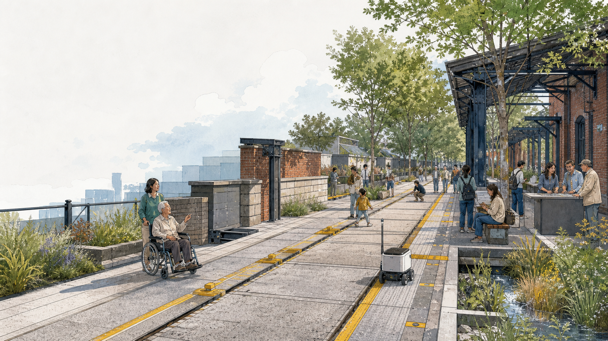
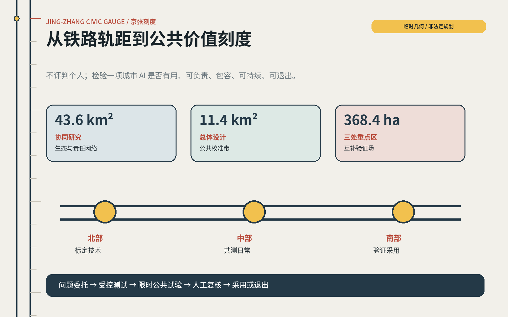
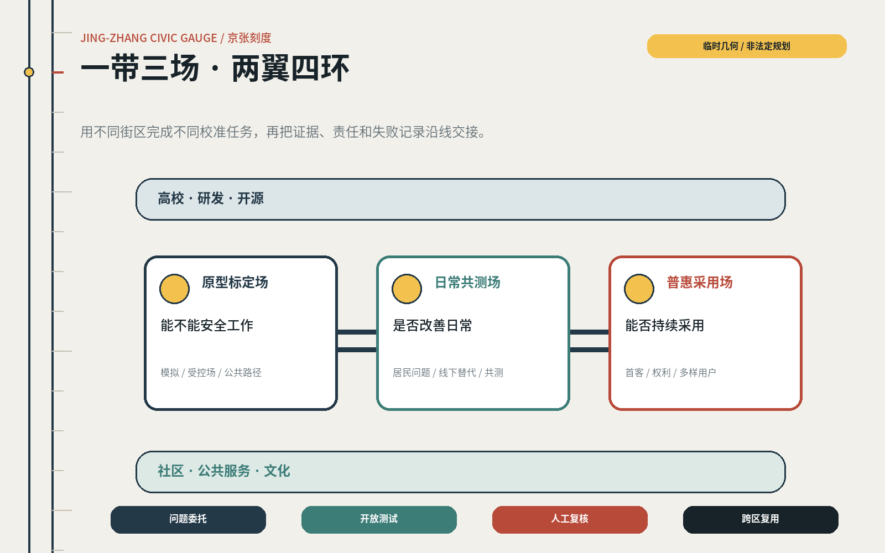
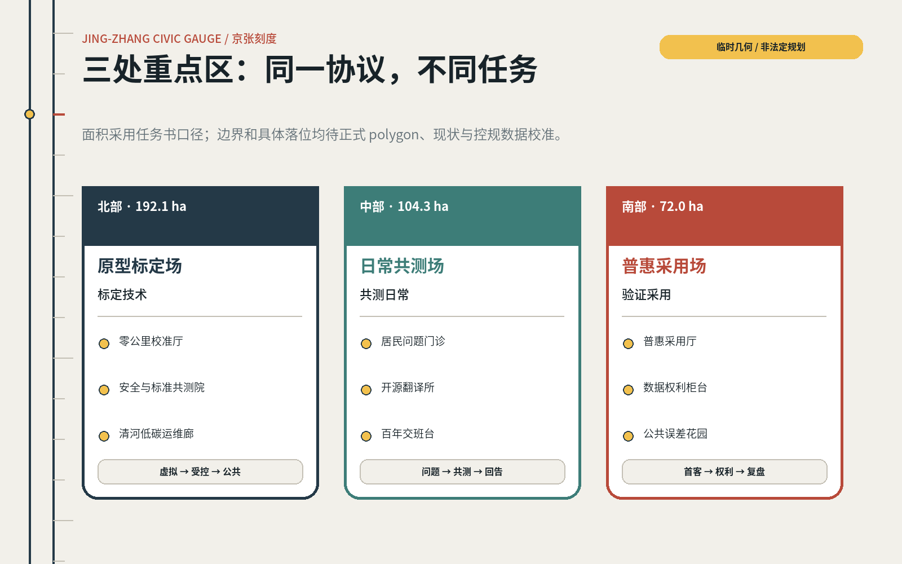
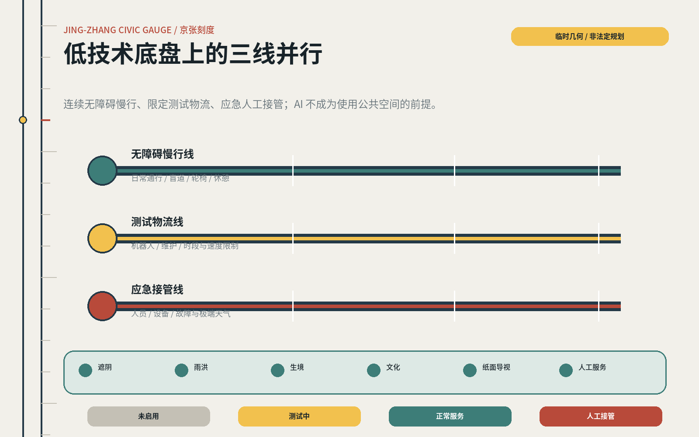
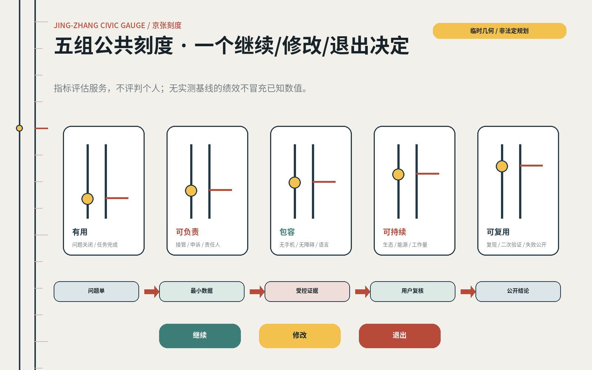

# 京张刻度 JING-ZHANG CIVIC GAUGE

> 让每项城市 AI 经得起公共校准。  
> Make every urban AI service answerable to a civic gauge.

铁路用统一轨距、里程、时刻、检修与交接，把陌生人、机器和城市组织成可信赖的公共系统。百年之后，京张线旁的 AI 城市也需要一套新的公共刻度：它不评判个人，而是检验一项技术是否解决真实问题、是否对不同人群公平、是否有人负责、失效时能否安全退回人工服务。

## 设计依据与资料清单

本提案参与的是 2026 年 8 月在 `open-city-ai/haidian` 发起的 Agent 开源征集。2026 年 5 月发布的官方国际方案征集资格预审公告提供项目背景、三级范围和城市设计任务，但不是本轮 GitHub 投稿的报名通道。提案同时响应官方公告与 Agent 任务书，并接受仓库的 proposal v2、双语、空间数据、图件和自检规则 [source:OFFICIAL-ANNOUNCEMENT] [source:AGENT-TASKBOOK]。

公开任务口径包括约 43.6km² 协同研究范围、约 11.4km² 总体设计范围，以及北部中关村科学城国际创新中心片区（任务书亦称众智园 AI 自主创新加速区）约 192.1ha、中部北京 AI 原点社区约 104.3ha、南部大钟寺 AI 产业聚集区约 72.0ha，三处合计约 368.4ha。上述面积是任务口径，不等于本仓库已经取得正式 GIS 红线 [source:SITE-PACKAGE]。

当前 site package 未提供正式范围、现状建筑、道路红线、轨道与慢行网络、地块权属、文保清单、控规指标、市政管线或公共服务设施底图。提交包中的边界与三处重点区均为临时粗略 polygon；Issue #846 的 OSM 交叉核验还提示其中一个可识别京张遗址公园对象与临时总体边界存在明显偏离。OSM 也不是官方依据，因此提案只把这些几何用于结构表达和校验，不据此作法定、工程或精确容量判断 [data:geometry/site_boundary.geojson#SITE-001] [depth:risk_missing_data]。

资料按四类使用：官方公告和国家/部委规范用于任务与专业边界；Agent taskbook 用于智能体专项任务；仓库 provisional geometry 用于临时制图；全球案例只用于机制迁移。每一条外部来源的用途和限制均在 `sources.json` 中登记；用地、交通、建筑和指标建议在正式数据到位后必须整体复算，而不是只替换一张底图 [source:SOURCE-REGISTRY]。

## 三层范围工作框架

“京张刻度”不是新画一条红线，而是把三级范围组织成不同精度、同一闭环的工作框架：43.6km² 研究“谁提出问题、谁提供技术、谁负责采用”；11.4km² 组织公共空间、创新服务和跨区转译关系；三处重点区验证具体原型。所有空间动作均为概念建议，可供专业团队在正式边界、控规和工程资料到位后深化 [depth:three_level_scope_framework]。

| 层级 | 核心问题 | 京张刻度的回答 | 当前精度 |
|---|---|---|---|
| 43.6km² 协同研究 | 技术、人才、公共问题和采用主体如何协同 | 建立“问题委托—开放测试—人工复核—跨区复用”生态链 | 战略关系，待主体与设施数据核实 |
| 11.4km² 总体设计 | 三处重点区和沿线公共空间如何形成一个系统 | 一条公共价值校准带、三类校准场、两翼输入网络、四个运营闭环 | 临时边界上的结构示意 |
| 368.4ha 重点区 | 不同片区分别验证什么 | 北部标定技术，中部共测日常，南部验证普惠采用 | 面积口径可引用，具体落位待正式 polygon |

总体结构为“一带三场、两翼四环”。一带是公共价值校准带；三场是北部原型标定场、中部日常共测场和南部普惠采用场；两翼是高校/研发网络与社区/公共服务网络；四环依次完成问题委托、开放测试、人工复核和跨区复用。它把“更多 AI”改写为“更多经过公共验证、能安全退出的 AI 服务” [data:geometry/key_areas.geojson#PROV-KEY-001] [metric:key_area_count]。

空间中配置五类可迁移模块：校准厅用于公开问题与证据，场景舱用于限时测试，人工接管台保障同等级线下服务，开放指标廊展示收益与误差，年度复盘场决定继续、修改或退出。模块不依赖某一矩形地块，正式数据更新后可移动、缩放、合并或取消。

## 统筹研究范围产业与未来城市研究

海淀的优势是研究、人才和企业密度；真正的短板不一定是“缺少另一栋 AI 大楼”，而是技术从实验室进入真实城市时，问题定义、首个客户、风险复核、公共反馈和跨场景复用之间仍有断点。因此，43.6km² 的产业生态建议以“公共价值校准链”组织，而不是按企业名单排布 [source:AGENT-TASKBOOK] [depth:overall_spatial_structure]。

### 七个全球案例：迁移机制，不复制形态

| 案例 | 已验证机制 | 对京张的迁移 | 不照搬的边界 |
|---|---|---|---|
| 新加坡 Punggol Digital District | 50ha 混合街区、大学与产业共址，以开放数字平台和真实公共环境持续测试物理 AI | 北部建立“虚拟仿真—封闭场—公共路径”三级试验门槛 | 集中平台可能产生供应商锁定和高传感依赖，京张需数据最小化与人工替代 [source:CASE-PDD] |
| 赫尔辛基 AI Register | 城市公开正在使用的 AI、责任与说明，并允许居民反馈 | 每个场景都有“城市 AI 说明牌”和可追踪反馈页 | 透明登记不等于有效问责，需绑定接管责任与退出门槛 [source:CASE-HELSINKI] |
| 多伦多 Transportation Innovation Zone | 在真实混合道路中做限时部署，评估安全、无障碍、隐私和法规影响 | 把 90 天可逆试验作为公共场景进入常态运营前的必经阶段 | 测试区的制度豁免不能自动外推全城，跨区复用需二次复核 [source:CASE-TORONTO] |
| 巴塞罗那 22@ | 以混合用地、住房、公共空间、交通和创新设施共同推动工业区更新 | AI 原点社区同时补充生活、服务和公共空间，不做纯办公园区 | 创新带来的租金和排斥风险需用可负担空间与公共收益约束 [source:CASE-BARCELONA] |
| 伦敦 Knowledge Quarter | 以成员网络和公共开放促进机构间知识交换与包容增长 | 43.6km² 范围建立“问题开放日”和跨机构策展，而非新建单一总部 | 网络运营必须有长期秘书处和社区席位，不能只靠活动热度 [source:CASE-KQ] |
| 巴黎 STATION F | 多类型项目、投资人和服务集中，帮助团队从创意走向规模化 | 南部设置可被多行业采用的首客、采购和路演接口 | 创业规模不是公共价值，需对居民收益与失败退出另设刻度 [source:CASE-STATIONF] |
| 蒙特利尔 Mila | 开放科学、人才培养、创业转化与负责任 AI 治理并列 | 北部把安全、社会影响与环境成本嵌入研发和孵化服务 | 研究机构的伦理原则需转成可执行的城市服务责任与申诉机制 [source:CASE-MILA] |

七个案例共同指向一条链路：PDD 提供真实测试，Helsinki 提供公开透明，Toronto 提供限时部署，22@ 提醒混合城市与排斥风险，KQ 提供机构网络，STATION F 提供转化服务，Mila 把科学、采用与治理并置。京张的原创点不是把这些功能集中到一个园区，而是让三处重点区分别承担不同校准任务，再由一条公共路径把证据和责任交接出去。

未来城市形态因此具有“多速”特征：研发可以按周迭代，公共试验按 90 天复盘，空间更新按年度推进，生态和文化按更长周期维护。速度差不是障碍，而是需要被设计的责任界面。任何不能说明受益者、风险、人类接管和退出条件的 AI 项目，不进入公共空间。

## 总体设计范围城市更新与控规深度城市设计

在缺少正式控规和现状底图时，本提案不制造精确总图，而提出可被法定与工程资料重新约束的五层结构：遗产与生态底层、连续慢行层、公共服务层、创新测试层、运营证据层。五层在正式数据到位后分别接受文保、蓝绿、交通、用地与数据治理专业复核 [standard:MOHURD-URBAN-DESIGN-MEASURES] [data:geometry/land_use.geojson#LU-001]。

用地 GeoJSON 是基于临时边界生成的拓扑安全示意 partition，只证明提交方法能够闭合、无缝和复算，不代表真实用地布局。其四类语义被重新定义为：创新研发与测试、蓝绿与遗产开放空间、产业转化与城市服务、社区服务与人才生活。正式地块、现状用地和权属到位后，四类比例和边界需全部重做 [standard:MNR-LAND-USE-CLASSIFICATION-GUIDE]。

总体设计采用“轻介入先行”的更新策略：优先处理可逆的首层开放、桥下/站前公共界面、慢行断点、空置空间临时使用和公共服务柜台；涉及拆除、新建、高度、容积率、道路红线或市政改造的动作均推迟至专业核验后。提案不提供建筑总量、容积率和高度数值，因为当前没有支持这些结论的官方数据 [metric:floor_area_ratio] [depth:development_intensity_controls]。

空间接口遵循三条规则。第一，每个数字服务旁设置同等级人工/线下通道；第二，每个测试空间有明确边界、时段和状态灯；第三，每个跨区复制项目同时携带适用条件、失败记录和责任人，而不是只携带成功演示。

## 重点区域详细设计

三处重点区采用“同一协议、不同任务”的设计：北部回答技术能否安全工作，中部回答它是否改善日常，南部回答它能否被多样人群采用并形成持续服务。以下落位均为参考方案，需随正式重点区 polygon、现状建筑、道路、权属和控规条件修正 [depth:three_key_area_detailed_design]。

### 北部：原型标定场 / Prototype Calibration Field（约 192.1ha）

北部围绕全栈自主创新、标准、安全治理和绿色研发环境，建议形成“三段门”：数字孪生/模拟验证、受控场地测试、限定公共路径试验。核心模块包括零公里校准厅、AI 安全与标准共测院、清河低碳运维廊、机器人共享试验路径和人类监督岗。每项技术必须先公开用途、传感范围、停止方式和现场责任人，才可进入下一段 [data:geometry/key_areas.geojson#PROV-KEY-001]。

建筑策略以保留和适应性改造优先：将可用首层变为测试、展示与公众观察界面；新增体量只在正式强度与景观条件确认后研究。清河界面首先承担生态和公共步行，技术测试不得挤占连续通行或生态底线。

### 中部：日常共测场 / Everyday Co-testing Field（约 104.3ha）

中部靠近高校、社区和创新主体，建议把“AI 原点”从企业起点改写为公共问题的起点。构成包括近校成果转化街、居民问题门诊、开源翻译所、人才生活共享客厅、儿童/老人/残障用户共测庭院和百年交班台。这里不追求最炫技术，而检验通勤、找路、办事、学习、照护和小微经营是否真实改善 [data:geometry/key_areas.geojson#PROV-KEY-002]。

空间上优先缝合校区—园区—社区的步行接口，增加可负担的小单元工作与服务空间，并以线下柜台和电话服务与每项智能服务配对。任何居民参与测试均采用自愿、可撤回、补偿时间和结果回告原则。

### 南部：普惠采用场 / Inclusive Adoption Field（约 72.0ha）

南部利用轨道、商业、文化和企业资源，承担“从原型到首客、从演示到常态服务”的校准。建议形成大钟寺普惠采用厅、数据权利柜台、AI 产品可用性市集、国际路演与公共复盘客厅、四象限步行缝合点和公共误差花园 [data:geometry/key_areas.geojson#PROV-KEY-003]。

所有路演产品必须展示“谁不适用、何时失败、如何人工接管”，并邀请一线服务人员、老人、残障人士和小微商户参与可用性评审。商业采用收益的一部分以场地、服务时段或社区任务回馈的方式回到公共试验系统；具体比例与机制待运营和法律团队深化。

## AI 创新生态、人才画像与 AI+ 场景

创新生态以四种角色共同工作：公共问题提出者、技术提供者、专业/伦理复核者、采用与运营者。每个项目必须有一名能够停止服务的责任人和一个不依赖手机的替代通道。生态成效不以入驻企业数单独衡量，而看问题解决、跨区复用、人工接管、纠错速度和不同用户的可达性 [source:AGENT-TASKBOOK]。

### 七类用户画像

| 用户 | 真实任务 | 高风险断点 | 空间与运营响应 |
|---|---|---|---|
| 沿线居民 | 通勤、办事、休闲、表达社区问题 | 被动采集、投诉无回应 | 居民问题门诊、匿名/线下反馈、结果回告 |
| 老人及不使用智能手机者 | 找路、挂号、缴费、获取活动信息 | 二维码成为唯一入口 | 人工接管台、纸质/电话渠道、清晰大字导视 |
| 残障与临时行动受限者 | 无障碍出行、理解环境状态 | 算法看不到真实障碍 | 共同走查、触觉/声学提示、人工协助和故障上报 |
| 一线公共服务者 | 处理高频咨询、维护设施、接管异常 | 系统增加额外工作或责任不清 | 人机任务分界、接管演练、工作量与错误率复盘 |
| 高校研究者与开源开发者 | 真实验证、同行协作、成果转化 | 数据与场景不可获得 | 分级测试场、公开问题库、可复现实验记录 |
| 初创与成长企业 | 找首客、合规辅导、产品迭代 | 只演示不成交、合规成本后置 | 场景委托、采购门诊、90 天验证和转化接口 |
| 访客、文化参与者与国际人才 | 理解京张与海淀、参与活动、建立联系 | 技术展示遮蔽地方文化 | 双语公共路线、四个地标、文化讲述人与低技术导览 |

用户不是被测试的“数据源”，而是共同定义问题、选择风险边界并评价结果的合作者。共测活动需说明目的、期限、数据、退出、补偿和反馈；高风险健康、教育、法律和安全服务只做辅助，不替代专业判断 [source:REG-GEN-AI]。

## 用地、建筑规模与拆改留方案

由于现状建筑、权属、文保、结构和控规数据缺失，本提案不对任何真实建筑作拆除判断。建议专业深化时使用五级“拆改留校准表”：R1 依法/依法定资料确认必须保护；R2 保留并修缮；R3 适应性再利用；R4 可逆增补；R5 经多专业论证后条件更新。任何对象只有完成历史价值、结构安全、碳排、功能适配、产权和公共收益六项核验，才可跨级 [depth:retain_renovate_demolish]。

建筑与空间原型包括：开放首层校准厅（300–800m² 参考模块）、可移动场景舱（30–100m²）、人工接管台（15–40m²）、复盘论坛（100–300 人弹性使用）和公共指标廊（沿日常路径布置）。这些尺寸是设计模块区间，不是地块建设指标；需由消防、结构、无障碍和运营条件校正。

风貌不复制火车造型。建议从京张遗产中迁移“耐久构件、可读连接、维修痕迹、尺度刻线和站台式公共界面”，从中关村文化迁移“开放讨论、快速样机和知识共享”，从 AI 新文化迁移“可解释状态、版本记录和人类监督”。建筑高度、容积率、建筑密度、退线和总建筑规模均待正式控规条件补齐 [standard:MOHURD-CONTROL-DETAILED-PLANNING]。

## 交通、轨道、市政与公共服务设施

交通策略不在临时矩形上虚构道路，而提出待官方网络校验的“三线并行”：连续无障碍慢行线服务日常通行；测试物流线限定机器人、维护和活动运输的时段与速度；应急接管线确保人和设备可快速到达。三线在站点、重点区和跨五环等潜在断点处交叉，但具体线位需以交通、轨道与道路红线资料为准 [data:geometry/roads.geojson#ROAD-001] [depth:traffic_rail_slow_parking]。

每个 AI 移动服务设置四种可见状态：未启用、测试中、正常服务、人工接管。机器人和感知设备不得阻断盲道、轮椅路径或普通步行；遇到拥挤、极端天气、网络中断或定位不确定即降低速度、停靠安全点或转人工。测试路线、时段、联系人和投诉入口在现场可见。

市政与新型基础设施采用“最小必要感知 + 边缘处理优先 + 明确保存期限”。端侧算力、充换电、通信与传感设施优先与既有管理空间和公共服务点复合，不单独制造设备景观。能源、排水、防洪、消防、地下空间、管线和电磁环境条件未取得前，只保留接口与负荷清单，不作工程承诺 [depth:municipal_new_infrastructure]。

公共服务坚持“双通道同权”：智能问答、导航或预约提高可达性，但电话、纸面、现场人员和无障碍辅助保持同等级基本服务。系统给出的健康、教育、法律和安全建议均需显示其辅助身份、人工复核入口与紧急处理方式。

## 蓝绿空间、公共空间与城市风貌

蓝绿系统首先是生态与日常通行基础，其次才是测试场。建议以京张遗产空间、清河及沿线开放空间形成连续的“低技术底盘”：遮阴、雨洪、生境、休憩、运动、无障碍与文化解释不依赖 AI 也能工作；AI 只用于辅助养护、能耗、雨情和拥挤判断 [data:geometry/green_space.geojson#GREEN-001] [depth:blue_green_public_space]。

公共空间按四种容错等级管理：安静通行区不做主动交互；日常服务区允许低风险辅助；受控共测区允许预约测试；专业试验区限制进入。等级通过地面刻线、材质、灯光和人工值守表达，避免用户在不知情时进入试验。

城市风貌采用“公共刻度”视觉系统：京张钢蓝 `#243947`、道砟灰 `#C4C0B5`、站房朱 `#B84A3A`、清河青 `#3D7D78`、校准黄 `#F2C14E`。标识由两条固定轨距线与可移动刻度点组成；点的位置显示项目处于委托、测试、复核、采用或退出阶段。它既是导视，也是城市 AI 状态说明，不把科技感等同于屏幕和霓虹。

### 四处 AI 朝圣地标与贡献展示

1. **零公里校准厅 / Zero-Mile Civic Calibration Hall（北部）**：公开本年度城市问题、测试门槛、责任主体和失败记录；地标价值来自可验证的制度，不来自巨大造型。
2. **百年交班台 / Century Handover Platform（中部）**：铁路站台原型被转译为研究者、一线服务者和居民进行责任交接的公共论坛；每次交班留下可读记录。
3. **普惠采用厅 / Inclusive Adoption Hall（南部）**：展示已通过多样用户、无障碍、人工接管和商业可持续复核的项目，未通过项目同样说明原因。
4. **公共误差花园 / Public Error Garden（全线年度轮换）**：把被纠正、撤回或停止的项目转成匿名化学习展项，荣誉归于发现问题、保护公众和主动退出的贡献者。

四处地标共同形成“问题—交班—采用—复盘”的公共朝圣路线，并设置个人、团队和社区贡献墙。贡献类型包括开源、公共问题、无障碍改进、安全纠错、生态维护和诚实退出，不以企业估值、个人行为或流量排名 [source:AGENT-TASKBOOK]。

## 更新项目清单、实施政策与分期计划

### 十二张场景卡

| ID | 场景与位置建议 | 公共问题 / AI 角色 | 人工与低技术替代 | 进入下一阶段的刻度 |
|---|---|---|---|---|
| S01 / V1 | 北部多运营商机器人共享路径 | 检验不同机器人在混合公共路径中的安全协作 | 现场监督员、人工配送、物理停靠区 | 90 天无重大伤害；近失事件全部复盘 |
| S02 / V2 | 北部安全治理沙盒 | 检验模型在公共服务问答中的偏差、幻觉与攻击风险 | 专业审核、离线标准答案、红队停止权 | 高风险回答 100% 转人工；问题可复现 |
| S03 / V3 | 清河低碳运维廊 | 辅助识别灌溉、照明、设备维护需求 | 人工巡检、机械定时控制 | 节能且不降低生态/照明安全；数据最小化 |
| S04 / V4 | 中部无障碍共同行走 | 识别坡道、占道、导向和过街断点 | 无障碍专家和用户现场走查、纸质问题图 | 关键路径问题关闭率、人工响应时间达标 |
| S05 | 中部居民问题门诊 | 把模糊诉求整理为可测试的公共问题 | 社区工作者面谈、电话和纸质表单 | 提案者收到处理路径与结果回告 |
| S06 | 中部开源翻译所 | 把科研原型转成一线人员可用的服务说明 | 编辑、领域专家、面对面工作坊 | 使用者能复述边界并完成接管演练 |
| S07 | 中部人才生活助手 | 辅助查找住房、办事、学习和社区服务 | 综合服务台、双语纸质手册 | 不以个性画像作商业推送；转人工可达 |
| S08 | 南部 AI 产品可用性市集 | 多样用户在购买/采用前测试真实产品 | 人工讲解、普通产品对照、退出按钮 | 公开适用/不适用人群和失败记录 |
| S09 | 南部数据权利柜台 | 解释一项服务收集什么、为何收集、如何删除/申诉 | 数据保护人员、书面申请 | 查询、撤回与申诉在承诺时限内闭环 |
| S10 | 全线人工接管站 | 在系统故障、断网或用户拒绝时延续基本服务 | 受训人员、电话、纸张、固定导视 | 演练中基本任务完成率不低于数字通道 |
| S11 | 京张文化时刻线 | 结合历史里程、人物、工程与当代创新讲述 | 讲述人、实体展签、可下载但非必需的音频 | 史实来源可追溯；AI 生成内容人工审校 |
| S12 | 年度公共复盘步行 | 沿线公开展示继续、修改、退出的项目 | 公开会议、纸质年度报告、社区席位 | 每个项目有结论、责任人和下一次复核日期 |

S01–S04 是明确的产业/公共测试验证场景，统一采用“问题定义—风险分级—受控测试—限时公共试验—人工复盘—采用/退出”六步。其余场景把测试能力转成社区、人才、文化和市场服务；任何高风险项目不得绕过专业审核和人工接管 [source:AGENT-TASKBOOK] [source:REG-GEN-AI]。

### 更新项目与分期

| 阶段 | 建议时长 | 重点项目 | 退出条件 |
|---|---|---|---|
| P0 数据校准 | 0–90 天 | 正式边界与底图请求、利益相关者图谱、无障碍共走、场景风险分级 | 无法明确责任主体或基本数据来源的项目暂停 |
| P1 可逆试点 | 3–12 个月 | 临时校准厅、人工接管台、四个验证场景、公共状态标识 | 公共收益不足、风险不可控或线下替代不可用即撤回 |
| P2 跨区复用 | 1–3 年 | 三场之间的项目交班、慢行断点修复、首层开放、年度活动 | 复制前必须重新核验适用人群与空间条件 |
| P3 制度化运营 | 3 年以后 | 常设运营联盟、年度公共报告、专业更新项目深化 | 每年独立评估，可缩减、替换或终止 |

分期是参考方案，不是政府时序或资金承诺。更新政策建议包括：以“公共问题单”而非产品清单启动采购；允许小额、限时、可撤回的挑战式试点；要求场景提供数据卡、人工接管和退出预算；把公共空间使用权与公共收益回馈绑定；正式建设仍按法定程序和专业审查推进 [data:geometry/phasing.geojson#PHASE-001] [depth:phasing_implementation]。

## 指标体系、面积复算与合规矩阵

空间指标仅描述临时提交几何：site area、绿地、公共空间和建筑基底均可在 EPSG:4548 下复算，但因源边界是 provisional，其数值是机器校验值，不是规划控制指标。三处重点区数量为 3；面积引用任务书口径并保留临时几何偏差说明 [metric:site_area_sqm] [metric:key_area_count]。

运营评价采用五组“公共刻度”，不对个人或社区排名：

1. **有用**：问题关闭率、服务完成率、用户能否复述系统边界。
2. **可负责**：责任人可达时间、人工接管成功率、申诉闭环时间。
3. **包容**：无智能手机完成率、无障碍任务完成率、语言覆盖与差异影响。
4. **可持续**：能源/碳/生态净影响、人员工作量、运营成本和长期资金。
5. **可复用**：复现成功率、跨区二次验证通过率、失败经验公开率。

这些指标在试点前建立基线，试点中按风险等级采集最小必要数据，结束后由运营者、专业人员和用户代表共同判定继续、修改或退出。所有数字目标必须说明样本、周期和口径；当前没有实测基线的，不在 `metrics.json` 中伪装为已知值。任务覆盖矩阵、专业标准矩阵和设计深度矩阵保存完整映射，正文只呈现决定方案的关键证据 [depth:metrics_recalculation]。

## 风险、版权与合规说明

最大空间风险是临时边界与真实京张遗产空间关系未被官方数据确认；最大治理风险是“公开透明”停留在展示而不产生纠错；最大社会风险是创新提高效率的同时排除老人、残障人士、低数字能力者或小微主体；最大运营风险是试点结束后无人接管。四类风险分别通过整体重算、绑定停止权、双通道同权和退出预算回应 [depth:risk_missing_data]。

本提案遵守数据最小化、目的限定、公开说明、人类监督、无障碍和老年人基本服务替代原则。不得使用个人隐私、涉密信息、未经许可的内部空间数据，不能伪造官方背书、审批结论、政策资金或实施承诺。健康、教育、法律、公共安全等高风险 AI 只作辅助，必须由相应专业人员复核 [source:LAW-ACCESSIBILITY] [source:POLICY-OLDER-DIGITAL]。

全部图件由本提交基于仓库公开/清权数据和自主绘制元素生成；不复制 peer proposal 的图像或文字。外部案例只使用官方网页中的事实摘要，不下载或嵌入其版权图片。HTML 不加载远程脚本、字体、地图瓦片、表单或跟踪；详细许可和生成方式见 `report/copyright_statement.md`。

本成果是城市设计概念建议和 Agent 开源研究成果，不是法定规划、测绘成果、工程图、投资测算或实施承诺。涉及边界、用地、强度、高度、拆改留、道路、轨道、市政、消防、生态、文保、权属和运营合同的内容，均需由有资质的专业团队依据正式资料深化研究。

## 参考资料

- 北京市规划和自然资源委员会海淀分局：《百年京张AI创新带城市设计国际方案征集资格预审公告》 [source:OFFICIAL-ANNOUNCEMENT]
- `brief/site-package/agent_taskbook.json`：面向全球智能体任务书摘录 [source:AGENT-TASKBOOK]
- 住房和城乡建设部《城市设计管理办法》、控规编制审批办法、国土空间用地用海分类指南 [standard:MOHURD-URBAN-DESIGN-MEASURES]
- 生成式人工智能、无障碍和老年人运用智能技术相关国家政策 [source:REG-GEN-AI] [source:LAW-ACCESSIBILITY]
- Punggol Digital District、Helsinki AI Register、Toronto Transportation Innovation Zone、Barcelona 22@、Knowledge Quarter London、STATION F、Mila 官方资料；完整 URL、访问日期、用途与限制见 `sources.json` [source:CASE-PDD] [source:CASE-HELSINKI] [source:CASE-TORONTO]
- 机器可读证据：`metrics.json`、`assumptions.json`、九层 GeoJSON、任务覆盖矩阵、专业标准矩阵与设计深度矩阵。
