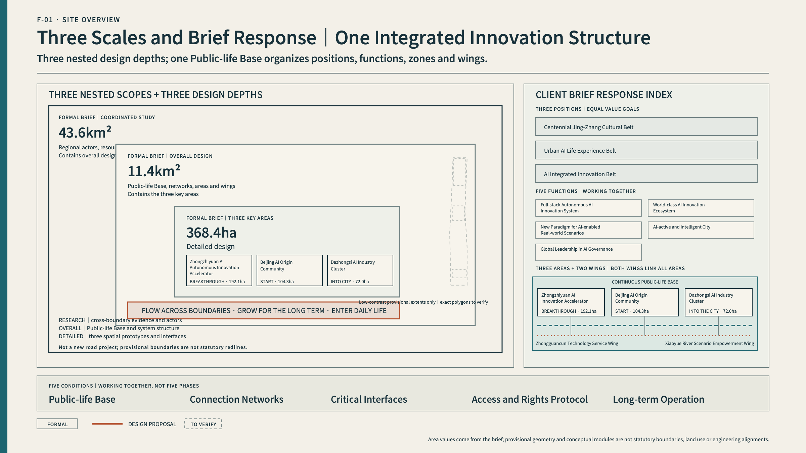
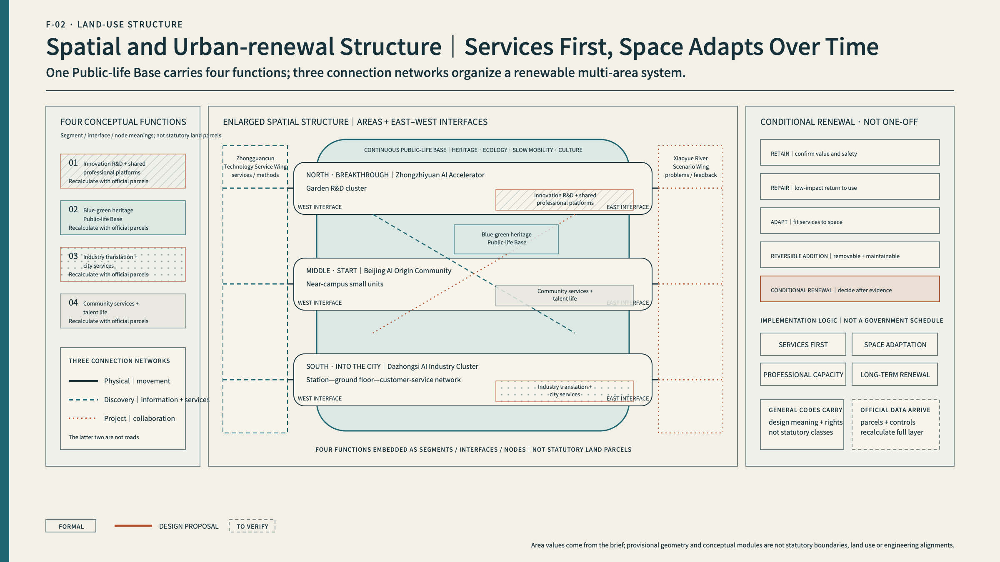
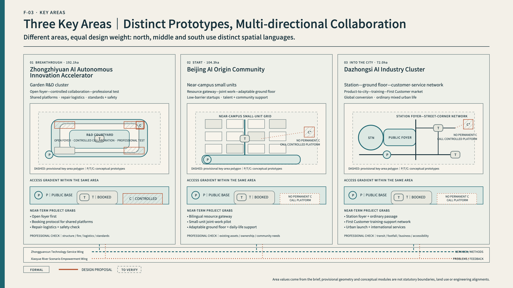
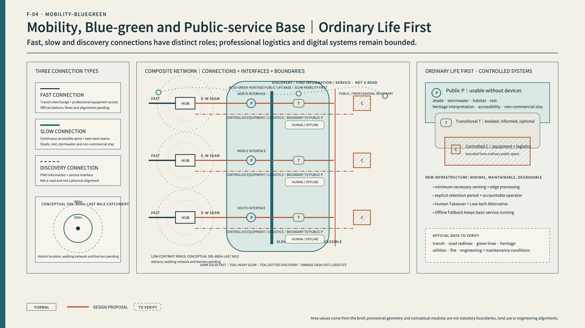
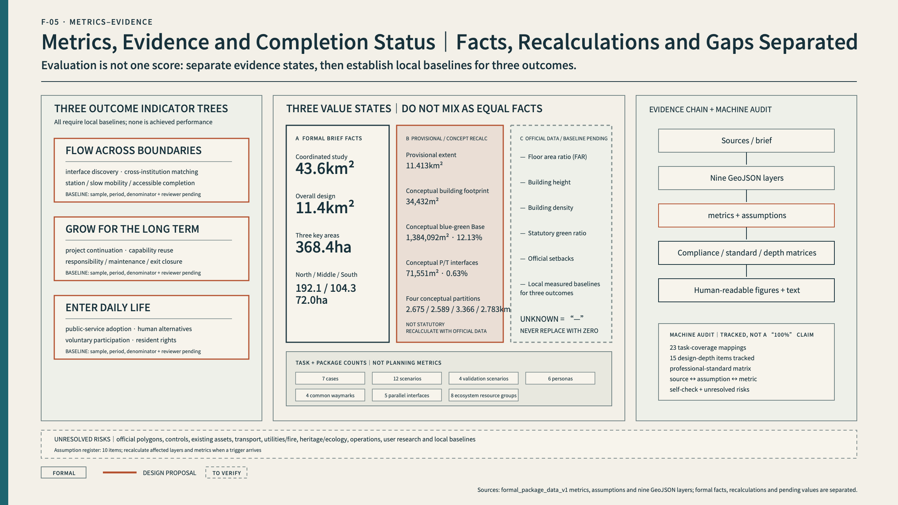

---

title: "JING-ZHANG: A NEW PATH FOR INNOVATION"
author_github: "P-Ethan"
language: "en"
proposal_format_version: "2"
bilingual_contract_version: "1"
translation_of: "proposal.md"
license: "COMMUNITY-DISPLAY-ONLY"
summary: "A public-life foundation and three connection networks enable knowledge, technology, talent, real-world needs, and markets to keep moving across institutions, districts, and project stages."
tracks: ["enterprise-services-ecosystem", "ai-traffic-walkability", "civic-agent-governance"]
scenarios: ["robot-delivery-low-speed", "enterprise-service-copilot", "ai-traffic-walkability", "ai-health-service-navigation"]
---

# JING-ZHANG: A NEW PATH FOR INNOVATION

> **From breakthrough to everyday life—and from real needs to the next breakthrough.**

## Design Basis and Source List

### Design Basis, Sources, and Evidence Boundaries

The proposal responds to the published international-call announcement, the open-call taskbook for AI agents, and the repository's formal-package rules. The task materials publish three formal area values: a 43.6 km² coordinated-research area, an 11.4 km² overall-design area, and 368.4 ha across three key areas. The northern Zhongzhiyuan AI Autonomous Innovation Acceleration Area is approximately 192.1 ha, Beijing AI Origin Community approximately 104.3 ha, and the Dazhongsi AI Industry Cluster approximately 72.0 ha. Chinese source files use two synonymous variants for the Dazhongsi designation; the English package consistently uses **Dazhongsi AI Industry Cluster**.

The announced areas and the current polygons are different forms of evidence. No exact polygon for the three scope levels is available in the cleared public material. The site and key-area geometries in this package are repository-supplied provisional substitutes. The 11.4 km² value is a formal brief fact; the provisional site polygon recalculates to about 11,412,825 m² and is used only for machine checking and layer closure. It is not an official redline. The three key-area areas follow the same rule: published figures remain authoritative for the brief, while rough polygons cannot be interpreted as parcels, roads, or construction boundaries [data:geometry/site_boundary.geojson#SITE-001] [metric:overall_design_area_announced_sqm] [metric:site_area_sqm].

Existing buildings, ownership, heritage controls, utilities, rail, road redlines, traffic, population, industry, public services, regulatory controls, and engineering conditions remain incomplete. The proposal can therefore establish a spatial structure, prototypes, interfaces, a conditional renewal method, an operating model, and a data-gap register. It cannot determine statutory floor-area ratio, height, building density, setbacks, demolition of real buildings, road or rail alignments, utility capacity, investment, or implementation. Every spatial move is a conceptual suggestion for professional teams to test and deepen [depth:risk_missing_data] [standard:MOHURD-CONTROL-DETAILED-PLANNING].

Sources are controlled by intended use. The official announcement supports tasks and area facts; the taskbook supports Agent-specific outputs; provisional geometry supports temporary drawing; local standard snapshots set professional boundaries; global cases transfer mechanisms only. Renderings, news images, OSM, narrative prose, and bounding boxes do not support official boundaries, planning controls, or precise area claims. When official data arrives, all nine GeoJSON layers, metrics, five required figures, A3/A0 drawings, and the report must be recalculated together [source:SOURCE-REGISTRY].

## Three-Level Scope Framework

### Summary and Reading Map

Haidian does not lack innovation resources. Its universities, research institutes, platforms, enterprises, capital, professional services, public-service settings, and global partners are unusually concentrated. What remains incomplete is the urban condition that allows these resources to keep moving across institutions, districts, and project stages. Research struggles to find engineering partners; teams struggle to find a first real-world setting; scenario owners enter too late to define the problem; professional validation is easily confused with everyday public life; and capabilities, responsibilities, and partnerships often disappear when a pilot ends. Another office building does not repair these breaks by itself.

The New Path is not a new road, nor is it a one-way pipeline from research in the north to the market in the south. It starts with a continuous public foundation of Jing-Zhang heritage, parks, blue-green space, slow mobility, communities, and ordinary urban life. Three additional networks connect physical access, resource discovery, and project collaboration. The northern role of **Breakthrough**, the middle role of **Start**, and the southern role of **Enter the City** are three equal urban prototypes. A project may begin at any node and travel in multiple directions among the three areas and two wings.

Three outcomes guide the proposal. **Flow across boundaries** means that resources and partners can find one another across institutional and spatial divides. **Grow for the long term** means that projects leave reusable capability, accountable operation, and lasting cooperation. **Enter daily life** means that innovation improves real services while protecting residents' choice, non-digital access, and human alternatives. A public foundation, three connection networks, five interfaces, P/T/C access rights, and daily–90-day–annual–long-term operation work together to produce these outcomes [source:OFFICIAL-ANNOUNCEMENT] [source:AGENT-TASKBOOK] [depth:overall_spatial_structure].

### Core Concept: The New Path

The contemporary significance of the Jing-Zhang Railway is not a form to imitate. It is the ability to act independently, overcome constraints, connect places and people, and keep infrastructure working over time. The New Path carries this principle forward by enabling actors that previously struggled to connect to work together continuously.

*AI-assisted conceptual illustration | Not a site photograph, existing-condition record, or statutory plan. It combines overall relationships and does not depict exact parcels, building forms, or an implementation scheme.*

### A public foundation that cannot be overwritten

Jing-Zhang heritage, parks, blue-green systems, slow mobility, communities, ordinary public services, and non-commercial places to stay form the base. This foundation must work without AI. Technology may support maintenance, information, and voluntary low-risk services; it cannot turn the park into a high-intensity test bed or displace everyday life with events and devices.

### Three connection networks

1. **Physical connection** — rail, public transport, walking, cycling, last-mile station access, and east–west seams.
2. **Resource discovery** — a bilingual directory, human and digital entries, open foyers, and the service wing.
3. **Project collaboration** — joint work, scenario agreements, shared facilities, brokerage, client collaboration, and follow-up.

The latter two are service and organisational relationships, not roads or engineering alignments.

### Five parallel interfaces

- **Find** resources, partners, platforms, scenarios, and first customers.
- **Meet** across institutions through low-threshold spaces.
- **Make** with appropriate space, professional facilities, data/IP, safety, and operational support.
- **Use** capability in clients, public services, and ordinary city life.
- **Return** outcomes, failures, maintenance knowledge, and the next problem to shared resources.

The interfaces coexist; they are not five fixed phases. A project may begin with any one of them.

### P/T/C spatial rights

- **P Public** — open over the long term, with everyday life prioritised and basic tasks possible without a device.
- **T Transitional / Time-bound** — booked, disclosed, voluntary, reversible collaboration or low-risk experience.
- **C Controlled Professional** — confidential, safety-controlled research, testing, repair, or logistics with clear professional responsibility.

Every professional user retains a basic P right. Residents and park users may enter P and voluntary low-risk T, never C by default. The New Path is neither a five-step process nor a three-area pipeline; it is a set of conditions that coexist on the public foundation [depth:three_level_scope_framework] [data:geometry/public_space.geojson#PUBLIC-M-P].

## Coordinated Research Area: Industry and Future City Research

### Diagnosis: Resources Are Close, Yet Innovation Still Breaks

### Trend: from a single model to stacks, scenarios, and lasting adoption

AI competition now extends beyond model performance to compute, data, toolchains, agents, embodied systems, safety, governance, real-world scenarios, and continued adoption. Technology may change weekly; public-service pilots may be reviewed quarterly; urban renewal proceeds annually; heritage and ecology require still longer horizons. An AI district cannot optimise only for speed. It must design handovers, accountability, and exits among these different rhythms.

### Actors: there is no single controller

The belt involves government, district operators, universities, research bodies, enterprises, professional services, capital, scenario organisations, parks, communities, residents, and international partners. No actor controls every space, resource, and responsibility. A proposal that assumes one all-powerful belt authority begins from a fiction. Each joint project instead requires an explicit but adaptable structure of Problem Owner, Technology Provider, Operator, and Accountable Party.

### Users: speed and stability must coexist

Researchers, startups, and growth companies need fast access to partners, facilities, scenarios, standards, and customers. Scenario owners and frontline staff need to define problems before a vendor chooses a product. Residents need reliable movement, quiet, privacy, accessibility, human service, and the right not to participate in testing. International talent and partners need connected work, life, and long-term cooperation. Innovation users and everyday city users are not mutually exclusive, but they require different degrees of openness, safety, and time.

### Carriers: north, middle, and south are not the same park

The north is suited to garden-like R&D, shared professional platforms, and controlled validation. The middle is suited to near-campus small units, open collaboration, first-step entrepreneurship, and talent-life support. The south is suited to a station–ground-floor–client-service network, first customers, and ordinary mixed urban life. Repeating one generic “AI module” three times would erase real spatial differences and fail to explain how both wings serve all three areas.

The central contradiction is therefore not a shortage of resources but a mismatch between strong individual nodes and weak, low-friction conversion across boundaries. The proposal shifts from building another centre to repairing breaks, creating interfaces, protecting the public foundation, and retaining capability over time [source:AGENT-TASKBOOK] [depth:existing_conditions_diagnosis].

### 43.6 km² Coordinated Research: A World-class AI Ecosystem

A world-class ecosystem is not a pile of resources. It repeatedly combines real problems, professional capability, project teams, urban settings, market feedback, and long-term governance. Its minimum working unit is not a company list but a cross-institution project.

### Seven cases: transfer mechanisms, not forms

| Case | Transferable mechanism | Jing-Zhang response | Transfer boundary |
|---|---|---|---|
| Punggol Digital District | University, industry, platforms, and a real district work together | Northern shared professional platforms and a belt-wide directory | Do not turn the park into a high-sensing test bed or accept platform lock-in [source:CASE-PDD] |
| Helsinki AI Register | Disclose purpose, responsibility, and feedback | Project registration, on-site notice, and correction | Transparency cannot replace accountability, human takeover, and exit [source:CASE-HELSINKI] |
| Toronto TIZ | Time-bound, reversible testing in real settings | Separate T experience from C professional testing | A pilot permit does not become permanent deployment [source:CASE-TORONTO] |
| Barcelona 22@ | Mixed innovation, housing, public space, and transport renewal | Low-disruption middle-area renewal, small units, and life support | Do not reproduce exclusion and rent escalation [source:CASE-BARCELONA] |
| Knowledge Quarter London | Institutional networks, member collaboration, and public opening | Resource directory, matching, and open foyers | Event volume is not long-term value [source:CASE-KQ] |
| STATION F | Concentrated startup support and conversion | Middle-area start services; southern first-customer conversion | Funding and valuation are not public value [source:CASE-STATIONF] |
| Mila | Original research, talent, entrepreneurship, and responsible AI | Northern governance and standards; middle open collaboration | Principles must become responsibilities and executable boundaries [source:CASE-MILA] |

### Eight resources and five interfaces

The ecosystem connects technology and foundation models; compute, data, and open platforms; university research and talent; startups and growth enterprises; capital, IP, and professional services; real scenarios and first customers; standards, safety, and governance; and international cooperation and market conversion. Each resource must enter projects through Find, Meet, Make, Use, and Return rather than remain in a directory.

### Four responsibilities

Every project identifies a Problem Owner, Technology Provider, Operator, and Accountable Party. Problem Owners include scenario bodies, frontline staff, and resident experience. Technology Providers disclose capability, data needs, applicable limits, and known failure modes. Operators maintain the setting, training, human takeover, and user support. Accountable Parties have authority to pause, exit, correct, and communicate externally. Roles may be shared, but none can remain empty; no single belt authority is assumed.

The Zhongguancun Technology Service Wing provides capital, IP, law, standards, talent, international services, and project brokerage to all three areas. The Xiaoyue River Scenario Empowerment Wing brings education, health, legal, daily-life, industry, and governance problems—and returns feedback—to all three. The wings are service and problem networks, not isolated land parcels [metric:ecosystem_resource_count] [metric:interface_count] [depth:overall_spatial_structure].

## Overall Design Area: Urban Renewal and Regulatory-Plan-Level Urban Design

### 11.4 km² Overall Design: One Public Foundation, Three Networks, Three Areas, Two Wings

The overall structure first protects the continuity of Jing-Zhang heritage, ecology, and everyday public life, then connects three equal nodes through physical, discovery, and collaboration networks. The provisional site polygon verifies layer closure only. The figure gives visual priority to corridors, nodes, gateways, and interfaces rather than presenting a rough rectangle as an official master plan.

Four conceptual functional partitions cover the provisional site: innovation R&D and shared professional platforms; Jing-Zhang blue-green heritage and public life; industry conversion, first customers, and city services; and community services and talent life. General land-use codes carry these concepts, but they do not represent existing or statutory land use. The entire partition must be rebuilt when official parcels and controls arrive [data:geometry/land_use.geojson#LU-001] [standard:MNR-LAND-USE-CLASSIFICATION-GUIDE].

The north uses an open foyer, controlled collaboration, and professional platforms to make R&D capability visible and accessible without exposing confidential work. The middle uses resource entries, small units, and adaptable ground floors to reduce barriers among campus, park, and community. The south uses station foyers, client collaboration, training, after-sales, and first-customer settings to bring capability into markets and daily life. Both wings continuously serve all three nodes, which remain connected in multiple directions.

Renewal does not begin with wholesale demolition. It begins with a shared directory, human service, temporary joint work, break diagnosis, and reversible public interfaces. Ground floors and spaces adapt only after real use becomes visible. Shared professional capacity follows only when demand, responsibility, maintenance, and operating conditions are proven. Successful mechanisms may then enter long-term renewal.

## Detailed Design of Key Areas

### Northern Key Area: Breakthrough

*AI-assisted conceptual illustration | Explains the public—transitional—professional gradient; not existing-condition evidence, a precise architectural design, or an implementation commitment.*

The Zhongzhiyuan AI Autonomous Innovation Acceleration Area has a published area of approximately 192.1 ha; its current polygon is provisional. The north should not become a larger closed R&D park. It should convert high-threshold technical capability into shared capability: full-stack autonomy, embodied AI, professional platforms, standards, safety, repair, and logistics.

The prototype combines a garden-like R&D cluster with three access levels. The P open foyer provides a resource entry, public explanation, and meeting. The T controlled courtyard supports booked cross-institution collaboration and observable low-risk work. The C shared professional platform supports controlled tests, confidential R&D, safety validation, repair, and professional logistics. Openness does not expose research secrets, and professional facilities are not disguised as public park space [data:geometry/key_areas.geojson#PROV-KEY-001] [data:geometry/buildings.geojson#BLDG-N-C].

Near-term actions include a shared-facility directory, open foyer, repair and logistics protocol, common standards and safety service, cross-institution booking, and clear professional boundaries. Heavy investment proceeds only when users, professional conditions, maintenance cost, responsibility, and long-term operation are proven.

### Middle Key Area: Start

Beijing AI Origin Community has a published area of approximately 104.3 ha; its exact boundary remains pending. The middle helps research, new teams, and open-source contributions take a first step without displacing residential life.

*AI-assisted conceptual illustration | Explains everyday public life and low-threshold collaboration; not existing-condition evidence, a precise architectural design, or an implementation commitment.*

The prototype combines a P resource gateway and public living room with T small-unit collaboration, adaptable ground floors, and talent/community support. The public entry provides bilingual resources, human service, informal meetings, and ordinary community functions. Small units support short projects, OPCs, open-source work, and cross-institution teams. Ground floors can return to ordinary use when a project ends. C only appears in properly controlled facilities, never as a default condition in residential life [data:geometry/key_areas.geojson#PROV-KEY-002] [data:geometry/public_space.geojson#PUBLIC-M-P].

Talent support includes housing information, family, health, education, culture, social connection, accessibility, and a reachable person—not only a desk. Residents are not test samples. Every T experience requires notice, voluntary entry, an exit, a human alternative, and result feedback. Actual relationships among universities, operators, communities, and owners require interviews [metric:persona_count].

### Southern Key Area: Enter the City

The Dazhongsi AI Industry Cluster has a published area of approximately 72.0 ha. Its provisional polygon is not a parcel or station-integration boundary. The south brings mature capability into clients, markets, and ordinary city life rather than creating a closed showroom or one-off roadshow.

*AI-assisted conceptual illustration | Explains the station-facing civic foyer and service settings; not existing-condition evidence, a precise architectural design, or an implementation commitment.*

The spatial prototype is a station–ground-floor–client-service network. The P station foyer protects ordinary movement, non-commercial staying, city announcements, and clear product information. T client collaboration and training support booked work, after-sales service, and voluntary low-risk experience. First-customer and AI-native services enter normal commerce, culture, and public life with disclosed limits and human alternatives. High-risk, confidential, and professional validation remains in C [data:geometry/key_areas.geojson#PROV-KEY-003] [data:geometry/buildings.geojson#BLDG-S-T].

Near-term actions include a station last-mile audit, ground-floor opening rules, client collaboration, training and after-sales service, bilingual international support, AI-native urban scenarios, and city launches. Station integration, four-quadrant pedestrian access, parking, passenger flow, commerce, and ownership require formal evidence and professional studies [depth:three_key_area_detailed_design].

## AI Innovation Ecosystem, Personas, and AI+ Scenarios

### People, Scenarios, and an AI-active City

The six personas are Researcher; Startup/OPC; Growth-stage Enterprise; Scenario Owner/Frontline Staff; Resident/Park User; and International Talent/Partner. They respectively require engineering and conversion, a low-cost first step, validation and customers, power to define and stop a scenario, protected daily life and human service, and an integrated work–life–cooperation entry. All six have P rights. Professional roles may enter C only when conditions are met [metric:persona_count].

### Twelve scenario cards

| ID | Scenario | Main space/right | Human or low-tech alternative | Entry/exit signal |
|---|---|---|---|---|
| S01/V1 | Shared embodied-AI validation field | Northern C | Operator, physical separation, emergency stop | Expand only after reproducible accountable results; pause after material risk |
| S02/V2 | Enterprise-agent workflow validation room | Northern/southern C | Human approval, standard process, cleared data | Human-confirm high-risk actions; exit if overreach cannot be controlled |
| S03 | Shared compute and open-tool front desk | Northern/middle P+T | Human adviser and printed directory | Costs and rights clear; adjust lock-in or discriminatory matching |
| S04 | Cross-institution joint-work setting | Middle T | Facilitator, whiteboard, workshop | No project without all four responsible roles |
| S05 | First-step entry for new teams | Middle P | Human integrated service, phone, printed guide | User reaches a person; unexplained recommendations transfer to human service |
| S06 | Open-source contribution studio | Middle T | Peer review and licence checklist | Publish only with licence, maintenance, and safety boundaries |
| S07/V3 | AI+education support co-design | Professional C; T display | Teacher judgment and non-AI learning path | Never replace evaluation; stop if burden or bias increases |
| S08 | Talent and family landing service | Middle/belt P | Human officer and printed checklist | No unrelated profiling; sensitive matters go to a person |
| S09/V4 | Diverse-user smart-terminal validation | Southern T | Human explanation, conventional comparison, immediate exit | Publish limits; no public-service entry without an alternative |
| S10 | AI-native client collaboration and first-customer studio | Southern T+C | Consultant, contract, after-sales team | Proceed with a real problem and operations; stop if it remains a demonstration |
| S11 | Human takeover and rights desk | Belt P | Human desk, phone, paper, offline completion | Remove the smart entry if the basic task cannot be completed |
| S12 | Jing-Zhang culture and contribution route | Public foundation P | Physical labels, human guide, device-free route | Facts traceable; remove uncorrectable errors |

S01, S02, S07, and S09 are the four priority validation scenarios. Professional validation begins in C. Only components that are low-risk, informed, voluntary, and replaceable may enter T. Park visitors are never used as a substitute for professional sampling [metric:scenario_card_count] [metric:validation_scenario_count].

Scenario operation moves among problem opening, team matching, professional validation, time-bound experience, first-customer or normal service, and return/reuse. The Xiaoyue River Wing connects scenario bodies and frontline staff; the middle matches teams; the north provides professional capacity; the south connects clients and normal services. This is an optional project route, not a geographic sequence. Health, education, legal, and public-safety AI remains assistive and subject to professional human review [source:LAW-ACCESSIBILITY].

## Land Use, Building Scale, and Retain-Renovate-Demolish Strategy

### Urban Renewal, Land Use, and Building Space

When existing-condition and statutory data are incomplete, the valid output is a method for renewal decisions, not a demolition list. Professional development should distinguish legally protected assets, repair and retention, adaptive reuse, reversible additions, and conditional renewal after heritage, structural safety, carbon, function, ownership, and public-benefit review. No real building may be inferred for demolition because it sits in a conceptual partition [depth:retain_renovate_demolish].

The nine building features in the GeoJSON are spatial prototypes, not existing or committed projects: a northern open foyer, controlled courtyard, and shared professional platform; a middle public living room and two small-unit collaboration prototypes; and a southern station foyer, client training space, and first-customer prototype. Their recalculated 34,432 m² footprint is a schematic module measure, not development capacity or an implementation commitment [data:geometry/buildings.geojson#BLDG-N-P] [metric:building_footprint_area_sqm].

Building space follows four principles: ground floors connect resources, public service, and real city life; open–controlled–professional gradients are directly legible; additions are maintainable, replaceable, and reversible; and night lighting, screens, and events do not disturb residents or ecology. Character draws from durable Jing-Zhang components, readable connections, maintenance traces, and human scale; from Zhongguancun's open discussion, prototyping, and knowledge sharing; and from AI culture's explainable status, traceable versions, and human oversight—not train, chip, or robot imagery.

Floor-area ratio, height, building density, statutory green ratio, and setbacks remain pending official data. The metrics figure must expose them as unknown rather than fill them with zero or schematic module values [metric:floor_area_ratio] [metric:building_height_m].

## Transport, Rail, Municipal Infrastructure, and Public Services

### Mobility, Blue-green, Municipal, and Public-service Foundation

At the present evidence level, mobility design expresses relationships rather than invented alignments. A conceptual continuous accessible route connects the three areas. The north needs an east–west seam, the middle a campus–park–community seam, and the south a station–ground-floor–client-service last mile. Roads, rail, bridges, tunnels, parking, and intersections require official networks, passenger flows, redlines, and safety studies [data:geometry/roads.geojson#ROAD-SLOW-001] [depth:traffic_rail_slow_parking].

Physical access differentiates fast connection, slow connection, and professional logistics. Resource discovery occurs through bilingual entries, wayfinding, human services, and information nodes—it is not a road. Robots, equipment maintenance, and professional-test logistics must not obstruct ordinary walking. When positioning, networks, energy, or site conditions fail, devices must slow, stop, or hand over to a person rather than block tactile paths, wheelchairs, or ordinary movement.

The conceptual blue-green public foundation recalculates to approximately 1,384,092 m². It expresses shade, rainwater, habitat, rest, accessibility, cultural interpretation, and non-commercial use, but not official green, blue, or heritage boundaries. It must work without AI; technology remains subordinate to maintenance and voluntary low-risk service [data:geometry/green_space.geojson#GREEN-GROUND-001] [metric:green_space_area_sqm].

New infrastructure follows P/T/C rights. P deploys only maintainable public-service infrastructure with human and offline alternatives. T allows booked, informed, time-bound, low-risk collaboration or experience. C contains confidential, high-risk, professional equipment and heavy logistics. Data use follows necessity, purpose limitation, edge processing where appropriate, clear retention, and accessible appeal. Utility capacity, energy, flood control, fire, pipelines, underground conditions, and electromagnetic constraints remain subject to professional verification [depth:municipal_new_infrastructure] [source:REG-GEN-AI].

## Blue-Green Network, Public Space, and Urban Character

### Public Space, AI-native Urban Life, and Shared Waymarks

Public space first provides continuous movement, ecology and heritage, everyday life, and optional encounters with innovation. Ordinary areas do not carry continuous identity sensing, high-intensity robot mixing, heavy logistics, or high-risk testing. Components include device-free wayfinding, resource desks, open meeting tables, project notices, bookable collaboration pods, human-takeover points, reversible event interfaces, quiet/no-tech signs, and professional boundary portals.

Four shared waymarks evolve over time rather than becoming giant technology monuments. **Breakthrough Commons** in the north explains critical problems and shared capability. **First Step Forum** in the middle records new teams, open-source contributions, first partners, and first projects. **City Entry Forum** in the south shows services entering client work and city life, including feedback. Belt-wide **Jing-Zhang Contribution Waymarks** record open source, breakthrough, scenario opening, public service, and maintenance [metric:pilgrimage_landmark_count].

Recognition does not rank valuation, traffic, personal behaviour, or communities. It records original research, open knowledge, real adoption, scenario opening, frontline work, accessibility, safety improvement, long-term maintenance, honest correction, and responsible exit. Every entry has a source, authorisation, validity period, correction route, and content owner.

AI-native activity in Dazhongsi is not a collection of screens and product displays. Agents, terminals, content, and enterprise services enter ordinary commerce and public culture only with client collaboration, training, after-sales service, disclosed applicability, human channels, and long-term responsibility [data:geometry/public_space.geojson#PUBLIC-S-P] [depth:blue_green_public_space].

### Culture, Identity, and International Communication

The cultural line consists of autonomy, breakthrough, connection, and operation. The historical layer covers construction, engineering, stations, and urban change. The innovation layer covers Zhongguancun's original research, open collaboration, enterprises, and talent. The future layer covers technologies, projects, services, and public contributions now in formation. Historical facts, people, and remains use traceable sources; contemporary interpretation is labelled as design interpretation.

The core identity graphic is not a track, road arrow, or chip. It shows a broken path reconnected at an interface, multiple paths retaining their own directions, and an open junction for future contributors. Deep graphite denotes facts and the public foundation; pine green denotes blue-green heritage and daily life; waymark orange denotes design moves; connection blue denotes resources and collaboration; blue grey denotes provisional constraints. Line, boundary, and text remain the second code.

Wayfinding separates city direction, resource service, project status, and cultural interpretation. Open, booked, controlled, paused, human takeover, and exited states are directly legible. The cultural-signage system coordinates with but does not merge into the belt identity.

> A century ago, the Jing-Zhang Railway opened an independent path through difficult constraints. Today, the barriers lie between research and engineering, enterprises and real-world scenarios, local resources and global partners, and the speed of innovation and the rhythm of everyday life. The New Path is not a new road. It is a distributed innovation district where breakthroughs can start, connect, enter the city, and move forward again from real needs.

Public communication must distinguish **open-call proposal**, **under review**, **selected**, **approved**, and **implemented**. Repository intake is not an award, planning adoption, implementation approval, or government endorsement [source:AGENT-TASKBOOK] [depth:height_massing_character].

## Renewal Projects, Implementation Policy, and Phasing

### Long-term Operation: Daily, 90-day, Annual, and Long-term

The New Path uses distributed operation. A light shared secretariat or rotating mechanism may coordinate the identity, resource directory, annual themes, international entry, and public baseline without controlling all assets. Area operators manage spaces, facilities, services, and maintenance. The two wings provide professional-service and scenario brokerage. Every project is carried by its four responsible roles. Specific institutions and authority remain to be confirmed.

Four rhythms coexist. Daily operation provides resource discovery, matching, talent services, open foyers, and human takeover. **NEW PATH 90** uses roughly ninety days to define a problem, form a team, validate professionally, and adopt or exit. An annual Open Week updates issues, contributions, and partners. Long-term work adapts ground floors, shared facilities, stations, parks, and professional capacity. Ninety days is a proposed working rhythm, not a universal timescale for research, high-risk work, or complex engineering.

Developers discover problems, data, facilities, and maintenance needs through a bilingual entry. They define licences, IP, safety, data, and a maintainer before producing code, documents, standards, tools, scenario methods, or failure knowledge. Cross-area reuse requires new checks of users and spatial conditions. Every scenario brief states the existing workflow, affected people, permitted data, protected public space, stopping and complaint rules, and post-project maintenance and exit.

International conversion is more than reception. Partners first understand actual capabilities and limits, then match workspace, research or enterprise partners, and life support. A first joint task proceeds through an appropriate cycle, professional validation, and client collaboration. Viable projects may receive continued talent, capital, IP, and market services; non-viable projects record why they stopped and the conditions for future cooperation [data:geometry/phasing.geojson#PHASE-NEW-PATH-001] [source:AGENT-TASKBOOK].

### Project List, Phasing, and Evaluation

Implementation follows five levels rather than a single construction programme:

| Level | Core action | Representative projects | Entry condition |
|---|---|---|---|
| P0 Diagnose breaks | Fill data, walk the site, interview, map responsibility | Official-boundary request, accessibility audit, service/facility inventory | Problem and affected users can be described |
| P1 Connect services first | Establish low-cost organisational and information interfaces | Bilingual entry, brokerage, human takeover, problem opening | Operator and accountable party are reachable |
| P2 Adapt space | Modify ground floors, small units, and public interfaces based on real use | Open foyer, joint work, station foyer, reversible components | Use, maintenance, and exit are proven |
| P3 Build professional capacity | Create shared professional facilities with demonstrated demand | Validation platform, repair/logistics, sector C settings | Professional, safety, cost, and long-term operation are viable |
| P4 Embed long-term renewal | Move mature mechanisms into formal renewal and annual review | Station/park/district renewal, long-term events, contribution system | Legal procedures, funding, and multi-party agreements are complete |

The project library records ID, problem, space, users, four-party responsibilities, P/T/C level, dependencies, term, entry/exit, maintenance, and recalculation triggers. Phasing is a working logic, not a government construction or funding commitment.

**Flow across boundaries** evaluates interface discovery, cross-institution matching, station/slow-mobility/accessibility completion. **Grow for the long term** evaluates project continuation, capability reuse, maintenance responsibility, and exit closure. **Enter daily life** evaluates public-service adoption, human alternatives, voluntary participation, and resident rights. No local baseline exists yet; these metrics define future research and pilot evaluation, not achieved performance [metric:flow_across_boundaries_baseline] [metric:grow_for_long_term_baseline] [metric:enter_daily_life_baseline].

## Metrics, Area Recalculation, and Compliance Matrix

The package keeps announced brief areas, provisional geometric recalculations, conceptual-module counts, pending statutory controls, and future local baselines separate. Formal facts include 43.6 km² for coordinated research, 11.4 km² for overall design, and 368.4 ha across the three key areas. The recalculated provisional site, four conceptual functions, blue-green foundation, P/T public interfaces, and spatial prototypes support current machine review only. FAR, height, density, statutory green ratio, and setbacks remain unknown; none of the three outcome families is claimed as achieved [metric:site_area_sqm] [metric:floor_area_ratio] [depth:metrics_recalculation].

**Flow across boundaries** evaluates discovery, cross-institution matching, and everyday access. **Grow for the long term** evaluates continuity, capability reuse, maintenance responsibility, and accountable exit. **Enter daily life** evaluates real adoption, human alternatives, voluntary participation, and resident rights. Twenty-three client/Agent requirements, fifteen depth items, and six standards point to specific chapters, figures, GeoJSON, metrics, sources, and assumptions. The full audit belongs in offline HTML and machine files rather than turning an A0 board into an unreadable matrix wall.

## Risk, Copyright, and Compliance

Official boundaries, existing buildings and ownership, statutory controls, transport, utilities, heritage/ecology, operating parties, user research, and local outcome baselines remain the central next-stage inputs. When any formal dataset arrives, all nine GeoJSON layers, metrics, figures, A3/A0 drawings, and prose must be recalculated together. The depth matrix therefore retains data gaps for statutory controls, architectural-document depth, and parts of transport and municipal evidence [standard:MOHURD-CONTROL-DETAILED-PLANNING] [depth:risk_missing_data].

Proposal text, translation, diagrams, spatial-data design annotations, offline pages, and forthcoming drawings are produced for this submission by P-Ethan using Codex × KeelMark. External cases are paraphrased from official-organisation sources recorded in `sources.json`; the package embeds no third-party case image, logo, webpage asset, or uncleared map. Every future rendering must record its tool, date, use, and limitation and must be visibly labelled as an AI-assisted conceptual illustration—not a site photograph, survey record, or official implementation promise.

People and qualified teams retain final judgment, professional responsibility, and all formal implementation decisions. Every spatial move, activity, institution, and project remains an open co-creation proposal. It does not constitute government approval, procurement, investment, engineering feasibility, or implementation. Offline HTML may contain no remote scripts, tracking, forms, or autoplay media.

## References

The complete register is provided in `sources.json`. Principal sources are the published international-call announcement and Agent taskbook; the repository site package, source registry, and provisional geometry; public standards snapshots from national planning and construction authorities; official rules on generative AI, accessibility, and non-digital service alternatives; and official-organisation material for Punggol Digital District, Helsinki AI Register, Toronto Transportation Innovation Zone, Barcelona 22@, Knowledge Quarter, STATION F, and Mila. Each source is used only within its registered boundary [source:SOURCE-REGISTRY] [source:OFFICIAL-ANNOUNCEMENT].

`MOHURD-ARCH-DESIGN-DEPTH-2016` currently remains a missing-official-source reminder. It is used only to state that this proposal has not reached formal architectural-document depth, never as a verified requirement claimed to be satisfied.
