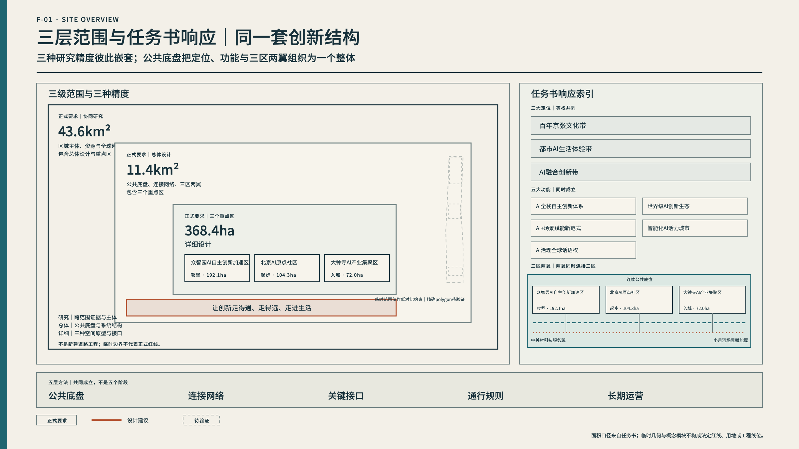
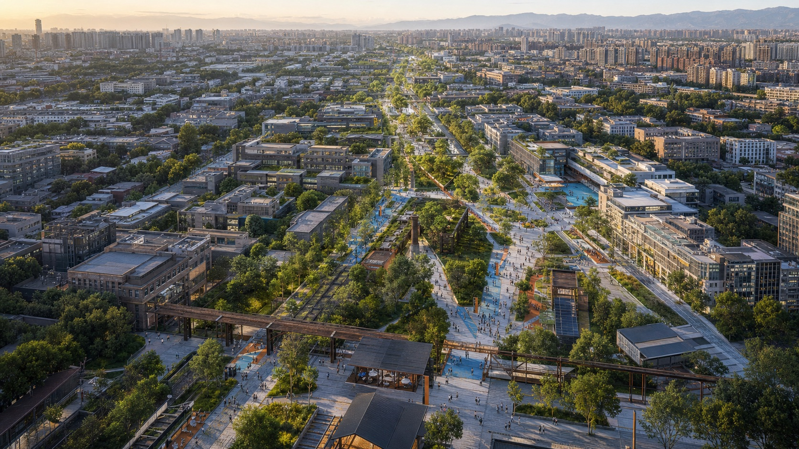
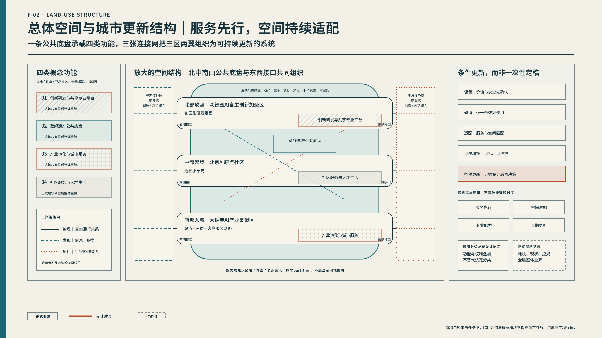
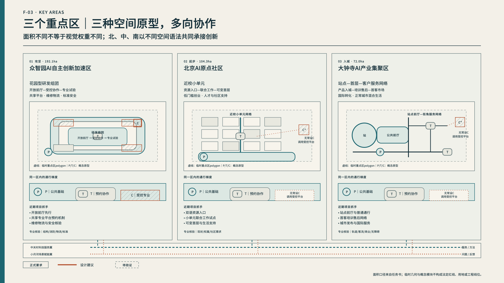
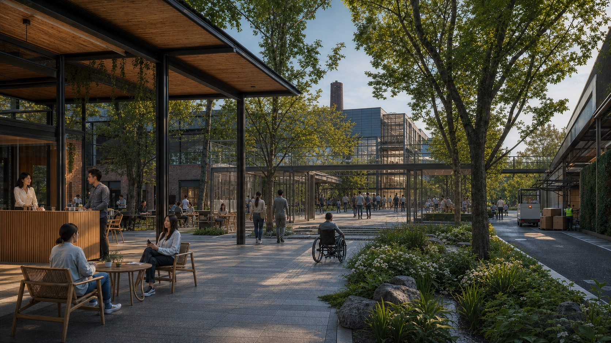
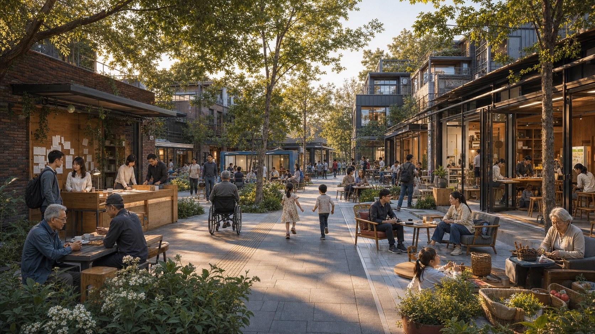
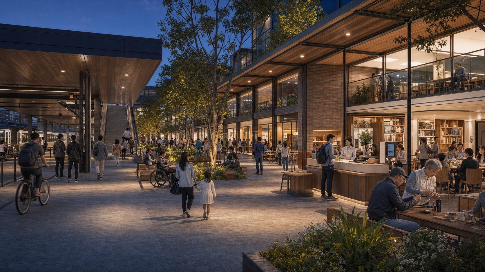
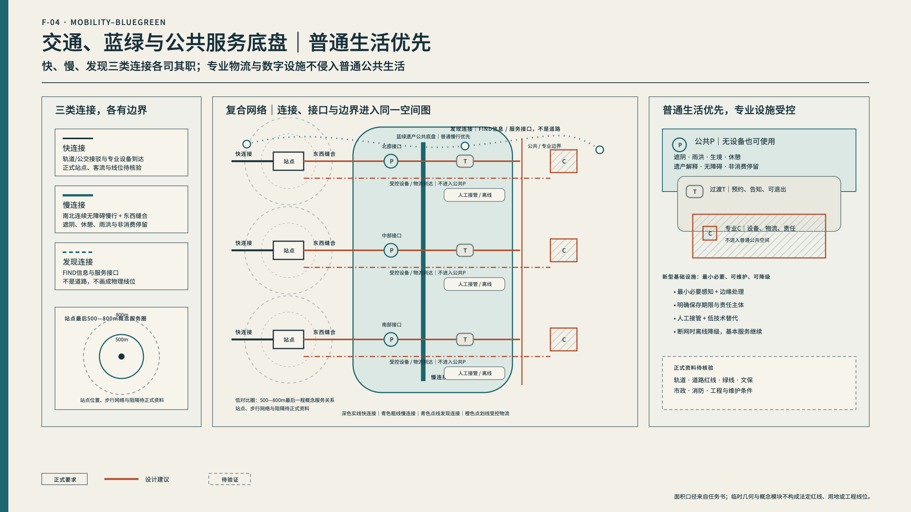
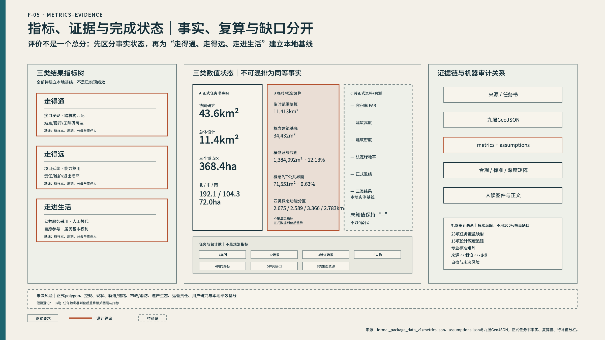

---

title: "京张新路 JING-ZHANG: A NEW PATH FOR INNOVATION"
author_github: "P-Ethan"
language: "zh"
proposal_format_version: "2"
bilingual_contract_version: "1"
translation_file: "proposal.en.md"
license: "COMMUNITY-DISPLAY-ONLY"
summary: "以公共生活为底盘，为知识、技术、人才、场景和市场建立跨机构、跨片区、跨阶段持续往来的城市条件，让创新走得通、走得远、走进生活。"
tracks: ["enterprise-services-ecosystem", "ai-traffic-walkability", "civic-agent-governance"]
scenarios: ["robot-delivery-low-speed", "enterprise-service-copilot", "ai-traffic-walkability", "ai-health-service-navigation"]
---

# 京张新路

**JING-ZHANG: A NEW PATH FOR INNOVATION**

> **让创新走得通、走得远、走进生活。**  
> **From breakthrough to everyday life—and from real needs to the next breakthrough.**

## 设计依据与资料清单

### 设计依据、来源与资料边界

本方案同时响应公开国际征集公告、面向全球智能体的任务书和仓库formal package规则。任务书给出43.6km²协同研究、11.4km²总体设计、368.4ha重点区域三个正式面积层级，其中众智园AI自主创新加速区约192.1ha、北京AI原点社区约104.3ha、大钟寺AI产业聚集区约72.0ha。智能体任务书将南部写作“大钟寺AI产业集聚区”；本成果在品牌与任务响应图采用“集聚区”，在来源审计中保留公告的另一写法，英文统一为Dazhongsi AI Industry Cluster。

正式面积和当前图形不是同一种证据。公开资料尚未提供三个层级的精确polygon；提交中的总体范围和重点区几何均来自仓库标注为provisional的粗略替代数据。11.4km²是任务书正式口径，临时总体polygon投影复算约11,412,825m²，只用于机器校验和图层闭合，不能替代正式红线。三个重点区同样以任务书面积为主，临时几何不得解释为地块、道路或建设边界 [data:geometry/site_boundary.geojson#SITE-001] [metric:overall_design_area_announced_sqm] [metric:site_area_sqm]。

现状建筑、权属、文保、市政、轨道、道路红线、交通客流、人口、产业、公共服务、控规和工程资料仍不完整。因此，本方案可以形成总体结构、空间原型、接口、条件更新方法、项目机制和待核实清单，但不能给出法定容积率、建筑高度、建筑密度、退线、具体建筑拆除、道路/轨道线位、市政容量或投资实施结论。所有空间动作均为概念建议和可供专业团队深化的参考方案 [depth:risk_missing_data] [standard:MOHURD-CONTROL-DETAILED-PLANNING]。

来源按用途管理：官方公告用于任务与面积，taskbook用于专项任务，仓库provisional geometry用于临时制图，强制标准快照用于专业边界，全球案例只用于机制迁移。效果图、新闻图片、OSM、叙事文本和临时bbox均不作为正式边界、控制指标或面积事实的依据。正式数据到位后，九层GeoJSON、指标、五张规定图、A3/A0和正文必须整体重算，而不是局部换底图 [source:SOURCE-REGISTRY]。

## 三层范围工作框架

### 摘要与阅读地图

海淀不缺创新资源。高校、研究机构、平台、企业、资本、专业服务、公共场景和全球伙伴在这里高度密集；真正需要补上的，是让这些资源跨越机构、片区和项目阶段持续往来的城市条件。研究成果找不到工程伙伴，团队找不到首个场景，场景方没有在问题定义阶段进入，专业验证与普通公共生活边界不清，项目结束后能力、责任和伙伴关系难以留下——这类“断点”不会因为再增加一栋办公楼自动消失。

“京张新路”不是新建一条道路，也不是把北中南画成技术从研发到市场的单向流水线。它以京张遗产、公园、蓝绿、慢行、社区和普通公共生活为连续底盘，再叠加物理连接、资源发现和项目协作三张网络，使技术、人才、问题、服务和市场能够多向组合。北部“攻坚”、中部“起步”、南部“入城”是三种等权的城市原型：任何一个项目都可以从任意节点进入，并在三区两翼之间往返。

三类结果贯穿全文：走得通，指资源和伙伴能够跨越边界找到彼此；走得远，指项目形成可复用能力、明确责任和长期合作；走进生活，指创新改善真实服务，同时保护居民选择、不使用技术的权利和人工替代。设计由公共底盘、三张连接网、五类关键接口、P/T/C通行规则和日常—90天—年度—长期运营共同支撑 [source:OFFICIAL-ANNOUNCEMENT] [source:AGENT-TASKBOOK] [depth:overall_spatial_structure]。

### 总概念：京张新路

京张铁路的当代意义不是可被复制的造型，而是自主、攻坚、连接和长期运行。京张新路继承的是这种基础设施精神：使此前无法顺畅往来的主体持续发生关系。

*AI辅助概念表达｜非现场照片、现状证据或正式规划依据；为总体关系的场景拼合，不对应精确地块、建筑形态或实施方案。*

### 一条不可覆盖的公共底盘

京张遗产、公园、蓝绿、慢行、社区、普通公共服务和非消费性停留构成全线基础。公共底盘在没有AI时也必须正常工作；AI只能辅助维护、信息和低风险自愿服务，不能把公园变成高强度测试场，也不能以活动和设备覆盖居民日常。

### 三张连接网

1. **物理连接**：轨道、公交、步行、骑行、站点最后一程和东西缝合；
2. **资源发现**：双语资源目录、人工/数字入口、开放前厅和服务翼；
3. **项目协作**：联合工作、场景合同、共享设施、项目经纪、客户协作和成果回访。

后两张网是服务与组织关系，不是道路，不在图上伪装成工程线位。

### 五类并列接口

- **找得到**：资源、伙伴、平台、场景和首客可以被发现；
- **见得上**：不同机构和用户有低门槛会面条件；
- **做得成**：项目能够获得空间、专业设施、数据/IP、安全和运营支持；
- **用得上**：能力进入客户、公共服务和正常城市生活；
- **回得来**：结果、失败、维护经验和下一问题返回共同资源。

五个接口共同成立，不代表固定阶段；一个项目可从任一接口开始。

### P/T/C空间通行规则

- **P 公共**：长期开放，普通生活优先，不使用设备也能完成基本任务；
- **T 过渡**：预约、限时、告知、自愿且可退出的协作或低风险体验；
- **C 专业**：受控、保密、安全和专业责任明确的研发、测试、维修与物流。

每类专业用户都拥有基础公共P权利；居民与公园用户只进入P和自愿低风险T，不进入C。京张新路不是五个阶段，也不是三区流水线，而是公共底盘上共同存在的五层条件 [depth:three_level_scope_framework] [data:geometry/public_space.geojson#PUBLIC-M-P]。

## 统筹研究范围产业与未来城市研究

### 诊断：资源很近，创新仍会断

### 趋势：从单点模型转向全栈、场景与长期采用

AI竞争正在从单一模型性能扩展到算力、数据、工具链、智能体、具身系统、安全治理、真实场景和持续采用。技术迭代按周发生，公共服务试点可能按季度复盘，城市更新按年度推进，遗产与生态以更长周期维护。未来AI城区不能只追求“快”，还要设计不同速度之间的交接、责任和退出。

### 主体：没有单一控制者

一带涉及政府、园区、高校、研究机构、企业、专业服务、资本、场景单位、公园、社区、居民与国际伙伴。任何一个主体都无法独自掌握全部空间、资源和责任。若设计假设存在一个统一控制中心，项目一开始就会失真；真正需要的是让问题方、技术方、运营方和责任方在每个联合项目中形成明确但可变的结构。

### 用户：速度与稳定必须同时成立

研究者、初创和成长企业需要快速找到伙伴、设施、场景、标准和客户；场景方与一线人员需要问题不被供应商反向定义；居民需要稳定通行、安静、隐私、无障碍、人工服务和不参与测试的权利；国际人才与伙伴需要工作、生活和长期合作入口。创新用户与普通城市用户不是两个互斥群体，但他们对开放、安全和时间的要求不同。

### 载体：北中南不是同一种园区

北部更适合花园型研发、共享专业平台和受控验证；中部更适合近校小单元、开放协作、创业第一步和人才生活支持；南部更适合站点—首层—客户服务网络、首客市场和正常城市混合生活。将同一“AI模块”复制三次，会抹掉真实空间条件，也无法解释两翼如何同时服务三区。

因此，主矛盾不是资源数量不足，而是强单点资源与低摩擦跨边界转化能力之间的不匹配。设计重点从“再造一个中心”转向“修通断点、建立接口、保护底盘、留下长期能力” [source:AGENT-TASKBOOK] [depth:existing_conditions_diagnosis]。

### 43.6km²协同研究：世界级AI创新生态

世界级生态不是资源数量的叠加，而是让真实问题、专业能力、项目团队、城市场景、市场反馈和长期治理反复组合。生态的最小工作单元不是企业名单，而是跨机构联合项目。

### 七个案例：迁移机制，不复制形态

| 案例 | 可迁移机制 | 京张空间/运营响应 | 迁移边界 |
|---|---|---|---|
| Punggol Digital District | 大学、产业、平台与真实城区协同 | 北部共享专业平台；三区共用资源目录 | 不把公园变成高传感测试场，不接受单一平台锁定 [source:CASE-PDD] |
| Helsinki AI Register | 公开用途、责任和反馈 | 项目登记、现场说明和纠错入口 | 透明不替代责任合同、人工接管和退出 [source:CASE-HELSINKI] |
| Toronto TIZ | 真实环境中限时、可撤回测试 | T类限时体验与C类专业测试分离 | 试点许可不自动转成长期部署 [source:CASE-TORONTO] |
| Barcelona 22@ | 创新、居住、公共空间和交通混合更新 | 中部低扰动更新、小单元和生活服务 | 不复制排斥和租金上升模式 [source:CASE-BARCELONA] |
| Knowledge Quarter London | 机构网络、成员协作与公共开放 | 资源目录、项目匹配、开放前厅 | 不把活动数量等同长期成果 [source:CASE-KQ] |
| STATION F | 集中创业服务和规模化转化 | 中部起步服务、南部首客和国际转化 | 不把融资和估值等同公共价值 [source:CASE-STATIONF] |
| Mila | 原始研究、人才、创业与负责任AI并置 | 北部治理标准、中部开源人才协作 | 原则必须转成责任、空间边界和流程 [source:CASE-MILA] |

### 八类资源与五类接口

技术与基础模型，算力/数据/开放平台，高校科研与人才，创业与成长企业，资本/IP/专业服务，真实场景与首个客户，标准/安全/治理，国际合作与市场转化，共同构成八类资源。每类资源必须通过“找得到、见得上、做得成、用得上、回得来”进入项目，而不是停留在名录。

### 四方责任

每个项目至少明确问题方、技术方、运营方和责任方。问题方包括场景单位、一线人员和居民经验；技术方说明能力、数据、适用边界和失败模式；运营方承担培训、维护、人工接管和用户支持；责任方拥有暂停、退出、整改和外部沟通权限。角色可以由多个机构共同承担，但不能留空，也不假设由一个带级中心统管。

中关村科技服务翼向三区提供资本、IP、法律、标准、人才、出海和项目经纪；小月河场景赋能翼向三区提供教育、医疗、法律、生活、产业和治理问题及反馈。两翼不是两块孤立用地，而是持续输入方法、服务、问题和经验的网络 [metric:ecosystem_resource_count] [metric:interface_count] [depth:overall_spatial_structure]。

## 总体设计范围城市更新与控规深度城市设计

### 11.4km²总体设计：一条公共底盘、三张连接网、三区两翼

总体结构首先保留京张遗产、生态和普通公共生活的连续性，再将北部、中部、南部三个等权节点接入物理、发现和协作网络。临时总体polygon只用于校验图层闭合；主图强调廊道、节点、门户和接口，不把粗矩形渲染成正式总图。

四类概念功能分区完整覆盖临时总体范围：创新研发与共享专业平台；京张蓝绿遗产与公共生活；产业转化、首客与城市服务；社区服务与人才生活。分类使用通用用地代码承载，但不代表现状或法定用地；正式地块和控规资料到位后必须整体重算 [data:geometry/land_use.geojson#LU-001] [standard:MNR-LAND-USE-CLASSIFICATION-GUIDE]。

公共底盘串联三类空间关系。北部开放前厅让研发资源可见，受控协作和专业平台向内递进；中部资源入口、小单元和可变首层降低跨校区、园区和社区的第一步门槛；南部站点前厅、客户协作、培训售后和首客空间把能力带入市场与日常。两翼分别向三处节点提供服务和真实问题，三区之间保持双向联系。

总体更新不以一次性大拆大建为前提。优先建立资源入口、人工服务、临时联合工作、断点识别和可逆公共接口；其后根据真实使用适配首层和空间；只有需求、责任、维护和专业条件被证明后，才建设共享专业能力；最后将成立的动作纳入长期更新。

## 重点区域详细设计

### 北部重点区：攻坚

*AI辅助概念表达｜用于说明公共—过渡—专业空间梯度，不作为现状证据、精确建筑方案或实施承诺。*

众智园AI自主创新加速区正式面积约192.1ha，当前polygon为临时粗略范围。北部的任务不是做更大的封闭研发园，而是把高门槛技术能力转为跨主体可使用的共同能力：全栈自主、具身智能、共享专业平台、标准、安全、维修和物流。

空间原型采用花园型研发组团与三层梯度。P类开放前厅提供资源说明、公开会面和共同问题入口；T类受控协作庭院服务预约联合工作、技术交流和可观察的低风险活动；C类共享专业平台承担受控试验、保密研发、安全验证、维修和专业物流。开放不意味着研发秘密被展示，专业设施也不能伪装为普通公园 [data:geometry/key_areas.geojson#PROV-KEY-001] [data:geometry/buildings.geojson#BLDG-N-C]。

近期项目抓手包括共享设施目录、开放前厅、维修与专业物流协议、标准/安全共同服务、跨机构预约和专业边界导视。是否建设重资产平台取决于真实使用者、专业条件、维护成本、责任和长期运营，不因概念图而自动成立。

### 中部重点区：起步

北京AI原点社区正式面积约104.3ha，具体边界待官方polygon。中部要解决的是研究、新团队和开源贡献如何更容易迈出第一步，同时不以创业活动覆盖居民生活。

*AI辅助概念表达｜用于说明日常公共生活与低门槛协作，不作为现状证据、精确建筑方案或实施承诺。*

空间原型由P类资源入口与公共客厅、T类小单元联合工作、可变首层和人才/社区生活支持组成。公共入口提供双语资源、人工服务、非正式会面和普通社区功能；小单元适合短周期团队、OPC、开源协作和跨机构工作；首层可在项目结束后恢复普通使用。专业C只在具备责任和安全条件的设施中，不进入居民日常空间 [data:geometry/key_areas.geojson#PROV-KEY-002] [data:geometry/public_space.geojson#PUBLIC-M-P]。

人才支持不只包括工位，还包括住房信息、家庭、健康、教育、文化、社交、无障碍和真人服务。居民不是测试样本；任何T类体验都必须有告知、自愿、退出、人工替代和结果回告。高校、园区、社区和产权主体的真实关系仍需访谈校正 [metric:persona_count]。

### 南部重点区：入城

大钟寺AI产业集聚区正式面积约72.0ha，当前polygon不代表地块或站点一体化边界。南部承担成熟能力进入客户、市场和正常城市生活的接口，而不是封闭展厅或一次性路演。

*AI辅助概念表达｜用于说明站点公共前厅与服务场景，不作为现状证据、精确建筑方案或实施承诺。*

空间原型是站点—首层—客户服务网络。P类站点前厅保障普通通行、非消费性停留、城市发布和产品说明；T类客户协作和培训空间支持预约合作、售后和低风险自愿体验；首客与AI原生业态进入正常商业、文化和公共生活，公开适用/不适用条件和人工替代。高风险、保密或专业验证仍留在C类设施 [data:geometry/key_areas.geojson#PROV-KEY-003] [data:geometry/buildings.geojson#BLDG-S-T]。

近期项目抓手包括站点最后一程走查、首层开放规则、客户协作与培训售后、双语国际服务、AI原生业态场景和城市发布。具体站点、四象限步行、停车、客流、商业和产权条件均需正式资料与专业研究 [depth:three_key_area_detailed_design]。

## AI 创新生态、人才画像与 AI+ 场景

### 人物、场景与AI活力城市

六类人物是研究者、初创/OPC、成长企业、场景方/一线人员、居民/公园用户、国际人才/伙伴。研究者需要工程、设施和转化；初创需要低成本第一步；成长企业需要验证、标准、客户和出海；场景方要共同定义问题并拥有停止权；居民要普通城市生活、人工通道和不参与测试；国际伙伴需要工作、生活和长期合作入口。六类人物都拥有P类公共权利，只有专业角色在条件成立时进入C [metric:persona_count]。

### 十二张场景卡

| ID | 场景 | 主要空间/权利 | 人工或低技术替代 | 进入/退出信号 |
|---|---|---|---|---|
| S01/V1 | 具身智能共享验证场 | 北部C | 操作员、物理隔离、急停 | 可复现且责任闭环才扩大；重大风险即暂停 |
| S02/V2 | 企业智能体工作流验证室 | 北部/南部C | 人工审批、标准流程、清权数据 | 高风险动作人工确认；越权不可控即退出 |
| S03 | 共享算力与开源工具前台 | 北部/中部P+T | 人工顾问、纸面目录 | 费用权限清楚；锁定或歧视即调整 |
| S04 | 跨机构联合工作场 | 中部T | 主持人、白板、线下工作坊 | 四方角色不完整不立项 |
| S05 | 新团队第一步入口 | 中部P | 人工综合服务、电话、纸质指南 | 能找到下一位真人；不可解释即转人工 |
| S06 | 开源贡献工作室 | 中部T | 同行评审、许可证清单 | 许可、维护、安全完整才发布 |
| S07/V3 | AI+教育辅助服务共创 | 专业C，展示T | 教师最终判断、无AI课程路径 | 不替代评价；负担或偏差增加即停止 |
| S08 | 人才与家庭落地服务 | 中部/全线P | 人工专员、纸质清单 | 不作无关画像；敏感事项转真人 |
| S09/V4 | 智能终端多样用户验证 | 南部T | 人工讲解、普通产品对照、随时退出 | 公开适用边界；无替代则不进公共服务 |
| S10 | AI原生客户协作与首客工作室 | 南部T+C | 顾问、合同与售后团队 | 有真实问题与运维才进首客；只演示则结束 |
| S11 | 人工接管与权利柜台 | 全线P | 真人柜台、电话、纸面 | 基本任务不可完成则下线智能入口 |
| S12 | 京张文化与当代贡献路径 | 公共底盘P | 实体展签、讲述人、无设备路线 | 史实可追溯；错误不能修正即撤下 |

S01、S02、S07、S09为四个重点验证场景。验证先在C类专业空间完成，只有低风险、知情、自愿且具备人工替代的部分才进入T类体验；不得以公园人流代替专业样本设计 [metric:scenario_card_count] [metric:validation_scenario_count]。

场景运行遵循“问题开放—团队匹配—专业验证—限时体验—首客/常态服务—返回复用”。小月河翼连接场景单位和一线人员，中部匹配团队，北部提供专业能力，南部连接客户与正常城市服务；这是项目可选择的路径，不是地理阶段。健康、教育、法律、安全等高风险服务只作辅助，必须由相应专业人员复核 [source:LAW-ACCESSIBILITY]。

## 用地、建筑规模与拆改留方案

### 城市更新、用地与建筑空间

在现状与控规数据不足时，仍然成立的是更新判断方法，而不是具体拆除清单。专业深化采用五级条件更新：依法确认必须保护；保留并修缮；适应性再利用；可逆增补；经历史价值、结构安全、碳排、功能、产权和公共收益多专业论证后条件更新。任何真实建筑都不能仅因处于概念分区而被推断拆除 [depth:retain_renovate_demolish]。

GeoJSON中的九个建筑要素是空间原型而非现状或新建项目：北部开放前厅、受控协作庭院和共享专业平台；中部公共客厅及两个小单元联合工作原型；南部站点前厅、客户协作培训和首客业态原型。34,432m²只是这些示意模块在临时几何上的复算基底，不是建筑规模指标、开发容量或实施承诺 [data:geometry/buildings.geojson#BLDG-N-P] [metric:building_footprint_area_sqm]。

建筑空间遵循四条原则：首层把资源、公共服务和真实城市生活连接起来；开放—受控—专业梯度可被直接看懂；新增构件可维护、可更换、可逆；夜间照明、屏幕和活动不侵扰居民与生态。城市风貌从京张迁移耐久构件、清晰连接、维护痕迹和尺度感，从中关村迁移开放讨论、样机和知识共享，从AI新文化迁移状态可解释、版本可追溯和人类监督，而不是复制火车、芯片或机器人造型。

容积率、高度、建筑密度、法定绿地率和退线均保持待正式资料补齐。指标图必须把这些未知项明确展示，不能用0或概念模块数值填补 [metric:floor_area_ratio] [metric:building_height_m]。

## 交通、轨道、市政与公共服务设施

### 交通、蓝绿、市政与公共服务底盘

交通策略在当前资料阶段只表达连接问题，不提供虚构线位。南北连续无障碍慢行概念线串联三区；北部设置东西缝合需求，中部连接校区—园区—社区，南部连接站点—首层—客户服务。具体道路、轨道、桥隧、停车和交叉口必须在正式交通网络、客流、道路红线和安全资料到位后深化 [data:geometry/roads.geojson#ROAD-SLOW-001] [depth:traffic_rail_slow_parking]。

物理连接分为快连接、慢连接和专业物流；资源发现通过双语入口、导视、人工服务和信息节点完成，不画成道路。机器人、设备维护和专业试验物流必须与普通慢行分流；当网络、定位、能源或现场条件不可靠时，设备应降速、停止或转人工，不能阻断盲道、轮椅路径和普通通行。

概念蓝绿公共底盘约1,384,092m²，只表达连续遮阴、雨洪、生境、休憩、无障碍、文化解释和非消费性停留的设计意图，不代表绿线、蓝线或文保边界。它在无AI时仍能正常工作，技术只辅助养护与低风险自愿服务 [data:geometry/green_space.geojson#GREEN-GROUND-001] [metric:green_space_area_sqm]。

新型基础设施按P/T/C分级。P类只部署普通公共服务所需、可维护且有人工/离线替代的设施；T类允许预约、告知、限时、低风险的协作与体验；C类承载保密、高风险、专业设备和重物流。数据遵循最小必要、目的限定、边缘处理优先、保存期限明确和申诉可达；市政容量、能源、防洪、消防、管线、地下空间和电磁条件均待专业核验 [depth:municipal_new_infrastructure] [source:REG-GEN-AI]。

## 蓝绿空间、公共空间与城市风貌

### 公共空间、AI原生业态与共同路标

公共空间首先提供连续通行、生态遗产、普通日常和可选择的创新相遇。普通区域不承担持续身份识别、高强度机器人混行、重物流或高风险测试。公共组件包括无技术也可用的路标、资源入口、开放会客桌、项目说明牌、预约协作舱、人工接管点、可逆活动接口、安静区标识和专业边界门架。

四个共同路标不是巨大科技纪念碑，而是持续更新的公共内容：北部“攻坚公厅”说明关键问题和共享能力；中部“第一步广场”记录新团队、开源贡献、第一位伙伴和第一份项目；南部“入城客厅”展示进入客户与城市生活的服务及反馈；全线“京张贡献路标”记录开源、攻坚、场景开放、公共服务和维护贡献 [metric:pilgrimage_landmark_count]。

荣誉系统不做企业估值、流量、个人行为或社区排名。它记录原始突破、开源共享、真实采用、场景开放、一线共创、无障碍、安全改进、长期维护、诚实纠错和主动退出。每项内容有来源、授权、有效期、纠错入口和更新责任。

大钟寺AI原生业态不等于大屏和产品展柜。智能体、终端、内容和企业服务进入正常商业与公共文化活动时，必须同时具有客户协作、培训售后、适用边界、人工通道和长期责任 [data:geometry/public_space.geojson#PUBLIC-S-P] [depth:blue_green_public_space]。

### 文化、品牌与国际传播

文化主线由自主、攻坚、连接和运行四个动作构成。历史层讲京张建设、工程突破、站场与沿线城市变化；创新层讲中关村原始创新、开源协作、企业与人才贡献；未来层讲正在形成的技术、项目、城市服务和公共贡献。历史事实、人物和遗存只依据可追溯来源表达，当代转译明确标注为设计解释。

Logo核心图形不是铁轨、道路箭头或芯片，而是中断路径在接口处重新接通；多条路径相遇后保留各自方向，连接点保持开放。深石墨用于事实和公共底盘，松石绿用于蓝绿遗产与日常，路标橙用于设计动作，连接蓝用于资源协作，灰蓝用于临时边界；颜色之外仍以线型、边界和文字编码。

导视分为城市方向、资源服务、项目状态和文化解释四层。开放、预约、受控、暂停、人工接管和退出必须直接可读；文化标识与一带Logo协调但不混成同一系统。

> 一百年前，京张铁路在复杂约束中开出一条自主之路。今天，新的阻隔存在于研究与工程、企业与场景、本地资源与全球合作、创新速度与日常城市之间。京张新路不是一条新建道路，而是一座分布式创新城区：让突破能够开始、连接、进入城市，并从真实问题中继续向前。

国际传播必须区分open-call proposal、under review、selected、approved和implemented，不得把投稿收录描述为获奖、正式规划采用、实施批准或政府背书 [source:AGENT-TASKBOOK] [depth:height_massing_character]。

## 更新项目清单、实施政策与分期计划

### 长期运营：日常、90天、年度和长期更新

京张新路由分布式角色共同运行。轻量共同秘书处或轮值机制负责品牌、资源目录、年度议题、国际入口和公共底线，但不控制全部资产；三区运营者管理空间、设施、服务和维护；两翼伙伴提供专业服务和场景经纪；每个项目由问题、技术、运营和责任四方承担具体义务。机构名称和权责需后续确认。

四种节奏共同存在：日常提供资源查询、项目匹配、人才服务、开放前厅和人工接管；“京张新路90”用约90天完成问题定义、团队组成、专业验证和采用/退出；年度开放周更新问题、贡献和伙伴；长期更新首层、共享设施、站点、公园和专业能力。90天是工作周期建议，不适用于所有科研、高风险或复杂工程项目。

开发者通过双语入口发现问题、数据、设施和维护需求；明确许可证、IP、安全、数据和维护人后，形成代码、文档、标准、工具、场景方法或失败知识；跨区复用前重新核验用户与空间条件。场景开放必须说明当前流程、受影响者、数据边界、不可占用公共空间、停止投诉条件和结束后的维护/退出。

国际转化不是参观接待。伙伴先理解真实能力和边界，再匹配工作空间、研究/企业伙伴和生活服务，形成首个联合任务，完成专业验证和客户协作，成立后再获得人才、资本、IP与市场支持；不成立的项目同样记录原因和下一次合作条件 [data:geometry/phasing.geojson#PHASE-NEW-PATH-001] [source:AGENT-TASKBOOK]。

### 项目清单、分期与评价

实施采用五级递进而非一次性建设：

| 层级 | 核心动作 | 代表项目 | 进入条件 |
|---|---|---|---|
| P0 识别断点 | 补数据、走查、访谈、责任图谱 | 正式边界请求、无障碍走查、服务/设施清单 | 问题与受影响者可被说明 |
| P1 先通服务 | 用低成本组织和信息接口建立联系 | 双语资源入口、项目经纪、人工接管、问题发布 | 运营与责任角色可达 |
| P2 适配空间 | 根据真实使用改造首层、小单元和公共接口 | 开放前厅、联合工作、站点前厅、可逆组件 | 使用、维护和退出被证明 |
| P3 专业能力 | 建设有明确需求和责任的共享专业设施 | 验证平台、维修物流、行业C类场景 | 专业、安全、成本和长期运营成立 |
| P4 长期更新 | 把成熟机制纳入正式更新和年度复盘 | 站点/公园/园区更新、长期活动和贡献系统 | 法定程序、资金和多主体协议完整 |

项目库需要记录ID、问题、空间、用户、四方责任、P/T/C等级、依赖、期限、进入/退出、维护和重算触发器。分期图表达工作逻辑，不是政府建设时序或资金承诺。

“走得通”评价接口发现、跨机构匹配、站点/慢行/无障碍可达；“走得远”评价项目延续、能力复用、维护责任和退出闭环；“走进生活”评价公共服务采用、人工替代、自愿参与和居民基本权利。三类结果尚无本地实测基线，只用于定义下一步调查和试点评价，不能作为已实现绩效 [metric:flow_across_boundaries_baseline] [metric:grow_for_long_term_baseline] [metric:enter_daily_life_baseline]。

## 指标体系、面积复算与合规矩阵

本成果把任务书正式面积、临时几何复算、概念模块数量、待补法定控制和待建本地基线分开管理。正式口径包括43.6km²协同研究、11.4km²总体设计和368.4ha三个重点区；临时总体polygon复算值、四类概念功能、蓝绿底盘、P/T公共界面和建筑空间原型只用于当前机器校验。容积率、高度、密度、法定绿地率和退线保持未知，三类结果指标也不宣称已实现 [metric:site_area_sqm] [metric:floor_area_ratio] [depth:metrics_recalculation]。

“走得通”评价资源发现、跨机构匹配与普通可达；“走得远”评价项目延续、能力复用、维护责任和退出闭环；“走进生活”评价真实采用、人工替代、自愿参与和居民权利。23项甲方/Agent要求、15项设计深度和6条标准分别回指到具体章节、图件、GeoJSON、指标、来源和假设；完整索引进入离线网页和机器文件，不把A0做成矩阵墙。

## 风险、版权与合规说明

正式边界、现状建筑与权属、控规、交通、市政、遗产生态、运营主体、用户访谈和本地绩效基线仍是下一阶段的核心输入。取得任一正式数据后，必须整体重算九层GeoJSON、指标、图件、A3/A0和正文，而非局部替换底图。当前设计深度矩阵诚实保留控规、建筑设计深度及部分交通市政的data gap [standard:MOHURD-CONTROL-DETAILED-PLANNING] [depth:risk_missing_data]。

方案文本、双语翻译、图解、空间数据设计注记、离线网页和后续图纸由P-Ethan使用Codex × KeelMark为本投稿生成。外部案例只依据`sources.json`列明的官方机构资料作机制转译，不嵌入第三方案例图片、Logo、网页资产或未清权地图。效果图在生成后必须单独登记工具、日期、用途和限制，并醒目标注为AI辅助概念表达，不得作为现场照片、现状证据或官方效果承诺。

最终判断、专业责任和任何正式实施决定由人类与相应资质团队承担。全部空间、活动、机构和项目均为开放共创参考，不构成政府审定、采购、投资、工程可行性或实施承诺；离线HTML不得包含远程脚本、跟踪、表单或自动播放媒体。

## 参考资料

完整来源登记见`sources.json`。本方案主要使用：公开国际征集公告与Agent任务书；仓库site package、来源注册表及provisional geometry；住房城乡建设和自然资源主管部门的公开标准快照；生成式AI、无障碍和老年数字服务的官方规则；Punggol Digital District、Helsinki AI Register、Toronto Transportation Innovation Zone、Barcelona 22@、Knowledge Quarter、STATION F和Mila的官方机构资料。来源只在其登记的用途边界内使用 [source:SOURCE-REGISTRY] [source:OFFICIAL-ANNOUNCEMENT]。

`MOHURD-ARCH-DESIGN-DEPTH-2016`当前仅有缺源提醒，未取得可核验官方正文，故只用于声明本方案尚未达到正式建筑设计文件深度，不作为已满足的规范条文依据。
