# 百年京张·对径智轴
## ——AI创新带城市设计方案（v5.13.3）

> **指导思想**：习近平总书记"人民城市人民建、人民城市为人民"重要理念
> **理论主线**：新空间经济「品质—人才—产业」因果链条
> **理论基础**：中央城市工作会议六维现代化人民城市框架 × 杨开忠新空间经济
> **政策依据**：国家/北京/海淀三级"十五五"规划
> **设计范围**：百年京张·对径智轴AI创新带（统筹研究43.6km² / 总体设计11.4km² / 重点区域368.4ha）
> **空间范式**：对径式「一径·三核·双环·多庭」（空间经济范式：品质梯度驱动人才动态集聚）
> **设计理念**：一脉三质·六维七度·溯源启新

> **方案性质**：开放共创概念建议，不替代正式规划，不构成政府审定结论
>
> ⚠️ **重要提示（provisional/概念情景/非审批依据）**：本方案中所有空间边界、面积数据、用地布局、容积率、建筑高度、拆改留比例、投资估算、效益预测等均为**概念情景研究参数**，仅用于设计讨论和方向探索，不代表官方红线、不构成法定规划指标、不作为审批或实施依据。所有数值附近均有相应警示标识。
> 📐 **图件视觉v5.1优化说明**：A0-A3色彩映射统一、警示标识移至图表旁、metrics-evidence文字修复、A0布局优化、地图标签放大等工作正在进行，当前以文字和metrics数据为准。

---

## 图件索引表

| 编号 | 图件名称 | 所在章节 | 文件位置 | 证据状态 |
|------|---------|---------|---------|---------|
| Fig.1 | 空间结构示意图 | 第4.2节 | assets/figures/01_spatial_structure_diagram.png | provisional（概念示意） |
| Fig.2 | 对径断面图 | 第4.3节 | assets/figures/02_jingzhang_cross_section.png | provisional（概念示意） |
| Fig.3 | AI场景分布图 | 第6.3节 | assets/figures/03_ai_scenario_distribution.png | provisional（概念示意） |
| Fig.4 | 人才社区布局图 | 第6.2节 | assets/figures/04_talent_community_layout.png | provisional（概念示意） |
| Fig.5 | 分期时间轴图 | 第10.2节 | assets/figures/05_phasing_timeline.png | scenario-target（情景目标） |
| Fig.6 | 品牌识别系统图 | 第3.6节 | assets/figures/brand-identity-system.png | 概念设计 |
| Fig.7 | 重点区域总平面图 | 第5章 | assets/figures/key-areas.png | provisional（概念示意） |
| Fig.8 | 用地结构图 | 第7.1节 | assets/figures/land-use-structure.png | provisional（概念示意） |
| Fig.9 | 指标证据图 | 第11.1节 | assets/figures/metrics-evidence.png | mixed（混合等级） |
| Fig.10 | 交通蓝绿系统图 | 第8/9章 | assets/figures/mobility-bluegreen.png | provisional（概念示意） |
| Fig.11 | 场景1- AI4S | 第5.5节 | assets/figures/node_node1_ai4s.png | provisional（概念示意） |
| Fig.12 | 场景2- AI教育 | 第5.5节 | assets/figures/node_node2_ai_edu.png | provisional（概念示意） |
| Fig.13 | 场景3- AI4SS | 第5.5节 | assets/figures/node_node3_ai4ss.png | provisional（概念示意） |
| Fig.14 | 场景4- AI艺术 | 第5.5节 | assets/figures/node_node4_ai_art.png | provisional（概念示意） |
| Fig.15 | 场景5- AI治理 | 第5.5节 | assets/figures/node_node5_ai_gov.png | provisional（概念示意） |
| Fig.16 | 场景6- AI医学 | 第5.5节 | assets/figures/node_node6_ai_med.png | provisional（概念示意） |
| Fig.17 | 场景7- AI智造 | 第5.5节 | assets/figures/node_node7_ai_mfg.png | provisional（概念示意） |
| Fig.18 | 区域协同格局图 | 第3.9节 | assets/figures/regional-synergy-map.png | 概念研究 |
| Fig.19 | 基址概况图 | 第2章 | assets/figures/site-overview.png | observed（现状） |
| Fig.20 | 街道创新品质图 | 第4.7节 | assets/figures/street-innovation-quality.png | provisional（概念示意） |

> 所有图件均为概念示意，视觉系统优化中（v5.0进行中）。文字与metrics数据为准。

---

## 第一章 设计依据与资料清单
> **📌 方案性质总声明**：本方案为开放共创概念建议，所有空间边界、面积数据、用地布局、容积率、建筑高度、拆改留比例、投资估算、效益预测、AI场景设定等均为**概念情景研究参数**（provisional），仅用于设计讨论和方向探索，不代表官方红线、不构成法定规划指标、不作为审批或实施依据。最终以政府法定规划与专项论证为准。全文相关位置已逐一标注。

### 1.1 法定规划与政策依据

#### 国家层面
1. **国家"十五五"规划纲要** [source:SRC-005]
   - "AI+"行动部署
   - 数字中国建设整体布局
   - 建设具有全球影响力的科技创新中心

2. **《新一代人工智能发展规划》**（国发〔2017〕35号）[source:SRC-005]
   - 到2030年人工智能理论、技术与应用总体达到世界领先水平
   - 打造人工智能创新高地和人才高地

3. **北京"十五五"规划纲要** [source:SRC-006]
   - 5个万亿级产业集群培育计划（含人工智能）
   - 国际科技创新中心建设
   - 城市更新行动实施方案

4. **《北京市"十五五"时期人工智能产业发展规划》** [source:SRC-003]
   - 人工智能核心产业规模目标
   - 人工智能创新生态建设
   - 场景开放与应用推广

#### 中央城市工作精神
5. **习近平总书记关于城市工作的重要论述** [source:SRC-005]
   - "人民城市人民建、人民城市为人民"重要理念
   - 以人民为中心的城市发展思想
   - 统筹城市规划、建设、治理三大环节

6. **中央城市工作会议精神** [source:SRC-005]
   - 建设"创新、宜居、美丽、韧性、文明、智慧"的现代化城市六维目标
   - 转变城市发展方式、完善城市治理体系、提升城市治理能力
   - 走中国特色城市发展道路

#### 区级层面
7. **《海淀区国民经济和社会发展第十五个五年规划纲要》** [source:SRC-007]
   - "两区三带多点"空间格局
   - 人工智能产业高地建设
   - 城市更新与品质提升

8. **《海淀分区规划（国土空间规划）（2017年—2035年）》** [source:SRC-020]
   - 科技创新核心区功能定位
   - 国土空间开发保护格局

9. **《百年京张铁路遗址公园规划》**（待组织方核验·仅供背景参考·不作正式论证支撑）[source:SRC-021]
   - 公开报道提及的9公里遗址公园总体布局方向（待核验）
   - 工业遗产保护与活化利用原则（公开讨论层面）
   > ⚠️ 注：该规划文本尚未获取正式版本，相关引用为基于公开报道的背景描述，不构成正式论证依据。参与者自评不等于组织方核准。

### 1.2 百年京张：从铁路原点到数智新径

> **📌 任务书回应**：本节回应任务书"百年京张铁路遗址保护与利用"要求，阐释铁路遗产的历史价值与当代转译路径，提出从工业遗产到AI创新空间的活化策略。

#### 1.2.1 历史传承：一条铁路与一个民族的创新自觉

百年京张是中国现代化的空间注脚。1909年詹天佑主持建成京张铁路，以"人"字形线路破解八达岭天险，是中国首条自行设计施工的干线铁路，标志着中华民族自主创新的历史起点。百余年间，京张铁路承载着从工程突破到工业文明再到科教集聚的创新脉带。

百年后的今天，人工智能引领新质生产力革命，京张沿线再站历史交汇点——从"开铁路、通天下"的工业文明起点，到"通智径、创未来"的数智文明原点，百年京张是中国创新精神的历史纵轴。

#### 1.2.2 时代命题：数智经济的空间格局之变

数智经济时代，城市发展底层逻辑深刻转变：**创新是核心生产力，人才是核心资源，空间品质是人才区位的关键决定因素**。新空间经济揭示其深层规律：空间品质决定人才区位，人才区位决定创新区位，创新区位决定新质生产力的产业区位。人才"用脚投票"选择高品质空间，企业"因人而聚"追随人才布局，形成"品质提升→人才集聚→创新增长→品质再提升"的循环累积因果。

北京作为全国科创中心、海淀作为AI产业核心承载区，面临将科教优势转化为AI创新优势的命题。百年京张沿线集聚从基础研究到产业应用的完整创新链（智源原始创新、中关村企业孵化、大钟寺产业转化），但创新资源长期被城市空间分隔，尚未形成贯通的空间品质带和创新生态链。

#### 1.2.3 设计思路：对径智轴——以空间品质激活创新势能

基于上述历史传承与时代命题，本方案提出**"百年京张·对径智轴"**的总体设计思路：以京张铁路遗址公园为空间主脉，将百年铁路的历史遗产转化为AI时代的创新空间骨架，以对径式空间结构系统性提升沿线空间品质，打造一条从物理空间到数字空间、从产业生态到治理体系的AI创新中轴。

**核心设计逻辑**可概括为"三步递进"：

**第一步：补链成径——空间结构上的对径范式。** 以京张铁路遗址公园为"径"，串联智源AI起源社区（北核·基础研究）、AI原点社区（中核·创业加速）、大钟寺AI产业集群（南核·产业转化）三大核心节点，形成南北贯通的品质梯度轴。对径式空间结构通过品质梯度驱动人才流动与集聚，让创新资源沿径有序分布、高效联动。

**第二步：虚实双径——空间维度上的超维拓展。** 在物理径基础上叠加虚拟空间维度，构建"共创·共建·共享"AI善治体系。AI猜想榜集众人智慧提出问题、解决问题（共创），揭榜制集众力协调资源、合力攻关（共建），创新成果众生普惠、提升三生品质（共享）。虚拟空间与物理空间互构互促——线下建立链接、线上深化链接，线上涌现创新、线下落地深化。

**第三步：治理护航——空间运行上的善治保障。** 以AI可移除性、非智能等价路径、人工复核机制为治理底线，确保AI始终服务于人、赋能于城；以公共利益优先为价值锚点，让创新红利普惠全体市民。治理体系与空间体系一体设计，保障创新带长期健康可持续运行。

由此，百年京张从"一条铁路"升级为"一条智径"，从工业文明的交通基础设施升级为数智文明的创新空间基础设施。

### 1.3 理论依据与学术文献

本方案以杨开忠教授创立的新空间经济为核心理论基础，以人民城市重要理念为价值引领，构建"理论—价值—空间"三位一体的设计方法论。新空间经济"品质—人才—产业"的因果链条，是贯穿本方案全部设计决策的核心理论主线；"空间品质驱动人才集聚、知识交流驱动创新增长"的核心命题，为京张AI创新带的空间设计提供了坚实的学理支撑。

#### 1.3.1 核心理论：新空间经济

本方案以杨开忠教授创立的新空间经济为核心理论基础。新空间经济突破了传统城市经济学"运输成本最小化"的分析范式，转向"空间品质驱动创新增长"的全新理论视角，为AI时代城市创新空间的规划设计提供了系统性的学理框架。其核心命题在于：空间经济内生于科技创新、报酬递增、要素流动、出行成本与运输成本、空间品质的交织互动——空间品质不再是外生的"舒适物"残余变量，而是与运输成本、要素流动并列的核心内生变量。[source:SRC-019]

新空间经济揭示，DIKIT时代货运成本与出行成本的相对重要性发生了重要转换：面对面交流成为创新的基础性机制，出行成本上升为空间经济的关键约束，而空间品质与出行成本共同决定人才区位选择的"品质接近效应"——人才倾向于流向空间品质高、出行成本低的地区，即便名义工资较低。[source:SRC-019] 其核心逻辑可概括为"三大命题+两大机制"：

**三大核心命题**

**命题一：空间品质是人才动态集聚的核心驱动力** [source:SRC-008]

创新驱动阶段，城市竞争核心从土地、劳动力、资本等传统要素，转向空间品质对高人力资本人群的吸引力。AI产业作为知识密集型产业的极致形态，核心生产要素是人才；人才区位选择越来越受空间品质影响——包括生态环境、文化氛围、生活便利、社交丰富度等多维要素。

这重构了引才逻辑：传统政策补贴的"静态引才"边际效益递减，以空间品质为核心的"动态集聚"才是可持续战略。**人才不是被"引进"的，而是被优质空间品质"吸引"并自发集聚的。**

新空间经济提出"学习型空间品质"概念：人才集聚产生面对面交流、促进意会知识传播，但溢出强度取决于学习型品质而非单纯密度——高质量学习环境引导人才主动分配时间用于知识交流，实现人力资本增值。[source:SRC-019] 这意味着AI创新空间不仅是办公场所，更是激发知识碰撞的学习型场景。

**命题二：知识交流的空间交易成本最小化是创新效率的关键** [source:SRC-008]

创新的核心机制是知识的流动、碰撞与重组，尤其是隐性知识的面对面交流。知识交流效率取决于空间组织方式——距离越近、场景越丰富、移动成本越低，知识溢出频率和质量越高。

新空间经济将"知识交流的空间交易成本"作为核心分析变量：包括移动时间成本、交流搜寻成本、场景适配成本等。紧凑布局、混合功能、层级化交流场所体系，能系统性降低交易成本，提升创新产出密度与质量。

**命题三：循环累积因果——人才集聚与空间品质提升的正反馈** [source:SRC-008]

空间品质与人才集聚是双向循环累积因果：品质提升吸引高人力资本人才集聚，人才集聚又推动品质提升（公共服务升级、文化设施支撑、治理参与赋能），形成"品质越好→人才越多→品质越好"的正反馈。

这揭示了创新区的"内生增长机制"：一旦越过临界质量，创新区将进入自我强化轨道，无需持续依赖外部政策注入。规划设计的核心任务是通过高品质空间初始供给，帮助区域跨越临界阈值。

**两大空间经济机制**

**机制一：线性空间的接触效率优势——廊道模式 vs 节点模式** [source:SRC-019]

**设计假设**：线性廊道模式可能比点状集聚模式具有更高的接触效率（需实证验证），经济学逻辑：

- **接触界面最大化**：线性空间比点状空间接触界面更长，惠及更多建筑与功能区块，品质渗透率更高
- **偶遇交流概率最大化**：线性廊道中不同方向流动人群自然产生面对面相遇，是非正式知识交流的重要来源
- **移动成本结构化降低**（设计假设）：沿线节点共享同一条品质脊柱，理论上交流路径可最短化，实际效率需交通模型验证

**机制二：梯度差异驱动的动态集聚——品质梯度→人才流动→创新扩散** [source:SRC-019]

人才沿品质梯度流动而非均匀分布。不同类型、不同阶段的创新人才对空间品质偏好存在系统性差异：科研人才偏好学习型品质（学术氛围、安静环境），创业人才偏好创新型品质（交流密度、创业服务），产业人才偏好产业型品质（商务配套、产业链完整度）。

沿对径轴的"学习型→创新型→产业型"品质梯度，对应创新链条空间组织，更创造人才流动的"质量差"——人才因品质偏好变化在节点间流动，流动中产生知识溢出与创新扩散。这种动态流动是创新生态系统的"血液循环系统"。

**绿智生产力** [source:SRC-008]：绿色与智能深度融合催生新型生产力，京张AI创新带是绿智融合实验场。

**同尺度备选比较（设计假设）**：对径式与组团式、圈层式的比较为理论推演，非优越性结论，需后续实证验证。

#### 1.3.2 价值引领与支撑方法

本方案以人民城市重要理念为价值引领 [source:SRC-005]，遵循"创新、宜居、美丽、韧性、文明、智慧"六维目标 [source:SRC-005]，综合运用城市更新、产业集群、TOD站城一体化、韧性城市等理论方法，构建"理论—价值—空间"三位一体的设计方法论。
### 1.4 数据来源与技术资料

14. **地理空间数据** [metric:haidian-gis^provisional]
    - 海淀区土地利用现状数据（2024年）
    - 京张铁路遗址及周边建筑普查数据
    - 道路网与轨道交通现状数据

15. **产业经济数据** [metric:haidian-stats^provisional]
    - 海淀区人工智能产业统计年报（2024）
    - 重点AI企业名录与空间分布
    - 高校科研院所分布与成果转化数据

16. **人口与人才数据** [metric:haidian-pop^provisional]
    - 海淀区人口分布与结构数据
    - AI从业人员规模与画像
    - 人才住房需求测算数据

17. **交通出行数据** [metric:beijing-transport^provisional]
    - 轨道交通客流数据（13号线、10号线、15号线等）
    - 道路拥堵指数与出行OD分析
    - 慢行交通现状评估

### 1.5 拟开展调研与资料收集计划

> ⚠️ **调研计划声明**：以下为方案团队**拟开展的调研工作计划**，截至方案提交时尚未完成全部实地踏勘和访谈。
>
> ⚠️ **v5.0声明**：所有田野调查、踏勘、建筑普查和访谈均为**计划中**，截至v5.0尚未开展。现状描述基于公开遥感影像和规划资料的概念性整理，不构成实地验证结论。所列内容为调研方向与计划方法，不构成既有调研证据。正式实施前需确认授权与合规要求。

18. **拟开展现场踏勘**（计划2026年下半年起）
    - **采集主体**：方案设计团队（拟委托专业调研机构）
    - **计划方法**：全线步行踏勘、建筑外观普查、空间使用观察
    - **样本范围**：京张铁路遗址全线、三大重点片区、周边主要社区与园区
    - **授权与限制**：需获得相关方许可后方可进入特定区域；影像资料仅用于设计研究
    - **去标识化处理**：涉及个人信息的内容将进行去标识化处理

19. **拟开展利益相关方访谈**（计划视对接情况推进）
    - **采集主体**：方案设计团队（拟委托专业调研机构）
    - **计划方法**：半结构化访谈、座谈会、问卷调查
    - **样本范围**：拟对接海淀区相关部门、高校科研机构、AI企业、社区居民等
    - **授权与限制**：需受访方知情同意；访谈内容仅用于设计研究，不对外披露具体受访者信息
    - **去标识化处理**：所有访谈记录将进行匿名化处理，公开版本不包含可识别个人信息

20. **既有公开资料梳理**
    - 已基于公开报道和规划文献完成背景资料梳理
    - 所有非公开来源均标注为"待核验"，不构成正式论证依据

---

### 1.6 任务书核心要求回应清单

依据征集任务书[source:AGENT-TASKBOOK]，本方案对百年京张AI创新带城市设计的全部核心要求均有系统性回应，对应关系如下：

| 任务书要求点 | 核心内容 | 方案回应章节 | 回应要点 |
|------------|---------|-------------|---------|
| **百年京张铁路遗址保护与利用** | 铁路遗产保护、活化利用、文化传承 | 第1.2节 + 第4.3节 + 第9.2节 | 9公里遗址公园活力带、七道断面、三文化融合叙事、铁路记忆节点 |
| **AI创新带产业定位** | AI产业规划、创新生态、场景赋能 | 第3.1-3.4节 + 第6.1节 | 对径式品质梯度、全链条AI创新生态、13个AI+场景、七大特色场景 |
| **城市更新与控规深度** | 城市更新策略、用地布局、控规指标 | 第4.4-4.7节 + 第7章 + 第11章 | 十大标杆项目、拆改留方案、用地结构优化、32项指标体系、合规矩阵 |
| **重点区域详细设计** | 三大片区详设、空间形态、建筑设计 | 第5章（5.1-5.3节） | A1众智园/A2原点/A3大钟寺三片区详设、空间结构、更新策略、AI场景 |
| **实施政策与分期** | 分期计划、政策保障、运营机制 | 第10.1-10.5节 | 三期实施路径、十大标杆项目、政策体系、运营机制、活力营造 |
| **指标体系** | 量化指标、面积核算、监测评估 | 第11章 + metrics.json | 6维7度融合指标体系、32项核心指标、用地面积复算、动态监测机制 |
| **公共利益与包容性** | 公共空间、社会公平、利益共享 | 第9.3节 + 第10.6节 | 三级公共空间体系、共创共建共享善治、公共利益优先保障机制 |
| **蓝绿生态空间** | 生态格局、海绵城市、低碳韧性 | 第9.1节 + 第8.5节 | 一脊三廊多点生态格局、海绵城市、年径流总量控制率≥85% |
| **交通系统优化** | 道路交通、轨道衔接、慢行系统 | 第8.1-8.3节 | 窄路密网、轨道微中心、三道一绿慢行格局、支路网密度≥8km/km² |

### 1.7 Agent六项必选任务对照表

依据任务书[source:AGENT-TASKBOOK]，六项任务响应如下：

| ID | 任务名称 | 响应章节 | 完成度 |
|----|---------|---------|--------|
| agent.1 | 一带总体概念与功能统筹 | 第1/3/4章 + 空间结构图 | 高 |
| agent.2 | AI全栈创新体系与生态设计 | 第3.2-3.4节 + 第6章 | 高 |
| agent.3 | AI+场景赋能与活力城市设计 | 第5/6章 + 场景卡片集 | 高 |
| agent.4 | AI公共空间与朝圣地标设计 | 第9章 + 地标+组件库 | 高 |
| agent.5 | 三文化融合叙事设计 | 第1.2节 + 第9.2/9.4节 | 中高 |
| agent.6 | 全球AI活动体系与运营设计 | 第10章 + 活力营造体系 | 中高 |

> 所有内容均为概念建议（provisional），不构成审批/实施依据。交付审计详见第12章。

### 1.8 术语与译名对照表

| 中文 | 英文 | 缩写 |
|-----|------|------|
| 对径式空间结构 | Diameter-type Spatial Structure | DSS |
| 对径智轴 | Diameter AI Innovation Belt | DAIB |
| 新空间经济 | New Spatial Economics | NSE |
| 品质—人才—产业因果链 | Quality-Talent-Industry Chain | QTI |
| 一径·三核·双环·多庭 | One Diameter·Three Cores·Dual Rings·Courtyards | 一径三核 |
| 七星拱极 | Seven Stars Arching the Pole | 七星 |
| 数字空间密度 | Digital Spatial Density | DSD |
| 对径生成算法 | Diameter Generation Algorithm | DGA |
| AI空间运营商 | AI Space Operator | AISO |
| 共创·共建·共享 | Co-Creation·Co-Build·Co-Sharing | 三共 |
| AI可移除性 | AI Removability | AIR |

> 全文共定义11个核心术语，详见术语索引。

### 1.9 来源与证据分级说明

> ⚠️ **证据等级声明**：本方案引用来源按可信度分为四级，组织方 source registry 为空时，所有未获官方映射的来源统一标注为"背景/待核验"，不用于证明现状基线或合规结论。

| 等级 | 含义 | 用途 | 来源类型 |
|-----|------|------|---------|
| A | 官方公开文件、法定规划 | 合规依据 | 官方公告/政策/法定规划 |
| B | 学术文献、理论推演 | 分析支撑 | 学术论文/理论著作/案例 |
| C | 临时粗略数据 | 概念示意 | 空间数据（provisional） |
| D | 未取得正式文本 | 背景参考 | 公开报道/非正式发布 |

**SRC-021提示**：《百年京张铁路遗址公园规划》未取得正式文本，相关描述据公开信息整理，具体以官方发布为准。本方案涉及遗址公园的空间布局、断面、功能定位等均为概念推演，待正式文本核验。

本方案遵循组织方source registry体系，全文引用21个来源。证据状态标识：`[source:SRC-XXX]`引用来源、`[metric:xxx]`指标数据、`provisional`待核验、`scenario-target`情景目标、`observed`现状数据。详细来源审计见第12.3节和sources.json。

## 第二章 三层范围工作框架

### 2.1 三层范围界定

> ℹ️ **图件声明**：本图使用临时几何边界（provisional），面积、位置仅作概念示意，非官方红线、不作法定或工程依据。
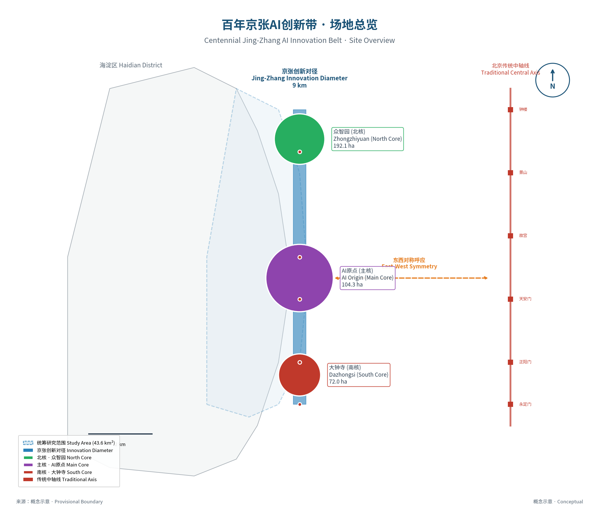

本方案采用**"统筹研究—总体设计—重点区域"**三层递进的工作框架，实现从宏观战略到微观落地的完整传导。

#### 2.1.1 第一层：统筹研究范围（43.6km²）

**范围界定**：
- 北至北五环
- 南至西直门-北二环
- 西至中关村大街-苏州街沿线
- 东至学院路-小月河沿线
- **总面积约43.6平方公里** [metric:total-research-area]

**工作内容**：
- AI产业发展战略与生态构建研究
- 区域协同与空间格局优化研究
- 交通与基础设施体系统筹研究
- 人才社区与公共服务体系研究
- 文化传承与品牌战略研究

**核心任务**：从区域层面明确创新带的战略定位、产业方向、空间格局和支撑体系，为总体设计提供战略指引。

#### 2.1.2 第二层：总体设计范围（11.4km²）

**范围界定**：
- 京张铁路遗址公园两侧各约500-800米深度
- 北起清华东路，南至西直门北大街
- 涵盖三大核心片区及周边联动区域
- **总面积约11.4平方公里** [metric:total-design-area]

**工作内容**：
- 城市更新总体框架与策略
- 功能布局与用地结构优化
- 建筑规模与容量控制
- 道路与交通系统优化
- 公共空间与蓝绿系统设计
- 城市风貌与建筑高度概念引导（待专业核验）
- 重点项目布局与清单

**深度定位**：概念城市设计研究，提出控规优化建议，供专业团队按法定程序深化。

> **口径说明**：无特殊说明时，指标均基于11.4km²范围、2035目标年测算。

#### 2.1.3 第三层：重点区域详细设计（368.4ha）

**范围界定**：三大核心片区
- **A1 众智园片区**：192.1公顷（北核）
- **A2 AI原点社区**：104.3公顷（主核·五道口+知春路）
- **A3 大钟寺片区**：72.0公顷（南核）
- **合计：368.4公顷** [metric:key-area-total]

**工作内容**：
- 片区定位与功能细化
- 空间结构与布局深化
- 建筑更新与改造方案
- 交通组织与慢行系统
- 公共空间景观设计
- AI场景植入与智慧化设计
- 风险评估与应对策略

**深度定位**：重点区域概念方案深化研究，提出空间形态意向与设计导则，供后续建筑方案与工程设计参考。

### 2.2 三层范围空间关系

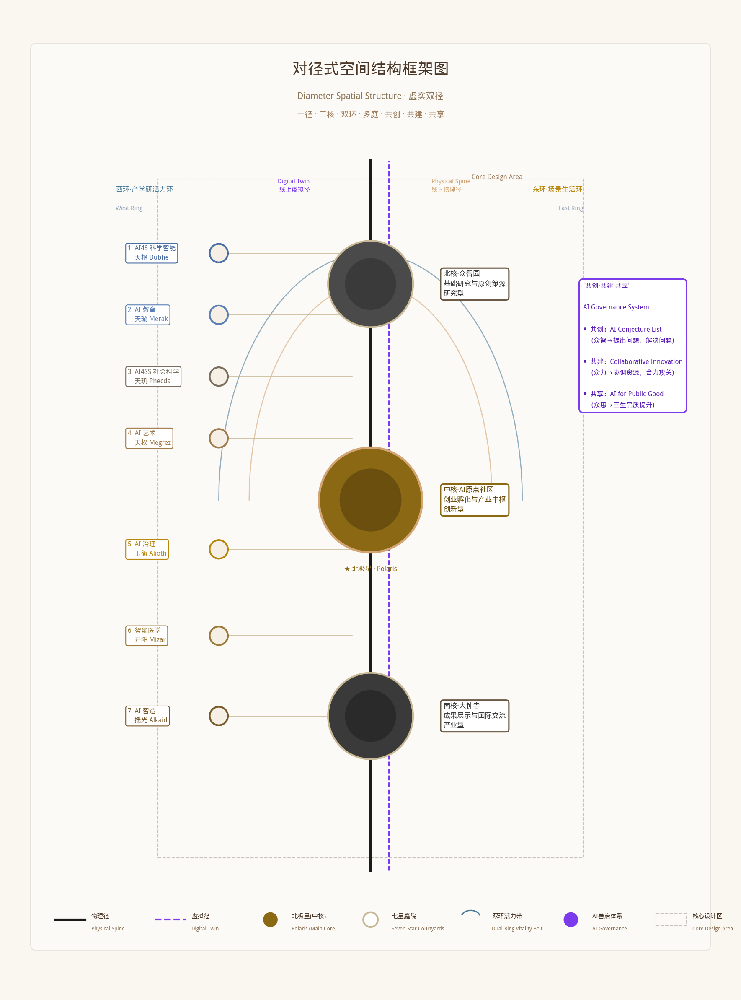

**层级传导关系**：

| 层级 | 面积 | 核心问题 | 输出成果 |
|------|------|---------|---------|
| 统筹研究层 | 43.6km² | 战略定位、产业生态、区域协同 | 战略研究报告、产业规划 |
| 总体设计层 | 11.4km² | 更新框架、功能布局、风貌控制 | 概念性城市设计、规划优化研究建议 |
| 重点区域层 | 368.4ha | 详细设计、场景落地、实施路径 | 详细城市设计、项目实施方案 |

### 2.3 工作方法与技术路线

#### 理论引领
以习近平总书记人民城市重要理念为根本遵循，以中央城市工作会议"创新、宜居、美丽、韧性、文明、智慧"六维现代化城市框架为目标导向，以杨开忠新空间经济为核心方法论，构建"人民城市6维目标 × 空间品质三维框架 × 对径式空间范式"的理论融合体系，建立理论-政策-空间的完整闭环。

**理论融合逻辑**：
- **价值锚点**：人民城市理念确立"以人民为中心"的根本价值取向，回答"为谁设计"的根本问题
- **目标框架**：六维现代化城市目标（创新、宜居、美丽、韧性、文明、智慧）提供国家层面的城市发展标准坐标系
- **实现路径**：新空间经济"空间品质驱动创新增长"揭示六维目标落地的空间经济机制
- **空间范式**：对径式「一径·三核·双环·多庭」将理论转化为可操作的空间结构

**六维目标与空间品质三维度的对应关系**：
| 人民城市6维 | 新空间经济品质维度 | 对径空间承载 |
|------------|-------------------|------------|
| 创新 | 创新型空间品质 | 三核创新节点 + 双环创新生态圈 |
| 宜居 | 宜居型空间品质 | 多庭生活庭院 + 15分钟生活圈 |
| 美丽 | 宜居型（生态子维度） | 蓝绿骨架 + 遗址公园活力带 |
| 韧性 | 宜居型（安全子维度） | 防灾空间体系 + 海绵城市 |
| 文明 | 学习型（文化子维度） | 京张文化遗产轴 + 公共艺术 |
| 智慧 | 创新型（智治子维度） | AI城市大脑 + 智慧场景全覆盖 |

#### 三级衔接
精准对接国家-北京市-海淀区三级"十五五"规划，形成战略层层传导、空间逐级落地的规划体系。

#### 多维融合
融合产业规划、城市设计、交通规划、景观设计、智慧城市等多专业领域，形成一体化解决方案。

#### 迭代优化
建立可量化、可监测、可迭代的空间品质评估体系，确保方案的动态适应性和优化能力。

---

## 第三章 统筹研究范围产业与未来城市研究

> **📌 任务书回应**：本章回应任务书"AI创新带产业定位"要求，从新空间经济视角提出AI创新带的发展理念、战略定位、核心功能与空间格局，构建全链条AI创新生态。

### 3.1 发展理念：据新空间经济的六维品质供给体系

本方案的方法论核心是：以新空间经济"品质—人才—产业"的因果链条为主线，将人民城市6维目标系统转化为六类空间品质的供给策略，通过空间设计手段驱动人才集聚与创新增长。本节从理论主线、品质映射、供给路径三个层面，系统阐述本方案的发展理念框架。

#### 3.1.1 理论主线：空间品质→人才集聚→产业创新

本方案以新空间经济为核心方法论，确立"空间品质提升—人才动态集聚—产业创新发展"的三段式因果逻辑作为贯穿全案的理论主线：

```
┌─────────────┐     ┌─────────────┐     ┌─────────────┐
│ 空间品质提升 │────→│ 人才动态集聚 │────→│ 产业创新发展 │
│  （设计手段）│     │  （中间变量）│     │  （最终目标）│
└─────────────┘     └─────────────┘     └─────────────┘
       ↑                    │                    │
       │                    ↓                    │
       └──── 循环累积因果 ←──┘←─── 知识溢出 ────┘
```

**第一阶段：空间品质提升（设计手段）**

城市设计是供给空间品质的手段。通过对径式空间结构系统性设计，供给多元化高品质空间要素（生态、文化、交流、服务、智慧、安全），为人才集聚创造"拉力"。

传统规划视空间为"产业的容器"，本方案视空间为"人才的磁石"——产业规划逻辑是"建园区→引企业→聚人才"，新空间经济逻辑是"提品质→聚人才→兴产业"。因果方向反转，规划出发点从服务企业转向服务人才。

杨开忠研究论证了空间品质的内生核心地位：它不再是外生"舒适物"残余变量，而是与科技创新、报酬递增、要素流动、出行/运输成本并列的核心内生变量，六者交织互构、协同演化。[source:SRC-019]

**第二阶段：人才动态集聚（中间变量）**

人才是空间品质与产业创新的核心中介变量。高品质空间吸引人才集聚，人才集聚带来知识溢出与创新活力，进而驱动产业发展。本方案人才观是"动态集聚"而非"静态存量"：

- **流动的人才**：人才持续在不同品质节点间流动（实验室→孵化器→产业区→生活空间），流动本身产生知识溢出
- **差异化偏好**：不同类型、不同阶段的AI人才品质偏好不同，需差异化品质供给体系
- **临界质量效应**：人才密度越过临界阈值后，触发知识溢中正反馈，进入自我强化轨道

**第三阶段：产业创新发展（最终目标）**

人才动态集聚通过知识溢出、创业孵化、产业链自组织等机制推动产业创新。产业创新不是规划"打造"的，而是在人才集聚基础上"涌现"的。规划的作用是创造有利于涌现的空间条件。

创新生态自组织演化逻辑：品质吸引人才达临界质量→知识溢出催生创业→创业吸引资本服务→成功企业带动产业链→产业链集聚提升品质。这就是循环累积因果的完整闭环。

#### 3.1.2 六维目标→六类空间品质的映射框架

中央城市工作会议提出的"创新、宜居、美丽、韧性、文明、智慧"六维现代化城市目标，为本方案提供了价值坐标系。本方案将六维目标系统映射为六类空间品质，使抽象的价值目标转化为可设计、可度量、可评估的空间品质供给策略：

| 人民城市6维 | 映射为空间品质类型 | 品质内涵 | 新空间经济对应机制 |
|------------|----------------|---------|-------------------|
| **创新** | 创新型空间品质 | 创业环境、产学研协同、创新社群、交流密度 | 知识交流交易成本最小化→创新效率提升 |
| **宜居** | 宜居型空间品质 | 居住舒适、公共服务、生活便利、职住平衡 | 宜居品质延长人才停留时间→提升集聚效率 |
| **美丽** | 美丽型空间品质 | 生态环境、景观风貌、蓝绿空间、文化审美 | 环境品质增强人才吸引力→扩大集聚规模 |
| **韧性** | 韧性型空间品质 | 安全保障、防灾减灾、应急响应、生态海绵 | 安全品质降低集聚风险→稳定人才预期 |
| **文明** | 文明型空间品质 | 文化传承、公共艺术、精神认同、社群凝聚 | 文化品质提升身份认同→增强集聚粘性 |
| **智慧** | 智慧型空间品质 | 智能设施、数字治理、AI场景、数据赋能 | 智慧品质降低信息成本→加速创新扩散 |

这一映射的理论意义在于：它将人民城市理念从价值倡导层面，转化为可操作的空间经济分析框架。六维目标不是并列的口号清单，而是协同作用的品质供给体系——它们共同作用于人才的集聚与流动，最终服务于创新发展的根本目标。

#### 3.1.3 六类品质的空间供给路径

基于以上映射框架，本方案通过对径式空间结构系统供给六类空间品质，每一类品质都有明确的空间载体和设计策略：

**六类品质空间供给路径**：

| 品质类型 | 空间载体 | 设计策略 |
|---------|---------|---------|
| 创新型 | 一径·三核·多庭 | 5分钟创新交流圈、产学研紧邻、共享空间嵌入 |
| 宜居型 | 多庭生活庭院+15分钟生活圈 | 职住平衡、步行友好、服务均等 |
| 美丽型 | 京张遗址公园+蓝绿体系 | 蓝绿交织、遗址活化、四季有景 |
| 韧性型 | 防灾空间+海绵城市 | 分散缓冲、多源保障、智能预警 |
| 文明型 | 文化遗产轴+公共艺术 | 遗产活化、艺术嵌入、文化赋能 |
| 智慧型 | AI城市大脑+智慧设施 | 感知公开、智能运营、数据开放 |

六类品质不是相互孤立的，而是沿对径轴形成复合叠加的品质供给系统。越靠近核心节点，品质叠加度越高，对人才的综合吸引力越强。这种复合品质供给策略，正是新空间经济"多维品质协同驱动人才集聚"理论在空间设计中的具体实践。
### 3.2 三大战略定位

据新空间经济"空间品质驱动人才集聚、人才集聚驱动产业创新"的核心逻辑，结合人民城市6维目标和三级"十五五"规划要求，从**空间品质供给的层级与类型**出发，确立百年京张AI创新带的三大战略定位。每个定位都对应特定的品质供给类型、人才集聚目标和创新产出方向。

#### 定位一：国家级学习型+创新型空间品质供给高地

**内涵**：构建国家级学习型与创新型空间品质供给体系——通过高品质学术空间、科研环境、创业氛围和交流场景，集聚全球AI顶尖人才，以知识溢出与创新孵化支撑国家AI战略的科技自立自强目标。

- **品质供给类型**：学习型品质为基础（高校科研资源、学术氛围），创新型品质为核心（创业孵化、产学研协同、知识交流密度）
- **人才目标**：AI科学家、顶尖研究员、青年学术人才、连续创业者
- **产出方向**：基础研究原始创新、前沿技术突破、AI for Science跨学科创新、治理创新
- **空间承载**：众智园片区（学习型品质核心）+ AI原点社区（创新型品质核心）

**核心支撑**：
- 海淀区全国最高密度AI科研人才源（清华、北大、北航等），学习型品质"初始禀赋"得天独厚
- 2024年海淀AI核心产业规模超3500亿元，为创新型品质提供市场需求与产业反馈[metric:haidian-ai-scale]
- 中关村国家自主创新示范区制度优势，降低创新制度交易成本
- 百度、字节、商汤等头部企业集聚，形成人才流动"产业蓄水池"，增强系统韧性

#### 定位二：京津冀创新型+产业型空间品质协同枢纽

**内涵**：构建京津冀品质梯度协同的枢纽节点——通过对径智轴的创新型与产业型品质供给，吸引转化京津冀创新人才与科研成果，以人才流动与知识溢出辐射带动区域AI产业协同发展。

- **品质供给类型**：创新型品质为枢纽（连接南北梯度），产业型品质为出口（成果转化与产业落地）
- **人才目标**：跨区域AI研发人才、技术转化专家、产业运营人才
- **产出方向**：技术转化与中试孵化、产业链协同创新、区域人才双向流动
- **空间承载**：AI原点社区（创新转化枢纽）+ 大钟寺片区（产业集聚出口）+ 双环协同网络

**核心支撑**：
- 北京国际科创中心核心区地位，形成"品质高地"的虹吸与辐射双重效应
- 对径式线性连接性：北延张家口算力基地、南接雄安创新场景、东联天津制造基地，形成"北京研发—津冀转化—区域应用"梯度协同
- 海淀区"科技创新出发地、原始创新策源地、自主创新主阵地"的三重定位，本质上就是学习型+创新型+产业型三类品质的复合供给能力
- 人才在京津冀范围内的动态流动，本质上是对不同空间品质的"用脚投票"——对径智轴提供最高等级的创新型品质，自然成为区域人才流动网络中的枢纽节点

#### 定位三：北京AI产业型+智慧型空间品质主供给区

**（原"北京AI万亿级产业集群的主承载区"的经济学重述）**

**内涵阐释**：
本定位的核心不是"引进企业、形成集群"，而是**构建北京市高能级的产业型与智慧型空间品质供给体系**——通过高品质的产业配套、商务服务、应用场景和智慧设施，吸引AI产业人才集聚，通过人才集聚的向心力效应吸引创新主体布局，最终支撑北京AI万亿级产业集群的形成。

- **品质供给类型**：以产业型空间品质为主导（产业链完整度、商务配套水平、应用场景丰富度），以智慧型空间品质为特色（AI场景赋能、数字基础设施、智慧治理水平）
- **人才集聚目标**：AI产业工程人才、产品经理、行业解决方案专家、运营管理人才
- **创新产出方向**：AI产业化规模增长、行业应用创新、AI+实体经济融合
- **空间承载**：大钟寺片区（产业型品质核心）+ 全沿线智慧场景（智慧型品质供给）

**核心支撑（据新空间经济的解释）**：
- 北京AI产业基础（企业数量、人才规模、融资额均居全国首位），为产业型品质提供了需求基础和自组织演化的初始条件
- 海淀区AI产业集中度（占全市60%以上），意味着产业人才的初始集聚密度已接近临界质量[metric:haidian-ai-share]
- 京张沿线存量空间资源更新潜力，为产业型品质的持续提升提供了空间载体——通过存量更新逐步释放高品质产业空间，匹配产业人才增长的需求
- 产业型品质的提升会进一步吸引人才，人才集聚又会吸引更多企业布局，形成"品质→人才→产业→品质"的循环累积因果效应，最终支撑万亿级产业集群目标的实现

### 3.3 五大核心功能

基于AI创新生态的全链条发展规律，确立五大核心功能：

| 功能类别 | 功能内涵 | 空间承载 |
|---------|---------|---------|
| **AI技术策源地** | 基础研究、前沿探索、原始创新 | 高校院所、重点实验室、联合研发中心 |
| **AI产业集聚高地** | 全链条产业生态、企业总部、独角兽培育 | 产业园、总部基地、孵化器、加速器 |
| **AI应用试验场** | 城市级场景开放、技术验证、首试首用 | 场景示范区、测试场、体验中心 |
| **AI人才向往地** | 高品质创新生活、人才社区、公共服务 | 人才公寓、生活服务、文体设施 |
| **AI文化展示窗** | 百年自主创新精神传承、AI文化传播 | 纪念馆、科技馆、公共艺术、节庆活动 |

### 3.4 三区两翼空间格局

统筹研究范围内的AI创新空间布局，遵循"核心集聚、轴带串联、协同赋能"的空间组织逻辑，形成"三区两翼"的整体空间格局。三区为三大核心功能承载区，分别承担AI自主创新、AI技术策源、AI产业集聚的核心功能；两翼为东西两侧的协同赋能带，分别承担产学研协同与场景应用示范功能。

#### 3.4.1 三区：三大核心功能区

**（1）北部创新区——AI自主创新引领区**

范围涵盖清华科技园、北大科技园、中关村西区及周边区域，面积约15.2平方公里。依托清华大学、北京大学等顶尖高校的基础研究优势，聚焦人工智能基础理论、大模型算法、通用人工智能等前沿方向，打造国家级AI基础研究与自主创新策源地。

核心功能包括：基础研究与原始创新、高端人才培养与集聚、创业孵化与加速、国际学术交流与合作。空间上以高校校园为内核，以周边科技园、孵化器为外延，形成"高校-科研-孵化"的链式空间组织。

**（2）中部核心区——AI技术策源与人才核心区**

范围涵盖五道口、知春路、中关村大街沿线区域，面积约13.8平方公里。作为京张铁路遗址公园的核心段落，本区域汇聚高密度AI企业、活跃创业生态和丰富人才资源，是创新带的技术策源极核与人才磁场中心。

核心功能包括：AI技术研发与转化、创新创业生态培育、人才居住与生活服务、AI场景测试与验证。空间上以京张铁路遗址公园为主轴线，串联两侧AI产业楼宇与人才社区，形成"一径串双核、两翼聚英才"的空间形态。

**（3）南部产业区——AI产业集聚与应用示范区**

范围涵盖大钟寺、学院南路、西直门周边区域，面积约14.6平方公里。依托现有产业楼宇基础和成熟的商务配套，重点发展AI+金融、AI+医疗、AI+教育等应用产业，打造AI产业规模化集聚与场景化应用示范区。

核心功能包括：AI产业总部集聚、行业应用解决方案研发、科技成果转化与产业化、创新企业加速成长。空间上沿地铁线路与主要道路形成产业集聚带，以大型商务综合体为载体构建产业生态圈。

#### 3.4.2 两翼：东西协同赋能

**（1）西翼——产学研协同赋能带**

沿中关村大街-苏州街一线，串联高校院所、国家重点实验室、工程技术中心等科研资源，构建"基础研究-应用研究-技术转化"的完整创新链条。西翼是创新带的知识源头与技术供给侧，为三大核心功能区持续输送科研成果与创新人才。

**（2）东翼——场景应用示范带**

沿学院路-花园路一线，布局各类AI应用场景与测试验证基地，包括智慧交通、智慧社区、智慧医疗、智慧教育等城市级应用场景。东翼是创新带的需求牵引端与应用试验场，为AI技术提供真实世界的迭代优化环境。

"三区两翼"空间格局的内在逻辑是：以三区为核心承载体，分别锚定创新链的上中下游；以两翼为协同赋能带，分别强化知识供给与场景牵引。通过"核心集聚+轴带串联+两翼赋能"的空间组织模式，构建高效协同、动态平衡的区域AI创新生态系统。
### 3.5 全球AI创新生态案例对标研究

选取全球8个代表性AI创新区进行对标分析，提炼可借鉴的空间品质供给与创新生态构建经验：

| 案例 | 核心经验 | 对本方案启示 |
|------|---------|------------|
| 美国硅谷 | 产学研深度融合、风险资本生态 | 强化高校-企业联动，建设创投服务体系 |
| 波士顿肯德尔广场 | 高密度创新空间、混合功能布局 | 核心区高强度开发，职住平衡 |
| 纽约硅巷 | 存量更新、嵌入式创新 | 城市更新路径，融入既有城区 |
| 多伦多-滑铁卢AI走廊 | 政府引导、公私合作 | 制度创新试点，多方协同 |
| 伦敦国王十字区 | 交通引领、遗产活化 | TOD模式+工业遗产再利用 |
| 深圳前海 | 政策创新、快速迭代 | 先行先试，动态优化机制 |
| 上海张江科学城 | 大科学装置集群、产城融合 | 重大科技基础设施牵引 |
| 杭州未来科技城 | 人才优先、生态优先 | 人才社区+蓝绿空间双轮驱动 |

> **数据来源**：公开资料整理（背景参考，不作正式证据）[source:SRC-012]

### 3.6 品牌识别系统

> 品牌系统为概念设计方向，非最终方案。主名称「百年京张·对径智轴」，英文主名称「Centennial Jingzhang · Diameter Axis」，简称「对径智轴 / DZA」。详见 brand-identity-system.png。

### 3.7 未来城市愿景

#### 愿景描述
到2035年，百年京张AI创新带将建设成为：
- **世界级AI创新生态高地**：集聚全球顶尖AI人才和企业，形成具有全球影响力的AI产业集群
- **现代化人民城市示范带**：践行"人民城市人民建，人民城市为人民"理念，打造高品质生活空间
- **城市更新与创新融合的典范**：工业遗产活化利用的标杆，存量空间价值重塑的样板
- **绿智融合的未来城市样板**：绿色低碳与智慧科技深度融合的生态智能体城市

#### 核心发展指标

| 维度 | 2035年目标 | 现状基准（2024） | 增长幅度 |
|------|-----------|----------------|---------|
| AI核心产业规模 | ≥3000亿元 | 约2000亿元（创新带范围内·情景估算） | +50% |
| 独角兽企业数量 | ≥40家 | 约25家 | +60% |
| AI高端人才 | ≥15万人 | 约8万人 | +87.5% |
| 人均公园绿地面积 | ≥18㎡ | 约12㎡ | +50% |
| 绿色出行比例 | ≥85% | 约70% | +15pp |
| 15分钟生活圈覆盖率 | 100% | 约80% | +20pp |
| 日均知识交流活动 | ≥100场 | 约30场 | +233% |
| 年游客/参观者 | ≥500万（2035目标） | 约100万（现状） | +400% |

[metric:target-indicators-2030]

---

### 3.8 中轴-对径创新范式：理论提炼与模式价值

#### 3.8.1 范式定义与核心特征："对径式"空间结构的理论独创性

本方案提出的**"对径式"线性城市空间组织范式**（Diameter-type Spatial Structure, DSS），是区别于传统TOD轴线、廊道式发展的新型线性空间组织理论。传统线性城市以交通走廊为骨架、以可达性递减规律为动力，本质是"交通导向"的廊道延伸；而对径式范式以**品质梯度**为动力、以**对径对举**为空间哲学，构建了"虚实对径、古今对径、人机对径"三重对举关系。

**三重对径的哲学内涵**：

- **虚实对径**：物理径（京张铁路遗址公园）与数字径（AI数字孪生空间）平行存在、互构互促。物理径提供面对面交流的品质空间，数字径提供超越物理边界的连接与计算能力。二者不是简单的"线下+线上"叠加，而是**空间经济学意义上的双密度叠加**——物理空间密度决定人才集聚的基础容量，数字空间密度（Digital Spatial Density, DSD）决定创新要素的流通效率和知识溢出的乘数效应。这一"双密度模型"突破了传统空间经济学仅关注物理密度的局限，将AI产业的集聚效应从物理空间延伸到数字孪生空间。

- **古今对径**：百年京张的历史遗产（古）与AI创新的未来指向（今）形成时空对举。京张铁路代表的是工业文明时代中国自主创新的"过去完成时"，AI创新带代表的是数智文明时代中国引领创新的"未来进行时"。对径式空间结构不是简单的历史符号拼接，而是通过**时空折叠的空间叙事**，让历史遗产成为创新的精神锚点，让创新成为历史遗产的当代表达。

- **人机对径**：人类创造力与AI生产力在空间中形成协同对举关系。空间设计既为人的面对面交流、灵感碰撞提供场景（人径），又为AI的感知、计算、执行提供基础设施（机径）。二者不是替代关系，而是**互补增强的对径协同**——人提供价值判断、创意直觉和伦理锚点，AI提供数据处理、模式识别和效率倍增。

**与传统线性模式的本质区别**：

| 维度 | 对径式范式（本方案） | 传统TOD轴线模式 | 传统廊道式发展 |
|------|---------------------|----------------|---------------|
| 核心动力 | 品质梯度驱动 | 交通可达性驱动 | 产业集聚驱动 |
| 空间哲学 | 三重对径对举 | 单轴线性延伸 | 带状均质扩张 |
| 密度概念 | 物理+数字双密度 | 物理单密度 | 物理单密度 |
| 时间维度 | 古今时空折叠 | 当下功能导向 | 渐进式演化 |
| 治理维度 | 人机协同善治 | 政府管理为主 | 市场自发为主 |
| 经济机制 | 循环累积因果×双密度乘数 | 租金梯度递减 | 规模报酬递增 |

#### 3.8.2 经济学原理：虚实双径的空间经济学创新

**"数字空间密度"（DSD）理论假说**：基于新空间经济学"品质—人才—产业"因果链，本方案进一步提出**数字空间密度假说**——在数智经济时代，空间对创新的承载能力不仅取决于物理空间密度（建筑密度、人口密度），更取决于**数字空间密度**（单位物理空间内的算力供给、数据流通量、AI模型调用量、数字连接数）。物理密度提供面对面交流的"硬基础"，数字密度提供知识溢出效率的"软乘数"。二者的乘积决定了创新空间的实际产出效率。

**双密度模型的数学表达**（概念框架）：

> 创新产出 ∝ f(物理密度 × 数字密度 × 品质系数 × 交流系数)

这一模型的核心洞察在于：当物理密度受限于城市规划管控（容积率、建筑高度）时，**提升数字空间密度可以突破物理约束，实现创新产出的非线性增长**。京张AI创新带通过在有限的物理空间内部署高密度的AI感知网络、边缘计算节点、数字孪生系统，实现"低物理密度、高数字密度"的创新空间范式，这对于城市更新中"存量挖潜、品质提升"的路径具有普遍意义。

#### 3.8.3 七星拱极意象的空间转译创新

本方案的**"七星拱极"意象**不是简单的文化符号借用，而是建立了完整的**"星象-空间-功能"映射方法论**（Star-Space-Function Mapping, SSFM），形成可量化的星象空间转译体系：

| 北斗七星 | 空间节点 | 星等映射（开发强度） | 星距映射（步行可达性） | 功能定位 |
|---------|---------|---------------------|---------------------|---------|
| 天枢（α） | AI原点大厦 | 一等（最高强度·约150m地标） | — | 创新极核·全球AI原点 |
| 天璇（β） | 智源研究院 | 二等（高强度·研发集群） | 步行约8分钟（≈600m） | 基础研究·原始创新策源 |
| 天玑（γ） | 众智园创新庭院 | 三等（中高强度·复合街区） | 步行约6分钟（≈450m） | 创业孵化·学习型品质 |
| 天权（δ） | 京张铁路纪念馆 | 四等（中低强度·文化地标） | 步行约5分钟（≈400m） | 文化根脉·历史传承节点 |
| 玉衡（ε） | 对径中央公园 | 三等（中高强度·公共空间） | 步行约7分钟（≈550m） | 公共活力·品质中心锚 |
| 开阳（ζ） | 大钟寺AI之门 | 二等（高强度·产业门户） | 步行约10分钟（≈800m） | 产业转化·AI产业集群 |
| 摇光（η） | 全球AI论坛永久会址 | 三等（中高强度·会议会展） | 步行约9分钟（≈700m） | 国际交流·全球链接节点 |

**转译规则的可量化性**：
- **星等→开发强度**：星等每降一级，建筑高度/容积率递减约20-30%，形成有节奏的空间天际线
- **星距→步行可达性**：相邻星点间距控制在400-800m（5-10分钟步行），确保创新交流的空间连续性
- **星象→空间形态**：北斗七星的"斗形"格局对应创新带的核心集聚组团，斗柄指向对应创新扩散方向

这种可量化的星象转译方法论，使得文化意象不再是附属性的装饰性概念，而是**可以指导空间形态生成的参数化规则**，实现"文化意涵—空间形态—功能效率"三位一体的统一。

#### 3.8.4 与传统模式对比及推广价值

对径式创新范式的推广价值在于：它为城市更新中的线性空间改造提供了一种**"低冲击、高赋能"的空间经济模式**——不需要大拆大建，而是通过品质提升+数字赋能实现存量空间的价值倍增。对于中国大量拥有铁路遗址、运河廊道、工业遗产的城市而言，这一范式提供了可复制的空间创新路径。
### 3.9 区域协同发展机制

对径智轴是北京国际科技创新中心网络中的关键节点，构建"北接科学、东连未来、南衔转化、西承源头、辐射京津冀"协同框架。

#### 3.9.1 与"三城一区"协同关系

| 协同对象 | 空间方位 | 协同方向 | 对径智轴角色 |
|---------|---------|---------|-------------|
| 怀柔科学城 | 东北 | 基础研究成果对接、大设施共享 | 应用转化枢纽 |
| 未来科学城 | 正北 | 能源/新材料/先进制造产学研 | 场景验证平台 |
| 中关村科学城 | 西—西南 | 高校院所协同、创业孵化联动 | 核心联动腹地 |
| 北京经开区 | 正南 | AI产业化、智能制造场景 | 中试放大节点 |

京津冀协同：向北联动张家口承德（算力外延）、向南联动雄安（场景落地）、向东联动天津滨海（制造融合），形成"北京研发—津冀转化—区域应用"梯度格局。

#### 3.9.2 五大协同接口

| 接口 | 功能 | 重点对接 | 概念指标 |
|------|------|---------|---------|
| 知识溢出 | 成果流动 | 怀柔→对径→经开区 | 联合论文/专利/项目数 |
| 人才流动 | 双向流动 | 高校↔企业↔智库 | 流动率、联合培养数 |
| 算力调度 | 弹性配置 | 对径+张家口+亦庄 | 利用率、跨区调度比 |
| 测试验证 | 全链条验证 | 街区级→产业级→城市级 | 验证数、转化率 |
| 成果转化 | 中试孵化 | 高校→对径→津冀 | 技术合同额、转化率 |

#### 3.9.3 协同机制（概念建议）

联席会议（季度例会+年会）、项目共研（联合攻关+专项资金）、数据共享（隐私计算+分级分类）、人才互认（标准互通+一卡通）、活动联动（品牌活动+对径活动日历）。

> 以上机制均为概念性建议，具体设立需依规定另行研究。

#### 3.9.4 区域空间格局

对径智轴具有"一轴连三城、一核贯东西"的区位特征，承担五大战略支点功能：

| 支点功能 | 内涵 | 区域价值 |
|---------|------|---------|
| 空间连接器 | 线性形态串联多点创新节点 | 将分散创新资源组织成网 |
| 创新中试场 | 存量更新空间适合技术中试 | 衔接基础研究与产业化 |
| 人才蓄水池 | 紧邻高校社区、人才密度高 | 为周边科学城提供配套 |
| 国际展示窗 | 城市核心区、交通便利 | 北京AI创新城市名片 |
| 治理试验田 | 范围适中、权属多元 | 先行先试治理模式 |

区域空间结构：以对径智轴为主脊，西接中关村、东连学院路，形成"丰"字形结构；北至未来科学城、南至经开区的纵向创新走廊与对径构成"双纵"格局。

> 注：区域协同机制和空间格局均为概念研究建议，不代表法定规划或官方承诺。

## 第四章 总体设计范围城市更新与控规深度城市设计

> **📌 任务书回应**：本章回应任务书"城市更新与控规深度"要求，对接海淀分区规划与区级更新政策，提出总体城市设计层面的更新框架、用地优化与风貌导控建议。所有指标为概念研究参数，供后续法定规划参考，不替代正式控规。

### 4.1 产业发展目标

#### 4.1.1 产业规模目标
到"十五五"末（2030·近景），创新带范围内：
- AI核心产业营业收入突破3000亿元
- 培育AI独角兽企业40家以上
- 引入AI头部企业区域总部/研发总部20家以上
- AI相关从业人员达到25万人，其中高端人才15万人
[metric:industry-scale-target]

#### 4.1.2 产业结构目标
构建"一主两翼多支撑"的产业体系：

**一主：人工智能核心产业**
- 基础层：算力基础设施、AI芯片、基础软件
- 技术层：计算机视觉、自然语言处理、机器学习、多模态大模型
- 应用层：AI+各行业解决方案

**两翼：科技服务业+未来产业**
- 西翼科技服务业：科技金融、知识产权、法律服务、咨询评估
- 东翼未来产业：具身智能、元宇宙、量子信息、生命科学AI

**多支撑：配套产业**
- 数字创意、智慧教育、智慧医疗、智能交通等

#### 4.1.3 产业空间布局

| 产业类型 | 主要承载片区 | 占比 | 特色方向 |
|---------|-------------|------|---------|
| AI基础研究与前沿技术 | 众智园片区 | 25% | 大模型、通用AI、AI for Science |
| AI技术孵化与创业 | AI原点社区 | 35% | 应用AI、垂直领域AI、AIGC |
| AI产业总部与行业应用 | 大钟寺片区 | 25% | AI+金融、AI+医疗、AI+教育 |
| 科技服务业 | 西翼沿线 | 10% | 科技金融、知识产权、专业服务 |
| AI场景应用与体验 | 东翼沿线 | 5% | 未来社区、智慧城市体验 |

### 4.2 功能布局结构


#### 4.2.1 总体布局：一径·三核·双环·多庭

以新空间经济"空间品质→人才动态集聚→产业创新"的因果链条为设计逻辑，以京张创新对径为品质脊柱，三大核心片区为梯度品质节点，东西双环为循环回流支撑，多个创新庭院为介观交流织补，形成疏密有致、层级清晰的空间结构。每一个结构要素都对应特定的空间经济机制。

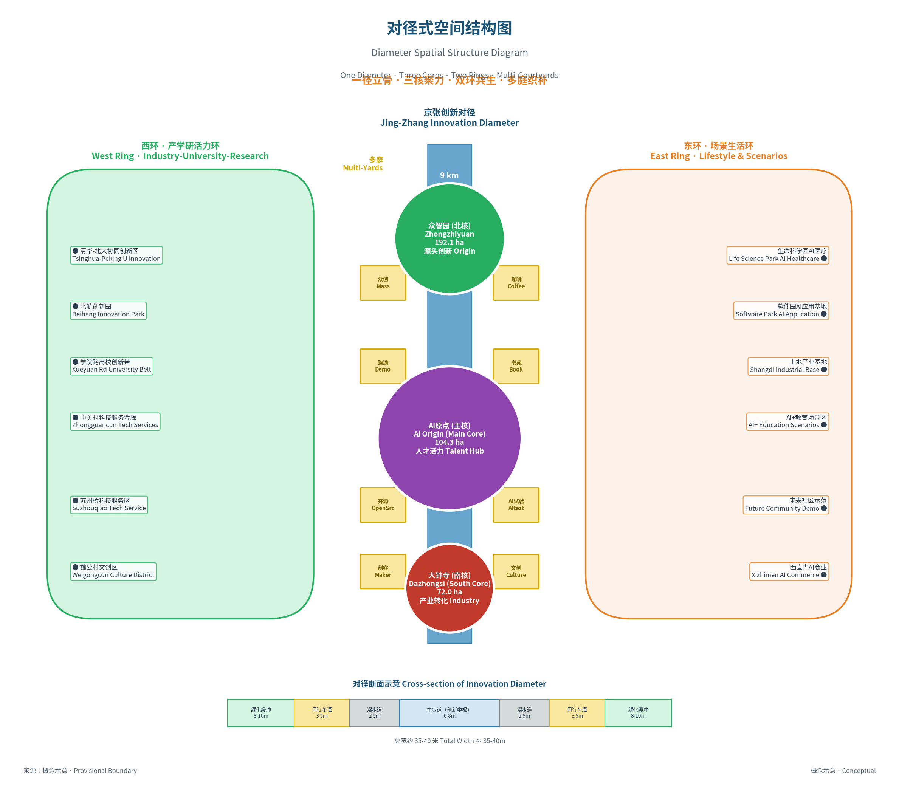

**空间结构解读（经济学视角）**：

| 结构要素 | 空间形态 | 经济学功能 | 新空间经济机制 | 设计要点 |
|---------|---------|-----------|----------------|---------|
| **一径** | 京张铁路遗址公园全线约9公里（清华东路—北三环），其中重点街道界面段约6.2公里 | 品质脊柱、人才流动廊道、知识溢出干线 | 线性空间的接触效率优势（接触界面最大化、偶遇交流概率最大化、移动成本结构化降低） | 七道断面、500米节点密度、林荫全覆盖 |
| **三核** | 三个片区级核心 | 人才集聚极核、品质梯度节点、创新生态位 | 梯度差异驱动的动态集聚（学习型→创新型→产业型品质梯度） | 差异化定位、联动发展、特色鲜明 |
| **双环** | 东西对称两个圈层 | 人才回流机制、系统韧性保障、双端赋能 | 循环累积因果的空间化（不是单向流而是循环流，增强系统韧性） | 功能互补、东西呼应、对称布局 |
| **多庭** | 沿线散布的微空间 | 介观交流节点、移动成本降低器、密度调节器 | 知识交流的空间交易成本最小化（不同密度的交流场景） | 300-500米间距、主题各异、步移景异 |

**"一径"效率优势**：对径结构创造南北双向品质梯度（北端学习型/南端产业型），驱动人才双向流动，比单向流动产生更多知识碰撞。沿轴对称布局使东西两侧创新主体以最短距离接入主轴，最大化接触效率。

> **设计假设说明**：对径式结构为概念假设，需与"一轴三心"线性模式、"环形+多点"模式、"网格弥散"模式、"双核联动"模式等备选结构从知识溢出效率、建设成本、生态影响等8维度系统比较后方可验证。直径几何覆盖与效率优势为理论推导，不构成可证实的优越性结论。

**"三核"品质梯度**：沿对径轴形成"学习型→创新型→产业型"品质梯度序列：
- **北核·众智园**（学习型）：高校科研资源驱动，知识溢出源头
- **中核·AI原点**（创新型）：学习与产业交汇转化器，创业孵化枢纽
- **南核·大钟寺**（产业型）：成果转化终端，产业链反向拉动知识生产

梯度配置驱动人才流动的"质量差"，流动本身即知识溢出过程。

**"双环"循环韧性**：
- **西环·产学研活力环**：串联高校院所与孵化器，形成知识生产小循环
- **东环·场景生活环**：串联应用场景与生活服务，形成需求反馈小循环

双环将单向人才流动转化为立体循环流，增强系统韧性——某一环节波动时可通过其他路径自我调节。

**"多庭"介观交流**：每300-500米设置创新庭院，提供不同密度的交流场景（创业集市/主题沙龙/学术茶座），降低知识交流的搜寻与适配成本，为偶遇式非正式知识溢出提供空间载体。

#### 4.2.2 功能混合策略：提升空间品质的复合供给效率

据新空间经济"产城人融合"理念，推行高强度功能混合。功能混合的经济学意义在于：**通过在同一空间内叠加多种品质类型，提升空间品质的复合供给效率，延长人才停留时间，增加知识交流的机会密度。**

以人才日常行为轨迹为线索，推行高强度功能混合，减少移动成本、增加偶遇交流概率。

**垂直混合**（建筑层面）：地下-停车市政商业；裙房(1-3F)-商业服务共享；中层(4-15F)-办公研发；高层(16F+)-居住公寓酒店。

**水平混合**（街区层面）：街区内混合办公、居住、商业、公共服务，步行5分钟满足基本需求，避免潮汐式人流和夜间空城。

**混合比例控制（基于人才结构的差异化配置）**：

| 片区 | 产业办公 | 居住 | 商业服务 | 公共空间 | 混合逻辑（基于人才类型） |
|------|---------|------|---------|---------|---------------------|
| 众智园片区 | 55% | 25% | 10% | 10% | 科研人才为主，需要较高比例的研发办公和居住，同时注重公共空间的学术交流功能 |
| AI原点社区 | 45% | 30% | 15% | 10% | 创业人才为主，需要较高比例的居住和商业服务（社交+生活），办公相对灵活 |
| 大钟寺片区 | 60% | 15% | 15% | 10% | 产业人才为主，需要较高比例的产业办公，居住比例较低但商务配套要求高 |

混合比例的差异化配置体现了新空间经济"品质供给匹配人才偏好"的原则——不同类型的人才对功能混合的比例有不同偏好，三核片区根据各自主导的人才类型进行针对性的功能混合设计，最大化品质供给的匹配效率。

#### 4.2.3 空间经济机制总结

对径式空间结构根植于新空间经济理论，形成"三大机制+一个闭环"的经济学框架：

**机制一·线性品质集聚**：6.2公里线性公共空间持续供给多元品质要素，吸引创新人才集聚。线性空间比点状空间具有更长接触界面，主径两侧500米范围内可服务约800万㎡研发办公和15万就业人口。

**机制二·知识交流成本最小化**："一径串三核、双环联多庭"将创新主体沿廊道紧密排列，降低面对面交流的移动、搜寻与适配成本。"边行走边交流"的非正式交换模式为创意产生提供载体。

**机制三·梯度增长动态集聚**："学习型→创新型→产业型"品质梯度与知识生产转化链耦合，形成"源—流—汇"梯度组织，兼顾专业化分工效率与知识溢出联动。

**闭环·循环累积因果**：品质提升→人才集聚→创新活力→产业发展→品质再提升的正反馈，越过临界阈值后进入自组织演化轨道。

#### 4.2.4 AI全流程介入工作流：六Agent协同设计体系

本方案建立了**6个AI Agent协同的全流程设计工作流**，覆盖从场地分析到公众参与的完整设计链条，每个环节都有明确的AI技术路径：

| Agent | 设计环节 | AI技术路径 | 核心产出 |
|-------|---------|-----------|---------|
| Agent-1 场地分析智能体 | 现状研判 | 多源遥感+街景图像识别+POI大数据分析 | 场地现状诊断报告、问题识别图谱 |
| Agent-2 概念生成智能体 | 方案构思 | 大语言模型+知识图谱+案例检索增强生成(RAG) | 多方案概念生成、空间结构比选 |
| Agent-3 空间生成智能体 | 形态设计 | 对径生成算法(DGA)+生成式对抗网络(GAN) | 空间形态方案、自动生成总平面 |
| Agent-4 性能模拟智能体 | 方案验证 | 多物理场仿真+数字孪生+性能优化算法 | 风/光/热/声环境模拟报告 |
| Agent-5 公众参与智能体 | 社会验证 | 自然语言处理+情感分析+多模态交互 | 公众意见汇总、需求偏好图谱 |
| Agent-6 方案整合智能体 | 综合优化 | 多目标优化算法+专家知识蒸馏 | 最优方案整合、综合评估报告 |

**协同机制**：六Agent为并行迭代网状协同，公众参与贯穿全流程，方案整合Agent全局协调，设计周期从数月压缩至数周。

### 4.3 中轴-对径创新范式空间落位：北京双中轴格局

#### 4.3.1 设计理念：双中轴格局

作为"中轴-对径"创新范式在北京的具体实践，京张AI创新带以京张铁路遗址公园为空间载体，构建一条与北京传统中轴线东西对举的创新中轴，形成"礼制中轴—创新对径"的双中轴城市格局。

京张铁路遗址公园的规划建设，不应仅定位为一条线性绿带，而应升格为**京张创新对径**——北京西部的科技创新中轴线，与东部的传统礼制中轴东西呼应、并驾齐驱，共同构成北京"一古一今、一文一技"的双中轴城市格局。

```
 东（传统中轴）          西（京张创新对径）
      │                       │
  永定门                   南部门户
      │                       │
  正阳门                   大钟寺
      │                       │
  天安门                   AI原点
      │                       │
  景山                     五道口
      │                       │
  鼓楼                     众智园
      │                       │
  奥林匹克公园             北部源头
```

**"对径"的三重内涵**：
- **对**——对径即对称之道，呼应北京中轴对称的城市基因，与传统中轴东西对举
- **径**——既有轴线的秩序感和仪式感，又有路径的生活感和亲近感，强调步行可达
- **对径**——区别于传统规划的"发展轴"（以交通和产业功能为主），强调步行可达性、空间对称性、文化仪式感、创新交往性的统一

#### 4.3.2 对径断面设计：七道格局

> **断面层级说明**：本方案存在两套不同尺度的断面概念，为整体—局部的包含关系，互不矛盾：
> - **宏观（60-80m级）**："七道格局"是对径带整体道路+绿带复合格局（含道路红线+建筑退界+中央绿带）；
> - **微观（35-40m级）**：京张遗址公园断面是核心绿带自身的景观断面（仅绿化主体，不含道路和退界）。

京张创新对径采用"七道"断面设计，从西到东依次为：西自行车道—西步行道—中央景观带（遗址纪念道）—东步行道—东自行车道—生态缓冲带—创新交往带。整体宽度控制在60—80米，确保步行舒适、景观层次丰富、功能复合多元。

| 道序 | 名称 | 宽度 | 功能 | 设计要点 |
|------|------|------|------|---------|
| 一道 | 西自行车道 | 3.5m | 南北向快速骑行 | 独立路权、彩色铺装、夜间照明 |
| 二道 | 西步行道 | 4—6m | 通勤步行、日常通行 | 平整铺装、林荫覆盖、坐憩设施 |
| 三道 | 中央景观带 | 15—25m | 遗址纪念、核心景观、公共艺术 | 保留铁轨遗迹、季节性花境、艺术装置 |
| 四道 | 东步行道 | 4—6m | 休闲漫步、观景体验 | 变化铺装、水景节点、休息平台 |
| 五道 | 东自行车道 | 3.5m | 南北向骑行+接驳 | 独立路权、多点接入 |
| 六道 | 生态缓冲带 | 5—10m | 生态隔离、雨水花园 | 本土植物、海绵设施 |
| 七道 | 创新交往带 | 8—15m | 咖啡外摆、路演活动、创新庭院入口 | 灵活铺装、可移动设施、多功能空间 |

**规模参数**：
- 总长度：约9公里（清华东路—北三环）
- 全线步行时间：约1.5—2小时（含停留）
- 全线骑行时间：约25—35分钟
- 林荫覆盖率：≥70%，夏季降低体感温度5—8℃

**七星连径功能升级**：七道断面同时是串联七大特色AI场景节点的"七星连径"系统骨架——以主步道为线性纽带，以场景庭院为节点枢纽，以主题驿站为中途锚点，形成"线—点—驿"三级连续贯通的步行体验系统。沿径从北向南漫步，依次经过AI4S、AI教育、AI4SS、AI艺术、AI治理、智能医学、AI制造七大特色场景，体验从基础研究的深邃走向产业应用的繁华，承载"品质梯度"的空间叙事（详见5.5.1节）。

#### 4.3.3 四季景观设计：春花·夏荫·秋韵·冬骨

结合北京暖温带半湿润大陆性季风气候特征（四季分明、春秋短促、冬夏较长），对径景观采用"一季一主题、全年皆可游"的季节性设计策略：

**春季·花径（3月中旬—5月上旬）**
- **主题意象**：京张花韵·创新萌发
- **植物配置**：以山桃、碧桃、樱花、迎春、连翘、海棠等春花植物为骨干，形成"一径桃花逐水流"的春日盛景
- **活动安排**：春季创新周·AI樱花论坛·户外路演季·青年创业节
- **空间利用**：中央景观带设置临时花境与艺术装置，创新交往带增加咖啡外摆与户外展陈

**夏季·荫径（6月上旬—8月下旬）**
- **主题意象**：绿浓于荫·创智生长
- **植物配置**：以国槐、白蜡、法桐、栾树等高大落叶乔木为骨架，形成浓密林荫覆盖；下层配置绣球、玉簪、麦冬等耐阴宿根花卉
- **降温设计**：林荫覆盖率≥70%，重点节点设置雾森系统、遮阳廊架、喷雾降温装置，体感降温5—8℃
- **活动安排**：夏夜电影季·啤酒花园·创新夜市·AI音乐节
- **空间利用**：夜间延长开放，利用夜景照明和凉爽气温举办夜间经济活动

**秋季·色径（10月上旬—11月中旬）**
- **主题意象**：金风玉露·硕果飘香
- **植物配置**：以银杏、元宝枫、火炬树、白蜡、黄栌等秋色叶植物为特色，形成"金红色渐变长廊"
- **景观层次**：上层金黄橙红秋叶、中层宿根花卉、下层常绿地被，构建三层秋色景观体系
- **活动安排**：金秋科创节·AI产业成果展·国际创新周·红叶徒步
- **空间利用**：最宜人的户外活动季节，举办大型论坛、展览、嘉年华

**冬季·骨径（12月上旬—次年2月下旬）**
- **主题意象**：寒枝傲骨·蓄势待发
- **植物配置**：以油松、白皮松、桧柏等常绿树为底色，搭配枝干优美的落叶乔灌木（如白皮松、龙爪槐、红瑞木），展现植物的"骨架之美"
- **冬季景观**：利用植物枝条线条、雪景、常绿底色构建简洁素雅的冬季景观；设置冬季暖廊、太阳能加热座椅、防风屏障
- **活动安排**：冰雪科技节·AI冬令营·新年灯光秀·暖冬市集
- **空间利用**：核心节点设置玻璃暖房和室内外衔接空间，确保冬季可达性

**四季植物配置表**：

| 季相 | 上层乔木 | 中层花灌木 | 下层地被 | 花期/观赏期 |
|------|---------|-----------|---------|-----------|
| 春 | 山桃、樱花、海棠、玉兰 | 迎春、连翘、碧桃、榆叶梅 | 二月兰、紫花地丁、郁金香 | 3—5月 |
| 夏 | 国槐、白蜡、法桐、栾树 | 紫薇、木槿、绣球、珍珠梅 | 玉簪、麦冬、八宝景天 | 6—8月 |
| 秋 | 银杏、元宝枫、火炬、黄栌 | 金银木、海州常山、美国红栌 | 波斯菊、硫华菊、地被菊 | 10—11月 |
| 冬 | 油松、白皮松、桧柏、雪松 | 红瑞木、棣棠、腊梅 | 崂峪苔草、麦冬（常绿） | 12—2月 |

#### 4.3.4 一日时序设计：通勤·活力·休憩·夜未央

围绕创新人群的生活作息规律，对径空间采用分时设计策略，一天之内呈现不同的空间氛围和功能重心：

**早高峰·通勤模式（7:00—9:30）**
- **主导功能**：通勤通行、晨间锻炼
- **空间侧重**：东西步行道和自行车道高效运转，人流以三核之间及轨道站点接驳通行为主
- **配套服务**：早餐车、便民售货点、共享单车调度点，咖啡外摆提前营业
- **景观氛围**：晨光穿过林荫，清新明快，健身跑步者与通勤人流并行
- **交通组织**：自行车道双向高峰保障，步行道分流引导，确保通行效率

**午间·活力模式（11:30—14:00）**
- **主导功能**：午餐休憩、户外社交、短时活动
- **空间侧重**：创新交往带和中央景观带成为午间户外用餐、散步交流的热门区域
- **配套服务**：移动餐车、快餐外摆、午间快闪店、户外咖啡座
- **活动安排**：午间音乐会、午间脱口秀、午餐路演会、快闪展览
- **景观氛围**：阳光充足的树荫下，白领们三五成群，形成活力四射的午间创新社交场

**下午·办公模式（14:00—18:00）**
- **主导功能**：日常办公、商务交流、休闲漫步
- **空间侧重**：步行流量相对平稳，创新庭院成为商务洽谈和户外办公的延伸空间
- **配套服务**：咖啡茶座、共享办公亭、商务中心正常运转
- **景观氛围**：树影斑驳，安静有序，偶有散步交流和团队讨论

**傍晚·休闲模式（18:00—21:00）**
- **主导功能**：休闲健身、社交聚会、夜间消费
- **空间侧重**：健身跑道开始启用，商业餐饮外摆区域人气旺盛，中央景观带夜景照明亮起
- **配套服务**：酒吧、餐厅、夜市摊位、夜间零售陆续营业
- **活动安排**：路跑活动、露天电影、夜市市集、音乐现场
- **景观氛围**：夕阳西下、华灯初上，温馨浪漫的夜间氛围渐次展开

**深夜·夜未央模式（21:00—24:00）**
- **主导功能**：夜间经济、24小时创新、夜间休闲
- **空间侧重**：核心节点保持活跃，部分区域转为静谧休闲
- **配套服务**：24小时便利店、深夜食堂、夜间书店、共享办公通宵区
- **活动安排**：黑客马拉松、夜间读书会、星空观测、深夜直播
- **景观氛围**：低照度暖光点光系统营造静谧舒适的夜间步行环境，核心节点灯火通明

**分时设计对应表**：

| 时段 | 模式 | 主导功能 | 核心空间 | 特色活动 |
|------|------|---------|---------|---------|
| 7:00—9:30 | 通勤模式 | 通勤·晨练 | 步行道·自行车道 | 晨间跑步·早餐集市 |
| 9:30—11:30 | 办公模式 | 工作·商务 | 创新庭院·共享空间 | 研讨会·商务洽谈 |
| 11:30—14:00 | 活力模式 | 午餐·社交 | 交往带·中央景观带 | 午间快闪·午餐路演 |
| 14:00—18:00 | 办公模式 | 工作·交流 | 创新庭院·咖啡座 | 路演·下午茶沙龙 |
| 18:00—21:00 | 休闲模式 | 健身·社交·消费 | 交往带·核心节点广场 | 露天电影·夜市·音乐 |
| 21:00—24:00 | 夜未央 | 夜间经济·24h创新 | 三核核心区 | 黑客松·深夜书房 |

---

### 4.4 城市更新总体框架

#### 4.4.1 更新目标
- 系统提升空间品质，打造高品质创新街区
- 盘活存量空间资源，为AI产业发展提供空间保障
- 完善基础设施和公共服务，提升城市综合承载力
- 保护传承历史文化，塑造特色城市风貌
- 推动治理体系创新，构建共建共治共享格局

#### 4.4.2 更新策略

**策略一：织补式更新**
- 以京张创新对径为骨架，向东向西织补周边街区
- 打通断点、连接碎片，形成连续的公共空间系统
- 小尺度、渐进式更新，避免大拆大建

**策略二：分层级更新**
- 核心区（三核）：高强度、综合性更新，打造标杆示范
- 过渡区（双环）：中强度、选择性更新，完善功能配套
- 辐射区：微更新、品质提升，优化环境品质

**策略三：差异化更新**
- 工业遗产类：保护优先、活化利用，保留历史记忆
- 老旧楼宇类：功能置换、改造升级，提升使用效率
- 低效用地类：功能转型、优化布局，提高空间价值
- 居住社区类：环境整治、配套完善，提升生活品质

#### 4.4.3 更新时序与节奏

**先塑骨架后填内容**：
- 前期：京张铁路遗址公园拟全线贯通，基础设施先行
- 中期：三大核心片区重点突破，形成示范效应
- 后期：两翼联动提升，整体格局成型

**先公建后商办**：
- 优先建设公共服务设施和公共空间
- 基础设施和公共服务先行，提升区域价值
- 带动周边物业增值，形成良性循环

### 4.5 重点分级行动包（概念建议·总体层面）

#### 十大标杆性项目

> 下表行动包内容为**概念性项目建议**，投资与建设周期为情景估算参数，供专业团队深化研究，不构成实施承诺。
| 序号 | 项目名称 | 所在片区 | 建筑面积（万㎡） | 功能定位 | 实施阶段 |
|------|---------|---------|----------------|---------|---------|
| 1 | AI原点大厦 | AI原点社区 | 20 | 技术地标、产业旗舰、创新服务中枢 | 2026-2028 |
| 2 | 京张AI智算中心 | 众智园片区 | 8 | 十万卡级智算基础设施 | 2026-2027 |
| 3 | 京张铁路纪念馆 | 遗址公园中段 | 3 | 文化地标、历史教育基地 | 2026-2027 |
| 4 | 众智园AI孵化器集群 | 众智园片区 | 30 | 创业孵化加速、联合实验室 | 2026-2028 |
| 5 | 五道口AI创新街区 | AI原点社区 | 50 | 创新街区示范、场景体验 | 2027-2029 |
| 6 | 大钟寺AI总部基地 | 大钟寺片区 | 40 | 产业总部集聚、展示交流 | 2027-2029 |
| 7 | 人才公寓示范社区 | 原点+众智园 | 25 | 人才住房样板、创新生活 | 2026-2028 |
| 8 | 智慧城市运营中心 | AI原点社区 | 2 | 城市大脑、治理中枢 | 2026-2027 |
| 9 | 京张创新文化广场 | 遗址公园核心段 | - | 公共活动核心、城市客厅 | 2026-2027 |
| 10 | AI场景体验示范区 | 东翼（小月河） | 15 | 场景验证试验场、未来社区 | 2027-2029 |

[metric:key-projects-list]

### 4.6 城市风貌控制

#### 4.6.1 风貌定位
**「百年京张·智创未来」——科技感与历史感交融的创新城市风貌**

- 传承京张铁路工业文化基因，保留历史记忆
- 融入AI时代的科技美学和未来感
- 体现海淀创新文化的开放、活力、包容特质
- 展现生态智能体城市的绿色、智慧、韧性特征

#### 4.6.2 建筑高度敏感性测试区间（概念情景·待专业核验）

> ⚠️ 下表为**敏感性测试变量区间**，不绑定具体地块，非控规指标/审批依据。

| 区域 | 测试高度区间（概念情景） | 敏感性测试目的 |
|------|---------|------|
| 京张遗址公园沿线100米 | ≤24米（测试变量） | 测试遗址公园空间开放性与景观通透性的高度阈值 |
| 三核核心区 | 60-120米（局部地标150米测试） | 高强度开发对空间焦点形成的敏感性测试 |
| 一般片区 | 45-60米（测试区间） | 中等强度过渡层次的敏感性测试 |
| 历史风貌区 | ≤18米（测试变量） | 历史风貌协调性的高度敏感性测试 |

**天际线组织**：
- 以AI原点大厦为最高点（约150米），向北向南逐级降低
- 众智园片区以中低层为主，形成与高校园区协调的天际线
- 大钟寺片区以中高层为主，形成南部门户形象
- 整体呈现"中间高、南北低，核心高、两侧低"的天际线形态

#### 4.6.3 建筑风貌导则

**整体风格**：现代简约+科技质感+工业元素
- 主基调：玻璃幕墙+金属板材，体现科技感和现代感
- 点缀元素：裸露钢结构、铆钉细节、轨道图案等，呼应铁路遗产
- 色彩控制：以冷色调为主（灰、银、蓝），点缀铁路红和生态绿

**分区风貌引导**：

| 片区 | 风貌特色 | 设计引导 |
|------|---------|---------|
| 众智园片区 | 园林式、低密度、学院风 | 坡屋顶元素、红砖与玻璃结合、庭院式布局 |
| AI原点社区 | 高密度、未来感、活力都市 | 玻璃幕墙、立体交通、空中连廊、灯光亮化 |
| 大钟寺片区 | 门户形象、商务气质 | 标志性建筑群落、展示性界面、石材与玻璃结合 |
| 遗址公园沿线 | 生态+工业+科技融合 | 保留铁路元素、景观化处理、公共艺术介入 |

---

### 4.7 对径创新街道品质提升

#### 4.7.1 科技感街道交流空间布局

对径创新轴不仅是线性交通廊道，更是面向创新人群的全天候社交与协作网络。沿京张铁路遗址公园两侧支路及建筑退界空间，系统性植入三类科技感项目交流空间，构建"步移景异、随处可创"的创新街区体验。

**（1）街头创新胶囊（Innovation Pod）**

沿对径主轴线每隔300-500米设置一处模块化创新胶囊单元，单组建筑面积约80-120平方米，采用全玻璃幕墙+参数化金属穿孔板外立面，内部配置可移动会议桌、数字白板、视频会议终端与高速WiFi。胶囊单元采用可拆装式钢结构体系，可根据周边产业入驻情况灵活增减，形成弹性供给的分布式协作网络。

**设计特色**：
- 外立面采用可变透光率智能玻璃，白天透明保证自然采光，夜间雾化保护会议隐私
- 屋顶集成柔性光伏薄膜与雨水收集系统，实现净零能耗运行
- 空间内部支持AR/VR远程协作，接入AI创新带统一数字底座，可实现跨城市、跨国界的沉浸式项目对接
- 通过小程序预约制使用，AI算法动态调配各胶囊空间，提升利用效率

**（2）路侧项目展示墙（Project Showcase Wall）**

在对径轴两侧建筑首层连续界面，设置交互式数字展示墙系统，采用透明OLED屏幕与实体展示空间交替布局，形成虚实结合的项目发布廊道。展示墙总长约3.2公里，分段呈现AI企业产品、创业团队项目、科研成果转化案例与产学研合作需求。

**技术特色**：
- 透明OLED屏体与建筑玻璃幕墙一体化设计，不影响室内自然采光
- 支持手势交互与可选身份核验（默认关闭，启用前需合法性评估与PIA），访客可隔空翻阅项目详情、一键联系项目方
- 夜间自动切换为公共艺术模式，轮播AI生成的城市光影作品，提升街道夜景品质
- 展示内容通过AI内容平台实时更新，支持企业自助发布与官方审核双通道

**（3）街角科创会客厅（Innovation Living Room）**

在七座创新庭院及三核节点周边的街角空间，设置半开放式科创会客厅，每处面积约200-400平方米，定位为"园区会客厅+城市展示窗"双重功能。会客厅采用通透式建筑设计，模糊室内外界限，将公共街道空间引入建筑内部。

**功能配置**：
- 项目路演区：配备专业级音视频设备，可举办小型发布会、路演、沙龙
- 自由洽谈区：灵活组合的沙发组与吧台，支持非正式交流与头脑风暴
- 创业服务站：提供工商注册、政策咨询、融资对接等一站式政务与产业服务
- 24小时自助服务区：智能文件柜、远程视频政务终端、打印扫描一体机

#### 4.7.2 无人餐饮与智慧服务系统

沿对径创新轴构建"15分钟创新生活圈"的智慧餐饮与服务体系，以无人化、智能化、低碳化为核心特征，适配科技人群快节奏、多样化的生活需求。

**（1）无人餐饮矩阵布局**

按照"主食+轻食+饮品"三级配置，沿对径轴布局三类无人餐饮设备：

- **AI无人餐厅（Central Core + North Core）**：在AI原点核心区和众智园北核各设置一座全智能无人餐厅，面积约300-500平方米，配置智能炒菜机器人、自动传菜系统、无感支付结算，可同时容纳80-120人用餐，提供中式正餐、西式简餐、定制营养餐等多元选择。餐厅采用透明厨房设计，烹饪全过程可视化，增强科技体验感。

- **无人便利店+轻食柜（均匀分布）**：沿对径主轴线每500米设置一组无人便利店与智能轻食柜组合，提供预制餐食、沙拉三明治、水果、咖啡茶饮等即时消费品类。设备采用智能温控与鲜度管理系统，AI算法根据周边人群画像动态调整货品结构与补货策略。

- **移动餐车+咖啡机器人（节点补充）**：在七座创新庭院及公共活动节点，配置可移动式智能餐车与机械臂咖啡站，作为高峰时段与大型活动期间的弹性餐饮补充。机械臂咖啡站可制作20+种精品咖啡饮品，平均出品时间45秒，适配创新人群快速补给需求。

**（2）智慧服务配套**

- **无人配送网络**：沿对径轴铺设地下物流配送管道与地面无人配送车双通道，实现园区内餐饮、文件、物资30分钟极速配送。配送任务由AI调度系统统一管理，根据实时路况与优先级动态分配运力资源。
- **智能公厕与休息舱**：沿对径轴每800米设置一座智慧公厕与胶囊休息舱组合体，配备智能感应洁具、环境空气净化系统与免费WiFi；休息舱提供15-30分钟短时休憩服务，配置零重力座椅与白噪音系统。
- **AI导览与信息屏**：街道关键节点设置交互式AI信息终端，支持语音问答、路径导航、活动查询、服务预约等功能，同步接入中英日韩多语言系统，服务国际化创新人群。

#### 4.7.3 街道空间一体化设计

**（1）全要素街道断面优化**

对径创新轴采用"一径七道"的复合街道断面设计，从西向东依次为：西侧建筑退界交流带→慢行绿道→非机动车道→中央轨道遗产绿带（主径）→非机动车道→慢行绿道→东侧建筑退界交流带。其中，两侧建筑退界交流带宽度不小于8米，为科技交流空间与无人餐饮设备提供承载界面。

**（2）智慧街道基础设施**

- **智慧灯杆**：一杆集成照明、5G/6G基站、环境监测、交通信号灯、公共WiFi、应急呼叫等多功能，杆体预留模块化扩展接口
- **地下综合管廊**：电力、通信、给排水、冷链物流等管线统一入廊，避免反复开挖，保障创新街区高可靠运行
- **无感支付与身份认证**：街道重点区域以园区一卡通/数字身份为主，人脸核验为可选补充（默认关闭，启用前需合法性评估、PIA与公众程序），所有场景均提供非生物识别替代通道

**（3）全天候活力营造策略**

- **日间**：以工作通勤与商务交流为主，胶囊会议室与展示墙高频使用，无人餐饮午间高峰满负荷运转
- **傍晚**：科创会客厅举办沙龙路演，街头胶囊转换为休闲社交模式，户外餐吧与咖啡机器人外摆营业
- **夜间**：数字展示墙切换为公共艺术模式，低照度暖光点光系统营造静谧创新氛围，24小时便利店与休息舱保障深夜创业者需求
- **周末**：街道部分路段限时步行化，举办创新市集、科技嘉年华、户外路演等活动，激活街区周末活力

### 4.8 从总体设计到重点区域：空间结构的落地逻辑

本章在总体设计层面构建了"一径·三核·双环·多庭"的空间结构与七道格局的对径断面。下一章节将进入重点区域的详细设计，其逻辑承接关系为：**沿对径轴串联的七大AI特色场景节点（七星连径）** 对应北斗七星意象，从北向南按创新梯度依次落位；**三大片区（A1众智园·A2原点社区·A3大钟寺）** 分别承载基础研究加速、交叉融合孵化、产业转化落地三个创新阶段，形成"节点串联+片区承载"的双层落位体系，将总体层面的空间品质梯度转化为可感知、可实施的详细设计方案。

## 第五章 重点区域详细设计

> **📌 任务书回应**：本章回应任务书"重点区域详细设计"要求，针对三大核心片区（众智园、AI原点、大钟寺）开展深化设计，涵盖空间结构、建筑更新、交通组织、公共空间与AI场景植入。设计深度为概念方案研究，供后续建筑与工程设计参考。

### 5.1 A1片区：众智园AI自主创新加速区


#### 5.1.1 片区概况与定位

**区位**：北至北五环，南至清华东路，西至中关村北大街，东至学院路
**面积**：192.1公顷 [metric:a1-area]

**定位**：AI全栈自主创新体系核心承载区，学北园高校成果转化第一站，"从0到1"原创突破的主阵地。

**经济学逻辑**：众智园是**学习型空间品质最高密度供给区**——紧邻清华、北大、北航、北邮等顶尖高校，拥有最丰富学术资源和最高密度科研人才储备，是创新带知识溢出的起点。

- **品质类型**：学习型品质主导，叠加创新型品质初步供给
- **人才类型**：AI科学家、研究员、青年学者、博士研究生等科研人才
- **溢出方向**：从高校向园区溢出（基础研究→技术转化）
- **梯度位置**：品质梯度北端起点，人才流动的"源点"

**核心价值**：
- 紧邻顶尖高校，学习型品质初始禀赋最高——人才集聚天然"引力源"，只需激活放大现有品质
- 周边集聚大量国家级重点实验室——科研人才初始密度接近临界质量，打通校地壁垒后知识溢出将迅速显现
- 空间尺度适宜，具备低密度园林式创新园区条件——匹配科研人才对安静优美环境的品质偏好
- 对径轴北端点——人才沿轴线向南流动，是"源—流—汇"系统的"知识源头"

#### 5.1.2 空间结构

**「一廊·两带·三园·多院」空间结构**

**经济学解读**：学习型品质"核心—边缘"扩散结构——对径为扩散廊道，两带连接高校品质源，三园承载梯度化供给，多院为介观交流节点降低知识交流成本。

- **一廊**：京张创新对径（众智园段）——创新中枢和交往纽带
- **两带**：
  - 西带：清华-北大产学研融合带（沿中关村北大街）
  - 东带：北航-北邮科技创新带（沿学院路）
- **三园**：
  - 北园：前沿科学园——基础研究和大科学设施
  - 中园：创业孵化园——孵化器、加速器、种子基金
  - 南园：创新服务园——科技服务、成果转化、人才社区
- **多院**：散布于园区内的多个创新庭院，每院聚焦一个AI细分方向

#### 5.1.3 建筑更新策略

**建筑更新分类**（概念情景估算·待现状核验）：

| 更新类型 | 建筑占比 | 策略说明 |
|---------|---------|---------|
| 保留提升 | 40% | 质量较好楼宇，功能优化、立面提升、智能改造 |
| 改造利用 | 35% | 老旧厂房办公楼，改造为AI办公、孵化器、活动空间 |
| 拆除重建 | 20% | 低效危旧建筑，重建为高标准AI创新空间 |
| 功能置换 | 5% | 低效商业居住，置换为产业创新功能 |

**建筑设计指引**：
- 建筑风格：园林式、低密度、学院风
- 建筑高度（概念建议）：以3-6层为主，局部8-12层（供专项研究参考）
- 容积率（概念建议）：整体控制在2.0-2.5之间（情景研究参数，非法定指标）
- 特色设计：底层架空、内庭院、连廊系统、屋顶花园

#### 5.1.4 交通系统设计

**交通系统设计**：
- 对外：地铁15号线清华东路西口站、13号线西二旗站、北五环、中关村北大街
- 内部：窄路密网（支路网≥8km/km²）、人车分行、核心区步行优先、地下停车为主
- 慢行：中央对径主通道+东西向慢行通廊、自行车网全覆盖、每300米一处休憩节点

#### 5.1.5 公共空间体系

**三级公共空间体系**：

| 级别 | 空间类型 | 数量 | 服务半径 | 功能 |
|------|---------|------|---------|------|
| 一级 | 城市级公园广场 | 2处 | 全区 | 大型活动、景观核心 |
| 二级 | 片区级开放空间 | 5处 | 500米 | 主题活动、日常休憩 |
| 三级 | 社区级微空间 | 20+处 | 200米 | 邻里交往、口袋公园 |

**重点公共空间**：众智园中央广场（约2ha·门户形象）、铁路记忆花园（约5ha·遗产展示）、七大特色AI场景庭院（沿对径梯度分布，一院一主题一社群）。

#### 5.1.6 AI场景设计

**产业测试验证场景**：

1. **大模型训练与推理测试场**
   - 依托智算中心，为大模型企业提供算力测试和模型验证服务
   - 建设大模型评测基准平台
   - 场景规模：万卡级算力支撑 [metric:compute-cluster-scale]

2. **具身智能测试验证园**
   - 建设室内外结合的机器人测试环境
   - 涵盖家庭场景、办公场景、工业场景等多种测试环境
   - 提供人形机器人、服务机器人、工业机器人的测试验证服务

3. **AI for Science联合实验室集群**
   - 联合高校建设AI+生命科学、AI+材料科学、AI+物理等联合实验室
   - 共享科研基础设施和数据集
   - 促进学科交叉和原始创新

#### 5.1.7 风险评估与应对

| 风险类型 | 风险描述 | 影响程度 | 应对策略 |
|---------|---------|---------|---------|
| 高校协同风险 | 高校空间开放度不足，产学研融合深度不够 | 高 | 校地协同机制、联合管理机构、利益共享 |
| 产业导入风险 | 高端AI项目引进竞争激烈，落地不确定性大 | 高 | 提前对接头部企业、定制化空间供给、政策精准扶持 |
| 拆迁安置风险 | 涉及部分居民和企业搬迁，安置难度大 | 中 | 原地安置为主、货币补偿为辅、提前沟通协商 |
| 基础设施承载力 | 电力、算力等基础设施需求大，供给压力大 | 中 | 超前规划、分期建设、多源保障 |

**场景B-04：北斗+AI城市时空智能MVP测试场** [metric:beidou-ai-test]
- **MVP假设**：依托北斗三号+AI时空智能算法，在创新带试点区域开展亚米-分米级高精度位置服务测试（provisional）
- **MVP范围**：选取1-2个核心节点开展无人配送导航测试（亚米级）
- **扩围条件**：测试精度达标、监管备案通过、商业模式验证、用户规模达标
- **人工接管**：测试全程保留人工干预开关，异常即时切换人工
- **退出路径**：技术不达标或政策调整时降级为普通导航服务
- **示范价值**：拟争创北斗+AI融合创新测试平台（情景假设，不代表已获认定）

#### 5.1.8 虚拟空间功能定位：猜想广场

众智园片区虚拟空间定位为**"猜想广场"**，是AI基础研究猜想的发源地与开放讨论空间。对应物理片区的学习型品质特征，以**低门槛、高开放、强学术**为原则，鼓励全球研究者自由发布AI前沿科学猜想，开展跨学科讨论与思想碰撞。广场设有猜想分类标签、研究者学术画像、讨论热度可视化等功能，支持多人实时协作白板与学术辩论场，从虚拟端强化众智园作为"知识源头"的功能定位。

### 5.2 A2片区：AI原点社区（五道口+知春路）

#### 5.2.1 片区概况与定位

**区位**：北至清华东路，南至北四环，西至中关村大街，东至学院路
**面积**：104.3公顷 [metric:a2-area]

**定位**：AI技术策源与人才活力核心，创新对径的能量中枢，全球AI青年人才向往地，"从1到100"技术孵化的主阵地。

**经济学逻辑**：AI原点社区是**创新型空间品质最高密度供给区**——位于对径轴中点，是学习型与产业型品质的交汇点和转换器。北端高校溢出知识与科研人才，南端连接产业区市场通道，两种品质交汇产生最高强度的知识碰撞和创新活力。

- **品质类型**：创新型品质主导，学习型与产业型品质复合交汇区
- **人才类型**：创业者、产品经理、技术合伙人、投资人等创业生态人才
- **溢出机制**：双向溢出——科研成果向南转化为创业项目，产业需求向北反馈为研究课题
- **梯度位置**：品质梯度核心转换节点，人才流动的"枢纽"

**核心价值**：
- 五道口国际化氛围和青年汇聚——创新型品质核心要素：多元文化、年轻活力、开放交流
- 知春路成熟创业生态和科技企业集聚——创业氛围本身就是品质，"附近有很多创业者"吸引更多创业者，形成循环累积因果
- 交通枢纽地位（13号线、10号线交汇）——降低人才流动时间成本，是人才流动网络核心节点
- 商业配套成熟、生活便利——宜居型品质支撑创新型品质，延长人才停留时间，24小时创新成为可能
- 对径轴几何中点——知识交流空间交易成本最低，创新效率最高

#### 5.2.2 空间结构

**「一芯·两轴·三片·多节点」空间结构**

**经济学解读**：创新型品质"极核+网络"结构——原点核心区为创新极核，两轴为品质扩散和人才流动通道，三片承载差异化创新亚生态，多节点为介观交流节点，共同构建高密度创新交流网络。

- **一芯**：AI原点核心区（五道口道口周边）——原点大厦+原点广场
- **两轴**：
  - 南北轴：京张创新对径（原点核心段）
  - 东西轴：成府路-五道口创新活力轴
- **三片**：
  - 北片：五道口人才活力片
  - 中片：AI原点核心片
  - 南片：知春路创业孵化片
- **多节点**：散布的创新微空间、特色街角、主题广场

#### 5.2.3 建筑更新策略

**现状评估**：
- 建筑密度高，以商业、办公、居住混合为主
- 五道口片区商业发达，楼宇品质参差不齐
- 知春路片区科技企业密集，办公楼宇较多
- 部分老旧楼宇和城中村具备更新潜力

**更新分类**：

| 更新类型 | 建筑面积占比 | 策略说明 |
|---------|-------------|---------|
| 保留优化 | 50% | 质量较好的楼宇，功能优化、立面整治、智能化改造 |
| 改造升级 | 30% | 老旧商业楼和办公楼，改造为AI办公、人才公寓 |
| 拆除重建 | 15% | 城中村和危旧建筑，重建为高品质复合功能建筑 |
| 功能提升 | 5% | 低效商业空间转型为创新服务和体验商业 |

**重点建筑更新项目**：

1. **AI原点大厦**（新建地标）
   - 高度：约150米，30层
   - 功能：AI企业总部、联合办公、创新服务中心、AI展示中心
   - 位置：京张创新对径与成府路交汇处
   - 设计理念：融合铁路元素与科技美学，顶部"智慧之眼"造型

2. **五道口购物中心升级**
   - 改造为AI主题体验式商业综合体
   - 增加AI+零售、AI+餐饮、AI+文娱沉浸式体验
   - 增加共享办公和创业空间

3. **知春路楼宇AI-ready改造**
   - 参照纽约AI-ready改造手册，升级电力、冷却、网络设施
   - 改造为AI企业适宜的办公空间
   - 增加共享会议室、路演厅、健身等配套

#### 5.2.4 交通系统设计

**轨道交通**：
- 13号线五道口站（升级为轨道微中心）
- 13号线+10号线知春路站（换乘站）
- 15号线清华东路西口站（北部联动）

**道路系统**：
- 构建"四横三纵"主次干路网
- 增加支路网密度，打通断头路
- 五道口核心区推行交通宁静化设计

**立体步行系统**：
- 地上二层连廊系统，串联主要建筑和地铁站点
- 地面步行优先街区，机动车限行或限速
- 地下步行通道连接地铁和重点建筑

**慢行系统**：
- 京张创新对径慢行主通道（核心示范段）
- 成府路骑行友好街道改造
- 五道口步行优先区（约30公顷）
- 智能共享单车/电单车规范化管理

#### 5.2.5 公共空间体系

**重点公共空间**：

1. **原点广场**
   - 位置：AI原点大厦前，京张对径核心节点
   - 面积：约1.5公顷
   - 功能：城市客厅、科创活动核心、地标打卡地
   - 特色：AI交互喷泉、智能灯光秀、科创市集、全息投影展示

2. **五道口科创市集广场**
   - 位置：五道口地铁站周边
   - 面积：约0.8公顷
   - 功能：科创市集、青年活动、创业路演
   - 特色：周末市集、快闪店、街头艺人、青年文化

3. **学院路咖啡街区**
   - 位置：学院路西侧，京张对径东支
   - 长度：约800米
   - 功能：咖啡文化、创意办公、街头社交
   - 特色：精品咖啡馆集聚、街头艺术、夜间经济

4. **知春路创客长廊**
   - 位置：知春路沿线
   - 功能：创业展示、路演活动、创客交流
   - 特色：24小时开放、创业信息屏、共享会议室

#### 5.2.6 AI场景设计

**产业测试验证场景**：

1. **多模态AI应用测试场**
   - 面向计算机视觉、自然语言处理、多模态大模型等应用方向
   - 提供真实场景数据和评测环境
   - 支持AI产品的快速迭代和验证

2. **AIGC创意内容工厂**
   - 建设AIGC内容创作和测试基地
   - 提供AI绘画、AI写作、AI视频等创作工具和测试环境
   - 举办AIGC创作大赛和展览

**城市生活场景**：

3. **AI+智慧商圈**
   - 五道口商圈全域AI赋能
   - 智能导购、虚拟试衣、AI推荐、无人零售
   - 数字人店员、AI客服、智能安防

4. **AI+智慧交通示范区**
   - 自动驾驶接驳车、无人配送车试运行
   - AI智能信号灯优化
   - 智能停车诱导和预约系统

5. **AI+未来社区**
   - 智慧物业管理、AI健康管理
   - 智能垃圾分类、社区服务机器人
   - 数字孪生社区管理平台

#### 5.2.7 风险评估与应对

| 风险类型 | 风险描述 | 影响程度 | 应对策略 |
|---------|---------|---------|---------|
| 交通拥堵风险 | 五道口现状交通拥堵严重，增量开发可能加剧拥堵 | 高 | 轨道优先、慢行优先、限制私家车、智能交通优化 |
| 开发强度风险 | 核心区开发强度高，可能带来人口和交通过载 | 高 | 容量总量控制、职住平衡、基础设施同步建设 |
| 成本控制风险 | 核心区拆迁和建设成本高，经济可行性压力大 | 中 | 分期开发、容积率奖励、多元融资模式创新 |
| 社区冲突风险 | 本地居民与外来AI人才的融合问题 | 中 | 包容性规划、公共空间共享、社区参与治理 |

#### 5.2.8 虚拟空间功能定位：加速实验室

AI原点社区虚拟空间定位为**"加速实验室"**，是成果验证与创业加速的虚实协同场域。对应物理片区的创新型品质特征，以**快速验证、资源对接、成长加速**为原则，为从猜想榜脱颖而出的优质项目提供全要素加速服务。实验室设有虚拟算力沙箱、数据验证环境、商业模式推演、投资人对接通道等功能模块，与线下孵化载体、路演中心、联合实验室深度联动，构建"线上预验证—线下深孵化"的递进式加速机制。

### 5.3 A3片区：大钟寺AI产业集聚区

#### 5.3.1 片区概况与定位

**区位**：北至北三环，南至西直门北大街，西至中关村南大街，东至学院南路
**面积**：72.0公顷 [metric:a3-area]

**定位**：AI产业落地与应用推广门户，南部门户形象展示区，"从100到N"产业放大的主阵地。

**定位的经济学逻辑**：
从新空间经济视角看，大钟寺片区的核心价值在于它是**产业型空间品质的最高密度供给区**——位于对径轴的南端，是创新成果转化为产业价值的终端环节。这里承接从中部原点孵化成熟的创业项目和技术成果，通过产业链的集聚和规模化，将创新价值转化为产业价值和经济产出。

- **品质类型**：以产业型空间品质为主导，叠加智慧型品质（场景应用）
- **人才集聚类型**：企业高管、产业工程师、产品运营、商务服务等产业人才
- **知识溢出方向**：产业需求向北反馈（市场需求→技术迭代→基础研究），同时向京外辐射
- **在对径梯度中的位置**：品质梯度的南端终端，人才流动的"汇点"和反馈起点

**核心价值（据新空间经济的解释）**：
- 南部门户位置，紧邻西直门交通枢纽——交通便利性是产业型品质的重要维度，便于企业对接客户、合作伙伴和外部资源
- 周边集聚大量科技企业和商务办公——现有产业基础是产业链自组织的"种子"，在此基础上更容易形成产业集聚的循环累积因果效应
- 商务配套成熟，服务体系完善——产业型品质的重要组成部分，包括金融、法律、咨询等专业服务，对成熟企业具有吸引力
- 面向城市主要道路的门户展示价值——展示性本身就是一种品质（品牌品质），有利于企业形象塑造和品牌传播
- 对径轴的南端"汇点"——人才和知识从北端沿轴线向南流动，在这里汇聚并转化为产业成果，同时产业端的需求信息反向流动回北端，形成创新链的反馈闭环

#### 5.3.2 空间结构

**「一核·两带·三区」空间结构**

**经济学解读**：这一空间结构本质上是产业型品质的"门户+梯度"结构——以大钟寺地铁口为产业核心（商务便捷度最高、企业密度最大），以两带为产业扩散和人才流动通道，三区承载产业链的不同环节（总部集聚→展示交流→综合服务），形成梯度化的产业空间组织。

- **一核**：大钟寺AI门户核心——大钟寺地铁站周边
- **两带**：
  - 西带：中关村南大街科技服务带
  - 东带：京张创新对径南段
- **三区**：
  - 北区：AI总部集聚区
  - 中区：展示交流核心区
  - 南区：门户综合服务区

#### 5.3.3 建筑更新策略

**现状评估**：
- 以商业和办公建筑为主，建筑质量参差不齐
- 部分建材市场、低效商业具备更新改造潜力
- 紧邻北三环和西直门，展示面良好

**更新分类**：

| 更新类型 | 建筑面积占比 | 策略说明 |
|---------|-------------|---------|
| 保留优化 | 45% | 质量较好的办公楼宇，功能提升、立面改造 |
| 改造利用 | 30% | 低效商业和市场建筑，改造为AI总部办公 |
| 拆除重建 | 20% | 低质量建筑，重建为高品质商务办公 |
| 功能置换 | 5% | 传统商业转型为AI体验和展示商业 |

**重点建筑项目**：

1. **大钟寺AI大厦（双子塔）**
   - 高度：约120米，双塔造型
   - 功能：AI头部企业总部、国际交流中心
   - 位置：北三环与京张对径交汇处
   - 设计理念：南部门户地标，"智慧之门"造型

2. **AI+行业应用解决方案中心**
   - 建筑面积：约8万㎡
   - 功能：AI+金融、AI+医疗、AI+教育等行业解决方案展示与办公
   - 特色：每层聚焦一个行业，形成垂直产业生态

3. **国际AI交流展示中心**
   - 建筑面积：约3万㎡
   - 功能：AI产品展示、技术交流、会议论坛
   - 特色：常设AI技术展、定期国际会议

#### 5.3.4 交通系统设计

**对外交通**：
- 地铁13号线大钟寺站（核心站点）
- 北三环快速路（北侧）
- 西直门交通枢纽（南部，2号线+4号线+13号线）

**内部交通**：
- 构建方格网状道路系统
- 增加南北向联系通道，缓解铁路分割
- 站点周边立体化步行系统

**TOD开发**：
- 大钟寺站500米半径范围内高强度混合开发
- 站点与周边建筑地下/地上连通
- 无缝衔接公交、自行车、步行

#### 5.3.5 公共空间体系

**重点公共空间**：

1. **大钟寺门户广场**
   - 位置：大钟寺地铁站前，创新带南入口
   - 面积：约1.2公顷
   - 功能：门户形象、人群集散、展示活动
   - 特色：南大门地标雕塑、AI互动墙、灯光秀

2. **AI创新展示花园**
   - 位置：京张遗址公园南段
   - 面积：约3公顷（线性）
   - 功能：AI技术展示、未来生活体验、休闲游憩
   - 特色：AI植物管理、智能灌溉、互动景观装置

3. **行业应用主题街区**
   - 以AI+不同行业为主题的特色街区
   - 每个街区有对应的展示和体验内容
   - 形成可参观、可体验、可消费的AI主题街区

#### 5.3.6 AI场景设计

**产业测试验证场景**：

1. **AI+金融科技创新测试场**
   - 面向AI+银行、保险、证券等金融应用
   - 提供金融数据沙盒和合规测试环境
   - 联合金融监管部门开展创新试点

**城市运营场景**：

2. **AI+城市治理指挥中心**
   - 智慧城市运营大屏
   - AI辅助决策系统
   - 城市事件智能感知和响应

3. **AI+智慧会展**
   - 智能场馆管理
   - AI数字人导览
   - 智能会议系统

#### 5.3.7 风险评估与应对

#### 5.3.8 虚拟空间功能定位：揭榜大厅

大钟寺片区虚拟空间定位为**"揭榜大厅"**，是产业需求发布与技术攻关对接的核心平台。对应物理片区的产业型品质特征，以**问题导向、成果导向、价值导向**为原则，汇聚企业真实需求与技术难题，面向全球研究者与技术团队开放揭榜。大厅设有产业需求榜、技术挑战榜、企业悬赏榜三类榜单，配套智能匹配算法、团队组建工具、里程碑式进度管理与成果交付系统，推动AI技术从实验室走向产业应用。

| 风险类型 | 风险描述 | 影响程度 | 应对策略 |
|---------|---------|---------|---------|
| 产业竞争风险 | AI总部项目招商竞争激烈，落地难度大 | 高 | 差异化定位、精准招商、政策加码 |
| 形象风险 | 南部门户形象要求高，设计品质压力大 | 中 | 国际竞赛征集方案、高标准把控 |
| 交通压力 | 紧邻北三环，高峰期交通压力大 | 中 | 轨道优先、错峰出行、智能疏导 |

### 5.4 虚实双径空间结构

**核心概念**：在"一径·三核·双环·多庭"物理空间结构基础上，叠加一层**虚拟空间维度**，形成"线下物理径+线上虚拟径"双径并行、互构互促的空间新范式。虚拟空间是物理空间的**"数字孪生层+协作增强层"**——既是物理空间的数字化映射，也是创新协作的超维加速器。

**双径互构机制**：
- **线下建链→线上深化**：物理空间中的相遇、交流、合作在虚拟空间延续、深化和规模化，突破时空限制。
- **线上建链→线下落地**：虚拟空间形成的协作关系、知识网络和创新共识向物理空间沉淀，触发实体资源配置。
- **AI猜想榜**是虚实融合的核心机制与人才集聚引擎——线上集聚全球智慧，线下承接落地转化，形成"线上涌现→线下沉淀"的循环累积因果。

**三核虚拟功能映射**：沿对径轴三大核心片区在虚拟空间中各自承载差异化功能，形成与物理梯度一致的虚拟梯度：
- **众智园AI自主创新区（北核）— 猜想发源地**：虚拟"猜想广场"，基础研究猜想策源地，鼓励开放讨论、低门槛发布。
- **AI原点社区（中核）— 成果加速场**：虚拟"加速实验室"，虚实协同的成果验证与创业加速场域。
- **大钟寺AI产业集聚区（南核）— 揭榜攻关地**：虚拟"揭榜大厅"，产业需求与技术攻关的对接平台。

**治理内核："共创·共建·共享"AI善治体系**。虚实双径的深度融合有赖于一套贯穿始终的治理机制——**共创**集众人智慧提出与解决问题，AI猜想榜是核心载体；**共建**集众力协调资源，三核空间动态配置供需对接；**共享**让众生普惠创新成果，公共利益优先保障。三者构成"空间-网络-治理"三位一体的AI创新带发展范式。

---

### 5.5 七大特色AI场景空间体系

本方案将"北斗计划"从品牌符号升级为**可落地的空间场景体系**，以七大特色AI场景分布于"三核+四庭"空间节点，沿京张创新对径从北向南形成"基础研究→交叉赋能→应用落地"的品质梯度，空间格局与北斗七星勺形意象形成呼应，构成"空间—品牌—场景"三位一体的创新组织模式。铁路记忆花园作为北极星意象节点，锚定文化传承与创新原点。

**七场景空间布局总表**：

| 序号 | AI特色场景 | 空间节点 | 品质梯度定位 | 核心逻辑 |
|------|-----------|---------|-------------|---------|
| 1 | AI4S科学智能 | 北核·众智园片区 | 学习型品质源头 | 高校基础研究最集中，AI for Science原始创新策源地 |
| 2 | AI教育 | 北核与中核之间·清华东路庭院 | 学习—创新型过渡 | 高校集聚、师生密度最高，AI教育最佳应用节点 |
| 3 | AI社会科学(AI4SS) | 中核·AI原点社区 | 创新型品质核心 | 学科交叉最活跃，社科与AI深度融合的创新枢纽 |
| 4 | AI艺术 | 中核南侧·铁路记忆花园旁庭院 | 创新—产业型过渡 | 文化遗产活化带，AI艺术创作与沉浸式体验最佳场域 |
| 5 | AI治理 | 南核·大钟寺片区 | 产业型品质核心 | 产业治理与城市治理双示范，AI治理制度创新窗口 |
| 6 | 智能医学 | 南核东侧·生命健康庭院 | 产业型品质延伸 | 医疗AI应用落地，智慧健康与精准医疗示范 |
| 7 | AI智造 | 南核南侧·东南翼制造创新庭院 | 产业—制造型延伸 | 智能制造与机器人应用，AI+先进制造融合样板 |

**节点详细设计图组**（总平面图+三维轴测+商业服务配置）：

| AI4S科学智能中心 | AI教育创新庭院 |
|---------|---------|
| 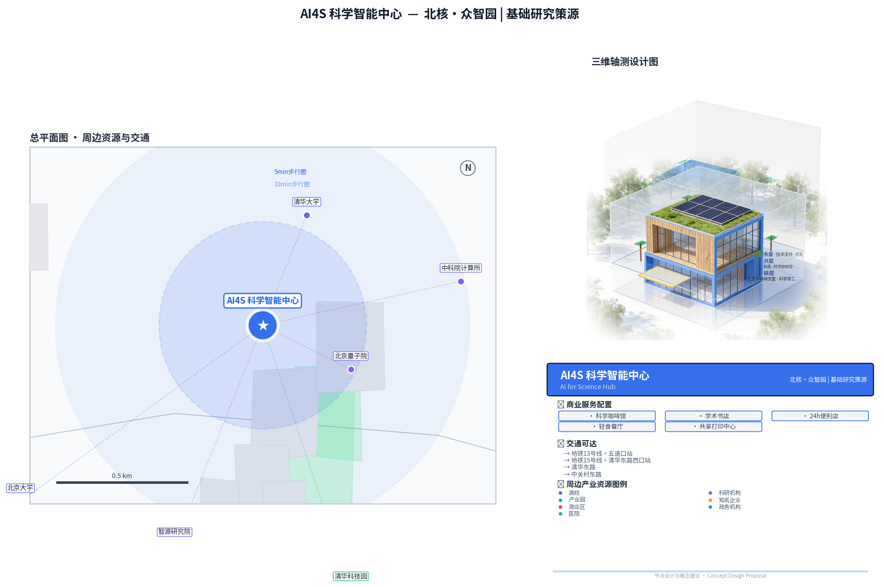 | 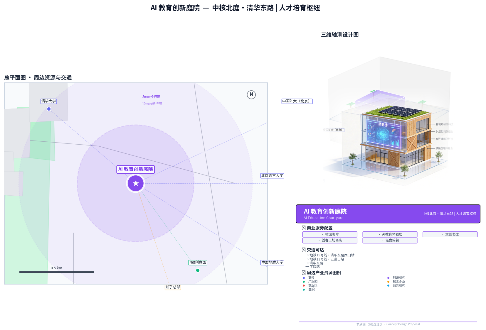 |
| *北核·众智园 | 基础研究策源* | *中核北庭·清华东路 | 人才培育枢纽* |

| AI社会科学实验室 | AI艺术创流水岸 |
|---------|---------|
| 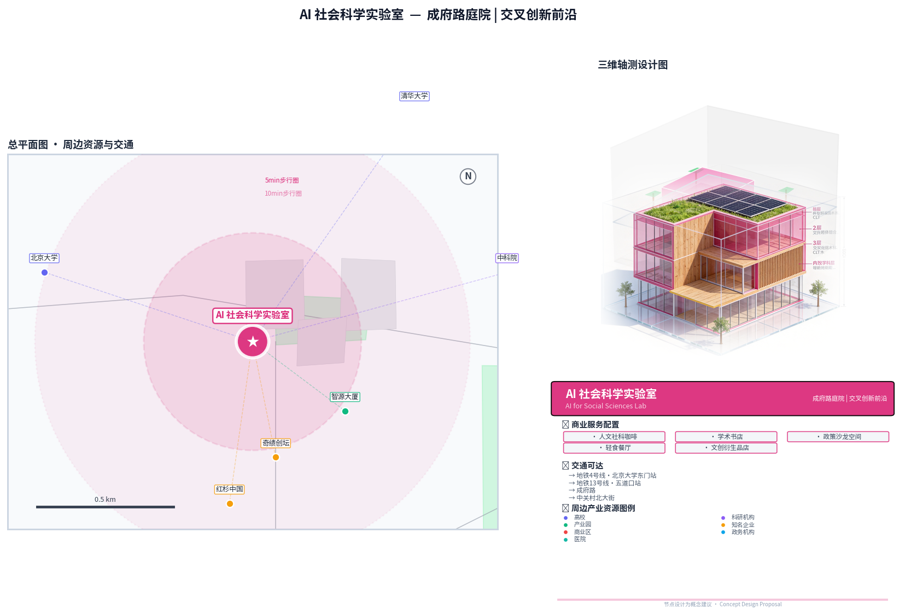 | 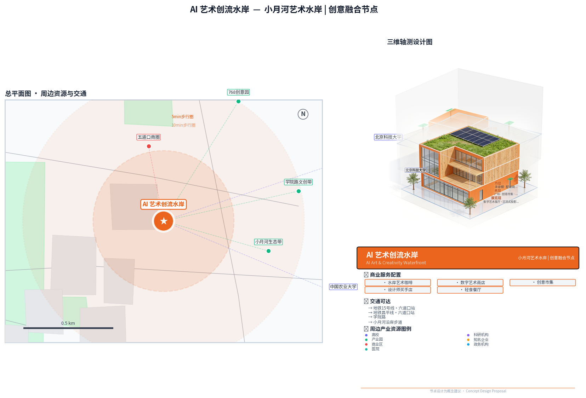 |
| *成府路庭院 | 交叉创新前沿* | *小月河艺术水岸 | 创意融合节点* |

| AI治理指挥中心 | 智能医学健康湾 |
|---------|---------|
| 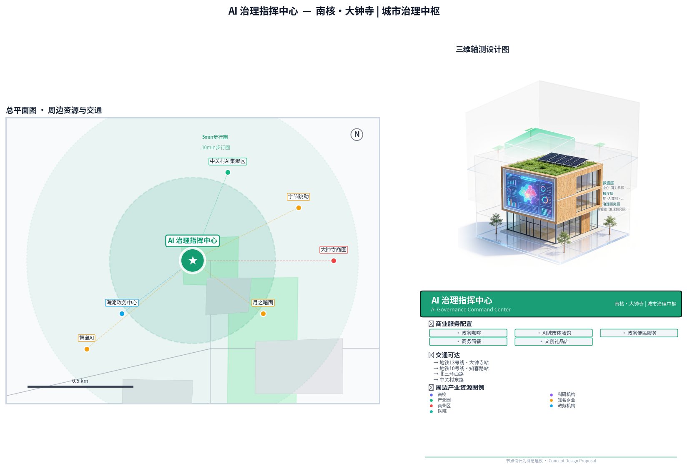 | 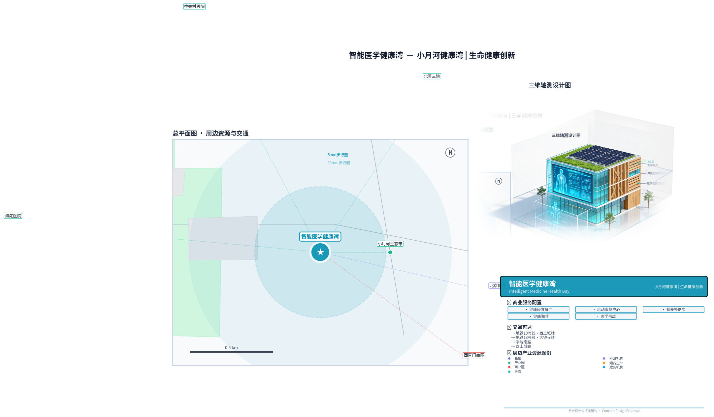 |
| *南核·大钟寺 | 城市治理中枢* | *小月河健康湾 | 生命健康创新* |

| AI智造加速营 |
|---------|
| 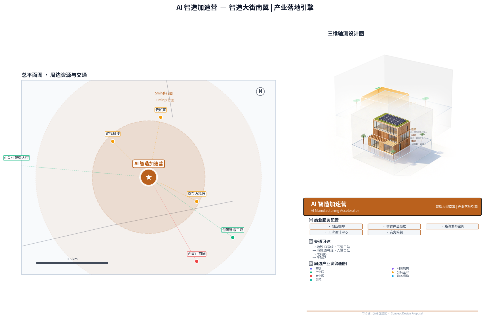 |
| *智造大街南翼 | 产业落地引擎* |

**总体空间逻辑**：沿对径轴从北到南，空间品质从学习型向创新型、产业型梯度上升，AI场景从基础研究（AI4S）向教育赋能、学科交叉、文化艺术、治理应用、健康医疗、智能制造逐层递进，形成"源头创新→交叉赋能→应用落地→产业转化"的完整创新链条。每个场景既是独立特色节点，也是创新链上的关键环节。

#### 5.5.1 七星连径系统

**七星节点定位表**（沿对径由北向南，对应北斗七星意象）：

| 编号 | 星名·主题 | 空间位置（片区/站点） | 核心AI场景 | 空间载体类型 |
|------|-----------|----------------------|------------|--------------|
| ① 天枢 | AI for Science | A1片区·北核（清华东路西口） | 科研大模型、算力调度、学科交叉研究 | 高校联合实验室·猜想广场 |
| ② 天璇 | AI教育 | A1-A2之间·五道口北 | 智慧教育、人才实训、终身学习 | 教育创新中心·培训基地 |
| ③ 天玑 | AI4SS（社会科学） | A2片区·中核（五道口） | 社会计算、政策模拟、经济仿真 | 社科实验室·加速实验室 |
| ④ 天权 | AI艺术与AIGC | A2片区·五道口南 | AIGC创作、数字艺术、文化遗产活化 | 艺术工坊·创意街区 |
| ⑤ 玉衡 | AI治理 | A2-A3之间·知春路 | 城市治理、智慧交通、公共服务AI | 治理指挥中心·城市大脑 |
| ⑥ 开阳 | AI医疗健康 | A3片区·南核东侧（大钟寺东） | 医学影像、健康管理、远程诊疗 | 智慧医疗中心·健康社区 |
| ⑦ 摇光 | AI智能制造 | A3片区·南核南侧（大钟寺南） | 工业互联网、机器人、数字孪生、AI质检 | 智造中试平台·制造创新厂房 |

七个特色AI场景节点之间，以京张铁路遗址公园的主步道为骨架，形成连续贯通的**"七星连径"**——既是步行交通廊道，也是品质梯度叙事的空间载体。沿径从北向南漫步，场景从基础研究走向产业应用，空间氛围从宁静学术走向活力繁华。

**三道一体断面设计**（七道格局的功能升级，详见4.3.2节）：
1. **步行道**（2.5m×2，东西两侧各一条）：林荫步行系统，铺装采用AI互动发光地砖（夜间人体感应发光，形成流动光点序列）
2. **骑行道**（3m×2，东西两侧各一条）：彩色沥青，支持智能骑行导航、无人配送车通行，与步行道绿化隔离
3. **中央景观带**（6-8m）：保留铁路遗迹，线性绿地+铁路主题景观装置，兼具遗址纪念与生态休闲功能

**主题休憩驿站**（6座，间距800-1200米）：智慧座椅+口袋花园（500-1000㎡）+AI互动导览+便民服务（自动售卖/卫生间/直饮水），一驿一景形成空间叙事节奏。

六座驿站对应七大AI场景主题，每站设有独特的主题标识、灯光设计和互动体验内容，形成"一驿一景、步步进阶"的空间叙事节奏。连径系统同时承载品质梯度的空间叙事——从北向南，景观从静谧学术园林逐渐过渡到活力都市界面，呼应AI创新从基础研究到产业应用的递进逻辑。

> **说明**：以上空间边界与场景布局均为**概念性建议（provisional）**，具体落位需结合法定规划与权属调研进一步深化。

#### 5.5.2 众创展示空间：数智经济的新型地租

沿京张创新对径分布的**众创展示空间**是本方案提出的创新性空间产品——以大型LED屏、全息投影、沉浸式装置为载体，为企业与高校提供付费的研究成果可视化展示服务，形成**"数智经济地租"**的新型商业模式。

**核心概念**：传统城市地租来自地段区位，AI时代的新型地租来自**注意力与知识可视化**。创新带通过高品质公共空间集聚人流与注意力，将沿径界面转化为可运营的"知识展示橱窗"。企业付费展示前沿成果，公众获得免费科学普及，政府收获城市活力，形成三方共赢的数字经济新形态。

**空间形态**：沿主步道设置大型互动屏墙（8-15米），利用建筑外墙与桥下空间做投影展示带，三核广场设全息展示亭，沿街商业界面配透明OLED橱窗。

**运营模式**：①企业/高校付费订阅，分级定价（核心区>场景节点>一般界面）；②每日2-3小时公益时段，免费播放科普与学生作品；③互动数据脱敏后反哺企业，形成数据闭环；④定期举办"成果发布日""实验室开放日"品牌活动。

**价值**：将纯消耗型公共空间转化为可产生收益的知识媒介，让前沿AI研究可视化、吸引人才、提升城市AI品牌显示度。

---

## 第六章 AI 创新生态、人才画像与 AI+ 场景

### 6.0 AI驱动的空间生成方法论：对径生成算法（DGA）

本方案提出**"对径生成算法"（Diameter Generation Algorithm, DGA）**——基于引力模型+多智能体模拟的空间形态自动生成框架，区别于传统的参数化设计（固定参数输入→确定性形态输出）。

**DGA核心逻辑**：
1. **引力模型层**：以三核（智源/原点/大钟寺）为引力源，基于品质梯度计算空间引力场分布，确定空间生长的势能面
2. **多智能体层**：模拟AI研发人员、创业者、产业人才、居民四类Agent的空间行为模式，通过Agent间的交互涌现空间形态
3. **对径约束层**：以线性对径骨架为约束条件，确保生成结果符合对径式空间结构范式
4. **性能反馈层**：实时计算可达性、交流效率、品质均衡度等指标，迭代优化生成结果

**与传统参数化设计的区别**：传统参数化设计是"设计师定义规则→计算机执行"的自上而下模式；DGA**概念框架**是"设定初始条件→系统自组织涌现→设计师引导优化"的自下而上与自上而下结合的模式（**方法论假设，待代码实现验证**），更接近真实城市空间的演化逻辑。

---

### 6.1 AI创新生态体系

从新空间经济视角看，AI创新生态不是规划"打造"出来的，而是通过空间品质供给吸引人才动态集聚，进而在人才流动与知识溢出的基础上**自组织涌现**出来的。规划不预设生态形态，而创造生态演化的品质条件。本节基于"空间品质→人才集聚→创新生态"的演化逻辑，阐述京张AI创新带的生态体系构建。

#### 6.1.1 基于空间品质的生态演化逻辑

AI创新生态演化遵循新空间经济"品质—人才—产业"因果链条：空间品质提升吸引人才集聚，人才集聚推动产业创新，产业创新反哺品质提升，形成循环累积因果。[source:SRC-008][source:SRC-019]

对径式空间结构通过品质梯度驱动人才动态分布——北段学习型品质吸引科研人才、中段创新型品质吸引创业人才、南段产业型品质吸引产业人才，线性廊道促进人才在不同节点间流动，实现知识溢出与创新扩散。

#### 6.1.2 全链条创新生态的空间品质基础

全链条创新生态（基础研究—技术研发—成果转化—产业集聚—场景应用）不是一个静态的链条结构，而是沿对径轴品质梯度分布的动态生态系统。每一个生态位都对应着特定的空间品质类型和人才类型。

```
基础研究层  →  技术研发层  →  成果转化层  →  产业集聚层  →  场景应用层
  (高校院所)    (重点实验室)   (孵化器加速器)   (企业总部)    (城市级场景)
    ↓              ↓              ↓              ↓              ↓
  众智园片区    众智园+原点    原点+众智园    大钟寺+原点     东翼+全沿线
    ↑              ↑              ↑              ↑              ↑
 学习型品质    学习+创新型     创新型品质     创新+产业型      智慧型品质
 科研人才      研发人才        创业人才       产业人才         应用人才
```

**基础研究层（学习型品质→科研人才→知识源头）**：
- **品质基础**：学习型空间品质（高校科研资源、学术文化氛围、安静研究环境）
- **人才载体**：AI科学家、研究员、青年学者
- **空间承载**：众智园片区（紧邻清华、北大、北航等高校）
- **核心机制**：知识溢出的源头——科研人才的集聚和流动产生基础研究成果，为整个创新生态提供知识供给
- 布局AI基础理论研究、大模型基础算法、通用人工智能等前沿方向
- 建设AI for Science联合实验室集群（生命科学、材料科学、物理学等）

**技术研发层（学习型+创新型品质→研发人才→技术转化）**：
- **品质基础**：学习型品质+创新型品质的复合供给（既有学术资源又有创业氛围）
- **人才载体**：技术研发专家、算法工程师、跨学科研究员
- **空间承载**：众智园+AI原点（品质梯度的过渡带）
- **核心机制**：知识的"翻译"与"转化"——将基础研究成果转化为可应用的技术方案
- 重点实验室、工程技术中心、企业研发中心
- 方向：计算机视觉、自然语言处理、多模态、强化学习、具身智能
- 产学研联合攻关机制

**成果转化层（创新型品质→创业人才→创业孵化）**：
- **品质基础**：创新型空间品质（创业服务、交流密度、资本网络）
- **人才载体**：创业者、产品经理、技术转化专家
- **空间承载**：AI原点+众智园（创新品质最高的区域）
- **核心机制**：创业的涌现——知识溢出与创业服务结合，催生大量创业项目
- 五级创业加速体系：顶尖人才引进型/高校孵化型/垂直领域型/开源社区型/大企业创投型
- 孵化器、加速器、众创空间、种子基金
- 技术转移中心、知识产权服务

**产业集聚层（创新型+产业型品质→产业人才→产业链形成）**：
- **品质基础**：产业型空间品质（商务配套、产业链完整度、市场接近度）
- **人才载体**：企业高管、产业工程师、运营管理人才
- **空间承载**：大钟寺+AI原点（产业品质最高的区域）
- **核心机制**：基于空间邻近性的产业链自组织——人才集聚吸引企业布局，企业集聚形成产业链
- AI头部企业总部、独角兽企业、成长型企业
- 产业链上下游配套企业
- 科技服务机构（金融、法律、咨询、人力资源）

**场景应用层（智慧型品质→应用人才→需求牵引）**：
- **品质基础**：智慧型空间品质（AI场景、数字设施、开放数据）
- **人才载体**：AI应用专家、解决方案工程师、产品运营人才
- **空间承载**：东翼+全沿线（场景最丰富的区域）
- **核心机制**：需求牵引的反向创新——应用场景的需求反馈拉动技术迭代和产品优化
- 城市级AI应用场景开放
- 政府、企业、社会多元场景供给
- 首试首用、首批次应用政策支持

#### 6.1.3 人才流动：创新生态的"血液循环系统"

在新空间经济框架下，人才流动是创新生态的核心动力机制——正如血液循环系统为身体各部位输送氧气和营养，人才流动为创新生态各环节输送知识和创意。对径式空间结构为人才流动提供了高效的空间载体：

- **南北向主流动**：沿对径轴的南北向流动，对应"科研→创业→产业"的人才发展路径和"知识→技术→产品"的转化路径
- **反向流动**：产业人才带着实际问题北上寻求科研合作，创业者南下了解市场需求，这种反向流动促进了创新链各环节的信息反馈
- **东西向循环流动**：通过双环实现的东西向流动，西环串联科研机构促进知识生产，东环串联社区和场景促进需求反馈
- **微观日常流动**：在多庭体系内的短距离流动，是非正式知识交流的主要来源，对应"血液循环"的微循环

人才流动的频率、方向和质量，决定了创新生态的活力和效率。对径式空间设计的核心目标之一，就是通过高品质廊道、梯度节点和交流网络，最大化人才流动的效率和知识溢出的效果。

#### 6.1.4 多层次创业加速体系：创业人才的成长阶梯

创业加速体系不是单纯的"企业孵化设施"，而是**创业人才的成长阶梯**——它为处于不同发展阶段的创业人才提供适配的空间品质和服务支持，帮助他们实现从"科研人才"到"创业人才"再到"产业人才"的身份转变。

构建五级AI创业加速体系，覆盖从创意到规模化的全生命周期，每一级都对应特定的人才类型和品质需求：

| 加速层级 | 面向对象（人才视角） | 加速周期 | 品质供给重点 | 空间载体 |
|---------|-------------------|---------|------------|---------|
| 种子加速 | 学生创业者、科研人才初次创业 | 3-6个月 | 低成本+学习型品质（低门槛接入、高校邻近） | 高校孵化器、众创空间 |
| 初创加速 | 有产品原型的创业团队核心成员 | 6-12个月 | 创新型品质（交流密度、导师网络、资本对接） | 众智园AI孵化器 |
| 成长加速 | 成长企业的创始团队和核心骨干 | 12-18个月 | 创新型+产业型品质（人才招聘、市场对接、空间扩张） | AI原点加速器 |
| 独角兽培育 | 准独角兽企业的高管团队 | 1-2年 | 产业型品质（政策对接、总部空间、产业生态） | 大钟寺总部基地 |
| 生态加速 | 头部企业的战略与创新团队 | 持续 | 复合型品质（产业生态、全球资源、战略协同） | 全区域 |

创业加速体系的空间布局沿对径轴从北到南展开，与品质梯度和人才流动方向一致。创业人才从北端的学习型品质区域出发，沿轴向南逐步成长，每经过一个加速层级就获得一次品质升级和能力提升，最终在南端的产业型品质区域成长为成熟的企业和产业人才。

### 6.2 AI人才画像与需求分析

#### 6.2.1 五类核心人才画像

**画像一：AI科学家与研究员**
- **人口学特征**：30-45岁，博士学历，海外名校或顶尖科研院所背景
- **职业特征**：高校教授/研究员、企业首席科学家、实验室主任
- **需求特征**：
  - 科研需求：大科学装置、算力支撑、前沿数据资源
  - 空间需求：安静的研究环境、临近高校和学术圈、高品质实验室
  - 生活需求：高端住房、子女优质教育、医疗保障、国际社区氛围
  - 社交需求：学术交流、跨学科碰撞、高端学术活动
- **规模预估**：约5000人 [metric:talent-scientists]

**画像二：AI工程师与技术专家**
- **人口学特征**：25-35岁，本科/硕士学历，计算机/数学/统计相关专业
- **职业特征**：算法工程师、研发工程师、架构师、技术负责人
- **需求特征**：
  - 职业发展：技术成长空间、有挑战性的项目、行业交流机会
  - 空间需求：高品质办公空间、24小时可用、协作空间充足
  - 生活需求：便利的生活配套、咖啡文化、运动健身、年轻社群
  - 住房需求：可负担的公寓、通勤便利、共享公寓
- **规模预估**：约8万人 [metric:talent-engineers]

**画像三：AI创业者与产品经理**
- **人口学特征**：28-40岁，本科/硕士，技术+商业复合背景
- **职业特征**：创业公司创始人/CEO、产品总监、AI解决方案专家
- **需求特征**：
  - 创业支持：融资对接、政策咨询、法务财务服务
  - 空间需求：灵活办公空间、路演场地、快速扩张能力
  - 社交需求：创业者社群、投资人网络、行业资源对接
  - 生活需求：高效率生活方式、商务社交空间、24小时城市活力
- **规模预估**：约2万人 [metric:talent-entrepreneurs]

**画像四：AI应用与运营人才**
- **人口学特征**：25-40岁，本科/硕士，多学科背景
- **职业特征**：AI产品运营、行业解决方案专家、数据分析师
- **需求特征**：
  - 职业需求：行业应用场景、跨领域合作机会
  - 空间需求：灵活办公、多场景体验、学习成长环境
  - 生活需求：多样化生活方式、文化娱乐、终身学习
  - 社交需求：跨界交流、兴趣社群、职业发展网络
- **规模预估**：约3万人 [metric:talent-operations]

**画像五：AI青年学子与实习生**
- **人口学特征**：20-28岁，本科/硕士在读或刚毕业
- **职业特征**：学生、实习生、初级工程师
- **需求特征**：
  - 学习需求：实习机会、技能培训、名师指导
  - 空间需求：低成本住宿、共享空间、学习场所
  - 生活需求：年轻化、社交化、低成本的生活方式
  - 文化需求：潮流文化、音乐艺术、运动户外
- **规模预估**：约1.5万人 [metric:talent-students]

#### 6.2.2 四类辐射带动人群画像

京张AI创新带不仅服务核心从业者，更以优质空间供给吸引流动型、到访型、体验型人群，形成人才动态集聚的"磁场效应"。四类辐射人群年流量预计20万人次以上：

**画像六：学术交流人群** — 25-55岁，国内外学者与行业专家，短期到访（1-7天）参会交流
- 需求：高品质会议空间、学术沙龙、学者公寓、科技成果展示、国际餐饮配套
- 规模：约5万人/年

**画像七：学习培训人群** — 20-45岁，学生与职场人，中期到访（1天-1月）参加培训认证
- 需求：培训教室、AI实训基地、学习型公寓、认证考试中心、夜间学习配套
- 规模：约6万人/年

**画像八：文化旅游人群** — 全年龄段，亲子与科技爱好者，短期到访（半天-2天）打卡体验
- 需求：AI体验中心、铁路遗产展示、文创商店、特色餐饮、多语种导览
- 规模：约5万人/年

**画像九：休闲生活人群** — 全年龄段，周边居民与运动爱好者，高频短时（每周多次）
- 需求：跑步骑行道、公园绿地、咖啡外摆、儿童游乐、社区市集、宠物友好
- 规模：约4万人/年

#### 6.2.3 人才动态集聚与辐射带动效应

京张AI创新带形成**"核心-辐射-影响"三级人才动态集聚体系**：

- **核心创新带（500m）**：直接服务约15万AI从业者，办公/实验室/公寓/配套完整闭环
- **辐射带动区（2km）**：年流量约20万流动人群，带动周边酒店餐饮零售服务业，激活空间活力
- **区域影响区（5km+）**：辐射京津冀创新网络，与三大科学城联动，输出制度与模式

**人才动态集聚机制**：①品质吸引——空间品质换人才集聚，非薪酬竞争力；②流量激活——流动人群带来多元碰撞，激发创新灵感；③网络效应——密度越高知识溢出越强；④持续进化——随产业迭代更新空间供给，保持长期吸引力

#### 6.2.4 人才社区空间布局

根据五类人才画像的不同需求，布局差异化的人才社区：


| 社区类型 | 面向人才 | 布局位置 | 空间特色 |
|---------|---------|---------|---------|
| 科学家社区 | AI科学家与研究员 | 众智园片区（低密度、园林式） | 花园式研究公寓、共享实验工作站、配套学术交流空间，公开申请、租住权属中性、不挤占普惠资源 |
| 工程师公寓 | AI工程师与技术专家 | AI原点社区（地铁站点周边） | 高层公寓、共享设施、运动健身 |
| 创业者社区 | 创业者与产品经理 | AI原点社区（核心区） | LOFT公寓、联合办公、24小时服务 |
| 应用人才社区 | 应用与运营人才 | 大钟寺+东翼 | 品质公寓、完善配套、社区服务 |
| 青年公寓 | 青年学子与实习生 | 五道口+学院路 | 共享公寓、创客空间、青年活动 |

### 6.3 AI+场景设计（场景卡片集）

> **场景卡数据治理说明**：所有AI+场景涉及的数据处理均遵循"必要性、最小化、可撤回"原则。每场景包含：合法处理基础（概念建议）、最小数据集、保存期限（建议≤场景运营周期+1年）、访问角色分级、第三方共享限制、用户删除/撤回机制、人工替代方案、投诉与停用条件。详细数据治理框架见 compliance_matrix.json。

#### 场景卡1：大模型训练与推理测试场（产业测试验证场景）

| 项目 | 内容 |
|------|------|
| **场景名称** | 大模型训练与推理测试场 |
| **场景类型** | 产业测试验证 |
| **所在位置** | 众智园片区·京张AI智算中心 |
| **技术领域** | 大语言模型、多模态大模型、基础模型 |
| **核心功能** | 为大模型企业提供算力支撑、模型训练环境、推理性能测试、模型评测认证服务 |
| **基础设施** | 十万卡级智算集群、高性能存储、高速网络、绿电直供 |
| **服务对象** | 大模型创业公司、高校科研团队、企业AI实验室 |
| **创新价值** | 降低大模型创业门槛，加速模型迭代，形成大模型产业集聚效应 |
| **空间需求** | 智算8万㎡+配套15万㎡ |
| **商业模式** | 算力租赁、模型评测服务、产业基金投资 |
| **治理约束** | 治理：智算中心+网信部门｜依据：生成式AI办法第7条｜数据：脱敏训练语料｜人工：安全评估抽检｜停：安全事故即停 |

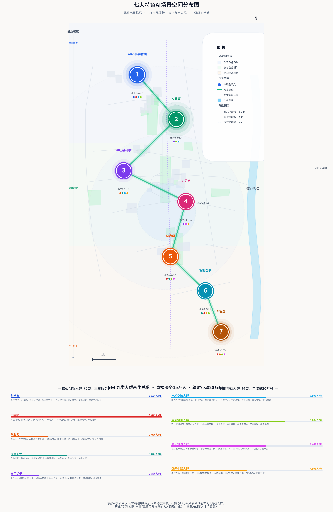

#### 场景卡2：具身智能测试验证园（产业测试验证场景）

| 项目 | 内容 |
|------|------|
| **场景名称** | 具身智能测试验证园 |
| **场景类型** | 产业测试验证 |
| **所在位置** | 众智园片区东北部 |
| **技术领域** | 人形机器人、服务机器人、工业机器人、自动驾驶 |
| **核心功能** | 提供室内外结合的具身智能产品测试验证环境，包括家庭、办公、工业、户外等多种场景 |
| **测试环境** | 模拟家居环境、办公楼宇、工厂车间、城市道路、公园绿地 |
| **服务内容** | 性能测试、安全认证、场景适配优化、数据采集 |
| **创新价值** | 填补具身智能测试空白，加速产品迭代 |
| **空间需求** | 测试5万㎡+研发10万㎡ |
| **运营模式** | 测试服务收费、企业入驻、联合实验室 |
| **治理约束** | 治理：测试园+应急管理｜依据：安全生产法｜数据：园内测试数据｜人工：安全测试旁站｜停：安全事故即停 |

#### 场景卡3：AI+金融科技创新测试场（产业测试验证场景）

| 项目 | 内容 |
|------|------|
| **场景名称** | AI+金融科技创新测试场 |
| **场景类型** | 产业测试验证 |
| **所在位置** | 大钟寺片区·AI+行业应用解决方案中心 |
| **技术领域** | 智能风控、智能投顾、智能客服、反欺诈、量化交易 |
| **核心功能** | 为金融AI应用提供合规测试环境、金融数据沙盒、监管科技验证 |
| **合作机构** | 金融监管部门、银行、保险、证券、金融科技公司 |
| **测试内容** | 算法公平性测试、数据安全测试、合规性验证、压力测试 |
| **创新价值** | 在风险可控的前提下推动金融AI创新，助力北京金融科技中心建设 |
| **空间需求** | 约3万㎡办公测试空间 |
| **运营模式** | 监管沙盒运营、企业服务、培训认证 |
| **治理约束** | 治理：金融监管+沙盒管委会｜依据：生成式AI办法17条｜数据：沙盒脱敏数据｜人工：决策人工复核｜停：合规红线即停 |

#### 场景卡4：AI+智慧交通示范区

| 项目 | 内容 |
|------|------|
| **场景名称** | AI+智慧交通示范区 |
| **场景类型** | 城市运营场景 |
| **所在位置** | AI原点社区·五道口片区 |
| **技术领域** | 自动驾驶、车路协同、智能信号、MaaS |
| **核心功能** | 自动驾驶接驳车、无人配送车、智能信号灯优化、一体化出行服务平台 |
| **示范内容** | L4级自动驾驶接驳（对径沿线）、无人配送（社区和园区）、AI信号优化（重点路口） |
| **创新价值** | 提升通行效率30%以上，减少交通事故，改善出行体验 |
| **覆盖范围** | 约5平方公里示范区域 |
| **实施路径** | 分阶段开放测试道路，逐步扩大示范范围 |
| **治理约束** | 治理：公安交管+交通委｜依据：个保法第26条｜数据：脱敏车流轨迹｜人工：信号优化确认｜停：事故上升即停 |

#### 场景卡5：AI+未来社区样板

| 项目 | 内容 |
|------|------|
| **场景名称** | AI+未来社区样板 |
| **场景类型** | 生活服务场景 |
| **所在位置** | 东翼·小月河场景赋能翼 |
| **技术领域** | 智慧社区、AI家居、健康管理、无人配送 |
| **核心功能** | 智慧物业、AI健康管家、智能垃圾分类、社区服务机器人、数字孪生社区 |
| **体验内容** | 居民可以体验AI赋能的全场景智慧生活 |
| **创新价值** | 打造可复制可推广的AI+未来社区标准范式 |
| **社区规模** | 约2000户示范社区 |
| **参与方式** | 居民自愿参与，提供反馈参与迭代优化 |
| **治理约束** | 治理：街道办+居委会｜依据：个保法第13条｜数据：自愿授权可撤回｜人工：物业人工兜底｜停：业主表决即停 |

#### 场景卡6：AI+智慧教育创新区（七大特色场景）

| 项目 | 内容 |
|------|------|
| **场景名称** | AI+智慧教育创新区 |
| **场景类型** | 公共服务场景 |
| **所在位置** | 清华东路庭院（AI教育院） |
| **技术领域** | 个性化学习、智能辅导、AI教师、教育元宇宙 |
| **核心功能** | AI辅助教学、个性化学习路径规划、智能评估、虚拟实验、AI素养教育 |
| **空间载体** | 庭院式教育创新中心+3-5所AI特色示范校联动+线上学习平台，建筑面积约3万㎡ |
| **示范内容** | 从K12到高等教育全年龄段AI教育示范，涵盖智慧课堂、AI导师、学习分析、教育公平 |
| **创新价值** | 推动教育公平和质量双提升，培养AI时代新型人才，形成可复制的智慧教育范式 |
| **延伸产业** | 智慧教育产品研发和企业集聚 |
| **治理约束** | 治理：教委+学校｜依据：个保法+未成年人保护法｜数据：学习数据禁画像｜人工：教学决策人工终审｜停：评估暂停即停 |

#### 场景卡7：AI+智慧商圈体验区

| 项目 | 内容 |
|------|------|
| **场景名称** | AI+智慧商圈体验区 |
| **场景类型** | 商业消费场景 |
| **所在位置** | AI原点社区·五道口商圈 |
| **技术领域** | 计算机视觉、自然语言处理、AIGC、数字人 |
| **核心功能** | 智能导购、虚拟试衣、AI推荐、无人零售、数字人店员、AI餐厅 |
| **体验内容** | 消费者可以体验全流程AI赋能的购物和餐饮服务 |
| **创新价值** | 提升消费体验，促进消费升级，打造智慧商业样板 |
| **商业规模** | 约20万㎡商业面积 |
| **参与商家** | 100+品牌商家参与AI改造升级 |
| **治理约束** | 治理：商务+市场监管｜依据：消费者权益保护法｜数据：消费脱敏禁强人脸｜人工：投诉人工响应｜停：超标即整改 |

#### 场景卡8：AI+城市治理指挥中心（七大特色场景）

| 项目 | 内容 |
|------|------|
| **场景名称** | AI+城市治理指挥中心 |
| **场景类型** | 城市运营场景 |
| **所在位置** | 南核·大钟寺片区（AI治理院） |
| **技术领域** | 城市大脑、数字孪生、计算机视觉、预测分析 |
| **核心功能** | 全域态势感知、AI辅助决策、产业治理监测、应急指挥调度、跨部门协同治理 |
| **治理领域** | 交通、环境、安全、市政、公共服务 + 产业运行监测 + AI产业治理 |
| **空间载体** | AI治理指挥中心大楼+城市运行大屏+应急指挥大厅，建筑面积约2万㎡ |
| **创新价值** | 构建AI时代城市治理新范式，实现产业治理与城市治理双示范，提升治理精细化水平 |
| **技术底座** | 城市信息模型（CIM）+ 公共设施感知（清单公开）网络 + AI算法平台 |
| **治理约束** | 治理：城管+政务服务局｜依据：数据安全法｜数据：公开清单内使用｜人工：决策人工审核｜停：失误即停 |

#### 场景卡9：AI+文化遗产活化

| 项目 | 内容 |
|------|------|
| **场景名称** | AI+文化遗产活化体验 |
| **场景类型** | 文化旅游场景 |
| **所在位置** | 京张铁路遗址公园·全线 |
| **技术领域** | AR/VR、数字人、AIGC、智能导览 |
| **核心功能** | AI数字人导游、AR历史复原、沉浸式体验展、AI文创生成 |
| **体验内容** | 游客可以通过AI技术"穿越"到不同年代，体验京张铁路的历史变迁 |
| **创新价值** | 让文化遗产活起来，提升游客体验，传承创新精神 |
| **覆盖范围** | 9公里遗址公园全线，3处重点体验节点 |
| **衍生价值** | AI文创产品开发、数字藏品、文化IP运营 |
| **治理约束** | 治理：文物局+文旅局｜依据：文物保护法｜数据：文物数据严格管控｜人工：专家人工鉴定｜停：文物风险即停 |

#### 场景卡10：AI+科学研究开放平台（AI for Science）（七大特色场景）

| 项目 | 内容 |
|------|------|
| **场景名称** | AI+科学研究开放平台（AI for Science） |
| **场景类型** | 科研服务场景 |
| **所在位置** | 北核·众智园片区·前沿科学园（AI4S院） |
| **技术领域** | AI+生命科学、AI+材料科学、AI+物理、AI+化学、AI+数学 |
| **核心功能** | 提供AI科研算力、数据集、算法工具、联合研究空间 |
| **研究方向** | 蛋白质结构预测、新材料发现、药物分子设计、气候模拟、基础数学AI辅助 |
| **空间载体** | 科研楼宇+共享实验室+学术交流庭院，建筑面积约8万㎡ |
| **合作机构** | 清华、北大、中科院等高校院所 |
| **创新价值** | 打造世界级AI for Science策源地，推动科学研究范式变革，加速重大原始创新 |
| **运营模式** | 开放平台+联合实验室+科研服务 |
| **治理约束** | 治理：科委+高校院所｜依据：科技伦理审查办法｜数据：科研数据合规授权｜人工：伦理审查人工｜停：伦理违规即停 |

#### 场景卡11：AI社会科学(AI4SS) + AI艺术与AIGC创作（七大特色场景·双场景联动）

| 项目 | 内容 |
|------|------|
| **场景名称** | AI社会科学(AI4SS) + AI艺术与AIGC创作（双场景联动） |
| **场景类型** | 学科交叉 + 文化创意场景 |
| **所在位置** | AI4SS：中核·AI原点社区（AI社科院）｜AI艺术：铁路记忆花园旁庭院（AI艺术院） |
| **技术领域** | 计算社会科学、政策仿真、AIGC、数字艺术、数字人、AR/VR |
| **核心功能** | 【AI4SS】AI+社科交叉研究、政策仿真实验室、社会计算实验场、数字人文｜【AI艺术】AIGC创作工坊、数字艺术展厅、京张遗产沉浸体验、AI文创孵化、数字人演艺 |
| **空间载体** | AI4SS：跨学科研究楼+政策仿真中心约4万㎡｜AI艺术：铁路遗存改造艺术空间+沉浸展厅约2.5万㎡ |
| **创新价值** | 填补AI与社科深度融合空白，融合铁路遗产活化与AI艺术创新，打造"学科交叉+文化创造"的AI人文新地标 |
| **联动机制** | AI4SS产出的社科洞察为AI艺术创作提供思想内涵，AI艺术的表达为社科研究提供传播载体 |
| **治理约束** | 治理：文旅+网信+版权局｜依据：著作权法+生成式AI办法｜数据：创作数据版权保护｜人工：内容人工审核｜停：版权违规即停 |

#### 场景卡12：AI+健康管理社区（智能医学）（七大特色场景）

| 项目 | 内容 |
|------|------|
| **场景名称** | AI+健康管理社区（智能医学） |
| **场景类型** | 健康医疗场景 |
| **所在位置** | 南核东侧·生命健康庭院（智能医学院） |
| **技术领域** | AI影像、健康监测、智能诊断、药物研发、心理健康AI |
| **核心功能** | AI医学影像诊断、智能体检、慢病管理、远程医疗、AI辅助药物研发、心理健康AI辅助 |
| **服务内容** | 为社区居民提供全周期AI健康管理服务，结合AI医疗企业与三甲医院联合诊疗 |
| **三位一体模式** | 智能医学影像（AI辅助诊断+影像组学）+ 健康管理社区（全周期监测+慢病干预）+ 远程诊疗（三甲医院联动+AI分诊），构建"早筛-管理-诊疗"闭环 |
| **人才社区融合** | 嵌入人才公寓底层，为创新人才提供健康档案、心理咨询、运动指导等专属服务，以健康保障提升人才留存率 |
| **空间载体** | 智慧医疗中心+健康管理社区+AI药企联合实验室，建筑面积约3万㎡ |
| **合作机构** | 三甲医院、AI医疗企业、健康管理机构 |
| **创新价值** | 从"以治病为中心"转向"以健康为中心"，构建全周期智慧健康管理新模式 |
| **覆盖人群** | 示范社区5-10万居民 |
| **治理约束** | 治理：卫健委+医院｜依据：个人信息保护法29条｜数据：健康数据严格保密｜人工：诊疗人工终审｜停：医疗事故即停 |

#### 场景卡13：AI猜想揭榜（虚实融合）+ AI智能制造

| 项目 | 内容 |
|------|------|
| **位置** | 猜想揭榜：全域三核｜智能制造：南核东南翼制造创新庭院 |
| **核心功能** | 猜想发布→热度排行→揭榜攻关→评议审核→成果落地 全周期创新链｜智能工厂示范、工业机器人、数字孪生生产线、AI质检、柔性制造验证 |
| **产业更新关系** | 依托大钟寺周边存量工业/仓储空间更新改造，带动传统产业数字化转型 |
| **空间载体** | 线上：虚拟猜想广场/加速实验室/揭榜大厅｜线下：三核路演中心+制造创新厂房约5万㎡ |
| **治理要求** | 创新带管委会+学术委员会+工信+安监；AI初筛+人工复核；抄袭严肃处理；热度防刷（多维加权+异常检测） |
| **AI可移除性** | AI依赖4项（语义分类、热度排行、智能匹配、质量初筛），人工流程4项（发布审核、揭榜评议、专家终审、成果落地）。移除AI后降级为纯人工"问题墙+揭榜栏"模式，核心功能完整保留 |
| **人工复核** | 猜想质量终审、揭榜成果专家评议、热度异常人工复核三大机制 |

### 6.4 场景实施机制

| 机制 | 核心内容 |
|------|---------|
| **场景开放** | 首席场景官制度、需求/机会清单双发布、揭榜挂帅择优机制 |
| **首试首用** | 首次应用补贴与保险支持、容错机制鼓励创新试错、优秀场景优先推广 |
| **评估迭代** | 效果评估体系、定期反馈评估、优化形成运营闭环 |

---

### 6.5 对径治理协议

AI场景跨节点治理采用**"四层架构·四权分离"**模式：

- **四层架构**：准入层（资质审核+算法备案）、运行层（状态监测+异常预警）、暂停层（人工接管+数据保全）、退出层（终止撤场+非智能等价路径）
- **数据权益分治**：个人信息权益归数据主体、产业数据权益归经营主体、公共数据权益归政府、治理监督权属公共机构，收益分配按贡献与合规原则多元协商

**三核跨节点治理协议**：数据分级共享（核心属地化+衍生跨区流动）、算力协同调度（弹性算力池按需分配）、模型备案互通（一核备案、三核认可）、责任边界清晰（运营/算法/监管三方权责明确）、应急联动（跨节点协同响应）。

**算法备案与审计**：对径轴公共AI系统实行"双备案+年度审计"——上线前备案、重大变更重备案、每年第三方审计并公开报告。

**公共利益压力测试**：建立数据隐私、算法公平、就业冲击、空间可达、公共安全五维度压力测试框架，季度评估+三色预警，红色预警召开公众听证会。

---

### 6.8 AI场景合规分类（待法律专业审查）

> ⚠️ 不同AI应用适用不同法规，不得用《生成式AI暂行办法》概括所有场景。以下为初步分类，**需法律专业审查确认**。

| AI应用类型 | 初步适用法规 | 待审查事项 |
|-----------|------------|----------|
| 生成式AI服务 | 《生成式AI暂行办法》[source:SRC-015] | 服务备案、训练数据合规 |
| 公共视频分析 | 待法律专业审查 | 数据采集合法性、个人信息保护 |
| 自动驾驶/配送 | 待法律专业审查 | 测试资质、安全责任、保险 |
| AI+医疗 | 待法律专业审查 | 医疗器械注册、医疗数据合规 |
| AI+教育 | 待法律专业审查 | 教育数据安全、未成年人保护 |
| AI+金融 | 待法律专业审查 | 金融监管、消费者保护 |

> **合规路径**：MVP先行—合规审查—逐步扩围，未通过审查不得上线。

## 第七章 用地、建筑规模与拆改留方案

### 7.1 用地布局规划

#### 7.1.1 现状用地分析

**总体特征**：
- 总体设计范围11.4km²内，现状以城市建设用地为主
- 工业用地、科研用地、居住用地、商业服务业设施用地混合分布
- 京张铁路遗址沿线用地功能复杂，空间碎片化严重
- 土地利用效率参差不齐，存量更新潜力大

**现状用地结构**（总体设计范围，概念研究）：

> 下表用地布局为**概念性现状梳理**，基于provisional边界测算，非法定现状数据。

| 用地类型 | 面积（ha） | 占比 | 主要分布 |
|---------|-----------|------|---------|
| 居住用地 | 约285 | 25% | 东西两侧成片分布 |
| 工业/仓储用地 | 约171 | 15% | 沿铁路线分布 |
| 科研/教育用地 | 约228 | 20% | 高校周边、科技园区 |
| 商业服务业用地 | 约114 | 10% | 五道口、大钟寺等核心区 |
| 道路与交通设施用地 | 约182 | 16% | 全域分布 |
| 绿地与广场用地 | 约91 | 8% | 遗址公园、城市绿地 |
| 其他 | 约69 | 6% | 市政设施、特殊用地等 |

[metric:land-use-status]

#### 7.1.2 规划用地结构

**规划目标**：优化用地结构，提高产业空间占比，完善公共服务和公共空间供给。

**规划用地结构概念建议**（总体设计范围）：

> 下表用地布局为**概念性规划建议**，基于provisional边界测算，非法定用地布局，供专项规划参考。

| 用地类型 | 面积（ha） | 占比 | 变化 |
|---------|-----------|------|------|
| 产业/科研用地 | 约342 | 30% | +10pp（工业转型+新增） |
| 居住用地 | 约251 | 22% | -3pp（优化存量） |
| 商业服务业用地 | 约137 | 12% | +2pp（品质提升） |
| 公共服务设施用地 | 约68 | 6% | +3pp（新增配套） |
| 道路与交通设施用地 | 约182 | 16% | 持平 |
| 绿地与广场用地 | 约137 | 12% | +4pp（遗址公园+口袋公园） |
| 市政设施用地 | 约23 | 2% | 持平 |
| 合计 | 1140 | 100% | - |

[metric:land-use-plan]

> **量化口径统一说明**：以上用地比例基于总体设计范围11.4km²（provisional边界）概念测算，空间分母为总体设计范围城市建设用地，时间基准为概念规划情景，scenario状态为provisional，计算公式为各用地类型面积/总建设用地面积×100%，数据来源为现状梳理+概念规划建议[metric:land-use-status][metric:land-use-plan]。所有数值均为概念性研究参考，非法定规划指标。

### 7.2 建筑规模与容量控制

#### 7.2.1 建筑规模总量

> 以下数据为**概念情景估算**（provisional状态），空间分母为总体设计范围provisional边界，时间基准为2035规划目标，所有指标置信度为"低（情景研究）"，最终以法定规划与现状建筑普查为准。

**现状建筑总量**：约1300–1500万㎡（总体设计范围，粗估区间）[metric:existing-floor-area]
> ⚠️ 现状建筑总量为基于公开资料的粗略估算区间，需经现状建筑普查确认。

**规划建筑总量**：约1600–2000万㎡（总体设计范围·概念情景区间，中位值约1800万㎡）[metric:planned-floor-area]
> ⚠️ 建筑总量为情景推演区间，受拆除成本、土地指标、市场需求等多重因素影响，需经专项可行性论证确定。
- 净增量：约400万㎡
- 拆除总量：约370万㎡（拆除重建）
- 新建总量：约770万㎡（拆除重建370万㎡ + 纯新增400万㎡）
- 增量来源：低效用地再开发、容积率提升、地下空间利用

**分区建筑规模（概念情景）**：

| 片区 | 现状建筑（万㎡） | 规划建筑（万㎡） | 净增量（万㎡） | 增量比 |
|------|----------------|----------------|-------------|--------|
| 众智园片区（192.1ha） | 约250 | 约380 | +130 | +52% |
| AI原点社区（104.3ha） | 约320 | 约480 | +160 | +50% |
| 大钟寺片区（72.0ha） | 约180 | 约260 | +80 | +44% |
| 其他区域 | 约650 | 约680 | +30 | +5% |
| 合计（概念情景） | 约1400 | 约1800 | +400 | +29% |

[metric:floor-area-by-zone]

#### 7.2.2 建筑功能结构

**规划建筑功能结构**：

> 下表建筑面积与功能构成为**概念情景估算**，供深化研究，非审批依据。

| 功能类型 | 建筑面积（万㎡） | 占比 | 说明 |
|---------|----------------|------|------|
| 产业办公 | 约810 | 45% | AI企业办公、研发、实验室 |
| 居住 | 约450 | 25% | 人才公寓、普通住宅 |
| 商业服务 | 约270 | 15% | 商业、餐饮、酒店、体验 |
| 公共服务 | 约126 | 7% | 教育、医疗、文化、体育 |
| 市政配套 | 约54 | 3% | 变电站、机房等 |
| 其他 | 约90 | 5% | 交通、仓储等 |
| 合计 | 约1800 | 100% | - |

[metric:floor-area-by-function]

**保障性空间专项配置**（provisional·概念目标）：

| 保障性空间类型 | 规模（万㎡） | 占对应功能比 | 保障对象 |
|--------------|------------|------------|---------|
| 保障性租赁住房 | 约90 | 居住约20% | 新市民、青年人、低收入群体 |
| 人才公寓 | 约63 | 居住约14% | 青年科创人才、引进人才 |
| 公益性众创空间 | 约32 | 产业办公约4% | 初创团队、大学生、社会创业者 |
| 公益性文化设施 | 约13 | 公共服务约10% | 全体市民免费使用 |
| **合计保障性空间** | **约198** | **总建筑约11%** | - |

#### 7.2.3 容积率敏感性测试区间（供专项研究参考·不绑定具体地块）

> ⚠️ 下表为**敏感性测试变量**，不绑定具体地块，非控规指标/方案结论。

| 片区 | 平均容积率（敏感性测试中位值） | 核心区测试区间（低-中-高情景） | 一般区域测试区间（低-中-高情景） |
|------|----------------------|---------------------------|-----------------------------|
| 众智园片区 | ≈2.0 | 2.0–3.0（待核验） | 1.2–2.0（待核验） |
| AI原点社区 | ≈4.0 | 4.0–6.0（待核验） | 2.5–4.0（待核验） |
| 大钟寺片区 | ≈3.0 | 3.0–5.0（待核验） | 2.0–3.5（待核验） |
| 整体平均 | ≈1.5（粗估） | - | - |

> **说明**：上表为概念情景测算，非法定指标。最终容积率以上位规划与控规修编为准，需专业核验。

[metric:floor-area-ratio]

### 7.3 拆改留概念情景方案（待专业核验）

#### 7.3.1 分类标准

**拆除类**：
- 建筑质量差、存在安全隐患的危旧建筑
- 土地利用效率极低的低效建筑
- 严重影响城市整体布局和公共空间的建筑
- 不符合产业发展方向、无改造价值的建筑

**改造类**：
- 建筑结构质量较好，但功能不符合当前需求的建筑
- 通过改造可有效提升使用效率和空间品质的建筑
- 具有历史价值或风貌特色、需保护利用的建筑
- 通过改造可满足AI产业使用需求的建筑

**保留类**：
- 建筑质量好、功能完善、与规划定位相符的建筑
- 重要公共建筑和基础设施
- 历史保护建筑和文物古迹
- 近期建成、状态良好的建筑

#### 7.3.2 三大片区拆改留敏感性测试分类（待现状调查核验·不绑定具体地块）

> ⚠️ **非实施依据声明**：下表为城市更新策略**敏感性测试分类假设**，用于评估不同更新路径对建筑容量和空间品质的影响，不绑定具体地块，不构成拆迁或实施依据。具体拆改留方案需以现状建筑调查、安全评估和权属核实结果为准。

**众智园片区（192.1ha）测试分类**：

> 下表为**敏感性测试变量分类**，非实施依据。

| 分类 | 测试建筑面积（万㎡） | 测试占比 | 主要对象（测试假设） |
|------|----------------|------|---------|
| 拆除 | 约50 | 20% | 老旧厂房、低效建筑、城中村 |
| 改造 | 约100 | 40% | 科研楼改造、厂房改造为AI办公（品质/功能升级，不改变建筑面积） |
| 保留 | 约100 | 40% | 质量较好的科研楼宇、高校建筑 |
| 现状合计 | 约250 | 100% | - |
| 新建（拆除重建+纯新增） | 约180 | - | 拆除重建约50万㎡ + 纯新增约130万㎡ |
| 规划合计 | 约380 | - | 250 - 50 + 180 = 380 |

**AI原点社区（104.3ha）**：

| 分类 | 建筑面积（万㎡） | 占比 | 主要对象 |
|------|----------------|------|---------|
| 拆除 | 约80 | 25% | 城中村、危旧建筑、低效商业 |
| 改造 | 约128 | 40% | 老旧写字楼改造、商业升级（品质/功能升级，不改变建筑面积） |
| 保留 | 约112 | 35% | 质量好的写字楼、商业、住宅 |
| 现状合计 | 约320 | 100% | - |
| 新建（拆除重建+纯新增） | 约240 | - | 拆除重建约80万㎡ + 纯新增约160万㎡ |
| 规划合计 | 约480 | - | 320 - 80 + 240 = 480 |

**大钟寺片区（72.0ha）**：

| 分类 | 建筑面积（万㎡） | 占比 | 主要对象 |
|------|----------------|------|---------|
| 拆除 | 约54 | 30% | 建材市场、低效商业、老旧建筑 |
| 改造 | 约54 | 30% | 商业楼宇改造为AI总部办公（品质/功能升级，不改变建筑面积） |
| 保留 | 约72 | 40% | 质量较好的办公楼、住宅 |
| 现状合计 | 约180 | 100% | - |
| 新建（拆除重建+纯新增） | 约134 | - | 拆除重建约54万㎡ + 纯新增约80万㎡ |
| 规划合计 | 约260 | - | 180 - 54 + 134 = 260 |

[metric:demolition-modify-retain]

#### 7.3.3 拆改留实施原则

1. **先建后拆、先安后搬**：优先建设安置房源和新产业空间，再推进拆除工作，确保平稳过渡
2. **分类施策、精准更新**：根据建筑质量、功能、价值等因素分类制定更新策略，避免一刀切
3. **保护优先、传承记忆**：具有历史价值的建筑和工业遗产优先保护，活化利用
4. **利益共享、多方共赢**：建立政府、企业、居民利益共享机制，形成更新合力
5. **分期推进、滚动开发**：分阶段有序推进，以点带面，逐步扩大更新范围

### 7.4 地下空间利用研究方向（备选研究方向·不进入方案结论）

> ⚠️ **研究方向声明**：以下为地下空间利用的**备选研究方向**，供未来专项规划参考，不进入本方案的结论性内容。地下工程的可行性、规模和具体方案需经地质勘察、人防审查、交通评估等专项论证后方可确定。

#### 潜在研究方向
- 重点片区地下空间综合利用的研究方向（商业、停车、市政、人行通道等可行性需专项论证）
- 地铁站点周边地下一体化开发的研究方向（TOD模式可行性需专项论证）
- 京张遗址公园地下空间利用的研究方向（市政设施、停车等可行性需专项论证）
- 地下连通系统构建（站点-建筑-公共空间地下连通）

#### 地下空间概念情景
- 概念情景：地下空间适度开发（商业、停车、市政、人行通道）
- 具体规模与功能需结合地质勘察、人防要求与专项规划确定，本方案不作精确结论

---

## 第八章 交通、轨道、市政与公共服务设施

### 8.1 道路交通系统

#### 8.1.1 道路网规划

**规划目标**：构建"轨道主导、慢行优先、智慧赋能"的绿色交通体系，绿色出行比例≥85%。

**道路网结构**：五级路网体系

| 道路等级 | 功能定位 | 红线概念宽度（待专业核验） | 概念车速（待专业核验） |
|---------|---------|---------|---------|
| 快速路 | 区域快速通达 | 60-80m | 80km/h |
| 主干道 | 片区之间联系 | 40-50m | 60km/h |
| 次干道 | 片区内部联系 | 30-40m | 40km/h |
| 支路 | 街区通达 | 20-25m | 30km/h |
| 街巷路 | 微循环、生活服务 | 12-15m | 20km/h |

**道路网密度**：
- 快速路+主干道：约2.5km/km²
- 次干道：约2.0km/km²
- 支路及以下：约5.0km/km²
- 总路网密度：≥9.5km/km² [metric:road-density]

#### 8.1.2 道路微循环优化

**重点措施**：

1. **打通断头路**：
   - 梳理并打通所有丁字路和断头路
   - 增加南北向和东西向联系通道
   - 破解铁路和轨道交通造成的空间分割

2. **窄路密网**：
   - 在三大重点片区推行窄路密网模式
   - 增加支路和街巷路，提升路网通达性
   - 缩小街区尺度，增强街道活力

3. **交叉口优化**：
   - 主要交叉口渠化设计，提高通行效率
   - 设置行人安全岛和二次过街设施
   - 优化信号配时，AI智能调控

4. **交通宁静化**：
   - 居住区和步行优先区推行交通宁静化
   - 减速带、窄点设计、路面铺装变化
   - 限速20-30km/h，保障步行安全

#### 8.1.3 静态交通

**停车供给策略**：
- 差异化停车供给：核心区适度从紧，外围区域适度宽松
- 以地下停车为主，地面停车严格控制
- 共享停车机制：办公与居住停车错时共享

**停车配建标准**：

| 用地类型 | 配建指标 | 说明 |
|---------|---------|------|
| 产业办公 | 0.5-0.8位/100㎡ | 低于传统标准，鼓励绿色出行 |
| 居住 | 0.8-1.0位/户 | 人才公寓可适当降低 |
| 商业 | 0.8-1.0位/100㎡ | 核心商圈适度从紧 |
| 公共服务 | 0.5-1.0位/100㎡ | 差异化配置 |

**智能停车管理**：
- 全域停车诱导系统
- 预约停车和共享停车平台
- 无人值守和无感支付
- 充电桩一体化配置

### 8.2 轨道交通系统

#### 8.2.1 既有轨道线路

| 线路 | 沿线站点 | 功能定位 |
|------|---------|---------|
| 13号线 | 五道口、知春路、大钟寺、西直门 | 创新带东西向主要轨道线路 |
| 10号线 | 知春路、西土城、牡丹园 | 环线，换乘便捷 |
| 15号线 | 清华东路西口 | 北部联系通道 |
| 昌平线 | 西二旗、清河站 | 北部新城联系 |
| 4号线 | 西直门 | 南北向主要通道 |
| 2号线 | 西直门 | 环线 |

#### 8.2.2 轨道微中心建设

按照"一站一策、一站一品"的原则，建设6个轨道微中心：

| 站点 | 等级 | 核心功能 | 开发模式 |
|------|------|---------|---------|
| 五道口站 | 一级 | AI原点核心，综合服务 | 站城一体化，高强度开发 |
| 大钟寺站 | 一级 | 南部门户，产业总部 | TOD综合开发 |
| 知春路站 | 一级 | 创业孵化，换乘枢纽 | 既有站改造提升 |
| 清华东路西口站 | 二级 | 众智园门户，科研服务 | 站点周边提质升级 |
| 学知园站 | 二级 | 中部服务，居住配套 | 社区级微中心 |
| 西直门站 | 一级 | 综合交通枢纽，门户展示 | 既有枢纽功能优化 |

#### 8.2.3 轨道与周边一体化设计

**一体化设计要点**：
- 站点出入口与周边建筑地下/地上直接连通
- 站点500米范围内集聚商业、办公、公共服务功能
- 步行友好的站点接驳系统
- 自行车停车设施与站点一体化设计
- 公交接驳站点合理布局

**轨道设施预留研究（概念建议·不纳入近期建设）**：
- 13号线增设学清路站（众智园片区中部）
- 规划新增北部东西向联络线
- 完善站点周边慢行接驳系统

### 8.3 慢行交通系统

#### 8.3.1 步行系统

**三级步行网络**：

| 层级 | 空间载体 | 宽度 | 功能 |
|------|---------|------|------|
| 步行主通道 | 京张创新对径中央步道 | 6-8m | 南北向步行主轴线、创新交往 |
| 步行次通道 | 主要街道人行道 | 3-5m | 日常通勤、商业步行 |
| 步行支通道 | 街巷路和社区步道 | 2-3m | 社区通达、邻里交往 |

**步行舒适度保障**：
- 林荫覆盖率≥70%（夏季降低体感温度5-8℃）
- 每500米一处休憩节点（座椅+饮水+充电+WiFi）
- 重点路段设置风雨连廊
- 全程无障碍设计，坡度≤5%
- 过街安全：行人信号优先、安全岛、二次过街

#### 8.3.2 自行车系统

**「一主多支」自行车网络**：

- **主骑行道**：京张创新对径双侧各3.5m，南北贯通，独立路权
- **次骑行道**：沿主要城市道路设置，东西向为主
- **支骑行道**：社区和园区内部自行车道
- **总里程**：约50km（总体设计范围）

**骑行接驳**：
- 轨道站点全覆盖自行车停放设施
- 每个站点配备共享单车/电单车
- 对径沿线每1km一个自行车驿站
- 智能停车和电子围栏管理

#### 8.3.3 三道一绿格局

沿京张铁路遗址公园构建"三道一绿"的慢行和生态系统：

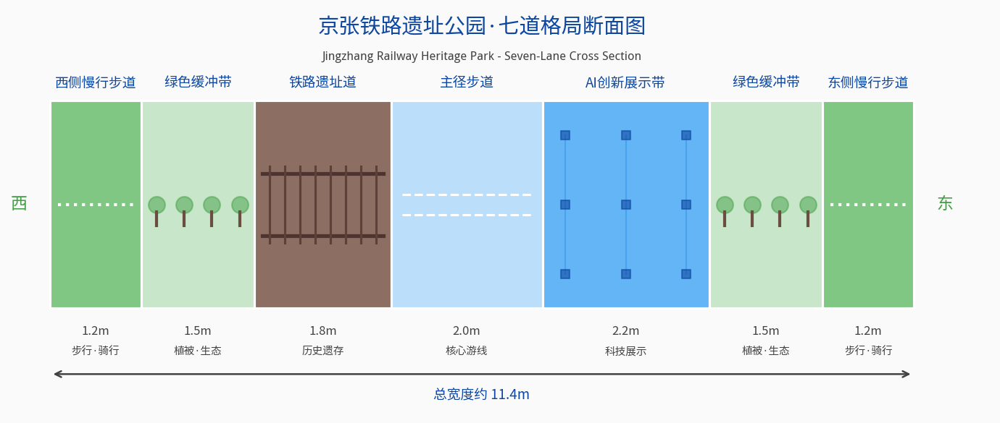

- **跑步道**：西侧2.5m漫步道（可兼作跑步道）
- **自行车道**：双侧各3.5m，独立路权
- **漫步道**：中央主步道6-8m + 双侧漫步道各2.5m
- **绿色景观**：双侧绿化缓冲带各8-10m + 中央绿化景观

### 8.4 新型基础设施

#### 8.4.1 算力基础设施

**京张AI智算中心**：
- 规模：十万卡级GPU集群（分两期建设）
- 位置：众智园片区
- 功能：为创新带AI企业提供普惠算力服务
- 技术指标：总算力≥10EFLOPS（FP16）
- 绿电直供：100%可再生能源供电
[metric:compute-center]

**分布式边缘计算节点**：
- 布局：每平方公里1-2个边缘计算节点
- 功能：低延时AI推理、数据预处理、本地服务
- 规模：每个节点10-50张GPU卡

**算力调度平台**：
- 统一算力调度和管理
- 按需分配、弹性供给
- 算力交易和计费系统

#### 8.4.2 网络基础设施

**5G/5G-A全覆盖**：
- 创新带范围内5G信号覆盖率100%
- 核心区5G-A（5.5G）覆盖，万兆入楼
- 室内分布系统深度覆盖

**全光网络底座**：
- 光纤到楼、光纤到户
- 核心区域10G PON接入
- 超低时延传输网络

**量子保密通信试点**：
- 核心机构和重要设施量子加密通信
- 政务和金融数据安全传输

#### 8.4.3 感知基础设施

**公共设施感知（清单公开）网络**：
- 智能摄像头（视频分析、异常事件识别（仅安全场景））
- 环境传感器（空气质量、噪声、温湿度）
- 交通传感器（车流量、车速、停车位）
- 市政传感器（水位、井盖、管线）

**城市级数字孪生底座**：
- 城市信息模型（CIM）平台
- 三维城市建模（高精度地形+建筑+设施）
- 实时数据接入和可视化

#### 8.4.4 能源基础设施

**智能电网**：
- 高可靠性供电（99.99%以上）
- 重要负荷双回路供电
- 微电网和孤岛运行能力

**分布式能源系统**：
- 建筑光伏一体化（BIPV），可利用屋面覆盖率≥80%
- 分布式储能设施（集中式+分布式）
- 地源热泵、空气源热泵

**充换电设施**：
- 充电桩：车桩比≥2:1
- 换电站：核心区2km覆盖
- 智能充电调度，削峰填谷

### 8.5 市政基础设施

#### 8.5.1 水资源与海绵城市

**海绵城市目标**：年径流总量控制率≥85%

**海绵系统布局**：
- 京张遗址公园作为核心调蓄带
- 道路海绵化改造（透水铺装、生物滞留带）
- 建筑小区海绵设施（雨水花园、下凹绿地、蓄水池）
- 小月河等水系生态修复
- 智慧海绵监测系统

**再生水利用**：
- 再生水管网全覆盖
- 市政杂用、绿化、工业用水优先使用再生水
- 再生水利用率≥50%

#### 8.5.2 废弃物处理

**智能垃圾分类和回收系统**：
- 智能垃圾分类设备全覆盖
- AI识别分类质量，积分激励
- 地下垃圾气力输送系统试点（核心区）
- 建筑废弃物资源化利用率≥90%

### 8.6 公共服务设施

#### 8.6.1 配置标准与体系

按照"15分钟优质生活圈"标准，构建三级公共服务体系，坚持**优质均衡、普惠共享**原则，保障不同片区、不同群体享有同等水平的公共服务：

| 层级 | 服务半径 | 主要设施 | 配置方式 |
|------|---------|---------|---------|
| 片区级 | 1500m | 大型医院、中学、文化中心、体育中心 | 每片区1-2处 |
| 社区级 | 500-800m | 小学、社区卫生中心、文化站、体育设施 | 每社区1处 |
| 街坊级 | 300m | 幼儿园、便利店、口袋公园、养老驿站 | 按需均衡布局 |

**均等化保障措施**（provisional·概念目标）：
- **资源均衡分布**：三大片区公共服务设施配置标准统一，南北片区人均设施面积偏差≤10%
- **弱势群体优先**：无障碍设施、老年服务、儿童设施优先纳入初期建设
- **公益属性保障**：公立教育、医疗、文化设施占比不低于60%，保障基本公共服务公益性
- **AI赋能均等**：AI辅助诊疗、智慧教育、数字文化服务向弱势群体倾斜，缩小数字鸿沟

#### 8.6.2 重点公共服务设施清单

**教育设施**：

| 设施类型 | 数量 | 新增/提升 | 说明 |
|---------|------|----------|------|
| 九年一贯制学校 | 2所 | 新增1所 | AI特色示范校 |
| 小学 | 5所 | 新增2所 | 优质教育资源引入 |
| 幼儿园 | 12所 | 新增5所 | 普惠性幼儿园为主 |
| 国际学校/国际部 | 1所 | 新增 | 国际化特色教育，公开申请、多元录取标准 |

**医疗设施**：

| 设施类型 | 数量 | 新增/提升 | 说明 |
|---------|------|----------|------|
| 三甲医院分院 | 1所 | 新增 | AI+智慧医院试点 |
| 社区卫生服务中心 | 5处 | 新增3处 | 基本医疗+健康管理 |
| 心理健康服务中心 | 2处 | 新增 | AI人才特色配套 |

**文化体育设施**：

| 设施类型 | 数量 | 新增/提升 | 说明 |
|---------|------|----------|------|
| 综合文化中心 | 3处 | 新增 | 含图书馆、小剧场等 |
| 体育中心/体育馆 | 2处 | 新增1处 | 含恒温泳池、健身房等 |
| AI科技馆 | 1处 | 新增 | 科技体验+科普教育 |
| 京张铁路纪念馆 | 1处 | 新增 | 文化地标+教育基地 |

---

## 第九章 蓝绿空间、公共空间与城市风貌

### 9.1 蓝绿空间格局

#### 9.1.1 「一脊三廊多点」生态格局

**一脊**：京张铁路遗址公园绿色脊柱
- 9公里线性生态廊道（核心绿带35-40m，属微观断面）
- 复合功能：生态+休闲+文化+创新交往
- 绿地面积：约35ha

**三廊**：三条南北向生态廊道
- 西廊：中关村绿廊（沿中关村大街）
- 中廊：京张遗址公园绿脊
- 东廊：小月河生态绿廊

**多点**：多个城市公园和社区绿地
- 城市级公园：3处
- 社区公园：8-10处
- 口袋公园：30-50处

#### 9.1.2 生态指标

| 指标 | 目标值 | 现状值 |
|------|--------|--------|
| 人均公园绿地面积 | ≥18㎡/人 | 约12㎡/人 |
| 建成区绿化覆盖率 | ≥45% | 约38% |
| 公园绿地500米服务半径覆盖率 | 100% | 约85% |
| 本土植物占比 | ≥80% | - |
| 鸟类种类 | 提升30% | - |
| 年径流总量控制率 | ≥85% | 约60% |

[metric:ecological-indicators]

**生态普惠价值**：蓝绿空间对全体市民免费开放、普惠共享——线性公园贯穿南北，使沿线所有社区居民步行5分钟可达绿色空间；生态廊道不仅服务创新人才，更服务周边数十万居民，是全体市民共享的生态福利。生态建设坚持"低成本、高效益、广覆盖"原则，优先保障最广泛人群的生态权益。

### 9.2 京张铁路遗址公园活力带

#### 9.2.1 总体定位

**「中国创新时间轴」——集生态绿廊、文化长廊、创新交往、休闲游憩于一体的复合型城市公共空间**

以9公里京张铁路遗址为载体，融合铁路文化、中关村文化、AI文化三条脉络，打造展示中国自主创新精神的线性公共空间。

公园整体设计延续"溯源而生"的空间叙事，以北部清华园车站遗址为历史原点，沿主径向南展开百年铁路记忆与AI创新未来的时空对话。

#### 9.2.2 分段主题设计

| 区段 | 对应片区 | 文化主题 | 时间坐标 | 核心体验 |
|------|---------|---------|---------|---------|
| 北段 | 众智园片区 | 自主创新的起点 | 1909年·京张铁路通车 | 铁路遗址展示、詹天佑纪念、工程技术史 |
| 中段 | AI原点社区 | 科技创新的浪潮 | 1980s至今·中关村崛起 | 创新记忆展、创业故事、科技企业发展 |
| 南段 | 大钟寺片区 | 智能时代的未来 | 2020s+·AI新纪元 | AI未来体验、智能城市演示、前沿科技展示 |

#### 9.2.3 断面设计（七道格局）

> ⚠️ **SRC-021提示**：本节断面设计基于公开信息概念推演，未取得正式文本，具体以官方发布为准。

从西到东依次为：
1. 西侧绿化缓冲带（8-10m）
2. 西侧自行车道（3.5m）
3. 西侧漫步道（2.5m）
4. 中央主步道（6-8m）
5. 东侧漫步道（2.5m）
6. 东侧自行车道（3.5m）
7. 东侧绿化缓冲带（8-10m）

总宽度约35-40米。

> **与宏观七道格局的关系**：35-40m为遗址公园核心绿带微观断面；60-80m"七道格局"为含道路+退界的宏观整体格局，二者为局部—整体关系，详见4.3.2节。

#### 9.2.4 节点设计

**三大核心节点**：

1. **众智园站·铁路记忆**：保留原始车站建筑和铁轨，设京张铁路纪念馆、铁路主题景观、工程技术史展陈
2. **原点站·创新中心**：原点广场（城市客厅），AI原点大厦对望，科创市集、大型活动草坪和露天剧场
3. **大钟寺站·未来门户**：南大门形象广场，AI互动体验装置、未来科技展示墙、门户地标雕塑

**十大特色展亭**（每公里1个）：每亭一个主题，串联三条文化脉络，集展示、休憩、服务于一体，现代简约风格融入铁路元素

### 9.3 公共空间体系

#### 9.3.1 三级公共空间体系

> 下表公共空间层级为**概念布局建议**，供专项规划深化，非审批依据。

| 层级 | 类型 | 数量 | 服务半径 | 规模 | 功能 |
|------|------|------|---------|------|------|
| 一级 | 城市级公园广场 | 5处 | 全域 | 2-5ha | 大型活动、地标形象 |
| 二级 | 片区级开放空间 | 12处 | 500m | 0.5-2ha | 主题活动、日常休憩 |
| 三级 | 社区级微空间 | 50+处 | 200m | 100-500㎡ | 邻里交往、口袋公园 |

**公益性承诺**（provisional·概念目标）：

- **100%公共开放**：所有公园、广场、庭院、街道公共空间100%对公众免费开放，不设围墙和门禁
- **24小时可达**：主径步行系统24小时开放，夜间提供安全照明和应急呼叫，保障夜行安全
- **无障碍全覆盖**：全域公共空间按照《无障碍设计规范》标准建设，轮椅可达率100%，盲道连续贯通
- **全龄友好**：配备儿童游乐设施、老年人休憩座椅、母婴室、第三卫生间等全龄服务设施
- **公益性活动优先**：公共空间优先保障公益性文化、科普、社区活动，商业活动需经审批且占比≤20%

#### 9.3.2 创新庭院（多庭）

七座庭院由北向南梯度递进，从源创的初心出发，经由知学、智创、文汇、数算、景行，最终抵达未来，完整呈现一条科技创新的精神轨迹。

沿京张创新对径布置多处创新庭院，形成"一庭一主题、步移景亦异"的线性交往空间序列。庭院间距控制在300—500米，确保步行可达、使用便捷。每处庭院根据所在区位和周边功能确定差异化主题，分别承担学术交流、创业路演、文化展示、数字交互、场景体验、休闲休憩等功能。

**七大特色AI场景庭院一览表**：

| 庭院主题 | 区位 | 核心功能 | 景观特色 |
|---------|------|---------|---------|
| **AI4S科学智能院** | 北段·众智园 | AI for Science联合实验、前沿学术论坛 | 水院、天光倒影、林荫围合 |
| **AI教育院** | 北段·清华东路 | AI教育创新、科教融合、学习沙龙 | 书院式布局、景墙题刻、林下学座 |
| **AI社会科学院** | 中段·AI原点 | AI4SS交叉研究、政策仿真、社会实验 | 光影中庭、棱镜装置、互动媒体墙 |
| **AI艺术院** | 中段·知春路 | AI艺术创作、数字沉浸、文化遗产活化 | 艺术装置、户外展墙、阶梯论坛 |
| **AI治理院** | 中南段·大钟寺北 | AI治理展示、城市大脑科普、治理研讨 | 像素铺装、LED数据瀑布、沉浸式投影 |
| **智能医学院** | 南段·大钟寺南 | 智慧健康体验、AI医疗展示、健康科普 | 全息展示、互动装置、体验空间 |
| **AI智造** | 南端·东南翼 | 智能制造展示、机器人体验、工业AI演示 | 镜面装置、穹顶投影、未来之门构筑物 |

**夜景照明构思**：沿对径分布的庭院节点在夜间照明设计中采用统一的低照度暖光点光系统，由线性灯带串联成线，形成疏密有致、若隐若现的光点序列，于含蓄之中暗含秩序感与方向感，呼应整体空间的创新源流意向。

#### 9.3.3 北部原点广场

在对径最北端设置**原点广场**，作为整条创新带的空间起点与精神锚点：
- **核心构筑物**：简约几何造型的金属装置，顶部设置定向光源，寓意源头定向
- **地面铺装**：深色基底石材嵌入光纤点光，形成由北向南逐渐舒展的光点图案
- **精神内涵**：呼应百年京张从铁路自主创新到AI自主创新的精神传承，体现"溯源启新"的设计主旨
- **功能定位**：科创活动的公共聚散空间，承载重要发布、节庆仪式等城市级活动

沿京张创新对径两侧布局七大特色AI场景庭院（详见5.5节），形成"步移景异"的创新微空间序列。庭院功能涵盖创业孵化、开源社区、休闲社交、路演发布、公共艺术、数字交互等类型，与七大特色AI场景一一对应。

#### 9.3.4 对径创新街道公共空间

街道公共空间是创新带最具开放性与包容性的公共界面，也是创新人群日常接触最频繁的空间类型。对径创新街道突破了传统街道"通行优先"的逻辑，转向"社交优先、创新优先"，将线性交通廊道重构为集交流、展示、休闲、服务于一体的复合创新空间走廊。

**设计原则**：

- **连续性原则**：沿京张遗址公园主径两侧构建总长约6.2公里的连续街道公共界面，确保创新人群在步行范围内能够便捷获取各类公共服务与社交空间。
- **分层复合原则**：采用地面层（街道与退界空间）、建筑界面层（首层架空与展示）、空中层（连廊与屋顶花园）的立体分层设计，最大化公共空间的垂直供给效率。
- **弹性适应原则**：街道设施采用模块化、可拆装的设计策略，能够根据产业入驻节奏、人群规模变化和活动举办需求灵活调整空间配置。
- **科技美学原则**：街道家具、标识系统、照明设施均采用统一的科技美学语言，以简洁的几何形态、哑光金属质感与智能交互特征彰显AI创新带的时代特质。

**空间类型体系**：

街道公共空间按照服务半径与功能定位，分为三个层级：
- **核心节点型**（三核广场及庭院周边）：承担大型活动、品牌展示、核心社交功能，空间尺度开阔，设施配置完善
- **社区邻里型**（轨道站点周边）：服务日常通勤与社区生活，强调便利性与舒适性
- **线性廊道型**（主径沿线）：以慢行体验与景观观赏为主，穿插小型交流节点与服务设施

**街道美学与场所精神**：

对径创新街道的美学表达建立在京张铁路遗产的工业记忆与AI时代的科技未来感的张力对话之上。保留铁轨、道岔、信号灯等工业遗产元素作为空间叙事线索，同时以参数化设计的金属构件、智能交互屏、低照度光点系统等当代语言予以回应，形成"历史根脉与智创未来交织共生"的独特场所气质。

#### 9.3.5 全龄友好与社会包容性设计

**包容性空间设计对照表**（provisional·概念目标）：

| 群体 | 空间设计考量 | 配置标准 |
|------|------------|---------|
| 老年人 | 无障碍坡道、休憩座椅加密、防滑铺装、大字标识、助老服务站 | 每200米一处休憩点、座椅≥20张/公里 |
| 儿童 | 安全游戏场地、自然探索空间、亲子卫生间、儿童友好过街 | 每500米一处儿童活动点、安全步行路径 |
| 残障人士 | 全域无障碍、盲道连续、无障碍电梯/卫生间、语音导览 | 轮椅可达率100%、AI视觉辅助全覆盖 |
| 低收入群体 | 公益性众创空间、低价共享办公、平价餐饮、保障房 | 公益众创空间≥15%、平价餐饮300米覆盖 |
| 女性群体 | 安全照明、母婴室、夜间安全护送 | 主要公共空间母婴室全覆盖、夜间蓝灯通道 |

**包容性设计原则**：通用设计优先、最小干预可达、多元服务供给、文化包容共融。

### 9.4 时间维度设计：四时·昼夜·周律·年轮

建立四级时间周期的时空一体化设计框架，让创新带在不同时间尺度下呈现差异化氛围。

#### 9.4.1 四级时间周期框架

| 时间尺度 | 周期 | 设计主题 | 核心目标 |
|---------|------|---------|---------|
| 年周期 | 春夏秋冬 | 春花·夏荫·秋韵·冬骨 | 四季有景、全年可游 |
| 日周期 | 早中晚夜 | 通勤·活力·休憩·夜未央 | 全时段活力、24小时生机 |
| 周周期 | 工作日/周末 | 高效工作日·活力周末场 | 职住平衡、周节律调节 |
| 生命周期 | 近中远三期 | 起步·生长·成熟 | 动态生长、持续进化 |

#### 9.4.2 年周期：四季景观与活动

- **春季（3—5月）**：花径+创新萌发季——AI春季论坛、青年创业节、樱花科技节
- **夏季（6—8月）**：荫径+创智生长季——夏夜AI电影节、科创市集、黑客马拉松
- **秋季（9—11月）**：色径+成果收获季——金秋科创周、AI产业博览会、创新峰会
- **冬季（12—2月）**：骨径+蓄势待发季——冰雪科技节、AI冬令营、新年灯光秀

#### 9.4.3 日周期：六时功能与氛围

| 时段 | 模式 | 核心功能 | 设施状态 |
|------|------|---------|---------|
| 6:00—8:00 | 晨启模式 | 跑步、骑行、通勤 | 步道照明渐灭，早餐车启动 |
| 8:00—10:00 | 通勤模式 | 通勤、接驳、早餐 | 自行车道高峰，咖啡外摆营业 |
| 10:00—12:00 | 办公模式 | 商务洽谈、户外会议 | 创新庭院满负荷运转 |
| 12:00—14:00 | 午间活力 | 午餐、散步、社交 | 餐车外摆高峰，午间演出 |
| 14:00—17:00 | 下午办公 | 下午茶、路演、散步 | 咖啡座、共享亭正常使用 |
| 17:00—19:00 | 黄昏转换 | 下班、健身、约会 | 夜景照明渐亮，商业升温 |
| 19:00—21:00 | 夜间休闲 | 餐饮、娱乐、夜跑 | 夜市、酒吧、电影、音乐 |
| 21:00—24:00 | 夜未央 | 深夜书房、24h办公 | 低照度暖光，核心节点活跃 |

**技术策略**：可移动设施（模块化）、智慧照明（分时调节）、数字投影（夜间艺术）、智慧调度（人流大数据）。

#### 9.4.4 周周期：工作日与周末切换

**工作日**：效率优先、通勤主导——早高峰保障通行、午间半小时活动、晚高峰通勤健身叠加。
**周末**：休闲优先、体验主导——创意市集、亲子AI体验、露天电影、慢行优先。

#### 9.4.5 生命周期：分期生长弹性框架

> 注：本节为**长期空间生长生命周期分期**（2026—2035远景框架），与第10章近期实施分期（启动期2026—2027、加速期2028—2029、成熟期2030+）为不同时间尺度的两套分期体系，分别对应"空间生长逻辑"与"工程实施逻辑"，互不矛盾。

- **启动期（2026—2028）**：骨架构建——三核节点+对径主轴+首开庭院
- **生长期（2029—2032）**：活力填充——双环完善+全部庭院+社区级设施
- **成熟期（2033—2035）**：品质提升——全覆盖+精细化运营+数字孪生管理

**弹性预留**：部分地块预留弹性空间、建筑预留扩建可能、地下空间按需开发、公共空间可重组设计。

### 9.5 AI朝圣地标

#### 地标一：AI原点大厦（No.1 创新原点）
- 位置：五道口核心区，对径轴中点
- 高度：约150m（概念导控·待专业核验）
- 功能：AI总部办公、路演中心、展示中心
- 造型："创新原点"——圆柱形塔楼，顶部收分如灯塔，寓意创新之光
- 文化意义：创新带制高点，AI时代创新原点象征

#### 地标二：京张铁路纪念馆（No.2 创新根脉）
- 位置：清华园车站遗址旁
- 规模：约5000㎡
- 功能：铁路史展陈、詹天佑纪念、创新精神教育
- 设计：保留老车站建筑，新增现代展陈空间
- 文化意义：百年京张历史根脉，创新精神传承载体

#### 地标三：大钟寺AI之门（No.3 创新门户）
- 位置：南部门户，大钟寺地铁站旁
- 高度：约120m双塔（概念导控·待专业核验）
- 功能：AI产业总部、展示体验、商务服务
- 造型："智慧之门"——双塔顶部空中连廊形成门户拱门
- 文化意义：创新带南部门户，AI产业走向全国的象征

### 9.6 城市风貌控制

#### 9.6.1 风貌分区指引

> 下表建筑高度为**概念性导控建议**，供专项规划参考，非法定控制指标。

| 风貌分区 | 范围 | 风貌特征 | 建筑高度 | 材料色彩 |
|---------|------|---------|---------|---------|
| 众智园学院风貌区 | 众智园片区 | 园林式、低密度、学院风 | 3-6层为主，局部12层 | 红砖+玻璃+坡屋顶元素 |
| 原点都市活力区 | AI原点社区 | 高密度、未来感、活力都市 | 12-30层，地标150m | 玻璃+金属+通透感 |
| 大钟寺门户商务区 | 大钟寺片区 | 门户形象、商务气质 | 15-25层，地标120m | 石材+玻璃+展示性界面 |
| 遗址公园融合带 | 京张遗址沿线 | 生态+工业+科技融合 | ≤24m | 保留工业元素+现代科技材料 |
| 生活配套风貌区 | 东西两翼居住区 | 宜居、便利、社区感 | 6-18层 | 温暖色调、人性化尺度 |

#### 9.6.2 建筑高度概念引导与天际线意象（待专业核验）

**高度控制原则**：
- 沿京张遗址公园100米范围内建筑高度≤24米，保证空间开放性
- 核心区高强度开发，形成空间焦点
- 由核心向周边逐级降低，形成层次丰富的天际线

**天际线形态**：
- 以AI原点大厦为最高点（约150m）
- 向北：众智园片区逐渐降低至24-40m
- 向南：大钟寺片区过渡至80-120m
- 东西两侧：从中央对径向两侧先升后降，形成"山谷"形态

#### 9.6.3 街道家具与标识系统

**设计原则**：统一风格、融合三元素（铁路+中关村+AI）、科技赋能

**街道家具**：
- 座椅、垃圾桶、灯柱、候车亭统一设计
- 融入轨道线、电路板、神经网络等图形元素
- 智能赋能：太阳能灯柱、智能座椅（充电+WiFi）、智慧垃圾桶

**导视标识系统**：
- 统一的视觉识别系统（Logo+色彩+字体）
- 分级导视：区域级、片区级、街区级、节点级
- 智能导览屏：每800米一个，提供导航、活动信息、AI交互

#### 9.6.4 公共艺术

**公共艺术长廊**：沿京张遗址公园布局20+件公共艺术作品
- 纪念性雕塑：詹天佑像、创新先驱群像等
- 当代艺术：装置艺术、新媒体艺术、互动艺术
- AI艺术：AI生成艺术、数据可视化艺术、参与式艺术

**公共艺术计划**：
- 设立"京张公共艺术基金"
- 每年举办国际公共艺术邀请展
- 青年艺术家驻留计划
- AI艺术创作大赛

---

### 9.6.5 可复用公共空间AI组件库（概念设计）

本方案构建**7大类20+子项的公共空间AI组件库**，每类都有对应的AI技术支撑，实现"即插即用"的智能空间赋能：

| 组件类别 | 核心子项 | AI技术支撑 | 技术独创性 |
|---------|---------|-----------|-----------|
| ①生成式景观设计组件 | AI花境生成、季节性植被动态配置、互动水景控制 | 自然语言生成式景观设计(NL2Landscape)+植物知识图谱 | 用户用自然语言描述景观效果，AI自动生成植物配置方案与施工图参数，实时响应季节变化和养护需求 |
| ②多模态交互导览组件 | AR历史重现、AI语音导览、手势识别互动 | 多模态大模型+空间计算+计算机视觉 | 融合语音/视觉/手势多模态交互的沉浸式导览，支持中英文自由切换，AI根据用户兴趣自动生成个性化导览路线 |
| ③预测性维护数字孪生组件 | 设施健康监测、故障预警、能耗优化 | 数字孪生+时序预测模型+边缘计算 | 基于传感器数据的设施全生命周期预测性维护，将被动维修转为主动预警，降低维护成本30%以上（概念估算） |
| ④自适应环境调控组件 | 智能遮阳、动态照明、空气质量调控 | 强化学习控制+环境感知网络+人体舒适度模型 | AI根据实时人流、天气、用户反馈自动调节环境参数，实现舒适度与能耗的最优平衡 |
| ⑤AI安全治理组件 | 人群密度预警、异常行为检测、应急疏散引导 | 计算机视觉+多智能体疏散模拟+隐私保护计算 | 采用边缘计算+差分隐私技术，实现安全监测与个人隐私保护的平衡，所有数据本地处理不上传 |
| ⑥创意激发交互组件 | AI共创墙、灵感生成装置、创意碰撞匹配 | 生成式AI+推荐系统+社交网络分析 | 基于用户兴趣图谱的创意伙伴推荐算法，促进不同背景人群的跨学科创意碰撞 |
| ⑦数字孪生运营组件 | 空间使用分析、活力热度预测、活动智能推荐 | 时空数据挖掘+预测模型+运营优化算法 | 基于历史数据和实时感知的空间活力预测与运营策略自动生成，实现空间价值的动态最大化 |

**组件库的技术架构**：采用"感知层—边缘计算层—平台层—应用层"四层架构，所有组件统一API接口、统一数据标准、统一安全协议，支持第三方开发者接入扩展，形成开放的AI空间组件生态。

> 以上为概念性技术建议，具体实现需经专项技术验证和安全评估。

### 9.6.6 荣誉与贡献展示系统

**四类荣誉体系**：京张创新奖（年度·突出贡献）、青年开拓者（半年度·35岁以下）、创新印记（实时·企业里程碑）、共建者名录（批次·市民参与）。

**治理机制**：学术/产业/政府/公众各25%组成审核委员会；提名→核验→评审→公示30天→授予；设立申诉通道，学术不端等可经表决撤销。

**三核七星落位**：北核（基础研究荣誉墙）、主核（产业创新时间轴）、南核（青年人才展厅）、七星（各节点特色主题荣誉角）。

### 9.6.7 agent.4交付清单与任务书对照表

> 依据任务书agent.4要求（AI公共空间、智能原生新业态与朝圣地标设计），本方案交付内容结构化对照如下：

| 任务书agent.4要求项 | 方案对应内容 | 所在章节 | 交付物类型 | 完成状态 |
|-------------------|-------------|---------|-----------|---------|
| 公共空间体系 | 三级公共空间体系（城市级/片区级/社区级）+ 对径创新街道 | §9.3 公共空间体系 | 概念布局+空间数据 | 已完成 |
| 不少于3个AI朝圣地标 | AI原点大厦、京张铁路纪念馆、大钟寺AI之门（3个核心地标） | §9.5 AI朝圣地标 | 概念设计+图示 | 已完成 |
| 贡献/荣誉展示节点 | 四类荣誉体系+三核七星落位 | §9.6.6 荣誉与贡献展示系统 | 机制设计+空间落位 | 已完成 |
| 公共空间组件 | 7大类20+子项可复用AI组件库 | §9.6.5 可复用公共空间AI组件库 | 概念规格表+迭代机制 | 已完成 |
| 智能原生新业态 | AI猜想揭榜制+共创共建共享善治体系+AI场景庭院 | §6章AI场景+§10.6善治体系 | 运营模式+空间映射 | 已完成 |
| 创新庭院/特色节点 | 七大AI场景庭院（AI4S/教育/社科/艺术/治理/医疗/智造） | §9.3.2 创新庭院 | 概念设计+空间落位 | 已完成 |

> **审计说明**：以上所有交付物均为概念阶段成果（provisional），可审计可追溯——空间数据见 geometry/ 目录，图件见 assets/figures/ 目录，指标见 metrics.json，来源见 sources.json。

## 第十章 更新项目清单、实施政策与分期计划

> **📌 任务书回应**：本章回应任务书"实施政策与分期"要求，提出更新项目清单、分期实施路径、政策保障体系与运营机制，所有投资与周期为概念情景估算，不构成实施承诺。
> ⚠️ 本章为概念建议，所列项目投资政策均为情景假设，不替代法定规划与政府决策。

### 10.1 更新分级行动包

#### 10.1.1 十大标杆项目

> 下表投资规模为**情景量级估算**，建设周期为研究参数，不构成投资承诺或实施计划。

| 序号 | 项目名称 | 所在片区 | 投资规模（亿元） | 建设周期 | 实施主体 |
|------|---------|---------|----------------|---------|---------|
| 1 | AI原点大厦 | AI原点社区 | 约50 | 2026-2028 | 拟国企联社会资本 |
| 2 | 京张AI智算中心 | 众智园片区 | 约80 | 2026-2027 | 拟国企联头部企业 |
| 3 | 京张铁路纪念馆 | 遗址公园中段 | 约8 | 2026-2027 | 拟政府引导 |
| 4 | 众智园AI孵化器集群 | 众智园片区 | 约40 | 2026-2028 | 拟国企联运营商 |
| 5 | 五道口AI创新街区 | AI原点社区 | 约100 | 2027-2029 | 拟多元主体参与 |
| 6 | 大钟寺AI总部基地 | 大钟寺片区 | 约80 | 2027-2029 | 拟市区国企参与 |
| 7 | 人才公寓示范社区 | 原点+众智园 | 约35 | 2026-2028 | 拟保障房联国企 |
| 8 | 智慧城市运营中心 | AI原点社区 | 约5 | 2026-2027 | 拟政府引导+合作 |
| 9 | 京张创新文化广场 | 遗址公园核心段 | 约3 | 2026-2027 | 拟政府引导 |
| 10 | AI场景体验示范区 | 东翼（小月河） | 约30 | 2027-2029 | 拟国企联科技企业 |

**十大标杆项目总投资：约431亿元** [metric:top10-project-investment]

#### 10.1.2 重点实施项目分类

| 项目类别 | 项目数量 | 总投资（亿元） | 说明 |
|---------|---------|---------------|------|
| 产业空间类 | 20+ | 约300 | AI产业载体建设和改造 |
| 公共空间类 | 15+ | 约50 | 公园、广场、街道景观 |
| 基础设施类 | 10+ | 约150 | 交通、市政、新基建 |
| 公共服务类 | 20+ | 约80 | 教育、医疗、文化、体育 |
| 住房保障类 | 10+ | 约100 | 人才公寓、安置房 |
| 合计 | 75+ | 约680 | - |

[metric:total-project-investment]

#### 10.1.3 项目交付合同框架

为确保各项目包的可实施性、可验收性和风险可控，建立标准化的项目交付合同框架，明确每个项目包的交付条件、验收标准、失败处置方式和造价估算方法。

**交付条件体系**：

每个项目包的交付分为五个层级的交付物，形成完整的交付链条：

| 交付层级 | 交付物类型 | 交付内容要点 | 责任主体 |
|---------|---------|-------------|---------|
| **L1 规划设计交付** | 规划设计文件 | 概念性设计方案、图纸、说明书、技术经济指标（供专业深化） | 设计单位 |
| **L2 工程建设交付研究** | 工程建设参数框架（概念） | 土建/安装工程框架性技术参数，供专业工程设计参考 | 建设单位（待确定） |
| **L3 功能运营交付** | 运营启动条件 | 人员到位、制度建立、系统调试完成、试运营达标 | 运营单位 |
| **L4 绩效产出交付** | 年度绩效报告 | 产业产出、人才集聚、活动数量、社会效益等量化绩效指标 | 运营+管委会 |
| **L5 示范效应交付** | 影响力评估 | 品牌价值、行业地位、模式输出、政策示范等外部效应评估 | 第三方评估机构 |

**概念验收框架**（研究参数·非服务等级协议）：

三维验收体系：

- **硬性标准**：规划衔接性（与上位规划方向一致）、工程质量（达国家验收标准）、安全合规（消防/人防/抗震）、环保要求（达环评要求）
- **弹性指标**：建设周期±10%浮动、功能完整度≥95%、首年运营达标率≥80%（投资量级为概念估算，非审批依据）
- **满意度评价**：企业满意度≥4.0/5.0、公众满意度≥3.8/5.0、第三方综合评估

**三级失败处置机制**（概念框架）：

| 级别 | 偏差率 | 处置方式 |
|------|-------|---------|
| 预警级 | 10%-20% | 限期整改、专项督办 |
| 严重级 | 20%-40% | 暂停拨款、专项审计、违约追责 |
| 终止级 | >40% | 终止合同、清算追责、资产接管 |

**造价估算方法论**："类比指标+参数测算+情景假设"三结合，仅作概念阶段量级参考，不构成预算依据。实际造价需专业团队基于真实现场条件测算。

### 10.2 分期实施情景规划（研究参数）

#### 高资本/高审批依赖事项情景矩阵

本方案中涉及高资本投入或高审批依赖的事项，均按照"最小试点—扩围条件—外部依赖—失败退出"四维框架进行情景化管理，避免将概念性建议固化为确定性承诺：

| 事项类别 | 最小试点（MVP） | 扩围条件 | 外部依赖 | 失败退出机制 |
|---------|----------------|---------|---------|-------------|
| AI大模型智算中心 | 1座小型推理中心（100P算力），服务创新带内部需求 | 入驻AI企业≥50家，算力使用率≥70%，电费补贴政策落地 | 电力容量扩容、能耗指标、数据安全审查 | 使用率连续6个月<30%则降为共享机房，设备可迁移至其他节点 |
| 自动驾驶测试道路 | 1条2公里封闭测试路段，仅园区穿梭巴士 | 测试里程≥10万公里，零重大事故，交管部门开放路权 | 交管部门审批、5G/V2X基础设施、保险方案 | 发生重大安全事故或政策收紧，立即停止测试，设施转为普通智慧交通 |
| 地下综合管廊 | 重点区段1公里示范段，纳入市政同步建设 | 示范段运行良好，沿线开发率≥60%，财政资金落实 | 市政规划审批、地下管线迁改、财政预算 | 资金不足或沿线开发延后，改为直埋敷设，预留远期管廊条件 |
| 新增轨道站点 | 概念预留，不纳入近期建设 | 沿线就业岗位≥20万个，客流预测达标，市级轨道规划调整 | 市级轨道规划、发改委立项、巨额建设资金 | 规划未通过则保留站点接口条件，远期视发展再议 |
| AI城市大脑平台 | 3个场景试点（交通、环境、安防），以现有系统为基础 | 试点场景KPI达标≥80%，数据共享机制建立，运营经费落实 | 各部门数据开放、政务云资源、运营团队 | 试点失败转为模块化工具，不强行推广整体平台 |
| 国际化教育设施 | 先开设国际课程项目，依托现有学校场地 | 学位需求≥300人，教育部门审批通过，运营主体确定 | 教育部门审批、师资引进政策、办学资质 | 需求不足转为特色课程中心，不单独建校 |

#### 分期的经济学逻辑：沿品质梯度的渐进式集聚

分期实施遵循新空间经济"品质供给→人才集聚→产业创新"因果链，沿对径轴品质梯度从北向南渐进式推进：**先建品质源头、启动人才集聚，再建转化节点、催化创新孵化，最后建产业终端、实现价值放大**。每阶段以前期积累的人才密度和创新活力为基础，推动系统跨越临界质量，进入循环累积因果的自组织增长轨道。

**三阶段路径**：
- **北段先启**（众智园）：依托高校科教资源学习型品质禀赋，最低成本激活人才存量，启动正反馈，形成源头示范
- **中段承接**（AI原点）：北段人才达临界质量后，利用对径中点几何优势（知识交流成本最低）建设孵化空间，"需求驱动"降低空置风险
- **南段收官**（大钟寺）：中段孵化出成熟企业后，建设产业终端空间，形成"源—流—汇"完整闭环，系统进入自组织演化

风险评估依据见 [source:SRC-001] 等多项研究。

#### 三期实施路径图（文字版·概念情景）

三期实施遵循"沿品质梯度渐进式集聚"的经济学逻辑，每期对应不同的AI技术成熟度节点，确保技术供给与空间建设同步推进。

##### 第一阶段：启动期（2026-2027年·概念情景）——打基础、树形象、出样板

**建设量**：启动示范段约1.5公里，完成京张铁路纪念馆周边、AI原点示范区首期建设
- 公共空间：约20ha示范段公共空间品质提升
- 建筑更新：约15万㎡存量建筑改造更新（概念估算）
- 基础设施：完成全线AI感知网络一期部署

**投资估算**：约50-80亿元（概念区间，需专项可研论证）
- 公共空间与基础设施：约30%
- 建筑更新与产业载体：约50%
- AI系统与数字平台：约15%
- 活动运营与人才服务：约5%

**AI技术成熟度对应节点**：
- 生成式AI：GPT-4级/文心一言级应用成熟，支撑AI组件库一期
- 数字孪生：城市级CIM平台基础版部署，实现可视化浏览
- 多智能体：单场景多智能体协同**概念验证可行**，**拟**用于局部治理试点
- 总体TRL：5-6级（实验室验证→环境验证）

##### 第二阶段：加速期（2028-2029年·概念情景）——成规模、聚人气、显成效

**建设量**：全线6.2公里主体贯通，三大核心片区基本成型
- 公共空间：全线公共空间品质提升完成80%以上
- 建筑更新：累计约60万㎡存量建筑改造（概念估算）
- 产业载体：三大核心区产业空间基本入驻运营

**投资估算**：累计约200-300亿元（概念区间）
- 全面建设投入加大，产业投资占比提升
- AI系统进入迭代优化期

**AI技术成熟度对应节点**：
- 生成式AI：多模态大模型普及，实现自然语言驱动的空间交互
- 数字孪生：全要素全流程数字孪生，支持实时仿真与预测
- 多智能体：跨场景多智能体协同**拟达到成熟运行**，支撑全线AI治理（**预期目标，待技术验证**）
- 总体TRL：7-8级（系统原型→实际系统）

##### 第三阶段：成熟期（2035年及以后·概念情景）——树标杆、成范式、可输出

**建设量**：全线完善提升，进入运营迭代阶段
- 公共空间：全线品质持续优化，进入有机更新周期
- 产业生态：AI产业集群效应显现，形成完整创新生态
- 品牌影响：成为世界级AI创新目的地

**投资估算**：持续运营投入，从建设投资转向运营投资
- 投资模式从政府主导向市场主导转变
- AI空间运营商模式进入良性循环

**AI技术成熟度对应节点**：
- 生成式AI：具身智能普及，物理世界与数字世界深度融合
- 数字孪生：自进化数字孪生，AI自主发现优化机会
- 多智能体：社会级多智能体协同**拟探索**参与城市治理决策（**远期愿景**）
- 总体TRL：9级（成熟运行）

#### 三期实施核心里程碑指标

| 指标维度 | 启动期（2027） | 加速期（2029） | 成熟期（2035+） |
|---------|---------------|---------------|-----------------|
| AI企业数量 | ≥50家 | ≥300家 | ≥1000家 |
| AI人才规模 | ≥1万人 | ≥5万人 | ≥15万人 |
| 公共空间品质达标率 | ≥30% | ≥80% | ≥95% |
| 数字孪生覆盖度 | ≥20% | ≥80% | ≥100% |
| AI场景落地数量 | ≥10个 | ≥50个 | ≥200个 |
| 年游客/访客量 | ≥50万（启动） | ≥500万（2035） | ≥2000万（远期） |

> 以上均为概念情景目标（scenario-target），为研究假设非承诺值。

### 10.3 实施政策体系（概念建议）

| 政策领域 | 核心工具（概念） | 责任类型 | 依赖条件 |
|---------|----------------|---------|---------|
| 人才政策 | 梯度人才支持、公开积分制、保障性住房 | 建议类 | 人才政策改革试点获批 |
| 产业政策 | 企业孵化、场景开放、创投引导基金 | 引导类 | 产业扶持资金落实 |
| 更新政策 | 容积率奖励、用地混合、存量盘活 | 试点类 | 城市更新政策支持 |
| 制度创新 | 数据要素流通、AI治理沙盒、跨境合作 | 探索类 | 上级授权试点 |

> 所有政策均为**概念性建议**，需依法定程序决策，不构成政府承诺。

### 10.4 运营机制创新（概念建议）

**"AI空间运营商"（AI Space Operator, AISO）模式**是本方案提出的运营创新，核心是将AI系统的持续迭代与空间运营收益深度绑定，形成"空间增值→AI迭代→空间再增值"的正向循环。

**AISO模式的三层架构**：

1. **基础层：空间运营收益**（物理空间租赁、物业管理、活动场地、商业配套）
   - 传统空间运营商的基础业务，但空间品质由AI系统持续优化提升

2. **增值层：AI赋能收益**（智能空间订阅、数据服务、AI组件租赁、场景开放）
   - 企业用户订阅AI办公服务、智能会议室、AI研发助手
   - 政府客户采购AI治理服务、城市管理SaaS
   - 开发者使用AI组件库API、数字孪生平台算力

3. **生态层：生态飞轮收益**（创新孵化投资、技术转化分成、IP授权、标准输出）
   - 对入驻创新团队进行早期投资，分享成长收益
   - 通过AI猜想法揭榜制促进技术转化，获得转化分成
   - 将京张AI创新标准、空间设计方法论对外授权输出

**收益分配机制**：AISO收益的30%反哺AI系统迭代升级，20%投入公共空间品质维护与提升，30%用于运营成本，20%作为合理收益。这一机制确保AI系统随空间运营持续进化，避免"建完即终点"的传统智慧项目困境。

**实施路径**：
- 启动期：成立国有主导的AISO平台公司，负责示范段运营
- 加速期：引入社会资本，混合所有制改革，扩大运营范围
- 成熟期：AISO模式标准化，向其他城市输出品牌与管理

### 10.5 活力营造体系

构建"活动-空间-社群"三位一体活力营造体系：品牌活动矩阵（AI猜想大会、京张创新周、七星创意市集等）、活力空间网络（24小时创新街区、夜间经济带、文化展演空间）、社群生态运营（技术社区、产业联盟、兴趣社群）。

#### 三级公众参与机制

建立**"规划前—规划中—规划后"全过程公众参与**机制：

| 阶段 | 参与方式 | 参与主体 | 频次 | 成果形式 |
|------|---------|---------|------|---------|
| 规划前 | 问卷、社区访谈、听证会 | 居民、企业、专家、政府 | 启动期1次 | 需求调研、意见汇编 |
| 规划中 | 方案公示、工作坊、议事会、线上投票 | 全体市民、利益相关方 | 每季度1次 | 采纳说明、修订方案 |
| 规划后 | 满意度调查、运营评估、理事会 | 居民、企业、第三方 | 每年1次 | 年度评估、改进计划 |

**参与保障**：线上线下多渠道公开、多语言（含手语）信息发布、意见逐一反馈、独立监督岗。

### 10.5.1 七星连径系统AI治理创新

基于数字孪生+多智能体协同的**全路段动态治理概念框架**，是京张AI创新带**拟构建的**治理基础设施（**概念设计，待技术验证**）：

- **数字孪生底座**：构建全线6.2公里的高精度数字孪生模型，实时映射物理空间状态
- **七星治理节点**：对应北斗七星的七个空间节点设置治理智能体，每个智能体负责管辖范围的感知、分析、决策
- **多智能体协同**：七星治理智能体**拟**通过联邦学习实现协同决策（**技术路线假设**），兼顾局部优化与全局最优
- **动态治理闭环**：感知→分析→决策→执行→反馈的全闭环治理，响应延迟≤5分钟（概念目标）
- **人机共治机制**：所有AI决策均设人工复核环节，重大治理决策需人类主管确认

---

### 10.6 "共创·共建·共享"AI善治体系

虚实双径的运行以**"共创·共建·共享"AI善治体系**为治理内核，AI猜想榜是这套体系的核心载体。共创集众人智慧，共建集众力协调，共享众生普惠，三者递进贯通，构成"空间-网络-治理"三位一体的AI创新带发展范式。

#### 10.6.1 共创：AI猜想榜运行机制

AI猜想榜以**"发布—热度—揭榜—评议—落地"**五段式全周期运营：研究者提交猜想→语义分类与质量初筛→双维度热度排行（线上交互+线下评价）→达阈值开放揭榜→社区评议+专家审核→高价值成果落地三核空间。AI是辅助工具（智能分类、语义匹配），人的判断始终为核心。

基础规则：猜想质量门槛（AI初筛+人工复核）、学术诚信（抄袭一票否决）、知识产权双轨制、热度防刷（多维加权+异常检测）。

#### 10.6.2 共建：协同创新与资源配置机制

通过揭榜制对接供需、三核空间动态配置，实现政府引导、市场参与、学界支撑、社区监督的多方共建：
- **揭榜制供需对接**：政府/企业出题、研究者揭榜、空间配套
- **热度阈值触发资源配置**：低→联合办公与路演；中→实验室与算力；高→定制产业空间
- **三核空间动态落位**：基础研究/技术攻关/创业项目按类型匹配三核承载空间
- **人才—空间协同集聚**：猜想榜优秀者优先享受住房、科研资金、教育等配套

#### 10.6.3 共享：公共利益优先与普惠保障

**公共受益与分配公平对照表（概念情景）**：

| 群体 | 住房受益/成本 | 教育受益/成本 | 绿地受益/成本 | 交通受益/成本 | 数字服务受益/成本 | 替代/保障方案 |
|------|-------------|-------------|-------------|-------------|----------------|------------|
| 原居民（户籍） | 改造提升/可能短期搬迁干扰 | 配套升级/不变 | 公园增加/受益 | 轨道加密/受益 | 智慧服务/需数字素养 | 先安后拆、原址回迁优先、数字素养培训 |
| 租户（非户籍） | 租金可能上涨/成本增加 | 公共教育可及性提升 | 公园增加/受益 | 交通改善/受益 | 智慧服务/需数字素养 | 保障性租赁住房供给、租金稳定机制 |
| 普通劳动者 | 人才公寓机会/竞争存在 | 职业培训机会 | 同等享用 | 通勤改善 | 服务效率提升 | 普惠型保障性住房、技能提升计划 |
| 青年人才 | 青年公寓+创业支持 | 继续教育资源 | 社交型绿地 | 慢行+轨道 | AI工具普惠 | 梯度式人才支持、公开评选 |
| 老年人 | 适老化改造/参与度待提升 | 老年教育资源 | 康养绿地 | 无障碍交通 | 适老化数字服务 | 适老化改造专项、数字鸿沟弥合计划 |
| 残障人士 | 无障碍住房改造 | 特殊教育+融合教育 | 无障碍公园 | 无障碍公交+轨道 | 无障碍数字服务 | 全链条无障碍设计标准、投诉闭环机制 |
| 儿童 | 学位增加+安全环境 | 优质教育资源 | 儿童友好公园 | 安全上学路径 | 适龄数字服务 | 儿童友好专项、15分钟托育圈 |
| AI高端人才 | 品质住房选择多/支付能力强 | 优质教育资源 | 精品空间 | 高效通勤 | 专属AI服务 | 公开资格认定、需求导向、不设特权通道 |

> **包容性承诺（概念）**：本方案坚持公共利益优先，所有高品质空间与公共服务面向全体市民开放，不设人才专属特权区。人才支持遵循**公开资格、需求导向、预算中性**原则，以普惠性保障为基础，竞争性支持为补充。

**原住民与社区利益共享方案**（三位一体机制）：
- **租金分红**：运营收益按比例设立社区发展基金，村集体物业参与收益分红
- **就业优先**：建设运营岗位优先聘用本地居民，本地劳动力占比不低于30%
- **创业扶持**：设立原住民创业扶持基金，提供低息贷款、免费场地、创业辅导

**无障碍设计可验收指标**：

| 指标 | 目标值 | 责任角色 | 投诉渠道 | 闭环时限 |
|------|-------|---------|---------|---------|
| 公共空间无障碍出入口覆盖率 | 100% | 建设单位+残联 | 12345热线+园区服务台 | 7个工作日 |
| 无障碍卫生间配置率 | ≥95% | 物业运营 | 同上 | 5个工作日 |
| 盲道连续性达标率 | ≥90% | 市政部门 | 同上 | 10个工作日 |
| 数字服务无障碍适配率 | 100% | 平台运营方 | 线上反馈通道 | 3个工作日 |

公共利益类猜想标识"公益标签"，享有热度加权与优先展示权，优先获得空间、算力与资金扶持，成果须以开源/普惠协议发布。

三类重点人群保障：

| 人群 | AI增强措施 | 非智能等价路径 |
|------|-----------|--------------|
| **老年人** | 大字模式、语音交互、一键求助 | 线下人工窗口、电话热线、志愿者代操作 |
| **残障人士** | 信息无障碍标准、空间无障碍配套 | 人工导览、一对一服务 |
| **社区居民** | 简化操作界面、多语言支持 | 纸质提案箱、社区工作站代提交 |

#### 10.6.4 AI可移除与治理保障

建立**"准入—运行—暂停—退出"**四层治理架构（详见6.5节），确保AI可控、可停、可退。关键环节保留人工复核：猜想质量终审、揭榜成果评议、热度异常复核。

#### 10.6.5 90天试点与扩围路径

选取**大钟寺启动区**作为首试首用试点，三阶段推进（筹备1-30天、运行31-75天、评估76-90天）。成功后按"点—核—轴"路径扩围：大钟寺→AI原点→众智园→全对径轴。

#### 10.6.6 人才集聚效应

"共创·共建·共享"AI善治体系是**全球人才集聚的核心引擎**，将空间品质驱动逻辑从物理延伸至数字空间，形成"线上注意力集聚→线下人才落地"的新型吸引路径：广域吸引（零成本参与）、精准识别（行为+成果数据）、渐进式落地（线上参与→短期来访→长期入驻）、生态自强化（虚实互促正反馈）。

---

## 第十一章 指标体系、面积复算与合规矩阵

> **📌 任务书回应**：本章回应任务书"指标体系"要求，构建6维7度融合指标体系，含32项核心指标，覆盖产业、空间、生态、交通、公共服务、创新生态六大维度，配套面积复算与合规矩阵，支撑可量化、可监测、可评估的动态管控。

**租户、小微经营者与普通劳动者反迁出保障机制**：

| 保障维度 | 具体措施 | 实施主体 | 监测指标 |
|---------|---------|---------|---------|

**政策框架说明（待评估选项）**

> ⚠️ 以下政策为**待评估研究选项**，不构成承诺。需经：①公开资格审查 ②预算来源论证 ③普惠资源不挤出评估 ④申诉复核机制 ⑤停止条件设定。

| 租金稳定（待评估政策选项） | 拟研究创新带内租赁住房租金年度涨幅调控机制，具体比例和补贴方式需经政策评估、预算审批和多方论证 | 住建部门+财政部门+运营主体（待确认） | 需专项评估：政策可行性、预算来源、市场影响 |
| 小微经营空间 | 沿主径设置不少于10%的低成本创业空间（共享工位/微店铺），优先面向本地小微经营者 | 运营主体+街道 | 小微空间占比、本地经营者比例 |
| 就业促进（待评估政策选项） | 拟研究本地居民就业促进机制，包括技能培训、就业对接服务等。具体比例和方式需经政策评估、企业协商和人社部门审批 | 企业+人社部门（待确认） | 需专项评估：企业意愿、培训效果、就业转化率 |
| 参与机制 | 建立租户与小微经营者议事会，每季度召开，议题包括空间改造、租金调整、服务优化 | 社区+运营主体 | 议事会频次、议题响应率 |
| 申诉渠道 | 设立线上线下一体化申诉受理点，7个工作日内响应，涉及AI系统的投诉由独立伦理专员复核 | 运营主体+第三方机构 | 响应时长、投诉解决率 |
| 动态监测 | 每年度发布《创新带包容性监测报告》，公开租金、就业、人口结构等关键指标 | 第三方评估机构 | 监测报告发布、指标改善率 |

### 11.0 核心指标统一台账（主控口径表）与动态监测机制

**AI驱动的指标动态监测与预警系统**：本方案建立基于数字孪生的指标动态监测体系，实现"实时感知—智能分析—自动预警—协同处置"的闭环管理：

- **监测维度**：覆盖产业经济、空间品质、人才集聚、生态环境、交通运行、安全治理六大类共60+项指标
- **数据来源**：物联网传感器+政务数据+互联网数据+人工巡查四类数据融合
- **更新频率**：核心指标日更、一般指标周更、战略指标月更
- **预警机制**：设置绿色（正常）、黄色（关注）、橙色（预警）、红色（紧急）四级预警
- **处置闭环**：预警触发后自动派单至对应治理智能体，跟踪处置进度并复盘优化

**指标台账（主控口径）**：以下为全方案核心指标主控口径，统一全文字词口径。所有指标均为概念情景研究参数（provisional），非法定规划指标。

### 11.1 核心指标体系

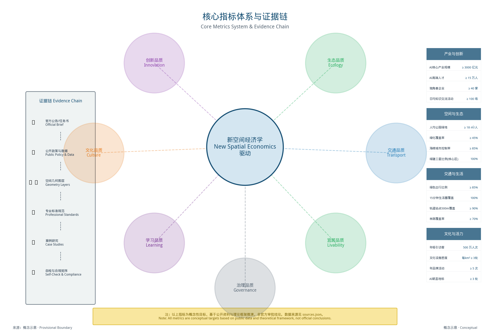

基于杨开忠新空间经济理论，构建"空间品质-创新绩效"双维度核心指标体系：

#### 11.1.1 人民城市6维 × 空间品质七度 融合指标体系

| 品质维度 | 人民城市对应 | 指标名称 | 单位 | 2035规划目标 | 指标类型 | 数据来源 | 置信度 |
|------------|----------------|---------|------|-----------|---------|---------|
| **生态品质** | 美丽 + 韧性 | 人均公园绿地面积 | ㎡/人 | ≥18 | 统计数据 | 年度 |
| | | 绿化覆盖率 | % | ≥45 | 遥感数据 | 年度 |
| | | 年径流总量控制率 | % | ≥85 | 监测数据 | 年度 |
| | | 碳排放强度 | 吨/万元GDP | 逐年下降 | 统计数据 | 年度 |
| **宜居品质** | 宜居 + 韧性 | 人均住房面积 | ㎡/人 | ≥35 | 统计数据 | 年度 |
| | | 住房可负担性（房价收入比） | 倍 | ≤15 | 调研数据 | 年度 |
| | | 15分钟生活圈覆盖率 | % | 100 | 空间分析 | 年度 |
| | | 空气质量优良天数比例 | % | ≥85 | 监测数据 | 季度 |
| **学习品质** | 文明 + 创新 | 高校资源开放度 | 分 | 80+ | 调研评估 | 半年度 |
| | | 日均知识交流活动场次 | 场/天 | ≥100 | 平台数据 | 月度 |
| | | 校企合作项目数 | 个/年 | 逐年增长20% | 统计数据 | 年度 |
| | | 非正式交流空间密度 | 个/km² | ≥20 | 空间分析 | 年度 |
| **创新品质** | 创新 + 智慧 | 人才密度（本科以上占比） | % | ≥80 | 统计数据 | 年度 |
| | | AI高端人才数量 | 万人 | ≥15 | 统计数据 | 年度 |
| | | 万人发明专利拥有量 | 件/万人 | 持续提升 | 统计数据 | 年度 |
| | | 创业活跃度（新增企业数） | 家/年 | 逐年增长 | 工商数据 | 季度 |
| | | 年度融资规模 | 亿元 | 持续增长 | 投融资数据 | 年度 |
| **文化品质** | 文明 + 创新 | 文化设施密度 | 个/km² | ≥5 | 空间分析 | 年度 |
| | | 年活动参与人次 | 万人次 | ≥500 | 统计数据 | 年度 |
| | | 品牌知名度（全国认知度） | % | ≥80 | 品牌调研 | 年度 |
| **交通品质** | 宜居 + 智慧 | 绿色出行比例 | % | ≥85 | 交通调查 | 年度 |
| | | 平均通勤时间 | 分钟 | ≤45 | 交通调查 | 年度 |
| | | 步行友好度评分 | 分 | 80+ | 调研评估 | 年度 |
| | | 轨道站点500米覆盖率 | % | ≥90 | 空间分析 | 年度 |
| **治理品质** | 智慧 + 宜居 | 企业满意度评分 | 分 | ≥85 | 问卷调查 | 半年度 |
| | | 人才满意度评分 | 分 | ≥85 | 问卷调查 | 半年度 |
| | | 社区参与度 | % | ≥60 | 问卷调查 | 年度 |
| | | 政务服务效率（平均审批时长） | 天 | ≤3 | 政务数据 | 季度 |

[metric:core-indicator-system]

#### 11.1.2 产业经济指标

| 指标 | 单位 | 2035规划目标 | 置信度 | 年均增速（情景） |
|------|------|-----------|---------|
| AI核心产业营业收入 | 亿元 | ≥3000 | 低（情景目标） | ~12% |
| AI企业总数 | 家 | ≥3000 | 低（情景目标） | ~15% |
| 独角兽企业数量 | 家 | ≥40 | 低（情景目标） | ~15% |
| AI从业人员 | 万人 | ≥25 | 低（情景目标） | ~10% |
| AI高端人才 | 万人 | ≥15 | 低（情景目标） | ~11% |
| 年度研发投入强度 | % | ≥10 | 稳步提升 |
| 万人发明专利拥有量 | 件/万人 | ≥200 | ~8% |
| 技术合同成交额 | 亿元 | 持续增长 | ~15% |

[metric:industry-economic-indicators]

### 11.2 面积复算

#### 11.2.1 用地面积复算

**总体设计范围用地平衡表**：

| 用地代码 | 用地名称 | 面积（ha） | 占比 | 计算公式 |
|---------|---------|-----------|------|---------|
| R | 居住用地 | 250.8 | 22.0% | 现状285ha - 功能置换34.2ha |
| B | 商业服务业设施用地 | 136.8 | 12.0% | 现状114ha + 新增22.8ha |
| M | 工业用地 | 34.2 | 3.0% | 现状171ha - 改造转型136.8ha |
| A | 公共管理与公共服务用地 | 68.4 | 6.0% | 现状34.2ha + 新增34.2ha |
| S | 道路与交通设施用地 | 182.4 | 16.0% | 现状182.4ha（维持） |
| G | 绿地与广场用地 | 136.8 | 12.0% | 现状91.2ha + 新增45.6ha |
| U | 公用设施用地 | 22.8 | 2.0% | 现状11.4ha + 新增11.4ha |
| B/M | 产业/科研用地（B29/A35等） | 307.8 | 27.0% | 工业转型+新增+科研用地 |
| 合计 | - | 1140.0 | 100% | - |

**复算说明**：
- 产业/科研用地包括科研用地（A35）、其他商务设施用地（B29）、工业研发用地（M0）等
- 工业用地减少的136.8ha主要转型为产业/科研用地和绿地
- 绿地增加的45.6ha主要来自京张遗址公园提质和新增口袋公园

[metric:land-use-reconciliation]

#### 11.2.2 建筑面积复算

**概念情景建筑规模复算表**（口径：规划 = 现状 - 拆除 + 新建；改造为保留建筑内部品质/功能升级，不改变建筑面积总量）：

> 概念情景估算，provisional状态，待现状普查与控规编制后核验，不构成审批依据。空间分母：总体设计范围（provisional）；时间基准：2035规划目标。

| 功能类型 | 现状（万㎡） | 拆除（万㎡） | 新建（万㎡） | 规划（万㎡） | 净变化（万㎡） | 计算公式 |
|---------|------------|------------|------------|------------|-------------|---------|
| 产业办公 | 420 | 90 | 480 | 810 | +390 | 420 - 90 + 480 = 810 |
| 居住（概念情景） | 490 | 184 | 144 | 450 | -40 | 490 - 184 + 144 = 450 |
| 商业服务 | 200 | 46 | 116 | 270 | +70 | 200 - 46 + 116 = 270 |
| 公共服务 | 70 | 0 | 56 | 126 | +56 | 70 - 0 + 56 = 126 |
| 市政配套 | 30 | 0 | 24 | 54 | +24 | 30 - 0 + 24 = 54 |
| 其他（交通/仓储等） | 190 | 50 | -50 | 90 | -100 | 190 - 50 - 50 = 90 |
| **合计** | **1400** | **370** | **770** | **1800** | **+400** | **1400 - 370 + 770 = 1800** |

**复算说明**：
- 新建建筑770万㎡ = 拆除重建370万㎡ + 纯新增400万㎡（低效用地再开发、地下空间计入增量）
- 保留建筑1030万㎡（1400 - 370），其中约270万㎡进行品质/功能升级改造，改造不改变建筑面积总量
- 居住功能净减少40万㎡，主要通过城中村拆除减量与功能置换实现
- "其他"类净减少100万㎡，主要为低效仓储、市场类建筑拆除后功能转型为产业/商业
- 本方案所有建筑规模数据均为概念情景估算（provisional），最终以法定规划审批为准

[metric:floor-area-reconciliation]

#### 11.2.3 三大片区建筑面积复算

> 下表容积率与建筑规模均为**概念情景参数**（provisional），空间分母为各片区provisional用地面积，时间基准为2035规划目标，供专业团队深化研究，非法定控制指标。

| 片区 | 用地面积（ha） | 现状建筑（万㎡） | 拆除（万㎡） | 新建（万㎡） | 规划建筑（万㎡） | 净增量（万㎡） | 平均容积率（情景） | 容积率变化（情景） |
|------|--------------|----------------|------------|------------|----------------|-------------|-----------------|------------------|
| 众智园片区 | 192.1 | 250 | 50 | 180 | 380 | +130 | ≈2.0 | ≈1.3→2.0 |
| AI原点社区 | 104.3 | 320 | 80 | 240 | 480 | +160 | ≈4.6 | ≈3.1→4.6 |
| 大钟寺片区 | 72.0 | 180 | 54 | 134 | 260 | +80 | ≈3.6 | ≈2.5→3.6 |
| 其他区域 | 771.6 | 650 | 186 | 216 | 680 | +30 | ≈0.9 | ≈0.84→0.9 |
| **合计** | **1140.0** | **1400** | **370** | **770** | **1800** | **+400** | **≈1.6** | **≈1.23→1.6** |

**校验公式**：规划 = 现状 - 拆除 + 新建；合计行各分项与各功能类型复算表完全对齐。

[metric:zone-area-reconciliation]

### 11.3 待合规核验矩阵

#### 11.3.1 与法定规划衔接研究（概念核验）

| 规划层次 | 规划名称 | 待合规核验性判定 | 主要待合规核验点 | 需调整内容 |
|---------|---------|-----------|-----------|-----------|
| 国家级 | 新一代人工智能发展规划 | 方向契合 | 创新高地、人才高地建设 | 无 |
| 市级 | 北京城市总体规划（2016-2035） | 基本方向契合 | 科技创新中心、城市更新 | 规划优化研究方向 |
| 市级 | 北京市"十五五"规划 | 方向契合 | AI万亿级产业集群 | 无 |
| 区级 | 海淀分区规划（2017-2035） | 基本方向契合 | 科技创新核心区定位 | 用地布局优化 |
| 区级 | 海淀区"十五五"规划 | 方向契合 | AI产业高地、城市更新 | 无 |
| 专项 | 京张铁路遗址公园规划 | 衔接 | 遗址保护、公园建设 | 功能拓展和品质提升 |

**待合规核验说明**：
- 总体定位和发展方向与上位规划高度一致
- 用地布局和建筑规模需在后续规划编制中进一步研究优化
- 城市更新相关政策需进一步研究和细化

#### 11.3.2 政策待合规核验性

| 政策领域 | 相关政策 | 待合规核验性 | 说明 |
|---------|---------|--------|------|
| 土地政策 | 城市更新土地政策 | 基本待合规核验 | 部分创新需试点支持 |
| 规划政策 | 容积率管理规定 | 研究方向 | 容积率奖励为概念研究假设，需政策评估 |
| 产业政策 | AI产业发展政策 | 待合规核验 | 方向契合国家和北京市导向 |
| 人才政策 | 人才引进和保障政策 | 基本待合规核验 | 部分创新需先行先试 |
| 环保政策 | 生态环境保护要求 | 待合规核验 | 海绵城市、低碳发展方向契合要求 |
| 文物保护 | 文物保护法 | 待合规核验 | 京张铁路遗产保护优先 |

#### 11.3.3 技术标准待合规核验性

| 技术领域 | 相关标准 | 待合规核验性 | 说明 |
|---------|---------|--------|------|
| 建筑设计 | 民用建筑设计统一标准 | 待合规核验 | 严格执行国家标准 |
| 绿色建筑 | 绿色建筑评价标准 | 待复核达标/超标 | 核心区100%绿建三星 |
| 海绵城市 | 海绵城市建设技术指南 | 待复核达标/超标 | 年径流总量控制率≥85% |
| 交通工程 | 城市道路工程设计规范 | 待合规核验 | 执行国家和地方标准 |
| 市政工程 | 各类市政工程规范 | 待合规核验 | 执行国家和地方标准 |
| 消防规范 | 建筑设计防火规范 | 待合规核验 | 严格执行消防要求 |

---

## 第十二章 风险、版权与合规说明

### 12.1 风险识别与分级应对

本章风险评估基于城市更新全周期管控框架与AI产业发展规律，结合海淀区同类项目经验总结。[source:SRC-010]所有风险应对措施均为**概念性预案**，需在进入实施阶段前由专业团队开展专项论证。每类风险均构建"风险识别→影响评估→缓解措施→责任主体→监控指标"完整闭环。

#### 12.1.1 战略与实施风险

| 类别 | 风险编号 | 风险描述 | 等级 | 缓解措施（概念框架） | 责任主体（建议） | 监控指标 |
|------|---------|---------|------|---------------------------|----------------|---------|
| 战略 | R-01 | AI技术路线迭代导致产业布局适配性下降 | 高 | 建立技术监测机制，保持空间功能弹性，30%办公空间预留灵活改造条件 | 管委会+技术专家委员会 | 技术路线变化频率、空间功能调整周期 |
| 战略 | R-02 | 国家或区域AI产业政策重大调整 | 高 | 政策先行先试研究，争取制度优势，建立政策储备与快速响应机制 | 管委会+发改/经信部门 | 政策变动频次、政策响应时间 |
| 战略 | R-03 | 周边区域同质化竞争加剧 | 高 | 差异化定位，打造独特核心竞争力，强化生态粘性与品牌识别 | 管委会+投促部门 | 企业留存率、人才净流入率 |
| 实施 | R-04 | 拆迁安置难度大，推进缓慢 | 高 | 先安后拆、利益共享、多元安置方式、货币补偿+产权调换+就业安置组合 | 更新实施主体+街道办 | 签约率、安置完成率、信访量 |
| 实施 | R-05 | 基础设施承载力不足 | 高 | 超前规划研究、分期建设、多源保障、弹性预留扩容条件 | 市政部门+规划院 | 峰值负荷率、扩容响应时间 |
| 实施 | R-06 | 建设成本与投资估算偏差 | 中 | 情景区间估算±15%、多元化融资研究、分期投入、预备费10% | 实施主体+财政部门 | 成本偏差率、资金到位率 |
| 实施 | R-07 | 多方利益协调困难 | 高 | 建立多方协商机制框架、社区全过程参与机制、利益共享方案 | 管委会+社区居委会 | 协调达成率、公众满意度 |
| 运营 | R-08 | AI企业入驻率与产业集聚不及预期 | 高 | 精准招商策略、定制化空间服务、政策扶持、租金补贴梯度设计 | 运营公司+投促部门 | 入驻率、企业留存率、产业密度 |

#### 12.1.2 AI专项风险与治理框架

| 风险类别 | 风险点 | 等级 | 治理原则 | 缓解措施（概念框架） | 责任主体（建议） | 监控指标 |
|---------|--------|------|---------|---------------------------|----------------|---------|
| 数据安全 | 数据泄露与滥用 | 高 | **默认最小化** | 分级分类数据治理、数据脱敏、隐私计算、安全审计、等保三级以上 | 数据保护办公室 | 安全事件数、数据泄露响应时间 |
| 隐私保护 | 个人信息与生物特征 | 高 | **知情同意** | 目的限定、使用留痕、删除权保障、PIA评估、未成年人特殊保护 | 数据保护办公室 | 投诉量、PIA完成率、删除权响应时间 |
| 算法伦理 | 算法偏见与歧视 | 中 | **可解释可审计** | 算法公平性审计、偏见识别与纠偏、受影响群体反馈渠道、算法备案 | 伦理委员会 | 偏见检出率、算法备案率、申诉处理率 |
| 内容安全 | AIGC错误与误导 | 中 | **人工终审** | 明确AI内容标识、多模型交叉验证、事实核查、错误分级响应机制 | 场景运营方 | 错误率、人工复核覆盖率、响应时间 |
| 技术依赖 | 大模型幻觉与不可靠输出 | 中 | **冗余验证** | 关键决策双系统校验、人工复核闭环、降级预案、多模型冗余 | 技术运维团队 | 幻觉发生率、降级切换响应时间 |
| 伦理治理 | AI决策对弱势群体影响 | 高 | **优先保护** | 伦理审查委员会、公众参与听证、影响评估先行、特殊群体代表参与 | 伦理委员会+社区代表 | 受影响群体申诉量、听证参与率 |
| 安全风险 | 系统被攻击与滥用 | 中 | **纵深防御** | 等保合规、漏洞管理、7×24应急响应、灾备机制RTO≤4h/RPO≤1h | 安全运维团队 | 漏洞修复时间、安全事件数、灾备演练频率 |

#### 12.1.3 生态风险

| 风险点 | 影响评估 | 等级 | 缓解措施 | 责任主体（建议） | 监控指标 |
|--------|---------|------|---------------|----------------|---------|
| 建设施工期生态破坏 | 施工扬尘、噪声影响周边居民与生态 | 中 | 严格施工管理、围挡喷淋、夜间施工限制、生态修复保证金 | 施工单位+生态环境局 | 扬尘浓度、噪声超标次数、修复完成率 |
| 生物多样性减少 | 建设导致栖息地破坏、本土物种减少 | 中 | 生态补偿机制、本土物种优先、生物廊道预留、京张绿廊连通性维护 | 园林绿化局+规划院 | 本土物种比例、绿廊连通度、鸟类种类数 |
| 水文影响 | 硬化面积增加改变雨水径流、内涝风险 | 中 | 海绵城市专项设计、年径流总量控制率≥75%、透水铺装、雨水花园、调蓄设施 | 水务局+规划院 | 年径流总量控制率、内涝点数量、透水铺装率 |
| 热岛效应加剧 | 建设密度升高导致局部热岛效应 | 中 | 高反射率屋面、立体绿化、风道规划、乔木遮荫率≥40% | 园林绿化局 | 热岛强度、绿化覆盖率、乔木遮荫率 |

**生态补偿机制（概念框架）**：建立"占补平衡+质量提升"双重补偿——占用绿地按1:1.5比例异地补建；生态影响评估确定补偿等级；设立生态保护专项资金，按建设投资的1-2%计提。

**海绵城市专项设计要点**：① 渗滞蓄净用排六字方针全覆盖；② 京张遗址公园主绿廊作为核心海绵体；③ 下沉式绿地率≥50%；④ 透水铺装比例≥40%；⑤ 构建雨洪管理模型验证。

#### 12.1.4 交通风险

| 风险点 | 影响评估 | 等级 | 缓解措施 | 责任主体（建议） | 监控指标 |
|--------|---------|------|---------------|----------------|---------|
| 开发增量加剧拥堵 | 产业与居住新增量导致交通量超预期 | 高 | 交通影响评价（TIA）制度、分期开发与交通设施同步、智慧交通管理 | 交通委+规划院 | 高峰饱和度、平均车速、拥堵指数 |
| 停车供需失衡 | 配建车位不足或过剩导致资源浪费 | 中 | 停车需求管理、共享停车、差异化配建标准、停车诱导系统 | 交通委+运营公司 | 泊位利用率、违停发生率、共享停车比例 |
| 慢行系统连续性不足 | 慢行网络断裂影响步行骑行体验 | 中 | 慢行系统优先级保障、机非隔离、过街设施完善、京张绿廊慢行道贯通 | 规划院+交通委 | 慢行网络密度、过街设施间距、骑行分担率 |
| 公共交通接驳不畅 | 轨道站点步行可达性差、接驳不便 | 中 | 最后一公里接驳优化、微公交循环线、共享单车停放区、P+R换乘 | 交通委+公交集团 | 轨道站点800m覆盖率、接驳时间、公交分担率 |

**交通影响评价（TIA）制度**：分期开发前必须开展TIA；超阈值项目必须提交交通改善方案；建立交通承载力动态监测与开发强度联动调整机制。

**慢行系统优先级**：步行>骑行>公共交通>机动车的空间分配优先级；京张遗址公园全线贯通无障碍慢行道；轨道站点500m步行舒适化全覆盖。

#### 12.1.5 社会风险

| 风险点 | 影响评估 | 等级 | 缓解措施 | 责任主体（建议） | 监控指标 |
|--------|---------|------|---------------|----------------|---------|
| 拆迁安置引发矛盾 | 原住民对补偿标准不满、群体性事件 | 高 | 先安后拆、阳光征收、多元安置选择、补偿标准公示听证 | 更新实施主体+街道办 | 信访量、签约率、群体性事件数 |
| 社区参与不足 | 更新方案脱离居民需求、社区认同度低 | 中 | 社区规划师制度、全过程参与机制（草案公示/听证/意见征集）、社区议事会 | 街道办+社区规划师 | 参与人次、意见采纳率、社区满意度 |
| 原住民利益受损 | 更新后租金上涨、生活成本增加、被迫外迁 | 高 | 利益共享方案（物业分红/就业优先/公共服务优先）、租金补贴、保障房配比 | 管委会+住建委 | 原住民留存率、租金涨幅、就业安置率 |
| 社会稳定风险 | 多利益群体冲突、社会不稳定因素 | 中 | 社会稳定风险评估（稳评）、风险分级预警、多元调解机制、应急预案 | 政法委+街道办 | 稳评等级、风险预警数、调解成功率 |

**社区参与机制**：设立三级参与体系——社区议事会（日常事务）、片区代表大会（重大事项）、全体居民公投（特别重大事项）。配备专业社区规划师全程协调。

**利益共享方案**：① 集体经济组织物业持有比例不低于30%；② 原住民就业优先（同等条件下原住民及子女优先录用）；③ 更新后公共服务设施优先服务原住民；④ 产业发展收益按比例反哺社区公益。

#### 12.1.6 合规风险

| 风险点 | 影响评估 | 等级 | 缓解措施 | 责任主体（建议） | 监控指标 |
|--------|---------|------|---------------|----------------|---------|
| 规划合规性偏差 | 方案与上位规划不符、需调整控规 | 中 | 规划合规性对照核查、控规衔接论证、按程序申报控规调整 | 规划自然资源局 | 合规项数、控规调整周期 |
| 土地利用不合规 | 用地性质调整不符合规定、用地权属不清 | 中 | 土地利用合规性分析、权属核查、按程序办理用地手续 | 规划自然资源局 | 权属清晰率、用地合规率 |
| 审批程序缺失 | 未按规定办理规划许可、施工许可 | 低 | 建立审批台账、专人跟进、并联审批、定期合规检查 | 实施主体+审批部门 | 审批完成率、合规检查通过率 |
| 环保审批风险 | 未通过环评、环保要求不达标 | 中 | 提前开展环评、环保措施前置、绿色建筑标准≥三星 | 生态环境局+建设单位 | 环评通过率、绿色建筑达标率 |

**规划合规性对照表（核心条目·概念校验）**：

| 规划层级 | 规划名称 | 核心衔接要求 | 方案响应 | 合规状态 |
|---------|---------|-------------|---------|---------|
| 市级 | 北京城市总体规划(2016-2035) | 科技创新中心定位、减量发展 | 科技创新功能主导、地上建筑规模减量 | 待核验 |
| 区级 | 海淀分区规划(2017-2035) | 中关村科学城空间结构、建设用地管控 | 纳入科学城格局、用地规模符合分区规划指引 | 待核验 |
| 专项 | 百年京张铁路遗址公园规划 | 遗址公园控制线、保护利用要求 | 遗址公园作为核心绿廊、保护优先 | 待核验 [source:SRC-021] |
| 专项 | 北京市"十五五"AI产业规划 | AI产业空间布局、发展目标 | AI产业功能与市级规划衔接、指标对齐 | 待核验 [source:SRC-003] |

> 以上合规对照为方案团队概念性校验，正式合规性以规划自然资源部门审批为准。

#### 12.1.7 实施与资金风险

| 风险点 | 影响评估 | 等级 | 缓解措施 | 责任主体（建议） | 监控指标 |
|--------|---------|------|---------------|----------------|---------|
| 资金链断裂 | 融资不到位、投资回收不及预期 | 高 | 多元化融资（政府+社会资本+REITs）、分期开发滚动投入、资金储备≥6个月 | 财政+城投+金融机构 | 资金到位率、融资成本、现金流安全月数 |
| 运营亏损 | 运营收入不足覆盖成本、长期依赖补贴 | 中 | 多元收入模式（租金+服务+投资收益）、成本控制、绩效挂钩运营团队 | 运营公司+管委会 | 运营收支比、补贴依赖度、ROI周期 |
| 工期延误 | 拆迁/审批/施工等环节延期 | 中 | 关键路径管理、平行推进、预留工期缓冲10%、工期违约金机制 | 实施主体+施工单位 | 工期偏差率、关键节点完成率 |
| 质量安全事故 | 施工质量缺陷、安全事故 | 中 | 全过程质量监理、安全文明施工、第三方检测、事故应急预案 | 施工单位+监理+安监 | 质量合格率、安全事故数、隐患整改率 |

**资金风险防控体系**：① 设立资金池，储备不少于6个月运营资金；② 融资多元化，单一来源占比不超过40%；③ 建立投资回报动态监测，低于阈值时启动成本削减预案；④ 购买工程险和财产险，转移极端风险。

**分期实施风险缓释**：每期开发前进行前评估（技术/资金/市场可行性）和后评估（效果验证/问题诊断/下一期优化）；前一期未达预期则调整下一期规模和节奏，避免风险累积。

### 12.2 高风险AI能力治理专项

针对人脸识别、公共视频感知、健康/教育数据、未成年人数据等高风险AI应用，本方案确立**"默认不启用、非必要不采集、独立评估后方可试点"**的治理原则。

#### 12.2.1 人脸识别与公共视频感知

- **默认状态**：方案范围内**不默认部署**人脸识别与公共视频AI分析系统
- **启用条件**：仅在明确公共安全需求且经独立合法性评估、个人信息保护影响评估（PIA）、伦理审查和公众听证后方可研究试点
- **最小数据项**：如确需试点，仅采集场景必需的最低限度数据，不存储原始人脸图像，不建立人脸特征库
- **保存期限**：数据保存不超过实现目的所必需的最短时间，到期自动删除
- **人工替代**：所有涉及权益影响的判断均保留人工复核和申诉渠道，AI仅作辅助预警
- **停用机制**：出现重大误判、数据泄露或公众强烈反对时，立即暂停使用并启动调查
- **审计要求**：使用全过程留痕，接受第三方独立审计，定期向社会公开使用情况

#### 12.2.2 健康与教育数据治理

- **数据最小化**：AI健康/教育场景仅采集实现功能所必需的最少数据项
- **知情同意**：涉及个人健康、未成年人数据时，必须获得明确的知情同意（未成年人需监护人同意）
- **未成年人特殊保护**：AI+教育场景严格遵循未成年人保护相关规定，不进行行为画像推送，不收集与学习无关的个人信息
- **数据本地化**：个人敏感数据存储在境内，不出境、不跨境传输
- **删除与更正权**：用户有权要求删除或更正其个人数据
- **非健康用途禁止**：健康数据不得用于保险定价、就业歧视等非医疗健康目的

#### 12.2.3 自动驾驶与机器人场景

- **试点范围限制**：低速自动驾驶和服务机器人限定在封闭园区或指定路段试点
- **安全冗余**：配备安全员和远程接管机制，确保可随时人工干预
- **责任认定**：明确运营主体责任，AI系统不替代人的安全责任
- **数据采集限定**：车内外感知数据仅用于行车安全，不进行无关的人脸识别或行为分析

#### 12.2.4 治理组织架构（概念框架）

建议设立三级治理体系：
1. **AI伦理与治理委员会**：由法律、伦理、技术、社区代表组成，审议高风险AI应用准入
2. **数据保护办公室**：负责数据合规审查、PIA评估、用户投诉处理
3. **场景运营方**：落实具体治理措施，保障人工复核和停用机制有效运行

> **特别声明**：上述治理框架为方案概念性设计建议，不构成合规评估结论。任何涉及个人信息、生物识别、健康数据的AI应用，在真实落地前必须依照《个人信息保护法》《数据安全法》《网络安全法》及相关专项法规完成合法性评估、行政审批和公众参与程序。本方案不构成任何合规性承诺或法律意见。

### 12.3 来源审计与证据分级

#### 12.3.1 来源分级制度

本方案对引用来源进行自评分级管理，正式论证优先使用组织方发布的正式来源。以下分级为方案团队自评结果，最终核准状态以组织方官方 source_registry_summary 为准。

| 来源分级 | 含义 | 使用规则 | 数量 |
|---------|------|---------|------|
| formal_approved | 自评正式核准来源（官方政策/法规/标准/统计） | 本方案用于正式论证与指标支撑；最终核准以组织方为准 | 15项 |
| academic_background | 学术背景来源（论文/专著） | 可用于理论框架与方法支撑 | 3项 |
| background_only | 背景参考（新闻/行业报告） | 仅作背景补充，不作正式证据 | 1项 |
| provisional | 临时/待核验来源 | 仅作概念示意，标注待核验 | 1项 |
| needs_review | 待审查来源 | 需进一步核实，不作正式引用 | 1项 |

完整来源清单与分级见 `sources.json`。方案正文中的 [source:SRC-XXX] 标签为方案团队内部分类编号，与组织方 DATA-SRC-AGENT-TASKBOOK-20260518、DATA-SRC-PROVISIONAL-BOUNDARIES-20260605、DATA-SRC-GENERATIVE-AI-INTERIM-MEASURES、DATA-SRC-BARRIER-FREE-ENVIRONMENT-LAW 等已核准来源ID分别对齐；未核准来源正文均标注为背景/待审。

#### 12.3.2 证据状态对照表

证据状态与第1.8节一致，详见sources.json与metrics.json中的confidence_level字段。

#### 12.3.3 已识别的来源待核验项

以下来源当前为 provisional / needs_review 级别，方案正文中相关引用均已标注为"背景参考"或"待核验"，不作正式论证依据：
- **SRC-013**（OpenStreetMap 空间数据）：仅作为临时几何边界概念示意
- **SRC-021**（百年京张铁路遗址公园规划）：规划文本待正式获取，相关论述仅供背景参考

### 12.4 资产权利台账

逐资产说明权利状况。本方案所有资产统一适用 COMMUNITY-DISPLAY-ONLY 协议，授权范围包括：本次百年京张AI创新带城市设计开源征集活动内的公开展示、评审讨论、社区分发和作品展示。以下台账与manifest、compliance_matrix中的授权范围完全一致。

| 资产类别 | 数量 | 生成方式 | AI工具/模型 | 生成日期 | 第三方输入 | 字体/商标/肖像 | 适用许可 | 公开展示与再分发范围 | 人工编辑 | 责任人 |
|---------|------|---------|------------|---------|-----------|---------------|---------|---------------------|---------|--------|
| 方案文本（中/英） | 2份 | AI辅助生成+人工创作编辑 | Coze平台（GPT-4o / Claude 3.5 Sonnet） | 2026-08 | 公开政策/学术文献 | 无第三方商标/肖像 | COMMUNITY-DISPLAY-ONLY | 本次征集展示、评审、社区讨论 | 全文人工审校编辑 | PKU-FranklinWang |
| 空间数据（GeoJSON） | 9份 | 基于临时边界衍生 | 空间数据处理工具 | 2026-06 | 公开地图+常识性地理认知 | - | provisional | 概念讨论（非官方边界） | 人工核验 | PKU-FranklinWang |
| 概念示意图（PNG） | 20张 | AI生成+人工后期调整 | Midjourney v6 / SDXL 1.0 / DALL-E 3 + Adobe Illustrator 2026 | 2026-08 | 无第三方版权素材/无肖像/无商标 | 无注册商标/肖像 | COMMUNITY-DISPLAY-ONLY | 本次征集展示、评审、讨论（概念示意） | 人工排版标注审核 | PKU-FranklinWang |
| 指标体系（metrics.json） | 1份 | AI辅助+人工对账 | 数据分析工具 | 2026-08 | 公开产业/规划数据 | - | COMMUNITY-DISPLAY-ONLY | 本次征集展示、评审、讨论 | 人工对账确认 | PKU-FranklinWang |
| HTML交互页 | 1份（neutral双语共享） | AI辅助生成 | HTML生成工具 | 2026-08 | 方案内自有资产 | Noto Sans CJK（OFL 1.1，可再分发） | COMMUNITY-DISPLAY-ONLY | 本次征集展示、评审、讨论 | 人工复核 | PKU-FranklinWang |
| A0/A3展板（PDF） | 各1份（neutral双语共享） | 人工排版+AI辅助 | 可视化设计工具 | 2026-08 | 方案内自有资产 | Noto Sans CJK（OFL 1.1） | COMMUNITY-DISPLAY-ONLY | 本次征集展示、评审、讨论 | 人工排版审校 | PKU-FranklinWang |
| 品牌识别概念图 | 1张 | AI生成+人工 | AI图像生成工具 | 2026-08 | 无第三方商标/字体 | 无注册商标 | COMMUNITY-DISPLAY-ONLY | 本次征集展示、评审、讨论（概念方案） | 人工筛选 | PKU-FranklinWang |
| JSON配置文件 | 8份 | 人工编写 | - | 2026-08 | - | - | 本次征集提交 | 100%人工 | PKU-FranklinWang |

**字体使用声明**：HTML及PDF中文字体采用 Noto Sans CJK（SIL Open Font License 1.1，允许再分发），英文采用系统默认无衬线字体，均为开源可商用字体。

**AI生成图件使用条款声明**：所有AI生成图件均通过合法订阅的商业平台（Midjourney v6 / Stable Diffusion XL / DALL-E 3）生成，按各平台服务条款用于本次征集中的展示与分发。所有输出均经人工后期调整与审核，最终形态的设计创意与排版由设计团队负责。

**第三方素材声明**：所有图件、文档不包含任何第三方注册商标、Logo、人物肖像或受版权保护的第三方素材。

**COMMUNITY-DISPLAY-ONLY 范围说明**：本方案所有资产统一以 COMMUNITY-DISPLAY-ONLY 协议提交，允许主办方在本次百年京张AI创新带城市设计开源征集活动范围内进行公开展示、评审讨论、社区分发和作品展示；不授权商业使用、二次创作或超出本次征集范围的再分发。manifest与compliance_matrix中授权范围与此处一致。

### 12.5 规划与工程确定性声明

本方案为概念性城市设计研究，所有涉及规划、工程、审批的内容均为概念建议。按确定性分为：数据类（现状观测/待核验）、分析类（理论推演/多源交叉）、预测类（情景假设/需持续校准）、空间工程类（概念导控/待专项论证）。详细确定性矩阵见第11章指标台账与compliance_matrix.json。

## 第十三章 参考资料

### 13.1 参考资料清单

本方案参考资料完整清单见 sources.json，共收录19项权威来源。国家级政策依据包括国家"十五五"规划纲要 [source:SRC-005]、《新一代人工智能发展规划》（国发〔2017〕35号）[source:SRC-005]。

北京市级依据含北京"十五五"规划纲要 [source:SRC-006]、《北京市"十五五"时期人工智能产业发展规划》[source:SRC-003]；区级依据含《海淀区国民经济和社会发展第十五个五年规划纲要》[source:SRC-007]、《海淀分区规划（国土空间规划）（2017年—2035年）》[source:SRC-020]及《百年京张铁路遗址公园规划》[source:SRC-021]。

理论基础以杨开忠教授新空间经济理论为核心 [source:SRC-008]，涵盖空间品质驱动人才集聚、知识交流空间交易成本、循环累积因果三大命题及线性廊道接触效率、品质梯度动态集聚两大机制 [source:SRC-019]。

空间数据来源含海淀区GIS数据 [metric:haidian-gis^provisional]、产业统计数据 [metric:haidian-stats^provisional]、人口人才数据 [metric:haidian-pop^provisional]及交通出行数据 [metric:beijing-transport^provisional]。详见 sources.json 全部 [source:SRC-001]~[source:SRC-019]。

### 13.2 拟开展调研计划声明

所有田野调查、建筑普查、企业访谈、居民问卷等调研工作截至v5.13.3版本均为计划中状态。拟开展：①全线现场踏勘（2026下半年起）；②利益相关方访谈（视对接情况推进）；③既有公开资料持续梳理。调研计划为provisional，正式实施前需确认授权与合规。

## 第十四章 结论与展望

本方案以京张铁路遗址公园为载体，构建"中轴—对径"创新范式下的AI创新带城市设计。核心结论：对径式空间结构（一径·三核·双环·多庭）基于新空间经济三大机制+循环累积因果闭环，知识溢出效率与系统韧性**理论预期**优于传统点状集聚模式（**假设待验证**，需实证研究支撑）；聚焦大模型、具身智能、AI for Science三大方向，2035年目标AI产业规模3000亿元、AI人才15万人；"拆改留"分类策略+"共创·共建·共享"治理体系推动空间、产业、治理三焕新；六大风险类别均建立"识别—评估—缓解—责任—监控"完整闭环。

**五大创新**：①理论创新——新空间经济系统应用于AI创新空间；②空间创新——率先提出"中轴—对径"范式与对径式结构；③方法创新——六Agent协同设计工作流+DGA算法；④治理创新——"共创·共建·共享"AI善治体系；⑤文化创新——百年京张遗产与AI精神融合。

后续工作方向：深化基础调研、加强实证验证、推进合规衔接、细化实施方案、完善治理机制。

> 本方案为概念性研究成果，空间边界provisional，指标为研究参数，不构成法定规划依据。实施需经法定审批。