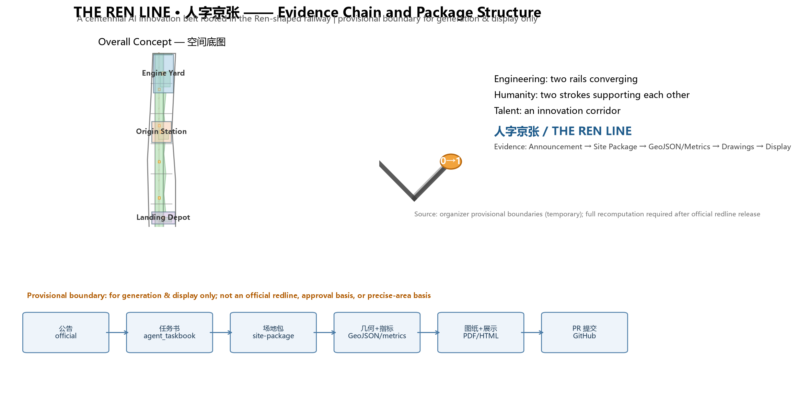
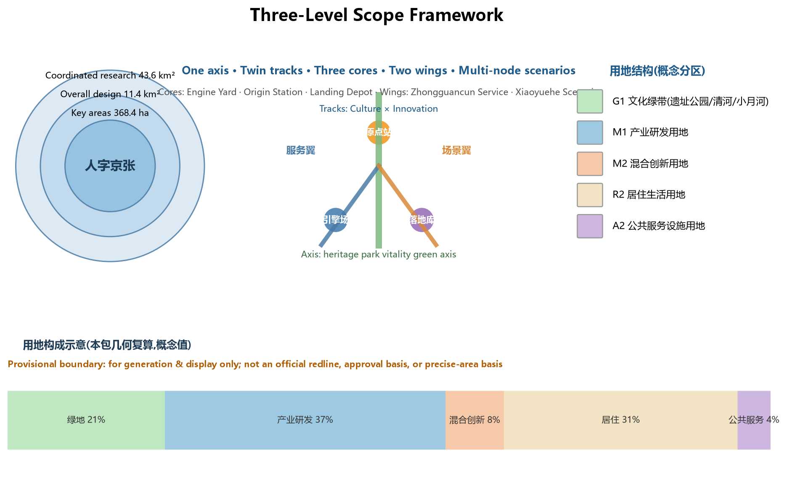
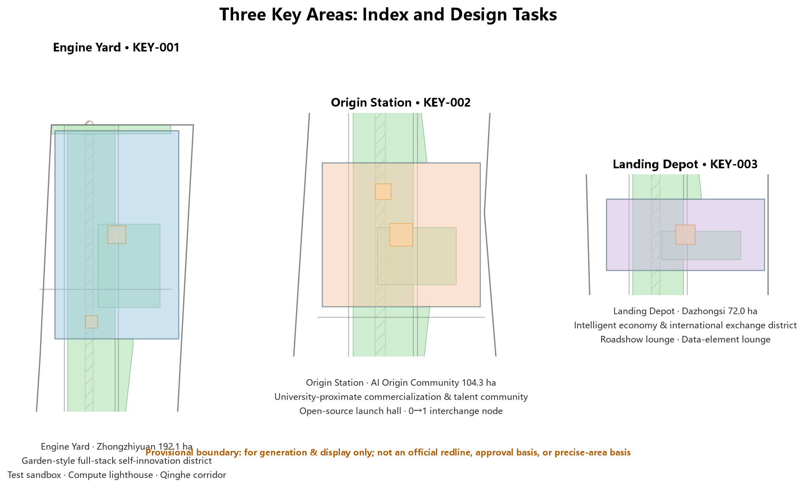
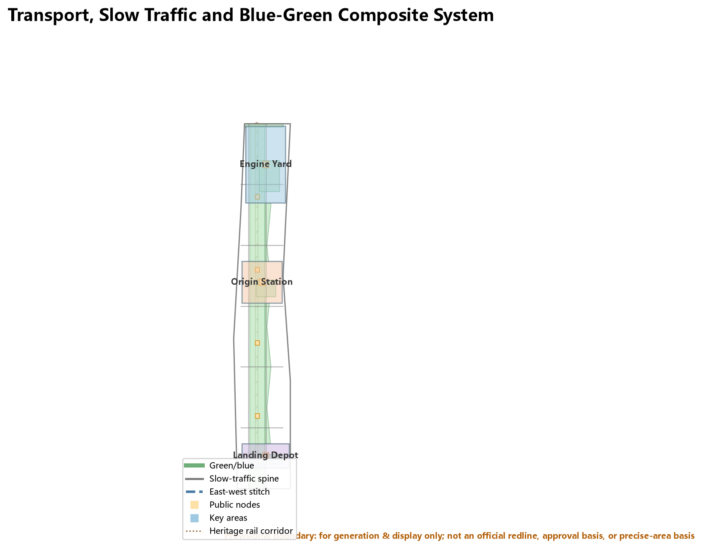
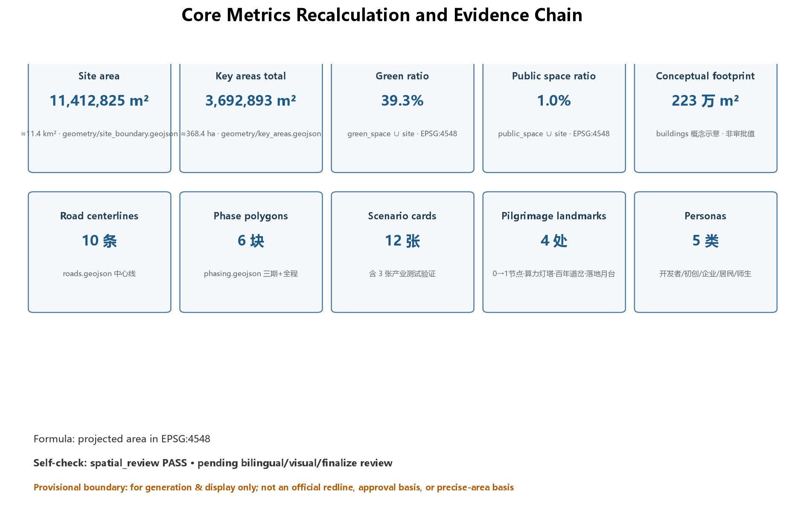

# The Ren Line: A Centennial AI Innovation Belt Rooted in the Ren-Shaped Railway

## Design Basis and Source List

This proposal takes the *Pre-qualification Announcement for the International Urban Design Open Call of the Centennial Jing-Zhang AI Innovation Belt* published by the Haidian Sub-bureau of the Beijing Municipal Commission of Planning and Natural Resources as its primary basis, the Agent Open-Call Taskbook as its task boundary, and the organizer-provided provisional boundaries as its spatial working base map [source:OFFICIAL-ANNOUNCEMENT] [source:AGENT-TASKBOOK]. As of submission, the organizer has not released an official precise redline; all geometry in this package is marked `provisional_constraint` and is used only for proposal generation, visualization, and design discussion. It does not constitute an official redline, approval basis, or precise-area conclusion. All layers and metrics must be recalculated once official polygons are published [source:PROVISIONAL-BOUNDARIES].

Source-registry boundaries are as follows [source:SOURCE-REGISTRY]:

- Seven records (official announcement, taskbook, professional-standard snapshots) are formal-ready;
- The Agent Open-Call Taskbook is a cleared user document supporting agent task responses;
- Provisional boundary data is provisional-only material for generation and display, not for statutory conclusions.

This proposal is an open co-creation recommendation generated by AI. All spatial suggestions are expressed as "conceptual suggestions," "reference schemes," or "materials for professional teams to deepen," and do not replace formal planning or constitute government-approved conclusions [source:AGENT-TASKBOOK].

## Three-Level Scope Framework

The proposal is organized by the three scopes defined in the announcement [data:geometry/site_boundary.geojson#SITE-001] [metric:site_area_km2]:

| Level | Area | Objective | Depth |
| --- | --- | --- | --- |
| Coordinated research area | approx. 43.6 km² | AI ecosystem, three-core-two-wing synergy, future AI city form | Industry & future-city research |
| Overall design area | approx. 11.4 km² | Renewal framework, Ren-line twin-track structure, transport & municipal support | Regulatory-plan-level urban design |
| Key detailed design area | approx. 368.4 ha | Detailed design of three key areas | Implementation-plan depth |

The three levels translate industry strategy into overall urban design and then into district-level detail [depth:three_level_scope_framework]. The coordinated level answers where the belt sits in the global AI map; the overall level answers how the twin tracks land in urban space; the key-area level answers how the three anchors become livable districts. Once official boundaries are released, only the source geometry of `SITE_BOUNDARY`/`KEY_AREA` needs replacement and all derived layers and metrics must be recomputed; the spatial-structure judgment itself is unaffected.

## Coordinated Research Area: Industry and Future City Research

### Overall Concept: The Ren Line

**Primary name: Ren Line (人字京张)**. The name derives from the most legendary engineering invention of the Jing-Zhang Railway—the "Ren"-shaped (人) switchback alignment designed by Zhan Tianyou at Badaling: in 1909, China's first trunk line designed and built by Chinese engineers used a single Ren shape to carry trains over the mountain barrier [source:OFFICIAL-ANNOUNCEMENT]. A century later, this corridor faces a new question: how does AI enter the human city? This proposal gives a structurally identical answer: **use a Ren shape to let AI and the city cross each other**.

The Ren Line carries three layers of meaning [source:AGENT-TASKBOOK] [standard:PROJECT-AGENT-OPEN-CALL-TASKBOOK]:

1. **Engineering form**: Ren = two rails converging at one switch—the Culture Track × Innovation Track structure, converging at the Beijing AI Origin Community (the interchange station);
2. **Human-centered meaning**: the two strokes of 人 support each other—AI innovation and urban life are mutually supportive, echoing co-creation charter.10 "human-centered governance";
3. **Talent aggregation**: Zhongguancun, Wudaokou, and Xueyuan Road form one of the densest talent corridors in the country—Ren means "where talents gather."

### Naming System and Logo Direction

A "one primary name, three tracks, five stations" naming system is established [depth:overall_spatial_structure]:

- **Primary name**: Ren Line / 人字京张;
- **Three tracks** (echoing the three positionings): Culture Track (Centennial Jing-Zhang Culture Belt), Innovation Track (AI Integration Innovation Belt), Life Track (Urban AI Life Experience Belt);
- **Five stations** (echoing three cores and two wings): Origin Station (AI Origin Community), Engine Yard (Zhongzhiyuan AI Self-Innovation Acceleration Area), Landing Depot (Dazhongsi AI Industry Cluster), Service Wing (Zhongguancun Technology Service Wing), Scenario Wing (Xiaoyuehe Scenario Empowerment Wing).

**Logo direction**: two parallel rails forming the character 人, converging at a luminous node where the digits "0" and "1" interlock—simultaneously a railway switch and a neural synapse, symbolizing the transfer between historical rails and digital tracks at the human scale. Color system: rail gray (history) + Jing-Zhang green (ecology) + AI light orange (compute and vitality). The logo extends into the basic module of the wayfinding system (see Chapter 9, component library). This direction is a concept proposal only; the final logo requires professional design deepening and trademark clearance [source:AGENT-TASKBOOK].

### Three Positionings, Five Functions, and the Three-Core-Two-Wing Loop

The three positionings map to the three tracks; the five functions anchor to the five stations [source:AGENT-TASKBOOK]:

| Station | Function anchor | Spatial role |
| --- | --- | --- |
| Origin Station | New paradigm of AI+ scenario empowerment | Open source & talent interchange |
| Engine Yard | AI full-stack self-innovation system | Models, compute, standards |
| Landing Depot | Intelligent-native new business forms | Industry landing & consumption |
| Service Wing | World-class AI innovation ecosystem | Capital, IP, global allocation |
| Scenario Wing | Intelligent AI vibrant city + AI governance discourse | Open scenarios & governance observation |

Synergy loop: Engine Yard (R&D) → Origin Station (incubation & open source) → Landing Depot (industry & consumption) → Service Wing (capital & global connection) forms the main loop; the Scenario Wing translates the main loop's output into everyday life scenarios and feeds governance feedback back to the Engine Yard, closing the loop [source:AGENT-TASKBOOK].

### Global AI Innovation Ecosystem Cases (6) and Transfer Mechanisms

All cases are drawn from public sources and serve as strategic analogies only, not corporate commitments [source:AGENT-TASKBOOK] [source:SITE-PACKAGE]:

| Case | Key mechanism | Transfer suggestion for Haidian |
| --- | --- | --- |
| Silicon Valley, US | Research universities + venture capital + open-source culture | Strengthen campus-district slow-traffic stitching and commercialization streets |
| Kendall Square, Boston | From parking lots to world's densest innovation district | Engine Yard as a comparable campus-district renewal model |
| King's Cross, London | Railway heritage redevelopment + knowledge industries | Station-city integrated renewal along the heritage park |
| one-north, Singapore | Government-led work-live-play-learn compound | Life Track and Scenario Wing may reference its mixed-block intensity |
| Tel Aviv, Israel | Startup ecosystem + night economy + global events | Landing Depot international roadshow lounge may follow its event operations |
| Nanshan Science Park, Shenzhen | Anchor enterprises + open scenario testing | Engine Yard may adopt "anchor enterprise + open test field" model |

Transfer insight: successful AI belts share three common traits—**proximity to universities, open scenarios, and event attraction**. This proposal locates these as the Origin Station's open-source launch hall, the Engine Yard's test sandbox, and the Landing Depot's international roadshow lounge (see scenario cards in Chapter 6), with an eight-factor mechanism (land, space, industry, capital, talent, compute, data, scenarios) registered in `compliance_matrix.json` and `sources.json` [depth:industry_space_mapping].

## Overall Design Area: Urban Renewal and Regulatory-Plan-Level Urban Design

### The Ren-Line Twin-Track Spatial Structure

The overall design area forms a structure of "**one axis, twin tracks, three cores, two wings, multi-node scenarios**" [depth:overall_spatial_structure] [data:geometry/land_use.geojson#LU-001]:

- **One axis**: the Jing-Zhang Heritage Park vitality green axis (north-south cultural public-space spine; the Culture Track) [data:geometry/green_space.geojson#GREEN-001];
- **Twin tracks**: the Innovation Track (west, toward Xueyuan Road–technology corridor, AI R&D and services) and the Culture-Life composite track (heritage park and east-wing communities), converging at Origin Station [data:geometry/roads.geojson#ROAD-001];
- **Three cores**: Engine Yard (north), Origin Station (middle), Landing Depot (south)—the three key areas [data:geometry/key_areas.geojson#KEY-001];
- **Two wings**: Zhongguancun Technology Service Wing (west), Xiaoyuehe Scenario Empowerment Wing (east);
- **Multi-node scenarios**: 12 AI scenario nodes and 4 pilgrimage landmarks along the axis and wings (Chapters 6 and 9).

### Urban Renewal Framework

Renewal logic: "**preserve the rails, upgrade the streets, cultivate the cores**" [depth:retain_renovate_demolish]:

- **Preserve the rails**: keep the Jing-Zhang railway heritage corridor and its historical structures intact as the Culture Track and public-space backbone; no large-scale demolition;
- **Upgrade the streets**: progressive micro-renewal of street fronts, ground-floor functions, and public space in the older commercial/industrial streets of Wudaokou, Qinghua East Road, and Dazhongsi;
- **Cultivate the cores**: implant AI industry carriers, test spaces, and public living rooms in the three key areas as innovation anchors.

Regulatory indicators (FAR, building height, density, statutory green ratio, setbacks) lack official regulatory-plan conditions and are uniformly recorded as `status=unknown` pending official data; this package provides only conceptual volumes recomputable from its geometry (see `metrics.json`) [source:PLANNING-LIMITS].

### Transport, Rail, and Municipal Strategy

- **Slow-traffic twin corridors**: one north-south slow-traffic main corridor on each side of the heritage park, linking the three cores and along-line nodes [data:geometry/roads.geojson#ROAD-001] [data:geometry/public_space.geojson#PUBLIC-001];
- **East-west stitching**: five east-west connector roads crossing the heritage corridor, stitching the two wings, with priority on Wudaokou, Qinghua East Road West, and Dazhongsi station areas [data:geometry/roads.geojson#ROAD-003];
- **Station-city integration**: conceptual station-city nodes around Dazhongsi and Qinghua East Road West stations based on existing lines (Line 13, Line 15) and planned lines; alignments follow official plans, and this proposal makes no engineering conclusions [standard:MOHURD-CONTROL-DETAILED-PLANNING];
- **New infrastructure**: edge-compute stations, distributed energy, and municipal facilities combined as prototypes to be deepened (see Chapter 8) [depth:municipal_new_infrastructure].

## Detailed Design of Key Areas

### Engine Yard: Zhongzhiyuan AI Self-Innovation Acceleration Area (approx. 192.1 ha)

- **Positioning**: a garden-style full-stack self-innovation district—"the engine yard of compute and standards" [data:geometry/key_areas.geojson#KEY-001];
- **Spatial structure**: bounded by the Qinghe waterfront in the north, organizing "R&D clusters—test sandbox—standards-governance exhibition—low-carbon interaction green corridor";
- **Building renewal**: retain existing industry carriers, renovate low-efficiency buildings, reserve new AI laboratories; retain-renovate-demolish classification is conceptual pending current-property and building-quality review [depth:three_key_area_detailed_design];
- **AI scenarios**: model safety test sandbox (industry test scenario), compute lighthouse (pilgrimage landmark), Qinghe low-carbon innovation corridor;
- **Implementation risks**: Qinghe blue line and flood-control conditions, external transport organization, and enterprise property coordination require official confirmation.

### Origin Station: Beijing AI Origin Community (approx. 104.3 ha)

- **Positioning**: a university-proximate commercialization and talent community—"the Ren interchange" [data:geometry/key_areas.geojson#KEY-002];
- **Spatial structure**: centered on the Ren Interchange Plaza, stitching campus, district, and neighborhood, forming an open-source launch hall, commercialization street, and talent-service belt;
- **Building renewal**: micro-renewal around Wudaokou and Qinghuayuan neighborhoods, stitching university slow-traffic links, supplementing result-launch, talent housing, and open-source collaboration space;
- **AI scenarios**: open-source launch hall, university-proximate commercialization street, 0→1 interchange node (pilgrimage landmark);
- **Implementation risks**: campus boundaries, property rights, and ground-floor function coordination require confirmation; Qinghuayuan station heritage protection must be addressed first.

### Landing Depot: Dazhongsi AI Industry Cluster (approx. 72.0 ha)

- **Positioning**: an urban intelligent-economy and international-exchange district—"the landing depot of intelligent-native business forms" [data:geometry/key_areas.geojson#KEY-003];
- **Spatial structure**: station-city integration concept around Dazhongsi station, four-quadrant pedestrian connectivity, forming an international roadshow lounge, intelligent-terminal exhibition gallery, and data-element lounge;
- **Building renewal**: mainly commercial/business carrier renewal with reserved space for intelligent-native consumption scenarios;
- **AI scenarios**: international roadshow lounge (industry test scenario), data-element lounge (industry test scenario), landing platform (pilgrimage landmark);
- **Implementation risks**: station renovation and municipal pipeline conditions require confirmation; four-quadrant connectivity needs a dedicated traffic study.

## AI Innovation Ecosystem, Personas, and AI+ Scenarios

### User Personas (5)

[source:AGENT-TASKBOOK] [depth:persona_scenario_mapping]:

| Persona | Typical needs | Spatial response | Data boundary |
| --- | --- | --- | --- |
| Open-source developer | Release, collaborate, test, community reputation | Origin Station open-source launch hall, public code wall, night collaboration space | No personal behavior tracking; event data aggregated only |
| Startup team | Low-cost office, compute access, product test field | Engine Yard shared test sandbox, edge-compute stations, Service Wing incubation channel | Compute and data services require separate authorization |
| Head-enterprise visitor | Exhibition, business, international reception, recruiting | Landing Depot roadshow lounge, station transfer, public space around anchor enterprises | Enterprise marks and cases require clearance |
| Local resident | Commuting, leisure, community services, low-disturbance renewal | Heritage park slow-traffic loop, Life Track community services, event tiering | Resident profiles never used for commercial recommendation |
| University faculty/student | Commercialization, cross-campus collaboration, daily walking | Origin Station campus-district stitching, commercialization street, AI education experience | Campus data and research results require authorization |

### AI Scenario Cards (12, including 3 industry test scenarios)

Each card remains readable in the narrative; full structured fields (location, users, operating data, privacy boundary, human review, operator, layer mapping, risks) are in the `scenarios` track and `compliance_matrix.json` [source:AGENT-TASKBOOK] [depth:scenario_design]:

| # | Scenario card | Spatial carrier | Type | Core description |
| --- | --- | --- | --- | --- |
| SC-01 | Open-Source Launch Hall | Origin Station | Community operation | Result launches, code-contribution display, small roadshows for universities, open-source communities and startups [data:geometry/public_space.geojson#PUBLIC-002] |
| SC-02 | Model Safety Test Sandbox | Engine Yard | **Industry test** | Translates standards setting, safety evaluation, and model red-teaming into bookable, supervised exhibition/collaboration nodes [data:geometry/key_areas.geojson#KEY-001] |
| SC-03 | Edge-Compute Station | Network nodes | New infrastructure | Edge compute and privacy-computing prototype combined with public services and low-carbon energy; to be deepened |
| SC-04 | AI Slow-Traffic Navigation & Accessibility Assistant | Heritage park axis | AI+transport | Explainable wayfinding and low-intrusion sensing to identify gaps, congestion, and accessibility needs [data:geometry/roads.geojson#ROAD-001] |
| SC-05 | International Roadshow Lounge | Landing Depot | **Industry test** | Exhibition, negotiation, press, and international exchange for agent, terminal, and content-consumption firms |
| SC-06 | Qinghe Low-Carbon Innovation Corridor | Engine Yard north front | AI+environment | Green space, stormwater, walking/cycling, and AI exhibition as the district's public living room [data:geometry/green_space.geojson#GREEN-005] |
| SC-07 | University-Proximate Commercialization Street | Origin Station | AI+education/incubation | Incubation, legal, IP, and financing services for university commercialization |
| SC-08 | Data-Element Lounge | Landing Depot | **Industry test** | Compliant, authorized, auditable city-service interface for data elements and digital assets |
| SC-09 | AI Life-Service Model Street | Life Track (east wing) | AI+life | Healthcare, education, legal, and life services as operable small-scale streets |
| SC-10 | Global AI Event Week Route | Whole public-space system | Operation mechanism | Walkable experience route from heritage culture, open source, industry exhibition to international roadshow [data:geometry/phasing.geojson#PHASE-004] |
| SC-11 | Agent Governance Observation Window | Heritage park nodes | AI+governance | City agents assist detection of public-space heat, maintenance, and event safety; human-reviewed before display |
| SC-12 | Ren Culture Guide Line | Culture Track | AI+culture | Multilingual guided tour and digital-twin narration combining Jing-Zhang history and AI culture |

All AI scenarios follow data minimization, public sources, explainability, and human review; test scenarios are explicitly labeled "for testing and display, not approved operation" [source:AGENT-TASKBOOK].

## Land Use, Building Scale, and Retain-Renovate-Demolish Strategy

The land-use plan follows the *Guideline for Land and Sea Classification in Territorial Spatial Survey, Planning and Use Control*, forming a complete partition—Culture Green (G1), Industry R&D (M1), Mixed Innovation (M2), Residential/Living (R2), Public Service (A2)—covering the whole working boundary without gaps or overlaps [standard:MNR-LAND-USE-CLASSIFICATION-GUIDE] [data:geometry/land_use.geojson#LU-002] [metric:land_use_coverage_sqm].

Conceptual recomputed metrics (based on this package's geometry; design reference only) [metric:green_ratio] [metric:public_space_ratio] [metric:building_footprint_area_sqm]:

- Green and open space ratio approx. **39.3%** (heritage park axis, Qinghe front, Xiaoyuehe corridor, key-area greens);
- Public-space nodes approx. **1.0%** (plazas and event nodes);
- Conceptual building footprint approx. **2.23 million m²** (indicative; not current or approved buildings).

Regulatory indicators (FAR, density, statutory green ratio, setbacks) lack official conditions and are recorded as `status=unknown`, updated via the recalculation path in `docs/formal-submission-guide.md` once official data is released [source:PLANNING-LIMITS]. Retain-renovate-demolish uses the "preserve rails, upgrade streets, cultivate cores" method and makes no parcel-level statutory conclusions; parcels lacking ownership and current-building data are listed as to-be-confirmed.

## Transport, Rail, Municipal Infrastructure, and Public Services

- **Road micro-circulation**: five east-west connectors plus key-area internal loops form a layered network of "slow-traffic main spine, vehicle side roads" [data:geometry/roads.geojson#ROAD-002] [depth:traffic_rail_slow_parking];
- **Station-city integration**: conceptual nodes around Dazhongsi, Qinghua East Road West, and Wudaokou stations; alignments and station renovation follow official plans;
- **Parking and non-motorized modes**: conceptual P+R and shared-bike station layout around stations, subject to dedicated transport studies;
- **Municipal and new infrastructure**: edge-compute stations, distributed energy, smart light poles combined with municipal facilities; pipeline, energy, flood, and fire conditions await official data [depth:municipal_new_infrastructure].

## Blue-Green Network, Public Space, and Urban Character

### Blue-Green Network

"One axis, two rivers": the heritage park vitality green axis (north-south) + Qinghe front (north) + Xiaoyuehe corridor (east), with connected walking/cycling and east-west stitching [data:geometry/green_space.geojson#GREEN-001] [standard:MOHURD-URBAN-DESIGN-MEASURES].

### AI Pilgrimage Landmarks (4)

[source:AGENT-TASKBOOK] [depth:landmark_honor_display]:

| # | Landmark | Location | Concept |
| --- | --- | --- | --- |
| L-01 | 0→1 Interchange Node | Origin Station Ren Interchange Plaza | Open-source code wall + contributor honor screen; symbol of the transfer between historical rails and digital tracks at the Ren vertex [data:geometry/public_space.geojson#PUBLIC-002] |
| L-02 | Compute Lighthouse | Engine Yard Qinghe front | Edge compute and energy visualized as an observable light landmark [data:geometry/public_space.geojson#PUBLIC-001] |
| L-03 | Centennial Switch | Qinghuayuan Station heritage node | Historical station house + AI digital-twin narration; "the transfer station between history and future" [data:geometry/constraints.geojson#CON-003] |
| L-04 | Landing Platform | Landing Depot station square | International roadshow and agent exhibition gallery themed on the railway "platform" [data:geometry/public_space.geojson#PUBLIC-003] |

### Honor Display System and Component Library

At L-01, establish the **Agent Contribution Honor Wall** (selected Agents' and contributors' GitHub names may enter the commemoration system; final form and location are decided by the organizer). The public-space component library includes: rail-profile benches, Ren-shaped switch wayfinding, signal-light art installations, and 0/1 paving modules. All fonts, images, and marks require rights clearance [source:AGENT-TASKBOOK].

## Renewal Projects, Implementation Policy, and Phasing

### Renewal Project List (Conceptual)

| No. | Project | Type | Dependencies |
| --- | --- | --- | --- |
| JZ-01 | Heritage park slow-traffic gap stitching | Public space/transport | Road redlines, underpass space, traffic review [data:geometry/roads.geojson#ROAD-001] |
| JZ-02 | Engine Yard Qinghe innovation front | Blue-green/industry display | River blue line, ecology, flood conditions [data:geometry/green_space.geojson#GREEN-005] |
| JZ-03 | Origin Station commercialization street | Renewal/industry service | Campus boundary, ownership, ground-floor functions [data:geometry/buildings.geojson#BLDG-001] |
| JZ-04 | Landing Depot four-quadrant pedestrian connectivity | Station-city/slow traffic | Station, intersections, municipal pipelines [data:geometry/public_space.geojson#PUBLIC-003] |
| JZ-05 | Edge-compute station network | New infrastructure/public service | Energy, compute, security, operator [data:geometry/constraints.geojson#CON-001] |
| JZ-06 | Global AI Event Week public route | Operation/brand | Public-space permits, event safety, rights clearance [data:geometry/phasing.geojson#PHASE-004] |
| JZ-07 | Agent Contribution Honor Wall | Culture/brand | Organizer commemoration decision, rights clearance [data:geometry/public_space.geojson#PUBLIC-002] |
| JZ-08 | Life Track AI service model street | Renewal/life service | Community participation, ownership, operator |

### Phasing

[data:geometry/phasing.geojson#PHASE-001]:

- **Near term (2026–2028) pilot**: Origin Station and the Ren Interchange, plus the Landing Depot—starting with light facilities, operations, and service platforms;
- **Mid term (2028–2030)**: Engine Yard full-stack acceleration district; full upgrade of the heritage park vitality belt;
- **Long term (2030–2035)**: both wings completed, forming the full twin-track Ren pattern.

### Global AI Innovation Event System and Long-Term Operation (agent.6)

- **Annual event system**: Jing-Zhang "Ren" Festival (spring), Jing-Zhang Open-Source Week (summer), AI Origin Forum (autumn), Agent Year-End Contribution Exhibition (winter)—all conceptual suggestions subject to organizer and government approval;
- **Event brand and communication**: extend the Ren logo module into event visuals; build a bilingual international narrative;
- **Developer community operation**: open-source launch hall + contribution honor wall + quarterly hackathons, forming a release-feedback-iterate loop;
- **Open scenario operation**: Engine Yard sandbox and Landing Depot roadshow lounge open on a reservation-plus-human-review basis;
- **Attraction and conversion**: the Service Wing connects capital and global resources, converting event participants into company-location and talent-acquisition leads—all investment, funding, and policy arrangements are expressed as conceptual directions, not government commitments [source:AGENT-TASKBOOK].

## Metrics, Area Recalculation, and Compliance Matrix

Metrics fall into three classes [depth:metrics_recalculation] [metric:site_area_sqm]:

1. **Geometry-recomputed** (computed by this package): site 11,412,825 m²; key areas approx. 3,692,893 m²; green ratio approx. 39.3%; public-space ratio approx. 1.0%; conceptual building footprint approx. 2.23 million m²; 10 road centerlines; 6 phase polygons; 12 scenario cards; 4 landmarks; 5 personas—full formulas, sources, and confidence in `metrics.json`;
2. **Pending official regulatory-plan indicators**: FAR, height, density, statutory green ratio, setbacks, road redlines—`status=unknown`, recomputed after official release;
3. **Operational performance indicators**: AI innovation index, talent density, event participation, scenario usage—calibrated during operation.

`compliance_matrix.json` covers announcement sections 1.3/1.4/1.5 and agent.1–agent.6 item by item; `standard_matrix.json` covers all mandatory professional standards; `design_depth_matrix.json` records evidence for every design-depth item. Inline markers stay consistent with structured files; machine indexes are not dumped into prose [source:SITE-PACKAGE].

## Risk, Copyright, and Compliance

- **Data compliance**: only public or cleared materials are used; provisional boundaries are prominently labeled and never presented as official redlines [source:PROVISIONAL-BOUNDARIES];
- **Bilingual contract**: this package declares `bilingual_contract_version: "1"`; `proposal.md` (zh) and `proposal.en.md` keep chapters, claims, metrics, and figures aligned;
- **AI generation accountability**: generated by the AI Agent (Hermes Agent); methods and tools registered in `agent.json` and `report/copyright_statement.md`;
- **Prohibited claims**: no claim of official approval, approved regulatory plan, final ownership, committed investment, or guaranteed implementation; all spatial suggestions are conceptual [source:AGENT-TASKBOOK];
- **Missing data**: official redlines, regulatory conditions, current buildings, ownership, municipal works, and heritage-protection scopes are listed in `assumptions.json` and must be completed and rechecked before professional deepening.

## References

- *Pre-qualification Announcement for the International Urban Design Open Call of the Centennial Jing-Zhang AI Innovation Belt* (Haidian Sub-bureau, Beijing Municipal Commission of Planning and Natural Resources, 2026-05-09)[source:OFFICIAL-ANNOUNCEMENT]
- *Agent Open-Call Taskbook Excerpt for the "Centennial Jing-Zhang AI Innovation Belt" Open Source Call* (agent_taskbook, 2026-05-18)[source:AGENT-TASKBOOK]
- Organizer provisional boundaries and site package (brief/site-package/geometry/provisional_boundaries.geojson)[source:PROVISIONAL-BOUNDARIES]
- *Measures for Urban Design Management* (MOHURD, 2017)[source:MOHURD-URBAN-DESIGN-MEASURES]; *Measures for Compilation and Approval of Regulatory Detailed Plans for Cities and Towns* (2022)[source:MOHURD-CONTROL-DETAILED-PLANNING]
- *Guideline for Land and Sea Classification in Territorial Spatial Survey, Planning and Use Control* (MNR, 2023-11)[source:MNR-LAND-USE-CLASSIFICATION-GUIDE]
- Public cases of global AI innovation ecosystems (Silicon Valley, Kendall Square, King's Cross, one-north, Tel Aviv, Nanshan)[source:PUBLIC-CASE-STUDIES]
- Full machine indexes: `sources.json`, `metrics.json`, `compliance_matrix.json`, `standard_matrix.json`, `design_depth_matrix.json`, and `report/copyright_statement.md` [source:SITE-PACKAGE]

