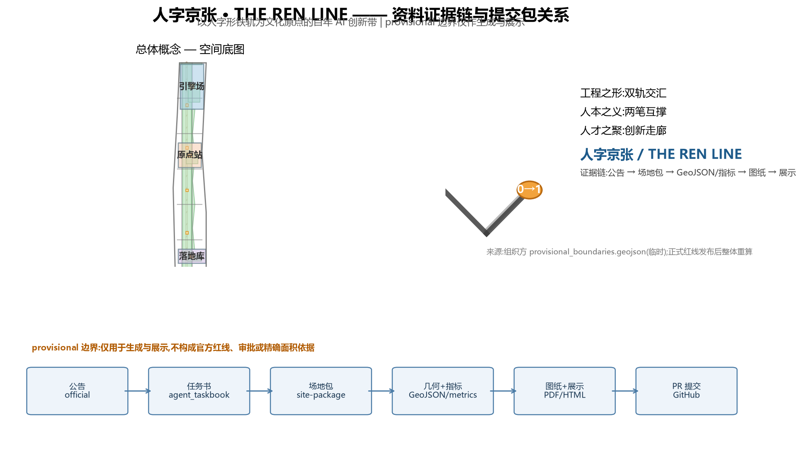
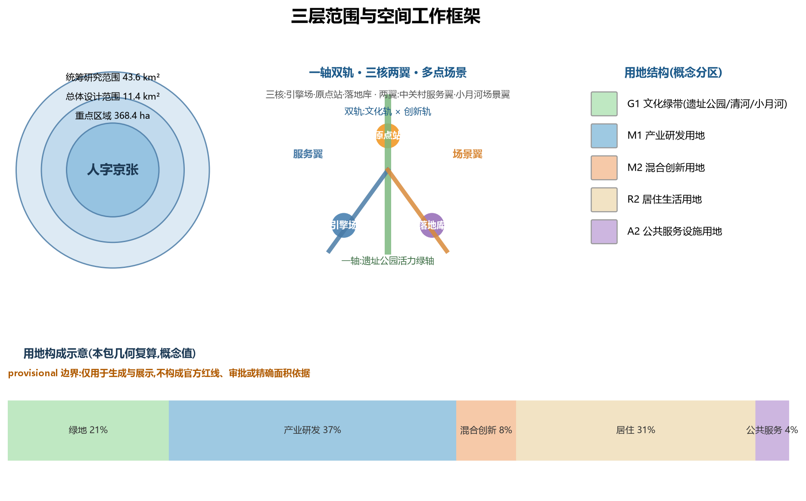
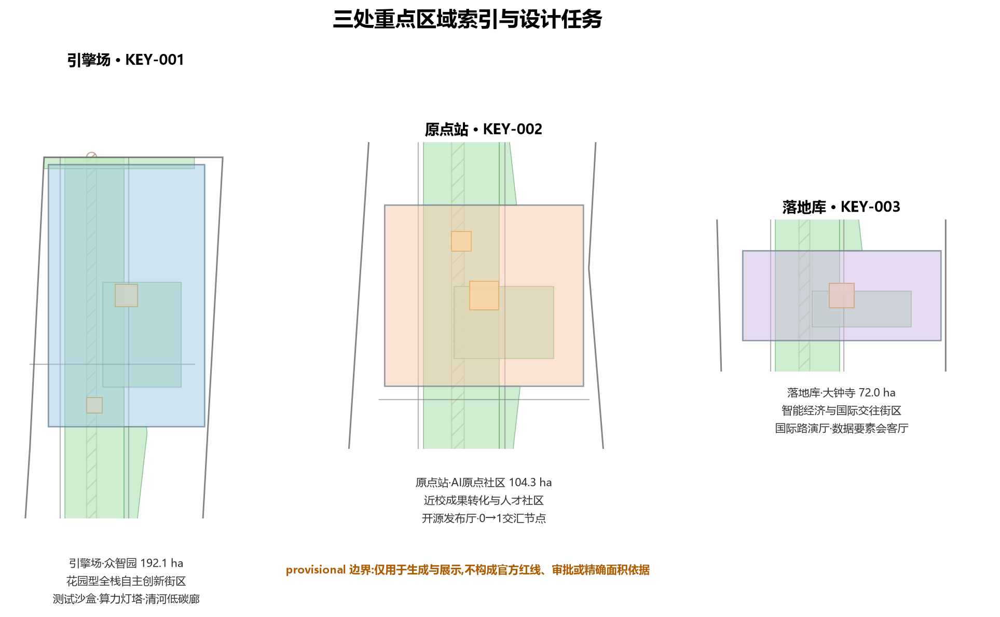
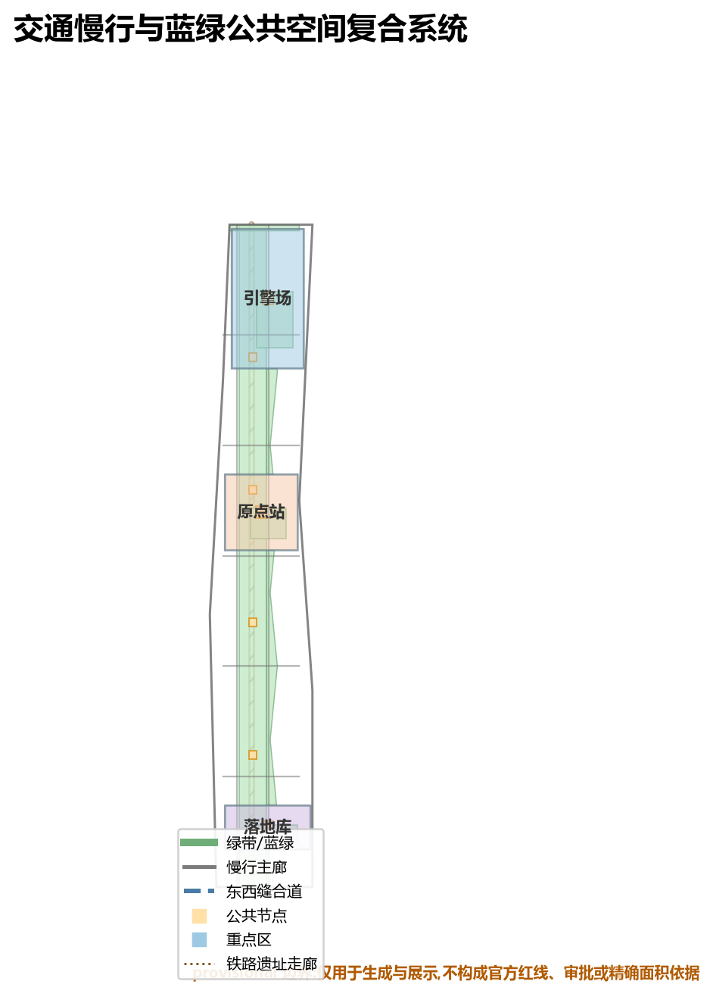
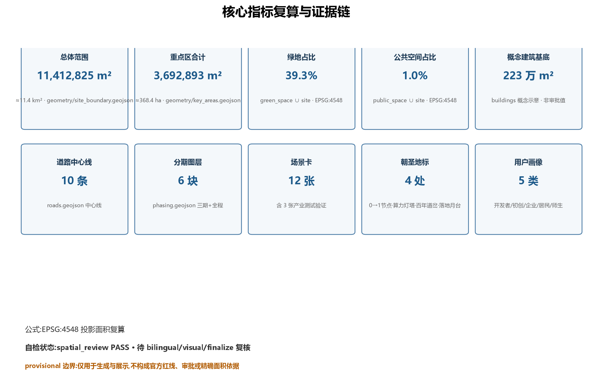

# 人字京张 / THE REN LINE:以人字形铁轨为文化原点的百年AI创新带

## 设计依据与资料清单

本方案以北京市规划和自然资源委员会海淀分局发布的《百年京张AI创新带城市设计国际方案征集资格预审公告》为第一依据，以面向智能体开源征集任务书（agent_taskbook）为任务边界，以组织方提供的临时粗略边界（provisional boundaries）为空间工作底图 [source:OFFICIAL-ANNOUNCEMENT] [source:AGENT-TASKBOOK]。截至本方案提交日，组织方尚未公开发布官方精确红线，本包所有几何均为 `provisional_constraint`，仅用于方案生成、可视化与设计讨论，不构成官方红线、审批依据或精确面积结论；official polygon 发布后，本包全部图层与指标须整体重算 [source:PROVISIONAL-BOUNDARIES]。

资料登记边界如下 [source:SOURCE-REGISTRY]：

- 官方公告、任务书、专业标准本地快照等 7 条为 formal 可用资料；
- 面向智能体的开源征集任务书为清权用户文档，可支撑 agent 任务响应；
- 临时边界数据为 provisional-only 资料，只用于生成与展示，不支撑法定结论。

本方案为 AI 生成的开放共创建议，所有空间落地建议均表述为"概念建议""参考方案""可供专业团队深化研究"，不替代正式规划，不构成政府审定结论 [source:AGENT-TASKBOOK]。

## 三层范围工作框架

方案按公告确定的三层范围组织 [data:geometry/site_boundary.geojson#SITE-001] [metric:site_area_km2]：

| 层级 | 面积 | 工作目标 | 成果深度 |
| --- | --- | --- | --- |
| 统筹研究范围 | 约 43.6 km² | AI 产业生态、三区两翼协同、未来 AI 城市形态 | 产业与城市战略研究 |
| 总体设计范围 | 约 11.4 km² | 城市更新总体框架、人字双轨空间结构、交通市政支撑 | 控规深度城市设计 |
| 重点区域范围 | 约 368.4 ha | 三处重点片区详细设计 | 规划综合实施方案深度 |

三层范围从产业战略、总体结构、片区详细设计逐级落实 [depth:three_level_scope_framework]。统筹层回答"AI 创新带在世界版图中的位置"；总体层回答"人字双轨如何落到城市空间"；重点层回答"三个锚点如何建成可体验的街区"。若官方边界发布，仅需替换 `SITE_BOUNDARY`/`KEY_AREA` 源几何并重算全部派生图层与指标，空间结构判断不受影响。

## 统筹研究范围产业与未来城市研究

### 总体概念:人字京张

**主名:人字京张**;英文名:**THE REN LINE**。命名取自京张铁路最富传奇色彩的工程创造——詹天佑在八达岭设计的"人"字形展线:1909 年,中国人自主修建的第一条干线铁路,用一个人字,让火车翻越了天险 [source:OFFICIAL-ANNOUNCEMENT]。一百年后,这条走廊要回答的新问题是:AI 如何驶入人的城市?本方案给出同构的回答:**用一个人字,让 AI 与城市相互翻越**。

"人字京张"有三层含义 [source:AGENT-TASKBOOK] [standard:PROJECT-AGENT-OPEN-CALL-TASKBOOK]:

1. **工程之形**:人字 = 两条轨道在一个道岔处交汇——对应本方案"文化轨×创新轨"双轨结构,交汇点即北京 AI 原点社区(换乘站);
2. **人本之义**:汉字"人"两笔互相支撑——AI 创新与城市生活互为支撑,回应共创原则 charter.10"人本治理";
3. **人才之聚**:中关村、五道口、学院路是人才密度最高的城市走廊之一——人字即"人才汇聚之地"。

### 命名体系与 Logo 方向

建立"一主名、三股道、五站场"命名体系 [depth:overall_spatial_structure]:

- **主名**:人字京张 / THE REN LINE;
- **三股道**(呼应三大定位):文化股道(百年京张文化带)、创新股道(AI 融合创新带)、生活股道(都市 AI 生活体验带);
- **五站场**(呼应三区两翼):原点站(AI 原点社区)、引擎场(众智园 AI 自主创新加速区)、落地库(大钟寺 AI 产业集聚区)、服务翼(中关村科技服务翼)、场景翼(小月河场景赋能翼)。

**Logo 方向**:以两条平行钢轨构成"人"字,两条轨道在顶部汇聚为一个发光节点,节点由"0"与"1"两个码位咬合而成——既像铁路道岔,又像神经元突触;寓意历史铁轨与数字轨道在人的尺度上完成换乘。色彩体系:钢轨灰(历史)+ 京张绿(生态)+ AI 光橙(算力与活力)。Logo 可延展为导视系统的基本模数(见第 9 章"组件库")。本方向仅作概念提案,正式 Logo 需经专业设计团队深化与商标清权 [source:AGENT-TASKBOOK]。

### 三大定位、五大功能与三区两翼协同回路

三大定位(百年京张文化带、都市 AI 生活体验带、AI 融合创新带)对应三股道;五大功能(AI 全栈自主创新体系、世界级 AI 创新生态、AI+ 场景赋能新范式、智能化 AI 活力城市、AI 治理全球话语权)分别锚定五个站场 [source:AGENT-TASKBOOK]:

| 站场 | 功能锚点 | 空间角色 |
| --- | --- | --- |
| 原点站 | AI+ 场景赋能新范式 | 开源与人才交汇 |
| 引擎场 | AI 全栈自主创新体系 | 模型、算力、标准 |
| 落地库 | 智能原生新业态 | 产业落地与消费 |
| 服务翼 | 世界级 AI 创新生态 | 资本、IP、全球化配置 |
| 场景翼 | 智能化 AI 活力城市 + AI 治理话语权 | 场景开放与治理观察 |

协同回路:引擎场(研发)→ 原点站(孵化与开源)→ 落地库(产业与消费)→ 服务翼(资本与全球连接)形成主回路;场景翼将主回路的成果转化为市民可感知的日常生活场景,并将治理反馈回传引擎场,形成闭环 [source:AGENT-TASKBOOK]。

### 全球 AI 创新生态案例(6 例)与转化机制

以下案例均来自公开资料,仅作策略类比,不构成企业承诺 [source:AGENT-TASKBOOK] [source:SITE-PACKAGE]:

| 案例 | 关键机制 | 对海淀的转化建议 |
| --- | --- | --- |
| 美国硅谷湾区 | 研究型大学 + 风险资本 + 开源文化共生 | 强化高校-园区慢行缝合与成果转化街 |
| 美国波士顿 Kendall Square | 从"停车场"到"全球最密集创新区"的规划更新 | 众智园可作为同类"校区-园区"更新样板 |
| 英国伦敦国王十字 | 铁路遗产地再开发 + 知识产业导入 | 京张遗址公园沿线可借鉴站城一体更新路径 |
| 新加坡纬壹科技城 one-north | 政府主导的"工作-生活-游憩-学习"复合园区 | 生活股道与场景翼可参考其混合街区密度 |
| 以色列特拉维夫 | 初创生态 + 夜经济 + 全球活动引流 | 大钟寺国际路演客厅可参考其活动运营 |
| 深圳南山科技园 | 龙头企业带动 + 场景开放测试 | 引擎场可引入"龙头企业 + 开放测试场"模式 |

转化机制:案例表明,成功的 AI 创新带都有三个共同点——**近校策源、场景开放、活动引流**。本方案将三点分别落实为原点站的开源发布厅、引擎场的测试沙盒与落地库的国际路演厅(见第 6 章场景卡),并配置土地、空间、产业、资金、人才、算力、数据、场景八类要素机制于 `compliance_matrix.json` 与 `sources.json` [depth:industry_space_mapping]。

## 总体设计范围城市更新与控规深度城市设计

### 人字双轨空间结构

总体设计范围形成"**一轴双轨、三核两翼、多点场景**"的空间结构 [depth:overall_spatial_structure] [data:geometry/land_use.geojson#LU-001]:

- **一轴**:京张遗址公园活力绿轴(南北贯通的文化公共空间主轴,对应文化股道)[data:geometry/green_space.geojson#GREEN-001];
- **双轨**:创新股道(西侧学院路-科技走廊方向,AI 研发与服务)与文化-生活复合轨道(遗址公园与东翼社区),两条"轨道"在原点站交汇 [data:geometry/roads.geojson#ROAD-001];
- **三核**:引擎场(北)、原点站(中)、落地库(南),即三处重点区域 [data:geometry/key_areas.geojson#KEY-001];
- **两翼**:中关村科技服务翼(西)、小月河场景赋能翼(东);
- **多点场景**:沿绿轴与两翼布置 12 个 AI 场景节点与 4 处朝圣地标(第 6、9 章)。

### 城市更新总体框架

更新逻辑为"**留轨、改街、育核**"三策 [depth:retain_renovate_demolish]:

- **留轨**:完整保留京张铁路遗址走廊及其历史构筑物,作为文化股道与公共空间骨架,不作大拆大建;
- **改街**:对五道口、清华东路、大钟寺等老旧商业与产业街区的沿街界面、首层业态、公共空间进行渐进式微更新;
- **育核**:在三处重点片区植入 AI 产业载体、测试空间与公共客厅,作为创新锚点。

建筑规模、开发强度、容积率、建筑高度等管控指标缺少官方控规条件,统一记为 `status=unknown`,待正式控规数据发布后复算;本包仅提供可由几何复算的概念体量(见 `metrics.json`) [source:PLANNING-LIMITS]。

### 交通、轨道与市政支撑策略

- **慢行双廊**:遗址公园两侧各设一条南北慢行主廊,串联三核与沿线节点 [data:geometry/roads.geojson#ROAD-001] [data:geometry/public_space.geojson#PUBLIC-001];
- **东西缝合**:5 条东西联络道跨越遗址走廊,缝合东西两翼,重点缝合五道口、清华东路西口、大钟寺三个轨道站周边 [data:geometry/roads.geojson#ROAD-003];
- **轨道一体化**:依托 13 号线、15 号线等既有轨道及规划线路,在大钟寺站、清华东路西口站周边形成站城一体化概念节点(具体线位以官方为准,本方案不作工程结论)[standard:MOHURD-CONTROL-DETAILED-PLANNING];
- **新型基础设施**:端侧算力驿站、分布式能源与市政设施复合布置,作为待深化的新基建原型(见第 8 章)[depth:municipal_new_infrastructure]。

## 重点区域详细设计

### 引擎场:众智园 AI 自主创新加速区(约 192.1 ha)

- **定位**:花园型全栈自主创新街区——"算力与标准的引擎场" [data:geometry/key_areas.geojson#KEY-001];
- **空间结构**:北接清河滨水界面,内部组织"研发组团—测试沙盒—标准治理展示—低碳交往绿廊";
- **建筑更新**:以保留既有产业载体、改造低效楼宇、预留新建 AI 实验室为主,拆改留分类以现状权属与建筑质量复核为前提,本方案只给概念分类 [depth:three_key_area_detailed_design];
- **AI 场景**:模型安全测试沙盒(产业测试验证场景)、算力灯塔(朝圣地标)、清河低碳创新廊;
- **实施风险**:清河蓝线与防洪条件、对外交通组织、企业权属协同均待官方资料确认。

### 原点站:北京 AI 原点社区(约 104.3 ha)

- **定位**:近校型成果转化与人才社区——"人字交汇点/换乘站" [data:geometry/key_areas.geojson#KEY-002];
- **空间结构**:以人字交汇广场为核心,组织"校区—园区—街区"三方缝合,形成开源发布厅、成果转化街、人才服务带;
- **建筑更新**:依托五道口、清华园周边街区微更新,缝合高校慢行联系,补足成果发布、人才居住与开源协作空间;
- **AI 场景**:开源发布厅、近校成果转化街、0→1 交汇节点(朝圣地标);
- **实施风险**:校区边界、权属与首层业态协调待确认;清华园站遗址保护要求须先行落实。

### 落地库:大钟寺 AI 产业集聚区(约 72.0 ha)

- **定位**:城市型智能经济与国际交往街区——"智能原生业态的落地库" [data:geometry/key_areas.geojson#KEY-003];
- **空间结构**:围绕大钟寺站组织站城一体化概念,四象限步行连通,形成国际路演客厅、智能终端展示廊与数据要素会客厅;
- **建筑更新**:以商业商务载体更新为主,预留智能原生消费场景空间;
- **AI 场景**:国际路演客厅(产业测试验证场景)、数据要素会客厅(产业测试验证场景)、落地月台(朝圣地标);
- **实施风险**:轨道站点改造与市政管线条件待确认;路口四象限连通需交通组织专项研究。

## AI 创新生态、人才画像与 AI+ 场景

### 用户画像(5 类)

[source:AGENT-TASKBOOK] [depth:persona_scenario_mapping]:

| 画像 | 典型需求 | 空间响应 | 数据边界 |
| --- | --- | --- | --- |
| 开源开发者 | 发布、协作、测试、社区声誉 | 原点站开源发布厅、公共代码墙、夜间协作空间 | 不采集个人行为轨迹;活动数据只做聚合统计 |
| 初创团队 | 低成本办公、算力入口、产品试验场 | 引擎场共享测试沙盒、端侧算力驿站、服务翼孵化通道 | 算力与数据服务另行授权 |
| 头部企业访客 | 展示、商务、国际接待、人才招聘 | 落地库国际路演客厅、轨道站接驳、企业周边公共空间 | 企业标识与案例须清权 |
| 周边居民 | 通勤、休闲、社区服务、低扰动更新 | 遗址公园慢行环、生活股道社区服务、活动分级 | 不将居民画像用于商业推荐 |
| 高校师生 | 成果转化、跨校协作、日常慢行 | 原点站校区-园区缝合、成果转化街、AI 教育体验点 | 校园数据与科研成果须授权 |

### AI 场景卡(12 张,含 3 张产业测试验证场景)

每张场景卡在正文中保持可读,完整结构化字段(空间位置、服务对象、运行数据、隐私边界、人工复核、运营主体、图层映射、风险)见 `scenarios` 轨道与 `compliance_matrix.json` [source:AGENT-TASKBOOK] [depth:scenario_design]:

| # | 场景卡 | 空间载体 | 类型 | 核心说明 |
| --- | --- | --- | --- | --- |
| SC-01 | 开源发布厅 | 原点站 | 社区运营 | 面向高校、开源社区与初创团队,提供成果发布、代码贡献展示与小型路演空间 [data:geometry/public_space.geojson#PUBLIC-002] |
| SC-02 | 模型安全测试沙盒 | 引擎场 | **产业测试验证** | 将标准制定、安全评测、模型红队测试转译为可预约、可监管的展示与协作节点 [data:geometry/key_areas.geojson#KEY-001] |
| SC-03 | 端侧算力驿站 | 全域节点 | 新型基础设施 | 与公共服务、低碳能源结合的端侧算力与隐私计算原型,待深化 |
| SC-04 | AI 慢行导航与无障碍助手 | 遗址公园绿轴 | AI+交通 | 用可解释导视与低侵入传感识别慢行断点、拥挤节点与无障碍需求 [data:geometry/roads.geojson#ROAD-001] |
| SC-05 | 国际路演客厅 | 落地库 | **产业测试验证** | 智能体、智能终端与内容消费企业的展示、洽谈、媒体发布与国际交流场景 |
| SC-06 | 清河低碳创新廊 | 引擎场北界面 | AI+环境 | 绿色空间、雨洪、步行骑行与 AI 展示结合的园区公共客厅 [data:geometry/green_space.geojson#GREEN-005] |
| SC-07 | 近校成果转化街 | 原点站 | AI+教育/孵化 | 面向高校成果转化,组织孵化、法务、知识产权与投融资服务 |
| SC-08 | 数据要素会客厅 | 落地库 | **产业测试验证** | 以合规、授权、可审计为前提,展示数据要素与数字资产流通的城市服务界面 |
| SC-09 | AI 生活服务样板街 | 生活股道(东翼) | AI+生活 | 将医疗、教育、法律、生活服务等 AI+ 场景落到可运营的小尺度街区 |
| SC-10 | 全球 AI 活动周路线 | 全域公共空间 | 运营机制 | 从遗址文化、开源社区、产业展示到国际路演的可步行体验路线 [data:geometry/phasing.geojson#PHASE-004] |
| SC-11 | 智能体城市治理观察窗 | 遗址公园节点 | AI+治理 | 城市智能体辅助识别公共空间热力、设施维护与活动安全,人工复核后呈现 |
| SC-12 | 人字文化导览线 | 文化股道 | AI+文化 | 结合京张历史与 AI 新文化叙事的多语导览与数字孪生讲解 |

所有 AI 场景遵守数据最小化、公开来源、可解释与人工复核原则;测试验证场景明确标注"测试与展示用途,不构成已批准运营" [source:AGENT-TASKBOOK]。

## 用地、建筑规模与拆改留方案

用地方案依据《国土空间调查、规划、用途管制用地用海分类指南》构建,形成"文化绿带(G1)—产业研发(M1)—混合创新(M2)—居住生活(R2)—公共服务(A2)"的完整分区,覆盖全部工作边界且无重叠 [standard:MNR-LAND-USE-CLASSIFICATION-GUIDE] [data:geometry/land_use.geojson#LU-002] [metric:land_use_coverage_sqm]。

概念复算指标(基于本包几何,仅作设计参考)[metric:green_ratio] [metric:public_space_ratio] [metric:building_footprint_area_sqm]:

- 绿地与开敞空间占比约 **39.3%**(含遗址公园绿轴、清河界面、小月河走廊与重点区内绿地);
- 公共空间节点占比约 **1.0%**(广场与活动节点);
- 概念建筑基底约 **223 万 m²**(示意性,不代表现状或审批建筑)。

容积率、建筑密度、绿地率法定值、退线等管控指标缺少官方控规条件,统一记 `status=unknown`,正式数据发布后按 `docs/formal-submission-guide.md` 复算路径更新 [source:PLANNING-LIMITS]。拆改留以"留轨、改街、育核"为方法,不给出地块级法定结论;缺少权属与现状建筑资料的地块均列为待确认事项。

## 交通、轨道、市政与公共服务设施

- **道路微循环**:依托 5 条东西缝合联络道 + 重点区内环路,组织"主轴慢行、两侧车行"的分层路网 [data:geometry/roads.geojson#ROAD-002] [depth:traffic_rail_slow_parking];
- **轨道站点一体化**:大钟寺站、清华东路西口站、五道口站周边形成站城一体化概念节点,轨道线位与站点改造以官方为准;
- **停车与非机动车**:在轨道站周边组织 P+R 与共享骑行驿站概念布局,具体以交通专项为准;
- **市政与新型基础设施**:端侧算力驿站、分布式能源、智慧灯杆与市政设施复合;管线、能源、防洪、消防等工程条件待正式资料确认 [depth:municipal_new_infrastructure]。

## 蓝绿空间、公共空间与城市风貌

### 蓝绿网络

"一轴两河"蓝绿骨架:遗址公园活力绿轴(南北主轴)+ 清河界面(北)+ 小月河走廊(东),步道骑行贯通、东西缝合 [data:geometry/green_space.geojson#GREEN-001] [standard:MOHURD-URBAN-DESIGN-MEASURES]。

### AI 朝圣地标(4 处)

[source:AGENT-TASKBOOK] [depth:landmark_honor_display]:

| # | 地标 | 位置 | 概念说明 |
| --- | --- | --- | --- |
| L-01 | 0→1 交汇节点 | 原点站人字交汇广场 | 开源代码墙 + 贡献者荣誉屏,象征历史铁轨与数字轨道在"人"字顶点完成换乘 [data:geometry/public_space.geojson#PUBLIC-002] |
| L-02 | 算力灯塔 | 引擎场清河界面 | 将端侧算力与能耗可视化转译为可观看的灯光地标 [data:geometry/public_space.geojson#PUBLIC-001] |
| L-03 | 百年道岔 | 清华园站遗址节点 | 历史站房 + AI 数字孪生讲解,呈现"历史与未来的转换站" [data:geometry/constraints.geojson#CON-003] |
| L-04 | 落地月台 | 落地库站前广场 | 以"月台"为母题的国际路演与智能体展示廊 [data:geometry/public_space.geojson#PUBLIC-003] |

### 荣誉展示体系与组件库

在 L-01 建立**智能体贡献荣誉墙**(入选方案 Agent 与贡献者 GitHub 名可进入纪念体系,由组织方最终确定形式与位置);公共空间组件库包括:轨道座椅(钢轨断面)、道岔导视(人字形指示)、信号灯艺术装置、0/1 地面铺装模数。所有字体、图像、标识均需清权 [source:AGENT-TASKBOOK]。

## 更新项目清单、实施政策与分期计划

### 更新项目清单(概念)

| 编号 | 项目 | 类型 | 依赖条件 |
| --- | --- | --- | --- |
| JZ-01 | 遗址公园慢行断点缝合 | 公共空间/交通 | 道路红线、桥下空间、交通组织复核 [data:geometry/roads.geojson#ROAD-001] |
| JZ-02 | 引擎场清河创新界面 | 蓝绿/产业展示 | 河道蓝线、生态与防洪条件 [data:geometry/green_space.geojson#GREEN-005] |
| JZ-03 | 原点站近校成果转化街 | 城市更新/产业服务 | 校区边界、权属、首层业态 [data:geometry/buildings.geojson#BLDG-001] |
| JZ-04 | 落地库站四象限步行连通 | 轨道一体化/慢行 | 轨道站点、道路交叉口、市政管线 [data:geometry/public_space.geojson#PUBLIC-003] |
| JZ-05 | 端侧算力驿站网络 | 新基建/公共服务 | 能源、算力、安全与运营主体 [data:geometry/constraints.geojson#CON-001] |
| JZ-06 | 全球 AI 活动周公共路线 | 运营/品牌 | 公共空间许可、活动安全、版权清权 [data:geometry/phasing.geojson#PHASE-004] |
| JZ-07 | 智能体贡献荣誉墙 | 文化/品牌 | 组织方纪念体系决策、清权 [data:geometry/public_space.geojson#PUBLIC-002] |
| JZ-08 | 生活股道 AI 服务样板街 | 城市更新/生活服务 | 社区参与、权属与运营主体 |

### 分期计划

[data:geometry/phasing.geojson#PHASE-001]:

- **近期(2026—2028)试点**:原点站与人字交汇点、落地库先启动——以轻量设施、运营活动与服务平台切入;
- **中期(2028—2030)**:引擎场全栈加速区建设,遗址公园活力带全程提升;
- **远期(2030—2035)**:两翼完善,形成完整的人字双轨格局。

### 全球 AI 创新活动体系与长期运营(agent.6)

- **年度活动体系**:京张"人字"节(春季)、京张开源周(夏季)、AI 原点论坛(秋季)、智能体年终贡献展(冬季),全部为概念建议,须经组织方与政府审批;
- **活动品牌与传播**:以"人字"Logo 模数延展活动视觉,建立中英双语国际传播叙事;
- **开发者社区运营**:开源发布厅 + 贡献荣誉墙 + 季度黑客松,形成"发布—反馈—迭代"闭环;
- **场景开放运营**:引擎场测试沙盒、落地库路演厅按"预约制 + 人工复核"开放;
- **招引转化机制**:服务翼对接资本与全球化资源,把活动参与者转化为企业落地与人才引进线索——所有招商、资金、政策安排均表述为概念方向,不构成政府承诺 [source:AGENT-TASKBOOK]。

## 指标体系、面积复算与合规矩阵

指标体系分三类 [depth:metrics_recalculation] [metric:site_area_sqm]:

1. **几何复算指标**(本包可算):总体范围 11,412,825 m²、重点区合计约 3,692,893 m²、绿地占比约 39.3%、公共空间占比约 1.0%、概念建筑基底约 223 万 m²、道路中心线 10 条、分期图层 6 块、场景卡 12 张、朝圣地标 4 处、用户画像 5 类——完整公式、来源与置信度见 `metrics.json`;
2. **待官方控规指标**:容积率、建筑高度、建筑密度、绿地率法定值、退线、道路红线——`status=unknown`,正式数据发布后复算;
3. **运营绩效指标**:AI 创新指数、人才密度、活动参与度、场景使用频次——由运营阶段持续校准。

`compliance_matrix.json` 逐条覆盖公告 1.3/1.4/1.5 与 agent.1—agent.6;`standard_matrix.json` 覆盖全部强制专业标准;`design_depth_matrix.json` 标注每项设计深度证据。正文引用标记与结构化文件保持一致,机器索引不重复堆叠于正文 [source:SITE-PACKAGE]。

## 风险、版权与合规说明

- **资料合规**:本包仅使用公开或清权资料;provisional 边界已醒目标注,不冒充官方红线 [source:PROVISIONAL-BOUNDARIES];
- **双语言契约**:本包声明 `bilingual_contract_version: "1"`,主稿 `proposal.md`(zh)与 `proposal.en.md` 保持章节、主张、指标与图件一致;
- **AI 生成责任**:本方案由 AI Agent(Hermes Agent)生成,生成方法与工具已登记于 `agent.json` 与 `report/copyright_statement.md`;
- **禁用承诺**:不声称官方批准、审定控规、最终权属、确定投资或保证实施;所有空间落地建议均为概念建议 [source:AGENT-TASKBOOK];
- **待补资料**:官方红线、控规条件、现状建筑、权属、市政工程、文保范围——已列入 `assumptions.json`,正式深化前必须补齐并复核。

## 参考资料

- 《百年京张AI创新带城市设计国际方案征集资格预审公告》(北京市规划和自然资源委员会海淀分局,2026-05-09)[source:OFFICIAL-ANNOUNCEMENT]
- 《面向全球智能体开展"百年京张AI创新带城市设计开源征集"任务书摘录》(agent_taskbook,2026-05-18)[source:AGENT-TASKBOOK]
- 组织方临时粗略边界与场地包(brief/site-package/geometry/provisional_boundaries.geojson)[source:PROVISIONAL-BOUNDARIES]
- 《城市设计管理办法》(住建部,2017)[source:MOHURD-URBAN-DESIGN-MEASURES]、《城市、镇控制性详细规划编制审批办法》(2022)[source:MOHURD-CONTROL-DETAILED-PLANNING]
- 《国土空间调查、规划、用途管制用地用海分类指南》(自然资源部,2023-11)[source:MNR-LAND-USE-CLASSIFICATION-GUIDE]
- 全球 AI 创新生态公开案例(硅谷、Kendall Square、国王十字、one-north、特拉维夫、深圳南山)[source:PUBLIC-CASE-STUDIES]
- 完整机器索引:见 `sources.json`、`metrics.json`、`compliance_matrix.json`、`standard_matrix.json`、`design_depth_matrix.json` 与 `report/copyright_statement.md` [source:SITE-PACKAGE]

