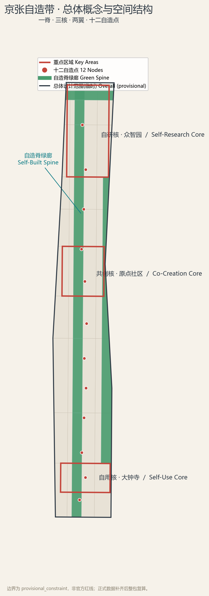
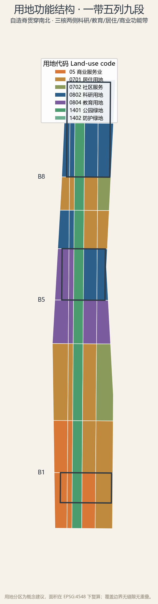
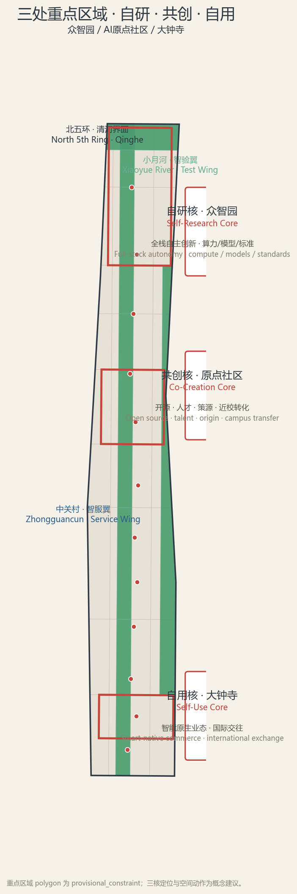
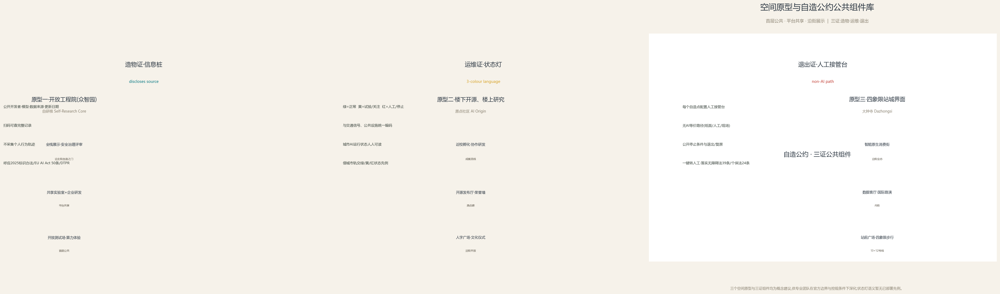
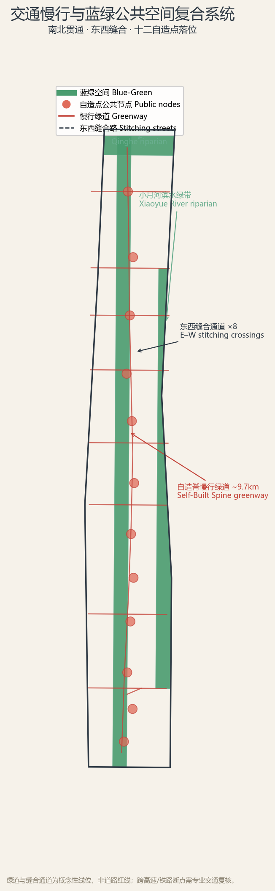
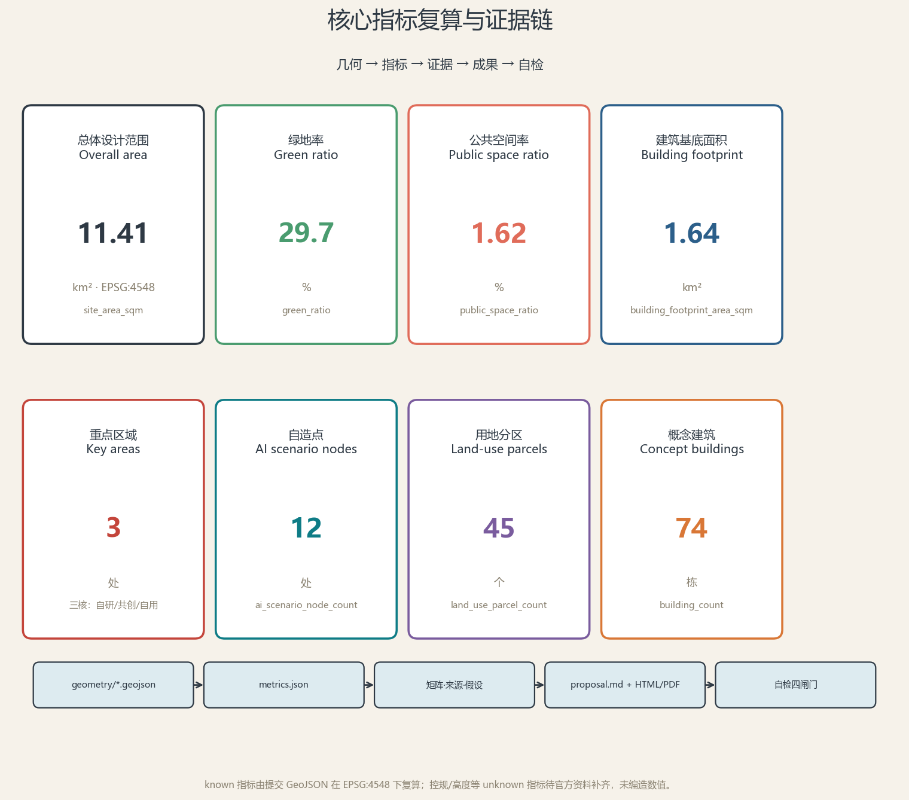

# 京张自造带 THE SELF-BUILT BELT：从中国人自造的第一条铁路到自造AI创新带城市设计概念方案

## 设计依据与资料清单

本概念方案以北京市规划和自然资源委员会海淀分局发布的《百年京张AI创新带城市设计国际方案征集资格预审公告》为第一依据 [source:OFFICIAL-ANNOUNCEMENT]，以面向智能体的开源征集任务书为任务依据 [source:AGENT-TASKBOOK]，并以 `brief/site-package/` 中登记的三层范围、临时边界、枚举、规划限制、来源清单与标准快照为机器可读依据 [source:SITE-PACKAGE] [standard:PROJECT-OFFICIAL-ANNOUNCEMENT] [standard:PROJECT-AGENT-OPEN-CALL-TASKBOOK]。

官方公告未随文发布精确 polygon，公开渠道截止 2026-08-07 未找到可验证坐标系的官方红线；本方案使用维护者登记的临时粗略边界（`provisional_constraint`、`official_boundary=false`、`boundary_precision=provisional_rough`）作为生成与展示底图 [source:BOUNDARY-SOURCE] [data:geometry/site_boundary.geojson#SITE-001]。该组织方数据缺口不阻断内容评分，但所有面积、比例与控制判断均须在官方红线发布后整包复算，不得作为审批依据或精确面积依据 [source:SOURCE-REGISTRY] [source:PROCESSED-FACT-PACK]。资料使用边界与缺资料清单见 `sources.json`、`assumptions.json` 与任务覆盖矩阵 [depth:risk_missing_data]。

## 三层范围工作框架

方案严格按公告三层范围组织工作：统筹研究范围（约 43.6 平方公里）回答"AI创新生态与未来城市形态如何组织"；总体设计范围（约 11.4 平方公里，即提交边界）落实城市更新、产业空间、交通市政与风貌控制的总体框架；重点区域范围（约 368.4 公顷，三处重点区）达到规划综合实施方案的详细设计深度 [standard:MOHURD-URBAN-DESIGN-MEASURES] [depth:three_level_scope_framework]。三层不是三张割裂图纸，而是"战略—结构—地块"的传递链：统筹层定创新链与区域协同，总体层定空间结构与承载，重点层验证具体地块、建筑、交通、公共空间与AI场景的可实施性 [depth:overall_spatial_structure] [data:geometry/key_areas.geojson#PROV-KEY-SCOPE-001]。

统筹研究范围与北纬社区、未来科学城、怀柔科学城、经开区及京津冀的创新协同，形成"高校策源—开源协作—企业转化—公共体验—国际传播"的创新回路 [source:SRC-2026-BJ-KW-THREE-AREAS-WINGS]；总体设计范围以京张遗址公园活力带为脊，串联三核两翼；重点区域则把三核定位落到地块尺度。三层范围在 `compliance_matrix.json` 中逐条映射公告 1.3、1.4、1.5 与 agent.1–agent.6 任务 [source:PROCESSED-FACT-PACK]。

## 统筹研究范围产业与未来城市研究

**总体概念「京张自造带」**：1909 年，詹天佑与中国人自造了京张铁路——中国第一条完全由中国人勘测、设计、施工、管理的干线铁路，被当时世界讥为"不可能的工程"，却在四年内建成、节余经费、按国际标准轨距接入世界并服役超过一个世纪 [source:DATA-SRC-OFFICIAL-ANNOUNCEMENT-20260509]。这是"自造"的第一次证明。2026 年，同一走廊要回答第二个问题：在 AI 这一当代最关键的通用技术上，北京能否像当年自造铁路一样，自造出"造得成、用得了、管得住"的 AI 创新带——从模型、算力、数据到标准、生态、治理的自主可控，并且第一次由人来验收、可复核、可退出 [source:AGENT-TASKBOOK]。

本方案把"自造"（Self-Built）作为一带的品牌内核与设计操作系统，形成命名体系：**京张自造带**（主名称）、**JZ Self-Built Belt**（英文名），口号"自己造 · 造得成 · 用百年 / Built by ourselves. Built to last."；Logo 方向以"自"字与"人字形"轨道同构——两条平行钢轨构成"自"的外框，中间一笔是詹天佑人字形折返线的抽象，象征"自主创新以人为中心" [depth:overall_spatial_structure]。三区两翼获得子品牌：众智园=**自研核**（全栈自主创新）、AI原点社区=**共创核**（开源·人才·策源）、大钟寺=**自用核**（智能原生业态），西翼中关村=**智服翼**（要素全球化配置）、东翼小月河=**智验翼**（场景赋能验证），形成"原点出思想→众智园加速→大钟寺到城→中关村配要素→小月河验场景→反馈回原点"的协同回路 [source:SRC-2026-HAIDIAN-1X1]。为避免与既有同类方案混淆，本方案作如下原创声明：概念、命名与Logo方向均由本方案独立生成，未沿用「智脉」「智脊」「折返带」「开源带」等既有提法；京张铁路「人字形」折返与「自造」精神属于公共文化遗产，任何方案均不应主张排他 [source:SOURCE-REGISTRY] [depth:overall_spatial_structure]。Logo方向（「自」字+人字形轨道）成图规范：标准型用于主标识与导视，规定最小使用尺寸与安全间距，提供反白与灰度版本，支持深色/浅色底，禁止拉伸变形；正式落地的字体与图形细节待专业视觉团队按清权来源深化。

统筹层研究五个全球 AI 创新生态案例，以可核验事实提炼可迁移机制 [depth:overall_spatial_structure]：

| 案例 | 面积 | 可核验事实 | 可迁移机制 |
| --- | --- | --- | --- |
| 旧金山 Mission Bay | 约 123 公顷 | UCSF 医疗科研园区为锚；Chase Center（2019）、Uber/Visa/OpenAI 总部入驻 [source:DATA-SRC-MISSION-BAY] | 单一公共机构在公共棕地上统一规划，以学术园区锚定高密度科研开发 |
| 伦敦 King's Cross | 27 公顷 | 就业 2011 年 8000 → 2019 年 27000，企业数十年翻倍至约 800 家 [source:DATA-SRC-KINGS-CROSS] | 单一业主联合体整体开发，以公共/文化锚点（Central Saint Martins、Francis Crick）去风险 |
| 新加坡 one-north | 200 公顷 | 约 400 家领军企业、800 家初创、16 家公共研究机构 [source:DATA-SRC-ONE-NORTH] | JTC「Business Park-White」分区，把单用途商务园改造成 15% 弹性混合街区 |
| 波士顿 Kendall Square | 约 1 平方英里 | 半英里内约 37500 名雇员、约 2000 万平方英尺实验室与办公 [source:DATA-SRC-KENDALL] | 大学邻接 + 车站节点上的统一土地开发 |
| 深圳·深圳湾科技生态园 | 约 0.2 平方公里（园区） | 深圳湾科技园区超 1300 家企业、15 万高端企业人群、年产值超 2500 亿元 [source:DATA-SRC-SHENZHEN-BAY] | 国资平台统一开发运营，由「房东」向「股东」转型的产业生态运营 |

五个案例的共同结论是：创新生态不是被规划出来的，而是被距离、界面与入口决定的；京张自造带据此提出三条空间转译——距离机制（研究—产业步行可达）、界面机制（首层公共、平台共享）、入口机制（轨道站与绿廊锚定入口） [standard:PROJECT-AGENT-OPEN-CALL-TASKBOOK]。

统筹研究同时落到海淀的当下数据：北京 2025 年人工智能产业规模达 4500 亿元、占全国约半数，AI 企业超 2500 家、备案大模型 241 款 [source:DATA-SRC-BEIJING-AI-2025]；海淀区 AI 核心产值超 3500 亿元、AI 企业超 2000 家，且 AI 原点社区已实地聚集约 400 家企业、AI 产业集聚度 74%、周边 1 公里内 37 所高校与 52 家全国重点实验室 [source:DATA-SRC-AI-ORIGIN-COMMUNITY-2026]。本方案的三区两翼与官方 2026-03-27 发布的「学北园/众智园—AI原点社区—大钟寺」三区及中关村、小月河两翼布局一致 [source:DATA-SRC-HAIDIAN-THREE-AREAS-WINGS-2026]，并呼应海淀「1+X+1」现代化产业体系（塔尖人工智能、X 战略性新兴与未来产业、塔基科技服务业） [source:DATA-SRC-HAIDIAN-1X1-SYSTEM-2026]。未来城市形态研究回应 AI 对工作、生活、交通、公共服务的影响，把算力、数据、场景、人才四类要素落到可定位的功能区与廊道，而不泛谈技术愿景 [depth:overall_spatial_structure]。

## 总体设计范围城市更新与控规深度城市设计

总体设计范围（提交边界约 11.4 平方公里）以控制性详细规划的城市设计深度组织空间：一条**自造脊绿廊**南北贯通（约 9.7 公里，把京张遗址公园、蓝绿慢行、公共活动与AI体验整合为连续公共主轴），三核锚定创新功能，两翼支撑要素与场景，十二自造点沿脊落位 [source:BOUNDARY-SOURCE] [data:geometry/land_use.geojson#LU-001] [metric:greenway_length_m]。用地采用"一带五列九段"结构：自造脊居中，东西各两列分别承担智服翼产业服务与智验翼生活场景，九个功能带从南到北依次为商业商务、商业生活、社区、教育、创新社区、研发、居住、全栈科研、清河界面 [data:geometry/land_use.geojson#LU-001] [depth:land_use_layout] [depth:development_intensity_controls]。

城市更新遵循"缝合优先、量入为出、保留为始"的逻辑：把被环路与铁路割裂百余年的东西城市重新接上（8 处东西缝合通道），识别低效空间进行渐进更新，保留有历史与社区价值的建成环境，建筑规模、高度、密度等法定控制一律标注为"待正式控规条件确认"，不以 AI 推测值冒充审定指标 [source:DATA-SRC-MOHURD-CONTROL-DETAILED-PLANNING] [depth:retain_renovate_demolish] [depth:height_massing_character]。总体设计把公告要求的轨道站点一体化、道路微循环、非机动车停放、停车供给、创新服务平台、人才生活服务、新型基础设施、分布式能源与端侧算力落实到图层与指标 [metric:site_area_sqm] [metric:public_space_ratio] [depth:municipal_new_infrastructure]。

## 重点区域详细设计

**自研核·众智园（约 192.1 公顷）**：面向"AI全栈自主创新体系与AI治理全球话语权"，组织花园式全栈研发街区。空间动作为四：一是沿清河界面形成低碳创新交往绿廊；二是建立"模型—芯片—算力—标准"全栈展示与开放测试的**自造之门**；三是设置安全治理与标准制定的公共议事场所；四是完善对外交通与园区慢行接驳。产业场景包括自主模型基准测试、标准制定工作坊、安全治理开放评审、低碳算力体验 [data:geometry/key_areas.geojson#PROV-KEY-001] [depth:three_key_area_detailed_design]。

**共创核·AI原点社区（约 104.3 公顷）**：面向"世界级AI创新生态"，以近校策源、开源协作、成果转化与人才特区为职能。该社区在五道口已实体集聚约 400 家企业、AI 产业集聚度 74%、AI 人才约 1.3 万人，周边 1 公里内 37 所高校、52 家全国重点实验室与 106 家国家级科研机构 [source:DATA-SRC-AI-ORIGIN-COMMUNITY-2026]。空间动作为四：一是组织校区-园区-街区慢行缝合与成果转化街，接住「高校一公里近校创新生态圈」；二是建立**原点碑**与开源发布厅，把贡献者荣誉做成"可生长"的公共纪念；三是补足成果发布、人才服务、居住生活与夜间协作空间；四是轨道站点一体化与**人字广场**（青龙桥人字形母题）承载文化仪式。场景包括开源社区活动、成果发布、人才特区服务、近校孵化与AI教育体验 [data:geometry/key_areas.geojson#PROV-KEY-002] [standard:PROJECT-AGENT-OPEN-CALL-TASKBOOK]。

**自用核·大钟寺（约 72.0 公顷）**：面向"智能原生新业态"，以领军企业、智能体、智能终端、内容消费、数据要素与国际交往为职能，对应官方布局中以平台企业集群带动智能体、内容消费、智能终端等生态企业的定位 [source:DATA-SRC-HAIDIAN-THREE-AREAS-WINGS-2026]。空间动作为四：一是围绕大钟寺站组织四象限步行连通与站城一体化——大钟寺站为 13 号线与 2024-12-15 开通的 12 号线换乘站，站城界面承接轨道客流 [source:DATA-SRC-JINGZHANG-PARK-2026]；二是建立**鸣钟台**——AI 公共服务"发布即鸣钟"的公共宣告与记忆节点，与大钟寺古钟形成"古钟—新钟"对话 [source:DATA-SRC-AGENT-TASKBOOK-20260518]；三是组织智能原生消费街与数据要素会客厅；四是规划绿地复合利用与重点企业公共环境更新 [data:geometry/key_areas.geojson#PROV-KEY-003] [metric:ai_scenario_node_count]。三核的定位、建筑形态、拆改留方向与公共空间均为概念建议，供专业团队在官方边界与控规条件下深化。

## 空间原型与典型地块深设

为使概念建议可供专业团队直接深化，本方案为三核各提出一个可复用的空间原型，并选取众智园一处典型地块做地块级深设示例。三原型遵循同一空间语法——「首层公共、平台共享、沿街展示」，把创新活动对公众开放、把研发平台共享、把成果沿街可见 [depth:three_key_area_detailed_design] [source:AGENT-TASKBOOK]。

**原型一·自研核「花园中的开放工程院」（众智园）**：首层为开放测试场与全栈展示厅，市民可预约参观「模型—芯片—算力—标准」测试与安全治理评审；上层为共享实验室+企业自用研发平台，走廊兼作展示廊；沿主街设「自造之门」公共界面，成果可视化公开。该原型把「沿清河界面—全栈展示—公共议事—园区慢行」的空间动作组织为垂直秩序 [data:geometry/key_areas.geojson#PROV-KEY-001]。同类先例有深圳湾科技生态园的「多层地表」公共首层（首层街巷广场 + 底层架空展示） [source:DATA-SRC-SHENZHEN-BAY-URBAN] 与波士顿 District Hall 的首层公共创新建筑 [source:DATA-SRC-DISTRICT-HALL]。

**原型二·共创核「楼下开源、楼上研究、沿街展示」（AI原点社区）**：首层为开源发布厅与原点碑荣誉墙，沿街面向校区—园区—街区开放；二层以上为近校孵化与协作研发，垂直动线兼作成果流线；结合轨道站组织人字广场文化仪式。该原型把「近校策源—开源协作—成果转化—人才特区」落到同一栋复合体的垂直秩序，呼应原点社区实地已形成的「一栋楼里的AI创业生态」（约 400 家企业、AI 集聚度 74%） [source:DATA-SRC-AI-ORIGIN-COMMUNITY-2026] [data:geometry/key_areas.geojson#PROV-KEY-002]。

**原型三·自用核「四象限站城界面」（大钟寺）**：站前广场组织轨道人流四象限步行导入；沿街为智能原生消费街，内街为数据要素会客厅与国际路演厅；鸣钟台承担 AI 公共服务「发布即鸣钟」仪式。该原型把「站城一体—智能消费—数据要素—国际交往」组织为以轨道站为核心的站城界面 [data:geometry/key_areas.geojson#PROV-KEY-003] [metric:ai_scenario_node_count]。

**典型地块深设·众智园开放工程院约 1 平方公里示例**：以自研核内一处约 1 平方公里的典型地块为例，给出概念性功能分区与首层业态：北侧自主模型基准测试与算力体验、中部全栈展示与标准制定工作坊、南侧企业研发与人才服务；公共界面沿清河与自造脊展开，地块内慢行连续、首层公共、平台共享；运营上以「自造公约」三证（造物证/运维证/退出证）作为进入与退出的公共闸门 [data:geometry/land_use.geojson#LU-001] [depth:renewal_project_list]。该示例为概念建议，地块边界、权属与控规条件待官方数据补齐后深化 [source:OFFICIAL-ANNOUNCEMENT]。

## AI 创新生态、人才画像与 AI+ 场景

**自造公约（治理内核）**：每一项进入公共空间的 AI，须经"三自三证"——自主（来源可溯：公开开发者、模型与数据来源）、自治（责任可接：有明确的运营责任人与人工接管路径）、自省（退出可退：公开停止条件与退出/复原机制）；对应**造物证、运维证、退出证**三证，作为十二自造点的公共界面语言 [source:AGENT-TASKBOOK] [source:DATA-SRC-GENERATIVE-AI-INTERIM-MEASURES]。该公约呼应共创章程的公共利益优先、人类最终判断与人本治理原则，所有场景均保留无AI的等价人工路径 [source:DATA-SRC-BARRIER-FREE-ENVIRONMENT-LAW] [depth:risk_missing_data]。

**五类用户画像**：开源开发者、初创团队、头部企业访客、周边居民、高校师生。每类画像对应空间响应与自检边界，例如开发者对应原点开源发布厅与贡献荣誉墙，初创团队对应众智园共享测试场与端侧算力服务点，居民对应社区服务与低扰动更新，且不以个人行为轨迹做商业推荐 [depth:three_key_area_detailed_design]。

**十二张 AI 场景卡（含 3 个产业测试验证场景）**，每张卡给出服务对象、空间载体、数据来源、隐私边界、人工复核与运营主体，并落到公共空间图层或合规矩阵 [data:geometry/public_space.geojson#PUBLIC-01]：

| 编号 | 场景卡 | 空间载体 | 场景类型 |
| --- | --- | --- | --- |
| S-01 | 自主模型基准测试场 | 众智园·自造之门 | 产业测试验证 |
| S-02 | 具身智能低速机器人试跑线 | 众智园清河界面 | 产业测试验证 |
| S-03 | 数据要素合规流通会客厅 | 大钟寺·数据要素客厅 | 产业测试验证 |
| S-04 | 开源发布厅与贡献荣誉墙 | 原点社区·开源发布厅 | 开源共创 |
| S-05 | AI 无障碍与多感官导览 | 自造脊绿廊 | 公共服务 |
| S-06 | AI 健康与老龄服务驿站 | 社区服务节点 | 公共服务 |
| S-07 | 智能原生消费体验街 | 大钟寺智能消费街 | 消费体验 |
| S-08 | 近校成果转化驿站 | 原点社区·转化街 | 产业服务 |
| S-09 | 慢行友好 AI 交通引导 | 东西缝合通道 | 交通出行 |
| S-10 | 全球AI活动公共路线 | 一带公共空间系统 | 文化运营 |
| S-11 | 开发者夜间协作与实验室开放 | 众智园共享测试场 | 人才服务 |
| S-12 | 百年文化 AI 讲解与记忆回响 | 原点社区·人字广场 | 文化体验 |

场景—空间—运营映射完整保存在 `compliance_matrix.json` 与设计深度矩阵 [depth:three_key_area_detailed_design] [depth:blue_green_public_space]，隐私与人工复核边界见 `assumptions.json` 与风险章节。

## 用地、建筑规模与拆改留方案

用地采用自然资源部《国土空间调查、规划、用途管制用地用海分类指南》代码体系，提交边界内 45 个用地分区完整覆盖、无缝拼合 [standard:MNR-LAND-USE-CLASSIFICATION-GUIDE] [data:geometry/land_use.geojson#LU-001] [metric:land_use_parcel_count]，分类依据见用地用海分类指南 [source:DATA-SRC-MNR-LAND-USE-CLASSIFICATION-202311]。用地结构以科研（0802）、教育（0804）承载三核创新职能，商业（05）承载自用核与国际交往，居住（0701/0702）与社区服务支撑人才生活，公园绿地（1401）与防护绿地（1402）构成自造脊与小月河、清河滨水带 [data:geometry/land_use.geojson#LU-002] [metric:green_ratio]。

建筑方案为概念性建筑基底（74 处，约 1.64 平方公里概念基底，含科研、教育、混合、居住四类），区分"概念新建、概念改造、现状保留待查"三类表达，不给出具体地块的拆改留结论 [data:geometry/buildings.geojson#BLDG-001] [metric:building_footprint_area_sqm]，概念建筑数量与保留改造逻辑见建筑图层与深度矩阵 [metric:building_count] [depth:retain_renovate_demolish]。容积率、建筑高度、建筑密度、退线、道路红线等法定控制全部标注为待官方控规资料补齐（unknown），理由与复算路径见 `metrics.json` 与 `assumptions.json` [depth:development_intensity_controls] [depth:height_massing_character]。

## 交通、轨道、市政与公共服务设施

交通以"缝合与接驳"为纲：自造脊慢行绿道南北贯通，8 处东西缝合通道把铁路割裂的东西城市重新接上，围绕大钟寺站、原点社区轨道站组织站城一体化与四象限步行连通，补足非机动车停放与停车供给 [source:OFFICIAL-ANNOUNCEMENT] [data:geometry/roads.geojson#ROAD-SPINE] [metric:stitch_crossing_count]，东西缝合通道线位见道路图层 [data:geometry/roads.geojson#ROAD-EW-01]。本方案依托京张铁路遗址公园建成现实——公园二期已于 2026-08-06 建成开放，9 公里带状绿廊全线贯通、无围墙开放，设 46 个出入口、8 处社区活动节点，并以「跑步道/漫步道/骑行道+绿地」三道一绿慢行系统串联 [source:DATA-SRC-JINGZHANG-PARK-2026]；自造脊绿道即在这一现实基础上补足东西缝合与南北贯通的关键断点。轨道方面，大钟寺站为 13 号线与 12 号线（2024-12 开通）站点，知春路站为 10 号线与 13 号线换乘站，五道口站为 13 号线站点，形成沿脊的多点轨道接驳 [source:DATA-SRC-JINGZHANG-PARK-2026]。道路与慢行图层保持在提交边界内，与公共空间、绿地、产业节点相互校核；跨高速、铁路的关键断点仅作概念性线位，需专业交通工程复核 [depth:traffic_rail_slow_parking]。

市政与新型基础设施覆盖 AI 产业服务平台、创新公共服务、分布式能源、端侧算力与传统市政融合，提出"设施标准、空间布局、服务半径、运营模式与分期逻辑"五要素框架 [source:SITE-PACKAGE] [depth:municipal_new_infrastructure]。管线、能源、排水、防洪、消防等工程资料缺失，一律列为正式深化前置条件，不编造工程结论 [depth:risk_missing_data]。

## 蓝绿空间、公共空间与城市风貌

蓝绿体系以自造脊绿廊为骨架，串联清河、小月河两条滨水绿带与三核的园区绿地，形成"一脊两河三核多点"的连续蓝绿网络 [data:geometry/green_space.geojson#GREEN-001] [data:geometry/green_space.geojson#GREEN-010] [metric:green_space_area_sqm]。十二自造点作为 AI 场景公共节点沿脊分布，提供可停靠、可体验、可人工接管的城市公共界面 [data:geometry/public_space.geojson#PUBLIC-01] [metric:public_space_ratio]。

城市风貌融合三重文化：**铁路文化是结构**（铁轨、枕木、信号、里程牌等构件转译为导视与铺装语言，保留工业记忆），**中关村文化是方法**（开放、迭代、极客精神进入公共空间的活动组织），**AI 新文化是契约**（技术进入城市必须可解释、可复核、可撤回） [source:AGENT-TASKBOOK] [depth:blue_green_public_space]。铁路文化以清华园车站旧址（詹天佑题写站名、北京市文物保护单位，2023-03-25 开放）与京张铁路遗址公园一期（2023-06-29 开放）为实体锚点，原铁轨、绿皮车厢、人字坡母题等 20 余处遗产要素已进入公共空间 [source:DATA-SRC-JINGZHANG-PARK-PHASE1-2023]；风貌控制分清官方管控、设计建议与待确认条件，文保范围与建设控制地带待正式 GIS 补齐 [source:SOURCE-REGISTRY] [depth:risk_missing_data]。

## 自造公约公共组件库与AI原生界面

自造公约（自主·自治·自省）不只是一句口号，本方案把三证落成十二自造点的标准公共空间组件，让每一项进入城市的 AI 在物理空间中可见、可问、可停 [source:AGENT-TASKBOOK] [depth:blue_green_public_space]。组件库以真实法规与落地先例为依据，而非贴标签式的概念。

**造物证·信息桩**：实体与数字一体的信息桩，公开开发者、模型版本、数据来源、更新日期与人工复核入口；位于每个自造点入口，统一视觉语言，扫码可查完整记录，不采集个人行为轨迹。该组件呼应《人工智能生成合成内容标识办法》（2025-09-01 施行）对 AI 生成内容的显式与隐式标识要求 [source:DATA-SRC-AI-CONTENT-LABEL-2025]、EU AI Act 第 50 条透明度义务（2026-08-02 生效） [source:DATA-SRC-EU-AI-ACT]，以及华盛顿 DTPR 数字信任标牌的落地先例 [source:DATA-SRC-DTPR-DC]。

**运维证·状态灯**：三色状态灯语言——绿=正常运行、黄=试验中/需关注、红=需人工评审或已停止；与公共设施、交通信号统一编码，让城市 AI 的运行状态人人可读。该语义借用了城市轨道交通「绿=畅通、黄=拥挤、红=中断」的三色运行状态先例（上海地铁三色图，2009 年启用） [source:DATA-SRC-SHANGHAI-THREECOLOR]，并把 AI 状态从不可见转为可读的公共界面。

**退出证·人工接管台**：每个自造点配置人工接管台与无 AI 等价路径（纸面、人工、现场服务），公开停止条件与退出/复原流程，紧急时一键转人工。该组件落实《无障碍环境建设法》第 39 条对医疗、社保、金融、缴费等公共服务场所保留现场指导与人工办理的要求 [source:DATA-SRC-BARRIER-FREE-ENVIRONMENT-LAW]，以及《个人信息保护法》第 24 条第 3 款对自动化决策的知情与拒绝权 [source:DATA-SRC-PIPL-ART24]。

**组件与空间的关系**：组件库作为十二自造点与三核公共空间的统一「公共界面层」，与导视、铺装、照明协同设计；三证记录同步进入公共数据台账（概念建议，运营细节待专业团队深化） [data:geometry/public_space.geojson#PUBLIC-01] [depth:blue_green_public_space]。状态灯语义为设计建议，暂无已部署的城市 AI 状态灯先例，正式落地需按专业标准深化。

## 更新项目清单、实施政策与分期计划

更新项目清单围绕"缝合、自造、记忆"三类抓手提出概念项目，每项给出位置、类型、功能、责任主体、依赖条件、实施阶段与风险 [depth:renewal_project_list]：

| 编号 | 项目名称 | 类型 | 主要依赖 | 分期 |
| --- | --- | --- | --- | --- |
| JZ-01 | 自造脊绿廊慢行断点缝合 | 公共空间/交通 | 道路红线、桥下空间复核 | 一期 |
| JZ-02 | 众智园清河低碳创新界面 | 蓝绿/产业展示 | 河道蓝线、防洪条件 | 二期 |
| JZ-03 | 原点社区近校成果转化街 | 城市更新/产业服务 | 校区边界、权属、首层业态 | 一期 |
| JZ-04 | 大钟寺站四象限步行连通 | 轨道一体化/慢行 | 轨道站点、道路交叉口、市政管线 | 三期 |
| JZ-05 | 自造点公共服务与端侧算力节点 | 新基建/公共服务 | 能源、算力、安全、运营主体 | 一期 |
| JZ-06 | 原点碑与贡献荣誉体系 | 文化/品牌 | 文保与场地许可 | 一期 |
| JZ-07 | 大钟寺智能原生消费街 | 城市更新/商业 | 权属、首层业态、运营主体 | 三期 |
| JZ-08 | 自造公约数字公共界面 | 运营/治理 | 数据治理、隐私、人工复核 | 二期 |

分期与 100 天征集周期严格区分：实施分期为**近期试点（原点共创核）→中期更新（众智园自研核）→远期治理（大钟寺—南段）**三阶段，一期的轻量设施、运营活动与服务平台可先行，需控规、市政、交通与权属条件的项目列入后续并标注风险 [source:OFFICIAL-ANNOUNCEMENT] [data:geometry/phasing.geojson#PHASE-01] [depth:phasing_implementation]，更新项目清单与深度见项目矩阵 [depth:renewal_project_list]。

## 指标体系、面积复算与合规矩阵

指标体系分三类：可由提交几何直接复算的空间指标（总体范围面积、绿地与公共空间比例、建筑基底、用地分区数、自造点数、缝合通道数等）；需官方控规支撑的管控指标（容积率、建筑高度、建筑密度、绿地率、退线等，均标 unknown）；需运营数据持续校准的绩效指标（活动参与、场景使用、人才密度等概念建议） [source:SITE-PACKAGE] [metric:site_area_sqm]，核心空间指标见指标文件 [metric:green_ratio] [metric:public_space_ratio] [metric:building_footprint_area_sqm]。全部 known 指标由提交 GeoJSON 在 EPSG:4548 下复算，公式与来源文件见 `metrics.json` [depth:metrics_recalculation] [metric:land_use_parcel_count]。

合规矩阵是任务响应主控文件：公告 1.3、1.4、1.5 的 17 条与 agent.1–agent.6 的 6 条任务全部映射到报告章节、图层、指标、图纸、HTML、来源、假设与自检项 [standard:PROJECT-OFFICIAL-ANNOUNCEMENT] [standard:PROJECT-AGENT-OPEN-CALL-TASKBOOK]。六项 agent 任务的对应成果为：命名与 Logo 体系（agent.1）、5 个全球案例与生态图谱（agent.2）、12 张场景卡与 5 类画像（agent.3）、3 处 AI 朝圣地标与公共空间组件（agent.4）、三重文化融合叙事（agent.5）、年度活动与开发者社区运营（agent.6），均以"概念建议/参考方案/可供专业团队深化"表述 [source:AGENT-TASKBOOK] [depth:three_key_area_detailed_design]。

## 风险、版权与合规说明

**要求双语言。** 本方案主文件为中文，提供完整英文对照译文 `proposal.en.md`；渲染 HTML、可视化 HTML、A3/A0 图纸与含文字图件均提供英文副本，优先使用赛事推荐译法。所有图片、图纸、字体、数据与代码资产在 `sources.json` 与 `report/copyright_statement.md` 说明来源、许可与授权状态；本方案不使用任何未清权的字体、图片、商标与人物肖像 [source:SOURCE-REGISTRY] [depth:risk_missing_data]。

风险与缺资料：官方红线、三处重点区精确 polygon、控规条件、道路红线、地块权属、现状建筑底数、文保范围、市政管线、公共服务设施底数共九类数据缺口，全部进入 `assumptions.json` 与缺资料清单 [source:SOURCE-REGISTRY] [depth:risk_missing_data]。空间落地建议均为概念建议，不构成政府审定结论，不声称官方批准、审定控规、最终土地权属或保证实施；控规调整、容积率、建筑高度、拆改留、工程线位、投资测算、开发时序等判断一律待官方资料与专业团队确认 [standard:MOHURD-CONTROL-DETAILED-PLANNING]。

## 参考资料

- 百年京张AI创新带城市设计国际方案征集资格预审公告（北京市规划和自然资源委员会海淀分局）[source:OFFICIAL-ANNOUNCEMENT]
- 面向全球智能体开展百年京张AI创新带城市设计开源征集任务书摘录 [source:AGENT-TASKBOOK]
- brief/site-package/design_brief.json 与 agent_taskbook.json（三层范围、任务、边界条款）
- brief/site-package/geometry/provisional_boundaries.geojson（临时边界与重点区）
- brief/site-package/standards/standards.json 与 references/（专业标准快照）
- brief/site-package/ranges/planning_limits.json（官方面积与缺失控规指标）
- brief/site-package/enums/（用地、建筑、道路、图层、来源枚举）
- data/source_registry.json 与 data/processed/agent_fact_pack.md（资料使用边界）
- 城市设计管理办法（住建部）、城市、镇控制性详细规划编制审批办法、国土空间用地用海分类指南 [standard:MOHURD-URBAN-DESIGN-MEASURES] [standard:MNR-LAND-USE-CLASSIFICATION-GUIDE]
- 本次修订新引用的外部可核验来源（完整出处与用途边界见 `sources.json`）：
  - 三区两翼与京张AI创新带全球征集（北京市科委，2026-03-27）[source:DATA-SRC-HAIDIAN-THREE-AREAS-WINGS-2026]
  - 海淀「1+X+1」现代化产业体系（海淀区政府，2026-03-02）[source:DATA-SRC-HAIDIAN-1X1-SYSTEM-2026]
  - 北京2025年人工智能产业规模数据（北京市科委，2026-03-30）[source:DATA-SRC-BEIJING-AI-2025]
  - AI原点社区实地数据（央视「活力中国调研行」，2026-06-11）[source:DATA-SRC-AI-ORIGIN-COMMUNITY-2026]
  - 京张铁路遗址公园一期（央广网，2023-06-30）与二期全线贯通（科技日报，2026-08-06）[source:DATA-SRC-JINGZHANG-PARK-PHASE1-2023] [source:DATA-SRC-JINGZHANG-PARK-2026]
  - King's Cross 再生就业数据（Centre for Cities）[source:DATA-SRC-KINGS-CROSS]、Kendall Square（MIT）[source:DATA-SRC-KENDALL]、one-north（CSSD-IBCC）[source:DATA-SRC-ONE-NORTH]、深圳湾（深圳市政府）[source:DATA-SRC-SHENZHEN-BAY]
  - EU AI Act 第50条（2026-08-02 生效）[source:DATA-SRC-EU-AI-ACT]、人工智能生成合成内容标识办法（2025-09-01 施行）[source:DATA-SRC-AI-CONTENT-LABEL-2025]、个保法第24条 [source:DATA-SRC-PIPL-ART24]、DTPR 华盛顿落地 [source:DATA-SRC-DTPR-DC]
- 完整机器索引见 `sources.json`、`metrics.json`、`compliance_matrix.json`、`standard_matrix.json`、`design_depth_matrix.json`
