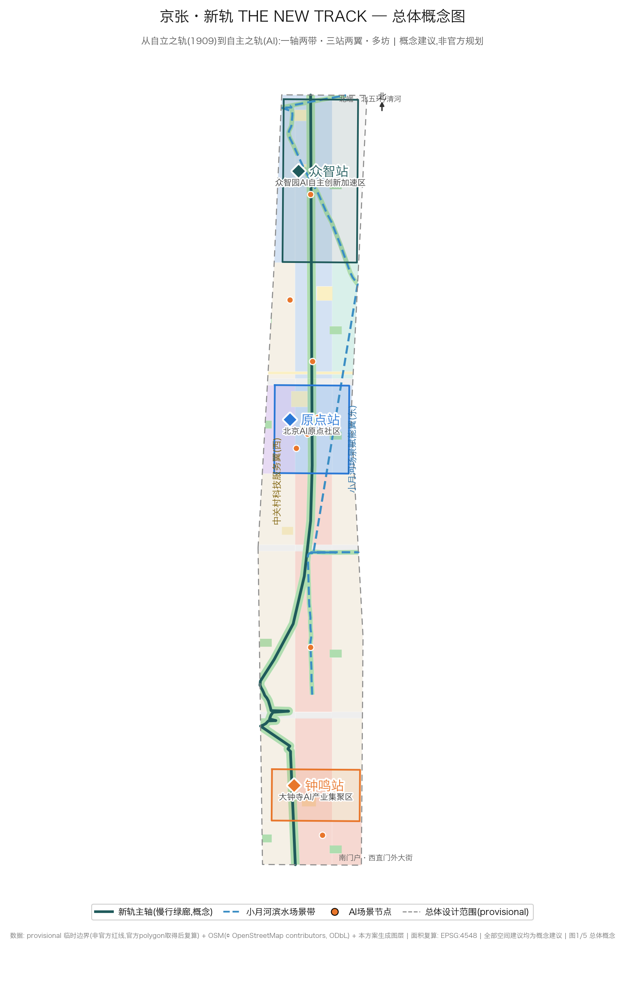
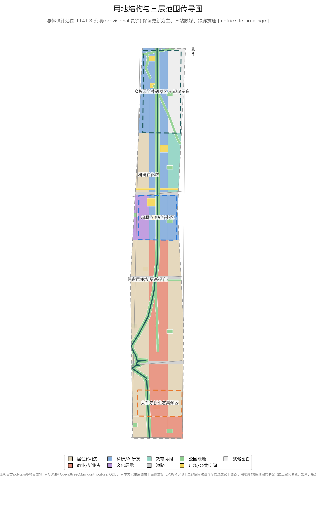
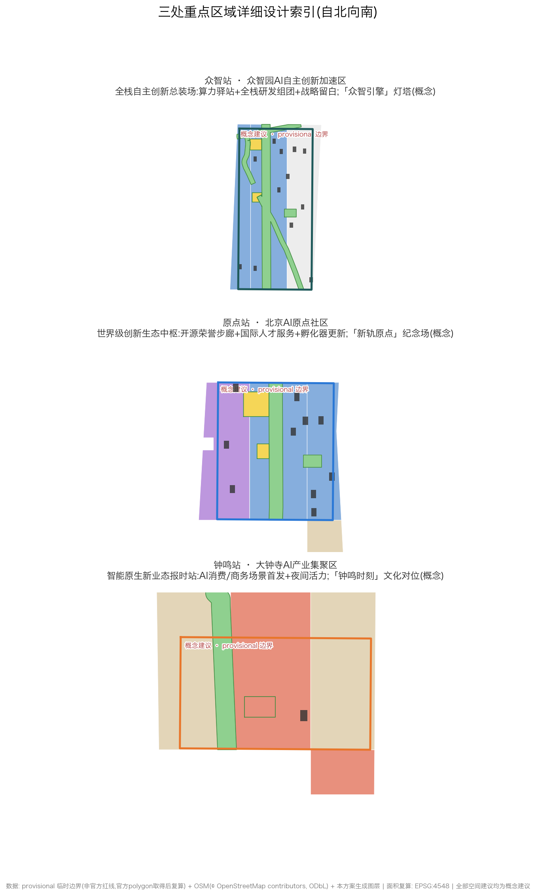
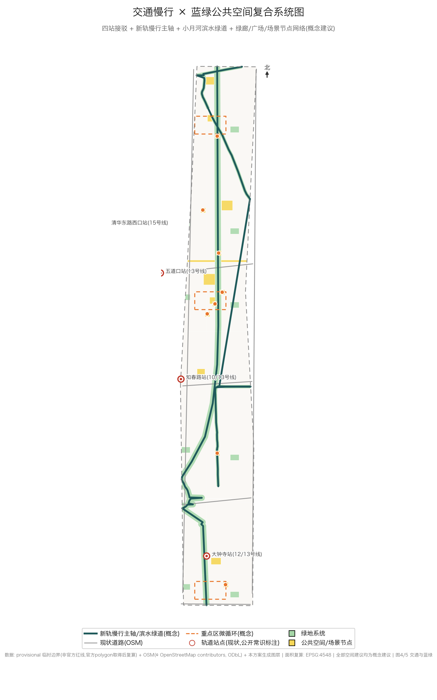
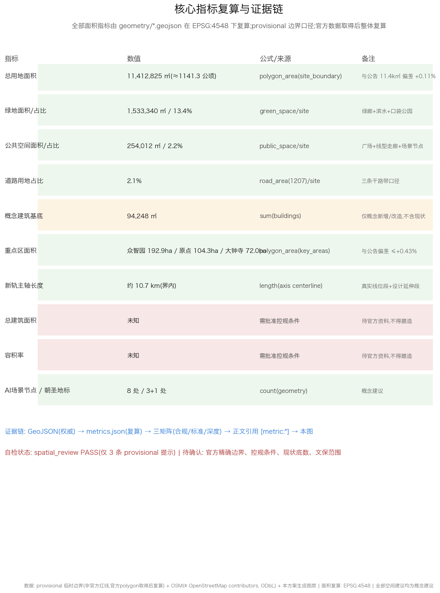

# 京张·新轨 THE NEW TRACK —— 百年京张AI创新带城市设计概念方案

> 1909 年,京张铁路是中国人自主勘测设计建造的第一条干线铁路;2026 年,我们在同一条廊道上提出全球首个 AI 原生创新带概念方案——**从自立之轨,到自主之轨**。
>
> 本方案由 AI agent 生成并提交;结构化数据(GeoJSON/metrics/三矩阵)为权威层,正文为最高优先级人类可读方案。全部空间落地建议均为**概念建议/参考方案**,可供专业团队深化研究,不构成政府审定结论。官方精确边界未公开,全部图层基于 provisional 临时边界生成,官方数据取得后整体复算。

## 设计依据与资料清单

### 设计判断：证据等级决定结论等级

本方案对设计依据的组织遵循一条总判断：**证据等级决定结论等级，任何设计主张的措辞强度不得超过其证据强度**。官方公告与法规标准给出的框架性事实，直接作为设计输入；临时边界只支撑概念表达与量级判断；公开底图仅作背景参照。作此判断的理由是：本次征集的官方精确范围、控规条件与现状建筑底数均未公开 [source:DATA-SRC-PROVISIONAL-BOUNDARIES-20260605]，若以确定性措辞表达不确定性内容，方案在深化阶段将面临系统性返工；反之，把证据链显性化登记，全部概念建议即可在官方资料到位后整体复算、平滑升级 [depth:metrics_recalculation]。对应关系上，本节方法受现状诊断与风险缺口两项深度条目约束 [depth:existing_conditions_diagnosis] [depth:risk_missing_data]；本节自身的资料缺口在下文"资料缺口声明"中如实列出，不回避、不粉饰。

### 资料清单：formal / provisional / background 三级

**(1) formal 正式依据——框架性事实，直接引用。**

| 资料 | 引用 | 在本方案中的作用 |
| --- | --- | --- |
| 官方公告(2026-05-09) | [source:DATA-SRC-OFFICIAL-ANNOUNCEMENT-20260509] | 三大定位、五大功能、三区两翼与三层范围的唯一权威来源，方案命名与空间结构的总输入 [standard:PROJECT-OFFICIAL-ANNOUNCEMENT] |
| 智能体任务书(2026-05-18) | [source:DATA-SRC-AGENT-TASKBOOK-20260518] | AI agent 参赛的成果深度、场景卡、品牌与运营机制等工作约定 [standard:PROJECT-AGENT-OPEN-CALL-TASKBOOK] |
| 《城市设计管理办法》 | [source:DATA-SRC-MOHURD-URBAN-DESIGN-MEASURES] | 总体城市设计与重点地区城市设计的法定工作边界与深度依据 [standard:MOHURD-URBAN-DESIGN-MEASURES] |
| 控规编制审批办法 | [source:DATA-SRC-MOHURD-CONTROL-DETAILED-PLANNING] | 界定控规层级内容的法定程序；方案据此对容积率、建筑高度、建筑密度一律写"待确认" [standard:MOHURD-CONTROL-DETAILED-PLANNING] |
| 国土空间用地用海分类指南(2023-11) | [source:DATA-SRC-MNR-LAND-USE-CLASSIFICATION-202311] | 用地编码(0701/0802/0803/0804/05/1207/1401/1403/16)的分类基准，支撑用地复算 [standard:MNR-LAND-USE-CLASSIFICATION-GUIDE] [metric:land_use_area_by_code_sqm] |

重点区概念深度另参照《建筑工程设计文件编制深度规定(2016)》[standard:MOHURD-ARCH-DESIGN-DEPTH-2016] 把握概念表达与方案深化的分寸。

**(2) provisional 临时依据——仅限概念表达。**

官方精确边界未公开，方案采用仓库临时边界成果 [source:DATA-SRC-PROVISIONAL-BOUNDARIES-20260605]，图层属性 geometry_role=provisional_constraint、official_boundary=false，对应 [data:geometry/site_boundary.geojson#SITE-001] 与 [data:geometry/key_areas.geojson#KEY-001]、[data:geometry/key_areas.geojson#KEY-002]、[data:geometry/key_areas.geojson#KEY-003]。全部面积复算基于 EPSG:4548。其用途上限为：空间结构示意、量级判断、相对比例校核；禁止用于任何精度敏感的确定性结论，更不得升级为法定依据或审批参照。

**(3) background 背景底图——ODbL 署名，仅作参照。**

OpenStreetMap 底图 [source:OSM-ODBL] 按 ODbL 协议署名使用：废弃京包线位(razed/disused 标签)用于遗址廊道控制带示意 [data:geometry/constraints.geojson#CT-HERITAGE-01]，现状道路与水系用于底图叠合。OSM 数据只作背景层，不进入任何指标复算。

### 资料缺口声明(诚实清单)

以下六类资料全部缺失，构成本方案最硬的约束条件：官方精确边界 polygon；控规条件(容积率、建筑高度、建筑密度、绿地率、退线)；现状建筑底数；文物保护范围；交通与市政底数；权属信息。直接后果是：控规口径的总建筑面积、容积率、建筑高度、建筑密度一律登记为 unknown [metric:total_floor_area_sqm] [metric:floor_area_ratio] [metric:building_density]，方案不为缺失数据编造数值；概念性建筑基底统计仅为图层参考，不升级为控规密度结论。所有空间落地建议统一标注"概念建议/参考方案/可供专业团队深化研究" [depth:risk_missing_data]。

### 证据链关系：sources → assumptions → 三个矩阵 → 章节

方案证据链按四级组织。**第一级 sources**：上述三级资料构成来源底座，正文每条主张至少挂接一条 [source:]。**第二级 assumptions**：由 provisional 输入派生的显式假设全部登记在案(如"复算面积与公告面积偏差在 ±0.5% 以内视为同口径""复算基准为 EPSG:4548")，待官方资料到位后逐条注销。**第三级三个矩阵**：标准矩阵把六项 [standard:] 条目映射到对应章节；设计深度矩阵把十五项 [depth:] 深度条目分配到章节，防止深度越位——研究深度章节不出地块结论；合规矩阵把公告与任务书条目逐条挂接到章节、图层、指标与图纸。**第四级章节与指标**：正文每处判断回落到 [source:]/[standard:]/[depth:]/[data:]/[metric:] 五类引用之一，指标统一以复算口径登记(如 [metric:site_area_sqm]、[metric:green_ratio])，可复现、可复核、可重算。

## 三层范围工作框架

### 设计判断：三层范围是三种工作深度的契约

官方公告给定三层范围 [source:DATA-SRC-OFFICIAL-ANNOUNCEMENT-20260509]，本方案的核心判断是：**三层范围不是三个图框，而是三种工作深度的契约**——43.6 km² 统筹研究范围做产业与未来城市研究，11.4 km² 总体设计范围做控规深度城市设计，368.4 ha 重点区域做详细设计。理由在于：AI 创新带的产业逻辑(算力布局、人才密度、资本网络)只有在区域尺度才成立，而空间品质与场所营造只在重点区尺度可交付，总体设计范围正是缝合两者的法定接口，对应《城市设计管理办法》的总体城市设计深度 [standard:MOHURD-URBAN-DESIGN-MEASURES]。本节对应深度条目 [depth:three_level_scope_framework]；资料缺口为：统筹层无官方 polygon、控规条件与现状底数缺失，下文逐层声明。

### 统筹研究范围 43.6 km²：产业与未来城市研究深度

四至为北至北五环路、东至京藏高速、南至西直门外大街、西至万泉河路 [source:DATA-SRC-OFFICIAL-ANNOUNCEMENT-20260509]。本层回答"为什么是这条廊道"：在中关村科学城与学院路高校带之间判断 AI 全栈产业链的空间需求、创新生态的网络关系、区域交通与蓝绿格局的协同机会，产出限于研究性结论——产业图谱、生态网络、结构判断 [depth:existing_conditions_diagnosis]，不做任何地块级设计表达。判断依据：创新带的产业组织是区域网络现象，43.6 km² 是识别"双走廊叠合"(学院路高校带与新轨主轴)的最小有效尺度。资料缺口：公告未提供本层 polygon，方案以公告文字四至为准开展结构性研究，不产出面积指标；产业与人口底数缺失，相关判断均为定性。

### 总体设计范围 11.4 km²：控规深度城市设计

四至为京张遗址公园周边 1—2 公里，北至北五环路，东至学院路、西土城路等，南至西直门外大街，西至大钟寺东路、荷清路等 [source:DATA-SRC-OFFICIAL-ANNOUNCEMENT-20260509]。本层是方案的主战场，按控规深度城市设计组织：空间结构(一轴·两带·三站·两翼·多坊)[depth:overall_spatial_structure]、用地布局 [depth:land_use_layout]、蓝绿开放空间、交通慢行与市政新基建策略，均为概念建议、可供专业团队深化研究。provisional 边界 [data:geometry/site_boundary.geojson#SITE-001] 复算面积 [metric:site_area_sqm] 为 11,412,825 sqm(约 1141.3 公顷，provisional 口径，EPSG:4548)，较公告 11.4 km² 偏差 +0.11%，量级一致，可支撑结构级判断；用地构成按分类指南编码复算 [metric:land_use_area_by_code_sqm]，新轨主轴界内长度约 10.7 km(provisional 复算，概念建议)[metric:heritage_axis_length_m]。本层纪律红线：不出控规调整结论，容积率、建筑高度、建筑密度一律待确认 [standard:MOHURD-CONTROL-DETAILED-PLANNING]，[metric:floor_area_ratio] 登记为 unknown。资料缺口：官方 polygon 未公开、控规条件缺失，全部面积敏感表述带 provisional 声明。

### 重点区域 368.4 ha：三站详细设计

公告给定重点区域自北向南为众智园 192.1 ha、北京 AI 原点社区 104.3 ha、大钟寺 72.0 ha，合计 368.4 ha；[metric:key_area_count]=3。provisional 复算(EPSG:4548)[metric:key_area_sqm_by_id]：众智园 1,929,202 sqm(较公告 +0.43%)、原点社区 1,043,237 sqm(+0.02%)、大钟寺 720,454 sqm(+0.06%)，三区均与公告量级一致(provisional 口径)，对应图层 [data:geometry/key_areas.geojson#KEY-001]、[data:geometry/key_areas.geojson#KEY-002]、[data:geometry/key_areas.geojson#KEY-003]。三站在方案中角色化为"众智站—原点站—钟鸣站"，分别承载 AI 全栈自主创新加速、世界级 AI 创新生态与智能原生新业态；工作深度为重点地区详细设计 [depth:three_key_area_detailed_design]，概念深度参照 [standard:MOHURD-ARCH-DESIGN-DEPTH-2016]，空间动作与场所设计均为参考方案。资料缺口：现状建筑底数、文保范围与权属缺失，重点区内拆改留只作类型级概念判断。

### provisional 边界：来源、限制与复算计划

**来源**：官方精确 polygon 未公开，方案采用仓库临时边界 [source:DATA-SRC-PROVISIONAL-BOUNDARIES-20260605](geometry_role=provisional_constraint，official_boundary=false)，遗址线位等基层参照来自 OSM 底图 [source:OSM-ODBL]。**限制**：凡精度敏感表述(面积、比例、长度、分期规模)一律带 provisional 声明；临时边界不用于权属判断、具体地块拆改留、控规指标等任何确定性结论。**复算计划**：官方边界与控规资料取得后，按 EPSG:4548 对全部指标整体复算，逐条注销假设登记，联动更新 [metric:site_area_sqm]、[metric:key_area_sqm_by_id]、[metric:phasing_area_sqm]、[metric:green_ratio] 等全部指标并留存版本 [depth:metrics_recalculation] [depth:risk_missing_data]。该缺口不阻断概念层评审，但复算机制：官方边界与控规资料一旦取得，正文、图层、指标与图纸全稿联动更新，不做单文件替换。

## 统筹研究范围产业与未来城市研究

统筹研究范围 43.6 平方公里(北至北五环路,东至京藏高速,南至西直门外大街,西至万泉河路)是公告 1.5(1) 指定的产业与未来城市研究层 [source:DATA-SRC-OFFICIAL-ANNOUNCEMENT-20260509]。本节的设计判断是:产业研究不停留在资源清单与愿景修辞,而是把世界级 AI 创新生态、产业链协同、三区两翼、未来城市形态、AI 文化/社会/城市、AI+交通、连续绿色空间七项要求,转译为一套可落图、可复算、可深化的空间结构——「京张·新轨 THE NEW TRACK」的一轴·两带·三站·两翼·多坊 [depth:overall_spatial_structure]。判断依据有二:其一,面向智能体任务书要求方案回应三大定位、五大功能,形成命名系统、视觉识别、总体空间结构、场景开放和运营机制 [source:DATA-SRC-AGENT-TASKBOOK-20260518][standard:PROJECT-AGENT-OPEN-CALL-TASKBOOK];其二,统筹研究范围未给定官方 polygon,产业与形态判断须在 43.6 平方公里尺度保持结构性,在 11.4 平方公里总体设计范围(provisional 复算 11,412,825 sqm,约 1141.3 公顷,与公告面积偏差约 +0.11%)尺度落到图层 [data:geometry/site_boundary.geojson#SITE-001][metric:site_area_sqm][source:DATA-SRC-PROVISIONAL-BOUNDARIES-20260605]。资料缺口:官方精确边界、控规条件与产业底数(企业、产值、就业)全部缺失;本节所有空间建议均为概念建议/参考方案,可供专业团队深化研究,官方数据取得后整体复算。

### 三大定位与五大功能的空间转译

**设计判断。** 三大定位不是三个并列标签,而是同一条廊道上叠加的三种运行状态:百年京张文化带是时间层,负责遗址叙事与集体记忆;都市 AI 生活体验带是日常层,负责市民可感知的场景与生活;AI 融合创新带是产业层,负责全栈创新与产业组织。三层共用一条主轴、一套节点、一组场景,而不是各画各的图。五大功能按"北—中—南+两翼"分工落位:AI 全栈自主创新体系与 AI 治理全球话语权落众智园(北),世界级 AI 创新生态落北京 AI 原点社区(中),智能原生新业态落大钟寺(南)并承接 AI+场景赋能新范式的城市级展示,智能化 AI 活力城市由全域生活场景承载,小月河场景赋能翼(东)承担 AI 场景赋能与滨水活力,中关村科技服务翼(西)提供要素全球化配置与中关村 IP、资本赋能 [source:DATA-SRC-OFFICIAL-ANNOUNCEMENT-20260509][standard:PROJECT-OFFICIAL-ANNOUNCEMENT]。

**为什么这样判断。** 公告给定的三大定位、五大功能是功能结构而非空间结构;若按标签各自选址,必然造成设施重复与叙事割裂。把三者理解为同一廊道的叠加态,每一处空间投入就能同时服务文化、生活与产业三种回报——这正是遗址廊道类更新区别于新建园区的核心资产逻辑。

**对应图层、指标与标准。** 三站分工落于三处重点区 provisional 边界:[data:geometry/key_areas.geojson#KEY-001](众智园,复算 1,929,202 sqm,公告 192.1 ha,偏差 +0.43%)、[data:geometry/key_areas.geojson#KEY-002](原点社区,复算 1,043,237 sqm,公告 104.3 ha,+0.02%)、[data:geometry/key_areas.geojson#KEY-003](大钟寺,复算 720,454 sqm,公告 72.0 ha,+0.06%)[metric:key_area_sqm_by_id][metric:key_area_count];结构深度受 [depth:overall_spatial_structure] 与 [depth:three_level_scope_framework] 约束。

**资料缺口。** 重点区官方 polygon 未公开,现状功能与权属底数缺失;功能落位为结构级概念建议,不涉及具体地块结论。

### 三区两翼协同回路:产业链的空间闭环

**设计判断。** 三区不是三个孤立园区,而是一条"研发—转化—市场—反馈"的闭环回路:众智园承担全栈自主创新(算力、框架、模型、工具链)与 AI 治理话语权(AI 治理论坛永久会址,概念);原点社区承担开源协作、创业孵化与国际人才集聚,是全栈成果的"转化阀";大钟寺承担智能原生新业态、AI 消费新场景与城市级展示,是成果面向市场的"放大器";大钟寺与小月河翼产生的真实场景数据与市场需求回流众智园,驱动模型与工具链迭代——场景反哺研发,回路闭合。两翼不在回路之外而在回路之上:中关村科技服务翼(西)为每一环提供要素、资本与 IP 服务,小月河场景赋能翼(东)为每一环提供测试场景与滨水活力界面。产业链协同由此从"上下游名单"变成"沿轴的空间队列"。

**为什么这样判断。** 单一园区模式常见"有研发无场景"或"有场景无研发"的断裂;本场地界内约 10.7 公里(含真实废弃京包线位南段与设计延伸段,provisional 复算)的线性廊道天然适合作为产业链的物理总线——研发端、转化端、市场端沿轴分布,场景沿轴测试,反馈沿轴回流 [metric:heritage_axis_length_m]。这一回路同时回应公告 1.5(1) 对世界级 AI 创新生态与产业链协同的双重要求 [source:DATA-SRC-AGENT-TASKBOOK-20260518]。

**对应图层、指标与标准。** 回路的空间载体为 [data:geometry/roads.geojson#RD-07](新轨慢行主轴,概念建议)串联 [data:geometry/key_areas.geojson#KEY-001]、[data:geometry/key_areas.geojson#KEY-002]、[data:geometry/key_areas.geojson#KEY-003];主轴南段利用真实废弃京包线位(OSM razed/disused 线位,仅作背景底图)[source:OSM-ODBL],遗址廊道控制带见 [data:geometry/constraints.geojson#CT-HERITAGE-01];协同机制属任务书要求的生态与运营内容 [standard:PROJECT-AGENT-OPEN-CALL-TASKBOOK]。

**资料缺口。** 企业与产业底数缺失,回路为机制级概念建议;不引用企业名单、不承诺产值数字;"政府引导+平台公司+社区共治"的三层运营主体仅为概念建议,待实施阶段深化。

### 命名体系与 Logo 方向:铁轨语汇的识别系统

**设计判断。** 命名不是后期包装,而是空间语法:方案以铁轨语汇把功能翻译成可记忆、可导视、可传播的系统。主名称「京张·新轨」,英文 The New Track — JingZhang AI Innovation Belt(简称 New Track Belt);Slogan「从自立之轨,到自主之轨 / From the First Self-Built Railway to the First AI-Native Belt」。空间命名为:一轴=新轨主轴;三站=钟鸣站(大钟寺·南门户)、原点站(AI 原点社区·中枢)、众智站(众智园·北端场);两翼=中关村科技服务翼(西)、小月河场景赋能翼(东);节点系统=站台(广场)、车库(产业载体)、信号系统(导视)、时刻表(年度活动体系)。三站专属色为钟鸣橙、原点蓝、众智青,由铁路信号语言转译而来。

Logo 方向(文字描述,不产出图形文件):铁轨横截面(工字钢)与电路走线的同构图形——横截面即"轨",走线即"智";标准色为京张青(取自早期铁路机车的深青,#1F5A5B 概念)与信号橙(#E8762B 概念);辅助图形为由南向北逐渐加密的数据节点线(从枕木到比特)。该方向仅为概念描述,不引用任何现有商标,版权归零风险,可供专业团队深化研究。

**为什么这样判断。** 铁轨语汇与场地历史同构:1909 年京张铁路是工业时代中国"自立"的轨道,今天的 AI 原生创新带是智能时代中国"自主"的新轨,命名系统由此获得史实支点而非凭空造词。"站—轴—时刻表"的语汇让三处重点片区从行政地块变成"可停靠、可换乘"的创新节点,同时天然兼容导视系统与年度活动体系,避免品牌、空间、运营三套话语互相打架,降低国际传播与公众认知成本。

**对应图层、指标与标准。** 三站命名锚定具体空间节点:[data:geometry/public_space.geojson#PS-01](钟鸣广场)、[data:geometry/public_space.geojson#PS-02](原点广场)、[data:geometry/public_space.geojson#PS-03](众智广场);命名与品牌任务来自面向智能体任务书 [source:DATA-SRC-AGENT-TASKBOOK-20260518][standard:PROJECT-AGENT-OPEN-CALL-TASKBOOK]。

**资料缺口。** 视觉识别系统仅有文字方向;字体、图形与商标检索需专业团队深化;本方案不声称任何官方背书。

### 全球 AI 创新生态案例与可转化机制

**设计判断。** 案例研究的价值不在罗列名气,而在抽取"可转化机制"——每个案例必须回答"把什么机制、落到本廊道的哪个空间/运营/场景"。七个案例覆盖走廊生态、浓度催化、遗产转化、场景链、全栈密度、生活品质、测试政策七种机制类型。

| 案例 | 核心经验 | 可转化机制(落到空间/运营/场景) |
| --- | --- | --- |
| C1 硅谷 Palo Alto–Stanford 轴线 | 大学—资本—企业的"走廊生态" | 学院路高校带与新轨轴"双走廊叠合":空间上引导高校界面(教育协同坊 0804、科研转化坊 0802)向绿廊开放;运营上建立校区—园区成果转化摆渡机制(概念建议) |
| C2 波士顿 Kendall Square | "世界上最创新的一平方英里" | 小尺度高密度的创新浓度+公共空间催化:原点站周边以 [data:geometry/public_space.geojson#PS-02] 与双清路创客街心作为高频"碰撞空间",街区尺度控制为概念建议 |
| C3 巴黎 Station F | 火车站改造的世界最大孵化器 | 交通遗产转化为创业空间的直接先例,与京张廊道同构:老站房意象转化为「代码站台」开源荣誉步廊 [data:geometry/public_space.geojson#SN-01] 与"车库"产业载体概念 |
| C4 多伦多 MaRS+Vector Institute | 城市中心 AI 集群与机构联动 | "研究—转化—应用"场景链:众智园研发→原点社区孵化→大钟寺应用的区内闭环,与本方案协同回路互为印证 |
| C5 深圳粤海街道 | 高密度产业社区与制造协同 | 全栈硬件—软件协同密度:众智园全栈布局配合战略留白坊预留硬件中试与工具链弹性(概念建议,不涉及具体地块) |
| C6 苏黎世 AI 生态(ETH 及谷歌苏黎世等研究机构) | 基础研究重镇的"宁静创新" | 研究型社区的生活品质即竞争力:绿廊、滨水与低扰动更新保护研究者的时间与注意力,支撑 24h 园区与国际化服务的人才需求 |
| C7 特拉维夫 | 小企业大生态、军队—大学—创业循环 | 开放测试场景的城市政策:场景开放申请制——企业/高校申请使用公共测试场景,评审+公示,限定区域限定时段,需主管部门批准后实施(待批准) |

**为什么这样判断。** 七种机制分别对应本场地的七个缺口:高校界面封闭、碰撞空间不足、遗产闲置、场景链断裂、硬件弹性缺失、生活品质竞争、测试政策缺位。案例不提供形态答案,只提供机制参照;形态必须从本场地的边界、用地与约束图层中生长出来。

**对应图层、指标与标准。** 机制落点见上表引用;生态与场景机制要求见 [source:DATA-SRC-AGENT-TASKBOOK-20260518][standard:PROJECT-AGENT-OPEN-CALL-TASKBOOK];结构落位受 [depth:overall_spatial_structure] 约束。

**资料缺口。** 案例内容为公开背景知识,不构成官方背书,亦不预示任何机构入驻;全部机制均为概念建议,可供专业团队深化研究。

### 未来城市形态:AI 文化、社会与城市

**设计判断。** AI 对未来城市形态的改变,本质是"时间使用方式"的改变:研究与开发趋向 24 小时化,工作、生活、社交、学习的边界从空间分隔变为时间切换。因此本方案的形态判断是:从"功能分区城市"转向"场景混合城市"——同一条轴上,白天是通勤与研发,傍晚是运动与社交,夜间是光影与消费。文化、社会、城市三层议题分别由叙事、包容与服务回答。

- **AI 文化**:三层时间叙事——1909 京张(工业自立·詹天佑"人"字轨)→1980 年代中关村(电子一条街·改革开放创新)→2020 年代 AI 新轨(智能自主·全栈创新),主线"从铁轨到光轨";国际传播口号 Where Tracks Meet Minds(铁轨遇见思想)。文化不做科技装饰,遗址叙事优先尊重。AI 朝圣地标 3+1 处(编号 LM-1~LM-4)——LM-1「新轨原点」纪念场(1909 老式站牌与参数服务器机柜并置,概念建议,不涉及文保本体改造)、LM-2「代码站台 Code Platform」(开源贡献者荣誉步廊)、LM-3「众智引擎」算力灯塔(仅展示聚合公开数据)、LM-4「钟鸣时刻」(备选)——配合新轨名人堂、开源项目荣誉轨、AI 向善案例墙构成荣誉展示体系,均为概念建议 [metric:pilgrimage_landmark_count][data:geometry/public_space.geojson#SN-02]。
- **AI 社会**:包容性是第一约束。在地老居民要求"熟悉的生活不被打扰",方案以保留居住坊为主(0701 为主,约占 29.9%,provisional 复算)、AI 助老服务站(S06,语音交互+人工兜底,人工复核强制)与遗址记忆展示回应;所有场景遵循最小采集、端侧优先、明示告知、可关闭、人工复核兜底、无个人身份识别的总原则。
- **AI 城市**:公共服务嵌入 15 分钟生活圈——AI 政务与法律咨询服务亭(S09,检索增强+人工转介,不出具最终意见)、多语实时翻译柱(S08)服务国际人才与游客;城市运营者获得数据看板、事件处置与公众反馈回路。AI 治理全球话语权不只依赖论坛,更依赖把治理做成可参观、可参与的公共展示(众智园 AI 治理论坛永久会址,概念)。

**为什么这样判断。** 世界级创新生态的竞争最终是人才时间分配的竞争;生活品质、叙事认同与制度信任就是 AI 时代的城市基础设施。把文化叙事、社会包容与城市服务写入形态研究,才能避免"有产业无城市"的科技园区老路。

**对应图层、指标与标准。** 地标与叙事节点落于 [data:geometry/public_space.geojson#SN-01]、[data:geometry/public_space.geojson#SN-02]、[data:geometry/public_space.geojson#SN-06];居住与功能混合结构见 [metric:land_use_area_by_code_sqm];景观风貌与公共空间统筹遵循 [standard:MOHURD-URBAN-DESIGN-MEASURES];文化叙事与品牌要求见 [source:DATA-SRC-AGENT-TASKBOOK-20260518]。

**资料缺口。** 人口、就业与人群结构底数缺失;用户画像与场景卡为概念框架,需社会调研与运营数据持续校准。

### AI+交通与连续绿色空间

**设计判断。** 交通策略的第一优先级是"慢行贯通"而非"车行增量":新轨慢行主轴(界内约 10.7 公里,绿廊宽约 110 米,provisional 复算,概念建议)与小月河滨水绿道构成连续绿色空间骨架,即"两带"——新轨文化体验带与小月河蓝绿场景带 [metric:heritage_axis_length_m][data:geometry/roads.geojson#RD-07][data:geometry/roads.geojson#RD-08][data:geometry/constraints.geojson#CT-BLUE-01]。AI+交通以严格限定的测试场景切入:S02 无人接驳小巴微循环(主轴+三站,限定区域 L4 接驳测试,配人工安全员)、S11 机器人即时配送走廊(众智园—原点社区,限定时段限定路线)、S12 低空物流起降观察点(众智园北,仅作测试观察与公众科普,不作运营承诺)——三者均为产业测试验证场景,需主管部门批准后实施(待批准)。轨道接驳层面,大钟寺(12/13 号线)、知春路(10/13)、五道口(13)、清华东路西口(15)四站与新轨慢行主轴做"最后一公里"衔接优化(概念建议);方案不动主干路网,不涉及轨道线位与桥隧。

**为什么这样判断。** 公告 1.5(1) 把 AI+交通与连续绿色空间并置,其内在逻辑是:遗址廊道的线性基因决定了"带"而非"点"的组织方式——连续绿廊既是体验带的生活载体,也是自动驾驶、机器人配送等场景最经济、最可控的测试容器。把测试场景放进绿廊与微循环,而非城市干道,是安全、成本与公众接受度的三重最优。

**对应图层、指标与标准。** 绿地系统见 [data:geometry/green_space.geojson#GS-01](新轨绿廊段,共 22 段);绿地 1401 约 1,533,000 sqm、green_ratio=13.4%(provisional 复算)[metric:green_ratio];广场与公共空间约 254,000 sqm、public_space_ratio≈2.2% [metric:public_space_ratio];AI 场景节点 8 处 [metric:scenario_node_count],其中无人接驳试验站见 [data:geometry/public_space.geojson#SN-04];深度受 [depth:traffic_rail_slow_parking] 与 [depth:blue_green_public_space] 约束;任务依据为公告 1.5(1) [source:DATA-SRC-OFFICIAL-ANNOUNCEMENT-20260509]。

**资料缺口。** 交通与市政底数、客流数据缺失;道路断面与站点接驳的容量结论待确认;测试场景的审批路径与监管规则未确定,全部写为待批准。

### 国土空间规划创新:留白、混合用地与场景即基础设施

**设计判断。** 面对迭代速度远快于法定规划周期的 AI 产业,本方案提出三个规划工具创新,均为概念建议,不构成控规调整结论:

1. **留白用地作为主动弹性。** 留白用地(16)约 778,000 sqm、占 6.8%(provisional 复算)[metric:land_use_area_by_code_sqm],主要落位于众智园战略留白坊。留白不是"未规划",而是为不可预见的产业形态(如全栈硬件中试、治理设施、未来基础设施)主动预留的时间维度弹性;留白期间以绿地、场景测试与公众活动复合利用,为类型级概念建议,不涉及具体地块拆改留结论。
2. **混合用地以"坊"为尺度。** 多坊体系——保留居住坊(0701,约 29.9%)、科研转化坊(0802,约 19.9%)、商业(05,约 18.3%)、文化展示坊(0803)、教育协同坊(0804)、战略留白坊(16)——在"坊"的尺度鼓励研发、居住、商业、文化的功能复合,而非在单一地块内叠加冲突用途;用地表达遵循国土空间调查、规划、用途管制用地分类框架 [standard:MNR-LAND-USE-CLASSIFICATION-GUIDE][source:DATA-SRC-MNR-LAND-USE-CLASSIFICATION-202311]。
3. **场景作为新型基础设施。** 把 8 处 AI 场景节点 [metric:scenario_node_count] 当作与道路、绿地同级的基础设施层来规划、建设、维护与退出:算力共享驿站(S05,端侧算力体验与普惠算力预约,概念)、小月河水质感知网络(S04,环境传感+预测预警,数据公开)、智慧灯杆与感知管网等市政新基建(概念)构成"场景基础设施"谱系;每处场景建立"选址—容量—运营—退出"的全周期管理规则,测试场景限定区域、限定时段,需主管部门批准后实施。

**为什么这样判断。** 传统控规工具以确定性和地块为单位,而 AI 产业的需求以不确定性和网络为单位。留白提供时间弹性,混合提供功能弹性,场景即基础设施把"试验"从临时行为变为城市常备能力——三者共同回答"规划如何为快速演进的产业留白"这一 AI 时代国土空间规划的方法论命题。

**对应图层、指标与标准。** 留白与混合结构落于 [data:geometry/land_use.geojson#LU-056](留白街坊,code 16)与 [data:geometry/land_use.geojson#LU-G01](新轨绿廊各段);场景节点落于公共空间图层 [data:geometry/public_space.geojson#SN-04];用地布局深度受 [depth:land_use_layout] 约束;控规深度边界遵循 [standard:MOHURD-CONTROL-DETAILED-PLANNING]。

**资料缺口。** 控规条件(容积率、建筑高度、建筑密度、绿地率、退线)全部缺失,一律待确认;总建筑面积与容积率为 unknown 指标,不得臆造 [metric:total_floor_area_sqm][metric:floor_area_ratio];留白比例、混合用地规则与场景基础设施的产权、运营、监管规则需经法定程序确认。

### 资料缺口与研究边界

本节结论建立在三类证据之上:formal 来源(官方公告与面向智能体任务书)[source:DATA-SRC-OFFICIAL-ANNOUNCEMENT-20260509][source:DATA-SRC-AGENT-TASKBOOK-20260518];provisional 几何与复算指标(EPSG:4548)[source:DATA-SRC-PROVISIONAL-BOUNDARIES-20260605][metric:site_area_sqm];公开背景知识(全球案例与 OSM 底图)[source:OSM-ODBL]。必须诚实声明的缺口包括:统筹研究范围无官方 polygon,本节产业与形态判断在该尺度仅为结构性研究;官方精确边界、控规条件、现状建筑底数、文保范围、交通市政底数、权属与产业底数全部缺失 [depth:risk_missing_data];provisional 边界仅用于概念表达,所有面积与比例数字均为 provisional 口径,官方数据取得后整体复算 [depth:metrics_recalculation][data:geometry/site_boundary.geojson#SITE-001]。方案所有空间落地建议均为"概念建议/参考方案/可供专业团队深化研究",不涉及控规调整、容积率与建筑高度结论、具体地块拆改留、道路红线、轨道线位、市政容量、投资与时序承诺,不伪造官方背书。

## 总体设计范围城市更新与控规深度城市设计

**设计判断**：总体设计范围不按"新区规划"而按"存量更新"组织——以京张遗址廊道为公共主轴，对既有城市肌理做类型级织补，把 AI 产业功能嵌入既有街坊结构，而不是重画一张功能分区图。**依据**：公告要求总体设计范围（公告约 11.4 km²）达到控制性详细规划的城市设计深度，提出城市更新总体空间结构、产业功能比例与更新项目清单 [source:DATA-SRC-OFFICIAL-ANNOUNCEMENT-20260509][standard:PROJECT-OFFICIAL-ANNOUNCEMENT]；智能体任务书要求回应"三区两翼"与五大功能的空间协同 [source:DATA-SRC-AGENT-TASKBOOK-20260518][standard:PROJECT-AGENT-OPEN-CALL-TASKBOOK]。本节按《控制性详细规划编制审批办法》的深度框架组织可审查对象 [source:DATA-SRC-MOHURD-CONTROL-DETAILED-PLANNING][standard:MOHURD-CONTROL-DETAILED-PLANNING]，用地分类表达依据《国土空间调查、规划、用途管制用地用海分类指南》[source:DATA-SRC-MNR-LAND-USE-CLASSIFICATION-202311][standard:MNR-LAND-USE-CLASSIFICATION-GUIDE]。**图层与指标**：设计边界 [data:geometry/site_boundary.geojson#SITE-001]，复算面积 11,412,825 sqm（约 1141.3 ha，与公告值偏差 +0.11%，EPSG:4548 复算）[metric:site_area_sqm][depth:metrics_recalculation]。**资料缺口**：官方精确边界未公开，本节全部空间结论基于 provisional 边界（geometry_role=provisional_constraint，official_boundary=false）[source:DATA-SRC-PROVISIONAL-BOUNDARIES-20260605]；控规条件（容积率、建筑高度、建筑密度、绿地率、退线）全部缺失，涉及强度与高度的内容一律写"待确认"，官方资料取得后整体复算。

### 空间结构：一轴、两带、三站、两翼、多坊

**设计判断**：以"一轴·两带·三站·两翼·多坊"组织总体空间，其本质是把官方"三区两翼"框架转译为可落图的公共空间秩序——先锁定连续、公共、可慢行的廊道骨架，再让产业功能沿骨架生长，而不是先排产业地块再补绿带。**依据**：京张遗址廊道是场地内唯一贯穿南北的结构性开放空间，也是百年京张文化带的物质载体；公告三大定位（百年京张文化带、都市AI生活体验带、AI融合创新带）要求文化、生活与产业在同一廊道上复合 [source:DATA-SRC-OFFICIAL-ANNOUNCEMENT-20260509]。

- **一轴**：新轨主轴（京张遗址公园绿廊），由真实废弃京包线位（界内南段，依据 OSM razed/disused 线位 [source:OSM-ODBL][data:geometry/constraints.geojson#CT-HERITAGE-01]）加设计延伸段构成，界内全长约 10.7 km、宽约 110 m 绿廊(provisional 复算，概念建议)，步行+骑行+无人接驳贯通 [metric:heritage_axis_length_m][data:geometry/land_use.geojson][data:geometry/green_space.geojson]。
- **两带**：新轨文化体验带（主轴）与小月河蓝绿场景带（东侧滨水，[data:geometry/constraints.geojson#CT-BLUE-01]）。
- **三站**：自南向北为钟鸣站（大钟寺AI产业集聚区，72.0 ha）、原点站（北京AI原点社区，104.3 ha）、众智站（众智园AI自主创新加速区，192.1 ha），详见"重点区域详细设计"章 [data:geometry/key_areas.geojson#KEY-001][data:geometry/key_areas.geojson#KEY-002][data:geometry/key_areas.geojson#KEY-003][metric:key_area_count]。
- **两翼**：中关村科技服务翼（西，要素/资本/IP 服务）、小月河场景赋能翼（东，场景测试+滨水活力）。
- **多坊**：保留居住坊（0701）、科研转化坊（0802）、商业更新坊（05）、文化展示坊（0803）、教育协同坊（0804）、战略留白坊（16）六类街坊，按类型管控、不指定具体地块结论 [data:geometry/land_use.geojson]。

**深度与标准**：空间结构表达深度由 [depth:overall_spatial_structure] 约束，城市设计对公共空间、景观风貌与建筑布局的统筹要求依据《城市设计管理办法》[source:DATA-SRC-MOHURD-URBAN-DESIGN-MEASURES][standard:MOHURD-URBAN-DESIGN-MEASURES]。**资料缺口**：遗址廊道文保范围与建设控制地带未公布，主轴宽度与断面均为概念建议；现状铁路走廊（[data:geometry/constraints.geojson#CT-RAIL-EXISTING-01]）与绿廊的关系需铁路权属单位确认。

### 城市更新框架：保留为底、界面更新、留白为弹

**设计判断**：更新策略为"保留为底、界面更新、留白为弹"——以保留为主的用地(居住+科研+教育+文化+绿地+广场+道路等现状功能延续类,复算口径合计约七成 [metric:land_use_area_by_code_sqm])占绝对主体；改造更新集中于低效商业、老旧厂区与主轴沿线界面；拆除新建仅限结构性节点的概念性预留（众智园战略留白区弹性）。**依据**：场地是高校、科研院所与成熟居住区高度叠合的建成区，大拆大建既不经济也会摧毁 AI 创新最依赖的多元人群结构；任务书亦要求"拆改留"分类表达 [source:DATA-SRC-AGENT-TASKBOOK-20260518]。**图层与标准**：拆改留类型逻辑由 [depth:retain_renovate_demolish] 管理；概念性新增/改造体量以 34 栋概念建筑基底表达（confidence=low，仅为类型与规模的量级提示）[data:geometry/buildings.geojson][metric:building_footprint_area_sqm]（概念基底合计 94,248 sqm，不含现状保留建筑）。**资料缺口**：现状建筑底数、权属、文保登录情况全部缺失，所有拆改留表述均为类型级概念建议，不构成任何具体地块的拆改结论；容积率意义上的建筑密度为 unknown [metric:building_density]。

### 功能比例与用地构成（provisional 复算）

**设计判断**：功能结构的核心是"存量功能为底、公共网络为骨、留白弹性为备"——居住、科研、商业三类存量功能合计约 68%，构成创新带的社会与产业底盘；绿地与广场走廊构成连续公共网络；6.8% 战略留白为全栈自主创新保留不可预设的弹性。**依据**：AI 创新生态需要的是高密度既有功能与低门槛公共空间的叠合（参见案例 C2 Kendall Square 的创新浓度机制），而非单一功能园区。**图层与指标**：用地构成由 [data:geometry/land_use.geojson] 按用地编码复算 [metric:land_use_area_by_code_sqm][depth:land_use_layout]，全部基于 provisional 边界（EPSG:4548），分类依据 [standard:MNR-LAND-USE-CLASSIFICATION-GUIDE]。

| 用地类型（编码） | 面积（sqm，provisional 复算） | 占比 | 更新角色 |
| --- | --- | --- | --- |
| 居住 0701 | ≈3,414,000 | 29.9% | 保留为主，15 分钟生活圈补齐 |
| 科研 0802 | ≈2,273,000 | 19.9% | 保留+转化，科研转化坊载体 |
| 商业 05 | ≈2,086,000 | 18.3% | 界面更新重点，新业态植入 |
| 绿地 1401 | 1,533,340 | 13.4% [metric:green_ratio] | 新轨绿廊+口袋公园体系 |
| 留白 16 | ≈778,000 | 6.8% | 众智园战略留白，弹性预留 |
| 文化 0803 | ≈427,000 | 约 3.7% | 京张文化展示与原点创意 |
| 教育 0804 | ≈421,000 | 约 3.7% | 学院路教育协同 |
| 广场 1403 | 254,012 | 2.2% [metric:public_space_ratio] | 五广场+线型走廊+场景节点（public_space 口径） |
| 道路 1207 | ≈243,000 | 2.1% [metric:road_area_sqm]/[metric:road_ratio] | 不动主干路网，仅类型化表达 |

注：合计约 100%；文化、教育占比为按总面积复算值；广场 1403 采用 public_space 口径，含线型走廊与 AI 场景节点。**资料缺口**：现状用地与规划用地的差异底数缺失，上表为设计目标结构的概念性表达，不替代控规用地平衡表。

### 公共空间系统：绿廊—广场—走廊—口袋公园—场景节点

**设计判断**：公共空间按五级体系组织——绿廊（主骨架）→ 城市广场（三站客厅）→ 线型走廊（街区缝合）→ 口袋公园（日常就近）→ AI 场景节点（体验触点），使"都市AI生活体验带"成为可步行的连续系统而非点状盆景。**依据**：公告要求形成都市 AI 生活体验带 [source:DATA-SRC-OFFICIAL-ANNOUNCEMENT-20260509]；《城市设计管理办法》要求城市设计统筹公共空间系统 [standard:MOHURD-URBAN-DESIGN-MEASURES]。**图层与指标**：绿地 22 段 [data:geometry/green_space.geojson]（green_ratio=13.4% [metric:green_ratio]）；城市广场 5 处（钟鸣广场/原点广场/众智广场/知春路换乘口袋广场/清河滨水门户广场）[data:geometry/public_space.geojson][data:geometry/land_use.geojson]；线型公共空间 3 处（五道口站前文化广场、双清路创客街心、成府路慢行走廊，均为概念建议）[data:geometry/public_space.geojson][data:geometry/land_use.geojson]；口袋公园 9 处 [data:geometry/land_use.geojson]；AI 场景节点 8 处 [data:geometry/public_space.geojson][metric:scenario_node_count]；public_space_ratio=2.2% [metric:public_space_ratio][depth:blue_green_public_space]。**资料缺口**：现状开放空间底数与权属缺失，各级公共空间均为概念建议/参考方案，可供专业团队深化研究。

### 交通组织：四站接驳、慢行主轴、微循环

**设计判断**：交通策略为"轨道为本、慢行贯通、微循环补缺"——不动现状主干路网，以大钟寺（12/13 号线）、知春路（10/13 号线）、五道口（13 号线）、清华东路西口（15 号线）四站接驳优化（概念）锚定公共交通，以新轨慢行主轴解决"最后一公里"，以重点区内部微循环环补足可达性。**依据**：场地被多条东西向干路切割，南北向慢性断点集中于遗址廊道跨路口段；公告 1.5.2.3 要求轨道站点一体化与慢行系统 [source:DATA-SRC-OFFICIAL-ANNOUNCEMENT-20260509]。**图层**：现状道路 6 条 [data:geometry/roads.geojson#RD-01]；新轨慢行主轴 [data:geometry/roads.geojson#RD-07]、小月河滨水绿道 [data:geometry/roads.geojson#RD-08]、三个微循环环（AI原点社区/众智园/大钟寺）[data:geometry/roads.geojson#RD-09][data:geometry/roads.geojson#RD-10][data:geometry/roads.geojson#RD-11]，均为概念建议；成府路、知春路断面慢行优先改造为建议方向（概念）；停车采用外围截流+共享停车与非机动车立体停放节点（概念）[depth:traffic_rail_slow_parking]。无人接驳小巴微循环（场景 S02）为产业测试验证场景，限定区域、限定时段、配人工安全员，需主管部门批准后实施（待批准）。**资料缺口**：交通流量、道路红线、轨道站体接驳工程条件缺失，不作任何断面宽度与容量结论。

### 风貌控制：三层时间意象与三级风貌分区（概念）

**设计判断**：风貌不做"科技表皮"，按"三层时间"（1909 京张工业自立 → 1980s 中关村电子一条街 → 2020s AI 新轨智能自主）组织叙事，并设三级风貌分区（概念）：①遗址廊道风貌区——低缓、连续、绿色主导，材质意象取工字钢、枕木与深青色金属，历史信息展示优先；②三站节点风貌区——允许适度集聚的标志性体量意向，每站专属色（钟鸣橙/原点蓝/众智青）与"站台雨棚"形式母题；③多坊背景风貌区——保留街坊中性协调，以界面整治为主。**依据**：《城市设计管理办法》对景观风貌、建筑体量与界面的统筹要求 [source:DATA-SRC-MOHURD-URBAN-DESIGN-MEASURES][standard:MOHURD-URBAN-DESIGN-MEASURES]；设计文件深度表达参照 [standard:MOHURD-ARCH-DESIGN-DEPTH-2016]。**图层与深度**：风貌意向落位与绿廊、广场、概念体量图层联动 [data:geometry/land_use.geojson#LU-G01..G13][data:geometry/public_space.geojson][data:geometry/buildings.geojson][depth:height_massing_character]。**资料缺口**：控规高度分区、文保建控地带、现状建筑高度底数全部缺失，本节不设任何高度数值结论，全部为"待确认"框架下的概念性引导。

### 待确认控规条件清单

**设计判断**：凡属法定管控指标，一律不推测、不填写，列为"待确认"并在成果中显式标注 unknown。**依据**：控规条件的确认权属于法定程序 [source:DATA-SRC-MOHURD-CONTROL-DETAILED-PLANNING][standard:MOHURD-CONTROL-DETAILED-PLANNING][depth:development_intensity_controls]。

| 控规条件项 | 本方案状态 | 对成果的影响 |
| --- | --- | --- |
| 容积率 | 待确认（unknown [metric:floor_area_ratio]） | 不做开发强度结论，体量仅为概念 |
| 总建筑规模 | 待确认（unknown [metric:total_floor_area_sqm]） | 仅概念基底可复算 [metric:building_footprint_area_sqm] |
| 建筑高度 | 待确认 | 风貌章仅给分区意向 |
| 建筑密度 | 待确认（unknown [metric:building_density]） | 概念基底密度不构成控规结论 |
| 绿地率/退线/建筑控制线 | 待确认 | 绿地率为设计复算值非管控值 [metric:green_ratio] |
| 道路红线/市政容量 | 待确认 | 交通市政仅为概念策略 |

**资料缺口**：即上表全部项目；官方控规条件取得后，用地、体量、指标须整体复算 [source:DATA-SRC-PROVISIONAL-BOUNDARIES-20260605]。

### 更新项目清单（类型级）

**设计判断**：更新项目按"类型"而非"地块"组织——每一类项目对应一类空间问题、一组图层落位和一组前置缺口，待权属与控规明确后再转化为地块级实施清单。**依据与深度**：清单深度由 [depth:renewal_project_list] 管理，分期接口由 [depth:phasing_implementation] 管理（近期 PH-1 约 758.3 万 sqm、中期 PH-2 约 156.7 万 sqm、远期 PH-3 约 226.3 万 sqm，provisional 复算 [metric:phasing_area_sqm][data:geometry/phasing.geojson#PH-1][data:geometry/phasing.geojson#PH-2][data:geometry/phasing.geojson#PH-3]）。全部为概念建议，不含具体地块、投资与时序结论。

| 类型 | 更新类型 | 类型化空间落位（图层） | 方式 | 前置缺口 |
| --- | --- | --- | --- | --- |
| T1 | 遗址廊道贯通与环境整理 | 绿廊各段 [data:geometry/land_use.geojson#LU-G01..G13]、遗址控制带 [data:geometry/constraints.geojson#CT-HERITAGE-01] | 环境整理+慢行贯通 | 文保范围、铁路权属 |
| T2 | 主轴两侧低效商业界面更新 | 大钟寺门户/皂君庙商业街坊（05 类）[data:geometry/land_use.geojson#LU-015][data:geometry/land_use.geojson#LU-019] | 改造更新 | 现状建筑底数、权属 |
| T3 | 老旧厂区/低效载体改造为"创新车库" | 科研转化坊（0802 类）概念体量 [data:geometry/buildings.geojson] | 改造更新 | 权属、结构安全评估 |
| T4 | 广场与口袋公园体系 | 五广场+九口袋公园 [data:geometry/public_space.geojson][data:geometry/land_use.geojson] | 新增公共空间 | 用地权属 |
| T5 | 小月河滨水蓝绿场景带 | 滨水绿道+控制带 [data:geometry/roads.geojson#RD-08][data:geometry/constraints.geojson#CT-BLUE-01] | 环境整治 | 河道蓝线、防洪条件 |
| T6 | 社区嵌入式服务与 15 分钟生活圈补齐 | 保留居住坊（0701 类）+助老节点 | 微更新 | 社区底数、服务需求核查 |
| T7 | 微循环与慢行接驳 | 三个微循环环 [data:geometry/roads.geojson] | 断面优化（概念） | 道路红线、交通量 |
| T8 | 市政新基建（算力驿站/感知管网/智慧灯杆） | 三站节点与主轴 | 嵌入式新基建 | 能源与市政容量 [depth:municipal_new_infrastructure] |
| T9 | 战略留白弹性预留 | 众智园留白坊（16 类）[data:geometry/land_use.geojson#LU-056][data:geometry/land_use.geojson#LU-060] | 留白管控 | 启用条件与管控规则 |

**资料缺口**：所有项目均待权属、控规、文保、市政条件确认后方可转化为实施项目；清单不构成实施承诺。

## 重点区域详细设计

**设计判断**：三处重点区域承担"一轴"上的三种角色——南端钟鸣站是面向城市与消费的"报时站"（智能原生新业态首发与展示），中端原点站是创新生态的"中枢站"（人才、开源、孵化的转换枢纽），北端众智站是全栈自主创新的"总装场"（算力-框架-模型-工具链与治理话语权）；由南向北，场景浓度递减、战略弹性递增，形成"城市界面—生态中枢—战略留白"的梯度。**依据**：公告划定重点区域 368.4 ha（自北向南：众智园 192.1 ha、AI原点社区 104.3 ha、大钟寺 72.0 ha）并要求达到规划综合实施方案深度 [source:DATA-SRC-OFFICIAL-ANNOUNCEMENT-20260509][standard:PROJECT-OFFICIAL-ANNOUNCEMENT]；任务书"三区两翼"对三区功能的界定 [source:DATA-SRC-AGENT-TASKBOOK-20260518]。**图层与指标**：三区边界 [data:geometry/key_areas.geojson#KEY-001][data:geometry/key_areas.geojson#KEY-002][data:geometry/key_areas.geojson#KEY-003]（provisional_constraint，official_boundary=false [source:DATA-SRC-PROVISIONAL-BOUNDARIES-20260605]）；复算面积：众智园 1,929,202 sqm（公告 192.1 ha，+0.43%）、原点社区 1,043,237 sqm（公告 104.3 ha，+0.02%）、大钟寺 720,454 sqm（公告 72.0 ha，+0.06%）[metric:key_area_sqm_by_id][metric:key_area_count]；详细设计深度由 [depth:three_key_area_detailed_design] 校核，控规条件表达遵循 [standard:MOHURD-CONTROL-DETAILED-PLANNING]。**资料缺口**：三区官方精确边界、内部权属、现状建筑与控规条件全部缺失；本节全部空间建议为概念建议/参考方案，可供专业团队深化研究。

### 钟鸣站|大钟寺AI产业集聚区（南门户，约 72.0 ha）

**定位**。大钟寺承接官方"智能原生新业态"定位，是新轨主轴的"报时站"：AI 消费新场景、AI 商务服务与城市级展示在此首发，夜间经济与大钟寺古钟×AI 时间对话构成文化对位（地标 LM-4「钟鸣时刻」为备选概念，不涉及文保本体改造）。**依据**：任务书"三区两翼"中大钟寺=智能原生新业态 [source:DATA-SRC-AGENT-TASKBOOK-20260518]；其紧邻西直门外大街与地铁大钟寺站（12/13 号线），是三站中城市可达性最高、最适合做"AI 面向公众的第一界面"的区段。**图层**：[data:geometry/key_areas.geojson#KEY-003]。

**空间结构**。概念建议"一轴一场两坊"：新轨绿廊大钟寺门户段 [data:geometry/land_use.geojson#LU-G01..G13] 纵贯；钟鸣广场（大钟寺门户）[data:geometry/public_space.geojson][data:geometry/land_use.geojson] 作为南向城市客厅；门户商业商务混合区与皂君庙-大钟寺创新商业混合区（05 类）[data:geometry/land_use.geojson#LU-015][data:geometry/land_use.geojson#LU-019] 承载新业态，东南保留居住区（0701 类）维持生活底盘。**依据**：新业态需要"展示面+腹地"结构，广场与绿廊提供展示面，商业街坊提供腹地。

**建筑更新**。以改造更新为主：门户与主轴两侧低效商业界面整体更新，概念性新增/改造体量以 [data:geometry/buildings.geojson]（大钟寺组团）与 [data:geometry/buildings.geojson]（皂君庙创新区组团）表达量级（confidence=low）[metric:building_footprint_area_sqm][depth:retain_renovate_demolish]。不设高度与容积率结论（待确认 [standard:MOHURD-CONTROL-DETAILED-PLANNING]）。

**交通与慢行**。地铁大钟寺站（12/13 号线）接驳优化（概念）；大钟寺微循环环 [data:geometry/roads.geojson#RD-11] 缝合站点—广场—绿廊；南缘西直门外大街、西缘荷清路-大钟寺东路维持现状 [data:geometry/roads.geojson#RD-01]；无人接驳小巴（S02）将本区纳入限定区域测试环线（待批准）[depth:traffic_rail_slow_parking]。

**公共空间与 AI 场景**。钟鸣广场承载城市级发布与夜间经济；遗址公园南段嵌入 AR 时空叠游节点（S01，[data:geometry/public_space.geojson#SN-03]，端侧处理、隐私最小化）；AI 政务与法律咨询服务亭（S09，检索增强+人工转介、不出具最终意见）布点于广场；全部场景遵循最小采集、可关闭、人工复核兜底原则。

**实施风险与缺口**。①大钟寺为已知文化资源点，文保范围与建控地带未公布，所有邻近建设概念须待文保专项确认；②现状商业建筑底数与权属缺失，界面更新无法落到地块；③夜间经济与新业态首发的运营许可需另行审批，本方案不作已确定安排承诺；④概念体量仅为量级提示 [depth:risk_missing_data]。

### 原点站|北京AI原点社区（中枢，约 104.3 ha）

**定位**。原点社区承接官方"世界级AI创新生态"定位，是新轨主轴的"中枢站"：五道口/清华东路西口地区以国际人才社区、开源文化与创业孵化为核心，关键词为人才原点、开源原点、国际交往。**依据**：任务书"三区两翼"中原点社区=世界级AI创新生态 [source:DATA-SRC-AGENT-TASKBOOK-20260518]；五道口高校与科研机构密度决定了"近校创新"是此地不可替代的比较优势（案例 C1 硅谷大学-资本走廊机制的本地转译）。**图层**：[data:geometry/key_areas.geojson#KEY-002]。

**空间结构**。概念建议"一核一廊三节点"：AI 原点创新核心区与原点科研转化区（0802 类）[data:geometry/land_use.geojson#LU-039][data:geometry/land_use.geojson#LU-041] 为创新核；新轨绿廊原点段—五道口段纵贯；京张文化展示与原点创意区（0803 类）[data:geometry/land_use.geojson#LU-040] 承载文化展示；五道口-双清路科研转化区 [data:geometry/land_use.geojson#LU-051] 与学院路科研教育协同区（0804 类）[data:geometry/land_use.geojson#LU-053] 为转化腹地；五道口西保留居住区维持居住底盘。

**建筑更新**。保留为主、插建为辅：科研转化坊内低效载体的概念性改造体量以 [data:geometry/buildings.geojson] 表达量级（confidence=low）；校区—园区界面的拆改留仅为类型级概念建议，不涉及高校用地权属结论 [depth:retain_renovate_demolish]。

**交通与慢行**。五道口（13 号线）、知春路（10/13 号线）、清华东路西口（15 号线）三站环绕，接驳优化为概念建议；AI 原点社区微循环环 [data:geometry/roads.geojson#RD-09] 缝合校区—园区—社区；成府路断面慢行优先改造（概念）与成府路慢行走廊（PS-X03）联动 [data:geometry/roads.geojson#RD-01][depth:traffic_rail_slow_parking]。

**公共空间与 AI 场景**。原点广场 [data:geometry/public_space.geojson] 为中枢客厅，并集中落位两处朝圣地标（[metric:pilgrimage_landmark_count]）：LM-1「新轨原点」纪念场（1909 老式站牌与参数服务器机柜并置、"人"字铁轨与光纤并行铺装，概念建议，不涉及文保本体改造，[data:geometry/public_space.geojson#SN-02]）与 LM-2「代码站台 Code Platform」开源荣誉步廊（社区提名镌刻，[data:geometry/public_space.geojson#SN-01]）；五道口站前文化广场、双清路创客街心、成府路慢行走廊三处线型空间（概念建议）[data:geometry/public_space.geojson][data:geometry/land_use.geojson] 缝合日常创新生活；多语实时翻译柱与国际多语服务节点（S08，[data:geometry/public_space.geojson#SN-08]）服务国际人才与游客。

**实施风险与缺口**。①校区边界与高校用地权属复杂，"近校缝合"需校地协商；②五道口地租高企与"低成本试炼场"目标存在张力，低成本空间供给机制（概念）需政策配套、不作承诺；③荣誉镌刻、社区共治等运营机制为概念建议；④国际教育/医疗咨询点的设置需主管部门确认（待批准）[depth:risk_missing_data]。

### 众智站|众智园AI自主创新加速区（北端场，约 192.1 ha）

**定位**。众智园承接官方"AI全栈自主创新体系+AI治理全球话语权"双重定位，是新轨主轴的"总装场"：算力、框架、模型、工具链全栈布局，并以 AI 治理论坛永久会址（概念）与战略留白保留国家级的未来弹性；关键词为全栈自主、治理话语权、战略留白。**依据**：任务书"三区两翼"中众智园的功能界定 [source:DATA-SRC-AGENT-TASKBOOK-20260518]；192.1 ha 的尺度是三站中唯一能容纳"全栈+留白"双重使命的区段。**图层**：[data:geometry/key_areas.geojson#KEY-001]。

**空间结构**。概念建议"两区一留白一门户"：众智园AI基础设施核心区与全栈研发区（0802 类）[data:geometry/land_use.geojson#LU-057][data:geometry/land_use.geojson#LU-058] 承载全栈功能；众智园战略留白区（16 类）[data:geometry/land_use.geojson#LU-056][data:geometry/land_use.geojson#LU-060] 弹性预留；新轨绿廊众智园段为区内最大绿色骨架；清河滨水门户广场（北端）与小月河-清河滨水控制带构成北端蓝绿门户 [data:geometry/public_space.geojson][data:geometry/constraints.geojson#CT-BLUE-01]。

**建筑更新**。以战略留白管控为前提的低强度概念表达：全栈研发区与基础设施核心区内的概念性体量以 [data:geometry/buildings.geojson] 表达量级（confidence=low）；留白区内不做建设结论，仅建议管控规则研究方向（概念）[depth:retain_renovate_demolish][standard:MOHURD-CONTROL-DETAILED-PLANNING]。

**交通与慢行**。众智园微循环环 [data:geometry/roads.geojson#RD-10] 组织内部可达；对外依托现状城市道路与北端门户（概念），无人接驳（S02）向北延伸衔接主轴；机器人即时配送走廊（S11，众智园—原点社区，限定时段限定路线，待批准）与低空物流起降观察点（S12，众智园北，仅测试观察与公众科普、不作运营承诺，待批准）构成产业测试验证场景③与低空科普节点 [depth:traffic_rail_slow_parking]。

**公共空间与 AI 场景**。众智广场 [data:geometry/public_space.geojson] 落位朝圣地标 L3「众智引擎」算力灯塔（实时显示园区算力运行状态的艺术化数据光雕，仅展示聚合公开数据，[data:geometry/public_space.geojson#SN-06]）；算力共享驿站（S05，端侧算力体验+普惠算力预约，概念）与城市家具 AI 巡检（S03，产业测试验证场景②，人机协同复核）嵌入园区日常。

**实施风险与缺口**。①战略留白的启用条件与管控规则无任何官方依据，本方案仅提出研究方向；②算力设施的能源与市政容量全部 unknown，不作容量结论 [depth:municipal_new_infrastructure]；③滨水控制带内的建设限制待水务与生态条件确认；④S11/S12 等测试场景需主管部门批准后实施（待批准）；⑤远期 PH-3 的启动依赖前序条件，不作时序承诺 [data:geometry/phasing.geojson#PH-3][depth:risk_missing_data]。

### 三站协同与差异化引导一览

三站以同一条约 10.7 km 主轴串联(provisional 复算) [metric:heritage_axis_length_m]，差异化引导如下（全部为概念建议/参考方案，可供专业团队深化研究；面积均为 provisional 复算值 [metric:key_area_sqm_by_id]）：

| 维度 | 钟鸣站（大钟寺 72.0 ha） | 原点站（原点社区 104.3 ha） | 众智站（众智园 192.1 ha） |
| --- | --- | --- | --- |
| 官方定位承接 | 智能原生新业态 | 世界级AI创新生态 | AI全栈自主创新+AI治理话语权 |
| 角色隐喻 | 报时站 | 中枢站 | 总装场 |
| 专属色/母题 | 钟鸣橙·古钟对位 | 原点蓝·站台雨棚 | 众智青·算力灯塔 |
| 主导更新方式 | 界面改造更新为主 | 保留+近校织补 | 留白管控+低强度概念 |
| 核心公共节点 | 钟鸣广场、遗址公园南段 | 原点广场、三处线型走廊 | 众智广场、清河滨水门户 |
| 代表场景/地标 | S01/S09、LM-4(备选) | S08、LM-1/LM-2 | S05/S11/S12、LM-3 |
| 分期接口 | PH-1 近期 [data:geometry/phasing.geojson#PH-1] | PH-1/PH-2 [data:geometry/phasing.geojson#PH-2] | PH-3 远期 [data:geometry/phasing.geojson#PH-3] |
| 首要风险 | 文保范围未公布 | 校地权属与低成本空间机制 | 留白启用规则与能源容量 |

**协同判断**：三站不是三个独立园区，而是同一条创新轨上的"时刻表关系"——南端面向公众首发、中端组织生态转换、北端储备战略能力；场景、活动与慢行在主轴上连续运行（S02 无人接驳串联三站，待批准）。**依据**：公告"重点区域达到规划综合实施方案深度"的要求 [source:DATA-SRC-OFFICIAL-ANNOUNCEMENT-20260509][depth:three_key_area_detailed_design][depth:land_use_layout][depth:renewal_project_list][standard:MOHURD-CONTROL-DETAILED-PLANNING]。**资料缺口**：三区官方边界、权属、控规条件、文保与市政底数取得后，本节全部空间结论与面积须整体复算 [source:DATA-SRC-PROVISIONAL-BOUNDARIES-20260605]。

## AI 创新生态、人才画像与 AI+ 场景

### 设计判断:生态即轨道,场景即车站

**设计判断。** 本章把"AI 创新生态"从抽象的产业口号转译为可落位的空间—人群—场景三重结构:以三站(钟鸣站|大钟寺、原点站|AI 原点社区、众智站|众智园)承载三类生态角色,以 6 类用户画像界定服务对象,以 12 张 AI 场景卡(S01–S12)锚定 8 处实体场景节点与广场、绿廊系统。其中 S02、S03、S11 为**产业测试验证场景**①②③,满足智能体任务书"不少于 10 张场景卡、不少于 3 个产业测试验证场景、不少于 5 类用户画像"的硬性要求 [source:DATA-SRC-AGENT-TASKBOOK-20260518][standard:PROJECT-AGENT-OPEN-CALL-TASKBOOK]。

**为什么这样判断。** 公告"三区两翼"框架已经把生态分工写好:众智园承担 AI 全栈自主创新体系与治理话语权,原点社区承担世界级 AI 创新生态,大钟寺承担智能原生新业态 [source:DATA-SRC-OFFICIAL-ANNOUNCEMENT-20260509]。方案不做第二次产业分工,而是把分工转译为"车站"语汇下的空间产品:全栈创新的"总装场"在众智园 [data:geometry/key_areas.geojson#KEY-001](复算 1,929,202 sqm,provisional [metric:key_area_sqm_by_id]),人才与开源的"中枢站"在原点社区 [data:geometry/key_areas.geojson#KEY-002](1,043,237 sqm,provisional),新业态的"报时站"在大钟寺 [data:geometry/key_areas.geojson#KEY-003](720,454 sqm,provisional)。场景不是贴在地上的图标,而是运行在约 10.7 km 新轨主轴(provisional 复算,概念建议)[metric:heritage_axis_length_m]、13.4% 绿地 [metric:green_ratio](provisional)与 2.2% 公共空间 [metric:public_space_ratio](provisional)上的真实公共产品,其空间骨架与蓝绿系统深度对应 [depth:blue_green_public_space][depth:overall_spatial_structure]。

**对应图层与指标。** 8 处 AI 场景节点全部进入公共空间图层 [metric:scenario_node_count],落位为 [data:geometry/public_space.geojson#SN-01] 至 [data:geometry/public_space.geojson#SN-08];广场系统为 PS-01–PS-05,线型公共空间为 PS-X01–PS-X03;慢行与测试走廊依托 [data:geometry/roads.geojson#RD-07] 新轨慢行主轴及 RD-09/10/11 微循环环(均为概念建议)。

**资料缺口。** 官方精确边界未公开,全部面积与长度为 provisional 口径 [source:DATA-SRC-PROVISIONAL-BOUNDARIES-20260605];控规条件(容积率、建筑高度、密度)缺失,场景所依托的载体规模一律"待确认";场景运营所需的主管部门审批、测试许可均未取得,本章全部写作"待批准",不构成任何已批准承诺 [depth:risk_missing_data]。

### 人才画像与空间回应(P1–P6)

**P1 大模型研究员(32 岁,众智园/原点社区)。** 核心需求是算力可得、同行密度、24 小时园区与国际化服务。空间回应:众智园"总装场"提供全栈载体与 S05 算力共享驿站 [data:geometry/public_space.geojson#SN-06](端侧算力体验+普惠算力预约,概念);原点社区提供国际人才社区与开源社交界面 [data:geometry/key_areas.geojson#KEY-002];24 小时园区为运营概念建议,通过绿廊夜间照明分级与 S10 夜光跑道维持夜间安全感,而非粗放加班园区。资料缺口:算力设施容量、能耗与市政条件待确认,不给容量结论 [depth:municipal_new_infrastructure]。

**P2 AI 创业者(29 岁,原点社区)。** 核心需求是低成本试炼场、资本对接、场景开放与荣誉展示。空间回应:双清路创客街心 [data:geometry/public_space.geojson#PS-X02][data:geometry/land_use.geojson#LU-Q02] 组织孵化、路演与法务知产服务一条街(概念建议);中关村科技服务翼(西翼)承接资本与 IP 对接机制;「代码站台」开源荣誉步廊 [data:geometry/public_space.geojson#SN-01] 以"Contributor Rails"形式回应荣誉展示需求;公共测试场景(S02/S03/S11)以申请制向企业与团队开放,评审+公示,属机制建议而非承诺。

**P3 在地老居民(61 岁,保留居住坊)。** 核心需求是熟悉的生活不被打扰、助老服务可得、遗址记忆被尊重。空间回应:居住坊以保留为主,0701 居住用地复算约 3,414,000 sqm、占 29.9%(provisional)[metric:land_use_area_by_code_sqm],更新以嵌入式的 S06 AI 助老服务站 [data:geometry/public_space.geojson#SN-07] 进入社区,语音交互+人工兜底,人工复核强制;S01 AR 时空叠游的历史图层优先呈现居民口述记忆,遗址叙事不做科技装饰。判断依据:城市设计管理办法要求尊重既有社区与场所文脉 [standard:MOHURD-URBAN-DESIGN-MEASURES][source:DATA-SRC-MOHURD-URBAN-DESIGN-MEASURES]。资料缺口:居民意愿调查未开展,更新时序不作结论。

**P4 高校学生/国际交换生(23 岁,五道口)。** 核心需求是开放的创新氛围、实习机会、夜生活与可负担空间。空间回应:五道口站前文化广场 [data:geometry/public_space.geojson#PS-X01][data:geometry/land_use.geojson#LU-Q01] 与成府路慢行走廊 [data:geometry/public_space.geojson#PS-X03][data:geometry/land_use.geojson#LU-Q03] 构成"校区—园区"缝合带(概念建议);S08 多语实时翻译柱 [data:geometry/public_space.geojson#SN-08] 服务国际交往;S10 夜光跑道与光影编程季(机制建议,非已确定活动)回应夜生活;实习与成果转化接口落在原点社区孵化体系。资料缺口:可负担空间的供给方式涉及政策工具,本章不作政策承诺。

**P5 城市游客/AI 朝圣者(年龄不定)。** 核心需求是可感知的地标、可参与的互动、可带走的叙事。空间回应:3+1 处朝圣地标 [metric:pilgrimage_landmark_count] 沿主轴分布——「新轨原点」1909 对话节点 [data:geometry/public_space.geojson#SN-02]、「代码站台」[data:geometry/public_space.geojson#SN-01]、「众智引擎」算力灯塔 [data:geometry/public_space.geojson#SN-06],加备选「钟鸣时刻」(大钟寺,概念建议);S01 AR 叠游提供"从铁轨到光轨"的可带走叙事。以上地标均为概念建议,不涉及文保本体改造,遗址廊道控制带仅作概念提示 [data:geometry/constraints.geojson#CT-HERITAGE-01](依据 OSM 废弃线位 [source:OSM-ODBL])。

**P6 城市运营者/基层公务员(45 岁)。** 核心需求是数据看板、事件处置与公众反馈回路。空间回应:三站广场 [data:geometry/public_space.geojson#PS-01][data:geometry/public_space.geojson#PS-02][data:geometry/public_space.geojson#PS-03] 与场景节点的运行数据以聚合、匿名形式汇入运营看板(概念建议);S03 城市家具巡检形成"机器发现—人工复核—工单处置"闭环;S04 水质数据全量公开,接受公众监督。判断依据:智能体任务书要求 AI 治理具备可解释与人工复核机制 [source:DATA-SRC-AGENT-TASKBOOK-20260518];城市智能体只辅助识别断点、热力与设施状态,不替代规划审批与行政决定。资料缺口:区级城市运行平台的对接条件待确认。

### AI+ 场景卡(S01–S12)

以下 12 张场景卡覆盖公告提出的交通、服务、消费、医疗、教育、法律、生活服务等方向 [source:DATA-SRC-OFFICIAL-ANNOUNCEMENT-20260509],分为产业发展场景与 AI 赋能城市功能场景两类;每张卡写明服务对象、空间位置、运行数据、隐私边界、人工复核、运营主体与风险。所有空间落位均为概念建议/参考方案,可供专业团队深化研究;所有测试场景均在限定区域、限定时段内运行,需主管部门批准后实施(待批准,非已批准)。运营主体统一采用"政府引导+平台公司+社区共治"三层运营概念建议,下表逐卡标注责任侧重。

**S01 新轨 AR 时空叠游(公众体验场景)**
- 位置与载体:遗址公园 AR 体验段 [data:geometry/public_space.geojson#SN-03],依托新轨绿廊南段 [data:geometry/green_space.geojson#GS-01] 与遗址廊道控制带 [data:geometry/constraints.geojson#CT-HERITAGE-01]。
- 服务对象:P5 游客/朝圣者、P3 在地居民、P4 学生。
- 运行数据:历史图层内容包、端侧定位与朝向数据;客流仅做聚合计数,不留存个体轨迹。
- 隐私边界:图像与定位全部端侧处理,不上传可识别画面;无个人身份识别。
- 人工复核:历史内容上线前经文史与文保顾问人工审校;居民口述内容经授权后使用。
- 运营主体:平台公司+遗址公园管理方+文史顾问团队(概念建议)。
- 风险与对策:历史叙事失真风险——以史料审校与"概念演绎"明示标注对冲;文保本体零干预,文保范围待官方公布后再校核 [depth:risk_missing_data]。

**S02 无人接驳小巴微循环(产业测试验证场景①,待批准)**
- 位置与载体:无人接驳试验站 [data:geometry/public_space.geojson#SN-04],运行走廊为新轨慢行主轴 [data:geometry/roads.geojson#RD-07] 及三站微循环环 [data:geometry/roads.geojson#RD-09][data:geometry/roads.geojson#RD-10][data:geometry/roads.geojson#RD-11](概念建议)。
- 服务对象:P1 研究员、P2 创业者、P4 学生的站间通勤;兼作限定区域 L4 接驳测试床。
- 运行数据:车辆运行状态、站点客流聚合计数、安全员接管记录;测试数据按监管要求留痕。
- 隐私边界:车外感知数据端侧脱敏,不建立乘客身份档案;明示告知测试车辆身份。
- 人工复核:全程人工安全员;接管与异常事件 100% 人工复盘。
- 运营主体:政府引导(测试许可与监管)+平台公司(运营)+入驻企业技术团队(申请制)。
- 风险与对策:交通安全与路权风险——限定区域、限定时段、限速运行,测试方案待主管部门批准;不承诺商业化运营时序。

**S03 城市家具 AI 巡检(产业测试验证场景②,待批准)**
- 位置与载体:新轨绿廊全线及三站广场,巡检路线与慢行主轴 [data:geometry/roads.geojson#RD-07] 及绿廊各段(如 [data:geometry/green_space.geojson#GS-12])共线。
- 服务对象:P6 运营者(设施管养)、全体使用者(公共安全)。
- 运行数据:设施状态图像(座椅、灯具、铺装、标识)、缺陷分类结果、工单闭环记录;仅留存设施本体影像。
- 隐私边界:镜头朝向设施与铺装,行人画面端侧模糊化;不做人脸识别与行为画像。
- 人工复核:机器人初判+人工复核确认后方可生成维修工单,人机协同强制。
- 运营主体:平台公司+市政管养单位(概念建议),测试期纳入场景开放申请制。
- 风险与对策:误判导致的无效工单——以人工复核兜底;设备投入与维护成本不作投资结论。

**S04 小月河水质感知网络(AI 赋能城市功能场景)**
- 位置与载体:小月河水质感知与滨水场景实验段 [data:geometry/public_space.geojson#SN-05],位于小月河滨水控制带 [data:geometry/constraints.geojson#CT-BLUE-01] 与滨水绿道 [data:geometry/roads.geojson#RD-08]。
- 服务对象:P6 运营者(环境预警)、P3 居民与全体公众(滨水安全与数据知情)。
- 运行数据:水温、浊度等常规水质指标与水位,分钟级采样,预测预警模型输出;数据全量公开。
- 隐私边界:纯环境传感,不采集任何个人信息。
- 人工复核:预警信息发布前经人工确认;异常数据由运维人员现场核验。
- 运营主体:政府引导(水务/生态环境部门)+平台公司运维(概念建议)。
- 风险与对策:传感器漂移导致误报——人工核验+数据公开接受社会监督;防洪调度职责仍属主管部门,本系统仅作感知补充 [depth:blue_green_public_space]。

**S05 算力共享驿站(产业发展场景,概念)**
- 位置与载体:「众智引擎」算力展示节点 [data:geometry/public_space.geojson#SN-06],位于众智园 [data:geometry/key_areas.geojson#KEY-001],与众智广场 [data:geometry/public_space.geojson#PS-03] 共构北端客厅。
- 服务对象:P1 研究员(普惠算力预约)、P2 创业者(端侧算力体验)、P5 游客(聚合算力状态可视化)。
- 运行数据:算力预约与使用配额记录、园区算力聚合运行状态(仅公开聚合值)。
- 隐私边界:预约实名制限于服务履约范围,使用内容不留存;展示数据不含任何企业或个人作业信息。
- 人工复核:普惠算力额度分配经人工审核;展示内容发布前人工审校。
- 运营主体:平台公司+算力服务方(申请制接入,机制建议)。
- 风险与对策:算力容量、能耗与市政条件未知,一律"待确认",不给容量与投资结论 [depth:municipal_new_infrastructure];防止资源寻租——公开申请与公示机制。

**S06 AI 助老服务站(AI 赋能城市功能场景)**
- 位置与载体:社区 AI 助老服务站 [data:geometry/public_space.geojson#SN-07],嵌入保留居住坊(0701,类型级概念建议,不涉及具体地块)。
- 服务对象:P3 在地老居民及其家属。
- 运行数据:语音交互指令、服务工单;健康相关信息不作长期留存,最小采集。
- 隐私边界:语音数据端侧优先处理;可一键关闭;不做行为画像与商业推荐。
- 人工复核:人工兜底强制——涉及健康、资金、证件类请求一律转人工;家属知情授权机制。
- 运营主体:社区共治(街道/居委会)+平台公司+养老服务机构(概念建议)。
- 风险与对策:老年人数字弱势与误操作风险——人工坐席优先、界面极简化;服务标准待民政部门规范明确后校准。

**S07 智能运动公园(AI 赋能城市功能场景)**
- 位置与载体:新轨绿廊运动段 [data:geometry/green_space.geojson#GS-16] 及沿线口袋公园(概念建议)。
- 服务对象:P3 居民、P4 学生、P1/P2 园区人群日常健身。
- 运行数据:姿态识别健身指导的端侧骨骼点数据(即时计算、即时丢弃)、设施使用聚合计数。
- 隐私边界:姿态数据匿名化、端侧化,不录像、不传云端;可关闭提示明示。
- 人工复核:健身指导内容经运动健康专业人工审核;设备异常人工巡检(与 S03 共用工单体系)。
- 运营主体:平台公司+体育运营机构+社区共治(概念建议)。
- 风险与对策:运动损伤责任风险——指导内容限通用建议并明示免责边界;不替代医疗诊断。

**S08 多语实时翻译柱(AI 赋能城市功能场景)**
- 位置与载体:国际多语服务与创客集市节点 [data:geometry/public_space.geojson#SN-08] 及原点广场 [data:geometry/public_space.geojson#PS-02],服务原点社区国际交往界面 [data:geometry/key_areas.geojson#KEY-002]。
- 服务对象:P4 国际交换生、P5 国际游客、P1 国际研究员。
- 运行数据:语音翻译请求(即译即弃)、语种分布聚合统计。
- 隐私边界:对话内容不留存、不关联身份;设备明示工作状态。
- 人工复核:涉法律、医疗等专业内容一律提示转人工服务点(与 S09 联动)。
- 运营主体:平台公司+高校志愿者网络(概念建议)。
- 风险与对策:误译风险——专业场景强制人工转介;语种覆盖范围随运营迭代,不作服务承诺。

**S09 AI 政务与法律咨询服务亭(AI 赋能城市功能场景)**
- 位置与载体:三站广场各设一处 [data:geometry/public_space.geojson#PS-01][data:geometry/public_space.geojson#PS-02][data:geometry/public_space.geojson#PS-03](概念建议)。
- 服务对象:P3 居民、P2 创业者(政务办事)、P6 基层公务员(分流减负)。
- 运行数据:检索增强问答日志(脱敏)、人工转介工单;咨询记录最小留存。
- 隐私边界:不读取个人证件信息原文;咨询内容匿名化;系统**不出具最终意见**,仅提供参考与导航。
- 人工复核:复杂事项强制人工转介至政务窗口或法律援助;回答库经主管部门人工审定。
- 运营主体:政府引导(政务服务部门)+平台公司+法律援助机构(概念建议)。
- 风险与对策:幻觉与误导风险——检索增强+答案溯源+人工转介三重约束;不作法律效力承诺。

**S10 夜光跑道与氛围编程(公众体验场景)**
- 位置与载体:绿廊夜段及成府路慢行走廊 [data:geometry/public_space.geojson#PS-X03][data:geometry/land_use.geojson#LU-Q03](概念建议)。
- 服务对象:P4 学生、P1/P2 夜间园区人群、P3 居民(分时段)。
- 运行数据:公众参与的光影编程作品元数据、客流聚合计数;作品署名经作者授权。
- 隐私边界:非监控设施,不采集人脸与轨迹;居民段夜间亮度与时长受控并可关闭。
- 人工复核:公众编程内容经人工审核后上墙;光环境扰民投诉人工处置。
- 运营主体:平台公司+社区共治+高校艺术团队(机制建议)。
- 风险与对策:光污染与扰民风险——分级亮度、分时运行、居民段保守策略;与"新轨光影编程季"(冬季,机制建议,非已确定活动安排)衔接。

**S11 机器人即时配送走廊(产业测试验证场景③,待批准)**
- 位置与载体:众智园—原点社区段主轴 [data:geometry/roads.geojson#RD-07] 及两区微循环环 [data:geometry/roads.geojson#RD-10][data:geometry/roads.geojson#RD-09](概念建议),起讫点结合众智广场 [data:geometry/public_space.geojson#PS-03] 与原点广场 [data:geometry/public_space.geojson#PS-02]。
- 服务对象:P1/P2 园区人群(餐饮、耗材、样品配送);配送机器人企业限定路线测试。
- 运行数据:订单与路径日志、避让事件记录、行人密度聚合数据;测试数据按监管要求留痕。
- 隐私边界:收件信息最小化加密;机器人感知数据端侧脱敏,不建立行人画像。
- 人工复核:异常事件人工接管点沿线布设;高峰与活动时段人工评估后暂停运行。
- 运营主体:政府引导(测试监管)+平台公司+申请制企业;限定时段、限定路线,待主管部门批准。
- 风险与对策:慢行路权冲突——与步行骑行分道分时,礼让规则写入测试规程;不承诺运营范围扩张。

**S12 低空物流起降观察点(产业观察场景,仅测试观察与公众科普)**
- 位置与载体:众智园北端,结合清河滨水门户广场 [data:geometry/public_space.geojson#PS-05](概念建议)。
- 服务对象:P5 游客(科普观察)、P6 运营者(低空空域运行观察)、申请制测试团队。
- 运行数据:起降架次聚合计数、观察点客流;测试飞行数据由监管方归集。
- 隐私边界:观察点不设对地监控;航拍数据按空域监管规则处置。
- 人工复核:每次测试观察活动经人工审批与现场安全员确认;公众开放日内容人工审校。
- 运营主体:政府引导(空域监管)+平台公司(场地与科普)(概念建议)。
- 风险与对策:低空安全与噪声风险——仅作测试观察与公众科普,**不作运营承诺**;是否转常态化运营由主管部门另行决策,本方案不作结论。

### 场景—空间—运营映射表

| 场景卡 | 类型 | 图层与 ID | 空间载体 | 服务对象 | 数据公开性 | 人工复核 | 运营主体(概念建议) |
| --- | --- | --- | --- | --- | --- | --- | --- |
| S01 AR 时空叠游 | 公众体验 | SN-03 / GS-01 / CT-HERITAGE-01 | 遗址公园绿廊南段 | P5/P3/P4 | 内容公开,轨迹不留存 | 文史审校 | 平台公司+遗址公园管理方 |
| S02 无人接驳小巴 | 产业测试①(待批准) | SN-04 / RD-07 / RD-09/10/11 | 主轴+三站微循环 | P1/P2/P4 | 监管留痕,聚合公开 | 安全员全程 | 政府引导+平台公司+申请企业 |
| S03 城市家具巡检 | 产业测试②(待批准) | RD-07 / GS-12 / 三站广场 | 绿廊全线与广场 | P6/全体 | 工单数据内部闭环 | 工单生成前强制复核 | 平台公司+市政管养单位 |
| S04 水质感知网络 | 城市功能 | SN-05 / CT-BLUE-01 / RD-08 | 小月河滨水带 | P6/P3/公众 | 全量公开 | 预警发布前确认 | 政府部门+平台公司 |
| S05 算力共享驿站 | 产业发展 | SN-06 / PS-03 / KEY-001 | 众智园众智广场 | P1/P2/P5 | 聚合状态公开 | 额度人工审核 | 平台公司+算力服务方 |
| S06 AI 助老服务站 | 城市功能 | SN-07 / 0701 居住坊 | 保留居住区 | P3 | 不公开,最小留存 | 人工兜底强制 | 社区共治+养老服务机构 |
| S07 智能运动公园 | 城市功能 | GS-16 / 口袋公园 | 绿廊运动段 | P3/P4/P1/P2 | 聚合计数 | 内容专业审核 | 平台公司+体育机构 |
| S08 多语翻译柱 | 城市功能 | SN-08 / PS-02 | 原点社区 | P4/P5/P1 | 不留存 | 专业内容转人工 | 平台公司+高校志愿网络 |
| S09 政务法律咨询亭 | 城市功能 | PS-01 / PS-02 / PS-03 | 三站广场 | P3/P2/P6 | 日志脱敏内部留存 | 强制人工转介 | 政务部门+法律援助机构 |
| S10 夜光跑道 | 公众体验 | PS-X03 / LU-Q03 / 绿廊夜段 | 慢行走廊 | P4/P1/P2/P3 | 作品经授权公开 | 内容人工审核 | 平台公司+社区+高校 |
| S11 机器人配送走廊 | 产业测试③(待批准) | RD-07 / RD-10 / RD-09 / PS-02/03 | 众智园—原点社区段 | P1/P2 | 监管留痕 | 异常人工接管 | 政府引导+平台公司+申请企业 |
| S12 低空观察点 | 产业观察(待批准) | PS-05 / KEY-001 | 众智园北端 | P5/P6 | 架次聚合公开 | 逐次人工审批 | 政府引导(空域)+平台公司 |

注:8 处实体场景节点(SN-01–SN-08)与 12 张场景卡的对应关系为"多卡共用节点、部分卡依托绿廊与广场系统",故节点数为 8 [metric:scenario_node_count],不以场景卡数量虚增空间点位;SN-01(代码站台)、SN-02(新轨原点)同时承担朝圣地标功能 [metric:pilgrimage_landmark_count]。所有运营主体均为"政府引导+平台公司+社区共治"三层结构下的概念建议,不构成机构设立或资金承诺。

### 隐私与人工复核总原则

**设计判断。** 12 张场景卡共用一套治理基线,先定规则、再谈技术:凡采集,必最小;凡可端侧,不上云;凡涉判断,必有人。这是方案把 AI 场景定义为"公共产品"而非"数据入口"的根本原因——创新带的公信力比任何单点技术演示更稀缺,这一原则直接响应任务书对隐私边界与人工复核机制的要求 [source:DATA-SRC-AGENT-TASKBOOK-20260518]。

**六条总原则(适用于全部场景卡):**
1. **最小采集**:只采集场景运行所必需的数据类型与时长,超范围采集即设计缺陷;
2. **端侧优先**:图像、语音、姿态、定位默认端侧处理,云端仅接收脱敏聚合结果;
3. **明示告知**:设备身份、采集范围、数据去向现场明示,公众可知情;
4. **可关闭**:面向个人的交互功能均可一键关闭,关闭不影响通行与基本服务;
5. **人工复核兜底**:凡涉及安全、健康、资金、法律、发布的事项,机器输出一律经人工确认后生效,系统不出具最终意见;
6. **无个人身份识别**:全部场景不做个人身份识别、不建个人画像、不用于商业推荐。

**测试场景附加规则。** S02/S03/S11(及 S12 观察活动)均在限定区域、限定时段内运行,测试规程公开,需主管部门批准后实施——本方案一律写作"待批准",不写"已批准"。

**对应图层与标准。** 治理边界与空间边界同图管理:隐私敏感场景点位全部落于公共空间图层可核查位置 [metric:scenario_node_count][depth:blue_green_public_space];人工复核工单体系与市政新基建感知层衔接 [depth:municipal_new_infrastructure];空间表达深度遵循城市设计管理办法对公众利益与实施性的要求 [standard:MOHURD-URBAN-DESIGN-MEASURES][source:DATA-SRC-MOHURD-URBAN-DESIGN-MEASURES]。

**资料缺口与风险。** 场景落地的审批路径、数据合规细则、区级平台对接条件均待确认 [depth:risk_missing_data];AI 场景隐私与伦理风险、活动运营可持续性风险已在风险章节整体登记。本章所有场景为概念建议/参考方案,可供专业团队深化研究;官方边界与控规条件取得后,场景点位的面积与容量表述须随 provisional 口径整体复算 [source:DATA-SRC-PROVISIONAL-BOUNDARIES-20260605][metric:site_area_sqm]。

## 用地、建筑规模与拆改留方案

### 用地构成：以保留为底的供给结构(provisional 复算口径)

**设计判断**:本方案的用地方案不是在白地上重画一张规划图,而是在高成熟度的学院—居住—科研混合城区内做"嵌入式供给"——以保留现状城市肌理为底,以钟鸣站(大钟寺)、原点站(AI原点社区)、众智站(众智园)三处重点区为锚,以新轨主轴绿廊为脉,把 AI 全栈创新所需的新功能织入既有街坊。用地分类与编码严格对齐《国土空间调查、规划、用途管制用地用海分类指南》[standard:MNR-LAND-USE-CLASSIFICATION-GUIDE][source:DATA-SRC-MNR-LAND-USE-CLASSIFICATION-202311],用地图层闭合覆盖 provisional 总体设计范围,自新轨绿廊各段 [data:geometry/land_use.geojson#LU-G01] 至建设街坊逐一编码。

**依据与理由**:公告已确定"三区两翼"的功能分工与三大定位 [source:DATA-SRC-OFFICIAL-ANNOUNCEMENT-20260509][standard:PROJECT-OFFICIAL-ANNOUNCEMENT],用地方案的任务是把这一分工转译为可复算的供给结构,而非另起炉灶。场地内居住、高校与科研院所是百年积累的创新土壤,也是在地居民(用户画像 P3)的生活底盘;大规模拆除重建既不必要,也不符合遗址叙事优先尊重的原则。

**图层与指标证据**:总体设计范围复算面积 11,412,825 sqm(约 1141.3 公顷,与公告 11.4 km² 偏差 +0.11%,provisional 口径)[metric:site_area_sqm][data:geometry/site_boundary.geojson#SITE-001]。用地构成复算如下(EPSG:4548,provisional 口径,官方 polygon 取得后整体复算)[metric:land_use_area_by_code_sqm][depth:land_use_layout]:

| 用地类别 | 编码 | 面积(约,sqm) | 占比 | 供给角色 |
| --- | --- | --- | --- | --- |
| 居住 | 0701 | 3,414,000 | 29.9% | 保留生活底盘,原则上不新增大规模居住供给 |
| 科研 | 0802 | 2,273,000 | 19.9% | 创新策源与科研转化坊,沿学院路—双清路布局 |
| 商业 | 05 | 2,086,000 | 18.3% | 智能原生新业态承载,向大钟寺门户与五道口集聚 |
| 公园绿地 | 1401 | 1,533,340 | 13.4% | 新轨绿廊结构骨架 [metric:green_ratio] |
| 战略留白 | 16 | 778,000 | 6.8% | 众智园战略弹性储备 |
| 文化 | 0803 | 426,714 | 3.7% | 文化展示坊,服务遗址叙事 |
| 教育 | 0804 | 421,081 | 3.7% | 教育协同坊,校区—园区缝合 |
| 广场 | 1403 | 254,012 | 2.2% | public_space 口径,含线型走廊与 AI 场景节点 [metric:public_space_ratio] |
| 道路 | 1207 | 243,346 | 2.1% | 三条东西向干路带;支路以中心线图层表达 [metric:road_ratio] |

三处重点区复算面积:众智园 1,929,202 sqm(公告 192.1 ha,偏差 +0.43%)、AI原点社区 1,043,237 sqm(公告 104.3 ha,+0.02%)、大钟寺 720,454 sqm(公告 72.0 ha,+0.06%)(provisional 口径)[metric:key_area_sqm_by_id][data:geometry/key_areas.geojson#KEY-001][data:geometry/key_areas.geojson#KEY-002][data:geometry/key_areas.geojson#KEY-003]。

**资料缺口与待确认**:官方精确边界 polygon、现状权属与地块界线、批准控规用地条件全部缺失 [source:DATA-SRC-PROVISIONAL-BOUNDARIES-20260605];本节全部面积为 provisional 复算口径,仅供方案讨论与专业团队深化研究,不作为法定用地结论。

### 供给逻辑:新功能为什么落在这里

**设计判断**:新供给遵循"三个向"——科研策源供给向学院路—双清路高校带叠合,商业与新业态供给向三站门户集聚,绿地与公共空间供给向主轴集中;居住不作大规模新增,以 15 分钟生活圈补齐服务短板。

**依据与理由**:其一,科研用地(0802,约 19.9%)与高校带的空间叠合,对应硅谷"大学—资本—企业走廊生态"的可转化机制,让策源功能贴近知识源头;其二,商业用地(05,约 18.3%)向钟鸣站与原点站南段集聚,支撑"智能原生新业态"的首发与展示功能,避免创新功能在居住坊内无序渗透;其三,AI 产业形态迭代极快,众智园集中布置约 6.8% 的战略留白用地,是把"不确定性"制度化为空间弹性——留白不是闲置,而是全栈自主创新"总装场"的战略储备。以上供给落位均为概念建议,可供专业团队深化研究。

**图层与指标证据**:供给结构落图于用地图层 [data:geometry/land_use.geojson#LU-G01] 与重点区图层 [data:geometry/key_areas.geojson#KEY-001];供给规模的可复算部分以 [metric:land_use_area_by_code_sqm] 为准,复算方法见指标章节 [depth:metrics_recalculation]。

**资料缺口与待确认**:现状各类用地的实际使用强度、空置率与权属结构缺失,低效空间识别只能在类型层面给出方向,无法落到具体地块清单。

### 拆改留:类型级分类,不做具体地块结论

**设计判断**:拆改留策略为"保留为主、织补为要、留白为弹"——保留为主的用地(居住+科研+教育+文化+绿地+广场+道路等现状功能延续类)复算占比约七成 [metric:land_use_area_by_code_sqm];改造更新集中于三站周边与主轴两侧;拆除新建仅限结构性节点,且仅为概念建议 [depth:retain_renovate_demolish]。

| 类型 | 对象(类型级) | 空间指向 | 性质 |
| --- | --- | --- | --- |
| 保留为主(约 70%+) | 现状居住坊(0701)、高校院区、科研院区 | 全域底盘 | 尊重既有产权与生活,微更新为主 |
| 改造更新 | 低效商业、老旧厂区、沿线界面 | 三站周边与主轴两侧 | 功能置换与界面织补,概念建议 |
| 拆除新建(仅结构性节点) | 弹性预留 | 众智园战略留白区 | 仅为结构性预留概念,不涉及具体地块 |

**依据与理由**:遗址廊道控制带与现状铁路走廊划定了"不碰"的底线 [data:geometry/constraints.geojson#CT-HERITAGE-01];城市设计管理办法要求城市设计尊重既有肌理、统筹平面与立体空间 [standard:MOHURD-URBAN-DESIGN-MEASURES];更重要的是,AI 创新带需要的是"跑起来"的渐进更新,而非一次性清空重建——在地居民的生活连续性(P3)与遗址记忆的完整性,本身就是创新生态的社会基础。

**图层与指标证据**:概念性更新体量以 34 栋概念建筑表达(BLD-001..034,其中 renovate_concept 22 栋、new_build_concept 12 栋,confidence=low)[data:geometry/buildings.geojson#BLD-001],仅用于表达三站空间意象,不构成任何具体地块的拆改结论。

**资料缺口与待确认**:现状建筑底数、权属、文保范围全部缺失,本方案无法也不应给出地块级拆改留结论;所有拆改留表述均为类型级概念建议,待官方现状资料取得后由专业机构校核。

### 建筑规模与开发强度:全部待确认的诚实清单

**设计判断**:本方案只提供概念体量,不提供规模结论。凡涉及总建筑面积、容积率、建筑高度、建筑密度(控规口径)、绿地率管控值、退线等开发强度指标,一律标注"待确认",待批准控规条件取得后方可测算。

**依据与理由**:批准控规条件(容积率/建筑高度/密度/绿地率/退线)整体缺失,任何数值结论都是伪精确 [source:DATA-SRC-PROVISIONAL-BOUNDARIES-20260605];控制性详细规划编制审批的法定程序决定了强度指标只能源于批准控规,不能源于方案推测 [standard:MOHURD-CONTROL-DETAILED-PLANNING]。因此,开发强度与高度体量两项深度要求在本方案中以"性格分区 + 待确认清单"的方式回应 [depth:development_intensity_controls][depth:height_massing_character]:只给空间性格(见城市风貌章),不给数值。

**图层与指标证据**:概念性新增/改造基底合计 94,248 sqm [metric:building_footprint_area_sqm],对应概念基底密度约 0.83% [metric:concept_footprint_density]——需特别强调,该值仅为 34 栋概念体量的基底占比,不含现状保留建筑,不是控规建筑密度结论。unknown 指标清单:总建筑面积 [metric:total_floor_area_sqm](unknown,批准控规条件缺失)、容积率 [metric:floor_area_ratio](unknown)、建筑高度(unknown)、建筑密度(控规口径,unknown)。

**资料缺口与待确认**:控规条件、现状建筑底数、文保控制要求缺失;待官方资料补齐后,按批准控规整体复算建筑规模与强度,本节不作任何数值承诺 [depth:risk_missing_data]。

## 交通、轨道、市政与公共服务设施

### 设计判断:不动主干路网,把增量流量交给轨道与慢行

**设计判断**:场地被学院南路、知春路、成府路三条东西向干路(现状,RD-01..03)与学院路、荷清路—大钟寺东路、西直门外大街等边缘干路围合,本方案不动主干路网、不新增跨域通道,增量交通组织依赖"四站接驳 + 新轨慢行主轴 + 三站微循环"的三级网络——全部为概念建议,可供专业团队深化研究。

**依据与理由**:三座"创新车站"均紧邻现状轨道站点,创新人群的通勤、交往与体验出行天然适合"轨道 + 慢行"分担;遗址绿廊本身就是场地最好的慢行基础设施,把慢行主轴架在绿廊上,通勤路径与文化体验路径重合,交通设施即场景设施。这一判断回应公告对轨道站点一体化、道路微循环、慢行断点与绿色交通系统的要求 [source:DATA-SRC-OFFICIAL-ANNOUNCEMENT-20260509],深度由 [depth:traffic_rail_slow_parking] 约束。

### 四站接驳与新轨慢行主轴

**设计判断**:以大钟寺站(12/13 号线)、知春路站(10/13 号线)、五道口站(13 号线)、清华东路西口站(15 号线)四座现状轨道站点为锚,做站点一体化接驳优化(概念建议);新轨慢行主轴承担各站与创新区之间的"最后一公里"衔接,步行、骑行与无人接驳复合运行。

**依据与理由**:四站均已建成运营,方案只优化接驳关系,不涉及任何轨道线位建议;慢行主轴沿废弃线位布置,线性、连续、低干扰,是存量廊道资源最直接的活化方式。无人接驳小巴微循环(场景卡 S02)作为产业测试验证场景,限定区域、限定时段、L4 级接驳测试并配人工安全员,需主管部门批准后实施(待批准)[source:DATA-SRC-AGENT-TASKBOOK-20260518][standard:PROJECT-AGENT-OPEN-CALL-TASKBOOK]。

**图层与指标证据**:新轨慢行主轴 [data:geometry/roads.geojson#RD-07] 界内全长约 10.7 km [metric:heritage_axis_length_m](provisional 复算;含真实废弃线位界内段与设计延伸段,概念建议);小月河滨水绿道 [data:geometry/roads.geojson#RD-08] 承担东侧滨水慢行;三处微循环环(原点社区、众智园、大钟寺,RD-09/10/11)[data:geometry/roads.geojson#RD-09] 缝合站区内部慢行;成府路、知春路断面慢行优先改造为概念建议,不涉及道路红线结论。

**资料缺口与待确认**:交通流量底数、道路红线、交叉口工程设计资料缺失;接驳优化与断面改造的工程可行性、实施时序不作结论,待交通市政底数补齐后由专业机构校核。

### 微循环与停车策略

**设计判断**:停车策略为"外围截流 + 共享停车",在重点区外围组织机动车截流,内部以微循环环组织到发;非机动车设置立体停放节点(概念建议),优先保障慢行主轴与站点接驳的连续性。本方案不给出泊位数值结论。

**依据与理由**:三站均处高建成度城区,新增停车供给的空间代价高、且与绿色交通导向相悖;共享既有泊位 + 外围截流是与"轨道 + 慢行"分担模式自洽的选择。微循环环(RD-09/10/11)仅服务重点区内部到发与应急通达,不改变对外路网格局。

**图层与指标证据**:道路用地复算约 243,000 sqm,占比约 2.1% [metric:road_ratio](仅含三条东西向干路带,支路以中心线表达,provisional 口径);微循环与慢行网络见 [data:geometry/roads.geojson#RD-09]。

**资料缺口与待确认**:现状停车泊位底数、路内停车与建筑配建情况缺失;停车供给规模待交通专项资料补齐后测算。

### 市政新基建:把基础设施变成可体验的创新界面

**设计判断**:市政策略为"传统市政保底线、新基建做界面"——算力驿站(边缘算力)、小月河感知管网、5G/北斗增强、智慧灯杆构成可感知的新基建层;分布式能源与储能按概念预留;海绵城市理念沿滨河空间落实调蓄概念。以上均为概念建议,不给出容量结论 [depth:municipal_new_infrastructure]。

**依据与理由**:AI 创新带的市政设施不应只是埋在地下的管线,而应成为市民可体验的创新界面:算力共享驿站(场景卡 S05,概念)让普惠算力在众智园可被预约体验;小月河水质感知网络(S04)把环境监测数据公开化,滨水空间即环境课堂;智慧灯杆与感知设施遵循最小采集、端侧优先、可关闭的隐私总原则。

**图层与指标证据**:新基建节点与滨水感知段落落于公共空间与绿廊图层(场景节点见蓝绿空间章);小月河滨水控制带为概念提示 [data:geometry/constraints.geojson#CT-BLUE-01]。

**资料缺口与待确认**:市政管线、能源、排水、防洪、消防工程资料全部缺失;分布式能源容量、算力驿站功耗与海绵设施规模一律待专项资料补齐后论证,本节不作工程结论。

### 公共服务:15 分钟生活圈与 AI 服务嵌入

**设计判断**:以 15 分钟生活圈为标准补齐社区服务短板,AI 服务以"嵌入社区、人工兜底"的方式进入日常生活——AI 助老服务站(S06,语音交互 + 人工兜底,人工复核强制)、AI 政务与法律咨询服务亭(S09,检索增强 + 人工转介,不出具最终意见)、健康服务嵌入保留居住坊;国际教育、医疗咨询点布局于原点社区,服务国际人才(概念建议)。

**依据与理由**:创新带的公共服务必须同时回答两类人的问题:在地老居民(P3)要"熟悉的生活不被打扰",国际人才与学生(P1/P4)要"国际化服务可及"。AI 服务只有坚持人工复核兜底,才不会把技术进步变成老年群体的新门槛;这一原则与任务书对 AI 向善与治理边界的要求一致 [source:DATA-SRC-AGENT-TASKBOOK-20260518]。

**图层与指标证据**:社区 AI 助老服务站等节点落于公共空间图层场景节点(见蓝绿空间章 SN 系列);生活圈服务半径的达标性评估待公服底数补齐后测算。

**资料缺口与待确认**:现状公共服务设施底数、教育医疗养老设施缺口清单缺失;生活圈补齐项目仅为方向性概念建议,不作设施规模承诺。

## 蓝绿空间、公共空间与城市风貌

### 设计判断:蓝绿不是配套,而是结构

**设计判断**:本方案的蓝绿系统是"一廊、一带、多园、多点"——新轨绿廊为一廊,小月河蓝绿场景带为一带,口袋公园系统为多园,广场与 AI 场景节点为多点。蓝绿空间不是建设用地的配套绿地,而是组织整个创新带的第一基础设施 [depth:blue_green_public_space]。

**依据与理由**:宽约 110 米的废弃铁路廊道是场地内最大的存量公共空间资源,其线性连续性是任何零散地块都无法替代的结构价值;设计结构口径复算绿地率 13.4% [metric:green_ratio]、公共空间占比 2.2% [metric:public_space_ratio](provisional 口径;现状开放空间底数缺失,不作现状值结论),与"都市 AI 生活体验带"的定位要求仍有结构性差距,结构性绿廊与滨水带是补齐这一差距的主要手段;Kendall Square 等案例表明,高品质公共空间本身就是创新浓度的催化剂。城市设计管理办法对景观风貌与公共空间统筹的要求,是本判断的制度依据 [standard:MOHURD-URBAN-DESIGN-MEASURES]。

**资料缺口与待确认**:绿地率管控值、公园服务半径等法定指标待批准控规确认;本节比例均为 provisional 复算口径。

### 一廊一带多园:蓝绿空间系统

**设计判断**:新轨绿廊由 22 段概念绿廊组成(GS-01..22)[data:geometry/green_space.geojson#GS-01],依托真实废弃京包线位(界内南段,OSM razed/disused 线位 [source:OSM-ODBL])加设计延伸段贯通南北;小月河蓝绿场景带沿东侧滨水展开,与绿廊构成"两带"中的蓝绿骨架;口袋公园(LU-K01..09)按"出站点即入园"的密度嵌入三站周边与保留街坊。

**依据与理由**:绿廊分段呼应所经街坊的城市性格——南段近遗址公园强调历史静谧,中段过五道口强调开放交往,北段入众智园强调花园型园区;小月河带把"看水"变成"读水",水质感知网络(S04)让环境数据成为公共内容;口袋公园是对保留居住坊(0701)最温和也最有效的空间补偿,让更新收益首先被在地居民感知。

**图层与指标证据**:绿廊各段见 [data:geometry/green_space.geojson#GS-01];滨水控制带为概念提示 [data:geometry/constraints.geojson#CT-BLUE-01];遗址廊道控制带概念提示 [data:geometry/constraints.geojson#CT-HERITAGE-01];绿地复算面积 1,533,340 sqm,绿地率 13.4% [metric:green_ratio](含新轨绿廊、小月河蓝绿带与口袋公园,provisional 口径)。智能运动公园(S07,姿态识别健身指导,匿名化)、夜光跑道与氛围编程(S10,公众参与的光影编程,非监控)作为绿廊上的活力场景,均为待批准的概念建议。

**资料缺口与待确认**:小月河水系蓝线、绿线、文保范围缺失;绿廊宽度 110 米为概念性描述,具体断面待专业团队深化研究。

### 广场与 AI 场景节点:公共空间的"站台"体系

**设计判断**:公共空间按铁轨语汇组织为"站台"体系——五座城市广场(钟鸣广场、原点广场、众智广场、知春路换乘口袋广场、清河滨水门户广场,PS-01..05)[data:geometry/public_space.geojson#PS-01] 是三站的"站前广场";三处线型公共空间(五道口站前文化广场、双清路创客街心、成府路慢行走廊,PS-X01..03,概念建议)是"区间连接线";八处 AI 场景节点(SN-01..08)是散布绿廊与广场的"信号机",把场景卡的体验落到具体空间 [metric:scenario_node_count]。

**依据与理由**:广场体系的等级对应三站角色:钟鸣广场承担南门户的城市展示,原点广场承担中枢的社区交往,众智广场承担北端场园的集会与展示;线型公共空间缝合校区、园区与街区;场景节点按最小采集、端侧优先、明示告知、可关闭、人工复核兜底的隐私总原则布置,测试类场景均需主管部门批准后实施(待批准)。

**图层与指标证据**:公共空间复算面积 254,012 sqm,占比 2.2% [metric:public_space_ratio](public_space 口径,含城市广场、线型慢行走廊与 AI 场景节点,provisional 口径);五座广场与节点落图于 [data:geometry/public_space.geojson#PS-01] 及 SN 系列。

**资料缺口与待确认**:广场与节点的工程条件、铺装与种植设计待深化;场景节点的运营主体、审批路径待确认,均为概念建议。

### 城市风貌基调:新轨工业美学 × 学院气质

**设计判断**:风貌基调定为"新轨工业美学 × 学院气质"——铁轨语汇(工字钢横截面、枕木模数、信号灯色、道岔符号)转译为铺装、城市家具与导视图形;三站各有专属色(钟鸣橙、原点蓝、众智青),标准色取京张青(#1F5A5B 概念)与信号橙(#E8762B 概念);辅助图形为由南向北逐渐加密的数据节点线,隐喻"从枕木到比特"。

**依据与理由**:遗址叙事优先尊重,工业美学来自场地自身的铁轨基因而非外加装饰;学院气质来自五道口—学院路的高校密度,是创新带区别于一搬商务园区的识别性所在。高度与体量只作性格分区的概念引导 [depth:height_massing_character]:钟鸣站为城市型门户(界面完整、节奏紧凑)、原点站为学园型街区(小尺度、可漫步)、众智园为花园型园区(低密度意象、绿谷环绕)——不给任何高度数值,数值一律待批准控规确认 [depth:development_intensity_controls][standard:MOHURD-CONTROL-DETAILED-PLANNING]。风貌引导均为概念建议/参考方案,可供专业团队深化研究;Logo 仅为方向性文字描述,不产出图形文件,不引用任何现有商标。

**图层与指标证据**:风貌性格分区与三站重点区范围对应 [data:geometry/key_areas.geojson#KEY-001][data:geometry/key_areas.geojson#KEY-002][data:geometry/key_areas.geojson#KEY-003];概念体量组群见 [data:geometry/buildings.geojson#BLD-001](confidence=low,仅达意)。

**资料缺口与待确认**:现状建筑风貌普查、文保控制要求、控规城市设计导则缺失;风貌控制分区仅为概念,待官方资料补齐后校核。

### AI 朝圣地标 LM-1~LM-4 与荣誉展示体系

**设计判断**:沿主轴布置"3+1"处 AI 朝圣地标(概念建议,非建设结论)[metric:pilgrimage_landmark_count],把"从铁轨到光轨"的叙事锚定在可到达的空间点上;配套荣誉展示体系,让全球开发者、研究者与市民的贡献被这条廊道记住。

- **LM-1 「新轨原点」纪念场**(原点社区,近清华园车站旧址方向):1909 老式站牌与参数服务器机柜并置的露天纪念场,地面嵌入"人"字形铁轨与光纤并行的铺装;不涉及文保本体改造,概念建议。
- **LM-2 「代码站台 Code Platform」**(原点广场)[data:geometry/public_space.geojson#SN-01]:全球开源贡献者荣誉步廊("Contributor Rails",开发者星光大道概念),项目名由社区年度提名镌刻;站台雨棚形式唤起老站房意象。
- **LM-3 「众智引擎」算力灯塔**(众智广场)[data:geometry/public_space.geojson#SN-06]:全栈自主创新的可视化灯塔,以艺术化数据光雕实时呈现园区算力运行状态(仅展示聚合公开数据),夜间为北端地标。
- **LM-4 「钟鸣时刻」**(大钟寺,备选):古钟与 AI 生成编钟音色的整点对话,完成大钟寺"钟"与 AI"时"的文化对位。

**荣誉展示体系**:新轨名人堂(年度,开发者/研究者/市民贡献三类)、开源项目荣誉轨、AI 向善案例墙——均为机制建议,不构成已确定的活动安排 [source:DATA-SRC-AGENT-TASKBOOK-20260518][standard:PROJECT-AGENT-OPEN-CALL-TASKBOOK]。

**依据与理由**:朝圣地的价值在于"可感知、可参与、可带走"(用户画像 P5);地标均选址于广场与场景节点图层已表达的公共空间内,不新增建设用地;所有数据采集遵循最小采集与端侧优先原则,仅展示聚合公开数据。

**资料缺口与待确认**:文保范围未公开,L1 与遗址本体的关系待文保资料确认;地标选址、体量与实施路径均为概念建议,待专业团队深化研究与主管部门批准。

## 更新项目清单、实施政策与分期计划

本节的设计判断是：在权属、控规与现状建筑底数全部缺失的条件下，更新行动不应组织为"地块级项目库"，而应组织为"类型级项目包 + 分期空间范围 + 机制层政策建议"的三层结构。这样判断的理由有三：其一，公告 1.5.2.2 要求提出城市更新总体框架与更新项目清单，但同时要求达到控规深度的城市设计必须区分已知条件、设计建议与待确认事项[source:DATA-SRC-OFFICIAL-ANNOUNCEMENT-20260509][standard:MOHURD-CONTROL-DETAILED-PLANNING]；其二，本方案全部空间结论基于 provisional 边界（geometry_role=provisional_constraint, official_boundary=false)，任何落到具体地块、具体权属单元的项目表述都会制造伪精确[source:DATA-SRC-PROVISIONAL-BOUNDARIES-20260605]；其三，类型级项目包可以把设计意图锚定在可复算的图层要素上——绿廊段、广场、微循环环、场景节点、概念建筑基底——使清单既可审查又可在官方资料取得后整体重算。本节深度由 [depth:renewal_project_list] 与 [depth:phasing_implementation] 约束，分期空间证据为 [data:geometry/phasing.geojson#PH-1]、[data:geometry/phasing.geojson#PH-2]、[data:geometry/phasing.geojson#PH-3]，分期面积复算见 [metric:phasing_area_sqm]。

### 类型级更新项目包(概念建议,可供专业团队深化研究)

五个项目包均不改变主干路网、不涉及具体地块拆改留结论，全部为类型级概念建议：

| 项目包 | 空间内容(类型级) | 图层证据 | 建议分期 | 前置条件(资料缺口) |
| --- | --- | --- | --- | --- |
| A 新轨绿廊贯通概念包 | 界内约 10.7 公里新轨慢行主轴的绿廊贯通与断点缝合，由真实废弃京包线位界内南段与设计延伸段构成；含遗址廊道控制带沿线的低侵入更新 | [data:geometry/land_use.geojson#LU-G01](绿廊各段 LU-G01..13)、[data:geometry/roads.geojson#RD-07](新轨慢行主轴中心线)、[data:geometry/constraints.geojson#CT-HERITAGE-01]、[metric:heritage_axis_length_m] | PH-1 启动南段,PH-2/PH-3 逐段续接 | 文保范围、桥下空间条件、道路红线、现状铁路走廊权属 |
| B 站台广场群概念包 | 三站五广场(钟鸣广场/原点广场/众智广场/知春路口袋广场/清河滨水门户广场)与三处线型公共空间(五道口站前文化广场、双清路创客街心、成府路慢行走廊) | [data:geometry/public_space.geojson#PS-01]..PS-05、[data:geometry/land_use.geojson#LU-P01]..05、[data:geometry/land_use.geojson#LU-Q01]..03、[metric:public_space_ratio] | PH-1:钟鸣、原点、知春路;PH-2:线型走廊;PH-3:众智、清河门户 | 现状广场底数、轨道站点一体化条件、市政管线 |
| C 微循环与慢行概念包 | 三站内部微循环环(原点/众智/大钟寺)与小月河滨水绿道;不动主干路网,成府路/知春路断面慢行优先改造建议 | [data:geometry/roads.geojson#RD-09]..RD-11(微循环环)、[data:geometry/roads.geojson#RD-08](滨水绿道)、[metric:road_ratio] | PH-1:大钟寺环、原点环;PH-3:众智环 | 道路红线、交通组织复核、消防与市政条件 |
| D AI 场景节点概念包 | 八处场景节点(SN-01..08),承接场景卡 S01-S12 的空间载体;产业测试验证场景限定区域、限定时段、人工安全员与人工复核兜底,报主管部门批准后实施(待批准) | [data:geometry/public_space.geojson#SN-01]..SN-08、[metric:scenario_node_count] | PH-1 开放首批公众体验场景,后续逐季评估扩容 | 场景安全评估、隐私影响评估、主管部门审批 |
| E 建筑更新概念包 | 三站周边与主轴两侧的概念性新增/改造基底 34 处(renovate_concept / new_build_concept,confidence=low),复算基底面积约 94,248 平方米(provisional 口径);不含现状保留建筑 | [data:geometry/buildings.geojson]、[metric:building_footprint_area_sqm]、[metric:concept_footprint_density] | 各期均有分布,以改造概念为主、新建概念集中于众智园留白方向 | 现状建筑底数、权属、控规条件(容积率/高度/密度/退线) |

项目包 E 需要特别强调:34 处概念基底仅是体量与布局的城市设计研究对象，不构成任何地块的拆改留结论；约 70% 以上面积以保留为主（现状居住、高校、科研）是方案的类型级判断，而非逐地块承诺 [depth:renewal_project_list]。

### 分期计划:先南后北、先场景后建设

分期的设计判断是"先南后北、先场景后建设、留白后置"。理由是：南段（大钟寺—五道口）轨道站点密度与人群基础最好，公共空间与场景运营可以最低成本建立公众认知；中段是校区—园区缝合的转化地带，适合在场景验证后推进；北端众智园承载全栈自主创新与战略留白功能，应等待产业条件与控规条件双向明确后再进入建设周期。三期复算面积（provisional 口径，EPSG:4548)为：PH-1 近期（启动期）约 758.3 万平方米，覆盖大钟寺门户、AI 原点社区与遗址公园南段 [data:geometry/phasing.geojson#PH-1];PH-2 中期（成型期）约 156.7 万平方米，覆盖五道口—双清路科研转化段与滨水场景翼 [data:geometry/phasing.geojson#PH-2];PH-3 远期（完善期）约 226.3 万平方米，覆盖众智园全栈自主创新区与清河门户 [data:geometry/phasing.geojson#PH-3];合计与总体设计范围面积的差异源于分期图层的空间并集口径，复算明细见 [metric:phasing_area_sqm]。

需要声明：分期是城市更新的推进逻辑表达，不是工程时序承诺；本方案不提供投资估算、不提供开工时间表、不预设审批路径。每一期的启动前置条件为：官方精确边界取得、控规条件确认、权属与实施主体明确——在此之前，各期内容均为概念建议 [depth:phasing_implementation]。

### 实施政策建议(机制层,概念建议)

政策建议只到机制层，不到承诺层，共五条：

1. **统筹运营机制**:建议"政府引导 + 平台公司 + 社区共治"的三层运营结构（概念建议），政府侧负责规则与公共利益底线，平台公司侧负责场景运营与活动组织，社区侧负责在地需求反馈与共治评议，对应 [standard:MOHURD-URBAN-DESIGN-MEASURES] 对城市设计实施统筹的要求。
2. **场景开放机制**:公共测试场景实行申请制——企业与高校提交使用申请，经评审与公示后在限定区域、限定时段使用；三项产业测试验证场景（S02 无人接驳、S03 城市家具巡检、S11 机器人配送）均须主管部门批准后实施（待批准，不写已批准）。
3. **数据治理机制**:全部场景执行"最小采集、端侧优先、明示告知、可关闭、人工复核兜底、无个人身份识别"六原则；场景数据只做聚合统计，不产出个人画像。
4. **公众参与机制**：以荣誉体系承载参与——新轨名人堂（开发者/研究者/市民贡献三类，年度）、开源项目荣誉轨、AI 向善案例墙，均为概念建议。
5. **产权协同机制**：仅提出"保留为主、改造其次、拆除新建仅限结构性节点"的类型级原则，具体产权归集、资金平衡与实施主体安排列为正式深化的前置条件，不作结论。

### 活动与运营体系(agent.6):新轨时刻表

活动体系的设计判断是"以时刻表逻辑组织年度运营"——像列车时刻表一样可预期、可循环、可累积声誉。这是对面向智能体任务书 agent.6(全球 AI 创新活动体系与长期运营设计）的回应 [source:DATA-SRC-AGENT-TASKBOOK-20260518][standard:PROJECT-AGENT-OPEN-CALL-TASKBOOK]。四季活动均为概念活动建议，非已确定安排：

- **春·新轨开发者大会（New Track DevCon，概念）**：锚点空间为原点广场与「代码站台」开源荣誉步廊 [data:geometry/public_space.geojson#PS-02][data:geometry/public_space.geojson#SN-01]，服务开源发布、成果路演与社区提名镌刻。
- **夏·AI 场景开放季（概念）**：以八处场景节点为载体的公众体验月 [data:geometry/public_space.geojson#SN-01]..[data:geometry/public_space.geojson#SN-08][metric:scenario_node_count]，与场景开放申请制联动，体验反馈进入场景评估回路。
- **秋·京张创新周（概念）**：论坛 + 创客市集 + 成果展，锚点为三站广场群（钟鸣/原点/众智）[data:geometry/public_space.geojson#PS-01][data:geometry/public_space.geojson#PS-03]，与 AI 治理论坛永久会址（众智园，概念）形成南北呼应。
- **冬·新轨光影编程季（概念）**：绿廊夜段的公众参与式数字灯光编程（场景卡 S10，非监控性质），锚点为新轨主轴绿廊各段 [data:geometry/land_use.geojson#LU-G01]。

常态机制三条：开发者社区"新轨驿站"周更 meetup（概念，依托三站产业载体）；场景开放申请制的常年受理与公示（机制建议）;AI 向善年度奖（概念）。国际传播转化路径为"活动→入驻→场景→投资对接"的机制建议，以"Where Tracks Meet Minds（铁轨遇见思想）"为国际传播口号，不承诺任何具体企业入驻或投资结果。

本节资料缺口：实施主体、资金来源、审批路径、活动许可与版权清权流程全部待确认；因此上述清单仅构成"可供专业团队深化研究"的参考方案 [depth:risk_missing_data]。

## 指标体系、面积复算与合规矩阵

本节的设计判断是：指标体系必须先回答"哪些能算、怎么算的、算出来意味着什么、哪些不能算、为什么不能算"，再谈数值本身。理由是控规条件（容积率、建筑高度、建筑密度、绿地率、退线）在本阶段全部缺失，任何伪精确的开发强度数值都会误导评审并违反公告对控规深度的要求 [standard:MOHURD-CONTROL-DETAILED-PLANNING]。因此本方案把指标分为可复算空间指标、待确认管控指标、运营绩效指标三类分层管理，深度由 [depth:metrics_recalculation] 约束。

### 复算口径

全部面积复算基于 provisional 边界与 EPSG:4548 投影；官方精确 polygon 取得后须整体复算，届时所有面积、比例、派生指标同步更新 [source:DATA-SRC-PROVISIONAL-BOUNDARIES-20260605]。总体设计范围复算面积 [metric:site_area_sqm] = polygon_area(site_boundary) @EPSG:4548 = 11,412,825 平方米（约 1141.3 公顷），与公告 11.4 平方公里偏差约 +0.11%，偏差在概念方案可接受区间，说明 provisional 边界足以支撑空间结构与用地构成的讨论 [data:geometry/site_boundary.geojson#SITE-001][source:DATA-SRC-OFFICIAL-ANNOUNCEMENT-20260509]。

### 核心指标逐项解释(公式、数值与设计含义)

| 指标 | 复算公式 | 复算值(provisional) | 设计含义 |
| --- | --- | --- | --- |
| 总体设计范围面积 [metric:site_area_sqm] | polygon_area(site_boundary) @EPSG:4548 | 11,412,825 sqm(公告偏差 +0.11%) | 全部比例指标的分母;边界可信度的直接证据 |
| 用地构成 [metric:land_use_area_by_code_sqm] | sum(polygon_area) group by 用地编码 | 居住 0701≈341.4 万 sqm(29.9%);科研 0802≈227.3 万 sqm(19.9%);商业 05≈208.6 万 sqm(18.3%);绿地 1401≈153.3 万 sqm(13.4%);留白 16≈77.8 万 sqm(6.8%);文化 0803≈42.7 万 sqm;教育 0804≈42.1 万 sqm;道路 1207≈24.3 万 sqm;广场 1403≈25.4 万 sqm(public_space 口径) | 居住+科研近半,证明"保留为主"的更新前提;商业近五分之一,提供存量更新载体;留白 6.8% 支撑众智园战略弹性。分类编码遵循 [standard:MNR-LAND-USE-CLASSIFICATION-GUIDE],不自造分类 [source:DATA-SRC-MNR-LAND-USE-CLASSIFICATION-202311] |
| 绿地面积 [metric:green_space_area_sqm] | sum(polygon_area(green_space)) | 1,533,340 sqm(provisional 复算) | 新轨绿廊+小月河蓝绿带+口袋公园 |
| 绿地率 [metric:green_ratio] | green_space_area / site_area | 0.1344(13.4%) | "一轴两带"蓝绿骨架的可复算证据;含新轨绿廊、小月河蓝绿带与口袋公园 [data:geometry/green_space.geojson#GS-01]..GS-22 |
| 公共空间面积 [metric:public_space_area_sqm] | sum(polygon_area(public_space)) | 254,012 sqm(provisional 复算) | 广场+线型走廊+场景节点 |
| 公共空间占比 [metric:public_space_ratio] | public_space_area / site_area | 0.0223(2.2%) | 三站五广场+线型走廊+八处场景节点的空间占比;口径含线型公共空间 [data:geometry/public_space.geojson#PS-01] |
| 道路占比 [metric:road_ratio] | road_area(1207) / site_area | 0.0213(2.1%) | 口径仅含三条东西向干路带;支路与微循环以中心线图层表达,佐证"不动主干、微循环优先"策略 [data:geometry/land_use.geojson#LU-001] |
| 建筑基底面积 [metric:building_footprint_area_sqm] | sum(polygon_area(building_footprints)) | 94,248 sqm(confidence=low) | 仅概念性新增/改造基底,不含现状保留建筑(底数缺失);数值小恰恰说明方案以保留改造为主、新增建设克制 [data:geometry/buildings.geojson#BLD-001] |
| 概念基底密度 [metric:concept_footprint_density] | building_footprint / site_area | 约 0.0083(confidence=low) | 仅为概念基底与研究范围的比值,非控规建筑密度结论 |
| 重点区数量与面积 [metric:key_area_count] [metric:key_area_sqm_by_id] | count / polygon_area by key area | 3 处;众智园 1,929,202 sqm(公告 192.1 ha,+0.43%)、原点社区 1,043,237 sqm(104.3 ha,+0.02%)、大钟寺 720,454 sqm(72.0 ha,+0.06%) | 三区偏差均在 ±0.5% 内,三站角色化设计(钟鸣/原点/众智)的面积基准 [data:geometry/key_areas.geojson#KEY-001]..KEY-003 |
| 新轨主轴长度 [metric:heritage_axis_length_m] | length(主轴中心线) | 约 10,714 m(界内,含延伸段) | 绿廊贯通工程量的量级基准,概念建议 [data:geometry/roads.geojson#RD-07] |
| AI 场景节点数 [metric:scenario_node_count] | count(space_type=ai_scenario_node) | 8 处 | 场景卡 S01-S12 的空间落位数量 |
| 朝圣地标数 [metric:pilgrimage_landmark_count] | count(landmark nodes) | 3 处(+1 备选"钟鸣时刻") | 新轨原点/代码站台/众智引擎三处主地标,均为概念建议 |

### unknown 指标:为什么必须留白

[metric:total_floor_area_sqm]（总建筑面积）与 [metric:floor_area_ratio]（容积率）在本方案中明确记为 **unknown**，建筑高度与控规口径的建筑密度记为**待确认**。原因是刚性的：批准控规条件（容积率、建筑高度、建筑密度、绿地率、退线）在本阶段全部缺失，总建筑面积 = 逐栋建筑面积求和、容积率 = 总建筑面积/用地面积，两个公式都依赖不存在的输入，任何数值都是臆造。这一处理同时对应两条标准：按 [standard:MOHURD-CONTROL-DETAILED-PLANNING]，控规深度内容必须区分已知控制条件、设计建议与待确认事项，容积率与建筑高度属于典型的待确认管控指标；按 [standard:MOHURD-ARCH-DESIGN-DEPTH-2016]，建筑专业深度规定待取得官方文件后启用，当前仅作为缺资料清单与深化提醒，不产出建筑规模结论。留白不是回避，而是把"不能算"作为一条可审查的指标状态写入 metrics.json(status=unknown, 附 reason)，待官方控规条件取得后按同一公式复算补值。

### 三类指标分层管理

第一类，可复算空间指标（上表全部）：直接由提交几何复算，进入 metrics.json,provisional 声明随附。第二类，待确认管控指标：容积率、建筑高度、建筑密度、退线、道路红线、设施标准——一律记 unknown/待确认，进入 assumptions.json 与缺资料清单。第三类，运营绩效指标：场景使用频次、活动参与度、慢行可达性、人才服务满意度等——属于运营期持续校准对象，本方案只提出指标框架与采集边界（聚合统计、无个人识别），不给出目标值承诺。三类分层的目的是防止把运营愿景误写成审定规划条件。

### 合规矩阵:三矩阵覆盖说明

本方案的合规证据由三个矩阵共同承载。**任务合规矩阵**(compliance_matrix.json）覆盖公告 1.3.1-1.3.3（三大目标）、1.4.1-1.4.3（三层范围）、1.5.1.1-1.5.2.5（统筹与总体设计任务）、1.5.3.required 及 1.5.3.1-1.5.3.3（三处重点区）、agent.1-agent.6（六项智能体任务）共 23 条必选要求，每条均映射到报告章节、GeoJSON 图层、指标、图纸、可视化页面、来源、假设与自检项，无遗漏 [standard:PROJECT-OFFICIAL-ANNOUNCEMENT][standard:PROJECT-AGENT-OPEN-CALL-TASKBOOK]。**标准矩阵**(standard_matrix.json）登记六项标准：五项（公告、任务书、城市设计管理办法、控规编制审批办法、用地分类指南）状态为 addressed,MOHURD-ARCH-DESIGN-DEPTH-2016 状态为 data_gap（待官方文件启用），与上文 unknown 指标的处理互为印证 [standard:MOHURD-URBAN-DESIGN-MEASURES][standard:MOHURD-ARCH-DESIGN-DEPTH-2016]。**设计深度矩阵**(design_depth_matrix.json）登记 15 个深度项（现状诊断、三层框架、空间结构、用地布局、开发强度/待确认条件、高度体量风貌、拆改留、交通、市政新基建、蓝绿公共空间、三重点区详设、更新项目清单、分期实施、指标复算、风险缺资料），状态均为 complete，对应深度引用见各章节 [depth:metrics_recalculation][depth:phasing_implementation]。自检（self_check.json）五项（边界可信、重点区可信、用地拓扑、可视化静态化、专业证据齐备）全部通过，其中 BOUNDARY_TRUST 与 KEY_AREAS_TRUST 明确提示：provisional 边界在专业评分前须替换为官方红线。

本节资料缺口：官方精确边界 polygon、控规条件、现状建筑底数三项缺失；取得后须按同一套公式（EPSG:4548）整体重跑复算，而非局部替换数值 [depth:existing_conditions_diagnosis]。

## 风险、版权与合规说明

本节的设计判断是：诚实披露比完备表述更重要。一个基于 provisional 资料的 AI 生成方案，其专业可信度不取决于掩盖缺口，而取决于是否把每一处缺口标注为可追踪、可复算、可替换的状态。本节深度由 [depth:risk_missing_data] 与 [depth:existing_conditions_diagnosis] 约束。

### 资料缺口清单(六项缺失,全部"待确认")

1. **官方精确边界**：统筹、总体设计、重点区三级 official polygon 未公开；本方案使用 provisional 边界（geometry_role=provisional_constraint, official_boundary=false)，仅用于概念表达 [source:DATA-SRC-PROVISIONAL-BOUNDARIES-20260605][data:geometry/site_boundary.geojson#SITE-001]。
2. **控规条件**：容积率、建筑高度、建筑密度、绿地率、退线全部缺失，对应指标记 unknown/待确认，不得给出数值结论。
3. **现状建筑底数**：缺失，故建筑基底指标仅含概念性新增/改造基底（confidence=low)，拆改留仅为类型级建议。
4. **文保范围**：京张遗址相关文物保护范围与建设控制地带底数缺失；方案以遗址廊道控制带（OSM 线位）作提示性表达，概念不涉及文保本体改造 [data:geometry/constraints.geojson#CT-HERITAGE-01][source:OSM-ODBL]。
5. **交通市政底数**：道路红线、管线、消防、防洪、能源容量缺失，交通市政策略全部为概念建议，不作容量结论。
6. **权属与实施主体**：缺失，更新项目库因此保持类型级，不作地块级结论。

### 风险清单与缓释机制

- **数据缺口导致的方案调整风险**：官方边界与控规取得后，面积、比例、布局可能整体调整。缓释：全部精度敏感表述带 provisional 声明，复算管线（同一公式、同一投影）可整体重跑。
- **遗址保护与开发的平衡风险**：绿廊贯通与场景植入可能触碰遗址敏感区。缓释：遗址叙事优先尊重，概念不涉文保本体改造，遗址廊道控制带单列图层管理，正式深化前须取得文保范围资料。
- **社区更新中的居民权益风险**：更新可能扰动在地生活。缓释：约 70% 以上面积保留为主（类型级判断）,AI 助老等服务以人工兜底为强制条件，居民画像不用于商业推荐。
- **AI 场景隐私与伦理风险**：传感、识别类场景存在隐私泄露可能。缓释：六原则（最小采集、端侧优先、明示告知、可关闭、人工复核兜底、无个人身份识别），测试场景限定区域/限定时段并报主管部门批准（待批准）。
- **活动运营可持续性风险**：活动体系可能因主体与资金缺位而中断。缓释：三层运营机制建议 + 申请制场景开放，不承诺资金与已确定活动安排，运营绩效指标留待运营期校准。

### 版权与素材来源声明

本方案全部文本、图形、GeoJSON 图层、图纸与静态 HTML 均由参赛 AI agent 自生成；底图数据使用 OpenStreetMap,© OpenStreetMap contributors，按 ODbL 1.0 许可署名使用，仅作背景与底图用途（existing_condition 图层）[source:OSM-ODBL]。命名体系与视觉方向（铁轨横截面×电路走线、京张青 #1F5A5B 概念色、信号橙 #E8762B 概念色）为原创方向性文字描述，不引用、不摹仿任何现有商标与受保护图形，不产出图形 Logo 文件。可视化页面不加载远程脚本、远程地图瓦片、远程字体、iframe、表单或外部 API，不跟踪评审者行为。法规与标准文件仅作规范依据引用 [source:DATA-SRC-MOHURD-URBAN-DESIGN-MEASURES][source:DATA-SRC-MOHURD-CONTROL-DETAILED-PLANNING][source:DATA-SRC-MNR-LAND-USE-CLASSIFICATION-202311]，官方公告与任务书仅作任务依据引用 [source:DATA-SRC-OFFICIAL-ANNOUNCEMENT-20260509][source:DATA-SRC-AGENT-TASKBOOK-20260518]。方案包许可为 COMMUNITY-DISPLAY-ONLY（见 report/copyright_statement.md)。

### 禁用声明与红线自查

本方案不声称官方批准、不伪造官方背书、不声称审定控规、最终土地权属、最终建设规模或实施承诺。全文自查确认：无容积率与建筑高度的数值结论；无具体地块拆改留结论；无道路红线、轨道线位、桥隧工程表述；无市政容量结论；无投资估算与工程时序；无审批路径与政策资金承诺；无企业名单与产值数字；无已确定活动安排。所有空间落地建议均以"概念建议/参考方案/可供专业团队深化研究"措辞表达。AI agent 对方案中的事实、来源、版权、空间数据、指标与表达负责；评审与维护方可依据自检结果、空间复核与合规矩阵要求返修。

## 参考资料

### 正式依据与任务文件

- 《百年京张AI创新带城市设计国际方案征集资格预审公告》（北京市规划和自然资源委员会海淀分局，2026-05-09)[source:DATA-SRC-OFFICIAL-ANNOUNCEMENT-20260509];URL:https://ghzrzyw.beijing.gov.cn/zhengwuxinxi/tzgg/hd/202605/t20260509_4643047.html
- 面向智能体开源征集任务书（agent.1-agent.6 六项任务与统一边界条款）[source:DATA-SRC-AGENT-TASKBOOK-20260518]
- 场地包 brief/site-package/（设计任务书、允许设计空间、枚举、范围与指标上限、机器可读 schema)

### 法规与标准依据

- 《城市设计管理办法》[source:DATA-SRC-MOHURD-URBAN-DESIGN-MEASURES][standard:MOHURD-URBAN-DESIGN-MEASURES]
- 控制性详细规划编制与审批相关办法 [source:DATA-SRC-MOHURD-CONTROL-DETAILED-PLANNING][standard:MOHURD-CONTROL-DETAILED-PLANNING]
- 国土空间调查、规划、用途管制用地用海分类指南（2023)[source:DATA-SRC-MNR-LAND-USE-CLASSIFICATION-202311][standard:MNR-LAND-USE-CLASSIFICATION-GUIDE]
- 建筑工程设计文件编制深度规定（2016，待官方文件取得后启用，当前状态 data_gap)[standard:MOHURD-ARCH-DESIGN-DEPTH-2016]
- 项目级标准索引：[standard:PROJECT-OFFICIAL-ANNOUNCEMENT]、[standard:PROJECT-AGENT-OPEN-CALL-TASKBOOK]

### 临时边界与底图资料

- 临时边界（provisional,2026-06-05，仅概念表达用，official_boundary=false)[source:DATA-SRC-PROVISIONAL-BOUNDARIES-20260605]
- OpenStreetMap 底图，© OpenStreetMap contributors,ODbL 1.0，背景/底图用途 [source:OSM-ODBL]

### 本方案包内机器可读文件

- 清单与矩阵：manifest.json、metrics.json、assumptions.json、sources.json、self_check.json、compliance_matrix.json、standard_matrix.json、design_depth_matrix.json
- 图层：geometry/site_boundary.geojson、key_areas.geojson、land_use.geojson、buildings.geojson、roads.geojson、green_space.geojson、public_space.geojson、constraints.geojson、phasing.geojson（如 [data:geometry/site_boundary.geojson#SITE-001]、[data:geometry/phasing.geojson#PH-1])
- 成果：drawings/a3-booklet.pdf、drawings/a0-boards.pdf、visual/index.html、report/copyright_statement.md、assets/figures/(site-overview / land-use-structure / key-areas / mobility-bluegreen / metrics-evidence)
- 指标索引：[metric:site_area_sqm]、[metric:land_use_area_by_code_sqm]、[metric:green_ratio]、[metric:public_space_ratio]、[metric:road_ratio]、[metric:building_footprint_area_sqm]、[metric:building_density](unknown)、[metric:concept_footprint_density]、[metric:phasing_area_sqm]、[metric:key_area_count]、[metric:key_area_sqm_by_id]、[metric:heritage_axis_length_m]、[metric:scenario_node_count]、[metric:pilgrimage_landmark_count]、[metric:total_floor_area_sqm](unknown)、[metric:floor_area_ratio](unknown)
- 深度项索引：[depth:existing_conditions_diagnosis]、[depth:three_level_scope_framework]、[depth:overall_spatial_structure]、[depth:land_use_layout]、[depth:development_intensity_controls]、[depth:height_massing_character]、[depth:retain_renovate_demolish]、[depth:traffic_rail_slow_parking]、[depth:municipal_new_infrastructure]、[depth:blue_green_public_space]、[depth:three_key_area_detailed_design]、[depth:renewal_project_list]、[depth:phasing_implementation]、[depth:metrics_recalculation]、[depth:risk_missing_data]
