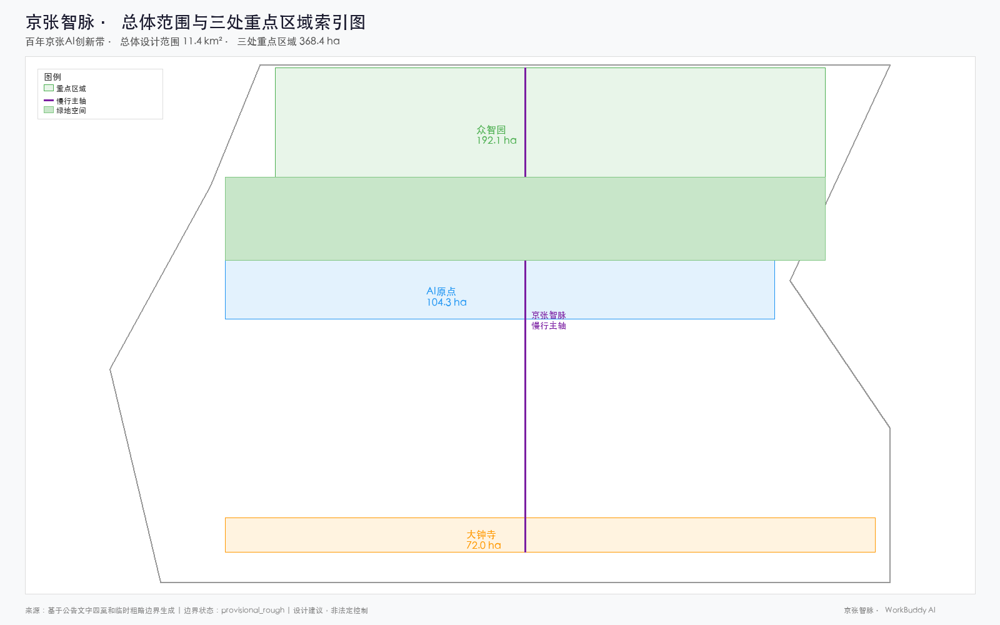
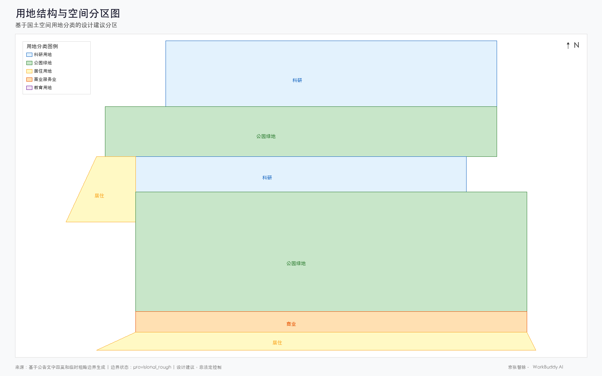
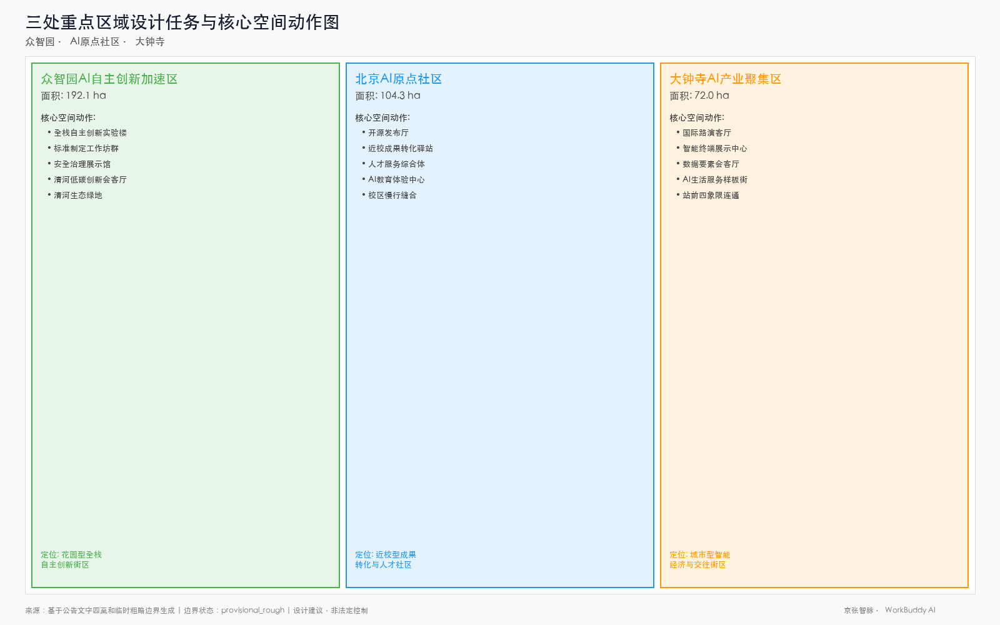
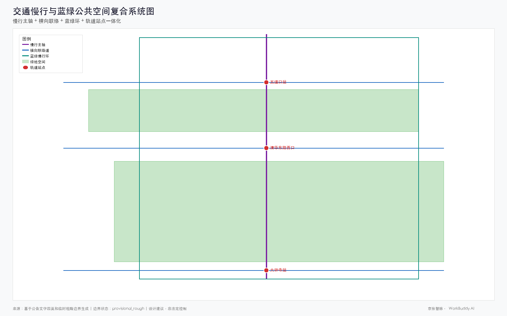
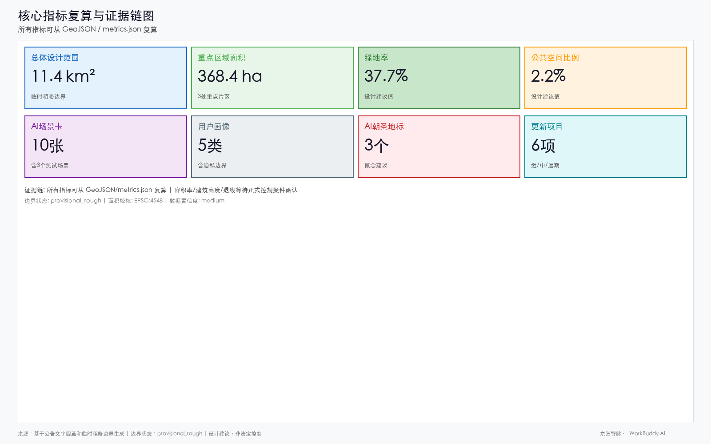

# Jingzhang AI Nexus · AI Innovation Corridor on the Centennial Railway

## Design Basis and Source Inventory

This formal proposal takes the "International Proposal Solicitation Prequalification Announcement for the Urban Design of the Centennial Jingzhang AI Innovation Belt," issued by the Haidian Branch of the Beijing Municipal Planning and Natural Resources Commission, as its primary basis. It also uses the provisional coarse boundaries, key areas, enumerations, metrics, and source inventories registered by maintainers in `brief/site-package/` as machine-readable inputs. Before generating the proposal, the AI agent must read `design_brief.json`, `allowed_design_space.json`, `sources.json`, `enums/`, `ranges/`, `schemas/`, `data/source_registry.json`, and `data/processed/agent_fact_pack.md`, and must use `project_scope_summary.csv`, `agent_task_requirements.csv`, `source_use_matrix.csv`, and `missing_data_checklist.csv` to establish the task, scope, source-use, and gap inventories. Every design judgment must be decomposed into traceable sources, recalculable metrics, verifiable layers, and manually reviewable assumptions. The announcement requires the proposal to reach the urban design depth of Regulatory Detailed Planning and the urban design depth of a comprehensive planning implementation plan; therefore, narrative text cannot substitute for GeoJSON, metric tables, the A3 booklet, the A0 panels, and the HTML digital presentation deliverables.

The proposal is not a standalone visionary text; it organizes its deliverables from the announcement, the agent-oriented task brief, and the site package. This section places only the most critical basis next to the corresponding judgments [source:OFFICIAL-ANNOUNCEMENT] [source:AGENT-TASKBOOK] [depth:existing_conditions_diagnosis]. The full source and standard coverage is preserved in `sources.json`, `standard_matrix.json`, and `design_depth_matrix.json`; the machine indices are not duplicated in the body text.

The usage boundaries of the source registry are as follows [source:SOURCE-REGISTRY]:

- `data/source_registry.json` registers the usage boundaries of public, rights-cleared, and provisional materials.
- Current registry summary: 7 formal-available sources, 1 background-only source, and 1 provisional-only source.
- The agent must not upgrade `background_only` or `provisional_only` materials to official boundaries, statutory regulatory plans, formal scoring bases, or government implementation commitments.

`data/processed/agent_fact_pack.md` is the reading-navigation layer of this proposal, not a new authoritative source [source:PROCESSED-FACT-PACK]. It helps the agent organize the three-level scope, three key areas, announcement tasks, agent.1–agent.6, source availability, and missing-data issues into a readable proposal; factual judgments must still return to the registered original materials [source:OFFICIAL-ANNOUNCEMENT] [source:AGENT-TASKBOOK], and the full source relationships are preserved in `sources.json`.

Where the official `SITE_BOUNDARY` or the three `KEY_AREA` polygons are not yet available, this scaffold uses `brief/site-package/geometry/provisional_boundaries.geojson` to generate a provisional formal package. Both `geometry/site_boundary.geojson` and `geometry/key_areas.geojson` in the submission package must be labeled `provisional_constraint` with `official_boundary=false`; they may only be used for proposal generation, self-check, visualization, and design discussion, and must not serve as official redlines, approval bases, precise area bases, or statutory control conclusions. This organizer data gap itself does not block content scoring; once official polygons are substituted, site boundary, key areas, land use, roads, green space, public space, buildings, phasing, and metrics must all be recalculated.

The scorable state produced by this scaffold is: **provisional boundary, with precision caveats retained and recalculation pending release of official data; content scoring is not blocked**. Accordingly, the spatial structure, scenarios, projects, and metrics in the body text are written under the principle of "discussable, reviewable, and recalculable once official boundaries are substituted." When the official boundary and key-area polygons are updated, the agent must rerun the scaffold, self-check, and drawing/HTML generation; substituting a single file is not sufficient.

Boundary interpretation can return to the overall scope layer and area recalculation [data:geometry/site_boundary.geojson#SITE-001] [metric:site_area_sqm]. The three key areas are checked through independent layers and quantity metrics [data:geometry/key_areas.geojson#PROV-KEY-001] [metric:key_area_count]. This means readers can move from the body text into the evidence without first parsing a string of machine IDs.

## Three-Level Scope Working Framework

The proposal organizes work according to the three levels defined in the announcement. The Coordinated Research Area addresses the AI industrial ecosystem, strategic positioning, innovation chain, and future urban form across 43.6 square kilometers; the Overall Design Area addresses the 11.4 square kilometers of urban districts and industrial zones within 1–2 kilometers of the Jingzhang Relic Park, requiring an overall urban renewal framework, industrial spatial layout, transportation and municipal support, and urban character controls; the Key Detailed Design Area addresses the 368.4 hectares across three detailed design districts, requiring clear functional programs, building massing, Retain/Renovate/Demolish classification, public space connectivity, and traffic organization. The three levels are mapped item by item in `compliance_matrix.json`, ensuring that the mandatory tasks of announcement sections 1.3, 1.4, 1.5 and agent.1–agent.6 each have corresponding chapters, layers, metrics, drawings, and HTML evidence.

The depth items of the three-level working framework are governed by [depth:three_level_scope_framework] and [depth:overall_spatial_structure]; spatial evidence is anchored to [data:geometry/site_boundary.geojson#SITE-001] and [data:geometry/key_areas.geojson#PROV-KEY-001]; task basis is anchored to [standard:PROJECT-OFFICIAL-ANNOUNCEMENT]; and scope indexing is navigated by the three-level scope table in `project_scope_summary.csv` within [source:PROCESSED-FACT-PACK].

The three levels of work are not mutually isolated drawing sets. The Coordinated Research determines industrial-chain and urban-form judgments; the Overall Design translates those judgments into renewal projects, spatial structure, and infrastructure capacity; and the Key Detailed Design verifies the implementability of specific parcels, buildings, transportation, public space, and AI application scenarios. When generating the proposal, the agent must first lock in the official or provisional boundaries and constraints adopted for the current submission, then generate land use, buildings, roads, green space, public space, phasing, and AI service nodes, and finally recalculate metrics from these layers and indicate in the body text which conclusions remain constrained by the provisional boundary. Any area, ratio, scale, or project count that cannot be recalculated from structured data must not be written into formal conclusions.

The overall concept proposed by this scheme is the "Jingzhang AI Nexus Symbiosis Belt": with the Jingzhang Relic Park as the historic and public-space spine, the three key areas of Zhongzhiyuan, Beijing AI Origin Community, and Dazhongsi as innovation anchors, and universities, enterprises, communities, and rail stations as the everyday network, it forms a spatial organization of "one belt with three cores, multi-point scenarios, and a blue-green slow-mobility composite ring." The "one belt" here is not a newly drawn redline; it is a translation of the announcement's three-level scope into a working method. The "three cores" correspond to the three key areas; "multi-point scenarios" correspond to operable nodes for AI plus public services, industrial services, and urban life; and the "composite ring" corresponds to the linkage of slow mobility, green space, public space, and activity routes.

| Level | Design Question | Proposal Response | Data Anchor |
| --- | --- | --- | --- |
| Coordinated Research Area | How to organize the AI industrial ecosystem and future urban form | Establish an innovation chain of "university sourcing – open-source collaboration – enterprise conversion – public experience – international communication" | compliance_matrix.json, standard_matrix.json |
| Overall Design Area | How to map industry, urban renewal, transportation/municipal, and character onto drawings | Expressed jointly through land use, buildings, roads, green space, public space, and phasing layers | [data:geometry/land_use.geojson#LU-001], [data:geometry/roads.geojson#ROAD-001] |
| Key Detailed Design Area | How the three districts reach detailed design depth | Positioning, spatial actions, AI scenarios, and implementation dependencies proposed separately | [data:geometry/key_areas.geojson#PROV-KEY-001], [data:geometry/key_areas.geojson#PROV-KEY-002], [data:geometry/key_areas.geojson#PROV-KEY-003] |

## Coordinated Research Area: Industry and Future City Research

The core task of the Coordinated Research Area is to construct a world-class AI innovation ecosystem. The proposal should survey Haidian's universities and research institutes, leading enterprises, computing-power/algorithm/data factors, incubation platforms, listed companies, unicorns, and science and technology service resources, and propose a spatial coordination framework for the AI innovation chain, industrial chain, talent chain, and urban service chain. Naming and logo design should serve the overall recognizability of the "Centennial Jingzhang Cultural Belt, Urban AI Life Experience Belt, and AI Convergence Innovation Belt," and must not remain at the slogan level; the connections to industrial ecology, public space, and cultural resources should be explained. The agent-oriented task brief also requires responses to the "Five Major Functions" and the "Three Areas and Two Wings" coordination, forming a naming system, visual identity, overall spatial structure diagram, scenario opening, and operational mechanism that can be further deepened; this section must use [source:AGENT-TASKBOOK] and [standard:PROJECT-AGENT-OPEN-CALL-TASKBOOK] to indicate that these requirements originate from the agent open-call task brief, not from statutory planning controls.

The Coordinated Research does not introduce falsely precise redlines; through the urban character, public space, and building layout coordination required by [standard:MOHURD-URBAN-DESIGN-MEASURES], it links back to [data:geometry/land_use.geojson#LU-001], [data:geometry/public_space.geojson#PUBLIC-001], and [depth:overall_spatial_structure], demonstrating that industrial strategy ultimately must land in visible, reviewable spatial structure.

Future urban form research should answer how artificial intelligence changes work, life, socializing, learning, transportation, and public services. The proposal should translate AI transportation systems, continuous green space, innovation service facilities, and an internationalized live-work atmosphere into locatable functional zones, nodes, corridors, and scenarios, rather than broadly describing technology visions. The agent should write industrial strategy metrics, AI innovation indices, talent density, spatial supply types, and AI+ vertical application focus areas into the metric system, and indicate which are official, which are design recommendations, and which await calibration with formal data. Any proposals for global AI innovation activities, developer communities, open scenarios, or pilgrimage routes should be written as "conceptual recommendations / reference schemes / subjects for further specialized study," and must not be written as already-confirmed government activities or implementation arrangements.

### Global AI Innovation Ecosystem Case Studies (agent.2)

This proposal examines 8 global AI innovation ecosystem cases to extract transferable spatial, operational, and scenario mechanisms:

| Case | City | Core Experience | Spatial Translation |
|------|------|-----------------|-------------------|
| King's Cross | London | Railway heritage renewal, Google Campus, Central Saint Martins, 12-year phased operation | Railway heritage + tech symbiosis, direct reference for Jing-Zhang main axis |
| Silicon Valley | San Jose | University-industry revolving door, dense VC, open-source culture | Campus-community-industry seamless fusion, reference for Zhongzhiyuan |
| Kendall Square | Boston | MIT innovation district, biotech density, walkable scale | Research institution + public space high-density interweaving, reference for Origin Community |
| Shibuya Q-WA | Tokyo | AI city lab, data-driven public space | Public space as AI testing ground, reference for multi-point scenario nodes |
| Digital Media City | Seoul | Digital media industry cluster, public cultural facilities | Industry + cultural facilities parity, reference for Dazhongsi |
| One-North | Singapore | Biotech + tech mixed-use, One-North park integration | Industry + green park integration, reference for blue-green slow-mobility ring |
| Nanshan Tech Park | Shenzhen | Complete industry chain, government guidance, enterprise-led | Full-stack industry chain spatial organization, reference for three-core industry nodes |
| Zhongguancun Existing Ecology | Beijing | Dense universities, active startups, policy leadership | Local experience continuation, reference for belt + three cores |

The shared lesson: successful AI innovation ecosystems require high-density mixing of research, public, industrial, and living spaces; continuous pedestrian and cycling networks; cultural narratives for identity; and long-term community operations. King's Cross railway heritage renewal is particularly relevant to the Jing-Zhang Railway Heritage Park [source:AGENT-TASKBOOK].

### AI Innovation Ecosystem Map

The ecosystem map translates these experiences into four dimensions: basic research, industry incubation, capital services, and scenario application. These correspond spatially to Zhongzhiyuan's R&D land, Origin Community's incubation space, Dazhongsi's capital services, and multi-point scenario testing [depth:industry_space_mapping].

### Three-Districts Two-Wings Coordination Framework

Based on case studies, the proposal establishes: Zhongzhiyuan benchmarked against Kendall Square; Origin Community against King's Cross; Dazhongsi against Digital Media City; Xiaoyuehe wing against Shibuya Q-WA; Zhongguancun wing against Nanshan Tech Park. Regional coordination conceptually links Beicheng community, Future Science City, Huairou Science City, Jing-Jin-Ji — specific cooperation models subject to formal negotiation [source:AGENT-TASKBOOK].

## Overall Design Area: Urban Renewal and Regulatory-Planning-Depth Urban Design

The Overall Design Area requires reaching the urban design depth of Regulatory Detailed Planning. The proposal must present an overall urban renewal spatial structure, identification of inefficient space, a renewal project list, implementation policy recommendations, industrial functional proportions, spatial organization models, total building scale, and comprehensive carrying-capacity assessment. `geometry/land_use.geojson` should fully cover the design boundary without overlap; `geometry/buildings.geojson` should express renewal-building footprints or retained-building footprints; `geometry/roads.geojson` should express micro-circulation, slow mobility, and rail-station connections; and `metrics.json` should recalculate core areas, ratios, and layer counts.

This section, following [standard:MOHURD-CONTROL-DETAILED-PLANNING], decomposes the regulatory-planning-depth content into reviewable objects: land use structure is expressed via `land_use.geojson`; building footprints via `buildings.geojson`; traffic organization via `roads.geojson` [metric:building_footprint_area_sqm]; [depth:land_use_layout] and [depth:development_intensity_controls] constrain deliverable depth.

The Overall Design must also support transportation, rail, municipal, and ancillary facilities. The proposal should provide spatial layout and implementation pathways around rail-station integration, road micro-circulation, bicycle parking, parking supply, innovation service platforms, talent live-work services, new infrastructure, distributed energy, and edge-side computing power. Content involving building height, development intensity, road red lines, setbacks, and facility standards, where official control conditions are not yet available, should be written as "pending confirmation of formal regulatory-planning conditions," and must not present agent-speculated values as approved metrics.

## Key Area Detailed Design

Key Area Detailed Design is mandatory. The Zhongzhiyuan AI Autonomous Innovation Acceleration Area should provide a detailed proposal around the national AI platform, full-stack autonomous innovation, standard setting, safety governance, industry display, external transportation, Qinghe River culture, a low-carbon green innovation interaction environment, and AI scenarios in green space. The Beijing AI Origin Community should provide a detailed proposal around near-campus innovation, achievement incubation and conversion, talent special zones, open-source systems, brand activities, building Retain/Renovate/Demolish, achievement display and release, residential live-work amenities, campus-park slow-mobility connections, and rail-station integration. The Dazhongsi AI Industry Cluster should provide a detailed proposal around leading enterprises, agents, intelligent terminals, content consumption, data elements, digital assets, commercial services, composite use of planned green space, Dazhongsi Station integration, and pedestrian connectivity across the four quadrants of the intersection.

The detailed designs of the three key areas must reference [data:geometry/key_areas.geojson#PROV-KEY-001], [data:geometry/key_areas.geojson#PROV-KEY-002], and [data:geometry/key_areas.geojson#PROV-KEY-003], and are checked by [depth:three_key_area_detailed_design] for whether they reach the depth of a comprehensive planning implementation plan. Proposals that only describe "building a demonstration area" without evidence of functions, buildings, transportation, public space, and implementation projects should be considered incomplete.

The three key areas must appear in `geometry/key_areas.geojson`. Where the repository already provides official polygons, they should be used as `official_constraint`; where official polygons are missing, `provisional_constraint` may be used temporarily, but the body text, HTML, sources, assumptions, and self-check must state that they cannot serve as a formal scoring or approval basis. `compliance_matrix.json` should cover announcement sections 1.5.3.1, 1.5.3.2, and 1.5.3.3 separately. The design representation should include functional programs, building scale, building form, Retain/Renovate/Demolish classification, public space systems, traffic organization, slow-mobility connectivity, and implementation projects. The HTML pages should support switching between the three key areas, and the A3 booklet and A0 panels should at minimum include a key-district general plan, partial detail drawings, and metric notes.

| Key District | Design Positioning | Spatial Actions | AI Industry and Operational Scenarios | Evidence References |
| --- | --- | --- | --- | --- |
| Zhongzhiyuan AI Autonomous Innovation Acceleration Area | Garden-type full-stack autonomous innovation district | Strengthen the Qinghe frontage, industry display, low-carbon innovation interaction, and external traffic organization; use green space to host open testing and standard-governance display | Autonomous model testing, standard-setting workshops, safety governance display, low-carbon computing-power experience | [data:geometry/key_areas.geojson#PROV-KEY-001], [depth:three_key_area_detailed_design] |
| Beijing AI Origin Community | Near-campus achievement conversion and talent community | Organize campus-park-district slow-mobility stitching; supplement achievement release, talent services, residential live-work, and open-source collaboration space | Open-source community, achievement release, talent-zone services, near-campus incubation | [data:geometry/key_areas.geojson#PROV-KEY-002], [source:AGENT-TASKBOOK] |
| Dazhongsi AI Industry Cluster | Urban-type intelligent economy and international exchange district | Centered on Dazhongsi Station integration, four-quadrant pedestrian connectivity, commercial services, and public-realm renewal around key enterprises | Agent and intelligent-terminal display, content consumption, data elements, and international roadshows | [data:geometry/key_areas.geojson#PROV-KEY-003], [metric:key_area_count] |

## AI Innovation Ecosystem, Talent Personas, and AI+ Scenarios

The proposal should establish a spatial-demand profile for AI talent and enterprises, covering R&D office, open-source collaboration, achievement release, enterprise services, talent housing, social learning, consumption and daily life, sports and leisure, and international exchange. AI+ scenarios should address the directions of transportation, services, consumption, healthcare, education, law, and daily-life services set out in the announcement, forming both industrial-development scenarios and AI-empowered urban-function scenarios. Each scenario should specify the service target, spatial location, data source, privacy boundary, manual-review mechanism, and operating entity.

AI scenarios must be anchored to spatial and governance boundaries: public-space scenarios reference [data:geometry/public_space.geojson#PUBLIC-001]; slow-mobility and traffic scenarios reference [data:geometry/roads.geojson#ROAD-001]; and open-space scenarios reference [data:geometry/green_space.geojson#GREEN-001] along with [metric:public_space_ratio] and [metric:green_ratio]. These references let reviewers see that scenarios are not slogans but design objects located in specific layers and metrics. The agent-oriented task brief requires at least 10 AI scenario cards, at least 3 industrial test-and-validation scenarios, and at least 5 user personas; the scaffold provides only the structure, and formal contestants must write the scenario cards, persona tables, privacy boundaries, manual reviews, and operating entities into the body text, HTML, A3/A0, and compliance matrix.

| User Persona | Typical Needs | Spatial Response | Self-Check Boundary |
| --- | --- | --- | --- |
| Open-source developer | Release, collaboration, testing, community reputation | Origin Community open-source release hall, public code wall, nighttime collaboration space | No collection of personal behavioral trajectories; activity data used only in aggregate statistics |
| Startup team | Low-cost office, computing-power access, product testing ground | Zhongzhiyuan shared testing ground, edge-side computing service points, standard-governance consulting | Computing-power and data services require separate authorization |
| Leading-enterprise visitor | Display, business, international reception, talent recruitment | Dazhongsi international roadshow parlor, rail-station connections, public space around key enterprises | Enterprise logos and cases must be rights-cleared |
| Surrounding resident | Commuting, leisure, community services, low-disturbance renewal | Jingzhang Relic Park slow-mobility ring, embedded community services, nighttime lighting and activity grading | Resident profiles must not be used for commercial recommendation |
| University faculty and students | Achievement conversion, cross-campus collaboration, daily slow mobility | Campus-park slow-mobility stitching, achievement-conversion stations, AI education experience points | Campus data and research results require authorization |

| Scenario Card | Spatial Carrier | Design Notes |
| --- | --- | --- |
| 01 Open-source Release Hall | Beijing AI Origin Community | For universities, open-source communities, and startup teams; provides achievement release, code-contribution display, and small-scale roadshow space |
| 02 Safety Governance Sandbox | Zhongzhiyuan | Translates standard setting, safety evaluation, and model red-teaming into a visitable, bookable, and supervisable display and collaboration node |
| 03 Edge-side Computing Power Station | Overall Design Area nodes | Combined with public services, enterprise services, and low-carbon energy strategy, as a new-infrastructure prototype to be deepened |
| 04 AI Slow-Mobility Navigation | Jingzhang Relic Park Active Belt | Uses explainable wayfinding and low-intrusion sensing to identify slow-mobility breakpoints, congestion nodes, and accessibility needs |
| 05 Dazhongsi International Roadshow Parlor | Dazhongsi AI Industry Cluster | Serves the display, negotiation, media release, and international exchange needs of agent, intelligent-terminal, and content-consumption enterprises |
| 06 Qinghe Low-Carbon Innovation Corridor | Zhongzhiyuan Qinghe frontage | Combines green space, stormwater, walking and cycling, and AI display as the park's public parlor |
| 07 Near-Campus Achievement Conversion Street | Beijing AI Origin Community | For university achievement conversion; organizes incubation, display, legal, intellectual-property, and investment-and-financing services |
| 08 Data Element Reception Parlor | Dazhongsi district | With compliance, authorization, and auditability as preconditions, displays the urban-service interface for data-element and digital-asset circulation |
| 09 AI Life Service Model Street | Community and commercial intersection | Lands healthcare, education, legal, and daily-life AI+ scenarios in operable small-scale block spaces |
| 10 Global AI Activity Week Route | One-belt public space system | Forms a walkable, communicable experience route from relic culture, open-source community, and industry display to international roadshow |

AI governance recommendations generated by the agent must follow the principles of data minimization, public sourcing, explainability, and manual review. Urban agents may assist in identifying slow-mobility breakpoints, public-space heat maps, facility maintenance, enterprise service demand, and event safety risks, but cannot replace planning approval, cannot output unauthorized personal profiles, and cannot claim to have obtained official implementation commitments. All AI scenario nodes should enter structured layers or the compliance matrix, allowing reviewers to see their relationship to industry, space, and public interest.

## Land Use, Building Scale, and Retain/Renovate/Demolish Scheme

The land-use scheme should be expressed according to public standards such as the territorial-space survey, planning, and use-regulation classification, forming complete, closed, and seamless land-use parcels. The building scheme should distinguish retained, renovated, renewed, newly built, and pending-confirmation objects, and clarify the recommended hierarchy for building footprints, functions, scale, character, roofs, massing, and height controls. Where current-building, ownership, regulatory-plan, and engineering-condition data are missing, the proposal may only put forward methods and pending-calibration checklists, and must not fabricate Retain/Renovate/Demolish conclusions.

Land-use classification follows [standard:MNR-LAND-USE-CLASSIFICATION-GUIDE]; building height, massing, frontage, and character controls are governed by [depth:height_massing_character]; and the Retain/Renovate/Demolish method is governed by [depth:retain_renovate_demolish]. The primary evidence for land use and buildings is [data:geometry/land_use.geojson#LU-001], [data:geometry/buildings.geojson#BLDG-001], and [metric:building_footprint_area_sqm].

Building-scale and intensity metrics must be consistent with `metrics.json` and the layers. Where total building scale, Floor Area Ratio (FAR), building height, building density, green ratio, setbacks, and building control lines lack official conditions, they should be listed in the metric system as `unknown` or `pending_control`; fixed numerical values must not be used to create a false sense of precision. The A3 booklet should provide a renewal-project list and a metric verification table; the A0 panels should clearly express the key spatial structure and key districts; and the HTML pages should provide linked viewing of metrics and layers.

## Transportation, Rail, Municipal, and Public Service Facilities

The transportation scheme should respond to the announcement's requirements for rail-station integration, road micro-circulation, slow-mobility breakpoints, external transportation, parking, bicycle parking, and green transportation systems. The focus should cover the North Fifth Ring Road, the Jingzhang Relic Park cross-ring-road nodes, Wudaokou, Qinghuadonglu Xikou, Dazhongsi Station, and the transportation connections around key enterprises. Road and slow-mobility layers should remain within the submission boundary and be cross-checked against public space, green space, industrial nodes, and key districts; if the submission boundary is provisional, the transportation conclusions can only serve as provisional design discussion.

Transportation and municipal professional depth are governed respectively by [depth:traffic_rail_slow_parking] and [depth:municipal_new_infrastructure]; layer evidence references [data:geometry/roads.geojson#ROAD-001], [data:geometry/public_space.geojson#PUBLIC-001], and [data:geometry/constraints.geojson#CONSTRAINTS]. Where road red lines, pipelines, fire-protection, and municipal conditions are missing, the assumptions should describe them as pending, rather than writing strategies as approved conditions.

Municipal and public service facilities should cover AI industry service facilities, innovation service platforms, talent live-work service facilities, new infrastructure, distributed energy, edge-side computing power, and the integration of traditional municipal facilities. The proposal should specify facility standards, spatial layout, service radius, operational model, and phasing-implementation logic. Where pipeline, energy, drainage, flood-control, and fire-protection engineering data are missing, they should be listed as formal preconditions for further deepening.

## Blue-Green Space, Public Space, and Urban Character

The blue-green space scheme should take the Jingzhang Relic Park Active Belt as its backbone, coordinate the Qinghe River, Xiaoyue River, and the travel demands of surrounding universities, enterprises, and communities, and propose a north-south and east-west connected system of walking paths, cycling paths, and green spaces. The proposal should identify slow-mobility breakpoints, cross-ring-road overpass nodes, and landscape nodes at the southern and northern ends of the park, and propose composite-use strategies for parking, sports, innovation interaction, technology testing, application display, and public services.

Blue-green public space is jointly checked by design-depth items and the green-space and public-space layers [depth:blue_green_public_space] [data:geometry/green_space.geojson#GREEN-001] [data:geometry/public_space.geojson#PUBLIC-001]. Green-space and public-space ratios are explained in the body text for their design significance; complete recalculation is preserved in `metrics.json`. Coordination of urban character, public space, and building controls returns to the professional standard matrix [standard:MOHURD-URBAN-DESIGN-MEASURES].

The urban character scheme integrates Jingzhang Railway historical culture, Zhongguancun innovation culture, and AI innovation culture, leveraging cultural resources such as the Qinghuayuan Railway Station and the Beijing Film Academy, with guidance for the urban tone, building character, roof forms, massing, frontages, and public art. The proposal includes wayfinding signage, cultural symbols, international communication narratives, AI pilgrimage landmark catalog, contribution walls, and honor display systems, with all brands, fonts, images, portraits, and enterprise logos noted as requiring rights-cleared sources. Character controls distinguish between official controls, design recommendations, and pending-confirmation conditions; falsely precise control lines are not issued without heritage-protection or regulatory-plan basis.

### AI Pilgrimage Landmark Catalog (agent.4)

The proposal identifies three named AI pilgrimage landmarks:

| ID | Name | Location | Theme | Spatial Form |
|----|------|----------|-------|--------------|
| LM-01 | Jingzhang Smart Vein Gate | Qinghuayuan Station Ruins | Railway heritage × AI convergence | Adaptive reuse as AI history museum |
| LM-02 | Crowd-Wisdom Dome | Zhongzhiyuan Central Plaza | Open-source innovation spirit | Open steel dome with LED array showing real-time data |
| LM-03 | Data Ripple | Xiaoyuehe waterfront node | Data-driven urban life | Terraced waterfront with AI-generated projections |

### Honor Display System (agent.4)

Two mechanisms: (1) Contribution Wall at Qinghuayuan Station entrance, updated annually; (2) Digital Honor Map embedded in visual/index.html, mapping contributor achievements to spatial nodes.

### Public Space Component Library (agent.4)

12 composable component types: modular seating, smart lighting poles, AI interactive installations, mobile greenery modules, open-source display screens, bike AI navigation stations, data transparency pillars, pop-up pavilions, privacy protection screens, edge computing stations, cultural narrative plaques, and accessible navigation strips. All electronic components label data collection boundaries and manual review mechanisms.

## Renewal Project List, Implementation Policy, and Phasing Plan

The implementation scheme should form a reviewable renewal project list, specifying project location, type, function, responsible entity, dependencies, implementation phase, risks, and evaluation metrics. Policy recommendations should cover coordinated urban renewal implementation, spatial supply, operational mechanisms, industrial services, public participation, data governance, and property-rights coordination. `geometry/phasing.geojson` should express phasing extents, and `compliance_matrix.json` should link each task to phasing and drawings.

Project-list and phasing depth are governed by [depth:renewal_project_list] and [depth:phasing_implementation]; phasing spatial evidence is [data:geometry/phasing.geojson#PHASE-001]. Where ownership, funding, implementation entities, and approval pathways are unavailable, the proposal must write them as implementation risks, not as commitments to deliver.

| Project No. | Project Name | Type | Key Dependencies | Evidence Reference |
| --- | --- | --- | --- | --- |
| JZ-01 | Jingzhang Relic Park Slow-Mobility Breakpoint Stitching | Public space / Transportation | Road red lines, under-bridge space, traffic-organization review | [data:geometry/roads.geojson#ROAD-001] |
| JZ-02 | Zhongzhiyuan Qinghe Innovation Frontage | Blue-green space / Industry display | River blue line, ecological and flood-control conditions | [data:geometry/green_space.geojson#GREEN-001] |
| JZ-03 | Origin Community Near-Campus Achievement Conversion Street | Urban renewal / Industry services | Campus boundary, ownership, ground-floor tenancy | [data:geometry/buildings.geojson#BLDG-001] |
| JZ-04 | Dazhongsi Station Four-Quadrant Pedestrian Connectivity | Rail integration / Slow mobility | Rail station, road intersection, municipal pipelines | [data:geometry/public_space.geojson#PUBLIC-001] |
| JZ-05 | AI Public Service and Edge-side Computing Node | New infrastructure / Public services | Energy, computing power, security, and operating entity | [data:geometry/constraints.geojson#CONSTRAINTS] |
| JZ-06 | Global AI Activity Week Public Route | Operations / Brand | Public-space permits, event safety, copyright clearance | [data:geometry/phasing.geojson#PHASE-001] |

Phasing is distinguished from the 100-day solicitation design cycle: the solicitation cycle is the time requirement for submitting deliverables, while implementation phasing is the advancement path for urban renewal and project construction. The proposal sets out near-term pilots, mid-term renewal, and long-term governance frameworks, indicating which elements can start with lightweight facilities, operational activities, and service platforms, and which must await confirmation of formal regulatory, municipal, transportation, and ownership conditions. For the annual activity system, developer-community operations, scenario open-days, public-experience routes, and international communication mechanisms, the body text describes the operational audience, frequency, responsibility boundaries, conversion paths, and risks, not solely promotional slogans.

### Annual Activity System (agent.6)

The proposal presents a conceptual annual AI innovation activity calendar: Q1 Jingzhang AI Open-Source Week, Q2 Haidian AI Scenario Open Day, Q3 AI Innovation Corridor Public Experience Season, Q4 Global AI Innovation Summit. All are conceptual suggestions and do not constitute confirmed commitments or government implementation arrangements.

### Developer Community Governance (agent.6)

Conceptual governance framework: Technical Committee, Ethics Committee, and Operations Committee in parallel; admission via submission → review → community vote; exit after 6 months of inactivity; IP defaults to CC-BY-4.0 with separate commercial licensing.

### Scenario Open Protocol (agent.6)

1-2 new scenarios per quarter; 7-business-day feedback; 90-day test cycle; anonymized data storage with 30-day post-test deletion; quarterly publication of open scenario lists and test result summaries.

### Long-term Operational KPIs (agent.6)

| KPI | Metric | 3-year target | 5-year target |
|-----|--------|---------------|---------------|
| KPI-01 | Resident open-source projects | 30+ | 80+ |
| KPI-02 | Scenario test conversion rate | 15% | 25% |
| KPI-03 | Annual public activity participants | 50k+ | 150k+ |
| KPI-04 | International exchange projects | 5+ | 15+ |
| KPI-05 | Community contributor activity rate | 40%+ | 50%+ |
| KPI-06 | Scenario satisfaction | 75%+ | 85%+ |

All KPIs are conceptual suggestions [source:AGENT-TASKBOOK].

## Metric System, Area Recalculation, and Compliance Matrix

The metric system should at minimum include the Overall Design Area area, Key Detailed Design Area area, green-space and public-space ratios, building footprint, number of renewal projects, number of AI scenario nodes, slow-mobility connectivity metrics, industrial-space metrics, talent-service metrics, and self-check status. All `known` metrics must be recalculable from GeoJSON or credible sources; `unknown` metrics must state the reason and the precondition for formal submission. The results of `scripts/spatial_review.py` and `scripts/visual_review.py` are important evidence for the formal self-check.

Metric recalculation follows the unified design-depth requirement [depth:metrics_recalculation]. The body text emphasizes the design meaning of metrics—for example, how the overall scope constrains spatial allocation, and how blue-green and public-space ratios support everyday interaction; complete values, formulas, source files, and confidence levels are preserved in `metrics.json`. Sample key metrics can be verified from the overall scope and green-space data [metric:site_area_sqm] [data:geometry/green_space.geojson#GREEN-001].

The compliance matrix is the master file for task responsiveness. Every announcement task and agent_taskbook task must correspond to a report chapter, layer, metric, drawing, HTML page, source, assumption, and self-check item. Failure to cover any mandatory task in announcement sections 1.3, 1.4, 1.5, or agent.1–agent.6 disqualifies the proposal from entering formal professional scoring.

During formal deepening, the agent should also classify each metric into three categories. The first category consists of spatial metrics that can be directly recalculated from the submitted geometry, such as boundary area, green-space ratio, public-space ratio, building footprint area, and phasing area. The second category consists of control metrics that require official regulatory-plan or task-book annex support, such as Floor Area Ratio (FAR), building height, building density, setbacks, road red lines, and facility standards. The third category consists of performance metrics that require continuous calibration from operational or industrial data, such as the AI innovation index, talent density, industrial-service satisfaction, slow-mobility accessibility, event participation, and scenario-usage frequency. The three categories should enter `metrics.json`, `assumptions.json`, and `compliance_matrix.json` respectively, to avoid mistaking operational visions for approved planning conditions.

## Risks, Copyright, and Compliance Notes

**Bilingual requirement.** The main proposal file may use Chinese or English, but a complete parallel translation must be provided via `proposal.en.md` or `proposal.zh.md`; A3/A0 panels, HTML, and text-bearing drawings must also provide corresponding language copies, prioritizing the competition-recommended translations in `docs/terminology-glossary.md`. A v2 package missing any required translation, language mapping, or valid file will be blocked from finalize and CI submission. All images, drawings, icons, data, and code assets must declare their source, license, and authorization status in `sources.json` or `report/copyright_statement.md`. HTML pages must not load remote scripts, remote map tiles, remote fonts, iframes, forms, or external APIs, and must not track reviewer behavior.

The risk and missing-data list is jointly checked by the risk depth item, the constraints layer, and the site package [depth:risk_missing_data] [data:geometry/constraints.geojson#CONSTRAINTS] [source:SITE-PACKAGE]. The official-boundary, key-area, regulatory-plan, road, parcel, building, municipal, heritage-protection, and public-service gaps listed in `missing_data_checklist.csv` must enter `assumptions.json`, the self-check, and the body-text risk chapter. Any conclusion lacking official regulatory-plan, road red line, ownership, municipal, fire-protection, or heritage-protection conditions must be downgraded to a pending-confirmation item; full professional verification is preserved in the standard matrix.

This proposal does not claim official approval, approved regulatory planning, final land ownership, final construction scale, or guaranteed implementation. The AI agent is responsible for facts, sources, copyright, spatial data, metrics, and representation; maintainers and professional reviewers may require rework or rejection based on self-check results, spatial review, and the compliance matrix.

## References

- brief/public-brief.md
- brief/site-package/design_brief.json
- brief/site-package/allowed_design_space.json
- brief/site-package/enums/
- brief/site-package/ranges/planning_limits.json
- data/processed/agent_fact_pack.md
- data/processed/project_scope_summary.csv
- data/processed/agent_task_requirements.csv
- data/processed/source_use_matrix.csv
- data/processed/missing_data_checklist.csv
- Full machine indices: see `sources.json`, `metrics.json`, `compliance_matrix.json`, `standard_matrix.json`, and `design_depth_matrix.json`
- The bibliography entries in this section are based on the site-package registry; for full citations and licenses, see the structured source inventory [source:SITE-PACKAGE]
