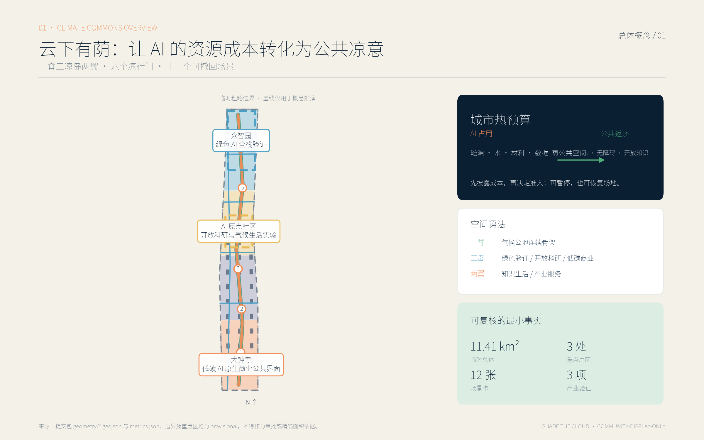
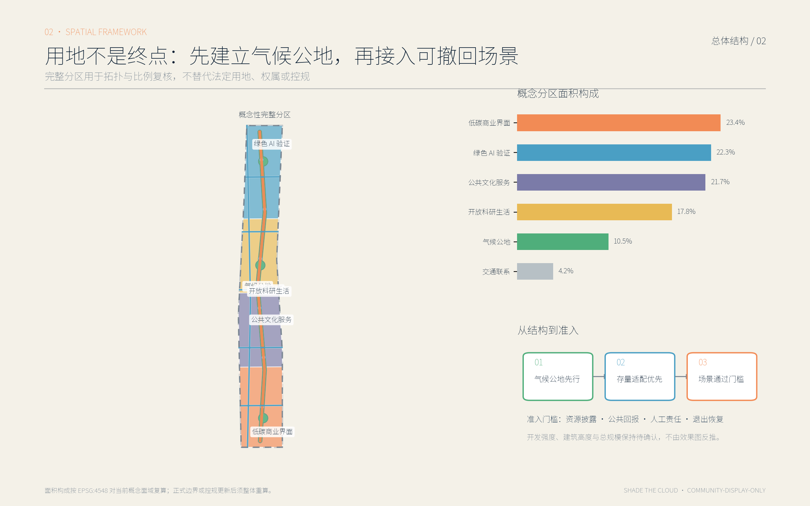
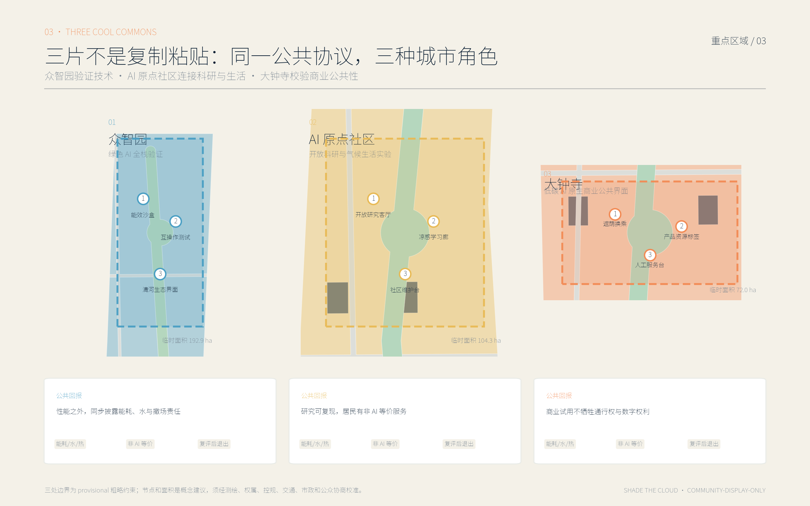
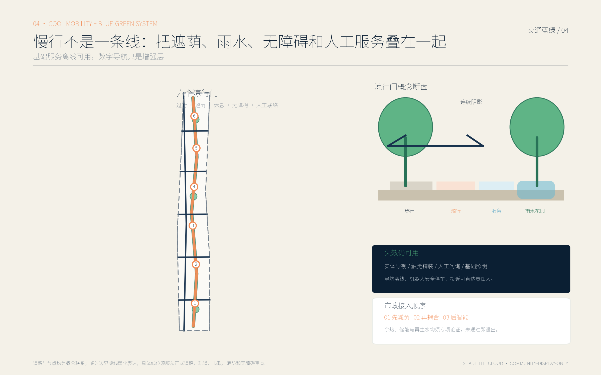
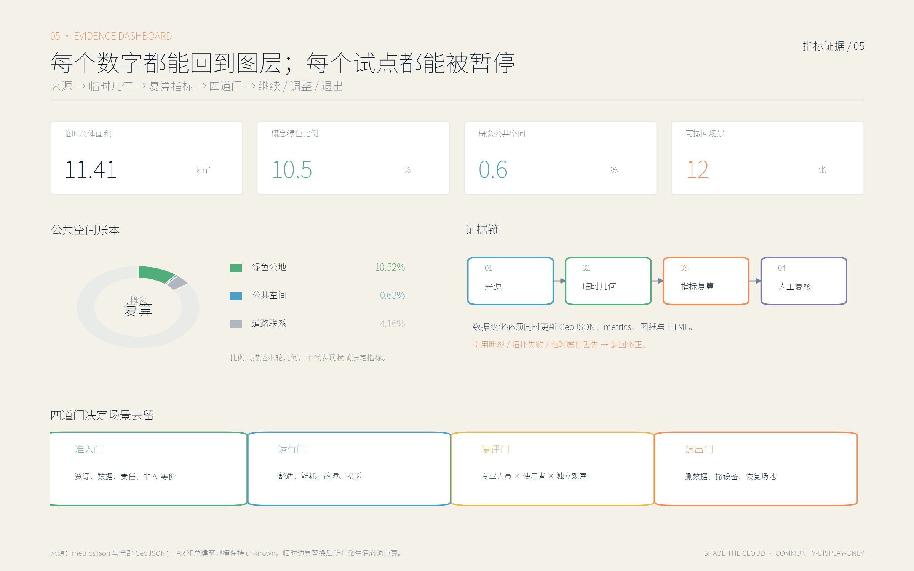

# 云下有荫 SHADE THE CLOUD：京张 AI 气候公地与低碳创新带

## 设计依据与资料清单

本提案把“证据可追溯、几何可复算、判断可撤回”作为设计起点。法定与任务依据包括征集公告、面向智能体的任务书、城市设计管理办法、控制性详细规划编制要求和国土空间调查规划用途管制分类指南；它们分别界定任务边界、成果深度、公共空间与风貌要求、控规衔接方法以及用地分类口径。[source:OFFICIAL-ANNOUNCEMENT] [source:AGENT-TASKBOOK] [standard:PROJECT-OFFICIAL-ANNOUNCEMENT] [standard:PROJECT-AGENT-OPEN-CALL-TASKBOOK] [standard:MOHURD-URBAN-DESIGN-MEASURES] [standard:MOHURD-CONTROL-DETAILED-PLANNING] [standard:MNR-LAND-USE-CLASSIFICATION-GUIDE] 《建筑工程设计文件编制深度规定》在资料矩阵中暂列待补项 [standard:MOHURD-ARCH-DESIGN-DEPTH-2016]，本提案没有把它作为当前控制依据，也不据此声称建筑方案已达到施工或报批深度；待取得可核验文本并由专业团队确认适用性后，再用于后续建筑深化。站点资料包、来源登记表和经处理的事实包仅用于组织现有材料，不替代原始公告，也不把二次整理升级为新的权威来源。[source:SITE-PACKAGE] [source:SOURCE-REGISTRY] [source:PROCESSED-FACT-PACK]

当前仓库未提供可用于审批的正式总体边界、三处重点区域红线、现状权属、法定控规图则、完整道路红线和市政管线。因而，本包采用维护者提供的临时粗略边界开展概念验证，明确标为非正式、非精确、可替换约束。[source:BOUNDARY-SOURCE] [source:KEY-AREA-SOURCE] 图层 [data:geometry/site_boundary.geojson#SITE-BOUNDARY-PROVISIONAL] 及 [data:geometry/key_areas.geojson#PROV-KEY-001]、[data:geometry/key_areas.geojson#PROV-KEY-002]、[data:geometry/key_areas.geojson#PROV-KEY-003] 只能支撑本次结构推演、面积复算与成果自检，不能作为规划审批、土地权属、征拆、投资决策或工程放线依据。所有由临时几何得到的面积与比例，均应在正式数据补齐后整体重算，而不是局部替换数字。

现状诊断据此采用“三栏清单”：已知事实、设计假设、待补资料。已知事实只取自登记来源；设计假设必须在 `assumptions.json` 中留痕；待补资料进入风险清单并设置触发条件。建筑保留与拆除、开发强度、道路断面、管线容量、遗产保护范围和项目投资均不在未知条件下作确定判断。[depth:existing_conditions_diagnosis] “云下有荫”因此不是一张假装精确的总平图，而是一套可让规划、建筑、景观、交通、生态、能源、数据治理与社区运营团队共同校验的气候公地原型。

## 三层范围工作框架

三层工作并非把同一概念按比例放大缩小。统筹研究范围关注约 43.6 平方公里内的创新链、气候韧性和区域协同；总体设计范围关注约 11.4 平方公里内的城市更新结构、公共空间、交通市政与产业承载；三处重点区域合计约 368.4 公顷，承担可被检验的详细场景。上述规模取自任务材料，具体几何仍以正式发布为准。[source:OFFICIAL-ANNOUNCEMENT] [source:PROCESSED-FACT-PACK] 本提案以 [depth:three_level_scope_framework] 将战略、结构与场所逐级传导，以 [depth:overall_spatial_structure] 检查每一层是否有明确空间抓手、运营机制和复核接口。

总体结构概括为“一脊三凉岛两翼、六个凉行门、十二个可撤回场景”。“一脊”是沿京张遗址公园及其南北联系组织的气候公地脊：它不是新增法定道路或景观红线，而是把遮荫慢行、雨水花园、低碳能源展示、公共服务和开放知识串成连续体验。“三凉岛”对应众智园、AI 原点社区和大钟寺三处重点区域，分别回答绿色 AI 验证、开放科研生活、低碳 AI 原生商业三类问题。“两翼”是面向高校社区的知识—生活协作翼和面向企业站城的产业—服务协作翼。“六个凉行门”是跨越主要交通界面、进入公园与重点片区的概念性舒适节点，具体位置须经道路、产权和客流调查校准。

这套结构的母题是“城市热预算”。任何拟进入公共空间的 AI 试点，都先说明算力能耗、用水、设备材料、数据采集和运维责任，再说明它为公众返还多少遮荫、降温、雨洪调蓄、无障碍支持或开放知识。热预算不是本轮已核定的量化标准，而是后续建立基线、设定阈值和公开复盘的共同账本。总体边界面积从 [metric:site_area_sqm] 读取，三片数量从 [metric:key_area_count] 读取；二者都受临时边界精度限制。三层框架因此形成“区域协同定问题—总体结构分配公共回报—重点片区验证场景—评估后继续、调整或退出”的闭环。

| 工作层级 | 核心问题 | 本提案的交付方式 | 正式深化触发条件 |
| --- | --- | --- | --- |
| 统筹研究 | AI 创新如何与区域降温、知识开放和公共利益协同 | 气候公地协议、区域协同矩阵、案例转译原则 | 补充产业、能源、气候与人群基线 |
| 总体设计 | 空间和资源如何形成连续、可达、可养护的网络 | 一脊两翼、用地分区、慢行与蓝绿系统、热预算台账 | 替换正式边界、控规、路网及市政条件 |
| 重点区域 | 三种 AI 城市界面如何小规模验证 | 三凉岛、六个凉行门、十二张场景卡 | 完成权属、交通、消防、运营和公众协商 |

## 统筹研究范围产业与未来城市研究

提案不把“AI 产业带”等同于更多服务器、屏幕或展示中心，而把它理解为一份可被公众审阅的资源契约：算力和数据设施消耗城市资源时，应以节能验证、余热利用、开放接口、人才共享和舒适公共空间返还城市。产业链由“基础研究—绿色 AI 全栈验证—开源协作—产品试用—公共影响评估—规模化或退出”组成；空间链则由众智园、AI 原点社区、大钟寺及沿线高校、社区、园区和站点承担不同环节。由此，企业服务不再只是招商前台，公共空间也不只是产业形象背景，而是标准验证、社会反馈和风险暴露的共同场所。

六个国际案例提供方法，而非可直接复制的模板。新加坡榜鹅数字园区的开放数字平台提示，跨系统互联应以开放接口、权限分层和能耗监测为前提；本提案把它转译为场景接入清单，不照搬其治理与气候条件。[source:PDD-JTC] 芬兰 Fortum 与数据中心余热回收案例提示，算力热量只有在供回水温度、季节负荷、距离和责任边界均成立时才是资源；北京方案仅把余热梯级利用列为待工程验证选项，不预设可行。[source:FORTUM-HEAT] 赫尔辛基 Kalasatama 的敏捷试点和数字孪生经验支持“小步测试—公开评价—继续或停止”，但不能替代居民协商与法定程序。[source:KALASATAMA]

巴黎 Oasis 校园以遮荫、透水、植被和共享使用改造热环境，启发“凉行门”先从儿童、老人和照护者可感知的舒适度出发，同时要求明确寒暑假、夜间开放和养护安排。[source:PARIS-OASIS] 麦德林绿色廊道说明连续植被、步行与生物多样性可共同降低热暴露；转译到北京必须采用本地适生植物，评估冬季日照、节水和冻融养护，不能套用热带绿化密度。[source:MEDELLIN-GREEN] 多伦多 Quayside 的争议则提供反面约束：数字基础设施上街之前，应先完成数据章程、监督权、申诉和退出机制，不能用技术便利换取模糊授权。[source:QUAYSIDE-GOVERNANCE]

区域协同采用“资源—角色—公共回报—验证方式”矩阵，均为合作建议而非既定承诺：高校与研究机构可贡献方法和公开课程，回报是可复现实验与人才训练；企业可提交绿色 AI 产品和能耗说明，回报是受控试验窗口；社区与社会组织可提出真实问题、参与评价，回报是非商业化公共服务与空间改善；公园、园区和站点运营方可提出安全和养护条件，回报是更清晰的故障闭环；政府专业部门若后续参与，则负责规则、审批和公共责任，不为单一技术背书。三项产业验证场景必须同时通过性能、能耗、公共影响和退出四道门槛，未达标不得以“示范”之名固化。

## 总体设计范围城市更新与控规深度城市设计

总体设计用“气候公地脊”组织南北连续性，用横向凉行门缝合社区、高校、园区与轨道站点。土地结构不是对现状或法定规划的声称，而是用于检验比例、连通和场景承载的概念分区：生态与遮荫骨架 [data:geometry/land_use.geojson#LU-GREEN]，慢行及必要交通界面 [data:geometry/land_use.geojson#LU-ROAD]，北部绿色 AI 验证片 [data:geometry/land_use.geojson#LU-NORTH]，中部开放科研生活片 [data:geometry/land_use.geojson#LU-MID]，南部低碳商业公共界面 [data:geometry/land_use.geojson#LU-SOUTH]，以及承担跨片共享服务的公共文化单元 [data:geometry/land_use.geojson#LU-CIVIC]。这些面域共同覆盖临时边界，用于 [depth:land_use_layout] 的拓扑检查，不代表用地性质已经获批。

空间顺序由“先公地、后场景；先存量适配、后增量建设；先可逆设施、后永久工程”控制。气候脊优先布置树荫连续段、可饮水与休憩点、透水地面、雨水花园和低照度导视；场景节点在公共空间承载力明确后接入。现阶段建筑底图只是概念测试足迹，其中 [data:geometry/buildings.geojson#BLDG-001] 用于验证建筑基底面积和空间疏密，不指认真实建筑，也不构成拆建方案。道路主脊 [data:geometry/roads.geojson#ROAD-SPINE] 只表示拟议慢行与服务联系，具体线位、断面和交叉口处理必须服从后续交通专项与道路红线。

[depth:development_intensity_controls] 采取“未知即不填数”的原则。容积率、总建筑规模、建筑高度、退界、停车配建及公共服务设施标准，在缺少正式控规和现状测绘时保留为待确认；提案不以视觉模型生成伪精确指标。可以复算的仅是本次概念几何形成的面积和比例，并在图表中标注临时属性。更新行动分为轻介入公共空间、既有建筑适应性使用、需专项论证的站城缝合、需法定程序支持的永久建设四类，避免把一张城市设计图误读为实施许可。

## 重点区域详细设计

三处“凉岛”采用同一公共利益协议，却不复制同一种空间产品。[depth:three_key_area_detailed_design] 要求每片都回答功能组合、空间组织、交通接入、建筑适配、公共空间、AI 场景、运营和退出，但其主导价值明显不同。重点区几何均为临时粗略边界：众智园对应 [data:geometry/key_areas.geojson#PROV-KEY-001]，AI 原点社区对应 [data:geometry/key_areas.geojson#PROV-KEY-002]，大钟寺对应 [data:geometry/key_areas.geojson#PROV-KEY-003]。正式深化时需以测绘、产权、控规、道路、消防、市政、遗产及运营条件逐项替换，当前不主张任何审批结论或投资安排。

**众智园：绿色 AI 全栈验证凉岛。** 北部片区把模型、芯片、边缘设备、机器人和园区系统放在同一套资源账本下测试。空间上建议形成低碳验证廊、可预约测试庭院、能耗与热量公开站、清河方向生态缓冲和面向公众的观察界面。产业团队提交性能、能耗、水耗、设备回收和安全说明；第三方与公众能看到聚合结果，而不能读取商业秘密或个人数据。验证失败的设备撤走、地面恢复，避免“临时试验”永久占用公地。

**AI 原点社区：开放科研与气候生活实验凉岛。** 中部片区面向高校师生、研究人员、周边居民、学生家庭和行动不便者，把开源发布、气候课程、社区共创、无障碍出行和安静学习组合在步行可达范围。建议优先利用可适配的存量首层与院落设置开放研究客厅、凉感学习廊和社区维护台，不预判建筑拆留。科研成果以可理解语言说明训练数据、资源消耗与社会影响；生活实验必须提供非 AI 等价服务，居民拒绝参与不影响使用公共空间。

**大钟寺：低碳 AI 原生商业公共界面凉岛。** 南部片区不以大型电子展示营造“未来感”，而以站城换乘舒适、首层开放、夜间安全、低碳商品服务和透明数字权利建立可信商业界面。建议在轨道接驳方向设置遮荫等候、无障碍连续面、产品能耗标签、可撤回试用柜和人工服务台；商业推荐不得依赖人脸识别或隐蔽画像。企业路演、文化导览和消费体验须服从公共通行与安静时段，不得把开放空间变为排他展场。

“六个凉行门”按功能成对设置：北部两门服务园区—河岸和测试—公众转换，中部两门服务校区—社区和科研—生活转换，南部两门服务轨道—街区和商业—公园转换。每一门的最低配置是连续遮荫、坐靠、夜间基本照明、无障碍绕行、应急联络、人工标识与雨天避护；AI 导航和环境感知只作为增强层。它们的具体数量与位置是概念建议，可供专业团队在交通调查和公众协商后深化。

## AI 创新生态、人才画像与 AI+ 场景

场景设计从六类画像出发，而不是从设备清单出发。第一类是绿色 AI 研发工程师，需要可复现实验、能耗对照与知识产权边界；第二类是初创团队，需要低门槛测试、合规辅导和与真实需求对接；第三类是高校学生与青年研究者，需要开放学习、夜间安全和跨学科协作；第四类是周边老年居民，需要清楚、稳定、有人值守的服务；第五类是轮椅使用者、视障者及照护者，需要连续无障碍与可预期路线；第六类是公园访客、夜班工作者和短暂停留者，需要遮荫、饮水、休息和不被追踪的基本权利。画像数量由 [metric:persona_count] 记录，但任何画像都不得被转化为个人标签或商业定向。

十二张“可撤回场景卡”共用七个字段：公共问题、空间载体、最小数据、人工责任、评价指标、暂停阈值、恢复方式。前三张是产业验证：**01 绿色 AI 全栈能效沙盒**，对同一任务比较性能、能耗和热排放；**02 边缘推理互操作测试**，验证多厂商设备接口、离线能力和故障降级；**03 低速机器人热环境共存测试**，检查遮挡、噪声、通行权与高温续航。它们不得在验证完成前形成排他采购或长期占地，验证数量由 [metric:test_scenario_count] 复核。

其余九张服务公共生活：**04 阴影优先无障碍导航**，只使用道路与环境信息，不保存个人轨迹；**05 高温预警与凉点引导**，提供纸质地图和人工广播；**06 雨水花园养护助手**，辅助生成巡检清单，由园艺人员确认；**07 树木与用水公共账本**，公布聚合养护信息；**08 无障碍同行助手**，由使用者主动开启并可随时删除会话；**09 京张文化导览**，明确史料来源和不确定性；**10 企业绿色合规与公共政策助手**，仅作材料导航，不替代法律与审批意见；**11 开放学习工作室**，发布课程、代码和复现实验；**12 活动资源预算与安全复核**，在活动前核查用电、垃圾、噪声、疏散和热风险。场景总数由 [metric:scenario_count] 记录。

三座可识别但不追求巨构的公共地标承载共同叙事。其一“热预算站”用实体刻度和本地离线屏公开能源、降温与维护状态；其二“开源荫廊”把可拆遮荫构件、雨水花园和开放课程结合；其三“京张气候里程墙”并置铁路历史、城市气候和 AI 公共贡献，内容经来源审核后更新。地标数量由 [metric:landmark_count] 复核。所有场景均执行数据最小化、明确目的、人工复核、可访问的申诉渠道、非 AI 等价服务、定期复评与一键暂停退出；涉及安全、医疗、法律、规划审批或资源分配的结论，必须由有职责的人员作最终判断。

## 用地、建筑规模与拆改留方案

用地表达依照 [standard:MNR-LAND-USE-CLASSIFICATION-GUIDE] 采用可对照的分类代码，但现有图层是概念性完整分区，不是法定用地方案。绿色公地、道路联系、北中南三类复合功能和公共文化单元分别由 [data:geometry/land_use.geojson#LU-GREEN]、[data:geometry/land_use.geojson#LU-ROAD]、[data:geometry/land_use.geojson#LU-NORTH]、[data:geometry/land_use.geojson#LU-MID]、[data:geometry/land_use.geojson#LU-SOUTH]、[data:geometry/land_use.geojson#LU-CIVIC] 复核。图层需在临时总体边界内无缝覆盖且不重叠，正式边界替换后再次进行拓扑检查和面积平差。

建筑策略遵循“能留先留、能改先改、可拆装先试、永久建设后议”。由于缺少逐栋现状年代、结构安全、权属、租赁、消防、文保和使用效率资料，本提案不把任何建筑判定为必须拆除或保留。[depth:retain_renovate_demolish] 将后续调查分为五步：档案与权属核验、结构及消防体检、碳排与适配成本比较、公共利益评估、利益相关者协商。只有五步完成并进入法定程序，才能形成拆改留结论。当前 [data:geometry/buildings.geojson#BLDG-001] 及同层其他足迹仅用于测试街坊尺度、首层界面和建筑基底指标。

[depth:height_massing_character] 以气候和公共空间表现替代任意造型：沿气候脊控制连续可达的首层公共界面；近公园处评估日照、风环境与树冠关系；站点周边在满足安全和容量后研究混合使用；新旧建筑均预留可维护、可替换的设备界面。建筑基底面积 [metric:building_footprint_area_sqm] 和概念建筑密度 [metric:building_density] 可从测试足迹复算，但它们不描述现状，也不直接给出开发权。[metric:floor_area_ratio] 与 [metric:total_floor_area_sqm] 保持未知，待正式控规、建筑层数与测绘数据补齐后计算；[depth:development_intensity_controls] 亦要求所有高度、退界、容积率和总量建议先经过专业专项论证。

三处片区的建筑适配重点不同：众智园优先检查实验空间的可变性、设备散热、装卸和公众观察安全；AI 原点社区优先检查存量首层开放、安静学习、适老与无障碍；大钟寺优先检查站城首层连续、夜间界面和商业后勤。屋顶不预设全部绿化或布置算力设备，而按结构荷载、消防、运维、眩光、噪声及全生命周期碳排逐栋选择。任何“零碳”“节能率”或投资回报声明都需实测基线与第三方核证，本轮不作承诺。

## 交通、轨道、市政与公共服务设施

交通策略的第一优先级是人在极端天气和日常通勤中的连续通行。概念主脊 [data:geometry/roads.geojson#ROAD-SPINE] 串联三凉岛及公共空间，但只表达慢行与服务意图，不替代道路红线和工程线位。[depth:traffic_rail_slow_parking] 将后续工作拆为轨道接驳、步行连续、自行车停放、公交衔接、机动车与装卸、低速机器人六张叠合图。六个凉行门先查过街距离、等待时间、坡度、盲道、冬季结冰、夏季暴晒、照明和应急通道，再决定是否接入信号优化或 AI 导航。

道路用地面积 [metric:road_area_sqm] 与比例 [metric:road_ratio] 仅由本轮概念用地分区复算，不能解释为现状道路率或控规道路率。低速机器人必须限定时段、速度和范围，为行人、轮椅和导盲犬让行；系统失联时安全停车，投诉集中或冲突超阈值即暂停。阴影优先导航采用开放道路与聚合环境数据，不跟踪个人路径；没有手机的使用者仍可依靠连续标识、触觉铺装、纸质地图和人工问询完成出行。轨道站点周边的具体换乘改造需要运营主体、交通管理、消防和市政单位共同审查，本提案不声称已达成协调。

市政层面以 [depth:municipal_new_infrastructure] 建立“先减负、再耦合、后智能”的顺序。先通过遮荫、自然通风、节水与负荷管理减少需求，再研究光伏、储能、余热和再生水等系统耦合，最后才配置传感与算法。算力余热利用需通过温度品位、供需时序、距离、管网、设备可靠性及全生命周期经济性论证；未通过则退出。环境传感优先采用不采集身份信息的温湿度、土壤水分和设备状态数据，并设置明确保存期限。当前 [data:geometry/constraints.geojson] 是空图层的资料缺口占位引用，不含任何实际 feature，也不表示存在已发布的法定约束；官方控制线、市政与保护数据到位后须替换并重跑空间校核。饮水、卫生间、休息、急救、充电和避雨等公共服务采用实体标识及人工巡检，不因数字系统故障而消失。

交通与市政的实施必须保留工程前置条件：道路红线、地下管线、排水防涝、消防救援、轨道保护、树木迁移、施工导改和无障碍审查。每个试点建立“空间负责人—设备负责人—数据负责人—公众联系人”四联单；故障由现场标识提供电话和线下入口，不能只让公众扫描二维码。以此确保所谓智慧设施仍是一套可维护的城市服务，而不是缺乏责任人的孤立终端。

## 蓝绿空间、公共空间与城市风貌

蓝绿系统的目标不是追求一张高绿量效果图，而是降低最脆弱人群的热暴露，同时改善雨洪、生态与步行体验。概念性绿色公地 [data:geometry/green_space.geojson#GREEN-COMMONS] 连接三凉岛、六个凉行门和沿线开放空间；公共活动公地 [data:geometry/public_space.geojson#PUBLIC-COMMONS] 承载休息、学习、展示、社区服务与临时试验。二者与用地绿色骨架相互校验，但因现状植被、土壤、地下空间和水文资料不足，仅表达系统关系。[depth:blue_green_public_space] 要求后续以树冠投影、连续阴影时长、座椅可达、透水性能、积水风险、生境质量和年度养护成本评价，而不是只统计平面色块。

本轮复算的绿色面积 [metric:green_area_sqm]、绿色比例 [metric:green_ratio]、公共空间面积 [metric:public_space_area_sqm] 和公共空间比例 [metric:public_space_ratio] 都属于概念几何指标，正式测绘后必须更新。树种选择以北京适生、耐旱、耐寒和低致敏为前提，兼顾冬季日照；雨水花园先做土壤渗透和管线调查，不能把所有低点都当作海绵设施。巴黎校园降温与麦德林绿色廊道提供“舒适可感知、网络要连续”的启发，但气候、养护和制度均需本地化。[source:PARIS-OASIS] [source:MEDELLIN-GREEN]

公共空间建立三种时序：日常时段以通行、休息和邻里使用优先；测试时段以围界最小、信息公开、可随时停止为原则；活动时段设置容量、噪声、用电、垃圾、疏散和高温阈值。开源荫廊、热预算站和京张气候里程墙三座地标采用可维修构件、本地字体和来源清楚的图文，不依赖高亮屏幕制造科技感。城市风貌以铁路遗产的时间深度、海淀创新文化的开放气质和气候适应的朴素材料共同构成；任何涉及文物本体、保护范围和景观视廊的动作均待主管部门资料与专项评估，不凭 AI 推定。

养护是设计组成而非附录。乔木、花园、铺装、遮荫构件、饮水点和传感设备分别明确巡检频率、季节任务、故障降级和撤除方法；数据系统停机时，基础遮荫、座椅、导视和排水仍可工作。建议把年度树冠、生存率、故障响应、无障碍投诉和公众满意度作为公开运营指标，但须先建立基线与责任主体。本轮不虚构养护资金或承诺机构，仅提出可供管理部门、运营方与社区协商的职责模板。

## 更新项目清单、实施政策与分期计划

更新项目以“公共回报先行、重资产后置”排序。[depth:renewal_project_list] 将建议项目归为六包：A 气候公地脊与六个凉行门；B 众智园绿色 AI 验证场；C AI 原点开放科研生活客厅；D 大钟寺低碳商业公共界面；E 三座公共地标与开放知识计划；F 数据治理、评估和养护能力。每一包均需填写位置、目标人群、空间条件、最低公共回报、数据边界、运营责任、撤回成本和专业审批，不以“智慧化”作为自动优先理由。

[depth:phasing_implementation] 采用三段式可逆推进。第一阶段“可逆试点”对应 [data:geometry/phasing.geojson#PHASE-1]，以临时遮荫、标识、开放课程和三项产业验证建立基线，面积由 [metric:phase_1_area_sqm] 复算；第二阶段“网络织补”对应 [data:geometry/phasing.geojson#PHASE-2]，在评估通过并取得条件后完善慢行、蓝绿和存量首层适配，面积由 [metric:phase_2_area_sqm] 复算；第三阶段“制度固化”对应 [data:geometry/phasing.geojson#PHASE-3]，把证明有效的公地协议、维护标准和数据规则纳入后续专业方案，面积由 [metric:phase_3_area_sqm] 复算。三个面域只是概念实施分区，不等于年度建设计划、财政安排或土地供应时序。

每个阶段设置四个门：**准入门**核验来源、空间安全、数据最小化与非 AI 等价；**运行门**监测舒适、能耗、故障、投诉和公共空间占用；**复评门**由专业人员、使用者和独立观察共同判断；**退出门**规定设备移除、数据删除、场地恢复和经验公开。达到阈值也不自动扩大，仍需相应审批；未达到阈值则暂停或结束，不以沉没成本维持。政策建议包括跨部门场景清单、公共空间临时使用协议、绿色 AI 披露模板、开放接口规范、社区申诉台账和年度气候公地报告，均为讨论稿。

实施组织建议设置一张 RACI 式责任表：规划与专业管理部门若参与，负责规则与审查；场地运营方负责现场安全和基础养护；技术提供方负责设备、能耗披露、网络安全和撤除；数据受托方负责权限、日志与删除；第三方评估负责方法和结果复核；社区代表与无障碍使用者拥有体验评价和暂停建议权。经费可按公共基础设施、科研验证、企业测试和公益活动分账核算，避免以个人数据、排他广告或长期圈占公共空间补贴运营。具体主体、合同与资金须另行协商，本提案不宣称已有企业、机构或政府承诺。

## 指标体系、面积复算与合规矩阵

指标体系把“已知”限定为能从当前提交图层或明确清单复算的值，并把来源、算法、单位、置信度和临时属性写入 `metrics.json`。[depth:metrics_recalculation] 首先复核总体临时面积 [metric:site_area_sqm]；其次复核概念建筑基底 [metric:building_footprint_area_sqm] 与概念建筑密度 [metric:building_density]；再复核绿色公地面积与比例 [metric:green_area_sqm] [metric:green_ratio]、公共空间面积与比例 [metric:public_space_area_sqm] [metric:public_space_ratio]、道路面积与比例 [metric:road_area_sqm] [metric:road_ratio]。这些指标只描述本轮设计几何，不等于现状或法定规划指标。

三处重点区的数量和临时面积分别由 [metric:key_area_count]、[metric:key_area_north_sqm]、[metric:key_area_middle_sqm]、[metric:key_area_south_sqm] 管理，对应三条临时重点区几何。分期完整性由 [metric:phase_1_area_sqm]、[metric:phase_2_area_sqm]、[metric:phase_3_area_sqm] 检查，三期并集应覆盖总体边界且相互不重叠。内容深度由 [metric:scenario_count]、[metric:test_scenario_count]、[metric:persona_count]、[metric:landmark_count] 检查，分别对应十二张场景卡、三项产业验证、六类画像和三座公共地标。容积率 [metric:floor_area_ratio] 与总建筑规模 [metric:total_floor_area_sqm] 明确为未知，不应用概念建筑足迹反推。

几何证据链按“来源—临时边界—设计图层—指标—自检”组织。总体边界 [data:geometry/site_boundary.geojson#SITE-BOUNDARY-PROVISIONAL] 限定本轮复算范围；三处重点区由 [data:geometry/key_areas.geojson#PROV-KEY-001]、[data:geometry/key_areas.geojson#PROV-KEY-002]、[data:geometry/key_areas.geojson#PROV-KEY-003] 索引；用地、建筑、道路、绿色和公共空间分别提供拓扑与面积证据；分期图层检验实施顺序。每次正式数据更新都应重跑面积、相交、覆盖、坐标系、图文引用和静态网页检查，并保留变更记录。

合规矩阵逐条映射公告任务与 agent.1—agent.6，标准矩阵映射五项强制依据，深度矩阵覆盖现状诊断、三层范围、总体结构、用地、强度、风貌、拆改留、交通、市政、蓝绿、三重点区、项目清单、分期、指标和风险十五项。图纸与 HTML 只是同一数据包的不同表达，不得手工改出互相矛盾的数值。评审者可以从任何指标回到几何、从任何几何回到来源或假设；如果引用断裂、图层拓扑失败或临时属性丢失，则方案应退回修正，而不是用文字解释绕过。

## 风险、版权与合规说明

首要风险是临时几何被误读为正式边界。所有地图、报告和网页均须显示“provisional / 非正式 / 待官方数据替换”，不得叠加虚构红线、权属或控规数值。[depth:risk_missing_data] 还覆盖现状建筑与产权不明、道路和市政条件缺失、遗产保护条件待核、气候基线不足、运营主体未定、AI 模型偏差、网络安全、设备弃置和长期养护等风险。每项风险设置责任类型、补数要求、触发阈值和处置动作；无法验证时降级为概念建议，不把不确定性包装成专业确定性。[source:SITE-PACKAGE] [source:SOURCE-REGISTRY]

AI 治理采用七条底线：只收集完成服务所必需的数据；在采集前说明目的、保存期和责任人；默认使用聚合或匿名环境数据；所有高影响输出由有职责人员复核；提供可达的申诉、更正和删除渠道；每项服务保留纸质、人工或非 AI 等价路径；达到投诉、安全、能耗或公平性阈值即暂停，并执行数据删除、设备撤离和场地恢复。Quayside 案例提醒，数据章程必须先于传感部署；榜鹅与 Kalasatama 案例则说明开放接口和试点评估只有嵌入清晰治理才有价值。[source:QUAYSIDE-GOVERNANCE] [source:PDD-JTC] [source:KALASATAMA]

本提交采用 `COMMUNITY-DISPLAY-ONLY`，用于本次社区展示与评审，不推定仓库、公告或第三方材料授予更广泛的再许可。正文、概念几何、信息图、A3 文册、A0 展板和静态 HTML 由声明的 AI agent 在本任务中生成；引用资料只作事实核验和方法比较，不复制其图像、地图底图或大段原文。网页不加载远程脚本、地图瓦片、字体、表单、跟踪器或外部 API；使用的系统字体不随包再分发。更完整的权利边界、来源、AI 生成说明和不担保条款见 `report/copyright_statement.md`。

最后，本提案没有任何官方审批、企业合作、投资、土地、建设时序或运营授权。“一脊三凉岛两翼、六个凉行门、十二个可撤回场景”均为参考方案，可供专业团队在正式资料、公众参与和专项审查基础上深化。若正式边界、任务要求或适用标准发生变化，应重新核对 [source:OFFICIAL-ANNOUNCEMENT]、[source:AGENT-TASKBOOK] 与全部机器可读矩阵，必要时撤回不再成立的图层和结论。

## 参考资料

本提案的项目内依据由七组材料组成：征集公告界定任务与知识产权语境 [source:OFFICIAL-ANNOUNCEMENT]；智能体任务书规定成果结构与核验方式 [source:AGENT-TASKBOOK]；站点资料包说明机器可用字段 [source:SITE-PACKAGE]；来源登记表限定资料用途 [source:SOURCE-REGISTRY]；事实包用于导航而非创设事实 [source:PROCESSED-FACT-PACK]；临时总体边界与三重点区来源分别由 [source:BOUNDARY-SOURCE]、[source:KEY-AREA-SOURCE] 记录。适用标准为 [standard:PROJECT-OFFICIAL-ANNOUNCEMENT]、[standard:PROJECT-AGENT-OPEN-CALL-TASKBOOK]、[standard:MOHURD-URBAN-DESIGN-MEASURES]、[standard:MOHURD-CONTROL-DETAILED-PLANNING]、[standard:MNR-LAND-USE-CLASSIFICATION-GUIDE]。读者应优先查阅 `sources.json` 中登记的路径、网址、用途边界和访问说明。

比较案例均采用公开机构页面并限制为方法转译：新加坡 JTC 的 Punggol Digital District 支持开放数字平台与区域能耗管理讨论 [source:PDD-JTC]；Fortum 的数据中心余热资料用于说明能源耦合的工程前提 [source:FORTUM-HEAT]；Forum Virium Helsinki 与赫尔辛基市的 Kalasatama 材料用于敏捷试点和公开评估 [source:KALASATAMA]；巴黎市 Oasis 校园资料用于遮荫、透水与共享治理 [source:PARIS-OASIS]；麦德林市绿色廊道资料用于连续生态降温 [source:MEDELLIN-GREEN]；Waterfront Toronto 的数字治理与项目终止材料用于识别授权、监督和退出风险 [source:QUAYSIDE-GOVERNANCE]。案例的气候、法律、财政和管理条件与北京不同，引用不代表背书，也不证明本地可直接实施。

专业深度索引覆盖 [depth:existing_conditions_diagnosis]、[depth:three_level_scope_framework]、[depth:overall_spatial_structure]、[depth:land_use_layout]、[depth:development_intensity_controls]、[depth:height_massing_character]、[depth:retain_renovate_demolish]、[depth:traffic_rail_slow_parking]、[depth:municipal_new_infrastructure]、[depth:blue_green_public_space]、[depth:three_key_area_detailed_design]、[depth:renewal_project_list]、[depth:phasing_implementation]、[depth:metrics_recalculation]、[depth:risk_missing_data]。这些标签不是装饰性脚注，而是从正文回到 `design_depth_matrix.json`、图纸、几何、指标和自检结果的机器索引；任何来源失效或事实更新，都应沿该索引检查受影响章节。
