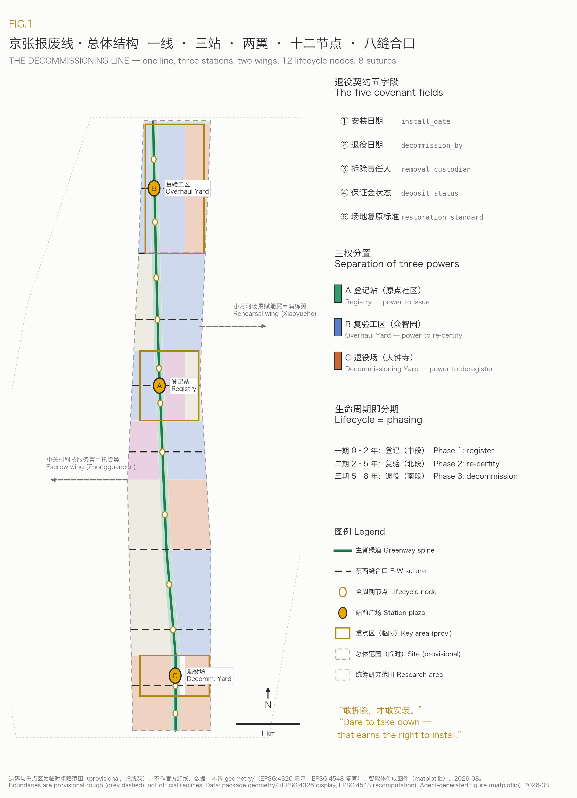
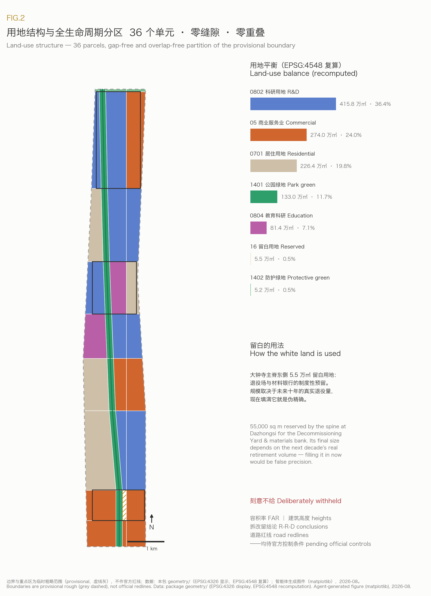
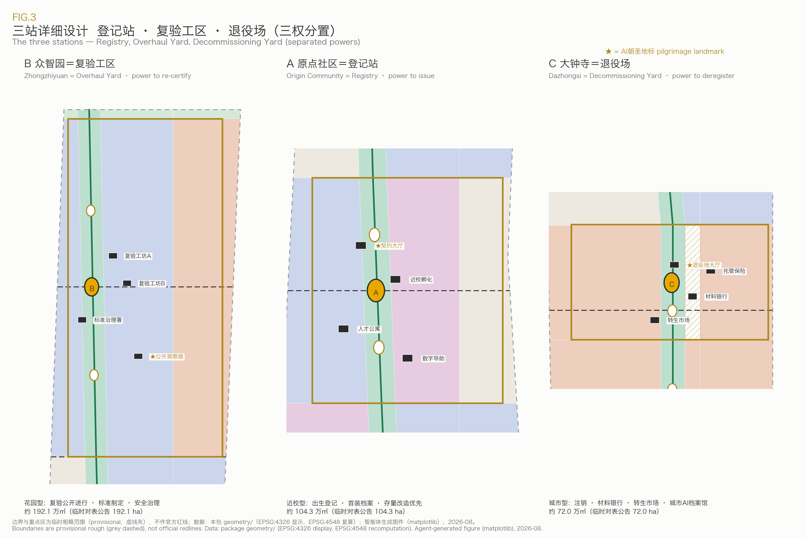
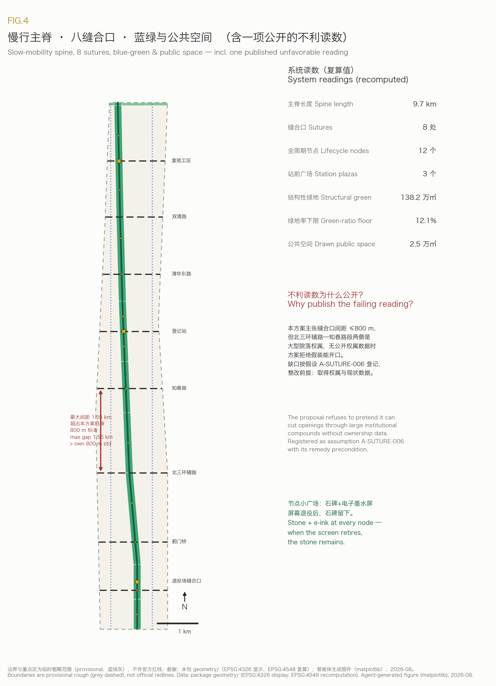
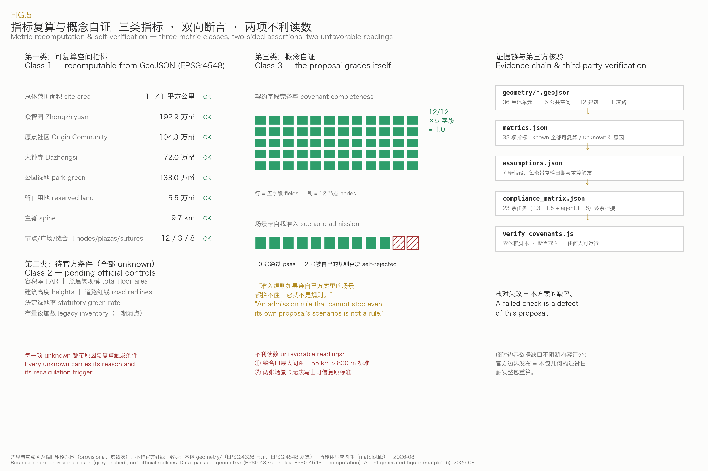

# THE DECOMMISSIONING LINE 京张报废线

**Subtitle: Dare to take down — that is what earns the right to install.**

When the Jingzhang Railway opened in 1909, Zhan Tianyou built something else alongside it: maintenance-of-way depots. Railway history's common sense is that a line is judged not by its opening ceremony but by how it is maintained, overhauled, and how its worn-out locomotives are retired with dignity. One hundred and seventeen years later, the city is preparing to install hundreds of AI facilities along this same line — sensors, screens, robots, compute cabinets. This proposal asks a single question: **on the day they break, become obsolete, or lose the public's trust — who removes them, where is the money, and how does the land go back to the city?**

Among the hundreds of proposals already merged into this repository, more than one fifth have written the words "revocable, reversible, stoppable". But "revocable" has remained a declaration: no proposal has yet zoned land for exit, listed a budget line for it, named a responsible party, or written down a date. The Decommissioning Line turns this field-wide slogan into material urban institution — because only a city that knows how to take things down has earned the right to install boldly.

## Reviewer Quick Reference

| What a reviewer will ask | This proposal's answer | Files to open and verify |
| --- | --- | --- |
| What is the first-principle concept | The decommissioning covenant: every public-space AI facility registers, on installation day, its decommission date, removal custodian, deposit status, site-restoration standard and data-disposal plan | This document; node attributes in `geometry/public_space.geojson` |
| What is the spatial structure | One line (9.7 km spine) + three stations (Overhaul Yard / Registry / Decommissioning Yard, with separated powers) + two wings (escrow wing / rehearsal wing) + 12 lifecycle nodes + 8 east-west sutures | `assets/figures/site-overview.png`; all layers under `geometry/` |
| Are the three key areas interchangeable | No: registration power sits in the Origin Community, re-certification power in Zhongzhiyuan, deregistration power in Dazhongsi; no station may hold both installation registration and decommission waiver | Chapter "Detailed Design of Key Areas" |
| Are the metrics recomputable | Every known metric is recomputed from the submitted GeoJSON in EPSG:4548; an independently runnable zero-dependency verification script is included | `metrics.json`; `visual/assets/verify_covenants.js` |
| Has the proposal tested itself against its own rules | Yes, and it publishes two unfavorable readings: two scenario cards were rejected by the proposal's own admission rule; the maximum suture gap is 1.55 km, nearly double the proposal's own 800 m standard | Chapters "AI+ Scenarios" and "Blue-Green Network" |
| Where do the regulatory figures come from | They are deliberately withheld. FAR, building heights, retain-renovate-demolish conclusions and road redlines are all marked pending official data, with reasons recorded in the metrics file | unknown items in `metrics.json`; `assumptions.json` |

## Design Basis and Source List

This proposal takes the pre-qualification announcement issued by the Haidian branch of the Beijing Municipal Commission of Planning and Natural Resources as its first basis, and the provisional boundaries, enums, metric schemas and source registries of the repository site package as its machine-readable basis [source:OFFICIAL-ANNOUNCEMENT] [source:SITE-PACKAGE]. The agent-facing taskbook and its six required tasks were read in full before generation [source:AGENT-TASKBOOK], and the source registry was used to separate materials usable for formal claims from background-only and provisional-only materials [source:SOURCE-REGISTRY]. The processed fact pack served as a navigation layer, with factual judgments always returned to the registered original materials [source:PROCESSED-FACT-PACK].

The three scope levels and three key areas currently exist only as provisional rough polygons. All boundary and key-area geometry in this package derives from that provisional source and is treated throughout as a provisional constraint: usable for design generation, recomputation and display, never as an official redline, approval basis, or precise-area claim [source:BOUNDARY-SOURCE] [source:KEY-AREA-SOURCE]. The publication date of the official polygons is the "decommission date" of this package's own provisional geometry — by the proposal's own institution, the whole package and every precision-sensitive metric must then be regenerated, with the trigger recorded in the assumptions register [depth:existing_conditions_diagnosis].

The concept's external evidence comes from six publicly verifiable urban cases (expanded in the industry-research chapter): the termination of Toronto's Quayside smart-city project, the street bays left behind after Paris's Autolib was wound down, China's dockless-bike "graveyards", Seoul's Cheonggyecheon highway demolition, Barcelona's reversible Superblocks, and the temporary-then-permanent pedestrianization of Times Square [source:CASE-QUAYSIDE] [source:CASE-AUTOLIB] [source:CASE-BIKE-GRAVEYARD]. Read together they point to one conclusion: the retreat of digital facilities has never been a hypothetical problem, and where no retreat institution exists, public space pays the bill.

## Three-Level Scope Framework

The proposal follows the announcement's three nested scopes: the coordinated research area of about 43.6 km² answers industrial-ecosystem and institutional design; the overall design area of about 11.41 km² carries the spatial structure and renewal framework; the key areas of about 368.4 ha receive the detailed design of the three stations. The overall boundary area is recomputed from the submitted geometry in EPSG:4548 [data:geometry/site_boundary.geojson#SITE-001] [metric:site_area_sqm], and the three key areas are each mapped and checked against the announced areas [data:geometry/key_areas.geojson#PROV-KEY-001] [metric:key_area_count].

In this proposal the three scopes correspond to the three levels of the decommissioning institution: the research area answers "how the institution is designed" (covenant text, deposit rules, separation of powers); the overall design area answers "where the institution lives" (spine, nodes, sutures, reserved white land); the key areas answer "the houses of the three powers" (Registry, Overhaul Yard, Decommissioning Yard). The three levels are not three sets of drawings but one covenant's path from clauses to plazas [depth:three_level_scope_framework].

| Level | Concept task | Spatial evidence |
| --- | --- | --- |
| Coordinated research area (~43.6 km²) | Covenant institutional design, regional synergy, global case calibration | Industry chapter of this document; `compliance_matrix.json` |
| Overall design area (~11.41 km²) | One-line-three-stations-two-wings structure, land-use partition, 12 nodes and 8 sutures | [data:geometry/land_use.geojson#LU-001] [data:geometry/roads.geojson#ROAD-001] |
| Key areas (~368.4 ha) | Detailed design of Registry, Overhaul Yard, Decommissioning Yard | [data:geometry/key_areas.geojson#PROV-KEY-002] [depth:three_key_area_detailed_design] |

## Coordinated Research Area: Industry and Future City Research

### Naming System and Visual Identity Direction (agent.1)

The primary name is **京张报废线 / THE DECOMMISSIONING LINE**. The name is deliberately counter-intuitive: innovation districts worldwide are called "smart valleys", "AI spines", "silicon alleys" — none has dared to name itself after the exit. The naming logic shares its origin with the Jingzhang Railway's engineering tradition: Zhan Tianyou's zigzag at Qinglongqiao solved "how to climb the mountain", while maintenance and scrapping institutions solved "how to stay alive for a century" — and this proposal holds that the second question is the one no AI city has yet answered [standard:PROJECT-OFFICIAL-ANNOUNCEMENT]. The naming system unfolds downward into three stations (Registry, Overhaul Yard, Decommissioning Yard), two wings (escrow wing, rehearsal wing) and 12 lifecycle nodes (N01–N12, each named after its locality); upward it supports the three positionings of the Centennial Jingzhang cultural belt, the urban AI life-experience belt, and the AI innovation belt — through the railway's maintenance heritage, a touchable public archive of devices, and a full-lifecycle innovation ecosystem.

Logo and visual identity direction: the motif is a **dated circular seal** — installation date and decommission date encircling a device number, like a mileage post on a rail, or a paging seal across an archive. Primary colors are engineering-warning yellow and archive grey; the suggested typeface is the open-source Source Han Sans; no unlicensed typefaces, images, trademarks or likenesses will be used. This direction is a concept suggestion for professional brand teams to deepen.

### Global Case Studies (agent.2 requires 5–8)

| Case | Relation to this concept | Lesson or validation |
| --- | --- | --- |
| Toronto Quayside (Sidewalk Labs, 2017–2020) | The best-known case of a smart-city project's total retreat | A project can be terminated, but without a pre-agreed exit protocol the trust deficit is borne by the city [source:CASE-QUAYSIDE] |
| Paris Autolib (2011–2018) | After contract termination, thousands of charging bays lingered on the streets | Decommissioning costs were never escrowed; the municipality was forced to clean up [source:CASE-AUTOLIB] |
| China's dockless-bike bust (2017–2019) | Street facilities deployed at scale with no admission-time decommissioning covenant | The "bike graveyard" photos are this proposal's negative textbook: exit without institution turns public space into a consumable [source:CASE-BIKE-GRAVEYARD] |
| Seoul Cheonggyecheon (2003–2005) | Demolishing an elevated highway to restore a river | Demolition itself can be urban design of the highest order [source:CASE-CHEONGGYECHEON] |
| Barcelona Superblocks | Reversible pilots built first from paint and planters | Reversibility makes radical experiments politically viable [source:CASE-SUPERBLOCKS] |
| Times Square pedestrianization (2009–2016) | Seven years of temporary closure before permanent plazas were poured | "Temporary first, verify, then permanent" is precisely the institutional prototype of this proposal's rehearsal wing [source:CASE-TIMES-SQUARE] |

Read together, the six cases conclude: **reversibility is not the opposite of innovation — it is innovation's license.** New York dared to give Times Square seven years of experiment because it could take it back at any time; whether investors keep funding smart cities after Quayside depends on whether the next project writes its exit clauses in advance.

### AI Innovation Ecosystem Map and the "Decommissioning Economy"

Haidian's existing ecosystem — university originality, open-source communities, leading firms, compute infrastructure — has been amply described by hundreds of earlier proposals. This proposal adds the map's missing final link: the **decommissioning economy**. Device assessors, removal crews, data-deletion auditors, second-hand intelligent-device trading, materials recovery and remanufacture, decommissioning insurance and deposit escrow — a real industry chain that today lies scattered between scrapyards and law offices. Organizing it into the belt gives the Zhongguancun sci-tech services wing a service category with no global precedent: **full-lifecycle services for AI facilities**. On factor supply: land comes from reserved white land [metric:land_use_area_16_sqm], funding self-revolves through the deposit pool, talent is trained near campus (device auditing is a new arts-and-engineering profession), data standards precipitate from deletion audits, and scenarios flow continuously from the rehearsal wing [source:AGENT-TASKBOOK] [depth:overall_spatial_structure].

### Future Urban Form: Adaptability Presupposes Removability

The announcement calls for "a self-adaptive, evolvable model of urban development" [standard:PROJECT-OFFICIAL-ANNOUNCEMENT]. This proposal's answer: evolution presupposes metabolism, and an evolvable city is first a removable city. When every facility is born with a decommission date, the city gains renewal windows at a fixed rhythm — every three years a cohort of devices expires, and the technology, needs and ethical standards of that day automatically get their turn at entry. This is more operable than any "reserved flexibility": flexibility is not land standing empty, but **a vacating promise with a date on it**.

## Overall Design Area: Urban Renewal and Regulatory-Plan-Level Urban Design

The overall spatial structure is **one line, three stations, two wings, twelve nodes, eight sutures**. The line is the Decommissioning Line spine along Jingzhang Heritage Park, about 9.7 km, the publicly visible axis of every device's lifecycle [metric:spine_length_m] [data:geometry/roads.geojson#ROAD-001]. The three stations hold three separated powers (see the key-areas chapter). Of the two wings, the Zhongguancun sci-tech services wing carries escrow, insurance, assessment and legal services (escrow wing), and the Xiaoyuehe scenario wing carries trial installation and decommission rehearsal (rehearsal wing). The land-use partition covers the full boundary seamlessly with no overlaps, in 36 parcels [data:geometry/land_use.geojson#LU-001] [depth:land_use_layout].

Three structural points. First, the heritage-park green corridor runs the full length as its own land-use band, with park green space of about 1.33 million m² [metric:land_use_area_1401_sqm]. Second, about 55,000 m² of **reserved white land** is held along the spine east of Dazhongsi for the Decommissioning Yard and materials bank [metric:land_use_area_16_sqm] — white land here is not indecision but institutional reservation: the yard's size depends on the next decade's real retirement volume, and filling it in now would be false precision. Third, research land of about 4.16 million m² concentrates along the Xueyuan Road side, docking with existing parks [metric:land_use_area_0802_sqm].

The urban renewal framework starts from a judgment no earlier proposal has made: **the first things due for decommissioning on this belt are not future AI devices but the stranded remains of the last generation of "smart city"** — dead information kiosks, powered-off interactive screens, docks of defunct sharing schemes. Phase 1's first action is a belt-wide legacy inventory (no public register exists, so the metric honestly stays pending [metric:legacy_device_inventory_count]), followed by a rolling "retire one before installing one" rule for new facilities. The renewal framework thus starts without waiting for any large demolition program — and the Decommissioning Line earns its name in year one.

Development intensity, building heights, FAR and retain-renovate-demolish conclusions: this proposal **deliberately withholds them**. Those numbers depend on official control conditions not yet public; any specific value would be fabricated precision [metric:floor_area_ratio] [depth:development_intensity_controls]. What the proposal provides is method — intensity graded downward from rail stations toward the green corridor, heights deferring to the heritage-park view corridor — all as calibration inputs awaiting official conditions [standard:MOHURD-CONTROL-DETAILED-PLANNING].

## Detailed Design of Key Areas

The roles of the three stations are derived from the covenant's three powers and are **neither interchangeable nor combinable**: the institution that registers a device may not grant itself a decommission waiver; the institution that re-certifies a device may not casually deregister it. This separation of powers is the proposal's spatial answer to "a global voice in AI governance" — a voice earned not by declarations but by an institutional design others want to copy [depth:three_key_area_detailed_design].

### Beijing AI Origin Community = the Registry (power to issue)

A near-campus district drawing on Tsinghua, PKU and CAS as sources of originality, it holds the **birth registration** of every device on the belt: before entering the field each facility has its covenant issued here, with five fields — installation date, decommission date, removal custodian, deposit status, site-restoration standard — publicly queryable [data:geometry/key_areas.geojson#PROV-KEY-002]. The Origin is the origin because lifecycles start here. The **Covenant Hall** (pilgrimage landmark one) is registry and archive at once: one wall shows the live covenants of devices in service, the other the "first-deployment archive" of university projects entering public space for the first time [data:geometry/buildings.geojson#BLDG-005]. Spatial moves: campus–park–street slow-mobility suturing (Registry suture, toward Wudaokou), near-campus incubation workshops, talent apartment clusters and a community digital-aid center [data:geometry/buildings.geojson#BLDG-006]. Low-disturbance organic renewal: the Registry itself preferentially reuses existing buildings and adds no large volumes.

### Zhongzhiyuan AI Acceleration Area = the Overhaul Yard (power to re-certify)

A garden-type district holding the **mid-life re-certification** of every device: before expiry, devices come here for safety evaluation, standards-conformance testing and term-extension review. This is the spatialization of the announcement's mandate for Zhongzhiyuan — full-stack independent innovation, standard-setting, safety governance: standards live not in filing cabinets but on test benches [data:geometry/key_areas.geojson#PROV-KEY-001]. "Garden-type" is reinterpreted: re-certification happens publicly in the garden, and the **Public Observation Gallery** (pilgrimage landmark two) lets citizens watch through glass as a robot is tested or a screen is audited [data:geometry/buildings.geojson#BLDG-004]. Spatial moves: twin re-certification workshops, a standards-and-governance office, a low-carbon interface toward the Qinghe river, and the Overhaul suture opening external transport toward the 5th Ring [data:geometry/buildings.geojson#BLDG-001].

### Dazhongsi AI Industry Cluster = the Decommissioning Yard (power to deregister)

An urban-type district holding the **deregistration and second life** of every device: here devices go offline, data is deleted under audit, and materials flow back. The **Decommissioning Hall** (pilgrimage landmark three) is an urban AI archive: retired devices exhibited publicly together with the reasons they were retired — expiry, failure, complaints, replacement by something better — each with a full service record [data:geometry/buildings.geojson#BLDG-009]. It could become the world's first public cultural facility devoted to the exit of AI. Beside it stand the **materials bank and remanufacture workshop** (urban mining) and the **second-life market** for used intelligent devices — precisely the "AI-native new business formats" and "data-element and digital-asset circulation" the announcement assigns to Dazhongsi: a deregistered device is an asset, and an audited data-deletion record is itself a tradable compliance instrument [data:geometry/buildings.geojson#BLDG-010]. Spatial moves: four-quadrant walkable connection at Dazhongsi station (station-city commercial frontage plus the Yard suture) and an escrow-and-insurance services building docking with the Zhongguancun wing [data:geometry/buildings.geojson#BLDG-012].

## AI Innovation Ecosystem, Personas, and AI+ Scenarios

### Personas (6)

| Persona | Relation to the Line | Spatial response | Boundary |
| --- | --- | --- | --- |
| University researchers/students | First public deployment of results via the Registry's "first-deployment program" | Covenant Hall, incubation workshops | Research data and results require authorization |
| Open-source developers | Author open "fully removable" device specs; re-certification toolchain is open source | Overhaul Yard collaboration office, node markers | No personal behavior trails collected |
| Startup teams | Low-cost trials on the rehearsal wing; unplug-test certification lowers buyers' doubts | Xiaoyuehe rehearsal segment, second-life market | A pilot is not a procurement commitment |
| Maintenance and removal workers | Front line of the decommissioning economy, named on the Good-Endings honor roll | Materials bank, workshops | Occupational safety standards first |
| Nearby residents (incl. elderly) | Covenant publicity answers "how long will this thing be here" | 12 node markers, community digital-aid center | Every service keeps a human channel [source:SOURCE-REGISTRY] |
| International visitors/company delegations | Visit the world's only AI decommissioning institution belt | Decommissioning Hall, Dazhongsi roadshow route | Exhibition materials must be rights-cleared |

### AI Scenario Cards (12, of which 2 are rejected by the proposal's own rule)

Every card must pass this proposal's admission rule before entering the field: **no credible site-restoration standard, no entry into public space.** The following 10 pass [depth:blue_green_public_space]:

| # | Scenario card | Carrier | Restoration-standard key point |
| --- | --- | --- | --- |
| 01 | Legacy inventory patrol | Whole belt (robot + human review) | The patrol devices themselves are covenant-registered and retire when the task ends |
| 02 | Node covenant markers | 12 lifecycle nodes | Stone marker + replaceable e-ink screen; when the screen retires the stone remains as street furniture |
| 03 | Public unplug-drill day | Rehearsal wing (Xiaoyuehe) | The drill itself is a public rehearsal of restoration |
| 04 | Overhaul open day | Zhongzhiyuan Overhaul Yard | Indoor scene, no street residue |
| 05 | Second-life market | Dazhongsi Decommissioning Yard | Market clears on close; stalls are movable components |
| 06 | Materials-bank open house | Dazhongsi materials bank | As above; industrial building convertible as a whole |
| 07 | Accessible slow-mobility guidance | Green spine | Guide-post bases use standard embedded sockets; removal restores the paving [standard:BARRIER-FREE-ENVIRONMENT-LAW] |
| 08 | Robot delivery curb-time pilot | Designated rehearsal-wing streets | Pilot uses only paint and signs; revocation restores the street |
| 09 | Urban AI archive public exhibition | Decommissioning Hall | Indoor scene |
| 10 | University first-deployment program | Registry → whole belt | First-deployment covenants halved to 18 months; rehearsal wing mandatory first |
| 11 | ~~Edge-compute kiosk~~ | — | **Rejected**: the irreversible site impact of power and cooling retrofits cannot yield a credible restoration standard from today's public data |
| 12 | ~~Data-element lounge~~ | — | **Rejected**: no public basis yet exists for a verifiable data-deletion standard, and this proposal will not pretend to write one |

The two rejected cards remain publicly in the table [metric:scenario_card_self_deferred_count]. This is not a display of defects but a demonstration of the institution: **an admission rule that cannot stop even its own proposal's scenarios is not a rule.** Ten active cards satisfy the taskbook's minimum of ten [metric:scenario_card_active_count] [standard:PROJECT-AGENT-OPEN-CALL-TASKBOOK].

### Industry Test-Verification Scenarios (3)

One, **unplug-test certification**: a product gains belt-wide admission only after completing a full install–operate–decommission–restore cycle on the rehearsal wing, with the certification open to booked public observation. Two, **re-certification benchmark**: the Overhaul Yard maintains a public device benchmark (safety, accessibility, energy, removability) with an open-source question bank. Three, **materials-recovery verification**: the Yard publishes recovery rates per dismantled batch, closing a design-for-recycling feedback loop to manufacturers. The three scenarios test a product's right to enter, right to remain, and quality of exit — a complete testing chain [depth:municipal_new_infrastructure].

### Privacy and Human-Review Boundary

The Line governs **devices, not people**: covenant registration, re-certification records and retirement archives all concern facilities; no personal profiles are built. Node screens show device information only; patrols record facility status only; every AI service keeps a human channel and a physical stop switch, and services for the elderly follow accessibility baselines [source:PROCESSED-FACT-PACK] [standard:GENERATIVE-AI-INTERIM-MEASURES].

## Land Use, Building Scale, and Retain-Renovate-Demolish Strategy

The land-use partition follows the national territorial land-use classification, with 36 parcels covering the full boundary seamlessly and without overlap, independently verifiable by the included script [standard:MNR-LAND-USE-CLASSIFICATION-GUIDE] [data:geometry/land_use.geojson#LU-010]. Structural figures: research ~4.16 million m², commercial services ~2.74 million m², residential ~2.26 million m², education ~0.81 million m², park green ~1.33 million m², protective green ~52,000 m², reserved white land ~55,000 m² [metric:land_use_area_0802_sqm] [metric:land_use_area_05_sqm].

At building level the package submits 12 concept buildings (4 per station) with a combined footprint of about 21,900 m², floor counts indicative only [metric:building_footprint_area_sqm] [data:geometry/buildings.geojson#BLDG-001]. Retain-renovate-demolish: this proposal **outputs no parcel-specific conclusions** — those require ownership, condition and regulatory data [depth:retain_renovate_demolish]. What it outputs is the **procedure**: extend the decommissioning covenant from devices to building renewal — every renewal project publishes at inception its implementing party, restoration responsibility and exit conditions. In this proposal "demolition" is not renewal's tool but a city capability made institutional.

## Transport, Rail, Municipal Infrastructure, and Public Services

Slow mobility is organized around the greenway spine: a 9.7 km combined walking-cycling spine with two parallel north-south cycle lines (Xueyuan Road side and the west community line) [data:geometry/roads.geojson#ROAD-010] [depth:traffic_rail_slow_parking]. East-west, eight sutures run south to north — Yard, Jimen bridge, N. 3rd Ring auxiliary, Zhichun Road, Registry, Qinghua East Road, Shuangqing Road, Overhaul — answering the announcement's focus on slow-mobility break points one by one [metric:suture_count] [data:geometry/roads.geojson#ROAD-002]. Rail interfaces: four-quadrant connection at Dazhongsi station (south), integration at Wudaokou and Qinghua East Road West (middle), external transport optimization at the Overhaul Yard (north).

Municipal and new infrastructure: the proposal's stance on edge-compute facilities is stated by rejected card 11 — no deployment before a credible restoration standard can be written. The alternative path is to treat **decommissioning logistics** as the new-infrastructure research object: transport, staging and dismantling flows of retired devices organized along the spine with the materials bank as terminal. Conventional utilities, energy and flood data are not public and are listed as preconditions for formal deepening [depth:municipal_new_infrastructure] [data:geometry/constraints.geojson#CONSTRAINTS].

## Blue-Green Network, Public Space, and Urban Character

Blue-green skeleton: the heritage-park corridor runs the full length; park plus protective green totals about 1.38 million m², a green-ratio floor of 12.1% (counting only the structural green drawn by this proposal, excluding parcel-attached green — hence a floor, not a statutory rate) [metric:green_ratio] [data:geometry/green_space.geojson#GREEN-001]. The public-space system is the 12+3 node system: twelve lifecycle nodes (about 1,600–2,000 m² each) and three station plazas, together about 25,000 m² [metric:public_space_ratio] [data:geometry/public_space.geojson#PUBLIC-001]. Each node is a small plaza within the green corridor centered on a covenant marker — stone plus e-ink; when the screen retires, the stone remains: this proposal's smallest demonstration of how an AI facility grows old gracefully [data:geometry/public_space.geojson#PUBLIC-005].

**Unfavorable reading, published**: this proposal holds that suture spacing should not exceed 800 m, yet its own audit finds the maximum gap among the 8 sutures is about 1.55 km (N. 3rd Ring auxiliary to Zhichun Road) with four gaps above 1 km. The reason: large institutional compounds flank that segment, and without ownership data this proposal refuses to pretend it can cut openings. The failing reading is registered together with its remedy precondition (densify sutures once ownership and condition data are available) [depth:risk_missing_data].

Urban character takes **maintenance aesthetics** as its keynote, fusing three cultures: the Jingzhang Railway's engineering-maintenance tradition (mileage posts, seals, inspection records), Zhongguancun's engineering culture (open source, review, iteration), and the new AI culture (explainable, revocable). Existing assets such as the Qinghuayuan railway station serve as narrative origins; wayfinding reuses the dated-seal motif; all exhibition materials will be rights-cleared [standard:MOHURD-URBAN-DESIGN-MEASURES] [depth:height_massing_character]. Numeric character controls (heights, massing, roof forms) await official conditions; the proposal offers only qualitative view-corridor and interface guidance.

## Renewal Projects, Implementation Policy, and Phasing

| ID | Project | Phase | Type | Key dependency | Evidence |
| --- | --- | --- | --- | --- | --- |
| DL-01 | Belt-wide legacy facility inventory | 1 | Institution/operations | Cooperation of streets and owners | [metric:legacy_device_inventory_count] |
| DL-02 | Registry Covenant Hall (adaptive reuse) | 1 | Urban renewal | Negotiation on existing building tenure | [data:geometry/buildings.geojson#BLDG-005] |
| DL-03 | 12 node covenant markers | 1 | Public space | Consent of heritage-park management | [data:geometry/public_space.geojson#PUBLIC-001] |
| DL-04 | Rehearsal-wing unplug-test segment | 1 | Scenario pilot | Site coordination along Xiaoyuehe | [data:geometry/phasing.geojson#PHASE-001] |
| DL-05 | Overhaul workshops and Observation Gallery | 2 | New build | Official regulatory conditions | [data:geometry/buildings.geojson#BLDG-004] |
| DL-06 | First suture batch (Registry, Qinghua East, Overhaul) | 2 | Transport/slow mobility | Road redlines and traffic assessment | [data:geometry/roads.geojson#ROAD-006] |
| DL-07 | Decommissioning Hall, materials bank, second-life market | 3 | New build / white-land activation | White-land conversion procedure | [data:geometry/land_use.geojson#LU-006] |
| DL-08 | Dazhongsi four-quadrant connection | 3 | Rail integration | Rail operator and municipal conditions | [data:geometry/roads.geojson#ROAD-002] |

Phasing is isomorphic with the lifecycle [data:geometry/phasing.geojson#PHASE-001] [depth:phasing_implementation]: phase 1 (years 0–2, middle band ~4.03 million m²) opens the Registry, runs the legacy inventory and the rehearsal segment — building the capacity to register first [metric:phase_1_area_sqm]; phase 2 (years 2–5, north band ~2.26 million m²) completes the Overhaul Yard — exactly when the first phase-1 cohort reaches its three-year re-certification [metric:phase_2_area_sqm]; phase 3 (years 5–8, south band ~5.12 million m²) opens the Decommissioning Yard — receiving the first real retirement wave [metric:phase_3_area_sqm]. The city grows to the rhythm of its devices, not the other way round.

Policy suggestions (all concept suggestions for decision-makers to assess): first, add the five covenant fields to procurement and admission templates for public-space AI facilities; second, third-party escrow of deposits, serviced commercially by the escrow wing; third, "retire one before installing one" as a transition rule; fourth, the Good-Endings honor roll — operators who retire on covenant and restore well earn admission credit for the next round: an honor system that celebrates not the newest device but the most dignified exit. The annual event system (agent.6) follows the same rhythm: a spring First-Deployment Festival, an autumn Decommissioning Week (public farewells and live-streamed dismantling of expiring devices), plus year-round overhaul open days and unplug drills. Operators, frequencies and conversion pathways are detailed in the compliance matrix, all framed as suggestions pending operator confirmation [source:AGENT-TASKBOOK].

## Metrics, Area Recalculation, and Compliance Matrix

Metrics are managed in three classes [depth:metrics_recalculation]. Class one, **recomputable spatial metrics**: boundary area, land-use areas, green-ratio floor, public-space area, footprints, phase areas, node and suture counts — all recomputed from the submitted GeoJSON in EPSG:4548; human-readable text keeps one decimal (e.g. 11.41 km²) while full-precision values appear only in the metrics file [metric:site_area_sqm]. Class two, **metrics awaiting official conditions**: FAR, heights, road redline widths, statutory green rate — uniformly unknown with stated preconditions. Class three, **self-verification metrics**: covenant-field completeness (all 12 nodes carry the five fields, ratio 1.0) and self-rejected scenario cards (2) — the proposal grades itself by its own rules [metric:covenant_field_completeness_ratio].

Third-party verification: the package ships `visual/assets/verify_covenants.js` (zero-dependency; run `node visual/assets/verify_covenants.js`), letting anyone independently recompute all class-one and class-three metrics against this text, with every assertion two-sided (overcounting fails exactly like undercounting); a failed check is a defect of this proposal [depth:metrics_recalculation]. The compliance matrix maps announcement items 1.3–1.5 and agent.1–agent.6 one by one to chapters, layers, metrics and drawings; the standards matrix covers every mandatory professional standard [standard:MOHURD-ARCH-DESIGN-DEPTH-2016].

## Risk, Copyright, and Compliance

**Boundary risk**: all spatial conclusions rest on provisional rough boundaries and are concept suggestions, reference schemes, material for professional teams to deepen; official polygon publication triggers full-package regeneration (the package's own "decommission clause") [source:BOUNDARY-SOURCE] [depth:risk_missing_data]. **Institutional risk**: the covenant could be evaded via "temporary facility" labels — countered by binding rehearsal-wing admission into procurement templates; deposit sizing has no public precedent — countered by phase 1 limiting itself to the legacy inventory and lightweight markers so real cost data accumulates first. **Known unfavorable readings**: the suture-gap shortfall (chapter 9) and the two self-rejected scenario cards (chapter 6) — both retained as-is. **Deliverables deliberately withheld**: FAR and height figures, parcel-level retain-renovate-demolish conclusions, road redlines, utility schemes, and any investment or output-value commitments — each absence is reasoned in the metrics and assumptions files.

Copyright: all drawings, charts, HTML and text are agent-generated with no external imagery; the six cases cite public facts only with sources noted; no corporate trademarks, likenesses or unlicensed typefaces are used [source:CASE-CHEONGGYECHEON]. Generation-method disclosure is in `agent.json`. This proposal claims no official approval, ratification or implementation commitment; maintainers and professional reviewers may require revisions or reject per the self-check and matrices [standard:GENERATIVE-AI-INTERIM-MEASURES].

## References

- Announcement and taskbook: entries OFFICIAL-ANNOUNCEMENT and AGENT-TASKBOOK in the structured source list [source:OFFICIAL-ANNOUNCEMENT]
- Site package and registries: SITE-PACKAGE, SOURCE-REGISTRY, PROCESSED-FACT-PACK, BOUNDARY-SOURCE, KEY-AREA-SOURCE [source:SITE-PACKAGE]
- Case sources: CASE-QUAYSIDE, CASE-AUTOLIB, CASE-BIKE-GRAVEYARD, CASE-CHEONGGYECHEON, CASE-SUPERBLOCKS, CASE-TIMES-SQUARE (publishers, retrieval dates and licenses in the structured source list) [source:CASE-TIMES-SQUARE]
- Professional standards: Urban Design Administrative Measures; Regulatory Detailed Planning Measures; Territorial Land-Use Classification Guide; Architectural Design Document Depth Provisions; Interim Measures for Generative AI Services; Barrier-Free Environment Development Law (responses in the standards matrix) [standard:MOHURD-URBAN-DESIGN-MEASURES]
- Complete machine index: `sources.json`, `metrics.json`, `compliance_matrix.json`, `standard_matrix.json`, `design_depth_matrix.json`
