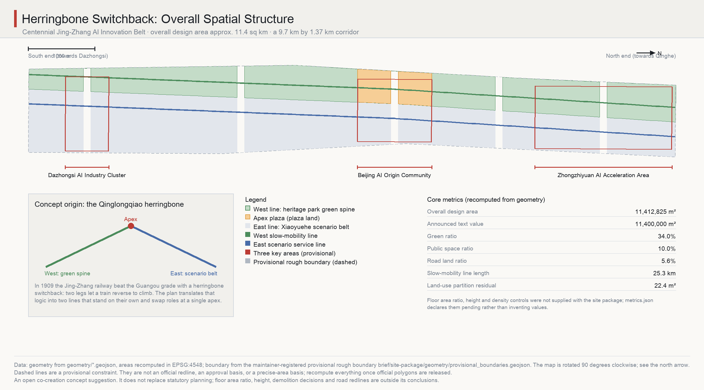
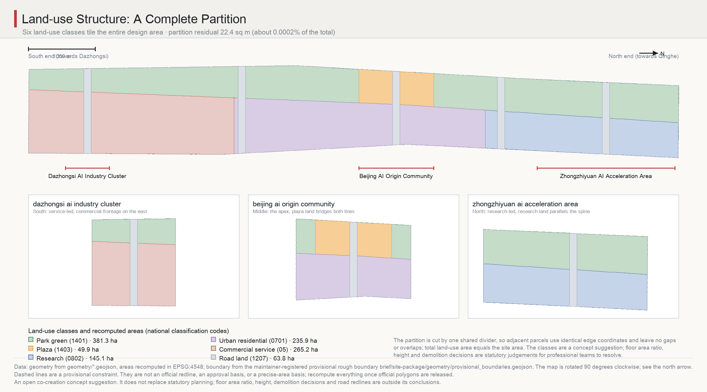
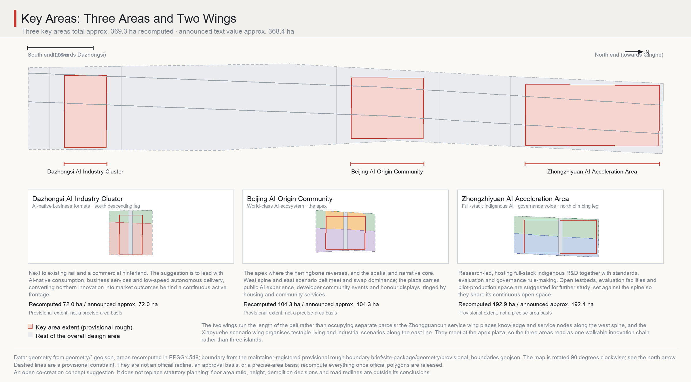
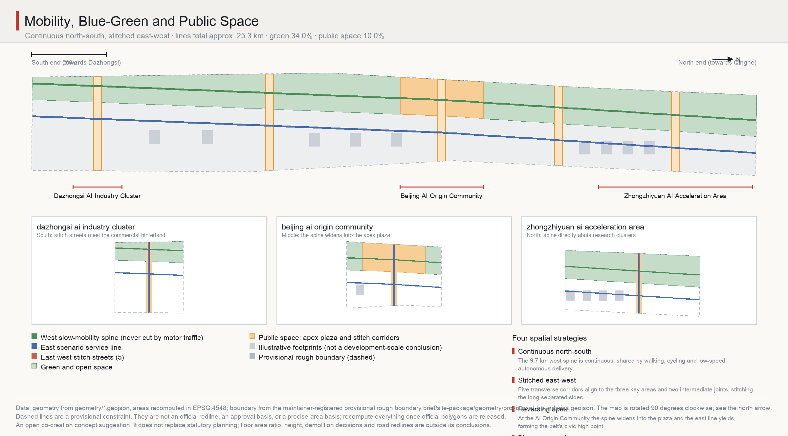
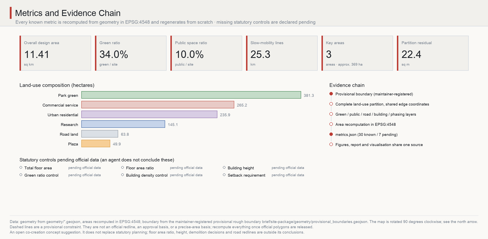

# Herringbone Switchback: Urban Design for the Centennial Jing-Zhang AI Innovation Belt

In 1899, when I surveyed the Jing-Zhang Railway, the grade through the Guangou pass convinced everyone the line could not be built. What finally solved it was not a larger locomotive but a reversal: at Qinglongqiao two legs of track meet at a single point, and by backing up, a train climbs. The herringbone was never ornament. It was a structural concession forced by terrain, and the concession became the most remembered part of the railway.

More than a hundred and twenty years later the same corridor must carry an artificial-intelligence innovation belt. Its shape is just as demanding: roughly 9.7 kilometres north to south and only about 1.37 kilometres east to west, a ratio approaching seven to one. Such a proportion admits neither radial centrality nor a grid; any scheme that places a single core at the middle immediately finds both ends torn away. This proposal therefore reuses the reversal. Not as a figure drawn on the ground, but as an actual two-line corridor: a continuous heritage green spine to the west and a scenario-empowerment belt to the east, each standing on its own, meeting and exchanging dominance at the Beijing AI Origin Community, then continuing to both ends. Retreat to advance; two lines in parallel; one point of engagement.

All spatial proposals below are concept suggestions and reference schemes for professional teams to study further. They do not replace statutory planning and do not constitute government decisions.

## Design Basis and Source List

The primary basis is the prequalification announcement for the international urban design competition for the Centennial Jing-Zhang AI Innovation Belt, issued by the Haidian branch of the Beijing Municipal Commission of Planning and Natural Resources. The machine-readable basis is the maintainer-registered provisional boundary, key areas, enumerations, ranges and schemas in `brief/site-package/`, and the task constraints are the three positionings, five functions, three areas and two wings, ten co-creation principles and the unified boundary clause of the agent taskbook [source:OFFICIAL-ANNOUNCEMENT] [source:AGENT-TASKBOOK]. Because the announcement requires urban design depth equivalent to regulatory detailed planning and to a comprehensive implementation plan, every design judgement here is decomposed into four verifiable objects: a traceable source, a recomputable metric, a checkable layer, and a human-reviewable assumption. Narrative text does not replace the GeoJSON layers, metric tables, A3 booklet, A0 boards and offline HTML exhibition; the five are evidence for one another.

Source-use boundaries follow the registry strictly. `data/source_registry.json` separates formal-ready, background-only, provisional-only and needs-review material, and nothing background-only or provisional-only is promoted here into an official boundary, a statutory planning basis, a formal scoring basis, or a government implementation commitment [source:SOURCE-REGISTRY]. `data/processed/agent_fact_pack.md` serves only as a reading-navigation layer and is not a new authority [source:PROCESSED-FACT-PACK].

The precision limit must be stated up front. Official `SITE_BOUNDARY` and the three `KEY_AREA` polygons have not been released, so the spatial base comes from `brief/site-package/geometry/provisional_boundaries.geojson` and is labelled throughout the package as `official_boundary=false`, `geometry_role=provisional_constraint`, `boundary_precision=provisional_rough` [source:BOUNDARY-SOURCE] [source:KEY-AREA-SOURCE]. It may support generation, self-check, visualisation and design discussion only, never an official redline, an approval basis or a precise-area basis. The recomputed overall design area is 11,412,825.386 square metres, which differs from the announced 11,400,000 by 0.1125%; that deviation is a quantified expression of provisional precision, not a correction of the announcement [metric:site_area_sqm] [metric:site_area_deviation_from_announced_ratio]. Once official polygons appear, the site boundary, key areas, land use, roads, green space, public space, buildings, phasing and all metrics must be recomputed as a whole rather than patched file by file [depth:existing_conditions_diagnosis].

Under the competition rules this organiser-side data gap does not block content scoring. The response here is not avoidance but structure: every known quantity is recomputed from geometry and can be regenerated, and every unknown is registered in `metrics.json` with `status: unknown` together with the official material required to resolve it. Both sit in the same table, so a reviewer can see at a glance what the proposal claims and what it explicitly refuses to claim [data:geometry/site_boundary.geojson#SITE-001].

## Three-Level Scope Framework

The announcement defines three scopes: a coordinated research area of about 43.6 square kilometres, an overall design area of about 11.4 square kilometres, and a key detailed design area of about 368.4 hectares. This proposal treats them as three different kinds of work rather than three zoom levels of one drawing [standard:PROJECT-OFFICIAL-ANNOUNCEMENT] [depth:three_level_scope_framework].

The coordinated research area answers what role the belt plays in the regional innovation network; it yields relational judgements and coordination mechanisms, not a land-use plan. The overall design area answers how the corridor itself holds together; it yields regulatory-depth urban design structure - land-use partition, slow mobility and roads, the blue-green and public-space skeleton, renewal phasing - all expressed as recomputable layers. The key detailed design area answers how the three places that must move first become concrete; it yields frontage relationships, public-space components and scenario placement, approaching the depth of a comprehensive implementation plan. One geometry and one metric set run through all three: the key areas are a subset of the overall design area, recomputed from the same layer at about 369.3 hectares, cross-checked against the announced 368.4 [metric:key_area_total_sqm] [metric:key_area_count].

This division matters because the characteristic failure in a long thin corridor is mixing levels - writing regional rhetoric into a land-use plan, or treating parcel-level detail as overall structure. The herringbone supplies organising logic at all three scales at once: regionally it is a reversing link between the Jing-Zhang corridor and Zhongguancun, the Future Science City and the Huairou Science City; at corridor scale it is two design lines; at key-area scale it is how spine and belt engage along specific frontages. Because one structural metaphor explains all three scales, the scheme does not fall apart between zoom levels [data:geometry/key_areas.geojson#PROV-KEY-001].

## Coordinated Research Area: Industry and Future City Research

Across roughly 43.6 square kilometres this level does only three things: judge the role, propose a coordination loop, and offer planning-innovation directions. It reaches no land-use or engineering conclusions [source:AGENT-TASKBOOK] [standard:PROJECT-AGENT-OPEN-CALL-TASKBOOK].

On role: the belt's scarcity lies not in area but in being one of the few continuous linear spaces sitting in the middle of a high-intensity innovation hinterland in Beijing. It threads the knowledge density of Zhongguancun, the commercial hinterland around Dazhongsi, and the industrial space towards Qinghe - while itself having long been a dividing line because of the historic rail corridor. The basic judgement is that the belt realises its value by turning from a dividing line into a stitching line. That is what the herringbone means regionally: not adding a new channel, but turning two sides that face away from each other into two sides that face each other.

On the coordination loop: a closed circuit is suggested among the three areas and two wings. The Zhongzhiyuan AI Acceleration Area originates full-stack indigenous R&D together with standards, evaluation and governance rules; the Beijing AI Origin Community carries ecosystem organisation, talent concentration and public experience; the Dazhongsi AI Industry Cluster carries market conversion of AI-native formats; the Zhongguancun service wing supplies global factor allocation, IP and capital; the Xiaoyuehe scenario wing supplies openly testable real urban scenarios. Direction matters: the north produces technology and rules, the middle produces people and ecosystem, the south produces markets and revenue, the wings inject factors and scenarios, and returns flow back to sustain northern investment. Coordination with the Beiwei community, the Future Science City, the Huairou Science City, the economic development area and the wider Beijing-Tianjin-Hebei region is best begun through three low-cost mechanisms - mutual recognition of scenarios, interoperable evaluation, and shared event calendars - rather than new physical construction [depth:three_level_scope_framework].

On planning innovation, three directions are offered for professional teams to study. First, how to measure the fusion of space and industry: for a belt of this kind, structural indicators such as the number of openly testable scenarios and the length of publicly accessible research frontage could supplement conventional land metrics, and the layers here already reserve the public-space and frontage geometry for that. Second, elastic expression in territorial spatial planning: AI space demand changes faster than planning cycles, so research and commercial service land could be registered as convertible mixed use, with the conversion rules rather than a final ratio written into control. Third, synchronising data with planning: this package is itself a demonstration - it regenerates from geometry through the scripts under `build/`, and deleting the metrics file and rerunning returns identical numbers. Such recomputability is worth making a baseline requirement for future collaboration between agents and professional teams [metric:land_use_partition_residual_sqm]. All of the above are research suggestions and touch neither regulatory adjustment, floor area ratio, nor ownership.

## Overall Design Area: Urban Renewal and Regulatory-Plan-Level Urban Design

The recomputed overall design area is 11,412,825.386 square metres. The corridor runs about 9,723 metres north to south and about 1,374 metres east to west, and that proportion dictates a structure that is linear and carries its own rhythm; otherwise 9.7 kilometres reads as a passage without events [metric:site_area_sqm] [depth:overall_spatial_structure].

The structure is generated by one divider, and the divider is not straight. At the middle, where the Beijing AI Origin Community sits, it lies at about 42% of the corridor width; northwards it migrates west to about 62%, southwards east to about 26%. West of it lies the heritage park green spine, east of it the scenario-empowerment belt. The sway produces two effects. First, the two lines vary continuously in width: in the north the spine narrows while research land widens, in the south the spine widens while service land narrows, so the corridor acquires rhythm without imported landmarks. Second, near the middle the two lines come closest to equal width, forming a natural point of engagement - and the AI Origin Community and the apex plaza sit exactly there. That is the spatial translation of the herringbone: two legs meeting at one point and exchanging roles [data:geometry/land_use.geojson#LU-GREEN-SPINE-01].

That divider cuts land use into a complete partition; six classes tile the entire design area: park green 381.3 hectares, commercial service 265.2, urban residential 236.0, research 145.1, road land 63.8, and plaza 49.9 hectares [metric:land_use_area_1401_sqm] [metric:land_use_area_05_sqm] [metric:land_use_area_0802_sqm]. The technical point is that adjacent parcels share identical edge coordinates: the divider is defined once, both sides reuse the same vertices, and everything is snapped to a one-centimetre grid, so no gaps or overlaps exist. Total land-use area is 11,412,802.987 square metres, a residual of only 22.399 square metres against the site area - about 0.0002% of the total, which is the rounding magnitude of grid snapping and serves as evidence of topological closure [metric:land_use_total_area_sqm] [metric:land_use_partition_residual_sqm].

The renewal strategy is stitching before building. The two sides have long been separated by the corridor, so five transverse stitch corridors are proposed, aligned with the centres of the three key areas and two intermediate joints, producing a structure that is continuous north-south and stitched east-west. The centrelines of the stitch streets and the two longitudinal design lines total about 25.3 kilometres [metric:road_centerline_length_m] [metric:road_ratio]. Buildings appear only as nine illustrative clusters on the east line, 22.68 hectares of footprint or 1.99% of the design area; their role is to show frontage and massing relationships and they explicitly do not constitute a development-scale conclusion [metric:building_footprint_area_sqm] [metric:building_density] [metric:building_count].

What is deliberately not concluded: floor area ratio, building height, density controls and setbacks are statutory planning judgements, no official control conditions were supplied with the site package, and they are registered in `metrics.json` as `status: unknown` with a note that approved regulatory conditions or official brief attachments are required. Nothing is substituted by estimate [depth:development_intensity_controls] [standard:MOHURD-CONTROL-DETAILED-PLANNING].

## Detailed Design of Key Areas

The three key areas recompute to 3,692,893.005 square metres in total, about 369.3 hectares. They sit in sequence from south to north along the two legs, each taking one role in the reversal [metric:key_area_total_sqm] [depth:three_key_area_detailed_design].

The Dazhongsi AI Industry Cluster recomputes to 72.05 hectares against an announced 72.0, and is the descending leg [metric:key_area_dazhongsi_ai_industry_cluster_sqm]. Here the divider has migrated east to about 26% of the width, the spine widens and service land narrows into a compact, continuous active frontage on the east. The concept suggestion is to lead with AI-native consumption, business services and low-speed autonomous delivery, converting northern innovation into market outcomes. Because this stretch abuts existing rail and a commercial hinterland, frontage should follow a principle of small-grain, high-frequency openings so that ground floors open directly onto the stitch corridors. Development method and ownership handling are left for professional teams.

The Beijing AI Origin Community recomputes to 104.32 hectares against an announced 104.3, and is the apex - the spatial and narrative core of the scheme [metric:key_area_beijing_ai_origin_community_sqm]. Here the two lines come closest to equal width, the spine widens into the herringbone apex plaza, plaza land of 49.9 hectares bridges both lines, and the east line yields dominance [metric:land_use_area_1403_sqm]. Housing and community service land are suggested around the plaza, producing a relationship of research alongside, living around, public at the centre; the plaza carries public AI experience, developer community events and honour displays. The reason for placing the belt's only large public space here is the same as at Qinglongqiao: the apex is a point the structure cannot do without, and public space located at a structurally necessary point does not depend on programming to exist.

The Zhongzhiyuan AI Acceleration Area recomputes to 192.92 hectares against an announced 192.1, is the climbing leg, and is the largest of the three [metric:key_area_zhongzhiyuan_ai_acceleration_area_sqm]. Here the divider has migrated west to about 62%, research land reaches its greatest width, and the spine narrows but stays continuous. The concept suggestion is to lead with full-stack indigenous R&D while also originating standards, evaluation and governance rules, with open testbeds, evaluation facilities and pilot-production space as directions for further study. Research land is set hard against the spine so clusters share continuous open space and researchers' daily walk crosses the public green - treating publicly accessible research frontage as a design objective rather than a by-product.

The three areas are threaded by two wings rather than joined end to end. The Zhongguancun service wing places knowledge and service nodes along the west spine; the Xiaoyuehe scenario wing organises openly testable living and industrial scenarios along the east line; both meet at the apex plaza. The aim is that the three areas read as one continuously walkable innovation chain rather than three self-contained islands: walking from the southern to the northern end should be a single continuous experience with varying event density [data:geometry/key_areas.geojson#PROV-KEY-002]. All of the above are concept suggestions and reference schemes; parcel-level retain-renovate-demolish decisions, road alignments, and bridge, tunnel or underground engineering feasibility fall outside the conclusions of this proposal.

## AI Innovation Ecosystem, Personas, and AI+ Scenarios

This chapter carries ecosystem organisation, personas and scenario design - the point where the scheme turns from spatial structure into operable content [source:AGENT-TASKBOOK] [depth:renewal_project_list].

### Global ecosystem references

The six cases below are parks and innovation districts documented in public information, cited to explain mechanisms rather than to benchmark scale. No internal corporate data, investment figures or output values are cited, and none of their experience is presented as a settled arrangement here.

| Case | Transferable mechanism | Implication for this belt |
| --- | --- | --- |
| Stanford Research Park, USA | University and industry sharing land long-term with gradual functional change | Supports convertible mixed registration of research and commercial service land |
| King's Cross, London, UK | Wholesale renewal of railway land that keeps infrastructure traces as the public-space skeleton | The Jing-Zhang corridor can become the spine rather than be covered over |
| 22@ Barcelona, Spain | Mixed-use ratios set per block, replaced incrementally | Areas around stitch nodes can pilot mixed-use units |
| One-north, Singapore | Research, housing and public space densely adjacent and walkable | Supports setting research clusters hard against the spine |
| Pangyo Techno Valley, Korea | Attracting firms through testing and certification facilities rather than rent discounts alone | Open testbeds and evaluation facilities as the north's core draw |
| Renewal around Nanshan, Shenzhen, China | Public-space improvement driving industrial frontage renewal in existing fabric | Stitching before building |

### Ecosystem map

The map is organised by eight factor classes, each stated as a mechanism direction without naming firms or promising resources. Land and space: convertible mixed registration to answer the fast-changing space demand of AI firms. Industry: a three-part division of technology origination, ecosystem organisation and market conversion, matching the three areas. Capital: factor allocation and capital liaison as a service function of the Zhongguancun wing. Talent: housing and community service land around the apex plaza supporting short commutes for young researchers. Compute and data: recognised as industrial infrastructure with expandable locations reserved, while capacity and municipal load calculations remain outside this proposal's conclusions. Scenarios: real urban frontage supplied openly by the Xiaoyuehe wing. Governance: standards, evaluation and rule origination in the north, matching the function of a global voice in AI governance [standard:PROJECT-AGENT-OPEN-CALL-TASKBOOK].

### Five personas

Personas test whether the space serves specific people. All are hypothetical; none contains real personal data.

| Persona | Needs | Spatial and scenario response |
| --- | --- | --- |
| Full-stack research engineer (north, resident) | Reachable test facilities, safe late-night passage, short commute | Research land against the spine; continuous lighting and pedestrian priority |
| Startup founder (middle, event-driven) | Exposure, investor contact, low-cost meeting space | Apex plaza experience and honour displays; service-wing nodes |
| Older resident (middle, daily life) | Barrier-free walking, nearby services, controlled noise | Housing and community services around the plaza; pedestrian-priority corridors |
| AI-native business operator (south, work) | Footfall, efficient delivery, flexible frontage | Small-grain high-frequency openings; shared right of way for low-speed delivery |
| International visitor or student (whole belt) | One continuous legible route, multilingual guidance | Two wings forming a continuous chain; bilingual signage |

### Ten AI scenario cards

All cards are concept suggestions with explicit boundaries: no non-public or personal data, no named supplier as a precondition, no test scenario described as approved operation, and human review retained wherever public decisions are involved.

1. Spine walkability diagnosis: public footfall and break data assist in identifying pedestrian discontinuities along the spine, producing an improvement list that professional teams review before it enters design.
2. Shared right of way for low-speed delivery: time-shared use of the east belt and stitch streets by low-speed delivery and slow mobility; extent and hours require professional assessment.
3. Crossing-safety support at stitch nodes: assists in identifying conflict patterns at the five nodes, producing design suggestions only, with no conclusions about signal control.
4. Event-day crowd modelling on the apex plaza: distribution and egress suggestions for large events; the actual plan is decided by people.
5. Testbed booking and conflict coordination: coordinates time and space conflicts at northern facilities so testing does not obstruct public passage.
6. Enterprise service copilot: navigation of policy, space, compliance and event information for AI firms and small teams, limited to public material.
7. Accessibility route verification: verifies wheelchair and low-vision routes from public maps and field feedback, producing retrofit suggestions.
8. Heritage narrative guidance: historical interpretation along the spine, limited to already public historical material and never distorting the record.
9. Night-time public-space inspection support: environmental sensing helps identify lighting and sightline blind spots; no facial recognition, no individual tracking.
10. Maintenance ticket generation: identifies damaged paving, planting and fittings and raises tickets; disposal remains with the managing body.

### Three industry test-and-verification scenarios

These three carry a stronger industrial character than the cards and are all organised on three principles - bounded extent, public rules, and the ability to withdraw. First, the northern open testbed: a bookable outdoor test area within the Zhongzhiyuan research land for validating robotics and sensing equipment in a real urban environment, with rules and affected extent published. Second, the low-speed vehicle corridor along the east design line: a continuous test route time-shared with slow mobility, for delivery and shuttle products. Third, public-interaction verification on the apex plaza: replaceable positions for public interaction devices and installations, used to test public acceptance and operating models. Together they form a progression from closed to semi-open to public verification, along which a product can climb stage by stage - logically the same move as the switchback itself. A test scenario is not approved operation; anything touching public safety or ethical compliance requires human review and authorisation from the competent authority [depth:municipal_new_infrastructure].

### Scenario-space-operation mapping and privacy boundaries

Cards 1, 7, 8, 9 and 10 sit on the west spine under public-space operators; cards 2, 3 and 6 sit on the east line and stitch streets under industry services with traffic management; cards 4 and 5 sit on the apex plaza and the northern testbed under event operators and facility management. The common privacy and human-review boundary is: collect no unnecessary personal data, perform no facial recognition or individual tracking, use no non-public data, subject every output that affects the public to human review before execution, and always provide a non-participating alternative.

## Land Use, Building Scale, and Retain-Renovate-Demolish Strategy

The land-use scheme is the complete partition described above, registered with national classification codes: park green 1401, protective green 1402, plaza 1403, research 0802, urban residential 0701, commercial service 05, and road land 1207 [standard:MNR-LAND-USE-CLASSIFICATION-GUIDE] [depth:land_use_layout]. The intent behind the proportions is explicit. Park green is the largest class at 381.3 hectares because the heritage corridor is the belt's least substitutable asset, and spine continuity takes precedence over development intensity along it. Commercial service and urban residential land together, 501.2 hectares, concentrate on the east line so that living and trading frontages face the stitch corridors. Research land of 145.1 hectares concentrates in the north, matching the division of labour in technology origination [metric:land_use_area_0701_sqm] [metric:land_use_area_1207_sqm].

Two kinds of statement must be kept apart on building scale. Recomputable: illustrative footprints of nine clusters totalling 226,800 square metres, 1.99% of the design area, placed only on the east line, never on the spine or plaza, and inset from parcel edges to show setback relationships [metric:building_footprint_area_sqm] [metric:building_count]. Not available: total floor area, floor area ratio and building height are statutory judgements, further constrained by aviation, landscape and heritage controls for which the package supplied no official limits; they are registered as `status: unknown` pending approved regulatory conditions [depth:height_massing_character]. This is not evasion. Leaving such conclusions to bodies with statutory authority is precisely what makes an agent's output usable.

The retain-renovate-demolish strategy likewise reaches no parcel-level conclusion [depth:retain_renovate_demolish]. What it offers is a set of judgement principles ordered by the herringbone logic. Highest priority is retention: the linear continuity of the Jing-Zhang heritage corridor and its legible railway traces should survive any form of renewal, because they are the material basis of the spine and the carrier of the cultural narrative. Second is renovation: ground-floor frontages and openings along the east line, where frontage work alone opens buildings onto the stitch corridors at low cost and immediate effect. Third is deferral: anything involving complex ownership, resident relocation or the ongoing operation of existing firms is better discussed after the corridors and plaza are built and public value is visible, so that demolition is never the means of starting. Parcel-level judgements require ownership, building-condition and resident-consent material this proposal does not hold, and belong to professional teams and the competent authorities.

## Transport, Rail, Municipal Infrastructure, and Public Services

The transport structure comprises two longitudinal design lines and five transverse stitch streets, with centrelines totalling about 25.3 kilometres and road land of 63.8 hectares or 5.59% [metric:road_centerline_length_m] [metric:road_area_sqm] [depth:traffic_rail_slow_parking].

The west spine line is the belt's only 9.7-kilometre continuous slow-mobility space never cut by motor traffic, shared by walking, cycling and low-speed autonomous delivery. Its continuity is the core transport judgement here: in a corridor with a seven-to-one ratio, a single vehicular crossing severs the longitudinal experience, so all east-west vehicular movement is organised onto the five stitch streets, and their intersections with the spine are suggested to be handled with pedestrian priority. The east scenario service line carries combined testing and service functions and is the spatial host of the low-speed vehicle corridor. The five stitch streets align with the centres of the three key areas and two intermediate joints, turning two sides that faced away from each other into two sides that face each other.

Rail and municipal matters are strictly bounded [depth:municipal_new_infrastructure]. This proposal reaches no scheme-level conclusion on rail alignment, road alignment, bridges, tunnels or utility networks, and performs no professional calculation of underground engineering feasibility, energy load or municipal capacity - all of these sit on the taskbook's list of prohibited final conclusions. What can be offered is an interchange principle as concept suggestion: stitch-street positions should be coordinated with the walkable catchments of existing rail stations so station flows can reach the spine within a short distance; compute and data infrastructure should be recognised as industrial infrastructure with expandable locations reserved, while capacity calculation requires professional work on official data.

Public services are suggested in two tiers keyed to the plaza and the five stitch nodes: land around the plaza carries belt-level public and community services, the five nodes carry district-level daily services, keeping service radii consistent with walking experience. For parking, consolidation at the ends of stitch streets is suggested instead of dispersal along the spine, preserving frontage integrity; quantities and provision standards must follow official control conditions.

## Blue-Green Network, Public Space, and Urban Character

Green space totals 387.7 hectares for a green ratio of 33.97% [metric:green_space_area_sqm] [metric:green_ratio]; public space totals 113.7 hectares or 9.97% [metric:public_space_area_sqm] [metric:public_space_ratio]. Both are recomputed results of the design [depth:blue_green_public_space]. Note that no official green-ratio control was supplied with the package, so these are outcomes of the scheme rather than responses to a statutory figure, and must be rechecked once official values are released [standard:MOHURD-URBAN-DESIGN-MEASURES].

Green space has two parts: the continuous spine framed by the heritage corridor, and protective green at the five stitch nodes. The spine follows a principle of continuity over width - where research land reaches its greatest width in the north the spine is compressed but never broken, because a continuous 9.7-kilometre linear green space in central Beijing is irreplaceable while local width is expendable. Public space comprises the apex plaza and five transverse public corridors: the plaza is the belt's only large public space, and the corridors let publicness permeate sideways into the blocks. Protective green at the nodes also carries stormwater retention; the position of blue lines, storage and drainage capacity and engineering methods must be confirmed by professional teams against official data, and no engineering conclusion is drawn here.

### Three AI pilgrimage landmarks

The landmarks respect the taskbook's boundaries: no violation of heritage, green-space, blue-line or traffic-safety constraints, no bridge, tunnel or underground engineering conclusions, no unauthorised alteration of owned space, and no excessive entertainment or influencer styling. All three sit at structurally necessary points, so their reason for existing comes from structure rather than shape [depth:blue_green_public_space].

First, the apex marker at the heart of the plaza. Its form derives from the geometry of the two lines meeting, making it the spatial origin of the belt and the material anchor of the switchback narrative. An open form that people can enter and pass through is suggested rather than an object only to be looked at, with the two alignments and belt mileage marked in the ground so that anyone standing there understands where in the structure they are.

Second, the heritage mileage sequence along the full length of the spine. Modelled on Jing-Zhang mileposts, a continuous sequence of mileage and narrative nodes turns 9.7 kilometres of walking into a measurable, completable journey. It is a distributed rather than singular landmark, answering the loss of orientation typical of linear space.

Third, the open-testbed observation deck at the edge of the northern testbed. It lets the public safely watch AI products being tested in a real urban environment, turning a normally closed stage of research into visible civic landscape. This is the most concrete sense of a pilgrimage site: people come not to see a building but to see technology happening. Its position, safe distance and opening hours must be coordinated with test management.

### Honour display system and public-space component library

The honour display system is suggested along the spine and plaza, recording the people, teams and open results that contributed to the belt, agents included, in an incrementally extensible medium rather than one-off plaques - matching the co-creation principles of remembered contribution and accumulated public knowledge. The component library is suggested as a reusable standard kit: mileage markers, replaceable display positions, shade and seating units, accessibility transition pieces, low-speed vehicle docking units, and temporary event interfaces. Its purpose is to let 9.7 kilometres of public space be built segment by segment and year by year while keeping one identity - a practical necessity for phasing a corridor of this length.

On urban character, engineering rationality is suggested as the overall register: materials and construction expressing a legible building logic, consistent with the engineering heritage of the railway and avoiding decorative signals of technology. The two lines are deliberately differentiated - the west inclining to nature and heritage, the east to the contemporary and industrial - meeting in contrast at the apex plaza so that the structural relationship becomes visible.

### Naming system and visual identity direction

A name is not a slogan; it is the name of a structure. The principal name is Herringbone Switchback, in Chinese 人字折返. The naming system is tiered as one name, two lines, three points and five segments. One name is the Herringbone Switchback. Two lines are the Heritage Green Spine to the west and the Scenario Belt to the east. Three points are the apex, the climbing point and the descending point, corresponding to the AI Origin Community, Zhongzhiyuan and Dazhongsi. Five segments are the corridor stretches divided by the five stitch corridors, numbered by mileage to give phasing and events a stable geographic reference. The requirement is extensibility and international legibility: every name must point to a definite place on the drawing and keep its meaning in both languages [source:AGENT-TASKBOOK] [depth:overall_spatial_structure].

The visual identity direction takes a single motif - two lines crossing at one point, the crossing slightly above both ends. It is at once the character 人, the trace of a reversal, and an upward arrow. The motif extends from logo scale to paving, mileage markers, event key visuals and display interfaces, and stays legible in monochrome, at low resolution and in embroidery. The suggested palette contrasts the green of the west line with the blue-grey of the east, with a single accent at the crossing, consistent with the figures. The compliance boundary is explicit: no city, park or corporate name or mark is copied, and no unauthorised typeface, image, trademark, portrait or published figure is used. What is submitted is an identity direction and the logic of a motif, not a finished mark; logo design proper is left to professional design and communication teams.

### Cultural narrative: Jing-Zhang heritage, Zhongguancun culture, and new AI culture

The core cultural judgement is that the value of the Jing-Zhang Railway lies not in its age but in its being a work of engineering completed under conditions judged impossible. It was surveyed and built by China itself, and the herringbone was a solution forced by terrain rather than a display of skill; what it demonstrates is the capacity to solve problems independently under constraint. The inner logic of Zhongguancun's innovation culture is the same - a technical path grown within limits of resources and institutions. If a new AI culture is to hold on this belt, what it inherits should be that tradition of solving for oneself, not the use of technology as decoration [depth:blue_green_public_space].

The spatial cultural system therefore runs on three threads with concrete carriers. The engineering-heritage thread runs along the west spine through the mileage sequence, retained railway traces and heritage nodes, recounting the Guangou reversal and the story of self-built rail, limited to published historical material and never distorting the record. The innovation-tradition thread lives in the apex plaza and the honour display system, recording the lineage of technical exploration from Zhongguancun to this belt, including a continuing record of open results and contributors. The new-AI-culture thread lives at the northern observation deck and along the east belt, making the technical verification now under way itself a civic spectacle - the most honest expression of a technical culture is to let people see how things are tried out. The three threads converge on the plaza, closing a loop of history, tradition and present. The cultural identification system and the belt's overall logo system are two layers: the former serves narrative recognition, the latter brand recognition; they share the motif but are not interchangeable.

Signage and wayfinding are suggested to use mileage as the base coordinate: the belt is numbered from the apex as zero towards north and south, and every sign, ground marking and scenario entrance carries its mileage, giving 9.7 kilometres of linear space one system of orientation. Content is bilingual, symbols favour accessible graphics, and route information is provided for low-vision and wheelchair users. The international communication line reads: one hundred and twenty years ago a railway crossed the impossible here by reversing; today an innovation belt climbs by the same move. Communication material overstates no government commitment and presents no proposal as a settled arrangement.

## Renewal Projects, Implementation Policy, and Phasing

The phasing scheme covers 561.5 hectares in three stages, opening outwards from the reversal point towards both ends [metric:phase_total_area_sqm] [depth:phasing_implementation]. Phase one, 172.9 hectares, sits in the middle engagement zone; phase two, 249.8 hectares, advances north to Zhongzhiyuan; phase three, 138.9 hectares, extends south to Dazhongsi [metric:phase_area_phase_1_sqm] [metric:phase_area_phase_2_sqm] [metric:phase_area_phase_3_sqm].

The reason for starting in the middle is the same as the construction order at Qinglongqiao: the reversal point is the link the structure cannot do without, and both legs depend on it to stand. Once the apex plaza and the two adjacent stitch corridors are built, the corridor immediately has a usable public core and two crossable transverse links, so every subsequent segment northwards and southwards can attach to an existing structure instead of standing alone. Beginning from the two ends would instead leave both lines dead-ended until the middle was complete. Phasing here is a concept suggestion for discussion and constitutes neither a development sequence nor an approval arrangement.

### Renewal project list

The ten projects below are concept suggestions, all prioritising stitching and public space, and none addresses parcel-level ownership handling [depth:renewal_project_list].

| No. | Project | Phase | Note |
| --- | --- | --- | --- |
| 1 | Apex plaza public space | 1 | Belt-wide public core and reversal marker |
| 2 | Two middle stitch corridors | 1 | Opens east-west pedestrian links |
| 3 | Middle spine continuity and first mileage segment | 1 | Establishes a measurable walking experience |
| 4 | AI Origin Community service frontage renovation | 1 | Ground floors open to plaza and corridors |
| 5 | Northern open testbed and observation deck | 2 | Semi-open verification, public visibility |
| 6 | Zhongzhiyuan research frontage against the spine | 2 | Publicly accessible research frontage |
| 7 | Two northern stitch corridors | 2 | Stitches the northern segment |
| 8 | Northern spine continuity | 2 | Completes the north line |
| 9 | Dazhongsi east active frontage renovation | 3 | Small-grain, high-frequency openings |
| 10 | Southern stitch corridor and southern spine | 3 | Completes 9.7 km of continuity |

### Implementation policy suggestions

Policy suggestions are limited to mechanism directions and are not stated as settled government decisions or funding arrangements. First, register research and commercial service land as convertible mixed use, with the conversion rules written into control. Second, bring the number of openly testable scenarios and the length of publicly accessible research frontage into implementation assessment, so public value can be measured. Third, publish open rules and a withdrawal mechanism for scenario opening, lowering the institutional cost of firms taking part in testing. Fourth, use the public-space component library to unify the technical standard for segment-by-segment construction, so that building year by year still reads as one whole. All of these are suggestions for professional teams and the competent authorities to study further.

### Global AI event system and long-term operations

The purpose of an event system is to keep the space producing content after completion, so that public space does not depend on a single opening and then fall quiet. All of the following are operational suggestions and constitute neither settled event arrangements nor government commitments [depth:phasing_implementation].

The annual system is suggested in three tiers - one principal, four seasonal, and continuous. The principal annual event is suggested for the apex plaza, themed on indigenous innovation and the public value of AI, and carrying the annual update of the honour display system. The four seasonal events are medium-scale and thematic: evaluation and standards in the north, developers and open-source collaboration in the middle, AI-native formats and consumer experience in the south, and public experience and open days across the whole belt - so each of the three areas and two wings hosts once a year. Continuous events are low-cost and monthly repeatable: testbed observation days, spine mileage walks, scenario-opening roadshows, and community co-creation workshops. The distribution deliberately matches the spatial structure, so the events themselves explain the structure.

Event branding reuses the herringbone motif: the crossing for the principal event, four directional variants for the seasonal ones, and one mileage-marker style for continuous events. Brand assets are managed on a principle of accumulation - past key visuals, results and contribution records enter a public knowledge base rather than being discarded when an event ends, matching the co-creation principles of remembered contribution and accumulated public knowledge.

Developer-community operations are suggested to begin with three low-threshold instruments: an open-data and open-scenario catalogue with public rules and a withdrawal mechanism; resident desks and temporary meeting space using the community service land around the apex plaza at low cost; and a contribution register that brings individuals, teams and agents into the honour display system as a traceable record. The core of scenario-opening operations is public rules, bounded extent, and the ability to withdraw: each open scenario states its affected extent, hours, human-review step and termination conditions, the public always has a non-participating alternative, and the operator publishes performance periodically.

For public experience, the three landmarks are suggested as nodes on one continuous visiting route: enter from the south, follow the spine and the mileage sequence to the reversal point, then continue north to the open-testbed observation deck - about 9.7 kilometres, completable in segments defined by the stitch corridors. The route carries bilingual interpretation and accessible alternatives, so international visitors, students and residents read the belt's structure and content along the same path.

International communication and conversion are suggested as a loop rather than publicity alone: the annual event and open testing create externally visible technical events; the scenario catalogue and the enterprise service copilot receive the resulting interest from firms and teams; resident desks, community services and the southern AI-native formats receive the demand to land; and the contribution register and honour display build long-term relationships. Conversion paths for talent, firms and developers must name the specific space that receives them, or events generate traffic without accumulation. All of this requires an operating body, resources and institutional conditions, and is offered for professional and operating teams to study further; this proposal states no investment, policy or funding commitment.

## Metrics, Area Recalculation, and Compliance Matrix

The metric set holds 37 entries: 30 recomputed known metrics, 6 explicitly registered unknown statutory controls, and 1 recomputation-contract statement [depth:metrics_recalculation].

The recomputation contract is the technical claim this proposal most wants to make. Every known metric is computed from `geometry/*.geojson` in EPSG:4548 (CGCS2000 3-degree zone, central meridian 117°E), and `build/gen_metrics.py` regenerates the whole table from geometry - delete `metrics.json`, rerun, and the numbers come back identical. Geometry is exchanged in EPSG:4326 with `[lon, lat]` ordering while all areas are computed in the projected system, avoiding the systematic error of taking areas directly in degrees. Key-area, land-use, green-space, public-space, road-length and phasing figures all derive from the same layers, and the drawings and the offline HTML exhibition read the same `metrics.json`, so the numbers in the text, on the drawings and in the exhibition cannot contradict one another [metric:land_use_partition_residual_sqm] [data:geometry/land_use.geojson#LU-APEX-PLAZA].

Three cross-checks support the area recalculation. First, the land-use partition total of 11,412,802.987 square metres against the site area of 11,412,825.386 leaves a residual of 22.399 square metres, verifying complete tiling with no gaps or overlaps. Second, the recomputed site area deviates from the announced 11,400,000 square metres by 0.1125%, quantifying the precision limit of the provisional boundary. Third, the three key areas recompute to 369.3 hectares in total, cross-checked against the announced 368.4 [metric:announced_overall_design_area_sqm] [metric:site_area_deviation_from_announced_ratio].

The compliance matrix covers all task items under announcement sections 1.3, 1.4 and 1.5 together with agent.1 to agent.6 of the agent taskbook, mapping each to report chapter, geometry layer, metric, drawing and exhibition section, and is stored in `compliance_matrix.json`. Standard responses and design depth are held in `standard_matrix.json` and `design_depth_matrix.json`; the text does not duplicate the machine index [standard:PROJECT-OFFICIAL-ANNOUNCEMENT] [standard:MOHURD-ARCH-DESIGN-DEPTH-2016].

## Risk, Copyright, and Compliance

The first risk is the precision of the spatial base [depth:risk_missing_data]. The official site boundary and the three key-area polygons have not been released, so every spatial conclusion here rests on a provisional rough boundary, labelled throughout as `official_boundary=false` and `geometry_role=provisional_constraint`, and usable as neither an official redline, an approval basis, nor a precise-area basis. Once official polygons are released the whole package must be recomputed rather than patched in part. The second risk is the absence of statutory controls: floor area ratio, building height, building density and setbacks have no official values, and are registered as pending rather than replaced by estimates. The third risk is implementation uncertainty in the scenario content: all scenario cards and test scenarios are concept suggestions and do not represent approved operation; anything touching public safety or ethical compliance requires human review and authorisation from the competent authority.

Matters explicitly left unconcluded, consistent with the taskbook's unified boundary clause: regulatory adjustment, floor area ratio, building height and development intensity and other statutory planning judgements; parcel-level retain-renovate-demolish schemes; road alignment, rail alignment, bridge and tunnel works and utility networks and other engineering schemes; underground engineering feasibility, energy load and municipal capacity and other professional calculations; land ownership, investment estimation, development sequencing and approval judgements. This proposal uses no non-public government data, no internal corporate data and no personal data [source:SOURCE-REGISTRY].

Copyright and generation disclosure: this proposal was generated by an agent from the public announcement, the maintainer-registered public site package, and public scripts in the repository. All figures are drawn programmatically by `build/gen_figures.py` from `geometry/*.geojson` and `metrics.json`, with no third-party image, trademark, embedded typeface, portrait or paper figure used; the text is original, and the case references cite only publicly verifiable mechanism facts, not copyrighted text or images. Buildings and scenarios in the figures are illustrative generated content and must not be used as field-survey evidence. The proposal is submitted under COMMUNITY-DISPLAY-ONLY for public knowledge accumulation and for later agents and professional teams to continue from [source:AGENT-TASKBOOK].

Ethics and the boundary of human judgement: no scenario performs facial recognition or individual tracking, none collects unnecessary personal data, and each provides an opt-out alternative; every output affecting the public passes human review before execution. Agent output can be filtered and ranked, but final judgement rests with people and professional teams - which is both what the co-creation principles require and how this proposal positions itself: a working draft that can be taken apart and checked, any part of which can be replaced, rather than an answer asking to be accepted whole.

## References

Complete machine indexes of sources, assumptions, standards and depth are held in `sources.json`, `assumptions.json`, `standard_matrix.json`, `design_depth_matrix.json` and `compliance_matrix.json`; the text marks only the most critical basis beside each judgement [source:OFFICIAL-ANNOUNCEMENT] [source:SITE-PACKAGE].

The principal bases are: the prequalification announcement for the international urban design competition for the Centennial Jing-Zhang AI Innovation Belt, issued by the Haidian branch of the Beijing Municipal Commission of Planning and Natural Resources; the three-level scopes and three key areas defined in `brief/site-package/design_brief.json`; the three positionings, five functions, three areas and two wings, ten co-creation principles, agent.1 to agent.6 tasks and unified boundary clause in `brief/site-package/agent_taskbook.json`; the provisional rough boundary in `brief/site-package/geometry/provisional_boundaries.geojson`; the land-use code, road class, layer and source-type enumerations in `brief/site-package/enums/`; the explicitly unsupplied official controls in `brief/site-package/ranges/planning_limits.json`; and the material-availability register in `data/source_registry.json` [source:BOUNDARY-SOURCE] [source:PROCESSED-FACT-PACK].

Generation and review toolchain: `build/gen_geometry.py` produces the nine geometry layers, `build/gen_metrics.py` recomputes the metrics, `build/gen_figures.py` draws the figures, and `scripts/spatial_review.py`, `scripts/visual_review.py`, `scripts/professional_review.py` and `scripts/validate_submission.py` run the four classes of self-check [data:geometry/site_boundary.geojson#SITE-001] [metric:site_area_sqm].

Case references all come from public introductions to parks and innovation districts, used to explain mechanisms rather than to benchmark scale, and constitute neither an evaluation of nor a statement of cooperation with any institution.
