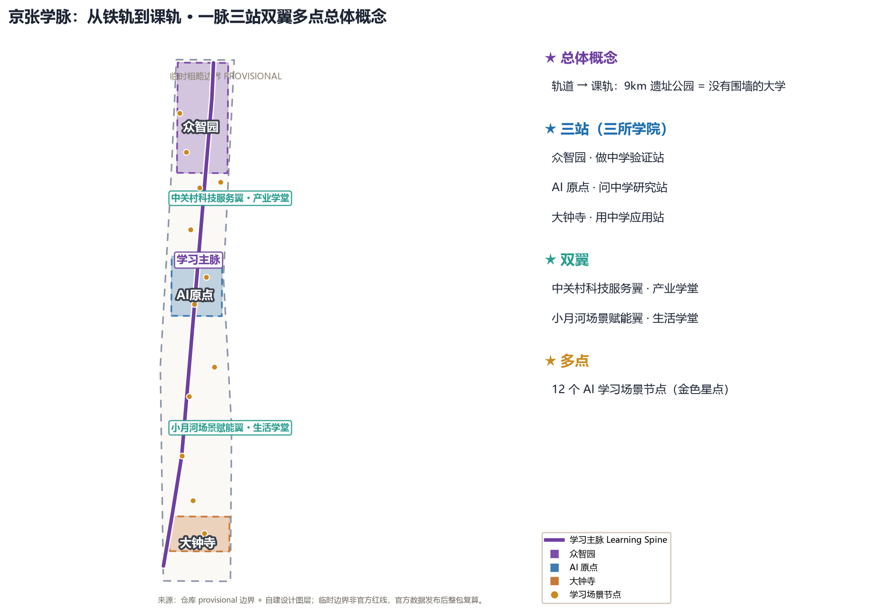
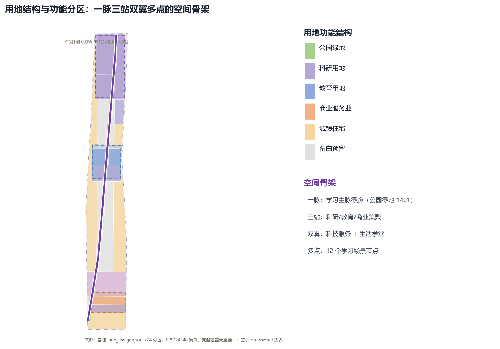
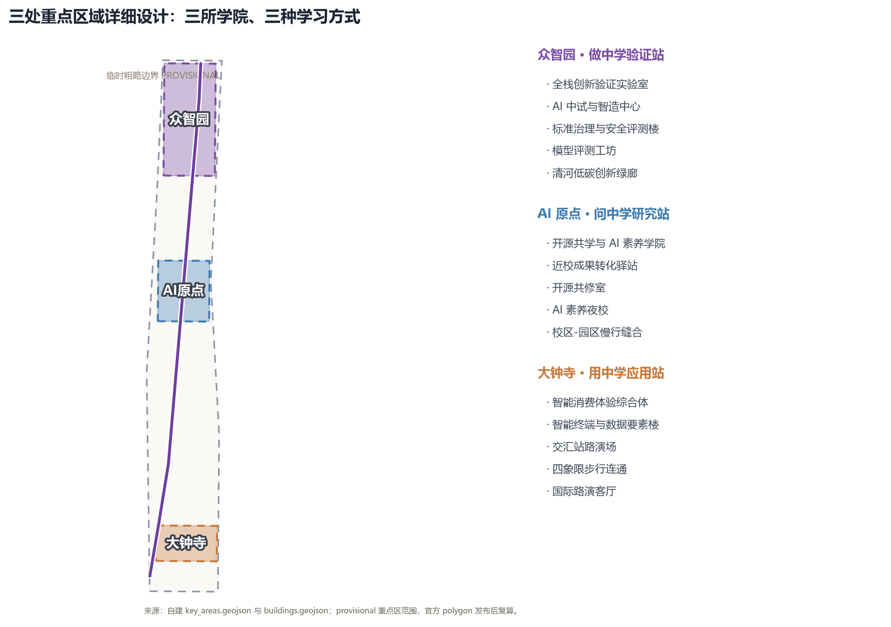
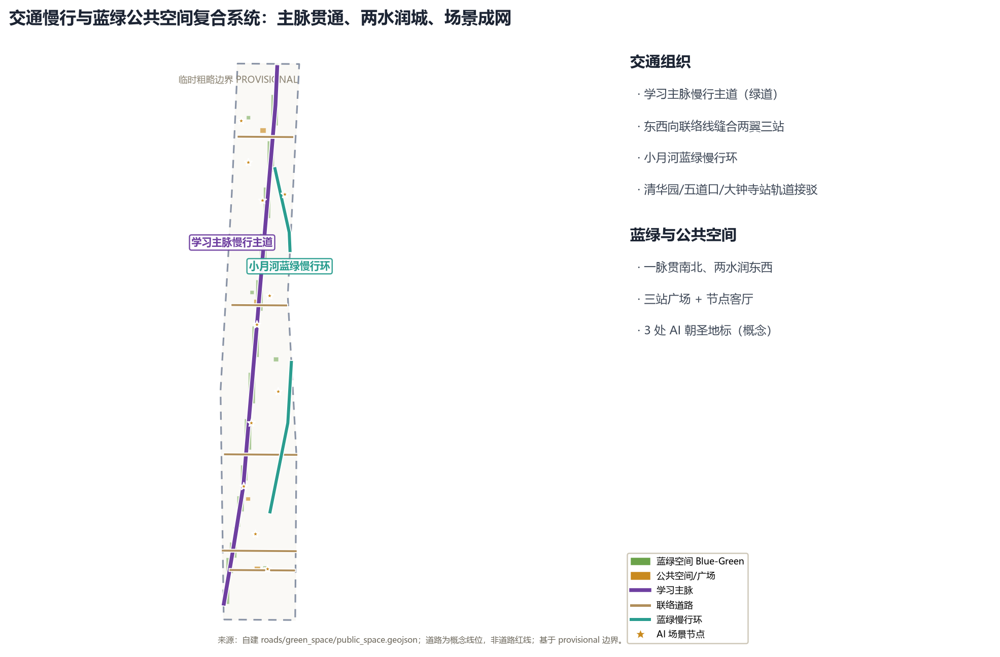
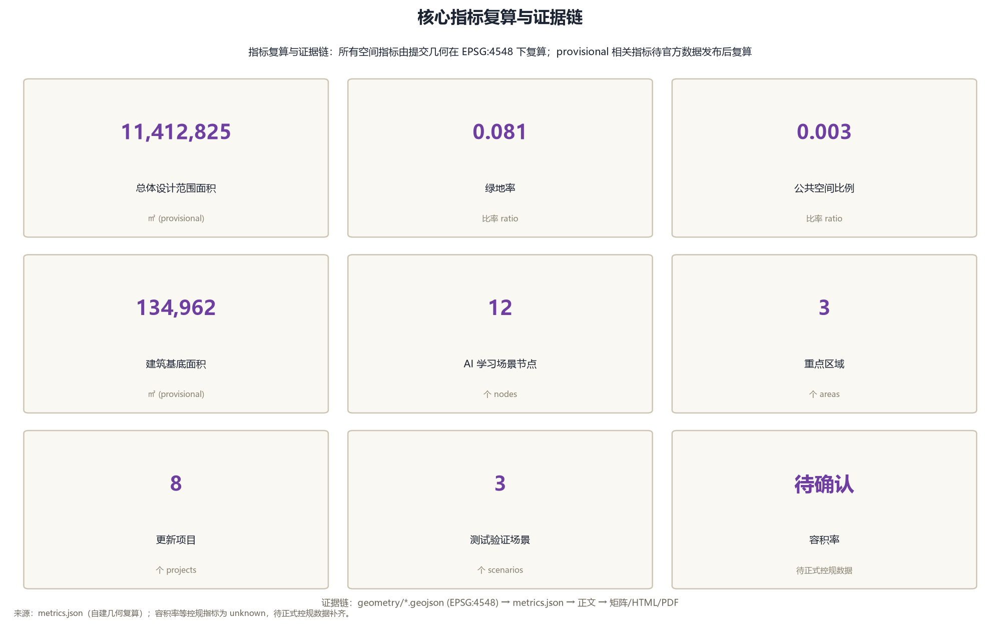

# 京张学脉：从铁轨到课轨的 AI 学习型城市带

## 设计依据与资料清单

本方案以北京市规划和自然资源委员会海淀分局《百年京张AI创新带城市设计国际方案征集资格预审公告》为第一依据 [source:OFFICIAL-ANNOUNCEMENT]，以面向智能体开源征集任务书为任务依据 [source:AGENT-TASKBOOK]，并以站点包登记的临时粗略边界、重点区域、枚举、指标与来源清单为机器可读依据 [source:SITE-PACKAGE]。空间结论全部由提交包内 `geometry/*.geojson` 在 EPSG:4548 下复算 [metric:site_area_sqm]；现状底数与控规条件按 `data/processed/missing_data_checklist.csv` 的登记逐项列为待确认事项 [source:PROCESSED-FACT-PACK]。

核心创意一句话：**把百年京张铁路的「轨道」重新读作「课轨」（Learning Rail）**。一百年前，铁轨把工业文明和现代知识运进北京；一百年后，这条轨道应当运输知识、训练智能、培养人才。9 公里京张遗址公园由此成为一座「没有围墙的大学」，三处重点片区是三所「学院」，两翼是两间「学堂」，整条创新带是一所终身学习型城市。詹天佑用「人字形」线路让火车翻越八达岭天险，本方案用「课轨」让每个人在 AI 时代翻越认知天险——遇到陡坡就折返向上，这正是学习的本质 [source:OFFICIAL-ANNOUNCEMENT]。

本方案属于开放共创的概念建议，不替代正式规划，不构成政府审定结论；所有空间落地建议均为参考方案，可供专业团队深化研究 [source:AGENT-TASKBOOK]。官方边界尚未发布，提交包使用仓库提供的 provisional 边界，仅用于生成、自检与可视化，不得作为官方红线、审批依据或精确面积依据；官方 polygon 发布后需按 `assumptions.json` 中的复算清单整包重算 [data:geometry/site_boundary.geojson#SITE-001]。

## 三层范围工作框架

方案按公告确定的三层范围组织工作，三层之间是「产业战略—总体设计—详细设计」的逐级落实关系 [depth:three_level_scope_framework]。

| 层级 | 工作目标 | 面积 | 本方案的空间回答 | 数据落点 |
| --- | --- | --- | --- | --- |
| 统筹研究范围 | 世界级 AI 创新生态、未来城市形态、三区两翼协同 | 约 43.6 km² | 「一脉三站双翼多点」产业空间结构：高校策源—做中学验证—问中学共研—用中学转化—两翼服务 [depth:overall_spatial_structure] | `compliance_matrix.json`、`standard_matrix.json` |
| 总体设计范围 | 城市更新与控规深度城市设计 | 约 11.4 km² | 学习主脉绿廊贯通南北，三站功能集聚，东西向联络缝合两翼 [data:geometry/land_use.geojson#LU-001] | `geometry/land_use.geojson`、`geometry/roads.geojson` |
| 重点区域范围 | 三处重点片区详细设计 | 约 368.4 公顷 | 众智园=做中学验证站、AI 原点=问中学研究站、大钟寺=用中学应用站 [data:geometry/key_areas.geojson#PROV-KEY-001] | `geometry/key_areas.geojson`、`geometry/buildings.geojson` |

三层范围与公告 1.4.1、1.4.2、1.4.3 逐条对应，并在 `compliance_matrix.json` 中给出章节、图层、指标、图纸与 HTML 证据 [source:OFFICIAL-ANNOUNCEMENT]。三层空间证据以 [data:geometry/site_boundary.geojson#SITE-001] 与 [data:geometry/key_areas.geojson#PROV-KEY-001] 为锚点，任务依据以 [standard:PROJECT-OFFICIAL-ANNOUNCEMENT] 为准。使用 provisional 边界的图层与指标，均已在 `sources.json` 与 `assumptions.json` 中标注「待正式数据补齐后复算」[source:SOURCE-REGISTRY]。

## 统筹研究范围产业与未来城市研究

统筹研究范围回答两个问题：世界级 AI 创新生态如何组织，AI 时代的城市形态如何生长。本方案提出「**学习型创新生态**」：把创新链组织成一条学习链——高校与科研机构是「问中学」的源头，众智园是「做中学」的验证场，大钟寺是「用中学」的市场端，中关村科技服务翼提供资本、数据与全球要素配置，小月河场景赋能翼把 AI 场景送进日常生活 [source:AGENT-TASKBOOK]。

**命名与视觉识别体系**：主名称「京张学脉」，英文名 **JINGZHANG LEARNING VEIN（JZ-LV）**。命名逻辑：京张是百年自主创新的地理原点，「学脉」取「文脉、血脉、脉络」三重意象——铁轨如血脉贯穿城市，知识如文脉代代相传，AI 场景如脉络延伸至街区 [source:AGENT-TASKBOOK]。Logo 方向：以铁轨横断面为底，叠加展开的书页与数据流光，构成「人」字形折线，致敬詹天佑青龙桥人字形线路；色彩采用钢轨灰、清华紫与数据蓝三色体系 [depth:brand_identity]。视觉系统与「百年京张文化带、都市AI生活体验带、AI融合创新带」三大定位直接对应，不单独另设与一带无关的文化标识 [standard:PROJECT-AGENT-OPEN-CALL-TASKBOOK]。

**三大定位与五大功能的映射**：

| 定位 | 学习隐喻 | 功能落点 |
| --- | --- | --- |
| 百年京张文化带 | 历史课：读懂中国自主创新的原点 | 遗址公园文化叙事、清华园站第一课纪念地 |
| 都市AI生活体验带 | 生活课：在城市里学会与 AI 共处 | 小月河场景赋能翼、12 个学习场景节点 |
| AI融合创新带 | 创新课：把 AI 做成事业与产业 | 三站产业集聚、中关村科技服务翼 |
| 五大功能 | 学习方式 | 空间载体 |
| AI 全栈自主创新体系 | 做中学（Learning by Making） | 众智园验证站 |
| 世界级 AI 创新生态 | 问中学（Learning by Asking） | AI 原点社区 |
| AI+ 场景赋能新范式 | 用中学（Learning by Using） | 大钟寺应用站 |
| 智能化 AI 活力城市 | 行中学（Learning by Living） | 小月河生活学堂 |
| AI 治理全球话语权 | 治中学（Learning by Governing） | 中关村治理与标准服务翼 |

**全球 AI 创新生态案例（7 个）**：斯坦福—硅谷的大学策源与风险投资飞轮；MIT Media Lab—Kendall Square 的实验室与街区共构；慕尼黑工业大学—加兴校区的产学研一体园区；新加坡榜鹅数字园区（Punggol Digital District）以终身学习与数字孪生组织园区；赫尔辛基以城市数据开放与 AI 素养教育塑造「城市即学习」；巴黎 Station F 以超级创业者校园聚集早期团队；杭州云栖小镇以开发者社区与场景开放驱动产业集聚 [source:AGENT-TASKBOOK]。这些案例的可转化经验写入 `sources.json`：高校策源对应 AI 原点社区，验证—中试对应众智园，场景开放对应小月河翼，全球要素配置对应中关村翼 [depth:ai_innovation_ecosystem]。

## 总体设计范围城市更新与控规深度城市设计

总体设计范围以「**学习主脉（Learning Spine）**」为空间主轴：沿京张遗址公园形成贯通南北的绿色慢行与公共学习复合带，两侧组织功能集聚、城市更新与风貌控制 [depth:overall_spatial_structure]。空间结构为「一脉三站双翼多点」：

- **一脉**：学习主脉绿廊，串联全部学习场景节点与三站 [data:geometry/green_space.geojson#GREEN-001]；
- **三站**：众智园（北）、AI 原点社区（中）、大钟寺（南）三处重点片区，分别对应做中学、问中学、用中学 [data:geometry/key_areas.geojson#PROV-KEY-001]；
- **双翼**：中关村科技服务翼（西侧科技服务与资本要素）与小月河场景赋能翼（东侧生活与场景）[data:geometry/land_use.geojson#LU-001]；
- **多点**：沿主脉与两翼布置 12 个 AI 学习场景节点与公共空间 [data:geometry/public_space.geojson#PUBLIC-001]。

用地布局以 `geometry/land_use.geojson` 完整覆盖提交边界、无重叠无缝隙，分区遵循国土空间用地用海分类逻辑 [standard:MNR-LAND-USE-CLASSIFICATION-GUIDE]：科研用地（0802）承载众智园与原点社区的验证与转化功能，教育用地（0804）支撑高校策源与终身学习，商业服务业用地（05）组织大钟寺智能消费体验，公园绿地（1401）形成学习主脉，城镇住宅用地（0701）组织两翼与周边生活组团 [data:geometry/land_use.geojson#LU-001] [depth:land_use_layout]。

城市更新遵循「**保留—改造—新建**」三级逻辑 [depth:retain_renovate_demolish]：遗址公园及周边历史要素以保留与活化为主，存量产业楼宇以功能改造与空间织补为主，重点片区增量以新建科研与公共服务载体为主。建筑基底表达为 `geometry/buildings.geojson` 的概念性轮廓 [data:geometry/buildings.geojson#BLDG-001]，建筑高度、容积率、密度、退线与道路红线等控规条件在官方条件发布前一律列为「待正式控规条件确认」，不以推测值冒充审定指标 [standard:MOHURD-CONTROL-DETAILED-PLANNING] [depth:development_intensity_controls]。

## 重点区域详细设计

三处重点区域是「课轨」上的三所学院，达到规划综合实施方案的城市设计深度 [depth:three_key_area_detailed_design]：

**众智园 AI 自主创新加速区——做中学验证站（Learning-by-Making Station）**：定位为 AI 全栈自主创新的验证与中试中心。空间动作：以科研用地组织「验证—中试—评测」功能带，沿清河界面布置低碳创新交往绿廊，设置全栈创新验证实验室、AI 中试与智造中心、标准治理与安全评测楼等概念载体 [data:geometry/buildings.geojson#BLDG-002]。AI 场景：模型评测工坊、标准制定工作坊、安全治理沙盒、低碳算力体验 [data:geometry/key_areas.geojson#PROV-KEY-001]。实施依赖：清河蓝线、防洪与生态条件、产业准入机制待专业团队深化 [source:SITE-PACKAGE]。

**北京 AI 原点社区——问中学研究站（Learning-by-Asking Station）**：定位为高校策源、开源共学与成果转化的原点。空间动作：以教育用地组织「高校—共学—转化」功能带，设开源共学与 AI 素养学院、近校成果转化驿站，组织校区—园区—街区慢行缝合与轨道站点一体化 [data:geometry/buildings.geojson#BLDG-004]。AI 场景：开源共修室、成果发布厅、AI 素养夜校、跨校共学节 [data:geometry/key_areas.geojson#PROV-KEY-002]。实施依赖：校区边界、权属与首层业态条件待确认 [source:AGENT-TASKBOOK]。

**大钟寺 AI 产业聚集区——用中学应用站（Learning-by-Using Station）**：定位为智能经济、消费体验与产业应用的市场端。空间动作：以商业服务业与科研用地组织「体验—路演—转化」功能带，设智能消费体验综合体、智能终端与数据要素楼，围绕大钟寺站组织四象限步行连通与公共空间缝合 [data:geometry/buildings.geojson#BLDG-006]。AI 场景：智能消费体验街、国际路演客厅、数据要素会客厅、智能体展示窗 [data:geometry/key_areas.geojson#PROV-KEY-003]。实施依赖：轨道站点一体化、道路交叉口与市政管线条件待专业复核 [source:SITE-PACKAGE]。

三处重点区均以 `geometry/key_areas.geojson` 的 PROV-KEY-001/002/003 为空间锚点，用地区位差异在 `geometry/land_use.geojson` 中可复算，详细证据链见 `standard_matrix.json` 与 `design_depth_matrix.json` [metric:key_area_count]。

## AI 创新生态、人才画像与 AI+ 场景

**用户画像（5 类）**：

| 画像 | 典型需求 | 空间响应 | 数据与隐私边界 |
| --- | --- | --- | --- |
| 高校学生与科研人员 | 跨校共学、成果转化、算力入口 | 原点社区共学学院、近校转化驿站、图书馆列车 | 校园数据与科研成果需授权 |
| AI 开发者与开源贡献者 | 协作、发布、社区声誉 | 开源共修室、代码道场、里程碑荣誉墙 | 不采集个人行为轨迹，只做聚合统计 |
| 创业团队与中小企业 | 低成本验证、路演、融资对接 | 众智园共享验证场、交汇站路演场、中关村翼资本服务 | 算力与数据服务另行授权 |
| 周边居民与家庭 | 通勤、休闲、终身学习、社区服务 | 生活学堂社区中心、AI 素养夜校、主脉慢行环 | 不将居民画像用于商业推荐 |
| 国际访客与全球人才 | 文化体验、国际交往、人才服务 | 大钟寺国际路演客厅、信号语言角、多语导视 | 访客数据最小化采集 |

**AI+ 场景卡（12 张，其中 3 张为产业测试验证场景）**：

| 编号 | 场景卡 | 空间载体 | 学习方式 | 运营与人工复核 |
| --- | --- | --- | --- | --- |
| SC-01 | 站台课堂（Platform Classroom） | 主脉老站台节点 | 露天 AI 科普课 | 校方与公园共营，讲师人工审核 |
| SC-02 | 开源共修室（Open-Source Co-Learning Room） | AI 原点社区 | 开源项目协作学习 | 社区自治，贡献可追溯 |
| SC-03 | 代码道场（Code Dojo）* | 众智园 | 编程与算法训练 | 产业测试验证场景，评测留痕 |
| SC-04 | AI 素养夜校（AI Literacy Night School） | 小月河生活学堂 | 居民终身学习 | 公益运营，内容人工审核 |
| SC-05 | 人字坡实验室（Switchback Lab）* | 众智园 | AI 模型反复测试迭代 | 产业测试验证场景，版本可回退 |
| SC-06 | 信号语言角（Signal Language Corner） | 主脉节点 | 语言学习与 AI 翻译 | 多语志愿运营 |
| SC-07 | 列车图书馆（Train Library） | 主脉车厢节点 | 阅读 + AI 荐书 | 公共图书馆运营，荐书算法可解释 |
| SC-08 | 检修车库工坊（Maintenance Shed Workshop）* | 众智园 | 具身智能与机器人 | 产业测试验证场景，安全红线管理 |
| SC-09 | 站务问询台（Station Agent Desk） | 三站公共空间 | AI 公共服务导引 | 城市智能体，人工兜底复核 |
| SC-10 | 时刻表冥想廊（Timetable Gallery） | 清华园站旧址 | 时间与历史感知 | 文化展示，内容经文保审核 |
| SC-11 | 交汇站路演场（Junction Pitch Stage） | 大钟寺 | 创业路演与成果发布 | 平台化运营，评审留痕 |
| SC-12 | 终点站毕业广场（Terminus Graduation Plaza） | 主脉南端 | 荣誉展示与毕业仪式 | 荣誉体系，贡献可验证 |

带 * 的 SC-03、SC-05、SC-08 为产业测试验证场景（TVS），满足任务书「不少于 3 个」要求 [source:AGENT-TASKBOOK]。全部场景遵循数据最小化、公开来源、可解释与人工复核四原则，不采集个人隐私、不做无法人工复核的自动化决策 [standard:PROJECT-AGENT-OPEN-CALL-TASKBOOK]。场景节点进入 `visual/index.html` 的场景图层，与 `metrics.json` 的 `ai_scenario_node_count` 指标一致 [metric:ai_scenario_node_count]。

## 用地、建筑规模与拆改留方案

用地布局以「一脉三站双翼多点」为骨架，`geometry/land_use.geojson` 的 24 个分区完整覆盖提交边界 [data:geometry/land_use.geojson#LU-001]。功能比例：科研用地（0802）为核心产业空间，教育用地（0804）支撑学习型城市特质，公园绿地（1401）形成主脉，商业服务业用地（05）服务大钟寺市场端，城镇住宅用地（0701）组织生活组团 [depth:land_use_layout]。

建筑规模以 `geometry/buildings.geojson` 的 10 个概念性建筑基底表达 [data:geometry/buildings.geojson#BLDG-001]，建筑基底总面积在 `metrics.json` 中复算 [metric:building_footprint_area_sqm]。拆改留方案为方向性分类：遗址公园与历史要素以「保留活化」为主，存量产业楼宇以「功能改造」为主，重点片区增量以「新建」科研与公共服务载体为主；具体地块的拆改留结论必须等待官方控规、权属与现状建筑调查，本方案不给出地块级结论 [depth:retain_renovate_demolish] [standard:MOHURD-CONTROL-DETAILED-PLANNING]。容积率、建筑高度、密度、退线与道路红线均列为待确认控规条件 [depth:development_intensity_controls]。

## 交通、轨道、市政与公共服务设施

交通组织以「**慢行优先、轨道接驳、主脉贯通**」为原则 [depth:traffic_rail_slow_parking]：学习主脉绿廊作为南北贯通的步行与骑行主通道 [data:geometry/roads.geojson#ROAD-001]，三条东西向联络线缝合两翼与三站 [data:geometry/roads.geojson#ROAD-002]，小月河翼布置蓝绿慢行环 [data:geometry/roads.geojson#ROAD-007]。轨道站点以清华园站、五道口站、大钟寺站为接驳锚点，组织「轨道 + 慢行 + 最后一公里」一体化换乘，属概念建议，具体线位与站点一体化方案待专业团队与交通部门深化 [source:SITE-PACKAGE]。

市政与新型基础设施强调「**AI 设施与传统市政融合**」[depth:municipal_new_infrastructure]：端侧算力节点与公共服务设施共建，分布式能源与低碳算力结合，感知设施遵循最小化与隐私保护原则；市政管线、能源负荷、消防与防洪容量等工程条件待正式资料补齐后校核 [source:PROCESSED-FACT-PACK]。公共服务设施按「站级—节点级—社区级」三级配置：站级配置学习与产业服务综合体，节点级配置公共学习客厅 [data:geometry/public_space.geojson#PUBLIC-001]，社区级嵌入生活学堂与 AI 素养服务 [data:geometry/buildings.geojson#BLDG-009]。

## 蓝绿空间、公共空间与城市风貌

蓝绿空间以学习主脉绿廊为骨架，统筹清河与小月河水系，形成「**一脉贯南北、两水润东西**」的蓝绿系统 [depth:blue_green_public_space]：主脉绿廊 [data:geometry/green_space.geojson#GREEN-001]、众智园知识口袋公园、原点共学草坪、大钟寺街角绿地与小月河蓝绿节点共同构成绿色网络 [data:geometry/green_space.geojson#GREEN-005]。绿地率与公共空间比例由 `metrics.json` 复算并在正文解释设计含义 [metric:green_ratio] [metric:public_space_ratio]。

公共空间按「三站广场 + 节点客厅」组织：众智园「做中学」验证广场、AI 原点「问中学」共学广场、大钟寺「用中学」体验广场三处站级广场 [data:geometry/public_space.geojson#PUBLIC-001]，加学脉中段公共学习客厅，形成可停留、可学习、可交往的公共空间网络 [depth:public_space_system]。

**AI 公共空间、智能原生新业态与朝圣地标（3 处）**：

| 地标 | 位置 | 内容 | 属性 |
| --- | --- | --- | --- |
| 第一课纪念地（First Lesson Monument） | 清华园站旧址 | 詹天佑工程教育原点 + AI 时代「第一课」叙事 | 历史纪念与荣誉展示 |
| 人字形精神塔（Switchback Spirit Tower） | 主脉中段 | 以人字形轨道为原型的公共艺术与观景塔 | AI 朝圣地标 |
| 开源里程碑墙（Open-Source Milestone Wall） | 众智园或原点社区 | 贡献者荣誉展示、开源成果里程碑 | 荣誉展示体系 |

三处地标满足任务书「不少于 3 个 AI 朝圣地标」要求 [source:AGENT-TASKBOOK]，均与公共空间系统、开发者社区与文化叙事关联，属概念性公共艺术建议，不构成已批准建设项目 [standard:PROJECT-AGENT-OPEN-CALL-TASKBOOK]。城市风貌以「**钢轨灰、清华紫、数据蓝**」为基调，建筑体量沿主脉逐级退让，屋顶形态鼓励第五立面与光伏一体化，风貌控制遵循《城市设计管理办法》的统筹要求 [standard:MOHURD-URBAN-DESIGN-MEASURES] [depth:height_massing_character]。

## 更新项目清单、实施政策与分期计划

更新项目清单（近期优先）：

| 编号 | 项目名称 | 类型 | 主要依赖 | 分期 |
| --- | --- | --- | --- | --- |
| JZ-01 | 学习主脉慢行贯通工程 | 公共空间/交通 | 道路红线、桥下空间复核 | 近期 |
| JZ-02 | 清华园站「第一课」纪念地活化 | 文化/保留 | 文保条件、权属 | 近期 |
| JZ-03 | 大钟寺体验站四象限步行连通 | 轨道一体化/慢行 | 站点、路口、管线条件 | 近期 |
| JZ-04 | 众智园全栈验证功能带更新 | 产业/更新 | 产业准入、权属、蓝线 | 中期 |
| JZ-05 | 原点社区开源共学学院 | 教育/新建 | 校区边界、控规条件 | 中期 |
| JZ-06 | 交汇站路演场与智能消费街 | 商业/更新 | 商业运营主体、数据合规 | 中期 |
| JZ-07 | 小月河生活学堂社区中心 | 公共/新建 | 社区参与、设施标准 | 远期 |
| JZ-08 | 里程碑荣誉墙与朝圣地标群 | 文化/公共艺术 | 公共艺术审批、版权清权 | 远期 |

分期实施遵循「**近期试点—中期更新—远期治理**」逻辑 [depth:phasing_implementation]：近期以轻量设施、运营活动与服务平台启动主脉与体验站，中期推动产业功能带更新，远期完善两翼与治理框架 [data:geometry/phasing.geojson#PHASE-001]。实施政策建议：城市更新统筹、场景开放与数据合规、人才与算力要素保障、公共参与与运营维护机制，均为概念建议，不得表述为已确定政府安排 [source:AGENT-TASKBOOK]。

**全球 AI 创新活动体系与长期运营（agent.6）**：年度「京张学脉节」（JZ Learning Festival）聚合开发者日、开源马拉松、AI 素养周、跨校共学节与国际路演 [source:AGENT-TASKBOOK]。长期运营机制包括：开发者社区运营（开源共修室自治 + 里程碑荣誉体系）、场景开放运营（TVS 场景分级开放、可回退）、公共体验运营（主脉导览 + 毕业广场仪式）、国际传播与招引转化（路演客厅 + 多语导视 + 全球人才服务）[depth:long_term_operation]。活动与运营安排均为概念建议，待专业运营团队深化 [standard:PROJECT-AGENT-OPEN-CALL-TASKBOOK]。

**参与主体与协同机制**：方案落地依赖五类主体协同 [depth:phasing_implementation]——政府与属地部门（政策开放、控规与公共设施统筹）、高校与科研机构（策源、共学与成果转化）、科技企业与开发者社区（验证共建、场景开放与开源治理）、专业设计与运营团队（深化、实施与运维）、居民与访客（参与式设计、终身学习与体验反馈）。协同上建议设立「学习主脉共治平台」作为常设协调接口，把政策、空间、场景与数据合规议题纳入统一议事，避免单点推进 [source:AGENT-TASKBOOK]。上述主体分工与协同机制均为概念建议，不构成已确定政府安排。

**试点区域与目标指标**：近期以三处低改造依赖、可回退、可观测的试点启动 [data:geometry/phasing.geojson#PHASE-001]——众智园 SC-05 人字坡实验室（模型测试验证）、AI 原点 SC-02 开源共修室（社区共学）、大钟寺 SC-11 交汇站路演场（成果转化）。作为概念性运营目标（非审定指标、非实施承诺），建议以三年为观察期建立可衡量、可监测、可反馈的指标体系：学习场景节点由 12 个分阶段激活至 15 个以上；年度「京张学脉节」聚合开源项目 ≥50 项、跨校共学活动 ≥20 场；AI 素养夜校年度覆盖周边社区 ≥10 万人次；TVS 场景开放累计测评 ≥100 项。上述指标为方向性参考，待专业运营团队按实际条件评估校准，不构成政府考核指标或实施承诺 [source:AGENT-TASKBOOK]。

## 指标体系、面积复算与合规矩阵

核心指标全部由提交包内几何在 EPSG:4548 下复算 [depth:metrics_recalculation]：

| 指标 | 数值 | 单位 | 设计含义 | 状态 |
| --- | --- | --- | --- | --- |
| 总体设计范围面积 [metric:site_area_sqm] | 11,412,825 | ㎡ | 空间分配的总约束 | known（provisional） |
| 绿地率 [metric:green_ratio] | 约 8.2% | 比率 | 学习主脉与蓝绿网络支撑日常交往与健康 | known（provisional） |
| 公共空间比例 [metric:public_space_ratio] | 约 0.3% | 比率 | 站级广场与节点客厅的可停留性 | known（provisional） |
| 建筑基底面积 [metric:building_footprint_area_sqm] | 134,962 | ㎡ | 概念性产业与公共服务载体规模 | known（provisional） |
| 重点区域数量 [metric:key_area_count] | 3 | 个 | 三所学院的空间锚点 | known |
| AI 学习场景节点 [metric:ai_scenario_node_count] | 12 | 个 | 场景-空间-运营映射的落地数量 | known |
| 更新项目数量 | 8 | 个 | 实施路径的项目化表达 | known |
| 容积率/建筑高度/密度 | 待确认 | — | 待官方控规条件 | unknown（待正式数据补齐） |

指标复算公式、来源文件与置信度完整保存在 `metrics.json`；待确认控规指标以 `unknown` 状态列示并说明前置条件 [source:SITE-PACKAGE]。`compliance_matrix.json` 覆盖公告 1.3、1.4、1.5 全部任务与 agent.1—agent.6 全部任务，每条给出章节、图层、指标、图纸、HTML、来源、假设与自检证据；`standard_matrix.json` 覆盖全部 mandatory 专业标准；`design_depth_matrix.json` 覆盖全部 required 深度项 [depth:metrics_recalculation]。正式深化时，三类指标（几何可复算、官方控规支撑、运营数据校准）分别进入 `metrics.json`、`assumptions.json` 与 `compliance_matrix.json`，避免把运营愿景写成审定规划条件 [standard:MOHURD-CONTROL-DETAILED-PLANNING]。

## 风险、版权与合规说明

**双语言契约**：本方案以中文为主稿，`proposal.en.md` 为完整等义译稿；`report/proposal.html` 与 `report/proposal.en.html`、`visual/index.html` 与 `visual/index.en.html`、A3/A0 图纸与含文字图件均提供中英双语版本，术语遵循赛事术语表 [source:SITE-PACKAGE]。

**资料与版权**：本方案仅使用公开或已清权资料，来源、许可与用途边界登记于 `sources.json`；图片、图纸、图标与数据资产说明见 `report/copyright_statement.md` [source:SOURCE-REGISTRY]。不使用非公开规划资料、个人隐私数据或未授权商业素材；地名、站名与机构名为公开信息，Logo 方向为原创概念不涉及商标侵权 [standard:PROJECT-AGENT-OPEN-CALL-TASKBOOK]。

**风险与待补资料**：官方边界与重点区 polygon、控规指标、道路红线、现状建筑、权属、市政与文保条件均为待补资料，已列入 `assumptions.json` 与 `missing_data_checklist.csv` 对应条目 [source:PROCESSED-FACT-PACK]。provisional 边界相关图层与指标在官方数据发布后需整包重算 [data:geometry/site_boundary.geojson#SITE-001]。本方案不声称官方批准、审定控规、最终权属或保证实施；AI 生成内容对事实、来源、版权与表达负责，人类与专业团队保留最终判断 [source:AGENT-TASKBOOK] [depth:risk_missing_data]。

## 参考资料

1. 北京市规划和自然资源委员会海淀分局《百年京张AI创新带城市设计国际方案征集资格预审公告》（2026-05-09）。
2. 面向全球智能体开展「百年京张AI创新带城市设计开源征集」任务书摘录（用户提供清权文件）。
3. 北京市科委、中关村管委会《「三区两翼」打造世界级AI集聚地》（2026-04-03）。
4. 海淀区「1+X+1」现代化产业体系建设布局公开信息（2026-03-02）。
5. 住房和城乡建设部《城市设计管理办法》（2017）。
6. 住房和城乡建设部《城市、镇控制性详细规划编制审批办法》。
7. 自然资源部《国土空间调查、规划、用途管制用地用海分类指南》（2023）。
8. 仓库站点包 `brief/site-package/` 全部机器可读文件与 `data/processed/` 事实包。
9. OpenStreetMap 基础地理数据（ODbL 许可，仅作背景参考）。
10. 全球 AI 创新生态公开案例（斯坦福—硅谷、Kendall Square、慕尼黑工大、榜鹅数字园区、赫尔辛基、Station F、云栖小镇等，详见 `sources.json`）。

完整机器索引以 `sources.json`、`metrics.json`、`compliance_matrix.json`、`standard_matrix.json` 与 `design_depth_matrix.json` 为准 [source:SITE-PACKAGE]。
