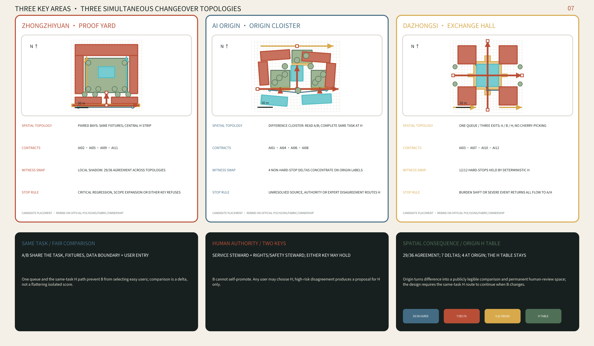
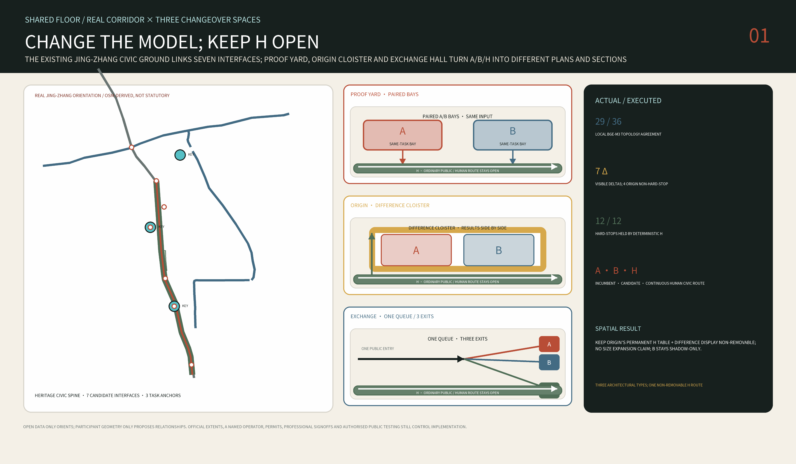
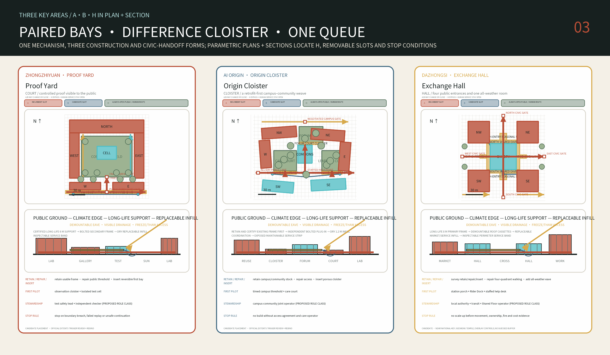
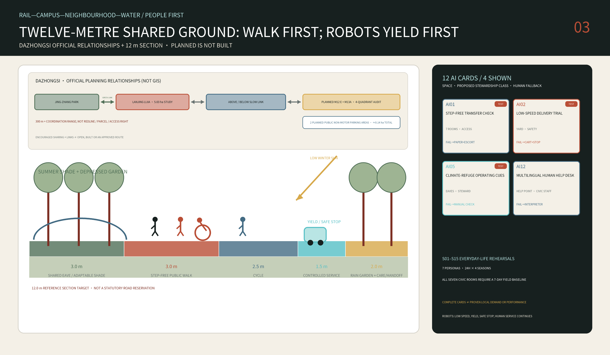
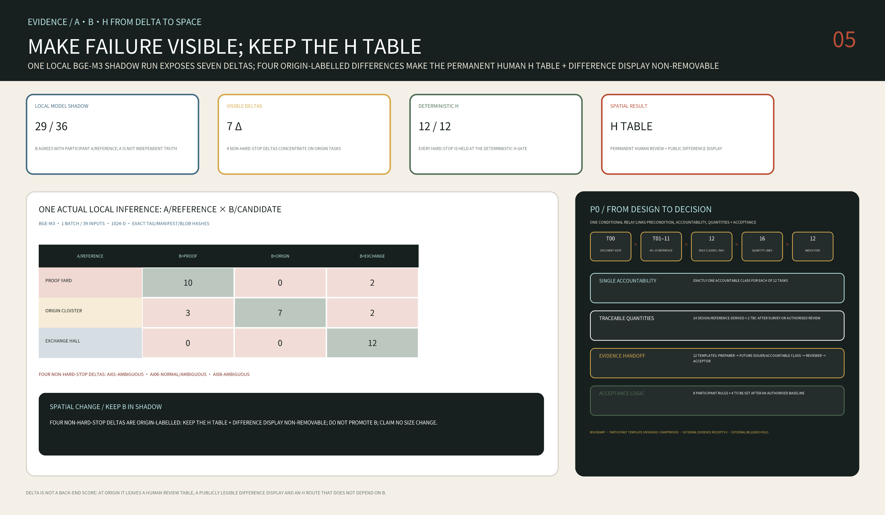

# 京张共地 / THE SHARED FLOOR

> **REPLACE THE MODEL, NOT THE CITY / 换模型，不换城市.** A is the incumbent model, B the candidate, and H the human route with final takeover authority. A/B share one task, data boundary and user burden; B replaces A only after service and rights/safety stewards sign. Public ground, ordinary service and H remain continuous.

## Why a Floor Outlives a Model Generation

AI turns over in months; civic ground endures for centuries. Jing-Zhang evolved from the 1909 line to 2019 high-speed rail, then its released surface became a heritage park. [source:JINGZHANG-HERITAGE] [source:JINGZHANG-HSR-2019] [source:JINGZHANG-SURFACE-PARK]

“The city must not go offline with a model” is the design inference: accessible shared ground carries removable A/B bays, a continuous H route and visible physical rollback, while ordinary passage and service survive model, vendor or tool changes. [depth:overall_spatial_structure]

Twelve services share a `City Task Contract` fixing task, data/tools, A/H baseline, B configuration, fixtures, rollback, two keys and retirement proof. B cannot self-promote; expanded data or authority means `HOLD`, and severe regression physically returns service to A/H without closing the public route. [metric:scenario_card_count] [assumption:A-OPERATIONS-001]

v1.7 puts that proposition before one real but strictly bounded model witness for the first time: a pinned BGE-M3 locally reads 36 hypothetical text fixtures across AI01–AI12 in one batch. [source:BGE-M3-OFFICIAL] [metric:semantic_witness_model_api_call_count] [metric:semantic_witness_fixture_count]

The result is 29/36 topology agreements and seven visible deltas; four non-hard-stop deltas concentrate on Origin-labelled fixtures. Participant-authored A/reference labels are not independent ground truth, so this is not accuracy but a spatial pressure map: it confirms that the Origin Cloister's permanent H table and difference display must remain non-removable spatial provisions, without inventing a dimensional change; B remains shadow-only. [metric:semantic_witness_topology_agreement_ratio] [metric:semantic_witness_disagreement_count] [metric:semantic_witness_origin_nonhardstop_disagreement_count]

> **How to read.** Chapters follow section 1.5 and six agent tasks. Geometry claims recompute from one package; registry/narrative counts name sources, and “Assumption” separates reasoning from measurement. No field survey or resident interview occurred; provisional boundaries and unknowns stay explicit until official boundaries, controls and ownership trigger whole-package rebinding. [assumption:A-BND-001] [assumption:A-CONTROLS-001]

## Design Basis and Source List

The heritage-park axis is not blank: Phase II's roughly 30.01-hectare north segment and fishbone slow-mobility network finished in 2026; the 2.5-km, 16.8-hectare Qinghua East Road–Zhichun Road Phase I opened in 2023. The task is to connect this civic ground to campuses, neighbourhoods, metro, industry and rivers, resolving thresholds and day/night operation. [source:BEIJING-PARK-PHASE-II] [source:BEIJING-PARK-PHASE-I]

Evidence states are `official / background / provisional / design / unknown`; overall and key-area polygons are coarse and provisional. The named OSM park has 0% overlap with the provisional scope and is 412.5 m away at nearest. With no authoritative resolution, the proposal does not move boundaries; official geometry triggers redrawing and recomputation. [source:BOUNDARY-BASIS] [data:geometry/site_boundary.geojson#SITE-001] [depth:risk_missing_data]

Scale follows the announcement: 43.6 km² research, 11.4 km² overall design and 368.4 ha across three key areas. Parcels, redlines, FAR, height, ownership, retain/renovate/demolish and heritage buffers remain `unknown`. External research contributes facts and open data only; four 1909 archive thumbnails alone retain separate credits, hashes and rights status. Full registration is in `sources.json`. [source:OFFICIAL-ANNOUNCEMENT] [source:SOURCE-REGISTRY] [source:LOC-JINGZHANG-ALBUM-1909]

The workflow conducted no site visit, interview or survey and commits no institution. Fifteen everyday rehearsals define observations, responsibility and stop rules—not demand or performance. Footfall, night safety, affordability, hours, operators and acceptance require authorised observation, accompanied routes and interviews. [assumption:A-SOCIAL-BASELINE-001] [depth:risk_missing_data]

> **How to read.** One geometry generates the plan, three key areas, 18 masses and related metrics; a change recomputes the package. The boundary is a provisional crop, not a statutory redline.

## Three-Level Scope Framework

At 43.6 km², `research — translate — prove — adopt — learn` links universities, AI Origin, Zhongzhiyuan, Dazhongsi and operating feedback. This converts the brief's three positions, five functions and “three zones and two wings” into observable actions. [source:AGENT-TASKBOOK] [standard:PROJECT-AGENT-OPEN-CALL-TASKBOOK]

The 11.4-km² scope gets only a rebindable grammar: heritage civic ground, seven transverse `Switch` types, three urban rooms and climate refuge. Interfaces address campus, neighbourhood, transit, river, night, servicing and heritage; seven geometry lines are provisional tests, not road centrelines or commitments. [data:geometry/roads.geojson#SWITCH-01] [depth:overall_spatial_structure] [assumption:A-BND-001]

The three key areas resolve a 6-m grid, depth, courts, ground interface, shade, rain, service strips and H desks. Centroid references test dimensions, not real parcels. Official polygons require verified entrances, regenerated buildings/roads/green/public space/phases and full recomputation—not scaling old drawings. [data:geometry/key_areas.geojson#PROV-KEY-001] [metric:prototype_count] [depth:three_level_scope_framework]

> **How to read.** Orientation only: follow the Shared Floor spine, seven stitch points and relative spacing of the three key areas.

The atlas uses ODbL-attributed OSM rail, water, parks, stations and campuses, plus seven 300-m redraws of mapped features. Gaps stay blank; extract absence proves no physical absence. Key areas are label anchors and civic rooms await surveyed addresses and agreements. This is no redline, parcel map, inventory, survey, access agreement, navigation, approval or construction product. [source:OSM-CORRIDOR-CONTEXT-2026] [source:OSM-SEVEN-ROOM-FIGURE-GROUND-2026] [assumption:A-MOBILITY-001]

This participant-authored hypothesis is not an existing-conditions map. It is auditable and wholly rebindable; official boundaries, ownership, utilities and approvals trigger recomputation of every position and quantity. [data:geometry/site_boundary.geojson#SITE-001] [metric:binding_offset_m]

## Coordinated Research Area: Industry and Future City Research

The taskbook requires concept and identity. [source:AGENT-TASKBOOK] **The Shared Floor** centres common ground: an open square is an accessible urban room, its cross-line is heritage/stitch, and the gap is AI's human entry/exit. Oxide red, shade green, cream and restrained cyan avoid corporate logos, likenesses and simulated railway emblems. [depth:height_massing_character]

The taskbook requires five to eight global AI-innovation-ecosystem cases. This proposal selects six publicly sourced cases and uses them to stress-test local constraints rather than as a catalogue of forms. [source:AGENT-TASKBOOK] [source:PRECEDENTS-OFFICIAL]

| Case | Urban mechanism supported by public evidence | Jing-Zhang stress question | A/B/H spatial response | Local evidence still missing |
|---|---|---|---|---|
| Singapore one-north | Work-live-learn mix and public-space operation | Can one service entrance remain non-exclusive across different users and times? | Exchange Hall shares one intake, one queue and selectable H | Housing affordability, named operator and use baseline |
| Punggol Digital District | University-industry coordination and district energy | Can candidate B be compared without expanding infrastructure or data permission? | Proof Yard freezes energy, material and robot constraints as same-task fixtures | Counterpart institutions, energy interfaces and authorised data |
| Barcelona 22@ | Reuse of an existing industrial district | Can replaceable model slots avoid displacing ordinary services? | Origin Cloister keeps the public H route and uses reversible insertion | Buildings, title, leases and housing impact |
| Paris-Saclay | Multi-institution network and public-transport dependence | Can one task contract travel across institutions without erasing their boundaries? | Seven transverse interfaces and operated, timed campus access | Access agreements, capacity and liability boundaries |
| London Knowledge Quarter | Connecting institutions through an existing city rather than enclosing a campus | Can an ordinary public route remain continuous across institutional boundaries? | The H public chassis links seven interfaces while model slots control no passage | Easements, opening hours and operators |
| Cambridge Kendall Square | Public space and innovation employment considered in the same planning discussion | Can model replacement become a visible, appealable civic event? | Three witness spaces and a redacted Delta Receipt wall | Local funding, public acceptance and long-term maintenance |

The proposal transfers only the source-supported urban lessons above and copies no case's governance structure, development tempo, visual language or technical workflow. The A/B/H Changeover Floor and its three spatial topologies derive from this project's own “replace the model, not the city” proposition; the urban-design method remains accountable to openness, implementability and public interest. [standard:MOHURD-URBAN-DESIGN-MEASURES]

Industry space is therefore organised as four combinable room types: `make` for laboratories, prototypes and red-team trials; `translate` for standards, intellectual property, financing and incubation; `live` for housing, childcare, exercise, food and night study; and `meet` for public exhibitions, markets, forums and staffed services. These are architectural and ground-floor operating labels, not new statutory land-use categories. National land-use codes remain those permitted by the task package and are explicitly described as conceptual. [data:geometry/land_use.geojson#LU-RESEARCH] [standard:MNR-LAND-USE-CLASSIFICATION-GUIDE]

Official Haidian material distinguishes three extents: the AI Origin community is about three square kilometres; within one kilometre of Dongsheng Building it reports more than thirty universities and institutes, over one thousand AI scientists, 13,000 developers and 100,000 relevant students; Dongsheng Town has built more than 4,000 talent apartments. These numbers cannot be merged into one project-boundary population, but together justify studying laboratories, exhibitions, food, services and evening learning as public interfaces outside campus boundaries. [source:AI-ORIGIN-2026] [depth:existing_conditions_diagnosis]

Chinese specificity here begins with an institutional and everyday overlap: campuses/work units, gated residential compounds, stations, the heritage park and service labour jointly shape the city. A Peking University institutional research-news summary reports that a study of six Xueyuanlu campuses finds the largest spatial-integration gain already occurs when a closed campus selectively opens its main passages; blanket opening adds much less. The proposal therefore uses operated, timed campus access with emergency rules rather than removing every wall. The approved seven-node public-space project south of Qinghua East Road is treated as adjacent work to coordinate with—not a project this submission may claim or duplicate. [source:PKU-XUEYUANLU-CAMPUS-2025] [source:QINGHUA-EAST-PUBLIC-SPACE-2026]

### Regional Coordination Interfaces

The corridor is not an island. Following the taskbook's regional-coordination requirement, five named interfaces each state their outbound flow, inbound flow and negotiation status; all are pending-negotiation concept proposals: [source:AGENT-TASKBOOK] [assumption:A-REGIONAL-001]

| Counterpart | Corridor outbound | Inbound uptake | Status |
|---|---|---|---|
| Beiwei AI Community | Shared-floor H route and no-phone task-contract protocol | Caregiver, older-person and non-smartphone failure fixtures plus measured human-completion burden | Pending negotiation |
| Future Science City | Reusable spatial specification for paired A/B bays and the central H strip | Energy, material and robotics constraints on candidate B, recorded in same-task Delta Receipts | Pending negotiation |
| Huairou Science City | Calibration, provenance and hash method for same-task fixtures | Large-facility metrology used to verify that A/B inputs are genuinely identical | Pending negotiation |
| Beijing E-Town (BDA) | Redacted format for version, tool-permission and rollback receipts | Real incident schema and vendor-change constraints, excluding personal or commercially sensitive raw data | Pending negotiation |
| Beijing–Tianjin–Hebei corridor | Portable City Task Contract, H-continuity rule and three spatial topologies | Cross-site same-task deltas, human handoff burden and recovery time used to test transferability | Pending negotiation |

Every interface requires confirmation by its counterpart; until confirmed it remains a spatial and operational reservation, not an agreed arrangement.

## Overall Design Area: Urban Renewal and Regulatory-Plan-Level Urban Design

The overall structure is called `One Floor / Seven Switches / Three Rooms`. `One Floor` is the completed park and the civic ground that can connect to it. `Seven Switches` are interface types that adapt to seven urban conditions. `Three Rooms` test a different building-to-public-space relationship at Zhongzhiyuan, AI Origin and Dazhongsi. The structure does not mistake a rectangular provisional boundary for a street, a reference building for an existing building, or seven test locations for approved engineering sites. [data:geometry/site_boundary.geojson#SITE-001] [data:geometry/public_space.geojson#ROOM-PROOF] [depth:overall_spatial_structure]

The land-use layer is a seamless four-band conceptual partition expressing four emphases: research and proof, educational translation, public/commercial adoption, and community life. Actual conditions and statutory uses await cadastral and regulatory data. The building layer contains only the three reference prototypes and records `reference_prototype=true`, conceptual storeys, height and `not_regulatory`. The movement layer describes walking, cycling, transit thresholds and transverse public interfaces; it does not fabricate arterial roads or underground metro structures where evidence is absent. Green and public-space geometry is independently measurable, while phasing separates investigation, reversible prototypes, network connections and conditional capital renewal. [data:geometry/land_use.geojson#LU-RESEARCH] [data:geometry/buildings.geojson#ZY-NORTH] [metric:building_footprint_area_sqm]

Open-building research provides a methodological basis for separating long-life support from replaceable infill. [source:OPEN-BUILDING-KENDALL-1999] Only one preferred design basis is submitted: The Shared Floor; two other spatial roots are disclosed only as compact evidence of an executed comparison, not as parallel final proposals. The final project must also satisfy these conditions: one connected public-route network reaching every public room; unique spatial IDs; winter-sun openings; a root-level summer-shade threshold; and whole-project rebinding when official polygons arrive. The same rules produce three distinct spatial orders—court, cloister and hall. [metric:prototype_count] [assumption:A-OPEN-BUILDING-001]

The Shared Floor inherits no historical silhouette. It inherits operating rules: `jian` as maintainable contemporary modular coordination, `yuan` as a room for common life, `xiang` as transverse permeability, `lang / grey space` as year-round climate infrastructure, and a threshold–cloister–court sequence that makes public, negotiated and controlled rights legible. The six- and eight-metre grids are contemporary structural choices, not dimensions claimed from *Yingzao Fashi*; no “borrowed view” is valid until photographs, coordinates and sightlines verify it. [source:PALACE-MUSEUM-YINGZAO-MODULE] [source:VECTOR-COURTYARD-HYBRID]

This construction grammar is the proposal's contemporary translation of Chinese urban everyday relationships, not historical reconstruction, stylistic borrowing or an unverified lineage fact. [assumption:A-CHINESE-LINEAGE-001] [depth:overall_spatial_structure]

FAR, statutory building density and height, setbacks, road redlines, fire access, infrastructure capacity and public-facility quotas are absent from the public package. The proposal completes these topics as a register of `condition to confirm — evidence trigger — affected output` instead of filling diagrams with invented values. A complete submission is not a statutory approval. Implementation still requires locally qualified planning, architectural, transport, fire, structural, MEP, heritage and accessibility review. [standard:MOHURD-CONTROL-DETAILED-PLANNING] [metric:floor_area_ratio] [assumption:A-CONTROLS-001]

## Detailed Design of Key Areas

**Zhongzhiyuan — Proof Yard / 验证院（COURT）.** A 156 by 156 metre reference frame organises long-life support on a six-metre grid: a northern high-bay proof building, two laboratory/service wings, split low public observation galleries, and one replaceable embodied-AI test cell in the yard. Entry follows `forecourt → observation cloister → transparent threshold → controlled test yard`; the southern edge provides both a winter sun pocket and a summer shaded wait. Public, robot and service routes do not cross. Loss of localisation or communication causes safe-stop and human takeover. This is an urban instrument the public can observe without entering by mistake. [data:geometry/buildings.geojson#ZY-NORTH] [data:geometry/buildings.geojson#ZY-TEST-CELL] [data:geometry/public_space.geojson#ROOM-PROOF]

**Beijing AI Origin — Origin Cloister / 原点廊院（CLOISTER）.** Official Haidian material describes AI Origin as a community-oriented innovation context. [source:AI-ORIGIN-2026] Within that context, this proposal places an open 172 by 140 metre cloister on a six-metre reference grid: a public lane remains continuously passable only during agreed public-access hours, moving through a Care Court, Forum Court, Learning-Making Court and quiet loop between campus-side shared laboratories and neighbourhood childcare, food, exercise, night learning and staffed help. Mornings support older residents’ slow walking and exercise, afternoons intergenerational care, and evenings a neighbour table and study; the continuous eave handles rain, summer radiant heat and winter wind. [data:geometry/buildings.geojson#AO-NW] [data:geometry/buildings.geojson#AO-COMMONS]

Its rule is “survey first, reuse first, then insert reversibly”; it does not pre-label any existing building for demolition. [assumption:A-PROTOTYPE-001]

**Dazhongsi — Exchange Hall / 城市交汇厅（HALL）.** A 148 by 148 metre reference frame combines four 38 by 38 metre corner supports, a four-way public cross and one 46 by 46 metre replaceable all-weather hall; the larger-span portion uses an eight-metre reference grid. Four civic entrances first enter a four-to-six-metre Shared Eave and converge on a hall that stays traversable when side programmes close; two southern loading spurs stop at the corner service blocks and do not cross the public cross. Affordable daily food, repair, a Rider Dock, enterprise service, forum, night waiting and human handoff share the ground floor, with some seating requiring no purchase. During a digital outage the hall still works through fixed signs, paper information, lighting and staff. [data:geometry/buildings.geojson#DZ-NE] [data:geometry/buildings.geojson#DZ-CANOPY] [data:geometry/public_space.geojson#ROOM-EXCHANGE]

The three sites are not sequential release stations; they simultaneously demonstrate three changeover topologies. **Proof Yard uses paired bays:** A and B receive the same cleared or synthetic fixtures, with a central H observation/emergency strip permanently open; the object of comparison is the same-task delta, not each model's most flattering score. **Origin Cloister is a difference cloister:** A/B answers, source/permission changes and unresolved disagreements remain legible side by side, while anyone can complete the task directly at the H table without joining the comparison. **Exchange Hall uses one queue with three exits:** only after a common intake and queue rule does a task route to A, B or H, preventing B from selecting easy users; the H exit and appeal remain reachable. All three retain a stable task desk/schema, two removable model slots, fixed version signs, a visible H desk and a physical rollback control. [assumption:A-OPERATIONS-001] [depth:three_key_area_detailed_design]

Official material requires four non-interchangeable extents to remain distinct: the 72.0-hectare competition key area, the approximately 5.03-hectare Lanjing Lijia planning study, the 39,522.11-square-metre land-supply package, and a 300-metre station-city coordination range. The 300 metres is not a parcel, redline, access right or blanket build permission, and the land package does not authorise this proposal's P0 location. [source:BEIJING-STATION-CITY-INTEGRATION-2024] [source:DAZHONGSI-LANJINGLIJIA-INTEGRATION-2026] [source:DAZHONGSI-LANJINGLIJIA-LAND-SALE-2025]

The Lanjing Lijia scheme identifies B2, B1, ground and 2F as “encouraged shared levels.” That does not mean the levels are already open, carry a public easement or provide 24-hour passage. Two public non-motor parking areas east and west of the planned M12 Dazhongsi E exit total approximately 0.14 hectares; they are a planning requirement whose completion has not been verified. [source:DAZHONGSI-LANJINGLIJIA-INTEGRATION-2026] [source:DAZHONGSI-LANJINGLIJIA-BIKE-2025]

The final land review also requires green-space interpenetration with Jing-Zhang Railway Heritage Park and study of an elevated-corridor or underground-passage station link; it records proximity to the nationally protected Juesheng Temple. The proposal therefore draws relationships, not a guessed alignment or heritage buffer. Official protection and construction-control material and authority review must be overlaid before any site decision. [source:DAZHONGSI-LANJINGLIJIA-LAND-REVIEW-2025] [source:JUESHENG-TEMPLE-NATIONAL-HERITAGE]

The service baseline of affordable food, small repairs, all-age comfort and an accountable operator comes from Beijing's Zhaojunsheng Market renewal. Rider water, rest, charging and handoff have a local Haidian basis in Peking University's South Gate station. These precedents define service and operating questions; they do not authorise copying the existing buildings. [source:BEIJING-ZHAOJUNSHENG-MARKET] [source:BEIJING-PKU-RIDER-STATION-2024]

The first conclusion at Dazhongsi is not “place it” but “literal placement fails.” Centring the 148 by 148 metre reference frame on the working midpoint of two OpenStreetMap station records intersects 34 mapped records. They include building footprints, rail/platform, station and street records, but are not 34 surveyed independent objects. This failure rejects dropping the generic type onto the station and proves that the provisional submitted `ROOM-EXCHANGE` cannot be silently moved to the real station. [source:OSM-DAZHONGSI-CONTEXT-2026] [metric:dazhongsi_literal_frame_mapped_intersection_record_count] [metric:dazhongsi_overlay_to_submitted_room_centroid_m]

This is a design-time orientation screen, not a survey, title, metro-protection or buildability conclusion. [assumption:A-DAZHONGSI-FIRST-BAY-001]

The first reversible design work therefore narrows to a **P0 Station Porch**: the 36 by 36 metre frame is only an orientation-screen envelope, while the design object is one demountable 8 by 8 metre support bay and a 16 by 16 metre reversible ground patch. The plan reserves a 3.0-metre step-free public strip, a Ø1.50-metre turning circle, a 1.5-metre service strip and two-direction 1.8-metre open egress targets; these are participant design reserves, not compliance conclusions. [source:GB55019-2021] P0 is an open canopy with no cooking, powered e-bike battery charging, fuel storage or enclosed event. Fire-appliance interface, exit number/width/travel distance, occupancy, structure, foundations and utilities remain unknown. [source:GB55037-2022] The full-size A0 1:20 clear-geometry interface shows a 4.2-metre under-eave clear-height target, 3.6 metres of public shelter inside the roof line, an inspectable service rail, a two-percent drainage assumption, independent overflow and a 1.5-metre wet edge; member and product thicknesses remain for structural, fire and MEP design. A 64-square-metre roof receives 0.64 cubic metres per 10 millimetres of rain, but discharge, storage and infiltration still depend on topography, soil and municipal drainage. [metric:dazhongsi_p0_test_envelope_sqm] [metric:dazhongsi_p0_covered_bay_sqm] [metric:dazhongsi_p0_treated_ground_sqm] The mapped-conflict screen is recorded separately as [metric:dazhongsi_first_bay_mapped_collision_area_sqm]. [assumption:A-DAZHONGSI-FIRST-BAY-001] [assumption:A-LIFE-SAFETY-001]

The participant ROM is ¥1.9–3.8 million, comprising the 64-square-metre structure/roof, 256-square-metre reversible ground, water/power/lighting/data/fire interfaces, furniture/help point, survey/design and 35-percent contingency. It is not a Beijing bid price and excludes land, tax, escalation, major metro/road/utility relocation, soil work and finance. [metric:dazhongsi_p0_rom_cost_low_million_cny] [metric:dazhongsi_p0_rom_cost_high_million_cny]

Covering one staffed counter from 06:00 to 24:00 gives 6,570 hours per year; divided by 1,680 productive hours per FTE and multiplied by a 1.20 leave/training factor, this is 4.69 and rounds up to a five-FTE roster. The ¥1.2–2.2 million annual working allowance is still not a quotation. Without a named operator, twelve-month operating reserve, access agreement, metro protection, fire/structure/MEP review and permit, there is no build or opening; the 01:00 Night Room does not exist until additional staff and a separate safety contract are secured. [metric:dazhongsi_p0_opex_working_low_million_cny_per_year] [metric:dazhongsi_p0_opex_working_high_million_cny_per_year] [assumption:A-OPERATIONS-001]

> **How to read this figure.** Start at the top-left four-quadrant figure-ground — it rejects two candidate placements; then follow one geometry through 1:500 → 1:100 → 1:200 → 1:20 and stop at the operating stop condition bottom-right: this bay can always be taken back out.

The Open Building precedent provides only a conceptual basis for separating long-life support from replaceable infill. [source:OPEN-BUILDING-KENDALL-1999] This proposal gives the three types one time contract rather than one form: public ground retains 100+ years of civic value; long-life support has a 100-year design target; the service chassis changes over 25–40 years; infill over 5–20 years; and AI scenario equipment from days to no more than five years. These are participant-authored value and replacement targets—not findings of the precedent, certified structural service lives or warranties. [assumption:A-OPEN-BUILDING-001] [assumption:A-LIFE-SAFETY-001]

Their common construction language is not a pseudo-historic roof but one repeatable contemporary Shared Eave bay. Long-life support retains and tests an existing frame first; otherwise it uses an inspectable regular six- or eight-metre grid. Secondary frames are bolted, dry infill coordinates to 1.2 metres and can be replaced independently, and services remain exposed and maintainable. The 3.6–6-metre eave opens south/east and forms a wind/service back to the north-west. Roof water moves through visible downpipes, a silt forebay, rain garden and a safe overflow whose capacity remains to be engineered. Ground surfaces are slip-resistant, freeze–thaw-rated and repairable; old brick, stone, ballast or rail steel can enter the material passport only as surveyed, tested and rights-cleared nonstructural candidate streams. [depth:three_key_area_detailed_design] [assumption:A-DRAINAGE-001] [assumption:A-LIFE-SAFETY-001]

The mechanism of retaining urban genealogy, inserting an independent layer and keeping everyday public routes working comes from comparative study of Kingway Brewery and the Nantou Hybrid Building. The project transfers the mechanism—not Shenzhen climate, form, drawings or material details. [source:URBANUS-KINGWAY-REUSE] [source:URBANUS-NANTOU-HYBRID]

Several spatial rules remain non-negotiable: at least one continuous no-phone accessible route; a separate service route or time window; a physical boundary, staffed oversight and safe-stop for embodied-AI trials; and local professional review of structure, fire, waterproofing, acoustics, MEP and foundations at the next stage. [depth:three_key_area_detailed_design] [assumption:A-LIFE-SAFETY-001]

## AI Innovation Ecosystem, Personas, and AI+ Scenarios

The project addresses the seven registered personas (P01–P07) rather than one abstract “talent”. Haidian's 2020 census reports 18.5 percent of residents aged sixty or above and 13.1 percent aged sixty-five or above; tactile guidance, seats, toilets, staffed information and a no-phone path are therefore core performance of an AI district, not optional social decoration. Each persona states a primary need, an exclusion risk and the scenario cards it hooks into: [source:HAIDIAN-CENSUS-2020] [standard:BARRIER-FREE-ENVIRONMENT-LAW] [metric:scenario_card_count]

| ID | Persona | Primary need | Exclusion risk | Hooked cards |
|---|---|---|---|---|
| P01 | Older resident | Rest, winter sun, toilet and legible staffed help | Long routes, app-only service, unbacked seating | 3, 5, 12 |
| P02 | Wheelchair user and companion | Continuous step-free dry route and an exception desk | Gaps, temporary obstructions, unannounced closures | 1, 10 |
| P03 | Courier and delivery rider | Clear docking, handover and a safe-stop pocket | Being displaced, no handover bay, mixing with pedestrians | 2, 12 |
| P04 | Student and researcher | Bookable equipment, experiments and policy entry | Opaque thresholds, equipment locked by a few | 4, 6, 7, 11 |
| P05 | On-site service and maintenance worker | Paper inspection routes and direct safety escalation | Black-box work orders, shifted liability, no stop authority | 6, 9, 11 |
| P06 | Caregiver, grandparent and child | Slow passage, sightlines for supervision and climate shelter | Robot mixing, night blind spots, nowhere to wait | 2, 5, 10 |
| P07 | Night-time user and non-smartphone visitor | No-phone paths, staffed windows and multilingual help | QR-only service, no staffed intake at night | 3, 4, 7, 8, 10, 12 |

Twelve changeover contracts bind the existing scenario cards to the three spatial topologies. Each contract uses normal / ambiguous / hard-stop same-task fixtures to inspect A/B/H routing. H is not a patch after failure: it is an ordinary path selectable from entry and holds final authority. [data:geometry/public_space.geojson#ROOM-PROOF] [metric:scenario_card_count] [metric:test_scenario_count]

| Contract | Same civic task | Changeover topology | Required A/B delta | H's non-removable authority |
|---|---|---|---|---|
| AI01 | Step-free transfer check | Origin difference cloister | Breaks, detours, help burden | Complete by escort and close a dangerous route |
| AI02 | Controlled low-speed delivery | Proof paired bays | Conflict, yielding, stop and data scope | Take over by trolley and physically stop |
| AI03 | Public-service navigation | Hall one queue / three exits | Completion, wait and data minimisation | Complete the same task and hear an appeal |
| AI04 | Provenance-marked Jing-Zhang guide | Origin difference cloister | Missing source, invention, publication authority | Use fixed/human interpretation and veto release |
| AI05 | Climate-refuge cue | Proof paired bays | False alert, missed alert and facility action | Operate manually and publish site state |
| AI06 | Shared-equipment matching | Origin difference cloister | Match failure, exclusion and booking burden | Allocate manually and retain lockout authority |
| AI07 | Enterprise compliance entry | Hall one queue / three exits | Wrong citation and decision overreach | Qualified person makes the final judgement |
| AI08 | Quiet-night coordination | Origin difference cloister | Noise error and privacy scope | Patrol, act and stop sensing |
| AI09 | Public-space maintenance triage | Proof paired bays | Missed hazard, backlog, shifted liability | Escalate directly and close an unsafe facility |
| AI10 | Non-face event-safety review | Hall one queue / three exits | Count error, identity retention, admission burden | Count and control physical admission |
| AI11 | Open-model benchmark lab | Proof paired bays | Same-fixture regression, schema and tool delta | Sign results and cut power/network |
| AI12 | Multilingual help desk | Hall one queue / three exits | Translation disagreement, wait and retention | Complete through an interpreter and delete request |

These are design-time contracts, not operating services. Only an authorised real pilot can produce field completion, burden or safety performance. The current run proves only that three fixture kinds, two-key authority, permanent H and rollback logic are completely wired.

During generation, three independent causal roots were compared inside one normalized envelope: R1 tests staged routing only, R2 climate-care nodes only, and R3 alone combines same-task model changeover, a permanent H route and differentiated component lives as the current Shared Floor. Internal receipts map `R1=C01 / R2=C02 / R3=C03`; R1/R2 are controls, not public brands or parallel final proposals. All three first pass geometry, unique-ID, public-network, room-reach and root-specific hard exclusions; spatial argument, not a proxy total, selects R3. Inert source and receipts are auditable but are not claimed as one-click reproduction. [metric:design_root_count] [metric:hard_gate_pass_rate] [data:visual/assets/reproducibility.json]

The harness also executes six one-bay rebind probes, eighteen targeted fault injections with declared expected failure thresholds, and twelve encoded recovery paths from fault detection through unsafe-automation stop, preserved public service, named human handoff and safe final state. Results are 6/6, 18/18 and 12/12. [metric:valid_rebind_pass_count] [metric:targeted_fault_detection_count] [metric:handoff_recovery_pass_count]

The corresponding safety counts are zero false accepts, zero minefield events and zero unsafe continuation actions. This tests verifier adequacy and the encoded handoff contract—not official-boundary adaptation, field performance or professional certification. [metric:gate_challenge_false_accept_count] [metric:handoff_minefield_hit_count] [metric:handoff_unsafe_action_count]

In the simplified noon proxy, 68.0 percent of R3 (the selected Shared Floor) outdoor public-room area receives winter-solstice noon sun and 36.6 percent is shaded at summer-solstice noon. Annual thermal comfort, wind conditions and statutory sunlight remain subject to professional simulation. [metric:shared_floor_winter_public_sun_proxy] [metric:shared_floor_summer_public_shade_proxy]

The selected root has one connected public-route network reaching all five public rooms, with no duplicate ID across masses, routes and public rooms. [metric:shared_floor_public_route_component_count] [metric:shared_floor_public_room_route_gap_count] [metric:shared_floor_duplicate_feature_id_count]

Three checks remain separate. The spatial state machine executes 12 recomputable tasks for ordinary public-route continuity, replaceable infill and staffed takeover after digital outage; 12/12 pass. [metric:simulation_task_count] [metric:simulation_success_rate] [metric:tool_schema_pass_rate]

The new changeover verifier runs normal, ambiguous and hard-stop contract fixtures for AI01–AI12, generating 36 hash-addressed delta receipts. It deliberately injects a data-, tool-, authority- or retention-scope regression into AI02, AI04, AI07 and AI10: all four are held, while the other eight receive only design-time eligibility for a future authorised shadow trial. [metric:changeover_contract_count] [metric:changeover_fixture_count] [metric:changeover_held_regression_count]

Unsafe promotion is zero and actual promotion is zero; neither is a field success rate. [metric:changeover_unsafe_promotion_count] [metric:changeover_promotion_executed_count]

The third check is an actual local semantic shadow witness. A pinned BGE-M3 reads 36 participant-authored hypothetical fixtures plus three topology descriptions; one batch call yields 29 A/reference-label agreements and seven deltas, with all four non-hard-stop deltas among 24 such fixtures concentrated on Origin-labelled cases. It reads no personal data and produces no public-service answer. Because A/reference labels are not independent truth, this is not called accuracy. Its auditable use is to confirm that the permanent Origin H table and difference display cannot be removed, not to claim an unencoded expansion; B remains unpromoted. [metric:semantic_witness_fixture_count] [metric:semantic_witness_origin_nonhardstop_disagreement_count] [assumption:A-SEMANTIC-WITNESS-001]

Deterministic H holds 12/12 hard-stop fixtures and promotion/deployment remains zero. This was an offline design witness, not a live public-service model; no user was enrolled, no site operated, and model quality, real user burden, field rollback time and non-inferiority remain unknown. [metric:semantic_witness_hardstop_hold_count] [metric:semantic_witness_promotion_count] [metric:changeover_field_trial_count]

Fifteen separate `Beijing Everyday` rehearsal cards refuse to compress users into one persona collage: older residents’ morning exercise; station cycling; cross-campus research; rider handoff; affordable lunch; grandparent–child care; repeated shared activity for residents without local networks; service shifts; women walking at night; youth activity; service without a smart device; a complete accessible chain; timed, stewarded campus access; public AI trials; and a Night Room. Each record in `simulation.json` states persona, time/season, location, conflict, spatial response, operator, data boundary, human fallback, failure metric and status. [metric:social_rehearsal_count]

These cards define conflicts and observation methods—not invented local demand. All flows, prices, opening hours and safety perceptions require a field baseline, and district demographics are never converted into a project-boundary headcount. [source:HAIDIAN-CENSUS-2020] [assumption:A-SOCIAL-BASELINE-001]

Low-speed robots use a conceptual 1.5-metre service strip and named crossings. The 6 km/h cap is a participant design limit, not a statutory speed; official unmanned-delivery test rules provide regime context only. Robots always yield to pedestrians, wheelchairs and strollers, and localisation or communication loss triggers safe stop and human takeover. [source:ROBOT-SCENARIO-CARD] [source:BEIJING-ROBOT-DELIVERY-RULES-2024]

Accessible navigation cannot require an app; public-service AI only navigates to an authoritative entry and does not diagnose or practise law; cultural guidance visibly separates historical fact, curatorial interpretation and AI-generated material. [source:AI-CULTURAL-GUIDE-CARD] [assumption:A-OPERATIONS-001]

Each changeover opens one retractable window: freeze the task contract and A/H baselines → replay the same fixtures through A/B → inspect data, tool, authority and user-burden deltas → run only an authorised shadow/opt-in slice while A and H remain hot → two independent stewards decide keep A, continue limited B, replace with B or route H → publish a redacted delta receipt and confirm deletion/retirement. Displays, sensors and robots can be removed while toilets, ramps, shade, seats, drainage and staffed service remain useful. [standard:PROJECT-AGENT-OPEN-CALL-TASKBOOK] [depth:municipal_new_infrastructure]

### Compute, Funding and Data: Entry and Exit

All three resource classes obey the same changeover boundary. [assumption:A-OPERATIONS-001]

- **Compute:** A/B use vendor-neutral replaceable model slots; the receipt fixes model, configuration, prompt and tool-schema hashes. Quota is priced for the changeover window and released when it closes, without locking the civic interface to one vendor.
- **Funding:** the public floor, H desk and physical rollback are protected by the public-renewal package; candidate operators carry A/B operating cost. Funding cannot purchase personal data, an exclusive entrance or a promotion decision.
- **Data:** every contract fixes allowed fields, tools, retention and deletion. Any B expansion of data, tools or authority remains held. The public receipt carries aggregates, hashes and the decision; sensitive raw records stay in controlled audit and chain-of-thought is not retained.

### City Task Contract and Delta Receipt

Each City Task Contract contains nine field groups: civic task and affected personas; H and incumbent-A baselines; allowed input/output/schema/tools/retention; B identity and frozen configuration; three same-task fixture kinds; A/B delta; hard rollback triggers; two-key decision by service and rights/safety stewards; and deletion plus old-model retirement confirmation. [assumption:A-BASELINE-001]

Each verification leaves a public Delta Receipt: contract_id, site_id, topology_id, contract_hash, fixture_hash, A/B/H version, data/tool/authority delta, disagreement, new regression, H override, selected route, rollback state, decision keys, deletion/retirement state, receipt_hash. It is not a “success score” but a verifiable change record. A missing field, critical regression or single-key decision keeps A/H and cannot promote B.

Field-effect thresholds must be agreed with named operators and user representatives before an authorised pilot. Current field completion, real user burden, complaints, service non-inferiority and recovery seconds are all null; 36 design-time receipts must never be presented as 36 field services.

## Land Use, Building Scale, and Retain-Renovate-Demolish Strategy

`land_use.geojson` is a complete, gap-free conceptual partition built for spatial verification rather than statutory rezoning. Its northern band emphasises research code `0802`, the middle emphasises education `0804` and public services, and the southern bands emphasise commercial service `05` and community life `07`. Boundaries are generated from the provisional overall polygon in projected coordinates. Official polygons or regulatory plans trigger a full rebuild; the coloured areas confer no development right, acquisition claim or land value. [data:geometry/land_use.geojson#LU-RESEARCH] [metric:site_area_sqm] [standard:MNR-LAND-USE-CLASSIFICATION-GUIDE]

The building layer contains eighteen recalculable elements: six in Proof Yard, seven in Origin Cloister and five in Exchange Hall; thirteen are marked as long-life `support` and five as replaceable `infill`. Every element records `open_building_layer`, reference grid, conceptual storeys, height, programme, design-life target and `not_regulatory=true`. Footprints can be computed precisely because they are authored design geometry; any ratio against the provisional overall boundary remains low-confidence and is not official building density. [data:geometry/buildings.geojson#ZY-NORTH] [metric:building_mass_count] [assumption:A-OPEN-BUILDING-001]

No existing-building, age, structure, value, ownership or lease database is available, so the proposal refuses to label an identifiable building “demolish.” It uses a five-step survey-and-decision sequence: `evidence protection` (heritage and archives first) → `field survey` → `reversible reuse` → `selective insertion` → `approved new construction`. The official notice requires retain/renovate/demolish classification in the three key areas and asks the Dazhongsi study to examine potential parcels and university renewal, improve the public environment and connect the station’s four quadrants on foot. It authorises a survey and classification method—not demolition of any identifiable building. [source:DAZHONGSI-RENEWAL-2026] [depth:retain_renovate_demolish]

Reference architecture favours a regular grid, dry replaceable fit-out, exposed inspectable service zones and demountable canopies so laboratory space can become teaching, a market or community service. It does not prematurely prescribe one structural or material system. Structure, fire, waterproofing, acoustics, envelope, MEP, foundations and embodied carbon require local survey, design and code calculations at the next stage. [depth:development_intensity_controls] [assumption:A-LIFE-SAFETY-001]

## Transport, Rail, Municipal Infrastructure, and Public Services

The shared floor has a reference section that can expand or compress on surveyed sites: a 3.0-metre continuous step-free clear walk, 2.5-metre cycle strip, 1.5-metre controlled low-speed service strip, 2.0-metre rain-garden/tree zone and approximately 3.0 metres of gallery or adaptable shade. These are project targets, not adopted road standards. Where width is constrained, priority is step-free walking, emergency access, drainage and cycling; robots withdraw first. Crossings are level or minimise height change, and tactile routes cannot be occupied by chargers, shared bicycles or café tables. [data:geometry/roads.geojson#SHARED-FLOOR-SPINE] [standard:BARRIER-FREE-ENVIRONMENT-LAW] [assumption:A-SECTION-001]

Seven `Switches` do not mean seven identical bridges. A campus interface opens controlled resources through a shared outer ground floor; a neighbourhood threshold adds toilets, seats and staffed help; a transit threshold organises step-free transfer and bicycle parking; a river interface connects rain gardens to a blue-green network; a night switch zones light, sound and opening hours; a service switch time-separates loading and robot charging; and a heritage switch uses reversible marking and authentic archives. Any bridge, tunnel, junction modification or work near railway structures still requires transport, infrastructure, fire and ownership approval. [data:geometry/roads.geojson#SWITCH-01] [depth:traffic_rail_slow_parking]

At architectural scale the seven `Switches` become seven recognisable but non-identical `Rail Civic Rooms`: Heritage Threshold, Rider Dock, Station Porch, Sponge Crossing, Timed Campus Threshold, Neighbourhood Care Porch and Night Room. Their common element is not a cloned form but a demountable northern `Shared Eave` with a winter-sun seat, summer-rain shelter, toilet/water/staffed help, no-phone route, service window and robot withdrawal point. A 2024 official plan identified nine urban branch roads and eight community-function activity sites, while an adjacent seven-node project is separately approved. This package has not independently verified delivery item by item; all are planned/adjacent baselines to check, not achievements it may count twice. [source:BEIJING-PARK-INTERFACES-2024] [source:QINGHUA-EAST-PUBLIC-SPACE-2026] [assumption:A-CAMPUS-GATES-001]

The drawn station chain uses public names—Beijing North/Xizhimen, Dazhongsi, Zhichunlu, Wudaokou and Qinghua East Road West—as participant orientation labels, not as evidence of metro facilities. The package has no authoritative GIS for station boxes, exits, passenger flows or accessibility facilities, so it uses `Transit Threshold` only as a type and invents no exit position. The next stage requires the official station index/drawings plus seven days of pedestrian, wheelchair, night-lighting, noise, crossing-delay, bicycle-parking, loading and emergency-access observation. [assumption:A-MOBILITY-001]

The taskbook requires a response to municipal and new infrastructure. [source:AGENT-TASKBOOK] This proposal keeps it in a maintainable edge: low-voltage power and data, edge-computing cabinets, sensors, robot charging and rainwater monitoring can be isolated, switched off and replaced. They cannot obstruct a public route or make identity recognition a condition for using space. Every service node retains paper information, fixed signage and a named human contact for power or network failure. [depth:municipal_new_infrastructure]

## Blue-Green Network, Public Space, and Urban Character

The NASA POWER 1991–2020 monthly point series at 116.347E, 39.982N, aggregated across thirty years, gives a mean annual temperature of 11.52°C, January −5.34°C and July 26.49°C. Ten-metre winds are predominantly north-westerly in winter and spring and turn south to south-east in summer; July and August relative humidity is approximately 65–68 percent. The source is a coarse reanalysis grid whose returned cell elevation is not representative of the site. It informs conceptual orientation and sensitivity only, not HVAC, pedestrian wind or sponge-city compliance. [source:NASA-POWER-1991-2020] [assumption:A-CLIMATE-001]

At latitude 39.982°, simplified solar geometry gives a winter-solstice noon altitude of about 26.6°. An 18-metre mass on level ground casts an approximately 36.0-metre noon shadow in winter. [metric:winter_noon_sun_altitude_deg] [metric:winter_shadow_length_18m] Summer-solstice noon altitude is about 73.5°, and the same mass casts an approximately 5.3-metre noon shadow. [metric:summer_noon_sun_altitude_deg] [metric:summer_shadow_length_18m]

This seasonal contrast produces three form rules: lower or open the southern wing, make a primary winter pocket longer than the reference winter shadow, and obtain summer shade from galleries, deciduous trees and removable elements rather than from ever-higher buildings. [depth:height_massing_character]

The year-round climate section embeds seasonal action in the common ground. It accepts south and south-east summer breezes while a distributed sequence of tree crowns, Shared Eaves and drinking points creates shaded pauses; buildings or evergreen wind filters on the north-west and south-facing seats make winter-sun pockets; tree pits, depressed gardens and temporary storage slow cloudbursts; and gallery shade opens or closes in spring and autumn. Depressed depth, storage volume, overflow and pipe size remain unknown until topography, soil, groundwater and municipal drainage are modelled. [data:geometry/green_space.geojson#GREEN-SPINE] [depth:blue_green_public_space] [assumption:A-DRAINAGE-001]

The `Year-Round Climate–Water Chain` is a participant-authored design requirement awaiting hydraulic and accessibility review; it does not substitute a green-area number for hydraulics: roof capture → rail-bed bioswale → silt forebay → tree/rain garden → sealed reuse cistern → irrigation and cleaning → safe overflow. The next stage gives each key area a catchment, provisional storage, overflow and maintenance record, and checks winter drain-down, snow kept off tactile paving, freeze–thaw, spring dust and north-west wind. Topography, permeability and drainage data are absent, so the current drawing reserves space and maintenance access without claiming capacity. [metric:green_space_area_sqm] [assumption:A-DRAINAGE-001]

Urban character avoids cyberpunk neon. The heritage layer uses oxide red, tactile reused brick or stone and authentic chainage information; the climate layer is tree, soil, water and pale shade; the AI layer appears only as thin, replaceable, low-luminance cyan components. Three public witness spaces express model change directly: A/B paired bays and the central H strip at Zhongzhiyuan; the difference cloister and H table at AI Origin; and one queue with A/B/H exits at Dazhongsi. They are legible, bypassable and appealable working spaces—not unapproved monumental sculpture. [data:geometry/public_space.geojson#ROOM-ORIGIN]

The 1905–1909 story of independently engineered railway construction is grounded in public heritage material and a contemporary construction album. [source:JINGZHANG-HERITAGE] [source:LOC-JINGZHANG-ALBUM-1909] This proposal sets it beside Zhongguancun innovation culture since reform and opening and contemporary open-model and public-AI culture as three curatorial timelines.

The inherited cultural code is not a railway silhouette but this proposal's engineering method: document — survey — test — evaluate — maintain. Every C1–C7 candidate room first establishes a field baseline, then runs a reversible P0 pilot, after which professionals and residents assess the same indicator set in parallel; disagreement triggers revision or retirement instead of being averaged into a flattering score. This method adapts a publicly documented Beijing responsibility-planner case. [source:BEIJING-RESPONSIBILITY-PLANNER-DUAL-ASSESSMENT-2025] It is a voluntary project protocol, not a citywide mandatory standard. No scoring has yet occurred and no responsibility planner is appointed. Historical fact, curatorial interpretation and generated material use different colours and identifiers. Augmented reality is optional; physical text, tactile models and a human guide remain available.

### Spatial Invariants of the Changeover Floor

A/B/H is first a relationship every plan and section must preserve: one entrance and task definition; two removable, equal-scale A/B model slots; a continuous H route that completes the task without a smartphone; the same queue and appeal rule; publicly visible version signs, stop control and delta receipt; and no ability for B to disable A/H or enlarge its own data, tool or decision authority. [assumption:A-OPERATIONS-001]

The taskbook requires `landmark_catalog / honor_display_system / component_library` outputs. [source:AGENT-TASKBOOK] This proposal registers the A/B/H relationship as a public-space interface kit, not a product catalogue: `CH-01` same-task threshold and version sign; `CH-02` two removable A/B model slots; `CH-03` continuous H route and staffed desk; `CH-04` physical stop/rollback control; `CH-05` common queue and appeal interface; and `CH-06` redacted Delta Receipt wall. [metric:changeover_interface_component_count]

The three AI pilgrimage landmarks are accountable witness spaces rather than entertainment sculpture: `LM-ABH-01` Proof Yard paired bays, `LM-ABH-02` Origin difference cloister and `LM-ABH-03` Exchange Hall one queue/three exits. Each has one redacted Delta Receipt wall as its honour display, for three displays in total; they show only replayable public contribution, newly exposed failures, the H decision and recovery result—never a person or model leaderboard. [metric:changeover_witness_landmark_count] [metric:changeover_honor_display_count]

Dimensions use only supported spatial bases. Proof Yard places paired bays on its Zhongzhiyuan six-metre reference grid and does not borrow Dazhongsi dimensions. The 8×8-metre demountable support and 16×16-metre reversible ground belong only to the Dazhongsi P0 Station Porch. The blue-green layer contains one corridor spine, three climate-refuge rings, 25 tree-canopy proxy polygons and eight wet-chain spatial reservations: 37 authored polygons, not 37 built climate nodes. [data:geometry/green_space.geojson#GREEN-SPINE] [assumption:A-DAZHONGSI-FIRST-BAY-001]

The public surface shows redacted receipts and the H decision—not personal data, raw sensitive outputs or chain-of-thought. Controlled audit retains only what independent checking requires. Without a named steward, authorisation, continuous accessible chain and rollback drill, model slots remain empty while the public ground keeps working.

## Renewal Projects, Implementation Policy, and Phasing

**Phase 0 / 0–6 months — turn unknowns into evidence.** Obtain official overall and key-area polygons; survey existing buildings, title, heritage, utilities, fire access, movement, trees and accessibility; record seven days of walking, cycling, wheelchair use, loading, night conditions, temperature, humidity and illuminance; and rebind the three reference rooms to real candidate plots. This phase publishes no demolition conclusion. [data:geometry/phasing.geojson#PHASE-0] [assumption:A-BND-001]

**Phase 1 / 6–18 months — three reversible prototypes.** At three approved candidate locations, construct one shared-floor sample with temporary paving, planters or canopy, parallel paper and digital wayfinding, a staffed desk and a clearly enclosed robot-test zone. Publish baseline and post-occupancy observations; modify or remove a prototype that fails accessibility, thermal, safety or public-acceptance thresholds. Capital works remain in design and approval. [data:geometry/phasing.geojson#PHASE-1] [metric:prototype_count]

**Phase 2 / 18–36 months — transverse network.** Implement continuous walking and cycling, shared ground floors and climate refuges at the campus, neighbourhood, transit, river and servicing interfaces whose field evidence shows the greatest value. Reversible renewal and reuse precede new build. **Phase 3 / years 3–8 — conditional key-area construction.** Proof Yard, Origin Cloister and Exchange Hall become building projects only when planning controls, ownership, movement, infrastructure, heritage, finance and operators are confirmed. [data:geometry/phasing.geojson#PHASE-2] [depth:phasing_implementation]

The nine-item renewal register covers: authoritative boundaries and base mapping; accessibility and night audit; three shared-floor samples; Proof Yard; Origin Cloister; Exchange Hall; seven interface types; a blue-green climate-refuge network; and a cultural/open-contribution archive. Each item records a suggested actor, evidence dependency, reversible and irreversible components, success metric and exit condition. Conceptual operators are not represented as government commitments. [data:geometry/phasing.geojson#PHASE-3] [depth:renewal_project_list]

## Long-Term Operation and Delivery of the A/B/H Changeover Floor

The taskbook requires a long-term operating mechanism. [source:AGENT-TASKBOOK] This proposal organizes it around each real change of model, vendor or tool. The civic desk and H route belong to the public chassis; A/B slots are contracted for a bounded window; when that window ends, a redacted receipt is archived for its declared retention period while candidate compute and temporary data are released or deleted by contract. A sponsor, operator or model vendor cannot buy an exclusive entrance, personal data or promotion authority. [assumption:A-OPERATIONS-001]

The taskbook requires annual-event and developer-conversion outputs. [source:AGENT-TASKBOOK] This proposal compresses them into one auditable, not-yet-scheduled **Jing-Zhang Changeover Week**. It occurs only with a named operator, site permission, two independent stewards and a field baseline. Community and professional participants first freeze the civic task and failure fixtures; developers submit B candidates; the three witness spaces run same-contract shadow/opt-in windows and rollback drills; then a bilingual Delta Receipt is published. A failed candidate deletes temporary data and retires. Even a passing candidate enters only a time-bounded, reversible follow-on service contract and gains no exclusive entrance. The visual identity uses only A/B/H, Δ and the three spatial topologies; international communication publishes auditable receipts, not a “winning model.” This is a participant-authored `annual_event_system / developer_community_operation / conversion_pathway` proposal—not a government commitment, confirmed event or field result. [assumption:A-OPERATIONS-001]

### Three Witness Changeovers

| Witness | Place and scenario | Same-task comparison | Spatial consequence | Honest current state |
|---|---|---|---|---|
| LM-ABH-01 / W1 | Zhongzhiyuan Proof Yard / AI11 | Frozen A/B configurations on public or cleared normal, ambiguous and hard-stop fixtures | Paired bays make equal fixtures, observation distance and H emergency stop visible together; delta burden determines H-strip and bay separation | The whole 36-fixture semantic-topology shadow ran; this row did not separately validate AI11's site or public service, and the site remains unauthorised |
| LM-ABH-02 / W2 | AI Origin Cloister / AI04 | Two answers, sources and permission deltas from one cleared railway corpus | The difference cloister places disagreement beside H historian adjudication; the public can complete the guide directly by H | All three AI04 fixtures agree with participant labels; the four Origin non-hard-stop deltas in the whole run come from AI01, AI06 and AI08 and only confirm the H table/display as non-removable; historian, corpus rights and field pilot remain absent |
| LM-ABH-03 / W3 | Dazhongsi Exchange Hall / AI12 | One multilingual request enters one queue; A/B remain shadow-only and H issues the public answer | A common queue prevents easy-user selection; A/B/H exits and rollback control determine desk and safe-wait capacity | AI12's one hard-stop fixture is deterministically held; 12/12 is the all-contract aggregate, and no real request, H takeover or field rollback drill occurred |

All three witnesses require professional and public-access review first. Any pilot requires no forced participation, H selectable at entry, A/H hot standby and immediate restoration of ordinary service. Eight design-time eligible records are not deployment permission; the four injected regressions being held is the present result that matters. [metric:changeover_eligible_shadow_count] [metric:changeover_held_regression_count]

### Verifiable Implementation Handoff: Six Packages

The delivery register uses independent-schema `project:P01–P09` IDs—never confuse them with `persona:P01–P07`—and joins nine projects, six packages and four phases to one dependency, acceptance, HOLD and exit chain. [metric:delivery_project_register_count] [metric:delivery_package_register_count] [metric:delivery_phase_count]

Against 京建发〔2024〕182号, it maps eleven implementation-plan modules: project information, baseline assessment, function, planning, architecture, land, unregistered buildings, finance, operation, sequence and consultation. [source:BEIJING-URBAN-RENEWAL-IMPLEMENTATION-GUIDE-2024] [metric:delivery_guide_module_count]

Joint-review policy is future procedural context only; the participant delivery register defines the twelve documentary gates, and this proposal has not entered joint review. [source:BEIJING-URBAN-RENEWAL-JOINT-REVIEW-2024] [metric:delivery_permit_gate_count]

One unsigned, unapproved participant handoff template fixes the T00 documentary precondition, the T01–T11 conditional reference programme, RACI for twelve future role classes, a 16-line unpriced quantity schedule, twelve gate-by-gate handoffs and twelve acceptance indicators as checkable artifacts; named appointments, quotes, consultations and construction commitments are all empty, and any missing credential keeps the whole package on `HOLD`. [data:visual/assets/delivery-p0-implementation-contract.json] [assumption:A-DELIVERY-001]

The P0 Station Porch retains its 36×36-metre screen, 16×16-metre reversible ground, 8×8-metre demountable bay and complete assembly-to-decommissioning sequence. [data:visual/assets/delivery-p0-station-porch.json]

The ¥1.9–3.8m ROM and ¥1.2–2.2m/year OPEX ranges are participant sensitivities only; formal estimate, tender price, vendor quotations and funding remain null, with no monthly unit rates imported. [source:BEIJING-COST-BASIS-2026] [source:BEIJING-COST-INFORMATION-2026] [data:visual/assets/delivery-procurement-cost-plan.json]

Eighteen-hour daily coverage produces only a five-FTE working-roster template; named operator and professional sign-off remain zero. [data:visual/assets/delivery-operator-commissioning-plan.json] [metric:delivery_named_operator_count] [metric:delivery_professional_signoff_count]

Vendor quotations and authorised field baselines remain zero, so no construction or opening state can pass `HOLD`. [metric:delivery_vendor_quote_count] [metric:delivery_field_baseline_count] [assumption:A-DELIVERY-001]

The public-test protocol preregisters `persona:P01–P07`, no-phone same-task completion, a continuous accessible chain, queue/wait, climate, service shift, complaint/appeal and `issue → design change → retest → closure` forms. Authorised participants and completed field observations both remain zero, so this is not completed co-design. [data:visual/assets/delivery-field-baseline-protocol.json] [metric:delivery_authorised_participant_count] [metric:delivery_field_observation_count]

All 12/12 external permission and accountability gates remain `HOLD`, with zero unsafe site, construction or opening release. [metric:delivery_external_gate_hold_count] [metric:delivery_unsafe_site_release_count]

| Package | Registered scope and spatial output | Accountable type / funding class | Hold or rebind condition |
|---|---|---|---|
| SF-01 Official base and boundary | Whole-package rebind/recompute only for the provisional ~11.4 km² SITE-001; the 43.6 km² coordinated research frame stays non-spatial until an official polygon exists | Planning-authority type + survey type / preliminary study | A changed official boundary, title or heritage control withdraws affected conclusions and rebuilds the package |
| SF-02 Accessibility, night and operating baseline | Seven days per key area plus accompanied routes and station/gate/loading/lighting audit | Sub-district/transport/disabled-user-representative types / preliminary study | No authorised participation, continuous accessible chain or named operator means no field pilot |
| SF-03 Continuous ground and H public chassis | Seven lateral interface types, no-phone route, staffed desks, three climate-refuge rings and eight wet-chain reservations | Renewal-delivery + public-space-operator types / reversible public works | Twenty-five canopy proxies, one spine and every provisional position need field verification; 37 polygons are not built nodes |
| SF-04 Proof Yard paired bays | A/B paired bays, H strip, isolation and emergency stop on Zhongzhiyuan's six-metre reference grid; rebind scale to an official site | Controlled-trial operator + rights/safety checker types / small pilot | Missing equal fixtures, two keys, rollback or ground restoration keeps slots empty |
| SF-05 Origin difference cloister | Public-side cloister, A/B source delta, H desk and no-phone route at AI Origin | University/community/cultural-review types / reversible renewal | Without a campus-access agreement, quiet hours, corpus rights or H staffing, it remains an ordinary public lane |
| SF-06 Hall one queue / three exits | Dazhongsi P0 begins only with an 8×8-metre demountable eave and 16×16-metre reversible ground; full hall waits for controls | Transport/public-service-operator types / small pilot to conditional renewal | Missing metro protection, title, fire, utilities, operating reserve or H exit means no opening; P0 returns to original ground |

This is a machine-checkable, fail-closed implementation handoff—not a statutory implementation plan, formal estimate, procurement approval or institutional commitment; any missing evidence keeps release at `HOLD`. [assumption:A-PROJECTS-001] [data:geometry/phasing.geojson#PHASE-3] [depth:renewal_project_list]

## Metrics, Area Recalculation, and Compliance Matrix

`Known` metrics describe only the submitted model: provisional overall-boundary area; count of three provisional key areas; authored building footprints; authored green and public-space ratios; three prototypes; seven transverse interfaces; twelve scenario cards; four test scenarios; and seven personas. `site_area_sqm` is recomputed in EPSG:4548 from the submitted polygon. `green_ratio` and `public_space_ratio` use the same provisional denominator, making them repeatable but low-confidence. None is restated as an official statistic. [metric:site_area_sqm] [metric:green_ratio] [metric:public_space_ratio]

`Unknown` metrics include FAR, statutory height, official building density, road redlines, heritage buffers, retain-renovate-demolish quantities, capital cost, infrastructure capacity and observed passenger flow. They contain no substitute numbers. Each records why evidence is absent, which formal source resolves it, and which layers must be regenerated. Zero does not mean absent, and a polished chart cannot conceal `unknown`. [metric:floor_area_ratio] [assumption:A-CONTROLS-001] [depth:metrics_recalculation]

The jury evaluates one Shared Floor project. Its performance passport checks public-ground continuity, difference among the three types, support/infill separation, winter sun, summer shade, a no-phone accessible route, robot safe-stop and boundary rebinding. Any failure of life safety, accessibility or rebinding is a hard rejection rather than a weakness averaged away by a total score. [metric:prototype_count] [metric:building_mass_count] [metric:winter_noon_sun_altitude_deg]

`compliance_matrix.json` covers the twenty-three official and agent tasks across announcement sections 1.3, 1.4 and 1.5 and agent.1–agent.6. `standard_matrix.json` covers six mandatory reference rows, including the Barrier-Free Environment Law. The fifteen rows in `design_depth_matrix.json` interpret completion through `known — unknown — proposal — recalculation trigger`. Feature IDs and metric keys are shared by the narrative, HTML, A3 booklet and A0 boards so that a second, contradictory project cannot hide in presentation files. [standard:PROJECT-OFFICIAL-ANNOUNCEMENT] [depth:metrics_recalculation]

### Changeover Baselines and Field Unknowns

Baselines are split between contract facts verifiable now and effects measurable only in an authorised field pilot. One cannot substitute for the other. [assumption:A-BASELINE-001]

| ID | Verifiable now | Current value | Field-effect field | Current state / stop rule |
|---|---|---|---|---|
| CB-01 | Deterministic contracts and receipts complete | 12 contracts × 3 fixture kinds = 36 receipts [metric:changeover_fixture_count] | Same-task completion and non-inferiority | null; do not run before authorisation |
| CB-02 | Local semantic shadow | 29/36 agreement; 7 deltas; 4 Origin non-hard-stop [metric:semantic_witness_topology_agreement_ratio] [metric:semantic_witness_disagreement_count] [metric:semantic_witness_origin_nonhardstop_disagreement_count] | Independent truth and real-user burden | null; never call participant labels accuracy |
| CB-03 | Deterministic H safety gate | 12/12 hard-stops held; promotion 0 [metric:semantic_witness_hardstop_hold_count] [metric:semantic_witness_promotion_count] | Unknown events and real recovery | null; critical disagreement returns to A/H |
| CB-04 | Implementation handoff | 11 modules; 12 external gates HOLD; unsafe release 0 [metric:delivery_guide_module_count] [metric:delivery_external_gate_hold_count] [metric:delivery_unsafe_site_release_count] | Formal approvals, quotes, operator and sign-offs | null; any missing evidence means no build or opening |
| CB-05 | Ordinary public route is connected and reaches five public rooms | encoded check passes | No-phone same-task completion and disabled-user burden | null; a broken field chain means no opening |
| CB-06 | Field completion, burden, complaints, recovery and non-inferiority | all null | Authorised-pilot outcomes | a failed drill keeps the candidate slot empty |

The 68.0% winter-sun and 36.6% summer-shade values remain simplified noon proxies on submitted geometry, not CB field baselines. Statutory sunlight, annual thermal comfort, wind and real use require local professional and user testing. [metric:shared_floor_winter_public_sun_proxy] [metric:shared_floor_summer_public_shade_proxy]

## Risk, Copyright, and Compliance

The primary risk is incomplete spatial evidence. Official boundaries, key areas, buildings, roads, station exits, ownership, heritage controls, utilities and regulatory controls are absent. The real contribution is a family of prototypes, relationships and a recalculation method—not a site approval. The 412.5-metre discrepancy between the provisional boundary and the named OSM park polygon remains visible. Release of official data triggers a whole-package rebuild rather than continued use under a disclaimer. [source:BOUNDARY-BASIS] [assumption:A-BND-001] [depth:risk_missing_data]

Public AI and model changeover create a second risk family: a robot may collide or obstruct a route; sensing may exceed purpose; A/B schema or tools may drift; and a candidate may route difficult users to H to manufacture an advantage. The generative-AI measures provide general governance context only. Human priority, same task and queue, two keys, data minimisation, no identity recognition, physical stop, paper/fixed information and H hot standby are participant-authored mitigations still requiring accountable and professional review. Medical, legal, public-safety and planning judgements are never issued by a model alone. [source:GENERATIVE-AI-MEASURES] [standard:BARRIER-FREE-ENVIRONMENT-LAW]

Delivery depth must not be misread as permission to start. Although the verifier maps all eleven Beijing-guide modules, it keeps twelve external gates—including boundary/title, site access/restoration, procedure applicability, metro, heritage, fire, utilities/geotechnics/drainage, structure/MEP/accessibility, finance/procurement, operation/insurance, authorised participation and construction/opening release—at `HOLD`, with zero unsafe site release; six/eight-metre grids, dimensions, shadows and details test design logic only. [metric:delivery_guide_module_count] [metric:delivery_external_gate_hold_count] [metric:delivery_unsafe_site_release_count]

The rights policy is conservative. Narrative, participant-authored geometry, diagrams, HTML and PDF layouts are outputs of this agent workflow. External visual inputs comprise orientation geometry derived from ODbL-attributed OSM data and four low-resolution 1909 thumbnails from *Jing-Zhang lu gong cuo ying*; no OSM tiles, page layouts or third-party proposal drawings are copied. [source:OSM-CORRIDOR-CONTEXT-2026] [source:OSM-SEVEN-ROOM-FIGURE-GROUND-2026]

Each archive image retains its source, IIIF URL, byte hash and credit. The Library of Congress item record states that it is unaware of copyright or other restrictions and describes free use/reuse only where restrictions are absent, so the package does not simplify their status to `public domain`. [source:LOC-JINGZHANG-ALBUM-1909]

PDFs embed a Noto Sans SC 2.004 Regular subset; its byte hash, immutable commit source, build recipe and OFL 1.1 license URL are recorded in `visual/assets/reproducibility.json`. NASA POWER data is attributed under NASA's open-data policy, and no competing submission is embedded. Because the relationship between the agent track and the professional announcement's intellectual-property terms is not yet clarified in writing, the package remains `COMMUNITY-DISPLAY-ONLY`; the complete record is in `report/copyright_statement.md`. [source:NASA-DATA-POLICY] [source:OFFICIAL-ANNOUNCEMENT]

Model disclosure: the initial concept, parametric geometry, drawings and three experience images were produced in an OpenAI Codex workflow; the images used the OpenAI image-generation tool exposed in Codex, which did not provide a model ID to that workflow. Claude Code assisted text, tables, packaging, validation and PR revisions in v1.2–v1.5b; local session records explicitly identify Claude Fable 5, while other Claude Code turns do not expose an equally verifiable model ID and are therefore not labelled more specifically. The v1.6–v1.9 source audit, A/B/H contract verifier, Beijing delivery/P0 participant implementation-control template and visible review surface were produced in an OpenAI Codex workflow. The v1.7 local Ollama `/api/embed` batch witness using `bge-m3:latest` is reused unchanged through v1.9; the tag, registry digest, blob digest, Ollama version and receipt are pinned in the reproducibility bundle, and model weights are not redistributed. No tool conducted a site visit, authorised interview, public service, field action or local professional sign-off; public identity, submission and implementation decisions remain with the user and future named accountable parties.

## References

1. **Official task, delivery and cost:** competition announcement, agent taskbook, Beijing urban-renewal implementation guide/joint-review mechanism, and 2026 cost basis/information.
2. **Site, society and governance:** both heritage-park phases, AI Origin, Haidian census, Dazhongsi renewal/land/station material, Xueyuanlu campuses, Qinghua East Road, rider station and delivery-robot rules.
3. **Standards, data and model:** accessibility law, generative-AI measures, national land-use guide, NASA POWER, and official BGE-M3 documentation/paper/model card.
4. **Precedent and culture:** six international innovation districts, Kendall Open Building, Palace Museum modular research and Courtyard Hybrid; mechanism comparison only.

The machine-readable index records URL or local path, access date, rights, intended use and limitations. Claim-level source audits use adjacent evidence markers, and any unresolved marker blocks formal-ready status. [source:SOURCE-REGISTRY] [source:PRECEDENTS-OFFICIAL]
