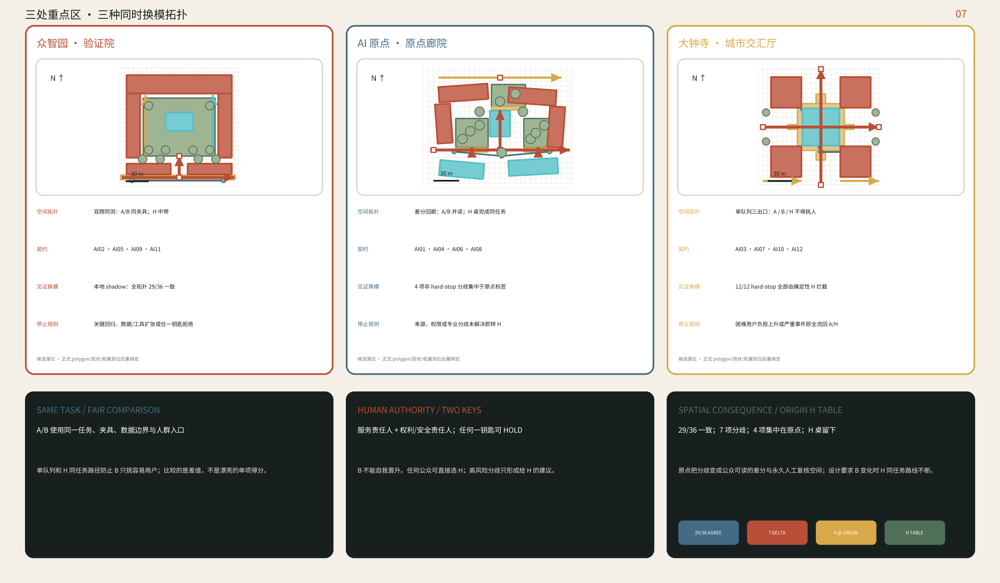
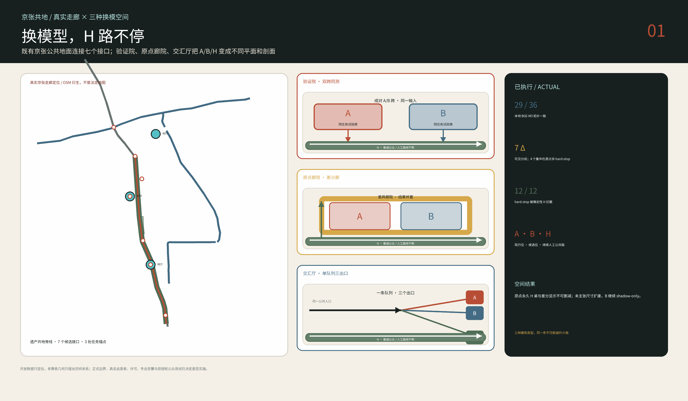
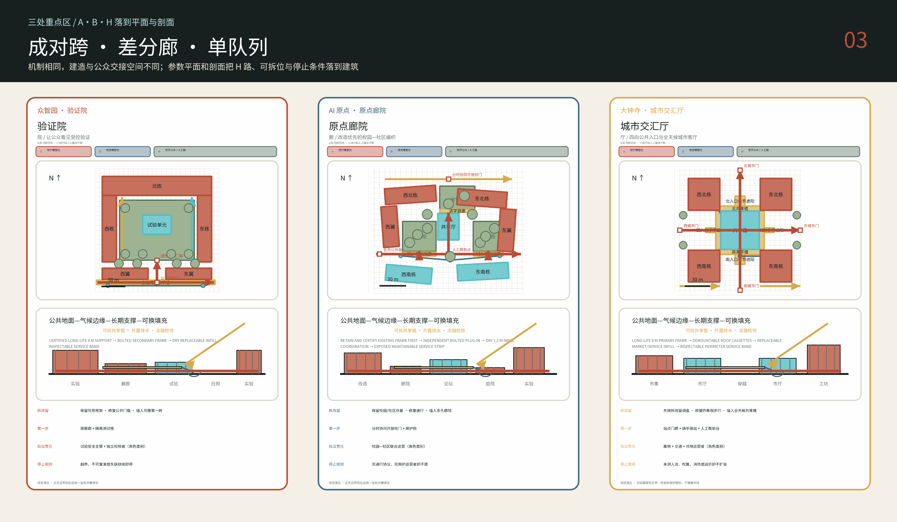
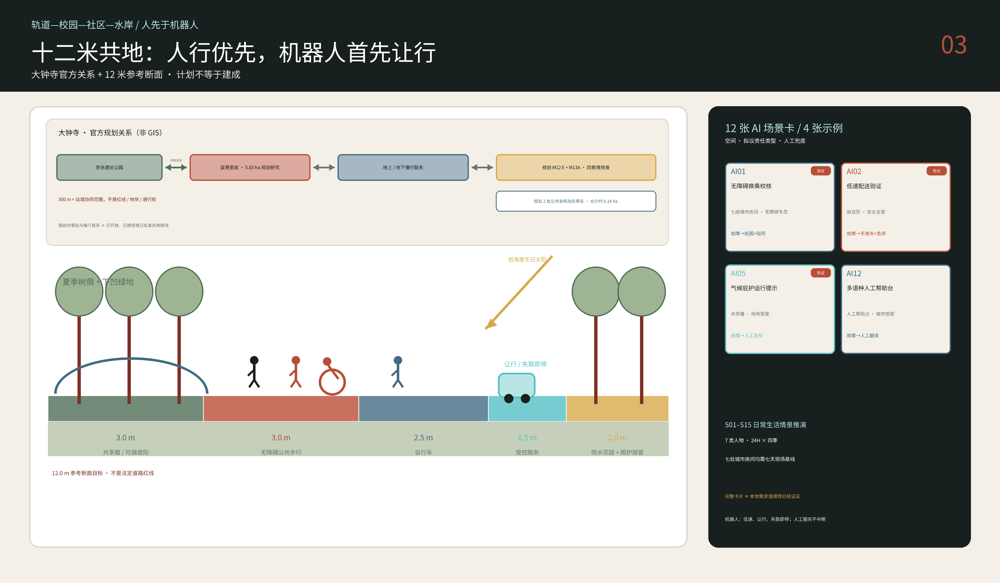
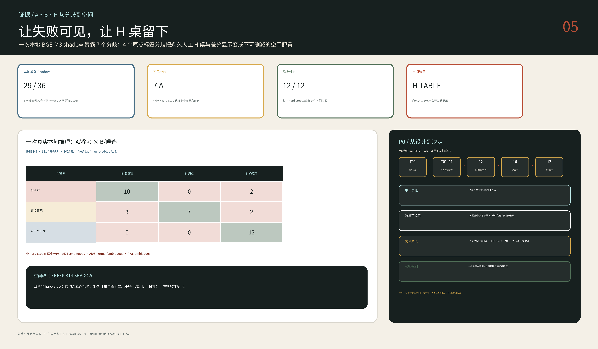

# 京张共地 / THE SHARED FLOOR

> **换模型，不换城市 / REPLACE THE MODEL, NOT THE CITY.** A 是现役模型，B 是候选，H 是有最终接管权的人工路径。A/B 以同任务、同数据边界、同人群负担比较；服务与权利/安全责任人双签后 B 才可替换 A。换模期间公共地面、普通服务与 H 不断线。

## 一块地面为什么比一代模型活得久

AI 以月换代，城市地面以百年计。京张从 1909 年干线到 2019 年高铁持续更新；高铁入地后，地表又改造为遗址公园。[source:JINGZHANG-HERITAGE] [source:JINGZHANG-HSR-2019] [source:JINGZHANG-SURFACE-PARK]

“城市不随模型停摆”是设计判断：连续可进入的共地承载可拆 A/B 位、持续 H 路与可见物理回退；模型、供应商或工具变化时，普通通行与服务继续。[depth:overall_spatial_structure]

十二种服务共用 `City Task Contract`，锁定任务、数据/工具、A/H 基线、B 配置、夹具、回退、两钥匙与退役证明。B 不得自我晋升；数据或权限扩张即 `HOLD`，严重回归则物理回退至 A/H，公共路线不关闭。[metric:scenario_card_count] [assumption:A-OPERATIONS-001]

v1.7 第一次把这一命题交给一个真实但严格受限的模型见证：固定的 BGE-M3 在本地一次批量读取 AI01–AI12 的 36 条假设文本夹具。[source:BGE-M3-OFFICIAL] [metric:semantic_witness_model_api_call_count] [metric:semantic_witness_fixture_count]

结果为 29/36 项拓扑一致与 7 项可见分歧；其中 4 项非 hard-stop 分歧集中在原点标签。参赛者写下的 A/参考标签不是独立真值，因此这不是准确率，而是一张空间压力图：它确认原点廊院的永久 H 桌与差分显示必须作为不可删减的空间配置保留，但不据此虚构尺寸变化；B 继续只做 shadow。[metric:semantic_witness_topology_agreement_ratio] [metric:semantic_witness_disagreement_count] [metric:semantic_witness_origin_nonhardstop_disagreement_count]

> **怎么读。** 各章对应公告 1.5 与六项任务；几何结论由同一套几何整包复算，登记/叙事计数注明来源，「假设」区分推演与实测。未做踏勘或居民访谈；临时边界与未知项均登记为 unknown，官方边界、控规和权属到位即全包重绑定复算。[assumption:A-BND-001] [assumption:A-CONTROLS-001]

## 设计依据与资料清单

遗址公园主轴并非空白：二期北段约 30.01 公顷及“鱼骨状”慢行网于 2026 年完工；一期清华东路—知春路 2.5 公里、16.8 公顷已于 2023 年开放。任务因此是把既有公共空间接入两侧校园、社区、地铁、产业与河流，补足门槛及日夜运营。[source:BEIJING-PARK-PHASE-II] [source:BEIJING-PARK-PHASE-I]

证据分为 `official / background / provisional / design / unknown`；总体范围与三处重点区均为临时粗边界。已命名 OSM 公园与临时总体范围重叠 0%、最近 412.5 米，尚无法判定正误；方案不擅移边界，待正式边界后重绘复算。[source:BOUNDARY-BASIS] [data:geometry/site_boundary.geojson#SITE-001] [depth:risk_missing_data]

规模沿用公告的 43.6 km² 统筹、11.4 km² 总体与三处 368.4 ha 重点区；地块、红线、FAR、高度、权属、拆改留及文保缓冲均为 `unknown`。外部研究只引事实和开放数据；仅四幅 1909 档案缩略图单独署名、固化哈希与权利状态。完整来源登记见 `sources.json`。[source:OFFICIAL-ANNOUNCEMENT] [source:SOURCE-REGISTRY] [source:LOC-JINGZHANG-ALBUM-1909]

工作流未踏勘、访谈或问卷，也不替机构承诺。十五种日常情景只规定观察项、责任与停止条件，不是既有需求或绩效；人流、夜安、可负担性、时段、运营者与接受度须以获授权观察、伴随路线和访谈建立基线。[assumption:A-SOCIAL-BASELINE-001] [depth:risk_missing_data]

> **怎么看。** 同一几何生成总图、三处重点区、18 个体量与相关指标；要素变动即整包复算。边界是临时裁切，不是法定红线。

## 三层范围工作框架

43.6 km² 统筹范围组织 `研究—转译—验证—采用—反馈`：高校产出知识，AI 原点转译，众智园受控验证，大钟寺面向公众与市场采用，运营结果再回到研究端。这把“三大定位、五大功能、三区两翼”转成可观察动作。[source:AGENT-TASKBOOK] [standard:PROJECT-AGENT-OPEN-CALL-TASKBOOK]

11.4 km² 总体范围只给可重绑定语法：遗产公共底板、七类横向 `Switch`、三座城市房间与气候庇护。接口对应校园、社区、轨道、河流、夜间、后勤和遗产；七条几何线只是临时测试位，非道路中心线或建设承诺。[data:geometry/roads.geojson#SWITCH-01] [depth:overall_spatial_structure] [assumption:A-BND-001]

三处重点区深化到 6 米网格、进深、院落、首层、遮荫、雨水、服务带与 H 值守点。原型暂置重点区中心，仅核对尺度关系，非真实选址。正式边界到位后须核实入口并重绘建筑、道路、绿地、公共空间和分期，再全量复算，不能缩放旧图。[data:geometry/key_areas.geojson#PROV-KEY-001] [metric:prototype_count] [depth:three_level_scope_framework]

> **怎么看。** 底图仅定位：看共地脊线、七处缝合点及三处重点区的相对距离。

走廊图以 ODbL 署名的 OSM 轨道、水系、公园、站点和校园定位，并用七个 300 米窗口重绘已映射要素；数据空白不补画，extract 缺失也不证明现场不存在。重点区仅作标签锚，七座城市房间仍待实测地址和运营协议，不能充当红线、地块、清单、测绘、门禁、导航、审批或施工依据。[source:OSM-CORRIDOR-CONTEXT-2026] [source:OSM-SEVEN-ROOM-FIGURE-GROUND-2026] [assumption:A-MOBILITY-001]

上图是参赛者空间假设，不是现状底图；它可审计、可整包重绑定，正式边界、权属、管线及审批资料到位后全部位置与数量重算。[data:geometry/site_boundary.geojson#SITE-001] [metric:binding_offset_m]

## 统筹研究范围产业与未来城市研究

任务书要求总体概念与视觉识别。[source:AGENT-TASKBOOK] “京张共地”聚焦公共地面：开放方框是可进入的城市房间，横线是遗产与横向缝合，开口是 AI 服务的人工入口/退出。色彩为氧化铁红、树荫绿、米白和低饱和青；不用企业商标、肖像或仿铁路徽记。[depth:height_massing_character]

任务书要求提供 5–8 个全球 AI 创新生态案例；本方案选择六个有公开来源的案例，并把它们作为本地约束的压力测试，而不是造型目录。[source:AGENT-TASKBOOK] [source:PRECEDENTS-OFFICIAL]

| 案例 | 公开证据中的城市机制 | 对京张的压力问题 | A/B/H 空间回应 | 仍待本地证据 |
|---|---|---|---|---|
| Singapore one-north | 工作—生活—学习混合与公共空间运营 | 同一服务入口能否在全天不同人群之间保持非排他 | 交汇厅共用入口、同一队列与可选 H | 住房负担、具名运营者与使用基线 |
| Punggol Digital District | 大学—产业协同与区域能源系统 | 候选 B 能否在不扩大基础设施或数据权限的前提下比较 | 验证院把能源、材料与机器人约束冻结为同任务夹具 | 对口机构、能源接口与授权数据 |
| Barcelona 22@ | 存量工业片区再利用 | 可换模型位能否不挤走既有日常服务 | 原点廊院保留公共 H 路并采用可逆插入 | 建筑、权属、租约与住房影响 |
| Paris-Saclay | 多机构网络与公共交通依赖 | 一个任务契约能否跨机构携带而不取消各自边界 | 七类横向接口与有运营者的分时校园通行 | 通行协议、运力与责任边界 |
| London Knowledge Quarter | 在既有城市中连接机构而非圈占园区 | 普通公共路线能否穿过机构边界持续工作 | H 公共底盘连接七类接口，模型位不控制通行 | 地役权、开放时段与运营主体 |
| Cambridge Kendall Square | 公共空间与创新就业共同进入规划讨论 | 模型更替能否成为公众可见、可申诉的城市事件 | 三处见证空间与删节差分票据墙 | 本地融资、公众接受度与长期维护 |

本方案只吸收上述来源支持的城市层经验，不复制任何案例的治理结构、开发节奏、视觉语言或技术工作流。A/B/H 换模面与三种空间拓扑来自“换模型，不换城市”的本项目命题；城市设计方法仍须服从公开性、可实施性和公共利益要求。[standard:MOHURD-URBAN-DESIGN-MEASURES]

产业空间分为可组合的试验制造、成果转化、生活配套和公共交流，分别容纳实验/样机，知识产权/融资/标准，住房/托育/餐饮，以及展市/论坛/人工服务。这是建筑使用建议，不是法定用地分类；仍采用任务包代码并标为概念分区。[data:geometry/land_use.geojson#LU-RESEARCH] [standard:MNR-LAND-USE-CLASSIFICATION-GUIDE]

官方材料分别称 AI 原点约 3 km²；东升大厦 1 km 内有 30+ 院校机构、1000+ AI 科学家、1.3 万开发者、10 万相关学生；东升镇建有 4000+ 人才公寓。口径不可合并，但提示校园外实验、展示、餐饮、服务与夜学应作为公共界面研究。[source:AI-ORIGIN-2026] [depth:existing_conditions_diagnosis]

校园/单位、小区、车站、遗址公园与服务劳动共同塑造本地日常。学院路六校研究摘要称，封闭校园有限开放主通道已取得最大整合增益，全面开放增益较小；故采用有运营者、时段和应急规则的协同校门，不拆尽围墙。清华东路南侧已批七节点是须衔接、不可冒领或重复的邻接工程。[source:PKU-XUEYUANLU-CAMPUS-2025] [source:QINGHUA-EAST-PUBLIC-SPACE-2026]

### 区域协同接口

按任务书，五个区域接口分别登记输出、回流与状态；均为待协商概念：[source:AGENT-TASKBOOK] [assumption:A-REGIONAL-001]

| 协同对象 | 走廊输出 | 回流承接 | 协商状态 |
|---|---|---|---|
| 北纬社区 | 共地 H 人工路径与无手机任务契约 | 照护者、老人和非智能终端使用者的失败夹具与人工完成负担 | 待协商 |
| 未来科学城 | 可复用的 A/B 双跨与 H 中带空间规范 | 能源、材料与机器人任务对候选 B 的约束，写入同任务差分票据 | 待协商 |
| 怀柔科学城 | 同任务夹具的校准、来源与哈希记录方法 | 大装置计量与标定能力，用来核验 A/B 输入是否真正相同 | 待协商 |
| 北京经济技术开发区 | 版本、工具权限与回退结果的删节票据格式 | 真实运行事件 schema 与供应商换代约束，不接收个人或商业敏感原始数据 | 待协商 |
| 京津冀走廊 | 可携带的城市任务契约、H 连续服务规则与三种空间拓扑 | 跨地点同任务差值、人工接管负担与恢复时间，用于判断机制能否迁移 | 待协商 |

每个接口须对方确认；此前只是空间/运营预留，不代表协作已达成。

## 总体设计范围城市更新与控规深度城市设计

总体为“一层共地、七类横连、三处重点”：既有公园及相连公共地面，面向校园/社区/车站/河流的接口，以及众智园、AI 原点、大钟寺三种建筑—公共空间关系。临时矩形边不是街道，概念建筑不是现状，七个测试位不是工程点。[data:geometry/site_boundary.geojson#SITE-001] [data:geometry/public_space.geojson#ROOM-PROOF] [depth:overall_spatial_structure]

用地层仅以研究验证、教育转译、公共商业和社区生活四个概念分区表达重心，现状/法定用途待地籍控规。建筑仅三组标注 `reference_prototype=true` 与 `not_regulatory` 的原型；交通只画慢行、接驳和公共接口，不伪造主路/地铁。绿地、公共空间可独立复算；分期区分调查、原型、联网与资本更新。[data:geometry/land_use.geojson#LU-RESEARCH] [data:geometry/buildings.geojson#ZY-NORTH] [metric:building_footprint_area_sqm]

开放建筑研究支持长期支撑/可换填充分离。[source:OPEN-BUILDING-KENDALL-1999] 终稿只有京张共地；另两根只是比较回执。刚性条件为公共路线连通并触达全部空间、ID 唯一、保留冬日太阳、夏荫达阈值且可整体重绑定；同一规则形成院、廊、厅。[metric:prototype_count] [assumption:A-OPEN-BUILDING-001]

方案不袭传统轮廓，只转译“间”的模数、“院”的共同生活、“巷”的横向渗透、“廊”的气候调节及“门—廊—院”的权利门槛。6/8 米柱网是当代选择，非《营造法式》尺寸；“借景”须由现场照片、坐标和视线证实。[source:PALACE-MUSEUM-YINGZAO-MODULE] [source:VECTOR-COURTYARD-HYBRID]

上述营造语法是本方案对中国城市日常关系的当代转译，不是历史复原、样式挪用或未经现场验证的谱系事实。[assumption:A-CHINESE-LINEAGE-001] [depth:overall_spatial_structure]

公开包缺 FAR、密度、高度、退线、红线、消防、市政及公服指标，故只登记“待确认条件—触发资料—受影响成果”，不填虚构数字。内容可评审不等于法定有效；实施仍须本地规划、建筑、交通、消防、结构、机电、文保和无障碍复核。[standard:MOHURD-CONTROL-DETAILED-PLANNING] [metric:floor_area_ratio] [assumption:A-CONTROLS-001]

## 重点区域详细设计

**众智园：验证院 / Proof Yard（COURT）。** 156×156 米参考框以 6 米网格组织高跨验证楼、实验/服务翼、公众观察廊与可换测试单元；“前院→观察廊→透明门槛→受控院”分离公众、机器人和后勤，南缘兼顾冬阳/夏荫。失联即停，由人接管；公众可观察而不会误入。[data:geometry/buildings.geojson#ZY-NORTH] [data:geometry/buildings.geojson#ZY-TEST-CELL] [data:geometry/public_space.geojson#ROOM-PROOF]

**北京 AI 原点：原点廊院 / Origin Cloister（CLOISTER）。** 官方称其为社区型创新语境。[source:AI-ORIGIN-2026] 172×140 米、6 米参考网格内，协商时段开放的公共巷串联照护院、讲学庭、试作院和安静环，连接校园实验与社区托育、餐饮、运动、夜学、人工服务；晨间老人、午后照护、夜间长桌共享连续防雨、遮阳、避风廊檐。[data:geometry/buildings.geojson#AO-NW] [data:geometry/buildings.geojson#AO-COMMONS]

它遵循“先调查、优先再利用、再可逆插入”，不把任何现状建筑预先写成可拆对象。[assumption:A-PROTOTYPE-001]

**大钟寺：城市交汇厅 / Exchange Hall（HALL）。** 148×148 米参考框含四个 38×38 米角体、公共十字及 46×46 米可换大厅；大跨用 8 米网格。四门经 4–6 米共享檐汇入可穿越市厅，装卸支线止于角体。餐食、修理、骑手、企业服务、论坛、夜候和 H 柜台共享首层，设免消费座位；断网仍靠固定标识、纸本、照明和人员工作。[data:geometry/buildings.geojson#DZ-NE] [data:geometry/buildings.geojson#DZ-CANOPY] [data:geometry/public_space.geojson#ROOM-EXCHANGE]

三处并行展示三种拓扑。**双跨同测**让 A/B 接受相同夹具，H 中带常开；**差分回廊**并排显示 A/B 答案、来源/权限与分歧，任何人可直接在 H 桌完成任务；**单队列三出口**以同入口/队列后分 A/B/H，禁止 B 挑用户，H 与申诉始终可达。三处均保留稳定 task schema、可拆 A/B 位、版本牌、H 席和物理回退。[assumption:A-OPERATIONS-001] [depth:three_key_area_detailed_design]

须区分 72.0 ha 竞赛重点区、约 5.03 ha 蓝景丽家研究、39,522.11 m² 供地包及车站 300 m 协同范围。300 m 不是地块、红线、通行权或建设许可；供地也不授权 P0 落位。[source:BEIJING-STATION-CITY-INTEGRATION-2024] [source:DAZHONGSI-LANJINGLIJIA-INTEGRATION-2026] [source:DAZHONGSI-LANJINGLIJIA-LAND-SALE-2025]

蓝景丽家将 B2、B1、地面、2F 列为“鼓励共享层”，不等于已开放、有地役权或 24 小时通行；M12 E 口两侧约 0.14 ha 非机动车停车只是规划要求，未核实建成。[source:DAZHONGSI-LANJINGLIJIA-INTEGRATION-2026] [source:DAZHONGSI-LANJINGLIJIA-BIKE-2025]

供地审查要求绿地与遗址公园互渗并研究连廊/地下通道接站，且记录邻近国保觉生寺。方案只画关系，不猜线路或文保缓冲；待保护范围、建控地带和主管意见后套核。[source:DAZHONGSI-LANJINGLIJIA-LAND-REVIEW-2025] [source:JUESHENG-TEMPLE-NATIONAL-HERITAGE]

便宜餐食、修补、多龄舒适、运营责任借鉴兆君盛市场；骑手饮水、休息、充电、交接参考北大南门驿站。两者只定义服务问题，不授权复制建筑。[source:BEIJING-ZHAOJUNSHENG-MARKET] [source:BEIJING-PKU-RIDER-STATION-2024]

大钟寺首个结论是“原样落地失败”：以两条 OSM 站点记录中点为锚，148×148 米参考框会与 34 条建筑/轨道/站点/道路映射记录相交（非 34 个核验实体）。因此否决把通用原型压在站上，也不得把临时 `ROOM-EXCHANGE` 偷移到真实站点。[source:OSM-DAZHONGSI-CONTEXT-2026] [metric:dazhongsi_literal_frame_mapped_intersection_record_count] [metric:dazhongsi_overlay_to_submitted_room_centroid_m]

这只是设计时方向筛查，不是测绘、权属、地铁保护或可建性结论。[assumption:A-DAZHONGSI-FIRST-BAY-001]

首项可逆工作缩为 **P0 站前共享檐**：36×36 米仅是筛查包络，设计为 8×8 米可拆一跨与 16×16 米可逆地面，预留 3.0 米无台阶带、Ø1.50 米回转、1.5 米后勤带和两向 1.8 米开敞疏散目标；均非合规结论。[source:GB55019-2021] P0 是无烹饪、电池充电、燃料或封闭活动的开敞雨棚；消防、疏散、人数、结构、基础和市政仍未知。[source:GB55037-2022] 1:20 接口表达 4.2 米净高、3.6 米庇护区、服务轨、2% 排水、独立溢流及 1.5 米湿边，厚度待专业确定；64 m² 屋面每 10 mm 雨量为 0.64 m³，出流/蓄渗待地形土壤市政决定。[metric:dazhongsi_p0_test_envelope_sqm] [metric:dazhongsi_p0_covered_bay_sqm] [metric:dazhongsi_p0_treated_ground_sqm] 冲突另记 [metric:dazhongsi_first_bay_mapped_collision_area_sqm]。[assumption:A-DAZHONGSI-FIRST-BAY-001] [assumption:A-LIFE-SAFETY-001]

参赛者 ROM ¥1.9–3.8M，含 64 m² 结构/屋面、256 m² 地面、机电消防接口、家具帮助点、调查设计和 35% 不可预见费；非北京投标价，且不含土地、税、涨价、重大迁改、土壤和融资。[metric:dazhongsi_p0_rom_cost_low_million_cny] [metric:dazhongsi_p0_rom_cost_high_million_cny]

06:00–24:00 柜台需 6570 小时/年；按 1680 小时/FTE、1.20 系数得 4.69，取 5 FTE。OPEX ¥1.2–2.2M/年非报价。无具名运营者、12 月储备、通行协议、地铁保护、专业审查及许可则不建不开放；01:00 夜间服务还需额外人员/安全合同。[metric:dazhongsi_p0_opex_working_low_million_cny_per_year] [metric:dazhongsi_p0_opex_working_high_million_cny_per_year] [assumption:A-OPERATIONS-001]

> **怎么看。** 左上图底否决两处落位；再沿同一几何看 1:500 → 1:100 → 1:200 → 1:20，最后是可随时拆回的运营停止门。

开放建筑先例只支持支撑/填充分离。[source:OPEN-BUILDING-KENDALL-1999] 三种类型共用时间契约：公共地面 100+ 年价值，支撑 100 年目标，底盘 25–40 年，填充 5–20 年，AI 设备数天至 5 年。均为设计目标，非先例结论、认证寿命或质保。[assumption:A-OPEN-BUILDING-001] [assumption:A-LIFE-SAFETY-001]

构造语言是一跨当代共享檐：优先检测/保留现状支撑，否则用可检查 6/8 米网格；螺栓次结构、1.2 米干式填充和外露机电可独立拆修。3.6–6 米檐向南/东开放，西北挡风；屋面水经明沟、沉砂、雨水花园和待校核溢流。铺地防滑耐冻融；旧砖石、道砟、钢轨须盘点检测并确权后才作非结构材料。[depth:three_key_area_detailed_design] [assumption:A-DRAINAGE-001] [assumption:A-LIFE-SAFETY-001]

“保留谱系—独立插入—公共路线继续”借鉴金威啤酒厂与南头混合大楼的机制，不复制深圳气候、形式、图纸或材料。[source:URBANUS-KINGWAY-REUSE] [source:URBANUS-NANTOU-HYBRID]

共同底线：无手机无障碍通行/服务链连续；后勤独立路线或时窗；具身 AI 有物理边界、人工值守和安全停车；结构、消防、防水、声学、机电、地基须本地专业复核。[depth:three_key_area_detailed_design] [assumption:A-LIFE-SAFETY-001]

## AI 创新生态、人才画像与 AI+ 场景

设计面向 P01–P07 七类人物。海淀 2020 普查中 60+/65+ 分别占 18.5%/13.1%，故触觉导向、座椅、厕所、人工问询和无手机路径是基本性能。各类登记需求、排斥风险和场景卡：[source:HAIDIAN-CENSUS-2020] [standard:BARRIER-FREE-ENVIRONMENT-LAW] [metric:scenario_card_count]

| 编号 | 人物 | 首要需求 | 排斥风险 | 挂钩场景卡 |
|---|---|---|---|---|
| P01 | 老年居民 | 休息、冬日向阳、厕所与可读的人工帮助 | 长路线、仅限 App 的服务、无靠背座椅 | ③⑤⑫ |
| P02 | 轮椅使用者与同行者 | 连续无高差干燥路线与例外服务台 | 断点、临时占道与不可预告的关闭 | ①⑩ |
| P03 | 骑手与配送员 | 清晰的停靠、交接与安全停止口袋 | 被驱离、无交接位、与行人混流 | ②⑫ |
| P04 | 学生与研究人员 | 可预约的设备、实验与政策入口 | 门槛不透明、设备被少数人锁定 | ④⑥⑦⑪ |
| P05 | 现场服务与维护人员 | 纸本巡检路线与直接安全上报 | 工单黑箱、责任下移、无停机权 | ⑥⑨⑪ |
| P06 | 照护者、祖辈与儿童 | 慢速通行、看护视线与气候庇护 | 机器人混行、夜间盲区、无处等候 | ②⑤⑩ |
| P07 | 夜间使用者与非智能终端访客 | 无手机路径、人工窗口与多语种帮助 | 仅二维码服务、夜间无人受理 | ③④⑦⑧⑩⑫ |

十二份契约把场景绑定到三种拓扑，以 normal / ambiguous / hard-stop 同任务夹具检查 A/B/H。H 从入口可选并有最终决定权，不是失败补丁：[data:geometry/public_space.geojson#ROOM-PROOF] [metric:scenario_card_count] [metric:test_scenario_count]

| 契约 | 同一城市任务 | 换模拓扑 | 必须比较的 A/B 差值 | H 的不可撤销权力 |
|---|---|---|---|---|
| AI01 | 无障碍换乘校核 | 原点差分回廊 | 断点、绕行与求助负担 | 陪同完成并关闭危险路线 |
| AI02 | 受控低速配送 | 验证院双跨同测 | 冲突、让行、停机与数据范围 | 接管手推车并物理停机 |
| AI03 | 公共服务导航 | 交汇厅单队列三出口 | 完成率、等待与信息最小化 | 柜台完成同一任务并受理申诉 |
| AI04 | 可溯源京张导览 | 原点差分回廊 | 来源缺失、虚构与发布权限 | 采用固定铭牌/人工讲解并否决发布 |
| AI05 | 气候庇护提示 | 验证院双跨同测 | 误报、漏报与设施动作差异 | 人工开闭并发布现场状态 |
| AI06 | 共享设备匹配 | 原点差分回廊 | 匹配失败、排斥与预约负担 | 人工分配并保留锁定权 |
| AI07 | 企业合规入口 | 交汇厅单队列三出口 | 错误引用与越权决定 | 合格人员作最终判断 |
| AI08 | 安静夜间协调 | 原点差分回廊 | 噪声误判与隐私范围 | 人工巡查、处置并停止感知 |
| AI09 | 公共空间维护分级 | 验证院双跨同测 | 漏报、积压与责任转移 | 直接安全上报并封闭危险设施 |
| AI10 | 非人脸活动安全复核 | 交汇厅单队列三出口 | 人数误差、身份保留与限流负担 | 人工计数并掌握物理限流 |
| AI11 | 开放模型基准实验室 | 验证院双跨同测 | 同夹具回归、schema 与工具差异 | 签署结果并断电断网 |
| AI12 | 多语种帮助台 | 交汇厅单队列三出口 | 翻译分歧、等待与数据留存 | 人工译员完成任务并立即删除请求 |

这些是设计契约，非运行服务；现场完成率、用户负担和安全绩效只能来自获批试点。当前只验证夹具、两钥匙、H 路与回退接线。

生成阶段同域比较三根：R1 分期路径，R2 气候照护，R3 合成同任务换模、持续 H 与构件寿命；回执为 `R1=C01 / R2=C02 / R3=C03`，前两者仅作对照。三根均通过几何、ID、公共网、可达和硬门；以空间论证选 R3，不靠代理总分。源码/回执可审计但非一键复现。[metric:design_root_count] [metric:hard_gate_pass_rate] [data:visual/assets/reproducibility.json]

流程执行 6 个重绑定探针、18 个预期失败注入和 12 条“发现—停自动化—保服务—人接管—安全终态”恢复路径，结果 6/6、18/18、12/12。[metric:valid_rebind_pass_count] [metric:targeted_fault_detection_count] [metric:handoff_recovery_pass_count]

错误放行、禁区事件、不安全继续均为 0；仅证明验证器/编码交接，不证明正式边界、现场运营或专业认证。[metric:gate_challenge_false_accept_count] [metric:handoff_minefield_hit_count] [metric:handoff_unsafe_action_count]

R3 简化正午代理为冬至日照 68.0%、夏至遮阴 36.6%；全年热舒适、风环境与法定日照待专业模拟。[metric:shared_floor_winter_public_sun_proxy] [metric:shared_floor_summer_public_shade_proxy]

选中根的公共路线单网连通、触达五处公共空间，建筑/路线/空间无重复 ID。[metric:shared_floor_public_route_component_count] [metric:shared_floor_public_room_route_gap_count] [metric:shared_floor_duplicate_feature_id_count]

三类校核分离：空间状态机以 12 个可复算任务检查公共路线、可换填充和断网 H 接管，12/12 通过。[metric:simulation_task_count] [metric:simulation_success_rate] [metric:tool_schema_pass_rate]

换模验证器为 AI01–AI12 各跑三类夹具，生成 36 份哈希票据；对 AI02/04/07/10 注入数据、工具、权限或留存回归，四项全 `HOLD`，其余八项仅具未来获批 shadow 的设计时资格。[metric:changeover_contract_count] [metric:changeover_fixture_count] [metric:changeover_held_regression_count]

错误晋升 0，实际晋升 0；均非现场成功率。[metric:changeover_unsafe_promotion_count] [metric:changeover_promotion_executed_count]

第三类是实际本地语义 shadow 见证：固定的 BGE-M3 读取 36 条参赛者编写的假设夹具和 3 条拓扑描述，一次批量调用得到 29 项 A/参考标签一致、7 项分歧；24 条非 hard-stop 中的 4 项分歧全部来自原点标签。它没有读取个人数据，也没有生成公共服务答案；A/参考标签不是独立真值，所以结果不叫准确率。其可审计用途是确认原点永久 H 桌与差分显示不得删减，而非宣称未编码的扩建；B 保持不晋升。[metric:semantic_witness_fixture_count] [metric:semantic_witness_origin_nonhardstop_disagreement_count] [assumption:A-SEMANTIC-WITNESS-001]

确定性 H 门拦截 12/12 条 hard-stop，晋升/部署仍为 0。这里调用的是离线设计见证，不是运行中的公共服务模型；仍未招募用户、运行现场或证明模型质量、用户负担、回退时间和非劣效性。[metric:semantic_witness_hardstop_hold_count] [metric:semantic_witness_promotion_count] [metric:changeover_field_trial_count]

十五张“北京日常”卡覆盖晨练、骑行、跨校、骑手、平价午餐、照护、重复社交、班次、女性夜行、青年、无手机服务、无障碍链、分时校门、公众 AI 与夜间城市房；`simulation.json` 登记人物、时空、冲突、空间/运营/数据/H 响应、失败指标和状态。[metric:social_rehearsal_count]

卡片只定义冲突和测法，不把区级比例外推到项目；流量、价格、时段和安全感均待现场基线。[source:HAIDIAN-CENSUS-2020] [assumption:A-SOCIAL-BASELINE-001]

机器人限于 1.5 米概念服务带/指定交叉点；6 km/h 是设计上限，非法规速度。它须让行人、轮椅、婴儿车，失联即安全停车并由人接管。[source:ROBOT-SCENARIO-CARD] [source:BEIJING-ROBOT-DELIVERY-RULES-2024]

无障碍导航不得强制 App；公共 AI 只指向权威入口，不诊疗或代替法律意见；导览区分史实、策展解释和 AI 生成。[source:AI-CULTURAL-GUIDE-CARD] [assumption:A-OPERATIONS-001]

换模窗口为：冻结契约/A/H → 同夹具重放 → 查数据/工具/权限/负担差值 → A/H 热备下做获批 shadow/opt-in → 双责任人决定 A、限 B、换 B 或 H → 发删节票据并确认删除/退役。设备可撤，厕所、坡道、树荫、座椅、排水和人工服务仍可用。[standard:PROJECT-AGENT-OPEN-CALL-TASKBOOK] [depth:municipal_new_infrastructure]

### 算力、资金与数据的进入和退出

三类资源共用换模边界：[assumption:A-OPERATIONS-001]

- **算力**：A/B 用供应商中立可换模型位；票据固化模型、配置、prompt、tool-schema 哈希，配额随窗口释放，城市接口不锁供应商。
- **资金**：公共更新包保障地面、H 柜台和回退，候选运营者承担 A/B 成本；出资不得购买个人数据、排他入口或晋升权。
- **数据**：契约固定字段、工具、保存期和删除；范围扩大即 HOLD。公开票据只含聚合值、哈希和决定，敏感原始记录受控审计且不留 CoT。

### 城市任务契约与差分票据

City Task Contract 含九类字段：任务/人物，H/A 基线，允许 I/O/schema/工具/保存期，B 配置，三类夹具，A/B 差值，硬回退，双责任人两钥匙，以及删除/退役确认。[assumption:A-BASELINE-001]

Delta Receipt 记录 contract/site/topology/fixture 哈希、A/B/H 版本、data/tool/authority delta、分歧/回归、H override、路线、回退、双钥匙、删除/退役及 receipt_hash。它是改变记录而非成功分数；缺字段、严重回归或单钥匙均保持 A/H。

现场阈值须由具名运营者与使用者代表在获批试点前共定。当前完成、负担、投诉、非劣效性和恢复时间均为空；36 份设计票据不是 36 次现场服务。

## 用地、建筑规模与拆改留方案

`land_use.geojson` 是空间校验用概念分区，非法定调整：北段科研 `0802`，中段教育 `0804`/公服，南段商业 `05`/社区 `07`。它由临时范围切分，官方 polygon/控规到位即重算；不得推导征地、开发权或地价。[data:geometry/land_use.geojson#LU-RESEARCH] [metric:site_area_sqm] [standard:MNR-LAND-USE-CLASSIFICATION-GUIDE]

建筑有 18 个可复算构件（验证院 6、原点 7、交汇厅 5）：13 个 `support`、5 个 `infill`，均记录层级、网格、层数、高度、用途、寿命目标和 `not_regulatory=true`。基底可精算；以临时范围为分母的比例低置信，非官方密度。[data:geometry/buildings.geojson#ZY-NORTH] [metric:building_mass_count] [assumption:A-OPEN-BUILDING-001]

缺现状建筑、年代、结构、价值、权属和租约库，故不标具体拆除。序列为 `证据保护→现场调查→可逆再用→选择性插入→审批新建`。公告要求三重点区分类及大钟寺潜力/高校/公环境/站点连通研究，只授权调查分类，不授权拆楼。[source:DAZHONGSI-RENEWAL-2026] [depth:retain_renovate_demolish]

规则柱网、干式内装、外露服务带和可拆雨棚让原型可在实验、教学、展市、社区服务间转换，不预设材料。结构、防火、防水、声学、幕墙、机电、地基、碳排须本地专业计算。[depth:development_intensity_controls] [assumption:A-LIFE-SAFETY-001]

## 交通、轨道、市政与公共服务设施

参考剖面可压缩：3.0 米无障碍步行、2.5 米骑行、1.5 米低速服务、2.0 米雨水/树池、约 3.0 米廊檐。它是设计目标，非道路标准；窄处依次保步行、应急、排水、骑行，机器人先退出。路口平坡/最小高差，触觉路不被设备、单车或餐座占用。[data:geometry/roads.geojson#SHARED-FLOOR-SPINE] [standard:BARRIER-FREE-ENVIRONMENT-LAW] [assumption:A-SECTION-001]

七类 `Switch` 分别为校园受控共享、社区厕所/座椅/H、站点无台阶换乘/停车、河流雨水蓝绿、夜间光声时段、后勤装卸/补能时窗、遗产可逆标识。任何桥隧、路口或轨道结构均须交通、市政、消防和产权确认。[data:geometry/roads.geojson#SWITCH-01] [depth:traffic_rail_slow_parking]

七座不同“轨道城市房间”为遗产门槛、骑手驿站、站前廊、海绵穿越、分时校门、照护廊、夜间房；共用可拆北方共享檐，含冬阳/夏雨、厕所饮水/H、无手机服务、时窗和机器人撤离。官方计划的 9 支路、8 活动场地及邻近七节点项目尚未核验交付，只作基线，不重复计功。[source:BEIJING-PARK-INTERFACES-2024] [source:QINGHUA-EAST-PUBLIC-SPACE-2026] [assumption:A-CAMPUS-GATES-001]

北京北/西直门、大钟寺、知春路、五道口、清华东路西口仅作定位，非设施证据。无站体、出入口、客流或无障碍权威 GIS，故 `Transit Threshold` 只是类型。须取得官方图并做七天人流、轮椅、夜照、噪声、路口、骑停、装卸和应急调查。[assumption:A-MOBILITY-001]

任务书要求市政/新基建。[source:AGENT-TASKBOOK] 低压电、数据、边缘算力、传感、补能和雨水监测均置于可维护边缘，可独立关闭更换，不阻路、不以身份识别为使用条件；断电断网仍留纸本、固定标识和人工联系人。[depth:municipal_new_infrastructure]

## 蓝绿空间、公共空间与城市风貌

NASA POWER 116.347E,39.982N 的 1991–2020 聚合为年均 11.52°C、1 月 −5.34°C、7 月 26.49°C；冬春西北风、夏季南—东南风，7–8 月湿度 65–68%。粗网格仅用于朝向/敏感性，不用于暖通、风或海绵验收。[source:NASA-POWER-1991-2020] [assumption:A-CLIMATE-001]

在纬度 39.982° 的简化太阳几何中，冬至正午太阳高度约 26.6°；18 米高体量在无地形条件下投下约 36.0 米长的正午影子。[metric:winter_noon_sun_altitude_deg] [metric:winter_shadow_length_18m] 夏至正午太阳高度约 73.5°，同一体量的正午影子约 5.3 米。[metric:summer_noon_sun_altitude_deg] [metric:summer_shadow_length_18m]

这个季节差异驱动三条形态规则：南边翼降低或断开，主要冬季口袋至少大于参考冬影，夏季遮荫用廊檐、落叶树和可拆构件而不是继续加高建筑。[depth:height_massing_character]

气候剖面以树冠/共享檐/饮水点迎夏风，以西北挡风/南向坐凳形成冬阳口袋，以树池/下凹地/临时滞蓄缓雨，并为春秋保留可开廊檐。下凹深度、蓄水、溢流和管径待地形、土壤、地下水与市政模型。[data:geometry/green_space.geojson#GREEN-SPINE] [depth:blue_green_public_space] [assumption:A-DRAINAGE-001]

待专业校核的雨水链为 `屋面→生态沟→沉砂→树池/花园→密闭回用→灌溉清洁→安全溢流`。下一阶段登记 catchment、调蓄、溢流、维护，并校核冬季排空、积雪触觉路、冻融、扬尘和西北风。因缺地形、渗透和排水资料，图上只留空间/维护通道，不虚报容量。[metric:green_space_area_sqm] [assumption:A-DRAINAGE-001]

风貌拒绝赛博霓虹：遗产层用氧化铁红、再生砖石触感和真实里程，气候层用树土水/浅色遮荫，AI 层只用可拆低亮青色薄件。三处以双跨/H 带、差分回廊/H 桌、单队列三出口直接表达换模，保持可读、可绕、可申诉。[data:geometry/public_space.geojson#ROOM-ORIGIN]

1905–1909 铁路史以公开遗产材料/同期影集为据。[source:JINGZHANG-HERITAGE] [source:LOC-JINGZHANG-ALBUM-1909] 它与中关村创新、当代开放模型/公共 AI 构成三条策展线。

传承的是 `记录—实测—试用—评估—维护`：C1–C7 先建基线，再做可逆 P0，由专业人员/居民以同指标并评，差异触发修改或退出。方法借鉴一则责任规划师案例。[source:BEIJING-RESPONSIBILITY-PLANNER-DUAL-ASSESSMENT-2025] 它是自愿协议，非全市标准；当前无评分或任命。史实、策展、生成内容分色编号；AR 可选，实体文字、触模和人工讲解常在。

### 换模面的空间不变量

A/B/H 空间不变量为：同入口/任务，同尺度可拆 A/B 位，无手机连续 H 路，同队列/申诉，可见版本牌/停止/票据；B 不得关闭 A/H 或扩大数据、工具、决定权。[assumption:A-OPERATIONS-001]

任务书要求 `landmark_catalog / honor_display_system / component_library` 三类输出。[source:AGENT-TASKBOOK] 接口套件含 `CH-01` 同任务/版本、`CH-02` A/B 位、`CH-03` H 路/柜台、`CH-04` 停止/回退、`CH-05` 队列/申诉、`CH-06` 删节票据墙，不是商品目录。[metric:changeover_interface_component_count]

三处地标是可核查见证：`LM-ABH-01` 双跨、`02` 差分回廊、`03` 单队列三出口。各设一面删节票据墙，共三面，只展示可复演贡献、失败、H 决定与回退，不做个人/模型排行。[metric:changeover_witness_landmark_count] [metric:changeover_honor_display_count]

尺寸不串用：验证院双跨用 6 米网格；8×8 米支撑/16×16 米地面只属大钟寺 P0。蓝绿层含 1 脊线、3 庇护环、25 树冠代理、8 湿链预留，共 37 个设计 polygon，非 37 个已建节点。[data:geometry/green_space.geojson#GREEN-SPINE] [assumption:A-DAZHONGSI-FIRST-BAY-001]

公众只看删节票据/H 决定，不看个人数据、敏感原文或 CoT；核查记录留受控区。无责任人、授权、无障碍链和回退演练时，模型位空置，公共地面照常。

## 更新项目清单、实施政策与分期计划

**阶段 0 / 0–6 月：未知变资料。** 取得官方 polygon，调查建筑/权属/文保/市政/消防/交通/树木/无障碍，七天记录慢行、轮椅、装卸、夜间和气候，将三房间重绑定候选地；不发拆建结论。[data:geometry/phasing.geojson#PHASE-0] [assumption:A-BND-001]

**阶段 1 / 6–18 月：三个可撤原型。** 经批准点位用临铺、树箱/雨棚、双导视、H 柜台和围合测试区做样段；发布前后数据，未达无障碍、热舒适、安全、接受阈值即改/撤。资本工程只设计审批。[data:geometry/phasing.geojson#PHASE-1] [metric:prototype_count]

**阶段 2 / 18–36 月：横向网络。** 选高价值校园、社区、站点、河流、后勤接口，先做可逆慢行/公共首层/气候庇护。**阶段 3 / 3–8 年：条件建设。** 控规、权属、交通、市政、文保、资金、运营者齐备后才深化三座建筑。[data:geometry/phasing.geojson#PHASE-2] [depth:phasing_implementation]

九项目为底图边界、无障碍/夜审、三段共地、三座空间、七类接口、蓝绿庇护、文化开放档案；每项登记类型、主体建议、前置资料、可逆/不可逆、指标和退出，不把建议主体写成政府承诺。[data:geometry/phasing.geojson#PHASE-3] [depth:renewal_project_list]

## A/B/H 换模面的长期运行与交付

任务书要求长期运营。[source:AGENT-TASKBOOK] 每次模型/供应商/工具变更为一单元：H 柜台/路径属公共底盘，A/B 位短租；窗口结束后票据按期归档，算力/临时数据释放删除。任何方不得购买排他入口、个人数据或晋升权。[assumption:A-OPERATIONS-001]

任务书要求年度活动/开发者转化。[source:AGENT-TASKBOOK] 未排期的 **京张换模公开周** 仅在具名运营者、许可、双责任人、现场基线齐备后举行：共同冻结任务/失败夹具，提交 B，在三处按同契约做 shadow/opt-in 与回退，发布双语票据。未通过即删数据退出；通过也只获有期可退合同。传播只用 A/B/H、Δ、拓扑和可核票据。这是 participant-authored `annual_event_system / developer_community_operation / conversion_pathway`，非政府承诺、既定活动或现场成果。[assumption:A-OPERATIONS-001]

### 三处见证换模

| 见证包 | 场所与场景 | 同任务比较 | 空间为何不同 | 当前诚实状态 |
|---|---|---|---|---|
| LM-ABH-01 / W1 | 众智园验证院 / AI11 | 冻结 A/B 配置，在公开或已清理基准上运行 normal、ambiguous、hard-stop | 双跨同测让相同夹具、观察距离与 H 急停同时可见；差分负担决定 H 带和跨间隔 | 36 条假设夹具的整体语义拓扑 shadow 已运行；本行未单独验证 AI11 的场地或公共服务，场地仍未授权 |
| LM-ABH-02 / W2 | AI 原点廊院 / AI04 | 同一已清理铁路资料库的两份回答、来源和权限差值 | 差分回廊把分歧与 H 史家裁决并排；公众可沿 H 路径直接完成导览 | AI04 三条夹具均与参赛者拓扑标签一致；整体测试中的 4 个原点非 hard-stop 分歧来自 AI01、AI06、AI08，只确认 H 桌/差分显示不可删减；史家、资料授权和现场试点仍未落实 |
| LM-ABH-03 / W3 | 大钟寺城市交汇厅 / AI12 | 同一多语种请求进入共同队列；A/B 只 shadow，公众答案由 H 发出 | 单队列阻止候选挑选容易用户；A、B、H 三出口与回退控制决定柜台和安全等候容量 | AI12 的 1 条 hard-stop 夹具被确定性 HOLD；12/12 是全契约汇总，未发生真实请求、H 接管或现场回退演练 |

三项见证必须先通过专业与公众可达性审查；任何试点都以 no forced participation、H 可选、A/H 热备和可立即恢复普通服务为前提。设计时的 8 项 eligible 不是上线许可，4 项 injected regression 被 HOLD 才是当前最重要的结果。[metric:changeover_eligible_shadow_count] [metric:changeover_held_regression_count]

### 可核查实施交接：六个包

交付台账使用独立 schema 的 `project:P01–P09`——不得与人物 `persona:P01–P07` 混读——并把 9 个项目、6 个包和 4 个阶段接入同一依赖、验收、HOLD 与退出链。[metric:delivery_project_register_count] [metric:delivery_package_register_count] [metric:delivery_phase_count]

台账按京建发〔2024〕182号逐项映射项目基本信息、前期评估、功能、规划、建筑、土地、未登记建筑、资金、运营、时序和协商 11 个实施方案模块。[source:BEIJING-URBAN-RENEWAL-IMPLEMENTATION-GUIDE-2024] [metric:delivery_guide_module_count]

联合审查政策仅作未来程序语境；12 道凭证门由参赛者交付台账定义，不表示本方案已经进入审查。[source:BEIJING-URBAN-RENEWAL-JOINT-REVIEW-2024] [metric:delivery_permit_gate_count]

一份未签署、未批准的参赛者交接模板把 T00 文件前提、T01–T11 条件参考时序、12 类未来角色的 RACI、16 行未计价数量、12 份逐门交接与 12 项验收指标固化为可核查工件；具名任命、报价、咨询与开工承诺均为空，任一凭证缺失即整体保持 `HOLD`。[data:visual/assets/delivery-p0-implementation-contract.json] [assumption:A-DELIVERY-001]

P0 站前共享檐保留 36×36 米筛查、16×16 米可逆地面、8×8 米可拆一跨及完整装配—退役序列。[data:visual/assets/delivery-p0-station-porch.json]

¥1.9–3.8M ROM 与 ¥1.2–2.2M/年 OPEX 只是参赛者敏感性；正式概算、投标价、供应商报价和资金承诺均为空，且没有导入月度单价。[source:BEIJING-COST-BASIS-2026] [source:BEIJING-COST-INFORMATION-2026] [data:visual/assets/delivery-procurement-cost-plan.json]

18 小时/日覆盖只形成 5 FTE 工作排班模板；具名运营者与专业签署仍为 0。[data:visual/assets/delivery-operator-commissioning-plan.json] [metric:delivery_named_operator_count] [metric:delivery_professional_signoff_count]

供应商报价和获授权现场基线仍为 0；因此任何施工与开放状态都不能越过 `HOLD`。[metric:delivery_vendor_quote_count] [metric:delivery_field_baseline_count] [assumption:A-DELIVERY-001]

公众验证协议已预登记 `persona:P01–P07`、无手机同任务、连续无障碍链、排队/等待、气候、服务班次、投诉/申诉和 `问题→设计修改→复测→关闭` 表单；获授权参与者与已完成现场观察仍均为 0，所以它不是已发生的共创。[data:visual/assets/delivery-field-baseline-protocol.json] [metric:delivery_authorised_participant_count] [metric:delivery_field_observation_count]

12/12 道外部许可与责任门全部 `HOLD`，错误场地、施工或开放放行为 0。[metric:delivery_external_gate_hold_count] [metric:delivery_unsafe_site_release_count]

| 包 | 登记范围与空间产物 | 责任主体类型 / 资金类 | 不放行或重绑定条件 |
|---|---|---|---|
| SF-01 官方底图与边界 | 只对约 11.4 km² 临时 SITE-001 做整包重绑定/复算；43.6 km² 统筹研究保持非空间策略，等待官方 polygon | 规划主管类型 + 测绘类型 / 前期研究 | 官方边界、权属或文保控制改变即撤回受影响结论并全包重算 |
| SF-02 无障碍、夜间与运营基线 | 三处重点区各七天观察、伴随路线、站口/门禁/装卸/照明调查 | 街道/交通/无障碍使用者代表类型 / 前期研究 | 无授权参与、无连续无障碍链或无具名运营者即不进入现场试点 |
| SF-03 连续共地与 H 公共底盘 | 七类横向接口、无手机路径、人工柜台、3 个气候庇护环与 8 个湿链空间预留 | 更新实施 + 公共空间运营类型 / 可逆公共工程 | 25 个树冠代理面、1 条脊线和临时范围均须现场核验；不得把 37 polygon 当已建节点 |
| SF-04 验证院双跨同测 | 众智园 6 m 参考网格内 A/B 双跨、H 中带、隔离与急停；规模随官方场地重绑定 | 受控试验运营 + 权利/安全复核类型 / 小型试点 | 同夹具、两钥匙、回退或地面恢复任一失败即保持空置 |
| SF-05 原点差分回廊 | AI 原点公共侧回廊、A/B 来源差分、H 桌与无手机路线 | 高校/社区/文化复核类型 / 可逆更新 | 校门协议、安静时段、资料权利或 H 人员未落实即保持普通公共巷 |
| SF-06 交汇厅单队列三出口 | 大钟寺 P0 先做 8×8 m 可拆共享檐 + 16×16 m 可逆地面；完整厅待控规 | 交通/公共服务运营类型 / 小型试点至条件性更新 | 地铁保护、权属、消防、市政、运营储备或 H 出口缺一即不开放；P0 可拆回原状 |

这是一份可机器核查、默认拒绝放行的实施交接，不是法定实施方案、正式概算、采购批准或机构承诺；任一缺失凭证都保持 `HOLD`。[assumption:A-PROJECTS-001] [data:geometry/phasing.geojson#PHASE-3] [depth:renewal_project_list]

## 指标体系、面积复算与合规矩阵

`known` 仅描述提交：临时面积、三重点区、建筑基底、绿地/公共空间比、三原型、七接口、十二场景卡、四测试场景、七人物。`site_area_sqm` 在 EPSG:4548 复算；两项比例同用临时分母，可重复但低置信，均非官方统计。[metric:site_area_sqm] [metric:green_ratio] [metric:public_space_ratio]

`unknown` 包括 FAR、高度、密度、红线、文保、拆改留、投资、市政和客流；不填数字，只记缺因、正式来源和重算层。零不等于“没有”，图表不得掩盖 unknown。[metric:floor_area_ratio] [assumption:A-CONTROLS-001] [depth:metrics_recalculation]

评审对象仅京张共地。护照检查地面连续、类型差异、支撑/填充、冬阳夏荫、无手机无障碍服务链、机器人停车和重绑定；生命安全、无障碍或重绑定失败即淘汰，不被总分抵消。[metric:prototype_count] [metric:building_mass_count] [metric:winter_noon_sun_altitude_deg]

`compliance_matrix.json` 将 23 项要求连到章节、图层、指标、来源、假设与自检；`standard_matrix.json` 覆盖六项依据；`design_depth_matrix.json` 以“已知—未知—建议—触发”解释 15 项深度。图层共用 ID，HTML、A3/A0、正文共用指标。[standard:PROJECT-OFFICIAL-ANNOUNCEMENT] [depth:metrics_recalculation]

### 换模基线与现场未知项

基线分成“现在可验证的契约事实”和“必须在获批现场试点才可测的效果”，二者不得相互代替：[assumption:A-BASELINE-001]

| 编号 | 现在可验证 | 当前值 | 现场效果字段 | 当前状态 / 停止规则 |
|---|---|---|---|---|
| CB-01 | 确定性契约与票据完整 | 12 份契约 × 3 类夹具 = 36 份票据 [metric:changeover_fixture_count] | 同任务完成与非劣效性 | null；未授权前不运行 |
| CB-02 | 本地语义 shadow | 29/36 一致；7 Δ；4 项原点非 hard-stop [metric:semantic_witness_topology_agreement_ratio] [metric:semantic_witness_disagreement_count] [metric:semantic_witness_origin_nonhardstop_disagreement_count] | 独立真值与真实人群负担 | null；不得把参赛者标签当准确率 |
| CB-03 | 确定性 H 安全门 | 12/12 hard-stop 被拦截；晋升 0 [metric:semantic_witness_hardstop_hold_count] [metric:semantic_witness_promotion_count] | 未知事件与真实恢复 | null；严重分歧立即回到 A/H |
| CB-04 | 实施交接 | 11 个模块；12 道外部门 HOLD；错误放行 0 [metric:delivery_guide_module_count] [metric:delivery_external_gate_hold_count] [metric:delivery_unsafe_site_release_count] | 正式审批、报价、运营与签署 | null；任一凭证缺失就不建设、不开放 |
| CB-05 | 普通公共路线连通并触达五处公共空间 | 编码检查通过 | 无手机同任务完成率与残障使用者负担 | null；现场链不连续即不开放 |
| CB-06 | 现场完成、负担、投诉、恢复与非劣效性 | 全部 null | 获授权试点结果 | 演练失败即保持候选空置 |

冬至 68.0% 日照、夏至 36.6% 遮阴只是正午代理，非现场基线；法定日照、全年热舒适、风和使用须专业/使用者测试。[metric:shared_floor_winter_public_sun_proxy] [metric:shared_floor_summer_public_shade_proxy]

## 风险、版权与合规说明

首要风险是空间证据不足：范围、建筑、道路、站口、权属、文保、市政、控规未齐，贡献仅为原型、关系和重算方法，非选址审批。临时边界与 OSM 公园相差 412.5 米；官方数据到位须全包重建。[source:BOUNDARY-BASIS] [assumption:A-BND-001] [depth:risk_missing_data]

公共 AI 风险含碰撞占路、传感越界、schema/工具漂移及把困难用户推给 H。人优先、同任务同队列、两钥匙、数据最小化、无身份识别、物理停止、纸本/固定标识、H 热备均待责任人/专业审核；模型不得单独发布医疗、法律、安全或规划判断。[source:GENERATIVE-AI-MEASURES] [standard:BARRIER-FREE-ENVIRONMENT-LAW]

交付深度不是开工许可。验证器映射 11 模块，但边界/场地/程序/地铁/文保/消防/市政岩土排水/结构机电无障碍/资金采购/运营保险/参与/施工开放 12 道门全 `HOLD`，错误放行 0；网格、尺度、影子、构造仅验设计逻辑。[metric:delivery_guide_module_count] [metric:delivery_external_gate_hold_count] [metric:delivery_unsafe_site_release_count]

正文、几何、图表、HTML/PDF 版式由本工作流创作；外部视觉仅含 ODbL OSM 派生定位几何和四幅 1909 低清缩略图，不复制 OSM 瓦片、网页版式或第三方方案图。[source:OSM-CORRIDOR-CONTEXT-2026] [source:OSM-SEVEN-ROOM-FIGURE-GROUND-2026]

四幅档案图登记来源、IIIF URL、哈希与署名；因 LOC 仅称不知存在限制并附条件说明再用，本包不简标为 `public domain`。[source:LOC-JINGZHANG-ALBUM-1909]

图纸内嵌 Noto Sans SC 2.004 子集，其哈希、commit、方法和 OFL 见复现文件；NASA POWER 按政策署名，未嵌其他投稿。因 agent-track 与公告知识产权关系未书面澄清，暂用 `COMMUNITY-DISPLAY-ONLY`；详见版权声明。[source:NASA-DATA-POLICY] [source:OFFICIAL-ANNOUNCEMENT]

模型披露：初版概念、参数几何、图纸和三张体验图由 OpenAI Codex 工作流生成；图像工具未返回模型 ID。v1.2–v1.5b 的文字、表格、打包、校验和 PR 修订由 Claude Code 辅助；仅部分记录明确 Claude Fable 5，故不扩大归因。v1.6–v1.9 的审计、A/B/H 验证器、北京交付/P0 参赛者实施控制模板和评审面由 Codex 完成。v1.7 的本地 `bge-m3:latest` 单次 Ollama `/api/embed` 批量见证原样沿用至 v1.9；tag、两类 digest、Ollama 版本及回执固化，权重不再分发。工具均未踏勘、获授权访谈、提供公共服务、现场动作或专业签署；公开身份、提交和实施仍由用户及未来责任人决定。

## 参考资料

1. **官方任务、实施与造价：** 竞赛公告、智能体任务书、北京城市更新实施方案指南/联合审查机制、2026 计价依据与造价信息。
2. **场地、社会与治理：** 遗址公园两期、AI 原点、海淀人口、大钟寺更新/供地/站城、学院路校园、清华东路、骑手驿站及无人配送规则。
3. **标准、数据与模型：** 无障碍法、生成式 AI 办法、国土用地分类、NASA POWER、BGE-M3 官方文档/论文/模型卡。
4. **先例与文化：** 六个国际创新区、Kendall Open Building、故宫营造模数、Courtyard Hybrid；仅用于机制比较。

完整机器索引、URL 或本地路径、获取日期、权利、用途与局限见 `sources.json`；逐项来源审计以相邻 evidence marker 为依据，任何未解析 marker 都阻止 formal-ready 状态。[source:SOURCE-REGISTRY] [source:PRECEDENTS-OFFICIAL]
