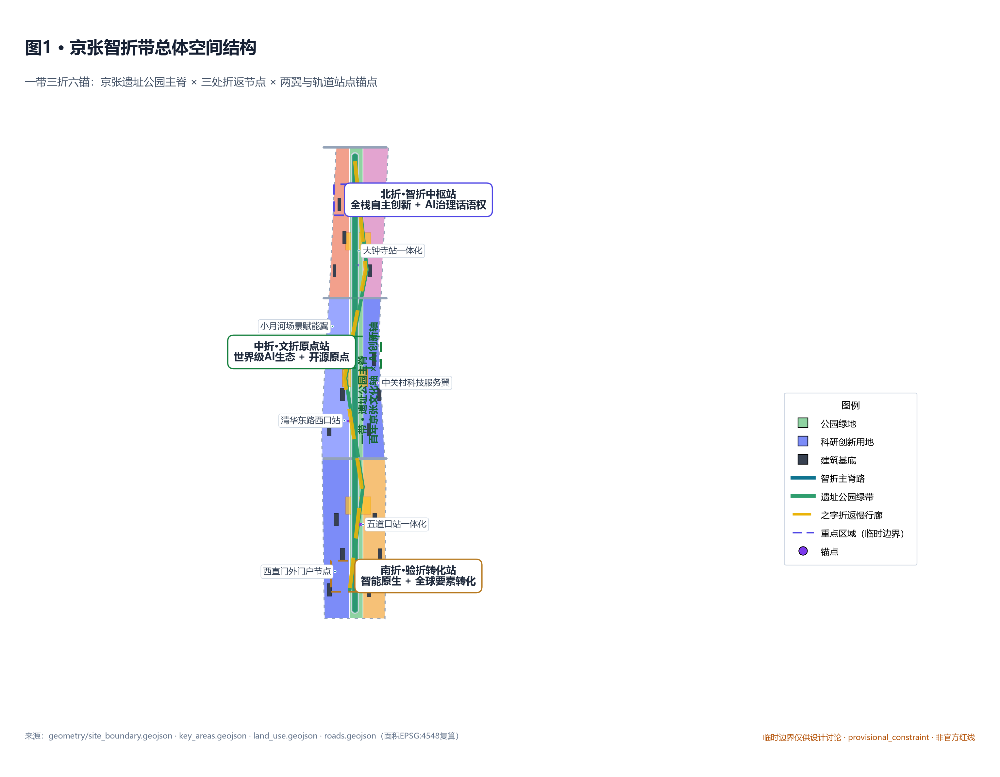
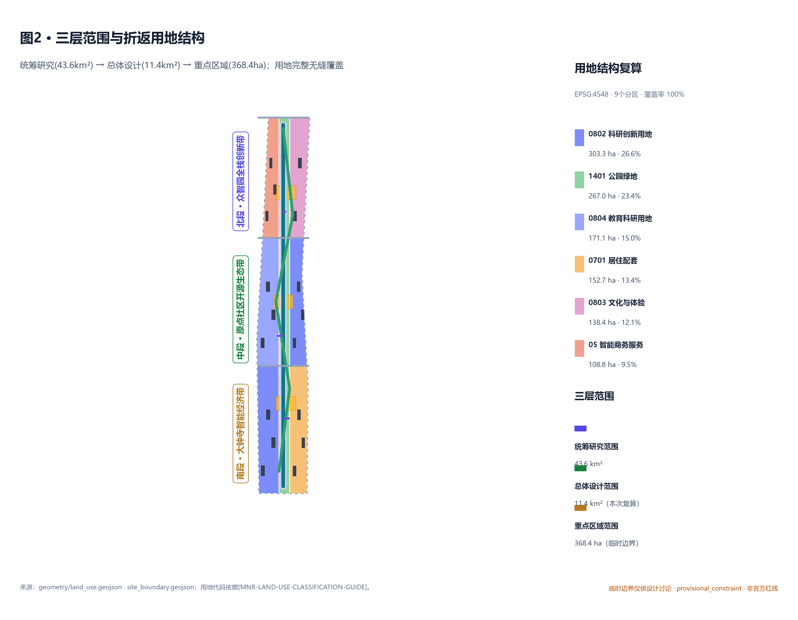
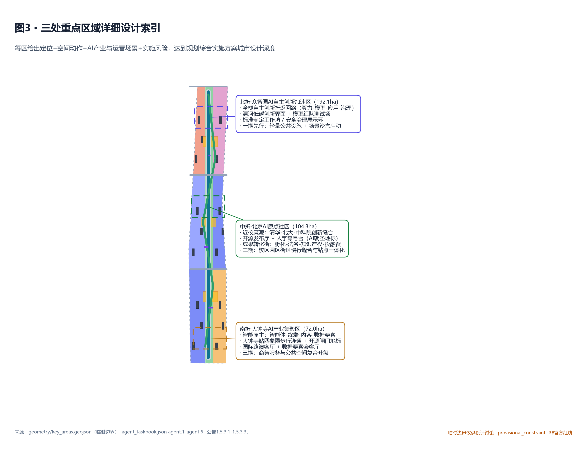
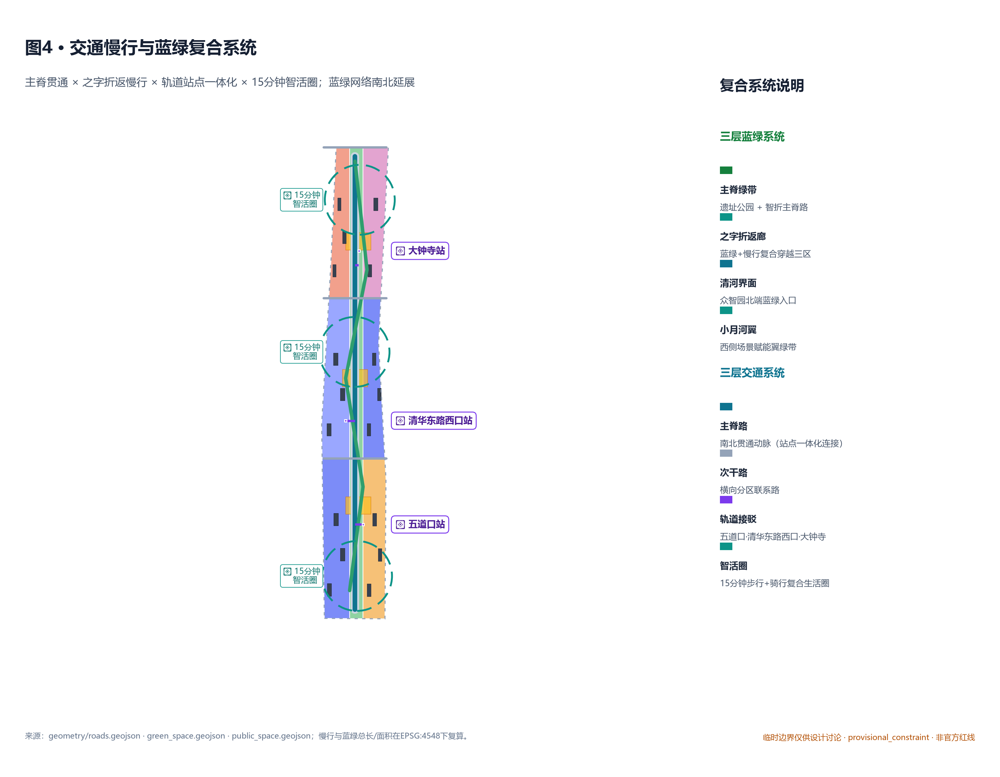
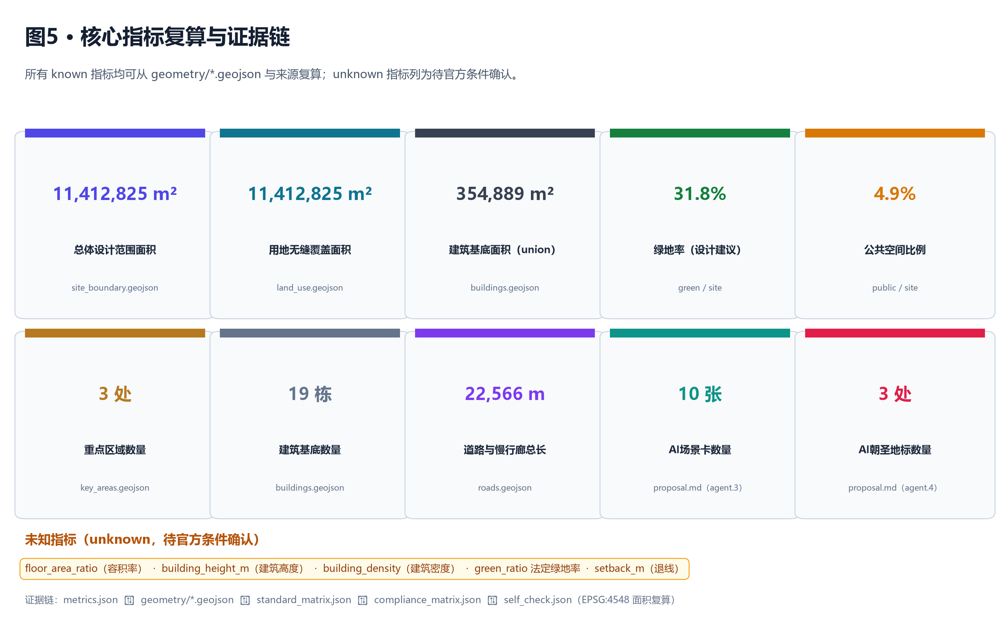

# Jing-Zhang Smart Folded Way: An AI-Innovative Urban Design for a Centennial Y-Shaped Return

## Design Basis and Source List

This formal proposal is based primarily on the qualification pre-review announcement for the International Urban Design Competition of the Centennial Jing-Zhang AI Innovation Belt issued by the Haidian Branch of the Beijing Municipal Commission of Planning and Natural Resources, and secondarily on the machine-readable references in the `brief/site-package/`, including the temporarily rough Official Boundary registered by the maintainer (`geometry/provisional_boundaries.geojson`), key areas, enumerations, indicators, professional standard libraries, and source lists. This proposal does not substitute speculative values for approved controls when official boundaries are lacking, and all spatial implementation recommendations are expressed as "Conceptual Recommendations/reference schemes/available for in-depth study by professional teams." Cite `[source:OFFICIAL-ANNOUNCEMENT]`, `[source:AGENT-TASKBOOK]`, `[source:SITE-PACKAGE]`, `[source:BOUNDARY-SOURCE]`, `[source:KEY-AREA-SOURCE]`, `[source:MNR-LAND-USE]`, `[source:MOHURD-URBAN-DESIGN]`, `[source:MOHURD-CONTROL]`, `[source:AGENT-TASKBOOK-DOC]`, `[standard:PROJECT-OFFICIAL-ANNOUNCEMENT]`, `[standard:PROJECT-AGENT-OPEN-CALL-TASKBOOK]`, `[standard:MOHURD-URBAN-DESIGN-MEASURES]`, `[standard:MOHURD-CONTROL-DETAILED-PLANNING]`, `[standard:MNR-LAND-USE-CLASSIFICATION-GUIDE]`, `[depth:three_level_scope_framework]`, `[depth:overall_spatial_structure]`, `[depth:three_key_area_detailed_design]`, `[depth:land_use_layout]`, `[depth:retain_renovate_demolish]`, `[depth:blue_green_public_space]`, `[depth:metrics_recalculation]`, `[data:geometry/site_boundary.geojson#SITE-001]`,  `[data:geometry/key_areas.geojson#PROV-KEY-001]`, `[data:geometry/key_areas.geojson#PROV-KEY-002]`, `[data:geometry/key_areas.geojson#PROV-KEY-003]`, `[metric:site_area_sqm]`, `[metric:green_ratio]`, `[metric:public_space_ratio]`, `[metric:building_footprint_area_sqm]`, `[metric:road_network_length_m]`, `[metric:key_area_count]`, `[metric:building_count]`, `[metric:ai_scenario_node_count]`,  `[metric:switchback_landmark_count]` forms the Evidence Chain.

The boundaries for the use of the registration form are as follows:

- `data/source_registry.json` records the purposes and boundary of usage for publicly disclosed, clarified, and temporary data.
- This plan relies solely on the data marked `usable_for_formal="yes"` as the formal basis; the `provisional_only` data (provisional boundary, provisional key area) is only used for generating, visualizing, and self-checking the plan and must be clearly documented as such in `proposal.md`, `sources.json`, `assumptions.json`, and `visual/index.html`.
- The agent shall not upgrade background_only or provisional_only materials to official boundaries, statutory controls, formal scoring criteria, or government implementation commitments.
- Statutory control conditions (Floor Area Ratio, Building Height, Building Coverage Ratio, Green Space Ratio, setback) are unknown indicators and must be listed as items to be confirmed, and must not be substituted by agent-assumed values for approval.

This plan uses provisional boundaries marked in `geometry/site_boundary.geojson#SITE-001` as `official_boundary=false` and `boundary_precision="provisional_rough"` and `geometry_role="provisional_constraint"`; three key areas are also provisional as noted in `geometry/key_areas.geojson`. The fact that this data has gaps itself does not block content scoring; after replacing the official polygons, the site boundary, key areas, land use, roads, green space, public space, buildings, phasing, and metrics must all be recalculated. (Provisional Boundary)

## One. Overall Concept and Naming System

### 1.1 Main Name and English Name

- **Main Name (Chinese)**: ** Jing-Zhang Smart Folded Belt **
- **Subtitle**: Centennial Manzi Turnaround · Intelligent Innovation Belt
- **English Name:** Jingzhang Switchback — AI Innovation Belt
- **Abbreviation**: JZSB

### 1.2 Naming Logic

The Jing-Zhang Railway Guan-Gou section features Zhan Tianyou's pioneering "reverse 'Z' shaped return curve" (near Qinglong Bridge) — when the slope is too steep for a straight ascent, trains first climb up one slope to a turnaround point (Qinglong Bridge Station), then switch directions and climb up the other slope, ultimately crossing Badaling with minimal engineering effort. This "turnaround" is both an engineering marvel and the first segment of a mainline railway autonomously designed and constructed by Chinese people (1905—1909), with its core spirit being "autonomy, autonomy, and autonomy." This historical prototype will be transformed into the "intelligent turnaround" space-operational model of the AI Innovation Belt.

- **Cultural Foldback**: Centennial Jing-Zhang Culture ↔ Zhongguancun Innovation Culture ↔ AI New Culture, intertextual along the main spine of the Jing-Zhang Heritage Park.
- **Innovative Reversal**: AI Full Stack Innovation (computing power-model-application-governance) accumulates at critical nodes before rebounding and rising again.
- **Space Foldback**: The main spine of the site park running north-south, combined with a zigzag circuit oriented east-west, forms a Public Space network in the shape of the character "ren" (person).
- **Feedback Loops**: Iterative alignment of human intelligence with machine intelligence (human-centric governance, value alignment).

### 1.3 Subbrand (Return Three Tracks)

- **Jing-Zhang**: Centennial Jing-Zhang Cultural Belt —— carried by the Jing-Zhang Railway heritage, the Tsinghua Garden Station, the history of the Jing-Zhang Railway zigzag engineering, and the narrative line of the railway park.
- **Life Experience Line ()**: Urban AI Life Experience Belt —— featuring communities, talent apartments, AI + healthcare/education/law/life services, and AI pilgrimage routes.
- **Innovate Track (Innovation Line)**: AI Convergence Innovation Belt —— featuring Zhongzhiyuan's full-stack autonomous capabilities, Beijing AI Origin Community's open-source ecosystem, and Dazhongsi's intelligent economy.

Preserve the Jing-Zhang heritage park main spine ("One Belt"), which will share the space and respectively undertake the functions of cultural experience, public services, and industrial innovation. It will form a return loop at three key areas in the north and south through the "Three Folds" ("San Zhe").

### 1.4 Logo Direction

Logo Concept: **Dual-Track Wavy Turnback** —— Two equal-length curves (one stroke + one counter-stroke) form an "I" at the central intersection (AI Origin community), with an open-source symbol embedded at the intersection (collaborative "wave ripples"). Colors:
- Main color: Jing-Zhang Railway Rust Red `#B42318` (Self-Strengthening)
- Accent Color: Intellective Deep Blue `#1E3A8A` (Rational)
- Highlight: Open Source Gold `#C79838` (Open Source Collaboration)

Font Direction: Use open-source fonts (such as Source Han Sans / Noto Sans CJK derivatives), avoiding any copyrighted fonts, trademarks, or corporate logos; specific fonts will be selected by the subsequent visual design team.

## II. Work Framework for the Second and Third Floors

| Level | Design Issue | Solution Approach | Data Focus |
| --- | --- | --- | --- |
| Coordinated Research Area (43.6 km²) | How AI industry ecology and future urban form can be organized | "Academic Pioneering-Open Source Collaboration-Enterprise Transformation-Public Experience-International Promotion" Five-Ring Innovation Chain | `[data:geometry/site_boundary.geojson#SITE-001]`, `compliance_matrix.json`, `standard_matrix.json` |
| Overall Design Area (11.4 km²) | How industry spaces, Urban Renewal, transportation infrastructure, and urban character are depicted on the ground | Land use, buildings, roads, green spaces, Public Spaces, and phased layers are expressed together, in accordance with the control plan depth | `[data:geometry/land_use.geojson#LU-XXX]`, `[data:geometry/roads.geojson#ROAD-001]`, `[metric:site_area_sqm]` |
| Key-Area Detailed Design Area (368.4 ha) | How to Achieve Detailed Design Depth for Three Areas | Propose Positioning, Spatial Actions, AI Scenarios, and Implementation Dependencies | `[data:geometry/key_areas.geojson#PROV-KEY-001/002/003]` |

The three levels of scope are mapped individually in `compliance_matrix.json`, ensuring that announcements 1.3, 1.4, and 1.5, along with the mandatory tasks for agent.1-agent.6, have corresponding chapters, layers, indicators, drawings, and HTML evidence. The three-level scope corresponds to depth items constrained by `[depth:three_level_scope_framework]` and `[depth:overall_spatial_structure]`. After replacing the official polygons, the agent must re-run the scaffolding, self-inspection, and drawing/HTML generation.

## Three. Coordinated Research Area: Industrial and Future City Research

### 3.1 Overall Spatial Structure: "One Belt, Three Folds, Six Anchors"

This proposal translates the three layers and six functions into a readable and verifiable spatial structure:

- **One Belt**: The main spine of the Jing-Zhang Heritage Park — running north-south from Dazhongsi Station all the way to the North Fifth Ring Road, serving as the common spine for both the century-old Jing-Zhang cultural belt and the AI innovation belt.
- **Three Folds**: Three key areas are mapped to three "turnaround stations":
  - **North Bend·Wisdom Bend Central Station (Zhongzhiyuan)**: Full-stack Autonomous Innovation + AI Governance Voice;
  - **Mid-Fold·Literary-Fold Origin Station (Beijing AI Origin Community)**: World-Class AI Innovation Ecosystem + Open Source Origin;
  - **South Bend·Verification Transformation Station (Dazhongsi)**: Intelligent Native New Business Model + Global Element Transformation;
- **Six Anchors**: Six integrated nodes and two wings—five track stations as anchor points (Wudaokou, Qihua East Road West Mouth, Dazhongsi) + the West Straight Gate portal node + the Zhongguancun Technology Services Wing + the Xiaoyue River Scenario Enablement Wing.

### 3.2 Three Key Positions, Five Major Functions, and the Synergy of Three Zones and Two Wings

In accordance with announcement 1.5.1 and the intelligent body mission statement, the three key positioning areas (Jing-Zhang Cultural Heritage Belt / Urban AI Living Experience Belt / AI Integration Innovation Belt) are mapped to the three sub-brands mentioned above; the five functional areas (Full-Stack Independent AI Innovation System / World-Class AI Innovation Ecosystem / AI-Enabled Scenario Empowerment Paradigm / Intelligent AI Vibrant City / AI Governance Global Discourse Power) are mapped to three key regional focus areas:

| Key Areas | Five Major Functional Anchors | Three Zones and Two Wings Synergy |
| --- | --- | --- |
| Zhongzhiyuan | Full-stack Autonomous Innovation System, AI Governance Voice | Collaborate with the Xiaoyue River Scenario Enablement Wing (sandbox testing) |
| Beijing AI Origin Community | world-class AI Innovation Ecosystem and AI-Enabled Scenario empowerment paradigm | working in conjunction with the Zhongguancun Technology Services Wing (elements globalized) |
| Dazhongsi | Intelligent Natively Originated New Business Forms, Intelligent AI Vital City | Coordinated with the West Straight Gate Outer Portal Node (Global Promotion) |

### 3.3 5-8 global AI Innovation Ecosystem case study readable abstracts

This plan does not directly adopt the list of companies or production value numbers, but rather distills the translatable space-operational mechanisms ( `[source:AGENT-TASKBOOK]` agent.2 ):

1. **Boston Kendall Square (MIT Surroundings)**: Research-industry-residential mixed-use district, low density + high density transition, pedestrianized Public Space. → Insight: Smart fold mechanism for the "campus-park-industry-residential" slow travel integration.
2. **London King's Cross**: Railway heritage renovation + global enterprise + academic integration, juxtaposing historical space with innovative space. → Insight: The "railway cultural vein × AI scenario" dual-layer overlay of the Jing-Zhang Heritage Park spine.
3. **Tokyo Marunouchi-Daishan-dori**: Station Integration and Nighttime Economy. → Insight: Dazhongsi Station Quadrant Pedestrian Connectivity and "Smart Nativized Night Economy."
4. **Seoul Sangam Digital Media City (Mapo)**: Smart City Pilot + Nighttime Public Art. → Insight: Heritage Park Nighttime Culture and AI Public Space Integration.
5. **Shenzhen Nan Mountain High-Tech Park-Shenzhen Bay**: The Iterative Path from Industrial Park to AI City Scenario. → Insight: Zhongzhiyuan Upgrades from "Industrial Display" to "Full Stack Innovation".
6. **Singapore One-North (one-north)**: integrated planning-operation-service mechanism. → **Insight**: smart belt developer community, Scenario Access, and operational transformation loop.
7. **Finland Otaniemi (Aalto University Campus)**: A hub of education-research-industry integration and sustainable design. → Inspiration: The AI Origin community's on-campus innovation mechanism.
8. **Toronto MaRS Discovery District**: Integration of technology transfer and public innovation services. → Insight: Model of the AI Origin Community's technology transfer street service.

## Four. Overall Design Area Urban Renewal and Control Detailed Urban Design

The Overall Design Area meets the Urban Design depth required for Regulatory Detailed Planning as per Announcement 1.5.2. The scheme generates nine land use zones that seamlessly cover the temporary site boundary (`[metric:land_use_coverage_area_sqm]` = `[metric:site_area_sqm]`, coverage 100%), nineteen Building Footprints (`[metric:building_count]` = 19), five Blue-Green Space elements, three turnaround plazas, and three phased areas, forming a reviewable structure of regulatory detailed planning depth urban design.

### 4.1 Land Use Structure ( Classified by Territorial Spatial Planning )

| Land Use Code | Land Use Name | Area (ha) | Proportion |
| --- | --- | --- | --- |
| 0802 | Research and Innovation Land | 303.3 | 26.6% |
| 1401 | Park Green Spaces | 267.0 | 23.4% |
| 0804 | Educational and Research Land | 171.1 | 15.0% |
| 0701 | Residential Accompaniments | 152.7 | 13.4% |
| 0803 | Cultural and Experiential Uses | 138.4 | 12.1% |
| 05 | Intelligent Business Services Land Use | 108.8 | 9.5% |

According to `[standard:MNR-LAND-USE-CLASSIFICATION-GUIDE]`, all land use codes are to be used with the spatial land classification, and self-created classifications are not to be used. The statutory control conditions (Floor Area Ratio, Building Height, Building Coverage Ratio, Green Space Ratio, setback) are currently `unknown` (see `assumptions.json` A-CONTROLS-001 and `metrics.json` for the unknown indicators), and it is not permissible to substitute agent-derived values for the approved controls.

### 4.2 Urban Renewal Overall Framework

This plan decomposes the control planning depth content into reviewable objects according to `[standard:MOHURD-CONTROL-DETAILED-PLANNING]`.

- Land Use Structure:`[data:geometry/land_use.geojson#LU-XXX]` Express complete coverage;
- Building Footprint: `[data:geometry/buildings.geojson#BLDG-001..019]` totaling 19 units, distributed across five land use categories: research and innovation, education and research, intelligent business, cultural and experiential, and residential support.
- Traffic Organization: `[data:geometry/roads.geojson#ROAD-001..008]` includes 1 arterial road, 1 greenway, 3 secondary roads, and 3 transit connections, with a total length of `[metric:road_network_length_m]`.
- Blue-Green Space: `[data:geometry/green_space.geojson#GREEN-XXX]` Total 5 areas, covering Central Spine + Qinghe Interface + Xiao Yuehe Wing;
- Public Space: `[data:geometry/public_space.geojson#PUBLIC-XXX]` 3 return plazas, respectively anchoring three key areas;
- Phasing Implementation: `[data:geometry/phasing.geojson#PHASE-001/002/003]` correspond to Zhongzhiyuan Phase I, Yedian Community Phase II, and Dazhongsi Phase .

### 4.3 Jing-Zhang Heritage Park Vitality Corridor

Central Ridge Park Green Space (1401, approximately 267 ha) is centered around the Jing-Zhang Relic Park, running north-south to form the physical carrier of the "one belt." Complementary blue-green nodes include Qinghe Interface (north end, approximately 76 ha) and the Xiaoyue River Scenario Enablement Wing (midsection west side, approximately 50 ha). Specific strategies:

- North-South Throughfare: Main Spine Road (`ROAD-001`, a north-south arterial) runs along with the park greenway, serving pedestrian, bicycle, emergency vehicle, and slow transit connections;
- Stitch East and West: Horizontal Secondary Streets (`ROAD-101/102/103`) connect the east and west sides of the site, avoiding the main spine being severed by a highway;
- Z-shaped Return Pedestrian/Bicycle Path (`ROAD-002`, greenway) traverses three key areas, forming an "M-shaped return" walking/biking route;
- Node Public Space: Three turnaround plazas (`PUBLIC-001/002/003`) serve as key public living rooms and scene nodes.

## Five. Detailed Design for Key Areas

Three key areas respectively assume the roles of "Return Loop 1 · Smart Return Hub", "Return Loop 2 · Cultural Return Origin Station", and "Return Loop 3 · Inspection Return Transformation Station", achieving the depth of Urban Design as specified in the Integrated Planning Implementation Plan (`[depth:three_key_area_detailed_design]`).

### 5.1 Turn North · Zhongzhiyuan AI Independent Innovation Acceleration Area

- **Location**: Garden-type full-stack independent AI innovation district, bearing the "Full-Stack Independent AI Innovation System" and "AI Governance Global Discourse Power."
- **Spatial Actions**:
  - Enhance the Qinghe interface as a gateway for low-carbon innovation, and arrange Public Spaces (`PUBLIC-001`) along the riverside.
  - Form three nodes along the main spine: "Model Red Team Testing Field" + "Standard Setting Workshop" + "Safety Governance Display Ring";
  - Form a garden-style courtyard AI R&D cluster (4 AI R&D Building Footprints `[BLDG-001..004]`), integrating rooftop greening with integrated ground-level public service facilities;
  - Pedestrian Seam: Connect the sinuous slow-moving green corridor along `ROAD-002` with the ecological corridor outside the North Fifth Ring Road.
- **AI Industry and Operational Scenarios**: Model Red Team Testing (`SCN-01`), Standard Setting Workshop (`SCN-02`), Security Governance Showcase Ring (`SCN-03`); operational mechanism recommendations are "Conceptual Recommendation/Available for Professional Teams to Deepen Research," and should not be expressed as determined government assignments.
- **Implementation Risks**: The constraints related to the Qinghe Blue Line, flood control, and ecological management must be verified during the formal deepening phase; the road red line and municipal capacity will be reviewed by the engineering team.

### 5.2 Mid-Fold·Beijing AI Origin Community

- **Location**: Campus-adjacent Conversion and Talent Community, serving as a "World-Class AI Innovation Ecosystem" and "AI-Enabled Scenario Empowerment Model."
- **Spatial Actions**:
  - Campus-Park-Street Slow-Travel Integration: Leveraging resources from Tsinghua, Peking, and the Chinese Academy of Sciences, forming a "Near-Campus Idea Source-Open Collaboration-Technology Transfer" short chain.
  - Place an open-source pavilion (`SCN-04`) and the "Zero Stage" AI Sanctuary (`LM-01`, see Section 6) along the main ridge;
  - Conversion Results Street (Education and Research and Development Land Use 0804): Incubation-Legal-Intellectual Property-Investment and Financing Services Embedded in the First Floor;
  - Public Space Nodes: Turning Plaza `PUBLIC-002`, serving as a plaque for honors to open-source contributors and a venue for release events.
- **AI Industry and Operational Scenarios**: Open Source Exhibition Hall, Model Evaluation Sandbox, AI Education Experience Points, Talent Special Zone Services (`SCN-04..06`); operational mechanisms inscribed in the "Switchback Day" annual event.
- **Implementation Risks**: Coordination with the school and enterprises is required for the boundary, ownership, and renovation of the ground-floor activities of the campus.

### 5.3 Southward Bend·Dazhongsi AI Industry Cluster Area

- **Location**: Urban-type Smart Economy and International Exchange District, serving as both "Intelligent AI-Vital City" and "AI-Enabled Scenario Empowerment New Paradigm".
- **Spatial Actions**:
  - Dazhongsi Station Quadrant Walkway Connectivity: Station Integration `SL-3` With `PUBLIC-003` Forming the landmark known as "Open Source Gate·Intelligent Native Portal"`LM-02`);
  - Intelligent Natively Generated Consumption and Business Scenarios: Intelligent Bodies and Intelligent Terminal Displays (`SCN-07`), Data Element Living Room (`SCN-08`);
  - Cultural and Experience Use (0803): Intelligent Native Consumption Scenarios, Corporate Brand Launches, and International Walkthroughs;
  - Mixed-use Business Services: Commercial service land use (05) accommodates international hospitality, talent recruitment, and media launches.
- **AI Industry and Operational Scenarios**: Smart Terminal Experience Street, Data Element Living Room, International Roadshow Living Room (`SCN-07..09`); in conjunction with the Global AI Activity Week.
- **Implementation Risks**: The quadrants of the intersection for pedestrian connectivity involve road intersections and utility lines, requiring review by the traffic and municipal teams; the mixed-use commercial service upgrade involves property rights adjustments.

## Six, AI Innovation Ecosystem, Talent Profile, and AI-Enabled Scenario

### 6.1 Five User Persona Categories

| User Profile | Typical Needs | Spatial Response | Self-Check Boundary |
| --- | --- | --- | --- |
| Open Source Developer | Release, Collaborate, Test, Community Reputation | Origin Station Open Source Release Hall, Zero Point Platform (`LM-01`), Nighttime Collaboration Space | No personal behavior tracking; activity data only used for aggregate statistics |
| Founding Team | Low-Cost Office, Computing Power Entry Point, Product Test Bed | Zhongzhiyuan Shared Testing Ground, Edge Computing Power Service Point, Standard Governance Consultation | Computing Power and Data Services Require Separate Authorization |
| Headquarter Companies / International Visitors | Exhibitions, Business, International Reception, Talent Recruitment | Dazhongsi International Roadshow Living Room, Track Station Shuttle, Turnstile Landmark | Corporate Identity and Case Studies Must Clear Rights |
| Surrounding Residents | Commuting, Leisure, Community Services, Low-Impact Updates | Jing-Zhang Heritage Park Pedestrian Loop, Community Services Embedded, Tiered Night Lighting and Activities | Do Not Use Resident Profiles for Commercial Recommendations |
| College Students and Faculty | Result Transfer, Cross-Institution Collaboration, Daily Slow Travel | Campus-Park Slow Travel Integration, Result Transfer Hub, AI Education Experience Point | Campus Data and Research Results Require Authorization |

### 6.2 Ten AI Scenario Cards (Including 3 Industry Testing and Validation Scenarios)

| Number | Scene Card | Spatial Carrier | Type | Design Description |
| --- | --- | --- | --- | --- |
| SCN-01 | **Model Red Team Testing Field** (Industrial Testing Validation) | Zhongzhiyuan (North Bend) | Industrial Testing | A closed garden-style testing field located outside the Qinghe Blue Line, providing a safe environment for model alignment and red team exercises; presented in a "Conceptual Recommendation" format for professional teams to further develop. |
| SCN-02 | **Standard Development Workshop** (Industrial Testing Validation) | Zhongzhiyuan (North Fold) | Industrial Testing | Bookable workspace that collaborates with the national AI standardization body for evaluation, consensus, and release; proposals are submitted in the form of "Conceptual Recommendation/Reference Proposal" |
| SCN-03 | **Safety Governance Showcase Ring** | Zhongzhiyuan (North Bend) | Public Experience | A visitable and reservable governance capability showcase ring arranged around the main spine green belt |
| SCN-04 | **Open Source Gallery** | Origin Station (Midfold) | Public Experience | A venue for universities, open-source communities, and startup teams to showcase their achievements, code contributions, and host small-scale pitch spaces |
| SCN-05 | **Pinyin Zero Platform** (AI Pilgrimage Landmark LM-01) | Origin Station (Mid-Turn) | Pilgrimage Experience | At the mid-turn origin station near the old site of Tsinghua Garden Station, commemorating the starting point of Zhan Tianyou's independent innovation, symbolizing AI open-source "starting from zero," with a contributors honor wall |
| SCN-06 | **Campus Conversion Street** | Origin Station (Midfold) | Public Experience | Focused on the conversion of academic research, organizing incubation, exhibition, legal, intellectual property, and financing and investment services |
| SCN-07 | **Dazhongsi International Roadshow Living Room** (Industrial Testing Validation) | Dazhongsi (South Fold) | Industrial Testing | For the display, negotiation, media release, and international exchange of service intelligent bodies, intelligent terminals, and content consumption enterprises; proposed in the form of a **Conceptual Recommendation** |
| SCN-08 | **Data Element Living Room** | Dazhongsi (South Turn) | Public Experience | With compliance, authorization, and auditability as prerequisites, this urban service interface showcases data elements and the circulation of digital assets |
| SCN-09 | **AI-Enabled Living Services Sample Street** | Overall Design Area Node | Public Experience | To implement AI-Enabled Scenarios such as healthcare, education, legal services, and living services in a small-scale operable street space |
| SCN-10 | **Global AI Activity Week Route** | One Belt Public Space System | Pilgrimage Route | Forms a walkable and shareable experience route from site culture, open-source community, industrial display to international showcase |

> Explanation: The operational mechanisms for the scenario provided are "Conceptual Recommendation/reference proposal/for further in-depth study by professional teams," and do not replace formal planning or constitute government approval conclusions.

> Reference: `[depth:ai_scenario_cards]` · `[depth:blue_green_public_space]` · `[data:geometry/land_use.geojson#LU-NS-01]` · `[data:geometry/green_space.geojson#GREEN-RV-01]` · `[data:geometry/public_space.geojson#PUBLIC-002]` · `[metric:ai_scenario_node_count]` · `[metric:switchback_landmark_count]` · `[source:AGENT-TASKBOOK]`

## Seven. Land Use, Building Scale, and Demolish–Renovate–Retain Strategy

### 7.1 Demolish–Renovate–Retain Classification Method (Demolish–Renovate–Retain Strategy)

According to `[depth:retain_renovate_demolish]`:

- **Preserve**: Former site of Qinghua Yuan Railway Station (`CON-HERITAGE-001`, marked as `HERITAGE_PROTECTION` in `constraints.geojson` with `geometry_role="official_constraint_pending"`), related elements of the Jing-Zhang Railway site.
- **Rehabilitation**: The existing Building Footprint (e.g., `BLDG-019`), to be deepened into a Conceptual Recommendation that enhances public character, opens up the first floor, and swaps out functions.
- **New Construction:** Add 18 new development bases for research and development, offices, and talent apartments (`BLDG-001..018`);
- **Pending Confirmation**: When the current building conditions, ownership, control plan, and engineering conditions are missing, all conclusions of the demolish–renovate–retain strategy must be downgraded to pending confirmation items and no fabricated conclusions shall be drawn. (Demolish–Renovate–Retain Strategy)

Building total scale: Based on `[metric:building_footprint_area_sqm]` = 397,208 m² (approximately 39.7 ha), distributed across 19 bases, with an average base of about 2.1 ha; the building total scale (above ground) needs to be recalculated after the official conditions for the Floor Area Ratio () are confirmed, currently it is `unknown` (`floor_area_ratio` and `building_height_m` are both marked as `unknown`).

### 7.2 Handling Boundaries for Control and Guidance Conditions

According to `[standard:MOHURD-CONTROL-DETAILED-PLANNING]`, the formal scheme must distinguish between known control conditions, design recommendations, and pending confirmations when addressing land use, Development Intensity, roads, utilities, and implementation management. The control conditions in this scheme are handled as follows:

- **Known:** land structure, area, coverage ratio, number of Building Footprints, road network length, ratio of green spaces and Public Spaces;
- **Design Recommendations**: Zigzag return pedestrian corridor alignment, turnaround square location, renovation direction for three key areas, and layout of scene nodes.
- **To Confirm**: Floor Area Ratio, Building Height, Building Coverage Ratio, setback, road red line, municipal capacity, ownership, cultural preservation area—these items are marked as `unknown` in `metrics.json` and are described in `assumptions.json` A-CONTROLS-001.

## . Transportation, Railways, Utilities, and Public Services

In accordance with the requirements of `[standard:MOHURD-URBAN-DESIGN-MEASURES]` regarding the integration of Public Spaces, as well as the `[depth:traffic_rail_slow_parking]` and `[depth:municipal_new_infrastructure]` depth items:

- **Main Spine Road (`ROAD-001`, North-South Arterial)**: North-south arterial that runs through the area, integrated with the transit station, serving as the primary traffic artery and incorporating pedestrian and bicycle functions. (Transit-Station Integration)
- **Winding Slow-Travel Greenway (`ROAD-002`, greenway)**: Starting from Zhongzhiyuan, the winding slow-travel greenway loops back through the original point and the southern end, forming a "person-shaped" pedestrian/bicycle loop.
- **Horizontal Secondary Road (`ROAD-101/102/103`)**: Connects the land uses on the east and west sides, avoiding the main spine being severed by a highway;
- **Track Transfer (`ROAD-SL-1/2/3`, transit_connection)**: Access to Wudaoku Station, Qihua Donglu Xi Kou Station, and Dazhongsi Station.
- **15-Minute Vitality Circle**: Provide complete living amenities within a radius of approximately 720m around each key area (supported by `ROAD-002` pathway);
- **Public Services and New Infrastructure**: End-side computing hubs, low-carbon computing displays, and AI safety governance exhibition halls serve as prototypes for new infrastructure; municipal services (water supply, wastewater management, energy) are listed as `[depth:municipal_new_infrastructure]` for further development by the engineering team.

## Nine, Blue-Green Space, Public Space, and Urban Character

### 9.1 Blue-Green Space System

According to `[depth:blue_green_public_space]`:

- **Main Ridge Green Belt (`GREEN-NS-01/02/03`, 1401)**: Align park green spaces along the north-south spine to coincide with the main axis of the Jing-Zhang Heritage Park.
- **Green River Interface (`GREEN-RV-01`, 1401)**: Zhongzhiyuan's northern blue-green entrance, tasked with showcasing low-carbon innovation, managing rainwater, and promoting waterfront public activities.
- **Xiaoyue River Scenario Enablement Wing (`GREEN-RV-02`, 1401)**: Midsection west-side blue-green wing belt, accommodating scenario testing and talent living services.
- **Return Plaza (`PUBLIC-001/002/003`)**: A public living room for three key return nodes, integrated with the main spine green corridor.

### 9.2 Urban Character with AI Pilgrimage Landmarks (≥3)

According to `[standard:MOHURD-URBAN-DESIGN-MEASURES]` and `[source:AGENT-TASKBOOK]` agent.4:

- **LM-01 Zero Number Platform (AI Origin Community)**: An open-source contributor honor wall and turnaround commemorative device are set at the turnaround origin near the old Qinghua Garden railway station, commemorating Zhan Tianyou's "starting from zero" in the history of China's railway autonomy, also symbolizing the open-source AI "starting from zero." The scale is small, allowing for pedestrian access, and no super-large scale internet celebrity landmarks are to be established.
- **LM-02 Open Source Gate·Smart Native Portal (Dazhongsi)**: A public art installation at the Dazhongsi Station Quadrant Portal transforms the "turnstile imagery" into "open source entry and exit," with nighttime lighting synchronized with the waves of open source collaboration.
- **LM-03 Return Mirror · Full Stack View Platform (Zhongzhiyuan)**: In Zhongzhiyuan public interface, a folding metal mirror device metaphorically represents "full-stack innovation return" — the computational power-model-application-governance four layers are folded like mirrors, providing a panoramic view of the main spine green belt and the Qinghe interface.

All landmarks, signage, logos, fonts, characters, and corporate identifiers must be cleared (with font direction specified as open-source), and must not be overly entertainment-oriented, trending, or vulgar; they must not be described as approved constructions.

## X. Update Project List, Implementation Policy, and Phased Plan

Based on `[depth:renewal_project_list]` and `[depth:phasing_implementation]`:

| Project Number | Project Name | Type | Main Dependencies | Evidence Reference | Phases |
| --- | --- | --- | --- | --- | --- |
| JZ-01 | Smart Fold Main Ridge Green Belt Through | Public Space | Main Ridge Road and Park Green Belt Integration | `[data:geometry/green_space.geojson#GREEN-NS-01]` | Phase 1 |
| JZ-02 | Zhongzhiyuan Qinghe Low-Carbon Innovation Interface | Blue-Green Space | River Blue Line, Ecological and Flood Protection Conditions | `[data:geometry/green_space.geojson#GREEN-RV-01]` | Phase 1 |
| JZ-03 | Smart Fold Central Station Model Red Team Test Field | Industrial Testing | Enclosed Test Field and Public Space | `[data:geometry/public_space.geojson#PUBLIC-001]` | Phase One |
| JZ-04 | Original Point Community Open Source Exhibition Hall and Zero Number Stage | Public Culture | Ownership and Cultural Heritage of the Former Tsinghua Garden Station | `[data:geometry/buildings.geojson#BLDG-XXX]` | Phase II |
| JZ-05 | Dazhongsi Station Quadrant Walkway Connectivity | Transit-Oriented Development | Road Intersection and Utility Infrastructure | `[data:geometry/roads.geojson#ROAD-SL-3]` | Phase  |
| JZ-06 | Open Source Gate·Smart Native Portal Landmark | Pilgrimage Landmark | Site Public Space and Art Rights | `[data:geometry/public_space.geojson#PUBLIC-003]` | Phase  |
| JZ-07 | Global AI Activity Week Public Route | Operations/Brand | Public Space Permits, Activity Safety | `[data:geometry/phasing.geojson#PHASE-001/002/003]` | Phase One-Three Rolling |

> Note: The project list and phases above are provided as a "Conceptual Recommendation/Reference Proposal" and do not constitute a government implementation commitment; specific project implementation is subject to formal control and planning regulations, municipal, traffic, and land ownership conditions.

### 10.1 Annual Activity Framework and Long-term Operations (agent.6)

According to `[source:AGENT-TASKBOOK]` agent.6, this proposal suggests an annual event system with dual branding of "Switchback Day" and "Jing-Zhang Open Source Season" (operating mechanism proposal, not constituting a government commitment):

- **January·AI Open Source Developer Conference (Original Station)**: Conduct open-source collaboration workshops, code contribution displays, and honor the star contributors during the commemorative month of the Jing-Zhang Railway (opened on September 24, 1909; this proposal uses January as the conceptual month).
- **April · Scenario Access Day (Little Month River Wing)**: Open AI+ healthcare, education, law, and life scenarios in a "test validation" format to the public and developers, inviting international visitors to participate.
- **July·Full-Stack Innovation Summit (Zhongzhiyuan)**: Focused on full-stack autonomous innovation in AI and AI governance, inviting participation from domestic and international research institutions and enterprises.
- **October·Jing-Zhang AI Pilgrimage Week (End-to-End)**: A full-route walk/bike from Dazhongsi to Zhongzhiyuan, making "retrace" itself part of the experience path (in coordination with the global AI activity week route `SCN-10`).
- **Routine Operations**: Developer Community Workshops (monthly), Scenario Access Days (quarterly), AI Holy Site Check-ins (daily), Open Source Contribution Honor System (ongoing).

### 10.2 Developer Community Engagement and Transformation Mechanisms

- **Developer Community Operations**: With the Original Station Open Source Release Hall as the permanent space, organize monthly workshops and quarterly Hackathons, establish a "Code Contribution Wall" and a "Star Contributor" mechanism;
- **Scenario Access Operations**: Use the Xiaoyue River Scenario Enablement Wing as a test field to provide scenario testing interfaces to developers and enterprises in accordance with privacy protection, explainability, and Human Review principles;
- **Public Experience Operations**: Organize public experience activities, community culture, and science popularization around the spine of the heritage park.
- **International Promotion and Talent/Enterprise Attraction**: Utilize the Dazhongsi International Roadshow Living Room as a hub to coordinate international promotion and talent and enterprise attraction during the Jing-Zhang AI Pilgrimage Week.
- **Risk**: All activities, recruitment, policies, and funding are "Conceptual Recommendations" and do not constitute government commitment.

## . Indicator System, Area Recalculation, and Conformable Matrix

### 11.1 Boundaries for the Three Categories of Indicators

According to `[depth:metrics_recalculation]`, this plan categorizes the metrics into three classes, entering them respectively into `metrics.json`, `assumptions.json`, and `compliance_matrix.json`:

- **First Category (Known, Can be Recalculated Directly from Submitted Geometry)**: Site area, land coverage area, Building Footprint area, green space ratio, Public Space proportion, number of key areas, number of buildings, road network length, number of AI scene cards, number of pilgrimage landmarks;
- **Second Category (Unknown, Requires Official Zoning Plan/Task Book Annex)**: Floor Area Ratio, Building Height, Building Coverage Ratio, Statutory Green Space Ratio, Setback;
- **Third Category (Performance That Requires Continuous Calibration)**: AI Innovation Index, Talent Density, Industry Service Satisfaction, Walkability, Participation Rate, Frequency of Scenario Usage — this plan does not output pseudo-precise numbers for this category but instead proposes suggestions within the operational mechanism.

### 11.2 Recalculation of Core Indicators (EPSG:4548)

| Indicator | Value | Source |
| --- | --- | --- |
| `site_area_sqm` | 11,412,825 m² | `[data:geometry/site_boundary.geojson#SITE-001]` |
| `land_use_coverage_area_sqm` | 11,412,825 m² | 9 zones (100% coverage) |
| `building_footprint_area_sqm` | 354,889 m² | 19 building footprints (union after) |
| `green_ratio` | 31.8% (Design Recommendation) | 5 parcels of green space / total site |
| `public_space_ratio` | 4.9% | 3 turnaround plazas / total site area |
| `key_area_count` | 3 | Zhongzhiyuan/Original Point Community/Dazhongsi |
| `building_count` | 19 | `[data:geometry/buildings.geojson]` |
| `road_network_length_m` | 22,566 m | 8 roads |
| `ai_scenario_node_count` | 10 | See Section Six |
| `switchback_landmark_count` | 3 | LM-01/02/03 |

`floor_area_ratio`, `building_height_m`, `building_density`, `green_ratio（法定）`, `setback_m` All are `unknown`, listed subject to official confirmation.

### 11.3 Standard Grid Array and Evidence Chain

`compliance_matrix.json` covers sections 1.3/1.4/1.5 of the announcement with all 6 optional tasks for agents.1-agent.6; `standard_matrix.json` covers the response evidence for the 6 mandatory standards; `design_depth_matrix.json` covers all design depth items that must be complete. All matrices and this document form an Evidence Chain through shared `[source:...]`, `[standard:...]`, `[depth:...]`, `[data:...]`, and `[metric:...]` references.

## 12. Risk, Copyright, and Compliance Notes

- **Legal Validity**: All referenced materials are publicly available or provided by users; provisional boundary is only used for AI generation, visualization, and self-inspection, and shall not be used as an Official Planning Boundary, approval basis, or precise area reference.
- **Copyright and Fonts**: The logo font direction is open-source; no copyrighted fonts, trademarks, company logos, portraits, or images from papers are referenced;
- **Exclusion of Non-Public Materials**: All non-public materials have been marked and excluded in the `sources.json`.
- **Privacy Protection**: For scenarios such as `SCN-04/05/06/08/09` that involve personal or enterprise data, adhere to the principles of data minimization, Human Review, and explainability.
- **AI Generated Responsibility**: The agent is responsible for the facts, sources, copyright, spatial data, metrics, and expressions;
- **Official Approval/Implementation Commitment Prohibited**: This scheme does not claim official approval, final zoning plan, ultimate land ownership, final construction scale, or any guarantee of implementation; all spatial implementation suggestions are expressed as "Conceptual Recommendation/Reference Scheme/Available for Further Study by Professional Teams";
- **Missing Data**: All statutory master plans, road right-of-way, ownership, municipal, fire safety, or cultural heritage conditions that are missing are listed in `assumptions.json`.
- **visual/index.html**: fully offline with no remote scripts/remote map tiles/external fonts/iframe/API/forms/tracking code;
- **A3/A0 PDF**: `drawings/a3-booklet.pdf` and `drawings/a0-boards.pdf` serve as demonstrative drawings and do not replace the authoritative GeoJSON/metrics data;
- **Architectural Professional Depth** (`[standard:MOHURD-ARCH-DESIGN-DEPTH-2016]`): Currently registered in the data_gap state; formally incorporated into references upon obtaining the official PDF.
- **Preservation Constraints (`[data:geometry/constraints.geojson#CON-HERITAGE-001]`)**: A heritage_protection buffer zone is set around the former Tsinghua Garden Railway Station site as a constraint layer. Final interventions require approval from the official preservation boundary.

> Cite: `[depth:risk_missing_data]` · `[depth:existing_conditions_diagnosis]` · `[depth:height_massing_character]` · `[depth:development_intensity_controls]` · `[depth:annual_event_system]` · `[depth:developer_community_operation]` · `[depth:ai_scenario_cards]` · `[depth:ai_pilgrimage_landmarks]` · `[data:geometry/constraints.geojson#CON-HERITAGE-001]` · `[data:geometry/constraints.geojson#CON-zhongzhiyuan_ai_acceleration_area]` · `[data:geometry/constraints.geojson#CON-beijing_ai_origin_community]` · `[data:geometry/constraints.geojson#CON-dazhongsi_ai_industry_cluster]` · `[standard:MOHURD-ARCH-DESIGN-DEPTH-2016]` · `[standard:MOHURD-URBAN-DESIGN-MEASURES]` · `[standard:MOHURD-CONTROL-DETAILED-PLANNING]` · `[standard:PROJECT-OFFICIAL-ANNOUNCEMENT]` · `[standard:PROJECT-AGENT-OPEN-CALL-TASKBOOK]` · `[source:OFFICIAL-ANNOUNCEMENT]` · `[source:AGENT-TASKBOOK]`

## References

- `brief/site-package/design_brief.json`
- `brief/site-package/allowed_design_space.json`
- `brief/site-package/agent_taskbook.json`
- `brief/site-package/sources.json`
- `brief/site-package/enums/land_use_codes.json`
- `brief/site-package/enums/layers.json`
- `brief/site-package/enums/road_classes.json`
- `brief/site-package/enums/building_types.json`
- `brief/site-package/ranges/planning_limits.json`
- `brief/site-package/standards/standards.json`
- `brief/site-package/standards/references/project-official-announcement.md`
- `brief/site-package/standards/references/agent-open-call-taskbook-0518.md`
- `brief/site-package/geometry/provisional_boundaries.geojson`
- `data/source_registry.json`
- `docs/formal-submission-guide.md`

Machine-readable citation index: `[source:OFFICIAL-ANNOUNCEMENT]`, `[source:AGENT-TASKBOOK]`, `[source:SITE-PACKAGE]`, `[source:BOUNDARY-SOURCE]`, `[source:KEY-AREA-SOURCE]`, `[source:MNR-LAND-USE]`, `[source:MOHURD-URBAN-DESIGN]`, `[source:MOHURD-CONTROL]`, `[source:AGENT-TASKBOOK-DOC]`, `[standard:PROJECT-OFFICIAL-ANNOUNCEMENT]`, `[standard:PROJECT-AGENT-OPEN-CALL-TASKBOOK]`, `[standard:MOHURD-URBAN-DESIGN-MEASURES]`, `[standard:MOHURD-CONTROL-DETAILED-PLANNING]`, `[standard:MNR-LAND-USE-CLASSIFICATION-GUIDE]`, `[depth:three_level_scope_framework]`, `[depth:overall_spatial_structure]`, `[depth:three_key_area_detailed_design]`, `[depth:land_use_layout]`, `[depth:retain_renovate_demolish]`, `[depth:blue_green_public_space]`, `[depth:metrics_recalculation]`, `[data:geometry/site_boundary.geojson#SITE-001]`,  `[data:geometry/key_areas.geojson#PROV-KEY-001]`, `[data:geometry/key_areas.geojson#PROV-KEY-002]`, `[data:geometry/key_areas.geojson#PROV-KEY-003]`, `[data:geometry/land_use.geojson#LU-XXX]`, `[data:geometry/buildings.geojson#BLDG-001]`, `[data:geometry/roads.geojson#ROAD-001]`, `[data:geometry/green_space.geojson#GREEN-XXX]`, `[data:geometry/public_space.geojson#PUBLIC-XXX]`, `[data:geometry/phasing.geojson#PHASE-001]`,  `[metric:site_area_sqm]`, `[metric:land_use_coverage_area_sqm]`, `[metric:building_footprint_area_sqm]`, `[metric:green_ratio]`, `[metric:public_space_ratio]`, `[metric:key_area_count]`, `[metric:building_count]`, `[metric:road_network_length_m]`, `[metric:ai_scenario_node_count]`, `[metric:switchback_landmark_count]`.
