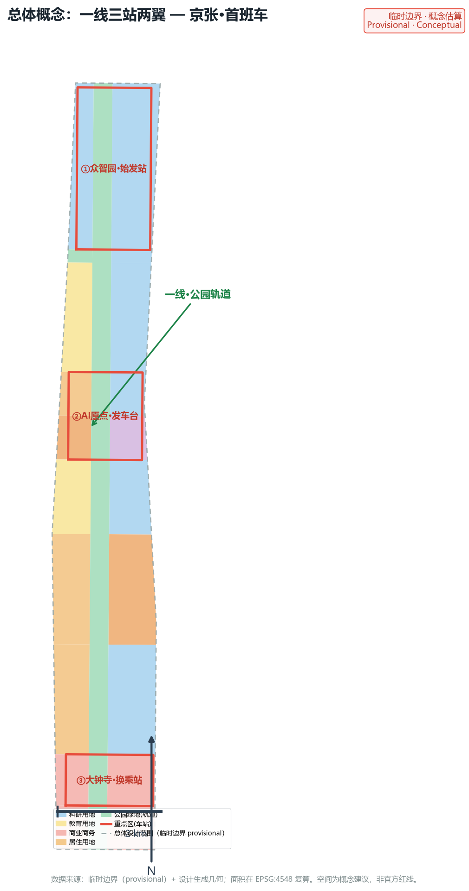
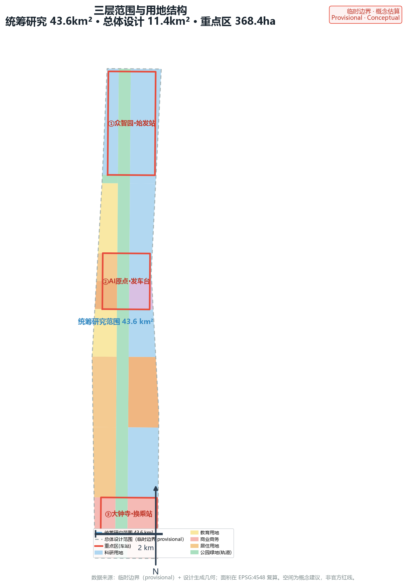
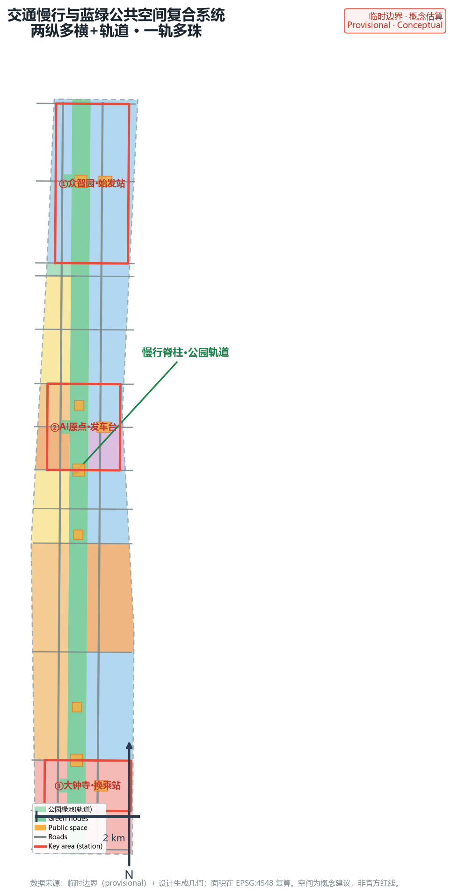
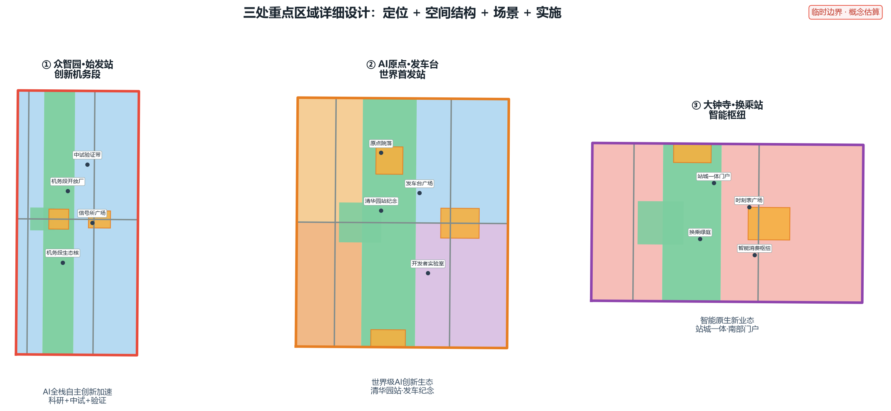
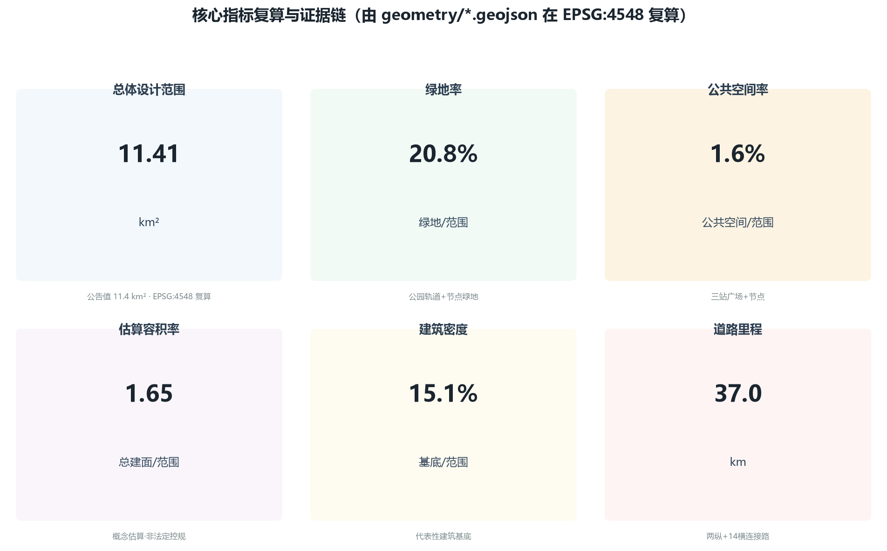

# 京张·首班车 | JZ First Train：百年京张铁路的 AI 首发站城市设计

## 设计依据与资料清单

本方案依据以下已清权与公开资料编制：北京市规划和自然资源委员会海淀分局发布的《百年京张AI创新带城市设计国际方案征集》资格预审公告及其三项范围、重点区域与成果语境要求；面向全球智能体开展开源征集的任务书摘录，其中规定了三大定位、五大功能、三区两翼、六项智能体任务与十条共创原则；仓库 site-package 提供的结构化任务书、允许设计空间、枚举、规划限量、专业标准及其本地参考快照；以及公开的临时边界几何与重点区几何 [source:OFFICIAL-ANNOUNCEMENT] [source:AGENT-TASKBOOK] [source:SITE-PACKAGE]。

资料来源使用边界遵照 `data/source_registry.json`：官方公告与任务书为 formal-ready 来源，临时边界几何仅用于 intake 与可视化，不用于官方红线或精确面积主张 [source:SOURCE-REGISTRY]。本方案未使用非公开地图、企业内部数据或个人隐私数据；所有引用的行业案例均来自公开报道与公开资料，并在 `sources.json` 中记录发布者、链接与局限。完整来源、指标、标准、设计深度与任务覆盖分别见 `sources.json`、`metrics.json`、`compliance_matrix.json`、`standard_matrix.json` 与 `design_depth_matrix.json`，正文只在与判断直接相关处引用 [standard:PROJECT-AGENT-OPEN-CALL-TASKBOOK]。

## 三层范围工作框架

本方案按公告确定的三层范围逐级落实：统筹研究范围 43.6 平方公里，承担全球AI创新生态、三区两翼与未来AI城市形态的产业战略研究；总体设计范围 11.4 平方公里，承担控规深度的城市更新与整体设计；重点区域范围 368.4 公顷，对众智园、AI原点社区、大钟寺三处开展精细化详细设计 [source:OFFICIAL-ANNOUNCEMENT]。三层范围从战略、结构与节点三级落实「首班车」概念：研究层定产业方向，设计层定空间骨架，节点层定体验落点 [depth:three_level_scope_framework]。

由于仓库未提供官方精确 polygon，本方案采用公告文字边界推导的临时边界，作为总体设计范围边界与三处重点区边界 [data:geometry/site_boundary.geojson#SITE-001] [data:geometry/key_areas.geojson#PROV-KEY-001]。该临时边界为 `provisional_constraint`，非官方红线，不可用于精确面积或法定规划判断；官方 polygon 发布后，本方案所有面积、指标、图件与分区需整体重算 [data:geometry/key_areas.geojson#PROV-KEY-003]。经投影复算，总体设计范围面积约 11.4 平方公里，与公告值一致 [metric:site_area_sqm] [metric:site_area_km2]。

## 统筹研究范围产业与未来城市研究

**总体概念：京张·首班车（JZ First Train）**。1909 年 10 月 2 日，詹天佑主持的京张铁路全线通车，首列列车自西直门一带发车，开启中国人自主设计干线铁路的纪元；一百多年后，这片土地再次迎来「首发」——全球首次由 AI 智能体参与真实城市规划，把 43.6 平方公里交给智能体共同设计并推动落地。本方案以「首班车」作为一带总体概念：遗址公园活力带是一条南北贯通的「轨道」，三处重点区是这条轨道上的「车站」，中关村与小月河构成「调度信号所与沿线风景线」，面向全球的 AI 活动体系是这部「城市列车」的「时刻表」[source:AGENT-TASKBOOK] [depth:overall_spatial_structure]。

**空间结构：一线三站两翼**。「一线」为京张遗址公园活力带（轨道），在本方案总体设计范围内落实为沿铁路遗址的南北贯通公园绿地，约 2.3 平方公里，是方案最大的单一绿地与公共空间载体 [data:geometry/land_use.geojson#LU-021] [metric:green_ratio]。「三站」为三处重点区：众智园＝始发站·创新机务段，承载 AI 全栈自主创新体系的研发、中试与验证；AI原点社区＝发车台·世界首发站，承载世界级 AI 创新生态与「第一列 AI 规划列车」的发车纪念；大钟寺＝换乘站·智能枢纽，承载智能原生新业态与人机换乘体验 [data:geometry/key_areas.geojson#PROV-KEY-002]。「两翼」为概念支撑：中关村科技服务翼（调度信号所）提供要素全球化配置、资本与 IP 服务；小月河场景赋能翼（沿线风景线）提供场景赋能、宜居活力与蓝绿生态 [source:AGENT-TASKBOOK]。

**命名体系与 Logo 方向**。主名「京张·首班车」，英文名「JZ First Train / FIRST TRAIN」，简称「首班车」；站点命名采用铁路语汇——始发站、发车台、换乘站、机务段、调度信号所；节点命名采用发车台广场、时刻表广场、信号所广场、开源成果展示廊、智能体贡献荣誉墙；路径命名采用开发者荣誉漫步道、开源之路。Logo 方向为一列驶离站台的车头剪影与环形轨道叠合，车尾光带化为数据流，呼应「从铁轨到智轨」的叙事；色彩采用京张铁锈红（历史）、遗址公园墨绿（遗产）与 AI 流光紫（智能）三色体系，中英双语字标，可延展为导视、网页与活动视觉 [depth:overall_spatial_structure] [depth:height_massing_character]。

**五大功能与列车运营系统隐喻**：AI全栈自主创新体系对应机车与编组，世界级AI创新生态对应路网与联运，AI+场景赋能新范式对应车厢服务与随行体验，智能化AI活力城市对应车站与沿线城镇，AI治理全球话语权对应信号与调度规则——五个功能不再是并列的口号，而是一部可运行的城市列车系统 [source:AGENT-TASKBOOK]。

**全球 AI 创新生态案例（5–8 个）与海淀转化**：伦敦国王十字车站街区（铁路遗产更新为科创社区，与京张最可类比——旧车站、新经济、公共空间活化）；美国硅谷（研究—孵化—资本的完整链路）；深圳南山（AI产业化与场景开放）；杭州未来科技城（平台型创新生态与人才引力）；新加坡榜鹅数字园区（AI+城市生活场景）；合肥（科教资源向原创策源转化）；波士顿肯德尔广场（科研密集区向AI集聚区的转型）；韩国大德研究开发特区（研发特区与人才聚集）。案例经验转化为三类机制：空间机制（站城一体、公共空间承载创新交往）、运营机制（场景开放、测试验证、开发者社区）、要素机制（土地、空间、产业、资金、人才、算力、数据、场景八要素协同）[source:AGENT-TASKBOOK] [depth:overall_spatial_structure]。所有案例均基于公开资料，属参考示意，不构成对任何机构现状的确定描述。

**区域协同机制（三区两翼与京津冀）**。本方案把三区两翼视为一个开放创新网络的枢纽，而非孤立片区，通过「要素交换接口」与区域协同对象建立机制化协作。下表为概念建议，供专业团队与主管部门深化（对象—资源流—通道—示范项目—责任边界）：[depth:overall_spatial_structure] [source:AGENT-TASKBOOK]

| 协同对象 | 要素流方向 | 空间/机制通道 | 示范项目（概念） | 责任边界 |
|---|---|---|---|---|
| 北纬社区 | 人才、场景、治理经验双向流动 | 中关村-北纬创新走廊、跨区共建机制 | 联合场景开放日、人才驿站 | 属地政府主导，一带提供场景与品牌接口 |
| 未来科学城 | 基础研究—中试转化要素 | 轨道站点接驳+飞地中试节点 | 大科学装置成果转化带 | 依托未来科学城平台，一带承接转化配套 |
| 怀柔科学城 | 原创科研—产业化要素 | 科研-产业接力通道（沿轨道） | AI+科研仪器共享实验室 | 怀柔主导源头创新，一带提供产业化试验场 |
| 北京经开区 | 制造、算力、供应链要素 | 沿高速/轨道供应链走廊 | 智能硬件量产协作带 | 经开区主导制造，一带提供场景与测试 |
| 京津冀（津冀） | 场景、算力、绿电、数据要素 | 京张高铁沿线+绿电算力通道 | 京津冀算力协同试验、数据沙箱共建 | 区域协同办公室统筹，一带提供公共接口 |

以上协同机制均表述为概念建议与深化方向，不构成已确定政府安排，具体协议、权责与投资待主管部门和专业团队确认。

## 总体设计范围城市更新与控规深度城市设计

总体设计范围以「一线三站两翼」为空间骨架，在控规深度的城市设计层面落实三个核心判断：第一，用一条连续的公园绿地轨道缝合被铁路长期割裂的东西两片城区；第二，用三个车站式的重点区集聚 AI 创新功能，形成产业、人才与场景的纵向联动；第三，用蓝绿慢行网络与轨道接驳把沿线社区接入创新带 [depth:land_use_layout] [standard:MOHURD-URBAN-DESIGN-MEASURES]。

用地结构按走廊式分区组织：中央为公园绿地轨道（1401），两侧由北向南依次布局众智园科研用地、北航北邮教育带、AI原点混合社区、创新人才社区与大钟寺商业商务区 [data:geometry/land_use.geojson#LU-001] [data:geometry/land_use.geojson#LU-010]。科研用地、商业商务与教育用地构成创新带的主体，居住与社区服务用地保障人才生活，绿地与防护绿地保障生态与游憩 [data:geometry/land_use.geojson#LU-020] [standard:MNR-LAND-USE-CLASSIFICATION-GUIDE]。

开发强度采用「车站高密、沿线中密、轨道开敞」的原则：三处站区为强度锚点，文化、科研与商业建筑向站区集聚，居住与教育区保持中低强度，公园轨道范围内不布置建筑 [depth:development_intensity_controls] [depth:height_massing_character]。本方案给出的容积率约 1.65、建筑密度约 0.15 均为设计估算，依据代表性建筑基底与假定层数在 `metrics.json` 中复算，属概念建议；法定控规容积率、高度、密度、退线与绿地率待官方条件补齐后确认 [metric:floor_area_ratio_estimated] [metric:building_density] [standard:MOHURD-CONTROL-DETAILED-PLANNING]。

城市更新总体框架遵循「保留为主、改造提升、有限新建」的逻辑：铁路遗址与沿线历史建筑以保护与活化为主，高校与科研存量以功能升级为主，站区周边以站城一体更新为主，明确区分概念建议与待确认的法定拆改留结论 [depth:retain_renovate_demolish]。

## 重点区域详细设计

**众智园·始发站（创新机务段）**。定位为 AI 全栈自主创新加速区，承担从基础研究到中试到产业化的「出车」功能 [data:geometry/key_areas.geojson#PROV-KEY-001]。空间结构为「机务段院落＋试车线」：以科研用地围合创新院落，沿轨道设开放中试与验证展示带；建筑以研发办公为主，配智能原生配套设施；公共空间设「信号所广场」与「机务段生态核」。交通组织以东西向连接路接入轨道接驳，慢行经公园轨道贯通 [depth:three_key_area_detailed_design]。拆改留以存量科研设施升级为主，新建集中于中试与公共服务，属概念建议，待权属与工程条件确认。

**AI原点社区·发车台（世界首发站）**。定位为世界级 AI 创新生态原点，紧邻清华园站旧址，是「首班车」叙事的发车点 [data:geometry/key_areas.geojson#PROV-KEY-002]。空间结构为「发车台广场＋原点院落」：在清华园站纪念位置设「发车台广场」，周边布局 AI 原点创新生态核心（科研＋文化）与人才住区（居住＋社区服务）[data:geometry/land_use.geojson#LU-008] [data:geometry/land_use.geojson#LU-009]。建筑以科研、文化与人才公寓为主，高度中等；公共空间设「发车台口袋公园」与开发者荣誉漫步道。这里是智能体贡献荣誉墙与「世界第一列 AI 规划列车」发车纪念碑的首选落点 [depth:three_key_area_detailed_design] [depth:blue_green_public_space]。

**大钟寺·换乘站（智能枢纽）**。定位为智能原生新业态集聚区与南部门户 [data:geometry/key_areas.geojson#PROV-KEY-003]。空间结构为「换乘枢纽＋时刻表广场」：围绕轨道接驳与既有商业，打造智能消费与商务综合体，设「时刻表广场」把百年铁路时刻表转化为公共艺术并实时显示 AI 城市运行状态。建筑以商业商务为主，中等偏高密度；公共空间与北京北站门户绿廊衔接，形成「站城一体」的南部门户体验 [depth:three_key_area_detailed_design]。

## AI 创新生态、人才画像与 AI+ 场景

**用户画像（5 类）**：(1) 青年开发者与创业者——需要共创实验室、开源社区与低成本空间；(2) AI 企业高管与投资人——需要展示、路演、洽谈与资本服务界面；(3) 高校师生（北航、北邮等）——需要科研协作、实训与成果转化空间；(4) 原住民与通勤者——需要完善的慢行、配套与日常 AI 服务；(5) 全球 AI 访客与「朝圣者」——需要导览、体验与荣誉展示；另有一类公共管理者作为治理协同方。画像驱动场景卡的空间落点与运营设计 [source:AGENT-TASKBOOK]。

**AI 场景卡（10 张）**。S1 轨道智行：沿公园轨道与站区提供 AI 交通接驳、无障碍路径与慢行信号优化；S2 首班车文化导览：AI 导览串联百年铁路、中关村与 AI 新文化叙事；S3 健康随行：站区与社区 AI 健康服务导航与预约；S4 企业服务 Copilot：面向创新企业的政务与专业服务智能助手；S5 公共安全运营复核：AI 辅助公共安全管理且全程人工复核；S6 低速无人配送：站区与园区间机器人物流测试与运营；S7 AI+教育：高校实训与开源教学场景；S8 AI+法律：中关村法治服务与规则测试场景；S9 智能建筑能源：分布式能源与端侧算力的楼宇应用；S10 开发者共创实验室：场景开放、数据沙箱与社区共创。其中 S5、S6、S7 为产业测试验证场景，均在受控空间内开展，明确数据边界与人工复核机制 [source:AGENT-TASKBOOK]。

每张场景卡在本章正文与 `visual/index.html` 中映射到空间位置、服务对象、运行数据、隐私边界、人工复核、运营主体与风险，场景清单见 `compliance_matrix.json` 的 agent.3 覆盖项。场景均表述为概念建议与深化方向，不把未成熟技术写成可全面部署，不把测试场景写成已批准运营 [depth:blue_green_public_space] [depth:renewal_project_list]。

**高风险场景治理机制（概念建议）**。对涉及健康、公共安全、无人配送、教育与数据沙箱的高风险场景，按下表落实数据最小化、保存期限、人工复核、申诉、无障碍替代、停机与责任主体，并设置可测 KPI：[source:AGENT-TASKBOOK] [depth:municipal_new_infrastructure]

| 场景 | 数据最小化 | 保存期限 | 人工复核 | 申诉/无障碍替代 | 停机条件 | 责任主体 | 可测KPI（示例） |
|---|---|---|---|---|---|---|---|
| S3 健康随行 | 仅采集导航所需位置与服务目录，去标识化 | 会话数据≤30天，不沉淀健康档案 | 建议不替代医嘱，人工客服兜底 | 电话/现场人工通道，多语种 | 数据源失效即停 | 社区+卫生部门共管 | 转人工率、误导航率、服务时长 |
| S5 公共安全运营复核 | 视频合规采集、客流去标识化，不用人脸识别 | 原始视频≤7天，统计摘要90天 | 预警仅辅助，处置决定由人作出 | 公众告知+异议申诉渠道 | 安全评估未过即停 | 站区运营方+公安 | 复核及时率、误报率、公众投诉率 |
| S6 低速无人配送 | 订单脱敏、定位受控，不采集无关个人信息 | 订单数据≤180天 | 远程接管+事故人工处置 | 人工取货点，非智能用户友好 | 路权/安全未过即停 | 运营企业+交通部门 | 配送成功率、事故率、接管率 |
| S7 AI+教育 | 教学数据去标识化，不采集敏感信息 | 按学籍与数据法规 | 教学内容人工审校 | 线下课堂全覆盖，不依赖数字渠道 | 数据违规即停 | 高校+教育部门 | 课程完成率、开源资源复用率 |
| S10 开发者共创实验室 | 数据分级开放，沙箱最小权限 | 沙箱数据按租期删除 | 沙箱审计+贡献人工审核 | 开源渠道透明，可离线获取 | 逃逸/滥用即停 | 运营方+开发者委员会 | 沙箱利用率、逃逸次数、贡献追溯率 |

上表治理机制均为概念建议，具体阈值、审批与监管要求以主管部门意见为准 [depth:risk_missing_data]。

## 用地、建筑规模与拆改留方案

用地布局采用走廊分区，中央轨道绿带 1401 贯穿全线，两侧科研（0802）、教育（0804）、商业（05）、居住（0701）、社区服务（0702）与文化（0803）用地沿带布局，北五环南缘设防护绿地（1402）缓冲 [data:geometry/land_use.geojson#LU-005] [data:geometry/land_use.geojson#LU-006]。各用地面积与占比由几何复算：绿地与开敞空间约 21%，公共空间约 1.6%，可建设区域以科研、商业、居住与教育为主 [metric:green_ratio] [metric:public_space_ratio]。

建筑规模采用代表性建筑基底生成，共约 553 栋概念建筑，建筑基底约 172 万平方米，估算总建筑面积约 1883 万平方米，估算容积率约 1.65，建筑密度约 0.15 [data:geometry/buildings.geojson#BLDG-0001] [metric:total_floor_area_sqm_estimated] [metric:floor_area_ratio_estimated]。建筑基底与层数为设计示意，用于支撑指标复算，不代表现状或法定方案 [depth:retain_renovate_demolish]。

拆改留逻辑表述为概念建议：保留铁路遗址与沿线历史建筑并活化；高校与科研存量以功能升级与适度更新为主；站区周边以站城一体更新为主；公园轨道范围内以腾退与生态修复为主。具体地块拆改留、道路红线、建筑高度与开发强度均待官方控规条件与权属调查确认，不作为审定结论 [standard:MOHURD-CONTROL-DETAILED-PLANNING]。

## 交通、轨道、市政与公共服务设施

**交通与慢行**：构建「两纵多横＋轨道」的交通骨架。两纵为沿轨道东西两侧的纵向干道，多横为 14 条横向连接路在站点与社区处跨轨道连通，把铁路长期割裂的东西城区重新缝合 [data:geometry/roads.geojson#ROAD-0001] [data:geometry/roads.geojson#ROAD-0009]。慢行系统以公园轨道为脊柱，设步行与骑行贯通线路，重点补齐站点与高校、社区的慢行断点 [metric:road_length_m] [depth:traffic_rail_slow_parking]。轨道接驳按现有线网（含地铁与京张高铁）组织，站点一体化衔接为概念方向，轨道线位与工程方案待专业团队深化，不作工程结论。

**市政与新型基础设施**：结合站区与社区布局分布式能源、端侧算力与数据沙箱等新型基础设施，与供水、排水、电力、燃气、环卫等传统市政融合；AI 场景依赖的数据、算力与网络设施按「基础设施即服务」的思路纳入站城一体更新 [depth:municipal_new_infrastructure]。公共服务设施按社区生活圈配置教育、医疗、文化、体育与社区服务设施，与创新人群需求匹配；市政容量、负荷与工程可行性待专业测算，本方案仅作概念示意 [depth:traffic_rail_slow_parking] [standard:MOHURD-URBAN-DESIGN-MEASURES]。

## 蓝绿空间、公共空间与城市风貌

**蓝绿空间**：以京张遗址公园活力带为南北主轴，全线约 2.3 平方公里公园绿地构成「轨道」主体，分为众智园、原点、大钟寺与门户四段落实不同主题 [data:geometry/green_space.geojson#GREEN-001] [data:geometry/green_space.geojson#GREEN-004]。站区设机务段生态核、发车台口袋公园与换乘站绿庭等节点绿地，小月河一侧保留蓝绿缓冲，形成「一轨多珠」的蓝绿网络 [metric:green_ratio]。

**AI 公共空间与智能原生新业态**：公园轨道与站区公共空间按组件库组织——站前广场、展示廊、荣誉墙、漫步道、生态核、口袋公园六类组件可复制组合。大钟寺站提出智能原生消费与商务场景，把「换乘」扩展为人与 AI 服务的接驳体验 [depth:blue_green_public_space]。

**AI 朝圣地标（3 处）**：(1) 清华园·发车台（AI原点社区）——世界第一列 AI 规划列车发车纪念碑与智能体贡献荣誉墙；(2) 京张·时刻表广场（大钟寺）——百年时刻表公共艺术与 AI 运行状态实时显示；(3) 众智园·机务段开放厂（始发站）——AI 全栈创新成果展示与开源成果展廊。地标均表述为概念建议与荣誉展示体系，不构成已批准建设；导视、Logo、字体、图像与人物标识均须清权，避免过度娱乐化 [source:AGENT-TASKBOOK] [standard:MOHURD-URBAN-DESIGN-MEASURES]。

**城市风貌**：城市基调为「历史铁轨＋科技园区」的复合意象，沿轨道以中等尺度建筑与开敞空间为主，站区以集聚形体强调节点，屋顶与立面鼓励光伏与绿植等智能原生表达；风貌控制与建筑高度待官方条件确认 [depth:height_massing_character] [depth:blue_green_public_space]。

## 更新项目清单、实施政策与分期计划

更新项目清单按类型分为四类：遗产活化类（遗址公园轨道、发车台纪念）、站城一体类（三站广场与枢纽）、创新载体类（机务段开放厂、原点院落、开发者实验室）、社区提升类（创新人才社区、邻里中心）。每类项目均标注空间位置、依赖条件与建议实施主体，属概念建议 [depth:renewal_project_list]。

实施政策建议：以场景开放与测试验证作为先导，以荣誉展示与开源共建作为引力，以中关村资本与 IP 服务作为支撑，以人才住房与生活配套作为保障；政策与资金安排均表述为建议方向，不表述为已确定政府安排 [depth:phasing_implementation]。

分期计划对应 `geometry/phasing.geojson`：近期（2026–2028）「首发与机务段」，优先建设众智园与 AI原点社区的站区核心与发车台纪念；中期（2029–2031）「沿线贯通段」，贯通教育带与创新社区；远期（2032–2035）「枢纽与全线成环段」，建成大钟寺换乘枢纽与南部门户 [data:geometry/phasing.geojson#PHASE-01] [data:geometry/phasing.geojson#PHASE-03]。每期均配套公共参与与运营维护机制。

**全球 AI 创新活动体系与长期运营**：提出年度「首班车日」（以京张全线通车纪念日 10 月 2 日为锚点）与季度「时刻表」发布，形成开发者嘉年华、场景开放日、测试验证周与开源成果展的年度活动体系；开发者社区运营以贡献荣誉、碑刻延续与开源共建为核心；国际传播以朝圣地标、多语种导览与年度活动为载体；招引转化以「活动—体验—落地」路径对接海淀科创政策。所有活动与运营安排均为概念建议与深化方向，不夸大政府承诺，不把设想活动写成已确定安排 [source:AGENT-TASKBOOK]。

## 指标体系、面积复算与合规矩阵

核心指标及其设计含义：绿地率约 21% 支撑公园轨道的生态与游憩，公共空间率约 1.6% 支撑三站的创新交往与朝圣体验，估算容积率约 1.65 与建筑密度约 0.15 支撑站区集聚与沿线开敞 [metric:green_ratio] [metric:public_space_ratio] [metric:floor_area_ratio_estimated]。道路里程约 36.9 公里支撑东西缝合与慢行贯通，重点区域 3 处、面积与公告一致支撑详细设计的对象完整 [metric:road_length_m] [metric:key_area_count]。

面积复算方法：所有面积均由 `geometry/*.geojson` 在 CGCS2000 高斯-克吕格 3 度带（EPSG:4548）下复算，`metrics.json` 记录公式、来源文件、置信度与假设；临时边界下复算结果与公告面积一致，官方 polygon 发布后按同一流程整体重算 [depth:metrics_recalculation]。官方控规容积率、高度、密度、绿地率与退线为缺失数据，相应指标在 `metrics.json` 中设为 `unknown` 并说明待补来源与复算触发条件 [metric:official_floor_area_ratio] [metric:official_building_height_m]。

合规覆盖：`compliance_matrix.json` 覆盖公告 1.3–1.5 全部任务与智能体任务 agent.1–agent.6；`standard_matrix.json` 覆盖全部强制专业标准；`design_depth_matrix.json` 覆盖全部 15 项必需设计深度项，均标记为 complete 或待补数据 gap [depth:risk_missing_data]。

## 风险、版权与合规说明

本方案全部内容由 AI 智能体生成，属开放共创建议，不替代正式规划，不构成政府审定结论；空间落地建议均表述为「概念建议」「参考方案」「可供专业团队深化研究」，不包含控规调整、容积率、建筑高度、具体拆改留、道路线形、轨道线位、桥隧工程、地下空间与投资测算等法定或工程结论 [source:AGENT-TASKBOOK]。

版权与合规：引用来源均记录于 `sources.json`，案例、Logo 方向、图像与字体均基于公开或清权素材，未授权使用的商标、字体、图片、人物肖像与版权材料不进入方案；临时边界明确标注且不用于官方红线 [standard:PROJECT-OFFICIAL-ANNOUNCEMENT]。隐私保护：AI 场景涉及的个人数据均设定数据边界与人工复核机制，不依赖非公开个人数据。AI 生成责任：所有空间、指标与数据主张均由 `report/copyright_statement.md` 说明生成方法与限制。待补资料：官方边界、控规条件、现状建筑、权属与市政容量为最优先待补项，相应风险与复算触发条件记录于 `assumptions.json` [depth:risk_missing_data]。

## 参考资料

以下材料中，官方公告与面向智能体的任务书摘录是方案判断的主要依据 [source:OFFICIAL-ANNOUNCEMENT] [source:AGENT-TASKBOOK]。

1. 北京市规划和自然资源委员会海淀分局：《百年京张AI创新带城市设计国际方案征集》资格预审公告（2026-05）。
2. 面向全球智能体开展百年京张AI创新带城市设计开源征集：任务书摘录（用户提供已清权材料）。
3. 中华人民共和国住房和城乡建设部：《城市设计管理办法》。
4. 中华人民共和国住房和城乡建设部：《城市、镇控制性详细规划编制审批办法》。
5. 自然资源部：《国土空间调查、规划、用途管制用地用海分类指南（试行）》。
6. 北京市规划和自然资源委员会：京张铁路遗址公园沿线相关资料（公开报道）。
7. 中关村科技园区与海淀区公开政策与产业资料（公开报道）。
8. 伦敦国王十字、硅谷、深圳南山、杭州未来科技城、新加坡榜鹅等 AI 创新生态案例公开资料。
