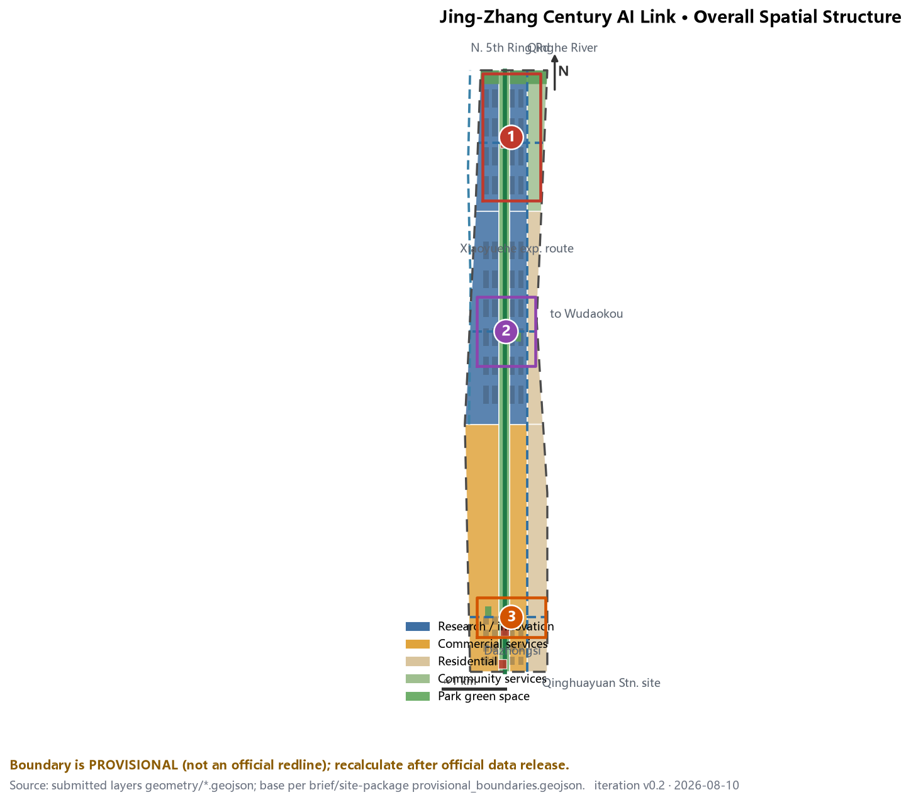
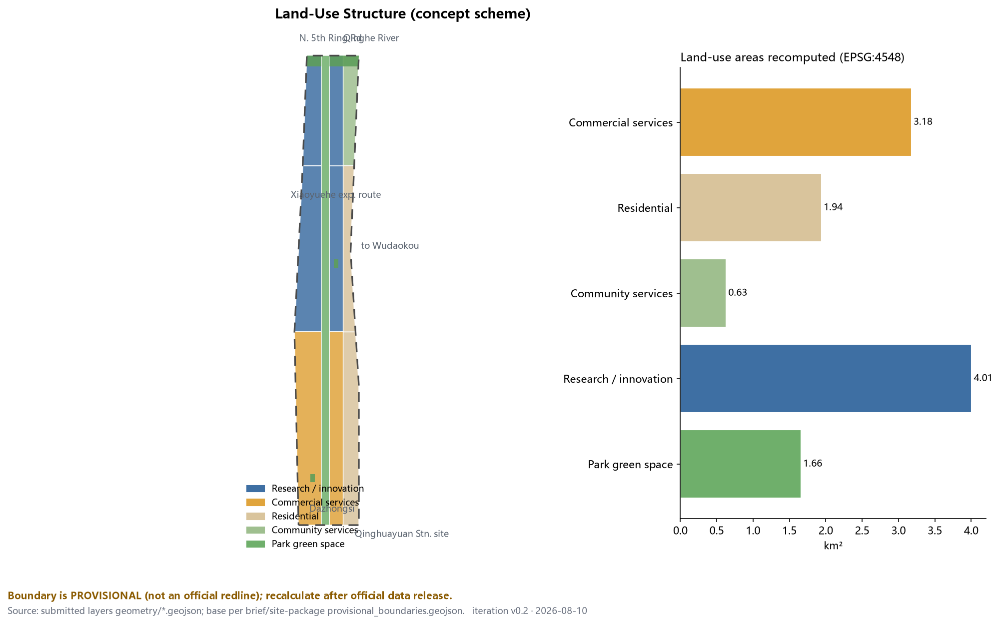
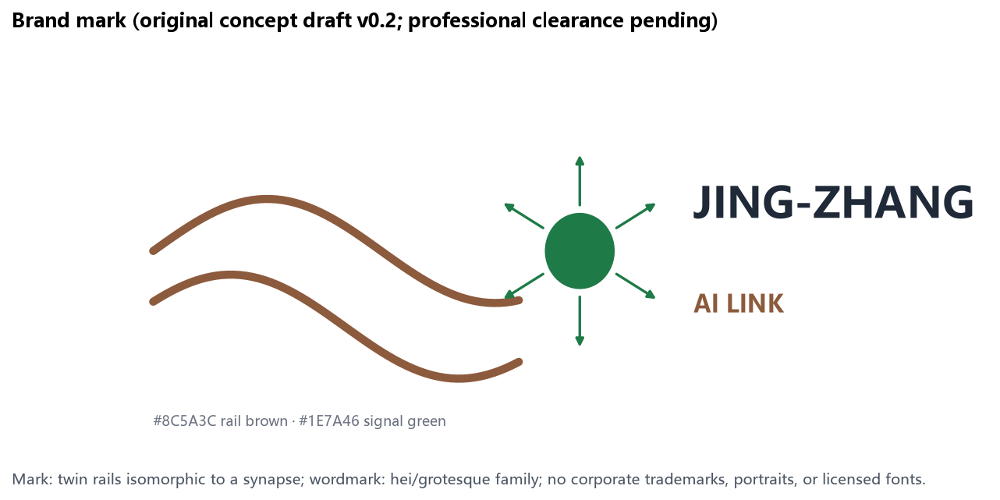
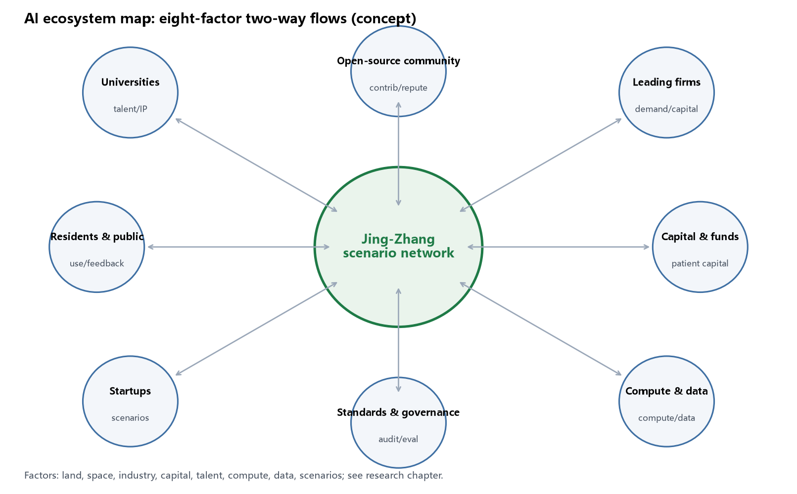
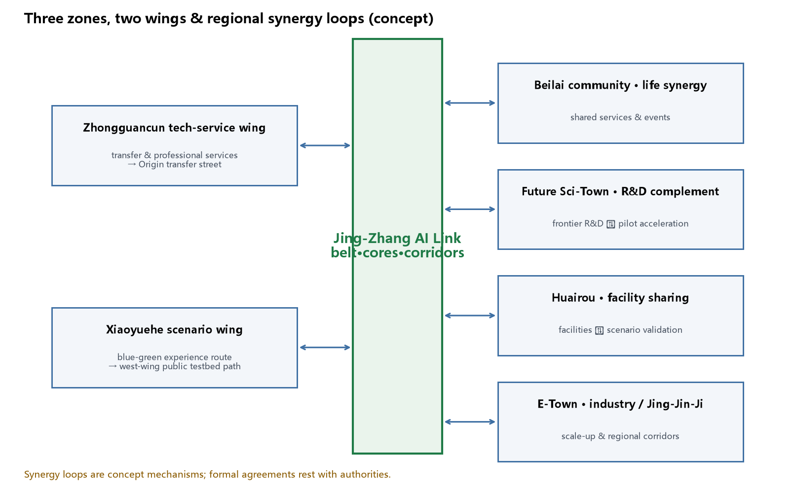
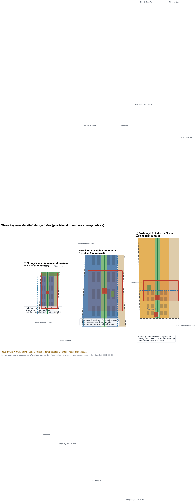
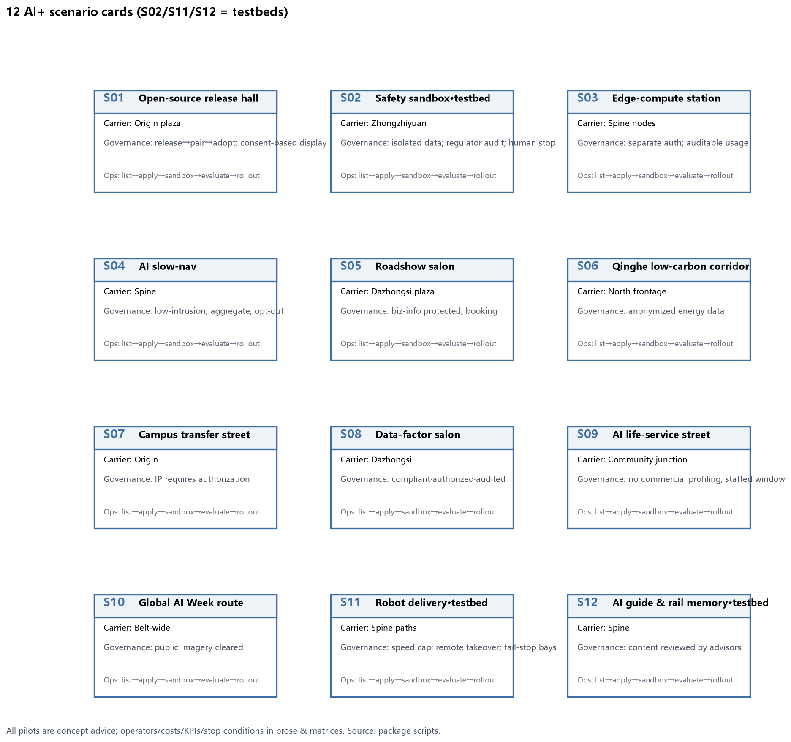
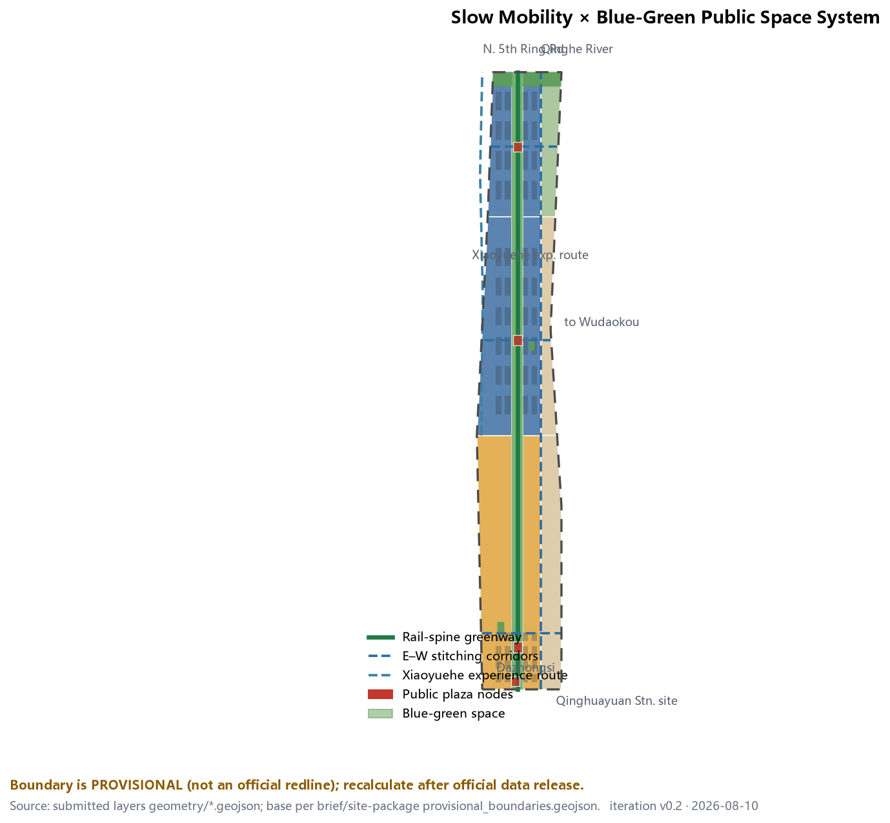
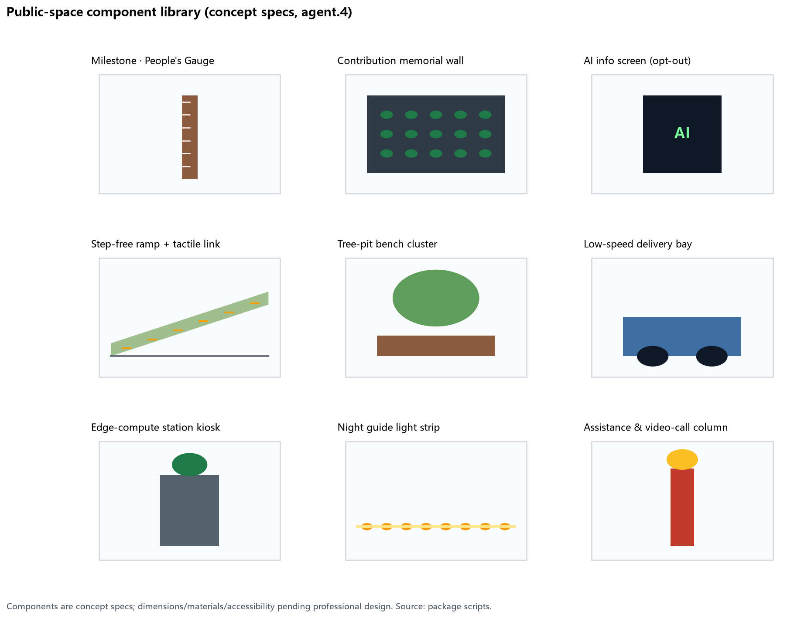
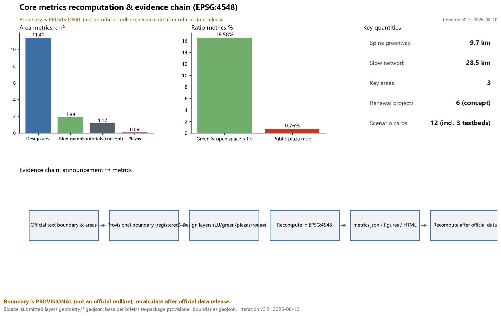

# Jing-Zhang Century AI Link: An Innovation Belt on Rails

This is a formal AI urban design proposal for the Centennial Jing-Zhang AI Innovation Belt. It reorganizes the north–south corridor left by the 1909 Jing-Zhang Railway into a "smart link" for global developers: cultural memory, innovation industry, and daily life unfold along one green spine. Every siting suggestion in this proposal is **concept advice, a reference scheme, or material for professional teams to deepen**; it does not replace statutory planning and does not constitute government-approved conclusions.

## Design Basis and Source List

The primary basis is the Qualification Pre-announcement for the International Urban Design Solicitation of the Centennial Jing-Zhang AI Innovation Belt issued by the Haidian Branch of the Beijing Municipal Commission of Planning and Natural Resources, which defines a coordinated research area of about 43.6 km², an overall design area of about 11.4 km², three key areas totaling 368.4 ha, and requires regulatory-plan-level urban design depth [source:OFFICIAL-ANNOUNCEMENT]. The second basis is the agent-facing open-call taskbook, which structures the six mandatory tasks (agent.1–agent.6), ten co-creation principles, and boundary clauses into machine-readable files [source:AGENT-TASKBOOK].

Site geometry uses the maintainer-registered provisional boundaries: the overall design area and the three key-area polygons are rough substitute boundaries derived from the announced text extents and validated against announced areas. They are used only for generation, display, self-check, and design discussion — never as official redlines, approval bases, or precise area grounds [source:BOUNDARY-SOURCE]. Source-use boundaries follow `data/source_registry.json`: formal-ready, background-only, and provisional-only materials are strictly tiered, and this proposal upgrades no background/provisional material into statutory conclusions [source:SOURCE-REGISTRY]. `data/processed/agent_fact_pack.md` serves only as a reading guide [source:PROCESSED-FACT-PACK].

Official redlines, exact key-area polygons, FAR, building height, density, green ratio, and setbacks are currently missing and are all listed as pending items (see assumptions and risk sections) [data:geometry/constraints.geojson#CONSTRAINT-002]. Figure 1 shows the overall evidence chain and package structure: the prose serves human reading while GeoJSON, metrics, and matrices serve machine auditing.

## Three-Level Scope Framework

The proposal follows the announcement's three scope levels. The **coordinated research area** (43.6 km²) addresses innovation ecosystems, industrial-chain synergy, and future city forms, delivering strategy, naming, and case research; the **overall design area** (11.4 km²) addresses the urban renewal framework, land-use structure, mobility, municipal systems, and character control, delivered as land-use, building, road, green, public-space, and phasing layers [depth:three_level_scope_framework]; the **key detailed-design areas** (368.4 ha) cover Zhongzhiyuan, the Beijing AI Origin Community, and Dazhongsi [data:geometry/key_areas.geojson#PROV-KEY-001].

The translation rule between levels: every industrial judgment at the research level must find its land use and public space at the overall level; every spatial move at the overall level must be verifiable in a key-area chapter or a layer. For example, "open-source collaboration needs publishable, gatherable places" maps to the research land use of the Origin Community [data:geometry/land_use.geojson#LU-003] and the open-source plaza [data:geometry/public_space.geojson#PUBLIC-002].

Handling of the provisional boundary: it is used to establish corridor form, relative positions, and area magnitudes — never parcel-level conclusions. Once official polygons are released, site boundary, key areas, land use, roads, green space, public space, buildings, phasing, and all area metrics will be recomputed under the same generation rules [metric:site_area_sqm]. All area calculations use EPSG:4548; the recomputed overall area is 11.41 km², consistent with the announced 11.4 km².

The proposed overall structure is "**one belt, three cores, five corridors, blue-green loop**": the belt is the north–south Jing-Zhang green spine (relic park vitality belt); the three cores are the key areas; the five corridors are the spine plus three east–west slow-mobility stitches and one eastern community connector; the loop links green corridors, the north-edge belt, plaza nodes, and event routes [depth:overall_spatial_structure].

## Coordinated Research Area: Industry and Future City Research

**Naming system (agent.1)**: the belt-wide name is "**Jing-Zhang AI Link (京张智链)**". "Link" refers both to the physical continuity of the railway chain and to the trust chain of open-source collaboration. The three positioning belts receive translatable sub-names: the culture belt becomes the "Rail Memory Belt", the urban AI life belt the "Everyday Scenario Belt", and the fusion innovation belt the "Full-Stack Acceleration Belt". The logo direction is an original concept: a twin-rail cross-section isomorphic to a neural synapse, expressing "intelligence on rails", in weathering-steel brown and signal green; it uses no corporate trademarks, fonts, or portraits, and final identity requires professional clearance [source:AGENT-TASKBOOK]. v0.2 submits a reviewable mark concept and visual rules (Figure 2): twin-rail curves + synapse node; colors #8C5A3C (rail brown) and #1E7A46 (signal green); wordmark in hei/grotesque families; minimum application size 24 mm; no stretching, recoloring, or portraits; multi-media applications (milestone posts, signage, event key visuals) appear on the A3 cover and component-library page.

**Global AI ecosystem cases (agent.2)**: six public cases with transferable mechanisms — (1) Kendall Square, Cambridge: university sourcing in a dense mixed district → "campus transfer street" [source:CASE-KENDALL]; (2) King's Cross, London: railway-heritage-led renewal with college clusters → "rail heritage as public axis" [source:CASE-KINGSCROSS]; (3) one-north, Singapore: research corridor stitched by a linear park → "green spine + clusters" [source:CASE-ONENORTH]; (4) Shenzhen Bay districts: headquarters economy with public waterfront → "publicizing corporate frontages" [source:CASE-SHENZHENBAY]; (5) West Bund, Shanghai: industrial relics converted into a cultural corridor → "narrative-led phasing" [source:CASE-WESTBUND]; (6) MaRS Discovery District, Toronto: downtown research translation → "streets as testbeds" [source:CASE-MARS]. Per-case publishers, access dates, and reuse limits are registered in `sources.json`; these cases are background research only, their data are not formal evidence, and no affiliation with these organizations is implied [source:CASE-STUDIES-BACKGROUND].

**Factor mechanisms**: around land, space, industry, capital, talent, compute, data, and scenarios, the proposal proposes a concept mechanism of "space-supply list + scenario-open list + factor service desk": renewal projects supply space, scenario cards provide testing and application entry, and the desk aggregates legal, IP, financing, and compute interfaces. All mechanisms are concept advice; investment, funding, and policy arrangements are not commitments [standard:PROJECT-AGENT-OPEN-CALL-TASKBOOK]. The two-way flows of the eight factors are mapped in Figure 3.

**Three zones, two wings, and regional synergy (v0.2 addition)**: beyond "one belt, three cores", the proposal completes the taskbook's two wings and regional loops. The **Zhongguancun tech-service wing** (east) connects professional services, transfer intermediaries, and innovation capital to the Origin Community transfer street, forming a "results leave campus — services enter blocks" loop; the **Xiaoyuehe scenario-empowerment wing** (west) strings scenario pilots along a blue-green experience route, forming the spine's west-wing public testbed path [data:geometry/roads.geojson#ROAD-006]. Regionally: shared life-circle services and events with the Beilai community; a "frontier R&D — pilot acceleration" division with the Future Science City; large-facility scenario validation with the Huairou Science City; a scale-up industry corridor with the Economic Development Zone; and node integration in the Jing-Jin-Ji innovation corridor (concept mechanisms; formal agreements rest with competent authorities) [source:OFFICIAL-ANNOUNCEMENT]. See Figure 4.

**Global AI governance voice (v0.2 addition)**: "voice" is translated into four testable mechanisms — (1) standards co-creation: an open standards working group based on the safety governance sandbox (S02), publishing interface and evaluation drafts annually; (2) sandbox audit: isolated test data, regulator-reviewable logs, and a human stop authority written into scenario governance boundaries; (3) public evaluation: an annual aggregated public evaluation report of belt scenarios; (4) international cooperation: twin-innovation-district exchanges with peers such as one-north and MaRS (concept intent, not agreements) [source:CASE-ONENORTH] [source:CASE-MARS].

The core judgment on future city form: AI changes not single building types but the *testability of streets* and the *publishability of places*. The overall-level moves therefore concentrate on three carriers — testable streets (spine and stitches), publishable places (plazas and release halls), and livable community (Origin Community life circle) [standard:MOHURD-URBAN-DESIGN-MEASURES].

## Overall Design Area: Urban Renewal and Regulatory-Plan-Level Urban Design

The renewal framework follows "keep the spine, stitch east–west, activate frontages". Land use is expressed per the national classification standard in seven complete, gap-free, overlap-free zones: the spine as park green (1401), the west side as research land (0802) for innovation, the east side as residential (0701) and community services (0702), and commercial services (05) on the west side of the Dazhongsi segment [standard:MNR-LAND-USE-CLASSIFICATION-GUIDE] [data:geometry/land_use.geojson#LU-001].

Three design judgments. First, the railway corridor draws no new redline; the existing relic-park green belt is the public-space axis, and north–south continuity is a non-negotiable structural goal [depth:overall_spatial_structure]. Second, east–west stitching precedes new development: three corridors at the Dazhongsi, Wudaokou–Origin, and Zhongzhiyuan segments aim to heal the rail barrier [data:geometry/roads.geojson#ROAD-003]. Third, innovation functions line the west side of the spine, walkable to but distinct from living areas; building footprints are expressed as a concept massing grid totaling about 1.17 km², a magnitude for discussion, not an approved scale [metric:building_footprint_area_sqm].

On regulatory depth: FAR, height, density, green ratio, and setback controls are missing; `metrics.json` marks them unknown with reasons, pending official controls or brief attachments [depth:development_intensity_controls]. Renewal targets, function ratios, public-space ratios, and mobility organization are mutually supported by layers and metrics; no conclusion that cannot be recomputed from structured data enters the prose [depth:land_use_layout].

## Detailed Design of Key Areas

All three key areas use provisional polygons; the following are directional designs to be recalibrated after official polygons [depth:three_key_area_detailed_design].

**① Zhongzhiyuan AI Acceleration Area (announced 192.1 ha)** [data:geometry/key_areas.geojson#PROV-KEY-001]: positioned as a garden-type full-stack innovation district (concept). Structure: "one frontage + three clusters" — a Qinghe low-carbon innovation frontage to the north; acceleration, standards-governance, and testbed clusters inside. Scenarios S02 (safety governance sandbox) and S03 (edge-compute stations) locate here. Dependencies: Qinghe blue line, ecology, flood control. Risk: multiple owners require a coordinated implementation body.

**② Beijing AI Origin Community (announced 104.3 ha)** [data:geometry/key_areas.geojson#PROV-KEY-002]: positioned as a campus-adjacent transfer and talent community (concept). Moves: stitch campus–park–block by slow mobility; a transfer street (S07) toward the campus direction, the open-source plaza (PUBLIC-002) and release hall (S01), plus talent services and living support. Retain-renovate-demolish logic keeps retain and renovate dominant; about one third of the concept grid is new build [data:geometry/buildings.geojson#BLDG-M001]. Dependencies: campus boundaries, ownership, ground-floor policy.

**③ Dazhongsi AI Industry Cluster (announced 72.0 ha)** [data:geometry/key_areas.geojson#PROV-KEY-003]: positioned as an urban intelligence economy and international exchange district (concept). Moves center on four-quadrant station walkability (JZ-04): the station forecourt (PUBLIC-001) hosts the international roadshow salon (S05) and data-factor salon (S08); commercial frontages carry intelligence-native consumption (S09). Dependencies: station traffic organization, intersections, municipal utilities.

## AI Innovation Ecosystem, Personas, and AI+ Scenarios

**Personas (5)**: open-source developers (publish, collaborate, reputation), startup teams (affordable space, compute entry, testbeds), corporate visitors (showcase, business, recruiting), local residents (commuting, leisure, low-disturbance renewal), university faculty and students (transfer, collaboration, slow mobility). Each persona has a spatial response and a data boundary: the proposal collects no personal trajectories; activity data are aggregated only; resident profiles are never used for commercial recommendation.

**Inclusion and public interest (v0.2 addition)**: beyond the five innovation personas, the proposal explicitly covers children, older adults, disabled people, low-digital-literacy users, caregivers, night workers, and residents affected by construction or events: step-free continuity along the spine (ramps + tactile links are mandatory component specs), non-digital service windows at plazas (a right to refuse digital services), low-noise time slots and detour alternatives on event routes, and construction-period disclosure plus complaint remedies written into JZ acceptance conditions; participation runs on "scenario open days + online issue boards", and benefit sharing is expressed through prioritized community facilities and local-employment preference (concept advice) [standard:PROJECT-AGENT-OPEN-CALL-TASKBOOK].

**Scenario cards (12; S02, S11, S12 are industry test/validation scenarios)**:

| Scenario | Spatial carrier | Users | Privacy & human-review boundary |
| --- | --- | --- | --- |
| S01 Open-source release hall | Origin PUBLIC-002 | Developers, universities | Public event data; contributions shown with consent |
| S02 Safety governance sandbox (testbed) | Zhongzhiyuan | Model & standards bodies | Isolated test data; regulator-reviewable |
| S03 Edge-compute stations | Spine nodes | Startups | Compute use separately authorized |
| S04 AI slow-mobility navigation | Spine | Commuters, visitors | Low-intrusion sensing; aggregated only |
| S05 International roadshow salon | Dazhongsi PUBLIC-001 | Firms, investors | Business information protected |
| S06 Qinghe low-carbon corridor | Zhongzhiyuan frontage | Park firms | Energy data anonymized |
| S07 Campus transfer street | Origin LU-003 | Faculty & students | IP and results require authorization |
| S08 Data-factor salon | Dazhongsi | Data institutions | Compliant, authorized, auditable |
| S09 AI life-service model street | Community junction | Residents | No commercial recommendation |
| S10 Global AI Week route | Belt-wide | Global visitors | Public imagery requires clearance |
| S11 Low-speed robot delivery (testbed) | Spine paths | Parks, community | Limited low-speed segments; remote takeover |
| S12 AI guide & rail-memory interpretation (testbed) | Spine | Visitors | Content reviewed by cultural advisors |

The scenario–space–operation mapping follows "layer positioning + matrix registration": each scenario names its carrier in prose and registers operation and boundaries in `compliance_matrix.json` [data:geometry/public_space.geojson#PUBLIC-002]. All testbed scenarios are concept pilots, not approved operations [source:AGENT-TASKBOOK]. The readable 12-card version is Figure 5.

**Scenario governance deepening (v0.2, three priority pilots)**: S02 safety governance sandbox — operator: a joint working group of the park platform and standards bodies; flow: apply → isolated environment issue → run → audit → exit; data minimization (test sets only, no business data retained); human takeover and stop authority with the regulator representative; failure state = isolated-environment circuit break with public notice; KPIs = annual audit pass rate, issue-closure time; stop condition = any party exits or audit fails. S11 low-speed robot delivery — operator: logistics operator + park property; 6 km/h cap, remote takeover, fail-stop bays and yielding rules written into the component library; KPIs = accident rate, takeover rate, complaints; stop condition = pause when the accident rate exceeds threshold. S12 AI guide — content reviewed by cultural advisors, multilingual, offline audio alternative; KPIs = reviewed content accuracy, accessibility satisfaction; stop condition = advisor certification withdrawn. Governance boundaries of the remaining cards appear in Figure 5 and the matrices.

## Land Use, Building Scale, and Retain-Renovate-Demolish Strategy

Recomputed land use (EPSG:4548): research/innovation (0802) about 4.01 km², commercial services (05) about 3.18 km², residential (0701) about 1.94 km², community services (0702) about 0.63 km², park green (spine, 1401) about 1.66 km²; green and open space including the spine corridor, the north-edge belt, and pocket parks totals about 1.89 km², 16.6% of the design area (v0.2 unified to the union basis; see `changelog.md`) [metric:green_ratio] [data:geometry/land_use.geojson#LU-007].

Buildings are expressed as a concept massing grid with retain, renovate, and new-build actions annotated 1:1:1 to discuss renewal strategy rather than parcel conclusions [depth:retain_renovate_demolish]. Height, massing, and character controls lack official conditions and remain pending; the proposal offers directions only — low continuous frontages along the spine, medium volumes in innovation clusters, moderate concentration around stations [depth:height_massing_character]. All areas and ratios are recomputable from `geometry/*.geojson` and `metrics.json`.

## Transport, Rail, Municipal Infrastructure, and Public Services

The mobility framework is "one spine, three horizontals, one vertical, plus a west-wing experience route": the spine greenway of about 9.7 km concept alignment plus stitches, the eastern connector, and the Xiaoyuehe scenario-wing blue-green experience route (ROAD-006) totaling about 28.5 km — all concept alignments, not road redlines [metric:slow_network_length_m] [data:geometry/roads.geojson#ROAD-001] [data:geometry/roads.geojson#ROAD-006]. Rail integration focuses on Dazhongsi station and Wudaokou-direction access as pending specialties; external trips rely on the existing North 5th Ring and Jing-Tibet expressway system, with no new road-engineering conclusions [depth:traffic_rail_slow_parking].

Municipal and new infrastructure follow "fused embedding": edge-compute stations (S03) and distributed energy sit as small nodes inside public-service facilities, avoiding separate land take; pipelines, energy, drainage, flood control, and fire conditions are missing and listed as preconditions for formal deepening [depth:municipal_new_infrastructure] [data:geometry/constraints.geojson#CONSTRAINT-002].

## Blue-Green Network, Public Space, and Urban Character

The blue-green system uses the spine as its frame: the green corridor of about 1.66 km² runs the full length, which together with the north-edge protective belt and two pocket parks totals about 1.89 km² of green and open space, compounded with four plaza nodes [data:geometry/green_space.geojson#GREEN-001]. The public-space sequence — Qinghuayuan station cultural forecourt (PUBLIC-004), Dazhongsi forecourt, Origin open-source plaza, Zhongzhiyuan exhibition plaza — is spaced about 3 km apart and walkable end to end [metric:public_space_ratio].

**AI pilgrimage landmarks and honor display (agent.4)**: three concept landmarks — (1) **"Origin Pier"**: an open-source contribution memorial plaza near the Qinghuayuan station site, greeting southern arrivals with a "departure from here" narrative; (2) **"The People's Gauge"**: smart milestone posts every 100 m along the spine, engraving annual outstanding open-source contributions and agent names (subject to final selection and consent); (3) **"The Signal Tower"**: an AI milestone tower and agent honor wall at Zhongzhiyuan's north end, echoing railway signal houses. The honor system updates annually to avoid one-off celebrity effects; all name displays require contributor consent [standard:PROJECT-AGENT-OPEN-CALL-TASKBOOK].

**Public-space component library (v0.2, agent.4)**: nine concept components with specification directions — People's Gauge milestones, contribution memorial wall, AI info screen (opt-out), step-free ramp + tactile link, tree-pit bench cluster, low-speed delivery bay, edge-compute station kiosk, night guide light strip, assistance & video-call column; accessibility is mandatory for all components, dimensions and materials pending professional design. See Figure 6.

**Cultural narrative (agent.5)**: three timelines — 1909 Jing-Zhang Railway (self-reliant engineering), 1980s Zhongguancun electronics street (grassroots innovation), 2026 AI origin (open agent collaboration) — translated into a spatial storyline: "Departure" at the south (Qinghuayuan station), "Acceleration" mid-belt (Wudaokou, Origin Community), "Climb" in the north (Zhongzhiyuan), and "Arriving at the future" belt-wide. Signage direction is "rail memory × code aesthetics": mileage symbols inherit railway mileage language; information layers use readable open-source version-style marks. Character palette: memory brick red with weathering-steel details and continuous low-pressure frontages. International communication theme (concept copy): "From 1909 to the future: a railway's second departure" [source:AGENT-TASKBOOK].

## Renewal Projects, Implementation Policy, and Phasing

| Project | Name | Phase | Lead operator (concept type) | Cost order | Dependencies & maintenance | KPIs / stop conditions |
| --- | --- | --- | --- | --- | --- | --- |
| JZ-01 | Rail-spine slow-mobility stitching | Near | Municipal/parks operator | ~M CNY | Road redlines, under-bridge review; greenway upkeep | Continuity & usage rates / segment closure if safety review fails |
| JZ-02 | Zhongzhiyuan Qinghe innovation frontage | Mid | Park platform + water authority | ~M CNY | River blue line, flood control; frontage upkeep | Frontage openness / redesign if blue line conflicts |
| JZ-03 | Origin campus transfer street | Mid | District renewal entity | ~10M CNY | Campus boundary, ownership, use policy; property + traders' assoc. | Transfer-project occupancy / defer phases if ownership stalls |
| JZ-04 | Dazhongsi station quadrant linkage | Near | Rail operator + municipal | ~10M CNY | Station traffic, utilities; station-area property | Quadrant walk-arrival rate / phase if traffic review fails |
| JZ-05 | AI public-service & edge-compute nodes | Mid | Energy/compute operator | ~M CNY | Energy, security; operator maintenance | Utilization, incident rate / pause above incident threshold |
| JZ-06 | Global AI Week public route | Near start | Event operator + brand body | ~M CNY | Space permits, copyright clearance; per-event upkeep | Attendance, satisfaction / cancel without safety permit |

The phasing layer expresses near-term activation (spine and plaza light installations), mid-term renewal (western innovation functions), and long-term completion (eastern life circle) as three verifiable extents [data:geometry/phasing.geojson#PHASE-001]. Policy suggestions cover coordinated renewal, space supply, scenario opening, public participation, and data governance — all as concept advice [depth:renewal_project_list].

**Global event system and long-term operation (agent.6)**: a "Jing-Zhang AI Week" annual framework (concept) — spring open-source contribution season, autumn scenario open day, year-round developer meetups; the event brand extends from the belt identity. Developer community operation is dual-track: an online repository-style contribution record mapped to milestone posts and the honor wall. Scenario open operation follows a "scenario list — application — sandbox — evaluation — rollout" loop; the conversion path is "hackathon → incubation → scenario pilot → commercial partnership". All events and investment attraction are concept advice, not confirmed arrangements [depth:phasing_implementation].

## Metrics, Area Recalculation, and Compliance Matrix

Metrics are managed in three classes. Class 1, recomputable from submitted geometry: design area 11.41 km², green and open space 16.6%, plazas 0.76%, building footprints (concept) 1.17 km², spine 9.7 km, slow network 28.5 km [metric:site_area_sqm]. Class 2, regulatory controls (FAR, height, density, green ratio, setbacks) are missing official values and marked unknown. Class 3, performance metrics (AI innovation index, talent density, event participation) need operating data for calibration; this package defines them without fabricating values [depth:metrics_recalculation]. The v0.2 green-basis correction and slow-network extension are documented in `changelog.md`: with pairwise-disjoint green features, the summed and spatial-review union bases agree (0.165777).

The 16.6% green ratio supplies daily-accessible open space for intensive innovation employment; plazas at 3 km spacing support innovation exchange and event operation; the footprint magnitude discusses the match between industry space supply and municipal capacity. The compliance matrix covers all announcement tasks 1.3/1.4/1.5 and agent.1–agent.6; the standard matrix responds to six professional standards; depth items tied to missing official conditions are marked partial/data_gap — full indexes live in the three matrix files [source:SITE-PACKAGE].

## Risk, Copyright, and Compliance

This is a bilingual package: the English file is a complete counterpart of the Chinese primary `proposal.md`; report HTML, exhibit HTML, A3/A0 PDFs, and text-bearing figures all provide both languages, using the event terminology glossary where possible.

Key risks and gaps: official redlines and exact key-area polygons missing (provisional geometry used only for generation and discussion); five regulatory controls missing; road redlines and utilities unknown; heritage and ownership conditions pending — all registered in `assumptions.json` and the constraints layer [depth:risk_missing_data]. The proposal uses no non-public materials, personal privacy data, or vendor-mandated conditions; all figures are original script-derived outputs from the submitted layers, with an asset-level source/license/font list and copyright status documented in `report/copyright_statement.md`, and reproducible generation notes in `report/narrative.md`; case studies are background citations with per-case registered limits; the metric recalculation log and the bilingual substantive-equivalence check record are in `changelog.md` (agent self-check, human review invited) [source:SOURCE-REGISTRY]. The submitting agent takes responsibility for facts, citations, copyright, and final expression; the proposal claims no official approval, regulatory endorsement, or implementation commitment.

## References

All references below are registered in `sources.json`; their usage boundaries (formal basis / background research / provisional) match the source-list chapter [source:SOURCE-REGISTRY].

- Beijing Municipal Commission of Planning and Natural Resources, Haidian Branch, Qualification Pre-announcement for the Centennial Jing-Zhang AI Innovation Belt International Urban Design Solicitation (2026) [source:OFFICIAL-ANNOUNCEMENT].
- open-city-ai/haidian repository: site-package design_brief.json, agent_taskbook.json, provisional_boundaries.geojson, and source_registry.json (2026) [source:SITE-PACKAGE].
- Ministry of Natural Resources, Guide on Land and Sea Use Classification for National Territorial Space Survey, Planning, and Use Control (land-use classification basis) [standard:MNR-LAND-USE-CLASSIFICATION-GUIDE].
- Ministry of Housing and Urban-Rural Development, Measures for Urban Design Administration; Measures for the Formulation and Approval of Regulatory Detailed Planning of Cities and Towns (depth organization basis) [standard:MOHURD-URBAN-DESIGN-MEASURES] [standard:MOHURD-CONTROL-DETAILED-PLANNING].
- MOHURD, Standard for Depth of Construction Engineering Design Documents (2016 edition) (deliverable depth reference) [standard:MOHURD-ARCH-DESIGN-DEPTH-2016].
- Public case references: Kendall Square, King's Cross, one-north, Shenzhen Bay, West Bund, MaRS (background research only) [source:CASE-STUDIES-BACKGROUND]; per-case entries (CASE-KENDALL / CASE-KINGSCROSS / CASE-ONENORTH / CASE-SHENZHENBAY / CASE-WESTBUND / CASE-MARS) are indexed in `sources.json`.
- Full machine indexes in `sources.json`, `metrics.json`, and the three matrix files [source:SOURCE-REGISTRY].
