# Jing-Zhang In Situ: From a Century-Old Track to Inspectable Urban-AI Interfaces

This is an open co-creation concept, not an approved plan, a government commitment, or an engineering conclusion. It proposes “people present, evidence present, responsibility present” as a shared design rule for the Centennial Jing-Zhang AI Innovation Belt: people can enter, understand, co-design, and appeal; sources and test status can be inspected; and every AI-enabled service has Human Review, a Low-Tech Alternative, and an exit action.

## Design Basis and Source List

The proposal uses the official announcement, Agent taskbook, site package, public Source Registry, and local professional-standard snapshots to define its tasks and expression boundaries. Processed material is a navigation layer rather than original authority. A newly collected global case can enter the formal argument only after its source, date, reuse terms, applicable scale, and limitations are registered.[source:DATA-SRC-OFFICIAL-ANNOUNCEMENT-20260509] [source:DATA-SRC-AGENT-TASKBOOK-20260518] [source:REPO-SOURCE-REGISTRY]

The organizer has not supplied the six official polygons for the three scope levels and three key areas. The submitted SITE and KEY_AREA geometries are provisional rough constraints used only for generation, visualization, intake checks, and option comparison. They are not Official Planning Boundaries, ownership evidence, approvals, statutory land use, precise area bases, or engineering evidence. When official geometry arrives, all nine spatial layers, metrics, F01–F11, HTML, and PDFs must be recomputed together.[source:DATA-SRC-PROVISIONAL-BOUNDARIES-20260605] [data:geometry/site_boundary.geojson#SITE-001]

Missing inputs also include statutory controls, ownership, building-by-building conditions, structure, fire safety, daylight, utilities, heritage controls, road sections, passenger and parking data, municipal capacity, enterprise and talent baselines, and field surveys for the twelve cross-sections. The report therefore proposes only conceptual spatial and operating interfaces. It does not fill unknown FAR, height, or density, and it does not decide demolition, alteration, bridges, tunnels, underground space, funding, or approvals.[depth:existing_conditions_diagnosis] [standard:PROJECT-OFFICIAL-ANNOUNCEMENT]

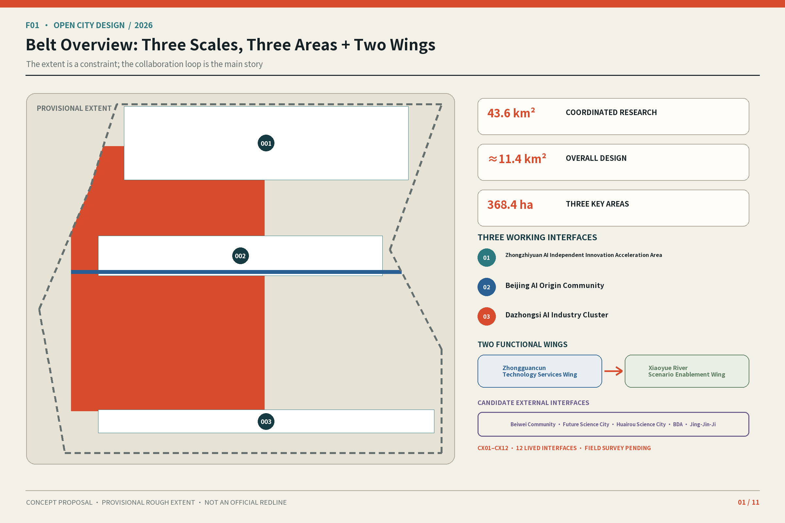

## Three-Level Scope Framework

### Overall concept, naming, and visual identity

“Jing-Zhang” anchors railway heritage, spatial continuity, and long-term public memory. “In Situ” has three meanings: people are present because residents, workers, and visitors can enter, understand, co-design, and appeal; evidence is present because sources, data status, test boundaries, and failures are visible; responsibility is present because operating roles, Human Takeover, and exit actions are not hidden behind a technical interface. The name denotes place-based improvement and does not imply that the proposal has been implemented.

The F06 Logo direction combines two parallel tracks, twelve transverse ticks, three solid nodes, and two open arcs, corresponding to the Jing-Zhang trace, twelve everyday cross-sections, Three Zones, and Two Wings. The open gap means that an interface can be entered and its rules revised. The Belt Logo provides overall identity; cultural wayfinding uses a separate hierarchy. Every production font, icon, and color asset requires path-level rights documentation; no company trademark or unauthorized railway mark may be used.[standard:PROJECT-AGENT-OPEN-CALL-TASKBOOK] [depth:overall_spatial_structure]

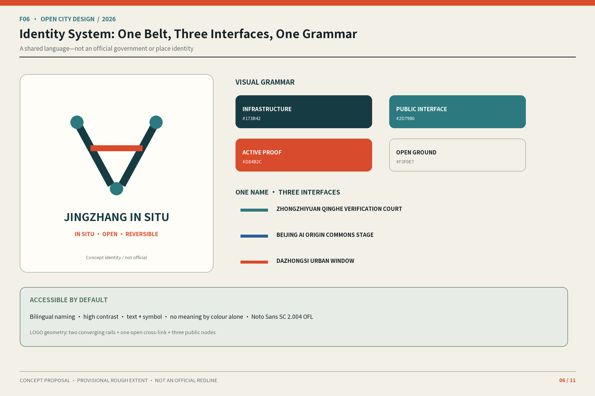

### Three Positionings, Five Functions, and Three Zones and Two Wings

The Three Positionings are the Centennial Jing-Zhang Cultural Belt, Urban AI Living Experience Belt, and AI Convergence Innovation Belt. The Five Functions are the Full-Stack Independent AI Innovation System, World-Class AI Innovation Ecosystem, new paradigm for AI-Enabled Scenarios, vibrant AI-enabled city, and global discourse on AI governance. Table T01 turns them into spatial and operating relationships rather than slogans.

| T01 Function | Primary conceptual carrier | Inspectable mechanism |
| --- | --- | --- |
| Full-Stack Independent AI Innovation System | Zhongzhiyuan AI Independent Innovation Acceleration Area | Controlled tests, validation records, safety reviews, and exit protocols |
| World-Class AI Innovation Ecosystem | Beijing AI Origin Community + Zhongguancun Technology Services Wing | Research matching, shared pilots, talent life, and candidate professional-service interfaces |
| New paradigm for AI-Enabled Scenarios | Xiaoyue River Scenario Enablement Wing + twelve cross-sections | Public co-testing, scenario admission, Human Review, and Low-Tech Alternatives |
| Vibrant AI-enabled city | Heritage park, community ground floors, and Dazhongsi station-city interface | Daily services, accessibility continuity, public trials, and correction |
| Global discourse on AI governance | Shared by the Three Zones | Open sources, visible status, public review, appeal, and stopping rules |

### Twelve Everyday Cross-Sections

The Coordinated Research Area asks how innovation chains and urban life can support one another. The Overall Design Area asks how the surroundings of the built heritage park could be renewed gradually. The Key-Area Detailed Design Area asks how individual interfaces could work. The north–south heritage park is the civic backbone; the twelve east–west everyday cross-sections are evaluation units pending field verification, not surveyed engineering alignments. Each cross-section must ultimately provide an As-Is–Plan–Section–Operations Four-Part Evidence Set covering crossings, accessibility, cycling, tree shade, ground-floor use, lighting, seating, maintenance, Human Help, and exit conditions. F04 initially shows only a typology and numbering rule; locations and performance thresholds await fieldwork.[depth:three_level_scope_framework] [data:geometry/key_areas.geojson#PROV-KEY-001]

CX01–CX12 and SC01–SC12 are separate ID systems. The spatial types are CX01 Riverfront R&D Interface; CX02 Campus–Heritage Park Gateway; CX03 R&D Court Public Interface; CX04 Campus Public Ground Floor; CX05 Research Translation and Shared-Pilot Interface; CX06 Talent-Life Service Street; CX07 Community–Park Stitch; CX08 Xiaoyue River Accessible Public-Experience Interface; CX09 Station Entrance–Park Connection; CX10 Station-City Public Living Room; CX11 Market–Culture Mixed Ground Floor; and CX12 Quiet Service and Care Interface. Every CX remains a type pending survey and invents no alignment, dimension, or performance value.

## Coordinated Research Area: Industry and Future City Research

### Comparative mechanisms from global cases

Table T02 uses seven registered background cases. It transfers only mechanisms for discussion, never numbers, statutory conclusions, partnership commitments, or images. A mechanism can become a local deepening recommendation only after site, institutional, and operational conditions are checked.

| T02 Source ID | Mechanism suggested by the background case | Question for this proposal |
| --- | --- | --- |
| CASE-SEOUL-AI-HUB-20250710 | Membership, staged PoC, resource vouchers, and follow-on project interfaces | How can a one-off test become a path with admission, review, and follow-on choices? |
| CASE-SINGAPORE-ONE-NORTH-20230703 | Research–industry–startup clustering, living labs, and public-space operation | How can research security, public access, and daily services coexist? |
| CASE-STATION-F-FAI-20260211 | AI partner alliances, cohorts, office hours, and graduated public/private access | How can a developer community and spatial access use distinct responsibility levels? |
| CASE-HELSINKI-MARIA-AREA | Heritage-building reuse, phased campuses, and shared facilities | How can heritage space enter an innovation network through gradual operation? |
| CASE-MILA-IMPACT-20211118 | Research–industry–public benefit, talent entrepreneurship, and responsible AI | How can public benefit and responsible governance sit inside the conversion chain? |
| CASE-DUBAI-FUTURE-ACCELERATORS | Challenge–pilot–evaluation, government testbeds, and regulatory-sandbox concepts | How can validation have Gates and stop conditions without implying a government commitment? |
| CASE-AMSTERDAM-MARINETERREIN | Reversible temporary use, phased opening, and experiment–review–exit cycles | How can a temporary spatial experiment restore the prior condition when it fails? |

Clustering, graduated access, and staged validation are compared through registered background sources.[source:CASE-SEOUL-AI-HUB-20250710] [source:CASE-SINGAPORE-ONE-NORTH-20230703] [source:CASE-STATION-F-FAI-20260211]

Heritage reuse and responsible AI remain background-only mechanism comparisons.[source:CASE-HELSINKI-MARIA-AREA] [source:CASE-MILA-IMPACT-20211118]

Challenge-based validation and reversible temporary use inform only Gates and exit design.[source:CASE-DUBAI-FUTURE-ACCELERATORS] [source:CASE-AMSTERDAM-MARINETERREIN]

### Ecosystem map and eight enabling elements

F07 organizes land, space, industry, funding, talent, compute, data, and scenarios into a gated cycle. A research question enters candidate service interfaces in the Zhongguancun Technology Services Wing. AI Origin organizes research matching, shared pilots, and talent-life support. Zhongzhiyuan hosts controlled testing, validation, and governance review. The Xiaoyue River Wing translates inspectable capabilities into public co-testing. Dazhongsi hosts product trials, market feedback, and international exchange. Complaints, failures, costs, and revision records return to the research end. Land, funding, and compute are conditions pending authorization and verification, not committed resources.[source:REPO-PROCESSED-FACT-PACK] [depth:overall_spatial_structure]

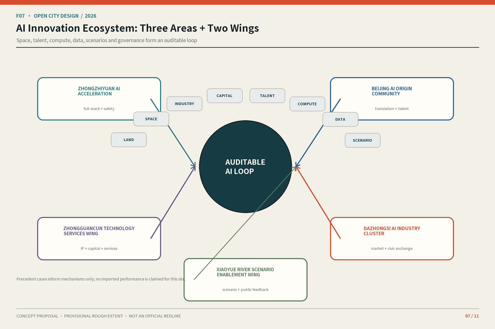

Beiwei Community, Future Science City, Huairou Science City, Beijing Economic-Technological Development Area, and the Beijing–Tianjin–Hebei region are candidate collaboration interfaces only. They frame possible discussions about talent life and community co-design, basic research and talent exchange, scientific facilities and research validation, manufacturing validation and industrialization, and cross-regional scenario reuse and standards exchange. Relationships, institutional authorization, data interfaces, and resource commitments remain unverified. F01 must draw them as a dashed “candidate interface” ring, not as an existing partnership network.

## Overall Design Area: Urban Renewal and Regulatory-Plan-Level Urban Design

The renewal framework uses three reversible verbs. **KEEP** retains buildings, mature trees, and everyday services only after surveys confirm their public value. **OPEN** makes park edges, courtyards, and ground floors accessible only where ownership, safety, and operating conditions allow. **INTENSIFY** first increases shared hours, mixed activities, and lightweight reversible components rather than presuming more floor area. F02 illustrates conceptual renewal actions, not building-by-building Demolish–Renovate–Retain decisions.[standard:MOHURD-CONTROL-DETAILED-PLANNING] [depth:retain_renovate_demolish]

The spatial framework combines the north–south heritage-park backbone, twelve east–west cross-sections, Three-Zone working nodes, and Two-Wing service networks. Provisional land-use partitions test relationships among public access, innovation services, everyday care, and blue-green continuity. Topological coverage proves only that the submitted layer closes without gaps; it does not prove statutory land use. Building content is limited to questions for professional deepening—public ground floors, transparency, setbacks, roof use, and reversible additions. FAR, height, density, and development capacity await official controls and building-level data.[data:geometry/land_use.geojson#LU-001] [depth:land_use_layout] [depth:development_intensity_controls]

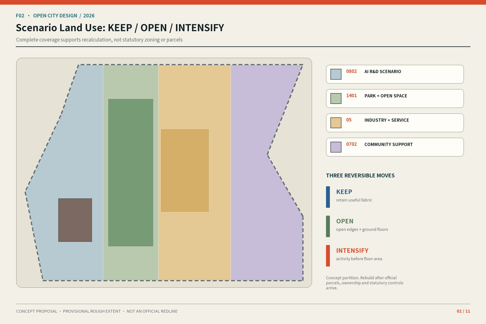

## Detailed Design of Key Areas

### Zhongzhiyuan AI Independent Innovation Acceleration Area

Its conceptual prototype is a “riverfront validation interface”: garden research units, a reversible display gallery, and a controlled test court organize SC01–SC04. The landmark, Zhongzhiyuan Qinghe Verification Court, displays test protocols, operating status, failure records, and Human Review. Its exact location, river-edge constraints, Fifth Ring Road connection, energy, and fire-safety conditions remain subject to professional verification; it makes no bridge, tunnel, shoreline, or engineering conclusion.

### Beijing AI Origin Community

Its conceptual prototype is an “open-ground-floor campus”: a walkable innovation loop connects research matching, shared pilots, talent life, and community services through SC05–SC07. The Beijing AI Origin Commons Stage supports open-source demonstrations, public questions, and correction. It is neither a corporate launch venue nor an official certification space. Opening ground floors depends on ownership, fire safety, operation, and accessibility.

### Dazhongsi AI Industry Cluster

Its conceptual prototype is a “four-quadrant station-city living room”: while prioritizing at-grade continuity, it organizes transfer guidance, public trials of AI-Native products, culture, and international exchange through SC09–SC12. The Dazhongsi Urban Window uses reversible exhibition and public-service interfaces first. It does not commit to underground connections, bridges, commercial recruitment, or alteration of existing buildings.

Each key area requires its own plan, representative section, scenarios, operating model, and risks; the three cannot reuse one generic wireframe. F03 must mark provisional boundaries, pending field surveys, and the conceptual status of each landmark.[depth:three_key_area_detailed_design] [data:geometry/key_areas.geojson#PROV-KEY-002] [metric:key_area_count]

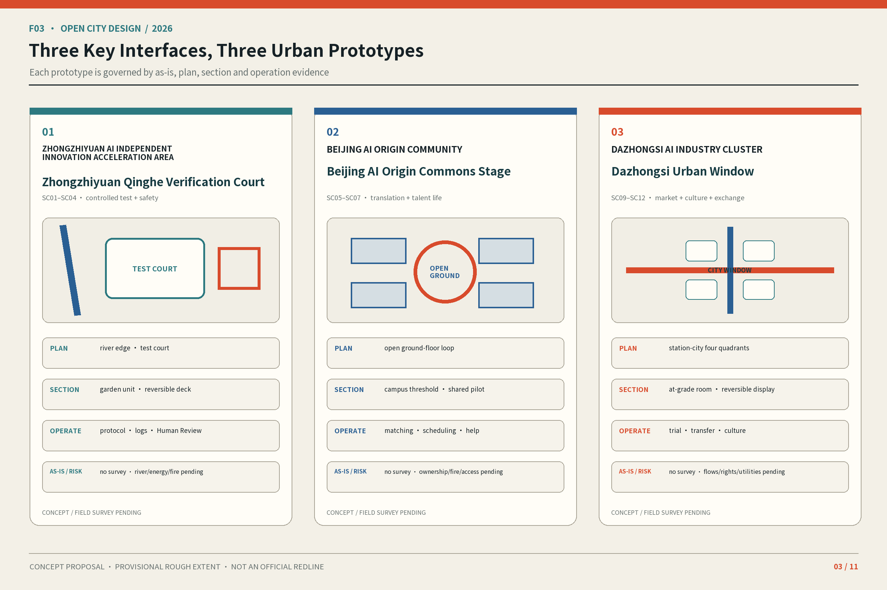

## AI Innovation Ecosystem, Personas, and AI+ Scenarios

### Seven personas

T03 uses roles rather than invented demographics: U1 research and R&D personnel; U2 startup and product teams; U3 operations, maintenance, safety-evaluation, and professional-review personnel; U4 residents, community workers, and nearby merchants; U5 children, caregivers, and educators; U6 older people, disabled visitors, and companions; and U7 international developers, professional visitors, and short-term participants. Every scenario provides Human Review, a Low-Tech Alternative, appeal, and stopping conditions.[source:DATA-SRC-AGENT-TASKBOOK-20260518] [depth:municipal_new_infrastructure]

### Twelve scenario cards

**SC01 Model Evaluation Sandbox (industry Testing and Validation Scenario, TVS-1).** The carrier is a controlled test court in Zhongzhiyuan for U1/U2/U3. It uses only public or rights-cleared benchmarks, synthetic data, and test logs. A proposed test-operations role manages admission, a safety specialist releases each test, and offline scripts are the fallback. It enters only when data rights, a test protocol, and a responsible person are present. It records protocol completion, anomalies, and Human Takeover, and stops for an unresolved safety issue, an invalid source, or an absent responsible person.

**SC02 Edge-Node Energy and Thermal-Safety Bench (industry Testing and Validation Scenario, TVS-2).** A controlled equipment bay in Zhongzhiyuan serves U1/U2/U3. It processes only telemetry from rights-cleared test equipment and makes no municipal-capacity inference. Professionals confirm energy, fire, and noise findings; manual instrument logs are the fallback. Testing begins only after power, cooling, fire-safety, and equipment permissions are confirmed. It isolates the equipment when a professionally defined limit is crossed, equipment fails, or logs are incomplete.

**SC03 Embodied-AI Accessibility Co-Test (industry Testing and Validation Scenario, TVS-3).** A closed test interface in the Xiaoyue River Wing serves U2/U3/U6. It collects only volunteered test tasks and environmental states and does not build identity profiles. An on-site safety marshal can take over immediately; a human-guided route is the fallback. Site permission, accessibility co-design, and a risk plan are entry conditions. A near miss, privacy complaint, or absent safety marshal stops the test.

**SC04 Open-Standard Co-Creation Desk.** This interface links Zhongzhiyuan and the Zhongguancun Technology Services Wing for U1/U2/U3/U7. AI summarizes only public standards, Issues, and objections and never creates a standard automatically. A facilitator confirms each item; a paper issue wall is the fallback. It enters when sources, facilitation, and recording rules are clear and exits for false attribution, rights problems, or absent maintenance.

**SC05 Research-to-Application Matching Clinic.** Located on a public ground floor in Beijing AI Origin, it serves U1/U2/U3. It uses only summaries volunteered for matching and public needs. A human adviser decides introductions; an appointment ledger is the fallback. It enters after both parties accept the data purpose and pauses for sensitive-data leakage, persistent mismatch, or an absent adviser.

**SC06 Shared Pilot Scheduling Assistant.** Located at a shared-pilot interface in AI Origin, it serves U1/U2/U3. It processes only published availability, capability tags, and application status and never controls equipment. A facility manager approves access; a manual booking sheet is the fallback. It enters when facility rules, eligibility, and responsibility are clear and reverts for unknown equipment conditions, permission conflicts, or system failure.

**SC07 Talent Life Navigator.** Connecting AI Origin with everyday cross-sections, it serves U1/U2/U4/U7. It uses public service information and volunteered preferences without sensitive profiling. Service staff review outputs; printed maps and human consultation are fallbacks. It enters when information has a maintenance date and responsible role and pauses when information is stale, discriminatory, or unmaintained.

**SC08 Accessible Route Companion.** Located along the twelve cross-sections and park backbone, it serves U4/U5/U6. It uses a barrier inventory pending field verification, public paths, and volunteered preferences without persistent identity tracking. Human Help Points and tactile/printed wayfinding are fallbacks. It may become public only after an accessibility audit and closes when route risk is unknown, errors accumulate, or help cannot be reached.

**SC09 Station-City Transfer Guide.** Located at Dazhongsi’s public station-city interface, it serves U4/U6/U7. It uses verified public transport information and does not issue traffic-safety commands. On-site personnel verify exceptions; a static station-city map is the fallback. It enters when public information and field review are in place and switches to static mode when real-time information is wrong, an emergency occurs, or Human Takeover is unavailable.

**SC10 AI-Native Product Public Trial Room.** Located in the Dazhongsi Urban Window, it serves U2/U3/U4/U7. It uses rights-cleared product descriptions and volunteered feedback and does not make purchases or induce authorization. A host supervises; paper feedback is the fallback. It enters only when safety, licensing, exit, and complaint channels are clear and withdraws for safety or rights disputes, misleading marketing, or unhandled complaints.

**SC11 Jing-Zhang Memory Co-Reading Guide.** Located at cultural nodes in the heritage park, it serves U4/U5/U6/U7. It uses only rights-cleared archives and consented oral submissions. A historical reviewer verifies content; physical text and audio transcripts are fallbacks. It enters when sources, rights, historical review, and accessible versions are complete and hides disputed or withdrawn material.

**SC12 Explainable Civic-Service Desk.** Located at public-service points in the Three Zones, it serves U4/U5/U6/U7. It cites published FAQs with sources and update dates and never makes final legal, medical, or fire-safety determinations. A staffed counter and telephone directory are fallbacks. It enters when a publisher, update responsibility, and referral path are clear and degrades when sources expire, a high-risk answer is wrong, or human service is unavailable.

T04 is the set of twelve structured scenario cards above. Every card retains conceptual status, users, carrier, AI role, minimum data, proposed operator role, Human Review, Low-Tech Alternative, appeal, entry condition, evaluation method, and exit action. F08 is a compact index using the same IDs and shows at minimum user/carrier, AI and data, operator and Gate, Human Review and evaluation, and exit action; it does not replace the full controls with names alone.[data:geometry/public_space.geojson#PUBLIC-001]

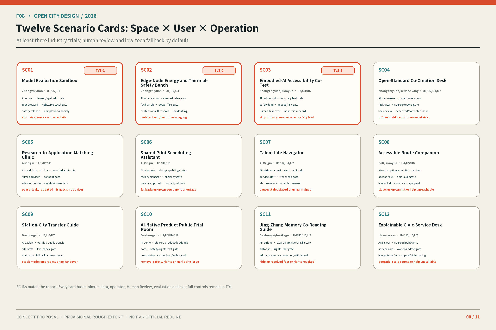

## Land Use, Building Scale, and Retain-Renovate-Demolish Strategy

Land use is a design scenario derived from provisional geometry, not an approved use. Park-facing interfaces prioritize public access, innovation buildings prioritize shared ground-floor services, everyday interfaces retain commerce and care, and river-facing interfaces maintain blue-green continuity. Each unit remains traceable to the structured layer, but a valid classification does not prove that the submitted condition is existing or approved.[standard:MNR-LAND-USE-CLASSIFICATION-GUIDE] [data:geometry/land_use.geojson#LU-002]

At building level, the proposal addresses only public ground floors, footprints, transparency, setbacks, roof use, and reversible components pending verification. The current footprint is a scenario recomputation from the submitted layer. Building-by-building KEEP / OPEN / INTENSIFY decisions await conditions, ownership, structure, fire safety, daylight, utilities, and heritage review. Failure of any prerequisite returns the action to a public-space or operating pilot; it does not create a demolition, alteration, or construction conclusion.[data:geometry/buildings.geojson#BLDG-001] [metric:building_footprint_area_sqm] [depth:height_massing_character]

## Transport, Rail, Municipal Infrastructure, and Public Services

The mobility priority is walking, accessibility, cycling, public-transport connection, and then necessary motor traffic. The north–south park route provides continuity; the twelve east–west cross-sections identify real barriers. At stations, legible at-grade movement and Human Help come before bridges, tunnels, or underground works. The roads layer is a conceptual network only and cannot establish capacity or safety without road boundaries, sections, demand, parking, and station-access data.[depth:traffic_rail_slow_parking] [data:geometry/roads.geojson#ROAD-001]

Small edge nodes may be combined with seats, shade, lighting, and status notices, but professionals must verify power, cooling, noise, cybersecurity, fire safety, drainage, and maintenance resources. SC02 telemetry cannot replace a municipal-capacity assessment. SC09 cannot direct emergency traffic. Every high-risk service must switch immediately to human or static mode.[depth:municipal_new_infrastructure]

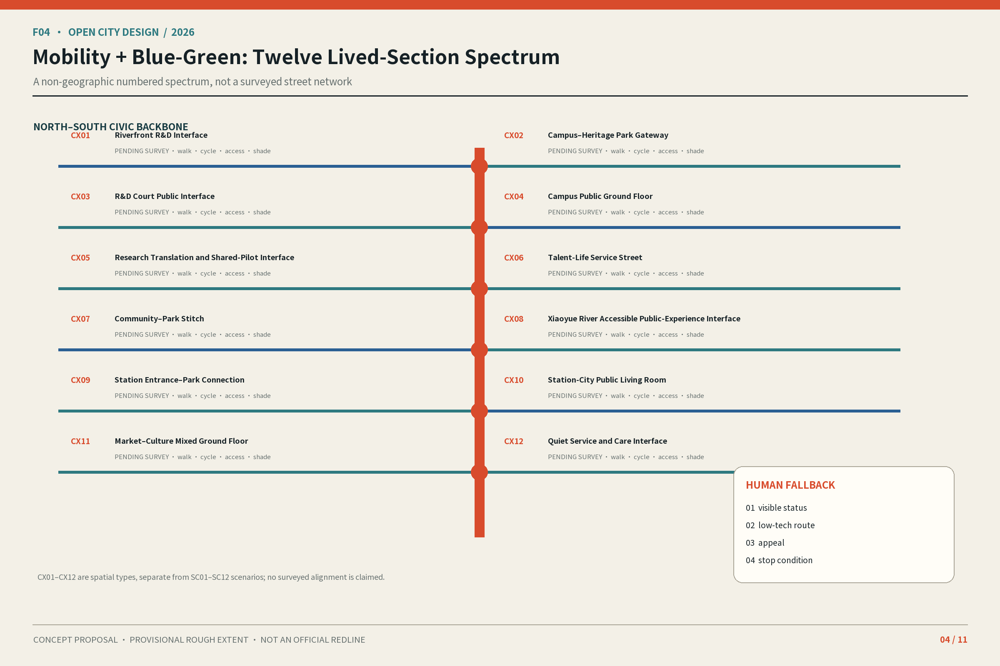

## Blue-Green Network, Public Space, and Urban Character

The Qinghe River, Xiaoyue River, Jing-Zhang Railway Heritage Park, and community tree shade form a cooling, walking, and social framework pending field verification. Green-space and public-space ratios are computed from submitted scenario layers and are not statutory ratios. Every cross-section checks tree canopy, stormwater, lighting, seating, tactile paving, and cycling conflict together. AI devices never substitute for basic public facilities.[depth:blue_green_public_space] [data:geometry/green_space.geojson#GREEN-001] [metric:green_ratio]

### Three landmarks, the Open Contribution Ledger, and component library

The three “pilgrimage landmarks” are public learning and responsibility interfaces, not entertainment attractions. Zhongzhiyuan Qinghe Verification Court publishes testing evidence. Beijing AI Origin Commons Stage supports open-source explanation and correction. Dazhongsi Urban Window connects product trials, culture, and Human Help. F09 also shows the Jing-Zhang Open Contribution Ledger, which records code and tools, data and evidence, scenario design, public service, maintenance and repair, accessibility co-creation, and cultural correction. Its status vocabulary is limited to Submitted, Reviewed, Adopted, Revised, and Withdrawn. Sponsorship, submission, or display is never automatically called an award.

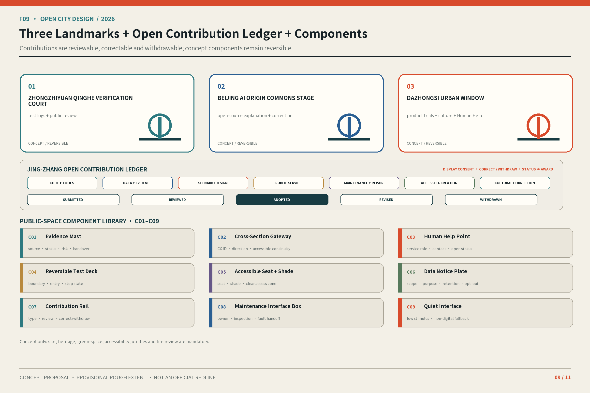

The Public-Space Component Library contains C01 Evidence Mast, C02 Cross-Section Gateway, C03 Human Help Point, C04 Reversible Test Deck, C05 Accessible Seat and Shade Unit, C06 Data Notice Plate, C07 Contribution Rail, C08 Maintenance Interface Box, and C09 Quiet Interface. Components specify functions, information hierarchy, accessibility, and operating responsibility only. Structure, power, fire safety, and constructability remain subject to professional deepening.

### Culture, wayfinding, and international communication

The cultural narrative is “Origins–Presence–Co-Creation.” Rights-cleared sources support Jing-Zhang railway history. Zhongguancun innovation culture is expressed through questions, experiments, discussion, failure, and iteration. New AI culture means visible sources, legible status, Human Takeover, correctable errors, and public appeal. The spatial sequence is “Track–Interface–Feedback”: heritage mileage is the track, the Three Zones and cross-sections are interfaces, and public feedback, failures, and revisions are feedback.

F10 divides wayfinding into five levels: Belt Logo, spatial orientation, cultural traces, scenario status, public service, and temporary events. Fixed status terms are “Conceptual Recommendation,” “Controlled Test,” “Paused,” “Human-Controlled,” and “Pending Site Verification.” “24H Human Service” must not appear without staffing evidence.

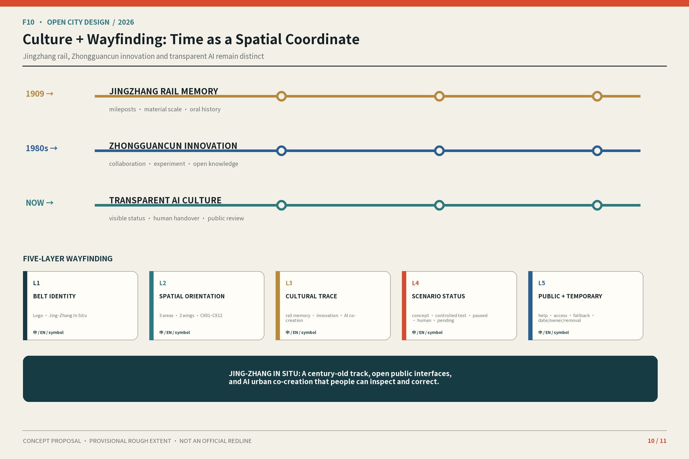

The international headline is: **“JING-ZHANG IN SITU: A century-old track, open public interfaces, and AI urban co-creation that people can inspect and correct.”** Every external communication must also show the proposal’s conceptual status and must not imply selection, approval, or construction.

## Renewal Projects, Implementation Policy, and Phasing

The near-term recommendation is limited to a data baseline, field surveys for twelve cross-sections, status and Human Takeover protocols, and reversible prototypes in the Three Zones. The medium-term recommendation may consider public ground floors, blue-green walking and cycling, the component library, and landmark pilots only after ownership and professional conditions are confirmed. The long-term stage may discuss capacity and permanent works only with support from regulatory planning, transport, municipal, and engineering studies. These phase names are not an approved schedule; Gates decide whether each item enters, is revised, or exits.[data:geometry/phasing.geojson#PHASE-001] [depth:phasing_implementation]

### Annual operation and conversion pathway

T05 is a proposed calendar: continuously maintain open Issues and the contribution ledger; hold a monthly Public Interface Walk; host a quarterly Verification Court Open Day; conduct a semiannual Public Accountability Review; and propose an annual Jing-Zhang In Situ Week and Global Urban-AI Interface Forum. Each event must produce records of questions, evidence, responsibility, complaints, and next actions. It is cancelled when no responsible role, site permission, or risk Gate exists. It is not a confirmed government programme.

The developer and Scenario Access process is: open challenge → rights check → data, ethics, and accessibility screening → match to Three Zones and Two Wings → controlled-test protocol → professional and human Gate → time-limited test → consented public demonstration → review → deepen, study replication, archive, or exit. The follow-through path for talent, enterprises, and developers is: first participation → contribution record → capability and need matching → candidate professional service → test-slot application → review material → candidate talent, enterprise, or research referral → voluntary follow-up. It promises no job, funding, procurement, office space, policy eligibility, or government endorsement. F11 shows the process and its stop branches.

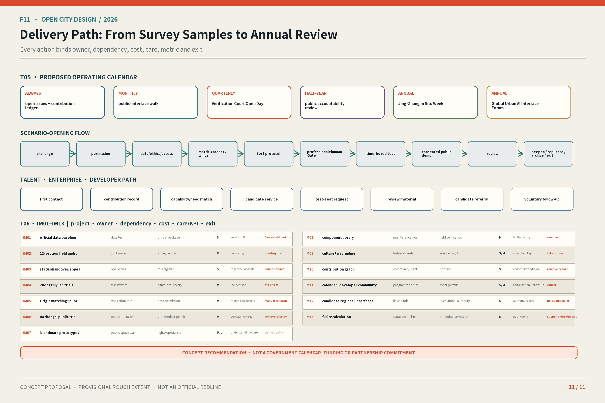

### Project implementation table

Cost uses only S (research, content, coordination, or lightweight components), M (site operation, reversible adaptation, or sustained staffing), and L (discussion only after official data and engineering deepening). No investment amount is claimed.

| T06 ID | Conceptual project | Proposed responsibility and prerequisites | Suggested window / maintenance / evaluation | Human Takeover and exit action |
| --- | --- | --- | --- | --- |
| IM01 | Official geometry and data baseline | Data-steward role + licensed professional team; official attachments required | Recheck on every source update; S; record versions and recomputation scope | Freeze derived metrics when sources conflict |
| IM02 | Field audit of twelve cross-sections | Urban design, transport, accessibility, and community co-design; survey permission required | Suggested 4–8 weeks plus seasonal review; M; record barriers and co-design feedback | Keep only a pending-survey list when permission or quality is insufficient |
| IM03 | Status, Human Takeover, and appeal protocol | Operations, ethics, legal, and accessibility roles; responsibility list required | Test before scenarios and review quarterly; S; record takeover, complaints, and revision | Stop service when a high-risk error or complaint cannot be closed |
| IM04 | Three Zhongzhiyuan industry-validation scenarios | Test operations, safety, and facility roles; ownership, fire, and energy conditions required | Time-limited controlled tests; M; record anomalies and stops | Stop when professional conditions or a responsible role are missing |
| IM05 | AI Origin matching and shared pilots | Research translation, facility, and talent-service roles; data rights required | Suggested 8–12-week service prototype; M; record matching, refusal, and correction | Revert to humans for leakage, persistent mismatch, or unknown facility conditions |
| IM06 | Dazhongsi product trials and Urban Window | Public operations, consumer-rights, and cultural roles; site and product permission required | Time-limited rotation with per-event maintenance; M; record exits and complaints | Withdraw for safety, rights, or misleading-marketing problems |
| IM07 | Three public-landmark prototypes | Urban design, culture, accessibility, and operating roles; ownership and professional conditions required | Paper or temporary prototypes first; M/L; record public understanding and maintenance | Do not implement when heritage, ecology, traffic, or ownership conditions fail |
| IM08 | Public-Space Component Library | Design, maintenance, accessibility, and information-governance roles; site verification required | Small reversible installation and monthly inspection; M; record failure and use | Remove when no maintainer exists, safety is obstructed, or accessibility fails |
| IM09 | Cultural wayfinding and international communication | History, translation, rights, and accessibility roles; sources and clearance required | Review before display and correct quarterly; S/M; record corrections | Remove disputed history, misleading translation, or withdrawn rights |
| IM10 | Jing-Zhang Open Contribution Ledger | Community operations, rights, and data-governance roles; contributor consent required | Maintain continuously and review semiannually; S; record status and withdrawal | Remove records without evidence, consent, or correction access |
| IM11 | Annual programme and developer community | Community, scenario, safety, and communication roles; permission per event | Approve item by item; S/M; record participation, follow-up, and cancellation | Cancel when responsibility, resources, or a risk Gate is missing |
| IM12 | Candidate external collaboration interfaces | Project liaison, research, and professional roles; institutional authorization required | Begin with a non-binding issue list; S; record authorization and interfaces | Do not call it a partnership without authority or evidence |
| IM13 | Full recomputation after official data | Data, planning, transport, municipal, and drawing teams; authoritative version required | Trigger on every authoritative change; M; record differences and hashes | Suspend publication of old metrics when versions conflict |

The complete machine fields behind T06 should also include related Agent task, spatial carrier, conceptual status, partner roles, approval and professional dependencies, metric-collection method, output evidence, rights and privacy, and unresolved items.[depth:renewal_project_list]

## Metrics, Area Recalculation, and Compliance Matrix

Known metrics are limited to values computable from submitted layers: provisional site area, scenario building footprint, scenario green-space ratio, scenario public-space ratio, and key-area count. F05 and every webpage must display provisional area at reasonable precision beside the phrase “recomputed from a provisional boundary.” Decimal precision cannot raise `confidence`. Statutory FAR, height, density, actual demand and parking, municipal capacity, enterprise and talent baselines, carbon reduction, and implementation performance remain “pending official data.”[metric:site_area_sqm] [metric:public_space_ratio] [depth:metrics_recalculation]

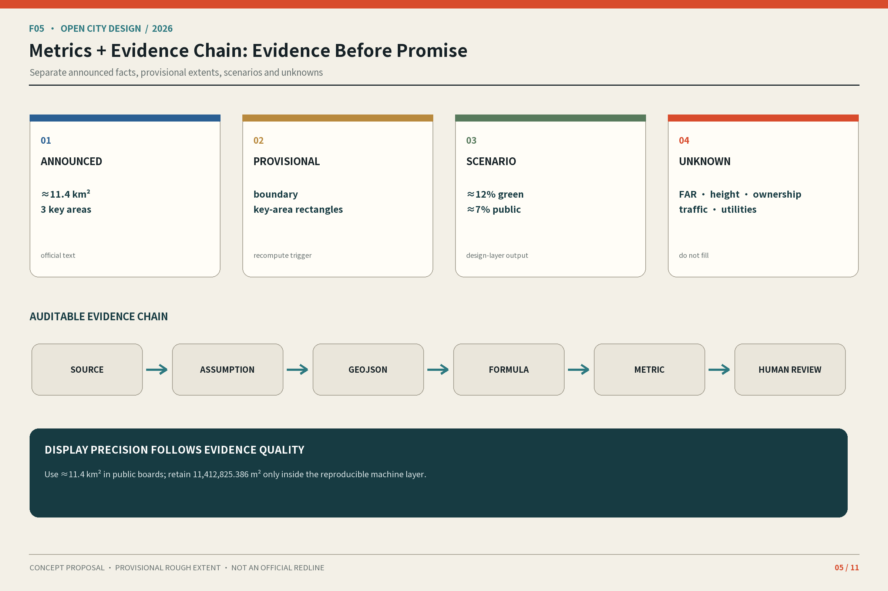

The Compliance Matrix must map agent.1–agent.6 separately to T01/F06, T02/F07, T03–T04/F08, F03/F09, F10, and T05–T06/F11. A repeated generic file list is not evidence. The professional-standard and design-depth matrices must also provide item-specific evidence summaries. `complete` means only that the relevant narrative, diagram, table, layer, and limitation are present; it does not mean real-world approval or engineering completion.[source:REPO-SOURCE-REGISTRY]

T07 is the manual bilingual-equivalence checklist. It compares chapter sequence, proper area names, claim strength, metric status, source markers, SC/IM identifiers, figure and table numbers, provisional-boundary language, and location within each figure. A generic English paragraph cannot substitute for a Chinese section.

## Risk, Copyright, and Compliance

External gaps include official geometry, controls and ownership, building conditions, roads and station interfaces, municipal, fire, and drainage capacity, heritage and ecological controls, and real enterprise, talent, and demand baselines. Internal risks include misreading provisional data as official, scenarios bypassing Human Review, signage overstating service capacity, activities being written as government commitments, English weakening key-area identities, and incomplete asset rights. The correct action is to suspend the affected claim, register the gap, wait for authorized data, and recompute—not to draw false precision or generate facts.[depth:risk_missing_data] [standard:MOHURD-URBAN-DESIGN-MEASURES]

The path-level rights ledger must cover the proposals, bilingual HTML, F01–F11, A3/A0, cover, fonts, icons, maps and data, code, and third-party libraries. It records author, source, license, tool or model, generation date, embedding and redistribution rights, and limitations. Any asset that cannot be cleared must be replaced or removed. The Open Contribution Ledger must also respect contributors’ consent, correction, and withdrawal rights.

People or professional teams with the relevant responsibility make all final medical, legal, fire-safety, transport-safety, structural, energy, and approval determinations. AI organizes traceable information and conceptual simulations only. Repository self-check success means that a package can enter further review; it does not mean selection, approval, publication, or implementation.

## References

Sources have four roles: the announcement and taskbook define tasks; local professional standards define depth; the public Source Registry controls permitted uses; and provisional geometry supports generation and recomputation only. The seven global cases are `background_only`: they support mechanism comparison but not local numbers, statutory conclusions, partnership commitments, or image reuse. Readers can trace claims through `sources.json`, `assumptions.json`, `metrics.json`, GeoJSON, and the three matrices.[source:REPO-PROCESSED-FACT-PACK] [standard:MOHURD-ARCH-DESIGN-DEPTH-2016]

Every spatial, scenario, identity, activity, and collaboration idea in this proposal is an open co-creation recommendation for professional teams to deepen. It does not replace formal planning and does not constitute a government decision or resource commitment.
