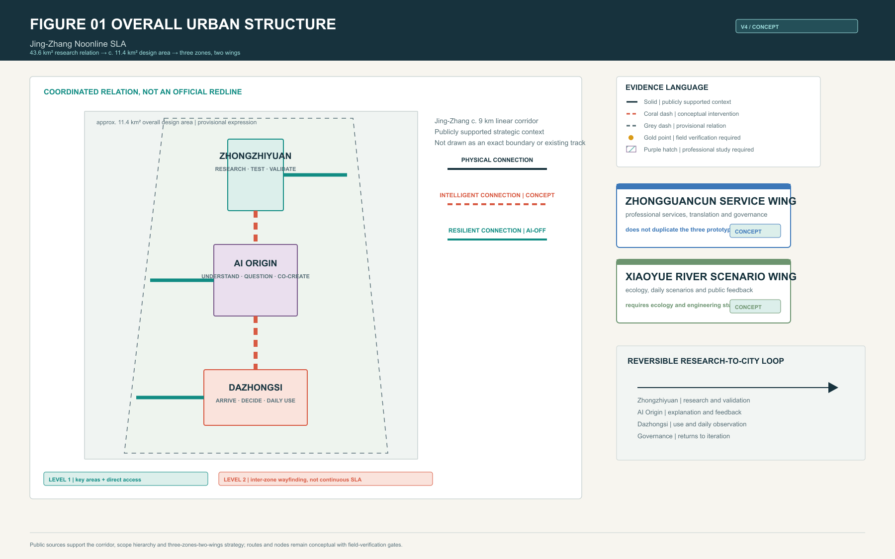
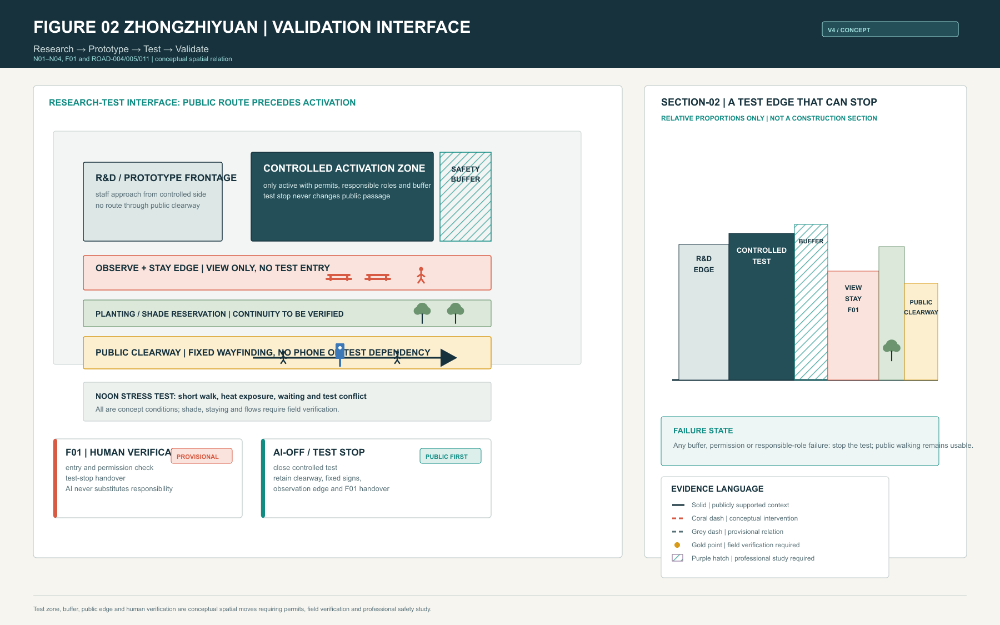
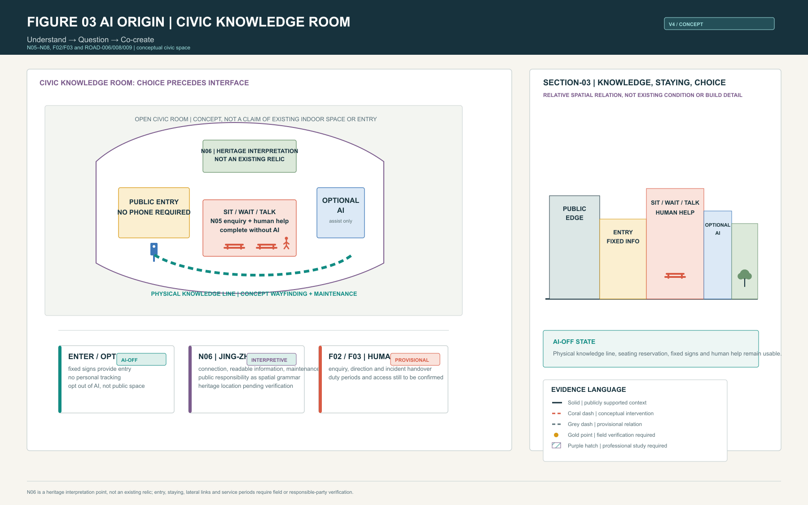
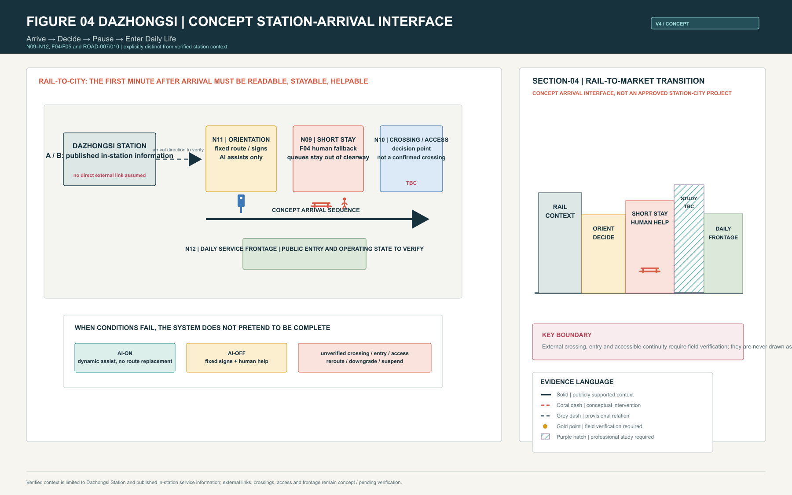
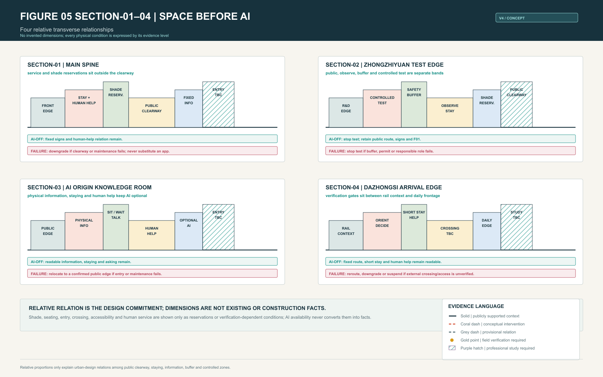
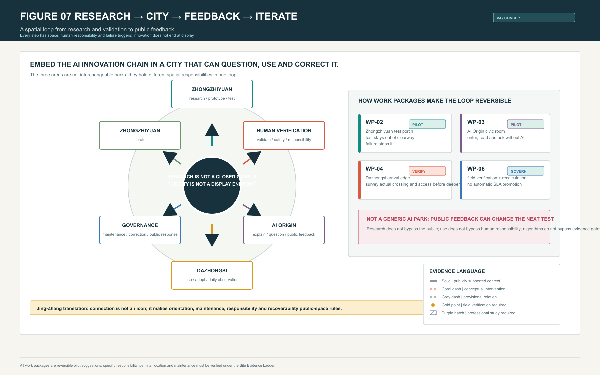
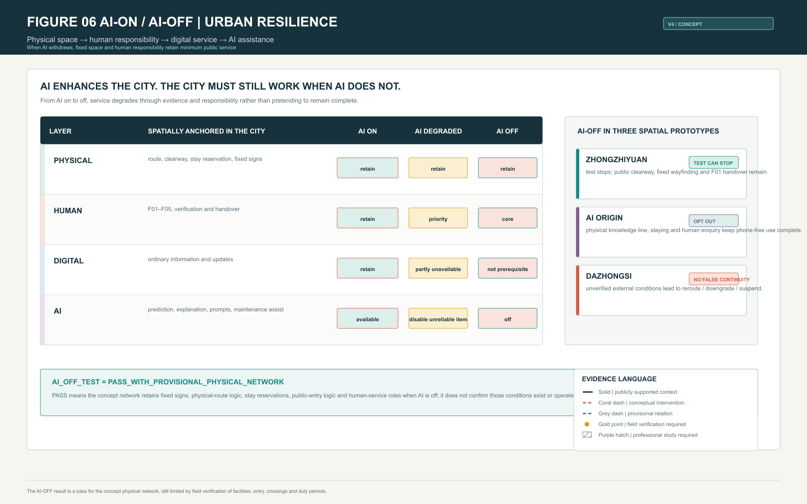
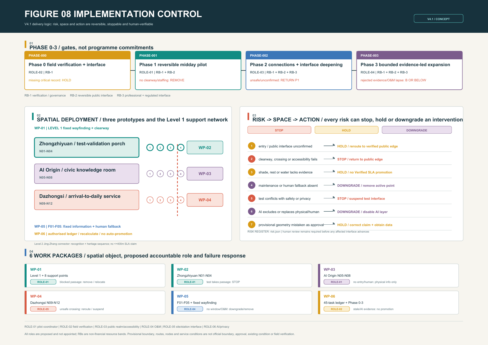

# Jing-Zhang Noonline SLA

> **Treat noon as an urban stress test: AI can enhance a route, but no one should lose an enterable, stayable and helpable public path because they have no phone, no screen, or an offline AI service.**

## 1. The Problem

An AI city can mistake being visible to an algorithm for being usable by a person. Noon is a small but candid test window: short walks, heat exposure, waiting, wayfinding, water, rest, crossings and temporary failure occur together. A public route that works only when phones, prediction, booking or test systems work is not reliable urban service.

**Noonline SLA** establishes readable, walkable, stayable and human-handover public space first. AI then adds prediction, explanation, alerts, maintenance support and dynamic adjustment. AI is never a prerequisite for public service [standard:PROJECT-AGENT-OPEN-CALL-TASKBOOK] [standard:BARRIER-FREE-ENVIRONMENT-LAW].

## 2. Noon as an Urban Stress Test

Noon compresses three urban conflicts into one period: heat and short trips, research testing and ordinary walking, rail arrival and daily service. The design therefore does not aim to recommend a smarter route. It organizes observable conditions: the public clearway is not occupied by queues, equipment or tests; staying, shade, water and information have clear reservations; and entry, crossing, accessible detour and human responsibility are verified before implementation.

400 m is a participant-authored design target for **Level 1 service zones**. It is neither existing corridor-wide coverage nor a statutory standard. Level 2 inter-zone connectors carry orientation, the public Jing-Zhang narrative and basic AI-OFF wayfinding; they do not claim continuous SLA service [assumption:A-SLA-DESIGN-TARGETS-001] [assumption:A-GEOMETRY-DERIVED-METRICS-001].

## 3. Why Jing-Zhang

The c. 9 km Jing-Zhang Railway Heritage Park corridor and the three-zones-two-wings structure are publicly stated strategic context. The opened first phase of the heritage park and the protected former Tsinghuayuan station provide a real railway heritage setting [source:EXT-SRC-JINGZHANG-PARK-20230630] [source:EXT-SRC-QINGHUAYUAN-STATION-20260214]. The proposal does not invent existing tracks or relics in the three focal areas. It translates Jing-Zhang into three public-space rules:

1. **Physical connection**: route, staying and orientation must remain intelligible without an algorithm.
2. **Intelligent connection**: AI sits on top of an existing public order and helps explain and maintain it.
3. **Resilient connection**: a failed test, device, entry or service must trigger a visible stop, downgrade, reroute or human handover.

Jing-Zhang is therefore not an applied historical image. It is a spatial discipline of connection, maintenance, responsibility and recovery.

## 4. Overall Spatial System

43.6 km² is a coordinated research relationship among industry, ecology, rail and public service; c. 11.4 km² is the overall design area. Both are taskbook scale descriptions. Submitted geometry remains provisional and is never an official boundary or regulatory-plan redline [source:DATA-SRC-OFFICIAL-ANNOUNCEMENT-20260509] [source:DATA-SRC-PROVISIONAL-BOUNDARIES-20260605].

The system uses 11 concept LineStrings, 12 primary service nodes, 8 secondary supports and 5 manual fallback points. It connects three distinct prototypes in a reversible research → public → market → feedback loop:

- **Zhongzhiyuan**: Research → Prototype → Test → Validate.
- **AI Origin**: Understand → Question → Co-create.
- **Dazhongsi**: Arrive → Decide → Pause → Enter Daily Life.
- **Zhongguancun service wing**: professional service, translation and governance interface, not a duplicate district.
- **Xiaoyue River scenario wing**: ecology, daily scenarios and public-feedback interface, requiring ecological and engineering study.

## 5. Zhongzhiyuan: Research → Test → Validate

Zhongzhiyuan is not a generic technology plaza. It is a research-validation interface where **testing can be seen but public right of way cannot be taken away**. Ordinary pedestrians use a separate public clearway; observers stay on a public observation edge; testing happens only in a concept activation zone separated by a safety buffer; researchers enter from a controlled side. F01 is not an existing service desk. It is the future human responsibility location for permission checks, exceptional handover and test stopping.

The key spatial moves are:

- Separate controlled test, buffer, observation/stay edge, planting/shade reservation and public clearway as readable bands.
- Make test stop an ordinary capability: when the controlled zone closes, fixed signs, public route, observation edge and human handover remain.
- Make research testing observable without bringing the public across equipment, permission or operational boundaries.

Test permission, safety dimension, existing equipment, public entry and actual shade remain unconfirmed by field or professional evidence; every item is shown as a conceptual intervention or field-verification requirement [assumption:A-CONTROLS-001].

## 6. AI Origin: Understand → Question → Co-create

AI Origin is not an AI showroom. It is a civic knowledge room in which the public retains choice. The public entry uses fixed information readable without a phone. N06 is a **heritage interpretation point** about Jing-Zhang connection, maintenance and public responsibility; it must not be read as an existing relic. N05 supports sitting, waiting, talking and human enquiry. AI is optional prediction and explanation at the side; opting out of AI does not mean opting out of the space.

The key spatial moves are:

- Use a physical knowledge line to connect entry, reading, staying, asking and exit rather than replacing place with screens.
- Place seating, fixed signs, human help and optional AI separately, so use never requires login.
- Translate Jing-Zhang culture into readable and maintainable everyday information rather than inventing a heritage object.

Public sources support the strategic role of AI Origin and the Jing-Zhang corridor context, but do not confirm the depicted entry, lateral links, seats or relic location. These conditions remain design inference or field verification [source:EXT-SRC-JINGZHANG-PARK-20230630] [assumption:A-HERITAGE-SEQUENCE-001].

## 7. Dazhongsi: Arrive → Decide → Pause → Enter Daily Life

Dazhongsi does not claim to connect a station exit directly to the proposal. It makes the first minute after rail arrival readable, stayable and helpable through a **conceptual station-arrival interface**. Verified context is limited to Dazhongsi Station, its A/B entrances and published in-station accessibility service information [source:EXT-SRC-DAZHONGSI-STATION-202605]. The scheme proceeds from N11 orientation, through N09 short stay and F04 human fallback, to N10 crossing/accessibility decision and an N12 daily-service frontage.

The key spatial moves are:

- Draw arrival → orientation → short stay → crossing/accessibility decision → daily service frontage as a legible decision sequence.
- When external crossing, entry, accessible path or duty period is unverified, state reroute / downgrade / suspend instead of pretending station-city continuity.
- Turn a high-frequency business-noon transfer into a public interface for short pause, wayfinding and human handover.

External crossings, legal passage, continuous accessible route, public entries and operating retail frontage all require field verification or study by transport, accessibility and operational professionals [assumption:A-ACCESSIBLE-ROUTE-001].

## 8. SECTION-01–04 / Space Before AI

Four sections turn a “route” back into usable urban relationships rather than an algorithm path: frontage, stay/service zone, planting or shade reservation, public clearway, fixed information, human help, optional AI, safety buffer and controlled zone each have a position. Dimensions are relative or `TBC after field survey`; none pretend to be construction sections.

## 9. Research → City → Feedback → Iterate

The innovation chain is not a one-way display chain. Zhongzhiyuan takes research, prototype and controlled testing; human verification takes safety, evidence and responsibility; AI Origin takes explanation, questioning and public feedback; Dazhongsi takes actual daily use and adoption; governance takes maintenance, correction and public response back into the next research loop. WP-02, WP-03, WP-04 and WP-06 make this a reversible sequence of pilots.

## 10. Noonline / AI-OFF

Noonline follows **Physical → Human → Digital → AI**. When AI is on, it can predict crowding, explain routes, flag service state and assist maintenance. When AI degrades, unreliable recommendations stop. When AI is off, fixed wayfinding, physical-route logic, stay reservations, public-entry logic and human-service roles still provide the minimum public service.

`AI_OFF_TEST = PASS_WITH_PROVISIONAL_PHYSICAL_NETWORK`. It is a pass for the concept network’s physical and human logic when AI is off. It does not confirm that seats, water, entries, crossings or human service exist or operate today [data:visual/assets/noonline-sla-test-results.json#AI_OFF_TEST].

## 11. WP-01–06 / Reversible Implementation Packages

| WP | WHERE / primary spatial object | Proposed accountable role | Resource band | Verification gate and stop condition |
| --- | --- | --- | --- | --- |
| WP-01 | Level 1 spines in three areas and eight support points | public-space pilot coordinator | RB-1 / RB-2 / RB-3 | If legal walking, clearway or maintenance interface is not recorded, or passage is blocked, remove or relocate |
| WP-02 | Zhongzhiyuan N01–N04 and validation porch | public-space pilot coordinator | RB-1 / RB-2 / RB-3 | If permission, buffer or public bypass is unconfirmed, stop the test-facing interface |
| WP-03 | AI Origin N05–N08 and civic knowledge room | public-space pilot coordinator | RB-1 / RB-2 | If entry, content maintenance or human enquiry is absent, withdraw the interactive layer and retain authorised physical information only |
| WP-04 | Dazhongsi N09–N12 and arrival transition | site or station-interface custodian | RB-1 / RB-2 / RB-3 | If crossing is unsafe, detour inaccessible, entry non-public or duty absent, use verified public edge or suspend the connection claim |
| WP-05 | five concept manual-fallback points and fixed wayfinding | operations and maintenance custodian | RB-1 / RB-2 | If service window, sign, facility maintenance or human role is absent, downgrade or remove the activated point |
| WP-06 | 45 field-ledger tasks and Phase 0–3 | authorised field-verification lead | RB-1 / RB-3 | If evidence is missing, stale, rejected or AI-written, retain or downgrade Verified SLA and never auto-promote |

This iteration adds a concept implementation-control register linking six work packages to six to-be-appointed role types, three non-financial resource bands, four phase decisions and seven risks. These roles are not appointed actors and the bands are not budgets. They establish the delivery interface that must be completed by Phase 0/1: who can verify, who can stop and who can maintain. RB-1 covers verification and governance, RB-2 reversible public interface, and RB-3 professional deepening for traffic, accessibility, heritage and engineering; none implies funding, land right, procurement, permit or governmental commitment [data:risk.json#concept_roles] [data:risk.json#resource_bands].

Figure 08 puts this delivery control directly on the A3 and A0 sheets: phase gates above; work-package spatial deployment across the three areas and nodes at left; seven risk-to-space-to-action controls at right; and proposed accountable roles plus failure responses for all six work packages below. It shares the same WP, ROLE, RB, RISK and PHASE identifiers as `risk.json`; every role remains `not_appointed` and every spatial condition remains `concept_design_not_field_verified`. Delivery logic is not drawn as an approved project.

The control-object counts are explicit and reviewable: six work packages and six concept role types [metric:implementation_work_package_count] [metric:implementation_concept_role_count]; three resource bands and seven stoppable risks [metric:implementation_resource_band_count] [metric:implementation_stoppable_risk_count]. These counts measure delivery-control completeness, not investment scale or actual operating capacity.

The work packages remain conceptual, reversible pilot suggestions with no fabricated investment, schedule, land-right, approval or governmental commitment. Every phase now carries its proposed role, resource bands, gate and stop condition, and every work package points to specific roads, nodes and ledger tasks [data:geometry/phasing.geojson#PHASE-000] [data:risk.json#work_packages].

## 12. Evidence, Metrics and Verification

**Target SLA** is the intended design grade. **Verified SLA** is the grade current evidence can support. The Engine result remains: SLA-A = B, SLA-B = C and SLA-C = C. Missing any critical item among field-verified shade continuity, continuous exposure, real node location, water/seat state, public entry, key crossing, summer detour and human-service hours blocks promotion to A [data:visual/assets/noonline-sla-report.json#routes].

The register separates two gates: whether a component can enter its next phase, and whether an SLA claim can be promoted. The first needs an interface, clearway, maintenance and safety record; the second still requires all 18 mandatory human field-evidence tasks for SLA-A. Even a locally workable pilot cannot lift the current Verified SLA while a critical heat, entry, crossing, accessibility or human-fallback record remains absent. This prevents one event, interface or algorithm score from being read as corridor-wide service capacity [metric:sla_a_mandatory_verification_task_count] [data:risk.json#risks].

| Evidence level | How this proposal uses it |
| --- | --- |
| Level A — Publicly supported | The published Jing-Zhang corridor, three zones/two wings, task roles, heritage-park phase and Dazhongsi’s published in-station service information form context. |
| Level B — Design inference | Routes, nodes, space bands, work packages and AI-OFF mechanism are conceptual interventions. |
| Level C — Field verification required | Entry, crossings, external accessibility, shade, water, seats, publicness, retail status and human-service hours. |
| Level D — Professional study required | Heritage controls, traffic safety, station-city integration, robot-test permission, engineering, rights, approval and implementation. |

Submitted provisional geometry computes an approximately 11,412,825.386 sqm concept range. It is an internal recalculation workflow only and does not replace the publicly stated c. 11.4 km² design area [metric:site_area_sqm] [metric:official_overall_design_area_sqm].

Green and public-space indicators are likewise recomputable concept geometry, not an existing survey or statutory control [metric:green_ratio] [metric:public_space_ratio].

## Sources, Risks and Copyright

All figures, PDFs and HTML are generated locally from public or cleared material, submitted concept GeoJSON and locally generated diagrams. They load no remote basemap, font, script or API. Where official boundary, regulatory GIS, facility inventory, microclimate measurement, public-entry data, external crossing and accessible-route survey are unavailable, the proposal remains `provisional / concept_design / not_field_verified`; visual completeness never substitutes for evidence [source:SOURCE-REGISTRY] [assumption:A-PROVISIONAL-BOUNDARY-001].

## Design Basis and Source List

The proposal relies on the public taskbook, public station information, public Jing-Zhang Heritage Park material, applicable standards snapshots and repository-cleared provisional geometry. The taskbook supplies the 43.6 km² research relationship, the c. 11.4 km² overall-design scale and the three-zones-two-wings roles; it does not supply official GIS suitable for a redline, construction extent or facility inventory. Source records limit each item to context, design inference or a verification lead. `sources.json`, `assumptions.json` and the drawings record those limits together. The design therefore treats noon public-service usability as an urban question, never turning a webpage, concept GeoJSON or AI inference into a site fact [source:DATA-SRC-OFFICIAL-ANNOUNCEMENT-20260509] [source:EXT-SRC-JINGZHANG-PARK-20230630] [assumption:A-PROVISIONAL-BOUNDARY-001].

## Three-Level Scope Framework

The coordinated research level studies relationships among industry, rail, ecology and public service across 43.6 km². The overall-design level organizes the corridor, three zones, two wings and implementation interfaces at the publicly stated c. 11.4 km² scale. The key-area level proposes checkable spatial prototypes only for Zhongzhiyuan, AI Origin and Dazhongsi. These are not three unrelated drawings: the first explains why research, public explanation and daily use form one loop; the second organizes Level 1 service zones and Level 2 connectors; the third places clear walking, staying, human help, buffers and failure state into spatial bands. Every submitted boundary is provisional and requires recalculation once official geometry is available [metric:official_overall_design_area_sqm] [data:geometry/site_boundary.geojson#PROV-SITE-001].

## Coordinated Research Area: Industry and Future City Research

Future-city research is not a row of AI firms beside a corridor. It includes how research enters public life, how people can question it and how it exits safely during failure. Zhongzhiyuan hosts research, prototypes and controlled validation; the Zhongguancun service wing provides professional-service, translation and governance interfaces; AI Origin enables explanation, questions and public feedback; Dazhongsi supports high-frequency daily use; and the Xiaoyue River scenario wing connects ecology, daily scenarios and feedback. The research area therefore frames Research → Prototype → Test → Validate → Demonstrate → Use → Feedback → Governance → Iterate, not a commitment about any enterprise, land right or development sequence [depth:industrial_ecosystem] [standard:PROJECT-AGENT-OPEN-CALL-TASKBOOK].

## Overall Design Area: Urban Renewal and Regulatory-Plan-Level Urban Design

The overall design uses 11 concept LineStrings, 12 primary nodes, 8 secondary supports and 5 manual fallback points to describe a readable, stayable, helpable and downgradeable noon public-service network. Level 1 applies the participant-authored 400 m target only within the three service zones and direct access segments. Level 2 provides orientation, the Jing-Zhang narrative and basic AI-OFF wayfinding, without claiming continuous SLA coverage. Renewal actions focus on public frontage, walkability, service reservation and reversible pilots. They do not present concept parcels, buildings or roads as regulatory redlines or approved works. Regulatory planning, traffic, fire, municipal and accessibility decisions require later calibration with official data and professional study [data:geometry/roads.geojson#ROAD-001] [assumption:A-SLA-DESIGN-TARGETS-001].

## Detailed Design of Key Areas

Zhongzhiyuan juxtaposes a public clearway, observation/stay edge, safety buffer and controlled test activation so research can be observed without taking public right of way. AI Origin combines a physical knowledge line, sit-wait-talk space, human enquiry and optional AI into a civic room usable without a phone. Dazhongsi organizes arrival, orientation, short stay, crossing or accessibility decision and daily-service frontage as a conceptual station-city transition. They respectively carry validation, public explanation and daily adoption, and cannot substitute for each other. Specific entries, existing seats, water, shade, external connections and operating hours remain conceptual or field-verification conditions; detailed design must follow site, heritage, traffic and operation findings [depth:key_area_design] [data:geometry/public_space.geojson#N01] [assumption:A-CONTROLS-001].

## AI Innovation Ecosystem, Personas, and AI+ Scenarios

The proposal does not address one generic “AI user.” It serves ordinary pedestrians, short-time noon users, observers, researchers, rail arrivals, maintainers and human-service responsibility roles. AI can assist test-status explanation in Zhongzhiyuan, voluntary knowledge interpretation and feedback at AI Origin, and dynamic alerts or maintenance at Dazhongsi. It does not replace fixed signs, public clearways, human help or reroute judgement. Each scenario retains a physical route for opting out of AI, and an exception triggers stopping, downgrade, reroute or human handover. AI+ is therefore a limited improvement to explainability, maintainability and accountability, rather than a screen added to public space [depth:ai_scenarios] [data:visual/assets/noonline-sla-test-results.json#AI_OFF_TEST].

## Land Use, Building Scale, and Retain-Renovate-Demolish Strategy

Submitted land-use and building geometry expresses design roles, public frontage and research relationships only. It provides no statutory parcel, FAR, building scale, demolition quantity or ownership conclusion. The Zhongzhiyuan controlled-test band, AI Origin civic room and Dazhongsi daily-service frontage should first be pursued through reversible, maintainable interface improvements rather than assumed major new construction. Building frontage is a relative relationship for information, staying, service or controlled entry in the sections. Retention, renovation, demolition, structural work, fire egress and heritage treatment must follow ownership, survey, heritage and engineering study. Concept areas are internal recalculation material and cannot be promoted as delivery metrics [data:geometry/land_use.geojson#LU-001] [data:geometry/buildings.geojson#BLDG-001].

## Transport, Rail, Municipal Infrastructure, and Public Services

The transport strategy begins with legible walking and the first minute after rail arrival. A public clearway must not be occupied by testing, queues or equipment; turns, pause, crossing decisions and human help need fixed information and visible responsibility. Dazhongsi Station A/B exits and published in-station accessibility information are real context, but do not prove an external legal crossing, continuous accessible route, public entry or municipal condition. Shade, water, seating, lighting, drainage, accessibility, fire safety and human service progress through reservation, verification and professional study. If verification fails, the system must reroute, downgrade or suspend rather than maintain an unsupported service grade [source:EXT-SRC-DAZHONGSI-STATION-202605] [assumption:A-ACCESSIBLE-ROUTE-001].

## Blue-Green Network, Public Space, and Urban Character

The noon stress test brings heat exposure, short walking, waiting, hydration and staying into one public-space judgement. Blue-green work is therefore not decorative: planting and shade are service-band reservations, stay points must remain outside the clearway, and information plus human help need visible locations. Jing-Zhang culture is not represented by copied tracks or ornaments. It enters the interface as rules for continuity, readability, maintenance and recovery when systems fail. Existing tree canopy, water, microclimate, seating and facility condition have not been surveyed, so drawings never show concept reservations as completed ecological facilities [data:geometry/green_space.geojson#GREEN-001] [assumption:A-MICROCLIMATE-001].

## Renewal Projects, Implementation Policy, and Phasing

WP-01 to WP-06 are minimum viable, stoppable and upgradable packages, not a string of vision labels. Each now has a primary spatial object, proposed accountable role, resource bands, start gate, traceable field tasks, acceptance gate and stop response. Phase 0 appoints an authorised verification role and records interfaces; Phase 1 runs reversible pilots only at confirmed interfaces; Phase 2 permits professional work on public realm, accessibility, transport, heritage and engineering only where the interface is confirmed; Phase 3 expands in a bounded way only where responsibility remains sustainable and evidence remains auditable. Roles and resources here are to-be-delivered concept interfaces, not funding, schedules, land rights, approvals or governmental promises. A pilot that blocks public passage, cannot be maintained, creates safety risk or loses critical evidence must stop, relocate or downgrade; expansion follows complete human verification only [data:geometry/phasing.geojson#PHASE-000] [data:risk.json#phases] [assumption:A-FAILURE-RESPONSE-001].

## Metrics, Area Recalculation, and Compliance Matrix

The metric system separates design targets, concept-geometry-derived values and current verified status. The 400 m threshold is a Level 1 design target, not corridor-wide existing coverage. Concept geometry can recount 11 routes, 12 primary nodes, 8 secondary supports and 5 manual fallbacks, but cannot prove that facilities exist. Target SLA is A while the Engine verifies SLA-A as B, SLA-B as C and SLA-C as C under current evidence. Missing critical field evidence cannot promote the claim. `metrics.json`, the compliance matrix, standard matrix, design-depth matrix and Engine preserve a machine-readable evidence chain; this narrative explains how it shapes spatial judgement [metric:design_target_service_node_spacing_m] [data:visual/assets/noonline-sla-report.json#routes].

## Risk, Copyright, and Compliance

The central risk is not an incomplete image. It is mistaking a provisional boundary, concept node, public in-station information or algorithm output for an existing, approved or buildable fact. The Site Evidence Ladder therefore separates publicly supported context, design inference, field verification and professional study; solid, dashed, verification and study marks express that distinction visibly. The implementation-control register turns that boundary into seven stoppable risks: public interface; clearway and accessibility; heat/rest/water; maintenance and human fallback; test safety and privacy; AI exclusion; and treating provisional geometry as approval control. All drawings, PDFs, HTML and offline interaction use only local package files plus public or cleared material. They load no remote map, font, API, personal data or uncleared asset. Traffic safety, heritage, rights, engineering, permits and public responsibility remain decisions for the appropriate professional and governing bodies [source:SOURCE-REGISTRY] [data:risk.json#risks] [assumption:A-SITE-EVIDENCE-LADDER-001].

## References

This package does not dress a concept line up as a real project. The public taskbook and source registry support only the coordinated scale, the three-zones-two-wings relationship and the Jing-Zhang cultural context; provisional boundaries and concept spatial layers support design expression and recalculation only. Site routes, external crossings, accessibility, canopy, service hours, property, permits, funding and named implementation bodies must still be obtained independently. Therefore every `Verified` state may be recorded only by an authorised human verifier with an auditable record, and AI may not automatically promote `unknown`. Precedents extract public-interface principles only; they do not prove regional cooperation or replicable delivery conditions. The brand graphic is likewise participant-authored concept work, and any future installation still requires rights, material and approval confirmation. This boundary allows the proposal to discuss space, governance and testing together without exceeding the capability of public material [source:SOURCE-REGISTRY] [assumption:A-PROVISIONAL-BOUNDARY-001] [metric:field_verification_unknown_task_count].

## 13. V4.2 Taskbook Deliveries: Open, Not Overclaimed

### 13.1 Global precedents and regional exchange interfaces

The following is not a list of confirmed partners and does not copy projects into Haidian. It separates transferable public interfaces from local conditions that must still be verified. The evidence level, limitation and translation for CASE-01–06 are in `visual/assets/v4_2-agent_delivery_index.json#precedents`; every regional relationship is a **conceptual exchange interface / pending formal coordination**.

| ID | Precedent or reference | Transferable public interface | Limited local translation |
|---|---|---|---|
| CASE-01 | Barcelona Superblock public realm [source:EXT-SRC-CASE-01-BARCELONA-SUPERBLOCK-20210202] | Official material supports street-to-public-space transformation for everyday use; this proposal takes only a walk-and-stay-first lesson | No traffic control, dimensions or delivery conditions are transferred |
| CASE-02 | Singapore Punggol Digital District [source:EXT-SRC-CASE-02-PUNGGOL-DIGITAL-DISTRICT] | JTC material supports proximity among research, education, industry and community interfaces | A research-public-interface reference only; no land, finance, district or institutional cooperation is claimed |
| CASE-03 | Tokyo Shibuya public wayfinding practice [source:EXT-SRC-CASE-03-SHIBUYA-PUBLIC-SIGN-20250515] | Shibuya City material supports unified, easy-to-understand and multilingual public signs | It does not certify accessibility; Dazhongsi external legal crossing and continuous access remain to be field verified |
| CASE-04 | Toronto Quayside / Sidewalk Labs public-governance review [source:EXT-SRC-CASE-04-WATERFRONT-TORONTO-DSAP-20190910] | The official independent commentary supports public questions, review boundaries and public-interest scrutiny of digital governance | The commentary was preliminary; only explanation, independent review and human appeal are retained |
| CASE-05 | Helsinki open urban testbed [source:EXT-SRC-CASE-05-TESTBED-HELSINKI] | The official city platform supports companies and RDI actors proposing and conducting tests in real urban settings through specific arrangements | It proves no local cooperation, procurement or site access; permission, data and safety checks come first |
| CASE-06 | Public Jing-Zhang Railway Heritage Park context [source:EXT-SRC-JINGZHANG-PARK-20230630] | Official public material supports the c. 9 km corridor, reported first phase and public-space/active-travel context | No existing focal-area relic, precise boundary or intervention location is invented |

**Regional synergy framework (RS-01–05):** Beiwai Community is a daily-public-question and feedback interface; Future Science City is a research-question and explainable-test interface; Huairou Science City is a science-communication and talent-dialogue interface; Beijing E-Town is a manufacturing/deployment-learning and safety-review interface; Jing-Jin-Ji is an annual-theme and cross-city-learning interface. Each may exchange only five non-sensitive public outputs: `knowledge` methods, `test` de-identified protocols, `talent` public talks/mentor time, `event` public themes, and `governance` stop/appeal templates. Data, finance, property, facility access and personnel commitments remain unknown until a named body and lawful document confirm them [assumption:A-CONTROLS-001].

### 13.2 Ecology-industry relationship and component library

Ecology is not a backdrop to industry. EIM-01 canopy/shade–noon heat–staying; EIM-02 rainwater/drainage–accessibility–wet-weather detour; EIM-03 public clearway–test buffer–research observation; and EIM-04 knowledge room–public question–governance feedback form the ecology-industry relationship. They are conceptual links to green-space, public-space, road and verification-ledger layers; they do not prove existing canopy, drainage capacity or engineering feasibility.

The CL-01–06 component library is reversible concept hardware, not a procurement list: CL-01 fixed bilingual wayfinding; CL-02 low-height evidence plaque; CL-03 phone-independent rest/water reservation; CL-04 test buffer and stop sign; CL-05 human-fallback handover point; CL-06 rain/heat detour information. Every component must preserve the clearway, be readable AI-OFF, be maintainable and be removable. Dimensions, materials, fire, accessibility, property and approvals remain for specialist and field verification.

#### agent.2 Land–Space–Industry–Funding–Talent–Compute–Data–Scenario mechanism matrix

This is not a list of secured inputs. It is the common `agent.2` index from taskbook requirement to implementation gate. Full bilingual fields, spatial objects, WP/SC/IV links and source/assumption references are in `visual/assets/v4_2-agent2-eight-element-mechanism-matrix.json#elements`. Every `ROLE` remains unappointed, every real condition remains `unknown`, and AI has no promotion authority.

| Element | Spatial interface | Concept mechanism / ROLE | Evidence and phase gate | STOP / HOLD / DOWNGRADE |
|---|---|---|---|---|
| ELEM-01 Land | PROV-KEY-001–003 and concept land_use | reserve public interfaces, temporary-use triggers and parcel checks; ROLE-05/03 | concept/provisional; verify title, publicness and controls at PHASE-000 before deepening | HOLD and retain only the provisional diagram when title, permission, lawful access or controls are absent |
| ELEM-02 Space | Level 1, N01–N12, eight support points and F01–F05 | clearway, stay, fixed guidance and human fallback first; ROLE-01/03/04 | not field verified; verify AI-OFF legibility and maintenance through PHASE-000–003 | STOP/reroute on passage, crossing or access failure; DOWNGRADE without maintenance |
| ELEM-03 Industry | three-area nodes, SC/IV and RS-01–05 | research → bounded test → public explanation → daily feedback → CONV-01; ROLE-01/04/06 | permission-gated concept; PHASE-001–003 requires test window, bypass and safety/privacy review | STOP when testing occupies public space or lacks permission; HOLD conversion without body and operating commitment |
| ELEM-04 Funding | PHASE-000–003 and WP-01–06 | phase-triggered future public-interest procurement, pilot resources and lifecycle maintenance; no budget stated; ROLE-01/04/05 | finance unknown; activate only with lawful funding/procurement and maintenance record | HOLD when funding, procurement, property or maintenance responsibility is undocumented; remove unsupported service claims |
| ELEM-05 Talent | N01, N05, N06, N08 and EVENT/DEV | public talks, mentor windows, verifier training and minimum-test protocols; ROLE-02/04/06 | partners unknown; PHASE-001–003 requires named host, public access and rights record | HOLD without host, access or content rights; STOP any activity that breaches consent, privacy or clearway |
| ELEM-06 Compute | optional AI at N01/N05/N07/N09 | define edge/cloud interface, availability and failure degradation only; no compute is claimed; ROLE-06/04 | compute agreement unknown; security, energy/interface, monitoring and AI-OFF exercise before activation | disable AI when compute, security, audit or responsibility fails; retain physical and human service |
| ELEM-07 Data | 45-task ledger, 18 SLA-A items and N01–N12 | provenance–time–location–verifier–validity ledger; exclude identity, faces and uncleared data; ROLE-02/06 | unknown until human verified; task-specific gates through PHASE-000–003 | remain unknown/DOWNGRADE if missing or stale; STOP/reject AI-written or prohibited personal data |
| ELEM-08 Scenario | SC-01–10, IV-01–03 and N01–N12 | bind scenario to public bypass, human fallback, permitted window, evidence gate and stop authority; ROLE-01/02/05/06 | concept/not approved; PHASE-001–003 requires named stop authority | STOP for safety/privacy failure, HOLD without permission/evidence, DOWNGRADE to fixed information when AI/operations fail |

### 13.3 Complete SC-01–10 scenario cards

Every card is a concept scenario rather than an open service. Its unique ID, node, evidence level and Chinese equivalent are indexed in `visual/assets/v4_2-agent_delivery_index.json#scenario_cards`.

| ID | Scenario and space | Optional AI layer | Human / AI-OFF fallback | Industry-test boundary |
|---|---|---|---|---|
| SC-01 | N01 before a Zhongzhiyuan test starts | crowd forecast | F01 fixed stop sign and human explanation | IV-01, permitted window only |
| SC-02 | N02 noon shade and stay | heat notice | fixed shade/rest instruction | no data collection, no activation |
| SC-03 | N03 public-entry enquiry | bilingual Q&A | fixed map and human handover | IV-02 entry-access verification |
| SC-04 | N04 crossing decision | risk notice | physical direction and reroute | HOLD when unverified |
| SC-05 | N05 civic question | optional explanation | F02 human enquiry | IV-03 explanation/appeal record |
| SC-06 | N06 Jing-Zhang interpretation | low-sensitivity interactive narrative | fixed cultural wayfinding | no invented relic or facial recognition |
| SC-07 | N07 night/rain/heat detour | optional dynamic notice | static night/wet-weather board | DOWNGRADE without lighting/maintenance evidence |
| SC-08 | N08 public-entry event day | optional queue notice | human routing and physical queue line | permitted event window only |
| SC-09 | N09 short stay after arrival | arrival information | F04 human help | no continuous-service claim without verified external interface |
| SC-10 | N10–N12 crossing to daily frontage | optional path prompt | fixed reroute/suspend sign | IV-02; SUSPEND if legality or accessibility is unknown |

The industry-validation scenarios are restricted subsets of SC-01/03/05: IV-01 public clearway non-occupation, IV-02 entry/crossing/accessibility evidence integrity, and IV-03 human appeal and AI switch-off. They collect no personal identity and never auto-promote a test result into deployed service.

### 13.4 P-01–05 personas and inclusive responses

| ID | Need and barrier | Spatial response | Human fallback | AI-OFF response |
|---|---|---|---|---|
| P-01 older pedestrian | heat, rest and complex turns | stay reservations and low-height large-type fixed signs | F02/F04 direction and rest help | segment-by-segment physical information |
| P-02 disabled person | uncertain ramps, lifts and continuous access | mark unverified points as reroute, never call a concept line accessible | authorised person verifies an alternative | physical direction and human explanation; stop the promise if unknown |
| P-03 child caregiver | crossing, short stay and queue safety | separate clearway and test buffer with visible stay edge | human routing and help point | fixed graphics and stop signs, not algorithm commands |
| P-04 non-Chinese speaker | language, symbols and asking for help | Chinese-English text, pictograms and destination symbols | F02/F04 basic human direction | numbered arrows and non-colour-only symbols without screens |
| P-05 night/extreme-weather user | sun, standing water, unknown lighting/hours | rain-heat detour and physical unavailable-service notice | activate human point only in declared service window | static detour remains; HOLD/DOWNGRADE without verification |

### 13.5 H-01–04 landmarks/honour displays and Noonline SLA identity

H-01 Connection Gauge at N01 explains the public clearway; H-02 Evidence Desk at N05 explains Target/Verified; H-03 Maintenance Archive at N06 narrates Jing-Zhang maintenance responsibility; H-04 First Arrival Minute at N11 explains the right to pause and reroute. These are **conceptual interpretation or honour-display nodes**, not existing heritage, official awards or confirmed property locations.

The Noonline SLA logo is “a public line that does not break when the screen disconnects”: two parallel clearway strokes join at a legible human-handover point; the open interval means AI can exit while public right of way remains. LOGO-01 is the horizontal mark and LOGO-02 the narrow-screen/node symbol. Minimum size is 18 mm in print and 64 px on screen; clear space is 0.5 mark-height. It must not be stretched, rotated, recast as an official emblem, cover a provisional warning, communicate safety by colour alone, or sit beside unlicensed railway/government/corporate marks. Hierarchy: Level 1 Jing-Zhang cultural wayfinding (place/direction, not this project brand); Level 2 Noonline SLA (service rule); Level 3 Evidence Legend (Target/Verified/unknown); Level 4 event sub-brands (EVENT-01–03). The mark is participant-authored geometric linework with no third-party trademark, photograph or restricted asset; rights and generation source are recorded in `visual/assets/v4_2-brand_identity.json`.

### 13.6 Annual events, developer community and long-term conversion

EVENT-01 Noon Stress-Test Week rehearses AI-OFF only in permitted public windows; EVENT-02 Evidence Open Day explains Target/Verified and the appeal path with a human host; EVENT-03 Jing-Zhang Maintenance Dialogue publishes public maintenance questions. DEV-01 developer community follows: question registration → minimal test protocol → human/public review → stop or review → publishable method. It may not upload personal data, bypass approval or turn a demonstration into routine operation. CONV-01 is a conceptual conversion funnel: public issue → compliant pilot application → independent review → named-body/finance/property/O&M documents → sustainable operation. Missing next-stage evidence means HOLD; AI cannot advance it.

### 13.7 Implementation evidence and bilingual audit

`visual/assets/v4_2-implementation_verification_matrix.json` connects WP-01–06, all 45 FV tasks and the 18 mandatory SLA-A items to PHASE, ROLE, format, validity, threshold, stop authority and HOLD/DOWNGRADE response. Every task remains `unknown` at baseline; only an authorised human verifier with auditable evidence may change it, and AI cannot write promotion. `visual/assets/v4_2-bilingual_equivalence_checklist.json` compares every number, metric, ID, evidence level, Target/Verified state, warning, figure and taskbook output with the same locatable section in both languages.

Primary public material includes the Haidian planning authority’s call and taskbook scale statement; the Beijing Municipal Government’s public information on the Jing-Zhang Railway Heritage Park first phase and c. 9 km corridor; Beijing Subway’s public page for Dazhongsi Station A/B exits and in-station accessibility service; the Beijing Cultural Heritage Bureau’s protection information for the former Tsinghuayuan station; and the repository’s registered standards, data and source registry. Each citation is governed by the source ID, date, allowed use and limitation recorded in `sources.json`. Public material supports only the context it expressly states; it never replaces official GIS, field survey, facility audit, permission or approval [source:EXT-SRC-JINGZHANG-PARK-20230630] [source:EXT-SRC-DAZHONGSI-STATION-202605] [source:EXT-SRC-QINGHUAYUAN-STATION-20260214].
