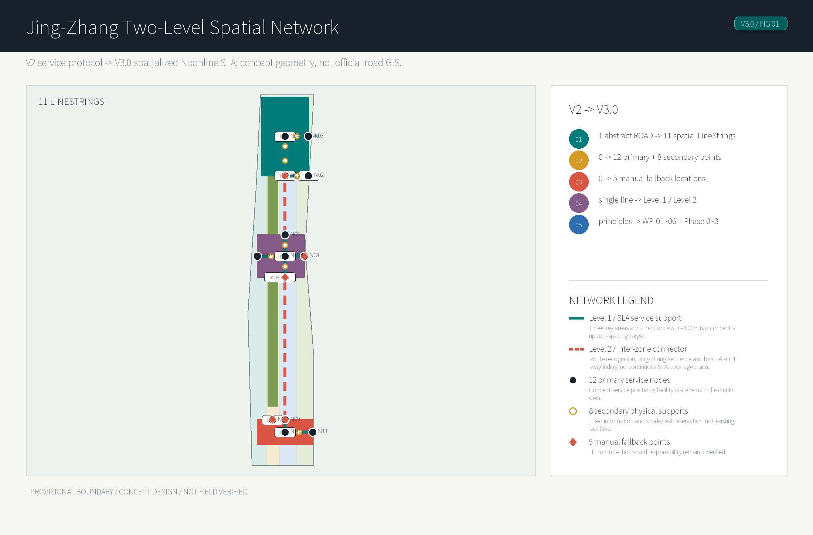
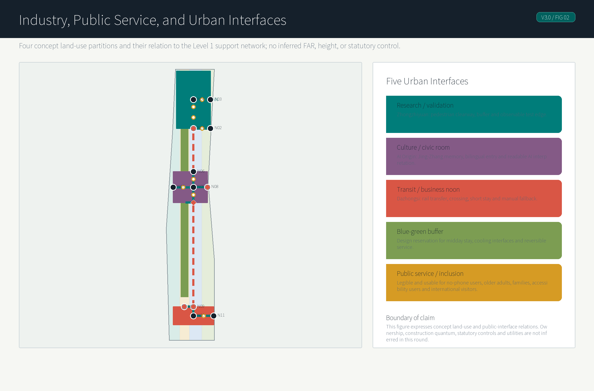
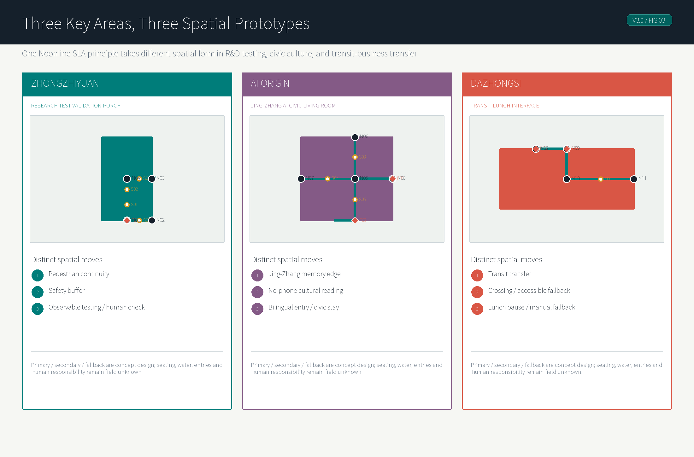
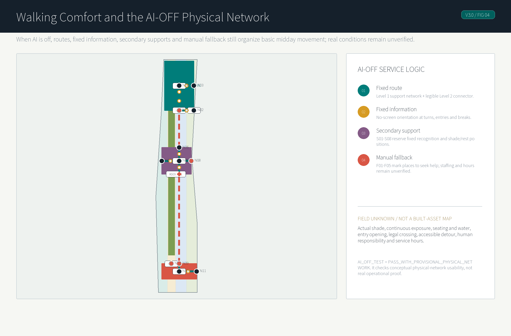
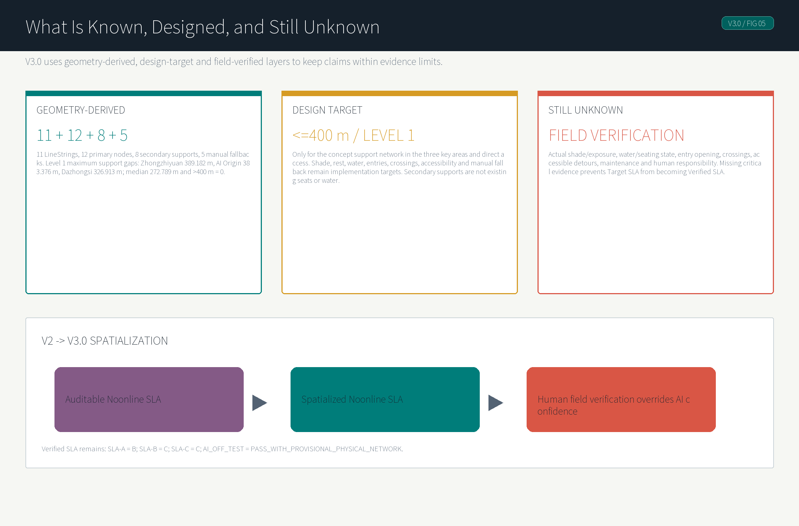

# Jing-Zhang Noonline SLA / Midday Service Line

This proposal treats the AI Innovation Belt not as a collection of brighter screens, but as a public-service contract for the most ordinary and under-designed daily window: 11:30-14:30 on workdays, when researchers, visitors, nearby residents, service workers and campus users move between lunch, meetings, metro access, short rest and informal collaboration. Noonline SLA means "noon online sensing plus no-online fallback": AI may forecast heat, rain, congestion, detours and service queues, but the public realm must still provide visible shade, seats, water, wayfinding, staffed help and accessible alternatives [source:DATA-SRC-AGENT-TASKBOOK-20260518] [standard:BARRIER-FREE-ENVIRONMENT-LAW].

The concept intentionally avoids repeating peer ideas that already focus on shade, cool routes, climate adaptation or general walkability. It therefore does not use the similar "cool-walk" naming space; it shifts the emphasis to a measurable midday service level, human fallback, public testing and governance. Population evidence is also used carefully: Haidian's 2020 census reports 69.7% of residents aged 15-59, 18.5% aged 60 and above, 56.5% with college education or above, and 35.7% non-local permanent residents. This supports a mixed-user service check, not a claim about exact 2026 site users [source:EXT-SRC-HAIDIAN-CENSUS-20210608].

## V3.0: From Auditable Protocol to Spatialized Network

V2 established the evidence boundary, `Target SLA / Verified SLA`, AI-OFF and the field-verification workflow. V3.0 does not raise any verified grade; it puts the same logic into urban space. One abstract service reference is expressed as 11 parseable concept LineStrings, while 12 primary service nodes, 8 secondary physical supports and 5 concept manual-fallback points organize how people walk, pause and seek help without a phone. Every object retains a `concept_design` / `not_field_verified` evidence boundary [data:geometry/roads.geojson#ROAD-001] [data:geometry/public_space.geojson#PUBLIC-001] [metric:secondary_support_point_count].

The spatialization adds no ordinary AI feature. Instead, AI failure becomes a design constraint: residents, older adults, accompanying children, accessibility users, no-phone users, park workers, domestic visitors and international visitors should all complete basic midday movement through physical routes, fixed bilingual information, reserved stopping space and human help. AI is limited to prediction, explanation, dynamic adjustment and maintenance support; professional field verification always overrides AI confidence [standard:BARRIER-FREE-ENVIRONMENT-LAW] [assumption:A-FIELD-VERIFICATION-WORKFLOW-001].

## Design Basis and Source List

The evidence base has three layers. The official announcement and site package provide the project name, three-level scope, approximate 11.4 km2 overall design area, three key areas and deliverable depth. The agent taskbook adds requirements for naming, AI ecosystem, scenario cards, personas, landmarks, cultural narrative and long-term operation. Public standards and policy snapshots define the boundary for urban design, regulatory-plan-level claims, land-use codes, generative-AI service governance and accessible human fallback [source:DATA-SRC-OFFICIAL-ANNOUNCEMENT-20260509] [source:DATA-SRC-AGENT-TASKBOOK-20260518] [standard:MOHURD-URBAN-DESIGN-MEASURES].

The spatial package uses repository-maintained provisional rough boundaries only as generation and visualization constraints. `geometry/site_boundary.geojson` and `geometry/key_areas.geojson` are explicitly marked as provisional constraints and must not be read as official redlines, road redlines, cadastral boundaries or precise area evidence. When official CAD/GIS files are released, the areas, drawings and HTML metrics must be recalculated as a full set [data:geometry/site_boundary.geojson#SITE-001] [source:DATA-SRC-PROVISIONAL-BOUNDARIES-20260605].

The only added external population source is Haidian's public seventh-census bulletin. Its role is district-level context: Haidian is not a single-purpose research park, but a complex urban district where young researchers, commuters, visitors, children, older adults and accessibility needs overlap. It does not support site-population, time-of-day demand or boundary claims [source:EXT-SRC-HAIDIAN-CENSUS-20210608] [assumption:A-CENSUS-SCOPE-001].

## Three-Level Scope Framework

The coordinated research area of about 43.6 km2 asks how a midday service system can become public infrastructure for an AI Innovation Belt. It links universities, research institutes, parks, communities, rail stations and the Jing-Zhang heritage park as one daily-use network, rather than treating the three key areas as isolated renewal islands [depth:three_level_scope_framework] [source:DATA-SRC-OFFICIAL-ANNOUNCEMENT-20260509].

The overall design area of about 11.4 km2 is the Noonline SLA test field. V3 expresses the service reference axis as 11 parseable concept LineStrings: three `JZ-MAIN` spine segments, a Zhongzhiyuan service-zone spine, Zhongzhiyuan/AI Origin/Dazhongsi access segments, plus transverse connectors and crossing interfaces. They are a design network for urban-design testing and recalculation, not official road GIS or an inventory of existing walking facilities. The network has two levels: Level 1 is the SLA service zone in the three key areas and their direct access segments; Level 2 is the concept connector between key areas, carrying route recognition, the Jing-Zhang cultural sequence and basic AI-OFF wayfinding only, without claiming continuous `<=400 m` service coverage. SLA-A is the target continuous-stay spine within Level 1, with Target SLA = A but current Engine Verified SLA = B; SLA-B governs short transverse access, and SLA-C governs station-to-park touchpoints. Together they address lunch movement, research meetings, rail-to-park access, visitor arrival and short rest [data:geometry/roads.geojson#ROAD-001] [metric:noon_sla_corridor_count] [metric:level1_sla_service_zone_count].

The key detailed-design scope of about 368.4 hectares contains the Zhongzhiyuan AI autonomous innovation acceleration area, Beijing AI Origin Community and Dazhongsi AI industry cluster. They are not treated as copies of each other: the north section focuses on R&D and validation, the middle section on origin display and open community, and the south section on consumption, business and visitor service. All key-area polygons remain provisional [data:geometry/key_areas.geojson#PROV-KEY-001] [data:geometry/key_areas.geojson#PROV-KEY-002] [data:geometry/key_areas.geojson#PROV-KEY-003].

## Coordinated Research Area: Industry and Future City Research

The industry logic is to move AI enterprise service from closed meeting rooms to legible urban interfaces. Park teams need lunch-hour meetings, temporary work, visitor reception, demonstration space, compliance consultation and scenario testing; the city needs AI public value that people can understand. Noonline SLA combines those needs into service levels, but the levels are formed by observable spatial conditions rather than a pure AI score: shade continuity, sit-able rest, drinking water, accessible public rooms or service points, crossing waiting space, limited summer detour, and visible staffed fallback [depth:overall_spatial_structure] [metric:noon_service_node_count].

Global cases are used as mechanisms, not formal copies: Kendall Square for university-enterprise proximity, Toronto Waterfront for data-governance caution, Paris Rive Gauche for rail-corridor redevelopment, Singapore one-north for research-life mixing, Seoul Digital Media City for display and consumption interfaces, London King's Cross for long-term renewal operation, and Shenzhen Hetao for cross-boundary collaboration. Together they point toward open scenarios, public compliance and everyday experience [source:DATA-SRC-AGENT-TASKBOOK-20260518].

The future-city research priority is low-intrusion AI. The proposal uses public alerts, equipment status, service tickets, anonymized crowd levels, staff patrols and voluntary user feedback. It does not use faces, personal phone traces, payment data, private company records or non-cleared operational material. Any generated guiding or recommendation content must retain complaint, correction and human-review channels [standard:GENERATIVE-AI-INTERIM-MEASURES] [assumption:A-PRIVACY-001].

## Overall Design Area: Urban Renewal and Regulatory-Plan-Level Urban Design

The structure is "one line, three sections, twelve primary service nodes, five concept manual-fallback points and two service levels." The one line is the route and spatial-narrative spine along the heritage park; the three sections are the northern validation section, the middle origin-community section and the southern consumption-business section; the twelve primary nodes organize midday service. The five concept manual-fallback points mark future locations for wayfinding, accessibility enquiry, human direction-giving, water support and event-day order; they do not claim that personnel or facilities have been deployed. The three key areas and their direct access are Level 1 SLA service zones, where 12 primary nodes and 8 non-staffed concept support points organize a `<=400 m` support-spacing design target. The two inter-zone connector segments are Level 2 and retain fixed route recognition, the Jing-Zhang cultural sequence and basic AI-OFF wayfinding only [data:geometry/public_space.geojson#PUBLIC-001] [metric:human_fallback_node_count] [metric:secondary_support_point_count].

The twelve primary service nodes follow six siting rules: endpoints, direction-change points, staying points, crossing points, public-entry points, and heat/rain risk points. Eight secondary support points only supplement fixed recognition, shade/rest reservation and AI-OFF wayfinding rhythm within Level 1; they are neither staffed points nor claims of existing seating, drinking water, entries or facilities. The five staffed fallback points are selected from the twelve where sections change, transit access is important, public entrances concentrate users, or event-day flows converge. They are conceptual siting rules and drawing evidence, not existing-facility statistics [metric:noon_service_node_count] [metric:secondary_support_point_count] [assumption:A-MICROCLIMATE-001].

Regulatory depth is written as recommendation, not statutory conclusion. Land-use zones, building interfaces, renewal projects and service nodes are reference material for professional teams. They do not replace regulatory-plan amendment, FAR, building height, road redline, tunnel/bridge design or municipal-capacity studies [standard:MOHURD-CONTROL-DETAILED-PLANNING] [assumption:A-CONTROLS-001].

The AI-native quality is that space becomes an auditable service contract. Each node can record whether shade, seating, water, offline explanation, human intervention and wheelchair or stroller paths exist. AI predicts, schedules and informs; visible facilities and staff patrols deliver the public-service quality [depth:development_intensity_controls] [metric:public_space_ratio].

## Detailed Design of Key Areas

Zhongzhiyuan is proposed as the northern "midday validation section." The service line links R&D buildings, experimental services, open testing and transit access so lunch, short meetings, prototype demonstrations and external reviews can occur on a walkable low-speed interface. Its distinct spatial moves are: shaded waiting edges for short meetings outside R&D ground floors; a reversible prototype display and staffed registration point at open-test entrances; and a noon validation porch that combines crossing waiting, seating and drinking water on the transit-access side. The design output is a replicable node kit, not a parcel-level building conclusion [data:geometry/key_areas.geojson#PROV-KEY-001] [depth:three_key_area_detailed_design].

Beijing AI Origin Community is proposed as a visible AI public living room. It hosts an AI origin station, model-transparency window, Jing-Zhang memory interface and noon open classroom, joining Zhongguancun innovation culture, railway heritage and AI public governance. Its distinct spatial moves are: a public-entry forecourt with fixed bilingual wayfinding and staffed enquiry; a model-transparency window paired with sit-able public edges so visitors do not only pass a screen; and a Jing-Zhang memory interface connected to the midday walking route so international visitors can understand the origin story without a phone. It is the strongest location for visitor guidance, international communication and staffed fallback [data:geometry/key_areas.geojson#PROV-KEY-002] [metric:pilgrimage_node_count].

Dazhongsi is proposed as the southern consumption and business-service section. It strengthens metro-to-park, office-to-lunch, and event-to-public-space links. Its distinct spatial moves are: a shaded queueing and enquiry point on the station-to-park exit direction; a linked ground-floor service interface with seating, water and light consumption; and a public-space edge that can become a staffed event-day buffer. Lunch-hour launches, roadshows and community events remain possible operating concepts, not confirmed investment or operation plans [data:geometry/key_areas.geojson#PROV-KEY-003] [source:DATA-SRC-AGENT-TASKBOOK-20260518].

## AI Innovation Ecosystem, Personas, and AI+ Scenarios

Five personas are used for service checks rather than population-count claims. They are young researchers who need low-cost short collaboration, visiting enterprise and investment-service users who need legible arrival and display paths, nearby residents and families who need safe shaded public space, older adults and accessibility users who need offline explanation and staffed help, and international visitors who need aligned bilingual wayfinding and public-compliance notes [source:EXT-SRC-HAIDIAN-CENSUS-20210608] [metric:persona_count].

The ten AI+ scenario cards are midday comfort navigation, lab visitor arrival, open-test booking, accessible slow-route review, AI origin public Q&A, Jing-Zhang cultural guidance, event crowd-level operations, low-speed robot delivery windows, midday safety patrol, and developer pop-up classroom. Each card must list its spatial carrier, data source, human fallback and prohibited personal-data types [metric:scenario_card_count] [standard:GENERATIVE-AI-INTERIM-MEASURES].

The three industry validation scenarios are a thermal-comfort service-level pilot, a low-speed robot and pedestrian coexistence pilot, and an event-day guidance and crowd-level pilot. They must be reversible, manually controllable and correctable through public feedback; they are not approved operations, do not require a named vendor and do not promise commercial effects [metric:industry_validation_scenario_count] [assumption:A-PRIVACY-001].

## Land Use, Building Scale, and Retain-Renovate-Demolish Strategy

Land use is expressed in four conceptual partitions: midday research and AI R&D mixed district, Jing-Zhang blue-green buffer and stay zone, campus-park mixed service district, and block-renewal daily service district. They inherit the scaffold's topology-safe partition and cover the boundary, but they do not replace formal territorial-spatial planning or regulatory land-use approval [data:geometry/land_use.geojson#LU-001] [standard:MNR-LAND-USE-CLASSIFICATION-GUIDE].

The building strategy is "interface renewal first, stock activation first, demolition conclusions later." It proposes midday-reachable interfaces, shared ground floors, sheltered edges, movable service modules and explainable display windows. Any specific retain, renovate, demolish, new-build, ownership, fire-safety or municipal conclusion needs professional evidence and official data [data:geometry/buildings.geojson#BLDG-001] [depth:retain_renovate_demolish].

The metrics layer records only what can currently be recomputed from provisional geometry or from the proposal structure. FAR, building density, height and parking controls remain pending official data rather than being filled with invented values [metric:floor_area_ratio] [metric:building_density].

## Transport, Rail, Municipal Infrastructure, and Public Services

Slow mobility is organized through three SLA path types, with spatial evidence attached to the 11-LineString concept network, 12 primary service nodes, 8 secondary support points and 5 staffed fallback points [data:geometry/roads.geojson#ROAD-001] [metric:noon_sla_corridor_count] [metric:noon_service_node_count].

Level 1 comprises the three key areas and direct access, and carries a `<=400 m` support-spacing design target. The two Level 2 inter-zone connectors carry continuous route recognition, the Jing-Zhang cultural sequence and basic AI-OFF wayfinding only; `service_continuity_status = inter_zone_connector_not_sla_continuous`. SLA-A is the design target for the heritage-park noon stay spine within Level 1, with Target SLA = A but current Verified SLA = B; SLA-B is campus-park transverse short access; SLA-C is the rail-to-park last-mile touchpoint system. Shade, rest, water, entries, crossings, detours and staffed fallback remain a list of spatial conditions awaiting field verification, rather than AI rankings, phone-navigation scores or claims about existing facilities [metric:secondary_support_point_count].

### Noonline SLA Engine Evidence Alignment

This round uses a two-layer status: `Target SLA` is the intended design level, while `Verified SLA` is the level that the Noonline SLA Engine can support from current public/cleared data and evidence declared in this submission. The program result takes precedence over narrative wording; when field verification is missing, the target level must not be described as a proven current condition [data:visual/assets/noonline-sla-report.json#normal_routes.SLA-A] [metric:noon_sla_corridor_count].

| Design Claim | Engine Status | Evidence Gap | Upgrade Trigger |
| --- | --- | --- | --- |
| SLA-A heritage-park noon spine, designed for A. | Target SLA = A; Verified SLA = B. | Shade continuity, continuous exposure distance, real node locations, water/seating condition, public entries, crossings, summer detour and staffed-service responsibility are not field verified. | Upgrade from B to A only after all critical evidence is supplied and the Engine has no blocker; if any critical evidence is missing, it must not auto-upgrade. |
| SLA-B transverse short access, designed for B. | Target SLA = B; Verified SLA = C. | Crossing waiting, public-entry opening, summer detour distance and node condition remain conceptual evidence. | Recheck after public entries, crossings and detour distance are field verified. |
| SLA-C station-to-park touchpoints, designed for C. | Target SLA = C; Verified SLA = C. | Still depends on conceptual nodes and not-field-verified fixed wayfinding, water, seating and staffed enquiry conditions. | Confirm real points, opening hours and accessible paths before keeping or adjusting C. |
| All AI services off. | AI_OFF_TEST = PASS_WITH_PROVISIONAL_PHYSICAL_NETWORK. | Fixed signs, physical routes, seats, water, public entries and staffed fallback form a conceptual backup network, not proof of real operation. | The AI-OFF result can move from provisional to field-verified only after facilities are confirmed present, open, accessible and assigned to an operator. |

The A-level upgrade threshold is a hard threshold, not a vague promise that the route will reach A later. To move from Verified SLA = B to A, the package must add field verification for shade continuity, measured continuous-exposure distance, real drinking-water locations and opening status, seating and rest-node condition, public-entry opening conditions, key crossing conditions, actual summer detour distance, and staffed-service responsibility plus available hours. If any critical evidence is missing, the Engine should not auto-upgrade to A.

#### V2 Field-Verification Workflow

V2 does not claim that any field verification has been completed. The Engine derives 45 machine-readable verification tasks from the existing three SLA paths, conceptual nodes and eight evidence-gap categories, and writes them to `visual/assets/noonline-field-verification-ledger.json`. Eighteen SLA-A tasks are mandatory promotion-gate evidence, and every baseline task is `unknown`. Each task includes route/node/object, evidence required, method, pass/fail condition, status, confidence, verifier, timestamp and evidence reference. The human-readable checklist is generated from the same ledger into `visual/index.html#v2-field-verification` and `visual/index.en.html#v2-field-verification`; no disconnected manual checklist is maintained [data:visual/assets/noonline-field-verification-ledger.json#summary] [metric:field_verification_task_count].

The state machine permits only `unknown → scheduled → observed → verified / rejected`. AI may not create, observe, verify or reject field evidence. `verified` and `rejected` require a human verifier, timestamp and evidence reference. Because all 18 mandatory SLA-A tasks remain incomplete, the promotion gate returns `promotion = blocked`; Target SLA = A and Verified SLA = B therefore remain unchanged. A rejected mandatory item continues to block promotion and triggers a remain-B or downgrade review. Even if all mandatory items are later verified through the human workflow, the gate only permits a subsequent Engine/policy recheck; it never auto-writes Verified SLA=A [data:visual/assets/noonline-sla-report.json#verification_workflow] [assumption:A-FIELD-VERIFICATION-WORKFLOW-001].

The 2026 public announcement of the approved Jing-Zhang Railway Heritage Park corridor control-plan context provides current official background for a roughly 9 km green corridor, north-south/east-west slow mobility and public-service direction. This submission's `JZ-MAIN` and access segments remain a conceptual service reference network, not official GIS, an existing-facility inventory or SLA-A field evidence [source:EXT-SRC-JINGZHANG-CONTROL-PLAN-20260812] [data:geometry/roads.geojson#ROAD-001].

Municipal and public-service facilities follow a lightweight and reversible approach: begin with movable water, seating, shade, charging, signs and staff tables, then decide whether fixed works are needed after professional measurement. Unpublished utility, drainage, power, fire-safety and underground-space information is not inferred [depth:municipal_new_infrastructure] [assumption:A-CONTROLS-001].

Rail connection does not propose new rail alignments or station works. It asks how a person understands the noon route from station exit to park or campus: which path has shade, where one can sit, whom to ask when a system fails, and how an international visitor reads both Jing-Zhang history and AI origin culture [standard:BARRIER-FREE-ENVIRONMENT-LAW] [depth:traffic_rail_slow_parking].

AI OFF / no-phone / no-screen mode is a complete public-service mode, not an emergency appendix. The Noonline SLA Engine currently reports `AI_OFF_TEST = PASS_WITH_PROVISIONAL_PHYSICAL_NETWORK`: after all AI services are off, the conceptual network still relies on fixed route signs, ground or post wayfinding, visible seats, drinking-water points, public entrances and the five staffed service points to maintain basic midday service. This remains dependent on provisional / not-field-verified physical conditions and must not be described as proof of real operation. AI only predicts, reminds, dynamically adjusts and supports maintenance; it is never a prerequisite for shade, rest, water, enquiry or accessible movement [data:visual/assets/noonline-sla-report.json#ai_off_test] [standard:BARRIER-FREE-ENVIRONMENT-LAW].

### V3 SLA Spatial Metrics and Four Typical Sections

V3 separates three forms of continuity that must not be conflated. The first is **corridor continuity**: 11 concept LineStrings form a legible Jing-Zhang route and spatial narrative. `ROAD-001` (AI Origin to Dazhongsi) and `ROAD-003` (AI Origin to Zhongzhiyuan) are Level 2 inter-zone connectors. The largest adjacent network gap between the 12 primary service nodes is 4,298.796 m from N05 to N09, on `JZ-MAIN` through `ROAD-002 + ROAD-001`; its straight-line and concept-network distances are equal only because of simplified collinear geometry, not because it is a measured walking distance. This gap cannot support a claim of corridor-wide continuous rest service or `<=400 m` service coverage [metric:geometry_route_node_spacing_max_m] [metric:geometry_primary_corridor_adjacent_gap_count].

The second is an **SLA service-continuity design target**, which applies only to the Level 1 zones at Zhongzhiyuan, AI Origin and Dazhongsi and their direct access. With 12 primary nodes plus 8 non-staffed secondary support points, the Level 1 support network has a maximum gap of 389.182 m, a median of 272.789 m and zero adjacent gaps above 400 m; the three zone maxima are 389.182 m at Zhongzhiyuan, 383.376 m at AI Origin and 326.913 m at Dazhongsi [metric:level1_support_spacing_max_m] [metric:level1_support_spacing_median_m] [metric:level1_support_spacing_over_400_count].

This is a recomputable concept-layout target, not evidence that seating, water, shade, entries or staffed service already exist. A 400 m walking service distance for seating and drinkable water, at least one staffed fallback per area, and a 150 m maximum continuous exposure remain implementation and verification targets [metric:design_target_max_continuous_exposure_m].

The third is **verified continuity**, which remains field-verification unknown: tree/building shade and summer-solstice continuous exposure, real position and opening status of seats and water, entry opening, legal crossings and waiting conditions, accessible continuity at kerbs/ramps/lifts, and staffed-service responsibility and hours. They remain in the existing V2 verification ledger. If any critical SLA-A upgrade item is missing, Verified SLA remains B; a design target cannot substitute for a human field record [metric:field_verification_unknown_task_count] [assumption:A-SLA-DESIGN-TARGETS-001].

| Typical section | Spatial rule (all are concept design targets) | AI-OFF and failure response |
| --- | --- | --- |
| SECTION-01 Midday walking spine | Keep a continuous, legible walking clearway in Level 1 service zones. Put shade, staying space, primary service nodes, secondary support points and information outside it, so AI devices, queues or seats do not consume through movement. `ROAD-001` and `ROAD-003` are Level 2 inter-zone connectors that provide fixed route recognition, the cultural sequence and basic wayfinding only, without claiming `<=400 m` service coverage. Widths, tree positions and paving await redline and field survey. | Without screens, ground/post signs, concept support points and staffed points provide orientation. If continuous shade, lawful movement or maintenance responsibility cannot be confirmed, remove the relevant Level 1 A-level service target, downgrade to B or suspend the segment. |
| SECTION-02 Zhongzhiyuan research-test interface | Organize three bands: pedestrian space, safety buffer, and observable test/validation interface. Ordinary pedestrians need not cross the test band; test equipment enters the edge only during an authorized operating window. N01/N02 and F01 provide porch, pause and human verification. | When testing is closed, pedestrians bypass the test interface on the fixed spine and porch signs. If testing occupies the clearway, the buffer cannot be maintained or no responsible role exists, stop the test display and retain only public walking and enquiry. |
| SECTION-03 AI Origin civic living room | N05–N08 form a sitting, pausing and readable civic room. A Jing-Zhang timeline, public AI interpretation, bilingual entry and low-level rest provision organize it; readable physical information is primary and QR is supplementary. | With AI or screens off, fixed bilingual signs, physical cultural interpretation, seats, water design location and F02/F03 human enquiry still define public use. If the public entry is closed or interpretation cannot be maintained, remove the entry claim and direct people to a confirmed public edge. |
| SECTION-04 Dazhongsi rail-transfer interface | Link “rail arrival → public entry → lawful crossing → short pause/water → spine” through N09–N12. Place waiting, accessible-detour explanation and high-frequency lunch pause at the transfer. F04/F05 serve rail transfer and event order. | Fixed transfer guidance and human service remain when AI is off. If legal crossing, accessible detour, entry opening or responsible hours cannot be confirmed, use a verified alternative; if none exists, suspend the claim of continuous rail connection. |

Crossing and accessibility do not pre-assert existing signal cycles, sightlines, slopes or facilities. The concept rule is a waiting place outside the walking clearway, readable static wayfinding and visible human-help information at a crossing. An accessible alternative must measure actual detour distance independently; straight-line distance is never treated as accessible movement. Entry closure, unacceptable crossing risk, an alternative exceeding a confirmed acceptable detour, test occupation, unmaintainable water or missing human responsibility trigger reroute, downgrade, suspension or removal of the claim rather than dynamic recommendations masking the break [assumption:A-ACCESSIBLE-ROUTE-001] [assumption:A-FAILURE-RESPONSE-001].

## Blue-Green Network, Public Space, and Urban Character

The blue-green system is not primarily a claim of larger green area; it is a continuous midday experience connecting greenery, park edges, corners and ground-floor interfaces. The green-space ratio and public-space ratio come from provisional geometry, while the figures intentionally de-emphasize the provisional boundary and foreground service lines, nodes and fallback points [data:geometry/green_space.geojson#GREEN-001] [metric:green_ratio].

The public-space kit has six components: shaded seat, water point, bilingual wayfinding, AI explanation display, staffed service table and open-test notice. Each component requires a no-screen or low-tech version, so public space does not become a system only for expert smartphone users; seating, water, fixed signs, public entries and staffed tables are the infrastructure that still works when AI is off [data:geometry/public_space.geojson#PUBLIC-001] [standard:BARRIER-FREE-ENVIRONMENT-LAW].

Urban character is deliberately restrained: railway memory, research transparency and midday accessibility. AI pilgrimage nodes are not oversized sculptures; they are four updatable carriers: the origin station, open-source honor wall, model-transparency window and service-level milestone marker [depth:height_massing_character] [metric:pilgrimage_node_count].

### Jing-Zhang Heritage–AI Public-Space Sequence

Culture is not a historic plaque attached to a node. V3 organizes a walkable, stayable and no-phone-readable concept sequence: **Jing-Zhang memory → contemporary public life → public AI interpretation → research and testing → everyday rail and business life**. N06 at AI Origin is the **memory interface**, using time, material, direction and bilingual static information to bring linear railway memory into the civic room. N05/N07/N08 form the **civic AI interface**, locating sitting, seeing, asking and entering at a readable public threshold. N01/N02 at Zhongzhiyuan are the **innovation/test interface**, showing research through a visible, exitable validation porch without asking pedestrians to cross a test zone. N09–N12 at Dazhongsi form the **everyday rail interface**, bringing arrival, crossing, short pause and midday service into high-frequency city life. These anchors are concept roles, not invented heritage coordinates. Exact heritage-intervention location, conservation requirements and interpretive material await authoritative heritage and site data [source:EXT-SRC-JINGZHANG-CONTROL-PLAN-20260812] [assumption:A-HERITAGE-SEQUENCE-001].

## Renewal Projects, Implementation Policy, and Phasing

Implementation does not begin by spreading more devices. It proceeds through six pausable work packages; every lead actor below is a role type, not a real party that has already committed:

| Work package | Scope, location, and route / node | Lead role / dependency | Acceptance evidence and key metric | Hold / stop / downgrade |
| --- | --- | --- | --- | --- |
| WP-01 Physical spine wayfinding and walking continuity | Level 1 key areas, direct access, N01–N12 and S01–S08; `ROAD-001` and `ROAD-003` are Level 2 inter-zone connectors with static wayfinding and the Jing-Zhang sequence. | Public-sector coordinator and site operator; boundary, passage and maintenance confirmation required. | Human-verified continuous path record, turn-sign inventory and maintenance responsibility; `<=400 m` concept support-spacing design target in Level 1 only. | If a Level 1 segment is unlawful/not continuous or has no maintenance owner, suspend it and remove its A-level service target; Level 2 retains confirmed route wayfinding only. |
| WP-02 Zhongzhiyuan test-validation porch pilot | `JZ-ZZY-ACCESS` on `ROAD-004/005/011`, N01–N04, S01/S02/S07 and F01: pedestrian-buffer-test bands. | Site operator, test-interface operator and professional verifier; test permit and safety boundary required. | Test-window record, proof that buffer does not consume the clearway, human-verification arrangement. | If testing occupies walking space, lacks a safe buffer or lacks a responsible role, stop testing and retain public walking only. |
| WP-03 AI Origin civic room and Jing-Zhang interpretation pilot | `JZ-ORIGIN-ACCESS` / `JZ-LATERAL` on `ROAD-006/008`, N05–N08, S03–S05 and F02/F03: Origin entry and lateral links. | Public-sector coordinator, site operator and cultural-interpretation professional team. | Readable bilingual static information, public-entry hours, field record of sitting, enquiry and stay. | If the entry is closed or interpretive content is unauthorized/unmaintainable, relocate to a confirmed public edge or remove the claim. |
| WP-04 Dazhongsi rail-to-noon transfer pilot | `JZ-DAZHONGSI-ACCESS` / `JZ-CROSSING` on `ROAD-007/010`, N09–N12, S06 and F04/F05: rail access and crossing interfaces. | Rail/interface operator role, site operator and accessibility professional verifier. | Field record of lawful crossing, entry, actual accessible detour and midday service responsibility. | If crossing is unsafe, detour unacceptable or interface not agreed, reroute; with no alternative, suspend continuous rail connection. |
| WP-05 AI-OFF fixed facilities and manual fallback | F01–F05, S01–S08 and their linked routes: fixed signs, low-tech information and service handover. | Site operator, maintenance contractor role and staffed-service role. | Physical-sign/help-information list, duty hours and failure-exercise record. | If staff are unavailable, water cannot be maintained or signage fails, downgrade service and stop claiming a complete AI-OFF network. |
| WP-06 Field verification, recalculation and iteration | All SLA paths, N01–N12, S01–S08, F01–F05 and provisional-boundary data. | Professional verifier, public-sector coordinator and maintenance role. | V2 ledger evidence for location, shade, exposure, entry, crossing, detour, facilities and responsibility; recalculation record. | Missing or rejected critical evidence keeps Verified SLA at B or lower and blocks expansion. |

`geometry/phasing.geojson` represents all phases within the same concept range; it is not a statutory construction sequence. **Phase 0** enters only with lawful field-verification permission and exits after a baseline ledger for tenure/entry/crossing/accessibility/maintenance plus measurements; any missing critical item holds it. **Phase 1** uses only reversible wayfinding, temporary stay, interpretation and staffed-service pilots; it exits only after clearway and AI-OFF exercises pass, while test interference stops or reroutes it. **Phase 2** may improve three-area connections and professionally confirmed infrastructure only after entries, crossings, accessible detours, maintenance and permissions are confirmed; failure downgrades to Phase 1 or suspends the work. **Phase 3** is evidence-supported expansion, never an automatic Verified-SLA increase. Expansion is allowed only after a human verifies the V2 ledger essentials, the Engine is subsequently rechecked and operating responsibility is sustainable [depth:renewal_project_list] [data:geometry/phasing.geojson#PHASE-000] [data:geometry/phasing.geojson#PHASE-003].

Implementation policies are open co-creation suggestions: a midday service-level ledger, scenario-test application template, public feedback and correction channel, bilingual event-day guidance kit, accessibility review checklist and developer-community maintenance mechanism. They are not confirmed government policies, fiscal commitments or investment-attraction promises [source:DATA-SRC-AGENT-TASKBOOK-20260518] [depth:phasing_implementation].

Long-term operation can become "Jing-Zhang Noon Lab": a summer midday service review, developer lunch-break roadshow, AI public-service open day, noon heritage walk, international visitor week and open-source proposal retrospective. Its value is a reusable ledger and auditable feedback, not one-time publicity [metric:scenario_card_count].

## Metrics, Area Recalculation, and Compliance Matrix

The structured metrics show a provisional submitted boundary area of about 11,412,825.386 sqm and an official announcement overall-design-area value of about 11.4 km2. These are approximate cross-check values only. The green-space ratio is about 0.123423, the public-space ratio about 0.073281, and the number of key areas is 3 [metric:site_area_sqm] [metric:official_overall_design_area_sqm] [metric:key_area_count].

Service metrics show 3 midday service path types, 11 concept route segments, 3 Level 1 SLA service zones, 2 Level 2 inter-zone connectors, 12 concept primary service nodes, 8 secondary support points and 5 visible human fallback nodes [metric:noon_sla_corridor_count] [metric:noon_service_node_count].

The 3 path types are SLA-A/B/C spatial service levels on a multi-segment concept network, not three independent road centerlines; the 12 nodes, 8 support points and 5 fallback points come from concept siting rules, not existing-facility statistics. V3 spacing and point-line association are recomputable concept-geometry diagnostics: route continuity is not corridor-wide SLA service continuity, the 400 m Level 1 target is only a design target, and field performance remains pending verification [metric:geometry_service_node_on_declared_line_ratio].

The compliance matrix covers all official announcement and agent-taskbook requirements. The standards matrix covers the announcement, taskbook, urban-design measures, regulatory-plan depth, land-use classification, AI governance and accessibility boundaries. The design-depth matrix covers all 15 formal depth items [depth:metrics_recalculation] [standard:PROJECT-OFFICIAL-ANNOUNCEMENT] [standard:PROJECT-AGENT-OPEN-CALL-TASKBOOK].

## Risk, Copyright, and Compliance

The largest risk is that "service level" could be misread as an already implementable engineering standard. To avoid that, heat comfort, crowd levels, facility status and public feedback are written as a testing protocol; accessibility and staffed fallback are written as design baselines; official boundary and regulatory-control gaps are recorded in assumptions, sources, proposal text and the visual page [assumption:A-MICROCLIMATE-001] [depth:risk_missing_data].

A second risk is population overclaim. This proposal does not claim the exact share of older adults, children, researchers or migrant residents inside the site. Haidian census data supports only district-level mixed-user and inclusion checks, not project-site population or midday footfall statistics [source:EXT-SRC-HAIDIAN-CENSUS-20210608] [assumption:A-CENSUS-SCOPE-001].

All figures, PDFs, HTML and structured data are generated locally from public or cleared sources plus repository provisional geometry. No remote map tiles, external fonts, third-party images, personal data or unauthorized trademarks are used. The interactive visual runs offline; the report HTML has no script; the visual HTML calls no remote API [source:SOURCE-REGISTRY] [standard:GENERATIVE-AI-INTERIM-MEASURES].

## References

- Official announcement and site package: project scope, tasks, key areas and deliverable requirements [source:DATA-SRC-OFFICIAL-ANNOUNCEMENT-20260509].
- Agent taskbook: naming, scenarios, personas, AI landmarks, culture and long-term operation [source:DATA-SRC-AGENT-TASKBOOK-20260518].
- Provisional boundary: generation, visualization and self-check only, not an official redline [source:DATA-SRC-PROVISIONAL-BOUNDARIES-20260605].
- Haidian seventh census bulletin: district-level population context, not site population or noon footfall [source:EXT-SRC-HAIDIAN-CENSUS-20210608].
- Standards and policy snapshots: urban design, regulatory-plan depth, land-use classification, generative-AI governance and accessible human-service boundaries [standard:MOHURD-URBAN-DESIGN-MEASURES] [standard:MOHURD-CONTROL-DETAILED-PLANNING].
