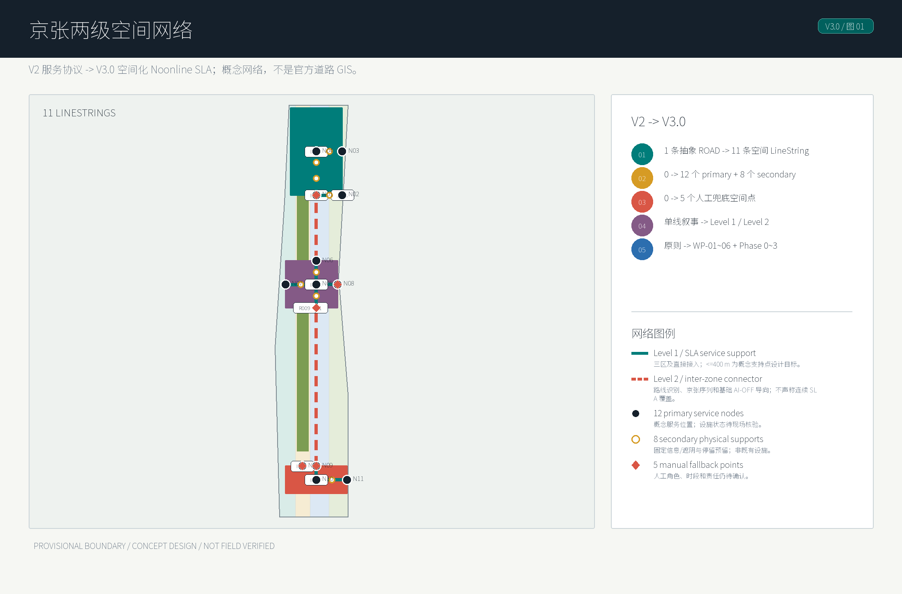
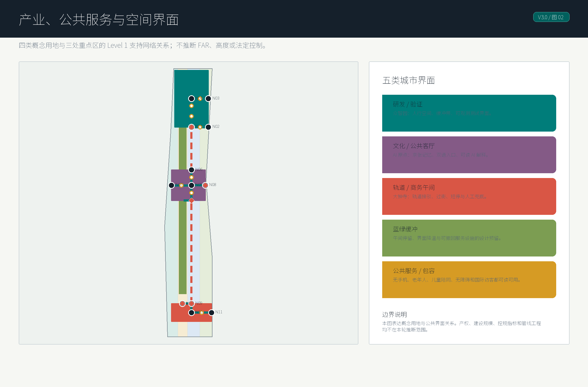
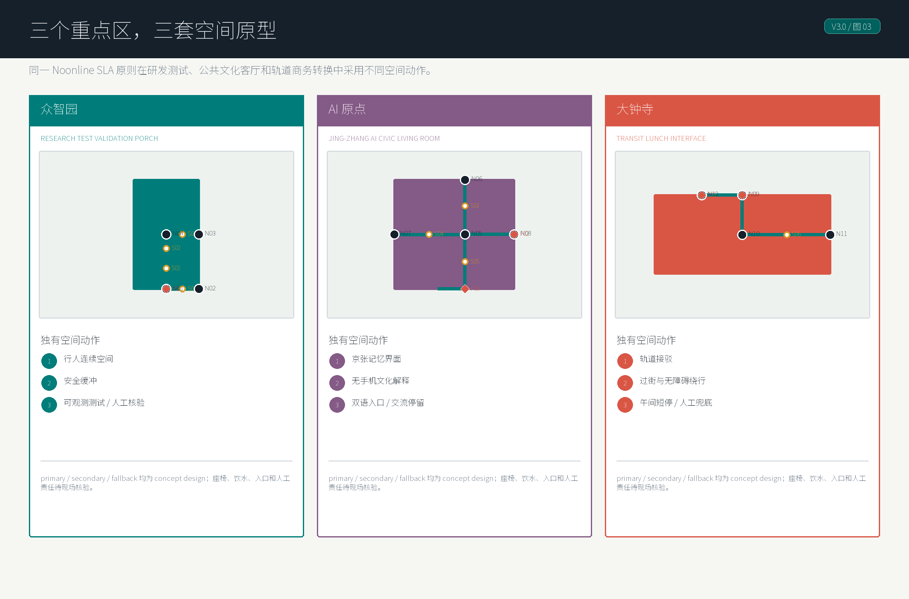
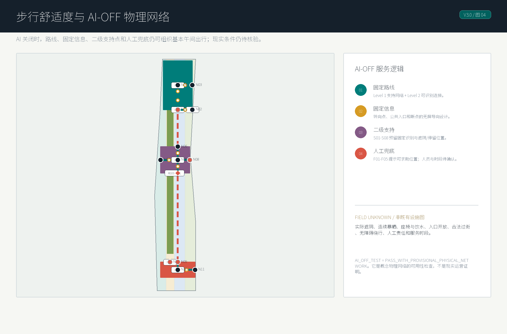
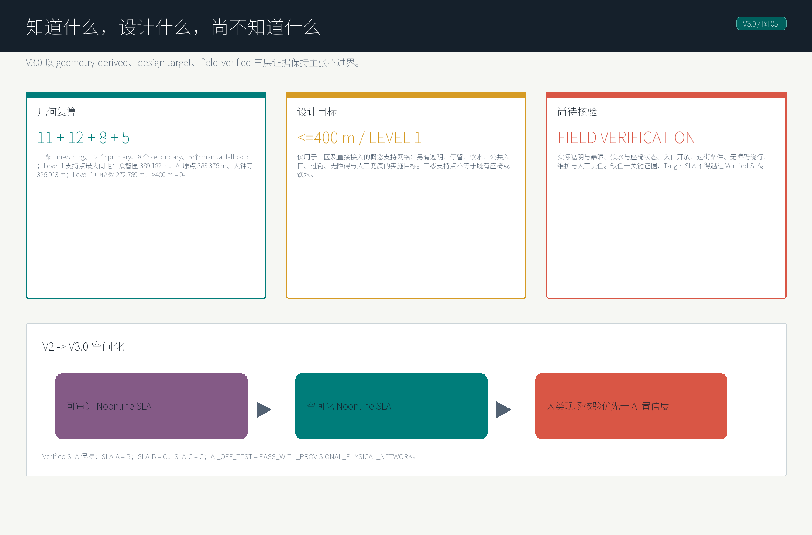

# 京张午间服务线 / Jing-Zhang Noonline SLA

本方案不把“AI创新带”理解成一组更炫的显示屏，而是把京张遗址公园周边最容易被忽略的日常时段拿出来设计：工作日 11:30-14:30 的午间通勤、午休、会面、访客抵达和跨园区短距离移动。Noonline SLA 的含义是“午间在线感知 + 离线兜底服务等级”：AI 可以预测热、雨、拥挤、绕行和服务排队，但公共空间必须同时提供看得见的阴影、座椅、饮水、导向、人工帮助和无障碍替代路径 [source:DATA-SRC-AGENT-TASKBOOK-20260518] [standard:BARRIER-FREE-ENVIRONMENT-LAW]。

这个方向回应了前期扫描中的一个空白：已有方案中已经有遮荫、气候适应、季节线和“是否好走”的成熟讨论，因此本方案避免复用“凉行”等相近命名，把重点转到可复核的服务等级、午间运营、人工兜底和行业测试场景。人群依据也保持克制：海淀七普显示 2020 年全区 15-59 岁人口占 69.7%，60 岁及以上占 18.5%，大专及以上人口占 56.5%，外来常住人口占 35.7%；这只说明服务对象高度多元，不能推出场地内部某类人群占主导 [source:EXT-SRC-HAIDIAN-CENSUS-20210608]。

## V3.0：从可审计服务协议到空间化网络

V2 建立了证据边界、`Target SLA / Verified SLA`、AI-OFF 与现场核验工作流；V3.0 不抬高任何已验证等级，而是把同一逻辑落到城市空间。它将一条抽象服务参考线表达为 11 条可解析概念 LineString，以 12 个主服务节点、8 个二级物理支持点和 5 个概念人工兜底点组织“人如何走、在哪里停、如何在无手机时求助”；所有对象都保留 `concept_design` / `not_field_verified` 的证据边界 [data:geometry/roads.geojson#ROAD-001] [data:geometry/public_space.geojson#PUBLIC-001] [metric:secondary_support_point_count]。

空间化的关键不是增加 AI 功能，而是把 AI 的失效模式反过来变成设计约束：普通居民、老年人、儿童陪行者、无障碍使用者、不使用智能手机的人、园区工作人员、外地与国际访客，均应能依靠实体路线、固定双语信息、停留预留和人工求助完成基本午间出行。AI 仅作为预测、解释、动态调整与维护辅助层；专业现场核验始终优先于 AI 置信度 [standard:BARRIER-FREE-ENVIRONMENT-LAW] [assumption:A-FIELD-VERIFICATION-WORKFLOW-001]。

## 设计依据与资料清单

方案依据分成三层。第一层是官方公告和站点包，提供项目名称、三层范围、约 11.4 平方公里总体设计面积、三处重点片区和正式成果深度；第二层是智能体任务书，提出命名、AI生态、场景卡、用户画像、朝圣地标、文化叙事和长期运营要求；第三层是公开规范和政策快照，用来界定城市设计、控规深度、用地分类、生成式AI服务治理和无障碍人工兜底边界 [source:DATA-SRC-OFFICIAL-ANNOUNCEMENT-20260509] [source:DATA-SRC-AGENT-TASKBOOK-20260518] [standard:MOHURD-URBAN-DESIGN-MEASURES]。

本地空间文件使用仓库提供的临时粗略边界作为生成与展示约束。`geometry/site_boundary.geojson` 和 `geometry/key_areas.geojson` 已明确标注为 provisional constraint，不能被解释为官方红线、道路红线、地籍边界或精确面积依据；官方 CAD/GIS 发布后，本方案的面积、图纸和 HTML 指标需要整套复算 [data:geometry/site_boundary.geojson#SITE-001] [source:DATA-SRC-PROVISIONAL-BOUNDARIES-20260605]。

新增的外部人群资料只使用海淀区公开七普公报。它的使用范围是“区级背景画像”：说明海淀不是单一科研园区，而是青年科研人员、通勤访客、外来常住人口、儿童、老年人和无障碍需求共同出现的高复杂度城区；它不参与边界、面积、客流或场地内部人口指标计算 [source:EXT-SRC-HAIDIAN-CENSUS-20210608] [assumption:A-CENSUS-SCOPE-001]。

## 三层范围工作框架

统筹研究范围约 43.6 平方公里，承担“午间服务系统如何成为AI创新带公共基础设施”的策略研究：把高校、科研院所、园区、社区、轨道站点和京张遗址公园看作连续的日常使用网络，而不是只看三处重点片区的孤立更新 [depth:three_level_scope_framework] [source:DATA-SRC-OFFICIAL-ANNOUNCEMENT-20260509]。

总体设计范围约 11.4 平方公里，是 Noonline SLA 的空间试验场。V3 将服务参考轴表达为 11 条可解析的概念 LineString：`JZ-MAIN` 三段主轴、众智园服务区脊线、众智园/AI 原点/大钟寺接入段，以及横向接驳和过街界面。它们是供城市设计推演和复算的设计网络，不是官方道路 GIS 或现状步行设施清单。网络分为两级：Level 1 是三区及其直接接入段的 SLA 服务区；Level 2 是重点区之间的概念连接段，只承担路线识别、京张文化序列和基础 AI-OFF 导向，不声称 `<=400 m` 连续服务覆盖。SLA-A 的设计目标是 Level 1 内连续停留主线，Target SLA = A，但当前 Engine Verified SLA = B；SLA-B 管横向短接驳，SLA-C 管站点到园区触点。三类路径分别解决跨园区午餐、科研会面、轨道到园区、访客抵达和短时休憩问题 [data:geometry/roads.geojson#ROAD-001] [metric:noon_sla_corridor_count] [metric:level1_sla_service_zone_count]。

重点区域范围约 368.4 公顷，由众智园AI自主创新加速区、北京AI原点社区和大钟寺AI产业集聚区组成。三处片区在方案中不是同质化复制：北段偏“研发与验证”，中段偏“原点展示与开放社区”，南段偏“消费商务与到访服务”；所有片区边界仍为临时粗略范围 [data:geometry/key_areas.geojson#PROV-KEY-001] [data:geometry/key_areas.geojson#PROV-KEY-002] [data:geometry/key_areas.geojson#PROV-KEY-003]。

## 统筹研究范围产业与未来城市研究

京张午间服务线的产业逻辑，是把“AI企业服务”从会议室里拉到城市界面上：园区团队需要午间会面、临时办公、外宾接待、设备演示、合规咨询和场景测试，城市则需要可被公众理解的AI公共价值。Noonline SLA 把这些需求合并为服务等级，但等级不由纯 AI 打分形成，而由可观察空间条件形成：有没有连续遮阴、能不能坐、能不能喝水、能否进入公共空间或服务点、过街是否有等待位置、夏季绕行是否被控制、是否看得见人工兜底 [depth:overall_spatial_structure] [metric:noon_service_node_count]。

全球案例不直接复制空间形态，而提取机制：Kendall Square 的高校企业近邻、Toronto Waterfront 的数据治理争议、Paris Rive Gauche 的铁路廊道再开发、Singapore one-north 的研发生活复合、Seoul Digital Media City 的展示消费界面、London King’s Cross 的更新运营，以及 Shenzhen Hetao 的跨境协同，都提示本项目需要“场景开放 + 公共合规 + 日常体验”并行，而不是只做产业楼宇 [source:DATA-SRC-AGENT-TASKBOOK-20260518]。

未来城市研究的重点是“低侵入式AI”。本方案不使用人脸、个人手机轨迹、支付记录或未清权企业运营资料，而用公开天气预警、设备状态、服务工单、匿名客流级别、人工巡查和用户自愿反馈形成运营闭环；涉及生成式内容的导览、问答和活动推荐，需要保留投诉、纠错和人工复核通道 [standard:GENERATIVE-AI-INTERIM-MEASURES] [assumption:A-PRIVACY-001]。

## 总体设计范围城市更新与控规深度城市设计

总体结构为“一线、三段、十二个主服务节点、五个概念人工兜底点与两级服务范围”。一线是京张遗址公园及其两侧的路线和空间叙事主线；三段对应北部研发验证段、中部原点社区段和南部消费商务段；十二个主服务节点组织午间服务；五个概念人工兜底点标示未来可布置导向、无障碍咨询、人工问路、饮水保障和活动日秩序服务的求助位置，并不声称人员或设施已配置。三区及直接接入段属于 Level 1 SLA 服务区，以 12 个主节点和 8 个非工作人员的概念支持点组织 `<=400 m` 的支持点间距设计目标；两个跨区连接段属于 Level 2，只保留固定路线识别、京张文化序列和基础 AI-OFF 导向 [data:geometry/public_space.geojson#PUBLIC-001] [metric:human_fallback_node_count] [metric:secondary_support_point_count]。

十二个主服务节点的选址规则是“起终点、换向点、停留点、过街点、公共入口点、热雨风险点”六类优先，而不是平均撒点。8 个二级支持点仅补足 Level 1 内的固定识别、停留/遮阴预留和 AI-OFF 导向节奏；它们不是工作人员服务点，也不表示现有座椅、饮水、入口或设施。五个人工兜底点从十二点中选取，优先放在三段转换、轨道接驳、重点公共入口和活动日人群汇合处；它们解释为概念选址规则和图面表达，不是现状设施统计 [metric:noon_service_node_count] [metric:secondary_support_point_count] [assumption:A-MICROCLIMATE-001]。

城市设计深度控制采用“建议而非法定结论”的写法。用地分区、建筑界面、更新项目和服务节点都作为专业团队后续深化的参考方案，不能替代控规调整、容积率、建筑高度、道路红线、桥隧或市政容量论证 [standard:MOHURD-CONTROL-DETAILED-PLANNING] [assumption:A-CONTROLS-001]。

方案的AI原生特征在于把空间变成可审计的服务合约：每个节点都可记录“有无阴影、是否可坐、是否有饮水、是否有离线说明、是否可人工介入、是否适合轮椅与推车”，AI只负责预测、排程和提示，最终的公共服务质量由可见设施和人工巡查兑现 [depth:development_intensity_controls] [metric:public_space_ratio]。

## 重点区域详细设计

众智园AI自主创新加速区建议作为“午间验证北段”：服务线优先连接研发楼、实验服务、开放测试和轨道接驳，把午餐、短会、样机演示和外部评审安排在可步行的低速界面。独有空间动作有三项：研发楼首层外设置可短会的遮阴等候界面；在开放测试入口前设置可撤回的样机展示与人工登记点；把轨道接驳方向的过街等待和座椅饮水组织成午间验证门廊。这里的设计成果是样板化的服务节点组件库，不是具体建筑拆改结论 [data:geometry/key_areas.geojson#PROV-KEY-001] [depth:three_key_area_detailed_design]。

北京AI原点社区建议作为“可被看见的AI公共客厅”：设置AI原点驿站、模型透明橱窗、京张记忆界面和午间开放课堂，把中关村创新文化、京张铁路叙事和AI公共治理放在同一个可解释空间里。独有空间动作有三项：在公共入口形成双语固定导向和人工问询前场；把模型透明橱窗与可坐停留面并置，避免只看屏幕不停留；把京张记忆界面接入午间步行路线，让国际访客无手机也能读懂原点叙事。这里尤其适合承接访客导览、国际交流和公众问答的人工兜底 [data:geometry/key_areas.geojson#PROV-KEY-002] [metric:pilgrimage_node_count]。

大钟寺AI产业集聚区建议作为“南部午间消费与商务服务段”：强化地铁到园区、商务楼到餐饮、活动人群到公共空间的短时连接。独有空间动作有三项：在站点到园区的出口方向设置清晰的遮阴排队和问询点；把商务楼首层服务界面与午间座椅、饮水、轻消费串联；在活动日把公共空间边缘作为可人工疏导的临时缓冲带。相关发布、路演和社群活动仍是可能的运营设想，不写成确定招商或运营安排 [data:geometry/key_areas.geojson#PROV-KEY-003] [source:DATA-SRC-AGENT-TASKBOOK-20260518]。

## AI 创新生态、人才画像与 AI+ 场景

五类用户画像用于校核服务，而不是推断场地人口占比。第一类是高校和园区青年研发者，需要短时协作和低成本会面；第二类是来访企业与投资服务人员，需要可解释的抵达和展示路径；第三类是周边居民和亲子使用者，需要安全、遮阴和不被技术排斥的公共空间；第四类是老年人与无障碍需求者，需要线下说明、人工帮助和连续座椅；第五类是国际访客，需要中英文一致导向和清晰的公共合规说明 [source:EXT-SRC-HAIDIAN-CENSUS-20210608] [metric:persona_count]。

十张AI+场景卡分别是：午间舒适导航、实验室访客抵达、开放测试预约、无障碍慢行复核、AI原点公共问答、京张文化导览、活动日人流分级、低速机器人配送窗口、午间安全巡查、开发者快闪课堂。每张卡都必须同时标注空间载体、数据来源、人工兜底和禁止使用的个人数据类型 [metric:scenario_card_count] [standard:GENERATIVE-AI-INTERIM-MEASURES]。

三个行业测试验证场景是：热舒适服务等级试验、低速机器人与步行共处试验、活动日导览与拥挤分级试验。它们都是可撤回、可人工接管、可被公众投诉纠错的开放测试，不是已批准运营，不依赖指定厂商，也不承诺商业效果 [metric:industry_validation_scenario_count] [assumption:A-PRIVACY-001]。

## 用地、建筑规模与拆改留方案

用地表达采用四类概念分区：午间科研与AI研发复合片区、京张午间蓝绿缓冲与停留片区、校园园区混合服务片区、街区更新与生活服务片区。它们继承仓库 scaffold 的拓扑安全分割，满足 land_use 图层完整覆盖边界，但不替代正式国土空间规划和控规用地 [data:geometry/land_use.geojson#LU-001] [standard:MNR-LAND-USE-CLASSIFICATION-GUIDE]。

建筑策略是“界面更新优先、存量激活优先、拆改结论后置”。方案只提出午间可达界面、首层共享、檐下空间、可移动服务设施和可解释展示窗的设计方向；任何具体建筑保留、改造、拆除、新建、产权调整或消防市政结论均需专业团队和官方资料确认 [data:geometry/buildings.geojson#BLDG-001] [depth:retain_renovate_demolish]。

指标层面，现阶段只登记可由临时几何复算的面积、绿地比例、公共空间比例和节点数量；容积率、建筑密度、建筑高度和停车配建等控规指标保持“待正式数据补齐”，不使用推测值填空 [metric:floor_area_ratio] [metric:building_density]。

## 交通、轨道、市政与公共服务设施

慢行交通以三类 SLA 路径组织，空间证据挂接在由 11 条概念 LineString 组成的午间网络、12 个主服务节点、8 个二级支持点和 5 个人工兜底点上 [data:geometry/roads.geojson#ROAD-001] [metric:noon_sla_corridor_count] [metric:noon_service_node_count]。

Level 1 的三区及直接接入段承担 `<=400 m` 支持点间距的设计目标；Level 2 的两个跨区连接段仅承担连续路线识别、京张文化序列和基础 AI-OFF 导向，`service_continuity_status = inter_zone_connector_not_sla_continuous`。SLA-A 是 Level 1 遗址公园午间停留主线的设计目标，Target SLA = A，但当前可验证状态只能写为 Verified SLA = B；SLA-B 是校园园区横向短接驳；SLA-C 是轨道站点到园区的最后一公里触点。遮阴、休息、饮水、入口、过街、绕行和人工兜底仍是待现场核验的空间条件清单，不是 AI 排名、手机导航分数或现状设施声明 [metric:secondary_support_point_count]。

### Noonline SLA Engine 证据对齐

本轮采用双层状态：`Target SLA` 表示设计希望达到的服务等级，`Verified SLA` 表示 Noonline SLA Engine 在当前公开/清权数据和本 submission 声明证据下可稳定支持的等级。程序结果优先于叙述；缺少现场核验时，不得把目标等级写成已证明的当前状态 [data:visual/assets/noonline-sla-report.json#normal_routes.SLA-A] [metric:noon_sla_corridor_count]。

| Design Claim | Engine Status | Evidence Gap | Upgrade Trigger |
| --- | --- | --- | --- |
| SLA-A 遗址公园午间主线，设计目标为 A。 | Target SLA = A；Verified SLA = B。 | 遮阴连续性、连续暴晒距离、真实节点位置、饮水/座椅状态、公共入口、过街条件、夏季绕行和人工服务点责任仍未现场核验。 | 全部关键证据补齐且 Engine 复核无 blocker 后，才可由 B 升 A；缺任一关键证据时不得自动升级。 |
| SLA-B 横向短接驳，设计目标为 B。 | Target SLA = B；Verified SLA = C。 | 过街等待、公共入口开放、夏季绕行距离和节点状态仍为概念证据。 | 现场核验公共入口、过街等待和绕行距离后再复核。 |
| SLA-C 站点到园区触点，设计目标为 C。 | Target SLA = C；Verified SLA = C。 | 仍依赖概念节点和未现场核验的固定导向、饮水、座椅、人工问询条件。 | 补齐真实点位、开放时段和无障碍路径核验后维持或微调 C。 |
| AI 全部关闭。 | AI_OFF_TEST = PASS_WITH_PROVISIONAL_PHYSICAL_NETWORK。 | 固定标识、实体路线、座椅、饮水、公共入口和人工服务点可形成概念兜底网络，但尚不是现实运营证明。 | 现场确认设施存在、开放、可达且有人负责后，AI-OFF 结论才可从 provisional 转为现场验证。 |

A 级升级门槛是硬门槛，不是“未来完善后自然达到 A”。从 Verified SLA = B 升级到 A，必须补齐：遮阴连续性现场核验、连续暴晒距离实测、饮水点真实位置与开放状态、座椅及休息节点状态、公共入口实际开放条件、关键过街条件、夏季实际绕行距离、人工服务点责任与可用时段。缺少任一关键证据时，Engine 不应自动升级到 A。

#### V2 现场核验工作流

V2 不声称已经完成任何现场核验。Engine 从既有三类 SLA 路径、概念节点与八类 evidence gap 自动生成 45 项机器可读核验任务，写入 `visual/assets/noonline-field-verification-ledger.json`；其中 SLA-A 的 18 项任务为升级门 mandatory evidence，基线全部为 `unknown`。每项任务包含 route/node/object、所需证据、核验方法、通过/失败条件、状态、置信度、核验人、时间和证据引用；双语人工核验清单由同一 ledger 自动注入 `visual/index.html#v2-field-verification` 与 `visual/index.en.html#v2-field-verification`，不维护脱离机器数据的人工副本 [data:visual/assets/noonline-field-verification-ledger.json#summary] [metric:field_verification_task_count]。

核验状态机只允许 `unknown → scheduled → observed → verified / rejected`。AI 不能创建、观察、确认或拒绝现场证据；`verified` 与 `rejected` 必须由人类核验人写入，并同时具备 verifier、timestamp 和 evidence reference。SLA-A promotion gate 因 18 项 mandatory evidence 均未完成而返回 `promotion = blocked`，所以当前 Target SLA = A、Verified SLA = B 不变；任何 mandatory evidence 被拒绝时继续阻断升级并触发保持 B 或降级复核。即使所有 mandatory evidence 未来由人类流程核验，gate 也只允许后续 Engine/政策复核，绝不自动把 Verified SLA 写成 A [data:visual/assets/noonline-sla-report.json#verification_workflow] [assumption:A-FIELD-VERIFICATION-WORKFLOW-001]。

2026 年公开的京张铁路遗址公园沿线街区控规获批信息，为本方案提供了约 9 公里绿廊、南北贯通/东西联通慢行和便民服务方向的最新官方语境；本 submission 的 `JZ-MAIN` 及各接入段仍只是概念性服务参考网络，而非官方 GIS、现状设施 inventory 或 SLA-A 的现场证据 [source:EXT-SRC-JINGZHANG-CONTROL-PLAN-20260812] [data:geometry/roads.geojson#ROAD-001]。

市政与公共服务设施采用轻量化、可撤回的原则：先做可移动饮水、座椅、遮阴、充电、信息牌和人工服务桌，再根据专业测量决定是否需要固定工程。未公开的管线、排水、电力、消防和地下空间资料不被推断，相关内容只列为后续深化清单 [depth:municipal_new_infrastructure] [assumption:A-CONTROLS-001]。

轨道接驳不提出新线位或站点工程结论，而是关注站点出入口到园区入口之间的“午间可懂路径”：哪条路更有阴影，哪里能坐下，遇到系统故障时找谁，国际访客如何读懂京张和AI原点叙事 [standard:BARRIER-FREE-ENVIRONMENT-LAW] [depth:traffic_rail_slow_parking]。

AI OFF / 无手机 / 无屏幕模式是完整公共服务模式，而不是应急附属品。Noonline SLA Engine 当前输出 `AI_OFF_TEST = PASS_WITH_PROVISIONAL_PHYSICAL_NETWORK`：AI 全部关闭后，概念网络仍依靠固定路线标识、地面或立柱导向、可见座椅、饮水补给、公共入口和五个人工服务点维持基本午间服务；但这一结论仍依赖 provisional / not field verified 的物理条件，不得表述为现实运营证明。AI 只做预测、提醒、动态调整和维护辅助，不成为遮阴、休息、饮水、问询和可达路径的前置条件 [data:visual/assets/noonline-sla-report.json#ai_off_test] [standard:BARRIER-FREE-ENVIRONMENT-LAW]。

### V3 SLA 空间指标与四类典型断面

V3 把连续性分为三种不混用的表述。第一是**走廊连续性**：11 条概念 LineString 形成可读的京张路线和空间叙事；其中 `ROAD-001`（AI 原点—大钟寺）与 `ROAD-003`（AI 原点—众智园）是 Level 2 跨区连接段。12 个主服务节点的最大相邻网络间距是 N05—N09 的 4,298.796 m，属于 `JZ-MAIN` 的 `ROAD-002 + ROAD-001`，直线距离与概念网络距离相等只是简化共线几何的结果，不是实测步行距离。这一间距不能支持全线连续休息或 `<=400 m` 服务覆盖主张 [metric:geometry_route_node_spacing_max_m] [metric:geometry_primary_corridor_adjacent_gap_count]。

第二是**SLA 服务连续性设计目标**：只在众智园、AI 原点、大钟寺及其直接接入的 Level 1 服务区适用。12 个主节点加 8 个非工作人员二级支持点后，Level 1 支持点网络最大间距为 389.182 m、中位数为 272.789 m、超过 400 m 的相邻间距为 0；三区最大值分别为众智园 389.182 m、AI 原点 383.376 m、大钟寺 326.913 m [metric:level1_support_spacing_max_m] [metric:level1_support_spacing_median_m] [metric:level1_support_spacing_over_400_count]。

这是概念空间布置的可复算目标，不是现状座椅、饮水、遮阴、入口或人工服务已经存在的证明；座椅与可饮水服务距离不超过 400 m、每区至少一个人工兜底点和连续暴晒不超过 150 m 仍是后续实施与核验目标 [metric:design_target_max_continuous_exposure_m]。

第三是**已验证连续性**，当前仍为现场核验 unknown：树冠/建筑阴影与夏至午间连续暴晒、座椅和饮水的真实位置与开放状态、入口开放、过街合法性和等待条件、缘石/坡道/电梯等无障碍连续性、人工服务责任与时段。它们进入 V2 既有核验 ledger，缺任一 SLA-A 升级关键项时，Verified SLA 仍保持 B；设计目标不能替代人类现场记录 [metric:field_verification_unknown_task_count] [assumption:A-SLA-DESIGN-TARGETS-001]。

| 典型断面 | 空间规则（均为概念设计目标） | AI-OFF 与失败处置 |
| --- | --- | --- |
| SECTION-01 主轴午间步行段 | Level 1 服务区保持连续、清晰的步行净空间；遮阴带、停留带、主服务节点、二级支持点和信息设施置于净空间外侧，避免 AI 设施、排队或座椅侵占通行。`ROAD-001` 和 `ROAD-003` 为 Level 2 跨区连接，只提供固定路线识别、文化序列和基础导向，不声称 `<=400 m` 服务覆盖。宽度、树位和铺装均待红线及现场复测确定。 | 无屏时由地面/立柱标识、概念支持点和人工点支撑导向。若连续遮阴、合法通行或维护责任无法确认，移除对应 Level 1 的 A 级连续服务目标，改为 B 级或暂停该段开放。 |
| SECTION-02 众智园研发测试界面 | 以“人行空间｜安全缓冲｜可观测测试/验证界面”三带组织；普通行人不必穿越测试带，测试设备只在获得运营许可的窗口内进入边缘界面；N01/N02 与 F01 提供门廊、停留和人工核验。 | 测试关闭时，行人沿固定主轴和门廊标识绕开测试界面。若测试侵占净空间、缓冲不可维持或责任人缺失，停止测试展示并仅保留公共步行与问询。 |
| SECTION-03 AI 原点公共客厅 | N05–N08 形成可坐、可停、可读的公共客厅；京张时间线、AI 公共解释、双语入口和低位休息设施共同组织空间，文化信息以可读实体为主，二维码仅为补充。 | AI 或屏幕关闭后，固定双语标识、实体文化解释、座椅、饮水设计位和 F02/F03 的人工问询仍构成公共使用逻辑。若公共入口不开放或解释载体不可维护，取消对应入口服务声称并导向可确认的公共边界。 |
| SECTION-04 大钟寺轨道转换界面 | 以“轨道抵达→公共入口→合法过街→短停/补水→主轴”串联 N09–N12；把等待、无障碍绕行说明和高频午间短停布置在转换点，F04/F05 面向轨道接驳和活动秩序。 | AI-OFF 由固定换乘指引和人工服务维持。若合法过街、无障碍绕行、入口开放或责任时段任一项无法确认，改走经核验替代线；无替代线时暂停“轨道连续接驳”声称。 |

过街与无障碍不预设现状信号周期、视距、坡度或设施存在。概念规则是：过街处应有不侵占行人净空间的等待位置、可读的静态导向和可见的人工求助信息；无障碍替代线必须单独测量实际绕行距离，不得把直线距离当作可达距离。触发条件包括入口关闭、过街风险不可接受、替代线超出经确认的可接受绕行、测试占道、饮水无法维护或人工责任缺失；触发后采取 reroute、downgrade、suspend 或 remove claim，而非用动态推荐掩盖断点 [assumption:A-ACCESSIBLE-ROUTE-001] [assumption:A-FAILURE-RESPONSE-001]。

## 蓝绿空间、公共空间与城市风貌

蓝绿系统的核心不是把绿地面积说得更大，而是让绿地、公园边界、街角和建筑首层形成午间连续体验。图层中绿地比例和公共空间比例来自临时几何复算，视觉表达把临时边界降为虚线背景，把服务线、停留点和兜底站作为主叙事 [data:geometry/green_space.geojson#GREEN-001] [metric:green_ratio]。

公共空间组件库包括六类：阴影座椅、饮水补给、双语导向、AI解释屏、人工服务桌和开放测试提示牌。组件必须有无屏版本和低技术版本，避免把公共空间变成只服务熟练手机用户的系统；其中座椅、饮水、固定标识、公共入口和人工桌是 AI 关闭时仍然工作的基础设施 [data:geometry/public_space.geojson#PUBLIC-001] [standard:BARRIER-FREE-ENVIRONMENT-LAW]。

城市风貌表达采用“铁路记忆 + 科研透明 + 午间可达”的克制语言：保留京张遗址公园的线性记忆，避免过度娱乐化地标；AI朝圣节点不是巨型雕塑，而是原点驿站、开源荣誉墙、模型透明橱窗和服务等级里程牌四类可更新载体 [depth:height_massing_character] [metric:pilgrimage_node_count]。

### 京张遗产—AI 公共空间序列

文化不是给节点贴一块历史牌。V3 以“**京张记忆 → 当代公共生活 → AI 公共解释 → 研发与测试 → 轨道与商务日常**”组织一条可步行、可停留、也可在无手机情况下理解的概念序列：AI 原点的 N06 是**记忆界面**，以时间、材料、方向和双语静态信息把铁路线性记忆带入公共客厅；N05/N07/N08 形成**市民 AI 界面**，让坐、看、问和进入发生在可阅读的公共阈值；众智园 N01/N02 是**创新/测试界面**，以可观看、可退出的验证门廊呈现研发而不让行人穿越测试区；大钟寺 N09–N12 是**日常轨道界面**，将抵达、过街、短停和午间服务收束到高频城市生活中。序列的锚点是概念角色而非被虚构的文保点坐标，精确遗产干预位置、保护要求和解释材料必须等待权威遗产与场地资料后确定 [source:EXT-SRC-JINGZHANG-CONTROL-PLAN-20260812] [assumption:A-HERITAGE-SEQUENCE-001]。

## 更新项目清单、实施政策与分期计划

实施不以“铺开更多设备”为前提，而按六个可暂停的项目包推进，所有 lead actor 均为角色类型而非已获承诺的现实单位：

| 项目包 | 范围、位置与路线 / 节点 | 责任角色 / 依赖 | 验收证据与关键指标 | Hold / stop / downgrade |
| --- | --- | --- | --- | --- |
| WP-01 主轴物理导向与步行连续性 | Level 1 的三区及直接接入段、N01–N12、S01–S08；`ROAD-001`、`ROAD-003` 作为 Level 2 跨区连接采用静态导向与京张序列。 | 公共部门协调者、场地运营方；依赖边界、通行和维护确认。 | 人类核验的连续路径记录、转向标识清单、维护责任；仅 Level 1 的概念支持点间距设计目标 <=400 m。 | Level 1 路段不合法/不可连续或维护无人承担：暂停该段并删去 A 级服务目标；Level 2 仅保留可确认的路线导向。 |
| WP-02 众智园测试验证门廊 pilot | `JZ-ZZY-ACCESS` 的 `ROAD-004/005/011`、N01–N04、S01/S02/S07、F01；人行—缓冲—测试界面。 | 场地运营方、测试界面运营方、专业核验人；依赖测试许可和安全边界。 | 测试窗口、缓冲不侵占净空间记录、人工核验安排。 | 测试占道、无安全缓冲或无责任人：停止测试，仅保留公共步行。 |
| WP-03 AI 原点公共客厅与京张解释 pilot | `JZ-ORIGIN-ACCESS` / `JZ-LATERAL` 的 `ROAD-006/008`、N05–N08、S03–S05、F02/F03；原点入口与横向连接。 | 公共部门协调者、场地运营方、文化解释专业团队。 | 可读的双语静态信息、公共入口时段、可坐/问/停的现场记录。 | 入口关闭、解释材料无授权/无维护：改至确认公共边界或移除该项声称。 |
| WP-04 大钟寺轨道午间转换 pilot | `JZ-DAZHONGSI-ACCESS` / `JZ-CROSSING` 的 `ROAD-007/010`、N09–N12、S06、F04/F05；轨道接入和过街界面。 | 轨道/界面运营角色、场地运营方、无障碍专业核验人。 | 合法过街、入口、实际无障碍绕行、午间服务责任的实测/记录。 | 过街不安全、绕行不可接受或接口未同意：reroute；无替代线时暂停轨道连续接驳。 |
| WP-05 AI-OFF 固定设施与人工兜底 | F01–F05、S01–S08 及各自关联路线的固定标识、低技术信息和服务交接。 | 场地运营方、维护承包角色、人工服务角色。 | 物理标识和求助信息清单、值守时段、故障演练记录。 | 无人值守、饮水不可维护或标识失效：降级服务等级，停止 AI-OFF 完整网络声称。 |
| WP-06 现场核验、复算与迭代 | 全部 SLA 路径、N01–N12、S01–S08、F01–F05 与临时边界数据。 | 专业核验人、公共部门协调者、维护角色。 | V2 ledger 的定位、遮阴、暴晒、入口、过街、绕行、设施和责任证据；重算记录。 | 关键证据缺失/被拒：保持 B 或更低的 Verified SLA；不进入扩大建设。 |

分期由 `geometry/phasing.geojson` 的同一概念范围表达，不表示法定开发时序。**Phase 0** 进入门槛是取得合法现场核验许可；退出门槛是完成权属/入口/过街/无障碍/维护责任与基础测量台账，任何关键项缺失即 hold。**Phase 1** 只实施可撤回的导向、临时停留、解释和人工服务样板；退出门槛是人行净空间与 AI-OFF 演练通过，测试干扰即 stop 或 reroute。**Phase 2** 才可在三个重点区完善连接与经专业确认的基础设施；进入前需确认入口、过街、无障碍绕行、维护和许可，任一失败即 downgrade 至 Phase 1 或暂停。**Phase 3** 是在累计证据支持下的扩展，不自动提高 Verified SLA；只有 V2 ledger 的必备项经人类核验、Engine 随后复核且运营责任可持续时才允许扩大 [depth:renewal_project_list] [data:geometry/phasing.geojson#PHASE-000] [data:geometry/phasing.geojson#PHASE-003]。

实施政策建议只作为开放共创建议：建立午间服务等级台账、场景测试申请模板、公众反馈和纠错渠道、双语活动日导览包、无障碍复核清单，以及开发者社群维护机制。它们不构成政府已确定政策、财政承诺或招商承诺 [source:DATA-SRC-AGENT-TASKBOOK-20260518] [depth:phasing_implementation]。

长期运营可形成“Jing-Zhang Noon Lab”年度活动：夏季午间服务评测、开发者午休路演、AI公共服务开放日、京张文化夜行之外的午间导览、国际访问周和开源方案复盘会。运营价值来自可复用台账和可审计反馈，不来自一次性宣传 [metric:scenario_card_count]。

## 指标体系、面积复算与合规矩阵

结构化指标显示：临时提交边界复算面积约 11,412,825.386 平方米，官方公告总体设计面积为约 11.4 平方公里，两者只能作为近似校核关系；绿地比例约 0.123423，公共空间比例约 0.073281，三处重点片区数量为 3 [metric:site_area_sqm] [metric:official_overall_design_area_sqm] [metric:key_area_count]。

服务指标显示：Noonline SLA 设置 3 类午间服务路径、11 条概念路线段、3 个 Level 1 SLA 服务区、2 个 Level 2 跨区连接段、12 个概念主服务节点、8 个二级支持点和 5 个可见人工兜底节点 [metric:noon_sla_corridor_count] [metric:noon_service_node_count]。

3 类路径是多段概念网络上的 SLA-A/B/C 空间服务等级，不是 3 条独立道路中心线；12 点、8 个支持点和 5 个兜底点均来自概念选址规则，不是现状设施统计。V3 的节点间距和点线关系是可复算的概念几何诊断：路线连续不等于全线 SLA 服务连续，Level 1 的 400 m 只是设计目标，现场表现仍为待核验 [metric:geometry_service_node_on_declared_line_ratio]。

合规矩阵覆盖公告和智能体任务书全部任务，标准矩阵覆盖官方公告、智能体任务书、城市设计管理办法、控规深度、用地分类以及AI治理和无障碍相关边界，设计深度矩阵覆盖 15 个 formal 深度项 [depth:metrics_recalculation] [standard:PROJECT-OFFICIAL-ANNOUNCEMENT] [standard:PROJECT-AGENT-OPEN-CALL-TASKBOOK]。

## 风险、版权与合规说明

最大风险是把“服务等级”误解成已经可实施的工程指标。为避免这一点，方案把热舒适、客流、设施状态和公众反馈都写成测试协议，把无障碍和人工兜底写成设计底线，把官方边界和控规资料缺口写进 assumptions、sources、proposal 和 visual 页面 [assumption:A-MICROCLIMATE-001] [depth:risk_missing_data]。

第二个风险是人群依据被误读。本方案明确不声称场地内部老年人、儿童、科研人员或外来人口的具体占比；海淀七普只支持“区级多元人群和包容性校核”，不支持“某类人群主导场地”的结论 [source:EXT-SRC-HAIDIAN-CENSUS-20210608] [assumption:A-CENSUS-SCOPE-001]。

本方案所有图像、PDF、HTML 和结构化数据均由本地脚本基于公开/清权资料和仓库临时几何生成，没有使用远程地图瓦片、外部字体、第三方图片、个人隐私数据或未授权商标。互动网页离线运行，报告 HTML 不含脚本，视觉 HTML 不调用远程 API [source:SOURCE-REGISTRY] [standard:GENERATIVE-AI-INTERIM-MEASURES]。

## 参考资料

- 官方公告与站点包：项目范围、任务、重点片区和成果要求 [source:DATA-SRC-OFFICIAL-ANNOUNCEMENT-20260509]。
- 智能体任务书：命名、场景、人物画像、AI地标、文化叙事和长期运营 [source:DATA-SRC-AGENT-TASKBOOK-20260518]。
- 临时边界：仅用于生成、展示和自检，不作为官方红线 [source:DATA-SRC-PROVISIONAL-BOUNDARIES-20260605]。
- 海淀七普公报：区级人群结构背景，不作为场地人口或午间客流统计 [source:EXT-SRC-HAIDIAN-CENSUS-20210608]。
- 专业标准与政策快照：城市设计、控规深度、用地分类、生成式AI治理和无障碍人工服务边界 [standard:MOHURD-URBAN-DESIGN-MEASURES] [standard:MOHURD-CONTROL-DETAILED-PLANNING]。
