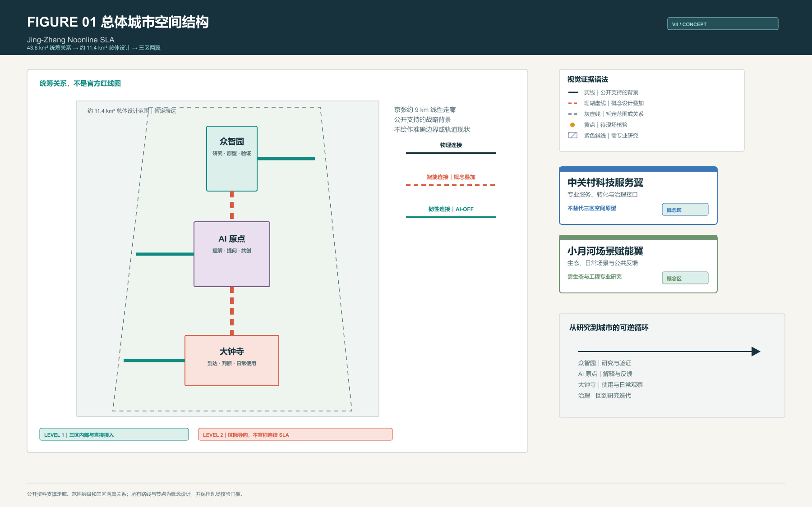
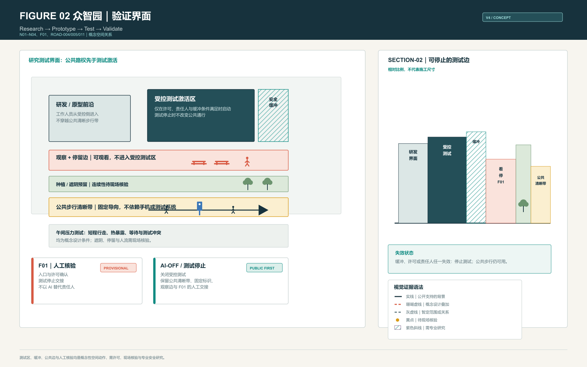
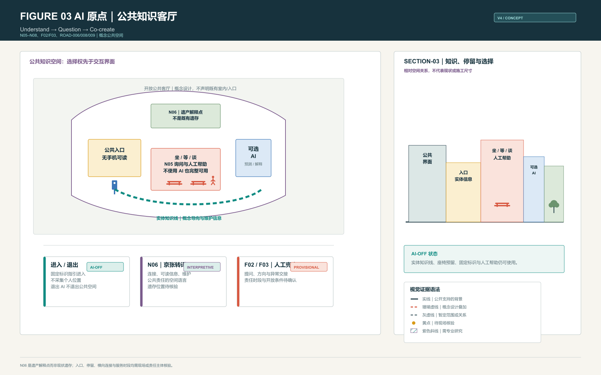
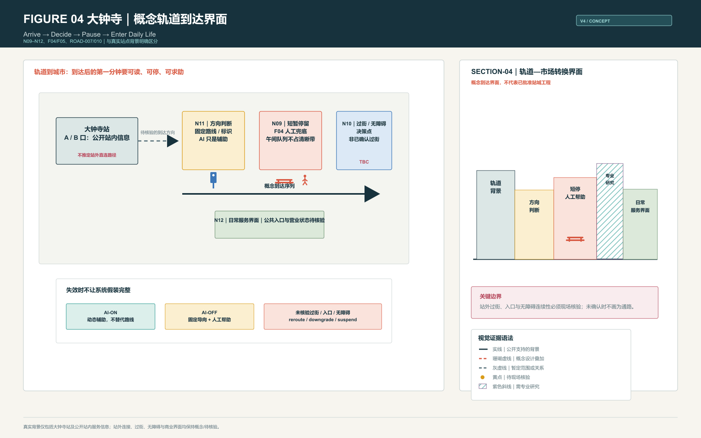
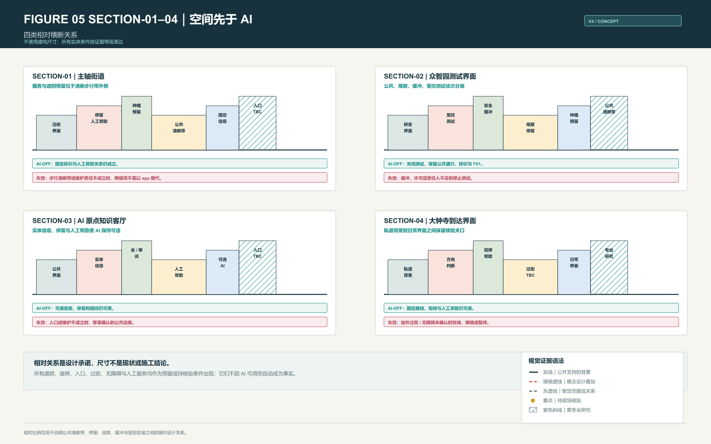
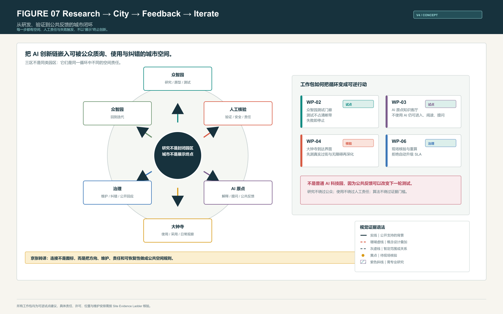
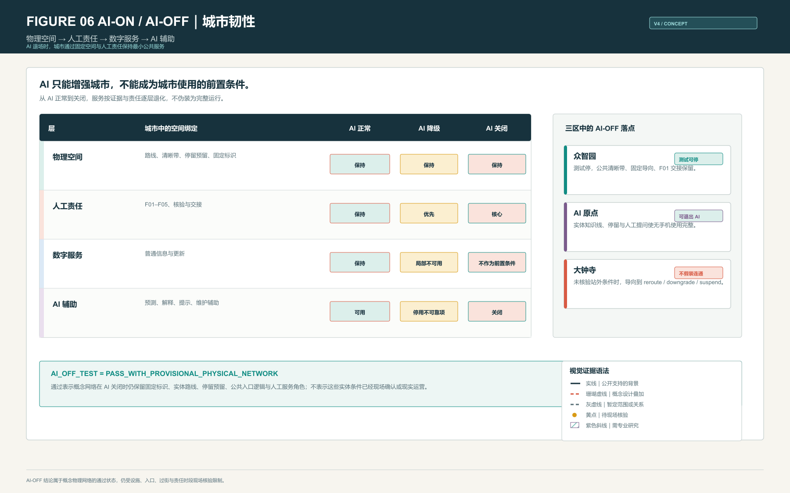
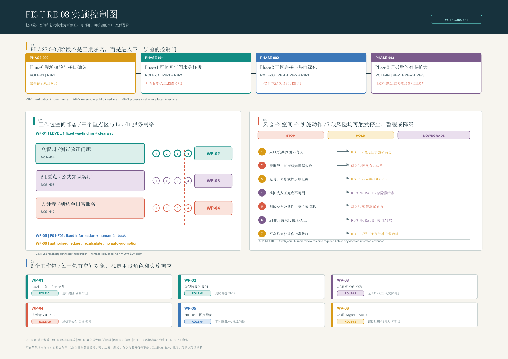

# 京张午间服务线 / Jing-Zhang Noonline SLA

> **把午间当作城市压力测试：AI 可以增强一条路，但任何人都不应因为没有手机、没有屏幕或 AI 离线而失去一条可进入、可停留、可求助的公共路径。**

## 1. 问题 / The Problem

AI 城市常把“会被算法看见”误当成“可以被人使用”。午间是最小却最诚实的检验窗口：短时间步行、热暴露、等待、问路、喝水、休息、过街和临时失效同时发生。若一条公共路径只能在手机、预测、预约或测试系统正常时才能成立，它不是可靠的城市服务。

本方案提出 **Noonline SLA**：先建立可读、可走、可停、可人工接力的实体公共空间，再让 AI 做预测、解释、提醒、维护辅助与动态调整。AI 不是公共服务的前置条件 [standard:PROJECT-AGENT-OPEN-CALL-TASKBOOK] [standard:BARRIER-FREE-ENVIRONMENT-LAW]。

## 2. 午间为何是城市压力测试 / Noon as an Urban Stress Test

午间把三种城市矛盾压缩到同一时段：热环境与短时出行、研发测试与普通步行、轨道到达与日常服务。设计因此不以“推荐更聪明的路线”为目标，而以一组可观察条件组织空间：公共清晰步行带不被队列、设备或测试占用；停留、遮阴、饮水和信息有明确的预留位置；入口、过街、无障碍绕行和人工责任在实施前接受核验。

400 m 是 **Level 1 重点服务区**的参与者设计目标，不是整条京张走廊已实现的现状覆盖，更不是法定标准。区际 Level 2 连接承担方向识别、京张公共叙事和基础 AI-OFF 导向，不宣称连续 SLA 服务 [assumption:A-SLA-DESIGN-TARGETS-001] [assumption:A-GEOMETRY-DERIVED-METRICS-001]。

## 3. 为什么必须发生在京张 / Why Jing-Zhang

京张铁路遗址公园约 9 km 的线性走廊与“三区两翼”是公开的战略背景；一期已开放的遗址公园段和清华园车站旧址提供了真实的铁路遗产语境 [source:EXT-SRC-JINGZHANG-PARK-20230630] [source:EXT-SRC-QINGHUAYUAN-STATION-20260214]。方案不虚构三区中的既有轨道或遗产点，而把京张转译为三条公共空间规则：

1. **Physical connection｜物理连接**：路线、停留与方向必须在没有算法时仍可被理解。
2. **Intelligent connection｜智能连接**：AI 只叠加在已有公共秩序上，帮助解释和维护。
3. **Resilient connection｜韧性连接**：测试、设备、入口或服务失效时，必须有可见的停用、降级、改线或人工交接。

这使“京张”不是装饰性的历史符号，而是连接、维护、责任与可恢复性的空间纪律。

## 4. 总体空间系统 / Overall Spatial System

43.6 km² 是产业、生态、轨道与公共服务的统筹研究关系；约 11.4 km² 是总体设计范围。两者均来自公开任务书的尺度描述，提交 geometry 仍为暂定表达，绝不作为 official boundary 或控规红线 [source:DATA-SRC-OFFICIAL-ANNOUNCEMENT-20260509] [source:DATA-SRC-PROVISIONAL-BOUNDARIES-20260605]。

空间系统由 11 条概念 LineString、12 个主服务节点、8 个次级支持点和 5 个人工兜底点构成。它把三个不同原型连接为一条“研究 → 公共 → 市场 → 反馈”的可逆循环：

- **众智园**：Research → Prototype → Test → Validate。
- **AI 原点**：Understand → Question → Co-create。
- **大钟寺**：Arrive → Decide → Pause → Enter Daily Life。
- **中关村科技服务翼**：专业服务、转化和治理接口，不复制三区原型。
- **小月河场景赋能翼**：生态、日常场景与公共反馈接口，需生态与工程专业深化。

## 5. 众智园 / Zhongzhiyuan: Research → Test → Validate

众智园不是科技园广场，而是一条 **测试可被看见、但公共路权不可被侵占** 的研发验证界面。普通行人走在独立的公共清晰带；观察者停在公共观察与停留边；测试只在由安全缓冲隔开的概念激活区内发生；研发人员从受控一侧进入。F01 不是一个已存在的服务台，而是许可确认、异常交接和测试停止时的人类责任位置。

最重要的空间动作是：

- 将受控测试、缓冲、观察停留、种植/遮阴预留与公共清晰步行带做成彼此可读的带状关系。
- 将“测试停止”设计成常态能力：关闭受控区后，固定标识、公共路径、观察边和人工交接仍可用。
- 让研发测试成为可观察的城市界面，但不把公众带进设备、许可或运营边界。

测试许可、安全距离、既有设备、公共入口和现状遮阴均未获得现场或专业确认；图中均是 conceptual intervention 或 field verification required [assumption:A-CONTROLS-001]。

## 6. AI 原点 / AI Origin: Understand → Question → Co-create

AI 原点不是 AI 展厅，而是让公众拥有选择权的城市知识客厅。公共入口采用无手机也可读的固定信息；N06 作为 **heritage interpretation point**，讲述京张的连接、维护和公共责任，不能被读作真实遗存；N05 组织坐、等、谈和人工提问；AI 仅在侧向提供可选择的预测与解释，退出 AI 不等于退出空间。

最重要的空间动作是：

- 用实体知识线连接进入、阅读、停留、提问与离开，而非用屏幕替代场所。
- 将座椅、固定标识、人工帮助和可选 AI 拆开布置，避免“必须登录才可使用”。
- 将京张文化转译为可维护、可读、可被公众质询的日常信息系统，而不制造虚构遗产点。

公开资料可支持 AI 原点的战略角色和京张走廊语境，但不能确认图中具体入口、横向连接、座椅或遗产位置；这些条件保留为概念设计或待现场核验 [source:EXT-SRC-JINGZHANG-PARK-20230630] [assumption:A-HERITAGE-SEQUENCE-001]。

## 7. 大钟寺 / Dazhongsi: Arrive → Decide → Pause → Enter Daily Life

大钟寺的重点不是“把站口接到设计里”，而是把轨道到达后的第一分钟做成可读、可停、可求助的 **conceptual station-arrival interface**。真实背景限于大钟寺站、A/B 口以及公开的站内无障碍服务信息 [source:EXT-SRC-DAZHONGSI-STATION-202605]。方案从 N11 的方向判断、N09 的短暂停留与 F04 人工兜底，走向 N10 的过街/无障碍决策点和 N12 的日常服务界面。

最重要的空间动作是：

- 把 arrival → orientation → short stay → crossing/accessibility decision → daily service frontage 画成连续的决策序列。
- 在入口、过街、无障碍或责任时段未核验时，明确输出 reroute / downgrade / suspend，而不是假装站外连通。
- 将高频商务午间转换转化为短停、问路、固定导向和人工接力的公共界面。

站外过街、合法通行、站外无障碍连续路线、公共入口及商业营业界面均必须现场核验或由交通、无障碍和运营专业团队研究 [assumption:A-ACCESSIBLE-ROUTE-001]。

## 8. SECTION-01–04 / Space Before AI

四类断面把“路线”还原为可用的城市关系，而不是算法路径：沿街界面、停留/服务带、种植或遮阴预留、公共清晰步行带、固定信息、人工帮助、可选 AI、安全缓冲与受控区域始终各有位置。所有尺度为相对关系或 `TBC after field survey`，不伪装为施工断面。

## 9. Research → City → Feedback → Iterate

产业链不是单向展示链。众智园负责研发、原型和受控测试；人工核验负责安全、证据和责任；AI 原点负责解释、提问和公共反馈；大钟寺负责真实日常使用与采用；治理将维护、纠错和公开回应带回下一轮研究。WP-02、WP-03、WP-04 和 WP-06 将这条链拆成可逆的试点动作。

## 10. Noonline / AI-OFF

Noonline 的核心顺序是 **Physical → Human → Digital → AI**。当 AI 正常，系统可预测拥挤、解释路线、提示服务状态并辅助维护；当 AI 降级，停止不可靠推荐；当 AI 关闭，固定导向、实体路线逻辑、停留预留、公共入口逻辑和人工服务角色仍构成最低公共服务。

`AI_OFF_TEST = PASS_WITH_PROVISIONAL_PHYSICAL_NETWORK`。这表示概念网络具备 AI 关闭时的物理与人工逻辑，不表示现有座椅、饮水、入口、过街或人工服务已经存在或真实运营 [data:visual/assets/noonline-sla-test-results.json#AI_OFF_TEST]。

## 11. WP-01–06 / 可逆实施项目包

| WP | WHERE / 首要空间对象 | 拟定承接角色 | 资源带 | 核验门槛与停止条件 |
| --- | --- | --- | --- | --- |
| WP-01 | 三区 Level 1 主轴、8 个支持点 | 公共空间试点统筹角色 | RB-1 / RB-2 / RB-3 | 合法步行、清晰带和维护接口未记录，或公共通行被占，即移除或改址 |
| WP-02 | 众智园 N01–N04、测试验证门廊 | 公共空间试点统筹角色 | RB-1 / RB-2 / RB-3 | 许可、缓冲和公共绕行未确认，即停止测试界面 |
| WP-03 | AI 原点 N05–N08、知识客厅 | 公共空间试点统筹角色 | RB-1 / RB-2 | 入口、内容维护或人工提问角色缺失，即撤去交互层，仅保留获准实体信息 |
| WP-04 | 大钟寺 N09–N12、站城到达转换 | 场地或站城界面承接角色 | RB-1 / RB-2 / RB-3 | 过街不安全、绕行不可达、入口非公共或无运营角色，即改走已核验公共边界或暂停连接主张 |
| WP-05 | 5 个概念人工兜底点及关键固定导向 | 运营维护承接角色 | RB-1 / RB-2 | 无服务时段、标识、设施维护或人工责任，即降级或移除已激活点 |
| WP-06 | 45 项现场 ledger、Phase 0–3 | 授权现场核验角色 | RB-1 / RB-3 | 证据缺失、过期、被拒绝或由 AI 写入，即维持或下调 Verified SLA，绝不自动升级 |

本轮新增“概念实施控制台账”，将 6 个工作包接到 6 类待指定角色、3 个非财务资源带、4 个阶段决策和 7 项风险。角色不是已经任命的主体，资源带也不是预算：它们只是要求在 Phase 0/1 前补齐“谁可核验、谁可停止、谁可维护”的交付接口。RB-1 为核验与治理，RB-2 为可逆公共界面，RB-3 为交通、无障碍、文保、工程等专业深化；任何一带都不推定资金、产权、采购、许可或政府承诺 [data:risk.json#concept_roles] [data:risk.json#resource_bands]。

图 08 将这套实施控制直接画入 A3 与 A0：阶段门槛在上，三区与节点的工作包空间部署在左，7 项“风险 → 空间 → 动作”在右，6 个工作包的拟定主责和失败响应在下。它与 `risk.json` 共同使用相同的 WP、ROLE、RB、RISK 和 PHASE 编号；图中的所有角色仍为 `not_appointed`，所有空间条件仍为 `concept_design_not_field_verified`，不会把交付逻辑画成已获准工程。

控制对象的数量是明确且可复核的：6 个工作包和 6 类概念角色 [metric:implementation_work_package_count] [metric:implementation_concept_role_count]；3 个资源带和 7 项可停止风险 [metric:implementation_resource_band_count] [metric:implementation_stoppable_risk_count]。这些数值衡量的是交付控制的完整度，不代表任何投资规模或实际运营能力。

工作包仍是概念性、可逆的试点建议，不包含虚构投资额、工期、产权、审批结论或政府承诺。每一阶段的责任角色、资源带、门槛和停机条件已回写到 Phase 0–3；每一工作包同时指向具体道路、节点和 ledger 任务 [data:geometry/phasing.geojson#PHASE-000] [data:risk.json#work_packages]。

## 12. 证据、指标与核验 / Evidence, Metrics and Verification

**Target SLA** 是设计希望达到的等级；**Verified SLA** 是当前证据可以支持的等级。当前 Engine 结果保持：SLA-A = B、SLA-B = C、SLA-C = C。缺少现场遮阴连续性、连续暴晒、真实节点位置、饮水/座椅状态、公共入口、关键过街、夏季绕行和人工服务时段中的任一关键项，都不得自动升级到 A [data:visual/assets/noonline-sla-report.json#routes]。

台账将核验分成“能否进入下一阶段”和“能否升级 SLA”两道门：前者由接口、清晰带、维护和安全记录决定，后者仍必须完成 18 项 SLA-A 必填的人类现场证据。即使局部试点可运行，任何一项关键热环境、入口、过街、无障碍或人工兜底证据为空，也只能维持当前 Verified SLA；这避免把一次活动、一个界面或一个算法评分误读为全线服务能力 [metric:sla_a_mandatory_verification_task_count] [data:risk.json#risks]。

| 证据层级 | 本方案如何使用 |
| --- | --- |
| Level A — Publicly supported | 公开的京张走廊、三区两翼、任务书角色、遗址公园阶段和大钟寺站站内公开服务信息可作为背景。 |
| Level B — Design inference | 路线、节点、空间带、工作包和 AI-OFF 机制是概念设计叠加。 |
| Level C — Field verification required | 入口、过街、站外无障碍、遮阴、饮水、座椅、公共性、营业状态与人工服务时段。 |
| Level D — Professional study required | 文保控制、交通安全、站城整合、机器人测试许可、工程、产权、审批与实施。 |

提交的暂定 geometry 计算得到约 11,412,825.386 sqm 的概念范围；它仅用于内部复算工作流，不取代公开的约 11.4 km² 设计范围描述 [metric:site_area_sqm] [metric:official_overall_design_area_sqm]。

绿地和公共空间指标同样是概念 geometry 的可复算结果，不是现状测绘或法定控制指标 [metric:green_ratio] [metric:public_space_ratio]。

## 资料、风险与版权 / Sources, Risks and Copyright

所有图纸、PDF 和 HTML 均由公开或已清权资料、提交的概念 GeoJSON 和本地生成图面组成；不加载远程底图、字体、脚本或 API。未取得 official boundary、控规 GIS、设施清单、微气候实测、公共入口、站外过街和无障碍测绘数据时，方案保持 `provisional / concept_design / not_field_verified`，而不是用视觉完整性替代证据 [source:SOURCE-REGISTRY] [assumption:A-PROVISIONAL-BOUNDARY-001]。

## 设计依据与资料清单

方案以公开任务书、站点公开信息、京张遗址公园公开材料、适用标准快照和仓库已清权的暂定几何为依据。任务书提供 43.6 km² 统筹研究关系、约 11.4 km² 总体设计范围与“三区两翼”角色，不提供可直接作为红线、施工范围或设施台账使用的官方 GIS。来源文件把每项资料限定为背景、设计推演或待核验线索；`sources.json`、`assumptions.json` 与图纸共同记录其使用边界。因而本方案把“午间公共服务是否可用”作为设计问题，而不把公开网页、概念 GeoJSON 或 AI 推断误写成现场事实 [source:DATA-SRC-OFFICIAL-ANNOUNCEMENT-20260509] [source:EXT-SRC-JINGZHANG-PARK-20230630] [assumption:A-PROVISIONAL-BOUNDARY-001]。

## 三层范围工作框架

统筹研究层讨论 43.6 km² 内产业、轨道、生态与公共服务之间的关系；总体设计层以约 11.4 km² 的公开尺度组织走廊、三区两翼与实施接口；重点区层只在众智园、AI 原点和大钟寺提出可复核的空间原型。三层不是三张彼此独立的图：上层说明为何研究、公共解释和日常使用需要成为闭环，中层组织 Level 1 服务区与 Level 2 区际连接，下层把清晰步行、停留、人工帮助、缓冲和失效状态落实到空间带。提交边界均为暂定表达，替换为官方几何后须重算面积、关系与指标 [metric:official_overall_design_area_sqm] [data:geometry/site_boundary.geojson#PROV-SITE-001]。

## 统筹研究范围产业与未来城市研究

未来城市研究不是把 AI 企业简单排布在走廊两侧，而是把研究成果如何进入公共生活、如何被质询、如何在失效时退出作为产业生态的一部分。众智园承接研究、原型和受控验证；中关村科技服务翼承接专业服务、成果转化与治理接口；AI 原点承接解释、提问和公众反馈；大钟寺承接高频日常使用；小月河场景赋能翼承接生态和生活场景反馈。研究范围因此构成 Research → Prototype → Test → Validate → Demonstrate → Use → Feedback → Governance → Iterate 的关系框架，而非对任何企业、用地权属或开发时序的承诺 [depth:industrial_ecosystem] [standard:PROJECT-AGENT-OPEN-CALL-TASKBOOK]。

## 总体设计范围城市更新与控规深度城市设计

总体设计以 11 条概念 LineString、12 个主服务节点、8 个次级支持点和 5 个人工兜底点，表达一条可读、可停、可求助、可降级的午间公共服务网络。Level 1 仅在三区内部及直接接入段提出不超过 400 m 的参与者设计目标；Level 2 连接承担方向识别、京张叙事和基础 AI-OFF 导向，不宣称连续 SLA 覆盖。更新动作聚焦公共界面、慢行优先、服务预留和可逆试点，而非将概念地块、建筑或道路画成控规红线和已批准工程。控规、交通组织、消防、市政和无障碍需在后续专业研究中与官方资料共同校准 [data:geometry/roads.geojson#ROAD-001] [assumption:A-SLA-DESIGN-TARGETS-001]。

## 重点区域详细设计

众智园以“公共清晰带—观察停留边—安全缓冲—受控测试激活区”的并置关系，使研发测试可被观察而不侵占公共路权；AI 原点以实体知识线、坐等谈、人工提问和可选 AI 组成无手机也可使用的公共知识客厅；大钟寺以到达、方向判断、短停、过街或无障碍决策和日常服务前沿组织概念性站城转换。三者分别承担验证、公共解释和日常采用，不能互相替代。具体入口、既有座椅、饮水、遮阴、站外连通和运营时段仍为概念或待核验条件；细部设计必须服从现场、文保、交通和运营专业结论 [depth:key_area_design] [data:geometry/public_space.geojson#N01] [assumption:A-CONTROLS-001]。

## AI 创新生态、人才画像与 AI+ 场景

方案面对的并非单一“AI 用户”，而是普通步行者、午间短时使用者、观察者、研发人员、轨道到达人、维护人员和人工服务责任者。AI 在众智园可辅助测试状态解释，在 AI 原点可提供自愿的知识解释与反馈，在大钟寺可辅助动态提醒和维护；它不替代固定标识、公共清晰带、人工求助或绕行判断。每个场景都保留退出 AI 的实体路径，异常时触发停止、降级、改线或人工交接。这样，AI+ 不是屏幕叠加，而是对城市服务可解释性、可维护性和可问责性的有限增强 [depth:ai_scenarios] [data:visual/assets/noonline-sla-test-results.json#AI_OFF_TEST]。

## 用地、建筑规模与拆改留方案

提交的用地与建筑几何只表达设计角色、公共界面和研究关系，不提供法定地块、容积率、建筑规模、拆除量或产权结论。众智园的受控测试带、AI 原点的公共知识客厅和大钟寺的日常服务前沿均应优先利用可逆、可维护的界面改善，而不是预设大规模新建。建筑沿街界面在断面中被视为信息、停留、服务或受控进入的相对关系；任何保留、改造、拆除、结构加固、消防疏散和历史建筑处置，都必须在权属、现状测绘、文保和工程研究完成后决定。概念面积仅供内部复算，不能外推为实施指标 [data:geometry/land_use.geojson#LU-001] [data:geometry/buildings.geojson#BLDG-001]。

## 交通、轨道、市政与公共服务设施

交通策略以步行清晰性和轨道到达后的第一分钟为起点：公共清晰带不应被测试、排队或设备占用，转折、停留、过街决策和人工求助应被固定信息和可见责任位置支持。大钟寺站 A/B 口及站内公开无障碍服务信息可以作为真实背景，但不能推断站外合法过街、连续无障碍路径、公共入口或市政条件已经成立。遮阴、饮水、座椅、照明、排水、无障碍、消防和人工服务均以预留、核验和专业研究的顺序推进；未通过核验时，系统应改线、降级或暂停，而非继续承诺服务等级 [source:EXT-SRC-DAZHONGSI-STATION-202605] [assumption:A-ACCESSIBLE-ROUTE-001]。

## 蓝绿空间、公共空间与城市风貌

午间压力测试把热暴露、短时行走、等待、饮水和停留放在同一公共空间判断中。蓝绿策略因此不是景观装饰：种植与遮阴被画作服务带的预留，停留点必须避开公共清晰带，信息与人工帮助需在可见位置，开放性和维护责任先于智能推荐。京张文化也不以复制轨道或摆放纪念物呈现，而通过连续、可读、可维护、可在失效时恢复的空间规则进入公共界面。现状树冠、水系、微气候、座椅和设施状况并未完成现场盘点，图中不把概念预留表现成已建成生态设施 [data:geometry/green_space.geojson#GREEN-001] [assumption:A-MICROCLIMATE-001]。

## 更新项目清单、实施政策与分期计划

WP-01 至 WP-06 是最小可实施、可停止、可升级的项目包，而不是一串愿景名称。每个包现在都有首要空间对象、拟定承接角色、资源带、启动门槛、可追溯的现场任务、验收门槛和停止响应。Phase 0 先指定授权核验角色并记录接口；Phase 1 只在确认界面运行可逆样板；Phase 2 才允许公共空间、无障碍、交通、文保和工程等专业深化；Phase 3 只在维护责任可持续且证据仍可审计时有限扩大。这里的角色和资源均为待落实的概念交付接口，不构成资金、工期、产权、审批或政府承诺。试点若占用公共通行、无法维护、造成安全风险或关键证据过期，必须停止、改址或降级；只有人类核验完整后才可扩大 [data:geometry/phasing.geojson#PHASE-000] [data:risk.json#phases] [assumption:A-FAILURE-RESPONSE-001]。

## 指标体系、面积复算与合规矩阵

指标体系严格区分设计目标、概念几何推导值与当前可验证状态。400 m 是 Level 1 服务区的设计目标，不是全线现状覆盖；概念 geometry 可复算 11 条路线、12 个主节点、8 个次级支持点和 5 个人工兜底点，但不证明设施已经存在。Target SLA 为 A，而 Engine 在现有证据下仅验证 SLA-A 为 B、SLA-B 为 C、SLA-C 为 C；关键现场证据不足时不能自动升级。`metrics.json`、合规矩阵、标准矩阵、设计深度矩阵和 Engine 共同保存可机器复核的证据链，正文只解释这些指标如何影响空间判断 [metric:design_target_service_node_spacing_m] [data:visual/assets/noonline-sla-report.json#routes]。

## 风险、版权与合规说明

方案最大的风险不是图面不够完整，而是将暂定边界、概念节点、公开站内信息或算法输出误读为现状、批准或可施工事实。Site Evidence Ladder 因此分为公开支持的背景、设计推演、必须现场核验和必须专业研究四级；图纸的实线、虚线、核验与研究标记直接表达这一差别。实施控制台账把这一边界进一步落到七种可停止风险：公共接口、清晰带与无障碍、热环境/休息/饮水、维护与人工兜底、测试安全与隐私、AI 排斥性，以及将暂定几何误作审批控制。所有图、PDF、HTML 和离线交互仅使用提交包内的本地文件及公开或已清权资料，不加载远程底图、字体、API、个人数据或未清权素材。涉及交通安全、文保、权属、工程、许可和公共责任的决定保留给相应专业与管理主体 [source:SOURCE-REGISTRY] [data:risk.json#risks] [assumption:A-SITE-EVIDENCE-LADDER-001]。

## 参考资料

本案的资料不是用来把概念线包装成现实工程。公开任务书与来源注册表只支持统筹尺度、三区两翼与京张文化背景；暂定边界和概念空间层只支持方案表达与复算；现场路径、站外过街、无障碍、树冠、服务时段、产权、许可、资金和具名实施主体仍需独立取得。因而每一项“Verified”只能由授权的人类核验者以可审计记录写入，AI 不得把 `unknown` 自动升级。案例比较只提取公共接口原则，不证明地区合作或可复制建设条件；品牌图形也只是参与者原创概念，未来安装仍需权利、材料和审批确认。该边界使本方案能够讨论空间、治理和测试之间的关系，同时不越过公开资料的能力范围 [source:SOURCE-REGISTRY] [assumption:A-PROVISIONAL-BOUNDARY-001] [metric:field_verification_unknown_task_count]。

## 13. V4.2 任务书交付：开放但不越界 / V4.2 Taskbook Deliveries: Open, Not Overclaimed

### 13.1 全球案例比较与区域协同接口

下表不是“已合作”名单，也不将案例复制到海淀；它把可借鉴的公共接口与本地必须核验的条件分开。CASE-01—06 的资料等级、限制和可转译动作见 `visual/assets/v4_2-agent_delivery_index.json#precedents`；所有区域关系均为 **conceptual exchange interface / 待正式协同确认**。

| ID | 对照案例或对象 | 可借鉴的公共接口 | 本方案的限制性转译 |
|---|---|---|---|
| CASE-01 | 巴塞罗那 Superblock 公共空间 [source:EXT-SRC-CASE-01-BARCELONA-SUPERBLOCK-20210202] | 官方资料支持其以街道公共空间转型服务日常使用；本案仅借鉴“先保障步行与停留，再叠加服务” | 不移植交通管制、尺度或实施条件 |
| CASE-02 | 新加坡 Punggol Digital District [source:EXT-SRC-CASE-02-PUNGGOL-DIGITAL-DISTRICT] | JTC 公开资料支持研究、教育、产业和社区界面的邻近组织 | 仅作产学公共界面参考，不主张土地、资金、园区或机构合作 |
| CASE-03 | 东京涩谷公共导向实践 [source:EXT-SRC-CASE-03-SHIBUYA-PUBLIC-SIGN-20250515] | 涩谷区公开资料支持统一、易理解及多语公共导向 | 不推导无障碍认证；大钟寺站外合法过街与连续无障碍仍须现场核验 |
| CASE-04 | 多伦多 Quayside / Sidewalk Labs 公开治理评议 [source:EXT-SRC-CASE-04-WATERFRONT-TORONTO-DSAP-20190910] | 官方独立咨询记录支持公开数字治理问题、审查边界和公众利益讨论 | 评议本身是阶段性意见；本案只保留公开解释、独立复核与人工申诉原则 |
| CASE-05 | 赫尔辛基开放城市试验场 [source:EXT-SRC-CASE-05-TESTBED-HELSINKI] | 城市官方平台支持企业与研发主体在真实城市环境中按具体安排提出和开展测试 | 不代表本案已获合作、采购或场地；场景须先完成许可、数据与安全核验 |
| CASE-06 | 京张铁路遗址公园公开背景 [source:EXT-SRC-JINGZHANG-PARK-20230630] | 官方公开资料支持约 9 km 走廊、一期开放及公共空间/慢行背景 | 不虚构三区既有遗产点、精确边界或干预位置 |

**区域协同框架（RS-01—05）**：北纬社区承担“日常公众问题—反馈”接口；未来科学城承担“研究问题—可解释测试”接口；怀柔科学城承担“科学传播—人才对话”接口；北京经开区承担“制造/部署经验—安全复盘”接口；京津冀承担“年度议题—跨城学习”接口。每个接口只可交换五类非敏感成果：`knowledge` 公开方法、`test` 去标识化试验协议、`talent` 公开讲座/导师时间、`event` 可公开活动议题、`governance` 停止与申诉模板。任何数据、资金、产权、设施使用或人员承诺均为 unknown，须由具名机构和合法文件确认后才可进入实施 [assumption:A-CONTROLS-001]。

### 13.2 生态—产业关系图谱与组件库

生态不是产业的背景板。EIM-01“树冠/遮阴—午间热暴露—停留”、EIM-02“雨水/排水—可达性—雨天绕行”、EIM-03“公共清晰带—测试缓冲—研究观察”、EIM-04“知识客厅—公众提问—治理反馈”共同组成生态—产业关系图谱。它们分别对应绿地、公共空间、道路和核验账本中的概念图层，不能据此推出现状树冠、排水能力或生态工程可行性。

组件库 CL-01—06 是可撤回的概念构件，而不是采购清单：CL-01 固定双语导向；CL-02 低位可读证据牌；CL-03 不依赖手机的休息/饮水预留；CL-04 测试缓冲与停用牌；CL-05 人工兜底接力位；CL-06 雨热绕行信息。每件构件以“不侵占清晰带、AI-OFF 可读、可维护、可撤回”为共同验收前提；尺寸、材料、防火、无障碍、产权和审批待专项及现场核验。

#### agent.2 土地—空间—产业—资金—人才—算力—数据—场景机制矩阵

这不是已落实的要素清单，而是 `agent.2` 从任务书到实施门槛的统一索引。完整双语字段、空间对象、WP/SC/IV、来源与假设引用见 `visual/assets/v4_2-agent2-eight-element-mechanism-matrix.json#elements`；所有 `ROLE` 均未任命，所有现实条件仍为 `unknown`，AI 不得自动升级。

| Element | 空间接口 | 概念机制 / ROLE | 证据与阶段门 | STOP / HOLD / DOWNGRADE |
|---|---|---|---|---|
| ELEM-01 土地 Land | PROV-KEY-001—003、概念 land_use | 公共界面预留、临时使用触发与地块接口核验；ROLE-05/03 | concept/provisional；PHASE-000 核验权属、公共性与控制条件后才可深化 | 缺权属、许可、合法通行或控制条件即 HOLD，只保留暂定图示 |
| ELEM-02 空间 Space | Level 1、N01—N12、8 支持点、F01—F05 | 清晰带、停留、固定导向与人工兜底先行；ROLE-01/03/04 | not field verified；PHASE-000—003 逐段核验 AI-OFF 可读与可维护 | 通行、过街或无障碍失败即 STOP/改线；维护缺失即 DOWNGRADE |
| ELEM-03 产业 Industry | 三区节点、SC/IV、RS-01—05 | 研究 → 受限测试 → 公众解释 → 日常反馈 → CONV-01；ROLE-01/04/06 | permission-gated concept；PHASE-001—003 需测试窗口、绕行和安全/隐私复核 | 测试侵占公共空间或缺许可即 STOP；无主体和运营承诺即 HOLD 转化 |
| ELEM-04 资金 Funding | PHASE-000—003 与 WP-01—06 | 以阶段门提出未来公共利益采购、试点资源和全生命周期运维触发，不给预算；ROLE-01/04/05 | finance unknown；有合法资金/采购与维护记录后才可激活 | 资金、采购、产权或运维责任未记录即 HOLD，移除未获支持的服务声明 |
| ELEM-05 人才 Talent | N01、N05、N06、N08 与 EVENT/DEV | 公开讲座、导师时段、核验训练和最小测试协议；ROLE-02/04/06 | partners unknown；PHASE-001—003 需具名主持、公共可达与权利记录 | 无主持、可达或内容权利即 HOLD；侵犯同意、隐私或路权即 STOP |
| ELEM-06 算力 Compute | N01/N05/N07/N09 的可选 AI 层 | 只定义边缘/云接口、可用性和失效降级，不声称已获算力；ROLE-06/04 | compute agreement unknown；启用前需安全、能耗/接口、监控和 AI-OFF 演练 | 算力、安全、审计或责任失败即关闭 AI，只保留物理与人工服务 |
| ELEM-07 数据 Data | 45 项 ledger、18 项 SLA-A、N01—N12 | 来源—时间—位置—核验者—有效期账本，排除身份、人脸和未清权数据；ROLE-02/06 | unknown until human verified；PHASE-000—003 按任务核验 | 缺失/过期即保持 unknown 或 DOWNGRADE；AI 写入或含禁用数据即 STOP/拒绝 |
| ELEM-08 场景 Scenario | SC-01—10、IV-01—03、N01—N12 | 场景绑定公共绕行、人工兜底、许可窗口、证据门与停止权；ROLE-01/02/05/06 | concept/not approved；PHASE-001—003 需具名 stop authority | 安全/隐私失败即 STOP，许可/证据缺失即 HOLD，AI/运营失效即 DOWNGRADE 至固定信息 |

### 13.3 SC-01—10 完整场景卡

每张卡均为概念场景，不等同于已开放服务；其唯一 ID、节点、证据等级和英文等价位置见 `visual/assets/v4_2-agent_delivery_index.json#scenario_cards`。

| ID | 场景与空间 | AI 可选层 | 人工 / AI-OFF 兜底 | 产业测试边界 |
|---|---|---|---|---|
| SC-01 | 众智园 N01 测试开始前的公共绕行 | 预测拥挤 | F01 固定停用牌与人工说明 | IV-01，仅获准窗口 |
| SC-02 | 众智园 N02 午间遮阴停留 | 热提醒 | 固定遮阴/休息指引 | 无数据采集即不启动 |
| SC-03 | 众智园 N03 公共入口问路 | 双语问答 | 固定地图与人工接力 | IV-02，入口可达性核验 |
| SC-04 | 众智园 N04 过街决策 | 风险提示 | 物理导向与改线 | 未核验即 HOLD |
| SC-05 | AI 原点 N05 公共提问 | 可选解释 | F02 人工问询 | IV-03，解释/申诉记录 |
| SC-06 | AI 原点 N06 京张解释 | 低敏互动叙事 | 固定文化导视 | 无虚构遗产或人脸识别 |
| SC-07 | AI 原点 N07 夜间/雨热绕行 | 可选动态提示 | 静态夜间/雨天板 | 未有照明/维护证据即 DOWNGRADE |
| SC-08 | AI 原点 N08 公共入口活动日 | 可选排队提示 | 人工分流与物理队列线 | 仅在获准活动窗口 |
| SC-09 | 大钟寺 N09 到达后短停 | 到达信息 | F04 人工求助 | 站外界面未核验即不宣称连续服务 |
| SC-10 | 大钟寺 N10—N12 过街至日常界面 | 可选路径提示 | 固定改线/暂停牌 | IV-02；无障碍或合法性未知即 SUSPEND |

产业验证场景是 SC-01/03/05 的受限子集：IV-01“公共清晰带不被测试侵占”、IV-02“入口/过街/无障碍证据完整性”、IV-03“AI 解释的人工申诉与停用”。它们不收集个人身份，不把测试结果自动升格为已部署服务。

### 13.4 P-01—05 用户画像与包容性响应

| ID | 需要与障碍 | 空间响应 | 人工兜底 | AI-OFF 响应 |
|---|---|---|---|---|
| P-01 老年步行者 | 热、休息、复杂转向 | 连续停留预留、低位大字固定导向 | F02/F04 问路与休息协助 | 不依赖手机的分段纸面/固定信息 |
| P-02 残障人士 | 坡道、电梯、连续无障碍不确定 | 将未核验处标为 reroute，不把概念线当无障碍路 | 由获授权人员核实可行替代 | 物理方向与人工解释优先；未知即停用承诺 |
| P-03 儿童陪护者 | 过街、短暂停留、队列安全 | 清晰带与测试缓冲分离、可见停留边 | 人工分流与求助点 | 固定图示与停用牌，而非算法指令 |
| P-04 非中文使用者 | 语言、符号理解与求助 | 中英双语、图形化目的地和证据图例 | F02/F04 基本人工指向 | 无屏幕仍可读的编号、箭头与颜色以外的符号 |
| P-05 夜间/极端天气使用者 | 暴晒、积水、照明/营业时段未知 | 雨热绕行与“服务不可用”物理提示 | 有明确服务时段才启用人工点 | 关闭 AI 后保留静态绕行；未核验则 HOLD/DOWNGRADE |

### 13.5 H-01—04 地标/荣誉体系与 Noonline SLA 识别

H-01“连接刻度”在 N01 解释公共清晰带；H-02“证据台”在 N05 公开 Target/Verified 差异；H-03“维护档案”在 N06 讲述京张的维护责任；H-04“到达第一分钟”在 N11 说明暂停/改线权。它们都是 **conceptual interpretation or honor-display nodes**，不是既有遗产、官方奖项或已获产权位置。

Noonline SLA 的 Logo 概念为“断开屏幕仍不断开的公共线”：两条平行的公共清晰带以一枚可读的人工接力点连接，空白间隙表示 AI 可退出而路权不断。LOGO-01 为横向标，LOGO-02 为窄屏/节点符号；最小尺寸为印刷 18 mm、屏幕 64 px，安全区为标志高度的 0.5 倍。不得拉伸、旋转、改写为官方徽章、覆盖 provisional warning、单独以颜色传递安全信息，或与未经授权的铁路/政府/企业商标并置。层级为：一级“京张文化导视”（地点/方向，非本案品牌）；二级“Noonline SLA”（服务规则）；三级“Evidence Legend”（Target/Verified/unknown）；四级“活动子品牌”（EVENT-01—03）。标志由参与者以几何线条原创生成，未使用第三方商标、照片或受限素材；权利范围与生成来源见 `visual/assets/v4_2-brand_identity.json`。

### 13.6 年度活动、开发者社区与长期转化

EVENT-01“午间压力测试周”只在已获许可的公开窗口演练 AI-OFF；EVENT-02“证据公开日”由人工讲解 Target/Verified 与申诉路径；EVENT-03“京张维护对话”发布可公开的维护问题。DEV-01 开发者社区采用“问题登记 → 最小测试协议 → 人工/公共评议 → 停止或复盘 → 可公开方法”的五步流程；不得上传个人数据、不得绕过审批、不得把演示变为常态运营。CONV-01 招引与长期转化只提供概念漏斗：公开议题 → 合规试点申请 → 独立复核 → 具名主体/资金/产权/运维文件 → 可持续运营；未取得后一阶段证据时即 HOLD，AI 不可自动推进。

### 13.7 实施证据总表与双语审校

`visual/assets/v4_2-implementation_verification_matrix.json` 将 WP-01—06、45 项 FV 任务及 18 项 SLA-A mandatory evidence 逐项连接至 PHASE、ROLE、格式、有效期、门槛、停止权限与 HOLD/DOWNGRADE。所有任务初始仍为 `unknown`；只有授权的人类核验者提交可审计证据后才可变更，AI 不得写入 promotion。`visual/assets/v4_2-bilingual_equivalence_checklist.json` 逐项比对数字、metrics、ID、证据等级、Target/Verified、warning、图号与 taskbook 输出，并记录中英文相同的可定位章节。

主要公开资料包括：北京市规划和自然资源委员会海淀分局发布的征集公告和任务书尺度说明；北京市人民政府网站关于京张铁路遗址公园一期及约 9 km 线性走廊的公开信息；北京地铁关于大钟寺站 A/B 口和站内无障碍服务的公开页面；北京市文物局关于清华园车站旧址保护的公开页面；以及仓库内已登记的标准、数据与来源注册表。每一项引用均以 `sources.json` 中的 source_id、日期、许可用途和限制为准。公开资料只能支持其明确陈述的背景，不能替代官方 GIS、现场测绘、设施调查、许可或审批结论 [source:EXT-SRC-JINGZHANG-PARK-20230630] [source:EXT-SRC-DAZHONGSI-STATION-202605] [source:EXT-SRC-QINGHUAYUAN-STATION-20260214]。
