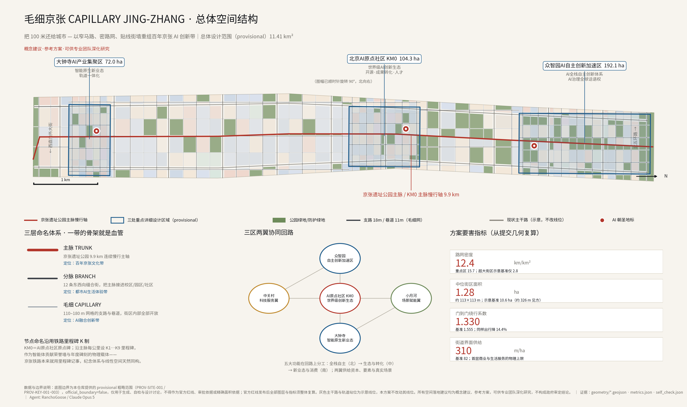
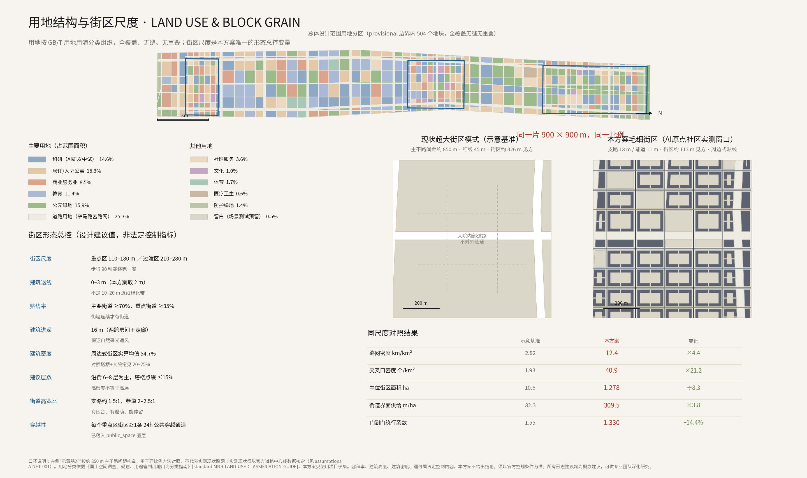
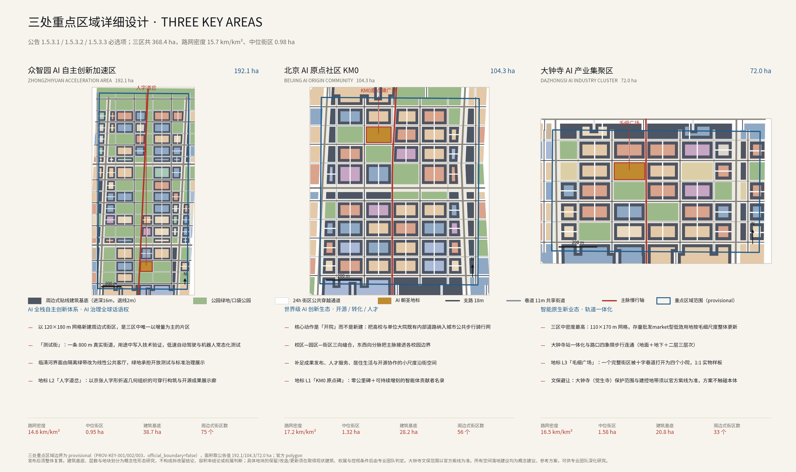
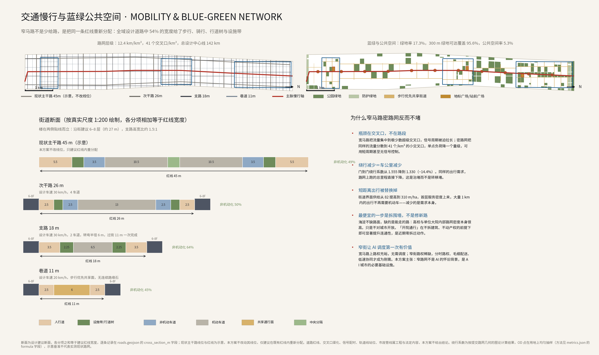
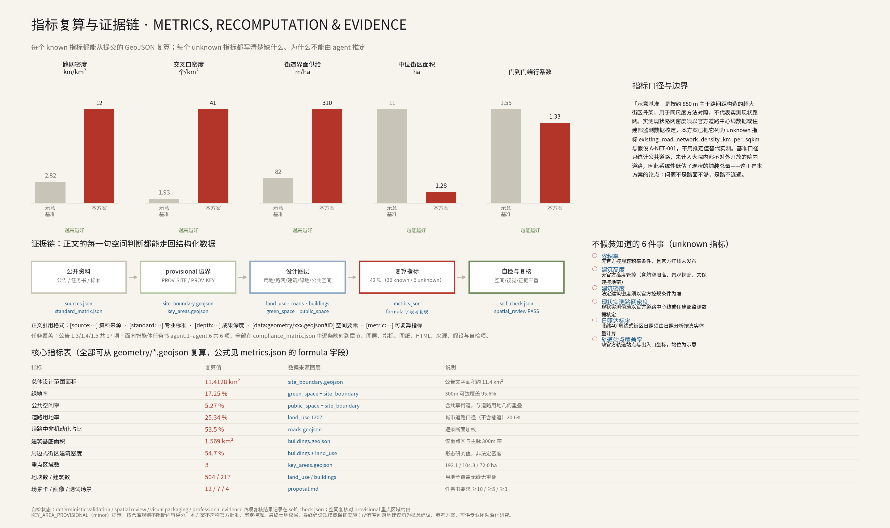

# Fine Jing-Zhang: Reorganize the Centennial Jing-Zhang AI Innovation Belt through narrow side streets, dense road networks, and contiguous street facades.
## Give 100 meters back to the city — with narrow streets, dense street networks, and edge-line street walls, reorganize the Centennial Jing-Zhang AI Innovation Belt.

> This entire document is an **Open Co-Creation Conceptual Recommendation** for reference by professional teams to deepen their research; it does not replace statutory planning, does not constitute a government approval conclusion, and does not constitute an implementation commitment.

One hundred years ago, Zhan Tianyou solved the slope issue at Qinglong Bridge using an "M" shape turnaround: by walking a bit to the side, the overall climb became higher and faster. This was not detouring; it was topology.

One hundred years from now, this railway corridor will host an AI innovation belt. This proposal posits that: **the most scarce resource in this land is not computing power, not land indicators, nor industrial policies, but "places where one can walk."** The super-block model in Beijing's urban district cuts 43.6 square kilometers into dozens of isolated courtyards, often requiring a person to walk nearly twice the distance around a 45-meter-wide road to reach the adjacent building, crossing a junction that requires waiting twice at a signal, and walking for ten minutes in an open field without shade, shops, or places to pause. **The physical foundation of innovation is the density of encounters, and the physical foundation of the density of encounters is street density.**

So this plan only changes one variable: **block scale**. All other conclusions—form, use, Public Space, scenarios, and operations—are derived from this variable.

---

## Design Basis and Source List

This proposal is based on the first reference to the "Centennial Jing-Zhang AI Innovation Belt Urban Design International Qualification Pre-Review Announcement" issued by the Haidian Branch of the Beijing Municipal Commission of Planning and Natural Resources [source:OFFICIAL-ANNOUNCEMENT], and the agent task is based on excerpts from the "Task Book for Conducting the Centennial Jing-Zhang AI Innovation Belt Urban Design Open Call for Global Participants" [source:AGENT-TASKBOOK]. We have also fully read the structured site data in the repository under `brief/site-package/` [source:SITE-PACKAGE], the public data registration form [source:SOURCE-REGISTRY], and the agent processing data package [source:PROCESSED-FACT-PACK]. The spatial basis uses the temporary rough boundaries provided by the repository [source:BOUNDARY-SOURCE] and the temporary scope of three key areas [source:KEY-AREA-SOURCE]. (Centennial Jing-Zhang AI Innovation Belt Open Call for Urban Design) Professional standards are based on six documents that preserve local snapshots within the warehouse: [standard:PROJECT-OFFICIAL-ANNOUNCEMENT], [standard:PROJECT-AGENT-OPEN-CALL-TASKBOOK], [standard:MOHURD-URBAN-DESIGN-MEASURES], [standard:MOHURD-CONTROL-DETAILED-PLANNING], [standard:MNR-LAND-USE-CLASSIFICATION-GUIDE], and [standard:MOHURD-ARCH-DESIGN-DEPTH-2016].

**Boundary Precision Statement (an essential self-limitation of this proposal).** The Official Planning Boundary has not yet been released. The submitted `geometry/site_boundary.geojson` and `geometry/key_areas.geojson` are all marked with `official_boundary=false`, `geometry_role="provisional_constraint"`, and `boundary_precision="provisional_rough"`, and are intended only for the generation, visualization, self-check, and design discussion of this proposal. They **must not be used as the official planning boundary, approval basis, precise area reference, or legal control conclusion**. The calculated area of the submitted range is [metric:site_area_sqm] (11.4128 km²), which is of the same order of magnitude as the announced text area of approximately 11.4 km² but not equivalent. Once the official polygon is released, land use, road network, buildings, green spaces, **Public Spaces**, phased development, and all indicators must be **re-calculated in their entirety**, rather than replacing individual files. The key areas cover an area of 192.1 / 104.3 / 72.0 hectares as announced, with the number of key areas [metric:key_area_count] being 3, as shown in [data:geometry/key_areas.geojson#PROV-KEY-001], [data:geometry/key_areas.geojson#PROV-KEY-002], [data:geometry/key_areas.geojson#PROV-KEY-003]. The boundary of the range is seen in [data:geometry/site_boundary.geojson#SITE-001].

**External Referential Boundaries.** This proposal cites the policy and standard origins of the "narrow streets, dense network" concept (the road layout concept proposed in the guidelines for urban planning and management issued after the 2016 Central Urban Work Conference, and the requirement in the Standard for Urban Comprehensive Transportation System Planning GB/T 51328-2018 that the road network density in built-up areas should not be lower than 8 km/km²). These documents are **not preserved as local snapshots** in this repository; hence, they are only referenced publicly as design orientations and are not formal scoring authorities. Their provisions must be cross-referenced with the original text during the professional deepening phase (refer to `assumptions.json` A-STD-001). Similarly, all judgments involving current measured data are handled in the same manner: this proposal does not have official road centerline data, so **it does not provide the actual measured values of the current road network density**; instead, it constructs a clearly labeled "illustrative benchmark" for comparative purposes at the same scale (refer to the following and [metric:baseline_road_network_density_km_per_sqkm]).

The current conditions diagnosis is constrained by [depth:existing_conditions_diagnosis]. The diagnostic conclusion is straightforward and can be directly verified by the geometry submitted by this proposal: **the problem with this land is not a lack of road surface, but a lack of road connectivity.** The indicative baseline public road land ratio [metric:baseline_road_land_ratio] is only 12.30%, which appears to be "land-efficient," but this metric only counts public roads and does not include the numerous internal roads within universities, research institutions, large compounds, and closed residential areas that are not open to the city. Including these internal roads, the actual paved surface area is not low— they simply do not form a network. This is why the first immediate action of this proposal is "demolish the walls" rather than "build new roads."

## Three-Level Scope Framework

The plan is organized into three levels as determined by the announcement, with a "judgment—drafting—validation" relationship between the three levels, rather than three sets of entirely independent drawings [depth:three_level_scope_framework].

**Coordinated Research Area (approximately 43.6 km²)** addresses the questions regarding the judgment of industrial ecology and the future urban form: how the AI innovation chain can be spatially organized, how the Three Zones and Two Wings can form a synergistic loop, and how the one belt can achieve global recognition. This layer does not add any pseudo-precise red lines.

**Overall Design Area (approximately 11.4 km², as submitted in this plan)**: Address the mapping questions by converting judgments into land use, road networks, buildings, green spaces, Public Spaces, and phased review layers, achieving the depth of Regulatory Detailed Planning in Urban Design. Within the submitted range, the land use elements are divided into [metric:land_use_parcel_count] parcels (including [metric:block_count] blocks), generating [metric:building_count] perimeter-style block Building Footprints, and [metric:total_centerline_length_km] kilometers of designed road centerlines.

**Key-Area Detailed Design Area (368.4 ha, three areas)** Answer verification questions: Validate the block, building, transportation, Public Space, and AI scenarios at a real-world scale. The median block area in the three zones [metric:median_key_area_block_area_sqm] (approximately 0.98 ha, i.e., about 99×99 m), with a road network density [metric:road_network_density_key_areas_km_per_sqkm] of 15.72 km/km².

The three-level scope and the corresponding relationships with all announcement tasks and agent tasks are recorded in `compliance_matrix.json`, covering 17 items from announcements 1.3.1–1.5.3.3 and 6 items from agent.1–agent.6. Each item maps to sections, layers, indicators, drawings, HTML pages, sources, assumptions, and self-inspection items.

## Overall Concept, Naming System, and Visual Identity (agent.1)

**Overall Concept and Main Name: Capillary Jing-Zhang / CAPILLARY JING-ZHANG.** The declarative subtitle is "Give the 100 Meters Back to the City" — 100 meters is both the block scale of this proposal and a distance that a person can walk and remember in one minute. Choosing "capillary" over "grid" is because the significance of a capillary does not lie in its size, but in **it being the only level that can deliver nutrients to every cell**: active veins may be large, but without capillaries, tissues still die. This is the pathology of super-blocks.

**Naming System (Three Layers, Corresponding to the Three Positions):**

| Level | Name | Spatial Object | Corresponding Location |
| --- | --- | --- | --- |
| Level 1 | Main Axis TRUNK | Jing-Zhang Heritage Park 9.9 km Continuous Pedestrian and Cyclist Axis | Centennial Jing-Zhang Cultural Belt |
| Level 2 | Branch BRANCH | 12 east-west alignment streets, connecting the main artery to the campus, park district, and community | Urban AI Living Experience Belt |
| Level 3 | Capillaries CAPILLARY| 110–180 m grid streets and alleys, with all block interiors open | AI Fusion Innovation Belt |

**Node naming follows the railway mile markers using the K system.** The original point community's original point monument is named **KM0**, with mile markers K1…K9 set every kilometer along the main axis from south to north. This choice is not merely rhetorical: the Jing-Zhang Railway originally used mile markers for record-keeping, and the organizers hope to establish an "Intelligent Body Honor Wall, Artificial Intelligence Milestones, Open Source Achievement Nodes, and Global Developer Honor Wall" that itself is a system requiring continuous linear spatial arrangement and annual additions. **The memorial system and linear space are naturally isomorphic here,** and no additional language is needed. (AI Origin)

**Logo and Visual Identity Direction.** Taking the "person" character shape of Zhan Tianyou's "person" character zigzag line as the theme: two lines intersect and then turn back, rising together, abstracted as a "person" node supported by a fine grid. It simultaneously conveys three meanings—Jing-Zhang Railway's technical symbol, the intersection of the road network, and a "people-oriented" urban declaration. The extension rules are three line widths corresponding to three levels of naming (the main vein is the thickest, the capillary is the thinnest). The color system: Jing-Zhang Red `#B3352A` (rust color of the rail, the main color), Ink `#16181C`, Paper `#F7F4EE`, AI Blue `#1F5C8B` (analysis and data), Shade Green `#6E8B5A` (Public Space). **Copyright Notice: The logo direction of this plan is a pure geometric construction description, not using any third-party trademarks, fonts, images, paper images, or portraits; it is recommended to use open-source licensed fonts such as SIL OFL (such as Source Han Serif / Noto Sans CJK) to ensure future clearance for use.** All drawings in this article are generated from the submitted geometry by this plan's code, see `report/copyright_statement.md`.

**Coordinated Loop of Three Zones and Two Wings.** Zhongzhiyuan (North) bears the Full-Stack Independent AI Innovation System and AI governance discourse; AI Origin Community (Central) bears the world-class AI Innovation Ecosystem and technology transfer; Dazhongsi (South) bears the intelligent native new business models and integrated rail consumption. Zhongguancun Technology Services Wing supplies capital, elements, and technological services; Xiaoyue River Scenario Enablement Wing supplies real-world scenarios and urban living interfaces. The division of labor among the five functional areas on the loop is "North end creates, Central end transfers, South end uses, and the two wings supply capital and scenarios." The overall spatial structure is constrained by [depth:overall_spatial_structure], with the layout evidence provided by [data:geometry/land_use.geojson#LU-0001] and [data:geometry/roads.geojson#RD-0001].

## Coordinated Research Area: Industry and Future City Research

**Global AI and Innovation Ecosystem Case Studies (7 cases, only write verifiable mechanisms, do not include investment amounts, revenue figures, or company lists)** [depth:overall_spatial_structure]:

| # | Case Study | Comparability with Jing-Zhang | Lessons to Be Drawn | Direct Implications for This Proposal |
| --- | --- | --- | --- | --- |
| 1 | London King's Cross / Knowledge Quarter | Both as railway land regeneration projects, similarly anchored by cultural institutions and research institutions | Single developer holding long-term ownership, Public Space precedes buildings, fine-grained street grid | Main arteries first, streets opened up first, with industry entering subsequently |
| 2 | Barcelona 22@ Poblenou | Industrial Zone Transformed into an Innovation District, with the Eixample Grid Directly Referencing the Block Scale of This Plan | Suggest a Special Land Use Category to Bind "Renovation" with "Incorporation of Public Facilities" | Recommend an Elastic Land Use Tool Corresponding to "Blank Spaces/Scenario Testing" |
| 3 | Boston Kendall Square | Conversion zone adjacent to top-tier universities, most similar to the academic cluster area | **Lessons Learned**: Early high-rise towers and large setbacks led to a dead ground floor, necessitating later specific regulations to activate the first floor | The ground-floor interface must be a mandatory requirement from day one and cannot be remedied later |
| 4 | Cornell Tech in New York | Land Supply Mechanism for Long-Term Commitment through Competition | A contractual structure where the government trades land for long-term research and employment commitments | Research on the land supply mechanism for Zhongzhiyuan |
| 5 | Paris Station F and Left Bank of 13th Arrondissement | Railway Garage Converted into Startup Space | Large Indoor Public Space + Surrounding High-Density Neighborhoods Together Hosting | Dazhongsi Existing Large Spaces Can Be Referenced |
| 6 | Tokyo Shibuya / Daishanma | Transit-Oriented Redevelopment | Station-City Integration, Three-Dimensional Pedestrian Network, Floor Area Ratio Transfer Tool | Method for Four Quadrant Pedestrian Connectivity at Dazhongsi Station |
| 7 | Helsinki Kalasatama | Urban Space as a Real Test Bed | Resident Co-Creation + Clear Entry and Exit Mechanisms for Experiments | Governance Framework of the "Scenario Access Sandbox" in This Proposal |

**AI Innovation Ecosystem Map (Element-Space Mapping)** [depth:overall_spatial_structure]: Origin (universities and research institutions, academic road) → Pilot Testing and Testing (real streets, Zhongzhiyuan "test street") → Transformation (AI Origin Community, KM0) → Industry and Consumption (Dazhongsi) → Capital and Technology Services (Zhongguancun Wing) → Scenarios and Life (Xiaoyuehe Wing) → International Communication (annual activity system). The spatial locations of eight categories of elements—land, space, industry, capital, talent, computing power, data, and scenarios—are addressed in this plan only in terms of "where they fall" and not in terms of "who gets them and how much"—the latter being matters of industrial and fiscal policy, not Urban Design outcomes, nor content that an intelligent system can infer.

**The Core Question in the Study of Future Urban Form: Will AI Make Cities More Dispersed or More Dense?** This proposal judges that cities will become **more dense, but in a different form**. After remote collaboration meets the need for "having to be in the same building," people still gather, with the reason for gathering shifting from "adjacent workstations" to "whether they can bump into each other by chance or whether they can immediately find someone to try something out." The space that corresponds to this need is not a larger park or industrial zone, but **finer streets and more entrances**. The street frontage supply indicator [metric:street_frontage_supply_m_per_ha] in this proposal reaches 309.54 m/ha, with the baseline indicator [metric:baseline_street_frontage_supply_m_per_ha] at 82.26 m/ha—**the number of doors and windows on the ground floor increases by 3.8 times, and the number of potential encounters also increases by an order of magnitude**. This is the proposal's most substantive spatial response to the "AI Integration Innovation Belt."

## Overall Design Area: Urban Renewal and Regulatory-Plan-Level Urban Design

**Five Design Principles (Suggested Values, Not Statutory Control Indicators).** This scheme compresses all form judgments into five verifiable rules, which are written sequentially into the attributes of the elements in `geometry/land_use.geojson` and `geometry/roads.geojson`. Anyone can verify the submitted data against these rules.

1. **Neighborhoods**: Focus area 110–180 m, transition zone 210–280 m. The median block area in the submitted range [metric:median_block_area_sqm] is 1.28 ha (approximately 113 m square), with a baseline reference [metric:baseline_median_block_area_sqm] of 10.63 ha (approximately 326 m square) — **8.3 times smaller**.
2. **Streets:** Side Lane 18 m, Lane 11 m, Secondary Arterial 26 m. The current Major Arterial 45 m alignment will remain unchanged, with only a reallocation within the right-of-way suggested.
3. **Fringe**: setback of 0–3 m (this plan uses 2 m), with a recommended frontage rate of ≥70% for main streets and ≥85% for key streets, prohibiting continuous closed walls exceeding 30 m.
4. **Depth and Height**: Building depth is 16 m (two bay rooms plus a corridor, ensuring natural daylight and ventilation), with a suggested height of 6–8 floors along the street, with tower accents not exceeding 15% of the total. The perimeter block coverage ratio [metric:mean_perimeter_block_coverage_ratio] for the surrounding block is 54.74%, and the length-weighted street wall height-to-width ratio [metric:mean_street_wall_height_width_ratio] is approximately 1.96. (Building Footprint)
5. **Crossing**: Each key area block shall have at least 1 public 24-hour crossing channel, which is documented in `geometry/public_space.geojson`.

High density does not equal high-rise, which is the fundamental difference between this scheme and the mainstream development models in China. The tower approach with increased setback and expansive lawns can achieve high Floor Area Ratios but cannot create streets: the ground floor area of the towers is small, the street walls are discontinuous, and there are no doors at the first level. The greenery in the setbacks is not accessible. This scheme advocates for **"substantial mid-density"** —— perimeter blocks with buildings ranging from 6 to 8 stories. The buildings are arranged in a continuous facade along the street, with courtyards located within the block rather than on the street. This results in a Building Coverage Ratio ([metric:mean_perimeter_block_coverage_ratio] approximately 55%) that is much higher than the common 20–25% in China, but with lower Building Heights.

**Land Use Structure.** The submitted area has been fully, seamlessly, and non-overlappingly divided based on a subset of the project from the [standard:MNR-LAND-USE-CLASSIFICATION-GUIDE], ensuring no gaps or overlaps in spatial review [depth:land_use_layout]. The primary land uses include research and development (AI R&D pilot) at 14.6%, park and green spaces at 15.9%, residential and talent apartments at 15.3%, education at 11.4%, commercial and service industries at 8.5%, and road land at 25.3%. The remaining land uses are for community services, culture, sports, healthcare, protective green spaces, and blank spaces. The blank spaces are specifically reserved for scenario testing, serving as a spatial response to the "uncertainty of the AI industry" in this plan: **the best planning action when unsure about what to build is to leave low-intensity spaces that can be repeatedly tested and adjusted, rather than locking in specific uses in advance.** Land use evidence can be found at [data:geometry/land_use.geojson#LU-0002].

**Development Intensity.** Development intensity control is constrained by [depth:development_intensity_controls]. This scheme **does not provide a conclusion on the Floor Area Ratio**: official planning conditions and the Official Planning Boundary have not been released, and the Floor Area Ratio is unspecified.[metric:floor_area_ratio 的状态为 unknown](See `metrics.json` Middle `floor_area_ratio`, `building_density`, `building_height_m` three unknown indicators and their reason fields). The relationship between form and intensity can be discussed: at a Building Coverage Ratio of 55%, with a form consisting of 6–8 stories, the net block Floor Area Ratio roughly falls within the range of 3.0–4.0, while the gross floor area ratio after deducting roads and green spaces is approximately in the range of 2.0–2.5 — this is the scale of Eixample in Barcelona and the central districts of Paris, also indicating **that super-tall buildings are not necessary to achieve a substantial development volume**. The above numbers are for reference in terms of magnitude of formulating, not as suggested control indicators, and must be confirmed according to the official control plan conditions.

**Building Height, Massing, and Aesthetic Character** are constrained by [depth:height_massing_character]: The height of the street walls is suggested to be unified within a range of 24–30 meters to form a continuous base, with towers receding into the interior of the block or at key nodes, and the fifth roof level included in the design; specific heights must be determined after considering aviation height restrictions, landscape view corridors, cultural heritage construction control zones, and solar access checks, and this plan does not provide a height conclusion. The Building Footprint is shown in [data:geometry/buildings.geojson#BLDG-0001], with a total base area of [metric:building_footprint_area_sqm] (1.569 km², only covering three key areas and a 300 m main axis belt, not representing the total building area across the entire region).

**Comprehensive Capacity Assessment Method.** This plan proposes that the capacity assessment should be based on "network capacity" rather than "plot capacity": the true bottleneck is the intersection throughput capacity, pedestrian comfort, and municipal interface capacity, rather than the plot itself. The assessment method suggests the following: allocate intersection loads based on the submitted road network, verify the supply of first-floor services by the length of the street facade, verify the supply of open spaces by the 300 m green space accessibility coverage, and verify the supply of transportation by the 800 m coverage of the rail station. The first three items have been calculated in this plan, while the fourth item is marked as "unknown" due to the lack of official rail station and entrance coordinates.

## Detailed Design of Key Areas

The detailed design for three key areas has been reviewed by [depth:three_key_area_detailed_design]. The three zones collectively adhere to five design principles, but the **dominant actions are different: the northern end relies on new construction, the middle section on opening up spaces, and the southern end on updating.**

### Zhongzhiyuan AI Independent Innovation Acceleration Area (192.1 ha, Announcement 1.5.3.1)

Positioned as a carrier for the Full-Stack Independent AI Innovation System and AI governance global discourse authority. Spatial actions: organize the new peripheral neighborhoods with a 120×180 m grid, which is the only area among the three that primarily focuses on incremental development; transform the isolating green belt along Qinghe interface into a linear public living room, where the green space no longer serves merely as a barrier but also bears the functions of open testing, standard governance demonstration, and low-carbon innovation interaction; strengthen external traffic organization to connect with the North Fifth Ring Road and the Jingzhang Expressway, but confine the connection points to the edge of the area, preventing rapid transit from penetrating the internal blocks.

**Core Space Product «Test Street Test Street»**: A real urban street of approximately 800 meters in length, with the "technology validation" purpose explicitly written into the land use and management rules, allowing for the routine testing of low-speed autonomous shuttles, robot deliveries, and smart facilities in a **real, non-enclosed** environment. The accompanying mechanisms include time-based partial enclosure, manual takeovers, liability insurance, and public awareness. This is the "full-stack autonomy" transitioning from the laboratory to the city's last mile, and it is the physical facility that this proposal deems most worthy of priority construction. The landmark **L2 «The Switchback»** is located at the intersection of Test Street and the main artery: a publicly accessible construct organized by a zigzag geometric return, with two pedestrian paths intersecting and turning back, and below it is an open-source results showcase corridor. For more details, see [data:geometry/key_areas.geojson#PROV-KEY-001].

### Beijing AI Origin Community KM0 (104.3 ha, Notice 1.5.3.2)

Positioned as the origin point for a world-class AI Innovation Ecosystem: on-campus innovation, incubation and conversion of results, talent special zone, open-source system, and brand events. **The core action of this area is 'opening the institute', not building anew.** The road network density along the Academy Road corridor within universities and research institutions is already high, but the issue is their urban isolation. This plan suggests: without demolishing buildings or changing ownership, using **public right of way and time-sharing access** to incorporate selected paths of the existing internal roads of the campus and park into the city's public pedestrian and cycling network, achieving a three-way integration between campus, park, and neighborhood. This is the most cost-effective action in the entire plan: it requires almost no engineering investment but can immediately improve connectivity.

**AI is here for necessity, not just decoration**: The biggest concern with the opening is safety and management costs. The time-sharing scheduling, appointment-based access, and aggregated monitoring of abnormal gatherings (without facial recognition or establishing personal trajectory profiles) are tasks that can be carried out by the Urban Agent and must be backed by Human Review. Complement the results release hall, talent services, living spaces, and open-source collaboration with small-scale street-facing areas. Landmark **L1「KM0 Origin Marker」**: a zero-kilometer marker where the body itself is a sustainable, incrementally customizable smart entity and a contributor list, directly connected to the memorial system of the organizers. For more details, see [data:geometry/key_areas.geojson#PROV-KEY-002].

### Dazhongsi AI Industry Agglomeration Zone (72.0 ha, Notice 1.5.3.3)

Positioned as a smart native new business model and integrated rail consumption. Among the three zones, the highest density is adopted, using a 110×170 m grid; the dominant action is **stock renewal**: wholesale market-type inefficient land use is re-zoned at a capillary scale, forming a smart body, smart terminals, content consumption, data elements, and digital assets urban service interface. Around Dazhongsi station, station-city integration and pedestrian connectivity at the four quadrants of the intersection are recommended, with a combination of ground, underground, and second-level connections, with specific plans requiring professional arguments from rail, municipal, and transportation engineering disciplines.

Landmark **L3「The Capillary Yard」**: Divide a complete block into four small courtyards by using a cross-axis street, itself serving as a 1:1 physical prototype—allowing everyone to judge whether this scale is comfortable or not. **Cultural Relics Protection**: The protection range and construction control area for Dazhongsi (Juesheng Temple) must be based on the official purple line. This plan places a merely indicative reminder range in `geometry/constraints.geojson` (`official_boundary=false`), intended to remind design avoidance but **not to be used as an approval reference**. The plan does not touch the cultural relics themselves, see [data:geometry/constraints.geojson#CON-0015]. The range is shown in [data:geometry/key_areas.geojson#PROV-KEY-003].

## AI Innovation Ecosystem, Personas, and AI+ Scenarios

**Definition of "AI-Native" in this Proposal**: A scenario is only considered AI-Native if it **only holds or has value under narrow street and dense network conditions**; if it also holds on a 45 m wide road, it merely carries an AI label as a traditional scheme. On wide roads, road rights are abundant and do not require scheduling; on narrow streets, road rights are scarce, making time-sliced road rights, fine-grained delivery, and low-speed coordination a genuine necessity for the first time. **The narrow street network is not an AI nostalgic backdrop; it is the prerequisite for the value of urban scheduling in an AI city to be established.**

**Seven User Archetypes ([metric:persona_count], as required by the Task Statement to be at least 5):**

| Image | Core Needs | Spatial Response | Privacy and Governance Boundaries |
| --- | --- | --- | --- |
| Open Source Developer | Release, Collaborate, Night Work, Community Reputation | KM0 Open Source Release Hall, Public Code Wall, 24/7 Accessible Alleys and Coffee Interface | No personal behavior tracking; contribution registration must be actively submitted by the individual |
| Founding Team | Low-Cost Space, Computing Entry Point, Real Test Ground | Zhongzhiyuan Test Street, Edge Computing Hub, Reserved Plot | Test Access Tiered; Computing and Data Services Require Separate Authorization |
| Corporate and International Visitors | Exhibitions, Business, Reception, Recruitment | Dazhongsi International Roadshow Living Room, Station Square, Continuous Walkable Arrival Path | Corporate Logos and Case Studies Must Be Cleared for Use |
| Surrounding Residents (Including Seniors) | Commuting, Buying Groceries, Leisure, Low-Impact Updates | A Pocket Park Every 300 m, Continuous Shade, First-Floor Living Services, Continuous Accessible Pathway | Do Not Use Resident Profiles for Commercial Recommendations; Updates Must Be Approved Through Public Engagement Process |
| College Students and Faculty | Cross-Institutional Collaboration, Technology Transfer, and Daily Commuting | Campus Network for Institutional Interaction, Campus-Area Integration Streets, and Technology Transfer Hubs | Campus Data and Research Outputs Require Authorization; Open Access Times Determined by the Institution |
| Delivery Riders and Couriers | Easy to Find the Door, Park the Vehicle, and Avoid Detours | Fine-Grained Delivery Micro-Hubs, Loading and Unloading Facilities Strip, Machine-Readable Identifiers for Doorplates and Entrances | Do Not Compress Delivery Time Limits with Algorithms; Do Not Collect Personal Biometric Features |
| Accessible Travelers | Path Continuity, Ramp Compliance, One-Step Crossing | Crossing Distance ≤ 11 m One-Step Completion, Shared Street with No Continuous Curb, Continuous Accessible Surface | Auxiliary Navigation is an Optional Service, Not Mandatory Location |

**Twelve AI Scenario Cards ([metric:scenario_card_count], task book requires a minimum of 10 cards).** Each card specifies the service target, spatial carrier, data boundaries, and Human Review method. The location of the scenario nodes is specified in the `geometry/constraints.geojson` file under the SCENARIO_NODE elements (a total of [metric:scenario_node_count]).

| Card Number | Scenario | Spatial Carrier | Why It Needs Narrow Streets and Dense Networks | Data and Human Review Boundary |
| --- | --- | --- | --- | --- |
| S-01 | Curb Choreographer | Citywide Alleys and Laneways | Due to the scarcity of curb rights on narrow streets, they must be switched between through, loading/unloading, vending, and pedestrian modes at different times | Only public occupancy declarations and aggregated traffic are used; schedules must be published and can be overridden manually |
| S-02 | Capillary Logistics | Key Micro Hub | Heavy vehicles stop at the street boundary, with the final delivery completed by low-speed small vehicles and freight bicycles | No recipient information is collected; robots must be remotely takeoverable |
| S-03 | Campus Permeability | AI Origin Community | Time-division open courtyards serve as the lowest-cost source for a dense network | Aggregate pedestrian flow and anomaly aggregation statistics without facial recognition or building personal trajectories |
| S-04 | Slow-Street Coordination | Zhongzhiyuan Testing Street | Small intersections are suitable for vehicle-road coordination and low-speed autonomous driving at 20–30 km/h | Testing must be graded, access restricted to time and space windows, and full manual take-over allowed |
| S-05 | Ground-Floor Agent | Three Zones Along the Street | Only after the street-facing area increased by 3.8 times did vacancy matching become a real issue | Only use public tendering and permit information; do not engage in targeted price discrimination |
| S-06 | Shade Agent | Full-District Street Facility Strip | For Beijing's hot summers and cold winters, the shading of narrow streets and winter solar access must be addressed on a street-by-street basis. | Public meteorological and measured data; planting schemes must be reviewed by horticultural professionals |
| S-07 | Access Continuity | Comprehensive Slow-Travel Network | The value of a dense network of streets depends on the continuity of its weakest link | Gap List Public; Remediation Priorities Must Involve Review by Persons with Disabilities |
| S-08 | Scenario Access Sandbox | Blank Plot and Test Street | Clear entry criteria, windows, and rollback mechanisms are essential for real street testing | All applications, approvals, incidents, and exit records are publicly accessible and verifiable |
| S-09 | Emergency Reach Validation | Comprehensive Network | **The greatest concern about narrow streets is emergency access**, which must be simulated and tested on a regular basis. | Results to be judged by the fire and emergency services departments; AI will not make a determination. |
| S-10 | Construction Disturbance Choreographer | Phased Implementation Scope | The encrypted road network must be constructed in segments while ensuring continuous passage at any given moment. | Construction schedule notice; channel for affected residents to express objections |
| S-11 | Milestone Ledger | KM0 and Alongline Milestones | Continuity Addition to the Linear Spatial Memorial System | Contributors' Names Must Be Authorized by the Author; Records Must Be Immutable and Publicly Verifiable |
| S-12 | Counterfactual Digital Twin | Entire Region | The district-scale plan must be subject to repeated simulation and public scrutiny. | Model, parameters, and code must be open; conclusions should be marked with uncertainty and not replace formal approval. |

**Four Testing and Validation Scenarios ([metric:test_validation_scenario_count], as required by the task book to be at least 3):** (1) Low-speed autonomous shuttle service on Zhongzhiyuan Testing Street; (2) Robot last-mile delivery in the AI Origin community and Dazhongsi; (3) Embodied intelligent service robots in public buildings and street environments; (4) On-road validation of emergency vehicle accessibility under dense road networks. All four scenarios adhere to the same governance framework: tiered access, time and space limitations, mandatory human take-over capability, prior assumption of responsibility and insurance, public notification and appeal channels, and rollback capability. **This plan clearly states that the above are proposed testing mechanisms, not approved operational arrangements.**

The association between scenes and spaces, as well as the indicators, can be seen in [data:geometry/public_space.geojson#PUBLIC-0001], [data:geometry/green_space.geojson#GREEN-0001], as well as [metric:public_space_ratio] and [metric:green_ratio].

## Land Use, Building Scale, and Retain-Renovate-Demolish Strategy

**The Demolish–Renovate–Retain () method, not the  conclusion.** This proposal does not include current building data, ownership data, or control plan conditions; therefore, it **does not provide any specific  conclusions for individual parcels** — this is the only deliverable that must be presented in the form of "method + pending calibration list" as required by the [depth:retain_renovate_demolish]. The classification method proposed in this scheme is sorted by **the irreversibility of the actions**, not by the age of the buildings: (Demolish–Renovate–Retain Strategy)

| Category | Evaluation Criteria | Typical Actions | Involvement of Property Rights and Demolition |
| --- | --- | --- | --- |
| A Zero Demolition Category | Can be Completed Without Changing the Building or Property Rights | Reallocation of Existing Right-of-Way Cross-Sections, Unit Courtyard Divided-Time Public Passage, Activation of First Floor Interfaces, Temporary Crossing Passages | No |
| B Interface Renovation Category | Only alter the street-facing interface and site | Remove continuous solid walls, convert setback green spaces into accessible areas, and add entrances | Generally no, requires consent from the property owner |
| C Existing Update Category | Low-efficiency land is re-zoned at a fine scale during updating or transfer | Redistricting of blocks, network densification, and surrounding reconstruction | Yes, must undergo statutory procedures |
| D Unspecified Category | Lack of Current Conditions, Ownership, Zoning Plan, Cultural Heritage, or Municipal Conditions | All to be Entered into the Calibration List | To Be Determined |

**The sequential principle is the substantive assertion of this scheme: complete all A-class projects before considering C-class projects.** Because A-class projects have the lowest irreversibility, the fastest results, and can first validate whether "narrow streets in a dense network are truly more useful" in a real city — if the validation fails, the social cost is nearly zero. This treats "Urban Renewal" as a rollable experiment rather than a one-time project.

Urban Design aspects, the submitted range of Building Footprint total area [metric:building_footprint_area_sqm], comprising [metric:building_count] individual perimeter-style building footprint elements, covering three key areas and a 300 m belt along the main axis. Building forms and depths are organized according to the depth requirements of the results from [standard:MOHURD-ARCH-DESIGN-DEPTH-2016], but this round only reaches the level of mass and interface studies at the urban design tier, not delving into the architectural design depth. Total building scale, Floor Area Ratio, Building Coverage Ratio, Building Height, and setback distances are all statutory control contents. Without official conditions, all are listed as pending (see `metrics.json`'s unknown indicators and `assumptions.json`'s A-CONTROLS-001).

## Transport, Rail, Municipal Infrastructure, and Public Services

Traffic, tracks, active transportation, and parking are constrained by [depth:traffic_rail_slow_parking], while municipal operations and New Infrastructure are constrained by [depth:municipal_new_infrastructure].

**Core Argument: Why Narrow Streets and Dense Road Networks Are Actually Less Congested.** This is a question that this proposal must address directly. Four reasons can be verified with submitted data:

*First, the bottleneck is at the intersections, not on the streets.* The wide-road approach concentrates traffic flow into a few super intersections, forcing signal cycles to be extended; in contrast, a dense network of streets distributes the same traffic flow across [metric:intersection_density_per_sqkm] (40.92 per km²) smaller intersections, with a baseline of only [metric:baseline_intersection_density_per_sqkm] (1.93 per km²). Only after a reduction of an order of magnitude in single-point load can the conditions be met for using short-cycle signals or even no signals.

*Second, the detour reduction equals the reduction in vehicle kilometers. This plan uses graph theory to calculate the **door-to-door detour factor**: it uniformly samples 400 origin-destination pairs (400–2500 m) within the submission range, including the "direct walk from the door to the nearest network segment," and then finds the shortest path. The result is [metric:network_detour_ratio] 1.3302, indicating the baseline [metric:baseline_network_detour_ratio] of 1.5547, **a decrease of 14.4%**. There is one methodological point that must be noted: OD points must be sampled uniformly on the **site** rather than on the network nodes—sampling on the latter would result in the coarse grid missing the "walk to the main road" segment, thereby systematically overestimating it; additionally, the access segments are charged based on straight-line distance, which is actually lenient for the benchmark of large blocks (in reality, free movement within large courtyards is not possible). Under the same travel demand, a reduction in total distance traveled is a form of congestion relief, not shifting the congestion to another location.

*Third, short-distance trips are replaced. The street frontage supply is increased from [metric:baseline_street_frontage_supply_m_per_ha] to [metric:street_frontage_supply_m_per_ha]. With the rise in first-floor service density, a significant number of trips within 1 km no longer require motor vehicles—**it is the demand itself that is reduced**.*

*Fourth, the costs must be made clear.* This plan's road land ratio [metric:road_land_ratio] is 25.34%, higher than the indicative baseline of [metric:baseline_road_land_ratio] at 12.30%. This cannot be ignored. Three points of clarification: First, when calculated according to the city road standard (excluding 11 m lanes, which also serve as internal public pathways within the neighborhood), the ratio is [metric:city_road_land_ratio_excl_lanes] at 20.64%; second, the baseline only counts public roads, not the internal, non-public pathways within the courtyards, **systematically underestimating the total paved area**; third, and most importantly — of the road land in this plan, [metric:nonmotorized_share_of_road_land] (53.54%) is allocated to pedestrian, cycling, tree-lined areas, and facilities, calculated by weighting the cross-sections of each road. **The extra land did not become additional lanes, but pedestrian paths and green spaces.**

**Street Cross-Section (The Sum of Each Component Equals the Right-of-Way Width, Recorded in the `cross_section_m` Field of `roads.geojson`):**

| Level | Red Line | Cross-Section Allocation | Design Speed | Non-Motorized Share |
| --- | --- | --- | --- | --- |
| Existing Major Road (Indicated, No Relocation) | 45 m | Pedestrian 5.5×2 + Facilities 2.0×2 + Non-Motorized 3.5×2 + Motorized 10.5×2 + Median 2.0 | 49 km/h | 49% |
| Secondary Street | 26 m | Pedestrian 2.5×2 + Facilities 1.5×2 + Non-motorized 2.5×2 + Motorized 13.0 | 30 km/h | 50% |
| Side Street | 18 m | Pedestrian 3.5×2 + Facility Strip (Tree Planting/Loading/Unloading/Parking) 2.25×2 + Motorized 6.5 | 30 km/h | 64% |
| Alley | 11 m | Pedestrian 2.5×2 + Shared Pathway 6.0 | 20 km/h | 45% (with shared pathway prioritizing pedestrian use) |

Suggest a turning radius of 6–8 m at intersections (rather than 15–25 m), with crosswalk distances completed in one crossing without a second crossing. The total length of the road centerlines in the entire design area is [metric:total_centerline_length_km] km, with a road network density of [metric:road_network_density_km_per_sqkm] 12.43 km/km², and a density of [metric:road_network_density_key_areas_km_per_sqkm] 15.72 km/km², and a baseline road network density of [metric:baseline_road_network_density_km_per_sqkm] 2.82 km/km². The road network is shown in [data:geometry/roads.geojson#RD-0020].

**Fire Safety and Emergency Response, Must Be Addressed Directly.** The most common concern about narrow streets is that fire trucks cannot access them. This proposal responds on three levels: First, the 11 m alleys and 18 m side streets meet the conventional fire lane width requirements, and the shared streets lack continuous curbs and have no height differences, providing better passage conditions than wide roads that are filled with numerous barriers and planters; Second, the dense network of streets offers **rescue path redundancy**—in large districts, there may be only one or two accessible entrances, and once blocked, there are no alternative routes, whereas in the fine-grained network, any node can be blocked but still have multiple alternative paths; Third, the fire truck access areas for high-rise buildings must be set within the district or on designated sections of road, which is a hard constraint that must be verified floor by floor during the building design phase. Scenario Card S-09 is specifically designed for the routine simulation and real vehicle validation of emergency accessibility, with **validation conclusions determined by the fire and emergency services authorities, not by the intelligent agents**.

**Parking and Railways.** Narrow streets do not accommodate on-street long-term parking; on-street space is reserved only for loading and unloading and temporary passenger drop-off and pick-up. Parking is centralized within the block and shared facilities, and is integrated with rail connections. Regarding the rail stations, the location and coordinates of the entrances and exits are not provided by official data. In this plan, the station forecourt is shown as a placeholder location (refer to the element labeled "Forecourt (placeholder)" in the `public_space.geojson` file). The 800 m coverage rate for the rail station is therefore marked as unknown. The rail line positions, bridges, tunnels, municipal pipelines, energy loads, and municipal capacities are all engineering and legal content, and this plan does not provide conclusions.

**Municipal Infrastructure and New Infrastructure.** It is recommended to group the edge-side computing nodes, distributed energy systems, micro-logistics hubs, and public service kiosks as **street-level facilities** along the facility belt and within the blocks, rather than concentrating them on separate parcels. The rationale for this approach aligns with the scale of the block: a dense network of service points is more accessible than a single large service center. Public service facilities should be arranged with a service radius of 300–500 m, corresponding to the scale of the block. Specific standards, pipe diameters, capacities, and locations must be determined by municipal professionals based on the existing network conditions.

## Blue-Green Network, Public Space, and Urban Character

Public Space by Blue and Green [depth:blue_green_public_space] Constraints, the guiding principles for the Urban Design appearance and Public Space integration.[standard:MOHURD-URBAN-DESIGN-MEASURES].

**Replace "green space ratio" with "accessibility" as the primary control metric.** High green space ratio does not necessarily mean the green space is useful: even if a large area of green space is allocated within setback lines, surrounded by walls, or separated by vehicular lanes, it does not generate accessibility. The submitted scope green space ratio [metric:green_ratio] is 17.25% (green space area [metric:green_space_area_sqm]), but the actual control target is the **300 m green space accessibility coverage ratio [metric:green_300m_access_coverage_ratio], which reaches 95.64%**—meaning that almost any location within the range has a green space that can be accessed within a 300 m walk. Structurally, it consists of three layers: the Jing-Zhang Heritage Park main axis (9.9 km continuous pedestrian axis), pocket parks approximately every 300 m, and protective green spaces along the ring road. The green spaces are detailed in [data:geometry/green_space.geojson#GREEN-0002].

**Public Space.** The public space rate [metric:public_space_ratio] is 5.27% (area [metric:public_space_area_sqm]), consisting of four categories: three landmark squares (with [metric:landmark_count] landmarks), station plazas, 24-hour public passage through blocks, and pedestrian-prioritized shared streets. **One important clarification regarding the metrics:** the public space area of shared streets overlaps geometrically with 1207 road uses, so the public space rate and road use rate **cannot be added together** — this is noted in the `metrics.json` corresponding metric's assumptions field. This is an intentional design stance: **the street itself is the largest public space**, and counting it as purely a transportation facility is an inheritance from the grand street paradigm.

**East-West Integration and North-South Connectivity (agent.4).** North-south connectivity is primarily carried by the main artery, with a focus on the continuous treatment of existing breakpoints such as across the North Fifth Ring Road, Zhi Chun Road, and the North Third Ring Road (specific engineering methods must be subject to professional argumentation); east-west integration is carried by twelve secondary arteries, connecting the main artery to the campuses, parks, and communities on either side. **The east-west connectivity is the true shortcoming of this corridor:** a north-south park that is surrounded by walls on both sides is merely a long green strip, not a Public Space of the city.

**Public Space Component Library (8-piece set, replicable, scalable, and cost-effective)**: continuous shaded tree-lined walkway, shared street surface with no high differential, seating edges (steps/bench/wall/tree pit seats), milestone and honor plaque modules, standard loading and unloading and micro-hub positions, accessible continuous surface, temporary event interfaces (power outlets/water supply/drainage/hanging points). The library's significance is to allow "capillaries" to be implemented segmentally, annually, and by different stakeholders while maintaining overall coherence.

**Urban Character.** The tone is suggested as "subtle continuity": brick red and gray ink are the main colors to echo the railway heritage. Street walls should be continuous, with windows in regular patterns, and the ground-floor transparency is recommended to be ≥60%. The roof, as the fifth facade, should be uniformly designed. The control must be clearly divided into three categories: official control (heritage protection, height limits, sightlines), design suggestions (materials, colors, interfaces), and pending conditions (no control lines are given where there is no evidence). This plan does not provide any pseudo-precise control lines in the absence of heritage or control plan evidence.

## Renewal Projects, Implementation Policy, and Phasing

Update project lists are constrained by [depth:renewal_project_list], and Phased Implementation is constrained by [depth:phasing_implementation], with the phasing range seen in [data:geometry/phasing.geojson#PHASE-1]. A total of [metric:renewal_project_count] update projects are proposed:

| Number | Project | Type | Phases | Main Dependent Conditions | Risks |
| --- | --- | --- | --- | --- | --- |
| JZ-01 | Existing Redline Cross-Section Reallocation Demonstration Segment | Traffic/Public Space | Near Term | Reassessment of Road Management Rights, Traffic Organization | Short-Term Fluctuations in Traffic Capacity |
| JZ-02 | Unit Compound and Campus Segmented Public Access | Governance/Slow Mobility | Near Term | Owner Consent, Safety Management Plan | Public Acceptance |
| JZ-03 | Three 1:1 Model Blocks (Including L3 Capillary Square) | Urban Design Demonstration | Near-Term | Land Availability, Temporary Construction Permits | Demonstration Results Not Meeting Expectations |
| JZ-04 | Jing-Zhang Site Park Main Axis Slow-Travel Discontinuity Integration | Public Space/Transport | Short-term to Mid-term | Conditions for Ring Road Crossing Project, Ownership of Space Under Bridges | Engineering Feasibility to be Argued |
| JZ-05 | 12 East-West Stichline Streets | Transportation/Slow Transit | Mid-term | Right-of-way, Ownership, Utility Relocation | High Complexity in Demolition and Coordination |
| JZ-06 | Zhongzhiyuan Test Street and Scenario Access Sandbox | Industry/Governance | Mid-term | Testing Admission Policies, Insurance, and Liability Framework | Policy Uncertainty |
| JZ-07 | Zhongzhiyuan Qinghe Linear Public Living Room | Blue/Green/Industrial Showcase | Mid-term | river blue line, ecological and flood protection conditions | Ecological and Flood Control Constraints |
| JZ-08 | KM0 Origin Marker and Honor Display System | Culture/Operations | Short-term—Long-term | Public Space Permits, Attribution Licensing | Long-term Operational Responsibility |
| JZ-09 | Dazhongsi Station Quadrant Pedestrian Connectivity | Transit-Oriented Development | Mid-term | Railways, Road Intersections, Utility Pipelines | Complex Engineering and Ownership |
| JZ-10 | Dazhongsi Inefficiently Utilized Land Updated at the Capillary Scale | Urban Renewal | Mid- to Long-Term | Control Detailed Planning Conditions, Ownership, Implementation Subject | Investment and Sequence Uncertain |
| JZ-11 | 300 m Pocket Park Network | Blue-Green | Mid-term | Land Retrenchment, Caretaker Entity | Long-term Maintenance Costs |
| JZ-12 | End-Side Computing Power and Public Services Street-Level Hub | New Infrastructure/Public Services | Mid—Long Term | Energy, Computing Power, Safety, and Operational Entity | Technology and Operational Maturity |

**Phased Logic (Independent of the 100-Day Call Cycle, Which Is for Submissions Only, Not Construction Sequencing):**

- **Recent Period (Zero Demolition Pilot):** Only perform Category A actions—right-of-way redistribution, opening courtyards for passage, and model blocks. The goal is to **prove its effectiveness before making irreversible investments**. The phased scope for Phase 1 is located in three key areas, see [data:geometry/phasing.geojson#PHASE-1].
- **Mid-term (Low-Intensity Land Redevelopment at the Capillary Scale)**: When low-intensity land is updated or transferred, it is re-zoned according to the new block scale, with east-west oriented streets being stitched together. The phased scope for the second phase is the ribbon areas along the main arteries.
- **Long-term (All-District Network Formation)**: All three indicators—road network density, street interface supply, and green space accessibility—must meet the standard across the entire district, forming a continuous network.

**Policy Recommendations for Implementation (All are recommendations and do not constitute government commitments):** First, incorporate "block scale, facade ratio, ground floor transparency, and public passage through the block" into the conditions of land sale and update agreements, as these factors are more decisive for urban quality than Floor Area Ratio; second, establish a **public passage servitude** as a regulatory tool, providing legal basis and compensation mechanisms for "opening courtyards"; third, develop flexible land-use tools corresponding to "buffer/scene testing," allowing for low-intensity, reversible temporary uses; fourth, standardize the components of Public Space to ensure overall coherence even when implemented in a fragmented manner; fifth, implement tiered access and public ledgers for all tests and open scenarios.

## Metrics, Area Recalculation, and Compliance Matrix

The recalculation of metrics is constrained by [depth:metrics_recalculation]. The `metrics.json` file contains 42 metrics, of which 36 are known and 6 are unknown. Each metric is documented with `status`, `value`, `unit`, `source_files`, `formula`, `confidence`, and `assumptions`; **every known metric can be recalculated using the provided GeoJSON by applying the formula field**, and all area calculations are uniformly projected to EPSG:4548.

**Indicators are categorized into three types and must not be mixed:** The first category consists of spatial indicators that can be recalculated directly from the submitted geometry (area, ratios, densities, block scale, interface supply); the second category includes control indicators that must be supported by official master plans or task book attachments (Floor Area Ratio, Building Height, Building Coverage Ratio, setback, road right-of-way, facility standards) — all of these will be listed as unknown and the reason for their absence will be noted; the third category comprises performance indicators that require ongoing calibration with operational and industrial data (participation rates, frequency of scene usage, talent density), which are not included in the `metrics.json` for this round to avoid misinterpreting operational aspirations as definitive planning conditions.

Core Metrics Overview (parentheses include indicative benchmarks):

- Site Area [metric:site_area_sqm]
- Road Network Density [metric:road_network_density_km_per_sqkm]
- Intersection Density [metric:intersection_density_per_sqkm]
- Network Detour Ratio [metric:network_detour_ratio]
- Median Block Area [metric:median_block_area_sqm]
- Street Frontage Supply [metric:street_frontage_supply_m_per_ha]
- Green Space Ratio [metric:green_ratio]
- 300 m Green Space Accessibility Coverage [metric:green_300m_access_coverage_ratio]
- Public Space Ratio [metric:public_space_ratio]
- Road Land Ratio [metric:road_land_ratio] Building Coverage Ratio [metric:nonmotorized_share_of_road_land]; street height-to-width ratio [metric:mean_street_wall_height_width_ratio]; perimeter block Building Coverage Ratio [metric:mean_perimeter_block_coverage_ratio].

**Compliance Matrix.** `compliance_matrix.json` covers a total of 17 items from announcements 1.3.1, 1.3.2, 1.3.3, 1.4.1, 1.4.2, 1.4.3, 1.5.1.1, 1.5.1.2, 1.5.2.1–1.5.2.5, 1.5.3.required, 1.5.3.1, 1.5.3.2, and 1.5.3.3, as well as 6 items from agents.1–agents.6. Each item is mapped to the report chapter, GeoJSON layer, indicator, drawing, HTML page, source ID, assumption ID, and self-inspection item ID. Professional standard responses are found in `standard_matrix.json`, depth evidence in `design_depth_matrix.json` (which includes all 15 required depth items marked as complete), and self-inspection results in `self_check.json`. Spatial Review (`scripts/spatial_review.py`) results as PASS: Land use zoning fully covers the submitted boundary with no gaps or overlaps. All building, green space, and Public Space elements fall within the boundary, and the declared area matches the projected recalculated area. The indicators align with the geometry. Only three provisional key areas are flagged with `KEY_AREA_PROVISIONAL` (minor) warnings, which do not block content scoring according to the warehouse rules.

## Risk, Copyright, and Compliance

Risks and missing data are constrained by [depth:risk_missing_data]. The control plan depth requirements are specified in [standard:MOHURD-CONTROL-DETAILED-PLANNING], and the constraint elements are found in [data:geometry/constraints.geojson#CON-0001].

**The three greatest professional risks of this plan must be written first:**

**Risk One: Sunlight.** Beijing is located at approximately 40° north latitude, and residential buildings are subject to the standard of daylight hours on the coldest day of winter. The northern facade and courtyard of a surrounding high-density block are the most challenging to meet this standard, which is the strictest constraint faced by this proposed form in northern cities. Avoiding it would be unprofessional. There are three response directions: First, the key areas will primarily function as research and development offices and commercial services (which have significantly lower daylight requirements than residential buildings), with residential units mainly being talent apartments, dormitory-style, and south-facing along the street in strip form; Second, the courtyard enclosure will use C-shaped or L-shaped gaps rather than a full circle closure, with the northern facade stepped back; Third, residential units will be concentrated in sections with better daylight conditions rather than being evenly distributed. This proposal does not provide a daylight compliance rate conclusion—it must be calculated by a daylight analysis software based on the actual building volume, orientation, and topography. Without the current building and terrain data, this round of the bid is marked as unknown (see `metrics.json`'s `daylight_compliance_rate`).

**Risk Two: Institutional Friction.** The primary resistance to implementing narrow streets and dense networks in China is not technical, but rather institutional and conventional practices: setback requirements, conventional land plot sizes, closed management of property models, and the notion that "the higher the road grade, the better" for the road network. The phased implementation of this plan (all of which are Category A with no demolition required) is precisely to circumvent these frictions and achieve practical evidence first.

**Risk Three: Current Data Gaps.** This plan lacks the Official Planning Boundary, official key area polygons, control plan conditions, current buildings and ownership, road centerlines, metro station coordinates, municipal utility networks, cultural heritage purple line, and topographic data. Any judgments involving these contents will be downgraded to pending confirmation and written into `assumptions.json`, and marked as unknown in `metrics.json`. **The plan's stance is: it is preferable to document what is unknown rather than use inferred values to supplement measured values.**

**Eight-Dimensional Risk Matrix (1–5 points, higher scores indicate higher risk):** Data Privacy 2 (scene design limited to aggregated statistics and minimal data collection); Implementation Complexity 4 (involves property rights and engineering in the medium to long term); Public Acceptance 4 (involves residents and units with the opening and scale changes of the neighborhood); Operations and Maintenance Costs 3 (maintenance of pocket parks and street facilities); Policy Uncertainty 4 (requires policy innovation for test access and land tools); Spatial Controversy 3 (involves interest adjustments with neighborhood redistricting); Technological Maturity 2 (all selected scenarios are low-speed and auxiliary classes that can be graded for access); Fairness and Inclusivity 2 (accessibility and delivery person needs are considered as primary profile controls).

**Copyright and Compliance.** All text, drawings, GeoJSON, metrics, and visualization pages in this proposal are generated by an AI agent (RanchoGoose / Claude Opus 5) based on publicly available information in this repository and its own generated design geometry, and do not use any third-party trademarks, font files, images, paper figures, portraits, or copyrighted map data. The fonts in the drawings are open-source fonts for the rendering environment (Noto Sans).CJK, SIL OFL). All HTML The page is an offline static page that does not load remote scripts, remote map tiles, remote fonts, iframes, forms, or external API, without tracking code. See details `report/copyright_statement.md`.

**Official Declaration Boundaries.** This proposal does not claim official approval or endorsement and does not constitute final zoning, ultimate land ownership, final building scale, or implementation commitment. All spatial placement suggestions, activity concepts, and policy mechanism recommendations are **Conceptual Recommendations, reference schemes**, intended for further in-depth study by professional teams. Final judgment will be made by human professional teams and through legal procedures.

## Global AI Innovation Ecosystem and Long-Term Operations (agent.6)

**Annual Activity Framework (Suggested, Not Yet Confirmed):**

- **KM0 Open Source Week** (annual flagship): centered around the AI Origin community, it connects the main spine line in its entirety, including the release, review, pitch sessions, and public open day.
- **100 Meters Challenge** (the operational core of this scheme): Annually, a call for entries is made to the global community to design and genuinely transform a **100×100 m block**, one block per year, cumulatively building a sequence that can be walked through. It transforms the abstract concept of "Urban Design Call for Entries" into a tangible, deliverable, and visitable physical project that can be critiqued — **a pilgrimage site is not made a pilgrimage site by publicity, but by the annual addition of a real place**.
- **Milestone Day**: Each year, inscribe the names of contributors along the route on the milestones, aligning with the registration mechanism of the S-11 scenario card.
- **Scenario Access Day**: Enterprises and developers apply to conduct limited-time and space window tests on real streets, with the process documented in an open ledger.

**Developer Community Operations**: Organized through open-source collaboration—public code walls and release halls provide offline interfaces, contribution registration, and honor systems offer long-term incentives, while scenario sandboxes provide real-world problems. **Transformation Path** is as follows: participate in activities → use the sandbox for real testing → make it a regular scenario → receive space and service support → become a scenario supplier for the next year. **International Communication Narrative** is unified in one sentence: *The city that gave the 100 meters back.*

## Jing-Zhang Centennial Culture, Zhongguancun Culture, and AI New Culture Fusion Narrative (agent.5)

**The common core of the three cultures is "autonomy" and "the wisdom of detouring."** The Jing-Zhang Railway was the first major railway line designed and constructed by the Chinese themselves, with its most famous technical symbol, the "person" character turnaround, essentially **exchanging horizontal extension for vertical elevation**; the Zhongguancun culture, evolving from an electronics street to an entrepreneurship avenue, is a series of times when they blazed their own paths without a pre-existing route; the new culture of AI has at its core open-source and reproducibility — making the process transparent so that others can build upon it. **All three share the same action: not going straight but going higher.**

This narrative is fully congruent with the technical arguments of this proposal: the capillary network appears "winding," yet the actual door-to-door detour factor is lower. **This is not a coincidence; it is the manifestation of the same principle at two different scales.**

**Spatial Cultural System and Signage.** Cultural carriers are layered along the main axis: historical resources such as the remnants of the railway and the old site of Tsinghua Garden Station form the first layer, the nodes of the history of Zhongguancun innovation form the second layer, and the display of AI open-source achievements form the third layer. The signage system adopts the railway milestone K system and the "person" symbol, forming a recognizable, extendable, and annually additive identifier language. **The cultural identifier system and the overall logo system are managed separately** to avoid confusion. Historical narratives are based on public records and do not distort historical facts or use culture as a decoration for technology.

## References

- `brief/site-package/design_brief.json`, `allowed_design_space.json`, `agent_taskbook.json`, `enums/`, `ranges/planning_limits.json`, `schemas/`
- `brief/site-package/standards/references/` (six local standard snapshots)
- `brief/site-package/geometry/provisional_boundaries.geojson`
- `data/source_registry.json`, `data/processed/agent_fact_pack.md`
- This submission includes: `geometry/*.geojson`, `metrics.json`, `assumptions.json`, `sources.json`, `compliance_matrix.json`, `standard_matrix.json`, `design_depth_matrix.json`, `self_check.json`
- Public background citation (no local snapshot, must verify original text): the "narrow streets, dense network" road layout concept in the Central Government's Opinions on Further Strengthening Urban Planning and Construction Work; the road network density requirements in the Standard for Urban Integrated Transportation System Planning GB/T 51328-2018; the daylighting standards in the Standard for Urban Residential Area Planning and Design GB 50180-2018; the requirements for fire lanes in the Code for Design of Building Fire Protection GB 50016.

**Machine-Readable Citation Index.** Source: [source:OFFICIAL-ANNOUNCEMENT], [source:AGENT-TASKBOOK], [source:SITE-PACKAGE], [source:SOURCE-REGISTRY], [source:PROCESSED-FACT-PACK], [source:BOUNDARY-SOURCE], [source:KEY-AREA-SOURCE].  Spatial elements: [data:geometry/site_boundary.geojson#SITE-001], [data:geometry/key_areas.geojson#PROV-KEY-001], [data:geometry/land_use.geojson#LU-0001], [data:geometry/buildings.geojson#BLDG-0001], [data:geometry/roads.geojson#RD-0001], [data:geometry/green_space.geojson#GREEN-0001], [data:geometry/public_space.geojson#PUBLIC-0001], [data:geometry/constraints.geojson#CON-0001], [data:geometry/phasing.geojson#PHASE-1].

**Metric Index (All known metrics, values and formulas see `metrics.json`):** [metric:site_area_sqm], [metric:green_ratio], [metric:public_space_ratio], [metric:green_space_area_sqm], [metric:public_space_area_sqm], [metric:building_footprint_area_sqm], [metric:key_area_count], [metric:road_network_density_km_per_sqkm], [metric:road_network_density_key_areas_km_per_sqkm], [metric:baseline_road_network_density_km_per_sqkm],  [metric:intersection_density_per_sqkm], [metric:baseline_intersection_density_per_sqkm], [metric:network_detour_ratio], [metric:baseline_network_detour_ratio], [metric:median_block_area_sqm], [metric:median_key_area_block_area_sqm], [metric:baseline_median_block_area_sqm], [metric:street_frontage_supply_m_per_ha], [metric:baseline_street_frontage_supply_m_per_ha], [metric:road_land_ratio],  [metric:city_road_land_ratio_excl_lanes], [metric:baseline_road_land_ratio], [metric:nonmotorized_share_of_road_land], [metric:mean_street_wall_height_width_ratio], [metric:mean_perimeter_block_coverage_ratio], [metric:green_300m_access_coverage_ratio], [metric:total_centerline_length_km], [metric:block_count], [metric:land_use_parcel_count], [metric:building_count], [metric:landmark_count], [metric:scenario_node_count],  [metric:scenario_card_count], [metric:persona_count], [metric:test_validation_scenario_count], [metric:renewal_project_count].

**Depth Index of Results:** [depth:existing_conditions_diagnosis], [depth:three_level_scope_framework], [depth:overall_spatial_structure], [depth:land_use_layout], [depth:development_intensity_controls], [depth:height_massing_character], [depth:retain_renovate_demolish], [depth:traffic_rail_slow_parking], [depth:municipal_new_infrastructure], [depth:blue_green_public_space], [depth:three_key_area_detailed_design], [depth:renewal_project_list] [depth:phasing_implementation], [depth:metrics_recalculation], [depth:risk_missing_data].
