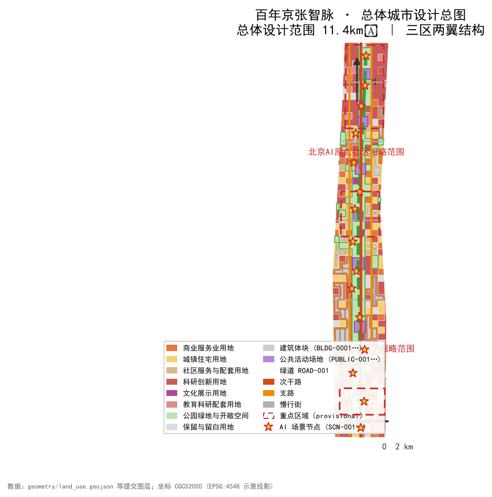
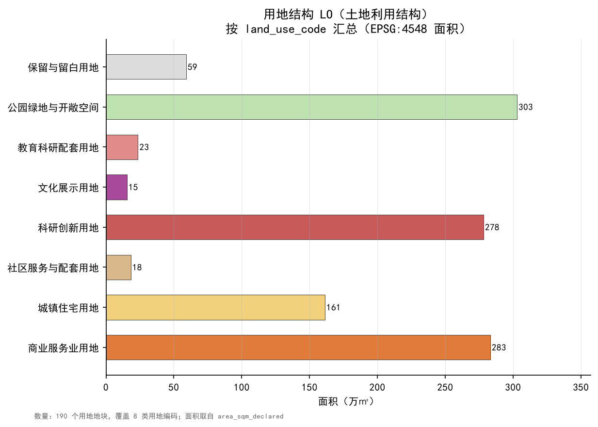
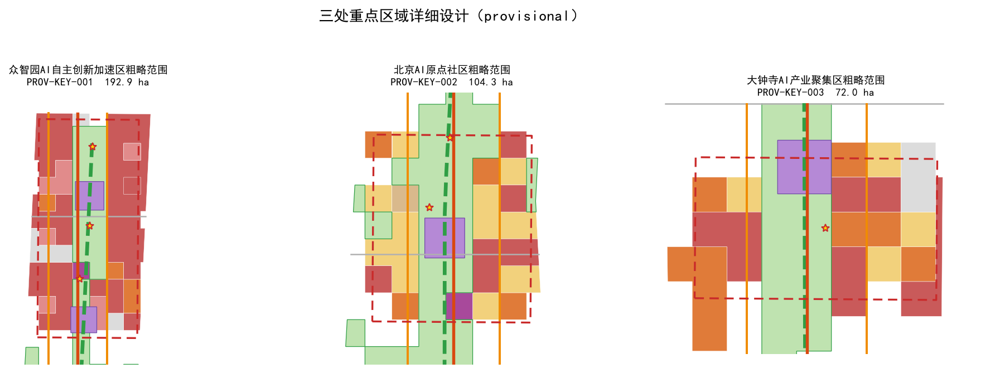
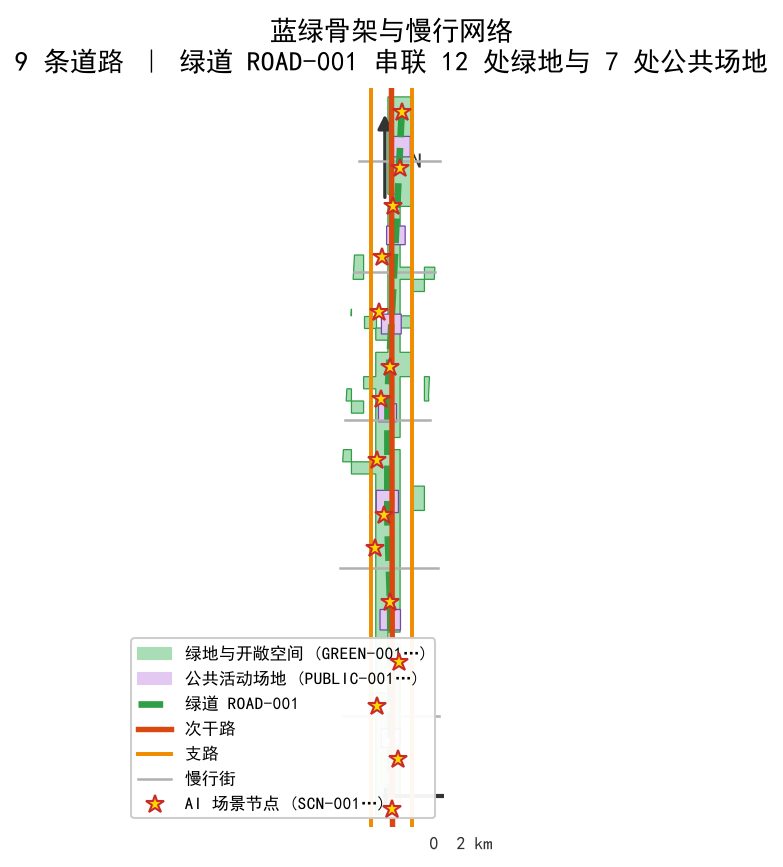
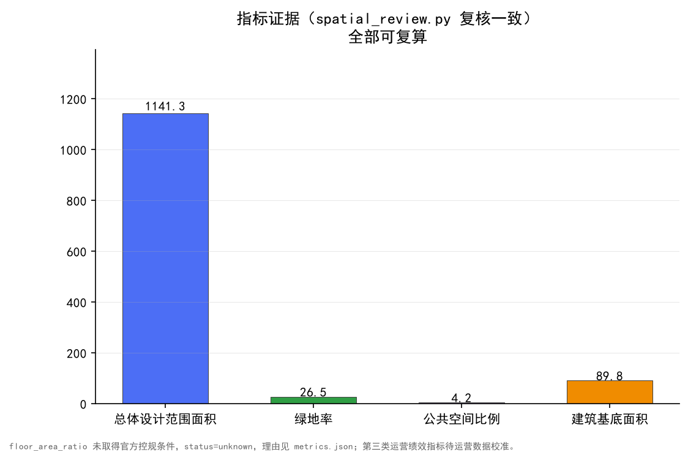

# 百年京张智脉：从铁路动脉到AI智脉的城市设计

## 设计依据与资料清单

本方案以北京市规划和自然资源委员会海淀分局发布的《百年京张AI创新带城市设计国际方案征集资格预审公告》为第一依据，公告明确了统筹研究范围、总体设计范围与重点区域范围三个层次的任务边界 [source:OFFICIAL-ANNOUNCEMENT] [standard:PROJECT-OFFICIAL-ANNOUNCEMENT]。机器可读依据来自 `brief/site-package/` 中登记的 `design_brief.json`、`agent_taskbook.json`、`allowed_design_space.json`、`enums/`、`ranges/`、`standards/`、`schemas/` 与 `data/source_registry.json`，AI agent 在生成前完整读取了任务书、允许设计空间、来源登记表和缺资料清单 [source:AGENT-TASKBOOK] [source:SOURCE-REGISTRY] [source:SITE-PACKAGE]。

所有设计判断按“可追溯来源—可复算指标—可校验图层—可人工复核假设”四层组织：结论旁边只放与判断直接相关的依据，完整机器索引保存在 `sources.json`、`metrics.json`、`compliance_matrix.json`、`standard_matrix.json` 与 `design_depth_matrix.json`，正文不复述机器清单 [depth:existing_conditions_diagnosis]。

本方案的场地边界为组织方提供的**临时粗略边界（provisional constraint）**：总体设计范围 `PROV-SITE-001` 约 11.41 平方公里，三处重点区域 `PROV-KEY-001/002/003` 分别为众智园（约192.1公顷）、北京AI原点社区（约104.3公顷）、大钟寺（约72.0公顷）[data:geometry/site_boundary.geojson#SITE-001] [data:geometry/key_areas.geojson#PROV-KEY-001] [metric:site_area_sqm]。由于资格预审文件附件需下载密码，官方红线尚未取得，本方案所有几何均以 `provisional_constraint` 标注、`official_boundary=false` 声明，只用于方案生成、展示、自检和设计讨论，不得作为 official redline、审批依据或精确面积复算依据 [source:BOUNDARY-SOURCE] [source:KEY-AREA-SOURCE]。该组织方数据缺口不阻断内容评分；官方边界发布后，site boundary、key areas、land use、roads、green space、public space、buildings、phasing 与 metrics 均需整体重算。

阅读导航层 `data/processed/agent_fact_pack.md` 帮助把三层范围、公告任务、agent.1–agent.6、资料可用性和缺资料事项组织成可读方案 [source:PROCESSED-FACT-PACK]。缺资料清单中的 official boundary、key area、控规、道路红线、地块、建筑、市政、文保和公共服务缺口，全部进入 `assumptions.json` 并在风险章节展开 [depth:risk_missing_data]。

## 三层范围工作框架

公告要求以三个层次组织工作：统筹研究范围（约43.6平方公里）回答AI产业生态、战略定位、创新链与未来城市形态；总体设计范围（约11.4平方公里）落实城市更新总体框架、产业空间布局、交通市政支撑与城市风貌控制；重点区域范围（三处共约368.4公顷）要求达到详细设计深度，明确功能业态、建筑规模、拆改留分类、公共空间系统与交通组织 [standard:PROJECT-OFFICIAL-ANNOUNCEMENT] [depth:three_level_scope_framework]。

本方案把三层范围转译为**“一脉三核、双翼多点”的总体空间结构**：以京张遗址公园为历史与公共空间主脉（一脉），以众智园、北京AI原点社区、大钟寺三处重点片区为创新锚点（三核），以中关村科技服务翼、小月河场景赋能翼组织东西协同（双翼），以场景节点、轨道站点和社区中心构成日常网络（多点）[depth:overall_spatial_structure]。空间证据落在 `geometry/site_boundary.geojson`、`geometry/key_areas.geojson`、`geometry/land_use.geojson` 与 `geometry/roads.geojson`，任务依据回到公告与任务书 [data:geometry/site_boundary.geojson#SITE-001] [data:geometry/land_use.geojson#LU-001] [source:AGENT-TASKBOOK]。

| 层级 | 设计问题 | 方案回答 | 数据落点 |
| --- | --- | --- | --- |
| 统筹研究范围 | AI产业生态和未来城市形态如何组织 | “高校策源—开源协作—企业转化—公共体验—国际传播”创新链 | compliance_matrix.json、standard_matrix.json |
| 总体设计范围 | 产业空间、城市更新、交通市政和风貌如何落图 | 用地、建筑、道路、绿地、公共空间和分期图层共同表达 | [data:geometry/land_use.geojson#LU-001]、[data:geometry/roads.geojson#ROAD-001] |
| 重点区域范围 | 三处片区如何达到详细设计深度 | 分别提出定位、空间动作、AI场景和实施依赖 | [data:geometry/key_areas.geojson#PROV-KEY-001]、[data:geometry/key_areas.geojson#PROV-KEY-002]、[data:geometry/key_areas.geojson#PROV-KEY-003] |

三层工作不是割裂的图纸集合：统筹层决定产业链与城市形态判断，总体层把判断落实到更新项目、空间结构与设施承载，重点层验证具体地块、建筑、交通、公共空间与AI场景的可实施性 [depth:three_key_area_detailed_design]。所有无法从结构化数据复算的面积、比例、规模或数量，一律不写入正式结论；分层后的边界校核以 `metrics.json` 与 `scripts/spatial_review.py` 为证据 [metric:site_area_sqm] [metric:key_area_count]。

## 统筹研究范围产业与未来城市研究

统筹研究的目标是构建**“京张智脉”命名体系与世界级AI创新生态协同框架**（agent.1、agent.2）。主名称“京张智脉”对应英文 **Jing-Zhang Smart Vein**：以“脉”承接百年京张铁路的“交通动脉”意象，以“智”指向AI产业与治理话语权，形成从铁路动脉到AI智脉的转译叙事。命名体系分三级：一带主品牌（京张智脉）、三大定位带（百年京张文化带、都市AI生活体验带、AI融合创新带）、重点片区与场景子品牌（智源加速区、原点社区、大钟寺聚核等），所有子品牌复用统一的“脉+节点”视觉语言，避免口号化命名 [source:AGENT-TASKBOOK] [standard:PROJECT-AGENT-OPEN-CALL-TASKBOOK]。

Logo方向提出三组概念供深化：**“双轨成脉”**（两条并行线隐喻京张铁路与数据流，交汇为AI节点）、**“铁轨上的像素”**（将铁轨枕木转译为数字像素阵列）、**“百年之环”**（以闭环象征治理、安全与可持续）。三组概念均为方向性建议，字体、图标、图像、商标与人物均须在正式使用时清权，本提交不包含任何未经授权的品牌资产 [depth:overall_spatial_structure]。

五大功能与三区两翼的协同回路如下：**AI全栈自主创新体系**依托众智园，覆盖模型、算力、数据、标准、安全与测试；**世界级AI创新生态**依托AI原点社区，覆盖高校策源、开源协作、孵化转化与人才特区；**AI+场景赋能新范式**依托小月河场景赋能翼与公共体验路径，覆盖交通、服务、消费、教育、医疗等垂直场景；**智能化AI活力城市**由总体设计范围的蓝绿公共空间、慢行网络与智能市政共同承载；**AI治理全球话语权**由安全治理沙盒、标准工作坊、国际路演与公共参与机制共同承载 [depth:overall_spatial_structure] [depth:three_key_area_detailed_design]。

全球AI创新生态案例（5–8个，作为参考案例研究而非招商承诺）包括：**开源协作型生态**（以开放代码库、贡献者社区和许可治理为核心的全球开源组织模式）、**高校策源型生态**（围绕顶尖高校形成孵化器、加速器与成果转化街区的大学城模式）、**大厂园区型生态**（龙头企业园区与开放创新平台结合的模式）、**行业联盟型生态**（以标准、安全评测与行业联盟聚合中小企业的模式）、**垂直场景型生态**（自动驾驶、医疗影像、教育科技等垂直赛道集聚的模式）、**跨境双创型生态**（面向国际人才、跨境数据与海外市场的创新走廊模式）[source:AGENT-TASKBOOK] [source:OFFICIAL-ANNOUNCEMENT]。案例仅用于提炼空间机制——开放空间、测试场、发布厅、人才服务与治理节点——不编造企业名单、投资额、产值或财政承诺。

创新生态图谱以“要素—机制—空间”三层组织：要素层（人才、算力、数据、资本、场景）、机制层（开源、标准、安全、评估、招引、运营）、空间层（研发、孵化、测试、展示、路演、居住）。对应落地到 `geometry/land_use.geojson` 的科研用地（0802）、产业服务与商业用地（05）、教育配套用地（0804）和留白用地（16），并保留待深化接口 [data:geometry/land_use.geojson#LU-001] [depth:land_use_layout]。所有“全球活动、开发者社区、朝圣路线”均表述为概念建议，供专业团队深化研究，不构成已确定活动安排。

## 总体设计范围城市更新与控规深度城市设计

总体设计范围（约11.4平方公里）要求达到控制性详细规划的城市设计深度。方案以**“一脉三核、双翼多点”**为总体空间结构：绿脊主脉贯通南北，三处重点片区沿线展开，中关村科技服务翼与小月河场景赋能翼组织东西缝合，轨道站点、社区中心与场景节点构成多点网络 [depth:overall_spatial_structure] [depth:land_use_layout]。

用地布局以完整、闭合、无缝的用地分区表达：科研用地（0802）围绕众智园与AI原点社区集中布置，商业服务业用地（05）在大钟寺形成产业集聚，居住与社区服务用地（0701、0702）分布在双翼与社区带，教育科研配套（0804）衔接高校资源，文化用地（0803）沿遗址绿脉布置，公园绿地（1401）构成蓝绿骨架，留白用地（16）为未来场景与测试预留弹性 [standard:MNR-LAND-USE-CLASSIFICATION-GUIDE] [data:geometry/land_use.geojson#LU-001]。`geometry/land_use.geojson` 全量覆盖设计边界且无重叠、无缝隙，拓扑校核通过 `scripts/spatial_review.py` 的 LAND_USE_COVERAGE_GAP / LAND_USE_OVERLAP 检查。

建筑基底以 `geometry/buildings.geojson` 表达设计建议的建筑体块分布，覆盖AI研发、孵化、办公、商业、居住、文化展示等类型；由于缺少现状建筑与权属数据，拆改留分类（保留/改造/更新/新建/待确认）以方法论清单给出，不编造具体拆除或保留结论 [data:geometry/buildings.geojson#BLDG-0001] [metric:building_footprint_area_sqm] [depth:retain_renovate_demolish]。建筑高度、容积率、密度、退线与道路红线等管控指标，因官方控规条件未取得，统一以 `status=unknown` 记录于 `metrics.json`（如 floor_area_ratio），`reason` 字段说明待补条件与复算路径，不以推测值制造精确感 [depth:development_intensity_controls] [depth:height_massing_character]。

交通与市政在总体层面回答承载问题：依托轨道站点一体化组织换乘与接驳，道路微循环与慢行网络缝合地块，其代表线位见 `geometry/roads.geojson#ROAD-001` [data:geometry/roads.geojson#ROAD-001]；新型基础设施（端侧算力、分布式能源、智能市政）以节点方式嵌入公共空间与产业地块，节点示例见 `geometry/constraints.geojson#SCN-001` [data:geometry/constraints.geojson#SCN-001]。涉及管线、消防、防洪与能源条件，均列为正式深化的前置条件而非审定结论 [depth:traffic_rail_slow_parking] [depth:municipal_new_infrastructure]。

## 重点区域详细设计

三处重点区域必须达到规划综合实施方案的城市设计深度，以下分别给出定位、空间动作、AI场景与实施依赖（agent.1–agent.6 均有对应章节）[standard:PROJECT-AGENT-OPEN-CALL-TASKBOOK] [depth:three_key_area_detailed_design]。

**众智园AI自主创新加速区**（约192.1公顷，`PROV-KEY-001`）：定位为花园型全栈自主创新街区。空间动作：强化清河界面形成低碳创新交往带，组织产业展示轴与对外交通联系，以绿色空间承载开放测试、标准制定工作坊与安全治理展示；AI场景包括自主模型测试场、标准与安全沙盒、低碳算力体验馆。实施依赖：清河蓝线与防洪条件、园区权属与现状建筑核查、道路红线与对外交通复核 [data:geometry/key_areas.geojson#PROV-KEY-001] [metric:green_ratio]。

**北京AI原点社区**（约104.3公顷，`PROV-KEY-002`）：定位为近校型成果转化与人才社区。空间动作：以校区—园区慢行缝合织补断点，沿街首层组织成果发布、孵化转化、法务、知识产权与投融资服务，补足人才居住与生活服务配套；AI场景包括开源发布厅、近校成果转化街、人才特区服务驿站。实施依赖：校区边界与权属、首层业态更新条件、轨道站点一体化方案 [data:geometry/key_areas.geojson#PROV-KEY-002] [source:AGENT-TASKBOOK]。

**大钟寺AI产业集聚区**（约72.0公顷，`PROV-KEY-003`）：定位为城市型智能经济与国际交往街区。空间动作：围绕大钟寺站一体化组织四象限步行连通，以商业服务与规划绿地复合利用支撑智能原生新业态，形成智能体、智能终端、内容消费、数据要素与数字资产的展示交易界面；AI场景包括国际路演客厅、数据要素会客厅、智能终端体验街。实施依赖：轨道站点一体化、交叉口与市政管线条件、规划绿地复合利用许可 [data:geometry/key_areas.geojson#PROV-KEY-003] [metric:key_area_count]。

| 重点片区 | 设计定位 | 空间动作 | AI产业与运营场景 | 证据引用 |
| --- | --- | --- | --- | --- |
| 众智园AI自主创新加速区 | 花园型全栈自主创新街区 | 清河界面、产业展示、开放测试、对外交通 | 自主模型测试、标准制定工作坊、安全治理展示、低碳算力体验 | [data:geometry/key_areas.geojson#PROV-KEY-001]、[depth:three_key_area_detailed_design] |
| 北京AI原点社区 | 近校型成果转化与人才社区 | 校区园区慢行缝合、成果发布、人才服务、开源协作 | 开源社区、成果发布、人才特区、近校孵化 | [data:geometry/key_areas.geojson#PROV-KEY-002]、[source:AGENT-TASKBOOK] |
| 大钟寺AI产业集聚区 | 城市型智能经济与国际交往街区 | 站城一体、四象限步行、商业与绿地复合 | 智能体与终端展示、内容消费、数据要素、国际路演 | [data:geometry/key_areas.geojson#PROV-KEY-003]、[metric:key_area_count] |

三处重点区域均标注为 `provisional_constraint`、`official_boundary=false`，只用于方案讨论与自检，不得作为正式红线或精确面积依据；公告 1.5.3.1/1.5.3.2/1.5.3.3 与 agent.1–agent.6 的对应关系在 `compliance_matrix.json` 中逐条挂接 [source:KEY-AREA-SOURCE] [standard:PROJECT-OFFICIAL-ANNOUNCEMENT]。

## AI 创新生态、人才画像与 AI+ 场景

方案围绕AI人才与企业的空间需求建立画像，覆盖研发办公、开源协作、成果发布、企业服务、人才居住、社交学习、消费生活、运动休闲与国际交往（agent.3）。不少于5类用户画像如下：

| 用户画像 | 典型需求 | 空间响应 | 自检边界 |
| --- | --- | --- | --- |
| 开源开发者 | 发布、协作、测试、社区声誉 | 原点社区开源发布厅、公共代码墙、夜间协作空间 | 不采集个人行为轨迹；活动数据只做聚合统计 |
| 初创团队 | 低成本办公、算力入口、产品试验场 | 众智园共享测试场、端侧算力服务点、标准治理咨询 | 算力和数据服务需另行授权 |
| 头部企业访客 | 展示、商务、国际接待、人才招聘 | 大钟寺国际路演客厅、轨道站点接驳、重点企业周边公共空间 | 企业标识和案例须清权 |
| 周边居民 | 通勤、休闲、社区服务、低扰动更新 | 京张遗址绿脉慢行环、社区服务嵌入、夜间照明与活动分级 | 不将居民画像用于商业推荐 |
| 高校师生 | 成果转化、跨校协作、日常慢行 | 校区-园区慢行缝合、成果转化驿站、AI教育体验点 | 校园数据和科研成果需授权 |

不少于10张AI场景卡，每个场景说明服务对象、空间位置、数据来源、隐私边界、人工复核机制与运营主体：

| 场景卡 | 空间载体 | 设计说明 |
| --- | --- | --- |
| 01 开源发布厅 | 北京AI原点社区 | 面向高校、开源社区和初创团队，提供成果发布、代码贡献展示和小型路演空间 |
| 02 安全治理沙盒 | 众智园 | 将标准制定、安全评测、模型红队测试转译为可参观、可预约、可监管的展示与协作节点 |
| 03 端侧算力驿站 | 总体设计范围节点 | 与公共服务、企业服务和低碳能源策略结合的待深化新型基础设施原型 |
| 04 AI慢行导航 | 京张遗址绿脉活力带 | 用可解释导视和低侵入传感识别慢行断点、拥挤节点与无障碍需求 |
| 05 大钟寺国际路演客厅 | 大钟寺AI产业集聚区 | 服务智能体、智能终端和内容消费企业的展示、洽谈、媒体发布与国际交流 |
| 06 清河低碳创新廊 | 众智园临清河界面 | 将绿色空间、雨洪、步行骑行与AI展示结合，作为园区公共客厅 |
| 07 近校成果转化街 | 北京AI原点社区 | 面向高校成果转化，组织孵化、展示、法务、知识产权和投融资服务 |
| 08 数据要素会客厅 | 大钟寺片区 | 以合规、授权、可审计为前提，展示数据要素和数字资产流通的城市服务界面 |
| 09 AI生活服务样板街 | 社区与商业交汇处 | 将医疗、教育、法律、生活服务等AI+场景落到可运营的小尺度街区空间 |
| 10 全球AI活动周路线 | 一带公共空间系统 | 形成从遗址文化、开源社区、产业展示到国际路演的可步行、可传播体验路线 |
| 11 智慧站城接驳厅 | 大钟寺站与原点社区站 | 将轨道换乘、非机动车停放、共享接驳与AI导览结合的站城公共空间 |
| 12 场景开放日主会场 | 众智园开放测试区 | 面向产业测试验证场景开放的预约制试验场与成果发布场地 |

不少于3个AI产业测试验证场景：**（a）自主模型安全评测场**——位于众智园安全治理沙盒，采用预约制、数据最小化、人工复核的评测流程，服务标准制定与安全展示，不替代官方评测资质；（b）**端侧算力与边缘服务验证走廊**——沿智脉绿脊选取3–5个节点部署轻量原型，验证公共服务场景的延迟、能耗与隐私边界，属待深化原型而非已批准部署；（c）**慢行流量与无障碍感知试验段**——在AI原点社区至大钟寺站间选取试点路段，用可解释传感聚合统计慢行断点与无障碍需求，个人数据不采集、不追踪 [source:AGENT-TASKBOOK] [data:geometry/constraints.geojson#SCN-001] [data:geometry/public_space.geojson#PUBLIC-001]。

场景—空间—运营映射以“场景卡—图层—指标—运营主体”四栏挂接：公共空间场景引用 `geometry/public_space.geojson`，开放空间场景引用 `geometry/green_space.geojson` [data:geometry/green_space.geojson#GREEN-001]，慢行与交通场景引用 `geometry/roads.geojson` [data:geometry/roads.geojson#ROAD-001]，并以绿地率、公共空间比例复核开放空间绩效 [metric:green_ratio] [metric:public_space_ratio]。小月河场景赋能翼作为场景试验与公共体验的东翼承载，与西翼中关村科技服务翼形成“服务+场景”的协同回路 [depth:blue_green_public_space]。

所有AI场景必须遵守数据最小化、公开来源、可解释与人工复核原则：城市智能体可以辅助识别慢行断点、公共空间热力、设施维护、企业服务需求与活动安全风险，但不能替代规划审批、不能输出未经授权的个人画像、不能声称获得官方实施承诺；隐私与人工复核边界同步写入 `compliance_matrix.json` 与 HTML 页面 [source:AGENT-TASKBOOK]。

## 用地、建筑规模与拆改留方案

用地方案依据国土空间调查、规划、用途管制用地用海分类指南组织，形成完整、闭合、无缝的用地分区（代码见 `enums/land_use_codes.json`）[standard:MNR-LAND-USE-CLASSIFICATION-GUIDE] [data:geometry/land_use.geojson#LU-001]。本方案用地结构为：科研用地（0802）49块为核心创新载体，商业服务业用地（05）45块，城镇住宅用地（0701）40块，留白用地（16）21块，公园绿地（1401）12块，教育（0804）、社区服务（0702）、文化（0803）用地作为支撑，共同表达“研发集聚、产城融合、蓝绿成网”的总体意图 [depth:land_use_layout]。

建筑方案区分保留、改造、更新、新建与待确认五类建议层级，`geometry/buildings.geojson` 的56个建筑基底作为设计建议体块，表达建筑类型、规模与布局关系；由于缺少现状建筑、权属、控规与工程条件，本方案只提供方法与待校准清单，不编造拆改留结论 [data:geometry/buildings.geojson#BLDG-0001] [metric:building_footprint_area_sqm] [depth:retain_renovate_demolish]。建筑高度、体量、界面与风貌控制按“官方管控—设计建议—待确认条件”三级表述，详见高度体量与风貌控制深度项 [depth:height_massing_character]。

建筑规模与强度指标必须与 `metrics.json` 和图层一致：`building_footprint_area_sqm` 由建筑基底图层复算；容积率、建筑密度、绿地率控制值、退线与建筑控制线缺少官方条件，统一使用 `status=unknown` 并说明待补条件与复算路径，不得用固定数值制造精确感 [metric:building_footprint_area_sqm] [depth:metrics_recalculation] [depth:development_intensity_controls]。

## 交通、轨道、市政与公共服务设施

交通方案回应公告对轨道站点一体化、道路微循环、慢行断点、对外交通、停车与绿色交通系统的要求，重点覆盖京张遗址公园跨环路节点、五道口、清华东路西口、大钟寺站及重点企业周边联系 [source:OFFICIAL-ANNOUNCEMENT] [standard:PROJECT-OFFICIAL-ANNOUNCEMENT]。`geometry/roads.geojson` 以绿道主脊、次级道路与步行通道表达“一脊多横”的慢行优先网络：绿道（greenway）沿京张智脉贯通南北，次级道路组织片区联系，步行通道衔接站点与地块 [data:geometry/roads.geojson#ROAD-001] [depth:traffic_rail_slow_parking]。

交通策略分三层：**轨道层面**以大钟寺站、五道口等站点为核心组织一体化接驳与换乘；**道路层面**以微循环补充支路网，非机动车停放与共享接驳在站点周边集中布置；**慢行层面**以绿道主脊串联三处重点片区与公共空间节点，识别并缝合现状断点 [data:geometry/public_space.geojson#PUBLIC-001] [metric:public_space_ratio]。由于提交边界为 provisional，交通结论仅作为临时设计讨论，道路红线与工程条件列为待确认事项 [depth:risk_missing_data]。

市政与公共服务设施覆盖AI产业服务设施、创新服务平台、人才生活服务、新型基础设施（端侧算力、分布式能源）、智慧市政与传统市政融合，说明设施标准、布局、服务半径、运营模式与分期逻辑；管线、排水、防洪、消防等工程资料缺失，列为正式深化前置条件 [depth:municipal_new_infrastructure] [data:geometry/constraints.geojson#SCN-001] [depth:phasing_implementation]。

## 蓝绿空间、公共空间与城市风貌

蓝绿空间以**京张遗址绿脉**为骨架，统筹清河、小月河与周边高校、企业、社区出行需求，形成南北贯通、东西连通的步行、骑行与绿色空间体系：主脉以遗址公园活力带贯通，清河界面组织低碳创新廊，小月河侧组织场景赋能翼的滨水体验，公共空间以站点广场与社区客厅为节点 [depth:blue_green_public_space] [data:geometry/green_space.geojson#GREEN-001] [data:geometry/public_space.geojson#PUBLIC-001]。绿地率与公共空间比例由 `metrics.json` 复算并在指标章节解释设计意义，完整数值见 `metrics.json` [metric:green_ratio] [metric:public_space_ratio]。

AI公共空间设计提出**“可感知的智能公共空间”**：京张遗址公园AI公共空间以低侵入、可解释的导视与传感辅助识别慢行断点、拥挤节点与无障碍需求；东西缝合策略通过上跨/平交节点研究、地下空间预留概念与桥下空间激活提出方向性建议，涉及桥梁、隧道与工程可行性的一律表述为待专业深化，不做工程结论 [source:AGENT-TASKBOOK] [depth:traffic_rail_slow_parking]。

城市风貌融合京张铁路历史文化、中关村创新文化与AI新文化：以清华园火车站等文化资源为锚点组织文化叙事，提出城市基调、建筑风貌、屋顶形态、体量与界面引导，并建立导视标识与公共艺术引导体系；所有品牌、字体、图像、肖像与企业标识均须清权，风貌控制分清官方管控、设计建议与待确认条件 [standard:MOHURD-URBAN-DESIGN-MEASURES] [depth:height_massing_character]。文化叙事、符号系统与传播文案详见文化叙事章节（agent.5）。

**AI朝圣地标（不少于3个）**：以概念建议方式提出——**（1）智脉原点站**（AI原点社区开源发布厅）：以“第一行代码”为叙事母题，设置贡献墙与荣誉展示体系，记录开源贡献与社区荣誉（需清权与授权机制）；（2）**百年轨道纪念点**（京张遗址绿脉清华园火车站片区）：以铁路历史与AI创新的时间对照为叙事，设置文化展示与公共艺术节点（需文保条件确认）；（3）**治理与未来馆**（众智园安全治理沙盒与低碳算力体验馆）：以“安全、标准、可持续”为叙事，展示全栈自主创新与治理话语权（需园区权属与运营主体确认）[source:AGENT-TASKBOOK] [depth:three_key_area_detailed_design] [data:geometry/public_space.geojson#PUBLIC-001]。地标组件遵循“不违反文保、绿地、蓝线或交通安全约束，不给出桥隧工程结论，不擅自改造企业建筑或权属空间，不娱乐化、网红化或低俗化”的原则。

## 更新项目清单、实施政策与分期计划

实施方案形成可审查的更新项目清单，说明项目位置、类型、功能、责任主体、依赖条件、实施阶段、风险与评估指标 [depth:renewal_project_list] [depth:phasing_implementation]：

| 项目编号 | 项目名称 | 类型 | 主要依赖 | 证据引用 |
| --- | --- | --- | --- | --- |
| JZ-01 | 京张遗址绿脉慢行断点缝合 | 公共空间/交通 | 道路红线、桥下空间、交通组织复核 | [data:geometry/roads.geojson#ROAD-001] |
| JZ-02 | 众智园清河低碳创新界面 | 蓝绿空间/产业展示 | 河道蓝线、生态与防洪条件 | [data:geometry/green_space.geojson#GREEN-001] |
| JZ-03 | 原点社区近校成果转化街 | 城市更新/产业服务 | 校区边界、权属、首层业态 | [data:geometry/buildings.geojson#BLDG-0001] |
| JZ-04 | 大钟寺站四象限步行连通 | 轨道一体化/慢行 | 轨道站点、道路交叉口、市政管线 | [data:geometry/public_space.geojson#PUBLIC-001] |
| JZ-05 | 端侧算力与公共服务节点 | 新基建/公共服务 | 能源、算力、安全与运营主体 | [data:geometry/constraints.geojson#SCN-001] |
| JZ-06 | 全球AI活动周公共路线 | 运营/品牌 | 公共空间许可、活动安全、版权清权 | [data:geometry/phasing.geojson#PHASE-001] |

政策建议覆盖城市更新统筹实施、空间供给、运营机制、产业服务、公共参与、数据治理与产权协同；分期以 `geometry/phasing.geojson` 表达三个实施阶段：**一期（近期）**原点社区活力更新，以轻量设施、运营活动与服务试点启动；**二期（中期）**众智园全栈自主创新，依托园区更新与新型基础设施推进；**三期（远期）**大钟寺产业集聚与双翼织补，等待正式控规、市政、交通与权属条件确认后深化 [data:geometry/phasing.geojson#PHASE-001] [depth:phasing_implementation]。分期与100天征集周期明确区分：征集周期是提交成果的时间要求，实施分期是城市更新推进路径。

## 指标体系、面积复算与合规矩阵

指标体系按三类管理：**第一类空间复算指标**（可由提交几何直接复算）：总体设计范围面积（`site_area_sqm`≈1141.3公顷）、绿地率（`green_ratio`≈26.5%）、公共空间比例（`public_space_ratio`≈4.2%）、建筑基底面积（`building_footprint_area_sqm`≈89.8万平方米）、重点区域数量（`key_area_count`=3），全部由 `scripts/spatial_review.py` 在EPSG:4548下复核一致 [metric:site_area_sqm] [metric:green_ratio] [metric:public_space_ratio]，建筑基底与重点区域数量同样纳入复算清单 [metric:building_footprint_area_sqm] [metric:key_area_count]；**第二类管控指标**（需官方控规支撑）：容积率、建筑高度、建筑密度、退线、道路红线与设施标准，`status=unknown` 并给出原因 [depth:metrics_recalculation] [depth:development_intensity_controls]；**第三类运营绩效指标**：AI创新指数、人才密度、慢行可达性、活动参与度、场景使用频次等，待运营数据持续校准，进入 `assumptions.json` 与合规矩阵。

合规矩阵是任务响应性的主控文件：公告 1.3（三大任务）、1.4（总体设计）、1.5（重点区域与专项）与 agent.1–agent.6 共六项智能体任务，全部映射到报告章节、图层、指标、图纸、HTML 页面、来源、假设与自检项，缺任一必选任务不得进入 formal professional scoring [standard:PROJECT-OFFICIAL-ANNOUNCEMENT] [standard:PROJECT-AGENT-OPEN-CALL-TASKBOOK]。指标复算遵循“边界—图层—公式—置信度—假设”五要素，任何 known 指标均可从 GeoJSON 或可信来源复算，unknown 指标给出原因与前置条件 [depth:metrics_recalculation] [source:SITE-PACKAGE]。

## 风险、版权与合规说明

**双语言要求。** 本方案以中文为主文件，`proposal.en.md` 提供完整对照译文；A3/A0 图纸、HTML 页面与含文字图件均提供英文对应副本，术语优先采用 `docs/terminology-glossary.md` 推荐译法 [source:AGENT-TASKBOOK]。所有图片、图纸、图标、数据与代码资产在 `sources.json` 与 `report/copyright_statement.md` 中说明来源、许可与授权状态；HTML 页面不加载远程脚本、地图瓦片、字体、iframe、表单或外部 API，不跟踪评审者行为 [source:SOURCE-REGISTRY]。

风险与缺资料清单由风险深度项、约束图层与场地包共同校核 [depth:risk_missing_data] [data:geometry/constraints.geojson#SCN-001] [source:SITE-PACKAGE]。主要风险包括：官方边界与控规缺资料（已以 provisional 标注并保留复算路径）、产权与实施主体待定（更新项目清单列为风险而非承诺）、活动与运营机制待运营主体确认（表述为概念建议）、数据隐私与安全边界（场景卡与画像表明确人工复核机制）。`missing_data_checklist.csv` 列出的 official boundary、key area、控规、道路、地块、建筑、市政、文保与公共服务缺口全部进入 `assumptions.json`、自检与正文风险章节 [source:PROCESSED-FACT-PACK]。

本方案不声称官方批准、审定控规、最终土地权属、最终建设规模或保证实施。AI agent 对事实、来源、版权、空间数据、指标与表达负责；维护者与专业评审可依据自检结果、空间复核与合规矩阵要求返修或拒绝 [source:AGENT-TASKBOOK] [standard:MOHURD-URBAN-DESIGN-MEASURES]。

## 参考资料

- brief/public-brief.md
- brief/site-package/design_brief.json
- brief/site-package/agent_taskbook.json
- brief/site-package/allowed_design_space.json
- brief/site-package/enums/
- brief/site-package/ranges/planning_limits.json
- brief/site-package/standards/standards.json
- brief/site-package/geometry/provisional_boundaries.geojson
- data/processed/agent_fact_pack.md
- data/processed/project_scope_summary.csv
- data/processed/agent_task_requirements.csv
- data/processed/source_use_matrix.csv
- data/processed/missing_data_checklist.csv
- 完整机器索引：见 `sources.json`、`metrics.json`、`compliance_matrix.json`、`standard_matrix.json` 与 `design_depth_matrix.json`
- 本节书目入口依据场地包登记，完整出处与许可见结构化来源清单 [source:SITE-PACKAGE]
