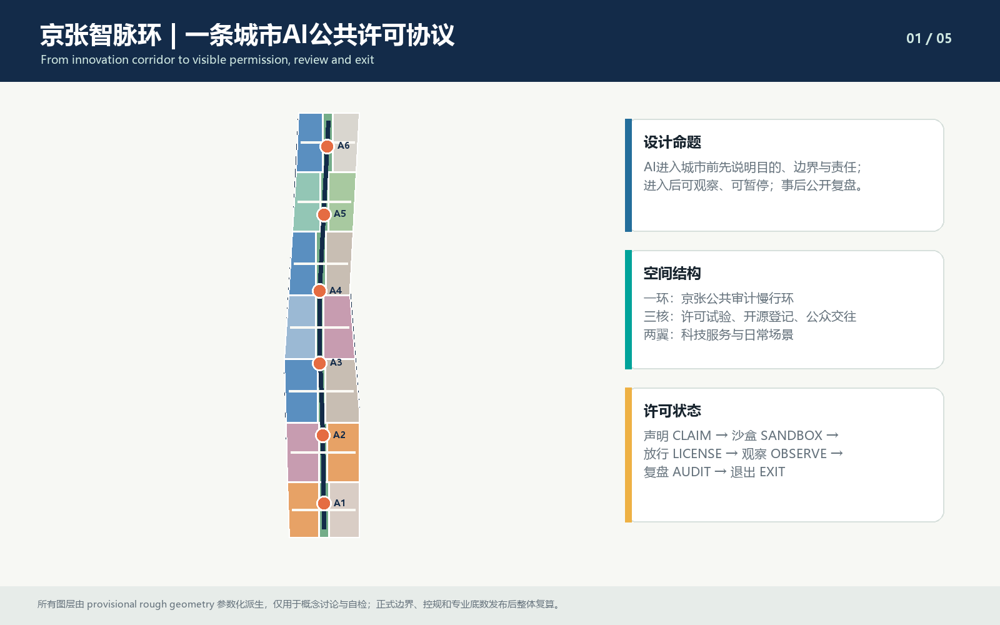
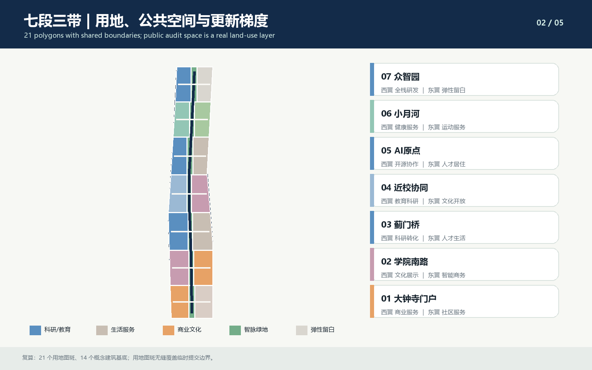
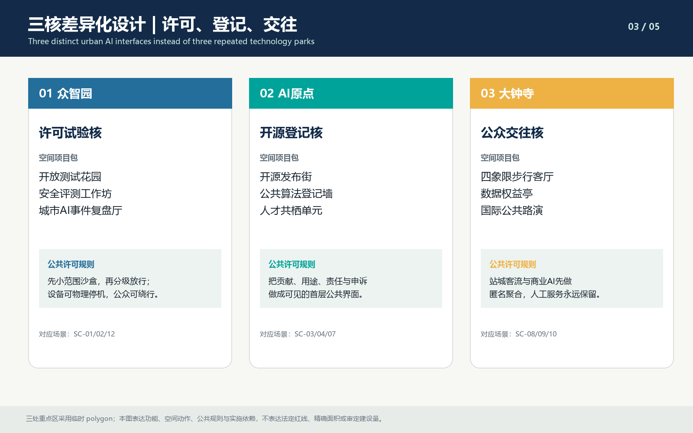
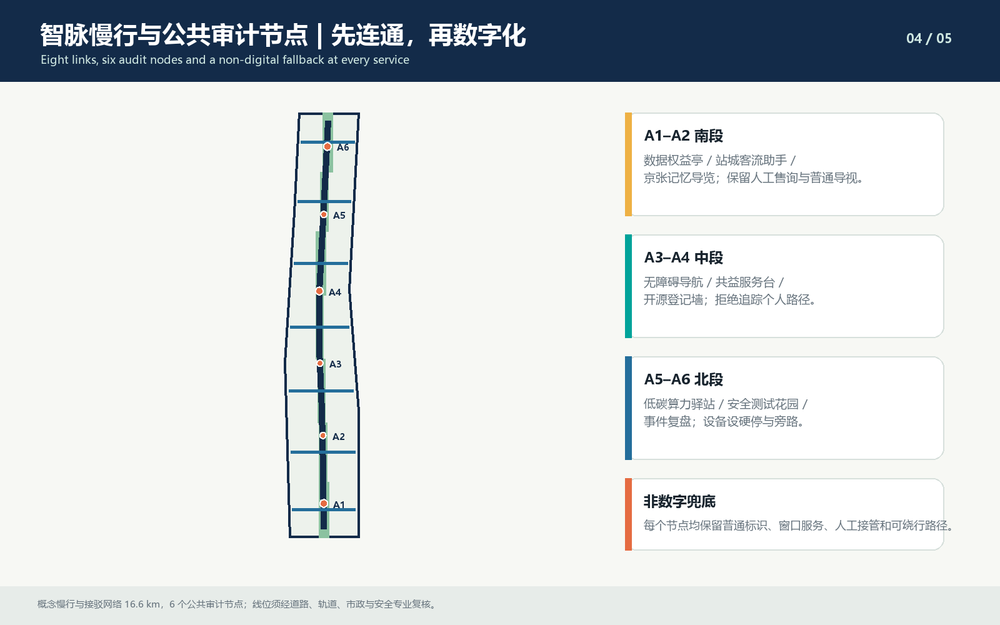
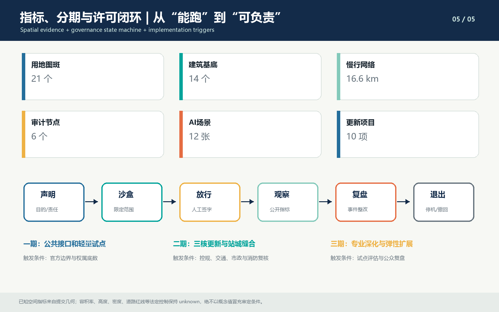

# Jing-Zhang Smart Pulse Ring: Publicly Auditable AI Innovation Belt Urban Design Conceptual Recommendation

## **Statement of the Proposal:** Obtain Public Consent Before Allowing AI to Enter Cities

"Jing-Zhang Synapse Loop" addresses not the question of "where to place another AI park," but a more specific one: how can the city make visible to the public the purpose, boundaries, responsibilities, operating conditions, and exit strategies of models, robots, algorithms, and data facilities when they are truly integrated into streets, communities, stations, and parks.

The proposal uses the Jing-Zhang Heritage Park as the public spine, translating the safety logic of the railway era—"signal—interlock—clear to proceed—recap"—into a six-state protocol for urban AI.

1. **CLAIM**: Describe the service recipients, purpose, data, responsible party, and validity period.
2. **Sandbox SANDBOX**: Test in a limited space, with a limited population, and within a limited time frame.
3. **Permit**LICENSE**: Technical, public interest, and safety reviews to be completed by named responsible parties.
4. **Observation**OBSERVE**: Only publish necessary operational metrics, anomalies, and records of human takeovers.
5. **Review**AUDIT: The events are reviewed anonymously and then enter the process for remediation and re-approval conditions.
6. **Exit EXIT**: ****: ****: ****: ****: ****: ****: ****: ****: ****: ****: ****: ****: ****: ****: ****: ****: ****: ****: ****: ****: ****: ****: ****: ****: ****: ****: ****: ****: ****: ****: ****: ****: ****: ****: ****: ****: ****: ****: ****: ****: ****: ****: ****: ****: ****:

These six states are not software flowcharts but rather Urban Design objects: Zhongzhiyuan carries "sandbox and licensing," Beijing AI Origin Community carries "declaration and public registry," Dazhongsi carries "observation, public engagement, and data rights," and six public audit nodes handle appeals, human fallbacks, event reviews, and non-digital pathways. This forms the overall structure of "one ring with three cores and two wings, seven segments and three belts, and six nodes and twelve scenarios." [source:AGENT-TASKBOOK] [depth:overall_spatial_structure]

This plan is an Open Co-Creation **Conceptual Recommendation/reference proposal**. It does not constitute legal planning, zoning adjustments, engineering design, government approval, or a commitment to implementation; among which SITE_BOUNDARY, KEY_AREA, land use, buildings, roads, Public Space, and phases are subject to provisional geometry.

## Design Basis and Source List

The first reference is the Qualification Pre-Review Notice issued by the Haidian Branch of the Beijing Municipal Planning and Natural Resources Commission [source:OFFICIAL-ANNOUNCEMENT], used to confirm the three layers, three key areas, work depth, and professional tasks; the second reference is the intelligent body task book for Qing [source:AGENT-TASKBOOK], used to confirm naming, cases, scenarios, portraits, landmarks, culture, and long-term operations for the open-source collection tasks. Structured boundaries, enumerations, gaps, standards, and validation rules come from [source:SITE-PACKAGE], [source:SOURCE-REGISTRY], and [source:PROCESSED-FACT-PACK].

The proposal shall be based on the following three categories of information only:

| Level of Documentation | Judgments That Can Be Made | Boundaries That Must Not Be Overlooked |
| --- | --- | --- |
| official_public / cleared | Tasks, Scope Levels, Design Requirements, Standard Framework, Public Facts | Are not equivalent to official polygons, planning indicators, or engineering baselines |
| provisional_only | Generate concept layers, recalculate submitted geometry, produce drawings and self-inspect | Do not pretend to be official planning boundaries, accurate areas, or approval references | (Official Planning Boundary)
| missing / pending | Registered as Assumed, Risk, and Formal Deepening Trigger Conditions | Do not fill with agent estimated values |

Current `geometry/site_boundary.geojson\` comes from [source:BOUNDARY-SOURCE], three key areas come from [source:KEY-AREA-SOURCE], all of which are annotated with `official_boundary=false\`, `geometry_role=provisional_constraint\`. Their purpose is limited to generation, discussion, display, and self-checking. Once the official polygon is in place, it must be recalculated for land use, buildings, roads, green spaces, Public Space, phasing, indicators, the five maps, A3/A0, HTML, and manifest hashes, rather than simply replacing a boundary file. [data:geometry/site_boundary.geojson#SITE-001] [data:geometry/key_areas.geojson#PROV-KEY-001]

Professional references include Urban Design management, Regulatory Detailed Planning, architectural design depth, and land use classification standards: [standard:MOHURD-URBAN-DESIGN-MEASURES], [standard:MOHURD-CONTROL-DETAILED-PLANNING], [standard:MOHURD-ARCH-DESIGN-DEPTH-2016], [standard:MNR-LAND-USE-CLASSIFICATION-GUIDE]. The scope of effect for the announcement and the agent task is delineated by [standard:PROJECT-OFFICIAL-ANNOUNCEMENT] and [standard:PROJECT-AGENT-OPEN-CALL-TASKBOOK].

The current condition diagnosis is categorized into three tiers: "verifiable—requires verification—unverifiable" [depth:existing_conditions_diagnosis]:

- Verifiable: announcement text range, three key areas tasks, public cultural resources, submitted geometric topology and recalculation values.
- Need to be tested: existing buildings, ground-floor uses, ownership, track entrances and exits, cultural heritage boundaries, road sections, municipal and fire capacity.
- Unpredictable: Floor Area Ratio, height, density, set-backs, demolition conclusions, investment amount, and government implementation timeline.

## Three-Level Scope Framework

The three levels of scope are not three maps at different scales, but rather three types of different decisions. The Coordinated Research Area determines the supply chain and future urban mechanisms; the Overall Design Area translates these mechanisms into land use, active transportation, blue-green spaces, public services, and renewal projects; the three key areas use spatial project packages to verify whether these judgments can be implemented and validated. [depth:three_level_scope_framework]

| Level | Core Issue | This Plan Addresses | Verifiable Outcomes |
| --- | --- | --- | --- |
| Coordinated Research Area | Why did the AI Innovation Ecosystem form here, and how does it spill over? | "Concept—Validation—Transformation—Service—Public Adoption—Review" Six-Loop Chain | 6 case studies translated, industry service chain, license agreement |
| Overall Design Area | How Industry and Public Interest Align with Space | Circular One Ring Three Cores Two Wings, Seven Segments Three Bands, 21 Land Use Plots | Land Use, Buildings, Roads, Green Spaces, Public Space, Phases and Indicators |
| Three Key Areas | How to Avoid Three Repetitive Parks within the Same Innovation Belt | Permitted Test Core, Open Source Registration Core, Public Interaction Core | 3 Differentiated Project Packages, 9 Main Scenarios, Implementation Dependencies |

Overall structure consists of three stacked elements:

- **Intelligent Vein Public Corridor**: Jing-Zhang Heritage Park, continuous active transportation routes, and six public audit nodes.
- **Zhongguancun Science and Technology Service Belt**: Intellectual Property, Standards, Legal Affairs, Computing Power, Talent, and International Cooperation Interface.
- **Xiaoyuehe Daily Scene Area**: A verifiable pilot for health, education, community services, recreation, and low-carbon living.

Seven segments form a gradient of openness from south to north, creating the sequence "Dazhongsi Gateway—Xueyuan Nanlu—Jimumen Bridge—Jinxiao Synergistic Zone—AI Origin—Xiaoyuehe—Zhongzhiyuan." The southern segment is oriented towards public engagement and international interaction, the middle segment towards the conversion of results and talent living, and the northern segment towards high-threshold safety testing and standard governance. Lower-level details can only refine upper-level judgments; they cannot be derived from temporary graphical representations to determine ownership, control planning, or engineering conclusions.

## Coordinated Research Area: Industry and Future City Research

### Six international case studies and their translatable mechanisms

The case study does not aim to "replicate successful cities," but rather extracts mechanisms directly related to the issues along the Jing-Zhang line. Case facts are drawn from official project or public institution pages, and still require verification on a case-by-case basis during formal deepening.

| Case | Core Features in Official Documentation | Jing-Zhang Transliteration Mechanism |
| --- | --- | --- |
| London King's Cross | Railway Land Regeneration, Public Space, Historical Building Reuse, and Mixed-Use [source:CASE-KINGS-CROSS] | First establish a continuous public spine and historical narrative, then phase in industry and living spaces |
| Singapore one-north | research and development, corporate, and startup ecosystem gathered and the area functioning as a living lab [source:CASE-ONE-NORTH] | organize industrial spaces, incubation, living, and real-world scenario testing into a single district system |
| Munich Urban Colab | cities, research, industry, and the public developing and testing urban solutions [source:CASE-MUNICH-COLAB] | establish an open testing mechanism with named accountability, public observation, and joint debriefing |
| Seoul AI Hub | Public Platform Connecting Entrepreneurship, Research, and Industry Ecology [source:CASE-SEOUL-AI-HUB] | The West Wing Forms a Shared Entry Point for Standards, Legal, Computing Power, and Industry Services |
| Montréal Mila / Mile-Ex | Non-profit Research Community, Industry Transformation, and Innovation District Anchoring [source:CASE-MILA] | AI Origin places campus research and development, open-source releases, talent living, and community collaboration within walking proximity |
| Toyota Woven City | people-oriented, phased learning, and resident co-creation mobility test course [source:CASE-WOVEN-CITY] | Examine with defined scope and participation criteria, and use events to determine whether to expand |

The six cases collectively point to a design judgment: what is truly scarce for the AI Innovation Belt is not "more office space," but rather **physical spaces and institutional interfaces that allow for legal experimentation, where the public knows the boundaries, and accidents can be reviewed**. Therefore, the proposal suggests placing the core public investment in test gardens, registration walls, appeal desks, human windows, non-digital pathways, and review halls, rather than iconic headquarters buildings.

### Industrial Ecology: Six-Ring Chain and Two-Wing Services

1. Higher education institutions and research organizations provide **innovation sources**.
2. Zhongzhiyuan provides **safe authentication and standard governance**.
3. AI Origin provides **open-source conversion and talent services**.
4. The West Wing of Zhongguancun provides **legal, intellectual property, capital, computing power, and data compliance services**.
5. Dazhongsi and Xiao Yuehe Dongyi provide **public adoption and daily urban pilot**.
6. Six public audit nodes provide **event replay and social permit updates**.

The future urban form is defined by four testable principles: pedestrian and non-motorized and low-speed device paths must be distinguishable, with clear priorities at intersections; perception and computational power should be concentrated at identifiable nodes, with full street surveillance not assumed as default; each AI service should retain a common identifier, an artificial service window, a detour route, or a non-intelligent version; and each service should have a responsible party, a timeframe, a mechanism for suspension, appeal, and exit. The above content is a Conceptual Recommendation for industry and Urban Design, and does not constitute current policy, government activities, or investment commitments.

## Overall Design Area: Urban Renewal and Regulatory-Plan-Level Urban Design

The overall design adopts a spatial structure of "one ring, three cores, two wings, seven segments, and three belts" [depth:overall_spatial_structure]. The 21 map patches are seamlessly covered with shared coordinate boundaries to form the western functional belt, Central Smart Vein Park, and the eastern functional belt; it expresses the functional supply and gradation of updates without indicating statutory land use category adjustments. [data:geometry/land_use.geojson#LU-01-W] [depth:land_use_layout]

### Seven Segments of Functional and Urban Interface

| Segment | West Wing | Central Intelligence Axis | East Wing | Main Urban Actions |
| --- | --- | --- | --- | --- |
| S1 Dazhongsi Portal | Commercial Services | Data Rights and Station City Living Room | Community Services | Quadrant Walks, Artificial Services, International Public Walkshow |
| S2 University South Road | Cultural Display | Jing-Zhang Memory Gate | Smart Business | Historical Guiding and Technology Exposition Co-located |
| S3 Jumen Bridge | Research and Technology Transfer | Pedestrian and Cyclist Integration Node | Talent Living | Bridging Discontinuities and Enhancing Community Services |
| S4 Near-School Collaboration | Education and Research | Community Benefit Center | Cultural Openness | Shared Ground Floor for Campus-Park-Community Integration |
| S5 AI Origin | Open Collaboration | Open Registration Plaza | Talent Housing | Submission, Registration, Appeal, Collaboration, and Nighttime Living |
| S6 Xiao Yuehe | Health Services | Low-Carbon Computing Hub | Sports Services | Daily AI Services and Blue-Green Activities Overlay |
| S7 Zhongzhiyuan | Full-stack R&D | Safety Testing Garden | Elastic Margins | Sandbox, Permits, Hard Stop, Observation, and Review |

### Urban Renewal Methods

This plan does not compile a demolish–renovate–retain list when lacking current building and ownership data, but instead establishes a five-level action strategy: (Demolish–Renovate–Retain Strategy)

1. **Leave Blank**: Do not solidify the construction quantity when the function and technology are uncertain.
2. **Facade Renovation**: Prioritize first-floor openness, accessibility, pedestrian-friendly features, and public services.
3. **Adaptive Reuse**: Renovate before adding incrementally when the structure is usable but the function is mismatched.
4. **Cautionary Additions**: Supplement shared spaces, energy, and safety facilities after professional review.
5. **Demolition and New Build**: Consider only when structural integrity, fire safety, cultural heritage, ownership, and cost considerations all justify the decision.

Submit the 14 concept Building Footprints to express the distribution and update methods of the program, not for current building as-built drawings, planning permits, or new construction commitments.[data:geometry/buildings.geojson#BLDG-01-W] [depth:retain_renovate_demolish]

Building Height, massing, roof, and façade follow the concept direction of "minimal disturbance along the Intelligent Vein, moderate aggregation at nodes, ceding to historical resources, and continuous public ground floors"; any height, density, Floor Area Ratio, and setback values remain to be confirmed. [depth:height_massing_character] [depth:development_intensity_controls]

## Detailed Design of Key Areas

Three key areas are not copy-pasted technology parks. They correspond to different stages of the city's AI lifecycle and are detailed through project packages, scenarios, public rules, and implementation trigger conditions. [depth:three_key_area_detailed_design]

### 1. Zhongzhiyuan: Urban AI Permitting and Safety Certification

**Design Positioning**: Full-stack R&D is not a closed park, but a city-scale AI licensing field with observable boundaries.

- **Open Test Garden**: Set up a pedestrian main path, a device test loop, a public observation gallery, and an outer bypass ring; the test areas are clearly demarcated by color, time slots, and responsibility signs.
- **Safety and Standards Workshop**: Convert model evaluations, red team exercises, security standards, and accident cases into publicly accessible viewing interfaces that can be scheduled for visits.
- **City AI Incident Review Hall**: Event records are de-identified, and are then reviewed by independent verifiers, operators, and public representatives to formulate conditions for rectification and re-release.
- **Qinghe Low-Carbon Interface**: Overlay rainwater management, greenways, low-carbon computing power, and research and development exchanges, but the river conditions, flood protection, and ecological requirements must be professionally verified.

The main scenes are SC-01, SC-02, and SC-12. Testing must include hard stops, manual takeovers, public detours, and expiration. The spatial boundaries are based on [data:geometry/key_areas.geojson#PROV-KEY-001], but the boundaries remain provisional.

### 2. Beijing AI Origin: Open Source Transformation and Public Registration Validation

**Design Positioning**: Transform the shortest path from "academic paper to product" into a visible street that represents "contribution to public responsibility."

- **Open Release Street**: College achievements, startup tools, and community issues are paired on a single floor interface, with source confirmation, license verification, and responsibility acknowledgment completed before release.
- **Public Algorithm Registration Wall**: Each publicly-facing AI service discloses its purpose, data, responsibility, duration, human fallback, appeals, and exit options.
- **Residential-Centric Units**: Work, residence, study, childcare, sports, and nighttime collaboration are kept within walking distance to avoid developing only office spaces without a living environment.
- **Near-School Co-Benefit Service Desk**: Residents and caregivers can raise issues, opt out, request human intervention, or track follow-up actions.

The main scenes are SC-03, SC-04, and SC-07. Their spatial layout is based on [data:geometry/key_areas.geojson#PROV-KEY-002]; no conclusions regarding demolition or construction volumes will be drawn until the ownership, current buildings, and campus boundaries are clarified.

### 3. Dazhongsi: Station-City Interaction and Data Rights Verification

**Design Positioning**: Ensure that smart consumption and international interactions are premised on data rights, continuous pedestrian access, and human service.

- **Quadrant Walkable Living Room**: Connect commercial, community, and industrial entrances via continuous Public Spaces surrounding the station; specific alignment to be determined after review of the rail, road, and municipal plans.
- **Data Rights Kiosk**: The public can query authorized purposes, revoke consent, make complaints, and receive human service.
- **International Public Pitch Hall:** The pitch will include a description of the technology, public impact, data boundaries, accountability, and exit strategy.
- **Jing-Zhang Memory Gate**: Connects railway heritage with AI new culture through publicly available historical records and verifiable narratives, without using unauthorized trademarks, images, or likenesses.

The main scenes are SC-08, SC-09, and SC-10. The spatial references are based on [data:geometry/key_areas.geojson#PROV-KEY-003]; road right-of-way, station interfaces, and fire evacuation are all deepened trigger conditions.

## AI Innovation Ecosystem, Personas, and AI+ Scenarios

The proposal starts with "who raises the question, who takes responsibility, who can exit," rather than with a list of equipment. Six core talent profiles are as follows: university researchers, startup teams, public sector product managers, community caregivers, urban maintenance personnel, independent auditors, and nonprofit organizations. The park operators should document feedback from both professional users and served publics, avoiding the use of enterprise occupancy rates as the sole metric for innovation success [metric:personas_count].

| Talent Profile | Primary Needs | Corresponding Space | Public Assurance |
| --- | --- | --- | --- |
| University Researchers | Cross-Institutional Collaboration, Open Source Release, Real-World Issues | AI Origin Release Street, On-Campus Collaborative Ground Floor | Source Registration, Outcome Licensing and Revoke Pilot |
| Founding Team | Small-Scale Validation, Legal, and Computing Power | Zhongzhiyuan Test Garden, West Wing Service Corridor | Sandbox Period, Accident Liability, and Low-Cost Exit |
| Public Product Manager | Pre-purchase Validation, Post-Implementation Review | City AI License Office, Review Hall | Public Objectives, Purchase Isolation, and Human Review |
| Community Caregivers | Barrier-Free, Human Services, Reject Digitalization | Xiao Yuehe Daily Scene Lane, Dazhongsi Rights Hall | Non-Digital Pathways, Complaints Window, and Data Minimization |
| Urban Operations Personnel | Repairable, Shutdown Capable, Inter-departmental Coordination | Zhi Mai Huan Operations Node, Low-Carbon Computational Waystation | Hard Shutdown, On-Call, Log and Event Tiering |
| Independent Audit and Public Benefit Organizations | Examine Evidence, Represent Vulnerable Groups | Six Public Audit Nodes | De-identify Evidence, Regular Hearings, and Disclosure of Conflicts of Interest |

Twelve scenario cards bind industrial validation with everyday urban life. Each card must retain human fallback, expiration exit, and minimal necessary data; the table's "data" only describes the type and does not constitute data collection authorization.

| ID | Scene and Space | Users | Minimum Necessary Data | Manual Backup and Exit |
| --- | --- | --- | --- | --- |
| SC-01 | Zhongzhiyuan Low-Speed Delivery Equipment Test Loop | developers, pedestrians, operators | equipment status, de-identification conflict events | On-site safety personnel hard stop; exit upon permit expiration |
| SC-02 | Urban AI Red Team and Incident Review Room | Model Team, Auditors, Public Representatives | Test Version, Failure Types, Response Chain | Independent Review; Not Approved Shall Not Proceed to Public Environment |
| SC-03 | AI Origin Open Source Release and Dependency Registration | Researchers, Developers, Non-Profit Organizations | Code Versions, Licenses, Dependency Lists | Offline Registration Desk; Contested Versions Suspended for Release |
| SC-04 | Public Algorithm Registration and Appeal | Service Operator, General Citizen | Service Purpose, Responsible Party, Appeal Status | In-Person Window; Service Can Be Suspended or Revoked |
| SC-05 | Near-School Learning and Employment Matching | Students, Transplantees, Employing Entities | Voluntary Submission of Skills and Job Requirements | Mentor Review; Allows Full Offline Application |
| SC-06 | Moon River Accessible Travel Aid | Elderly, Visually Impaired, Caregivers | Pathway Obstacles, User Proactive Request | Volunteers and Hotline; Location Tracking Optional |
| SC-07 | Community Issues to Prototype Service Desk | Residents, Researchers, Community Workers | Issue Description, Contact Information (Anonymous) | Social Workers Accept; Not Added to Training Set Without Consent |
| SC-08 | Dazhongsi Data Rights Inquiry and Revocation | Commuters, Consumers, Tourists | Authorization Records and Revocation Status | Human Rights Specialist; Immediate Controversy Resolution |
| SC-09 | International Public AI Pitch | Entrepreneurship Teams, Public, International Visitors | Project Disclosure, Risk Statement, Q&A Records | On-Site Moderation and Paper Materials; Pitch Does Not Equal Approval |
| SC-10 | Station-City Passenger Flow Assistance and Emergency Evacuation | Passengers, Station Staff, Emergency Personnel | Crowd Aggregation and Event Location | Priority given to manual command by station staff; no identity recognition during normal times |
| SC-11 | Low-Carbon Computing Power Reservation and Waste Heat Display | Research Team, Energy Operations and Maintenance, Public | Workload, Energy Consumption, and Equipment Status | Manual Scheduling; Load Reduction or Shutdown Exceeding Threshold |
| SC-12 | Qinghe Rainfall and Ecological Inspection | River Managers, Public Observers | Water Level, Flood Points, Equipment Status | Manual Inspection and Closed Alert; No Automatic Approval Judgment |

Three "AI Holy Sites" are not large-scale image buildings, but rather three usable and interpretable public interfaces: Zhongzhiyuan "City AI License Garden," AI Origin "Open Source Registration Plaza," and Dazhongsi "Data Rights Living Room." They respectively allow the public to see the test boundaries, contribution sources, and personal rights, thereby establishing the recognition of the Innovation District through institutional and everyday experiences.

## Land Use, Building Scale, and Retain-Renovate-Demolish Strategy

The land use expression employs seven segments and three bands totaling 21 consecutive conceptual plots [metric:land_use_feature_count], each carrying specialized services for the western wing, central intelligent veins Public Space, and daily applications for the eastern wing. The plots are used to verify spatial relationships and do not replace the statutory land use classification, ownership boundaries, or Regulatory Detailed Planning [depth:land_use_layout]. The submitted site area is recalculated based on the Provisional Boundary as [metric:site_area_sqm], with three key areas comprising [metric:key_area_count].

14 concept Building Footprints [metric:building_feature_count] only express the distribution strategy of seven segments "adaptive reuse + public ground floor," with a total conceptual building footprint area of [metric:building_footprint_area_sqm]. Before formal deepening, structural safety, fire safety, cultural heritage, ownership, leasing, and operational investigations should be completed for each building, forming a file for each building based on the "retention—facade renovation—adaptive reuse—cautious addition—demolition and new construction" five-level actions. Currently, the concept building footprint should not be interpreted as the current as-built survey, additional construction volume, Floor Area Ratio, or demolition plan [depth:retain_renovate_demolish].

Building façade control is achieved through the coordination of three categories of vocabulary: maintaining a continuous first-floor level and a low-disturbance skyline along the smart pulse loop; nodes can be formed through the use of porticoes, canopies, reversible pavilions, and nighttime public interfaces, which can be moderately aggregated; and proximity to historical resources and residential areas should involve active setbacks. Height, massing, and Development Intensity are only given qualitative principles, to be determined once the Official Boundary, control plan, and professional assessment are in place [depth:height_massing_character] [depth:development_intensity_controls].

## Transport, Rail, Municipal Infrastructure, and Public Services

The transportation system consists of a continuous active transportation spine, seven east-west stitcher corridors, and segmentally operated rules, with a conceptual network length of [metric:mobility_network_length_m], and linear elements totaling [metric:road_feature_count] ([data:geometry/roads.geojson#ROAD-001]). Pedestrian and bicycle networks form the continuous base; low-speed delivery, cleaning, and inspection equipment can only operate during permitted time periods and zones; motor vehicle organization, rail station connections, road rights-of-way, parking, and fire access must be reviewed after formal documentation is in place ([depth:traffic_rail_slow_parking]).

Dazhongsi side prioritize the verification of station-city quadrants for pedestrian connectivity, accessibility, and manned inquiry; the middle section prioritize the restoration of discontinuities between campus, park, and community; set up a separation interface for the entry and exit of test equipment and public detours on the Zhongzhiyuan side. Parking should not default to the addition of concentrated garages, but rather conduct surveys on shared parking spaces, staggered management, logistics reservations, and barrier-free pick-up and drop-off.

Municipal infrastructure and New Infrastructure follow the principle of "visible nodes, minimal collection, edge processing, and offline availability" [depth:municipal_new_infrastructure] [data:geometry/constraints.geojson#CONSTRAINTS-001]:

- Six public audit nodes are concentrated to deploy sensor signs, manual services, event logs, and appeal entries [metric:public_audit_node_count];
- The low-carbon computing hub discloses energy consumption, cooling, and job queue status, and does not package high-energy-consuming computing as unconditional public services.
- Flood control, lighting, energy, and equipment maintenance use a tiered network, ensuring basic lighting, evacuation, manual switches, and paper-based processes are maintained during a network outage;
- Before the municipal capacity, communication security, graded protection, fire safety, power supply, and flood prevention conditions are verified, no engineering capacity commitment shall be proposed.

## Blue-Green Network, Public Space, and Urban Character

The blue-green system organizes Qinghe, Xiaoyuehe, Railway Memory, and daily streets into a continuous public spine. Conceptual green space area [metric:green_space_area_sqm], green space ratio [metric:green_ratio] [data:geometry/green_space.geojson#GREEN-001]; Public Space area [metric:public_space_area_sqm], public space ratio [metric:public_space_ratio] [data:geometry/public_space.geojson#PUBLIC-001]. These values are based on provisional boundaries and conceptual polygons, calculable but not definitive indicators for the blue-green-public space [depth:blue_green_public_space]. (Provisional Boundary)

Six Public Space nodes sequentially undertake the following functions: the observation corridor and hard stop at Zhongzhiyuan, the Qinghe low-carbon interface, the Xiaoyuehe barrier-free activity platform, the AI Origin open-source registration plaza, the Jimumen Bridge active transportation seam platform, and the Dazhongsi data rights living room. Pavements, plants, lighting, and signage prioritize reversible, durable, and easy-to-maintain solutions; nighttime lighting controls glare and disturbance; waterfront spaces do not place permanent structures until flood control, ecological, and management conditions are verified.

The aesthetic does not strive for a uniform "futurism." The northern segment forms a clear boundary for technological identification with safety testing, the middle segment forms open streets with open-source collaboration and campus life, and the southern segment forms a city living room with railway memories, station-city interactions, and international public showcases. AI devices must retreat to a service role, with Public Spaces still usable even when the devices are offline.

## Renewal Projects, Implementation Policy, and Phasing

Ten renewal projects are organized around "public value—spatial actions—trigger conditions—exit strategies" [metric:renewal_projects_count] [depth:renewal_project_list]:

| Project | Spatial Action | Near-Term Deliverables | Deepen Trigger Conditions |
| --- | --- | --- | --- |
| JZ-01 Smart Pulse Pedestrian Main Spine | Seven Segments of Continuous Walking and Cycling | Signage, Breakpoint List, Temporary Access | Road Right-of-Way, Ownership, Accessibility and Fire Safety Reconciliation |
| JZ-02 Zhongzhiyuan Permitted Garden | Zoning Testing, Observation, and Detour | Sandbox Rules, Hard Stop Drills | Site Safety and Operational Responsibility Implementation |
| JZ-03 Urban AI Review Hall | De-Identified Event Review | Public Templates and Quarterly Hearings | Legal, Data Security, and Independent Audit Mechanisms |
| JZ-04 Qinghe Low-Carbon Interface | Stormwater Management, Greenway, Computational Power Disclosure | Monitoring Explanation and Temporary Pavilion | Flood Protection, Ecological, Power, and Energy Consumption Assessment |
| JZ-05 AI Origin | First Floor Open and Results Release | Open Source Registration Desk, Weekend Activities | Ownership, Fire Safety, Operations, and University Collaboration |
| JZ-06 Talent Co-Residence Unit | Work, Residence, Childcare, Sports | Inventory of Existing Housing Units and Demand | Housing Policies, Ownership, and Facility Capacity |
| JZ-07 Xiao Yuehe Barrier-Free Scenario Belt | Daily Auxiliary Services | Human Hotline, Path Audit | River Impact Assessment, Community Impact Assessment, and Privacy Impact Assessment |
| JZ-08 Jitmen Bridge Seam Platform | Repairing the Spanning Discontinuity | Temporary Wayfinding and Safety Observation | Argumentation for Bridges, Roads, and Traffic Organization |
| JZ-09 Dazhongsi Rights Living Room | Inquiry, Recall, Appeal | Manual Windows and Paper Process | Station-City Interface, Site, and Operational Entity Clarification |
| JZ-10 Jing-Zhang Memory and Public Forum | Historical Narrative + Technical Disclosure | Verifiable Historical Exhibition and Public Q&A | Cultural Heritage, Copyright, Activity Safety, and International Dissemination Review |

Implement in three phases, with the conceptual phase containing [metric:phasing_area_count] [data:geometry/phasing.geojson#PHASE-001] [depth:phasing_implementation]:

1. 0—2 years "Establish Rules, Fill Gaps": Complete the licensing agreement, algorithm registration, public audit nodes, temporary slow-moving seams, and three lightweight prototypes; validate requirements through low-cost, reversible construction.
2. 3-5 years "Form a Network and Expand Services": Refine the ground-floor public interface, talent living, blue-green facilities, and professional service chain in the scenarios that have been approved; do not expand projects that do not meet the public value threshold.
3. 6-10 years "Fixed Assets, Continuous Update": Only after the Official Boundary, ownership, control plan, professional assessment, and stable operating entity are all clearly defined will the project enter the permanent construction and statutory planning process; it will be reviewed every two years regarding the technical, data, and exit mechanisms.

Policy tools include: time-limited urban AI sandbox permits, public algorithm registries, procurement and testing isolation, independent event debriefs, community veto and appeal channels, reversible construction guidelines, shared benefit leases for underutilized spaces, green computing disclosures, and public annual assessments. It is recommended that a governance committee be formed comprising a cross-departmental working group, park operators, universities, community representatives, and independent civil society representatives, but the committee's statutory authority must be clearly defined by the government.

## Metrics, Area Recalculation, and Compliance Matrix

The proposal includes [metric:scenario_cards_count] scenario cards, among which there are [metric:industry_validation_scenarios_count] for industrial validation; [metric:personas_count] for core talent profiles; and [metric:ai_pilgrimage_landmarks_count] for AI pilgrimage landmarks. The indicators are not decorative promises but serve as an evidence index between GeoJSON, computational scripts, maps, and text.

| Verification Object | Machine-Readable Evidence | Judgment Boundary |
| --- | --- | --- |
| Scope and Key Areas | site_boundary, key_areas; [metric:site_area_sqm], [metric:key_area_count] | Provisional Boundary, not Official Planning Boundary |
| Land Use and Buildings | land_use, buildings; [metric:land_use_feature_count], [metric:building_feature_count], [metric:building_footprint_area_sqm] | Conceptual Parcels and Conceptual Footprints |
| Blue-Green and Public Space | green_spaces, public_spaces; [metric:green_space_area_sqm], [metric:green_ratio], [metric:public_space_area_sqm], [metric:public_space_ratio] | Recalculated Based on Provisional Boundary |
| Transportation and Public Audit | roads, public_spaces; [metric:mobility_network_length_m], [metric:road_feature_count], [metric:public_audit_node_count] | conceptual connectivity relationships, non-engineering line elements |
| Scenarios and Implementation | Text, phasing; [metric:scenario_cards_count], [metric:industry_validation_scenarios_count], [metric:personas_count], [metric:ai_pilgrimage_landmarks_count], [metric:renewal_projects_count], [metric:phasing_area_count] | Quantifiable in number, verifiable in effect |

Area and lengths are to be uniformly expressed in WGS84 Geometry, calculated through geodesic computation; proportions based on the current temporary area. All drawings,PDF, HTML The metrics should be derived from the same set of geometric and generative processes, and the manifest should record the final file hash.[depth:metrics_recalculation]. After the official boundaries are in place, a full re-run should be conducted. Manual edits to only the text numbers are not allowed. (Official Boundary)

## Risk, Copyright, and Compliance

The main risk is not that the proposal is "not future-proof," but rather misreading the boundaries, fictionalizing the status quo, overstepping automation, and solidifying pilot projects [depth:risk_missing_data]:

- Boundaries and Current Status: The SITE_BOUNDARY and three KEY_AREA polygons are still temporary rough polygons; building information, ownership, rail interfaces, cultural heritage, municipal, and ecological data are missing. All numerical values and spatial actions must be verified.
- Automation and Data: Any decision involving personal rights, allocation of public resources, safety, or law enforcement must be reviewed by a identifiable responsible party; default to minimal necessary data, short-term retention, de-identification, revocability, and non-digital services.
- Operations and Finance: The scenario must include an operating entity, annual costs, maintenance schedules, liability for accidents, and exit costs; no investment, traffic volume, revenue, or emission reduction effects should be committed to if these details are missing.
- Technical Alternatives: Public Spaces must remain usable when equipment, models, and suppliers change; agreements and data formats should support migration to avoid vendor lock-in.
- Copyright and Branding: The text, graphics, and geometry in this proposal are original creations; the examples only summarize publicly available mechanisms without copying others' proposal drawings; no unauthorized trademarks, images of individuals, or third-party renderings have been used.

This scheme is a Conceptual Recommendation for an open-source Urban Design call, and does not constitute a legal plan, approval document, engineering design, procurement commitment, policy release, or government endorsement.

## References

- Call for Entries and Official Task Book: [source:OFFICIAL-CALL] [source:OFFICIAL-TASKBOOK]
- Official Submission Standards and Geometric Rules: [standard:PROJECT-OFFICIAL-ANNOUNCEMENT] [standard:PROJECT-AGENT-OPEN-CALL-TASKBOOK]
- Temporary sites and key areas: [source:BOUNDARY-SOURCE] [source:KEY-AREA-SOURCE]
- Professional Snapshot: [standard:MOHURD-URBAN-DESIGN-MEASURES] [standard:MOHURD-CONTROL-DETAILED-PLANNING] [standard:MOHURD-ARCH-DESIGN-DEPTH-2016] [standard:MNR-LAND-USE-CLASSIFICATION-GUIDE]
- International Case Official Materials: [source:CASE-KINGS-CROSS] [source:CASE-ONE-NORTH] [source:CASE-MUNICH-COLAB] [source:CASE-SEOUL-AI-HUB] [source:CASE-MILA] [source:CASE-WOVEN-CITY]
