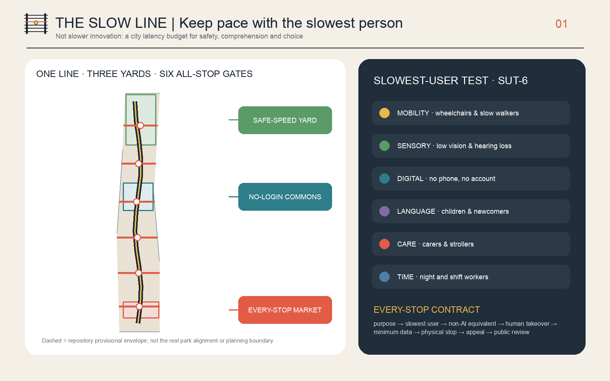
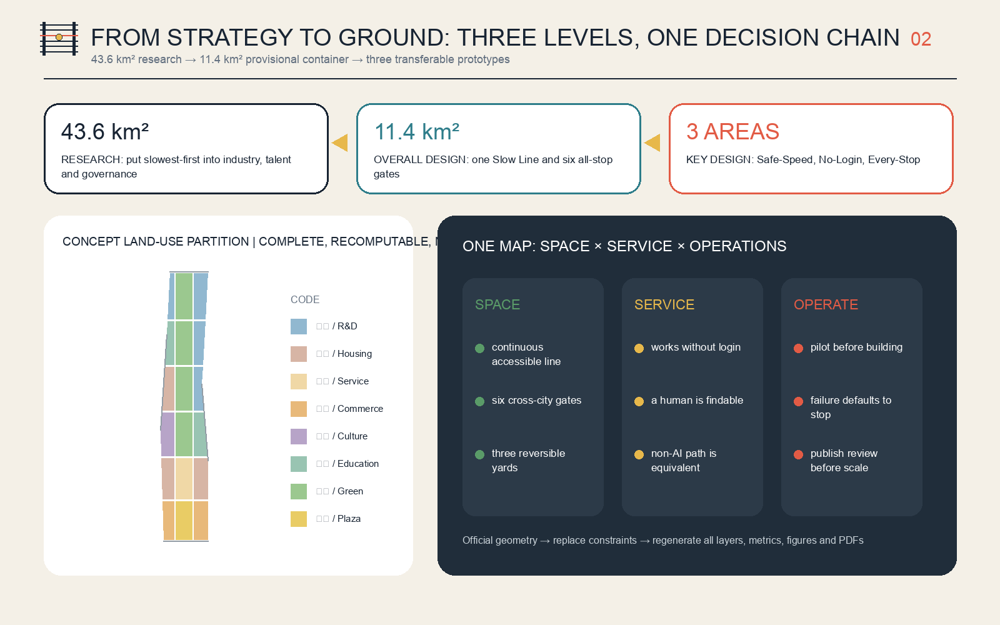
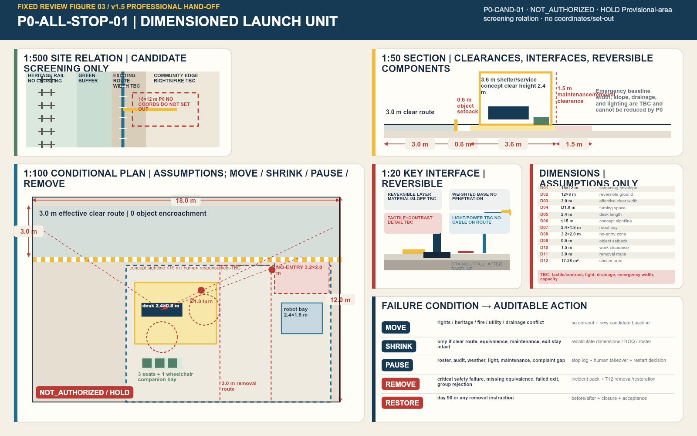
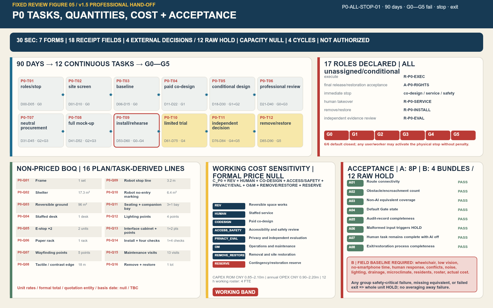
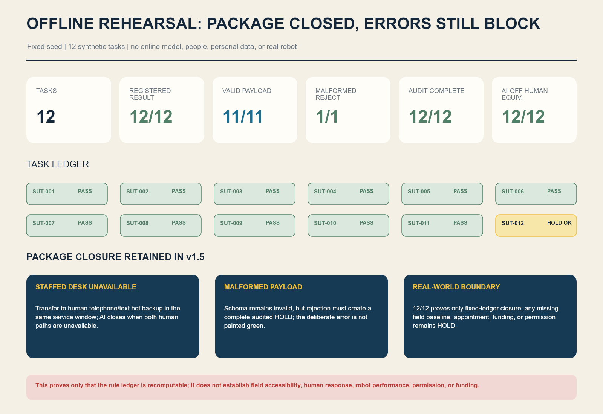
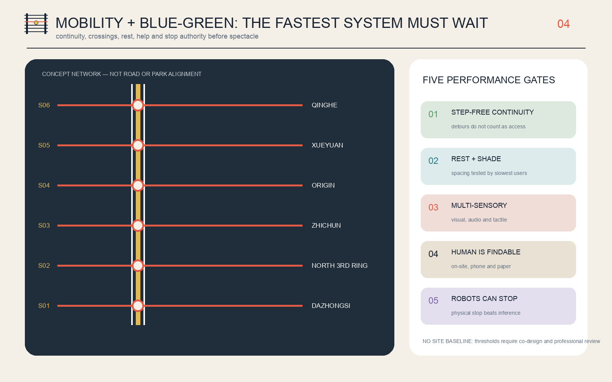

# THE SLOW LINE: Keep pace with the slowest person

> **“Slow” does not mean reducing the speed of innovation. It means writing the slowest person's safety, comprehension, and choice into the city's latency budget.**
>
> An AI service that works only for people who move quickly, see clearly, own a smartphone, understand Chinese, and have time during the day has not yet reached the city. The Slow Line proposes one plain urban rule: **serve every stop**. Before a robot, smart terminal, or urban agent enters public space, it must say who will find it hardest to use, how an equivalent service works without AI, where a human takes over, and who has authority to stop it.

Every spatial move, project, event, policy, and operating model in this proposal is an open co-creation **concept, reference scheme, or item for professional development**. Nothing replaces formal planning or constitutes a government approval, investment, construction, recruitment, event, or permitting commitment. Repository-provisional geometry is only a generation and self-check container; the entire package must be recalculated when official data arrives.

### 30-second P0 professional hand-off summary

> **P0-ALL-STOP-01 · professional execution hand-off unit · `NOT_AUTHORIZED` · `HOLD`**
> The 216 m² concept-screening envelope remains bound to P0-CAND-01 but has no coordinates and cannot be set out. Twelve tasks, 16 BOQ lines, 17 unappointed roles and package 8/8 PASS remain. Twelve field metrics and twelve external gates are losslessly aggregated into four external decision bundles, all 4/4 HOLD. v1.5 adds seven bilingual blank execution forms, eighteen evidence-receipt fields, a capacity/egress formula, four maintenance cycles and a restoration-reserve template; actual records, capacity, signatures, cost, funding and authorization remain zero/null/HOLD.

Professional teams can directly take over survey, responsibility acceptance, D0 baseline, cost, professional review, rehearsal/maintenance and change control from the workbook; all four external decision bundles remain HOLD. [metric:p0_execution_form_count] [metric:p0_external_decision_bundle_count] [metric:p0_external_decision_bundle_hold_count]

Capacity/egress, maintenance and restoration reserve now have fillable templates; the workbook itself is not field evidence or release. [metric:p0_capacity_egress_template_count] [metric:p0_maintenance_cycle_count] [metric:p0_restoration_reserve_template_count]

## Design Basis and Source Inventory

The public prequalification announcement of the Haidian Branch of the Beijing Municipal Commission of Planning and Natural Resources controls the project brief. The cleared Agent taskbook controls the co-creation brief. The proposal also reads the repository snapshots for urban design, regulatory planning, and land-use classification. The announcement confirms three working scales, three key areas, and planning tasks, but supplies no official redline in a verifiable CRS, statutory controls, or existing-conditions survey. The proposal therefore separates “task authority” from “spatial precision”: the former can be answered formally; the latter can only be recomputed provisionally.[source:OFFICIAL-ANNOUNCEMENT] [standard:PROJECT-OFFICIAL-ANNOUNCEMENT]

The public source registry distinguishes formal evidence, background information, and provisional material; the processed fact pack is only a reading aid and creates no new authority. The package separately records three participant-collected official public sources: the Accessibility Environment Construction Law, State Council General Office Document No. 45 [2020], and the Interim Measures for Generative AI Services. They support decisions about staffed service, complaint access, and data minimization only. They do not support a project boundary, land use, or engineering control.[source:SOURCE-REGISTRY] [source:ACCESSIBILITY-LAW-2023]

The public text of the Accessibility Environment Construction Law states that public-service places handling health care and social security should retain on-site guidance and human-operated traditional services. State Council Document No. 45 calls for traditional service methods and smart-service innovation to run in parallel. The response is not merely an “elderly mode” added to AI: a non-digital path is part of the public service itself.[source:ELDERLY-SMART-TECH-2020] [source:GENERATIVE-AI-MEASURES-2023]

The Agent also reviewed the merged-proposal catalogue and open Issues to avoid converging again on heavily represented “smart spine,” “open rail,” and “verifiable main line” themes. Issue #846 reports a 412.5 m minimum separation between the repository's provisional overall boundary and the OSM-mapped built heritage-park section. Neither that measurement nor OSM can replace an official boundary. This proposal therefore **does not redraw a redline from it**. It records the discrepancy as a risk and refuses to describe its schematic Slow Line as the actual park alignment.[source:ISSUE-846-BOUNDARY-AUDIT] [source:BOUNDARY-SOURCE]

This iteration separates “site background” from synthetic atmosphere. The public summary of the street-level regulatory plan approved in August 2026 confirms an approximately 9 km north–south park-innovation belt and structural nodes including Dazhongsi and Wudaokou. A July 2026 Beijing Municipal Government report on the open park identifies Xueyuan South Road–Zhichun Road as the community-vitality section, with restored old rails, slow space east of the rails, an acoustic barrier, adapted railway embankment, and a neighborhood urban edge. The proposal therefore selects the **Xueyuan South Road–Zhichun Road community-vitality section** as a representative segment to calibrate orientation, materials, and daily context only; the public report is not extrapolated into an exact engineering alignment.[source:OFFICIAL-JZR-CONTROL-PLAN-20260812] [source:OFFICIAL-JZR-PARK-20260730]

The grounding figure keeps three things separate. Panel A uses an OSM snapshot only for the orientation among Xueyuan South Road, North Third Ring, Zhichun Road, and the heritage-park direction; the orange band is not a redline. Panel B translates published textual facts into a non-photographic working skeleton: heritage-rail corridor, continuous slow space, planted buffer, and neighborhood edge. It is not an existing-conditions survey. Panel C alone adds the staffed kiosk, physical emergency stop, and short service spur. The robot cannot enter the main slow path or cross the heritage rails. OSM is open geographic context—not a substitute for survey, tenure, or planning approval.[source:OSM-CONTEXT-20260829] [source:OFFICIAL-JZR-PARK-20260730]

The image above is a **text-only generated concept for a representative railway-heritage slow corridor**. No photograph, site screenshot, peer image, identifiable person, or exact camera view was supplied. It explains one design relationship only: a heritage rail pair and continuous accessible slow path run in parallel; a short service spur meets the path at right angles; the robot waits behind its stop line, never occupies the slow path, and never crosses the rails; one mechanically coherent bicycle travels on the main path. This is not a site photograph, existing-conditions record, official rendering, exact site, approved plan, or engineering evidence. Actual siting still requires survey, tenure, traffic, heritage, and operating approval.

The final image remains an **unlocated operating-prototype view**. A horizontal low-speed service lane meets the foreground-to-background pedestrian crossing at a clear right angle, with the robot stopped behind the line. One structurally coherent bicycle, a continuous accessible route, staffed pavilion, paper/telephone access, courier rest, and rain garden explain a transferable service rule. It no longer carries the site-background claim and plays no role in boundary, area, or engineering judgments.

The authority order is GeoJSON, metrics, the three matrices, manifest/sources/assumptions/self-check, narrative, figures, HTML, and PDFs. The narrative makes the design legible; structured files make it recomputable. No submission display uses a remote basemap, company logo, or identifiable portrait. The grounding figure uses attributed OSM-derived orientation lines and textual facts from official reporting; the cover concept was generated from text only, with no site photograph used as an input or reference. Building and road features remain low-confidence conceptual envelopes and links—not surveys, ownership records, demolition decisions, or engineering schemes.[depth:existing_conditions_diagnosis] [data:geometry/site_boundary.geojson#SITE-001]

## Three-Level Scope Framework

The **approximately 43.6 km² research scope** asks why industry, talent, governance, and regional cooperation need a slowest-first rule. The **approximately 11.4 km² overall design scope** asks how one civic line can organize land use, renewal, mobility, infrastructure, blue-green systems, and public services. The **approximately 368.4 ha key-area scope** asks how professional teams can take forward the Safe-Speed Yard, No-Login Commons, and Every-Stop Market. These are not three unrelated drawings. They form one decision chain: the strategic scale sets public value, the overall scale makes a civic armature, and the key areas test it through small pilots.[source:OFFICIAL-ANNOUNCEMENT] [depth:three_level_scope_framework]

The submitted `SITE_BOUNDARY` is a rough provisional polygon maintained by the repository from textual limits and approximate announced area. Its EPSG:4548 recomputation is approximately 11.41 km². That number demonstrates arithmetic consistency inside the current container; it does not mean the geometry is “more precise” than the announcement. The three `KEY_AREA` polygons are likewise rough envelopes based on names, north-south order, and approximate area. Their geometric recomputation totals about 369.29 ha, visibly different from the announced approximation and therefore unsuitable for parcels or redlines.[metric:site_area_sqm] [metric:key_area_total_sqm]

The spatial protocol is **one line, three slow yards, six all-stop gates, and two wing loops**. The line is a continuous accessible public route with rest, help, and services that remain usable without AI. The three yards test embodied intelligence, public services, and smart commerce. Six all-stop gates are conceptual east-west links and public stopping places. The Zhongguancun technology-service wing contributes standards, legal support, talent, and enterprise services; the Xiaoyue River scenario wing contributes daily needs, public feedback, and environmental situations. The layers place this protocol in a temporary container to test topology, proportions, and evidence only—not to claim a real-world alignment.[data:geometry/roads.geojson#ROAD-SLOW-001] [depth:overall_spatial_structure]

When official `SITE_BOUNDARY` and `KEY_AREA` files are released, the workflow is to replace constraints and then regenerate land use, buildings, roads, green space, public space, phasing, every metric, all five bilingual figures, both visual pages, and all A3/A0 PDFs. Replacing only a boundary drawing without recalculating dependent work invalidates the package. Statutory controls, road, building, tenure, heritage, utilities, fire, and flood data must still be supplied independently.[depth:risk_missing_data] [source:KEY-AREA-SOURCE]

## Research-Scope Industry and Future-City Study

### Overall Concept, Naming, and Visual Identity

The primary Chinese name is **京张慢线** and the English name is **THE SLOW LINE**, with the international line **Keep pace with the slowest person**. Rail once connected regions through speed and punctuality. A public innovation line in the AI era should also be judged by whether it waits for the slowest person. The naming system calls the main route the Slow Line, the key areas Yards, cross-city public nodes All-Stop Gates, and each AI application a Service, rather than allowing technical codes to erase human experience.[source:AGENT-TASKBOOK] [standard:PROJECT-AGENT-OPEN-CALL-TASKBOOK]

The original logo direction consists of two dark rails, six sleepers, and one yellow stopping circle. The third sleeper is red to show that everyone has stop authority. The palette combines rail navy, stop yellow, emergency red, care green, and civic water blue. The package draws the mark from basic geometry without external assets or trademarks. Final typography, ratios, and applications require professional visual-design development and renewed rights clearance.

### Three Positionings, Five Functions, and Three Zones with Two Wings

| Taskbook framework | Slow Line response | Legible space or mechanism |
| --- | --- | --- |
| Centennial Jing-Zhang cultural belt | Translate “fastest arrival” into the public ethic “serve every stop” | Milestone grammar, Human Signal Box, Slowest Mile Ledger |
| Metropolitan AI life-experience belt | Obtain service without login, QR code, or identification | No-Login Commons, staffed desks, paper and phone paths |
| AI-integrated innovation belt | Test stopping, explanation, appeals, and exit—not only capability | Safe-Speed Yard, Eight-Stop Contract, public review |
| Full-stack autonomous AI innovation | Put safety, accessibility, and human takeover into the R&D stack | Controlled tests and standard interfaces at Zhongzhiyuan |
| World-class AI innovation ecosystem | Connect research, translation, life, service, and correction | Three yards and two cooperating wings |
| New AI+ scenario paradigm | Give every scenario a slowest user, non-AI equivalent, and stop gate | Twelve scenario cards |
| Intelligent and vibrant AI city | Let intelligence recede into the background while public space works alone | Continuous line and six all-stop gates |
| Global voice in AI governance | Share an executable “serve every stop” protocol | Annual public testing, appeals, and version records |

Zhongzhiyuan tests whether machines can stop. The AI Origin Community tests whether services can wait. Dazhongsi tests whether commerce serves every stop. The technology-service wing connects standards, compliance, capital, and talent; the scenario wing connects residents, environmental conditions, and daily problems. A scenario enters a pilot only after both sides sign its purpose, alternative path, and exit conditions.[depth:overall_spatial_structure]

### Six Global Cases: Transfer Mechanisms, Not Slogans

| Case | Public mechanism | Transferable lesson for the Slow Line |
| --- | --- | --- |
| Singapore one-north | Work, R&D, startup services, and daily amenities form one district ecosystem | A testing yard cannot be detached from life; slow robots need ordinary-day testing |
| Paris STATION F | Historic large space, shared founder services, and housing support | A shared service hall also needs staffed, phone, and no-account entry |
| MIT Kendall Square | Campus, industry, public realm, and community process are interwoven | Campus outcomes need a publicly legible translation interface before entering streets |
| Barcelona 22@ | Productive space, housing, heritage, and knowledge economy coexist in renewal | Retain existing production and life rather than making a single-use office park |
| Montréal Mila | Research, industry partnerships, and responsible-AI questions coexist | Technical partnership should carry a public-interest review and model-use boundary |
| Toronto Quayside | Project withdrawal is a cautionary smart-city governance case | Social license, data governance, and exit rights must precede equipment lock-in |

All six cases use institutional or official project pages and support qualitative mechanism comparison only. No company count, investment, output, or foreign institutional metric is converted into a Haidian target.[metric:global_case_study_count] [source:CASE-ONE-NORTH]

### Regional Innovation Cooperation

The proposal does not invent existing partnerships. It suggests five interfaces that could be agreed: exchange resident co-design methods with Beiwei Community; exchange long-horizon fundamental-research questions with Future Science City; exchange instrument, measurement, and standards methods with Huairou Science City; exchange embodied-AI manufacturing and safety-test questions with Beijing E-Town; and discuss compute, energy, and cross-regional scenarios with Zhangjiakou and wider Beijing-Tianjin-Hebei partners. Each interface records inputs, public return, data boundaries, and exit conditions. It becomes a project only after the relevant parties confirm it.

### The Eight-Stop Contract

Every AI scenario must stop at eight stations before entering the city: **public purpose, slowest-user profile, non-AI equivalent, human takeover, minimum necessary data, physical emergency stop, appeal and correction, and public review**. Missing one stop means no departure. The contract changes the AI question from “What equipment was installed?” to “Does the city remain under human control?” It gives professional, operating, and public teams an executable acceptance structure.[source:GENERATIVE-AI-MEASURES-2023]

## Overall-Scope Urban Renewal and Regulatory-Plan-Depth Urban Design

Overall design begins not with how much to build but with who the city currently skips. A north-south Slow Line provides the continuous civic ground; six all-stop gates make east-west links; three yards contain high-risk tests; and two wings contribute professional service and everyday feedback. Complete land-use partition, building program envelopes, slow-mobility links, green space, public space, and phasing derive from one provisional boundary and can therefore be cross-checked. They are still neither an existing-conditions base nor a statutory scheme.[data:geometry/land_use.geojson#LU-001] [depth:land_use_layout]

Renewal follows **retain first—low-disturbance adaptation—reversible addition—no demolition without evidence**. First, open accessible existing space and service hours. Second, improve entrances, toilets, rest, lighting, information, and staffed desks. Only then consider demountable facilities or building adaptation. No building receives a retain, demolish, or floor-count conclusion before building condition, structural safety, tenure, leases, and resident intent are surveyed.[depth:retain_renovate_demolish] [data:geometry/buildings.geojson#BLDG-001]

Land-use shares, conceptual footprints, green space, and public space only test internal design relationships. FAR, total floor area, building height, statutory density, setbacks, and statutory control lines are pending formal data. `metrics.json` records them as unknown rather than inserting estimates. Character guidance is limited to principles: restraint at heritage interfaces, enterable public ground floors, stopping and through-routes along long frontages, low information load at night, and equipment that can be removed without blocking accessible travel.[standard:MOHURD-CONTROL-DETAILED-PLANNING] [depth:development_intensity_controls]

Infrastructure follows “test the service before sizing the equipment.” Every edge-compute or sensing device must record energy, heat, noise, maintenance, downtime, and human alternatives. Camera count is not an intelligence metric, and facial recognition is not an access prerequisite. Power, communications, utilities, flood, and fire capacity require professional calculation; this proposal gives no engineering alignment or capacity conclusion.[depth:municipal_new_infrastructure]

Concept performance goals are not statutory controls. They are questions for the next co-design stage: Is the path continuously step-free? Can the slowest user actually complete the distance between shade and rest? Is information simultaneously visible, audible, and tactile? Can a human be found on site or by phone? Can a robot be physically stopped? A failed gate pauses the pilot by default; an average satisfaction score cannot hide failure for the hardest-served group.

## Detailed Design of the Key Areas

Each key area is developed through seven topics: role, spatial structure, building renewal, mobility, public space, AI scenarios, and implementation risk. Every boundary below reuses the provisional `KEY_AREA` geometry. The work describes transferable prototypes, not parcels, owners, or engineering limits.[depth:three_key_area_detailed_design] [data:geometry/key_areas.geojson#PROV-KEY-001]

### 1. Zhongzhiyuan Direction: Safe-Speed Yard

Its **role** is to teach embodied intelligence to stop before it enters public space. Its proposed **spatial structure** combines a contained test loop, a mixed-use observation segment, human takeover desk, equipment-rescue point, and public safety-explanation gallery. The conceptual loop only tests relationships inside a provisional key area; it is not a road scheme. **Building renewal** adapts available R&D or display space first and treats additions only as reversible envelopes. **Mobility** makes pedestrians, wheelchair users, and emergency clearance non-negotiable; robots receive only secondary, time- and domain-bounded access.[data:geometry/roads.geojson#ROAD-LOOP-01]

The **Zero-Step Platform** allows developers, disabled testers, and residents to observe stopping distance, blind zones, noise, and rescue from the same level. **Test scenarios** include robot stop-and-yield behavior, rain/snow/occlusion, mixed crossings, and physical emergency-stop rescue. **Implementation risks** include unavailable conditions for the Fifth Ring Road, Qinghe, national platform timing, traffic safety, and waterways. No test can be described as approved operation before professional permission and paid co-design.

### 2. AI Origin Community Direction: No-Login Commons

Its **role** is a civic translation station for near-campus transfer. Research does not move directly from a laboratory into “release”; it first becomes a service that someone without an account can understand and receive. The **spatial structure** places a staffed desk, accessible co-design room, paper and phone access, open-source display, quiet waiting, and appeal desk along one public ground-floor interface. **Building renewal** retains courtyards and uses low-disturbance adaptation first. **Mobility** seeks a continuous path among campus gates, parks, and stations, while exact station-city interfaces await rail and road evidence.

The **Human Signal Box** is not an ornament. During published opening hours a person must be present to stop AI, accept an appeal, provide an equivalent service, and state the next response time. **AI scenarios** include a no-login public terminal, health navigation, learning commons, legal-service navigation, and multilingual interpretation. **Implementation risks** include unknown campus and park edges, operator, professional liability, and service resources. Medical, educational, and legal outputs are navigation and assistance only; relevant professionals make final judgments.[source:ACCESSIBILITY-LAW-2023] [data:geometry/public_space.geojson#PUBLIC-LANDMARK-02]

### 3. Dazhongsi Direction: Every-Stop Market

Its **role** is to make smart commerce prove that it does not skip cash users, non-native speakers, delivery workers, small businesses, or slower pedestrians. The proposed **spatial structure** has four interfaces: staffed commercial ground floors; enterprise desks usable by phone and paper; time-shared curb and cycle stopping; and rain gardens for quiet rest. **Building renewal** adapts existing commercial and office fronts first. **Mobility** keeps four-quadrant metro access and curb conflict as professional-development tasks and gives no bridge, tunnel, or road engineering conclusion.

The **Slowest Mile Ledger** records designs corrected through slowest-user tests and also records withdrawals, apologies, and version changes; recognition is not reserved for the fastest model. **AI scenarios** include an accessibility red team for enterprise agents, time-shared curb negotiation, low-speed delivery relay, and post-event safety review. **Implementation risks** include heritage, commercial tenure, traffic, and the recurring cost of staffed service. All require a site baseline, stakeholder agreement, and permission before a decision.[data:geometry/public_space.geojson#PUBLIC-LANDMARK-03] [depth:height_massing_character]

## AI Innovation Ecosystem, Talent Profiles, and AI+ Scenarios

### Eight User Profiles

| Profile | Moment most likely to be skipped | Proposal response |
| --- | --- | --- |
| Developer with low vision | A terminal communicates only through small text and color | Speech, tactile information, visible focus, and human explanation in parallel |
| Older person without a smartphone | QR code becomes the only entry | On-site, phone, paper, cash, or identity-document path |
| Wheelchair user | The “accessible” path requires a major detour | Judge step-free continuity by the actual trip, not an icon |
| Carer with child or stroller | Transfer, waiting, and toilets do not form a complete chain | Test rest, care, toilets, and walking together |
| Researcher who is not a native Chinese speaker | Responsibility in complex public service is unclear | Plain bilingual information, graphics, and human verification |
| Courier or night-shift operator | Only daytime events and white-collar services exist | Night help, water, charging, stopping, and appeals |
| Small-enterprise founder | Compliance, compute, and pilot thresholds are illegible | Staffed enterprise service and explainable pilot gates |
| Public-service operator | Frontline staff absorb AI errors | Define shifts, takeover authority, incident records, and budget first |

These profiles do not speak on behalf of affected people. They are a starting recruitment list for co-design; participants jointly decide thresholds, priorities, and whether a pilot is acceptable.[metric:user_persona_count] [source:ELDERLY-SMART-TECH-2020]

### Twelve Scenario Cards

| # | Scenario and type | Concept location | Minimum data | Public value | Non-AI equivalent / human takeover / exit |
| --- | --- | --- | --- | --- | --- |
| T1 | Robot stop-and-yield test | Safe-Speed Yard | Anonymous events and device telemetry | Test yielding to walkers, wheelchairs, and children | Human carrying; on-site safety officer; stop at any collision near miss |
| T2 | Mixed-crossing slowest-user test | All-Stop Gate sample | Aggregate crossing time; no faces | Test signal and waiting with the slowest crosser | Human control; traffic professional takeover; stop if queues occupy clear paths |
| T3 | No-login terminal audit | No-Login Commons | Voluntary task result; no stored identity | Test use without phone, with low vision, and across languages | Staffed desk; paper/phone; remove terminal when a task cannot be completed |
| T4 | Enterprise-agent accessibility red team | Every-Stop Market | De-identified test tickets | Reduce barriers and error risk for small enterprises | Human adviser; original process remains; take agent offline after a high-risk error |
| S5 | AI health-service navigation | No-Login Commons | Minimum voluntary question | Find department, entrance, and human help | Guide/hotline; no diagnosis; dangerous symptoms go directly to a person |
| S6 | AI learning commons | Origin co-design room | Local session or anonymous learning preference | Aid comprehension, translation, and resource navigation | Teacher/volunteer; paper resources; never replaces assessment or admission |
| S7 | AI legal-service navigation | Human Signal Box | Triage question without retained case facts | Find public rules and formal service channels | Legal-service staff; no legal opinion; disputes are referred |
| S8 | Multilingual cultural guide | Slow Line public node | No identity or movement trail | Connect Jing-Zhang, Zhongguancun, and new AI culture | Paper guide/volunteer; facts reviewed by a human; mistranslation removed |
| S9 | Slowest-route planning | Six all-stop gates | Public facility status and user-chosen preference | Choose fewer steps, rest, and staffed help | Static map/phone; location not required; broken links shown clearly |
| S10 | Low-speed delivery relay | Safe-Speed Yard to service point | Minimum order fields and device state | Optional delivery for people with limited mobility | Human delivery; physical stop; never displaces walking space |
| S11 | Time-shared curb negotiation | Every-Stop Market | Aggregate time-slot demand | Coordinate couriers, taxis, loading, and accessible boarding | On-site manager; fixed accessible space is not auctioned |
| S12 | Post-event safety review | Three yards and gates | Incident records; no real-time mass surveillance | Publish crowding, complaints, takeovers, and changes | Human operations review; no face tracking; dissent is retained |

The first four are industry testing-and-validation scenarios; the remaining eight are public-service and daily-operation scenarios. All twelve state a non-AI equivalent, producing 100% textual coverage. This shows protocol completeness only; it does not prove that staffing, budget, or technology exists on site.[metric:ai_test_scenario_count] [metric:non_ai_fallback_coverage_ratio]

The scenario-space-operations map has one hard rule. A spatial node supplies stopping, waiting, human help, and a clear boundary. A service card supplies purpose, data, and an alternative path. An operator supplies shifts, budget, appeals, and exit. A scenario does not launch if one part is missing. Professionals always make final decisions in medicine, education, law, and safety; AI cannot be the only entry.

### 90-day first pilot: prove that one All-Stop Gate can stop

This iteration no longer leaves all twelve cards as generic “next pilots.” It selects one **unlocated, reversible All-Stop Gate prototype** as the minimum hand-off unit. It supports only S9 slow-route planning and staffed service navigation; it does not begin with diagnosis, approvals, real-time surveillance, or robot operation on an open road. Real-world authorization remains `NOT_AUTHORIZED`; the location, operator, co-design participants, and professional reviewers are all unassigned. No procurement or public trial may begin before site baseline, tenure permission, and accountable signatures exist.[metric:pilot_gate_count]

| Study window | What it may do | Evidence it must leave | Immediate HOLD condition |
| --- | --- | --- | --- |
| Days 0–30: baseline and co-design | Four-party site walk, same-task AI-off route, staffed hours, and step-free/shade/rest/complaint baseline | Route-release drawing, barrier list, paid co-design record, dissent ledger | Tenure or fire status unclear; no staffed equivalent; affected participants refuse |
| Days 31–60: closed-loop offline rehearsal | Rehearse stop, human transfer, high-risk refusal, service closure, and audit gaps without real personal data or an open public road | Emergency-stop drill, draft roster, data inventory, twelve-task synthetic ledger, failure review | Any failure hidden by averages; missing audit; AI remains open when staffed service closes |
| Days 61–90: time-limited micro-trial | Only after the first two gates, discuss one time slot, one entrance, and one bounded low-risk task | Same-task results by group, human response time, complaint/deletion log, restoration before/after | Any safety-critical failure; any group cannot complete the same task; original service cannot be restored |

The six evidence gates are **G0 tenure and statutory permission, G1 accessibility co-design, G2 staffed equivalence and roster, G3 privacy/safety/professional duty, G4 time-limited operation and independent observation, and G5 restoration and public review**. All six default closed and cannot compensate for one another through a total score. The minimum accountability set is the site rights holder, accessibility co-designer, service operator, safety/privacy professional, and independent reviewer; all are currently `unassigned`. Staffing and cost are expressed as hand-off formulae rather than invented prices: `staff required = confirmed staffed opening hours ÷ operator-confirmed productive hours per FTE`; `ROM cost = reversible works + staffed service + paid co-design + safety/privacy review + exit/restoration + contingency confirmed by the professional cost team`.

### v1.5 P0-ALL-STOP-01: professional execution hand-off

The stable object ID is `P0-ALL-STOP-01`. v1.5 retains the v1.4 dimensions, tasks, quantities, roster, cost sensitivities and fail-closed controls, then packages survey, responsibility acceptance, D0 baseline, cost, professional review, rehearsal/maintenance and change control into seven fillable bilingual forms for professional takeover. The object remains bound only to concept-screening relationship `P0-CAND-01`, with no coordinates, parcel, right, permission or set-out authority; all 17 roles remain unappointed and formal price/funding remain `null/TBC`.

#### Dimension register: every number has a basis and confirmation trigger

| ID | Object | Value / derivation | Design-assumption boundary | Confirmation role / trigger |
| --- | --- | --- | --- | --- |
| P0-D01 | Concept screening envelope | 18.0 m x 12.0 m [metric:p0_screening_envelope_area_sqm] | Design assumption used to test whether the existing route, service zone, and removal access can coexist; not a parcel area or field measurement. | `A-P0-RIGHTS + R-P0-SURVEY` / candidate site nominated and rights holder permits baseline survey |
| P0-D02 | Reversible ground zone | 12.0 m x 8.0 m service apron within the screening envelope [metric:p0_reversible_ground_area_sqm] | Allows demountable surfacing, markings, and service components without assuming ground alteration; material compatibility and drainage remain TBC. | `R-P0-ACCESS + R-P0-DRAINAGE + A-P0-RIGHTS` / surface, level and drainage baseline complete |
| P0-D03 | Effective slow-route clear width | continuous 18.0 m x 3.0 m unobstructed strip [metric:p0_clear_route_width_m] | Conservative operating assumption allowing a wheelchair, companion, and low-speed passing; not claimed as a statutory minimum and subject to accessibility, traffic, and fire review. | `R-P0-ACCESS + R-P0-TRAFFIC + R-P0-FIRE` / measured cross-section and applicable public standards confirmed |
| P0-D04 | Wheelchair turning space | one clear circle at the service decision point and one at the staffed desk [metric:p0_wheelchair_turn_diameter_m] | Concept-plan assumption preventing equipment from consuming turning space; final shape and value require paid co-design and accessibility review. | `R-P0-CODESIGN + R-P0-ACCESS` / co-design mock-up and measured route test |
| P0-D05 | Staffed service desk | 2.4 m x 0.8 m demountable module; accessible approach and counter height TBC [metric:p0_staffed_desk_length_m] | Length separates paper information, staffed service, and stop control; counter height, knee clearance, and equipment model cannot be frozen before accessibility review. | `R-P0-CODESIGN + R-P0-SERVICE + R-P0-ACCESS` / paid mock-up acceptance |
| P0-D06 | Staffed sightline | unobstructed concept sight triangle from desk to both route entries and robot stop line [metric:p0_staffed_sightline_m] | Maximum concept observation-distance assumption for plan screening, not a response-time promise; obstruction, night conditions, and actual response require field testing. | `R-P0-SERVICE + R-P0-SAFETY` / day/night sightline walk-through |
| P0-D07 | Robot holding bay | 2.4 m x 1.8 m marked bay [metric:p0_robot_bay_area_sqm] | Worst-envelope screening only and not tied to a device; device dimensions, braking, rescue, and charging remain TBC. | `R-P0-SAFETY + R-P0-EQUIPMENT` / specific equipment and controlled test protocol proposed |
| P0-D08 | Robot no-entry zone | 3.2 m x 2.0 m buffer between 3.2 m stop line and slow route [metric:p0_robot_no_entry_area_sqm] | Visible physical boundary independent of algorithmic judgment; final stopping distance is set through controlled testing and safety review and cannot be reduced without evidence. | `R-P0-SAFETY + R-P0-EQUIPMENT` / braking and rescue test passed in a contained site |
| P0-D09 | Component setback from clear route | minimum concept furniture/equipment/sign setback outside the 3.0 m clear strip [metric:p0_component_setback_m] | Screening value keeping equipment, seating, and signs outside the clear strip; tactile/high-contrast edges are route interfaces, not furniture, and remain TBC in detail. | `R-P0-ACCESS + R-P0-MAINTENANCE` / full-size tape-out and maintenance walk-through |
| P0-D10 | Maintenance/removal working clearance | clear working band around demountable frame and equipment cabinet [metric:p0_maintenance_clearance_m] | Concept allowance for inspection, handling, and non-destructive removal; it cannot consume the slow-route width or any existing emergency route. | `R-P0-INSTALL + R-P0-MAINTENANCE + R-P0-FIRE` / installation and removal method statement reviewed |
| P0-D11 | Removal access route | one 3.0 m clear concept route to the screening-envelope edge [metric:p0_removal_access_width_m] | Screens manual or small-plant removal of the largest demountable module and does not authorize vehicle access; actual emergency and handling width requires site-management, fire, and installer confirmation. | `R-P0-INSTALL + R-P0-FIRE + A-P0-RIGHTS` / logistics and emergency plan accepted |
| P0-D12 | Demountable shelter | 4.8 m x 3.6 m weighted-base canopy; 2.4 m concept clear height [metric:p0_canopy_area_sqm] | For plan, section, and quantity calculation only; wind, snow, structure, clearance, heritage, fire, and bearing capacity remain TBC and installation is prohibited before sign-off. | `R-P0-STRUCTURE + R-P0-FIRE + A-P0-RIGHTS` / site-specific structural and fire review |

Six site interfaces remain TBC: tactile detail, contrast and night readability, lighting/glare/power, slope/drainage/outfall, emergency width/fire control, and power/data/charging/cable protection. No cable may cross the effective route; P0 cannot reduce the existing emergency width; no penetrating fixing is allowed without heritage, utility, and structural clearance. [metric:p0_tbc_interface_count]

#### Authority and responsibility: execution, release, stop, takeover, removal, and acceptance are separated

- `R-P0-EXEC` — P0 implementation coordinator: `unassigned/conditional`; coordinates tasks and evidence; cannot self-authorize opening
- `A-P0-RIGHTS` — Site-rights holder/commissioning accountability slot: `unassigned/conditional`; accountable for final release, removal instruction, ground-restoration acceptance, and records retention; release depends on all required professional evidence
- `R-P0-CODESIGN` — Paid accessibility co-design lead: `unassigned/conditional`; may place the work on immediate HOLD for exclusion, inaccessible equivalence, or safeguarding failure
- `R-P0-SERVICE` — Staffed-service and human-takeover operator: `unassigned/conditional`; executes staffed equivalent service, immediate takeover, opening/closing parity, and may stop operation
- `R-P0-SAFETY` — On-duty safety/privacy professional: `unassigned/conditional`; independent immediate stop authority; controls incident scene and evidence preservation
- `R-P0-INSTALL` — Demountable works installation/restoration role: `unassigned/conditional`; installs, maintains, dismantles, removes waste, restores the surface, and submits as-left records
- `R-P0-EVAL` — Independent accessibility/operations evaluator: `unassigned/conditional`; observes without operating the pilot; signs evidence completeness, not government or engineering approval
- `R-P0-SURVEY` — Survey and baseline-record professional: `unassigned/conditional`; records levels, obstacles, condition, utilities and reinstatement reference only after authorization
- `R-P0-ACCESS` — Accessibility professional reviewer: `unassigned/conditional`; reviews route, turning, tactile, contrast, counter and same-task equivalence; may require redesign or HOLD
- `R-P0-TRAFFIC` — Traffic and slow-mobility interface reviewer: `unassigned/conditional`; reviews pedestrian, cycle, curb, logistics and conflict conditions without authorizing road use
- `R-P0-FIRE` — Fire and emergency-route reviewer: `unassigned/conditional`; may stop any proposal that reduces an existing emergency route or lacks an accepted emergency method
- `R-P0-STRUCTURE` — Structural and temporary-works reviewer: `unassigned/conditional`; reviews wind, snow, bearing, fixing, clearance and dismantling before any assembly release
- `R-P0-ELECTRICAL` — Electrical, lighting, and isolation reviewer: `unassigned/conditional`; reviews capacity, cable protection, isolation, lighting and safe shutdown
- `R-P0-DRAINAGE` — Surface, level, and drainage reviewer: `unassigned/conditional`; reviews levels, ponding, outfall, wet-weather access and restoration baseline
- `R-P0-EQUIPMENT` — Equipment stop, rescue, and interface reviewer: `unassigned/conditional`; defines contained stop, braking, rescue, charging and isolation evidence for any nominated equipment
- `R-P0-LIGHTING` — Lighting and visual-readability reviewer: `unassigned/conditional`; reviews task lighting, glare, contrast and day/night readability with affected users
- `R-P0-MAINTENANCE` — Maintenance, spares, and reinstatement role: `unassigned/conditional`; owns inspection windows, spares, defect closure and maintenance-to-removal escalation

The site-rights/commissioning slot holds final release accountability but cannot bypass accessibility, fire, structural, electrical, privacy, safety, or independent evidence. Paid co-design, staffed service, and on-duty safety/privacy roles hold equal immediate-stop power; any user or worker may activate the physical stop without penalty. The staffed operator performs takeover; the installation/restoration role dismantles, removes, and restores; the accountable site slot accepts restoration, while the independent evaluator signs evidence completeness only—not government or engineering approval.

#### 90-day delivery task chain

| task_id | Window | Responsible | Accountable | Input/output summary | Gate | HOLD | Recovery or exit evidence |
| --- | --- | --- | --- | --- | --- | --- | --- |
| P0-T01 | D00-D05 | `R-P0-EXEC` | `A-P0-RIGHTS` | role-acceptance register; RACI and immediate-stop register | G0 | no accountable rights holder; stop authority refused; human-takeover role absent | dated role acceptance or written no-go; versioned responsibility register |
| P0-T02 | D01-D10 | `R-P0-EXEC + R-P0-SURVEY` | `A-P0-RIGHTS` | 1:500 candidate-site relationship; rights/heritage/fire/utilities constraint log | G0 | heritage rail crossed; existing slow route or emergency route narrowed; rights or utilities unknown | screen-out record with reason; alternative candidate trigger |
| P0-T03 | D06-D15 | `R-P0-SURVEY` | `A-P0-RIGHTS` | levels and drainage baseline; path/obstacle/lighting/noise condition record | G0 | baseline cannot be audited; unsafe access; official constraint conflicts | sealed baseline dataset by appointed professional; written site rejection |
| P0-T04 | D11-D22 | `R-P0-CODESIGN` | `A-P0-RIGHTS` | task-based co-design record; dissent and unresolved-issue log | G1 | unpaid or token participation; affected group rejects pilot; accessible equivalent cannot be defined | recruitment correction; participant-approved no-go or revised brief |
| P0-T05 | D18-D30 | `R-P0-EXEC + R-P0-SERVICE` | `A-P0-RIGHTS` | conditional 1:100/1:50/1:20 package; frozen non-priced BOQ | G1+G2 | clear route intersects any object; desk cannot see route entries and stop line; AI can open while human service is closed | revised clash-free package; recorded withdrawal if equivalence cannot be staffed |
| P0-T06 | D21-D40 | `R-P0-SAFETY` | `A-P0-RIGHTS` | permit/approval register; accessibility/fire/structure/electrical/privacy/safety review record | G0+G3 | any required approval missing; ground penetration proposed without clearance; personal-data purpose or retention unresolved | closed review comments; formal no-go and protected records |
| P0-T07 | D31-D45 | `R-P0-EXEC + R-P0-INSTALL` | `A-P0-RIGHTS` | supplier-neutral specifications; installation/maintenance/removal method statements | G2+G3 | single-source lock-in without exit; removal/restoration omitted; unit rates or funds unverified | reissued neutral schedule; procurement cancellation record |
| P0-T08 | D41-D52 | `R-P0-INSTALL + R-P0-SERVICE` | `A-P0-RIGHTS` | off-site/full-size mock-up; wheelchair turn and desk approach check | G2+G3 | turning/approach fails; physical stop fails; defect lacks owner or closure evidence | closed defect record; scrap/rework trace |
| P0-T09 | D53-D60 | `R-P0-INSTALL + R-P0-SAFETY` | `A-P0-RIGHTS` | installation and as-installed register; AI-off same-task rehearsal | G0+G1+G2+G3+G4 | route obstruction > 0; audit completeness < 100%; AI-off equivalent < 100%; malformed input does not HOLD | corrected rehearsal ledger; closed/opening refused record; removal instruction if correction fails |
| P0-T10 | D61-D75 | `R-P0-SERVICE + R-P0-SAFETY` | `A-P0-RIGHTS` | time-limited operating log; disaggregated task records | G4 | any safety-critical failure; equivalent service unavailable; any group cannot exit; roster gap | incident package; human-takeover record; restart or permanent-stop decision |
| P0-T11 | D76-D84 | `R-P0-EVAL` | `A-P0-RIGHTS` | independent evidence audit; group-by-group decision | G4+G5 | missing record; averages mask a failed group; reviewer not independent | qualified/failed evaluation with unresolved items visible; accountable decision trail |
| P0-T12 | D85-D90 | `R-P0-INSTALL` | `A-P0-RIGHTS` | dismantling and waste trace; after-condition survey | G5 | surface not restored; waste/asset destination unknown; baseline comparison or acceptance missing | before/after comparison; remediation invoice/record with rates redacted or TBC as applicable; signed acceptance by accountable role and independent evidence reviewer |

The chain contains 12 tasks within D00–D90 and retains G0–G5. After v1.4 replay, audit completeness and AI-off human equivalence both reach 12/12, while malformed input still triggers an audited HOLD in 1/1 tests. This closes package-level gaps only and never opens G4 automatically; every real-world external gate remains closed. [metric:p0_task_chain_count] [metric:p0_gate_default_closed_ratio] [metric:p0_route_obstruction_count]

Malformed-input testing must remain 1/1 for triggering HOLD; failure cannot be averaged away by other task results. [metric:p0_malformed_input_hold_ratio]

#### Non-priced bill of quantities

| boq_id | Item | Quantity | Derivation | Pricing state |
| --- | --- | --- | --- | --- |
| P0-Q01 | Demountable frame | 1 set | 6 weighted-base posts + 16.8 m perimeter beams | `null/TBC` |
| P0-Q02 | Demountable shelter | 17.28 sqm | 4.8 m x 3.6 m | `null/TBC` |
| P0-Q03 | Reversible ground treatment | 96 sqm | 12.0 m x 8.0 m service apron | `null/TBC` |
| P0-Q04 | Staffed service desk | 1 module | 2.4 m x 0.8 m demountable desk | `null/TBC` |
| P0-Q05 | Physical emergency-stop facilities | 2 unit | 1 public-facing + 1 staff-side; final specification TBC | `null/TBC` |
| P0-Q06 | Paper information rack | 1 unit | adjacent to staffed desk and outside clear route | `null/TBC` |
| P0-Q07 | Multi-channel wayfinding points | 5 point | 2 entries + 1 staffed desk + 1 robot stop + 1 exit/restoration notice | `null/TBC` |
| P0-Q08 | Tactile/high-contrast guidance interface | 18 linear_m | one continuous route-edge interface; detailed pattern TBC | `null/TBC` |
| P0-Q09 | Robot stop line | 3.2 linear_m | full service-spur width | `null/TBC` |
| P0-Q10 | Robot no-entry marking | 6.4 sqm | 3.2 m x 2.0 m | `null/TBC` |
| P0-Q11 | Seating and wheelchair companion bay | 3 seat_plus_1_bay | 3 movable seats and 1 unoccupied companion bay under/near shelter | `null/TBC` |
| P0-Q12 | Demountable lighting points | 4 point | plan-count only; illuminance, glare and power TBC | `null/TBC` |
| P0-Q13 | Equipment interface cabinet and points | 1 cabinet_plus_2_points | 1 lockable cabinet + 2 protected power/data points; capacities TBC | `null/TBC` |
| P0-Q14 | Installation and pre-opening inspections | 1 lot_plus_4_inspections | install lot + accessibility/safety/electrical/operations checks | `null/TBC` |
| P0-Q15 | Planned maintenance | 13 weekly_visit | ceil(90 days / 7); daily pre-open checks depend on authorized open days | `null/TBC` |
| P0-Q16 | Dismantling, removal, ground restoration, and acceptance | 1 lot | remove all P0 objects + before/after condition comparison + acceptance | `null/TBC` |

The 16-line BOQ is grouped into six unpriced procurement lots and remains recomputable from drawings or tasks. Market rates, vendor quotes, formal estimate, tender price, and funding commitment remain zero/null. v1.4 adds dated participant CAPEX/OPEX working bands only to compare roster and alternatives. [metric:p0_boq_line_count] [metric:p0_market_rate_known_count]

#### Parametric cost model: complete formula, no fabricated prices

`C_P0 = C_REV + C_HUMAN + C_CODESIGN + C_ACCESS_SAFETY + C_PRIVACY_EVAL + C_OM + C_REMOVE_RESTORE + C_RESERVE`

- `C_REV` Reversible space works: `sum(BOQ quantity_i x verified unit_rate_i) + installation labour`; value = `null`.
- `C_HUMAN` Staffed service: `H_open x r_staff + H_training x r_staff + H_supervision x r_supervisor`; value = `null`.
- `C_CODESIGN` Paid co-design: `N_participants x H_participant x r_participant + access_support + travel + care`; value = `null`.
- `C_ACCESS_SAFETY` Accessibility and safety review: `H_access x r_access + H_safety x r_safety + H_fire x r_fire + H_structure x r_structure`; value = `null`.
- `C_PRIVACY_EVAL` Privacy and independent evaluation: `H_privacy x r_privacy + H_independent x r_evaluator`; value = `null`.
- `C_OM` Operations and maintenance: `W x visits_per_week x H_visit x r_maint + consumables + utilities + incident_allowance`; value = `null`.
- `C_REMOVE_RESTORE` Removal and site restoration: `H_remove x r_remove + A_remediation x r_remediation + waste_trace + acceptance`; value = `null`.
- `C_RESERVE` Contingency/restoration reserve: `max(verified C_REMOVE_RESTORE, p_contingency x subtotal); p_contingency TBC by cost/risk professionals`; value = `null`.

Staffing formula: `FTE_required = annual staffed hours / 1680 productive hours x 1.2 leave-training factor`. Sensitivity covers opening hours, open days, shift overlap, productive hours per FTE, paid participation/support, BOQ quantities, remediation area, and contingency. Market-price total, required FTE, and formal total all remain unknown/null until a named site, operator, professional cost team, rate sources, basis date, and funding authority exist. [metric:p0_cost_component_count] [metric:p0_market_price_total] [metric:p0_staffing_fte]

The formal total remains null and cannot be inferred from concept quantities as a quotation or funding commitment. [metric:p0_formal_total_cost]

#### Two-layer acceptance A: checkable in the current package

| metric_id | Metric | Formula | Data source | Threshold state | Responsible | Current state | Trigger |
| --- | --- | --- | --- | --- | --- | --- | --- |
| P0-A01 | Route connectivity | connected entry-to-exit route pairs / 1 required pair | 1:100 concept graph in key-areas figure + v13 source | SET: 1/1 and zero disconnected segment | `R-P0-EXEC` | **PASS_IN_PACKAGE_NOT_FIELD** | any plan revision |
| P0-A02 | Obstacle/encroachment count | count(BOQ objects intersecting the 18.0 m x 3.0 m clear route) | 1:100 plan object boxes | SET: 0 | `R-P0-ACCESS` | **PASS_IN_PACKAGE=0** | object, setback, or route-width change |
| P0-A03 | Non-AI equivalent coverage | scenario cards with a stated non-AI equivalent / 12 scenario cards | proposal scenario table | SET: 12/12 | `R-P0-SERVICE` | **PASS_TEXT_PROTOCOL=12/12** | scenario or service change |
| P0-A04 | Default Gate state | gates default closed / 6 gates | task chain and gate register | SET: 6/6 closed before evidence | `R-P0-EXEC` | **PASS_IN_PACKAGE=6/6** | gate logic change |
| P0-A05 | Audit-record completeness | synthetic tasks with complete audit record / 12 tasks | simulation.json | SET: 12/12 before G4 | `R-P0-SAFETY` | **PASS_SYNTHETIC=12/12** | simulation schema, audit fields, or task set changes |
| P0-A06 | Malformed input triggers HOLD | malformed-input tests resulting in HOLD / malformed-input tests | simulation.json malformed dispatch case | SET: 1/1 | `R-P0-SAFETY` | **PASS_SYNTHETIC=1/1** | schema or dispatch change |
| P0-A07 | Human task remains complete with AI off | AI-off same-task cases completed through staffed/paper/phone/fixed spatial paths / 12 tasks | simulation.json + visual/assets/v14-delivery-control.json | SET: 12/12 before G4 | `R-P0-SERVICE` | **PASS_SYNTHETIC=12/12** | service window, hot-backup rule, or task set changes |
| P0-A08 | Exit/restoration process completeness | specified evidence slots / 6 required slots | P0-T12 | SET: 6/6 specified; execution remains field HOLD | `R-P0-INSTALL` | **PASS_PROCESS_SPECIFIED=6/6** | removal method or acceptance role change |

Layer A now records 8 PASS / 0 HOLD. The missing audit record becomes a complete audited HOLD after malformed-input rejection; desk unavailability changes to human phone/text hot backup so the same task still completes with AI off. Real execution and field effects remain Layer B. [metric:p0_current_package_pass_count] [metric:p0_current_package_hold_count] [metric:p0_exit_evidence_slot_count]

#### Two-layer acceptance B: field baseline required

| metric_id | Metric | Formula | Data source | Threshold state | Responsible | Current state | Trigger |
| --- | --- | --- | --- | --- | --- | --- | --- |
| P0-B01 | Wheelchair-user actual completion | successful same-task completions / valid attempts, reported with critical failures | authorized field task log | TBC_PAID_CODESIGN_PREREGISTRATION; zero safety-critical failures | `R-P0-CODESIGN + R-P0-EVAL` | **HOLD_NO_FIELD_BASELINE** | G0-G3 pass and group approves protocol |
| P0-B02 | Blind/low-vision actual completion | successful same-task completions / valid attempts, reported with critical failures | authorized field task log | TBC_PAID_CODESIGN_PREREGISTRATION; zero safety-critical failures | `R-P0-CODESIGN + R-P0-EVAL` | **HOLD_NO_FIELD_BASELINE** | G0-G3 pass and tactile/audio/contrast interfaces confirmed |
| P0-B03 | Time for an older person without a smartphone to reach staffed service | P90(time from envelope entry to confirmed human assistance) | timestamped authorized field task log | TBC_PAID_CODESIGN_PREREGISTRATION | `R-P0-SERVICE + R-P0-EVAL` | **HOLD_NO_FIELD_BASELINE** | staff roster and opening hours confirmed |
| P0-B04 | Human response time | P90(time from help request to two-way human response), disaggregated by period | staffed-service log | TBC_OPERATOR_AND_CODESIGN_PREREGISTRATION | `R-P0-SERVICE` | **HOLD_NO_FIELD_BASELINE** | named operator accepts roster |
| P0-B05 | Pedestrian-flow conflict | observed conflicts / valid traversals, with every safety-critical event separately reported | independent manual observation | TBC_TRAFFIC_REVIEW; zero safety-critical conflicts | `R-P0-EVAL + R-P0-SAFETY` | **HOLD_NO_FIELD_BASELINE** | authorized observation plan |
| P0-B06 | Noise | baseline and operating sound levels by agreed period/location | professional site measurement | TBC_ACOUSTIC_BASELINE_AND_APPLICABLE_STANDARD | `R-P0-SAFETY` | **HOLD_NO_FIELD_BASELINE** | day/night baseline permission |
| P0-B07 | Lighting and glare | measured task/route illuminance plus glare/contrast review at agreed points | professional night measurement + co-design walk-through | TBC_LIGHTING_AND_ACCESSIBILITY_REVIEW | `R-P0-LIGHTING + R-P0-CODESIGN` | **HOLD_NO_FIELD_BASELINE** | night access and fixture schedule confirmed |
| P0-B08 | Drainage | count of ponding/blockage events plus before/after surface-level and outlet check | level survey, rainfall observation, maintenance log | TBC_DRAINAGE_BASELINE; zero blocked accessible route | `R-P0-DRAINAGE + R-P0-MAINTENANCE` | **HOLD_NO_FIELD_BASELINE** | survey and wet-weather observation available |
| P0-B09 | Microclimate | shade availability and agreed thermal/wind observations by operating period | site baseline + field observation | TBC_CODESIGN_AND_ENVIRONMENTAL_REVIEW | `R-P0-EVAL` | **HOLD_NO_FIELD_BASELINE** | season/period and method preregistered |
| P0-B10 | Resident acceptance | reported response distribution by affected group; dissent remains visible | authorized, consented engagement record | TBC_STAKEHOLDER_PREREGISTRATION; no average may override critical group rejection | `R-P0-CODESIGN + R-P0-EVAL` | **HOLD_NO_FIELD_BASELINE** | affected parties and consent protocol confirmed |
| P0-B11 | Operating-roster coverage | staffed equivalent hours delivered / authorized digital-service hours | signed roster and attendance log | SET: 100% opening parity | `R-P0-SERVICE` | **HOLD_NO_OPERATOR** | named operator and funded roster |
| P0-B12 | Actual-cost completeness | cost components with verified quantity, unit rate, source, basis date, and payer / 8 components | authorized cost plan, quotations, payroll/fees, maintenance and restoration records | SET: 8/8 evidence fields complete before cost claim; market values remain TBC | `A-P0-RIGHTS + appointed cost professional` | **HOLD_NULL_RATES_AND_NO_FUNDING** | site, procurement route, rate sources, basis date, and funding authority confirmed |

All 12 Layer-B items remain HOLD and are losslessly aggregated into four external decision bundles for hand-off; every raw metric_id, source, threshold, responsible role and trigger remains intact. The forms tell a professional team who must obtain which evidence, by what method and when; they cannot substitute for real participants, measurements, signatures, quotations or permission. Any group critical failure holds the whole unit. [metric:p0_field_check_hold_count]

#### v1.4 delivery-control closure: internally executable, externally fail-closed

P0 is no longer wholly unlocated: it binds three participant-screening candidates to the public provisional key-area relationships. Preferred P0-CAND-01 means first in line for G0 documentary screening only—not site selection, coordinates, rights, or permission. [metric:p0_candidate_screening_count]

| candidate | Screening relationship | Strengths | HOLD | status |
| --- | --- | --- | --- | --- |
| P0-CAND-01 | Zhongzhiyuan safe-speed-yard edge prototype | controlled-test function is compatible with fail-closed rehearsal; robot holding and human-takeover can be tested before any public-road claim; removal and restoration can be treated as first-class acceptance tasks | no parcel, coordinate, rights holder, survey, fire route, utility or drainage confirmation; provisional key-area polygon cannot be used for set-out | PREFERRED_FOR_G0_SCREENING_ONLY_NOT_AUTHORIZED |
| P0-CAND-02 | AI Origin no-login-commons threshold prototype | strong fit with staffed, paper, phone and no-account public service; directly tests same-task equivalence | higher safeguarding, privacy and community-consent burden; no property, operating-hour or service-operator evidence | FALLBACK_IF_G0_AND_G1_DOCUMENTARY_GATES_CLOSE |
| P0-CAND-03 | Dazhongsi every-stop-market service-edge prototype | tests ordinary commercial and curb-service exclusion risk; high visibility for no-skip service rules | metro, heritage, crowd, curb, fire and rights interfaces are unresolved; no field capacity or emergency-route evidence | FALLBACK_ONLY_AFTER_G0_G1_AND_G3_CLOSE |

Human equivalence uses a hard rule: AI availability cannot exceed covered human-service hours. If the desk is unavailable, service changes to funded human phone/text hot backup in the same window; if both human routes fail, AI closes and emits an audited HOLD. These are participant roster sensitivities, not operator commitments.

| scenario | service window | annual staffed hours | calculated FTE | working roster | uncovered hours |
| --- | ---: | ---: | ---: | ---: | ---: |
| ROSTER-8H | 8 h/day | 2920 h | 2.086 | 3 | 0 |
| ROSTER-12H | 12 h/day | 4380 h | 3.129 | 4 | 0 |
| ROSTER-18H | 18 h/day | 6570 h | 4.693 | 5 | 0 |

ROSTER-12H is selected as the middle working case. Its participant assumption of 07:00-19:00 covers morning-to-evening civic use more fully than the 8-hour fallback without treating the 18-hour stress case as a commitment. It calculates 3.129 FTE, rounds up to four FTE, and has zero modelled uncovered hours. A named operator and paid co-design process must confirm or replace the window. [metric:p0_working_roster_fte]

The CAPEX ROM working band is CNY 850,000–2,100,000, basis date 2026-08-31. [metric:p0_working_capex_rom_low_cny] [metric:p0_working_capex_rom_high_cny]

The annual OPEX working band is CNY 900,000–2,200,000. These bands compare concept BOQ and roster assumptions only; they are not market rates, a formal estimate, vendor quotes, a tender price, or funding commitment. [metric:p0_working_opex_low_cny] [metric:p0_working_opex_high_cny]

All twelve external gates require distinct receipts and remain 12/12 HOLD; no missing gate can be offset by package-level PASS results. [metric:p0_external_gate_hold_count]

| gate | subject | accountable | required receipt | current |
| --- | --- | --- | --- | --- |
| DG01 | candidate extent and survey access | A-P0-RIGHTS | signed candidate and survey-access record | HOLD |
| DG02 | site rights and heritage constraints | A-P0-RIGHTS | rights and heritage applicability record | HOLD |
| DG03 | paid accessibility co-design | R-P0-CODESIGN | paid participation and issue-closure register | HOLD |
| DG04 | fire, emergency and traffic route | R-P0-FIRE | coordinated emergency and traffic review | HOLD |
| DG05 | structure, wind, snow and fixing | R-P0-STRUCTURE | site-specific structural review | HOLD |
| DG06 | power, lighting and data interface | R-P0-ELECTRICAL | capacity, isolation and cable-protection record | HOLD |
| DG07 | surface, levels and drainage | R-P0-DRAINAGE | surveyed drainage and restoration baseline | HOLD |
| DG08 | equipment stop and rescue | R-P0-EQUIPMENT | contained braking, stop and rescue test | HOLD |
| DG09 | privacy, safety and incident response | R-P0-SAFETY | signed privacy, safety and incident protocol | HOLD |
| DG10 | operator, roster, hot backup and insurance | R-P0-SERVICE | named operator and funded zero-gap roster | HOLD |
| DG11 | cost, procurement and restoration reserve | A-P0-RIGHTS | verified cost plan, funding and ring-fenced restoration reserve | HOLD |
| DG12 | trial, opening and restoration release | A-P0-RIGHTS | signed release and closeout record after all prerequisite gates | HOLD |

Only the participant design hand-off state is READY. Due diligence, design freeze, procurement, assembly, limited opening, and restoration closeout all remain HOLD. [metric:p0_release_stage_hold_count]

| stage | state | required gates | current |
| --- | --- | --- | --- |
| S00 | PARTICIPANT_DESIGN_HANDOFF_READY | internal | READY_DESIGN_ONLY |
| S01 | T0_DUE_DILIGENCE | DG01+DG02+DG03 | HOLD |
| S02 | DESIGN_FREEZE_REVIEW | DG04+DG05+DG06+DG07+DG08+DG09 | HOLD |
| S03 | PROCUREMENT_READINESS_REVIEW | DG10+DG11 | HOLD |
| S04 | SITE_ASSEMBLY_RELEASE | DG01+DG02+DG04+DG05+DG06+DG07+DG11+DG12 | HOLD |
| S05 | LIMITED_OPENING_RELEASE | DG03+DG08+DG09+DG10+DG12 | HOLD |
| S06 | RESTORATION_CLOSEOUT | DG01+DG02+DG07+DG11+DG12 | HOLD |

Four A/B alternatives bind explicit fallback gates; comparison is not approval. [metric:p0_alternative_count]

| alternative | question | option A | option B | fallback | status |
| --- | --- | --- | --- | --- | --- |
| ALT-01 | candidate area | P0-CAND-01 Zhongzhiyuan controlled edge | P0-CAND-02 AI Origin service threshold | DG01 | participant_design_comparison_not_approval |
| ALT-02 | weather protection | weighted demountable canopy | marking and movable furniture without canopy | DG05 | participant_design_comparison_not_approval |
| ALT-03 | robot interface | marked holding bay with physical no-entry buffer | human-service-only P0 with no robot admitted | DG08 | participant_design_comparison_not_approval |
| ALT-04 | service coverage | 12-hour staffed desk plus funded human hot backup | 8-hour service window with AI synchronously closed outside the window | DG10 | participant_design_comparison_not_approval |

The package also maps all eleven modules of the Beijing urban-renewal implementation-plan guide. This tests hand-off completeness only and creates no implementation entity, joint review, approval, funding, or site right. Deterministic verification checks role references, task dependencies, single accountability, roster, cost boundaries, gates, two-key control, alternative fallback, and false release; result: PASS. [metric:p0_urban_renewal_module_count]

#### v1.5 professional execution hand-off: fillable, receivable, verifiable

v1.5 adds no overall concept, scenario or role. It converts the existing controls into seven bilingual blank execution forms, a machine mirror, and false-release verification. Every external record must carry eighteen common fields including version, source, method, sample, limitations, missingness, rights, conflict, independent review, sign-off and SHA-256. Current accepted and verified external records remain zero. [metric:p0_execution_form_count] [metric:p0_external_evidence_receipt_field_count] [metric:p0_verified_external_record_count]

| form | Work surface | Role slots | Specific required fields | current |
| --- | --- | --- | ---: | --- |
| EX-01 | Candidate Carrier Survey and Evidence Request | A-P0-RIGHTS + R-P0-SURVEY | 14 | blank / not executed |
| EX-02 | Responsibility Acceptance, Authority Boundary and Conflict | A-P0-RIGHTS + R-P0-EXEC + R-P0-EVAL | 12 | blank / not executed |
| EX-03 | D0 Baseline, Data Dictionary and Missingness | R-P0-CODESIGN + R-P0-SERVICE + R-P0-EVAL | 14 | blank / not executed |
| EX-04 | Quantity, Cost Basis and Non-binding Procurement Pack | R-P0-EXEC + R-P0-INSTALL + A-P0-RIGHTS | 14 | blank / not executed |
| EX-05 | Professional Review, Gate and Acceptance | R-P0-ACCESS + R-P0-FIRE + R-P0-TRAFFIC + R-P0-STRUCTURE + R-P0-ELECTRICAL + R-P0-DRAINAGE + R-P0-EQUIPMENT + R-P0-LIGHTING | 12 | blank / not executed |
| EX-06 | Rehearsal, Maintenance, Stop and Exit Handover | R-P0-SAFETY + R-P0-SERVICE + R-P0-MAINTENANCE + R-P0-INSTALL + R-P0-EVAL | 14 | blank / not executed |
| EX-07 | Programme, RAID and Change Control | R-P0-EXEC + A-P0-RIGHTS + R-P0-EVAL | 14 | blank / not executed |

All twelve raw field metrics and twelve external gates remain. The first screen aggregates them into four non-compensating professional decision bundles only. Aggregation removes no evidence: one missing raw metric or gate keeps its bundle on HOLD. [metric:p0_external_decision_bundle_count] [metric:p0_external_decision_bundle_hold_count]

| bundle | Professional decision entry | raw metrics | external gates | forms | current |
| --- | --- | --- | --- | --- | --- |
| B-EXT-01 | Real Users and Same-task Human Baseline | P0-B01, P0-B02, P0-B03, P0-B04, P0-B10 | DG03 | EX-02, EX-03 | HOLD |
| B-EXT-02 | Site, Capacity/Egress and Professional Conditions | P0-B05, P0-B06, P0-B07, P0-B08, P0-B09 | DG01, DG02, DG04, DG05, DG06, DG07 | EX-01, EX-05 | HOLD |
| B-EXT-03 | Operating Coverage, Equipment Stop and Independent Replay | P0-B11 | DG08, DG09, DG10 | EX-02, EX-06 | HOLD |
| B-EXT-04 | Actual Cost, Authorization and Exit Handover | P0-B12 | DG11, DG12 | EX-04, EX-06, EX-07 | HOLD |

Capacity is not a single participant-designed number. It is decided by the minimum of four verifiable inputs:

`min(net_area_divided_by_approved_occupant_factor, fire_life_safety_approved_capacity, accessible_service_position_capacity, staffed_role_coverage_capacity)`

Surveyed net area, occupant factor, fire/life-safety approval, accessible service positions and appointed staffing coverage are all null. Two independent egress routes are tested conceptually, but field-verified routes are zero and verified clear width is null. [metric:p0_capacity_egress_template_count] [metric:p0_concept_egress_route_count] [metric:p0_field_verified_egress_route_count]

Capacity therefore remains unknown/HOLD. [metric:p0_calculated_field_capacity]

Maintenance and exit enter hand-off through four cycles: [metric:p0_maintenance_cycle_count]

| cycle | frequency | scope | decision | current |
| --- | --- | --- | --- | --- |
| MC-01 | before_each_opening | clear route, stop controls, staffed channel, paper/phone fallback, visible status | open_or_hold | template_not_executed |
| MC-02 | weekly | fixings, lighting, drainage, spares, logs, complaints and unresolved defects | continue_repair_or_hold | template_not_executed |
| MC-03 | quarterly_or_after_major_change | independent accessibility, safety, privacy, operating and failure review | continue_revise_or_stop | template_not_executed |
| MC-04 | annual_or_before_renewal | whole-life cost, public value, operator acceptance, restoration and renewal | renew_reduce_remove_or_restore | template_not_executed |

The restoration-reserve template uses verified removable CAPEX × 10%–20% plus site-specific restoration, removal transport, waste and independent closeout. The ratio is a participant sensitivity only. [metric:p0_restoration_reserve_template_count] [metric:p0_restoration_reserve_ratio_low] [metric:p0_restoration_reserve_ratio_high]

Verified CAPEX, reserve amount and ring-fenced funding remain null/false. [metric:p0_restoration_reserve_amount]

The human workbook is `assets/media/p0-execution-workbook.md`; its machine mirror and deterministic receipt are `visual/assets/v15-execution-kit.json` and `visual/assets/v15-verification.json`. Form completeness can never open a field gate automatically.

### Same task, group-by-group acceptance: averages cannot hide service failures experienced by any group

Before a field micro-trial, co-design partners must preregister the sample, time periods, and thresholds; this package does not fabricate those unavailable values. Acceptance must at least report wheelchair users, blind/low-vision users, older people without smartphones, carers with children, non-Chinese speakers, and couriers/night-shift maintainers separately. Every group completes the same sequence—arrive, understand, obtain AI-off service, request a person, refuse data, and exit/restore. **One safety-critical failure, missing equivalent service, or failed exit in any group places the whole pilot on HOLD**; an overall average cannot override it.[metric:group_acceptance_cohort_count]

A synthetic journey is used only to expose interface defects, never as a real interview. “Chen Lan” (fictional), a low-vision visitor, installs no event app and shares no precise location. They enter from the public path, find the staffed desk through tactile and high-contrast cues, and receive a paper route. When a low-speed robot approaches, physical stopping outranks prediction. If the desk is unstaffed, the digital service closes at the same time and shows the next staffed opening. No individual route is kept after departure. The journey turns “there is an alternative” into six interfaces that can fail—and therefore can be checked.

### Offline rehearsal: keep adverse readings in the proposal

`simulation.json` records twelve tasks from a fixed offline synthetic list. It calls no online model, connects to no real robot, uses no personal data, and represents no field performance. v1.5 retains the v1.4 package readings: 12/12 tasks reached their preregistered synthetic outcome; 11/11 valid dispatch payloads passed schema; the 1/1 preregistered malformed payload was rejected and triggered a complete audited HOLD; 12/12 audit records are complete; and AI-off human-equivalent rehearsal is 12/12. An unavailable staffed desk transfers to human telephone/text hot backup, and digital service closes synchronously when both human paths are unavailable. The reserved `tool_schema_pass_rate` still recomputes to 11/12 under the repository rule that uses all twelve tasks as its denominator; this does not represent an unclosed package gap. [metric:simulation_task_count] [metric:simulation_success_rate] [metric:audit_completeness]

Valid-payload and malformed-rejection components are 11/11 and 1/1 respectively, together forming 12/12 expected behaviours. [metric:valid_dispatch_payload_schema_pass_rate] [metric:malformed_dispatch_rejection_rate]

These readings prove only that the ledger can be recomputed, but they already changed the design: staffed and digital service open and close together; missing audit defaults to no release; high-risk requests transfer to a person; every restoration keeps a before/after record. They do not prove human response, accessibility, or robot performance. Field baselines remain missing.[metric:ai_off_rehearsal_success_rate]

## Land Use, Building Scale, and Retain-Adapt-Remove Strategy

`land_use.geojson` uses shared cuts in a three-column, six-row grid clipped from the same provisional boundary, producing 18 gap-free and overlap-free concept zones. Codes use a subset of the national territorial-space classification: approximately 1.932 million m² R&D, 1.786 million m² housing, 0.787 million m² community service, 1.103 million m² commerce, 0.661 million m² culture, 1.012 million m² education, 3.394 million m² park/green land, and 0.738 million m² plaza. This is a complete partition for testing functional relationships—not existing or proposed statutory parcels.[standard:MNR-LAND-USE-CLASSIFICATION-GUIDE] [metric:land_use_coverage_ratio]

The detailed `GREEN_SPACE` layer identifies the Slow Line's priority continuous shade and three slow-yard gardens. It recomputes to approximately 1.659 million m², or 14.54% of the provisional container. It is a priority spatial subset of the 1401 concept envelope, not a statutory green-space ratio. Six all-stop gates and three landmarks in `PUBLIC_SPACE` total approximately 615,870 m², or 5.40%, and may overlap green functions. Both ratios must be recalculated against an official boundary, existing green survey, and statutory controls.[metric:green_ratio] [metric:public_space_ratio]

Twelve `BUILDING_FOOTPRINT` features are program-carrier envelopes within the three key areas, totaling about 533,270 m² or 4.67% of the provisional container. They do not correspond to surveyed buildings. Total floor area, FAR, and height remain unknown because a concept footprint must not be multiplied by an invented floor count. A professional team should later proceed building by building through safety and tenure survey, public-value assessment, retention, adaptation, and only then reversible addition. Demolition is never the default.[metric:building_footprint_area_sqm] [metric:floor_area_ratio]

Spatial supply is measured not only in square metres but in usable hours and service capacity. The same ground floor might provide staffed enterprise service by day, operator rest at night, and public testing on event days. Time-sharing cannot remove basic passage, accessibility, emergency access, or residential quiet. Operating capacity requires observation and negotiation; this package does not invent footfall, parking, or service-volume data.

## Mobility, Rail, Utilities, and Public-Service Facilities

The conceptual `ROAD_CENTERLINE` layer contains ten features: a Slow Line of approximately 9.06 km, six cross-city all-stop links, and three yard loops, with a total conceptual length of approximately 24.26 km. These are design geometries inside a provisional container, not the actual length of roads or the Jing-Zhang heritage park. Priority is continuous pedestrian and wheelchair movement, emergency clearance, shade and rest, cycling and micromobility, and only then robot testing. A smart device may never force a person onto a detour.[metric:slow_line_length_m] [data:geometry/roads.geojson#ROAD-GATE-01]

Rail-station integration states a performance question only: the route from station exit to staffed service, public space, and accessible travel should form one complete chain. It does not draw station reconstruction, bridges, tunnels, or transfer works. The four quadrants of Dazhongsi and taskbook interfaces such as Wudaokou and Qinghuadongluxikou require on-site survey by rail, traffic, fire, accessibility, and tenure teams. A cross-line in this proposal says “a connection is needed,” not “build here.”[depth:traffic_rail_slow_parking]

Parking, cycles, taxis, ride-hail, loading, delivery robots, and accessible boarding share one rule: non-negotiable floors plus time-based negotiation. Fire access, walking, accessibility, and basic service cannot be assigned by an algorithm. Other curb time may be trialled under public rules. Robot service requires a rescue person, stopping point, charging safety, bad-weather protocol, and human-delivery substitute before entering any public segment.

Utilities and new infrastructure follow minimum sensing. Use public facility status and device-native telemetry first; add a sensor only for a stated public purpose. Facial recognition, continuous individual trails, and personal credit cannot become conditions of access. Edge compute, charging, communications, energy, heat, noise, waterproofing, and cybersecurity all require professional capacity analysis. If they fail, the space and basic service must still operate without AI.

A minimum public-service facility set comprises the Human Signal Box, community service desk, enterprise desk, quiet waiting, accessible toilet, operator rest, and multilingual information. Confirm who staffs and maintains each facility, its opening hours, and its appeal path before discussing a screen or model. Human-operated service is long-term infrastructure running alongside smart service, not a temporary patch.[source:ACCESSIBILITY-LAW-2023]

## Blue-Green Space, Public Realm, and Urban Character

The blue-green strategy does not use a green stripe to hide missing data. It defines five testable performances: continuous step-free movement; rest and shade spacing walked by the slowest user; visual, audio, and tactile information together; a human available on site, by phone, or in paper process; and a robot with a physical stop independent of algorithmic judgment. True water, green-space, and implemented boundaries for Qinghe, Xiaoyue River, and the heritage park are unavailable. The package therefore expresses continuity and node types only, not river sections or engineering conclusions.[depth:blue_green_public_space] [standard:MOHURD-URBAN-DESIGN-MEASURES]

### Four AI Pilgrimage and Recognition Nodes

1. **Zero-Step Platform**: demonstrates stopping and yielding among wheelchairs, children, walkers, and robots on one level in the Safe-Speed Yard. “Zero-step” is a target for site verification, not an existing-condition claim.
2. **Human Signal Box**: lets anyone find a person, stop AI, appeal, and obtain equivalent service without an account. Opening hours and response times must be public.
3. **Slowest Mile Ledger**: records designs corrected through the Slowest-User Test, withdrawn versions, and contributors, without erasing failure from the honor record.
4. **Every-Stop Recognition Wall**: jointly credits the person who raised the problem, co-designers, developer, operator, and corrector rather than commemorating only the technical author.

All four begin as demountable, low-ground-contact components and require heritage, structural, fire, and accessibility review before entry.[metric:ai_pilgrimage_landmark_count] [data:geometry/public_space.geojson#PUBLIC-LANDMARK-01]

The public-space kit includes all-stop ground markings, movable shade and seating, multi-channel signs, a staffed desk, physical stop post, paper-route rack, operator-rescue cabinet, and correctable recognition panel. Color communicates status rather than technological atmosphere. Every red/green state is repeated through words, shape, and sound instead of relying on color alone.

The cultural narrative has three layers. Jing-Zhang railway culture supplies the civic language of station, line, signal, and milestone. Zhongguancun innovation culture supplies problem-finding, experiment, and iteration. New AI culture adds public model cards, appeals, withdrawal, and shared attribution. The main narrative is not “AI makes the city faster” but “the faster technology becomes, the more carefully the city checks that no one remains outside the station.” Wayfinding and the overall logo are separate layers; historical claims require professional review, with no unauthorized portraits, trademarks, or paper figures.[source:AGENT-TASKBOOK]

Urban character uses a restrained, legible, maintainable station grammar: ground floors clearly show entrances and staffed service; equipment does not obscure historic interfaces; night displays do not overwhelm residential life; roof and massing decisions wait for statutory and skyline evidence. Any form near Dazhongsi or railway heritage depends on heritage files and competent-authority review.[depth:height_massing_character]

## Renewal Project List, Implementation Policy, and Phasing

| # | Concept renewal project | Primary responsible role | Entry condition | Exit condition |
| --- | --- | --- | --- | --- |
| 01 | Six lightweight all-stop gates | Public-space operator | Site baseline, co-design, traffic and fire review | Remove if passage or slowest-user experience worsens |
| 02 | Slowest-user co-design ledger | Community and disability organizations | Paid participation, privacy and dissent rules | Recruit again if representation is insufficient |
| 03 | Zhongzhiyuan Safe-Speed Yard | Test operations and safety team | Contained site, rescue, insurance, approvals | Stop after collision near miss or failed takeover |
| 04 | AI Origin No-Login Commons | Public-service operator | Human roster, professional responsibility, phone and paper paths | Pause AI when the human path is unavailable |
| 05 | Dazhongsi Every-Stop Market | Commerce and curb coordination team | Tenure, heritage, traffic, and small-business agreement | Withdraw if accessibility or residential quiet is harmed |
| 06 | Zero-Step Platform | Accessibility and landscape team | Site elevations, drainage, and heritage review | Do not open if measured continuity fails |
| 07 | Human Signal Box | Public-service team | Stable budget, training, and appeal process | Pause paired digital service when unstaffed |
| 08 | Slowest Mile Ledger and wall | Culture and community team | Copyright, correction, and attribution rules | Stop additions if records cannot be corrected |
| 09 | Slowest First Week | Open co-creation operator | Venue, safety, accessibility, and communications rights | Stop if it becomes promotion without open problems |

The nine-project list defines responsibility and exit before form. Policy directions include time-limited permission for high-risk AI pilots; procurement that buys both human takeover and an exit budget; payment for accessibility co-design; publication of incidents, complaints, and withdrawn versions; and evaluation by the worst-served group rather than only the mean. These are development directions, not adopted policy.[metric:renewal_project_count] [depth:renewal_project_list]

Phases are evaluation gates, not a construction timetable. **Phase 1 (suggested 0–12-month research window)** only conducts co-design, site baseline, six reversible all-stop gates, and tabletop exercises. **Phase 2 (suggested 12–36-month pilot window)** starts one minimum scenario in each yard with staff, physical stops, and independent evaluation. **Phase 3** has no fixed year: replication occurs only when slowest-user performance does not decline, public acceptance, professional approval, and whole-life budget all pass. Phasing geometry is an audit partition of the provisional container, not a development sequence.[data:geometry/phasing.geojson#PHASE-001] [depth:phasing_implementation]

Long-term operations center on an annual **Slowest First Week**. It publishes twelve of the year's hardest urban interfaces and invites disabled people, older residents, carers, workers, developers, and operators to repair them together. Monthly All-Stop Night School explains emergency stops, appeals, model cards, and non-AI paths. An annual Every-Stop Report publishes launches, pauses, complaints, human takeovers, and withdrawals. Recognition goes only to work co-designed with affected people while retaining an alternative path.

The developer community uses five-party teams: problem station master, co-designer, developer, operating crew, and independent reviewer. Scenario opening progresses from a public problem to controlled testing, time-limited pilot, independent review, and withdrawal or expansion. International communications do not claim to be “the world's first”; they invite other cities to reuse the Eight-Stop Contract and publish disagreement. The talent and enterprise pathway is participation in a real problem, passage through a public gate, receipt of a citable test record, and entry into professional development—not a promise of investment, funding, or incentives.[source:AGENT-TASKBOOK]

## Metrics, Area Recalculation, and Compliance Matrices

| Metric | Provisional recomputation/status | Design meaning |
| --- | --- | --- |
| Overall container | 11,412,825 m², known with low confidence | EPSG:4548 denominator of the repository-provisional polygon only |
| Land-use coverage | 100% | 18 shared-cut zones cover the container; they are not parcels |
| Priority green layer | 1,659,044 m² / 14.54% | Concept shade subset of the line and yards; not statutory green ratio |
| Public-space layer | 615,870 m² / 5.40% | Six gates and three landmarks, potentially combined with green uses |
| Concept building base | 533,270 m² / 4.67% | Program envelope, not surveyed or approved building density |
| Concept Slow Line | 9,063 m | Centerline inside a temporary container, not actual park or road length |
| Key-area geometry total | 3,692,893 m² | Rough-envelope recomputation; does not replace 368.4 ha announcement or official boundary |
| Scenarios/tests/profiles | 12 / 4 / 8 | Legible taskbook deliverables |
| Non-AI equivalent coverage | 12/12 = 100% | Text protocol is complete; staffing and budget still need site proof |
| Offline rehearsal | 12 tasks; 12/12 reached the preregistered synthetic outcome | Fixed, recomputable ledger; not field performance |
| Valid payload / malformed rejection / audit / AI-off equivalent | 11/11 / 1/1 / 12/12 / 12/12 | All expected behaviours pass; reserved `tool_schema_pass_rate` remains 11/12 because its required denominator is all twelve tasks |
| Disaggregated acceptance | 6 groups; any critical failure means HOLD | Sample, periods, and numeric thresholds require preregistration with co-design partners |
| FAR/total floor area/height | pending official data | No guessed number is used to manufacture professional certainty |

Every known spatial value is recomputed by projecting GeoJSON into EPSG:4548. `metrics.json` records values, source files, formulas, confidence, and assumptions. An area change over layer tolerance, official boundary release, key-area update, or design-layer change triggers regeneration of images, visual pages, and PDFs.[metric:metrics_recalculation] [metric:green_ratio]

The task compliance matrix contains 23 items covering announcement clauses 1.3, 1.4, and 1.5 plus agent.1–agent.6. Every item maps at least a report section, layer, metric, drawing, visual section, source, assumption, and self-check. The professional-standard matrix covers five mandatory standards and retains the unavailable official architectural-depth text as a data gap. “Complete” in the 15-item design-depth matrix means the submission expresses the required content; it does not mean missing official conditions have been obtained.[standard:MOHURD-URBAN-DESIGN-MEASURES] [depth:metrics_recalculation]

The package should pass four local gates in order: deterministic validation, spatial review, visual packaging, and professional evidence. A pass means structured material is ready for content review. It does not mean the proposal is excellent, the boundary is accurate, engineering is feasible, approval has been granted, or implementation has begun. Organizer-side data gaps do not lower content scoring, but their resolution triggers recalculation.

## Risk, Copyright, and Compliance Statement

The greatest risk is not insufficiently advanced AI. It is speaking for the slowest person while claiming to serve them. `risk.json` therefore scores equity/inclusion and policy uncertainty at the maximum. The Slowest-User Test must be governed with disabled persons organizations, older residents, carers, child advocates, workers, and language minorities, with participation costs paid. Any affected group may reject a pilot.[source:ACCESSIBILITY-LAW-2023] [depth:risk_missing_data]

Data privacy follows “no faces, few fields, short retention, and refusal without exclusion.” Facial recognition is not used for access; continuous personal trails are not collected; a scenario reads only the minimum data required for its task, aggregates by default, publishes retention time, and supplies equivalent service when data is refused. Generative-AI service requires a complaint entry, handling process, and response time. Medical, education, legal, and safety outputs always retain professional human judgment.[source:GENERATIVE-AI-MEASURES-2023]

Implementation complexity and operating cost are also high. Staff rosters, accessible-facility maintenance, equipment rescue, independent review, and exit require recurring budgets. A project without a named operator, shifts, maintenance window, and exit budget is not procured. Spatial conflict uses a non-auctionable floor: walking, accessibility, emergency access, and basic service never enter algorithmic auctions or commercial allocation.

The proposal's writing, geometric logo, diagrams, visual pages, and PDF layouts are original outputs for this task; no peer-submission assets are copied. Public sources, international cases, tool versions, and use limitations are listed in `sources.json`. Noto Sans SC is subsetted and embedded in the offline HTML under SIL Open Font License 1.1; PDF and figure text is rasterized. The submission uses `COMMUNITY-DISPLAY-ONLY` and accepts the event announcement's project-display, review, attribution, and development boundaries; details appear in `report/copyright_statement.md`.

The original proposal was generated by OpenAI GPT-5.6 through the pi coding agent. The v1.0-v1.5 iterations were completed by the Codex desktop agent after re-reading the current rules, public peer-review results, and the original package, using built-in image generation/editing, Pillow, ReportLab, and fonttools to rebuild the presentation layer. Across the iterations, the Agents generated prose, structured data, figures, HTML, and PDFs. The human account owner authorized participation and iteration but did not replace professional review. Relevant human teams retain final responsibility for legal, planning, architectural, mobility, municipal, heritage, operating, and safety judgments.[source:PROCESSED-FACT-PACK] [source:TOOL-OPENAI-IMAGEGEN-20260828]

When official redlines, key areas, statutory controls, roads, buildings, tenure, heritage, and utilities arrive, the proposal must record the change in a new branch, rebuild the whole package, and rerun self-checks. A visual basemap swap alone is insufficient, and the present provisional PASS cannot be reused as evidence for a future version.

## References

The sources below materially affected design decisions. The full machine index—including access dates, rights, allowed uses, and prohibited uses—is in `sources.json`. The announcement and taskbook control scope; laws and policy control public-service and AI-governance floors; global cases support mechanism comparison only; Issue #846 only flags provisional-boundary risk.[source:OFFICIAL-ANNOUNCEMENT] [source:AGENT-TASKBOOK]

1. Haidian Branch, Beijing Municipal Commission of Planning and Natural Resources. *Prequalification Announcement for the Centennial Jing-Zhang AI Innovation Belt International Urban Design Call*, 9 May 2026.
2. *Extracted Taskbook for the Centennial Jing-Zhang AI Innovation Belt Open Call to Global Agents*, cleared structured version, 18 May 2026.
3. Ministry of Housing and Urban-Rural Development. *Measures for Urban Design Management* and *Measures for Preparation and Approval of Regulatory Detailed Planning for Cities and Towns*.
4. Ministry of Natural Resources. *Guidelines for Classification of Territorial-Space Survey, Planning and Use Control*, 2023.
5. Standing Committee of the National People's Congress. *Law of the People's Republic of China on Building an Accessible Environment* and public explanation, 2023.
6. General Office of the State Council. *Implementation Plan for Effectively Resolving Difficulties Faced by Older People in Using Intelligent Technologies*, State Council General Office [2020] No. 45.
7. Cyberspace Administration of China and six other authorities. *Interim Measures for the Management of Generative Artificial Intelligence Services*, 2023.
8. JTC Singapore. Official one-north and LaunchPad @ one-north material.
9. Official institutional pages of STATION F, MIT Kendall Square Initiative, Barcelona 22@, and Mila.
10. Waterfront Toronto. Official statement concerning Sidewalk Labs' withdrawal from Quayside, 2020.
11. open-city-ai/haidian Issue #846. Reproducible community audit of provisional-boundary and public-mapping discrepancy, 2026; risk background only.
12. Repository `brief/site-package/`, `data/source_registry.json`, and local professional-standard snapshots.
