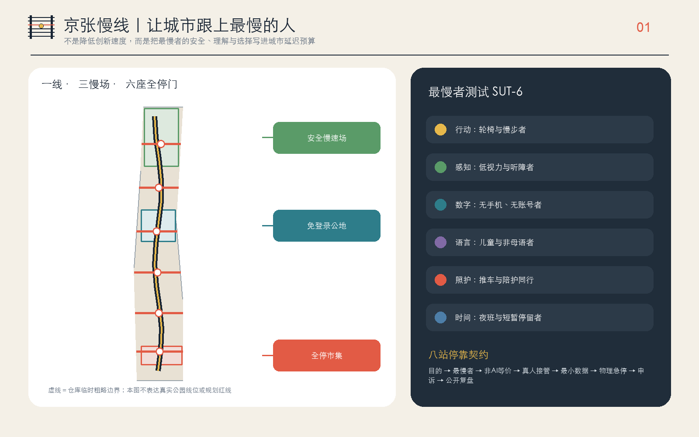
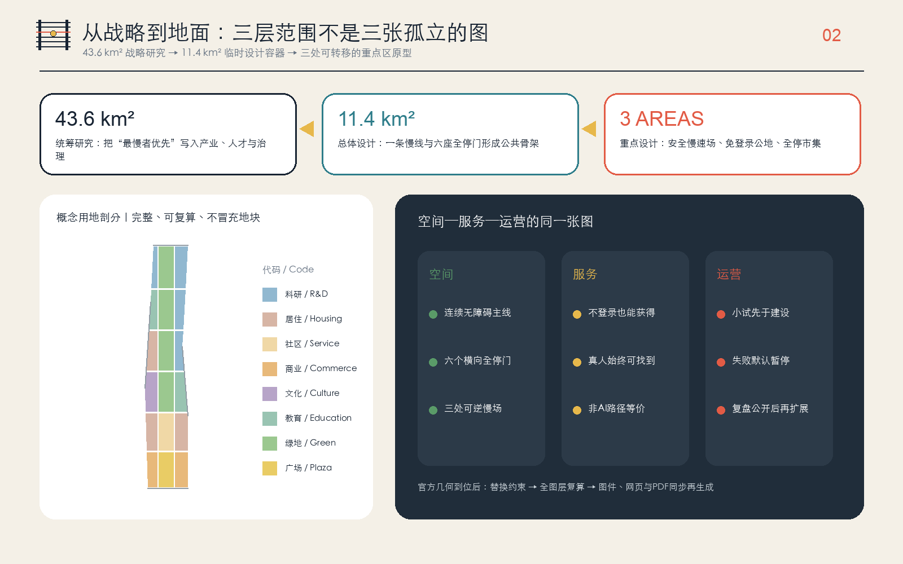
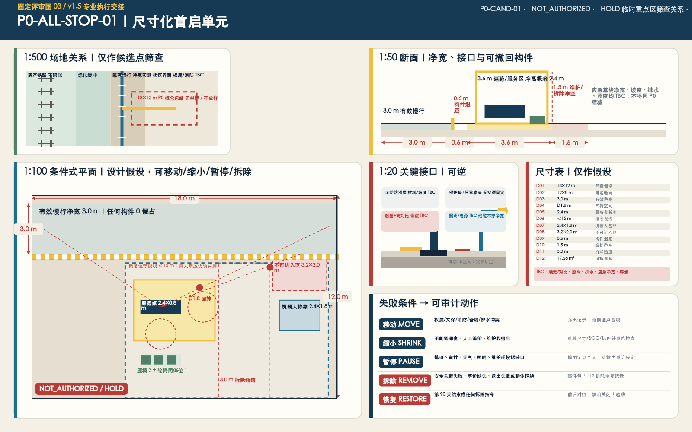
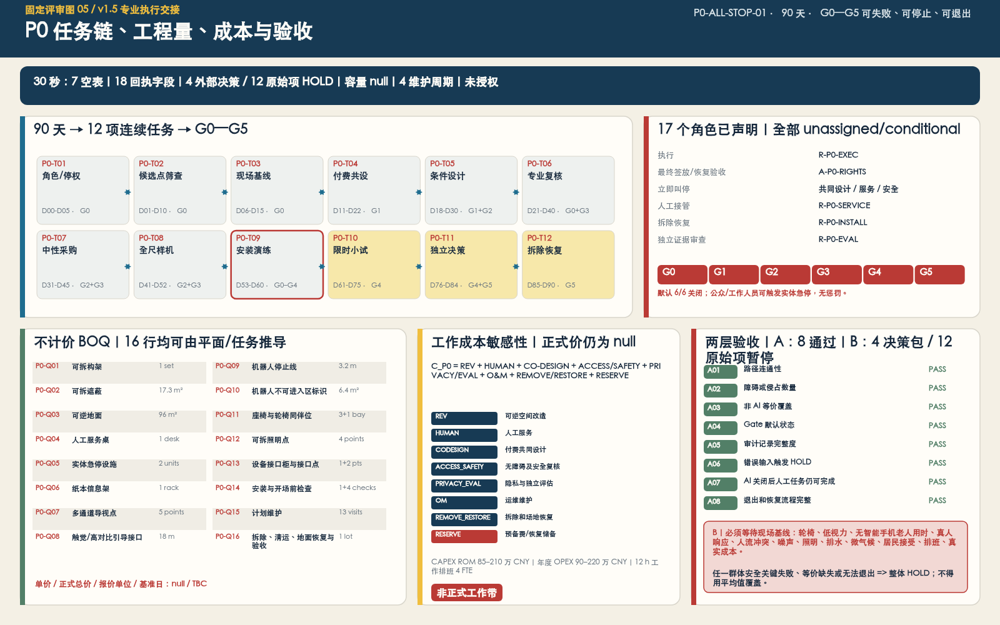
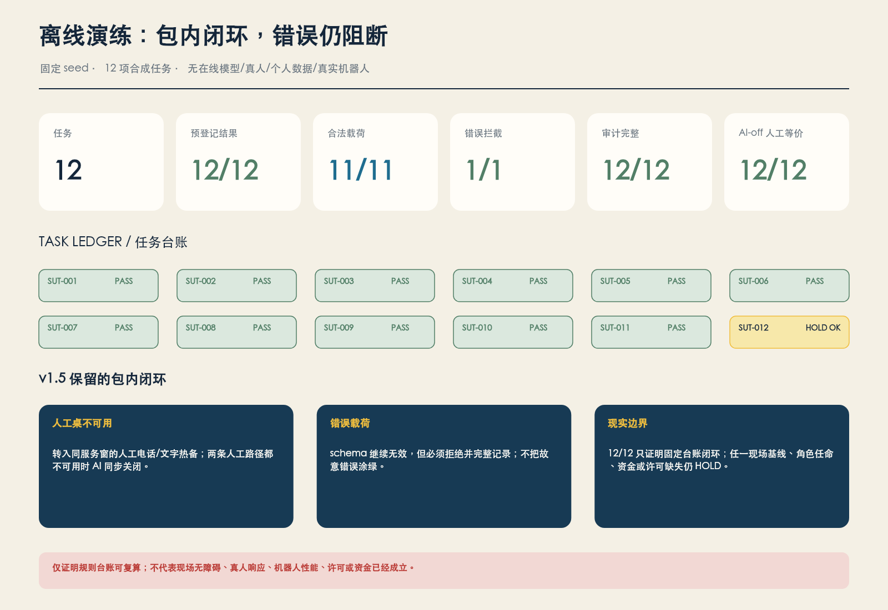
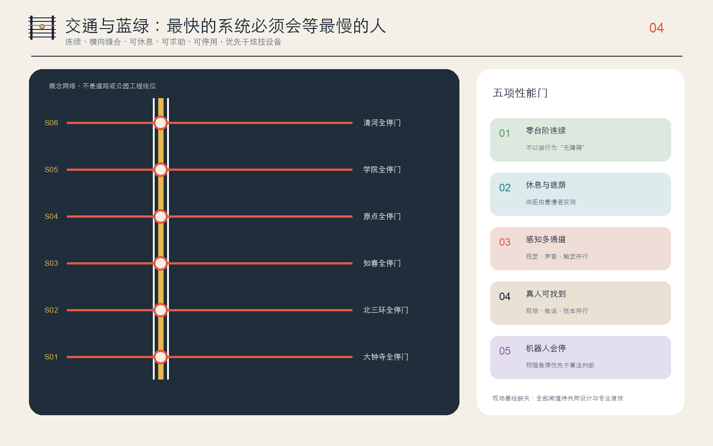

# 京张慢线 THE SLOW LINE：让城市跟上最慢的人

> **“慢”不是降低创新速度，而是把最慢者的安全、理解与选择写进城市的延迟预算。**
>
> 一项 AI 服务如果只能被跑得快、看得清、有智能手机、懂中文、白天有空的人使用，它还没有抵达城市。京张慢线提出一条简单的城市规则：**每一站都停**。任何机器人、智能终端或城市智能体进入公共空间前，都必须说明最难使用它的人是谁、没有 AI 时怎样得到等价服务、真人在哪里接管、谁有权让它停下。

本方案所有空间、项目、活动、政策与运营内容均为开放共创的**概念建议、参考方案或可供专业团队深化研究的材料**，不替代正式规划，不构成政府审定、投资、建设、招商、活动或审批承诺。仓库临时几何只作为生成和自检容器；官方资料到位后必须整包复算。

### 30 秒 P0 专业交接摘要

> **P0-ALL-STOP-01 · 专业执行交接单元 · `NOT_AUTHORIZED` · `HOLD`**
> 216 m² 概念筛查包络继续绑定 P0-CAND-01，但无坐标、不可放样。12 项任务、16 行 BOQ、17 个未指派角色和包内 8/8 PASS 均保持；12 项现场指标与 12 道外部门被无损聚合为 4 个外部决策包，当前 4/4 HOLD。新增 7 类双语执行空表、18 个证据回执字段、容量/疏散公式、4 个维护周期和恢复储备模板；真实记录、容量、签认、成本、资金与授权仍为 0/null/HOLD。

专业团队可从工作簿直接接手调查、责任接受、D0 基线、成本、专业复核、复演维护和变更控制；四个外部决策包继续全部 HOLD。 [metric:p0_execution_form_count] [metric:p0_external_decision_bundle_count] [metric:p0_external_decision_bundle_hold_count]

容量/疏散、维护和恢复储备均已有填写模板；工作簿自身不构成现场证据或放行。 [metric:p0_capacity_egress_template_count] [metric:p0_maintenance_cycle_count] [metric:p0_restoration_reserve_template_count]

## 设计依据与资料清单

方案以北京市规划和自然资源委员会海淀分局公开的资格预审公告为任务主控，以清权的智能体任务书为共创主控，并读取仓库内城市设计、控规编制与用地分类标准快照。公告确认三层工作范围、三处重点区与规划设计任务，但未提供可验证坐标系的官方红线、控规条件或现状普查，因此本方案把“任务依据”和“空间精度”严格分开：前者可以正式响应，后者只能临时复算。[source:OFFICIAL-ANNOUNCEMENT] [standard:PROJECT-OFFICIAL-ANNOUNCEMENT]

公开来源登记表用于区分正式依据、背景资料与临时资料；处理事实包只作为阅读导航，不创造更高权威。提交包另行登记《无障碍环境建设法》、国办发〔2020〕45号和《生成式人工智能服务管理暂行办法》三项参赛者自采官方公开材料：它们只支撑人工服务、投诉入口、数据最小化等制度判断，不支撑本项目用地、边界或工程控制。[source:SOURCE-REGISTRY] [source:ACCESSIBILITY-LAW-2023]

《无障碍环境建设法》的公开文本明确，涉及医疗健康、社会保障等事项的公共服务场所应保留现场指导、人工办理等传统服务；国办发〔2020〕45号要求传统服务方式与智能化服务创新并行。这不是给 AI 加一个“适老模式”，而是把非数字路径当作公共服务本体之一。[source:ELDERLY-SMART-TECH-2020] [source:GENERATIVE-AI-MEASURES-2023]

本方案还阅读了已合并方案目录与开放 Issues，避免重复“智脉、开源轨、可验证主线”等高度收敛的母题。Issue #846 报告仓库临时总体边界与 OSM 已测绘遗址公园段存在 412.5 米最近距离；该测量与 OSM 都不能替代官方边界，所以本方案**不据此改画红线**，而是把差异列为风险，拒绝把示意慢线描述成真实公园线位。[source:ISSUE-846-BOUNDARY-AUDIT] [source:BOUNDARY-SOURCE]

本次迭代进一步把“场地背景”从合成氛围中独立出来。2026 年 8 月获批的京张铁路遗址公园街区控规公开摘要确认了约 9 公里的南北公园创新带以及大钟寺、五道口等结构节点；2026 年 7 月北京市政府对开放段的报道则确认，学院南路—知春路属于社区活力段，保留老铁轨，慢行空间位于铁轨东侧，并可见声屏障、铁路路堤改造与社区城市界面。本方案因此选择**学院南路—知春路社区活力段**作为代表性区段，只用于校准方向、材料和日常使用背景，不把公开报道推演成精确工程线位。[source:OFFICIAL-JZR-CONTROL-PLAN-20260812] [source:OFFICIAL-JZR-PARK-20260730]

场地校准图明确分开三件事：A 栏的 OSM 快照只提供学院南路、北三环、知春路与遗址公园走向的方位关系，橙色框不是红线；B 栏把官方报道的文字事实转成不含实景复刻的工作骨架，只表达遗产铁路走廊、连续慢行空间、绿化缓冲与社区界面，不能被当作现状测绘；C 栏才是本方案新增的真人服务亭、实体急停和短距服务支路。机器人不得进入主慢行道，更不得跨越遗产铁轨。OSM 数据仅作开放地理背景，不能替代测绘、权属或规划审批。[source:OSM-CONTEXT-20260829] [source:OFFICIAL-JZR-PARK-20260730]

上图是**纯文本生成的代表性铁路遗产慢行走廊概念图**，没有输入照片、实景截图、同行图件或可识别真人，也不复刻任何具体相机视角。画面只解释设计关系：一对遗产铁轨与连续无障碍慢行道平行，短距服务支路与慢行道正交；机器人停在线后，不占用慢行道、不越轨；结构完整的自行车沿主慢行道通行。它不是现场照片、现状记录、官方效果图、精确选址、批准方案或工程证据；实际落位仍须测绘、权属、交通、文保与运营审批。

最后一张仍保留为**非定位操作原型图**：横向低速服务车道与纵向步行穿越严格正交，机器人停在停止线外；连续无障碍通行、结构完整的单辆自行车、真人服务亭、纸本/电话路径、骑手休息与雨庭用于解释可迁移的服务规则。它不再承担场地背景说明，也不参与边界、面积或工程判断。

成果权威顺序为 GeoJSON、metrics、三个矩阵、manifest/来源/假设/自检、正文、图件、HTML、PDF。正文负责让人读懂设计，结构化文件负责复算；投稿图面没有远程底图、企业商标或可识别人物肖像。场地校准图只使用署名的 OSM 派生方位线和官方报道的文字事实；主视觉从纯文本生成，不使用任何现场照片作为输入或参考。建筑与道路图层均为低置信度的概念包络和联系线，不代表测绘、权属、拆除或工程方案。[depth:existing_conditions_diagnosis] [data:geometry/site_boundary.geojson#SITE-001]

## 三层范围工作框架

**统筹研究范围约 43.6 平方公里**，回答产业、人才、治理与区域协同为什么需要“最慢者优先”；**总体设计范围约 11.4 平方公里**，回答一条公共慢线如何组织用地、更新、交通、市政、蓝绿与公共服务；**重点区域约 368.4 公顷**，回答安全慢速场、免登录公地和全停市集三种原型如何被专业团队接手。三个层次不是三张孤立图，而是一条决策链：战略层定义公共价值，总体层搭公共骨架，重点层用小试检验。[source:OFFICIAL-ANNOUNCEMENT] [depth:three_level_scope_framework]

提交的 `SITE_BOUNDARY` 是仓库维护者依据公告文字四至和约面积形成的临时粗略多边形，EPSG:4548 下复算约 11.41 平方公里；这个数只说明当前容器内部的算术一致，不表示官方范围比公告“更精确”。三处 `KEY_AREA` 同样只是按名称、南北顺序和约面积形成的临时包络，其几何复算合计约 369.29 公顷，与公告约值存在可见差异，正说明它们不能被用作地块或红线。[metric:site_area_sqm] [metric:key_area_total_sqm]

空间协议是“**一线、三慢场、六座全停门、两翼回路**”。一线是连续无障碍、可休息、可求助并保留非 AI 服务的公共主线；三慢场分别验证具身智能、公共服务与智能商业；六座全停门是东西向联系与公共停靠的概念类型；中关村科技服务翼负责标准、法务、人才与企业服务，小月河场景赋能翼负责日常需求、公众反馈与环境场景。图层把这套协议放进临时容器，只验证拓扑、比例与证据链，不声称真实落位。[data:geometry/roads.geojson#ROAD-SLOW-001] [depth:overall_spatial_structure]

官方 `SITE_BOUNDARY` 与 `KEY_AREA` 发布后，替换约束并依次重算用地、建筑、道路、绿地、公共空间、分期、全部指标、五张中英图件、双语网页与 A3/A0 PDF。若只换一张边界图而不重算派生成果，方案即失去一致性。控规、道路、建筑、权属、文保、市政、消防与防洪资料仍需分别补齐。[depth:risk_missing_data] [source:KEY-AREA-SOURCE]

## 统筹研究范围产业与未来城市研究

### 总体概念、命名与视觉识别

主名称为 **“京张慢线”**，英文名 **THE SLOW LINE**，国际传播语为 **Keep pace with the slowest person**。铁路曾以准点和速度连接地区；AI 时代的公共创新线还应以“是否等到最慢的人”衡量质量。命名系统把主线称为 Slow Line，把三个重点区称为 Yard，把横向公共节点称为 All-Stop Gate，把每个 AI 应用称为 Service，而不是用技术代号覆盖人的体验。[source:AGENT-TASKBOOK] [standard:PROJECT-AGENT-OPEN-CALL-TASKBOOK]

原创 Logo 方向由两条深色轨线、六根轨枕与一个黄色停靠圆点组成；第三根轨枕为红色，表示任何人都拥有停止权。主色为轨道深蓝、停靠黄、急停红、照护绿与公共水蓝。图形在本包内由基础几何绘制，不依赖商标或外部素材；正式字体、比例与应用规范仍应由视觉设计专业团队深化并重新清权。

### 三大定位、五大功能与三区两翼

| 任务书框架 | 慢线回答 | 可读空间/机制 |
| --- | --- | --- |
| 百年京张文化带 | 从“最快抵达”转译为“每站必停”的公共伦理 | 里程语法、人工信号亭、最慢一公里碑 |
| 都市 AI 生活体验带 | 不登录、不扫码、不被识别也能获得服务 | 免登录公地、真人窗口、纸本与电话路径 |
| AI 融合创新带 | 测试停止、解释、申诉和退出，不只展示性能 | 安全慢速场、八站停靠契约、公开复盘 |
| AI 全栈自主创新体系 | 把安全、无障碍与人工接管纳入研发栈 | 众智园受控测试与标准接口 |
| 世界级 AI 创新生态 | 研究、转化、生活、服务和纠错在同一城市回路 | 三慢场与两翼协同 |
| AI+ 场景赋能新范式 | 每个场景均有最慢者、非 AI 等价和停用门 | 十二张场景卡 |
| 智能化 AI 活力城市 | 智能退到后台，公共空间仍可独立运行 | 连续慢线与六座全停门 |
| AI 治理全球话语权 | 以可执行的“每站必停”协议输出治理方法 | 年度公开测试、申诉与版本记录 |

众智园方向承担“让机器会停”的技术与治理验证；AI 原点社区承担“让服务会等”的开源转化与共同设计；大钟寺方向承担“让商业不跳站”的城市体验。科技服务翼把标准、合规、资本与人才接入，场景赋能翼把居民、环境与日常问题接入；只有两侧都签署目的、替代路径和退出条件，场景才进入试点。[depth:overall_spatial_structure]

### 六个全球案例：只迁移机制，不搬运口号

| 案例 | 公开机制 | 对慢线的可迁移启示 |
| --- | --- | --- |
| 新加坡 one-north | 工作、研发、创业服务与日常配套形成园区生态 | 测试场不能脱离生活，慢速机器人要与日常使用同场验证 |
| 巴黎 STATION F | 历史大空间、共享创业服务与居住支持 | 共享服务大厅必须同时有人工、电话与无账号入口 |
| MIT Kendall Square | 校园、企业、公共空间与社区过程相互嵌合 | 校园成果进入街区前先经过公众可读的翻译界面 |
| 巴塞罗那 22@ | 生产空间、居住、遗产与知识经济混合更新 | 保留既有生产与生活，不把创新区做成单一办公园 |
| Montréal Mila | 研究、产业合作与负责任 AI 议题并置 | 技术合作同时绑定公共利益审查与模型使用边界 |
| Toronto Quayside | 项目退出成为智慧城市治理的负面镜鉴 | 社会许可、数据治理与退出权必须先于设备锁定 |

六例均来自机构或项目官方网站，只做定性机制比较，不将企业数量、投资额、产值或国外制度直接折算为海淀目标。[metric:global_case_study_count] [source:CASE-ONE-NORTH]

### 区域创新协同

本方案不虚构已经存在的合作，而提出五类“可签接口”：与北纬社区交换居民共同设计方法；与未来科学城交换长期基础研究验证问题；与怀柔科学城交换科学仪器、测量与标准方法；与北京经开区交换具身智能制造和安全测试问题；与张家口及京津冀伙伴讨论算力、能源与跨区域场景。每个接口只登记“输入、公共回报、数据边界、退出条件”，待相关主体确认后才可成为项目。

### 八站停靠契约

任何 AI 场景进入城市要依次停靠八站：**公共目的、最慢者画像、非 AI 等价、真人接管、最小必要数据、物理急停、申诉纠错、公开复盘**。少一站就不发车。这个契约把 AI 从“装了什么设备”转为“城市是否仍在人的控制下”，并为专业、运营和公众团队留下可以直接深化的验收结构。[source:GENERATIVE-AI-MEASURES-2023]

## 总体设计范围城市更新与控规深度城市设计

总体设计不从新增建筑量开始，而从“谁正在被城市跳过”开始。概念空间结构为：南北慢线提供连续公共底板，六座全停门提供东西横向联系，三个慢场集中高风险试验，两翼分别提供专业服务与日常反馈。用地完整剖分、建筑程序包络、慢行联系、绿地、公共空间和分期来自同一临时边界，因此可互相复核；但它们仍不是现状底图或法定方案。[data:geometry/land_use.geojson#LU-001] [depth:land_use_layout]

城市更新采用“**留用优先—低扰动适配—可逆增补—证据不足不拆**”的顺序。第一步开放既有可达空间和服务时段；第二步改善入口、卫生间、休息、照明、标识和人工窗口；第三步才讨论可拆卸设施或建筑适配。现状建筑、结构安全、产权、租约和居民意愿未普查前，不对任何建筑给出拆除、保留或层数结论。[depth:retain_renovate_demolish] [data:geometry/buildings.geojson#BLDG-001]

用地比例、概念建筑基底、绿地与公共空间只用于测试方案内部关系。容积率、总建筑面积、建筑高度、建筑密度法定值、退线与“四线”均待正式资料补齐；`metrics.json` 对这些指标使用待补状态而非估计数字。风貌引导只给原则：遗产界面克制、公共首层可进入、长界面设停靠与穿行、夜间信息不过载、设备可拆除且不压占无障碍通道。[standard:MOHURD-CONTROL-DETAILED-PLANNING] [depth:development_intensity_controls]

基础设施策略采用“先测服务、后算设备”：每个端侧算力或感知设备必须登记能源、散热、噪声、维护、停机和人工替代；不把摄像头数量当作智能水平，不设置人脸识别为通行前提。配电、通信、市政、防洪与消防容量均需专业测算，本方案不提供工程线位或容量结论。[depth:municipal_new_infrastructure]

概念绩效目标不是法定控制值，而是下一步共同设计要检验的问题：是否零台阶连续，休息与遮荫间距是否被最慢者实际走完，信息是否同时可看、可听、可触，真人是否在现场或电话中可找到，机器人能否被物理急停。任何一项失败，试点默认暂停，不用平均满意度掩盖最困难用户的失败。

## 重点区域详细设计

三处重点区均按“定位、空间结构、建筑更新、交通慢行、公共空间、AI 场景、实施风险”七项展开。下述范围全部沿用临时 `KEY_AREA`，只表达可迁移原型，不对应地块、业主或工程边界。[depth:three_key_area_detailed_design] [data:geometry/key_areas.geojson#PROV-KEY-001]

### 1. 众智园方向：安全慢速场 / Safe-Speed Yard

**定位**是具身智能进入公共空间前的“学会停下”场。**空间结构**建议由封闭测试环、混行观察段、人工接管台、设备救援点和面向公众的安全说明廊组成；概念环线仅在临时重点区内验证关系，不是道路方案。**建筑更新**优先适配既有研发或展示空间，新增只采用可逆包络。**交通慢行**以行人、轮椅和应急通道为不可让渡底板，机器人只获得限时、限域的次级通行权。[data:geometry/roads.geojson#ROAD-LOOP-01]

**公共空间**的“零步差月台”让开发团队、残障测试者与居民从同一平面观察停止距离、盲区、噪声和救援。**测试场景**包括机器人停止与避让、雨雪/遮挡、混行路口和物理急停救援。**实施风险**是五环与清河相关条件、国家平台时序、交通安全和水系资料均未取得；未经专业审批与付费共同设计，不得把测试写成获准运营。

### 2. AI 原点社区方向：免登录公地 / No-Login Commons

**定位**是近校型成果转化的公共翻译站：研究成果不是从实验室直接“发布”，而要先变成无账号也能理解和获得的服务。**空间结构**建议把人工窗口、无障碍共创室、纸本/电话入口、开源展示、安静等候和申诉台组织在同一首层公共界面。**建筑更新**以保留院落与低扰动适配为先；**交通慢行**关注校门、园区和站点之间的连续路径，但具体站城接口待轨道与道路资料确认。

**公共空间**的“人工信号亭”不是装饰：它必须在开放时段由真人值守，能够停用 AI、发起申诉、提供等价服务，并公开下一次回复时间。**AI 场景**包括免登录公共终端、医疗导航、教育共学、法律服务和多语导览。**实施风险**是高校与园区边界、运营主体、专业责任和服务资源不明；任何医疗、教育或法律输出都只能做导航与辅助，最终由相应专业人员判断。[source:ACCESSIBILITY-LAW-2023] [data:geometry/public_space.geojson#PUBLIC-LANDMARK-02]

### 3. 大钟寺方向：全停市集 / Every-Stop Market

**定位**是让智能商业证明自己没有跳过现金用户、非母语者、配送劳动者、小企业和慢行人群。**空间结构**建议由四类界面组成：有人服务的商业首层、电话/纸本可用的企业服务台、分时路缘与非机动车停靠、可安静休息的雨庭。**建筑更新**优先改造既有商业与办公界面；**交通慢行**把地铁站四象限连通和路缘冲突列为待专业深化任务，不给出桥隧或道路工程结论。

**公共空间**的“最慢一公里碑”记录被最慢者测试纠正的设计，也记录撤回、道歉和版本更新；荣誉不只奖励最快模型。**AI 场景**包括企业服务智能体无障碍红队、路缘分时协商、低速配送接力和活动安全事后复盘。**实施风险**包括文保、商业权属、交通组织和长期人工值守成本，必须在现场基线、利益相关者协商与审批后再判断。[data:geometry/public_space.geojson#PUBLIC-LANDMARK-03] [depth:height_massing_character]

## AI 创新生态、人才画像与 AI+ 场景

### 八类用户画像

| 画像 | 最容易被跳过的时刻 | 方案回应 |
| --- | --- | --- |
| 低视力开发者 | 终端只靠小字和颜色表达状态 | 语音、触觉、清晰焦点与人工说明并行 |
| 不使用智能手机的老人 | 扫码成为唯一入口 | 现场、电话、纸本、现金或证件路径 |
| 轮椅使用者 | “无障碍”路线需要长距离绕行 | 零台阶连续性按实际行程而非图标验收 |
| 带儿童或推车的照护者 | 换乘、等候和如厕缺少完整链条 | 休息、照护、卫生间与慢行一起测试 |
| 非中文母语研究者 | 复杂公共服务无法确认责任 | 简明双语、图形信息和真人复核 |
| 骑手与夜班运维者 | 只有白天活动与白领服务 | 夜间求助、饮水、充电、停靠与申诉 |
| 小微企业创始人 | 合规、算力与场景门槛不可读 | 有人企业服务与可解释的试点门禁 |
| 公共服务运营者 | AI 错误最终由一线人员兜底 | 排班、接管权限、事件记录和预算前置 |

八类画像不是替受影响群体发言，而是招募共同设计者的起始清单；阈值、优先级和是否接受试点由参与者共同决定。[metric:user_persona_count] [source:ELDERLY-SMART-TECH-2020]

### 十二张场景卡

| # | 场景与类型 | 概念位置 | 最小数据 | 公共价值 | 非 AI 等价 / 人工接管 / 退出 |
| --- | --- | --- | --- | --- | --- |
| T1 | 机器人停止与避让测试 | 安全慢速场 | 匿名事件与设备遥测 | 验证对行人、轮椅、儿童的让行 | 人工搬运；现场安全员；任一碰撞险情即停 |
| T2 | 混行路口最慢者测试 | 全停门样段 | 聚合通过时间，不采人脸 | 以最慢通过者检验信号与等待 | 人工指挥；交通专业接管；排队侵占即停 |
| T3 | 免登录终端审计 | 免登录公地 | 自愿任务结果，不存身份 | 检验无手机、低视力、多语使用 | 人工窗口；纸本/电话；无法完成即撤终端 |
| T4 | 企业智能体无障碍红队 | 全停市集 | 脱敏测试工单 | 降低小企业使用门槛与错误风险 | 人工顾问；原流程可用；高风险错误即下线 |
| S5 | AI 医疗服务导航 | 免登录公地 | 用户自愿提供的最少问题 | 找科室、找入口、找人工帮助 | 导医/热线；不诊断；危险症状直接转人工 |
| S6 | AI 教育共学 | 原点共创室 | 本地会话或匿名学习偏好 | 辅助理解、翻译与资源导航 | 教师/志愿者；纸本材料；不替代评价录取 |
| S7 | AI 法律服务导航 | 人工信号亭 | 不保存案情的初筛问题 | 找到公开规则和正式服务渠道 | 法律服务人员；不出具法律意见；争议即转介 |
| S8 | 多语文化导览 | 慢线公共节点 | 无需身份与轨迹 | 串联京张、中关村与 AI 新文化 | 纸本导览/志愿者；史实人工校审；错译下架 |
| S9 | 最慢路线规划 | 六座全停门 | 公开设施状态与用户自选偏好 | 选择少台阶、可休息、有人帮助的路线 | 静态地图/电话；不强制定位；断点即标红 |
| S10 | 低速配送接力 | 安全慢速场至服务点 | 订单最小字段与设备状态 | 为行动不便者提供可选配送 | 人工配送；物理急停；不得挤占步行空间 |
| S11 | 路缘分时协商 | 全停市集 | 聚合时段需求 | 协调骑手、出租、装卸、无障碍上下客 | 现场管理员；固定无障碍位不参与竞价 |
| S12 | 活动安全事后复盘 | 三慢场与全停门 | 事件记录，不做实时布控 | 公开拥挤、投诉、接管与改进 | 人工运营复盘；不做人脸追踪；争议保留异议 |

前四张为产业测试验证场景，其余八张为公共服务和日常运营场景；十二张全部写明非 AI 等价路径，覆盖率为 100%。这只证明文本协议完整，不证明现场已经具备人员、预算或技术条件。[metric:ai_test_scenario_count] [metric:non_ai_fallback_coverage_ratio]

“场景—空间—运营”映射遵循一条硬规则：空间节点提供停止、等候、人工帮助和清晰边界；服务卡提供目的、数据和替代路径；运营方提供排班、预算、申诉和退出。三者缺一，场景不得上线。医疗、教育、法律、安全等专业领域必须由相应人员作最终判断，AI 不得成为唯一入口。

### 90 天首启样板：先证明一座全停门会停

本轮不再把十二张场景卡都写成“下一步可试”，而选择一个**非定位、可撤回的全停门样板**作为最小交接单元。它只承接 S9 最慢路线规划与人工服务导航，不先承接诊断、审批、实时布控或开放道路机器人运行。现实授权状态仍为 `NOT_AUTHORIZED`；位置、运营者、共同设计者和专业复核者均未指定，任何设备采购与公众试用都必须等待现场基线、权属许可和责任签署。[metric:pilot_gate_count]

| 研究窗 | 只做什么 | 必须留下的证据 | 立即 HOLD 的条件 |
| --- | --- | --- | --- |
| 第 0—30 天：基线与共同设计 | 四方现场走查、同任务无 AI 路径、人工开放时段、零台阶/遮荫/休息与投诉基线 | 路径发布图、障碍清单、付费共同设计记录、异议台账 | 权属或消防不清；无法提供人工等价；受影响群体拒绝 |
| 第 31—60 天：闭环与离线演练 | 在不接入真实个人数据和公共道路的条件下，演练停止、转人工、拒绝高风险请求、服务关闭与审计缺口 | 急停演练、班次草案、数据清单、十二项合成任务台账、失败复盘 | 任何失败被平均值掩盖；缺审计；关闭人工路径时 AI 仍开放 |
| 第 61—90 天：限时小试 | 只有前两门通过后，才讨论一个时段、一个入口、一个低风险任务的限时试用 | 逐组同任务结果、人工响应时间、投诉与删除记录、恢复前后对照 | 任一安全关键失败；任一组无法完成同一任务；退出后不能恢复原服务 |

六道证据门依次为 **G0 权属与法定许可、G1 无障碍共同设计、G2 人工等价与排班、G3 隐私/安全/专业责任、G4 限时运行与独立观察、G5 恢复与公开复盘**。六门默认关闭，且不能用总分互相抵消。最小责任组合为场地权利方、无障碍共同设计方、服务运营方、安全/隐私专业方与独立复核方；当前全部为 `unassigned`。人员与成本不填虚构金额，而交付计算式：`所需人工量 = 已确认开放工时 ÷ 经运营方确认的每 FTE 可服务工时`；`ROM 成本 = 可逆空间改造 + 人工服务 + 付费共同设计 + 安全/隐私复核 + 退出恢复 + 专业造价团队确认的预备费`。

### v1.5 P0-ALL-STOP-01：专业执行交接

稳定对象 ID 为 `P0-ALL-STOP-01`。v1.5 保留 v1.4 的尺寸、任务、数量、排班、成本敏感性和 fail-closed 控制，并将专业团队接手所需的调查、责任接受、D0 基线、成本、专业复核、复演维护和变更控制整理为 7 类可填写双语表单。对象仍只绑定 `P0-CAND-01` 概念筛查关系，无坐标、地块、权属、许可或放样权限；17 个角色仍未指派，正式价格与资金仍为 `null/TBC`。

#### 尺寸登记：每一个数都带依据和确认触发

| ID | 对象 | 数值/推导 | 设计假设边界 | 确认角色 / 触发 |
| --- | --- | --- | --- | --- |
| P0-D01 | 概念筛查包络 | 18.0 m x 12.0 m [metric:p0_screening_envelope_area_sqm] | 用于比较既有路径、服务区与拆除通道是否能同时容纳的设计假设；不是地块面积或现场实测。 | `A-P0-RIGHTS + R-P0-SURVEY` / candidate site nominated and rights holder permits baseline survey |
| P0-D02 | 可逆地面范围 | 12.0 m x 8.0 m service apron within the screening envelope [metric:p0_reversible_ground_area_sqm] | 用于不破坏原地面的可拆铺装、标线和服务构件布置；现场材料相容性与排水仍为 TBC。 | `R-P0-ACCESS + R-P0-DRAINAGE + A-P0-RIGHTS` / surface, level and drainage baseline complete |
| P0-D03 | 有效慢行净宽 | continuous 18.0 m x 3.0 m unobstructed strip [metric:p0_clear_route_width_m] | 为轮椅、陪同行人与低速会车留出保守操作余量的设计假设；不声称等于法定最小值，须由无障碍、交通和消防角色按现场标准复核。 | `R-P0-ACCESS + R-P0-TRAFFIC + R-P0-FIRE` / measured cross-section and applicable public standards confirmed |
| P0-D04 | 轮椅回转空间 | one clear circle at the service decision point and one at the staffed desk [metric:p0_wheelchair_turn_diameter_m] | 用于概念平面避免以最小设备尺寸挤压回转的设计假设；最终形状与数值由付费共同设计和无障碍专业复核。 | `R-P0-CODESIGN + R-P0-ACCESS` / co-design mock-up and measured route test |
| P0-D05 | 人工服务桌 | 2.4 m x 0.8 m demountable module; accessible approach and counter height TBC [metric:p0_staffed_desk_length_m] | 长度用于容纳纸本、人工办理和急停控制的分区；台面高度、膝部净空和设备型号不得在无障碍复核前冻结。 | `R-P0-CODESIGN + R-P0-SERVICE + R-P0-ACCESS` / paid mock-up acceptance |
| P0-D06 | 值守视线 | unobstructed concept sight triangle from desk to both route entries and robot stop line [metric:p0_staffed_sightline_m] | 用于平面筛查的最大观察距离假设，不是人员响应承诺；遮挡、夜间和真实响应时间必须现场测试。 | `R-P0-SERVICE + R-P0-SAFETY` / day/night sightline walk-through |
| P0-D07 | 机器人停靠包络 | 2.4 m x 1.8 m marked bay [metric:p0_robot_bay_area_sqm] | 仅用于最坏包络筛查，不对应具体设备；设备外廓、制动、救援和充电条件均为 TBC。 | `R-P0-SAFETY + R-P0-EQUIPMENT` / specific equipment and controlled test protocol proposed |
| P0-D08 | 机器人不可进入区 | 3.2 m x 2.0 m buffer between 3.2 m stop line and slow route [metric:p0_robot_no_entry_area_sqm] | 在算法判断之外提供可见物理边界的设计假设；最终停止距离由受控测试和安全专业方确认，只能增大不能在未复核时缩小。 | `R-P0-SAFETY + R-P0-EQUIPMENT` / braking and rescue test passed in a contained site |
| P0-D09 | 构件至有效路径退距 | minimum concept furniture/equipment/sign setback outside the 3.0 m clear strip [metric:p0_component_setback_m] | 避免设备、座椅和标识侵入净宽的筛查值；触觉/高对比边界属于路径接口，不按普通家具处理，做法为 TBC。 | `R-P0-ACCESS + R-P0-MAINTENANCE` / full-size tape-out and maintenance walk-through |
| P0-D10 | 维护/拆除作业净空 | clear working band around demountable frame and equipment cabinet [metric:p0_maintenance_clearance_m] | 供人工检查、搬运和无损拆除的概念余量；不能占用慢行净宽或既有应急路径。 | `R-P0-INSTALL + R-P0-MAINTENANCE + R-P0-FIRE` / installation and removal method statement reviewed |
| P0-D11 | 拆除进出通道 | one 3.0 m clear concept route to the screening-envelope edge [metric:p0_removal_access_width_m] | 按最大可拆模块的人工/小型搬运筛查，不授权车辆进入；实际应急和搬运净宽由现场管理、消防与安装方确认。 | `R-P0-INSTALL + R-P0-FIRE + A-P0-RIGHTS` / logistics and emergency plan accepted |
| P0-D12 | 可拆遮蔽 | 4.8 m x 3.6 m weighted-base canopy; 2.4 m concept clear height [metric:p0_canopy_area_sqm] | 只用于平面、断面和工程量计算；风、雪、结构、净高、文保、消防和基础承载均为 TBC，未签放不得安装。 | `R-P0-STRUCTURE + R-P0-FIRE + A-P0-RIGHTS` / site-specific structural and fire review |

六类现场接口继续为 TBC：触觉做法、高对比与夜间可读性、照度/眩光/电力容量、坡度/排水/出水口、应急净宽与消防控制、设备电力/数据/充电与线缆保护。任何线缆不得穿越有效路径；既有应急净宽不得因 P0 缩减；没有文保/管线/结构许可时不做穿透式固定。 [metric:p0_tbc_interface_count]

#### 权力与责任：执行、签放、叫停、接管、拆除与验收分开

- `R-P0-EXEC` — P0 实施协调人: `unassigned/conditional`; coordinates tasks and evidence; cannot self-authorize opening
- `A-P0-RIGHTS` — 场地权利方/委托责任槽位: `unassigned/conditional`; accountable for final release, removal instruction, ground-restoration acceptance, and records retention; release depends on all required professional evidence
- `R-P0-CODESIGN` — 付费无障碍共同设计牵头人: `unassigned/conditional`; may place the work on immediate HOLD for exclusion, inaccessible equivalence, or safeguarding failure
- `R-P0-SERVICE` — 人工服务与接管运营角色: `unassigned/conditional`; executes staffed equivalent service, immediate takeover, opening/closing parity, and may stop operation
- `R-P0-SAFETY` — 当班安全/隐私专业角色: `unassigned/conditional`; independent immediate stop authority; controls incident scene and evidence preservation
- `R-P0-INSTALL` — 可拆构件安装与恢复角色: `unassigned/conditional`; installs, maintains, dismantles, removes waste, restores the surface, and submits as-left records
- `R-P0-EVAL` — 独立无障碍/运行评估角色: `unassigned/conditional`; observes without operating the pilot; signs evidence completeness, not government or engineering approval
- `R-P0-SURVEY` — 测绘与基线记录专业角色: `unassigned/conditional`; records levels, obstacles, condition, utilities and reinstatement reference only after authorization
- `R-P0-ACCESS` — 无障碍专业复核角色: `unassigned/conditional`; reviews route, turning, tactile, contrast, counter and same-task equivalence; may require redesign or HOLD
- `R-P0-TRAFFIC` — 交通与慢行接口复核角色: `unassigned/conditional`; reviews pedestrian, cycle, curb, logistics and conflict conditions without authorizing road use
- `R-P0-FIRE` — 消防与应急通道复核角色: `unassigned/conditional`; may stop any proposal that reduces an existing emergency route or lacks an accepted emergency method
- `R-P0-STRUCTURE` — 结构与临时构件复核角色: `unassigned/conditional`; reviews wind, snow, bearing, fixing, clearance and dismantling before any assembly release
- `R-P0-ELECTRICAL` — 电气、照明与隔离复核角色: `unassigned/conditional`; reviews capacity, cable protection, isolation, lighting and safe shutdown
- `R-P0-DRAINAGE` — 地面、标高与排水复核角色: `unassigned/conditional`; reviews levels, ponding, outfall, wet-weather access and restoration baseline
- `R-P0-EQUIPMENT` — 设备停止、救援与接口角色: `unassigned/conditional`; defines contained stop, braking, rescue, charging and isolation evidence for any nominated equipment
- `R-P0-LIGHTING` — 照明与视觉可读性复核角色: `unassigned/conditional`; reviews task lighting, glare, contrast and day/night readability with affected users
- `R-P0-MAINTENANCE` — 维护、备件与恢复角色: `unassigned/conditional`; owns inspection windows, spares, defect closure and maintenance-to-removal escalation

最终签放槽位是场地权利方/委托责任槽位，但不得绕过无障碍、消防、结构、电气、隐私、安全与独立证据记录。付费共同设计牵头、人工服务运营、当班安全/隐私角色拥有平行立即叫停权；任何使用者或工作人员都可无惩罚触发实体急停。人工接管由人工服务运营角色执行；安装恢复角色负责拆除、清运和地面恢复；场地责任槽位对恢复验收负责，独立评估角色只签证据完整性，不冒充政府或工程批准。

#### 90 天交付任务链

| task_id | 窗口 | 责任角色 | Accountable | 输入/输出摘要 | Gate | HOLD | 恢复或退出证据 |
| --- | --- | --- | --- | --- | --- | --- | --- |
| P0-T01 | D00-D05 | `R-P0-EXEC` | `A-P0-RIGHTS` | 角色与停权登记 | G0 | no accountable rights holder; stop authority refused; human-takeover role absent | dated role acceptance or written no-go; versioned responsibility register |
| P0-T02 | D01-D10 | `R-P0-EXEC + R-P0-SURVEY` | `A-P0-RIGHTS` | 候选点筛查 | G0 | heritage rail crossed; existing slow route or emergency route narrowed; rights or utilities unknown | screen-out record with reason; alternative candidate trigger |
| P0-T03 | D06-D15 | `R-P0-SURVEY` | `A-P0-RIGHTS` | 现场基线 | G0 | baseline cannot be audited; unsafe access; official constraint conflicts | sealed baseline dataset by appointed professional; written site rejection |
| P0-T04 | D11-D22 | `R-P0-CODESIGN` | `A-P0-RIGHTS` | 付费共同设计 | G1 | unpaid or token participation; affected group rejects pilot; accessible equivalent cannot be defined | recruitment correction; participant-approved no-go or revised brief |
| P0-T05 | D18-D30 | `R-P0-EXEC + R-P0-SERVICE` | `A-P0-RIGHTS` | 条件设计与 BOQ | G1+G2 | clear route intersects any object; desk cannot see route entries and stop line; AI can open while human service is closed | revised clash-free package; recorded withdrawal if equivalence cannot be staffed |
| P0-T06 | D21-D40 | `R-P0-SAFETY` | `A-P0-RIGHTS` | 许可/专业复核 | G0+G3 | any required approval missing; ground penetration proposed without clearance; personal-data purpose or retention unresolved | closed review comments; formal no-go and protected records |
| P0-T07 | D31-D45 | `R-P0-EXEC + R-P0-INSTALL` | `A-P0-RIGHTS` | 中性采购与方法书 | G2+G3 | single-source lock-in without exit; removal/restoration omitted; unit rates or funds unverified | reissued neutral schedule; procurement cancellation record |
| P0-T08 | D41-D52 | `R-P0-INSTALL + R-P0-SERVICE` | `A-P0-RIGHTS` | 全尺样机与急停 | G2+G3 | turning/approach fails; physical stop fails; defect lacks owner or closure evidence | closed defect record; scrap/rework trace |
| P0-T09 | D53-D60 | `R-P0-INSTALL + R-P0-SAFETY` | `A-P0-RIGHTS` | 安装及 AI-off 演练 | G0+G1+G2+G3+G4 | route obstruction > 0; audit completeness < 100%; AI-off equivalent < 100%; malformed input does not HOLD | corrected rehearsal ledger; closed/opening refused record; removal instruction if correction fails |
| P0-T10 | D61-D75 | `R-P0-SERVICE + R-P0-SAFETY` | `A-P0-RIGHTS` | 限时小试 | G4 | any safety-critical failure; equivalent service unavailable; any group cannot exit; roster gap | incident package; human-takeover record; restart or permanent-stop decision |
| P0-T11 | D76-D84 | `R-P0-EVAL` | `A-P0-RIGHTS` | 独立评估与决策 | G4+G5 | missing record; averages mask a failed group; reviewer not independent | qualified/failed evaluation with unresolved items visible; accountable decision trail |
| P0-T12 | D85-D90 | `R-P0-INSTALL` | `A-P0-RIGHTS` | 拆除、恢复、验收 | G5 | surface not restored; waste/asset destination unknown; baseline comparison or acceptance missing | before/after comparison; remediation invoice/record with rates redacted or TBC as applicable; signed acceptance by accountable role and independent evidence reviewer |

任务链共 12 项，保持 D00—D90 研究窗与 G0—G5 六道证据门。v1.4 复演后，审计完整度与 AI-off 人工等价均达到 12/12，错误输入仍为 1/1 触发已审计 HOLD；这只关闭包内缺口，不会自动打开 G4，现实外部门仍全部关闭。 [metric:p0_task_chain_count] [metric:p0_gate_default_closed_ratio] [metric:p0_route_obstruction_count]

错误输入测试必须保持 1/1 触发 HOLD；失败时不能用其他任务的平均结果覆盖。 [metric:p0_malformed_input_hold_ratio]

#### 不计价工程量清单

| boq_id | 项目 | 数量 | 推导 | 计价状态 |
| --- | --- | --- | --- | --- |
| P0-Q01 | 可拆构架 | 1 set | 6 weighted-base posts + 16.8 m perimeter beams | `null/TBC` |
| P0-Q02 | 可拆遮蔽 | 17.28 sqm | 4.8 m x 3.6 m | `null/TBC` |
| P0-Q03 | 可逆地面 | 96 sqm | 12.0 m x 8.0 m service apron | `null/TBC` |
| P0-Q04 | 人工服务桌 | 1 module | 2.4 m x 0.8 m demountable desk | `null/TBC` |
| P0-Q05 | 实体急停设施 | 2 unit | 1 public-facing + 1 staff-side; final specification TBC | `null/TBC` |
| P0-Q06 | 纸本信息架 | 1 unit | adjacent to staffed desk and outside clear route | `null/TBC` |
| P0-Q07 | 多通道导视点 | 5 point | 2 entries + 1 staffed desk + 1 robot stop + 1 exit/restoration notice | `null/TBC` |
| P0-Q08 | 触觉/高对比引导接口 | 18 linear_m | one continuous route-edge interface; detailed pattern TBC | `null/TBC` |
| P0-Q09 | 机器人停止线 | 3.2 linear_m | full service-spur width | `null/TBC` |
| P0-Q10 | 机器人不可进入区标识 | 6.4 sqm | 3.2 m x 2.0 m | `null/TBC` |
| P0-Q11 | 座椅与轮椅同伴位 | 3 seat_plus_1_bay | 3 movable seats and 1 unoccupied companion bay under/near shelter | `null/TBC` |
| P0-Q12 | 可拆照明点 | 4 point | plan-count only; illuminance, glare and power TBC | `null/TBC` |
| P0-Q13 | 设备接口柜与接口点 | 1 cabinet_plus_2_points | 1 lockable cabinet + 2 protected power/data points; capacities TBC | `null/TBC` |
| P0-Q14 | 安装与开场前检查 | 1 lot_plus_4_inspections | install lot + accessibility/safety/electrical/operations checks | `null/TBC` |
| P0-Q15 | 计划维护 | 13 weekly_visit | ceil(90 days / 7); daily pre-open checks depend on authorized open days | `null/TBC` |
| P0-Q16 | 拆除、清运、地面恢复与验收 | 1 lot | remove all P0 objects + before/after condition comparison + acceptance | `null/TBC` |

BOQ 共 16 行，并归入 6 个不计价采购包。数量可由图纸或任务复算；市场单价、供应商报价、正式估算、招标价与资金承诺仍为 0/null。v1.4 只增加带基准日的参与者 CAPEX/OPEX 工作区间，用于比较排班与备选方案。 [metric:p0_boq_line_count] [metric:p0_market_rate_known_count]

#### 参数化成本模型：公式完整，价格不造

`C_P0 = C_REV + C_HUMAN + C_CODESIGN + C_ACCESS_SAFETY + C_PRIVACY_EVAL + C_OM + C_REMOVE_RESTORE + C_RESERVE`

- `C_REV` 可逆空间改造: `sum(BOQ quantity_i x verified unit_rate_i) + installation labour`; value = `null`.
- `C_HUMAN` 人工服务: `H_open x r_staff + H_training x r_staff + H_supervision x r_supervisor`; value = `null`.
- `C_CODESIGN` 付费共同设计: `N_participants x H_participant x r_participant + access_support + travel + care`; value = `null`.
- `C_ACCESS_SAFETY` 无障碍及安全复核: `H_access x r_access + H_safety x r_safety + H_fire x r_fire + H_structure x r_structure`; value = `null`.
- `C_PRIVACY_EVAL` 隐私与独立评估: `H_privacy x r_privacy + H_independent x r_evaluator`; value = `null`.
- `C_OM` 运维维护: `W x visits_per_week x H_visit x r_maint + consumables + utilities + incident_allowance`; value = `null`.
- `C_REMOVE_RESTORE` 拆除和场地恢复: `H_remove x r_remove + A_remediation x r_remediation + waste_trace + acceptance`; value = `null`.
- `C_RESERVE` 预备费/恢复储备: `max(verified C_REMOVE_RESTORE, p_contingency x subtotal); p_contingency TBC by cost/risk professionals`; value = `null`.

人员公式为 `FTE_required = annual staffed hours / 1680 productive hours x 1.2 leave-training factor`. v1.4 以 1680 小时/FTE·年和 1.2 请假培训系数比较 8/12/18 小时服务窗；12 小时情景计算为 3.129 FTE，向上取整为 4 FTE，模型未覆盖时长为 0。工作区间并非运营承诺或正式造价；具名运营者、报价、资金、税费与恢复储备签放仍待外部证据。 [metric:p0_cost_component_count] [metric:p0_market_price_total] [metric:p0_staffing_fte]

正式总价保持 null，不能由概念数量反推成报价或资金承诺。 [metric:p0_formal_total_cost]

#### 两层验收 A：当前包内即可判断

| metric_id | 指标 | 公式 | 数据源 | 阈值状态 | 责任 | 当前状态 | 触发 |
| --- | --- | --- | --- | --- | --- | --- | --- |
| P0-A01 | 路径连通性 | connected entry-to-exit route pairs / 1 required pair | 1:100 concept graph in key-areas figure + v13 source | SET: 1/1 and zero disconnected segment | `R-P0-EXEC` | **PASS_IN_PACKAGE_NOT_FIELD** | any plan revision |
| P0-A02 | 障碍或侵占数量 | count(BOQ objects intersecting the 18.0 m x 3.0 m clear route) | 1:100 plan object boxes | SET: 0 | `R-P0-ACCESS` | **PASS_IN_PACKAGE=0** | object, setback, or route-width change |
| P0-A03 | 非 AI 等价覆盖 | scenario cards with a stated non-AI equivalent / 12 scenario cards | proposal scenario table | SET: 12/12 | `R-P0-SERVICE` | **PASS_TEXT_PROTOCOL=12/12** | scenario or service change |
| P0-A04 | Gate 默认状态 | gates default closed / 6 gates | task chain and gate register | SET: 6/6 closed before evidence | `R-P0-EXEC` | **PASS_IN_PACKAGE=6/6** | gate logic change |
| P0-A05 | 审计记录完整度 | synthetic tasks with complete audit record / 12 tasks | simulation.json | SET: 12/12 before G4 | `R-P0-SAFETY` | **PASS_SYNTHETIC=12/12** | simulation schema, audit fields, or task set changes |
| P0-A06 | 错误输入触发 HOLD | malformed-input tests resulting in HOLD / malformed-input tests | simulation.json malformed dispatch case | SET: 1/1 | `R-P0-SAFETY` | **PASS_SYNTHETIC=1/1** | schema or dispatch change |
| P0-A07 | AI 关闭后人工任务仍可完成 | AI-off same-task cases completed through staffed/paper/phone/fixed spatial paths / 12 tasks | simulation.json + visual/assets/v14-delivery-control.json | SET: 12/12 before G4 | `R-P0-SERVICE` | **PASS_SYNTHETIC=12/12** | service window, hot-backup rule, or task set changes |
| P0-A08 | 退出和恢复流程完整 | specified evidence slots / 6 required slots | P0-T12 | SET: 6/6 specified; execution remains field HOLD | `R-P0-INSTALL` | **PASS_PROCESS_SPECIFIED=6/6** | removal method or acceptance role change |

A 层 8 项当前为 8 PASS / 0 HOLD。缺失审计记录已改为错误载荷拒绝后的完整审计 HOLD；人工桌不可用已改为人工电话/文字热备，同一任务仍以 AI-off 方式完成。真实执行和现场效果仍属于 B 层。 [metric:p0_current_package_pass_count] [metric:p0_current_package_hold_count] [metric:p0_exit_evidence_slot_count]

#### 两层验收 B：必须等待现场基线

| metric_id | 指标 | 公式 | 数据源 | 阈值状态 | 责任 | 当前状态 | 触发 |
| --- | --- | --- | --- | --- | --- | --- | --- |
| P0-B01 | 轮椅使用者实际完成 | successful same-task completions / valid attempts, reported with critical failures | authorized field task log | TBC_PAID_CODESIGN_PREREGISTRATION; zero safety-critical failures | `R-P0-CODESIGN + R-P0-EVAL` | **HOLD_NO_FIELD_BASELINE** | G0-G3 pass and group approves protocol |
| P0-B02 | 低视力/盲人实际完成 | successful same-task completions / valid attempts, reported with critical failures | authorized field task log | TBC_PAID_CODESIGN_PREREGISTRATION; zero safety-critical failures | `R-P0-CODESIGN + R-P0-EVAL` | **HOLD_NO_FIELD_BASELINE** | G0-G3 pass and tactile/audio/contrast interfaces confirmed |
| P0-B03 | 无智能手机老人取得人工服务时间 | P90(time from envelope entry to confirmed human assistance) | timestamped authorized field task log | TBC_PAID_CODESIGN_PREREGISTRATION | `R-P0-SERVICE + R-P0-EVAL` | **HOLD_NO_FIELD_BASELINE** | staff roster and opening hours confirmed |
| P0-B04 | 真人响应时间 | P90(time from help request to two-way human response), disaggregated by period | staffed-service log | TBC_OPERATOR_AND_CODESIGN_PREREGISTRATION | `R-P0-SERVICE` | **HOLD_NO_FIELD_BASELINE** | named operator accepts roster |
| P0-B05 | 人流冲突 | observed conflicts / valid traversals, with every safety-critical event separately reported | independent manual observation | TBC_TRAFFIC_REVIEW; zero safety-critical conflicts | `R-P0-EVAL + R-P0-SAFETY` | **HOLD_NO_FIELD_BASELINE** | authorized observation plan |
| P0-B06 | 噪声 | baseline and operating sound levels by agreed period/location | professional site measurement | TBC_ACOUSTIC_BASELINE_AND_APPLICABLE_STANDARD | `R-P0-SAFETY` | **HOLD_NO_FIELD_BASELINE** | day/night baseline permission |
| P0-B07 | 照明与眩光 | measured task/route illuminance plus glare/contrast review at agreed points | professional night measurement + co-design walk-through | TBC_LIGHTING_AND_ACCESSIBILITY_REVIEW | `R-P0-LIGHTING + R-P0-CODESIGN` | **HOLD_NO_FIELD_BASELINE** | night access and fixture schedule confirmed |
| P0-B08 | 排水 | count of ponding/blockage events plus before/after surface-level and outlet check | level survey, rainfall observation, maintenance log | TBC_DRAINAGE_BASELINE; zero blocked accessible route | `R-P0-DRAINAGE + R-P0-MAINTENANCE` | **HOLD_NO_FIELD_BASELINE** | survey and wet-weather observation available |
| P0-B09 | 微气候 | shade availability and agreed thermal/wind observations by operating period | site baseline + field observation | TBC_CODESIGN_AND_ENVIRONMENTAL_REVIEW | `R-P0-EVAL` | **HOLD_NO_FIELD_BASELINE** | season/period and method preregistered |
| P0-B10 | 居民接受度 | reported response distribution by affected group; dissent remains visible | authorized, consented engagement record | TBC_STAKEHOLDER_PREREGISTRATION; no average may override critical group rejection | `R-P0-CODESIGN + R-P0-EVAL` | **HOLD_NO_FIELD_BASELINE** | affected parties and consent protocol confirmed |
| P0-B11 | 运营排班覆盖 | staffed equivalent hours delivered / authorized digital-service hours | signed roster and attendance log | SET: 100% opening parity | `R-P0-SERVICE` | **HOLD_NO_OPERATOR** | named operator and funded roster |
| P0-B12 | 真实成本完整度 | cost components with verified quantity, unit rate, source, basis date, and payer / 8 components | authorized cost plan, quotations, payroll/fees, maintenance and restoration records | SET: 8/8 evidence fields complete before cost claim; market values remain TBC | `A-P0-RIGHTS + appointed cost professional` | **HOLD_NULL_RATES_AND_NO_FUNDING** | site, procurement route, rate sources, basis date, and funding authority confirmed |

B 层 12 项仍全部 HOLD，并被无损聚合为 4 个外部决策包供交接；每项原始 metric_id、数据源、阈值、责任角色和触发条件都继续保留。表单只让专业团队知道由谁、用何方法、在何时补齐什么证据，不能替代真实参与者、实测、签认、报价或许可。任一群体关键失败，整体 HOLD。 [metric:p0_field_check_hold_count]

#### v1.4 实施控制闭环：内部可执行，外部门继续关闭

P0 不再保持完全非定位，而是绑定三个公开临时重点区中的参与者筛查候选关系；首选 P0-CAND-01 只表示优先进入 G0 文件筛查，不是选址、坐标、权属或许可。 [metric:p0_candidate_screening_count]

| candidate | 筛查关系 | 优势 | HOLD | status |
| --- | --- | --- | --- | --- |
| P0-CAND-01 | 众智园安全慢速场边缘原型 | controlled-test function is compatible with fail-closed rehearsal; robot holding and human-takeover can be tested before any public-road claim; removal and restoration can be treated as first-class acceptance tasks | no parcel, coordinate, rights holder, survey, fire route, utility or drainage confirmation; provisional key-area polygon cannot be used for set-out | PREFERRED_FOR_G0_SCREENING_ONLY_NOT_AUTHORIZED |
| P0-CAND-02 | AI 原点免登录公地门槛原型 | strong fit with staffed, paper, phone and no-account public service; directly tests same-task equivalence | higher safeguarding, privacy and community-consent burden; no property, operating-hour or service-operator evidence | FALLBACK_IF_G0_AND_G1_DOCUMENTARY_GATES_CLOSE |
| P0-CAND-03 | 大钟寺全停市集服务边缘原型 | tests ordinary commercial and curb-service exclusion risk; high visibility for no-skip service rules | metro, heritage, crowd, curb, fire and rights interfaces are unresolved; no field capacity or emergency-route evidence | FALLBACK_ONLY_AFTER_G0_G1_AND_G3_CLOSE |

人工等价采用“AI 开放时长不得超过已覆盖的人工服务时长”硬规则。人工桌不可用时先切换到同一服务窗内的人工电话/文字热备；两条人工路径都不可用时，AI 同步关闭并生成审计 HOLD。以下均为参与者排班敏感性，不是运营承诺。

| scenario | service window | annual staffed hours | calculated FTE | working roster | uncovered hours |
| --- | ---: | ---: | ---: | ---: | ---: |
| ROSTER-8H | 8 h/day | 2920 h | 2.086 | 3 | 0 |
| ROSTER-12H | 12 h/day | 4380 h | 3.129 | 4 | 0 |
| ROSTER-18H | 18 h/day | 6570 h | 4.693 | 5 | 0 |

选定 ROSTER-12H 作为中值工作情景：参与者暂按 07:00—19:00 比较，它比 8 小时回退情景更完整覆盖早晚公共服务，又不把 18 小时压力情景当作既定承诺；计算为 3.129 FTE，向上取整 4 FTE，模型未覆盖工时为 0。具体时段仍须由具名运营者和付费共同设计确认或替换。 [metric:p0_working_roster_fte]

CAPEX ROM 工作带为 850,000—2,100,000 CNY；基准日 2026-08-31。 [metric:p0_working_capex_rom_low_cny] [metric:p0_working_capex_rom_high_cny]

年度 OPEX 工作带为 900,000—2,200,000 CNY。这些区间只比较概念 BOQ 与排班，不是市场单价、正式估算、供应商报价、招标价或资金承诺。 [metric:p0_working_opex_low_cny] [metric:p0_working_opex_high_cny]

十二道外部门均要求独立回执，当前 12/12 HOLD；任何缺失不得由包内 PASS 抵消。 [metric:p0_external_gate_hold_count]

| gate | subject | accountable | required receipt | current |
| --- | --- | --- | --- | --- |
| DG01 | candidate extent and survey access | A-P0-RIGHTS | signed candidate and survey-access record | HOLD |
| DG02 | site rights and heritage constraints | A-P0-RIGHTS | rights and heritage applicability record | HOLD |
| DG03 | paid accessibility co-design | R-P0-CODESIGN | paid participation and issue-closure register | HOLD |
| DG04 | fire, emergency and traffic route | R-P0-FIRE | coordinated emergency and traffic review | HOLD |
| DG05 | structure, wind, snow and fixing | R-P0-STRUCTURE | site-specific structural review | HOLD |
| DG06 | power, lighting and data interface | R-P0-ELECTRICAL | capacity, isolation and cable-protection record | HOLD |
| DG07 | surface, levels and drainage | R-P0-DRAINAGE | surveyed drainage and restoration baseline | HOLD |
| DG08 | equipment stop and rescue | R-P0-EQUIPMENT | contained braking, stop and rescue test | HOLD |
| DG09 | privacy, safety and incident response | R-P0-SAFETY | signed privacy, safety and incident protocol | HOLD |
| DG10 | operator, roster, hot backup and insurance | R-P0-SERVICE | named operator and funded zero-gap roster | HOLD |
| DG11 | cost, procurement and restoration reserve | A-P0-RIGHTS | verified cost plan, funding and ring-fenced restoration reserve | HOLD |
| DG12 | trial, opening and restoration release | A-P0-RIGHTS | signed release and closeout record after all prerequisite gates | HOLD |

释放链只允许参与者设计交接状态为 READY；尽调、冻结、采购、组装、限时开放和恢复验收六个外部阶段全部 HOLD。 [metric:p0_release_stage_hold_count]

| stage | state | required gates | current |
| --- | --- | --- | --- |
| S00 | PARTICIPANT_DESIGN_HANDOFF_READY | internal | READY_DESIGN_ONLY |
| S01 | T0_DUE_DILIGENCE | DG01+DG02+DG03 | HOLD |
| S02 | DESIGN_FREEZE_REVIEW | DG04+DG05+DG06+DG07+DG08+DG09 | HOLD |
| S03 | PROCUREMENT_READINESS_REVIEW | DG10+DG11 | HOLD |
| S04 | SITE_ASSEMBLY_RELEASE | DG01+DG02+DG04+DG05+DG06+DG07+DG11+DG12 | HOLD |
| S05 | LIMITED_OPENING_RELEASE | DG03+DG08+DG09+DG10+DG12 | HOLD |
| S06 | RESTORATION_CLOSEOUT | DG01+DG02+DG07+DG11+DG12 | HOLD |

四组 A/B 备选均绑定回退门；备选比较不构成批准。 [metric:p0_alternative_count]

| alternative | question | option A | option B | fallback | status |
| --- | --- | --- | --- | --- | --- |
| ALT-01 | candidate area | P0-CAND-01 Zhongzhiyuan controlled edge | P0-CAND-02 AI Origin service threshold | DG01 | participant_design_comparison_not_approval |
| ALT-02 | weather protection | weighted demountable canopy | marking and movable furniture without canopy | DG05 | participant_design_comparison_not_approval |
| ALT-03 | robot interface | marked holding bay with physical no-entry buffer | human-service-only P0 with no robot admitted | DG08 | participant_design_comparison_not_approval |
| ALT-04 | service coverage | 12-hour staffed desk plus funded human hot backup | 8-hour service window with AI synchronously closed outside the window | DG10 | participant_design_comparison_not_approval |

交接包同时映射北京市城市更新实施方案编制工作指南的 11 个模块；这只检查交接完整度，不产生实施主体、联审、批准、资金或场地权利。确定性验证已检查角色引用、任务依赖、单一 Accountable、排班、成本边界、门禁、双钥匙、备选回退和假释放，结果为 PASS。 [metric:p0_urban_renewal_module_count]

#### v1.5 专业执行交接：可填写、可接收、可复核

v1.5 不增加总体概念、场景或角色，而把既有控制转换为七类双语执行空表、机器镜像和反假释放校验。每份外部证据必须填写 18 个统一字段，包括版本、来源、方法、样本、局限、缺失、权利、利益冲突、独立复核、签认与 SHA-256。当前已接收并核验的外部记录仍为 0。 [metric:p0_execution_form_count] [metric:p0_external_evidence_receipt_field_count] [metric:p0_verified_external_record_count]

| form | 工作面 | 责任槽位 | 专用必填字段 | current |
| --- | --- | --- | ---: | --- |
| EX-01 | 候选载体调查与证据请求 | A-P0-RIGHTS + R-P0-SURVEY | 14 | 空表 / 未执行 |
| EX-02 | 责任接受、权限边界与利益冲突 | A-P0-RIGHTS + R-P0-EXEC + R-P0-EVAL | 12 | 空表 / 未执行 |
| EX-03 | D0 基线、数据字典与缺失值 | R-P0-CODESIGN + R-P0-SERVICE + R-P0-EVAL | 14 | 空表 / 未执行 |
| EX-04 | 工程量、成本依据与非约束采购包 | R-P0-EXEC + R-P0-INSTALL + A-P0-RIGHTS | 14 | 空表 / 未执行 |
| EX-05 | 专业复核、门槛与验收 | R-P0-ACCESS + R-P0-FIRE + R-P0-TRAFFIC + R-P0-STRUCTURE + R-P0-ELECTRICAL + R-P0-DRAINAGE + R-P0-EQUIPMENT + R-P0-LIGHTING | 12 | 空表 / 未执行 |
| EX-06 | 复演、维护、停止与退出交接 | R-P0-SAFETY + R-P0-SERVICE + R-P0-MAINTENANCE + R-P0-INSTALL + R-P0-EVAL | 14 | 空表 / 未执行 |
| EX-07 | 进度、RAID 与变更控制 | R-P0-EXEC + A-P0-RIGHTS + R-P0-EVAL | 14 | 空表 / 未执行 |

底层 12 项现场指标与 12 道外部门均保留，首屏只聚合成四个不可互相抵消的专业决策包。聚合不减少证据；任何一个底层指标或 Gate 缺失，相应决策包继续 HOLD。 [metric:p0_external_decision_bundle_count] [metric:p0_external_decision_bundle_hold_count]

| bundle | 专业决策入口 | raw metrics | external gates | forms | current |
| --- | --- | --- | --- | --- | --- |
| B-EXT-01 | 真实使用者与同任务人工基线 | P0-B01, P0-B02, P0-B03, P0-B04, P0-B10 | DG03 | EX-02, EX-03 | HOLD |
| B-EXT-02 | 场地、容量疏散与专业条件 | P0-B05, P0-B06, P0-B07, P0-B08, P0-B09 | DG01, DG02, DG04, DG05, DG06, DG07 | EX-01, EX-05 | HOLD |
| B-EXT-03 | 运营覆盖、设备停止与独立复演 | P0-B11 | DG08, DG09, DG10 | EX-02, EX-06 | HOLD |
| B-EXT-04 | 真实成本、授权与退出交接 | P0-B12 | DG11, DG12 | EX-04, EX-06, EX-07 | HOLD |

容量不采用单一设计人数，而按四个可核输入的最小值裁定：

`min(net_area_divided_by_approved_occupant_factor, fire_life_safety_approved_capacity, accessible_service_position_capacity, staffed_role_coverage_capacity)`

实测净面积、人均面积、消防/生命安全核定、无障碍服务位和已落实岗位覆盖均为 null；概念上检查两条独立退出路径，但现场核实路径为 0、核实净宽为 null。 [metric:p0_capacity_egress_template_count] [metric:p0_concept_egress_route_count] [metric:p0_field_verified_egress_route_count]

因此容量保持 unknown/HOLD。 [metric:p0_calculated_field_capacity]

维护与退出按四个周期进入交接： [metric:p0_maintenance_cycle_count]

| cycle | frequency | scope | decision | current |
| --- | --- | --- | --- | --- |
| MC-01 | before_each_opening | clear route, stop controls, staffed channel, paper/phone fallback, visible status | open_or_hold | template_not_executed |
| MC-02 | weekly | fixings, lighting, drainage, spares, logs, complaints and unresolved defects | continue_repair_or_hold | template_not_executed |
| MC-03 | quarterly_or_after_major_change | independent accessibility, safety, privacy, operating and failure review | continue_revise_or_stop | template_not_executed |
| MC-04 | annual_or_before_renewal | whole-life cost, public value, operator acceptance, restoration and renewal | renew_reduce_remove_or_restore | template_not_executed |

恢复储备模板采用“经核可拆 CAPEX × 10%–20% + 场地专项恢复 + 拆运 + 废弃物 + 独立收口”；该比例只是参与者敏感性。 [metric:p0_restoration_reserve_template_count] [metric:p0_restoration_reserve_ratio_low] [metric:p0_restoration_reserve_ratio_high]

当前经核 CAPEX、储备金额和锁定资金仍为 null/false。 [metric:p0_restoration_reserve_amount]

人工工作簿见 `assets/media/p0-execution-workbook.md`，机器镜像与确定性收据见 `visual/assets/v15-execution-kit.json` 和 `visual/assets/v15-verification.json`。表单完整永远不能自动打开现场 Gate。

### 同一任务、逐组验收：平均值不能掩盖任何群体遭遇的服务失败

现场小试前，由共同设计方预注册样本、时段与阈值；本包不伪造这些尚未形成的数值。验收至少分列轮椅使用者、低视力/盲人、不使用智能手机的老人、儿童照护者、非中文母语者、骑手/夜班运维者六组。每组都执行同一项“到达—理解—取得非 AI 服务—请求真人—拒绝数据—退出恢复”任务；**任一组出现安全关键失败、等价服务缺失或无法退出，整体即 HOLD**，不得用总体平均成功率覆盖。[metric:group_acceptance_cohort_count]

合成人物旅程只用于暴露设计漏洞，不冒充真实访谈：低视力访客“陈岚”（虚构）不安装活动应用、不提供精确位置，从公共路径进入全停门，先通过触觉/高对比标识找到人工桌，再取得纸本路线；当低速机器人接近时，物理停止优先于预测；若人工桌未值守，数字服务同步关闭并显示下一次人工开放时段；离开后不保留个人轨迹。这个旅程把“有替代路径”从一句承诺变成六个可逐步失败、可逐步复核的界面。

### 离线演练：把不利读数写进方案

`simulation.json` 登记 12 项固定清单的离线合成任务，不调用在线模型、不接入真实机器人、不使用个人数据，也不代表现场绩效。v1.5 保留 v1.4 的包内读数：12/12 任务达到预登记合成结果；11/11 合法调度载荷通过 schema；1/1 预登记错误载荷被拒绝并触发完整审计 HOLD；12/12 审计记录完整；AI 关闭后的人工等价演练为 12/12。人工桌不可用时转入人工电话/文字热备，两条人工路径都不可用时数字服务同步关闭。保留指标 `tool_schema_pass_rate` 仍按仓库规则以全部 12 项为分母复算为 11/12，不代表一个未关闭的包内缺口。 [metric:simulation_task_count] [metric:simulation_success_rate] [metric:audit_completeness]

合法载荷与错误拦截分项分别为 11/11 和 1/1，二者共同组成 12/12 预期行为。 [metric:valid_dispatch_payload_schema_pass_rate] [metric:malformed_dispatch_rejection_rate]

这些读数只证明台账可复算，并已经改变设计：人工窗口和数字服务采用同开同关；缺审计默认不放行；高风险请求只允许转人工；每次恢复都要保留前后对照。它们不证明真人响应、无障碍体验或机器人性能已经达标，现场基线仍为待补。[metric:ai_off_rehearsal_success_rate]

## 用地、建筑规模与拆改留方案

`land_use.geojson` 用三列六行的共享切线从同一临时边界裁切，形成 18 个无缝、无重叠概念分区。代码采用国土空间用地分类子集：科研约 193.18 万平方米、居住约 178.56 万平方米、社区服务约 78.74 万平方米、商业约 110.28 万平方米、文化约 66.10 万平方米、教育约 101.19 万平方米、公园绿地约 339.40 万平方米、广场约 73.84 万平方米。它们是测试功能关系的完整剖分，不是现状或拟批地块。[standard:MNR-LAND-USE-CLASSIFICATION-GUIDE] [metric:land_use_coverage_ratio]

详细 `GREEN_SPACE` 图层表达慢线优先实施的连续绿荫与三处慢场花园，复算约 165.90 万平方米、占临时容器 14.54%；它是 1401 概念用地中的优先空间子集，不等于法定绿地率。`PUBLIC_SPACE` 的六座全停门和三处地标约 61.59 万平方米、占 5.40%，部分可与绿地复合。两类比例均在官方红线、现状绿地与控规条件到位后重算。[metric:green_ratio] [metric:public_space_ratio]

12 个 `BUILDING_FOOTPRINT` feature 是三处重点区内的程序载体包络，合计约 53.33 万平方米、占临时容器 4.67%。它们不对应已测建筑；总建筑面积、容积率和高度因此保持待补，不能用概念基底乘一个猜测层数。建议专业团队后续按“安全与产权普查—公共价值评估—保留—适配—可逆增补”逐栋判断，拆除永远不是默认项。[metric:building_footprint_area_sqm] [metric:floor_area_ratio]

空间供给不只按平方米，还按**可用时段和服务能力**：同一首层白天可做企业人工服务，夜间可做运维者休息，活动日可做公开测试；但时段复用不能挤掉基本通行、无障碍、应急和居民安宁。相关运营容量需现场观察与协商，本包不虚构人流、停车或服务量。

## 交通、轨道、市政与公共服务设施

概念 `ROAD_CENTERLINE` 共十条：一条约 9.06 公里的慢线、六条横向全停联系和三处慢场环线，总长度约 24.26 公里。长度只是在临时容器里的设计几何，不是实际道路或京张遗址公园长度。慢线的优先顺序是：行人和轮椅连续、应急净空、休息遮荫、骑行与微出行、最后才是机器人测试；任何智能设备不得把人逼到绕行路线。[metric:slow_line_length_m] [data:geometry/roads.geojson#ROAD-GATE-01]

轨道站点一体化只提出“从站口到人工服务、公共空间和无障碍路径应形成完整链条”的性能问题，不画站体改造、桥隧或换乘工程。大钟寺四象限、五道口与清华东路西口等任务书点名接口，应由轨道、交通、消防、无障碍和权属团队在现场测绘后深化；本方案的横向线只表示“需要连接”，不表示“从这里施工”。[depth:traffic_rail_slow_parking]

停车、非机动车、出租、网约车、装卸、配送机器人与无障碍上下客使用同一套“不可竞价底线 + 分时协商”规则：消防、步行和无障碍空间不可被算法分配；其余路缘时段可在公开规则下试配。机器人服务必须有救援人、停靠点、充电安全、恶劣天气策略和人工配送替代，未满足就不进入公共路段。

市政与新型基础设施采用“最小感知”原则：优先读取公开设施状态和设备自带遥测，只有明确公共目的才新增传感器；不以人脸识别、连续个体轨迹或个人信用作为通行条件。端侧算力、充电、通信、能源、散热、噪声、防水和网络安全均需专业容量测算；发生故障时，空间和基本服务仍可脱离 AI 运行。

公共服务设施由“真人信号亭、社区服务台、企业服务台、安静等候、无障碍卫生间、运维休息与多语信息”组成最小包。每个设施先确认谁值守、谁维护、何时开放、如何申诉，再讨论屏幕或模型。人工服务不是临时补丁，而是与智能服务并行的长期基础设施。[source:ACCESSIBILITY-LAW-2023]

## 蓝绿空间、公共空间与城市风貌

蓝绿策略不是用一条绿色色带掩盖数据缺口，而是建立五项可测试性能：零台阶连续；休息与遮荫间距由最慢者实走；视觉、声音、触觉多通道；现场、电话、纸本都能找到真人；机器人拥有独立于算法的物理急停。清河、小月河及遗址公园的真实水系、绿地和已实施边界尚未取得，所以本包只表达连续性和节点类型，不给河岸断面或工程结论。[depth:blue_green_public_space] [standard:MOHURD-URBAN-DESIGN-MEASURES]

### 四处 AI 朝圣与荣誉节点

1. **零步差月台**：在安全慢速场展示轮椅、儿童、行人和机器人共用平面的停止与让行；“零步差”是待现场验证的目标，不是现状判断。
2. **人工信号亭**：任何人无需账号即可找到真人、停用 AI、申诉和取得等价服务；开放时段与回复时限必须公开。
3. **最慢一公里碑**：记录被最慢者测试改正的设计、撤回的版本和贡献者，不把失败从荣誉史中删除。
4. **每站必停荣誉墙**：按“问题提出者—共同设计者—开发者—运营者—纠错者”共同署名，避免只纪念技术作者。

四处节点以可拆、低接触地面的组件为先，并把文保审查、结构安全、消防和无障碍作为进入条件。[metric:ai_pilgrimage_landmark_count] [data:geometry/public_space.geojson#PUBLIC-LANDMARK-01]

公共空间组件库包括：全停门地面标识、可移动遮荫座椅、多通道站牌、人工服务桌、物理急停柱、纸本路线架、运维救援柜和可纠错荣誉牌。组件颜色服务于状态识别而非科技氛围；任何红绿状态都同时用文字、形状和声音表达，避免只靠颜色。

文化叙事由三层组成：京张铁路文化提供“站、线、信号、里程”的公共语言；中关村创新文化提供提出问题、试验和迭代的精神；AI 新文化增加公开模型卡、申诉、撤回和共同署名。主叙事不是“AI 让城市更快”，而是“技术越快，城市越要确认没有人被留在站外”。导视系统与总体 Logo 分层，历史事实由专业机构校审，不使用未授权肖像、商标或论文图像。[source:AGENT-TASKBOOK]

城市风貌建议采用克制、可读、可维护的站场语法：首层清楚显示入口与人工服务，设备不遮挡历史界面，夜间避免动态屏幕压过居民生活，屋顶与体量待控规和天际线资料后判断。大钟寺与铁路遗产周边任何具体形式都必须以前置文保资料和主管部门意见为准。[depth:height_massing_character]

## 更新项目清单、实施政策与分期计划

| # | 概念更新项目 | 第一责任角色 | 前置条件 | 退出条件 |
| --- | --- | --- | --- | --- |
| 01 | 六座轻量全停门 | 公共空间运营团队 | 现场基线、共同设计、交通与消防复核 | 通行或最慢者体验变差即撤 |
| 02 | 最慢者共同设计台账 | 社区与无障碍组织 | 付费参与、隐私与异议规则 | 代表性不足则重招募 |
| 03 | 众智园安全慢速场 | 测试运营与安全团队 | 封闭场地、救援、保险、审批 | 碰撞险情或无法接管即停 |
| 04 | AI 原点免登录公地 | 公共服务运营团队 | 人工排班、专业责任、电话纸本路径 | 人工路径不可用即停 AI |
| 05 | 大钟寺全停市集 | 商业与路缘协同团队 | 权属、文保、交通与小企业协商 | 无障碍或居民安宁受损即撤 |
| 06 | 零步差月台 | 无障碍与景观团队 | 现场高程、排水、文保复核 | 实测不连续则不开放 |
| 07 | 人工信号亭 | 公共服务团队 | 稳定预算、培训、申诉流程 | 无人值守则数字服务同步暂停 |
| 08 | 最慢一公里碑与荣誉墙 | 文化与社区团队 | 版权、纠错和署名规则 | 无法更正记录则停止新增 |
| 09 | Slowest First Week | 开放共创运营团队 | 场地、安全、无障碍、传播清权 | 只剩宣传而无公开问题即停办 |

九项清单先写责任与退出，再写空间形态。实施政策建议包括：高风险 AI 试点采用期限许可；采购同时购买人工接管和退出预算；无障碍共同设计者获得报酬；事件、投诉和撤回版本公开；评价采用最差分组而不只看平均值。这些均为深化方向，不是已确定制度。[metric:renewal_project_count] [depth:renewal_project_list]

分期是评估门，不是建设时间表。**第一期（建议 0—12 个月研究窗）**只做共同设计、现场基线、六座可撤回全停门和桌面演练；**第二期（建议 12—36 个月试验窗）**在三个慢场各启动一个最小场景，配真人、急停和独立评估；**第三期**没有固定年份，只有当最慢者表现不下降、公众接受、专业审批和全生命周期预算同时通过，才滚动复制。几何分期只是临时容器内的审计分区，不是开发时序。[data:geometry/phasing.geojson#PHASE-001] [depth:phasing_implementation]

长期运营以 **Slowest First Week / 最慢者优先周** 为年度主活动：公开本年度最难用的十二个城市接口，邀请残障人士、老人、儿童照护者、劳动者、开发者与运营者共同修复；月度“全停夜校”讲解急停、申诉、模型卡与非 AI 路径；年度“每站必停报告”公开上线、暂停、投诉、人工接管和撤回。荣誉只授予经过共同设计并保留替代路径的贡献。

开发者社区采用“问题站长—共同设计员—开发者—运营乘务—独立复核员”五方小组；场景开放从公开问题、受控测试、限时试点、独立复盘到撤回或扩大。国际传播不宣称“全球第一”，而邀请其他城市复用八站契约并公开不同意见。人才和企业转化路径是：参与真实问题—通过公共门禁—获得可引用测试记录—进入专业深化；不承诺招商、资金或政策优惠。[source:AGENT-TASKBOOK]

## 指标体系、面积复算与合规矩阵

| 指标 | 临时复算/状态 | 设计含义 |
| --- | --- | --- |
| 总体容器面积 | 11,412,825 m²，已知但低置信度 | 仅为仓库临时多边形的 EPSG:4548 复算分母 |
| 用地覆盖 | 100% | 18 个共享切线分区完整覆盖，无意代表地块 |
| 绿地优先图层 | 1,659,044 m² / 14.54% | 慢线与三慢场的概念绿荫子集，不是法定绿地率 |
| 公共空间图层 | 615,870 m² / 5.40% | 六座全停门与三处地标，可与绿地复合 |
| 概念建筑基底 | 533,270 m² / 4.67% | 程序载体包络，不是现状或批准建筑密度 |
| 概念慢线长度 | 9,063 m | 临时容器内中心线，不是实际公园或道路长度 |
| 重点区几何合计 | 3,692,893 m² | 临时包络复算，不能替代公告约 368.4 ha 或官方边界 |
| 场景/测试/画像 | 12 / 4 / 8 | 任务书可读交付数量 |
| 非 AI 等价覆盖 | 12/12 = 100% | 文本协议完整，仍需现场验证人员和预算 |
| 离线演练任务 | 12 项；12/12 达到预登记合成结果 | 固定任务台账，可复算；不是现场绩效 |
| 合法载荷 / 错误拦截 / 审计 / AI-off 等价 | 11/11 / 1/1 / 12/12 / 12/12 | 全部预期行为通过；保留的 `tool_schema_pass_rate` 因按 12 项总分母计算仍为 11/12 |
| 分群验收 | 6 组，任一关键失败即 HOLD | 样本、时段和数值阈值待共同设计后预注册 |
| 容积率/总建筑面积/高度 | 待正式数据补齐 | 不用猜测数值制造专业确定性 |

所有已知空间值由 GeoJSON 投影至 EPSG:4548 复算，数值、来源文件、公式、置信度与假设记录在 `metrics.json`。面积变化超过图层容差、官方边界发布、重点区更新或设计图层修改，都触发图片、网页和 PDF 再生成。[metric:metrics_recalculation] [metric:green_ratio]

任务覆盖矩阵含公告 1.3、1.4、1.5 与 agent.1—agent.6 共 23 项，每项至少映射章节、图层、指标、图纸、可视化、来源、假设与自检；专业标准矩阵覆盖五项强制标准，并把缺官方正文的建筑深度规定保持为数据缺口；设计深度矩阵 15 项的“complete”只表示本包已经表达应有内容，不表示缺失的官方条件已经获得。[standard:MOHURD-URBAN-DESIGN-MEASURES] [depth:metrics_recalculation]

当前包应依次通过确定性校验、空间复核、视觉包装与专业证据四门。通过只表示结构化成果具备内容审稿基础，不代表方案优秀、边界准确、工程可行、获得批准或进入实施。组织方数据缺口不降低内容评分，但到位后必须触发复算。

## 风险、版权与合规说明

最大风险不是 AI 不够先进，而是本方案以“最慢者”之名替最慢者发言。为此，公平与包容、政策不确定性在 `risk.json` 中均主动评为最高风险；最慢者测试必须由残障人士组织、老人、照护者、儿童倡导者、劳动者和语言少数群体共同治理，并支付参与成本。任何受影响群体都可以拒绝试点。[source:ACCESSIBILITY-LAW-2023] [depth:risk_missing_data]

数据隐私采用“无脸、少数、短存、可拒绝”：不以人脸识别通行，不采连续个体轨迹，场景只读取完成任务所需的最少数据，默认聚合，公布保留期，允许不提供数据仍获得等价服务。生成式 AI 服务必须有投诉入口、处理流程与反馈时限；医疗、教育、法律和安全输出永远保留专业人工判断。[source:GENERATIVE-AI-MEASURES-2023]

实施复杂度和运维成本同样是高风险：真人排班、无障碍设施维护、设备救援、独立评估和退出都需要持续预算。没有具名运营者、班次、维护窗和退出预算的项目不得采购。空间冲突采用“不可竞价底线”：步行、无障碍、应急和基本服务不进入算法竞价或商业分配。

版权方面，本方案文字、Logo 几何、图件、网页与 PDF 版式均为本次任务原创生成；未复制同行方案素材。公开来源、国际案例、工具版本与用途限制记录在 `sources.json`，系统字体仅本地栅格化且不分发字体文件。投稿许可为 `COMMUNITY-DISPLAY-ONLY`，并接受赛事公告所述项目内展示、评议、署名与深化边界；详细声明见 `report/copyright_statement.md`。

原始方案由 OpenAI GPT-5.6 通过 pi coding agent 生成；v1.0—v1.2 迭代由 Codex desktop agent 在重新读取当前规则、公开同行评审结果和原包后完成，并使用内置图像生成/编辑、Pillow、ReportLab 与 fonttools 重建展示层。各轮 Agent 均生成文字、结构化数据、图件、HTML 与 PDF；人类账号所有者提出参赛和迭代授权，但未替代专业审查。任何法律、规划、建筑、交通、市政、文保、运营或安全判断最终由相应人类团队负责。[source:PROCESSED-FACT-PACK] [source:TOOL-OPENAI-IMAGEGEN-20260828]

官方红线、重点区、控规、道路、建筑、权属、文保和市政资料到位后，方案必须在新分支上记录变更、整包复算并重新自检。不得仅更换视觉底图，也不得把当前临时 PASS 沿用为新版本证据。

## 参考资料

以下材料真正影响了方案判断；完整机器索引、访问日期、许可、允许用途与禁止用途见 `sources.json`。公告与任务书控制任务范围，法规与政策控制公共服务和 AI 治理底线，国际案例只用于机制比较，Issue #846 只用于提示临时边界风险。[source:OFFICIAL-ANNOUNCEMENT] [source:AGENT-TASKBOOK]

1. 北京市规划和自然资源委员会海淀分局：《百年京张AI创新带城市设计国际方案征集资格预审公告》，2026-05-09。
2. 《面向全球智能体开展百年京张AI创新带城市设计开源征集任务书摘录》，清权结构化版本，2026-05-18。
3. 住房和城乡建设部：《城市设计管理办法》；《城市、镇控制性详细规划编制审批办法》。
4. 自然资源部：《国土空间调查、规划、用途管制用地用海分类指南》，2023。
5. 全国人大常委会：《中华人民共和国无障碍环境建设法》及全国人大公开说明，2023。
6. 国务院办公厅：《关于切实解决老年人运用智能技术困难的实施方案》，国办发〔2020〕45号。
7. 国家互联网信息办公室等七部门：《生成式人工智能服务管理暂行办法》，2023。
8. JTC Singapore：one-north / LaunchPad @ one-north 官方资料。
9. STATION F、MIT Kendall Square Initiative、Barcelona 22@、Mila 官方机构页面。
10. Waterfront Toronto：关于 Sidewalk Labs 退出 Quayside 的官方声明，2020。
11. open-city-ai/haidian Issue #846：临时边界与公开测绘差异的可复现社区审计，2026；仅作风险背景。
12. 本仓库 `brief/site-package/`、`data/source_registry.json` 与本地专业标准快照。
