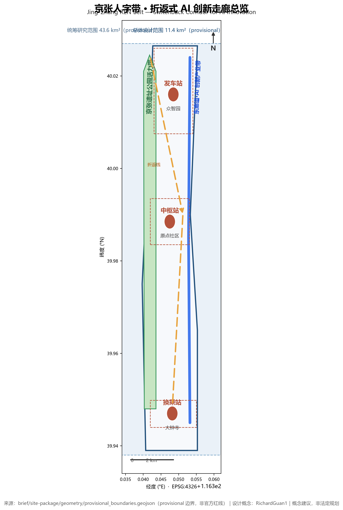
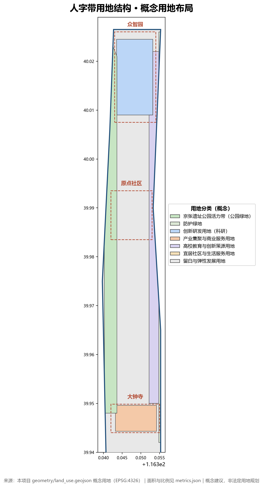
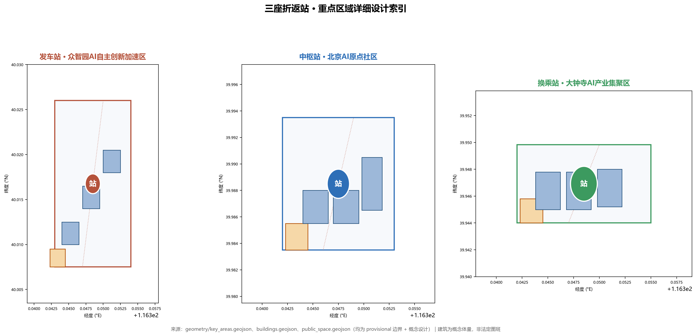
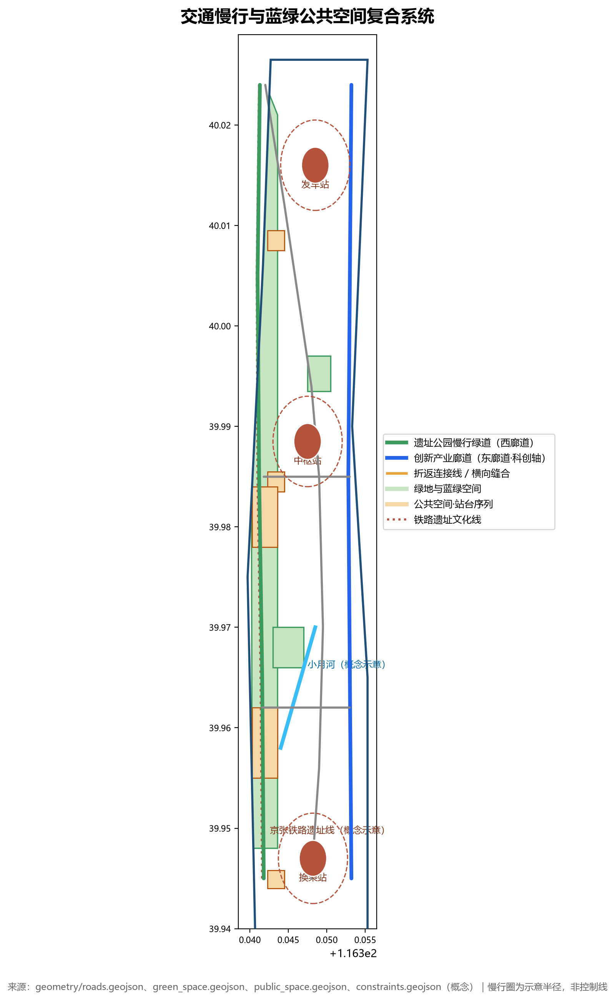
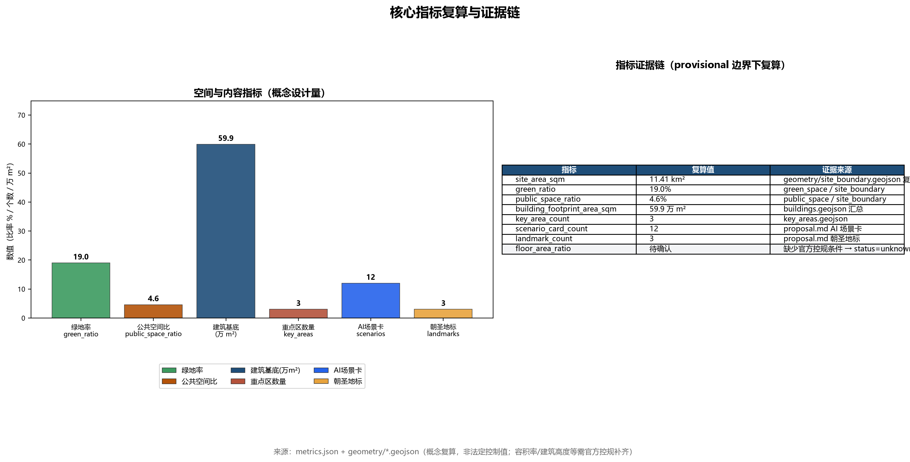

# Jing-Zhang REN Belt: The Switchback AI Innovation Corridor

> A century ago, faced with the 33‰ steep gradient at Badaling, Zhan Tianyou did not force a direct climb. Instead, he designed a "herringbone" switchback alignment: the train first moved forward, then reversed—trading distance for gradient, turning the "impossible" into "feasible" through one elegant detour.
> A century later, an AI innovation belt is set to emerge along this railway corridor. Innovation, too, has its gradients—talent, knowledge, and capital do not climb slopes on their own. This proposal translates the engineering wisdom of the "herringbone" into a spatial strategy: rather than pursuing a straight-line sprint, it weaves back and forth between the cultural corridor and the industrial corridor, ascending step by step, allowing innovation to climb steadily, just as a train traverses a switchback alignment.
> This corridor is what this proposal calls the **Jing-Zhang REN Belt**.

## Plain-Language Summary (A Letter to Residents)

Let us first explain in the most straightforward terms what this proposal is and is not—without leading with concepts.

**What is happening in this area?** Haidian plans to gradually develop the area along the Beijing–Zhangjiakou Railway Heritage Park corridor (from the North Fifth Ring Road to Beijing North Railway Station, approximately 43.6 square kilometers) into an AI innovation belt. Among this corridor, three key districts—Zhongzhi Park in the north, the Origin Community in the middle, and Dazhongsi in the south—will host tech companies, housing, and parks, not just industrial parks. This direction has already been specified in official government announcements.

**What does this proposal suggest?** In one sentence: **Build a greenway along the old railway (on the west side), reserve an industrial street along the Xueyuan Road axis (on the east side), and connect the three key districts in the middle like three stations along a line.** Residents living nearby will directly benefit from: longer parks and promenades, more continuous cycling and pedestrian routes, several community-facing AI service points (such as rapid health screening stations, rest stops for delivery riders and ride-hailing drivers, and compliance consultation points for entrepreneurs), and public spaces that preserve the memory of the railway.

**Who will do it, and when?** This proposal is a **conceptual recommendation**, not an approved plan. For it to actually be implemented, it will still require: deepening by professional planners, on-site surveys, resident participation, government review, and statutory public notification and approval procedures. The "responsible entities" mentioned in this proposal are proposed directions, not finalized government arrangements; the floor areas, heights, and phasing described are conceptual figures, not statutory control values.

**An honest note: this proposal has not been to the site.** The resident needs described in this proposal are inferred from public sources and common sense, and constitute **assumptions**, not conclusions verified through interviews or on-site surveys. We do not fabricate any site visits, discussion sessions, or resident opinions. If you live in this area and find anything that does not match reality, you are welcome to point it out—we are willing to make corrections [source:SOURCE-REGISTRY].

## Design Basis and Reference Materials

This proposal is developed entirely based on publicly available or cleared materials, without using any non-public planning drawings, internal indicators, or unauthorized data. The core references include:

- **Call for Submissions Announcement**: The prequalification announcement for the "Centennial Jing-Zhang AI Innovation Belt International Urban Design Competition" in Haidian District (2026-05-09), which defines the 43.6 km² coordinated study area, the 11.4 km² overall design area, the 368.4-hectare key area scope, and the design tasks [source:OFFICIAL-ANNOUNCEMENT].
- **Agent-Oriented Task Book**: Ten co-creation principles, three positioning statements, five major functions, three-zone two-wing coordination, and six agent tasks [source:AGENT-TASKBOOK] [standard:PROJECT-AGENT-OPEN-CALL-TASKBOOK].
- **Site Data Package**: The design_brief, allowed_design_space, enums, planning_limits, and schemas within `brief/site-package/` [source:SITE-PACKAGE].
- **Boundary Geometry**: `brief/site-package/geometry/provisional_boundaries.geojson`, where PROV-SITE-001 represents the overall design scope and PROV-KEY-001/002/003 represent the three key areas. All are **provisional (temporary and approximate) boundaries, not official red lines** [source:BOUNDARY-SOURCE] [source:KEY-AREA-SOURCE].
- **Source Registry**: `data/source_registry.json` categorizes materials into formal-ready / background-only / provisional-only, and this proposal does not elevate background or provisional materials to statutory status [source:SOURCE-REGISTRY].
- **Public Policies**: "Several Measures of Beijing Municipality on Accelerating the Development Led by Intelligent Agents" (2026-07-23), the Barrier-Free Environment Construction Law, and the Interim Measures for the Management of Generative Artificial Intelligence Services, among others [source:BEIJING-AGENT-MEASURES] [source:BARRIER-FREE-LAW] [source:GENERATIVE-AI-MEASURES].
- **Public Historical and Geographical Knowledge**: The public historical narrative of the Jing-Zhang Railway's zigzag switchback alignment, Zhan Tianyou, and Qinglongqiao Station; publicly available geographic information including the Qinghuayuan Station site (within the project area), the Xueyuan Road university belt, and Xiaoyue River—used solely as cultural context and spatial references, not constituting planning alignments [source:JINGZHANG-HISTORY].

Writing discipline: Key judgments in the main text use verifiable citations with `[source:...]`, `[standard:...]`, `[depth:...]`, `[data:...]`, and `[metric:...]`; all areas, proportions, and scales can be recalculated from `geometry/*.geojson`, `metrics.json`, or the aforementioned public sources; content involving development intensity, building heights, and road alignments is consistently labeled as **conceptual recommendations** and is not presented as official approved conclusions [source:SITE-PACKAGE].

## Three-Tier Scope Working Framework

### Coordinated Research Scope (43.6 km², provisional)

The "Human-Shaped Belt" serves as the overarching industrial and future-city research framework: three thematic belts—the Century-Old Zhangjiakou Cultural Belt (west), the Urban AI Living Experience Belt (center), and the AI Integration Innovation Belt (east)—are superimposed to form a spatial structure of dual corridors with switchback nodes [source:OFFICIAL-ANNOUNCEMENT] [source:AGENT-TASKBOOK]. This tier completes global AI innovation ecosystem case studies, the three-district two-wing collaborative loop, and the AI urban form vision with indicator framework. Deliverables are expressed through strategy maps, indicator systems, and operational mechanisms, without committing to specific land parcels [depth:three_level_scope_framework].

### Overall Design Scope (11.4 km², provisional)

The "Human-Shaped Dual-Track" spatial skeleton is anchored at this tier:

- **West Corridor · Cultural Belt**: The Zhangjiakou Heritage Park vitality belt, linking heritage sites, station sequences, and open public spaces, carrying cultural narrative and public interaction [data:geometry/land_use.geojson#LU-HERITAGE-GREEN].
- **East Corridor · Innovation Belt**: The AI innovation industry corridor along the Xueyuan Road university science-innovation axis, connecting academic, R&D, and industrial spaces [data:geometry/land_use.geojson#LU-EDU].
- **Switchback Stations**: Three key areas serve as "ramp stations" along the exhibition line, where innovation elements ascend through switchback movements [data:geometry/key_areas.geojson#PROV-KEY-001].

This tier achieves the urban design depth of a regulatory detailed plan: defining land use structure, building volume ranges, public space systems, transportation and slow-traffic networks, and urban form control frameworks. Indicators lacking official regulatory plan conditions (FAR, height, density) are all recorded as `status=unknown` and expressed as conceptual recommendations [standard:PROJECT-OFFICIAL-ANNOUNCEMENT] [depth:overall_design_depth].

### Key Area Scope (368.4 ha, provisional)

The three key areas are positioned respectively as "Departure Station (Zhongzhi Park)," "Hub Station (Origin Community)," and "Interchange Station (Dazhong Temple)," undergoing detailed design at the depth of a comprehensive implementation plan (see the "Key Area Detailed Design" section) [data:geometry/key_areas.geojson].

> **Provisional Boundary Statement**: All geometry in this proposal is based on temporary rough boundaries (PROV-*) provided by the maintainer, intended solely for open solicitation, presentation, and self-review. It shall not serve as official red lines, approval basis, or a basis for precise area recalculation. Upon release of official polygons, all layer areas, indicators, and drawings in this proposal must be recalculated [source:BOUNDARY-SOURCE].

## Integrated Study Scope: Industry and Future City Research

### Naming System and Logo Direction

- **Primary Name**: Jing-Zhang REN Belt. "REN" derives from the Chinese character 人 (person), while also echoing the initials of Railway, Ecosystem, and Network—forming an internationally communicable bilingual brand.
- **Logo Concept**: The basic form is a "人"-shaped intersection of dual tracks—one track representing railway heritage culture, the other representing AI innovation industry, converging at the turnaround point as a node. The graphic can simultaneously be read as the Chinese character 人, a switchback exhibition track, and a neural network connection diagram, echoing the dual meanings of "human-centric governance" and "human-machine collaboration" [standard:PROJECT-AGENT-OPEN-CALL-TASKBOOK].
- **District Naming**: Zhongzhi Park = "Departure Station," Origin Community = "Central Hub Station," Dazhong Temple = "Transfer Station," and the heritage park corridor = "Open Platform Belt," forming a complete railway-semantic spatial system.
- **Visual Standards**: Primary colors include rust red (heritage/culture) + tech blue (innovation/industry) + track gold (switchback/connection); Chinese typography is recommended to use heiti-style fonts (e.g., Source Han Sans) to evoke an engineering aesthetic; graphic language uniformly adopts railway elements such as track lines, platform symbols, and signal lights (conceptual direction, pending professional refinement) [depth:brand_system].
- **Naming Density Control**: To avoid the piling-up of "invented terminology," this proposal clearly distinguishes between **core concepts** and **memorable aliases**—only 3 core concepts exist (REN Belt = overall structure, Dual Corridors = spatial skeleton, Switchback = innovation mechanism, each tied to specific spaces and strategies); terms such as "Departure Station/Central Hub Station/Transfer Station," "Platform Passport," and "Signal Points" serve solely as memorable aliases and do not constitute independent design propositions. Taking the "interlocking AI dispatch platform" as an example, its actual mechanism is **logical permission validation with a human-approval sandbox**; the borrowing of railway "interlocking" is merely a memorable metaphor and **not** a physical signal interlock system; the proposal avoids over-extrapolation of terminology [depth:brand_system].

### Global AI Innovation Ecosystem Case Studies (Readable Summary)

1. **Silicon Valley (USA)**: Stanford Research Park → Sand Hill Road capital corridor—a spatial relay of basic research, entrepreneurship, and capital, serving as a typical example of "innovation climbing along a corridor"; implication: innovation belts require clear "gradient" tiers and capital waystations [source:AGENT-TASKBOOK].
2. **one-north (Singapore)**: Life sciences, infocommunications, and media clusters cross-penetrate within a compact campus, emphasizing the mix of "science, work, and living"; implication: high-density mixed-use land supports innovation collisions [source:AGENT-TASKBOOK].
3. **King's Cross Central (London)**: A holistic regeneration of a railway heritage district, anchored by the station to rebuild public space and a tech community, with Google's UK headquarters located there; implication: railway heritage parks are precisely the ideal vehicle for this "heritage × technology" renewal model [source:AGENT-TASKBOOK].
4. **Marunouchi (Tokyo)**: High-intensity TOD redevelopment integrating rail stations with business, culture, and underground retail; implication: rail integration is the backbone of public services in innovation belts [source:AGENT-TASKBOOK].
5. **Hangzhou Future Sci-Tech City / Dream Town**: The specialty-town model rapidly aggregates through low-cost space plus entrepreneurship policies; implication: reserved land and flexible policies are key to early-stage activation of innovation belts [source:AGENT-TASKBOOK].
6. **Shenzhen Nanshan Science Park**: Market-driven iteration and enterprise-led industry-city integration; implication: the Dazhong Temple industrial cluster should reserve enterprise-led renewal pathways [source:AGENT-TASKBOOK].

### Three Districts, Two Wings: Synergistic Loop

The five major functions (full-stack independent AI innovation system, world-class AI innovation ecosystem, new paradigm of AI+ scenario enablement, intelligent vibrant AI city, and global discourse power in AI governance) are mapped in this proposal as follows: Zhongzhi Park undertakes the "full-stack independent innovation system" and "AI governance discourse power," Origin Community undertakes the "world-class AI innovation ecosystem," Dazhong Temple undertakes "intelligent-native new business forms," the Zhongguancun technology services wing undertakes "globalized allocation of factors," and the Xiaoyue River scenario enablement wing undertakes "scenario enablement and vibrant city" [source:AGENT-TASKBOOK]. The switchback connection lines of the REN Belt (ROAD-SWITCH-1/2) spatially link the five into a loop [data:geometry/roads.geojson#ROAD-SWITCH-1].

### Future AI City Form

A "four-layer city" vision is proposed: physical layer (tracks/roads/green belts), digital layer (urban intelligent agent/digital twin), service layer (AI+ public services), and cultural layer (railway narrative/open-source ethos)—with the four layers safely coupled through "interlocking governance" [source:AGENT-TASKBOOK] [depth:ai_city_form].

## Overall Design Scope: Urban Renewal and Regulatory Detailed Urban Design

### Spatial Structure

"Herringbone Dual-Track + Three Stations + Multi-Platform": The West Corridor Cultural Belt (Heritage Park Green Space [data:geometry/green_space.geojson#GREEN-PARK]), the East Corridor Innovation Belt (Science and Technology Innovation Axis [data:geometry/roads.geojson#ROAD-INNOVATION]), three switchback connector lines ([data:geometry/roads.geojson#ROAD-SWITCH-1], [data:geometry/roads.geojson#ROAD-SWITCH-2]) and a lateral stitching line ([data:geometry/roads.geojson#ROAD-LAT-1]) integrate the three key areas with the university belt and the Xiaoyue River blue-green space into a cohesive whole [data:geometry/green_space.geojson#GREEN-XYH].

### Industrial Objectives and Functional Layout

- Land Use Structure (Conceptual): Seven categories including innovation R&D land (0802), industrial agglomeration and commercial service land (05), university education land (0804), park green space (1401), community and living service land (0701/0702), protective green space (1402), and reserved land (16) [data:geometry/land_use.geojson].
- Functional Proportions: Innovation R&D and industrial space serve as the primary component; the design target requires green space and public space to collectively account for no less than 30% of the total scope. The current conceptual scheme recalculates this at approximately 23.6% (green space ~19.0%, public space ~4.6%), with the shortfall to be addressed through regulatory detailed plan refinement and conversion of reserved land; reserved land maintains 3–5% flexibility (conceptual indicator, pending regulatory plan confirmation) [metric:green_ratio] [metric:public_space_ratio].
- Urban Renewal Framework: Progressing under the three strategies of "preserve heritage, retrofit existing stock, and punctuate with new construction"—heritage park and historical elements along the corridor are preserved and activated; obsolete buildings and low-efficiency campuses are retrofitted into innovation spaces; only a small number of iconic new constructions are introduced at station nodes [depth:urban_renewal_framework].
- **Site Status Basis**: According to official materials from the Beijing–Zhangjiakou Railway Heritage Park, the park spans approximately 9 kilometers from Xizhimen to the North Fifth Ring Road, serving 9 sub-districts, nearly 70 communities, and approximately 450,000 residents; Phase I (Zhichun Road–Qinghua East Road), covering 16.8 hectares, was completed and opened in 2023, with the Qinghuayuan Station building restored and preserved, and a "three paths plus one greenway" slow-traffic system established; the radiation zone contains approximately 800 tech enterprises per km² and 18–20 universities and research institutes. The West Corridor and station sequence design in this scheme is anchored to this completed foundation rather than conceived from scratch [source:JINGZHANG-PARK-OFFICIAL].

### Renewal Project List (Conceptual)

| No. | Project | Type | Location | Dependency Conditions | Recommended Lead |
|---|---|---|---|---|---|
| UP-01 | Qinghuayuan Station Platform Activation | Preservation + Functional Infill | North of Origin Community | Heritage Protection Approval | Haidian District + Developer Community |
| UP-02 | Origin Community Co-creation Block | Retrofit | PROV-KEY-002 | Ownership Confirmation | Platform Enterprise + OPC Community |
| UP-03 | Zhongzhi Park Pilot-scale Acceleration Building | New Construction | PROV-KEY-001 | Regulatory Plan Conditions | Innovation Platform |
| UP-04 | Dazhongsi Scenario Incubation Building | Retrofit + New Construction | PROV-KEY-003 | Industrial Investment Attraction | Market Operator |
| UP-05 | Open Platform Belt (West Corridor) | Retrofit | Along Heritage Park | Park Management | Park + Cultural Institutions |

> The site foundation for UP-01 is the officially restored and preserved Qinghuayuan Station building (one of the Phase I deliverables completed in 2023); this scheme only recommends layering public functions such as digital twin guided tours around it [source:JINGZHANG-PARK-OFFICIAL].

> All projects above are conceptual recommendations; implementation entities, phasing, and investment are subject to government approval [standard:PROJECT-OFFICIAL-ANNOUNCEMENT].

**Renewal Project Implementation Contract Elements (Proposed)**: Before formal project initiation, each project must complete and publicly disclose—responsible entity (proposed role, not an established government arrangement), target population served, required resources and permits, baseline (current status baseline), measurement windows (e.g., 6/12/24 months post-initiation), success thresholds, and stop conditions (termination if budget overrun or unresolved social opposition). This scheme does not presuppose these parameters, so as not to disguise conceptual recommendations as established arrangements [assumptions:A-CONTROLS-001].

### Regulatory Plan Conditions Pending Confirmation

Statutory control indicators including floor area ratio, building height, building density, green space ratio, and setback lines are all marked as `missing` in `brief/site-package/ranges/planning_limits.json`; this scheme correspondingly records `status=unknown` and expresses them as conceptual ranges (see the "Land Use, Building Scale, and Demolition/Retention/New Construction Plan" section) [metric:floor_area_ratio].

### Provisional Boundary Offset Disclosure

Independent verification during public discussion (upstream Issue #846) using OpenStreetMap found: the provisional "Overall Design Scope" polygon `PROV-SITE-001` does not intersect with the OSM-mapped Beijing–Zhangjiakou Railway Heritage Park, with a nearest distance of approximately 412.5 m (reproducible measurement, including independent replication; this scheme does not adjudicate which is correct, nor does it elevate OSM data to official boundary status). All spatial layers and indicators in this scheme (site_boundary, key areas, land use, roads, green space, public space, buildings, phasing, metrics) are generated based on this provisional boundary; upon release of the official polygon, all layers, drawings, and indicators will be fully recalculated through the in-package recalculation pipeline [source:SITE-PACKAGE].

## Detailed Design of Key Areas

### Departure Station · Zhongzhiyuan AI Independent Innovation Acceleration Zone (approx. 192.1 ha, provisional)

- **Positioning**: An "innovation departure yard" for basic research → pilot validation → outcome acceleration, receiving original innovations from universities [source:AGENT-TASKBOOK].
- **Spatial Structure**: Central R&D building cluster (BLDG-ZZ-1/2/3 [data:geometry/buildings.geojson#BLDG-ZZ-1]) + southern departure platform plaza ([data:geometry/public_space.geojson#PUBLIC-ZHONGZHIYUAN]) + western heritage green belt.
- **Building Renewal**: Retain existing R&D facilities and introduce pilot-scale acceleration functions; new building clusters are conceptual volumes, with height and intensity pending regulatory detailed plan confirmation [data:geometry/buildings.geojson].
- **Transport & Slow Mobility**: Switchback Connector Line No. 1 (ROAD-SWITCH-1) intersects the western corridor here, linking the greenway and the ART loop line [data:geometry/roads.geojson#ROAD-SWITCH-1].
- **AI Scenarios**: Pilot testing ground, rail inspection robot testing (see scenario card S-03), ART shuttle connection (S-01).
- **Implementation Risks**: Traffic noise along the North Fifth Ring Road and associated green buffer requirements; control indicators unknown, requiring regulatory detailed plan supplementation first [assumptions:A-CONTROLS-001].

### Hub Station · Beijing AI Origin Community (approx. 104.3 ha, provisional)

- **Positioning**: The "hub station" with the highest talent density and strongest co-creation atmosphere, bringing together scientists, developers, and young students [source:AGENT-TASKBOOK].
- **Spatial Structure**: Shared R&D building (BLDG-OR-1), co-creation space (BLDG-OR-2), and AI headquarters building (BLDG-OR-3) enclose the Origin Green Heart Park (GREEN-ORIGIN-PARK [data:geometry/green_space.geojson#GREEN-ORIGIN-PARK]), connecting northward to Tsinghua Yuan platform building (BLDG-ST-1).
- **Building Renewal**: Existing urban blocks renovated into co-creation blocks (UP-02); platform building retrofitted with a digital twin pavilion [data:geometry/buildings.geojson#BLDG-ST-1].
- **Transport & Slow Mobility**: The lateral stitching road ROAD-LAT-1 runs through here, connecting the east-west corridors and the rail transit stations along Line 13 (conceptual connection, not an official alignment) [data:geometry/roads.geojson#ROAD-LAT-1].
- **AI Scenarios**: Platform digital twin guided tours (S-02), switchback-style hackathon station (S-07), interlocking AI dispatch platform (S-04).
- **Implementation Risks**: Complex land ownership around university campuses; renewal requires multi-party coordination among universities, communities, and enterprises [assumptions:A-CONTROLS-001].

### Transfer Station · Dazhongsi AI Industry Cluster Zone (approx. 72.0 ha, provisional)

- **Positioning**: A "transfer station" for industrialization and capital conversion, aggregating AI-native new business formats [source:AGENT-TASKBOOK].
- **Spatial Structure**: Three industrial building clusters (BLDG-DZ-1/2/3) arranged along the southern edge, with the transfer station platform plaza (PUBLIC-DAZHONGSI) serving as the entrance [data:geometry/buildings.geojson#BLDG-DZ-1].
- **Building Renewal**: Renovation of existing industrial buildings + construction of new scenario incubation buildings (UP-04).
- **Transport & Slow Mobility**: Switchback Connector Line No. 2 (ROAD-SWITCH-2) connects to the Origin Community; integrated development around the Dazhongsi rail transit station (conceptual) [data:geometry/roads.geojson#ROAD-SWITCH-2].
- **AI Scenarios**: Low-altitude logistics test routes (S-09), unmanned delivery corridors (S-05), autonomous driving test ground (S-10).
- **Implementation Risks**: Current ownership and renovation conditions of industrial buildings require verification; the provisional boundary centroid deviates approximately 2.26 km from the publicly known Dazhongsi station location (see upstream Issue #1029), and related conclusions herein serve as directional design only [assumptions:A-CONTROLS-001].

> All three key areas have provisional boundaries; the above conclusions are directional designs. A comprehensive recalculation is required once official boundaries and regulatory detailed plan conditions are released [source:KEY-AREA-SOURCE].

## AI Innovation Ecosystem, Talent Profiles, and AI+ Scenarios

### User Profiles (5 Categories)

| Profile | Population | Core Needs | Corresponding Scenarios |
|---|---|---|---|
| P1 Research Pioneers | Scientists and researchers from Haidian universities and research institutes | Computing power, data, pilot-scale testing conditions | S-03, S-04, S-08 |
| P2 Super Individuals | OPC developers, independent entrepreneurs | Low-cost space, open scenarios, compliance support | S-07, S-11, S-12 |
| P3 Industry Talent | AI enterprise employees, engineers | Commuting, dining, R&D-production collaboration | S-01, S-05, S-10 |
| P4 Young Students | Students from Beihang University / BUPT and other universities | Internships, competitions, social interaction | S-02, S-07 |
| P5a Surrounding Residents | Permanent residents along the heritage park corridor | Daily park use, convenience services, commuting | S-02, S-06, S-11 |
| P5b Visitors and Railway Enthusiasts | Tourists, railway culture enthusiasts, event visitors | Guided tours, experiences, activities | S-02, S-08 |

### AI Scenario Cards (12 Cards, Including 3 Industry Test & Validation Scenarios)

**S-01 Smart Rail Shuttle Loop (AI + Mobility)**: An autonomous low-speed shuttle loop operating along the heritage park and switchback connector lines, linking three stations.
- Spatial Location: ROAD-HERITAGE / ROAD-SWITCH-1/2 [data:geometry/roads.geojson#ROAD-HERITAGE] | Target Users: P1/P3/P5 | Operational Data: Vehicle location, passenger flow, road conditions (desensitized) | Privacy Boundary: No biometric data such as facial recognition collected | Human Review: Safety officer onboard + remote monitoring | Operating Entity: Transit operator + park property management | Risk: Compliance approval for low-speed pilot.
- Scenario Card ID: ai-traffic-walkability [scenario:ai-traffic-walkability]

**S-02 Platform Digital Twin Guided Tour (AI + Culture)**: A digital twin pavilion at Tsinghua Garden Station, using AR to recreate a century of railway history, overlaid with the AI innovation belt planning concept.
- Spatial Location: BLDG-ST-1 [data:geometry/buildings.geojson#BLDG-ST-1] | Target Users: P4/P5 | Operational Data: Tour clicks, dwell time (aggregated) | Privacy Boundary: No individual tracking | Human Review: Content reviewer | Operating Entity: Cultural institution + developer community | Risk: Historical narratives must undergo factual verification.
- Scenario Card ID: ai-cultural-guide [scenario:ai-cultural-guide]

**S-03 Rail Track Inspection Robot (Industry Test & Validation)**: Deploy inspection robots along the heritage park demonstration section to detect pavement, facility, and safety conditions, while accumulating city-scale robot operational data.
- Spatial Location: West corridor demonstration section [data:geometry/green_space.geojson#GREEN-PARK] | Target Users: P5, park management | Operational Data: Inspection imagery, sensor data (environmentally desensitized) | Privacy Boundary: Automatic image desensitization, no storage of pedestrian faces | Human Review: Manual confirmation of anomaly work orders | Operating Entity: Robotics company + park management | Risk: Testing compliance, pedestrian safety.

**S-04 Interlocking AI Dispatch Platform (Urban Intelligent Agent Governance)**: Drawing on railway interlocking systems, establish an urban intelligent agent "interlocking sandbox" — any AI service entering public space must first pass rule validation, permission interlocking, and human release to ensure safe human-machine collaboration.
- Spatial Location: Origin community governance node [data:geometry/public_space.geojson#PUBLIC-ORIGIN] | Target Users: P1/P2/P3 | Operational Data: Agent operation logs, anomaly events | Privacy Boundary: Tiered desensitization of logs | Human Review: Duty engineer final review | Operating Entity: Government platform + professional team | Risk: Governance rules must be open and transparent.
- Scenario Card ID: civic-agent-governance

**S-05 Unmanned Delivery Corridor (AI + Logistics)**: Dedicated robot delivery lanes along the east-west corridor, covering on-demand delivery of dining, parcels, and pharmaceuticals within the park.
- Spatial Location: Along ROAD-INNOVATION [data:geometry/roads.geojson#ROAD-INNOVATION] | Target Users: P2/P3 | Operational Data: Delivery trajectories (aggregated) | Privacy Boundary: Delivery addresses desensitized | Human Review: Manual handling of anomalous orders | Operating Entity: Logistics platform | Risk: Right-of-way and safety.
- Scenario Card ID: robot-delivery-low-speed [scenario:robot-delivery-low-speed]

**S-06 AI Health Quick-Check Station (AI + Healthcare)**: A station-type AI-assisted health screening kiosk providing basic tests such as blood pressure and blood glucose, along with health consultations.
- Spatial Location: Open platform zone node [data:geometry/public_space.geojson#PUBLIC-PLATFORM-A] | Target Users: P3/P5 | Operational Data: Test results (desensitized) | Privacy Boundary: Medical data encrypted and accessible only to the individual | Human Review: Licensed medical staff review | Operating Entity: Medical institution | Risk: Medical licensing and liability determination.
- Policy Basis: Aligns with the direction of the *Haidian District "AI + Elderly Care" Three-Year Action Plan (2026–2028)*, which calls for completing 3 smart elderly care community pilots annually and building a human-machine collaborative "elderly care planner" team; specific implementation requires inclusion in the District Civil Affairs Bureau pilot and the civil affairs integrated platform — this proposal serves only as a conceptual link [source:HAIDIAN-AI-ELDERLY-PLAN].
- Scenario Card ID: ai-health-service-navigation [scenario:ai-health-service-navigation]

**S-07 Switchback Hackathon Station (AI + Education)**: A 24-hour open developer space hosting regular "Switchback Marathon" coding competitions, where talent iterates through the competition process.
- Spatial Location: BLDG-OR-2 [data:geometry/buildings.geojson#BLDG-OR-2] | Target Users: P2/P4 | Operational Data: Participant count, project count (aggregated) | Privacy Boundary: Clear ownership of submitted works | Human Review: Review committee | Operating Entity: Developer community + enterprises | Risk: Sustainability of event operations.
- Policy Basis: Can interface with the Haidian OPC ecosystem — tech talent founding OPCs receive ¥100,000 startup support, model voucher subsidies up to ¥2 million/year, and OPC-friendly communities up to ¥2 million/year; competitions can align with public initiatives such as the "Haidian District AI OPC Campus Tour" [source:HAIDIAN-OPC-MEASURES].

**S-08 Open Source Contribution Signal Tower (AI + Public Space)**: Signal-tower-shaped open source achievement displays and honor walls along the heritage park, showing real-time open source contribution data and recognizing contributors by name.
- Spatial Location: Mid-west corridor [data:geometry/public_space.geojson#PUBLIC-PLATFORM-B] | Target Users: P1/P2/P4 | Operational Data: Open source commits, PR counts (public data) | Privacy Boundary: Public information only | Human Review: Community administrator | Operating Entity: Open source community | Risk: Recognition mechanism must be fair and transparent.

**S-09 Low-Altitude Logistics Test Route (Industry Test & Validation)**: Designate a low-altitude logistics test route around Dazhongsi to validate the safety and efficiency of drone delivery in dense urban areas.
- Spatial Location: Dazhongsi airspace corridor (conceptual) [data:geometry/key_areas.geojson#PROV-KEY-003] | Target Users: P3 | Operational Data: Routes, weather, takeoff/landing records | Privacy Boundary: Routes avoid residential airspace | Human Review: Airspace administrator | Operating Entity: Drone company + air traffic control authority | Risk: Airspace approval, noise, and privacy.

**S-10 Autonomous Driving Test Ground (Industry Test & Validation)**: A low-speed autonomous shuttle and automated parking test ground, open to the public for trial rides.
- Spatial Location: South of Zhongzhi Park [data:geometry/key_areas.geojson#PROV-KEY-001] | Target Users: P1/P3/P5 | Operational Data: Test mileage, disengagement records | Privacy Boundary: Blurring of trial rider imagery | Human Review: Safety officer | Operating Entity: Autonomous driving company | Risk: Test safety and insurance.

**S-11 New Employment Forms Dispatch Hub (AI + Mobility)**: An AI dispatch and rest station for delivery riders and ride-hailing drivers, optimizing order routing and providing charging and rest facilities.
- Spatial Location: ROAD-SWITCH-2 node [data:geometry/roads.geojson#ROAD-SWITCH-2] | Target Users: P2/P3 | Operational Data: Order heat maps (aggregated) | Privacy Boundary: No retention of individual trajectories | Human Review: Platform appeal channel | Operating Entity: Platform company | Risk: Algorithmic fairness review.

**S-12 AI Legal and Compliance Station (AI + Public Services)**: An AI compliance consultation point for entrepreneurs, offering advisory services on data compliance, intellectual property, and generative AI service standards.
- Spatial Location: Dazhongsi area [data:geometry/key_areas.geojson#PROV-KEY-003] | Target Users: P2 | Operational Data: Consultation category statistics (aggregated) | Privacy Boundary: Consultation content confidential | Human Review: Licensed attorney | Operating Entity: Legal services institution | Risk: AI recommendations require human endorsement.
- Policy Basis: Responds to the requirements of the *Beijing Municipality Several Measures on Accelerating the Development of Intelligent Agent Leadership* regarding intelligent agent safety governance, standards, and compliance services; the consultation point should be operated by professional legal services institutions, with AI serving only as an aid and not replacing professional judgment [source:BEIJING-AGENT-MEASURES].
- Scenario Card ID: enterprise-service-copilot [scenario:enterprise-service-copilot]

### Scenario Card Implementation Contract Quick-Reference Table (Who Does What · For Whom · When · On What Basis · How to Stop)

> Note: The "Responsible Entity," "Time Window," and "Thresholds" below are all **proposed directions**, not confirmed government arrangements or statutory commitments; all scenarios still require professional refinement, public participation, and competent authority approval before piloting. Articulating these five elements is intended to make the proposal accountable, not to imply that implementation has already occurred [standard:PROJECT-AGENT-OPEN-CALL-TASKBOOK] [source:BEIJING-AGENT-MEASURES].

| Card | Responsible Entity (Proposed) | For Whom | When (Proposed) | Baseline | Success Threshold | Stop/Fallback Condition |
|---|---|---|---|---|---|---|
| S-01 Smart Rail Shuttle | Transit operator + park property management | P1/P3/P5 | Mid-term (2028–2031) pilot | To be surveyed: current share of shuttle connections requiring >15 min walking | Average connection time between three stations ≤8 min, zero incidents | Immediate shutdown if safety officer detects loss of control; switch to manual shuttle |
| S-02 Digital Twin Guided Tour | Cultural institution + developer community | P4/P5 | Near-term (2026–2028) upon platform revitalization | To be surveyed: visitation volume under current tour methods | Monthly average of 10,000 tour uses | Content removed for review upon historical accuracy complaints |
| S-03 Rail Track Inspection Robot | Robotics company + park management | P5/park authority | Mid-term (2028–2031) demonstration section | To be surveyed: current manual inspection cycle and miss rate | 100% coverage of demonstration section, miss rate <5% | Testing withdrawn if pedestrian conflict risk fails to meet standards |
| S-04 Interlocking Dispatch | Government platform + professional team | P1/P2/P3 | Near-term (2026–2028) sandbox | To be surveyed: current admission rules for intelligent agent services in public spaces (assumption, requires on-site verification) | 100% sandbox rule coverage, zero unauthorized releases | Freeze deployment if any human release step is missing |
| S-05 Unmanned Delivery Corridor | Logistics platform | P2/P3 | Mid-term (2028–2031) | To be surveyed: baseline for manual delivery time | Average delivery time equal to or better than baseline | Suspend if right-of-way disputes remain unresolved |
| S-06 Health Quick-Check Station | Medical institution | P3/P5 | Near-term (2026–2028) | To be surveyed: number and distance of basic screening points within 1 km (assumption, requires survey) | 200 service visits per week, false positive rate <1% | No operation without medical licensing |
| S-07 Switchback Hackathon | Developer community + enterprises | P2/P4 | Near-term (2026–2028) first event | To be surveyed: number of fixed developer spaces within 2 km of Origin community (assumption, requires survey) | 4 events annually, cumulative 2,000 participants | Scale down to reservation-only if operating losses persist for 2 years |
| S-08 Open Source Signal Tower | Open source community | P1/P2/P4 | Near-term (2026–2028) | To be surveyed: current utilization of public display surfaces in the heritage park (assumption, requires survey) | Quarterly updates, verifiable data sources | Suspend lighting if recognition mechanism is disputed |
| S-09 Low-Altitude Logistics Route | Drone company + air traffic control | P3 | Long-term (2031–2035) | To be surveyed: list of approved low-altitude delivery routes in Beijing (assumption, requires official confirmation) | Zero route incidents, on-time rate ≥95% | Not activated without airspace approval |
| S-10 Autonomous Driving Test Ground | Autonomous driving company | P1/P3/P5 | Mid-term (2028–2031) | To be surveyed: existing public low-speed trial ride points in Haidian (assumption, requires survey) | Annual test mileage of 100,000 km, disengagement rate <1 per 1,000 km | Testing halted for rectification upon any safety incident |
| S-11 Dispatch Hub | Platform company | P2/P3 | Near-term (2026–2028) | To be surveyed: current rider station coverage around Dazhongsi (assumption, requires on-site verification) | 500 service visits per day | Dispatch function taken offline if algorithmic fairness complaints remain unresolved |
| S-12 Compliance Station | Legal services institution | P2 | Mid-term (2028–2031) | To be surveyed: list of existing entrepreneurship compliance service points in Haidian (assumption, requires survey) | 100 consultations per month, follow-up satisfaction ≥80% | No AI recommendations issued without attorney endorsement |

> **Scenario Governance Compact (Adopting Community *Switchback Protocol v1.0*)**: The governance of scenarios in this proposal adopts the community open template *Switchback Protocol v1.0* (CC-BY-4.0, contributor chucky1102, upstream Issue #1119), aligned with this table: the "Stop/Fallback Condition" column corresponds to the protocol's "Red = Switchback" (revert to the last stable state and publicly disclose the reason); the green/yellow/red three-color status and 90-day public review mechanism serve as direction for subsequent operational phases; all timeframes and thresholds are **design target values**, not government commitments; thresholds are frozen before piloting, with no fabricated baselines pre-filled. Protocol registration is documented at #1119.

> **Appeal and Readback Compact**: For any scenario suspension/switchback decision, affected parties may appeal — acceptance within 1 business day, response within 7 business days (design target values, not commitments); responsible roles are the operating entity + independent reviewer (role-level, not naming specific institutions); the searchable location for responses and processing records is the scenario card and implementation ledger; the deletion credential is a **declarative structure** and does not constitute deletion of evidence that has already occurred [assumptions:A-CONTROLS-001].

## Land Use, Building Scale, and Demolition/Renovation/Retention Strategy

- **Land Use Layout**: Seven conceptual land use categories are provided in `geometry/land_use.geojson` (9 features, including reserved blocks for full coverage) [data:geometry/land_use.geojson].
- **Building Footprints**: 11 conceptual building masses with a total footprint area of approximately 599,000 m² (recalculated under EPSG:4548 based on buildings.geojson, including conceptual volumes for industrial building clusters and station node buildings; recalculated values are available in metrics.json [metric:building_footprint_area_sqm]). All are **conceptual volumes** and do not constitute statutory building parcels [data:geometry/buildings.geojson].
- **Demolition/Renovation/Retention Classification**: **Retained** — heritage park, station ruins, universities and research institutions; **Renovated** — obsolete buildings, low-efficiency industrial parks, commercial facilities; **Newly built** — station node buildings and pilot-scale/incubation buildings (3–4 sites only) [depth:redevelopment_strategy].
- **Statutory Control Indicators**: Floor area ratio, height, density, green space ratio, and setback requirements have no official regulatory plan source and are recorded as `status=unknown`; this proposal provides only conceptual range recommendations and explicitly states that they "do not constitute statutory control values" [metric:floor_area_ratio] [assumptions:A-CONTROLS-001].
- **Operation Strategy**: Public spaces and scenario nodes will adopt a hybrid operation model of "government guidance + market operation + community co-governance" (see the "Renewal Project List, Implementation Policies, and Phasing Plan" section for details).

## Transportation, Rail, Municipal, and Public Service Facilities

- **Slow-Traffic Network**: The west corridor greenway + east corridor sci-tech innovation axis + switchback connector lines form a "herringbone slow-traffic network," with 500m station slow-traffic catchment circles covering three key areas [data:geometry/roads.geojson].
- **Rail Integration**: Stations along Line 13 and the conceptual interchange at Tsinghuayuan Station (unofficial alignment, subject to verification with rail authorities) [assumptions:A-CONTROLS-001].
- **ART (Autonomous Rail Transit) Feeder**: The S-01 ART loop line supplements the "last mile" [scenario:ai-traffic-walkability].
- **New Infrastructure**: Edge computing cabinets (deployed along station sequences), distributed energy (conceptual photovoltaic canopy corridors at the heritage park), and digital twin for municipal pipeline networks.
- **Public Service Facilities**: AI health rapid-screening stations (S-06), compliance service stations (S-12), and delivery-rider rest stations (S-11) constitute the "station public service belt" [depth:public_service_network].

## Blue-Green Space, Public Space, and Urban Character

- **Jing-Zhang Heritage Park Vitality Belt**: The western corridor features a 1,401 park green space running through it ([data:geometry/green_space.geojson#GREEN-PARK]), layered with a sequence of open platforms (PUBLIC-PLATFORM-A/B [data:geometry/public_space.geojson]), forming a public narrative belt of "railway culture + open-source spirit."
- **Xiaoyue River Blue-Green Space**: A wedge-shaped green space traverses the middle section of the overall design (GREEN-XYH), stitching together the eastern and western corridors [data:geometry/green_space.geojson#GREEN-XYH].
- **AI Public Memorial and Learning Nodes (3 sites, responding to the public value of the "pilgrimage landmark" in the brief)**:
  1. **Switchback Memorial (人字纪念界面)**: A public memorial interface shaped after switchback rail alignments, located in the middle of the western corridor, recording the names of the first Agents and contributors, echoing the vision that "a hundred years from now, your name will be engraved here as well." This design acknowledges its memorial function (a public learning node for railway memory and the spirit of innovation), while explicitly clarifying: the memorial form adopts a **renewable digital/open-ended interface** (e.g., dynamically updated contribution walls, with content maintained by the community), rather than a static, worship-oriented monument; "name engraving" serves only as a symbolic record of contribution and does not constitute personality worship; the form, location, and construction of the monument are subject to final selection, approval, and realization [depth:ai_landmarks].
  2. **Open-Source Signal Tower (开源信号塔)**: An open-source achievement exhibition gallery plus a contribution honor wall, with signal-light elements that illuminate open-source contributions in real time (S-08). Emphasizes the public display value of the open-source community, without adopting a "pilgrimage"-style marketing narrative.
  3. **Rail Walk (钢轨步道)**: A developer promenade paved with recycled steel rails, featuring AI scenario display nodes along the route, connecting the three key areas. Positioned as a public experiential trail open to all residents and visitors.
- **Urban Character**: The architectural character is grounded in "railway engineering aesthetics + tech minimalism," accented with rust red and tech blue; rooftops are encouraged to accommodate photovoltaic panels and drone takeoff/landing platforms (conceptual) [depth:urban_style].

## Renewal Project List, Implementation Policies, and Phasing Plan

### Phasing Plan (corresponding to geometry/phasing.geojson)

| Phase | Scope | Focus | Corresponding Layer |
|---|---|---|---|
| Short-term (2026-2028) | Origin Community + Tsinghua Garden Platform Belt | Co-creation neighborhood renewal, platform activation, launch of S-02/S-07 scenarios | PHASE-1 [data:geometry/phasing.geojson#PHASE-1] |
| Mid-term (2028-2031) | Zhongzhi Park + Northern Corridor | Pilot acceleration building, inspection robot testing, completion of western corridor | PHASE-2 [data:geometry/phasing.geojson#PHASE-2] |
| Long-term (2031-2035) | Dazhong Temple + Citywide Network | Industrial clustering, low-altitude logistics, citywide agent network | PHASE-3 [data:geometry/phasing.geojson#PHASE-3] |

### Global AI Innovation Event System and Long-term Operations (Conceptual Recommendations)

- **Annual "Beijing-Zhangjiakou Signal Festival"**: Year-opening "Departure Ceremony" (March) + Mid-year "Turnaround Marathon" (48-hour hackathon, S-07) + Annual "Signal Review" (December), forming a year-round operational rhythm.
- **Developer Community Operations**: Leveraging the GitHub open-source repository as the operational vehicle, including scenario open days, contribution points ("Signal Points"), and honor wall update mechanisms (S-08).
- **Public Experience Route**: "Platform Passport" check-in route connecting the three stations and the open platform belt, transforming the "pilgrimage site" into a closed loop of annual events and public experience.
- **Attraction and Conversion Mechanism**: Competition-winning teams are connected to Haidian innovation policies and OPC community resources (conceptual recommendation, not a predetermined government arrangement) [standard:PROJECT-AGENT-OPEN-CALL-TASKBOOK].

> All events, investment attraction, funding, policy, and operational arrangements are **conceptual recommendations or directions for further development** and shall not be presented as confirmed government arrangements [depth:operation_design].

## Indicator System, Area Recalculation, and Compliance Matrix

| Indicator | Recalculated Value | Formula/Source | Design Implication |
|---|---|---|---|
| site_area_sqm | Approx. 11.413 million m² | polygon_area(site_boundary) [metric:site_area_sqm] | Overall design scope (provisional) |
| green_ratio | Concept approx. 19% | green_space / site_boundary [metric:green_ratio] | Heritage green belts + blue-green wedges support talent living |
| public_space_ratio | Concept approx. 4.6% | public_space / site_boundary [metric:public_space_ratio] | Station platform sequences support innovation-driven interaction |
| building_footprint_area_sqm | Concept approx. 599,000 m² | sum(buildings.geojson) [metric:building_footprint_area_sqm] | Conceptual building massing at station platform nodes |
| key_area_count | 3 | key_areas.geojson [metric:key_area_count] | Three turnaround stations |
| scenario_card_count | 12 | AI scenario cards of this proposal [metric:scenario_card_count] | 3 industry test validations |
| landmark_count | 3 | Pilgrimage landmarks of this proposal [metric:landmark_count] | Herringbone memorial interface / signal tower / steel rail promenade |
| floor_area_ratio | Pending confirmation | No official regulatory plan [metric:floor_area_ratio] | Status: unknown, to be supplemented |

- Indicator notes: The green space ratio and public space ratio are conceptual design metrics supporting the narrative of "talent-friendly, innovation-driven interaction"; they do not represent statutory control values. All figures will be fully recalculated upon release of the official boundary.
- Compliance matrix: `compliance_matrix.json` (11 announcement requirements), `standard_matrix.json` (standard responses), and `design_depth_matrix.json` (design depth) provide cross-coverage with this main text; `self_check.json` records self-inspection results [source:SITE-PACKAGE].

## Site and Stakeholder Evidence Statement (site_and_stakeholder_evidence)

In accordance with #1061 public comments and the project team's requirements for `site_and_stakeholder_evidence`, this proposal truthfully declares the following evidence status:

1. **Site Visit Status**: Neither the contributors to this proposal nor the AI Agents **conducted any on-site survey**; this proposal is developed based on publicly available materials (announcements, policies, public map services, public geographic knowledge) and common-sense inference, and does not constitute the outcome of field investigation or on-site work [source:SOURCE-REGISTRY].
2. **Resident and User Needs Status**: The needs descriptions for the 5 user personas and 12 scenario cards in this proposal are all **assumptions based on publicly available materials**, and are **not** conclusions verified through interviews, questionnaires, focus groups, or on-site observation; the proposal does not fabricate any resident opinions, site-visit records, or satisfaction data [source:AGENT-TASKBOOK].
3. **Affected Groups and Objections**: This proposal has not directly engaged with affected groups, and no "objections" have been recorded; therefore, any statement implying that "the proposal will gain resident support" is not valid, and no such implication should be read into this proposal.
4. **Public Discussion Participation**: This proposal cites and responds to public discussions in the public repository, including #1061 (residents' criticism of the project's form and content quality), using them as input for improvement; this is distinct from "on-site verification" and the two should not be conflated.
5. **Alternative Evidence Pathways**: Formal public participation, field surveys, and stakeholder opinion solicitation should be conducted by the organizing body/professional team in accordance with informed consent, anonymization, retention periods, and an opinion–response ledger; this proposal does not substitute for the above procedures, nor does it upload any interview transcripts or personal information [assumptions:A-CONTROLS-001].

## Policy and Institutional Basis

The design propositions of this proposal are not凭空 concepts but are anchored in officially published policy documents. The table below lists the policy provisions that directly support this proposal's design (all are publicly available official documents, with sources cited in `sources.json`):

| This Proposal's Design | Policy Basis (Official Document Provisions) | Citation |
|---|---|---|
| Origin Community Co-creation Space, Hackathon Station, OPC-Friendly Community | *"Several Measures of Haidian District on Comprehensively Building an OPC Entrepreneurship Ecosystem"* (published 2026-04-10, officially circulated 04-14, commonly known as the "Eight Measures"): Technology talent founding OPCs receive RMB 100,000 in startup funding support; model vouchers subsidized at no more than 50%, with an annual cap of RMB 2 million per enterprise; OPC-friendly communities receive up to RMB 2 million annually (application guidelines: community site ≥1,000 m² or 50 workstations, cultivating ≥10 OPCs, ≥30 annual ecosystem events) | [source:HAIDIAN-OPC-MEASURES] [source:HAIDIAN-OPC-GUIDE] |
| Platform-type AI Health Rapid Screening, Accessible Guided Tours | *"Haidian District Three-Year Action Plan for 'AI + Elderly Care' (2026–2028)"* (District Civil Affairs Bureau): Explore the "Five Innovations and One Park" mechanism; complete 3 smart elderly care community pilots annually; establish a "district–subdistrict–community" three-tier demand collection system; build a smart elderly care innovation laboratory and elderly care robot data training center | [source:HAIDIAN-AI-ELDERLY-PLAN] |
| Dazhongsi Industrial Buildings, AI Compliance Station, Enterprise Services | OPC Measures: Special loans of up to RMB 10 million via the "Haidian District Fiscal-Financial Collaborative Platform," with approximately 1.5% interest subsidy; RMB 2,000 reward per intellectual property item, RMB 30,000 per Class I item; RMB 20,000 reward for first orders | [source:HAIDIAN-OPC-MEASURES] |
| West Corridor Heritage Park, Platform Sequence, Slow-Traffic System | Official planning materials for the Beijing–Zhangjiakou Railway Heritage Park: approximately 9 km in total length, serving 9 subdistricts and nearly 70 communities with about 450,000 residents; Phase I (16.8 ha) completed and opened in 2023; Qinghuayuan Station building restored and preserved; "Three Paths and One Green" slow-traffic system; tech enterprise density in the radiation zone approximately 800 enterprises/km² | [source:JINGZHANG-PARK-OFFICIAL] |
| Full-Corridor AI Innovation Industry Positioning | *"Several Measures of Beijing Municipality on Accelerating Agent-Driven Development"* (2026-07-23): Support agent technology R&D and scenario applications, with up to RMB 100 million in funding for selected key projects; support the new OPC entrepreneurship and innovation model | [source:BEIJING-AGENT-MEASURES] |

> Citation Boundary: The above policies are publicly available official documents serving as the design basis and operational assumptions for this proposal; **this does not imply that this proposal's design has been approved by the aforementioned policies or has received any funding**. All expressions of "can be linked" or "can be applied for" are conceptual suggestions only, subject to actual policy application conditions and government review [source:SOURCE-REGISTRY].

## Risk, Copyright, and Compliance Statement

- **Data Legitimacy**: All materials are based on publicly available/rights-cleared sources; no non-public maps, internal indicators, or unauthorized data have been used [source:SOURCE-REGISTRY].
- **Copyright Authorization**: The text and graphics of this proposal are AI-generated plus human-reviewed outputs, licensed under the COMMUNITY-DISPLAY-ONLY license; all third-party materials cited have been registered with their sources (see `sources.json` and `report/copyright_statement.md`) [report:copyright_statement].
- **Exclusion of Non-Public Materials**: No personal privacy data, non-public planning materials, or unauthorized data have been uploaded [source:SITE-PACKAGE].
- **Privacy Protection**: All scenario cards are designed with desensitization, aggregation, and human review mechanisms [depth:privacy_design].
- **AI Generation Responsibility**: The proposal was generated and reviewed by an AI Agent under the supervision of contributor RichardGuan1; the generation methodology and boundaries have been disclosed in `agent.json` [source:AGENT-TASKBOOK].
- **Prohibition of Official Approval/Implementation Commitments**: This proposal consists entirely of conceptual recommendations and contains no statements implying "approved/will be implemented/guaranteed delivery"; all monuments, awards, and activities are project visions subject to final selection, approval, and realization [standard:PROJECT-OFFICIAL-ANNOUNCEMENT].
- **Pending Supplementary Data**: Official precise boundaries (CAD/GIS/PDF), regulatory plan conditions, existing buildings and ownership, and engineering conditions—once obtained, all layers and metrics must be recalculated [assumptions:A-CONTROLS-001].
- **Professional Review Requirement**: Building massing, traffic organization, and municipal capacity require review by a professional planning team before proceeding to detailed design [assumptions:A-CONTROLS-001].

## References

1. Public prequalification announcement for the International Scheme Solicitation for the Haidian Centennial Jing-Zhang AI Innovation Belt Urban Design (Haidian Branch, Beijing Municipal Commission of Planning and Natural Resources, 2026-05-09).
2. Excerpt from the Agent-Oriented Task Book (agent-open-call-taskbook-0518, open-city-ai/haidian repository).
3. "Several Measures of Beijing Municipality on Accelerating the Development Led by Intelligent Agents" (Beijing Municipal Development and Reform Commission and three other departments, 2026-07-23).
4. "Law of the People's Republic of China on Barrier-Free Environment Construction" (effective 2023).
5. "Interim Measures for the Administration of Generative Artificial Intelligence Services" (effective 2023).
6. "Guidelines for the Classification Guide of Land Use, Sea Use, and Spatial Planning Survey, Planning, and Use Control (Trial)" (Ministry of Natural Resources).
7. "Regulations on the Depth Requirements for the Preparation of Architectural Engineering Design Documents (2016 Edition)" (Ministry of Housing and Urban-Rural Development).
8. "Measures for the Administration of Urban Design" (Ministry of Housing and Urban-Rural Development, 2017).
9. Public historical literature on the Jing-Zhang Railway and Zhan Tianyou's "herringbone" switchback alignment.
10. Public materials on global innovation districts including King's Cross (London), one-north (Singapore), and Marunouchi (Tokyo).
11. Public resource packages from the `brief/`, `data/`, and `docs/` directories of the open-city-ai/haidian repository.

> Machine-readable indices and usage boundaries for all sources are provided in `sources.json`; clearance/public status is governed by `data/source_registry.json` [source:SOURCE-REGISTRY] [source:SITE-PACKAGE].