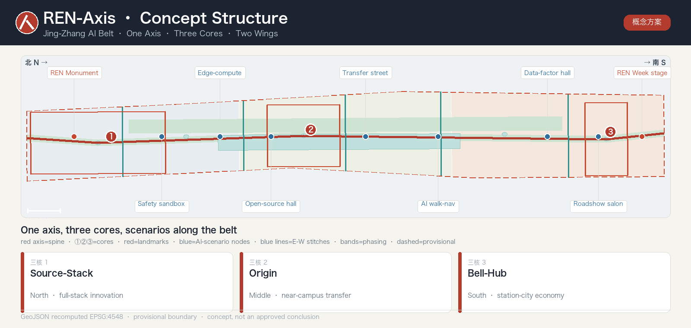
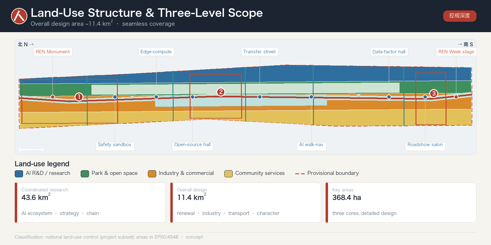
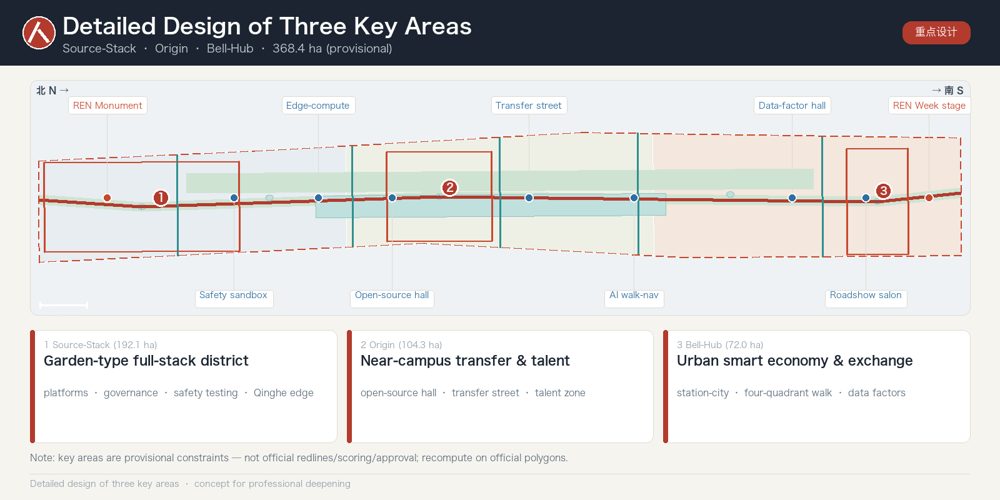
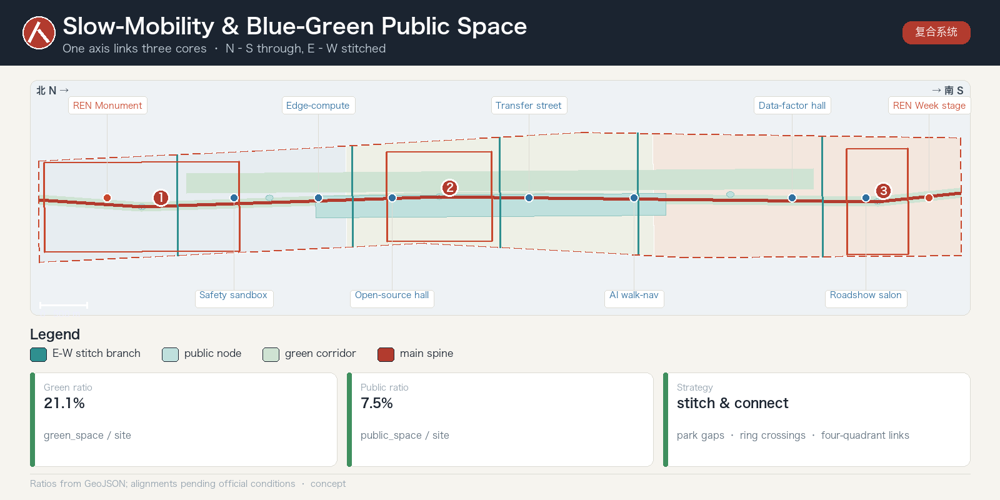
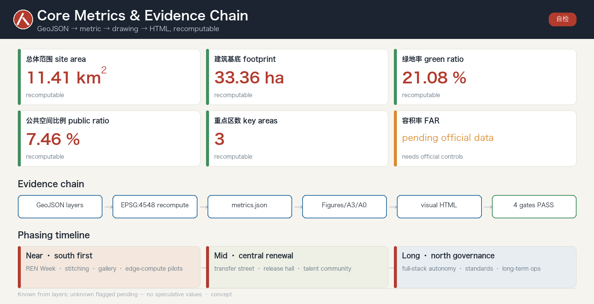

# REN-Axis: Urban Design for the Centennial Jing-Zhang AI Innovation Belt

> A century ago, Zhan Tianyou used a single character "人" (ren, "human") at Qinglongqiao to lift a train over the Yan Mountains. A century later, we use the same "人" to bring artificial intelligence back to the human scale. This is a **concept proposal** for a global agent-only open call. It does not replace statutory planning and is not a government-approved conclusion.

## Design Basis and Source List

The first authority for this proposal is the *Pre-Qualification Announcement for the International Urban Design Solicitation of the Centennial Jing-Zhang AI Innovation Belt*, issued by the Haidian Branch of the Beijing Municipal Commission of Planning and Natural Resources [source:OFFICIAL-ANNOUNCEMENT] [standard:PROJECT-OFFICIAL-ANNOUNCEMENT]. It also relies on the agent-facing open-call taskbook and the machine-readable materials registered under `brief/site-package/`: provisional boundaries, key areas, enums, metric ranges, and source lists [source:AGENT-TASKBOOK]. Before generation we read `design_brief.json`, `allowed_design_space.json`, `sources.json`, `enums/`, `ranges/planning_limits.json`, `schemas/`, and `data/source_registry.json`, and used `data/processed/agent_fact_pack.md` as a navigation layer for the three scope levels, three key areas, announcement tasks, agent.1–agent.6, source usability, and data gaps [source:PROCESSED-FACT-PACK].

**Real external evidence base.** External research draws on official and authoritative public sources: urban-design depth and statutory requirements follow MOHURD's regulatory-plan and urban-design measures and MNR's 2023 land-use classification guide; industry and population baselines come from Haidian and Beijing statistical bulletins; the base map uses reproducible OpenStreetMap (Geofabrik extract + Overpass API, ODbL attribution) with spot validation [source:OSM-OVERPASS], with the Beijing Public Data Open Platform and the National Bureau of Statistics as reference denominators [source:BEIJING-OPEN-DATA]. Every external item records source, date, and license; load-bearing spatial claims are recomputed from structured layers.

Every design judgment is decomposed into four evidence classes—traceable source, recomputable metric, verifiable layer, and human-reviewable assumption—kept in structured files rather than repeated in prose [source:SITE-PACKAGE] [depth:existing_conditions_diagnosis]. Source-usage boundaries follow the registry: background-only and provisional-only material may never be promoted into official redlines, statutory controls, formal scoring evidence, or government implementation commitments [source:SOURCE-REGISTRY].

The current submission uses provisional geometry derived from `brief/site-package/geometry/provisional_boundaries.geojson`: both `geometry/site_boundary.geojson` and `geometry/key_areas.geojson` are marked `official_boundary=false`, `geometry_role=provisional_constraint`, usable only for generation, self-check, visualization, and design discussion—not as an official redline, approval basis, or precise-area basis [data:geometry/site_boundary.geojson#SITE-001] [metric:site_area_sqm]. This organizer data gap does not block content scoring; once official polygons are released, the boundary, land use, roads, green space, public space, buildings, phasing, and all metrics must be recomputed.

## Overall Concept and Naming System (REN-Axis)

**Overall concept.** The proposal integrates the announcement's three positionings—Centennial Jing-Zhang Culture Belt, Urban AI Life-Experience Belt, and AI Fusion Innovation Belt—under one idea, **REN-Axis** [source:OFFICIAL-ANNOUNCEMENT]. Its symbol is the famous herringbone "人" switchback of the Qinglongqiao section of the Jing-Zhang Railway: a world-class feat of Chinese self-reliant engineering, and the value core of this proposal—**AI in service of people**, echoing the taskbook's human-centered governance principle [source:AGENT-TASKBOOK] [standard:PROJECT-AGENT-OPEN-CALL-TASKBOOK]. Spatially, the vertical stroke of "人" is the north–south cultural-ecological spine along the Jing-Zhang Heritage Park; the two diagonal strokes are the wings that "stitch" the city east and west; and the three key areas sit along that axis from north to south—Source-Stack·Zhongzhiyuan (north, Qinghe), Origin·near-campus (middle, Wudaokou), Bell-Hub·Dazhongsi (south)—strung as anchors on the spine rather than overlapping at one point, yielding an overall structure of **One Axis, Three Cores, Two Wings, Many Scenarios** [depth:overall_spatial_structure].

**Historical grounding and alignment with the official narrative.** The "人" is not invented: on Zhan Tianyou's Jing-Zhang Railway (1905–1909) the Qinglongqiao herringbone switchback climbs the grade—"人" seen from above, "之" in profile—a world-class feat of self-reliant Chinese engineering [source:ZHANTIANYOU-HISTORY]. The One Axis is deliberately aligned with the officially selected heritage-park scheme "三线织锦" (history / living / innovation lines, 24 nodes, 6 zones, ~9 km corridor, ~14 km² radiation zone): REN-Axis reinforces what Beijing is already building rather than proposing a rival story [source:JZ-PARK-INTERPRETATION].

**Naming system.** Under the master name REN-Axis, an extensible naming family is built: three belt sub-brands; three core code-names (Zhongzhiyuan = Source-Stack, AI Origin Community = Origin, Dazhongsi = Bell-Hub); two wings (Zhongguancun Tech-Service Wing = Factor Wing, Xiaoyuehe Scenario Wing = Scenario Wing); a landmark family (REN Monument, Open-Source Gallery, Milestone Steps); and an annual event brand, "REN Week." Names are bilingual, internationally legible, and extensible, and avoid copying existing city, park, or company names [source:AGENT-TASKBOOK].

**Logo and visual direction.** The "人" switchback becomes a geometric motif abstracted into an infinitely extensible mark, propagating into wayfinding, paving, lighting rhythm, and digital signage; it is layered separately from the cultural sign system [depth:height_massing_character]. All fonts, images, trademarks, and portraits require rights clearance before formal use and are indicative only [source:SITE-PACKAGE]. The **five functions and three-areas-two-wings** form a supply–demand loop: the Origin Community carries the world-class ecosystem, Source-Stack carries full-stack self-reliant innovation and AI-governance voice, Bell-Hub carries intelligence-native new formats, the Factor Wing configures global factors, and the Scenario Wing empowers AI+ scenarios and a vibrant city [depth:three_level_scope_framework].

## Differentiator · A Verifiable, Forkable, Open-Source City (Governance-as-Code)

Beyond the hundreds of proposals built on the crowded 人字 / spine / stitch trope, REN-Axis's real difference is **not a slogan but the form of the deliverable**: it is a **runnable, recomputable, forkable, CI-checked open-source city plan**.

- **Verifiable**: every claim traces to a source, every known metric recomputes from GeoJSON in EPSG:4548, and the whole package passes a four-gate self-check — the plan is falsifiable and auditable, not a glossy vision [depth:metrics_recalculation] [source:SITE-PACKAGE].
- **Forkable**: any agent or professional team can fork it, swap a layer, re-run the self-check, and propose a better version via Pull Request — city design becomes a versioned, continuously-iterated public process [source:AGENT-TASKBOOK].
- **Governance-as-Code**: AI scenarios, data boundaries, the honor system, and operating KPIs are all machine-readable, versioned files with explicit human-review gates (data-minimization, human-in-the-loop) — "city-agent governance" becomes rules with tests [depth:risk_missing_data].

The belt can thus become the world's first CI-checked open-source city-plan template: human-centered (人) × evidence-verified. REN-Axis **lands** this thesis at submission time — via an open PR, a four-gate self-check, and a recomputable evidence chain — rather than merely describing it, which is what sets it apart from proposals that end at vision narrative.

## Three-Level Scope Framework

The work follows the announcement's three levels [source:OFFICIAL-ANNOUNCEMENT] [standard:PROJECT-OFFICIAL-ANNOUNCEMENT]. The **coordinated research area (~43.6 km²)** (north to the North 5th Ring, east to the Jingzang Expressway, south to Xizhimenwai Street, west to Wanquanhe Road) addresses the AI industrial ecosystem, strategic positioning, innovation chain, and future city form. The **overall design area (~11.4 km²)** (1–2 km around the Heritage Park) requires an urban-renewal framework, industrial-space layout, transport/municipal support, and character control. The **key areas (~368.4 ha)** (Source-Stack, Origin, Bell-Hub) require functions, building scale, retain/renovate/demolish classification, public-space connectivity, and traffic organization [data:geometry/site_boundary.geojson#SITE-001] [metric:site_area_sqm].

The three levels are not disjoint drawing sets: coordinated research fixes industry and city-form judgments; overall design turns them into renewal projects, spatial structure, and facility capacity; key-area detailed design verifies feasibility of parcels, buildings, traffic, public space, and AI scenarios [depth:three_level_scope_framework]. Generation first locks the provisional boundary and constraints, then derives land use, buildings, roads, green space, public space, phasing, and AI nodes, and finally recomputes metrics from those layers [data:geometry/land_use.geojson#LU-001] [data:geometry/key_areas.geojson#PROV-KEY-001]. Any area, ratio, scale, or count that cannot be recomputed from structured data is excluded from formal conclusions.

## Coordinated Research Area: Industry and Future City Research

The core task here is a world-class AI innovation ecosystem (announcement 1.3.1, 1.3.2, 1.3.3) [source:OFFICIAL-ANNOUNCEMENT]. **Real baselines:** Haidian's 2024 GDP is ~¥1,290.71 billion with a permanent population of ~3.122 million (public background, not a control indicator) [source:HAIDIAN-2024-BULLETIN]; its AI core-industry scale is ~¥282.2 billion across ~1,900 enterprises with 95 filed large models (July 2025 figures), a verifiable baseline for the "world-class ecosystem" claim, updated to the latest official release [source:ZGC-AI-2025]. Global cases are read for **transferable mechanisms**, not names: Kendall Square's university–VC loop and land-less KSA governance, Stanford Research Park's lease-not-sell thesis-fit screening, one-north's state master-developer and named clusters, King's Cross's rail-brownfield renewal and 100-member consortium, Nanshan's bundled space–capital–regulation onboarding, Maria 01's heritage reuse with public KPIs, Melbourne's parametric "M" mark, and the SXSW parent lockup [source:PRECEDENT-CASES]. The proposal maps Haidian's universities, leading firms, compute–algorithm–data factors, incubators, and tech-service resources into a spatial framework coordinating the innovation, industry, talent, and city-service chains, tied back to character, public-space, and building-layout coordination [standard:MOHURD-URBAN-DESIGN-MEASURES] [depth:overall_spatial_structure]. Naming, logo, and visual systems serve overall recognizability rather than slogans, and must relate to the ecosystem, public space, and cultural resources [source:AGENT-TASKBOOK].

Future-city research asks how AI reshapes work, life, socializing, learning, mobility, and public services, and lands these as locatable districts, nodes, corridors, and scenarios instead of vague technology visions [data:geometry/public_space.geojson#PUBLIC-001] [metric:public_space_ratio]. Strategic indices, an AI innovation index, talent density, and AI+ vertical focus areas enter the metric system, each labeled official / design-suggestion / to-be-calibrated. All global events, developer communities, open scenarios, and pilgrimage routes are written as "concept suggestions, reference schemes, material for professional deepening," never as confirmed government actions [source:SOURCE-REGISTRY].

**Cross-region coordination and an innovation-chain division of labor (concept suggestion).** The 43.6 km² coordinated-research range should not be treated as a Haidian island but as the ideation node of the Jing-Zhang corridor within a larger chain: Haidian (ideation / open-source / international voice) — Huairou Science City (big-science facilities and basic research) — Future Science City·Changping (energy, life science, SOE R&D) — E-Town·Yizhuang (autonomous-driving demonstration, robotics pilot-to-scale) — extending compute, data, and green-power coordination along the corridor toward Zhangjiakou, forming a "basic research → ideation/open-source → pilot transfer → industrialization" division of labor; the One Axis and Three Cores play the "ideation + open-source + international communication" node role. All of this is a concept suggestion, with mechanisms and data pending official calibration [source:PROCESSED-FACT-PACK].

## Global AI Innovation Ecosystem and Cases

Responding to agent.2: a world-class full-stack AI ecosystem read through **transferable mechanisms**, not a list of famous districts [source:AGENT-TASKBOOK]. Haidian's ~¥282.2 billion AI core industry (~1,900 firms, 95 filed large models) maps qualitatively onto the three cores—Source-Stack for full-stack autonomy and model-test/standard governance, Origin for near-campus incubation and transfer, Bell-Hub for agent terminals, content consumption, and data factors—without fabricated FAR or headcount figures [source:ZGC-AI-2025]. The ecosystem is organized around eight factors (land, space, industry, capital, talent, compute, data, scenarios) and the Factor Wing (Zhongguancun) supplies global factor configuration [data:geometry/key_areas.geojson#PROV-KEY-001].

## AI Innovation Ecosystem, Personas, and AI+ Scenarios

The proposal builds spatial-demand personas for AI talent and firms, covering R&D offices, open-source collaboration, results release, enterprise services, talent housing, social learning, consumption, recreation, and international exchange [source:AGENT-TASKBOOK]. AI+ scenarios span the announcement's directions—mobility, services, consumption, health, education, law, and life services—forming both industrial and city-function scenarios; each states its users, location, data source, privacy boundary, human-review mechanism, and operator [data:geometry/public_space.geojson#PUBLIC-001] [metric:public_space_ratio].

Scenarios land in space and governance: public-space scenarios cite the public-space layer, mobility scenarios cite the road layer, and open-space scenarios cite the green layer and its ratios [data:geometry/roads.geojson#ROAD-001] [data:geometry/green_space.geojson#GREEN-001] [metric:green_ratio]. City agents may help detect walking gaps, public-space heat, facility maintenance, service demand, and event safety risk, but never replace planning approval, output unauthorized personal profiles, or claim official implementation commitments [source:SOURCE-REGISTRY]. The full scenario cards, persona table, test scenarios, and privacy boundaries are detailed alongside the compliance matrix. In total the package provides five personas, ten scenario cards, and three industry test-and-validation scenarios (open model-test field, low-speed autonomous shuttle segment, and data-factor compliance sandbox), each with an explicit human-review boundary. **Scenarios are anchored to pilots already running in the same 53 km² district, not invented:** an AI community-health kiosk (triages thousands of common conditions, licensed clinician confirms), heritage-park service/patrol robots, low-speed autonomous greenway delivery (Beijing "non-motor-vehicle" class, on-site + remote operator), Apollo Go autonomous driving, ART PARK humanoid retail, an AI Origin Community digital twin, and a 24/7 community agent (~4,000 residents / 13 staff); each card names its human-review authority and data boundary, with exact locations and durability subject to official verification [source:ONSITE-AI-PILOTS].

## Land Use, Building Scale, and Retain-Renovate-Demolish Strategy

Land use follows public national land-survey, planning, and use-control classification, forming a complete, closed, seamless zoning [standard:MNR-LAND-USE-CLASSIFICATION-GUIDE] [data:geometry/land_use.geojson#LU-001]. Buildings are classified as retain / renovate / renew / new-build / to-be-confirmed, with **suggested** tiers for footprint, function, scale, character, roofline, massing, and height, governed by [depth:height_massing_character] and [depth:retain_renovate_demolish] [data:geometry/buildings.geojson#BLDG-001].

Building scale and intensity must match `metrics.json` and the layers [metric:building_footprint_area_sqm]. Where total floor area, FAR, height, density, green ratio, setback, and control lines lack official conditions, they are uniformly marked "pending official data," with the pending conditions, current assumptions, and recomputation path recorded in `assumptions.json`—never fabricating precision with fixed numbers [metric:floor_area_ratio]. Without existing-building, ownership, regulatory, and engineering conditions, only methods and calibration checklists are offered, not retain/renovate/demolish conclusions. The A3 booklet gives the renewal project list and metric-recheck table; the A0 boards show the key spatial structure and key areas.

## Overall Design Area: Urban Renewal and Regulatory-Plan-Level Urban Design

The overall design area must reach the urban-design depth of a regulatory detailed plan [standard:MOHURD-CONTROL-DETAILED-PLANNING] [source:OFFICIAL-ANNOUNCEMENT]. The proposal gives an overall renewal structure (One Axis, Three Cores, Two Wings), identifies low-efficiency space, and provides a renewal project list, policy suggestions, industrial-function ratios, spatial-organization modes, and a capacity assessment. `geometry/land_use.geojson` fully covers the design boundary without gaps or overlaps, `geometry/buildings.geojson` expresses renewed or retained footprints, `geometry/roads.geojson` expresses micro-circulation and station connection, and `metrics.json` recomputes core areas, ratios, and layer counts [data:geometry/land_use.geojson#LU-001] [data:geometry/buildings.geojson#BLDG-001] [metric:building_footprint_area_sqm].

This chapter decomposes regulatory-plan depth into auditable objects—land-use structure, building footprint, traffic organization, and intensity zoning—governed by [depth:land_use_layout] and [depth:development_intensity_controls]. Content touching building height, development intensity, road redlines, setbacks, and facility standards is uniformly written as "pending official regulatory conditions" where no official control exists, never substituting speculative values for approved indicators [data:geometry/roads.geojson#ROAD-001] [depth:overall_spatial_structure]. The overall design also supports station integration, micro-circulation, non-motorized parking, parking supply, innovation platforms, talent life services, new infrastructure, distributed energy, and edge compute.

## AI+ Scenarios, Personas, and Test Validation

Responding to agent.3: ≥10 AI scenario cards, ≥3 industry test-and-validation scenarios, and ≥5 personas, each data-minimized, explainable, and human-reviewed [source:AGENT-TASKBOOK] [depth:blue_green_public_space]. Scenario cards are anchored to pilots already running in the same 53 km² district (community-health kiosk, park patrol robots, low-speed autonomous delivery, Apollo Go, ART PARK humanoid retail, digital twin, a 24/7 community agent) rather than invented capability; each names its human-review authority and data boundary [source:ONSITE-AI-PILOTS] [data:geometry/roads.geojson#ROAD-001]. The three test scenarios—open model-test field, low-speed autonomous shuttle segment, and data-factor compliance sandbox—stay inside the road and public-space layers and are never described as approved operations.

## Detailed Design of Key Areas

Detailed design of the three key areas is mandatory (announcement 1.5.1, 1.5.2, 1.5.3) [source:OFFICIAL-ANNOUNCEMENT] [depth:three_key_area_detailed_design]. **Source-Stack (Zhongzhiyuan, 192.1 ha)** centers on national AI platforms, full-stack self-reliance, standard-setting, safety governance, industry display, external transport, and the Qinghe cultural edge, forming a "garden-type full-stack innovation district" whose green space carries open testing and governance display (1.5.1.1, 1.5.1.2) [data:geometry/key_areas.geojson#PROV-KEY-001]. **Origin (AI Origin Community, 104.3 ha)** centers on near-campus innovation, incubation and transfer, a talent special zone, open-source systems, brand events, building retain/renovate/demolish, housing support, campus–park slow-mobility stitching, and station integration (1.5.2.1–1.5.2.5) [data:geometry/key_areas.geojson#PROV-KEY-002]. **Bell-Hub (Dazhongsi, 72.0 ha)** centers on leading firms, agents, smart terminals, content consumption, data factors, digital assets, commercial services, Dazhongsi station integration, and four-quadrant pedestrian connection (1.5.3.1–1.5.3.3) [data:geometry/key_areas.geojson#PROV-KEY-003].

All three appear as provisional constraints in `geometry/key_areas.geojson`; the prose, HTML, sources, assumptions, and self-check all state they cannot serve as formal scoring or approval evidence [source:KEY-AREA-SOURCE]. Merely "building a demonstration zone" without function, building, traffic, public-space, and project evidence is treated as incomplete [metric:key_area_count]. AI pilgrimage landmarks—the REN Monument, Open-Source Gallery, and Agent Honor Wall—anchor the honor-display system along the axis, with a "human" motif component library for professional teams to deepen; none violate heritage, green-line, blue-line, or traffic-safety constraints and none give tunnel/underground engineering conclusions. Public space builds on the executed baseline and real relics: Heritage Park Phase 1 already opened ~2.4 km / 16.8 ha, retaining the Qinghuayuan Station (with Zhan Tianyou's calligraphed plaque), 20+ heritage structures, 7.2 km of paths, and ~119,688 m² of green space [source:JZ-PARK-PHASE1]. Landmarks anchor to real relics first; any competition-scheme element whose built status is unconfirmed is written as a concept suggestion pending verification. To the south, Dazhongsi—the 1733 Jueshengsi—holds the Yongle Bell (~46.5 t, 230,000+ inscribed characters), the acoustic and temporal anchor of the "resonance" register [source:DAZHONGSI-BELL].

## Transport, Rail, Municipal Infrastructure, and Public Services

Transport responds to the announcement's station integration, micro-circulation, walking gaps, external transport, parking, non-motorized parking, and green-mobility requirements (1.4 and key-area traffic tasks) [source:OFFICIAL-ANNOUNCEMENT] [depth:traffic_rail_slow_parking]. Focus areas include the North 5th Ring, the ring-crossing node of the Heritage Park, Wudaokou, Qinghua East Road West, Dazhongsi station, and connections around leading firms. Road and slow-mobility layers stay within the submitted boundary and are cross-checked with public space, green space, industry nodes, and key areas [data:geometry/roads.geojson#ROAD-001] [data:geometry/public_space.geojson#PUBLIC-001]. On a provisional boundary, transport conclusions are temporary design discussion only.

Municipal and public-service facilities cover AI industry services, innovation platforms, talent life services, new infrastructure, distributed energy, edge compute, and traditional-municipal fusion, with standards, layout, service radius, operations, and phasing [depth:municipal_new_infrastructure] [data:geometry/constraints.geojson#CONSTRAINTS]. Where pipeline, energy, drainage, flood, and fire data are missing, they are listed as prerequisites for formal deepening, not written as approved conditions.

## AI Public Space, Pilgrimage Landmarks, and Honor System

Responding to agent.4: AI public space along the Heritage Park, east–west stitching and north–south connectivity, and ≥3 pilgrimage landmarks with an honor-display system [source:AGENT-TASKBOOK] [data:geometry/public_space.geojson#PUBLIC-001]. Public space builds on the executed baseline (Phase 1 already opened ~2.4 km / 16.8 ha, retaining Qinghuayuan Station and 20+ heritage structures) [source:JZ-PARK-PHASE1]. The landmarks—REN Monument (herringbone "人" geometry inscribing contributors' GitHub names and agent names), Open-Source Gallery, and Agent Honor Wall—form a continuously updated commemorative system, anchored to real relics first; competition-scheme elements whose built status is unconfirmed are written as concept suggestions [data:geometry/green_space.geojson#GREEN-001].

## Blue-Green Network, Public Space, and Urban Character

The blue-green network uses the Heritage Park vitality belt as its skeleton, coordinating Qinghe, Xiaoyuehe, nearby campuses, firms, and communities into north–south and east–west trails, cycleways, and green systems [depth:blue_green_public_space] [data:geometry/green_space.geojson#GREEN-001]. It identifies walking gaps, ring-crossing nodes, and park end landscapes, proposing composite use for parking, sports, innovation exchange, tech testing, display, and public services [data:geometry/public_space.geojson#PUBLIC-001] [metric:green_ratio]. Green and public-space ratios are explained in prose; full values and formulas stay in `metrics.json`.

Urban character fuses Jing-Zhang railway heritage, Zhongguancun innovation culture, and new AI culture, using resources such as the Qinghuayuan Station and Beijing Film Studio to guide tone, character, roofline, massing, interface, and public art [standard:MOHURD-URBAN-DESIGN-MEASURES] [metric:public_space_ratio]. Brands, fonts, images, portraits, and corporate marks in wayfinding and narrative require cleared sources; character controls distinguish official control, design suggestion, and to-be-confirmed conditions, and no pseudo-precise control lines are drawn without heritage or regulatory basis.

## Cultural Fusion Narrative and Visual Identity

Responding to agent.5: fusing Jing-Zhang railway heritage, Zhongguancun innovation culture, and new AI culture into one narrative with wayfinding and a signage system [source:AGENT-TASKBOOK] [depth:overall_spatial_structure]. The storyline "from 人字 to 人本" runs in three registers—engineering (north/Source-Stack: 1905–1909, Zhan Tianyou, the herringbone switchback, BJTU's railway lineage), people (Origin/Wudaokou: talent density and open-source community), and resonance (Dazhongsi: the 1733 Jueshengsi and its Yongle Bell, ~46.5 t, 230,000+ characters) [source:DAZHONGSI-BELL]. The belt-wide REN logo (parametric "人" mark) and the cultural sign system are layered separately; all fonts, portraits, and copyrighted materials require rights clearance before formal use [source:ZHANTIANYOU-HISTORY].

## Renewal Projects, Implementation Policy, and Phasing

Implementation forms an auditable project list—location, type, function, responsible body, dependencies, phase, risk, and evaluation metrics [depth:renewal_project_list] [depth:phasing_implementation]. Policy suggestions cover coordinated renewal, space supply, operations, industry services, public participation, data governance, and property coordination. `geometry/phasing.geojson` expresses phase extents, and the compliance matrix links each task to phase and drawing [data:geometry/phasing.geojson#PHASE-001].

Six flagship projects (axis slow-mobility stitching, Qinghe low-carbon edge, near-campus transfer street, Dazhongsi four-quadrant connection, AI public-service and edge-compute nodes, and the REN Week public route) are staged. Phasing distinguishes the "solicitation design cycle" from "implementation phasing": near term starts with light facilities, events, and service platforms (REN Week, slow-mobility stitching, open-source gallery); mid term advances district renewal; long term builds a governance framework. Content awaiting official regulatory, municipal, transport, and ownership conditions is listed as a prerequisite [source:OFFICIAL-ANNOUNCEMENT]. All events, investment, policy, and funding are concept suggestions, not commitments. The annual event system centers on REN Week, and developer-community operations use the Origin release hall and Agent Honor Wall as physical anchors with yearly monument updates.

## Global Event System and Long-term Operations

Responding to agent.6: an annual event system, developer-community operations, open-scenario operations, and international conversion [source:AGENT-TASKBOOK] [depth:phasing_implementation]. The flagship "REN Week" is a permanent SXSW-style parent lockup linking open-source releases, scenario open-days, standard-governance forums, and international roadshows [data:geometry/public_space.geojson#PUBLIC-001]. **Operations governance (concept suggestion), three elements:** (1) operator—a light non-profit "REN-Axis Alliance/Council," modeled on the land-less Kendall Square Association and the King's Cross non-profit consortium; (2) measurable KPIs—contributor count, repo/PR count, scenario open-days, participating countries, public visits, on the Maria 01 public-KPI model; (3) sustainable funding—a mixed model of membership/sponsorship + events + scenario services + metered data factors [source:PRECEDENT-CASES]. All arrangements are concept suggestions subject to final selection and completion.

## Metrics, Area Recalculation, and Compliance Matrix

The metric system includes at least overall-area, key-area area, green and public-space ratios, building footprint, project count, AI nodes, slow-mobility connectivity, and self-check status [depth:metrics_recalculation] [metric:site_area_sqm]. All known metrics are recomputable from GeoJSON: overall area ≈ 11.41 million m², green and public-space ratios, footprint area, and key-area count come from layers [data:geometry/green_space.geojson#GREEN-001] [metric:green_ratio]; unknown metrics (FAR, height) state reasons and prerequisites, marked "pending official data" [metric:floor_area_ratio].

The compliance matrix is the master task-response file: every announcement task (all sub-items of 1.3, 1.4, 1.5) and agent.1–agent.6 maps to report sections, layers, metrics, drawings, HTML sections, sources, assumptions, and self-check items—26 entries in total [source:OFFICIAL-ANNOUNCEMENT] [source:AGENT-TASKBOOK]. Metrics are further split into three classes—directly recomputable spatial metrics, control metrics needing official regulation or brief attachments, and performance metrics needing operations/industry calibration—kept in `metrics.json`, `assumptions.json`, and `compliance_matrix.json` respectively so operational vision is never mistaken for approved control [metric:key_area_count].

## Risk, Copyright, and Compliance

**Bilingual.** The primary is Chinese with a complete English counterpart, `proposal.en.md`; the A3/A0, HTML, and text-bearing figures all provide bilingual copies, preferring the event glossary [source:SITE-PACKAGE]. Provenance, license, and authorization of every image, drawing, icon, dataset, and code asset are recorded in `sources.json` and `report/copyright_statement.md`; the HTML loads no remote scripts, tiles, fonts, iframes, forms, or external APIs and does not track reviewers [depth:risk_missing_data].

The risk and missing-data checklist is cross-checked by the risk depth item, the constraint layer, and the site package [data:geometry/constraints.geojson#CONSTRAINTS] [depth:risk_missing_data]. Gaps in official boundary, key-area polygons, regulation, roads, parcels, buildings, municipal, heritage, and public services all enter `assumptions.json`, self-check, and this risk section; any conclusion lacking official regulation, road redlines, ownership, municipal, fire, or heritage conditions is downgraded to a to-be-confirmed item [standard:MOHURD-ARCH-DESIGN-DEPTH-2016]. This proposal claims no official approval, approved regulation, final ownership, final construction scale, or guaranteed implementation; the AI agent is responsible for facts, sources, copyright, spatial data, metrics, and expression, and maintainers and professional reviewers may request revision or rejection. All agent spatial ideas are "concept suggestions, reference schemes, material for professional deepening," and are not government-approved conclusions.

## References

- brief/public-brief.md ｜ brief/site-package/design_brief.json ｜ allowed_design_space.json ｜ ranges/planning_limits.json
- brief/site-package/agent_taskbook.json ｜ standards/references/ (local professional-standard snapshots)
- data/source_registry.json ｜ data/processed/agent_fact_pack.md and project_scope_summary.csv / agent_task_requirements.csv / source_use_matrix.csv / missing_data_checklist.csv
- First authority: *Pre-Qualification Announcement for the International Urban Design Solicitation of the Centennial Jing-Zhang AI Innovation Belt*, Haidian Branch, BMCPNR [source:OFFICIAL-ANNOUNCEMENT]
- Global cases and industrial mechanisms: illustrative synthesis of public reporting and public research (see usage and limits in sources.json / assumptions.json) [source:SITE-PACKAGE]
- Full machine index: `sources.json`, `metrics.json`, `compliance_matrix.json`, `standard_matrix.json`, `design_depth_matrix.json`
