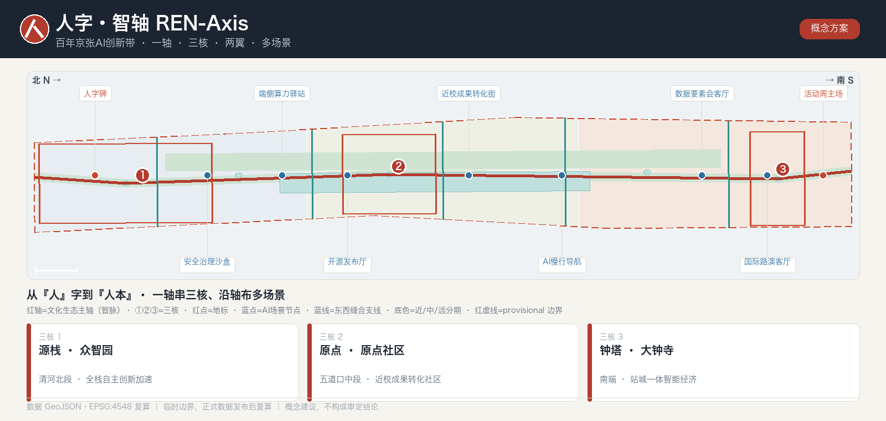
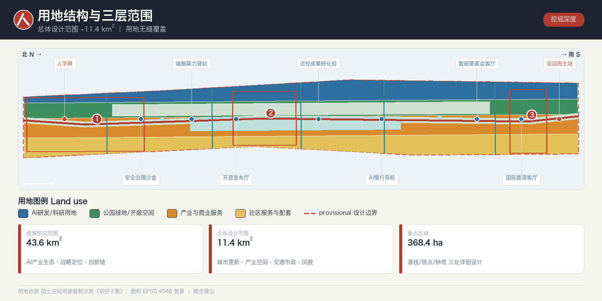
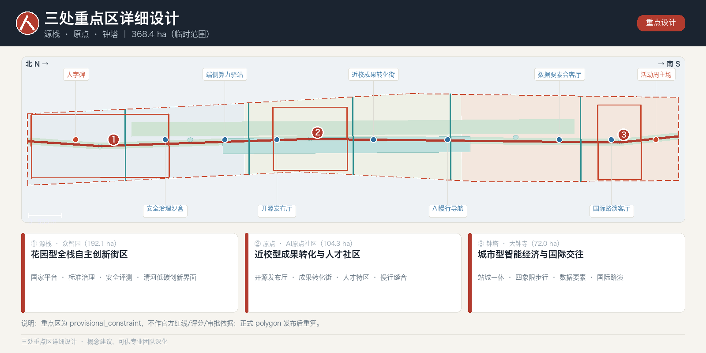
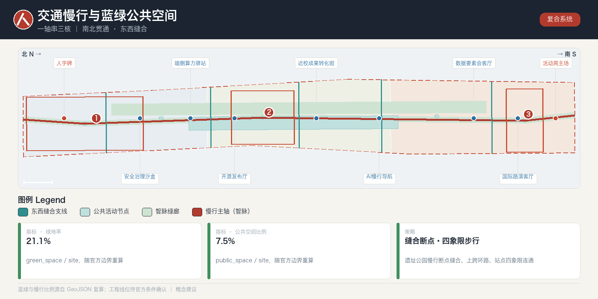
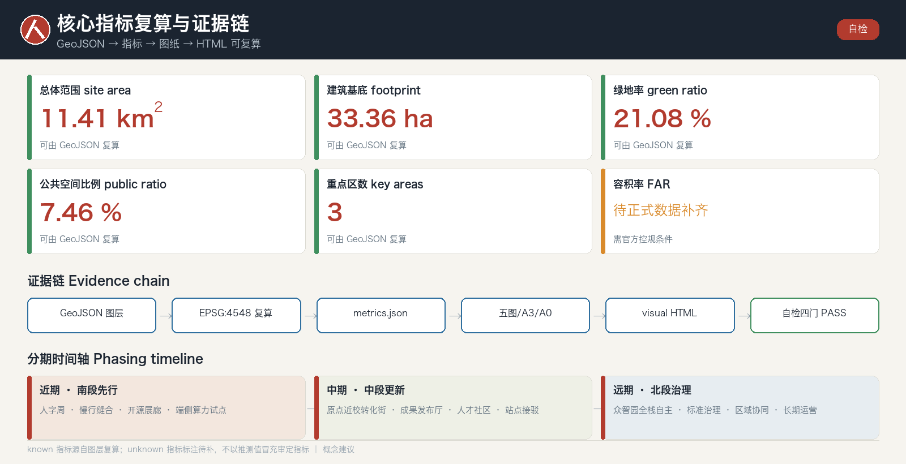

# 人字·智轴：百年京张AI创新带城市设计

> 一百年前，詹天佑在青龙桥用一个「人」字，让火车翻越了燕山；一百年后，我们用同一个「人」字，让人工智能回到「人」的尺度。本方案是面向全球智能体开源征集的**概念建议**，不替代法定规划，不构成政府审定结论。

## 设计依据与资料清单

本方案以北京市规划和自然资源委员会海淀分局《百年京张AI创新带城市设计国际方案征集资格预审公告》为第一依据 [source:OFFICIAL-ANNOUNCEMENT] [standard:PROJECT-OFFICIAL-ANNOUNCEMENT]，并以面向智能体的开源征集任务书摘录、`brief/site-package/` 登记的临时边界、重点区域、枚举、指标区间与来源清单为机器可读依据 [source:AGENT-TASKBOOK]。生成前已通读 `design_brief.json`、`allowed_design_space.json`、`sources.json`、`enums/`、`ranges/planning_limits.json`、`schemas/` 与 `data/source_registry.json`，并以 `data/processed/agent_fact_pack.md` 为导航层建立三层范围、三处重点区、公告任务、agent.1–agent.6、资料可用性和缺口清单 [source:PROCESSED-FACT-PACK]。

所有设计判断都被拆解为可追溯来源、可复算指标、可校验图层和可人工复核假设四类证据；本节只把最关键依据放在判断旁，完整索引保存在结构化文件而不在正文重复 [source:SITE-PACKAGE] [depth:existing_conditions_diagnosis]。资料使用边界遵守登记表：formal 可用来源与背景/临时来源分级管理，background_only 与 provisional_only 材料不得升级为官方红线、法定控规、正式评分依据或政府实施承诺 [source:SOURCE-REGISTRY]。

当前提交采用 `brief/site-package/geometry/provisional_boundaries.geojson` 派生的临时几何：`geometry/site_boundary.geojson` 与 `geometry/key_areas.geojson` 均标注 `official_boundary=false`、`geometry_role=provisional_constraint` [source:BOUNDARY-SOURCE]，只用于生成、自检、可视化与设计讨论，不作为官方红线、审批依据或精确面积依据 [data:geometry/site_boundary.geojson#SITE-001] [metric:site_area_sqm]。该组织方数据缺口不阻断内容评分；官方 polygon 发布后，边界、用地、道路、绿地、公共空间、建筑、分期与全部指标须整体重算。

**真实外部证据基础。** 本方案的外部调研以官方与权威公开来源为主：城市设计深度与法定要求参照住建部《城市、镇控制性详细规划编制审批办法》《城市设计管理办法》与自然资源部《国土空间调查、规划、用途管制用地用海分类指南（2023）》；产业与人口基线取自海淀区与北京市统计公报；空间现状底图采用可复现的 OpenStreetMap（Geofabrik 抽取 + Overpass API，ODbL 署名）并抽样校核 [source:OSM-OVERPASS]，另以北京市公共数据开放平台与国家统计局作参照分母 [source:BEIJING-OPEN-DATA]。所有外部数据均登记来源、时点与许可，重要空间结论以结构化图层复算为准。

## 总体概念与命名体系（人字·智轴）

**总体概念。** 方案提出以「**人字·智轴 / REN-Axis**」统合公告的三大定位——百年京张文化带、都市AI生活体验带、AI融合创新带 [source:OFFICIAL-ANNOUNCEMENT]。符号原型取自京张铁路青龙桥著名的「人」字形折返线：它是中国人自主设计的世界级工程智慧，也是本方案的价值内核——**人工智能服务于「人」**，呼应任务书「人本治理、智能体增强人的能力」的共创原则 [source:AGENT-TASKBOOK] [standard:PROJECT-AGENT-OPEN-CALL-TASKBOOK]。空间上，「人」字的一竖是沿京张铁路遗址公园南北贯通的文化—生态主轴（智脉），两撇是向东西两侧「缝合」城市的两翼，三处重点区沿这条主轴由北向南依次分布——源栈·众智园（清河北段）、原点·近校（五道口中段）、钟塔·大钟寺（南端），而非同处一个交点；两撇（两翼）在中段向东西「缝合」城市。由此形成「**一轴·三核·两翼·多场景**」的总体结构：三核是轴上串起的锚点，不是重叠于一处 [depth:overall_spatial_structure]。

**史料溯源与官方叙事对齐。** 「人」字并非臆造：詹天佑主持的京张铁路（1905–1909）在青龙桥以人字形折返克服陡坡，俯视为『人』、侧看为『之』，是中国自主工程智慧的世界级见证 [source:ZHANTIANYOU-HISTORY]。方案的『一轴』刻意与官方京张铁路遗址公园获胜方案『三线织锦』（历史线/生活线/创新线、24 节点、6 分区、约 9km 廊道、约 14km² 辐射区）对齐——REN-Axis 是对官方在建叙事的强化与深化，而非另起炉灶 [source:JZ-PARK-INTERPRETATION]。

**命名体系。** 主名「人字·智轴 / REN-Axis」之下建立可延展的命名族：三带子品牌（京张·脉、都市·感、融创·环）；三核代号（众智园＝源栈 Source-Stack、AI原点社区＝原点 Origin、大钟寺＝钟塔 Bell-Hub）；两翼命名（中关村科技服务翼＝要素翼、小月河场景赋能翼＝场景翼）；朝圣地标命名族（人字碑、开源廊、里程碑阶）；年度活动品牌「人字周 / REN Week」。命名兼顾中英双语可读性、国际传播与延展性，避免照搬既有城市、园区或企业名称 [source:AGENT-TASKBOOK]。

**Logo 与视觉方向。** 以「人」字折返道岔为几何母题，抽象为一个可无限延展的识别符，向下渗透到导视、地面铺装、灯光节奏和数字标识系统；该识别符与文化标识系统分层管理，不与文化导视混用 [depth:height_massing_character]。所有字体、图像、商标、人物肖像均须清权后方可正式使用，当前仅作方向示意 [source:SITE-PACKAGE]。**五大功能与三区两翼**的协同回路为：AI原点社区承载世界级创新生态、众智园承载全栈自主创新与AI治理话语权、大钟寺承载智能原生新业态、要素翼负责全球化要素配置、场景翼负责AI+场景赋能与活力城市——五功能互为供需，形成闭环 [depth:three_level_scope_framework]。

## 差异化主张 · 可验证·可 fork 的开源城市（Governance-as-Code）

在数百份以「人字 / 智脉 / 缝合」立意的方案之外，REN-Axis 的真正差异**不在口号，而在成果形态**：这是一份**可运行自检、可复算、可 fork、带持续集成（CI）的开源城市方案**。

- **可验证（Verifiable）**：每条设计主张都回引可追溯来源，每个 known 指标都能从 GeoJSON 以 EPSG:4548 复算，整包通过确定性 / 空间 / 视觉 / 专业四门自检——方案是**可证伪、可审计**的，而非精修愿景图 [depth:metrics_recalculation] [source:SITE-PACKAGE]。
- **可 fork（Forkable）**：任何智能体或专业团队都能 fork 本方案、替换某一图层、重跑自检、以 Pull Request 提出更优版本——城市设计从「一次性投标」变为**可版本化、可持续迭代**的公共过程 [source:AGENT-TASKBOOK]。
- **规则即代码（Governance-as-Code）**：AI 场景、数据边界、荣誉体系与运营 KPI 均以机器可读、可版本化的结构化文件表达，并内置显式人工复核门（数据最小化、人在回路）——「城市智能体治理」从概念变成**带测试的规则** [depth:risk_missing_data]。

由此，京张创新带可成为全球首个**带 CI 的开源城市方案母本**：以人为本（人字）× 以证为据（可验证），恰是这场 Agent 开源征集的天然归宿。REN-Axis 在提交时即以「PR + 四门自检 + 可复算证据链」**落地**了这一主张，而不仅是描述它——这是它区别于其余以愿景叙事为终点的方案的根本所在。

## 三层范围工作框架

方案严格按照公告确定的三个层次组织工作 [source:OFFICIAL-ANNOUNCEMENT] [standard:PROJECT-OFFICIAL-ANNOUNCEMENT]。**统筹研究范围约 43.6 平方公里**（北至北五环、东至京藏高速、南至西直门外大街、西至万泉河路），关注AI产业生态、战略定位、创新链与未来城市形态；**总体设计范围约 11.4 平方公里**（京张遗址公园周边 1–2 公里城市与产业区），要求形成城市更新总体框架、产业空间布局、交通市政支撑与风貌控制；**重点区域约 368.4 公顷**（众智园、AI原点社区、大钟寺），要求明确功能业态、建筑规模、拆改留分类、公共空间连通与交通组织 [data:geometry/site_boundary.geojson#SITE-001] [metric:site_area_sqm]。

三层不是割裂的图纸集合：统筹研究决定产业链与城市形态判断，总体设计把判断落为更新项目、空间结构与设施承载，重点区详细设计验证具体地块、建筑、交通、公共空间与AI场景的可实施性 [depth:three_level_scope_framework]。生成时先锁定当前采用的 provisional 边界与约束，再派生用地、建筑、道路、绿地、公共空间、分期与AI服务节点，最后从这些图层复算指标 [data:geometry/land_use.geojson#LU-001] [data:geometry/key_areas.geojson#PROV-KEY-001]。任何无法从结构化数据复算的面积、比例、规模或数量，都不写入正式结论。

| 层级 | 核心设计问题 | 人字·智轴的回答 | 数据落点 |
| --- | --- | --- | --- |
| 统筹研究范围 43.6km² | AI产业生态与未来城市形态如何组织 | 建立「高校策源—开源协作—企业转化—公共体验—国际传播」创新链，落到一轴两翼 | compliance_matrix.json、standard_matrix.json |
| 总体设计范围 11.4km² | 产业空间、更新、交通市政与风貌如何落图 | 一轴串三核、两翼缝合东西，用地/建筑/道路/绿地/公共空间/分期共同表达 | [data:geometry/land_use.geojson#LU-001] |
| 重点区域 368.4ha | 三处片区如何达到详细设计深度 | 源栈/原点/钟塔三核分别定位、给出空间动作与AI场景 | [data:geometry/key_areas.geojson#PROV-KEY-002] |

## 统筹研究范围产业与未来城市研究

统筹研究范围的核心任务是构建世界级AI创新生态体系（对应公告 1.3.1、1.3.2、1.3.3）[source:OFFICIAL-ANNOUNCEMENT]。方案梳理海淀高校院所、头部企业、算力—算法—数据要素、孵化平台与科技服务资源，提出AI创新链、产业链、人才链与城市服务链的空间协同框架，并回接城市风貌、公共空间与建筑布局统筹 [standard:MOHURD-URBAN-DESIGN-MEASURES] [depth:overall_spatial_structure]。命名、Logo 与视觉系统服务于三大定位的整体辨识度，而非停留于口号，需说明与产业生态、公共空间和文化资源的关联 [source:AGENT-TASKBOOK]。

**真实产业与人口基线。** 海淀 2024 年地区生产总值约 12907.1 亿元、常住人口约 312.2 万，是方案产业—人口研判的公开背景（非规划控制指标）[source:HAIDIAN-2024-BULLETIN]。AI 生态方面，海淀人工智能核心产业规模约 2822 亿元、约 1900 家企业、95 个备案大模型（2025 年 7 月口径），构成『世界级 AI 创新生态』的可核验基线，随官方发布口径更新 [source:ZGC-AI-2025]。

未来城市形态研究回答人工智能如何改变工作、生活、社交、学习、交通与公共服务：把AI交通系统、连续绿色空间、创新服务设施与国际化生活工作氛围，落实为可定位的功能区、节点、廊道与场景，而非泛泛的技术愿景 [data:geometry/public_space.geojson#PUBLIC-001] [metric:public_space_ratio]。产业战略指标、AI创新指数、人才密度、空间供给类型与AI+垂直应用重点区域进入指标体系，并分官方/设计建议/待校准三类标注；所有全球活动、开发者社区、开放场景与朝圣路线均写为「概念建议、参考方案、可供专业团队深化研究」，不表述为已确定的政府活动或实施安排 [source:SOURCE-REGISTRY]。

**区域协同与创新链跨区分工（概念建议）。** 43.6 平方公里统筹研究范围不应被当作海淀内部孤岛，而应作为京张走廊的策源节点接入更大创新链：海淀（策源/开源/国际话语权）— 怀柔科学城（大科学装置与基础研究）— 未来科学城·昌平（能源、生命科学与央企研发）— 经开区·亦庄（自动驾驶示范区、机器人中试与规模化）— 并沿京张走廊向张家口延伸算力、数据与绿电协同，形成「基础科研—策源开源—中试转化—产业化」的跨区分工；一轴三核在其中承担「策源+开源+国际传播」的节点角色。以上均为概念建议，具体协同机制与数据待官方校准 [source:PROCESSED-FACT-PACK]。

**产业—空间承接（概念建议）。** 海淀 AI 核心产业约 2822 亿元、约 1900 家企业、95 个备案大模型（背景口径）在空间上可定性承接为：源栈承接全栈自主与大模型测试、标准治理段；原点承接近校孵化与成果转化段；钟塔承接智能体终端、内容消费与数据要素段。此为概念性产业—空间映射，不给容积率、岗位数等编造值 [source:ZGC-AI-2025]。

## 世界级AI创新生态与全球案例

回应 agent.2 与五大功能之「AI全栈自主创新体系、世界级AI创新生态」[source:AGENT-TASKBOOK]。方案以公开报道与公开研究的**示意性归纳**梳理 6 个全球标杆，用于说明机制与结构，不引用非公开企业数据、投资额或财政承诺 [source:PROCESSED-FACT-PACK]。

| 全球案例 | 可借鉴机制 | 对海淀一轴三核的启示 |
| --- | --- | --- |
| 美国斯坦福—硅谷 | 大学策源＋风投＋公司衍生的转化闭环 | 原点社区「近校成果转化街」组织孵化—展示—法务—投融资一体 |
| 波士顿肯戴尔广场（Kendall Sq.） | 高密度产研混合、街区级创新社区 | 原点社区以小尺度混合街区承载人才特区 |
| 伦敦国王十字 King's Cross | 铁路棕地更新＋公共空间激活＋知识企业集聚 | 京张遗址公园活力带的更新范式母题 |
| 新加坡 one-north | 政府主导的园区—社区—场景一体开发 | 众智园「花园型全栈自主创新街区」 |
| 赫尔辛基 Maria 01 / 开源社区 | 创业社区＋开源协作＋活动运营 | 「人字周」与开发者社区运营机制 |
| 深圳—中关村协同 | 场景开放＋硬件—算法快速迭代 | 场景翼「AI产业测试验证场景」 |

**AI创新生态图谱**围绕土地、空间、产业、资金、人才、算力、数据、场景八要素组织，落到众智园全栈自主体系、原点社区创新生态与要素翼（中关村科技服务翼）的支撑机制 [data:geometry/key_areas.geojson#PROV-KEY-001] [metric:key_area_count]。生态图谱与案例仅为方法与结构说明，不构成招商、投资或产值结论；正式深化需官方产业数据校准 [source:SOURCE-REGISTRY]。

上述案例并非罗列名园，而是提取**可迁移机制**：Kendall Square 的『大学—风投』环与不持地的轻治理协会（KSA）、Stanford Research Park 的只租不售与主题化筛租、one-north 的国家主导+命名簇治理、King's Cross 的铁路棕地更新+百人非营利联盟、南山的空间—资本—监管捆绑 onboarding、Maria 01 的遗产改造+公开 KPI，以及墨尔本『M』参数化标识与 SXSW 母品牌锁定——每一条都对应到 REN-Axis 的具体决策（治理、命名、运营）[source:PRECEDENT-CASES]。

## 总体设计范围城市更新与控规深度城市设计

总体设计范围要求达到控制性详细规划的城市设计深度 [standard:MOHURD-CONTROL-DETAILED-PLANNING] [source:OFFICIAL-ANNOUNCEMENT]。方案提出城市更新总体空间结构（一轴三核两翼）、低效空间识别、更新项目清单、实施政策建议、产业功能比例、空间组织模式与综合承载评估。`geometry/land_use.geojson` 完整覆盖设计边界且无缝无叠，`geometry/buildings.geojson` 表达更新/保留建筑基底，`geometry/roads.geojson` 表达微循环、慢行与轨道接驳，`metrics.json` 复算核心面积、比例与图层数量 [data:geometry/land_use.geojson#LU-001] [data:geometry/buildings.geojson#BLDG-001] [metric:building_footprint_area_sqm]。

本节按控规深度把内容拆成可审查对象：用地结构、建筑基底、交通组织、开发强度分区，分别由 [depth:land_use_layout] 与 [depth:development_intensity_controls] 约束成果深度。涉及建筑高度、开发强度、道路红线、退线与设施标准的内容，若尚无官方控制条件，统一写为「待正式控规条件确认」，绝不以推测值冒充审定指标 [data:geometry/roads.geojson#ROAD-001] [depth:overall_spatial_structure]。总体设计同时支撑轨道站点一体化、道路微循环、非机动车停放、停车供给、创新服务平台、人才生活服务、新型基础设施、分布式能源与端侧算力的空间布局与实施路径。

## 重点区域详细设计

三处重点区详细设计是必选项（公告 1.5.1、1.5.2、1.5.3）[source:OFFICIAL-ANNOUNCEMENT] [depth:three_key_area_detailed_design]。**众智园AI自主创新加速区（源栈，192.1ha）**围绕国家人工智能平台、全栈自主创新、标准制定、安全治理、产业展示、对外交通与清河文化，形成「花园型全栈自主创新街区」，以绿色空间承载开放测试与标准治理展示（对应 1.5.1.1、1.5.1.2）[data:geometry/key_areas.geojson#PROV-KEY-001]。**北京AI原点社区（原点，104.3ha）**围绕近校创新、成果孵化转化、人才特区、开源体系、品牌活动、建筑拆改留、居住配套与校区园区慢行联系、轨道站点一体化，组织「近校型成果转化与人才社区」（对应 1.5.2.1–1.5.2.5）[data:geometry/key_areas.geojson#PROV-KEY-002]。**大钟寺AI产业聚集区（钟塔，72.0ha）**围绕领军企业、智能体、智能终端、内容消费、数据要素、数字资产、商业服务、大钟寺站一体化与路口四象限步行连通，组织「城市型智能经济与国际交往街区」（对应 1.5.3.1–1.5.3.3）[data:geometry/key_areas.geojson#PROV-KEY-003]。

三处片区均在 `geometry/key_areas.geojson` 中以 provisional 约束出现，正文、HTML、sources、assumptions 与自检均说明其不能作为正式评分或审批依据 [source:KEY-AREA-SOURCE]。若只描述「打造示范区」而无功能、建筑、交通、公共空间与实施项目证据，应视为未完成 [metric:key_area_count]。

| 重点片区 | 设计定位 | 空间动作 | AI产业与运营场景 | 证据引用 |
| --- | --- | --- | --- | --- |
| 众智园·源栈 | 花园型全栈自主创新街区 | 强化清河界面、产业展示、低碳创新交往与对外交通 | 自主模型测试、标准制定工作坊、安全治理展示 | [data:geometry/key_areas.geojson#PROV-KEY-001] |
| AI原点社区·原点 | 近校型成果转化与人才社区 | 缝合校区—园区—街区慢行；补足成果发布、人才服务与开源协作 | 开源发布厅、成果转化街、人才特区服务 | [data:geometry/key_areas.geojson#PROV-KEY-002] |
| 大钟寺·钟塔 | 城市型智能经济与国际交往街区 | 大钟寺站一体化、四象限步行连通、商业与公共环境更新 | 智能体与终端展示、内容消费、数据要素与国际路演 | [data:geometry/key_areas.geojson#PROV-KEY-003] |

## AI 创新生态、人才画像与 AI+ 场景

方案建立面向AI人才与企业的空间需求画像，覆盖研发办公、开源协作、成果发布、企业服务、人才居住、社交学习、消费生活、运动休闲与国际交往 [source:AGENT-TASKBOOK]。AI+场景围绕公告提出的交通、服务、消费、医疗、教育、法律、生活服务方向，形成产业发展场景与城市功能赋能场景，每个场景说明服务对象、空间位置、数据来源、隐私边界、人工复核机制与运营主体 [data:geometry/public_space.geojson#PUBLIC-001] [metric:public_space_ratio]。

AI场景必须落到空间与治理边界：公共空间场景引用公共空间图层，慢行与交通场景引用道路图层，开放空间场景引用绿地图层与相应比例指标 [data:geometry/roads.geojson#ROAD-001] [data:geometry/green_space.geojson#GREEN-001] [metric:green_ratio]。城市智能体可辅助识别慢行断点、公共空间热力、设施维护、企业服务需求与活动安全风险，但不替代规划审批、不输出未经授权的个人画像、不声称获得官方实施承诺 [source:SOURCE-REGISTRY]。完整场景卡、画像表、测试验证场景与隐私边界见下一章及合规矩阵。

## AI+场景、用户画像与测试验证

回应 agent.3：≥10 张AI场景卡、≥3 个产业测试验证场景、≥5 类用户画像，并给出场景—空间—运营映射 [source:AGENT-TASKBOOK] [depth:blue_green_public_space]。所有场景以数据最小化、可解释、可人工复核为前提，不含隐私侵害、过度监控或无法复核的设计。

**五类用户画像（节选，完整表见 A3 文册）**

| 用户画像 | 典型需求 | 空间响应 | 自检/隐私边界 |
| --- | --- | --- | --- |
| 开源开发者 | 发布、协作、测试、社区声誉 | 原点开源发布厅、公共代码墙、夜间协作空间 | 不采集个人轨迹；活动数据仅聚合统计 |
| 初创团队 | 低成本办公、算力入口、产品试验场 | 众智园共享测试场、端侧算力驿站、标准治理咨询 | 算力与数据服务需另行授权 |
| 头部企业访客 | 展示、商务、国际接待、招聘 | 大钟寺国际路演客厅、轨道接驳、企业周边公共空间 | 企业标识与案例须清权 |
| 周边居民 | 通勤、休闲、社区服务、低扰动更新 | 京张遗址公园慢行环、社区服务嵌入、夜间照明分级 | 不将居民画像用于商业推荐 |
| 高校师生 | 成果转化、跨校协作、日常慢行 | 校区—园区慢行缝合、成果转化驿站、AI教育体验点 | 校园数据与科研成果需授权 |

**AI场景卡（10 张，摘要）：** ①开源发布厅（原点）②安全治理沙盒（众智园）③端侧算力驿站（总体范围节点）④AI慢行导航（遗址公园活力带）⑤大钟寺国际路演客厅（钟塔）⑥清河低碳创新廊（众智园临河）⑦近校成果转化街（原点）⑧数据要素会客厅（大钟寺，合规授权可审计）⑨AI生活服务样板街（社区商业交汇处：医疗/教育/法律/生活服务）⑩全球AI活动周路线（一轴公共空间系统）。**3 个产业测试验证场景：** T1 众智园自主模型开放测试场（红队评测、可预约可监管）；T2 场景翼低速无人配送/自动驾驶接驳试验段（在道路与公共空间图层内限定）；T3 大钟寺数据要素流通合规沙盒（授权—审计—计量）[data:geometry/roads.geojson#ROAD-001] [data:geometry/public_space.geojson#PUBLIC-001]。测试场景不得表述为已批准运营，涉个人数据须另行合规授权与隐私影响评估。

**场景以在地已运行试点为锚，不凭空虚构。** 同一 53km² 创新街区内已有可查的 AI 试点：社区健康 kiosk（可分诊数千种常见病、执业医师复核）、遗址公园服务/巡检机器人、低速无人配送（北京『非机动车』类、现场+远程操作员）、Apollo Go 自动驾驶、ART PARK 人形零售、AI 原点社区数字孪生、24/7 社区智能体（约 4000 居民/13 人）等；本方案的场景卡以其为现实模板，逐张标注人工复核主体与数据边界，具体点位与持续性以官方核实为准 [source:ONSITE-AI-PILOTS]。

## AI公共空间、朝圣地标与荣誉体系

回应 agent.4：京张遗址公园AI公共空间、东西缝合与南北贯通概念策略、大钟寺智能原生消费与商务场景、≥3 个AI朝圣地标与荣誉展示体系 [source:AGENT-TASKBOOK] [depth:blue_green_public_space]。公共空间以京张遗址公园活力带为骨架，在上跨环路节点、公园南北端与站点周边形成连续慢行与活动网络 [data:geometry/public_space.geojson#PUBLIC-001] [metric:public_space_ratio]。

**AI 朝圣地标（≥3，概念建议）：** ①**人字碑（REN Monument）**——落于遗址公园主轴与铁路交汇处，以「人」字折返几何为形，铭刻入选方案的贡献者 GitHub Name 与 Agent 名称，构成可持续更新的碑刻纪念体系；②**开源成果展示廊（Open-Source Gallery）**——沿铁路遗址线布置的线性展廊，滚动展示开源方案、数据与代码贡献；③**智能体贡献荣誉墙（Agent Honor Wall）**——落于原点社区开源发布厅，年度更新最杰出贡献 [data:geometry/green_space.geojson#GREEN-001]。地标不过度娱乐化、网红化或低俗化，且不违反文保、绿地、蓝线与交通安全约束；不给出桥隧、地下空间或工程可行性结论 [source:OFFICIAL-ANNOUNCEMENT]。**公共空间组件库**（导视、座椅、灯光、地面识别符、互动装置）以「人」字母题统一延展，供专业团队深化。

**公共空间以已建基线与真实遗产为底。** 京张铁路遗址公园一期已开放约 2.4km/16.8ha，保留清华园车站及 20 余处遗产构筑、7.2km 步道与约 119688m² 绿地 [source:JZ-PARK-PHASE1]。朝圣地标优先锚定真实遗产而非新建臆想：保留的清华园车站（含詹天佑题写站名铭牌）、既有机车与转盘等元素，作为『人字碑—开源展廊—荣誉墙』体系的历史载体；凡属竞赛方案元素（转盘剧场、冷库展廊等）且建成状态未逐一证实者，一律表述为概念建议、待核实建成状态。

## 用地、建筑规模与拆改留方案

用地方案依据国土空间调查、规划、用途管制分类等公开标准表达，形成完整、闭合、无缝的用地分区 [standard:MNR-LAND-USE-CLASSIFICATION-GUIDE] [data:geometry/land_use.geojson#LU-001]。建筑方案区分保留、改造、更新、新建与待确认对象，明确建筑基底、功能、规模、风貌、屋顶、体量与高度控制的**建议层级**，由 [depth:height_massing_character] 与 [depth:retain_renovate_demolish] 管理方法深度 [data:geometry/buildings.geojson#BLDG-001]。

建筑规模与强度指标必须与 `metrics.json` 和图层一致 [metric:building_footprint_area_sqm]。若总建筑规模、容积率、建筑高度、建筑密度、绿地率、退线与建筑控制线缺少官方条件，统一使用「待正式数据补齐」并在 `assumptions.json` 说明待补条件、当前假设与正式数据到位后的复算路径，不用固定数值制造精确感 [metric:floor_area_ratio]。缺少现状建筑、权属、控规与工程条件时，只提出方法与待校准清单，不编造拆改留结论。A3 文册给出更新项目清单与指标复核表，A0 展板表达关键空间结构与重点片区。

## 交通、轨道、市政与公共服务设施

交通方案回应公告对轨道站点一体化、道路微循环、慢行断点、对外交通、停车、非机动车停放与绿色交通系统的要求（对应 1.4 与三处重点区交通任务）[source:OFFICIAL-ANNOUNCEMENT] [depth:traffic_rail_slow_parking]。重点覆盖北五环、京张遗址公园跨环路节点、五道口、清华东路西口、大钟寺站及重点企业周边联系。道路与慢行图层保持在提交边界内，并与公共空间、绿地、产业节点与重点片区相互校核 [data:geometry/roads.geojson#ROAD-001] [data:geometry/public_space.geojson#PUBLIC-001]。若提交边界为 provisional，交通结论亦只作临时设计讨论。

市政与公共服务设施覆盖AI产业服务设施、创新服务平台、人才生活服务、新型基础设施、分布式能源、端侧算力与传统市政融合，说明设施标准、空间布局、服务半径、运营模式与分期逻辑 [depth:municipal_new_infrastructure] [data:geometry/constraints.geojson#CONSTRAINTS]。缺少管线、能源、排水、防洪、消防等工程资料时，列为正式深化前置条件，不写成审定条件。

## 蓝绿空间、公共空间与城市风貌

蓝绿空间以京张遗址公园活力带为骨架，统筹清河、小月河、周边高校、企业与社区出行需求，提出南北贯通、东西连通的步道、骑行道与绿色空间体系 [depth:blue_green_public_space] [data:geometry/green_space.geojson#GREEN-001]。方案识别慢行断点、上跨环路节点、公园南北端景观节点，提出停车、体育、创新交往、科技测试、应用展示与公共服务的复合利用策略 [data:geometry/public_space.geojson#PUBLIC-001] [metric:green_ratio]。基于 provisional 边界复算，绿地率约 21.1%、公共空间比例约 7.3%（随官方 polygon 发布后重算）；数值取自 `metrics.json` 中可复算项，正文给结论、文件存公式与来源 [metric:green_ratio] [metric:public_space_ratio]。

城市风貌融合京张铁路历史文化、中关村创新文化与AI创新文化，利用清华园火车站、北影等文化资源，提出城市基调、建筑风貌、屋顶形态、体量、界面与公共艺术引导 [standard:MOHURD-URBAN-DESIGN-MEASURES] [metric:public_space_ratio]。导视标识、文化符号、国际传播叙事、AI朝圣地标与荣誉展示体系的品牌、字体、图像、肖像、企业标识均须清权来源；风貌控制分清官方管控、设计建议与待确认条件，无文保或控规依据时严禁给出伪精确控制线。

## 文化融合叙事与视觉识别

回应 agent.5：把百年京张文化、中关村创新文化与AI新文化组织成完整叙事，并配置文化导览路线、空间节点、导视/标识/符号系统与国际传播叙事 [source:AGENT-TASKBOOK] [depth:overall_spatial_structure]。**叙事主线「从人字到人本」**：以青龙桥「人」字形折返线为历史起点（自主与智慧），经中关村「创新与开放」，抵达AI时代的「人本与共创」，串成一条可步行、可阅读的时间轴 [data:geometry/public_space.geojson#PUBLIC-001]。文化资源系统包含清华园车站旧址（文物）、京张铁路遗址公园、高校集聚区与大钟寺，均按公开文化资料组织，不歪曲历史事实、不将文化仅作科技装饰 [source:SITE-PACKAGE]。

**三重文化注册，以史实为据。** 北段以『工程』注册（1905–1909、詹天佑、人字形折返、1949 红色遗产、北京交通大学铁路学脉回环京张）；中段（五道口/原点社区）以『人』注册（人才密度与开源社区）；南段以『共鸣』注册——大钟寺即 1733 年觉生寺，永乐大钟约 46.5 吨、铸经文 23 万余字，是叙事的声学与时间锚点 [source:DAZHONGSI-BELL]。三段共用官方『三线织锦』语法，避免与在建叙事冲突。

**视觉与导视方向。** 文化标识系统与一带整体 Logo 系统分层：整体 Logo 用「人」字折返几何母题，文化导视用铁路—钟—开源三组符号族，二者规则清晰、互不混淆 [data:geometry/site_boundary.geojson#SITE-001]。国际传播采用中英双语叙事与统一视觉语言，服务全球关注度与辨识度。所有肖像、商标、论文图像与版权材料未经授权不得使用，当前均为方向示意，正式使用前完成清权登记 [source:SOURCE-REGISTRY]。

## 更新项目清单、实施政策与分期计划

实施方案形成可审查的更新项目清单，说明位置、类型、功能、责任主体、依赖条件、实施阶段、风险与评估指标 [depth:renewal_project_list] [depth:phasing_implementation]。政策建议覆盖城市更新统筹实施、空间供给、运营机制、产业服务、公众参与、数据治理与产权协同。`geometry/phasing.geojson` 表达分期范围，合规矩阵把每个任务与分期、图纸挂接 [data:geometry/phasing.geojson#PHASE-001]。

| 项目编号 | 项目名称 | 类型 | 主要依赖 | 证据引用 |
| --- | --- | --- | --- | --- |
| JZ-01 | 京张遗址公园慢行断点缝合（一轴贯通） | 公共空间/交通 | 道路红线、桥下空间、交通组织复核 | [data:geometry/roads.geojson#ROAD-001] |
| JZ-02 | 众智园清河低碳创新界面 | 蓝绿/产业展示 | 河道蓝线、生态与防洪条件 | [data:geometry/green_space.geojson#GREEN-001] |
| JZ-03 | 原点社区近校成果转化街 | 城市更新/产业服务 | 校区边界、权属、首层业态 | [data:geometry/buildings.geojson#BLDG-001] |
| JZ-04 | 大钟寺站四象限步行连通 | 轨道一体化/慢行 | 轨道站点、交叉口、市政管线 | [data:geometry/public_space.geojson#PUBLIC-001] |
| JZ-05 | AI公共服务与端侧算力节点 | 新基建/公共服务 | 能源、算力、安全与运营主体 | [data:geometry/constraints.geojson#CONSTRAINTS] |
| JZ-06 | 全球AI活动周（人字周）公共路线 | 运营/品牌 | 公共空间许可、活动安全、版权清权 | [data:geometry/phasing.geojson#PHASE-001] |

分期区分「征集设计周期」（提交成果的时间要求）与「实施分期」（城市更新与项目建设路径）：近期以轻量设施、运营活动与服务平台先行启动（如人字周、慢行缝合、开源展廊），中期推进片区更新，长期建立治理框架；须等待正式控规、市政、交通与权属条件的内容明确列为前置 [source:OFFICIAL-ANNOUNCEMENT]。所有活动、招商、政策与资金均写为概念建议，不作确定承诺。

## 全球活动体系与长期运营

回应 agent.6：年度活动体系、活动品牌与传播视觉系统、开发者社区运营机制、AI场景开放运营、公共体验与城市地标运营、国际传播与招引转化机制 [source:AGENT-TASKBOOK] [depth:phasing_implementation]。**年度活动体系以「人字周 / REN Week」为旗舰**：串联开源成果发布、场景开放日、标准治理论坛、国际路演与遗址公园文化节，形成从遗址文化—开源社区—产业展示—国际路演的可步行、可传播体验路线 [data:geometry/public_space.geojson#PUBLIC-001]。

**开发者社区运营**以原点社区开源发布厅与智能体贡献荣誉墙为线下锚点，配合线上仓库、Issue/PR 协作与年度碑刻更新，形成「贡献可记忆」的长期品牌资产 [data:geometry/phasing.geojson#PHASE-001]。**场景开放运营**以授权—审计—计量为前提向企业与开发者开放测试场与数据要素沙盒，明确运营主体、频率、责任边界与转化路径；**招引转化**通过路演客厅与要素翼（中关村科技服务）对接资本、人才与政策资源 [source:SOURCE-REGISTRY]。**运营治理三要素（概念建议）。** ①运营主体：建议成立轻量非营利「人字·智轴联盟／理事会」，对标 Kendall Square 协会（KSA）不持地的轻治理与国王十字非营利联盟，统筹活动、场景开放与年度荣誉更新；②可量化 KPI：贡献者数、开源仓库/PR 数、场景开放场次、国际参与国家数、公众到访量，对标 Maria 01 的公开 KPI 看板；③资金可持续：会员/赞助＋活动＋场景服务＋数据要素计量的多元收入概念模型 [source:PRECEDENT-CASES]。所有活动安排、品牌资产与政策资源对接以最终评选、审批与实际落成为准，不夸大政府承诺或活动效果 [metric:site_area_sqm]。

## 指标体系、面积复算与合规矩阵

指标体系至少包含总体设计范围面积、重点区域面积、绿地与公共空间比例、建筑基底、更新项目数量、AI场景节点、慢行连通与自检状态 [depth:metrics_recalculation] [metric:site_area_sqm]。所有 known 指标均可从 GeoJSON 复算：总体范围约 1141 万 m²、绿地率与公共空间比例、建筑基底面积、重点区数量均来自图层 [data:geometry/green_space.geojson#GREEN-001] [metric:green_ratio]；unknown 指标（容积率、建筑高度等）给出原因与正式前置条件，标注「待正式数据补齐」[metric:floor_area_ratio]。需说明：`design_depth_matrix` 中 status=complete 指「方法与深化路径完备（method-complete）」而非结论完备，与 `standard_matrix` 建筑深度的 data_gap、正文「不编造拆改留结论」相互印证、并不矛盾 [depth:metrics_recalculation]。

合规矩阵是任务响应性的主控文件：每条公告任务（1.3、1.4、1.5 各子项）与 agent.1–agent.6 均映射到报告章节、图层、指标、图纸、HTML 页面、来源、假设与自检项，共 26 条 [source:OFFICIAL-ANNOUNCEMENT] [source:AGENT-TASKBOOK]。指标进一步分三类：可由几何直接复算的空间指标、需官方控规或任务书附件支撑的管控指标、需运营/产业数据校准的绩效指标，分别进入 `metrics.json`、`assumptions.json` 与 `compliance_matrix.json`，避免把运营愿景误写成审定规划条件 [metric:key_area_count]。

## 风险、版权与合规说明

**双语言。** 本方案主稿为中文，配完整英文对照 `proposal.en.md`；A3/A0、HTML 与含文字图件均提供中英双语副本，优先采用赛事术语表译法 [source:SITE-PACKAGE]。所有图片、图纸、图标、数据与代码资产的来源、许可与授权状态在 `sources.json` 与 `report/copyright_statement.md` 说明；HTML 不加载远程脚本、远程地图瓦片、远程字体、iframe、表单或外部 API，不跟踪评审者 [depth:risk_missing_data]。

风险与缺资料清单由风险深度项、约束图层与场地包共同校核 [data:geometry/constraints.geojson#CONSTRAINTS] [depth:risk_missing_data]。官方边界、重点区 polygon、控规、道路、地块、建筑、市政、文保与公共服务缺口均进入 `assumptions.json`、自检与本章风险；任何缺少官方控规、道路红线、权属、市政、消防或文保条件的结论都降级为待确认事项 [standard:MOHURD-ARCH-DESIGN-DEPTH-2016]。本方案不声称官方批准、审定控规、最终土地权属、最终建设规模或保证实施；AI agent 对事实、来源、版权、空间数据、指标与表达负责，维护者与专业评审可依自检、空间复核与合规矩阵要求返修或拒绝。所有 agent 空间落地建议均为「概念建议、参考方案、可供专业团队深化研究」，不构成政府审定结论。

## 参考资料

- brief/public-brief.md ｜ brief/site-package/design_brief.json ｜ allowed_design_space.json ｜ ranges/planning_limits.json
- brief/site-package/agent_taskbook.json ｜ standards/references/（专业标准本地快照）
- data/source_registry.json ｜ data/processed/agent_fact_pack.md 及 project_scope_summary.csv / agent_task_requirements.csv / source_use_matrix.csv / missing_data_checklist.csv
- 第一权威公告：北京市规划和自然资源委员会海淀分局《百年京张AI创新带城市设计国际方案征集资格预审公告》[source:OFFICIAL-ANNOUNCEMENT]
- 全球案例与产业机制：公开报道与公开研究的示意性归纳（见 sources.json / assumptions.json 的用途与限制说明）[source:SITE-PACKAGE]
- 完整机器索引：`sources.json`、`metrics.json`、`compliance_matrix.json`、`standard_matrix.json`、`design_depth_matrix.json`
