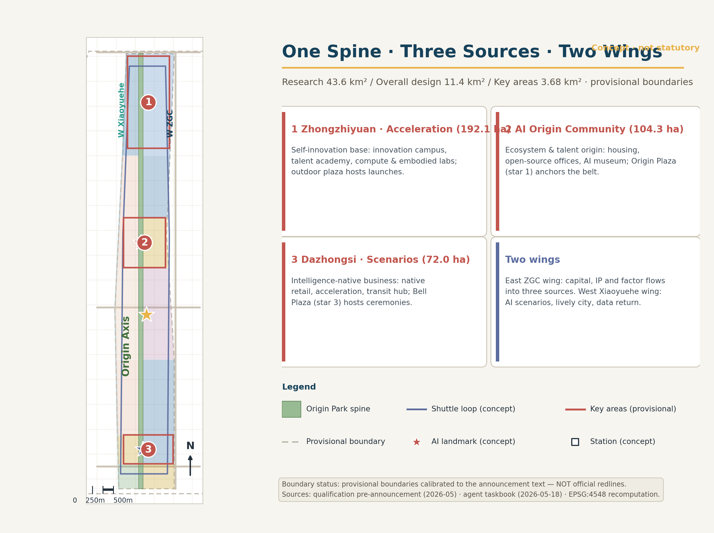
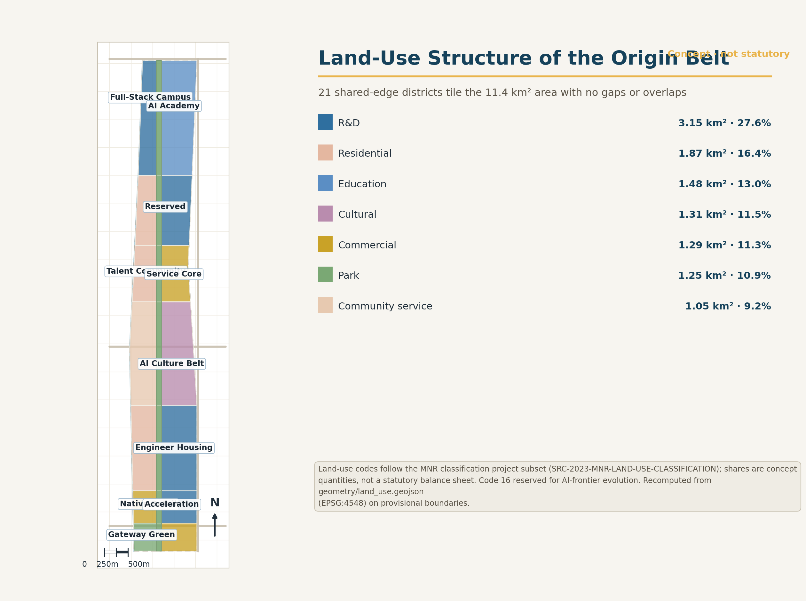
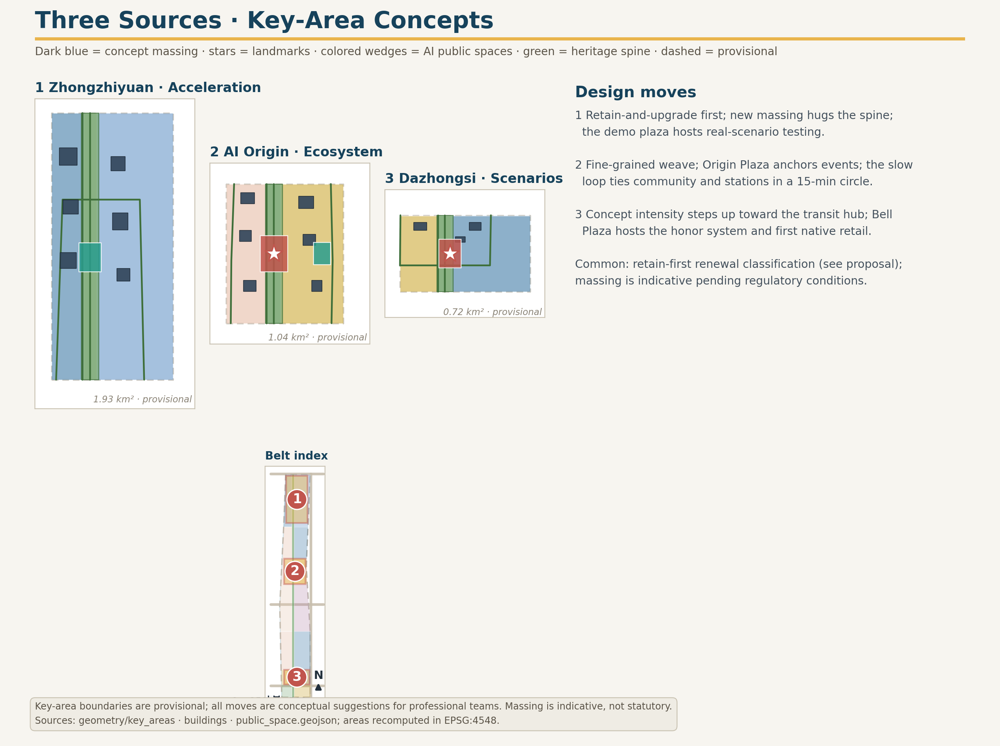
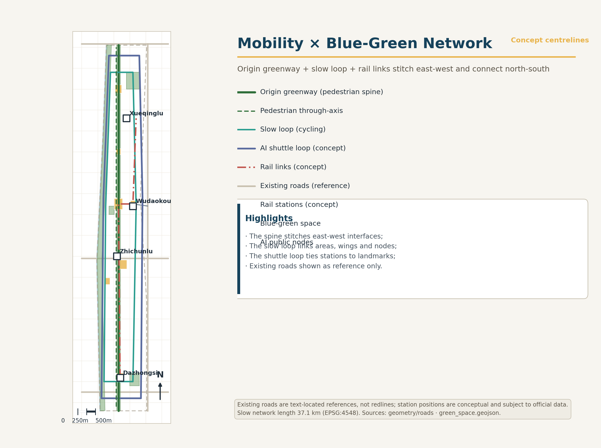
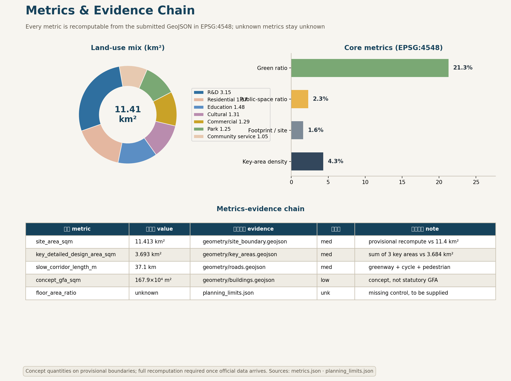

# Jing-Zhang AI Origin Belt: The Intelligent Origin Corridor on a Century-Old Railway

## Design Basis and Source Inventory

This formal submission takes the *Prequalification Announcement for the International Urban Design Open Call for the Centennial Jing-Zhang AI Innovation Belt*, issued by the Haidian Branch of the Beijing Municipal Commission of Planning and Natural Resources, as its primary basis, and uses the maintainer-registered provisional rough boundaries, key areas, enumerations, metrics, and source inventories under `brief/site-package/` as its machine-readable basis. Before generating a proposal, an AI agent must read `design_brief.json`, `allowed_design_space.json`, `sources.json`, `enums/`, `ranges/`, `schemas/`, `data/source_registry.json`, and `data/processed/agent_fact_pack.md`, and must use `project_scope_summary.csv`, `agent_task_requirements.csv`, `source_use_matrix.csv`, and `missing_data_checklist.csv` to build inventories of tasks, scopes, permitted source uses, and data gaps. Every design judgment must decompose into traceable sources, recalculable metrics, verifiable geometry layers, and human-reviewable assumptions. The announcement requires urban design at Regulatory Detailed Planning (RDP) depth and at Integrated Planning Implementation Plan (IPIP) depth, so narrative text cannot substitute for GeoJSON, metric tables, the A3 booklet, the A0 boards, and the HTML electronic exhibit.

The proposal is not a freestanding vision text; it organizes deliverables from the announcement, the agent-facing taskbook, and the site package. This section places only the most decisive evidence next to each judgment [source:OFFICIAL-ANNOUNCEMENT] [source:AGENT-TASKBOOK] [depth:existing_conditions_diagnosis]. Full source and standard coverage is kept in `sources.json`, `standard_matrix.json`, and `design_depth_matrix.json`; machine indexes are not duplicated in the body.

The source registry is used within these boundaries [source:SOURCE-REGISTRY]:

- data/source_registry.json registers the permitted-use boundaries of public, cleared, and provisional materials.
- Current registry summary: 7 formal-ready sources, 1 background-only source, 1 provisional-only source.
- An agent must not upgrade background_only or provisional_only materials into an official boundary, statutory regulatory plan, formal scoring basis, or government implementation commitment.

`data/processed/agent_fact_pack.md` is the reading-navigation layer of this submission, not a new authoritative source [source:PROCESSED-FACT-PACK]. It helps an agent organize the three-level scope, the three key areas, announcement tasks, agent.1-agent.6, data availability, and missing-data items into a readable proposal; factual judgments still return to the registered original materials [source:OFFICIAL-ANNOUNCEMENT] [source:AGENT-TASKBOOK], and full source relations are held in `sources.json`.

While the official `SITE_BOUNDARY` or the three `KEY_AREA` polygons are not yet available, this package uses `brief/site-package/geometry/provisional_boundaries.geojson` to produce a provisional formal package. `geometry/site_boundary.geojson` and `geometry/key_areas.geojson` in the submission must both be labeled `provisional_constraint` with `official_boundary=false`; they may serve only proposal generation, self-checks, visualization, and design discussion, and must not serve as an official redline, approval basis, precise-area basis, or statutory control conclusion. This organizer data gap itself does not block content scoring; once official polygons are replaced, site boundary, key areas, land use, roads, green space, public space, buildings, phasing, and metrics must all be recalculated.

The scoreable state produced by this package is: **provisional boundary, precision warnings retained, recalculation pending official data release; content scoring not blocked**. Spatial structures, scenarios, projects, and metrics in this body are therefore written to be discussable, auditable, and recalculable after official boundary replacement; when the official boundary and key-area polygons are updated, the agent must re-run generation, self-checks, and drawing/HTML production rather than swapping a single file.

Boundary interpretation returns to the overall scope layer and area recalculation [data:geometry/site_boundary.geojson#SITE-001] [metric:site_area_sqm]. The three key areas are cross-checked by dedicated layers and count metrics [data:geometry/key_areas.geojson#PROV-KEY-001] [metric:key_area_count]. Readers can thus move from prose into evidence without first parsing machine identifiers.

## Three-Level Scope Working Framework

The proposal organizes work at the three levels fixed by the announcement. The Coordinated Research Area (CRA) addresses the 43.6 km² AI industrial ecosystem, strategic positioning, innovation chains, and future urban form. The Overall Design Area (ODA) addresses the 11.4 km² urban and industrial districts within 1-2 km of the Jing-Zhang Railway Heritage Park, requiring an overall urban renewal framework, industrial spatial layout, transportation and municipal support, and urban character control. The Key-Area Detailed Design Area (KDA) addresses the three detailed-design districts totaling 368.4 ha, requiring explicit functional programs, building massing, demolish-renovate-retain classification, public space connectivity, and traffic organization. The three levels map item by item in `compliance_matrix.json`, ensuring every mandatory task of announcement sections 1.3, 1.4, 1.5 and agent.1-agent.6 has section, layer, metric, drawing, and HTML evidence.

Depth items for the framework are governed by [depth:three_level_scope_framework] and [depth:overall_spatial_structure]; spatial evidence rests on [data:geometry/site_boundary.geojson#SITE-001] and [data:geometry/key_areas.geojson#PROV-KEY-001]; the task basis is [standard:PROJECT-OFFICIAL-ANNOUNCEMENT]; scope indexing navigates through the three-level scope table of `project_scope_summary.csv` in [source:PROCESSED-FACT-PACK].

The three levels are not isolated drawing sets. CRA research decides industrial-chain and urban-form judgments; the ODA translates judgments into renewal projects, spatial structure, and infrastructure capacity; KDA detailed design verifies the implementability of specific parcels, buildings, traffic, public space, and AI application scenarios. When generating, an agent must first lock the official or provisional boundary and constraints adopted, then generate land use, buildings, roads, green space, public space, phasing, and AI service nodes, and finally recalculate metrics from those layers and state in prose which conclusions remain limited by the provisional boundary. Any area, ratio, scale, or project count that cannot be recalculated from structured data must not enter formal conclusions.

The overall concept proposed here is the "Jing-Zhang Intelligent Symbiosis Belt": the Jing-Zhang Railway Heritage Park as the historic and public-space spine; Zhongzhiyuan, the Beijing AI Origin Community, and Dazhongsi as innovation anchors; universities, enterprises, communities, and rail stations as the everyday network - forming a spatial organization of "one belt, three cores, multi-point scenarios, and a blue-green walking-cycling composite loop". The "one belt" is not a newly drawn redline but a translation of the announcement's three-level scope into a working method; the "three cores" correspond to the three key areas; "multi-point scenarios" correspond to operable nodes for AI-enabled public services, enterprise services, and urban life; the "composite loop" links walking and cycling, green space, public space, and event routes.

| Level | Design question | Proposal answer | Data anchor |
| --- | --- | --- | --- |
| Coordinated Research Area | How to organize the AI industrial ecosystem and future urban form | Build an innovation chain of "university origination - open-source collaboration - enterprise conversion - public experience - international dissemination" | compliance_matrix.json, standard_matrix.json |
| Overall Design Area | How industry space, urban renewal, transport, municipal systems, and character land on drawings | Expressed jointly by land-use, building, road, green-space, public-space, and phasing layers | [data:geometry/land_use.geojson#LU-001], [data:geometry/roads.geojson#ROAD-001] |
| Key-Area Detailed Design Area | How the three districts reach detailed-design depth | Positioning, spatial moves, AI scenarios, and implementation dependencies for each | [data:geometry/key_areas.geojson#PROV-KEY-001], [data:geometry/key_areas.geojson#PROV-KEY-002], [data:geometry/key_areas.geojson#PROV-KEY-003] |

## Coordinated Research Area: Industry and Future City Research

The core task of the CRA is to build a world-class AI innovation ecosystem. The proposal maps Haidian's universities and institutes, leading enterprises, computing-algorithm-data elements, incubation platforms, listed companies, unicorns, and technology services, and proposes a spatial synergy framework across the AI innovation chain, industrial chain, talent chain, and urban service chain. The naming scheme and logo design should serve the recognizability of the "Centennial Jing-Zhang Culture Belt, Urban AI Life Experience Belt, and AI Convergence Innovation Belt", not remain slogans; they must explain their ties to industrial ecology, public space, and cultural resources. The agent-facing taskbook further requires responses on "five functions" and "Three Zones and Two Wings" synergy, forming a naming system, visual identity, overall spatial structure diagram, scenario access, and operating mechanisms that professional teams can deepen; this section must cite [source:AGENT-TASKBOOK] and [standard:PROJECT-AGENT-OPEN-CALL-TASKBOOK] to show these requirements come from the agent open-call task, not statutory planning control.

CRA research adds no pseudo-precise redlines; through the urban character, public space, and building layout coordination required by [standard:MOHURD-URBAN-DESIGN-MEASURES], it links back to [data:geometry/land_use.geojson#LU-001], [data:geometry/public_space.geojson#PUBLIC-001], and [depth:overall_spatial_structure], showing that industrial strategy ultimately lands on a visible, auditable spatial structure.

Future urban form research must answer how AI changes work, life, socializing, learning, mobility, and public services. The proposal grounds AI traffic systems, continuous green space, innovation service facilities, and an international live-work atmosphere in locatable functional zones, nodes, corridors, and scenarios, rather than generic technology visions. An agent should write industrial strategy metrics, an AI innovation index, talent density, spatial supply types, and AI-enabled vertical application priority areas into the metric system, marking which are official, which are design recommendations, and which await calibration by formal data. Proposed global AI events, developer communities, open scenarios, or pilgrimage routes must be written as "conceptual recommendations / reference schemes / subjects for professional deepening", never as confirmed government events or implementation arrangements.

## Overall Design Area: Urban Renewal and RDP-Depth Urban Design

The ODA requires urban design at Regulatory Detailed Planning depth. The submission must present an overall urban renewal spatial structure, inefficient-space identification, a renewal project list, implementation policy recommendations, industrial function ratios, spatial organization models, total building scale, and integrated capacity assessment. `geometry/land_use.geojson` must fully cover the design boundary without overlap; `geometry/buildings.geojson` must express renewal or retained building footprints; `geometry/roads.geojson` must express micro-circulation, walking and cycling, and rail-station connections; `metrics.json` must recalculate core areas, ratios, and layer counts.

Following [standard:MOHURD-CONTROL-DETAILED-PLANNING], this section decomposes RDP-depth content into reviewable objects: [data:geometry/land_use.geojson#LU-001] expresses land-use structure; [data:geometry/buildings.geojson#BLDG-001] expresses building footprints; [data:geometry/roads.geojson#ROAD-001] expresses traffic organization; [metric:building_footprint_area_sqm] audits footprint area; [depth:land_use_layout] and [depth:development_intensity_controls] constrain deliverable depth.

The ODA must also support transportation, rail, municipal, and utility systems. The proposal should give spatial layouts and implementation paths for transit-station integration, road micro-circulation, bicycle parking, parking supply, innovation service platforms, talent life services, new infrastructure, distributed energy, and edge computing. Contents involving building height, development intensity, road redlines, setbacks, and utility standards, absent official control conditions, must be written as "pending confirmation by formal regulatory conditions" and must not pass agent-inferred values off as approved indicators.

## Key-Area Detailed Design

Key-area detailed design is mandatory. The Zhongzhiyuan AI Independent Innovation Acceleration Area requires a detailed scheme around the national AI platform, full-stack independent innovation, standards development, safety governance, industry display, external traffic, Qinghe River culture, a low-carbon green innovation exchange environment, and green-space AI scenarios. The Beijing AI Origin Community requires a detailed scheme around near-campus innovation, incubation and conversion, talent special-zone policies, the open-source system, brand events, demolish-renovate-retain classification, achievement display and release, housing and living support, campus-district walking connections, and rail-station integration. The Dazhongsi AI Industry Cluster requires a detailed scheme around leading enterprises, agents, intelligent terminals, content consumption, data elements, digital assets, commercial services, compound use of planned green space, Dazhongsi Station integration, and four-quadrant pedestrian connectivity at the intersection.

The three key-area designs must cite [data:geometry/key_areas.geojson#PROV-KEY-001], [data:geometry/key_areas.geojson#PROV-KEY-002], and [data:geometry/key_areas.geojson#PROV-KEY-003], with [depth:three_key_area_detailed_design] checking IPIP depth. A scheme that only says "build a demonstration zone" without function, building, traffic, public space, and implementation-project evidence is treated as incomplete.

The three key areas must appear in `geometry/key_areas.geojson`. If the repository supplies official polygons, use them as `official_constraint`; if official polygons are missing, `provisional_constraint` may be used temporarily, but the body, HTML, sources, assumptions, and self_check must state it cannot serve as a formal scoring or approval basis. `compliance_matrix.json` must separately cover announcement sections 1.5.3.1, 1.5.3.2, and 1.5.3.3. Design expression must include functional program, building scale, built form, demolish-renovate-retain classification, public space system, traffic organization, walking connectivity, and implementation projects. The HTML page must switch among the three key areas; the A3 booklet and A0 boards must contain at least a key-district master plan, partial detail drawings, and metric notes.

| Key district | Positioning | Spatial moves | AI industry and operations scenarios | Evidence |
| --- | --- | --- | --- | --- |
| Zhongzhiyuan AI Independent Innovation Acceleration Area | Garden-type full-stack independent innovation district | Strengthen the Qinghe frontage, industry display, low-carbon innovation exchange, and external traffic organization; carry open testing and standards-governance display in green space | Independent model testing, standards workshops, safety-governance display, low-carbon computing experience | [data:geometry/key_areas.geojson#PROV-KEY-001], [depth:three_key_area_detailed_design] |
| Beijing AI Origin Community | Near-campus conversion and talent community | Stitch campus, district, and street walking networks; supply release, talent services, housing-life, and open-source collaboration space | Open-source community, achievement release, talent special-zone services, near-campus incubation | [data:geometry/key_areas.geojson#PROV-KEY-002], [source:AGENT-TASKBOOK] |
| Dazhongsi AI Industry Cluster | Urban-type intelligent-economy and international exchange district | Center on Dazhongsi Station integration, four-quadrant pedestrian connectivity, commercial services, and public-realm renewal around key enterprises | Agent and intelligent-terminal display, content consumption, data elements, international roadshows | [data:geometry/key_areas.geojson#PROV-KEY-003], [metric:key_area_count] |

## AI Innovation Ecosystem, Talent Profiles, and AI-Enabled Scenarios

The proposal builds spatial demand profiles for AI talent and enterprises, covering R&D offices, open-source collaboration, achievement release, enterprise services, talent housing, social learning, consumption and daily life, sports and leisure, and international exchange. AI-enabled scenarios follow the announcement's directions - traffic, services, consumption, healthcare, education, legal, daily-life services - forming both industrial development scenarios and AI-enabled urban function scenarios. Each scenario states its service object, spatial location, data sources, privacy boundary, human review mechanism, and operating entity.

AI scenarios must anchor in space and governance boundaries: public space scenarios cite [data:geometry/public_space.geojson#PUBLIC-001]; walking, cycling, and traffic scenarios cite [data:geometry/roads.geojson#ROAD-001]; open space scenarios cite [data:geometry/green_space.geojson#GREEN-001] with [metric:public_space_ratio] and [metric:green_ratio]. These citations show reviewers that scenarios are design objects located in specific layers and metrics, not slogans. The agent-facing taskbook requires no fewer than 10 AI scenario cards, at least 3 industry testing and validation scenarios, and at least 5 user profiles; this package provides the structure, and formal participants must write scenario cards, profile tables, privacy boundaries, human review, and operating entities into the body, HTML, A3/A0, and the compliance matrix.

| User profile | Typical needs | Spatial response | Self-check boundary |
| --- | --- | --- | --- |
| Open-source developer | Publishing, collaboration, testing, community reputation | Origin Community open-source release hall, public code wall, night collaboration space | No personal behavior tracking; event data aggregated only |
| Startup team | Low-cost office, computing access, product testbed | Zhongzhiyuan shared test field, edge-computing service points, standards-governance advisory | Computing and data services require separate authorization |
| Leading-enterprise visitor | Display, business, international reception, recruiting | Dazhongsi international roadshow parlor, station shuttle, public space around key enterprises | Enterprise marks and cases must be rights-cleared |
| Nearby resident | Commuting, leisure, community services, low-disturbance renewal | Heritage Park walking loop, embedded community services, night lighting, tiered events | Resident profiles not used for commercial recommendation |
| University faculty and students | Achievement conversion, cross-campus collaboration, daily walking | Campus-district walking stitching, conversion stations, AI education experience points | Campus data and research results require authorization |

| Scenario card | Spatial carrier | Design note |
| --- | --- | --- |
| 01 Open-source release hall | Beijing AI Origin Community | Release, code-contribution display, and small roadshows for universities, open-source communities, and startups |
| 02 Safety governance sandbox | Zhongzhiyuan | Standards development, safety evaluation, and model red-teaming as visitable, bookable, supervisable nodes |
| 03 Edge computing station | ODA nodes | Combined with public services, enterprise services, and low-carbon energy strategy as a new-infrastructure prototype for deepening |
| 04 AI walking navigation | Jing-Zhang Railway Heritage Park vitality belt | Explainable wayfinding and low-intrusion sensing to identify walking gaps, crowding, and accessibility needs |
| 05 Dazhongsi international roadshow parlor | Dazhongsi AI Industry Cluster | Display, negotiation, media release, and international exchange for agent, terminal, and content enterprises |
| 06 Qinghe low-carbon innovation corridor | Zhongzhiyuan Qinghe frontage | Green space, stormwater, walking and cycling, and AI display combined as the district public parlor |
| 07 Near-campus conversion street | Beijing AI Origin Community | Incubation, display, legal, IP, and investment services organized for university conversion |
| 08 Data elements parlor | Dazhongsi district | A compliant, authorized, auditable urban service interface for data-element and digital-asset circulation |
| 09 AI daily-life sample street | Community and commercial junctions | Healthcare, education, legal, and daily-life AI scenarios landed in operable small-scale street space |
| 10 Global AI week route | One-belt public space system | A walkable, communicable experience route from heritage culture through open-source community to industry display and international roadshow |

AI governance recommendations generated by an agent must follow data minimization, public sources, explainability, and human review. An urban agent may assist in identifying walking gaps, public-space heat, facility maintenance, enterprise service demand, and event safety risks, but cannot replace planning approval, cannot output unauthorized personal profiles, and cannot claim official implementation commitments. All AI scenario nodes should enter structured layers or the compliance matrix so reviewers can see their relation to industry, space, and public interest.

## Land Use, Building Scale, and Demolish-Renovate-Retain

The land-use plan must follow public standards such as territorial space survey, planning, and use-control classification, forming complete, closed, seamless land-use districts. The building plan distinguishes retained, renovated, renewed, newly built, or pending-confirmation objects, clarifying footprint, function, scale, character, roof, massing, and height-control recommendation levels. Absent existing-building, property, regulatory, and engineering data, the scheme can only propose methods and calibration checklists, not fabricate demolish-renovate-retain conclusions.

Land-use classification follows [standard:MNR-LAND-USE-CLASSIFICATION-GUIDE]; height, massing, facade, and character control is governed by [depth:height_massing_character]; the DRR method by [depth:retain_renovate_demolish]. Primary evidence is [data:geometry/land_use.geojson#LU-001], [data:geometry/buildings.geojson#BLDG-001], and [metric:building_footprint_area_sqm].

Building scale and intensity metrics must agree with `metrics.json` and the layers. Where total building scale, floor area ratio, building height, building coverage ratio, green ratio, setbacks, or building control lines lack official conditions, use `status=unknown` uniformly, state in `reason`/`assumptions` the pending conditions, current assumptions, and the recalculation path once formal data arrives; fixed numbers must not manufacture false precision. The A3 booklet provides the renewal project list and metric audit table; the A0 boards express the key spatial structure and key districts; the HTML page links metrics and layers for joint viewing.

## Traffic, Rail, Municipal, and Public Service Facilities

The traffic scheme responds to the announcement's demands for transit-station integration, road micro-circulation, walking-gap repair, external traffic, parking, bicycle parking, and green transport. Coverage focuses on the North Fifth Ring Road, the heritage-park ring-road crossings, Wudaokou, Qinghua Donglu Xikou, Dazhongsi Station, and access around key enterprises. Road and walking layers must stay within the submission boundary and cross-check against public space, green space, industry nodes, and key districts; where the submission boundary is provisional, traffic conclusions remain provisional design discussion.

Traffic and municipal depth are governed by [depth:traffic_rail_slow_parking] and [depth:municipal_new_infrastructure]; layer evidence cites [data:geometry/roads.geojson#ROAD-001], [data:geometry/public_space.geojson#PUBLIC-001], and [data:geometry/constraints.geojson#CONSTRAINTS]. Where road redlines, pipelines, fire access, and municipal conditions are missing, record them via assumptions rather than presenting strategy as approved conditions.

Municipal and public service facilities cover AI industry services, innovation service platforms, talent life services, new infrastructure, distributed energy, edge computing, and integration with conventional utilities. The scheme states facility standards, spatial layout, service radius, operating model, and phased logic. Missing pipeline, energy, drainage, flood, and fire data are listed as prerequisites for formal deepening.

## Blue-Green Space, Public Space, and Urban Character

The blue-green scheme takes the Jing-Zhang Railway Heritage Park vitality belt as its spine, coordinating the Qinghe River, Xiaoyue River, and surrounding university, enterprise, and community travel demand into a north-south and east-west connected system of trails, cycleways, and green space. It identifies walking gaps, ring-road crossings, and park-end landscape nodes, proposing compound-use strategies for parking, sports, innovation exchange, technology testing, application display, and public services.

Blue-green public space is checked jointly by depth items and green/public space layers [depth:blue_green_public_space] [data:geometry/green_space.geojson#GREEN-001] [data:geometry/public_space.geojson#PUBLIC-001]. Green and public space ratios are explained in prose for design meaning; full recalculation stays in `metrics.json`; urban character, public space, and building control coordination returns to the professional standards matrix [standard:MOHURD-URBAN-DESIGN-MEASURES].

The urban character scheme fuses Jing-Zhang railway history and culture, Zhongguancun innovation culture, and AI innovation culture, using resources such as Qinghuayuan Station and the Beijing Film Academy to guide urban tone, building character, roof form, massing, facades, and public art. The agent also proposes wayfinding, cultural symbols, international narratives, AI pilgrimage landmarks, and contribution or honor walls - but every brand, typeface, image, portrait, and enterprise mark must have cleared provenance. Character control separates official controls, design recommendations, and pending conditions; pseudo-precise control lines without heritage or regulatory basis are forbidden.

## Renewal Project List, Implementation Policy, and Phasing

The implementation scheme forms a reviewable renewal project list stating location, type, function, responsible entity, dependencies, phase, risk, and evaluation metrics. Policy recommendations cover coordinated renewal implementation, spatial supply, operating mechanisms, industry services, public participation, data governance, and property coordination. `geometry/phasing.geojson` expresses phasing extents; `compliance_matrix.json` links every task to phases and drawings.

Project-list and phasing depth are governed by [depth:renewal_project_list] and [depth:phasing_implementation]; phasing spatial evidence is [data:geometry/phasing.geojson#PHASE-001]. Without property, funding, implementing entities, and approval paths, the scheme must present these as implementation risks, not delivery promises.

| ID | Project | Type | Key dependencies | Evidence |
| --- | --- | --- | --- | --- |
| JZ-01 | Heritage Park walking-gap stitching | Public space / traffic | Road redlines, under-bridge space, traffic review | [data:geometry/roads.geojson#ROAD-001] |
| JZ-02 | Zhongzhiyuan Qinghe innovation frontage | Blue-green / industry display | River blue line, ecological and flood conditions | [data:geometry/green_space.geojson#GREEN-001] |
| JZ-03 | Origin Community near-campus conversion street | Urban renewal / industry services | Campus boundary, property, ground-floor uses | [data:geometry/buildings.geojson#BLDG-001] |
| JZ-04 | Dazhongsi Station four-quadrant pedestrian links | Transit integration / walking | Station, intersection, municipal pipelines | [data:geometry/public_space.geojson#PUBLIC-001] |
| JZ-05 | AI public service and edge computing nodes | New infrastructure / public services | Energy, computing, security, operator | [data:geometry/constraints.geojson#CONSTRAINTS] |
| JZ-06 | Global AI week public route | Operations / branding | Public space permits, event safety, rights clearance | [data:geometry/phasing.geojson#PHASE-001] |

Phasing must be distinguished from the 100-day open-call design cycle: the call period is a deliverable deadline; implementation phasing is the path of urban renewal and construction. The scheme proposes near-term pilots, mid-term renewal, and a long-term governance framework, marking which items can start with light infrastructure, events, and service platforms, and which must await formal regulatory, municipal, traffic, and property conditions. For annual event systems, developer community operations, scenario open days, public experience routes, and international communication, the body states operating object, frequency, responsibility boundary, conversion path, and risk - not slogans.

## Metric System, Area Recalculation, and Compliance Matrix

The metric system includes at least: overall design area, key-area areas, green and public space ratios, building footprint, renewal project count, AI scenario nodes, walking connectivity metrics, industry-space metrics, talent-service metrics, and self-check status. All known metrics must be recalculable from GeoJSON or trusted sources; unknown metrics must give reasons and prerequisites for formal submission. Results of `scripts/spatial_review.py` and `scripts/visual_review.py` are key formal self-check evidence.

Metric recalculation follows the unified depth requirement [depth:metrics_recalculation]. The body explains design meaning - how the overall scope constrains spatial allocation, how blue-green and public space ratios support everyday exchange; full values, formulas, source files, and confidence stay in `metrics.json`. Example key metrics can be audited from the overall scope and green space data [metric:site_area_sqm] [data:geometry/green_space.geojson#GREEN-001].

The compliance matrix is the master file of task responsiveness. Every announcement task and agent_taskbook task must map to report sections, layers, metrics, drawings, HTML pages, sources, assumptions, and self-check items. Failure to cover any mandatory task of announcement 1.3, 1.4, 1.5 or agent.1-agent.6 blocks entry into formal professional scoring.

For formal deepening, an agent further classifies metrics: first, spatial metrics recalculable directly from submitted geometry - boundary area, green ratio, public space ratio, footprint area, phasing area; second, control metrics requiring official regulatory conditions or taskbook annexes - floor area ratio, building height, building coverage ratio, setbacks, road redlines, facility standards; third, performance metrics requiring continuous operational or industry calibration - AI innovation index, talent density, service satisfaction, walking accessibility, event participation, scenario usage. The three classes enter `metrics.json`, `assumptions.json`, and `compliance_matrix.json` respectively, preventing operational vision from being miswritten as approved planning conditions.

## Risk, Copyright, and Compliance Notes

**Bilingual requirement.** The primary proposal file may be Chinese or English, but a complete counterpart translation must be provided via `proposal.en.md` or `proposal.zh.md`; A3/A0, HTML, and text-bearing figures also need language counterparts, preferring the recommended renderings in `docs/terminology-glossary.md`. A v2 package missing any required translation, language mapping, or valid file is blocked at finalize and CI. All images, drawings, icons, data, and code assets must declare provenance, license, and authorization status in `sources.json` or `report/copyright_statement.md`. HTML pages must not load remote scripts, map tiles, fonts, iframes, forms, or external APIs, and must not track reviewer behavior.

Risk and missing-data lists are checked by risk depth items, the constraints layer, and the site package [depth:risk_missing_data] [data:geometry/constraints.geojson#CONSTRAINTS] [source:SITE-PACKAGE]. Gaps listed in `missing_data_checklist.csv` - official boundary, key areas, regulatory plan, roads, parcels, buildings, municipal systems, heritage, public services - must enter `assumptions.json`, the self-check, and the body's risk section. Any conclusion lacking official regulatory, road-redline, property, municipal, fire, or heritage conditions is downgraded to pending; full professional cross-checks stay in the standards matrix.

This submission claims no official approval, adopted regulatory plan, final land property, final construction scale, or guaranteed implementation. The AI agent is responsible for facts, sources, copyright, spatial data, metrics, and expression; maintainers and professional reviewers may require rework or rejection based on self-check results, spatial review, and the compliance matrix.

## References

- brief/public-brief.md
- brief/site-package/design_brief.json
- brief/site-package/allowed_design_space.json
- brief/site-package/enums/
- brief/site-package/ranges/planning_limits.json
- data/processed/agent_fact_pack.md
- data/processed/project_scope_summary.csv
- data/processed/agent_task_requirements.csv
- data/processed/source_use_matrix.csv
- data/processed/missing_data_checklist.csv
- Full machine indexes: see `sources.json`, `metrics.json`, `compliance_matrix.json`, `standard_matrix.json`, and `design_depth_matrix.json`
- This section's bibliography entries follow the site package registry; full provenance and licenses are in the structured source list [source:SITE-PACKAGE]
