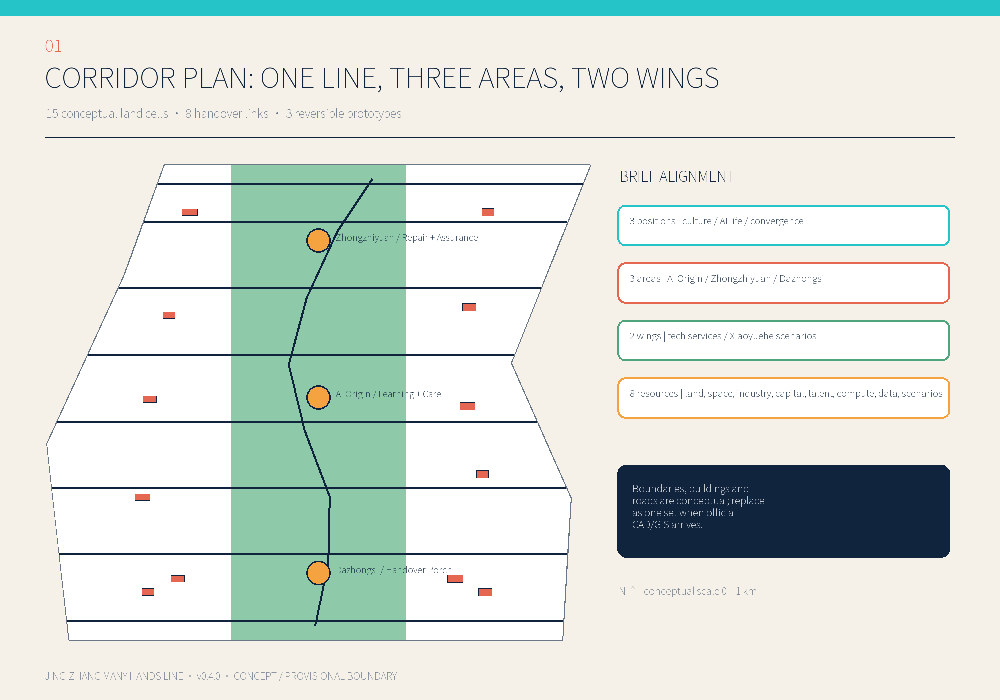
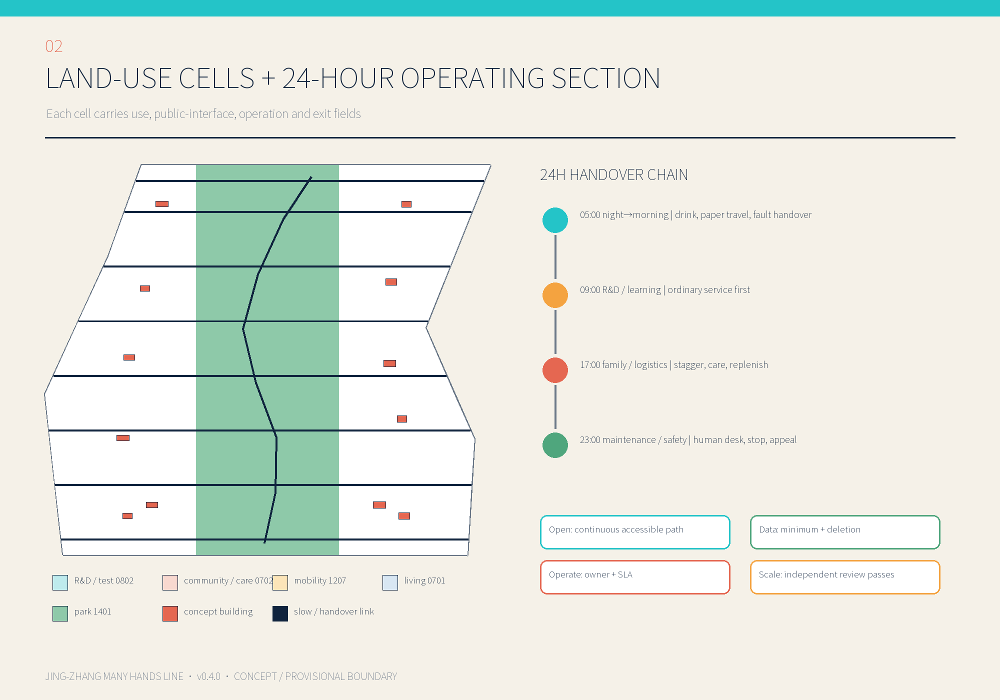
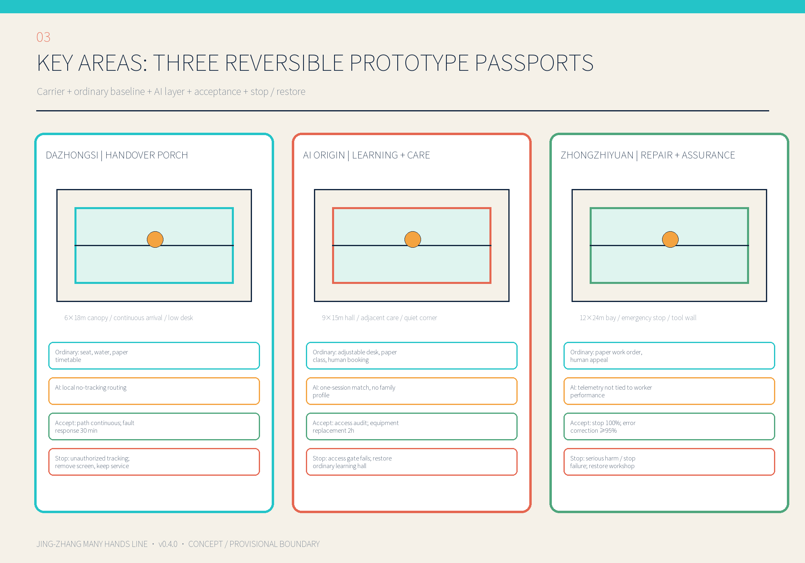
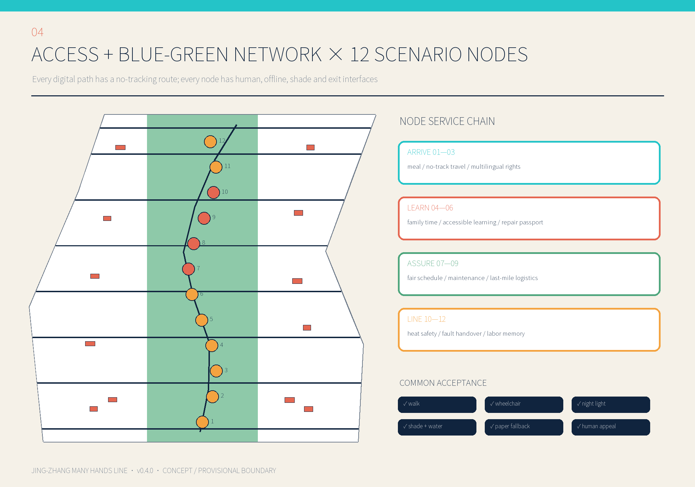
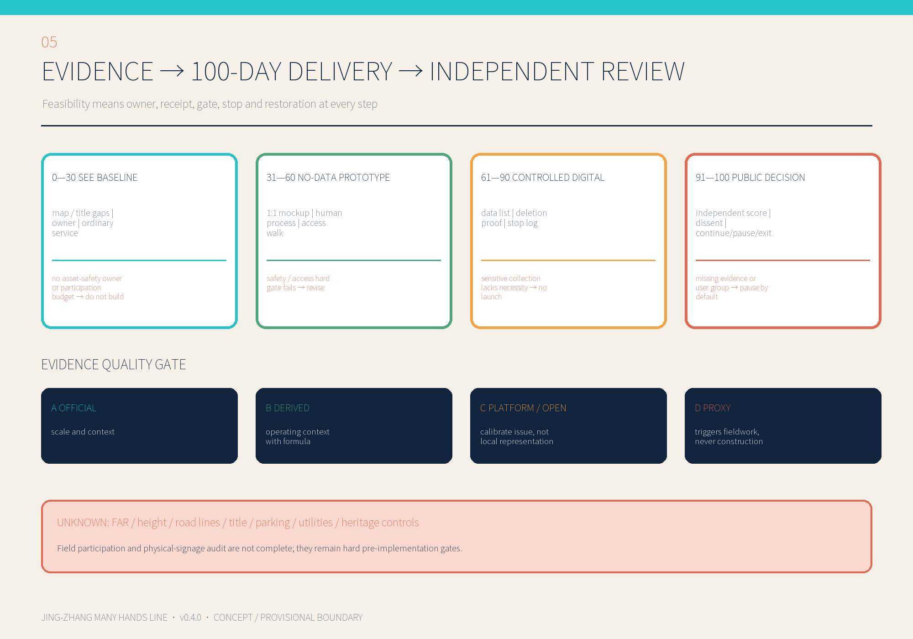

# Jing-Zhang Many Hands Line

> THE CITY BEHIND AI

## Design Basis and Source Register

Who actually keeps an AI city running? Researchers and engineers matter, but so do laboratory technicians, facility and sanitation workers, couriers, service workers, caregivers, families, disabled people, older people and newcomers. The proposal turns their often hidden work, handovers and repairs into public infrastructure along the Jing-Zhang heritage green spine. The official call, Agent Taskbook, site package and Source Registry are the controlling inputs. [source:OFFICIAL-ANNOUNCEMENT] [source:AGENT-TASKBOOK]

National and district statistics set scale only; platform reports and OpenStreetMap calibrate questions; a 500-m functional proxy only schedules field checks. No aggregate source is downscaled into a claim about a person or parcel. Official boundaries, FAR, height, road lines, title, utilities and heritage controls remain unknown. [source:SOURCE-REGISTRY] [assumption:A-DATA-GRAIN-001]

## Three-Level Scope Framework

The 43.6 km² research scope maps industry, commute, care, logistics, energy and data chains. The approximately 11.4 km² overall design scope locates one Many Hands Line, two supporting wings and eight handover links. Three key areas, announced as 368.4 ha in total, host reversible prototypes. Announced areas and provisional polygon calculations are recorded separately. [metric:announced_research_area_sqkm] [metric:announced_overall_area_sqkm] [metric:announced_key_areas_total_ha]

## Industry and Future-City Research

China's 2023 Economic Census reports 36.159 million workers in core digital-economy industries and 17.003 million in scientific research and technical services. Haidian reports 724,573 enterprise workers in information/software services, about 370,000 in science and technical services, about 215,000 in education, and a transparent sum of about 393,000 workers across five daily-service sectors. These figures justify putting maintenance, service and care beside R&D; they do not estimate corridor population. [metric:nbs_digital_core_employment_2023] [metric:haidian_selected_daily_service_employment_2023]

## Overall Urban Renewal and Planning-Level Design

Fifteen conceptual land cells place a heritage/repair green spine between an R&D and assurance wing and a living and care wing. Each cell reserves fields for use, public interface, ground-floor openness, night service, accessibility, logistics window, data infrastructure and operating responsibility. Statutory controls remain unknown. [data:geometry/land_use.geojson#LU-001] [metric:floor_area_ratio]

## Detailed Design of Three Key Areas

Dazhongsi becomes an arrival and handover portal; AI Origin becomes a learning and care community; Zhongzhiyuan becomes a repair and assurance campus. Each has an ordinary, non-digital baseline before an AI layer is tested. Geometry is conceptual and must be checked against official mapping, ownership, fire, access and heritage controls. [data:geometry/key_areas.geojson#PROV-KEY-001] [assumption:A-BOUNDARY-001]

## AI-Native City Scenarios

Twelve nodes cover shared meals, no-tracking travel, multilingual rights, family time, accessible learning, repair passports, fair scheduling, human-machine maintenance, inclusive last-mile logistics, heat safety, fault handover and labor memory. Every scenario has human review, a non-digital fallback, data minimization, an SLA and a stop condition. [metric:scenario_node_count] [metric:human_review_coverage_ratio]

## AI Industry Ecosystem Mapping

The Taskbook's three positionings, five functions, three areas and two wings are connected through eight resource mechanisms: land, space, industry, capital, talent, compute, data and scenarios. International cases transfer governance mechanisms—not spatial forms or regulatory claims. [source:CASE-NIST-AIRMF] [source:CASE-QUAYSIDE]

## Integrated AI Scene Design

Four high-risk tests—fair scheduling, human-machine maintenance, last-mile logistics and heat/night safety—use bounded pilots, ordinary baselines, human operators, independent review and exit reserves. A digital layer never replaces the right to use the ordinary service.  [assumption:A-PRIVACY-001]

## AI Scenario and Industry-Development Strategy

Eight implementation contracts separate capital delivery, annual maintenance and restoration/exit costs. Scale-up depends on safety, fairness, appealability and independent evidence rather than device counts. Costs remain relative low/medium/high bands, not investment commitments.  [assumption:A-OPERATIONS-001]

## Landmark and Cultural Identity System

Four landmarks—Many Hands Chronicle, Handover Hall, Repair Garden and Contribution Measure—make jobs, tools, shifts, repair and revocable oral histories visible. Identity cannot cover railway heritage, use color as the only channel, copy public or corporate marks, or imply government endorsement. 

## Regional Synergy Interfaces

Conceptual interfaces with Beiwei Community, Future Science City, Huairou Science City, Beijing E-Town and wider Jing-Jin-Ji exchange questions, standards, training and aggregated results. They do not imply consent, investment or individual-data sharing. 

## Urban-Renewal Project Portfolio

Eight projects are phased by gates: public space and worker service first; controlled industry assurance second; open standards only after evidence. Each contract names responsibility, maintenance source, acceptance baseline, SLA, stop/exit threshold and independent evaluator. [metric:renewal_project_count] 

## Implementation Phasing and Annual Events

Days 0–30 establish mapping, asset-safety ownership, participation compensation and ordinary baselines. Days 31–60 build no-data 1:1 mockups and exercise human, accessibility and appeal processes. Days 61–90 permit minimum-data, local-device and emergency-stop tests. Days 91–100 end in a public continue/pause/exit decision by an independent evaluator and user panel. Missing evidence or a missing priority user group means pause by default. [data:visual/assets/first-100-days-delivery.json]

## Public Interest, Participation and Accessibility

The digital package completes computable checks for language declarations, semantic headings, alt text, offline resources, contrast combinations, PDF text extraction and embedded fonts. Field participation by disabled people, older people, shift workers and caregivers, plus physical signage checks for reach, tactile information, glare and wheelchair turning, are not complete. They remain hard gates; automation is not presented as user validation. [data:visual/assets/accessibility-audit.json] [assumption:A-LABOR-001]

## Source Locators, Archived Hashes and Recalculation

Official PDF pages, cached SHA-256 values, transformation formulas and reuse limits are recorded in `visual/assets/source-audit.json`. Building footprint is calculated from the projected union so overlaps are not double-counted.

## International Communication and Status

The bilingual package includes narrative, offline web pages, five core figures, A3 booklets and A0 boards. All boundaries are provisional. This package is not an approval, investment commitment, construction document, government endorsement or evidence that field participation has already occurred. [data:visual/assets/international-communication-kit.json]

## Sources

Claim-adjacent markers link to `sources.json`, `metrics.json`, `assumptions.json`, GeoJSON layers and operational assets. The complete registry records publisher, locator, date, geography, transformation, license and limits. OpenStreetMap material is attributed © OpenStreetMap contributors / ODbL; no third-party imagery is embedded. [source:SOURCE-REGISTRY]

**Machine-Readable Evidence Contract**

The following language-neutral IDs mirror the Chinese source package exactly; narrative claims above retain their claim-adjacent references.

[source:OFFICIAL-ANNOUNCEMENT] [source:AGENT-TASKBOOK] [assumption:A-DATA-GRAIN-001] [assumption:A-DATA-GRAIN-001] [source:SITE-PACKAGE] [data:geometry/site_boundary.geojson#SITE-001] [assumption:A-BOUNDARY-001] [source:NBS-DIGITAL-ECONOMY-2023] [source:HAIDIAN-ECON-CENSUS-OVERALL-2023] [source:HAIDIAN-ECON-CENSUS-OVERALL-2023] [depth:three_level_scope_framework] [assumption:A-HEAT-PROXY-001] [assumption:A-HEAT-PROXY-001] [metric:nbs_scitech_services_employment_2023] [source:HAIDIAN-ECON-CENSUS-SERVICES-2023] [metric:haidian_education_employment_2023] [source:CASE-NIST-AIRMF] [source:CASE-EU-TEF] [data:geometry/roads.geojson#ROAD-001] [depth:overall_spatial_structure] [source:PLANNING-LIMITS] [metric:floor_area_ratio] [assumption:A-CONTROLS-001] [data:geometry/buildings.geojson#BLDG-001] [assumption:A-EXISTING-001] [data:geometry/key_areas.geojson#PROV-KEY-001] [metric:key_area_count] [source:OSM-CORRIDOR-SNAPSHOT-20260809] [source:OSM-CORRIDOR-SNAPSHOT-20260809] [source:OSM-CORRIDOR-SNAPSHOT-20260809] [source:OSM-CORRIDOR-SNAPSHOT-20260809] [metric:osm_dazhongsi_mobility_features_500m] [assumption:A-OSM-001] [assumption:A-OSM-001] [depth:three_key_area_detailed_design] [source:HAIDIAN-STAT-BULLETIN-2025] [source:HAIDIAN-STAT-BULLETIN-2025] [metric:haidian_nonlocal_population_share_2025] [data:geometry/public_space.geojson#SCENARIO-001] [metric:scenario_node_count] [metric:test_validation_scenario_count] [source:MEITUAN-RIDER-2024-2025] [source:MEITUAN-RIDER-2024-2025] [source:MEITUAN-RIDER-2024-2025] [metric:meituan_rider_sole_household_income_share] [assumption:A-PLATFORM-001] [source:MNR-LAND-USE] [metric:green_ratio] [metric:public_space_ratio] [metric:building_footprint_area_sqm] [metric:building_footprint_area_sqm] [metric:total_floor_area_sqm] [depth:retain_renovate_demolish] [metric:heritage_control_area_sqm] [assumption:A-HERITAGE-001] [assumption:A-HERITAGE-001] [source:BEIJING-TRANSPORT-2025] [metric:beijing_green_travel_share_2025] [assumption:A-MOBILITY-001] [source:BEIJING-POSTAL-2025] [source:BEIJING-POSTAL-2025] [source:MOT-RIDEHAIL-2025-12] [metric:beijing_express_daily_average_2025] [metric:municipal_capacity_index] [assumption:A-PRIVACY-001] [assumption:A-PRIVACY-001] [data:geometry/green_space.geojson#GREEN-001] [metric:pilgrimage_landmark_count] [assumption:A-BRAND-001] [data:geometry/constraints.geojson#CONSTRAINT-001] [depth:blue_green_public_space] [metric:renewal_project_count] [depth:renewal_project_list] [data:geometry/phasing.geojson#PHASE-001] [metric:annual_event_system_count] [source:CASE-KALASATAMA] [metric:site_area_sqm] [metric:haidian_info_it_enterprise_employment_2023] [metric:osm_named_education_features_corridor_20260809] [standard:MOHURD-URBAN-DESIGN-MEASURES] [depth:metrics_recalculation] [metric:non_digital_fallback_coverage_ratio] [depth:risk_missing_data] [standard:MOHURD-CONTROL-DETAILED-PLANNING] [source:NBS-SCITECH-SERVICES-2023] [source:CASE-PUNGGOL] [metric:building_footprint_overlap_sqm] [data:visual/assets/prototype-passports.json#PP-01] [assumption:A-SCENARIO-001] [data:visual/assets/governance-raci.json] [data:visual/assets/governance-raci.json]
