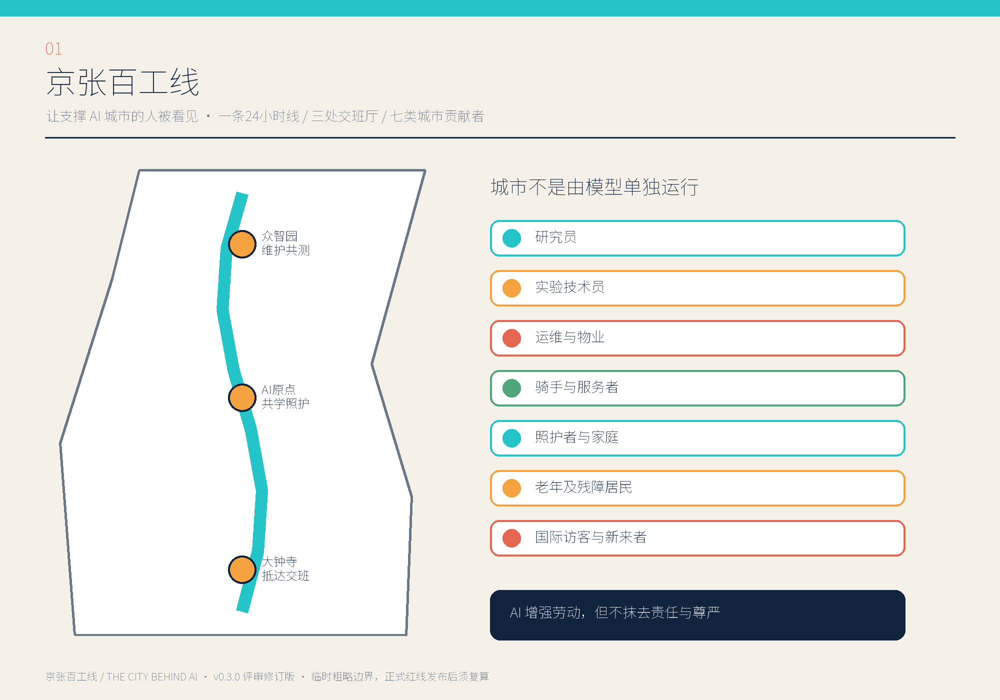
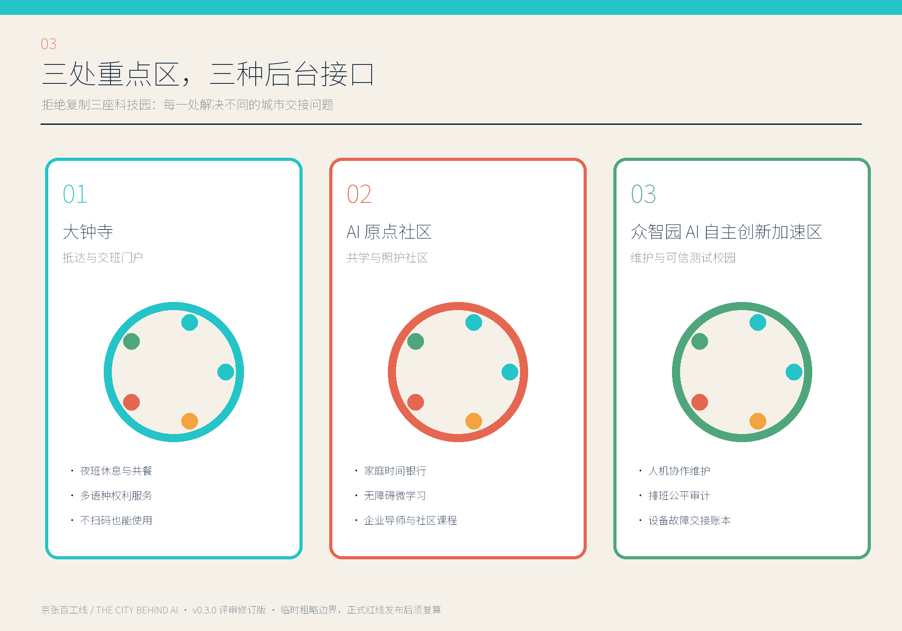
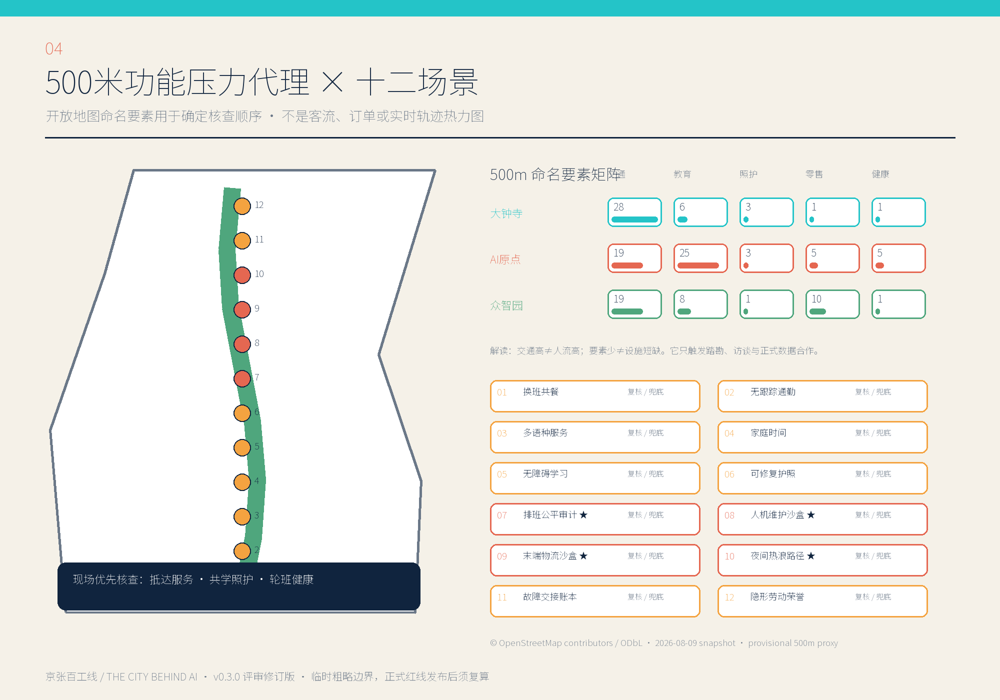
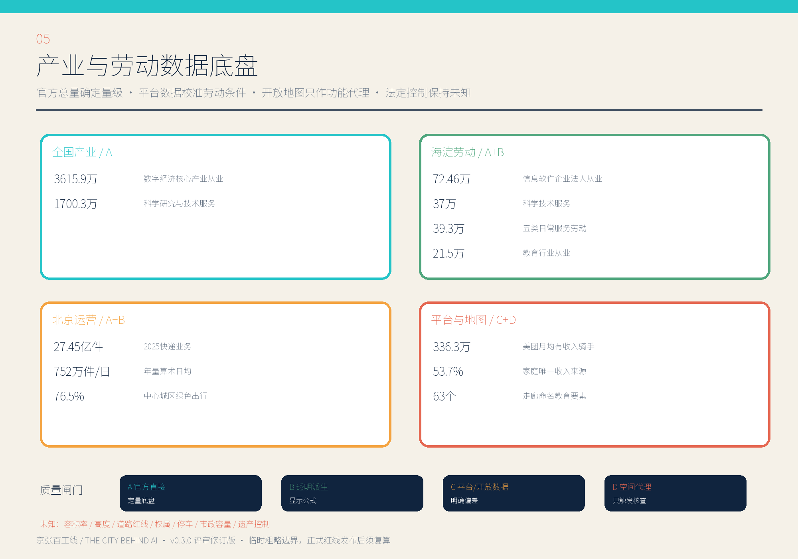

# 京张百工线：让支撑 AI 城市的人被看见

> THE CITY BEHIND AI / JING-ZHANG MANY HANDS LINE

## 设计依据与资料清单

本方案从一个朴素问题出发：一座 AI 城市每天由谁真正托住？答案不仅是研究员和工程师，也包括实验技术员、设备运维者、物业与环卫人员、骑手和零售餐饮服务者、照护者与家庭，以及需要无障碍服务的老年人、残障者和新来者。设计把这些常被隐藏的劳动、交接与修复活动变成公共空间和治理基础设施，以京张遗址绿脊串起一条全天候“百工线”。项目范围、六项任务和开放征集原则以公告和智能体任务书为直接依据。[source:OFFICIAL-ANNOUNCEMENT] [source:AGENT-TASKBOOK]

v0.3.0 评审修订版把产业、教育、物流、平台劳动和开放地图证据接入同一质量闸门：数据越接近个体和地块，越不能仅凭公开聚合数作决定；任何 D 级代理都只能触发核查，而不能直接触发建设或管理动作。[source:SOURCE-REGISTRY] [assumption:A-DATA-GRAIN-001]

空间资料以项目站点包和来源登记为真源，面积、边界和专业限制不从网页截图或示意图反推。总体范围与三处重点区采用维护者发布的临时粗略 polygon，属性明确标记 `official_boundary=false` 与 `boundary_precision=provisional_rough`；获得正式 CAD/GIS 后，九个图层、面积指标和图纸必须成套替换重算。[source:SITE-PACKAGE] [data:geometry/site_boundary.geojson#SITE-001] [assumption:A-BOUNDARY-001]

新增数据分四级使用：A 级是国家统计局、海淀区和北京市政府公开统计，支持产业和公共服务量级判断；B 级是由官方总量进行的透明加总或日均换算；C 级是平台自报与开放地图，支持问题发现但不能替代独立调查；D 级是本方案生成的 500 米功能压力代理，只表达待核验假设。完整的发布者、链接、时间、地域、许可、变换和局限记录在 `sources.json`，全部法定缺口继续保持 unknown。[source:NBS-DIGITAL-ECONOMY-2023] [source:HAIDIAN-ECON-CENSUS-OVERALL-2023] [assumption:A-DATA-GRAIN-001]

## 三层范围工作框架

统筹研究范围约 43.6 平方公里，用于识别产业链、通勤链、照护链、物流链和能源数据链；总体设计范围约 11.4 平方公里，用于落位百工线、两翼功能和公共服务网络；大钟寺 AI 产业集聚区、AI 原点社区、众智园 AI 自主创新加速区三处重点区域合计约 368.4 公顷，用于建立可落地的交班空间原型。公告面积与临时 polygon 复算面积分别登记，不相互替代。[metric:announced_research_area_sqkm] [metric:announced_overall_area_sqkm] [metric:announced_key_areas_total_ha]

三层范围共用“一线、三班、两翼”的结构。一线是从大钟寺向北串联的慢行—服务—展示—修复基础设施；三班是早班、日班和夜班，每个班次都要有抵达、休息、餐食、照护、维修和申诉接口；两翼分别容纳研发测试与生活照护，通过八条交接支线形成短链。研究层回答资源怎样循环，总体层回答空间怎样连接，重点区回答单一场景如何搭建、测试、纠错和退出。[depth:three_level_scope_framework]

同一套人物画像与场景卡跨尺度使用，但不把区级统计伪装成地块需求。国家和海淀数据只帮助确定“哪些劳动不能遗漏”，500 米开放地图代理只帮助安排现场核查顺序，正式控制与设施容量仍要等待政府数据、交通专项、现场踏勘和参与式调研。这样既避免宏大愿景悬空，也避免把一个演示装置误写成完整生态。[assumption:A-DATA-GRAIN-001] [assumption:A-HEAT-PROXY-001]

## 统筹研究范围产业与未来城市研究

第五次全国经济普查显示，2023 年数字经济核心产业法人单位从业人员为 3615.9 万人，科学研究和技术服务业法人单位从业人员为 1700.3 万人。这两个全国总量只说明“AI 产业”背后存在庞大而分层的劳动系统，不用于估算京张走廊人口；它们促使方案把研发、试验、技术服务、维护和应用推广视为连续链，而非只围绕总部办公组织空间。[metric:nbs_digital_core_employment_2023] [metric:nbs_scitech_services_employment_2023]

海淀 2023 年企业法人单位中，信息传输、软件和信息技术服务业从业人员 724,573 人，其中软件和信息技术服务业 609,995 人；全法人单位口径下，科学研究和技术服务业约 37 万人、教育约 21.5 万人。另将零售、交通运输仓储邮政、住宿餐饮、房地产、居民服务修理五类相加，得到约 39.3 万人的“日常服务劳动底盘”。这一加总不覆盖全部平台灵活就业者，也不能与企业法人细分口径直接混加，但足以说明服务、维护和照护不是创新区的附属项。[source:HAIDIAN-ECON-CENSUS-SERVICES-2023] [metric:haidian_selected_daily_service_employment_2023] [metric:haidian_education_employment_2023]

因此百工线把七类资源同时纳入：空间要有维修间、夜间休息、家庭服务和申诉窗口；产业要识别实验外包、设备维护、物流和社区服务；资金要分列首试采购、长期维护和退出成本；人才要让技术人才与技术劳动者并列；算力披露能耗和服务时段；数据坚持最小采集；场景必须由真实使用者和独立评估者共同验收。国际案例只提炼治理机制，不复制空间形态。[source:CASE-NIST-AIRMF] [source:CASE-EU-TEF] [source:CASE-QUAYSIDE]

## 总体设计范围城市更新与控规深度城市设计

总体结构由十五个概念用地单元构成：中部连续公园绿地承担遗址阅读、生态修复和慢行，西翼组织研发、可信测试和交通换乘，东翼组织公共服务、照护和职住支持。百工主线与八条交接支线把两翼连成短链，三处交班厅和十二个场景节点嵌入主线。图层用于表达空间关系和复算接口，不构成供地、产权或审批意见。[data:geometry/land_use.geojson#LU-001] [data:geometry/roads.geojson#ROAD-001] [depth:overall_spatial_structure]

控规层面的贡献是一张“待填控制表”，而不是未经授权的数值：每个单元预留主导功能、混合比例、公共界面、首层开放、夜间服务、无障碍、物流时窗、数据设施和运维责任字段。容积率、建筑密度、高度、退界、停车和道路面积因缺少法定依据继续为 unknown。待正式控制到位后，专业团队可以沿用同一结构化字段进行复核，而无需推翻方案逻辑。[source:PLANNING-LIMITS] [metric:floor_area_ratio] [assumption:A-CONTROLS-001]

城市更新采用“保留可用空间—修复公共界面—插入小型原型—再决定增量”的顺序。当前十二个建筑图斑只是交班厅、维修间、学习舱等公共原型，不对任何真实建筑作拆改留判断。正式深化需建立现状建筑唯一编码，补齐年代、结构、使用、权属、碳成本和遗产控制，再由规划、建筑、文保与社区共同确定保留、改造或拆除。[data:geometry/buildings.geojson#BLDG-001] [assumption:A-EXISTING-001]

## 重点区域详细设计

三处重点区不是三座复制粘贴的科技园，而是三种城市后台接口。大钟寺 AI 产业集聚区定位“抵达与交班门户”，服务轨道换乘、夜班人员、骑手和访客；AI 原点社区定位“共学与照护社区”，让家庭时间、无障碍学习、社区课程和企业导师形成网络；众智园 AI 自主创新加速区定位“维护与可信测试校园”，把人机协作维护、算法排班审计、设备故障账本和修复工坊组成开放测试链。[data:geometry/key_areas.geojson#PROV-KEY-001] [metric:key_area_count]

开放地图 2026-08-09 快照被归类为交通、教育、照护支持、日常零售和健康五组，并与临时重点区做 500 米缓冲相交。代理矩阵为：大钟寺 28/6/3/1/1，AI 原点 19/25/3/5/5，众智园 19/8/1/10/1。它不是客流、订单、热力或服务质量测量，只说明公开地图中“大钟寺交通要素突出、AI 原点教育要素突出、众智园照护支持偏少”的现场核查方向。[source:OSM-CORRIDOR-SNAPSHOT-20260809] [metric:osm_dazhongsi_mobility_features_500m] [assumption:A-OSM-001]

因此大钟寺优先布置夜间交班、补水、卫生间、多语服务和短时休息；AI 原点优先把学校、家庭和社区课程接入共学照护；众智园优先补齐轮班休息、健康支持、维修工具和人工申诉。每处都采用“一厅、一路、一账本、一评审”的四件套：全年可用的交班厅、可测试的户外路径、公开场景账本、真实使用者参与的季度评审。所有判断先现场核验，再进入建设清单。[assumption:A-HEAT-PROXY-001] [depth:three_key_area_detailed_design]

## AI 创新生态、人才画像与 AI+ 场景

七类人物画像包括研究员、实验技术员、设备物业与市政运维者、骑手零售与餐饮服务者、照护者与家庭、老年及残障居民、国际访客与新来者。画像不用于身份标签、画像评分或行为预测，而用于检查空间是否遗漏具体班次、语言、身体能力、工具和责任关系。海淀 2025 年常住人口 311.1 万，外来常住人口占 33.0%，进一步支持多语、低门槛和不依赖数字身份的公共服务。[source:HAIDIAN-STAT-BULLETIN-2025] [metric:haidian_nonlocal_population_share_2025]

十二个场景节点包括换班共餐、无跟踪通勤、多语权利服务、家庭时间协调、无障碍微学习、可修复性护照、排班公平审计、人机维护沙盒、末端物流沙盒、夜间热浪安全、故障交接账本和隐形劳动荣誉谱。四个行业共测场景依次检验工时与申诉、人机故障接管、骑手商户行人与机器人路权、夜间照明补水与人工救助。全部节点写入同一公共空间图层，统一要求人工复核和非数字兜底。[data:geometry/public_space.geojson#SCENARIO-001] [metric:scenario_node_count] [metric:test_validation_scenario_count]

美团报告称 2024 年月均有收入骑手 336.3 万，调查中 53.7% 是家庭唯一收入来源，44.7% 的应急储蓄不足三个月；平台疲劳规则试点中，连续工作触发强制下线的比例为 0.18%。这些数字属于单一平台自报和调查口径，不能外推为本地骑手数量，但会改变空间设计：休息不与接单权绑定，排班调整必须可解释可申诉，健康支持不以连续定位为前提，收入稳定与安全停机同时纳入测试指标。[source:MEITUAN-RIDER-2024-2025] [metric:meituan_rider_sole_household_income_share] [assumption:A-PLATFORM-001]

## 用地、建筑规模与拆改留方案

概念用地沿国家分类口径组织，混合功能通过程序和兼容清单表达，不自造法定编码。中轴 `1401` 公园绿地保持连续，研发测试、公共服务照护、交通换乘和居住生活单元分列两翼。几何图层覆盖临时总体范围并接受拓扑检查；概念绿地和公共空间比例只用于比较方案内部结构，正式边界变化后必须重新计算。[source:MNR-LAND-USE] [metric:green_ratio] [metric:public_space_ratio]

十二个建筑原型的占地可以从图层复算，但不推导总建筑面积、容积率或建筑高度。原型优先寻找既有厂房、首层空置空间、桥下和站点附属空间的再利用可能，采用小尺度、多入口、可拆装、首层透明和工具可见的形式。是否保留、改造或新建必须以测绘、结构鉴定、权属、消防、无障碍和遗产评估为前提。[metric:building_footprint_area_sqm] [metric:total_floor_area_sqm] [depth:retain_renovate_demolish]

拆改留决策分四步：先建立现状建筑唯一编码；再登记年代、结构、使用、权属、运营和隐含碳；随后叠加遗产、安全、轨道与市政控制；最后由专业团队和社区评审确定类别。自动识别只能给出候选和置信度，不能作最终决定。当前遗产控制面积、道路红线和市政容量均为 unknown，图面留出替换接口而不填造数字。[metric:heritage_control_area_sqm] [assumption:A-HERITAGE-001]

## 交通、轨道、市政与公共服务设施

北京 2025 年中心城区绿色出行比例为 76.5%，说明慢行与公共交通衔接是城市级政策底盘，但不能替代京张走廊断面调查。百工主线组织步行、自行车、轮椅和低速服务，八条支线连接两翼与三处重点区；轨道出入口、公交接驳、停车、装卸和机器人线路仍需正式交通专项校核。概念慢行长度只表达连接原则，不代表工程线位。[source:BEIJING-TRANSPORT-2025] [metric:beijing_green_travel_share_2025] [assumption:A-MOBILITY-001]

北京市 2025 年快递业务量 27.45 亿件，折算算术日均约 752 万件；交通运输部记录 2025 年 12 月全国网约车订单 9.63 亿单。这些市级和全国总量只用于说明末端交接系统的运营压力，不用于估算任一地块的订单、骑手或车辆。项目启动前应与邮政、公交、轨道、平台、商户和劳动者建立受控数据合作，优先使用聚合时段数据，并禁止公开个人轨迹。[source:BEIJING-POSTAL-2025] [source:MOT-RIDEHAIL-2025-12] [metric:beijing_express_daily_average_2025]

夜间空间遵循“有人、有光、有水、有退路”：交班厅有值守人员，照明不依赖人脸识别，补水、卫生间和急救按班次开放，数字通行保留实体按钮、纸面信息和人工窗口。市政系统预留维修隔离、雨洪花园、传感设施拆卸和能耗披露接口；托育、夜间餐食、无障碍卫生间、劳动咨询、健康休息和工具借用优先于新增 App。[metric:municipal_capacity_index] [assumption:A-PRIVACY-001]

## 蓝绿空间、公共空间与城市风貌

京张遗址绿脊既是公共背景，也是低技术优先的气候基础设施。连续树荫、透水地面、雨水花园、可坐可躺的边界和夜间温和照明先于智能装置；修复园展示材料、设备与植物的养护过程，让维护成为可学习、可尊重的公共知识。现有遗产名录和控制线不足，因此任何触碰遗构的动作都必须低扰动、可逆，并通过文保专项确认。[data:geometry/green_space.geojson#GREEN-001] [assumption:A-HERITAGE-001]

公共空间使用一套可复制的“百工构件库”：交班长桌、移动工具墙、遮阴补水架、多语纸面导视、无障碍工作台、故障留痕牌。构件允许不同片区和开发主体复用，但开放时段、人工服务、维护预算和责任人是使用条件。深海军蓝代表责任底账，青色代表协作流，琥珀色代表交班时刻，珊瑚色标记需要人工关注的风险；视觉识别不覆盖铁路遗产本体。[metric:pilgrimage_landmark_count] [assumption:A-BRAND-001]

城市风貌不追求统一的“AI 未来感”，而让工具、材料、维修痕迹和真实使用可见。遗址一侧保持低扰动、透空和可逆的公共界面，城市一侧允许小尺度生产、社区服务和首层开放混合。夜间热浪路径根据遮阴、补水、照明、人工值守和退出路线共同评价，不以摄像头数量评分；高度与天际线等待正式视廊和控制数据后再给数值。[data:geometry/constraints.geojson#CONSTRAINT-001] [depth:blue_green_public_space]

## 更新项目清单、实施政策与分期计划

八个更新项目包括百工慢行主线、三处交班厅、百工谱与贡献标尺、修复园与开放工具图书馆、家庭时间银行和托育支持、四类行业可信测试场、夜间安全与热浪响应网络、开放场景账本与申诉平台。每项都需同时指定空间责任人、运营责任人、数据责任人、年度维护费、停机方式和退出预算，避免建设完成后无人维护。[metric:renewal_project_count] [depth:renewal_project_list]

实施分三阶段。0—2 年“交班可见”，先用低成本公共空间、服务时段、纸面账本和现场调查验证需求；3—5 年“行业共测”，只在安全、劳动、公平、无障碍和环境指标通过后扩展四类测试；6—10 年“城市后台开放”，把有效构件、场景协议和申诉规则做成开放标准。分期图层表达触发条件，不构成政府投资、征收或审批承诺。[data:geometry/phasing.geojson#PHASE-001] [assumption:A-OPERATIONS-001]

年度机制包括城市后台开放周、百工修复节、可信排班公开审计日和全球城市场景交换营。企业与开发者按“问题认领—无数据原型—小范围测试—公开指标—使用者评审—退出或扩展”进入；社区可以否决高风险采集；国际团队必须提交中文、多语和无障碍版本。连续参与通过 changelog 记录规则、资料和设计判断的每次变更。[metric:annual_event_system_count] [source:CASE-KALASATAMA]

## 指标体系、面积复算与合规矩阵

指标分成四层：公告已知量；官方统计量；基于临时几何或官方总量的透明派生量；资料不足而明确 unknown 的法定与工程量。每个指标记录状态、单位、公式、来源文件、置信度和假设。官方统计即使为高置信度，也只在其原有地域与行业口径内成立；500 米开放地图数量为低置信度，不与客流、订单或服务质量画等号。[metric:site_area_sqm] [metric:haidian_info_it_enterprise_employment_2023] [metric:osm_named_education_features_corridor_20260809]

数据质量闸门按使用风险设置：A 级官方直接统计可用于确定问题量级；B 级派生值必须显示公式；C 级平台和开放地图必须显示来源偏差；D 级空间代理只能触发踏勘、访谈和数据合作，不能触发拆建、执法、资源剥夺或个体画像。若两个口径不可比，正文并列解释而不求和；若缺少发布日期、覆盖范围或许可，则不进入指标库。每次外部数据更新都必须同步修改版本记录、指标和空间属性。[source:OSM-CORRIDOR-SNAPSHOT-20260809] [assumption:A-OSM-001]

合规矩阵对应征集任务，标准矩阵对应专业依据，设计深度矩阵对应从现状诊断到风险控制的工作项，自检记录边界信任、拓扑、静态网页和专业证据。完整机器索引留在 JSON 和 GeoJSON，正文只在关键判断旁保留一至三条引用，以便人读与机器核验同时成立。新增或替换正式数据后，应先重算指标，再重新渲染图纸、PDF 和网页，最后运行预检。[standard:MOHURD-URBAN-DESIGN-MEASURES] [depth:metrics_recalculation]

## 风险、版权与合规说明

首要风险是把临时边界、区级总量或开放地图代理误读为法定地块结论。所有图纸和指标重复标注 provisional，正式红线、设施名录或交通数据到位后整体重算。第二类风险是“以照护之名进行监控”：家庭协调、通勤和安全场景禁止默认做人脸、情绪或连续定位；敏感数据需要重新授权、影响评估、保存期限和删除机制。[assumption:A-BOUNDARY-001] [assumption:A-PRIVACY-001]

第三类风险是算法把不公平排班包装成效率，或用强制下线替代健康支持。扩展前必须公开工时稳定、收入波动、安全事件、申诉处理和误判纠正；人工复核和非数字兜底覆盖全部十二个场景。第四类风险是维护费被从建设预算中删除，每个装置、模型和平台必须登记维护人、响应时限、停机模式和退出费用。[metric:human_review_coverage_ratio] [metric:non_digital_fallback_coverage_ratio]

投稿者原创文本、图形、示意几何和版式采用 CC-BY-4.0。开放地图衍生计数保留“© OpenStreetMap contributors / ODbL”署名，本包不再分发原始 OSM 数据库；美团和案例报告只转述有限统计与机制，不复制图片或版面。任何实施仍须满足规划、建筑、文保、交通、消防、无障碍、劳动、数据和网络安全要求，本投稿不代表政府、社区、企业或专业机构已批准、出资或承诺实施。[source:OSM-CORRIDOR-SNAPSHOT-20260809] [depth:risk_missing_data]

## 参考资料

项目直接依据包括公开征集公告、智能体任务书、站点资料包、来源登记、规划限制和三类专业标准。它们决定任务边界、三层范围、结构化交付与法定数据缺口；正文不展开全部 ID，完整索引见 `sources.json`、三个矩阵和 manifest。[source:OFFICIAL-ANNOUNCEMENT] [source:SOURCE-REGISTRY] [standard:MOHURD-CONTROL-DETAILED-PLANNING]

产业与人口底盘采用国家统计局第五次全国经济普查、海淀区第五次全国经济普查公报和 2025 年统计公报；交通物流采用北京市交通委员会、北京市邮政管理局和交通运输部公开材料。官方总量按原地域口径解释，派生值显示公式，不向临时地块硬分配。[source:NBS-SCITECH-SERVICES-2023] [source:HAIDIAN-STAT-BULLETIN-2025] [source:BEIJING-POSTAL-2025]

劳动条件校准采用美团骑手年度职业报告，功能环境代理采用 2026-08-09 OpenStreetMap/Overpass 快照。两者分别存在平台自报偏差和开放地图完整性偏差，故只支持休息申诉需求与现场核查顺序，不支持本地人数、订单或实时流量结论。国际案例用于比较真实环境测试、居民共创、混合创新区和公共监督机制。[source:MEITUAN-RIDER-2024-2025] [source:OSM-CORRIDOR-SNAPSHOT-20260809] [source:CASE-PUNGGOL]

## 对任务书六项任务的独立响应

本版将任务书原词写回方案：三大定位是“百年京张文化带、都市 AI 生活体验带、AI 融合创新带”；五项功能是“AI 全栈自主创新体系、世界级 AI 创新生态、AI+ 场景赋能新范式、智能化 AI 活力城市、AI 治理全球话语权”。三片两翼分别为 AI 原点社区、众智园 AI 自主创新加速区、大钟寺 AI 产业集聚区，以及中关村科技服务翼、小月河场景赋能翼。早期稿“中关村智造大街”只是内部工作名，本版全部改用正式名称“众智园 AI 自主创新加速区”。完整映射见 `visual/assets/ecosystem-map.json`。[source:AGENT-TASKBOOK]

Agent.1 的独立输出是 7 个全球案例转译表、八类资源机制和五类区域接口：案例明确“可转移机制/京张转译/不可照搬边界”；土地、空间、产业、资本、人才、算力、数据、场景分别有治理动作；北纬社区、未来科学城、怀柔科学城、经开区和京津冀只作为概念协作接口，不声称已经合作、投资或授权。详见 `visual/assets/case-transfer-matrix.json`、`visual/assets/ecosystem-map.json`、`visual/assets/regional-interfaces.json`。[source:CASE-NIST-AIRMF]

Agent.2—3 对应总体与重点区：AI 原点形成“课程—照护—开发者—社区验证”的世界级 AI 创新生态；众智园形成“模型—硬件—运维—安全—治理”的全栈自主创新与可信测试系统；大钟寺承接智能原生新业态和抵达展示；中关村科技服务翼提供标准、IP、资本和国际转化，小月河场景赋能翼承接生活、物流、慢行与气候场景。所有图面都有图名、图例、北箭头、比例尺和临时边界警示；这些比例尺基于临时投影几何，只供概念判断。[data:geometry/key_areas.geojson#PROV-KEY-001]

Agent.4 的独立输出是 12 张场景卡。每张卡都明确人物、地点、空间载体、运营责任、数据边界、SLA、暂停/退出阈值，并遵守人工复核、非数字兜底和数据最小化。它们与空间和运营的完整矩阵见 `visual/assets/scenario-cards.json` 及 `assets/figures/scenario-operations.png`，不再只停留在场景名称清单。[metric:scenario_node_count]

Agent.5 的四地标为百工谱、交班厅、修复园、贡献标尺；历史文化资源分成铁路遗产本体、工业与技术劳动史、当代数字劳动史三层。Logo 由交接手势和铁路双线构成开放环；深蓝、青、琥珀、珊瑚、绿色分别表达责任、协作、交班、人工关注和修复。禁止覆盖遗产本体、暗示政府背书、仅靠颜色传意或复制企业商标，见 `visual/assets/landmark-culture-system.json`。

Agent.6 把八个更新项目变成实施合同：每项列责任类型、相对成本、资金/维护来源类别、阶段、验收基线、SLA、暂停/退出阈值和独立评估者。年度路径为“城市后台开放周—百工修复节—可信排班公开审计日—全球场景交换营”；企业/开发者/招商转化遵循“问题认领—无数据原型—小范围测试—公开指标—使用者评审—退出或扩展”，见 `visual/assets/implementation-contracts.json`。[metric:renewal_project_count]

## 参与、无障碍与人工验收门槛

本次不虚报已经完成用户参与。`visual/assets/participation-accessibility-plan.json` 将夜班劳动者与骑手、残障者与老年人、照护者家庭、社区商户、运维物业、企业开发者和国际访客列为有补偿的参与组，规定现场同行、无数据原型共测、季度评审和公开变更记录。社区对人脸、连续定位和敏感画像具有否决权；线下、电话和纸面申诉 2 个工作日受理、10 个工作日结案。

HTML、PDF、PNG 和实体导视均需人工无障碍审计：键盘顺序、替代文本、对比度、200% 缩放、字体与灰度、图例/比例尺/北箭头、视高/触达/轮椅回转/眩光/多语纸面兜底。当前状态是“计划已提交、实际审计未完成”，因此它是实施前硬门槛，而不是已通过的自我声明。[assumption:A-PRIVACY-001]

## 来源页码、存档哈希与复算口径

海淀经济普查总公报的就业数据定位到 PDF 第 3—4 页表 3；服务业公报的信息软件数据定位到第 7—8 页表 9—11；美团骑手数据定位到报告标示页 15、19、21、25。缓存文件 SHA-256、转换公式和再利用边界登记在 `visual/assets/source-audit.json`。政府和平台材料只转录有限事实、表名与页码，不复制图片或版式；OSM 只分发聚合计数并保留 ODbL 署名。[source:HAIDIAN-ECON-CENSUS-OVERALL-2023] [source:MEITUAN-RIDER-2024-2025]

建筑占地采用 EPSG:4548 投影后 `area(unary_union(footprints))` 统一计算，并另列“逐图斑求和减合并面积”的重叠诊断值；只有重叠为 0 才通过。该口径与空间复核脚本一致，避免重复计数。[metric:building_footprint_area_sqm] [metric:building_footprint_overlap_sqm]
