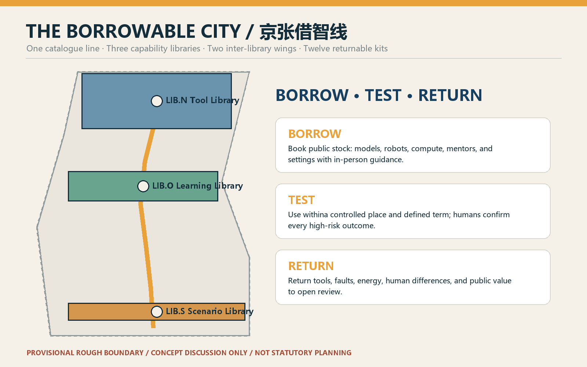
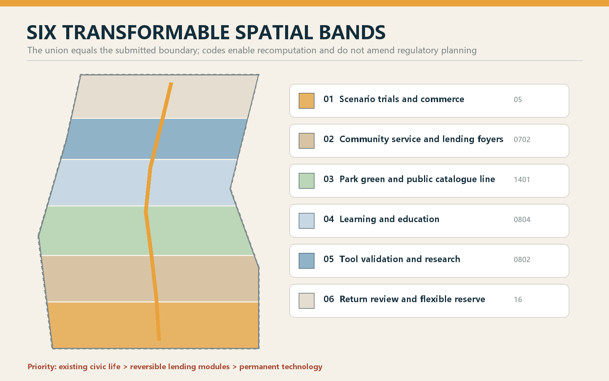
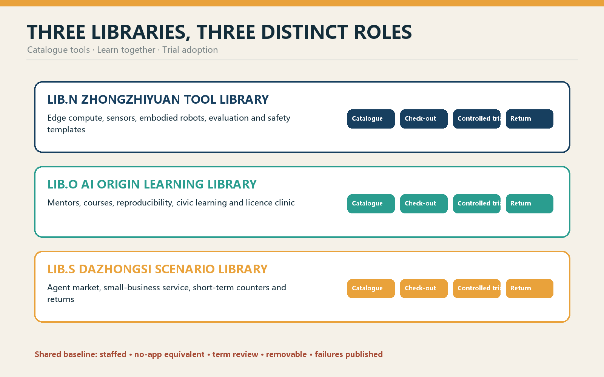
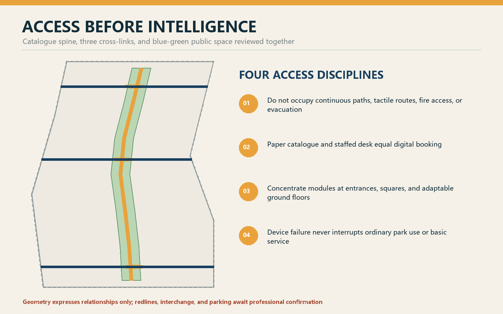
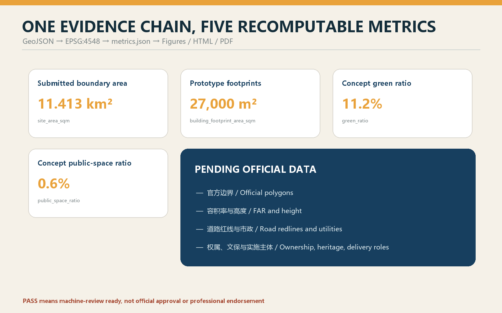

# THE BORROWABLE CITY

> Make AI capability a civic resource that can be borrowed, tested, and returned.

The proposal does not turn Jing-Zhang into a showroom for expensive devices. It designs a library without walls. Research teams borrow real-world scenarios; residents borrow tools and mentors; small firms borrow test counters; operators borrow evaluation methods. Every loan has a term, accountable person, human review, stop condition, and return receipt. All spatial moves are conceptual recommendations on provisional geometry, for professional teams to deepen; they do not replace statutory planning or constitute government approval.

## Design Basis and Source List

The official call and Agent Taskbook define the tasks; the repository source registry, local standards snapshots, and provisional geometry form the evidence base. The package covers three scope levels, three key areas, naming and identity, 5-8 ecosystem cases, at least ten scenario cards, three industry tests, five personas, three pilgrimage landmarks, cultural narrative, and long-term operations.[source:OFFICIAL-ANNOUNCEMENT] [source:AGENT-TASKBOOK]

Formal claims use approved formal-ready sources. Background material supports context only, while `provisional_only` material supports temporary generation, display, and discussion.[source:SOURCE-REGISTRY] Official polygons, regulatory controls, ownership, utilities, heritage constraints, and road redlines remain missing; processed files are reading aids rather than new authority.[source:PROCESSED-FACT-PACK]

The submitted `SITE-001` and three `PROV-KEY` features are provisional constraints. They are not official redlines or precise approval areas. Once official polygons arrive, land use, buildings, roads, green/public space, phasing, figures, and metrics must all be recalculated.[source:BOUNDARY-SOURCE] [source:KEY-AREA-SOURCE] [depth:existing_conditions_diagnosis]

## Three-Level Scope Framework

At the coordinated-research scale, the question is how capabilities circulate among universities, institutes, firms, communities, professional services, and real-world test environments. At the overall-design scale, the Heritage Park becomes a public catalogue line connected to neighbourhoods by light, removable lending interfaces. At the key-area scale, Zhongzhiyuan stores tools and validation capacity, the AI Origin Community stores knowledge and learning, and Dazhongsi stores adoption scenarios.[depth:three_level_scope_framework] [data:geometry/site_boundary.geojson#SITE-001]

The structure is “one line, three libraries, two wings, twelve kits.” The Zhongguancun Technology-Service Wing provides legal, IP, capital, and talent support as an inter-library network; the Xiaoyuehe Scenario-Empowerment Wing provides bookable civic and ecological settings. Twelve kits are tested for a defined term and returned with public learning.[standard:PROJECT-OFFICIAL-ANNOUNCEMENT] [depth:overall_spatial_structure]

## Coordinated Research Area: Industry and Future City Research

The Chinese name is “京张借智线” and the English name is “THE BORROWABLE CITY.” The identity combines railway brackets, an open catalogue, and a plug-in module. Deep blue denotes the trusted catalogue, amber a checked-out item, and green a returned contribution. Spatial names are `LIB.N` Tool Library, `LIB.O` Learning Library, and `LIB.S` Scenario Library; kit numbers run from `KIT-01` to `KIT-12`; the annual programme is Borrowable City Week.[standard:PROJECT-AGENT-OPEN-CALL-TASKBOOK]

Seven references are translated as mechanisms, not site facts: Oodi's tool and maker access, the Fab Lab network, digital-inclusion library services, Singapore's senior digital support, London's open-data ecosystem, Seoul's civic feedback methods, and Living Lab controlled pilots. The local principles are public access, low-threshold borrowing, in-person guidance, explicit return, and open review.[source:SITE-PACKAGE]

Eight borrowable capabilities form the ecosystem: space, compute, models, data, robots, mentors, compliance methods, and scenarios. Zhongzhiyuan makes full-stack tools testable; the Origin Community makes knowledge learnable; Dazhongsi makes adoption temporary and accountable. The two wings supply professional support and real-world validation. None of this is a confirmed investment, procurement, or government commitment.

## Overall Design Area: Urban Renewal and Regulatory-Plan-Level Urban Design

Six transformable bands organise the temporary design: research/validation, education/learning, community service, commercial trials, park green space, and a blank return zone. Their gap-free partition proves that the spatial logic is recomputable; it is not a regulatory-plan amendment.[data:geometry/land_use.geojson#LU-001] [depth:land_use_layout]

Three reversible building prototypes support lending: 15-30 sqm lockers, 80-150 sqm open workshops, and 300-600 sqm trial halls. They should first occupy lawfully usable ground floors, undercroft space, or public-service rooms. Exact locations require ownership, structural, fire, accessibility, and operating confirmation. Height, FAR, density, setback, and total floor area remain pending official data.[depth:development_intensity_controls] [depth:height_massing_character]

The retain-renovate-demolish order is retain, repair, insert, and only then consider removal. Industrial heritage, mature trees, community access, and useful buildings come first; access gaps are repaired; removable modules are inserted; demolition requires professional review.[depth:retain_renovate_demolish] The building footprints are prototypes rather than parcel-level conclusions.[data:geometry/buildings.geojson#BLDG-001]

## Detailed Design of Key Areas

**LIB.N Zhongzhiyuan Tool Library.** A public catalogue hall leads to a booking counter, controlled test yard, and maintenance back-of-house. Borrowable stock includes edge-compute cases, sensor kits, embodied-robot bases, model-evaluation tools, and safety templates. Every return includes fault, energy, human-takeover, and fitness records. The Qinghe interface remains a concept pending ecological, flood, and engineering evidence.[data:geometry/key_areas.geojson#PROV-KEY-001]

**LIB.O AI Origin Learning Library.** Open ground floors, staffed mentor desks, bookable classrooms, reproducibility rooms, and quiet learning courts let people borrow knowledge, projects borrow mentors, and communities borrow courses. Research enters the catalogue only with rights and maintainers. Paper catalogues and staffed booking remain available.[data:geometry/key_areas.geojson#PROV-KEY-002]

**LIB.S Dazhongsi Scenario Library.** A station arrival, public foyer, short-term trial counters, complaints/return desk, and ordinary retail back-of-house form the sequence. Agent commerce, smart terminals, and small-business services are checked out for a limited term. Unauthorised transactions, dark patterns, or missing human confirmation trigger removal; ordinary trade remains available.[data:geometry/key_areas.geojson#PROV-KEY-003] [depth:three_key_area_detailed_design]

Three pilgrimage landmarks are the Public Catalogue Tower, the Origin Lending Hall, and the Return Theatre. They display availability, open-source maintainers, failures, repairs, retirement, and public return without exposing personal data. Honour follows verifiable contribution, licence, and maintenance responsibility rather than advertising.

## AI Innovation Ecosystem, Personas, and AI+ Scenarios

The personas are open-source developers, start-ups, university communities, local residents, older/non-smartphone users, small merchants, and frontline operators. Each may borrow and also contribute stock. Borrowing lowers access to tools, mentors, and real-world settings; it does not delegate final decisions to machines.

| KIT | Scenario and place | Checked-out capability | Human and exit path |
| --- | --- | --- | --- |
| 01 | Accessible journey kit · catalogue line | Access audit and temporary wayfinding | Accessibility expert; paper map and staffed help |
| 02 | Civic-service explainer · Origin | Official-source retrieval | Counter staff decides; no automated administrative decision |
| 03 | Children's AI literacy · Learning Library | Account-free teaching kit | Teacher/guardian present; no child tracking |
| 04 | Senior digital companion · community | Slow teaching and device trial | One-to-one helper; non-AI route throughout |
| 05 | Open-source licence clinic · Origin | Licence, model card, handoff templates | Rights review; unresolved ownership blocks release |
| 06 | Small-merchant content aide · Dazhongsi | Drafting and translation | Merchant confirms; ordinary counter remains |
| 07 | Microclimate observation · east wing | Non-personal sensors | Professional calibration; no device identity |
| 08 | Railway memory guide · park | Cleared archive retrieval | Curator review; unsourced content removed |
| 09 | Edge-compute loan · Zhongzhiyuan (T1) | Isolated compute and energy meter | Staffed operation; abnormality triggers return |
| 10 | Embodied-robot street class · Zhongzhiyuan (T2) | Low-speed base and safety enclosure | Safety officer; failed emergency stop ends trial |
| 11 | Agent-market trial · Dazhongsi (T3) | Transaction sandbox | Zero tolerance for unauthorised trade; term-limited |
| 12 | Civic-event review · whole line | Aggregate counts and comment synthesis | Human decision; raw records deleted after event |

T1-T3 are proposed validation scenarios, not approved operations. Each kit declares catalogue ID, borrower role, term, minimum data, human responsibility, stop condition, and return output. It cannot auto-renew without review.[data:geometry/public_space.geojson#PUBLIC-001] [metric:key_area_count]

## Land Use, Building Scale, and Retain-Renovate-Demolish Strategy

The six land-use features share cutting lines, and their union equals the boundary. Names express lending functions while codes remain within the national classification subset.[standard:MNR-LAND-USE-CLASSIFICATION-GUIDE] Prototype footprint area is recomputed; floor area, FAR, height, and building density remain unknown.[metric:building_footprint_area_sqm]

Street interfaces make borrowing and returning visible through physical status signs, staffed counters, tactile catalogues, repair space, and removable modules. Railway numbering and waybill logic inform the material language without copying historic structures.[standard:MOHURD-ARCH-DESIGN-DEPTH-2016]

## Transport, Rail, Municipal Infrastructure, and Public Services

The catalogue line prioritises walking, cycling, and accessible arrival. Lending modules must not block the park's continuous paths, fire access, evacuation, or tactile routes. Submitted lines show the public spine, cross-links, and three-library connections; exact redlines, junction geometry, interchange, and parking await professional evidence.[data:geometry/roads.geojson#ROAD-001] [depth:traffic_rail_slow_parking]

New infrastructure is isolatable, metered, and returnable. Compute cases, charging, sensing, and network modules record energy, maintenance, and retirement. Their failure does not interrupt basic movement or staffed service. Power, drainage, flood, communications, fire, cooling, and capacity remain unknown.[data:geometry/constraints.geojson#CONSTRAINTS] [depth:municipal_new_infrastructure]

## Blue-Green Network, Public Space, and Urban Character

Park green space is the catalogue's continuous reading surface, not an equipment expo. Nodes concentrate at verified entrances, squares, and transformable rooms. Quiet, shaded, ordinary recreation remains primary. Green and public-space ratios describe internal concept geometry only.[metric:green_ratio] [metric:public_space_ratio] [depth:blue_green_public_space]

The component library includes lockers, worktables, demountable canopies, tactile catalogues, repair carts, status flags, mobile seats, and rain-planters. Text, icons, texture, and colour jointly communicate available, checked out, returned, and in maintenance states.[standard:MOHURD-URBAN-DESIGN-MEASURES]

The cultural story shifts from a railway that carried goods to a city that circulates capability. The 1909 legacy is not a historicist style but the public capacity to learn and maintain difficult technology. Zhongguancun contributes open-source reproduction and mentorship; AI culture adds due dates, returns, and public review.

## Renewal Projects, Implementation Policy, and Phasing

Eight concept projects are the public catalogue line, three libraries, two inter-library wings, twelve scenario kits, three pilgrimage landmarks, and an annual public return week. Each needs spatial permission, accountable organisation, maintenance budget, data boundary, accessibility, human operation, and retirement route.[depth:renewal_project_list]

Phase 1 (0-100 days) is only “one locker plus three kits”: KIT-03, 05, and 07 in a verified existing public-service room. Acceptance means three complete return receipts, not exposure. Phase 2 develops the three libraries and controlled T1-T3 trials. Phase 3 considers the full inter-library network and annual international programme.[data:geometry/phasing.geojson#PHASE-001] [depth:phasing_implementation]

Operations follow six steps: catalogue, check-out, in-person guidance, return, review, and re-catalogue. Borrowable City Week publishes reviewed stock, failures, repairs, and unmet needs. Developers, residents, and operators decide whether to renew, change, or retire. Activities, partners, funding, and operators remain suggested roles until formally confirmed.

## Metrics, Area Recalculation, and Compliance Matrix

Site area, prototype footprint, green ratio, public-space ratio, and key-area count are recomputed from the same GeoJSON in EPSG:4548. The land-use union equals the submitted boundary without overlap. Because the geometry is provisional, the figures support package consistency and design discussion only.[metric:site_area_sqm] [depth:metrics_recalculation]

Success is not measured by device count. Future operating indicators are catalogue accessibility, staffed-guidance coverage, on-time returns, public review, equivalent non-AI paths, and complete retirement routes. No operating baseline exists, so the package does not invent values. Task coverage is in `compliance_matrix.json`; professional standards and design depth are in their matrices.

## Risk, Copyright, and Compliance

The main risk is converting public lending into vendor sales. Controls are an open catalogue, no required brand, time-limited use, ordinary paths, and public retirement. Other risks are responsibility drift, excessive data, space occupation, and provisional geometry appearing official. Each loan requires human accountability and minimum data; removable modules never displace access, ecology, heritage, or safety; every drawing visibly labels provisional status.[depth:risk_missing_data]

The cover is original concept media generated with OpenAI image generation for atmosphere only; it is not a site photograph or spatial evidence. Core figures, HTML, and PDFs are derived from submitted geometry, metrics, and text. Tools, generation method, fonts, and rights boundaries are recorded in `report/copyright_statement.md`.

## References

- Official call, Agent Taskbook, site package, standards snapshots, and registry: see `sources.json`.[source:SITE-PACKAGE]
- Geometry, metrics, assumptions, task coverage, standards, and design depth: see the structured package.
- All content is an open co-creation suggestion, not statutory planning or government approval.
