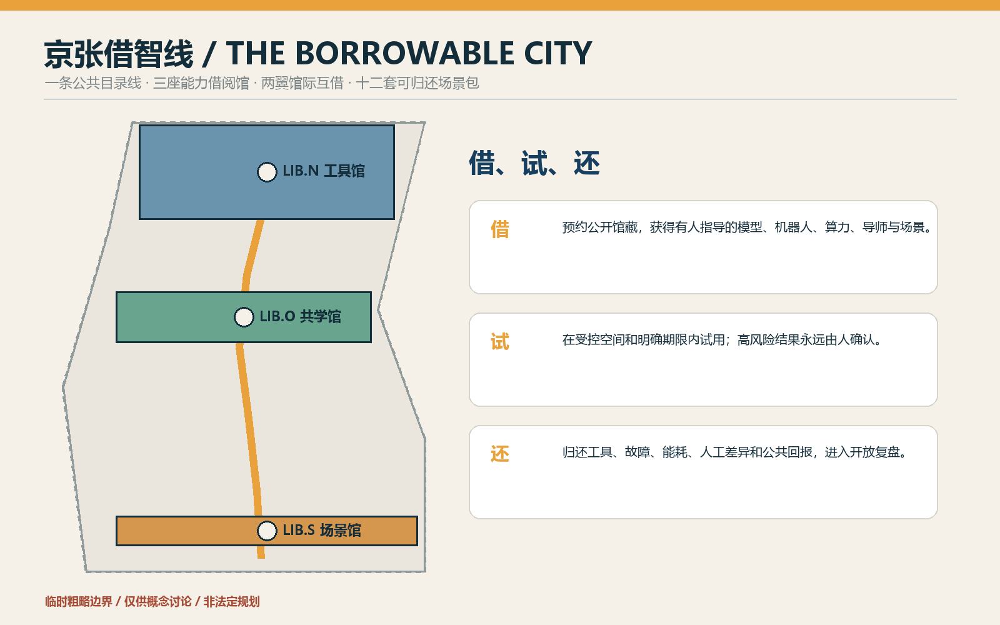
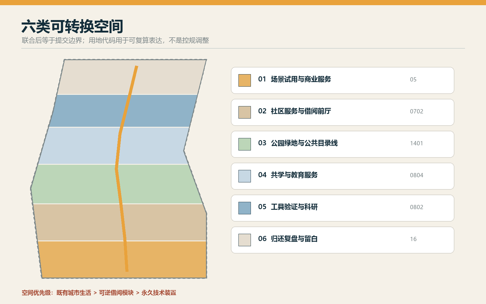
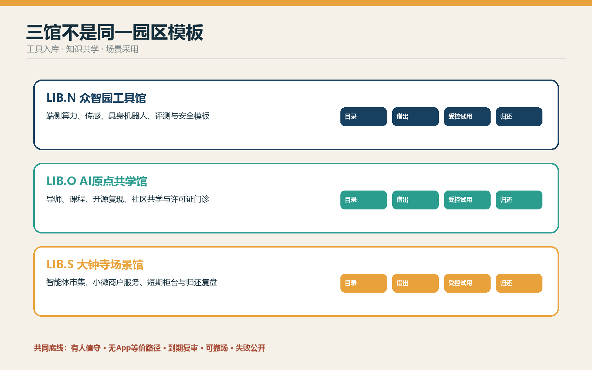
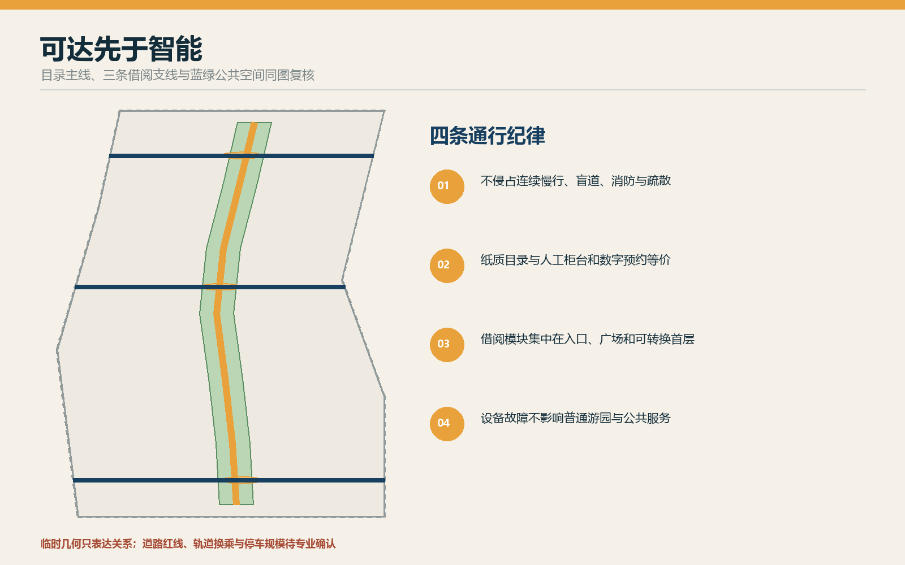
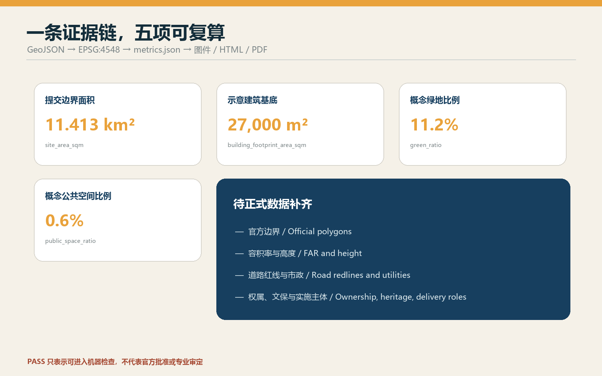

# 京张借智线 THE BORROWABLE CITY

> 把 AI 能力做成可借、可试、可还的城市公共资源。

本方案不把京张做成一条昂贵设备的展示橱窗，而把它设计为一座没有围墙的“能力图书馆”。研究团队可借真实场景，居民可借工具与导师，小微企业可借测试柜台，城市运营者可借评测方法；每次借用都有期限、责任人、人工复核、退出条件和归还复盘。所有空间落地均为基于临时粗略边界的概念建议，可供专业团队深化，不替代法定规划，不构成政府审定结论。

## 设计依据与资料清单

方案以官方征集公告和面向智能体任务书为任务依据，以仓库登记的数据、标准快照和临时几何为证据底座。公告给出三层范围、三处重点区和城市设计深度要求；任务书要求完成命名与视觉识别、5-8 个 AI 生态案例、至少 10 张场景卡、3 个产业测试场景、5 类用户画像、3 处朝圣地标、文化叙事与长期运营。[source:OFFICIAL-ANNOUNCEMENT] [source:AGENT-TASKBOOK]

资料使用遵循中央登记表：formal 结论只使用获准的正式来源；背景资料只用于方法与语境；`provisional_only` 只用于临时生成、展示和讨论。[source:SOURCE-REGISTRY] 当前官方精确边界、重点区 polygon、控规指标、权属、市政、文保和道路红线仍待补齐，处理资料仅作阅读导航，不替代原始来源。[source:PROCESSED-FACT-PACK]

提交采用仓库维护者提供的 provisional geometry。`SITE-001` 与三处 `PROV-KEY` 只能帮助跑通生成、自检与空间讨论，不能被称为正式红线或精确审批面积；官方 polygon 到位后须整体重算用地、建筑、道路、绿地、公共空间、分期、图件和指标。[source:BOUNDARY-SOURCE] [source:KEY-AREA-SOURCE] [depth:existing_conditions_diagnosis]

## 三层范围工作框架

统筹研究范围回答“能力如何在区域内流动”：高校、科研机构、企业、社区、专业服务和真实场景不再被组织成单向招商链，而成为可借、可还、可复用的馆际网络。总体设计范围回答“能力借阅如何进入城市”：京张遗址公园承担公共目录线，沿线以轻量、可拆的借阅接口连接街区。重点区域回答“不同能力在哪里入库、试借、归还”：众智园负责工具与验证，AI 原点社区负责知识与共学，大钟寺负责场景与采用。[depth:three_level_scope_framework] [data:geometry/site_boundary.geojson#SITE-001]

总体结构概括为“一线、三馆、两翼、十二包”：一条 9 公里级公共目录线串联三馆；中关村科技服务翼提供法务、资本、知识产权和人才服务的“馆际互借”；小月河场景赋能翼提供社区、生态和公共服务的“真实场景预约”；十二套场景包在不同空间按期试用并归还复盘。[standard:PROJECT-OFFICIAL-ANNOUNCEMENT] [depth:overall_spatial_structure]

## 统筹研究范围产业与未来城市研究

中文主名称为“京张借智线”，英文为 “THE BORROWABLE CITY”。品牌符号由一对铁路括号、一本打开的目录册和一个可插拔模块组成；深蓝代表可信目录，琥珀代表借出状态，青绿代表归还并进入公共知识。命名不是口号，而是一套空间语法：`LIB.N` 工具馆、`LIB.O` 共学馆、`LIB.S` 场景馆，节点使用 `KIT-01—12`，年度活动为 Borrowable City Week。[standard:PROJECT-AGENT-OPEN-CALL-TASKBOOK]

七个案例只作为机制镜鉴，不被外推为海淀事实：赫尔辛基 Oodi 的公共工具与制作空间、巴塞罗那 Fab Lab 网络、荷兰公共图书馆的数字包容服务、新加坡老年数字支持、伦敦开放数据生态、韩国首尔数字市长室的公众反馈机制、城市 Living Lab 的受控试点方法。转化原则是“公共可达、低门槛借用、在场指导、明确归还、开放复盘”；具体运营仍需由本地专业团队与责任机构确认。[source:SITE-PACKAGE]

产业生态由八类可借能力构成：空间、算力、模型、数据、机器人、导师、合规方法和场景。众智园把全栈工具做成可验证的“馆藏”；原点社区把高校知识和开源成果做成可学习的“目录”；大钟寺把消费、商务和公共服务做成有期限的“试用场”。中关村翼解决权利、资本与专业服务，小月河翼验证真实环境的适用性。任何借阅都不能被写成既定招商、投资或政府承诺。

## 总体设计范围城市更新与控规深度城市设计

用地结构不是把现状推倒重画，而是在临时边界内建立六类可转换带：科研与验证、教育共学、社区服务、商业试用、公园绿地、留白归还区。完整覆盖、无缝无叠的分区用于证明空间逻辑可复算；它不是控规调整。[data:geometry/land_use.geojson#LU-001] [depth:land_use_layout]

“借阅建筑”采用三种可逆原型：15-30 平方米移动借阅柜、80-150 平方米开源工坊、300-600 平方米试用大厅。它们优先嵌入可依法利用的存量首层、桥下或公共服务空间；只有在权属、结构、消防、无障碍和运营条件核实后才选择具体位置。建筑高度、容积率、密度、退线和总建筑规模保持待正式数据补齐。[depth:development_intensity_controls] [depth:height_massing_character]

拆改留顺序是“先留、再修、后插、必要时拆”：保留工业遗产、成熟树木、社区通行和可用建筑；修复断点与无障碍缺口；插入可拆借阅模块；只有完成权属、价值、安全与碳影响复核后才讨论拆除。[depth:retain_renovate_demolish] 示意建筑基底仅表达功能原型，不构成地块级拆改留结论。[data:geometry/buildings.geojson#BLDG-001]

## 重点区域详细设计

**LIB.N 众智园工具馆 / Tool Library。** 空间序列为公开目录厅—预约交付台—受控试验庭—维护后场。可借馆藏包括端侧算力箱、传感器套件、具身机器人底盘、模型评测工具和安全模板；归还时必须交故障、能耗、人工接管和适用边界记录。清河界面只作生态友好与公共展示概念，待蓝线、防洪和工程条件确认。[data:geometry/key_areas.geojson#PROV-KEY-001]

**LIB.O AI 原点共学馆 / Learning Library。** 以开放首层、导师值班台、可预约小教室、开源复现室和安静学习庭组织“人借知识、项目借导师、社区借课程”。高校成果只有在许可、维护者和公开说明齐备后进入目录；居民不使用 App 也可通过纸质目录和人工柜台预约。[data:geometry/key_areas.geojson#PROV-KEY-002]

**LIB.S 大钟寺场景馆 / Scenario Library。** 以轨道到达—公共借阅前厅—短期试用柜台—投诉与归还台—普通商业后场形成四象限步行联系。智能终端、内容代理和小微企业服务以短租试用方式进入，未授权交易、暗黑模式或无人工确认即下架；普通交易路径始终保留。[data:geometry/key_areas.geojson#PROV-KEY-003] [depth:three_key_area_detailed_design]

三处 AI 朝圣地标分别是“公共目录塔”（显示当前可借能力与状态，不展示个人数据）、“原点借阅大厅”（展示开源维护者与社区贡献）、“归还剧场”（公开失败、修复、退役与公共回报）。荣誉只记录可验证贡献、许可证和维护责任，不以企业广告替代公共文化。

## AI 创新生态、人才画像与 AI+ 场景

六类画像覆盖开源开发者、初创团队、高校师生、周边居民、老年/非智能机使用者、小微商户与一线运营人员。每类人既可能借用，也可能贡献馆藏；“借智”不是替人做决定，而是降低接触工具、导师和真实场景的门槛。

| KIT | 场景包与空间 | 借出内容 | 人工与退出 |
| --- | --- | --- | --- |
| 01 | 无障碍共行包·目录线 | 可达性审查与临时导视 | 无障碍顾问复核；纸图和人工问路常开 |
| 02 | 社区办事解释包·原点 | 公开政策检索与表单说明 | 窗口人员确认；不代替行政决定 |
| 03 | 儿童 AI 识读包·共学馆 | 无账号教学套件 | 教师/家长在场；不采集未成年人轨迹 |
| 04 | 长者数字陪伴包·社区点 | 慢教学与设备体验 | 志愿者一对一；全程可不用 AI |
| 05 | 开源许可证门诊包·原点 | 许可证、模型卡、移交模板 | 权利人员复核；权属不清不发布 |
| 06 | 小微商户内容助手包·大钟寺 | 商品文案与翻译草拟 | 商户逐项确认；普通柜台保留 |
| 07 | 城市微气候观察包·小月河翼 | 非个人环境传感套件 | 专业人员校准；不采设备身份 |
| 08 | 铁路记忆讲解包·遗址公园 | 清权档案检索与多语讲解 | 策展人复核；来源不清即下线 |
| 09 | 端侧算力试借包·众智园（T1） | 隔离算力箱与能耗计 | 运维人员值守；异常断电归还 |
| 10 | 具身机器人街道课包·众智园（T2） | 低速底盘与安全围栏 | 安全员全程；急停失效立即撤场 |
| 11 | 智能体市集试用包·大钟寺（T3） | 代理交易沙盒 | 未授权交易为零容忍；到期下架 |
| 12 | 公共活动复盘包·全线 | 聚合客流与意见整理 | 人工决定；活动后删除原始记录 |

T1-T3 是产业测试验证场景，不是已批准运营。每包拥有七项借阅字段：馆藏编号、借用人建议角色、期限、最小数据、人工责任、停止条件、归还产物。逾期未复审不得自动续借；严重安全、隐私或无障碍问题触发立即停止。[data:geometry/public_space.geojson#PUBLIC-001] [metric:key_area_count]

## 用地、建筑规模与拆改留方案

六个用地分区共享同一边界切线，联合后等于提交边界；分区名称表达借阅功能，并继续使用自然资源部用途分类代码，不创造法定用地代码。[standard:MNR-LAND-USE-CLASSIFICATION-GUIDE] 已知的示意建筑基底面积来自 GeoJSON 复算；总楼面、容积率、建筑高度和建筑密度因缺官方条件保持 unknown。[metric:building_footprint_area_sqm]

建筑界面强调“看得见的借还”：临街首层用透明但不过度屏幕化的目录橱窗、实体状态牌、有人值守柜台和可拆模块；后场保留维护、充电、隔离和存储。风貌借用铁路的编号、标签、货签与可维修材料，但不复制历史构筑物，不制造仿古站房。[standard:MOHURD-ARCH-DESIGN-DEPTH-2016]

## 交通、轨道、市政与公共服务设施

目录线优先服务步行、骑行和无障碍到达，借阅模块不得侵占三道一绿、消防、疏散或盲道。道路图层表达南北公共脊、东西借阅支线和三馆接驳关系；确切道路红线、路口渠化、轨道换乘和停车规模待专业资料确认。[data:geometry/roads.geojson#ROAD-001] [depth:traffic_rail_slow_parking]

新基建按“可隔离、可计量、可归还”布置：端侧算力箱、充电柜、环境传感和网络设备都采用模块化接口，记录能耗、维护和退役去向；故障不影响基本通行和人工服务。供配电、排水、防洪、通信、消防、冷却和市政容量未知，不能据此给出工程可行性或服务半径结论。[data:geometry/constraints.geojson#CONSTRAINTS] [depth:municipal_new_infrastructure]

## 蓝绿空间、公共空间与城市风貌

公园绿地是公共目录的连续阅读面，不是设备展场。节点集中在已有或待核实的入口、广场和可转换首层，林下空间保留安静、遮阴、休憩和普通游园功能。绿地与公共空间比例从提交图层复算，仅描述概念方案内部配置，不外推为官方指标。[metric:green_ratio] [metric:public_space_ratio] [depth:blue_green_public_space]

组件库包括借阅柜、工具桌、可拆雨棚、触觉目录、维修推车、状态旗、可移动座椅和雨水花箱。颜色与文字、图形、触觉共同编码：蓝色“可借”、琥珀“借出”、绿色“已归还”、灰色“维护中”；不依赖颜色单独传达状态。[standard:MOHURD-URBAN-DESIGN-MEASURES]

文化叙事从“铁路运送物资”转为“城市流通能力”：1909 年的自主修筑精神不是复古造型，而是把复杂技术变成可学习、可维护的公共能力；中关村文化通过开源、导师与复现延续；AI 新文化通过到期、归还与公共复盘建立责任。

## 更新项目清单、实施政策与分期计划

八项概念项目为：公共目录线、众智园工具馆、原点共学馆、大钟寺场景馆、两翼馆际互借接口、十二套场景包、三处朝圣地标、年度公开归还周。每项都需明确空间许可、责任主体、维护预算、数据边界、无障碍、人工作业与退役去向后才可启动。[depth:renewal_project_list]

一期 0-100 天只做“1 柜 + 3 包”：在经确认的既有公共服务空间放置一座有人值守借阅柜，试借 KIT-03、05、07，全部为低风险、可撤场项目。验收交付是三份完整归还记录，不是客流或曝光量。二期扩展到三馆与 T1-T3 受控验证；三期才讨论全线馆际互借和年度国际活动。[data:geometry/phasing.geojson#PHASE-001] [depth:phasing_implementation]

长期运营采用“入库—借出—在场指导—归还—复盘—再入库”六步循环。Borrowable City Week 只发布已复核馆藏、失败修复和新需求；开发者、居民与运营者共同决定续借、修改或退役。任何活动、合作、资金与主体在正式确认前均为建议角色。

## 指标体系、面积复算与合规矩阵

`site_area_sqm`、`building_footprint_area_sqm`、`green_ratio`、`public_space_ratio` 与 `key_area_count` 从同一组 GeoJSON 在 EPSG:4548 下复算；用地并集等于提交边界且无重叠。由于边界仍是 provisional，这些数值只用于包内一致性和内容讨论，官方多边形到位后全链重算。[metric:site_area_sqm] [depth:metrics_recalculation]

评价借智线不看“设备越多越好”，而看 6 项运营指标：馆藏可达率、有人指导覆盖、按期归还率、公开复盘率、无 AI 等价路径覆盖、退役去向完整率。当前没有运营基线，全部保持待验证，不在 `metrics.json` 中伪造数字。完整任务覆盖见 `compliance_matrix.json`，专业标准见 `standard_matrix.json`，成果深度见 `design_depth_matrix.json`。

## 风险、版权与合规说明

首要风险是把公共借阅异化为供应商试销。控制措施是开放目录、不指定必要品牌、短期借用、普通路径常开和公开退役。第二是责任漂移：每次借用必须有具名责任角色与人工接管。第三是隐私：只采最小必要数据，禁止默认生物识别和个人轨迹。第四是空间挤占：可拆模块不得侵占通行、生态、文保与安全。第五是“临时几何看起来像正式规划”：所有图面持续以虚线、低对比和文字标注临时状态。[depth:risk_missing_data]

封面概念图由 OpenAI 图像生成工具按本方案原创提示生成，仅作氛围性解释，不是现场照片或空间证据；核心图、HTML 与 PDF 由提交 GeoJSON、指标和文本生成。字体、工具、生成方法与使用边界记录在 `report/copyright_statement.md`。本方案不包含未经授权的商标、企业标识、人物肖像或第三方图片。

## 参考资料

本方案的任务边界首先来自征集公告与面向智能体任务书：前者用于确认三层范围、三处重点区域、城市设计任务和成果深度，后者用于确认命名、案例、场景包、用户画像、产业测试、朝圣地标和长期运营等开放任务。二者决定“京张借智线”必须同时回答区域协同、总体城市设计和重点片区详细设计，而不能只做品牌概念或单点装置。[source:OFFICIAL-ANNOUNCEMENT] [source:AGENT-TASKBOOK]

场地包、来源登记表和处理后的事实包用于建立证据链。`geometry/` 是本次图件与指标的唯一空间计算底座，`metrics.json` 保存复算结果，`assumptions.json` 记录临时边界、控规、权属、市政、文保和实施主体等缺口；`compliance_matrix.json`、`standard_matrix.json`、`design_depth_matrix.json` 分别回答任务是否覆盖、专业标准如何响应和成果深度是否完成。[source:SITE-PACKAGE] [source:SOURCE-REGISTRY] [source:PROCESSED-FACT-PACK]

国际案例只用于提炼“开放目录、低门槛借用、在场指导、可逆试验、失败复盘”的方法，不据此推断北京的法定指标或审批条件。空间含义由提交 GeoJSON 明确，面积和比例均按同一坐标系复算；但 `SITE-001` 与 `PROV-KEY-001` 至 `003` 仍是 provisional geometry，因此只支持方案内部一致性、讨论与返修，不可称为官方红线、精确面积或已批控规。官方 polygon、道路红线、轨道接口、权属、市政、防洪、文保和实施主体到位后，须对九个 GeoJSON、全部指标、图件、网页和 PDF 全链更新。[source:BOUNDARY-SOURCE] [source:KEY-AREA-SOURCE]

完整来源、公开性、时间与使用边界见 `sources.json`；字体、图像生成与版权边界见 `report/copyright_statement.md`。所有成果均为开放共创建议，不替代正式规划，不构成政府审定结论，也不把机器自检通过解释为工程可行、行政批准或实施承诺。
