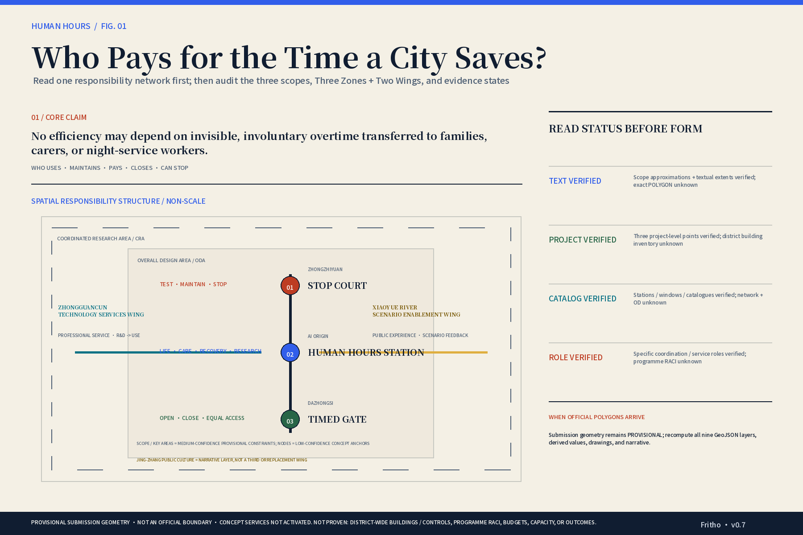
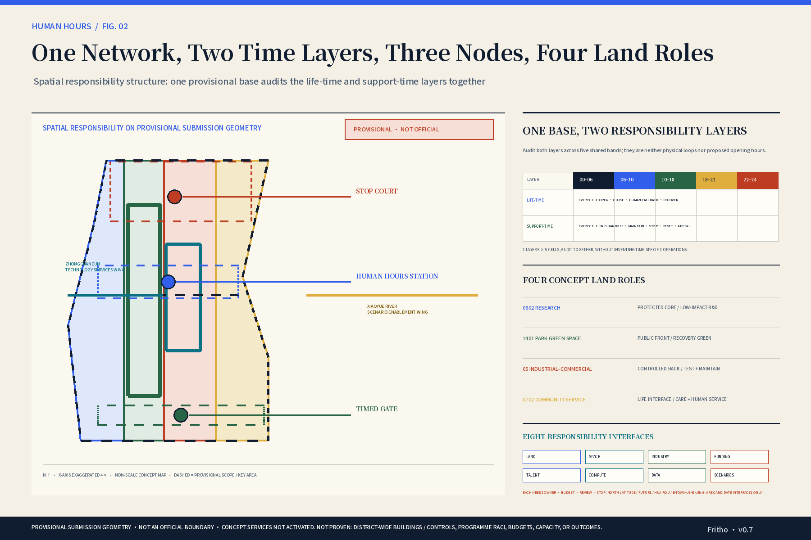
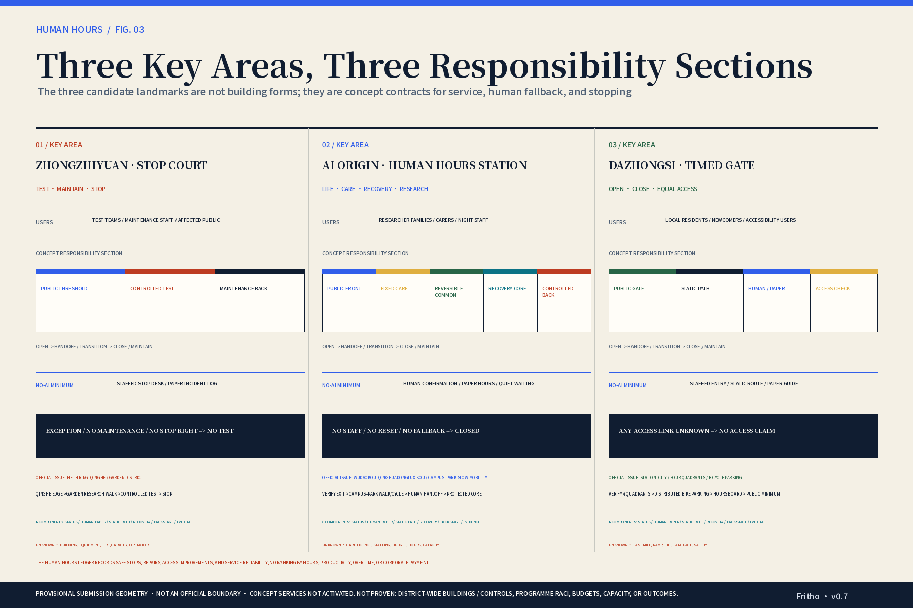
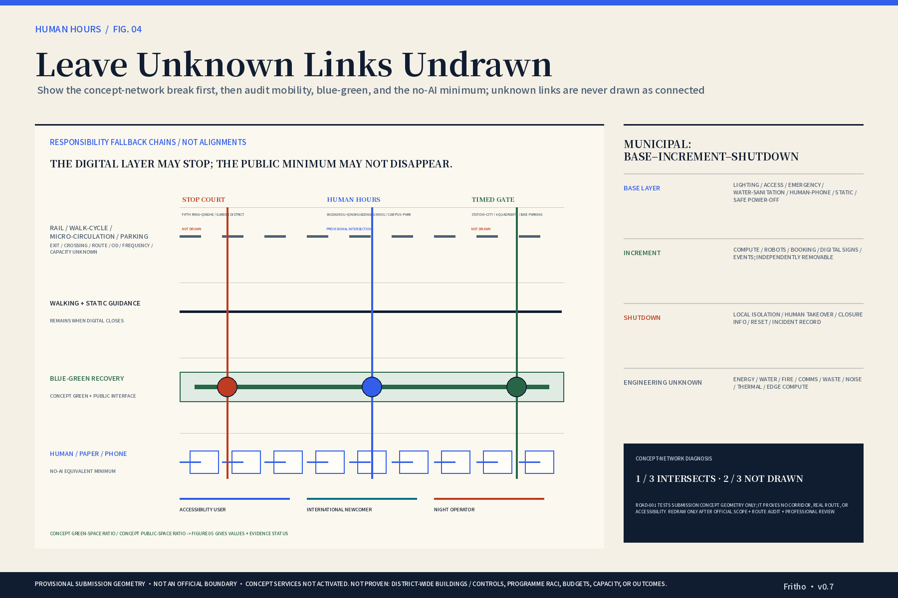
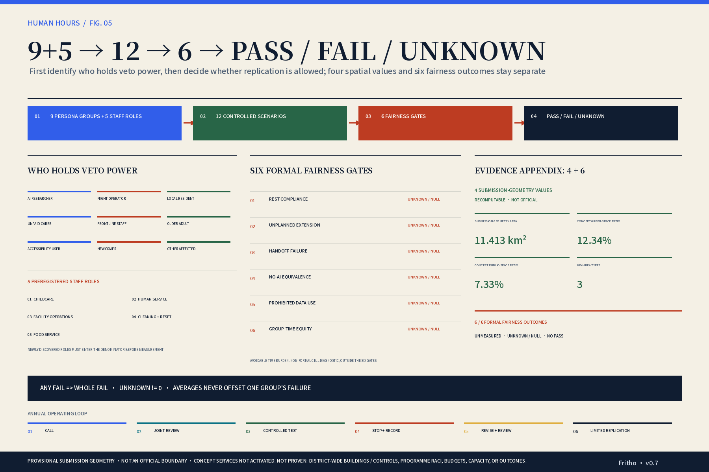

# Jing-Zhang Human Hours / 京张人间时

Credit: Fritho

> A city should not only count how long talent works. It must answer whether every person's time is respected.

## Design Basis and Source List

The proposal treats respect for time as a common test for evidence, space, and operation. The official announcement and agent taskbook define the three work scales, three key areas, mandatory tasks, and deliverables. Repository schemas, enumerations, standards, and provisional polygons define what the package can validate. Time-use, care, labour, accessibility, personal-information, and case-study sources define bounded evidence. National and citywide averages do not become local baselines; law creates limits rather than project-specific legal opinions; cases provide mechanisms rather than transferable performance, permission, brands, or operators. [source:OFFICIAL-ANNOUNCEMENT] [source:AGENT-TASKBOOK] [source:SRC-005] [source:SRC-006]

`SITE-001` and all three `PROV-KEY-*` polygons are repository-maintained provisional geometry. They support content review, topology tests, and composition, but not an official redline, statutory area, ownership, development intensity, engineering placement, or approval. The stated site area is a machine recomputation of this submission geometry only. Once official polygons are available, all nine GeoJSON files, derived metrics, drawings, and prose must be recalculated together. The package therefore keeps the words proposal, candidate, unknown, provisional, and not activated visible. [data:geometry/site_boundary.geojson#SITE-001] [source:BOUNDARY-SOURCE] [metric:site_area_sqm]; the remaining gap depth is recorded at [depth:risk_missing_data]

Completion means that claims return to sources, actions return to spatial objects, and limits return to assumptions and checks. Six compatible fairness metrics enter `metrics.json` as unknown/null. `METRIC-AVOIDABLE-TIME-BURDEN` remains blocked outside the formal export because the schema does not accept `minutes_per_journey`; it is not disguised with another unit. v0.7 adds a public ground-truth ledger to the committed v0.6 baseline and aligns the web master, five bilingual core figures, and Chinese/English A3/A0 outputs; browser, PDF, bilingual, and official-rule status remains governed by recorded machine checks and human review. After human review, v0.7 was finalized with the then-current official workflow: on the current exact head, the manifest and persisted self-check report `package_state=ready_for_review`, `validation_claim.self_checked=true`, and PASS for the deterministic, spatial, visual, and professional gates. This machine-ready state proves document–manifest–hash consistency and reviewability only; it does not upgrade any evidence. Textual official scope, selected project points, transport catalogues, and one specific operating role are verified; exact polygons, district-wide buildings, project OD, programme RACI, and fairness outcomes remain unproven. [source:SOURCE-REGISTRY] [metric:METRIC-EQUITY-BURDEN] [standard:PROJECT-OFFICIAL-ANNOUNCEMENT]

## Three-Level Scope Framework

The three levels are working depths, not three approved redlines. The coordinated research area asks how innovation, service, and public life collaborate. The overall design area asks how those responsibilities enter renewal, land use, transport, blue-green systems, and delivery interfaces. The key areas test the same rules through three different responsibility sections. The taskbook-defined wings are the Zhongguancun Technology Services Wing, which provides professional-service and translation interfaces, and the Xiaoyue River Scenario Enablement Wing, which provides low-risk public-experience and scenario-feedback interfaces. The Jing-Zhang public-culture connection is a narrative layer running through the Three Zones and Two Wings, not an additional or replacement wing. Neither wing proves a physical ring, a signed institution, funded resources, or existing connectivity. [source:SRC-010] [source:SRC-038] [depth:three_level_scope_framework]

The taskbook's three positionings and five functions form a legible 3×5 contract rather than eight separate slogans. The Centennial Jing-Zhang Cultural Belt primarily carries “urban governance discourse,” translating line, station, handoff, maintenance, and reopening into a public language of responsibility. The Urban AI Life Experience Belt primarily carries “scenario empowerment” and “vibrant city,” testing public service, care, mobility, and recovery without always-on operation. The AI Fusion Innovation Belt primarily carries “full-stack innovation” and “global ecosystem,” linking research, professional services, controlled validation, and accountable replication. Each function has one primary spatial bearer and may support the other layers, preventing every zone from claiming every function. [source:AGENT-TASKBOOK] [standard:PROJECT-AGENT-OPEN-CALL-TASKBOOK] [depth:overall_spatial_structure]

The spatial concept is a “Two-Time Network with Autonomous Handoff Seams.” It is not two roads. A public life-time layer publishes opening, closing, human alternatives, and recovery windows. A support-time layer records paid transition, handover, cleaning, maintenance, shutdown, and appeal. Both use the same urban network, but exchange only spatial and responsibility status, never identity, family relationships, sleep, health, or employment profiles. Their seam must expose an accepting role, a static fallback, stop authority, and reopening evidence. [source:SRC-014] [source:SRC-015] [depth:overall_spatial_structure]

Four conceptual land-use roles make the structure testable: public frontstage, protected core, controlled backstage, and life/care interface. The polygons cover the provisional site without overlap, but their ratios are not approved planning allocations. The three key-area types can be counted, while their boundaries remain provisional. Official geometry must be updated before the design partition is regenerated. [data:geometry/land_use.geojson#LU-001] [data:geometry/key_areas.geojson#PROV-KEY-001] [metric:key_area_count] [standard:MNR-LAND-USE-CLASSIFICATION-GUIDE]

## Coordinated Research Area: Industry and Future City Research

Six external cases are translated only as mechanisms and spatial carriers. Vector contributes a “research–translation” chain carried by the protected research core and professional-service wing; Mila contributes recurring communities carried by common rooms with declared opening and closure; AI Singapore contributes project gates carried by review desks and stop records; Seoul AI Hub contributes district-level operation carried by candidate RACI and service windows; Helsinki's AI Register contributes public disclosure carried by the state panel and evidence ledger; AI Hub Safe Zone contributes controlled data access carried by isolated backstage and no-export boundaries. Cases do not transfer brands, performance, budgets, permission, or operators. [source:SRC-017] [source:SRC-019] [source:SRC-022]; regulatory scope is bounded by [source:SRC-038]

The ecosystem is audited through eight elements: land, space, industry, funding, talent, compute, data, and scenarios. Land and space ask who controls access and maintenance; industry and funding ask who bears validation cost and failure; talent asks who is paid for handoff and review; compute and data ask who can isolate, stop, and delete; scenarios ask who may activate, appeal, and exit. Every element must record a candidate provider, daily responsible role, budget status, review role, stop authority, and unverified gaps. [source:SRC-018] [source:SRC-021] [source:SRC-024] Existing conditions remain incomplete until those fields are verified. [depth:existing_conditions_diagnosis]

Regional collaboration is expressed as candidate interfaces, never as existing partnership. The Zhongguancun AI North Latitude Community offers a reference interface for talent, universities, incubation, and industry services; Future Science City offers a scientific-result–industry-problem–professional-translation interface; Huairou Science City offers a controlled large-facility access and result-translation interface. [source:SRC-039] [source:SRC-040] [source:SRC-041] Beijing E-Town and Jing-Jin-Ji robotics mechanisms offer candidate interfaces for manufacturing validation, scenario demand, and cross-regional replication. No interface is activated until a real owner, scope, fee, access condition, data boundary, and exit route are confirmed. [source:SRC-042] [source:AGENT-TASKBOOK]

Agent tasks 1, 2, and 5 connect the name, ecosystem mechanisms, and a self-made cultural grammar of line, station, handoff, maintenance, and reopening. [source:SRC-034] [source:SRC-037] Advanced urbanism is measured by accountable closure, not permanent online availability. [standard:PROJECT-AGENT-OPEN-CALL-TASKBOOK]

## Overall Design Area: Urban Renewal and Regulatory-Plan-Level Urban Design

The Two-Time Network becomes three spatial actions. Public frontstage contains visible service status, human assistance, static maps, accessible routes, and appeals. Protected cores hold research, care, and recovery without being mixed for utilisation. Controlled backstage holds testing, cleaning, maintenance, data isolation, and paid reset. The life interface places care, simple food, quiet recovery, community service, and research collaboration near one another without implying continuous operation. Official land-use codes remain the legal vocabulary; concept roles are additional design attributes rather than invented statutory classes. [data:geometry/land_use.geojson#LU-002] [data:geometry/land_use.geojson#LU-003] [standard:MNR-LAND-USE-CLASSIFICATION-GUIDE]

Six node rules govern renewal: publish service and closure before booking; exchange status without linking identity; provide equally visible, priced, timed, accessible, and appealable non-AI paths; count cleaning, handover, maintenance, and movement as staff-hours; allow on-site and affected-group stop authority; require signed evidence before reopening. A scene cannot enter a node without a human desk, static fallback, protected core, independent backstage, recovery space, or readable closure boundary. [source:SRC-015] [source:SRC-016] [metric:METRIC-NO-AI-EQUIVALENCE]

`buildings.geojson` intentionally remains empty because three project-level records cannot replace cleared district-wide existing-building, ownership, height, structure, and retain/renovate/demolish data. This proposal defines building interfaces, not fictional footprints, and does not turn supply controls, completion filing, or procurement content into an existing-building base, district FAR, or demolition decision. Roads, green space, public space, and phasing remain concept geometry. Professional work must still add surveys, controls, building audits, and capacity checks. [data:geometry/roads.geojson#ROAD-001] [depth:development_intensity_controls] [standard:MOHURD-CONTROL-DETAILED-PLANNING]

v0.7 rewrites four core gaps as a ground-truth ledger of verified fact, remaining unknown, and design consequence:

| Gap | Publicly verifiable now | Still not proven | Design consequence |
|---|---|---|---|
| Official boundary | The announcement publishes approximate three-level areas, textual extents, and the three key-area area components. [source:SRC-010] | Exact polygons or cleared CAD/GIS/PDF | Retain provisional geometry; do not move boundaries, and recompute everything when official polygons arrive |
| Buildings / controls | The two Dazhongsi Bluehome parcels have project-specific supply controls and a transaction record. [source:SRC-043] [source:SRC-044] Xuebei Park has completion filing, five buildings, and approximately 238,300 m²; a July 2026 opening was only a forecast in an April report. [source:SRC-046] [source:SRC-047] AI Origin has an approximately 17,000 m² public-realm record and a Rong HUB renovation procurement. [source:SRC-013] [source:SRC-026] [source:SRC-045] | District-wide footprints, ownership, structure, retain/renovate/demolish status, current opening, occupancy, and capacity | Keep `buildings.geojson` empty; use project points only as control and field-verification entries |
| Network / OD | Dazhongsi station, the Night 4 service window of 23:20–04:50 the following day, and the static rail catalogue can be verified. [source:SRC-027] [source:SRC-029] [source:SRC-032] | Continuous walking/cycling network, stop-level times and reliability, night safety, flows, OD, or journey minutes | Add no inferred route or minutes; retain one-of-three intersections and two NOT DRAWN gaps |
| Operations | Public records identify Dazhongsi and Zhongzhiyuan renewal-coordination entries and one specific operating unit for the AI Origin Community specialised-SME service station. [source:SRC-012] [source:SRC-025] [source:SRC-048] | This proposal's budget, staffing, capacity, windows, appeal, and exit for care, human service, labour audit, data governance, accessibility, and stop/reset | Label only “verified specific roles”; programme RACI remains candidate/TBD and services stay inactive |

The six “interface before connection” records remain active: the AI Origin station–community and campus–park edges, Dazhongsi four-quadrant station–city edge, Zhongzhiyuan Fifth Ring–Qinghe edge, and the two taskbook service wings. New facts only narrow an unknown; they do not automatically add a line or activate a service. Each record still states current evidence, professional verification, do-not-draw condition, and redraw trigger. [data:geometry/roads.geojson#ROAD-001] [standard:PROJECT-OFFICIAL-ANNOUNCEMENT] [depth:overall_spatial_structure]

## Detailed Design of Key Areas

The key areas are three responsibility sections rather than three similar technology parks. Beijing AI Origin Community carries the interface of life, care, recovery, and research; its candidate “Human Hours Station” combines handoff, human service, quiet recovery, and open-source collaboration while keeping protected functions separate. Dazhongsi carries public opening, closing, equal entry, and a minimum public package; its “Timed Gate” makes service windows, non-AI alternatives, accessibility, and appeals legible before entry. Zhongzhiyuan carries controlled testing, maintenance, data isolation, and stop rights; its “Stop Court” makes failure, shutdown, reset, and reopening visible. [data:geometry/constraints.geojson#NODE-HUMAN-HOURS-STATION] [data:geometry/constraints.geojson#NODE-TIMED-GATE] [data:geometry/constraints.geojson#NODE-STOP-COURT]

Origin places a public front between research and community life, with account-free human/paper access, a fixed protected core, and reversible common space. Dazhongsi organises arrival, waiting, commerce, and public service as a timed sequence with an independent static path. Zhongzhiyuan separates the testing front from cleaning, maintenance, devices, and data backstage; operators can stop systems, and export or reopening requires review. These actions do not claim service hours, transport connection, capacity, or local permission. [source:SRC-007] [source:SRC-023] [source:SRC-024]; depth is tracked by [depth:three_key_area_detailed_design]

Officially named site issues are verification entries, not assumed existing conditions. AI Origin responds to Wudaokou–Qinghuadongluxikou and campus–park slow mobility by verifying station exits, crossings, campus/park gates, ramps, lifts, parking, and ownership boundaries before discussing a walking/cycling interface, human handoff, and protected core. Dazhongsi responds to station–city integration, four-quadrant walking, and bicycle parking by verifying exits, signals, quadrant continuity, accessibility, and parking conflicts before discussing distributed parking, an arrival porch, and a timed board. Zhongzhiyuan responds to the Fifth Ring–Qinghe interface and a garden-style district by verifying crossing conditions, waterfront/green ownership, flood safety, maintenance access, and test boundaries before discussing a Qinghe observation edge, garden research walk, and controlled test. An unverified item never becomes an engineering alignment, interchange, or connection claim. [standard:PROJECT-OFFICIAL-ANNOUNCEMENT]

Each key area therefore becomes a conditional package. AI Origin combines station-edge verification, walking/cycling interface, human/paper front, one-time handoff, protected core, and quiet recovery; unverifiable care credentials, staffing, cover, or exit closes the increment. Dazhongsi combines four-quadrant verification, distributed bicycle parking, arrival porch, timed board, static accessible path, and minimum public package; an unknown slope, lift, language, safety, or human chain withdraws the access claim. Zhongzhiyuan combines Qinghe observation edge, garden research walk, public observation edge, controlled test, physical stop, maintenance reset, and data separation; any crossing, safety, labour-time, data, or stop-right failure means stop or no connection. These are candidate sequences and verification checklists, not building, road, or engineering design. [depth:renewal_project_list] [assumption:ASM-011]

Three real project points make verification more concrete without changing that boundary. AI Origin Rong HUB is a proposed renovation inside the Origin Building; Dazhongsi Bluehome controls require study of an integrated station connection through an elevated corridor or underground passage; and Xuebei Park at Zhongzhiyuan's northern end has five buildings and approximately 238,300 m² of project scale. They give the public front, timed arrival, and controlled research district reviewable objects, but prove neither landmark siting, service opening, nor programme responsibility. [source:SRC-045] [source:SRC-043] [source:SRC-047]

The three points are non-scale conceptual anchors, not building sites. Six component families form a reusable public-space kit: service-state post; human/paper front desk; static accessible path; quiet-recovery unit; paid handoff and maintenance backstage; and shutdown/reopening evidence surface. Components may be combined but do not preselect products, dimensions, materials, or equipment. A “Human Hours Contribution Ledger” records safe shutdown, maintenance reset, repaired care handoffs, accessibility improvements, public-service reliability, and evidence-backed failure disclosure. It forbids ranking by individual hours, productivity, overtime, or corporate payment, and allows withdrawal, correction, and dispute flags. If official key polygons change, anchors and components must be researched again. [data:geometry/key_areas.geojson#PROV-KEY-002] [source:KEY-AREA-SOURCE] [depth:height_massing_character]

## AI Innovation Ecosystem, Personas, and AI+ Scenarios

Two composite protagonists test five time bands without impersonating residents. One is an AI researcher new to Haidian who shares childcare; the other is a facilities or robotics operator with planned night work and daytime family-care responsibility. The researcher tests care handoff, daytime collaboration, and recovery. The operator tests shutdown, paid handover, and post-night-shift recovery. No name, age, gender, origin, address, family arrangement, exact route, or minutes are invented. Seven further persona categories act as independent veto holders so the two protagonists never stand for all residents. [source:SRC-005] [source:SRC-009] [assumption:ASM-005] [metric:METRIC-EQUITY-BURDEN]

Both protagonists also run a four-question responsibility audit across opening, use, failure, and reopening. Before opening, ask who commits to opening and show state, human access, and the responsible shift. During use, ask who pays for waiting and detours and record an equivalent no-AI path and staff time. On failure, ask who retakes responsibility and can stop, with static fallback, human takeover, and physical stop. Before reopening, ask who signs off paid reset, with a failure record, review, and reopening evidence. This is a scenario-by-scenario responsibility check, not a real route, interview finding, or new spatial axis. [source:SRC-014] [metric:METRIC-HANDOFF-FAILURE]

Agent task 3 produces twelve independently readable scenario cards: one-time handoff token; protected recovery after night work; multilingual service without one account; paid mode-switch test; timed-service board; night-return information without personal tracking; accessibility chain-break stress test; public hours without a work badge; robot safe-stop station; separation of device logs from employment systems; time-transfer simulator; and public audit of urban rhythms. Each card shows user/staff role, primary node, time band, non-AI minimum, minimum/prohibited data, human takeover, budget role, stop condition, and metric rather than only a title. SC-06-04/07/09/10/11 are the five industry tests for paid transition, accessibility break, robot stop, employment-data isolation, and time transfer; SC-06-12 places failures, corrections, and reopening in the annual public audit. No public activation or replication follows an unpassed test. [source:SRC-014] [source:SRC-016] [metric:METRIC-PROHIBITED-DATA-USE]

| Card | Node · time · users/staff | No-AI · budget · takeover | Data boundary · stop · metrics |
|---|---|---|---|
| SC-06-01 One-time handoff | AI Origin · 06–10 · researcher/unpaid carer; childcare/human service | Staff registration + paper token + phone referral; care/public-service roles pay; staff accept/pause/refer | One-time booking/aggregate capacity; no employer identity, trace, or family graph; unpaid family wait stops; handoff/no-AI/data |
| SC-06-02 Post-night recovery | AI Origin · 06–18 · night operator/unpaid carer; operations/human service | Posted windows + worker-declared protection; employer/test sponsor funds cover; worker/representative may close | Aggregate capacity only; no sleep, care, or fatigue score; standby conversion stops; rest/extension/data |
| SC-06-03 Multilingual, no account | AI Origin/Dazhongsi · 10–18 · newcomer/older adult/early-career researcher; human service | Multilingual paper + phone interpretation + staffed desk; public-service role pays; user may bypass AI | No required personal data; no passport retention, unified identity, or nationality profile; forced account stops; no-AI/equity/data |
| SC-06-04 Paid switch test | Three zones · 18–24 · operator/resident/founder; cleaning/service/operations | Dual paper checklist + separation + sign-off; event/test sponsor pays; any of three staff groups may refuse | Isolated safety log; no reset ranking; unpaid switch stops; extension/rest/data |
| SC-06-05 Timed-service board | Dazhongsi/AI Origin · 18–22 · resident/older adult/researcher; human/food service | Static hours + paper detour + staffed notice; node operator pays; staff may override wrong state | Aggregate capacity; no trace, badge, consumption profile; false 24/7 claim stops; handoff/no-AI/equity |
| SC-06-06 No-track night return | Dazhongsi · 22–06 · researcher/operator/newcomer; human service | Static map + phone + emergency contact; information/node roles pay; lawful human response takes over | Aggregate capacity; no continuous location, face ID, or risk score; stored route stops; no-AI/data/time burden* |
| SC-06-07 Accessibility break test | Dazhongsi · 06–10/18–22 · accessibility user/older adult/resident; human/cleaning | Human inspection + physical journey + posted alternative; venue/event role pays; user representative may veto | No required personal data; no disability dossier, face/gait, or route retention; failed path shown open stops; equity/no-AI/handoff |
| SC-06-08 No-badge public hours | Dazhongsi · 10–22 · resident/older adult/founder; human/cleaning | Human count + public quota + visible rule; event/venue roles pay; community/staff restore the minimum | Aggregate capacity; no badge, consumption, membership, or dwell trace; badge priority stops; equity/no-AI/extension |
| SC-06-09 Robot safe stop | Zhongzhiyuan · 00–06 · operator/resident; facility operations | Physical stop + human check + dual handoff; test/equipment roles pay; operator and safety lead may stop | Isolated safety log; no response ranking, cancelled stop, or biometrics; model override stops; rest/extension/data |
| SC-06-10 Log separation | Zhongzhiyuan · 22–06 · night operator; facility operations | Human log reading + dual review + local repair list; equipment/test roles pay; operator may reject model advice | Isolated safety log; no performance, pay, or shift penalty; HR transfer stops; data/extension |
| SC-06-11 Time-transfer simulator | Three zones · five bands · 9 personas/5 staff roles | Tabletop drill + static detour + closure list; zone/test roles pay; local and affected representatives may veto | Aggregate/synthetic data only; no identity, payroll, location, or cross-site route; an average hiding one group stops; handoff/time burden*/equity/data |
| SC-06-12 Public rhythm audit | Three zones · five bands · 9 personas/5 staff roles | Public ledger + meetings + labour review + paper rhythm map; node/civic roles pay; four representative groups may veto ranking | Aggregate capacity; no personal time ledger, productivity, or care identity; model-filled unknown stops; all six gates |

`*` Time burden is a non-formal cell diagnostic outside the six formal gates. The bilingual web layer and A3 cards are generated from the same catalogue; one repeated field directory cannot substitute for twelve distinct contracts.

The five bands are review cells, not proposed business hours. Every cell asks who pays for saved time. A gain for a researcher fails if care, cleaning, or operations staff incur unpaid extension. Continuous response fails without an equivalent human path. Efficiency based on sleep, family, route, or employment inference fails. AI may use node-by-time aggregate capacity, authorised bookings, and device status; it may not score personal productivity or persistently link identities across nodes. [metric:METRIC-HANDOFF-FAILURE] [metric:METRIC-REST-COMPLIANCE] [metric:METRIC-UNPLANNED-EXTENSION]

## Land Use, Building Scale, and Retain-Renovate-Demolish Strategy

Land use first expresses responsibility. `LU-001` uses code 0802 for the protected research core; `LU-002` uses 1401 for a public green frontstage; `LU-003` uses 05 for controlled translation, testing, and professional services; `LU-004` uses 0702 for care, recovery, and human-service interfaces. The four polygons provide complete, non-overlapping topology within the provisional site. Their proportions are not an existing-condition survey or an approved amendment. Official conditions, existing use, ownership, and professional classification must precede any statutory conclusion. [data:geometry/land_use.geojson#LU-001] [data:geometry/land_use.geojson#LU-004] [depth:land_use_layout]

Building design remains a section and interface strategy. The frontstage needs a visible human desk, accessible waiting, static information, and a closable boundary. Protected cores need acoustic, hygiene, privacy, and entry separation. Backstage needs device maintenance, paid reset, audit, and no-export data rooms. The life interface may place care, food, recovery, and service near one another without mixing their regimes. Candidate landmarks combine these requirements but do not assert footprints or floor area. [source:SRC-007] [source:SRC-024] [depth:height_massing_character]

Retain, renovate, or demolish follows a reversible order: clear building age, structure, use, ownership, fire safety, heritage, and leases; classify protection, adaptive reuse, renewal, or unknown; only then design capacity and form. Until those inputs exist, the building layer stays empty and FAR is omitted. The empty layer prevents false certainty and makes the remaining professional data gap visible. [assumption:A-CONTROLS-001] [depth:retain_renovate_demolish] [standard:MOHURD-URBAN-DESIGN-MEASURES]

## Transport, Rail, Municipal Infrastructure, and Public Services

Transport first guarantees intelligibility when services disconnect. `ROAD-001` is a conceptual timed walking and human-service corridor. Digital status may report opening, crowding, or accessibility interruption, but static mapping, ground guidance, telephone, and human access remain independent. Dazhongsi and Qinghe station pages, a night-bus service window, static bus/rail catalogues, and the city slow-mobility action plan form `CATALOGUE VERIFIED` field entries only. They do not establish a continuous project walking/cycling network, OD, stop-level connection, reliability, night safety, capacity, or minutes, so proximity to a station is never written as accessibility. [source:SRC-027] [source:SRC-029] [source:SRC-032]

The mobility concept has four provisional layers. Rail interchange verifies exits, transfer, service windows, and accessibility; unknown location, connection, frequency, or capacity means no access claim. Walking/cycling verifies four-quadrant crossings, the campus–park interface, and a Qinghe green link; unknown route, slope, lighting, or safety means no drawn alignment. Micro-circulation defines only responsibility for human connection, closure detours, and paid movement; no owner, schedule, OD, or cover budget means no activation. Static mobility proposes only distributed bicycle parking and candidate accessible pickup modules; unknown ownership, capacity, fire safety, or conflicts means no siting or quantity. No layer adds a road, changes signals, or presumes rail connection. [standard:PROJECT-OFFICIAL-ANNOUNCEMENT]

An EPSG:4548 diagnosis of repository concept geometry finds that the sole `ROAD-001` intersects only one of three provisional key-area polygons; Zhongzhiyuan and Dazhongsi, two of three, do not intersect it. This result only shows that the current submission layers cannot support a continuous three-zone corridor, much less real accessibility. The proposal therefore retains two NOT DRAWN gaps rather than moving or adding alignments for visual completeness. Official scope, a continuous route audit, and the matching professional interface review must all exist before source geometry, drawings, and metrics are redrawn. [data:geometry/roads.geojson#ROAD-001] [data:geometry/key_areas.geojson#PROV-KEY-001] [depth:traffic_rail_slow_parking]

For the researcher, morning and evening handoff must combine care confirmation, human transport information, and fallback. For the night operator, morning travel and handover are paid responsibility windows, not expendable buffers for on-time opening. Accessibility testing covers slope, lift, surface, information, language, and assistance; any unknown prevents an accessible claim. AI offers aggregate status without retaining personal trajectories, while static paths still complete the minimum task or state unavailability clearly. [source:SRC-016] [metric:METRIC-NO-AI-EQUIVALENCE] [metric:METRIC-EQUITY-BURDEN]

Municipal and service design uses a base–increment–shutdown topology. The base layer contains lighting, accessibility, emergency contact, water/sanitation, human or telephone service, static guidance, and safe power-off. The incremental layer contains compute, robots, booking, digital signs, and events. The shutdown layer contains local isolation, human takeover, closure information, cleaning/reset, and incident records. Every layer must expose supply entry, daily operation, fault isolation, human fallback, and reopening evidence. Energy, water/drainage, fire, communications, waste, noise, thermal, and edge-compute capacities remain UNKNOWN, so the topology does not represent pipes, loads, devices, or engineering feasibility. Without budget, role, replacement staff, maintenance window, human fallback, or appeal responsibility, the incremental layer remains not_activated. [assumption:ASM-011] [depth:municipal_new_infrastructure] [standard:MOHURD-CONTROL-DETAILED-PLANNING]

## Blue-Green Network, Public Space, and Urban Character

The Jing-Zhang public-culture narrative layer—not a taskbook-defined wing—contributes a grammar of responsibility rather than nostalgic form: line means continuous public path, station means a readable service node, handoff means transfer of responsibility, maintenance means visible labour, and reopening means evidence after failure. Official planning and phase-one sources support public life, phased participation, and the relationship between rail traces and open space. They do not prove full completion, capacity, or landmark placement. The proposal uses original lines, gaps, state panels, and time marks instead of copied railway symbols, maps, exhibitions, components, or photographs. [source:SRC-034] [source:SRC-035] [depth:blue_green_public_space]

`GREEN-001` is a conceptual recovery and handoff corridor; `PUBLIC-001` is a conceptual minimum public package and autonomous seam. Their ratios are reproducible from provisional geometry but are not existing or approved performance. Digital services may close while shade, seating, accessibility, water, static guidance, and safety contact remain the non-digital base. The interface shows who is responsible, what is unavailable, how to appeal, and what permits reopening. Insufficient staff or maintenance closes the service instead of consuming backstage time. [data:geometry/green_space.geojson#GREEN-001] [data:geometry/public_space.geojson#PUBLIC-001] [metric:green_ratio] [metric:public_space_ratio]

Urban character makes time responsibility visible. Human Hours Station marks pause between research and care; Timed Gate marks honest opening and closure; Stop Court marks failure and maintenance. Night design distinguishes staffed service, static access, maintenance closure, and ecological darkness rather than maximising brightness. This drawing set shows provisional geometry, inactive services, static fallbacks, backstage labour, and reopening conditions on the same page. [source:SRC-036] [source:SRC-037] [standard:MOHURD-URBAN-DESIGN-MEASURES]

## Renewal Projects, Implementation Policy, and Phasing

Implementation is an annual evidence loop rather than build then open: public problem call and affected-group review; professional and public-interest review; limited controlled test; recording of failure, labour, and exit; shutdown and revision; renewed review; then limited replication. `PHASE-001` is a candidate envelope for the first loop, not a phase-one redline, programme, or investment commitment. Agent task 6 gives each project a candidate RACI and records unverified budget, staffing, data control, maintenance, appeal, and exit. [data:geometry/phasing.geojson#PHASE-001] [depth:phasing_implementation] [assumption:ASM-011]

The first portfolio is consolidated into three stoppable work packages. WP-01 “Evidence Base” replaces official polygons, completes building/ownership/control/transport/municipal baselines, and freezes preregistration for the six gates; incomplete inputs remain UNKNOWN and do not enter engineering. WP-02 “Three-Zone Prototypes” uses six public-space component families to carry twelve scenario cards and five industry tests; without equivalent human/paper access, replacement staffing, stop/reset, or data isolation, it does not open. WP-03 “Annual Operation and Regional Interfaces” runs problem calls, joint review, controlled tests, stop records, correction, re-review, and limited replication, sending only de-identified evidence to five candidate regional interfaces; without real owners, budgets, logs, or representative review, it does not replicate. [source:SRC-019] [source:SRC-022] [metric:METRIC-PROHIBITED-DATA-USE]

| Candidate operating unit | Candidate cadence | Deliverable output |
|---|---|---|
| Human Hours Open Week | Annual | Public audit, unresolved disputes, and rotating experience at three landmarks |
| Open-Scenario Clinic | Quarterly | Problem briefs, no-AI baseline drills, and controlled-test intake |
| Developer Responsibility Review | Monthly / quarterly | Open component review, failure retrospective, and data-boundary check |
| Three-Landmark Maintenance Day | Quarterly | Audit state posts, static paths, recovery units, and stop/reopen evidence surfaces |
| Bilingual Evidence Release | After each audit | International communication publishes traceable evidence, unknowns, and replication conditions only |
| Attraction and Conversion Gate | Per project | Problem brief → controlled test → six gates → limited replication / stop |

These names and cadences are candidates, not existing brands or operating commitments. Operator, venue, budget, participation scale, and dates all remain TBD. No real RACI, budget, cover, insurance, data control, or representative review means no launch. International communication cannot present candidate interfaces as partners, and attraction cannot bypass the six gates or offset one group's failure with investment. [standard:PROJECT-AGENT-OPEN-CALL-TASKBOOK]

The public list names Beijing Dongsheng Agricultural, Industrial and Commercial Corporation as the operating unit of the AI Origin Community specialised-SME service station; public project notices also provide Dazhongsi and Zhongzhiyuan renewal-coordination entries. These are specific contactable verification roles, not the programme RACI for this proposal. A scene may move from `candidate/TBD` toward a controlled pilot only after its care, human-service, staff-hours, budget, data, accessibility, stop, appeal, and exit responsibilities are individually confirmed. [source:SRC-048] [source:SRC-012] [source:SRC-025]

Policy concentrates on responsibility interfaces. Procurement makes paid handover, non-AI equivalence, employment-data separation, and stop authority acceptance criteria. [source:SRC-008] [source:SRC-014] Site agreements distinguish public, protected, and controlled domains. Operating agreements freeze windows, roles, and failure definitions. A public register lists purpose, data, owner, human access, limits, and change history. [source:SRC-023] All organisations, budgets, and dates remain candidate/TBD until confirmed. Each node proves itself independently; aggregate success cannot offset one failure. [depth:renewal_project_list]

## Metrics, Area Recalculation, and Compliance Matrix

Metrics have two layers. Machine-consistency metrics cover provisional site area, green ratio, public-space ratio, and the count of three key areas; they change with official geometry and carry low or medium confidence. Fairness gates cover rest compliance, involuntary extension, handoff failure, equivalent non-AI service, prohibited data processing, and equitable time burden. All six are unknown/null because no frozen review window, complete event logs, denominator coverage, or nine-persona/five-role testing exists. Targets are design gates, never a measured baseline or result. [metric:site_area_sqm] [metric:METRIC-REST-COMPLIANCE] [metric:METRIC-EQUITY-BURDEN] [assumption:ASM-012]

Measurement remains cell-by-cell: scene × node × time band × persona/role × ability/language channel. One failed shift, involuntary extension, unpaid transfer, prohibited processing, or unequal non-AI path prevents PASS; incomplete coverage is UNKNOWN, not zero. The avoidable time-burden metric retains a minutes-per-journey diagnostic outside formal export because the current schema rejects that unit. It can return only through an approved schema extension or a separately confirmed semantic redesign. [metric:METRIC-UNPLANNED-EXTENSION] [metric:METRIC-NO-AI-EQUIVALENCE] [assumption:ASM-013]

Planning methods now land in one primary drawing, one human-readable acceptance field, and one redraw trigger:

| Method | Primary deliverables | Human-readable acceptance field |
|---|---|---|
| Three-level scope + official 3×5 | Fig. 01 · A3 02/03 · A0-1 | Three Zones + Two Wings, three positionings, and five functions are findable within ten seconds; no third-wing or statutory-redline implication |
| Two-time network + four concept land roles | Fig. 02 · A3 05 · A0-1 | Two responsibility layers, four roles, and 0802/1401/05/0702 mappings are legible as a concept overlay only |
| Three conditional key-area packages | Fig. 03 · A3 06 · A0-1 | Each area shows its official issue, verification sequence, no-AI minimum, and stop condition |
| Interface evidence + concept-network diagnosis | Fig. 04 · A3 07 · A0-2 | Shows one-of-three intersections and two NOT DRAWN gaps; makes no three-zone connectivity or accessibility claim |
| Two protagonists × four questions + twelve scenarios | A3 04/08 · web scenario cards | Four responsibility moments land in spatial evidence; all 12 cards expose people, time, place, budget, data, takeover, stop, and metrics |
| 4+6 evidence ledger + delivery loop | Fig. 05 · A3 09/10 · A0-2 | Four recomputable values and six unmeasured outcomes stay separate; UNKNOWN≠0 and any FAIL stops the whole |

If official scope, scenario contracts, metrics, or schema change, only the affected row and its downstream references are redrawn; copy cannot make an obsolete drawing “pass.” [standard:PROJECT-OFFICIAL-ANNOUNCEMENT] [depth:metrics_recalculation] [source:SOURCE-REGISTRY]

The structured package maps 23 tasks, five mandatory standards, and fifteen professional-depth items. Each row will use the smallest relevant chapter, geometry, metric, drawing, source, assumption, and check set. A module-08 cross-reference test must validate every foreign key because the official validator currently checks non-empty arrays but not their targets. Provisional geometry and missing operations may remain disclosed gaps in ready_for_review, but cannot support precision, statutory control, activation, or performance. [standard:PROJECT-OFFICIAL-ANNOUNCEMENT] [depth:metrics_recalculation] [source:SOURCE-REGISTRY]

## Risk, Copyright, and Compliance

The primary risk is cost transfer to invisible people. Labour risk hides on-call, recall, handover, cleaning, maintenance, and movement outside paid time. Privacy risk links capacity to family, sleep, health, trajectory, or employment. Equity risk lets averages erase one group's failure. Spatial risk treats rough rectangles as redlines and points as building sites. Implementation risk treats candidate operators, budgets, and windows as commitments. Controls are paid transition, separated data domains, disaggregated gates, persistent provisional labels, candidate_unverified status, and independent stop authority. [source:SRC-008] [source:SRC-014] [metric:METRIC-PROHIBITED-DATA-USE]

Closure, degradation, and unknown are design qualities. Missing human service, replacement staff, maintenance, static fallback, or accessibility closes the incremental layer. Incomplete audit stays UNKNOWN. Prohibited data use or involuntary extension fails the scene. New official geometry invalidates derived layers until recalculated. Four human gates remain: G1 locks the direction and one-sentence proposition; G2 locks the name, slug, and overall structure; G3 locks the Three Zones, scenarios, landmarks, and persona journeys; G4 is RootReturn0's final preflight review and submission decision. Fritho cannot cross G4, publish, submit, or create official commitments. [assumption:A-PROVISIONAL-GEOMETRY-001] [metric:METRIC-HANDOFF-FAILURE] [depth:risk_missing_data]

The package uses `COMMUNITY-DISPLAY-ONLY`. Source pages, legal text, institutional names, brands, historic images, maps, exhibitions, logos, and third-party assets retain their own rights. We paraphrase bounded facts and link sources; we do not claim case organisations participate. Final drawings use cleared or self-made assets; figure and PDF typography uses registered SIL OFL 1.1 fonts that permit embedding and redistribution, and the font software is not relicensed under the package licence. [source:FONT-NOTO-SC] Any generated image requires prompts, human edits, source notes, and a replacement list. [source:SRC-034] [source:SRC-036] [standard:PROJECT-AGENT-OPEN-CALL-TASKBOOK]

## References

Authoritative task entries are the official announcement, repository site package, agent taskbook, and source registry. They support tasks, formats, boundary status, and allowed source use respectively; no navigation document replaces an original authority. [source:OFFICIAL-ANNOUNCEMENT] [source:SITE-PACKAGE] [source:AGENT-TASKBOOK]; source-use status is in [source:SOURCE-REGISTRY]

Human-time and public-interest references include national time-use statistics, Beijing commute context and childcare guidance, Chinese working-time rules, ILO guidance, personal-information law, algorithm rules, and accessibility law. Their scales and legal scopes remain explicit. Project service windows, job regimes, controllers, and facilities require local verification. [source:SRC-005] [source:SRC-007] [source:SRC-008]; accessibility scope is in [source:SRC-016]

Innovation references include Vector, Mila, AI Singapore, Seoul AI Hub, Helsinki AI Register/Talbotti, and AI Hub Safe Zone. Only bounded mechanisms of research translation, community, project gates, controlled testing, responsibility disclosure, human windows, and no-export data environments are used. Names, images, layouts, eligibility, budgets, performance, and regulatory contexts are not copied. [source:SRC-017] [source:SRC-019] [source:SRC-021]; the controlled-data reference is [source:SRC-024]

Regional candidate-interface references include public information from the Zhongguancun AI North Latitude Community, Future Science City, and Huairou Science City. They support only interface categories for talent and entrepreneurship, result translation, and controlled scientific access, not partnership or resource availability. [source:SRC-039] [source:SRC-040] [source:SRC-041] Public mechanisms from Beijing E-Town and Jing-Jin-Ji “robotics+” support candidate directions for manufacturing validation, scenario demand, and cross-regional coordination; enterprises, facilities, policies, budgets, and performance are not transferred. [source:SRC-042]

Jing-Zhang and Zhongguancun references include the railway heritage park planning explanation and phase-one opening, the Zhongguancun history museum, official development history, and the demonstration-zone regulation. They support a narrative grammar of public life, phased participation, line–station–maintenance–reopening, and research–service–translation. They do not prove site continuity, asset rights, operational capacity, or partnership. Full URLs, dates, usage, and limits are retained in `sources.json`. [source:SRC-034] [source:SRC-035] [source:SRC-037]; the institutional boundary is [source:SRC-038]
