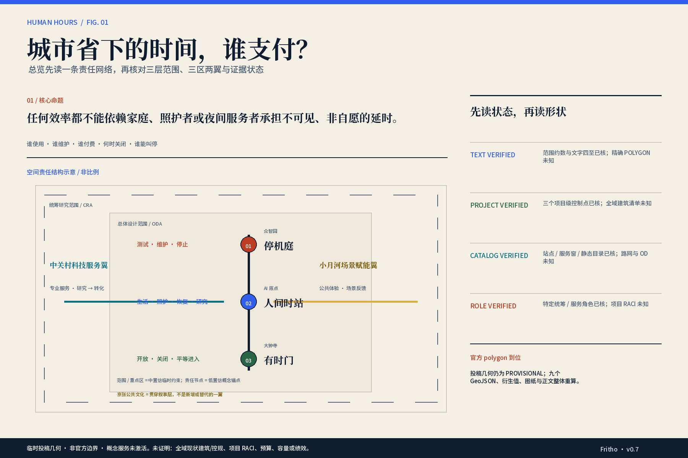
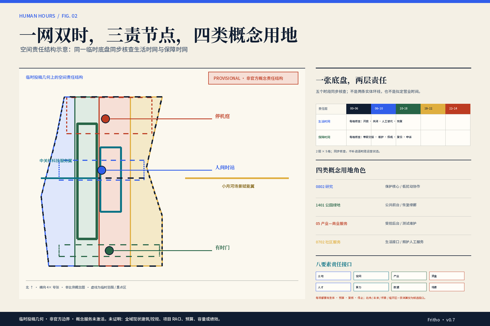
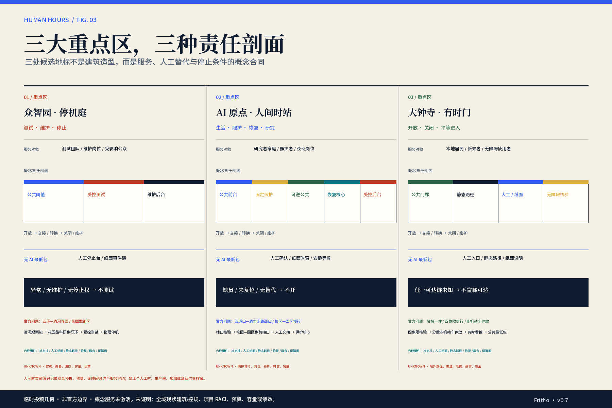
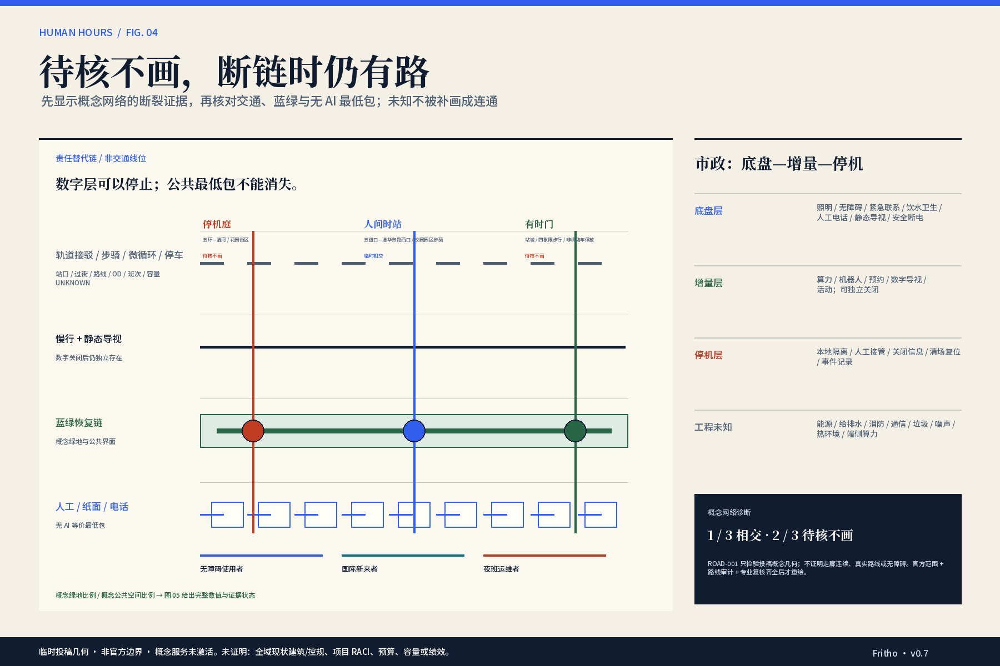
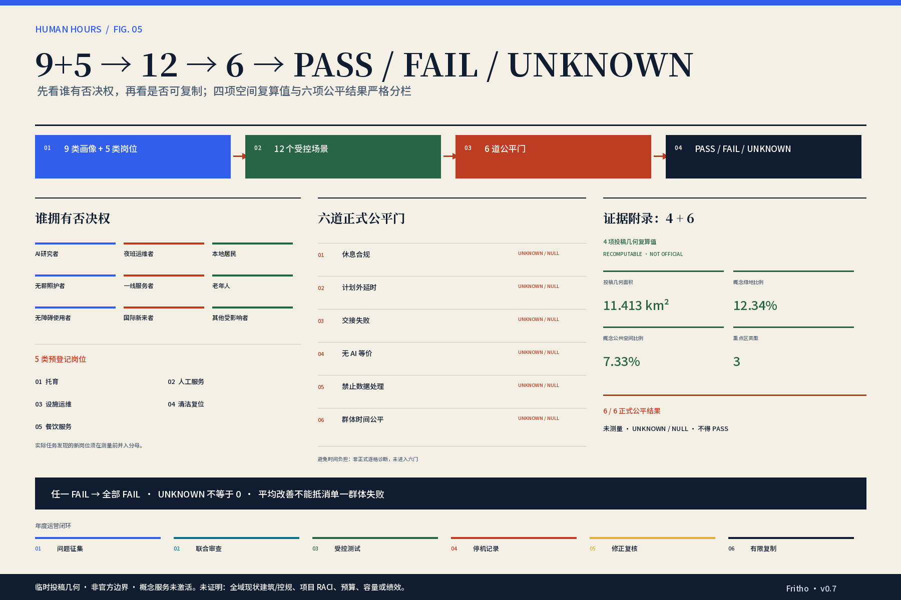

# 京张人间时 / HUMAN HOURS

署名：Fritho

> 城市不能只计算人才工作了多久，还要回答每个人的时间是否被尊重。

## 设计依据与资料清单

本方案把“时间是否被尊重”作为证据、空间和运营的共同审查问题，而不是把 AI 当作必须扩张的功能。第一层依据是公开征集公告与面向智能体任务书，它们规定三层工作范围、三处重点区域、必选任务和成果深度；第二层是仓库中的 schema、枚举、标准与临时边界；第三层是时间使用、照护、劳动、无障碍、个人信息和案例来源。每个来源只支持其可支持的事实：全国时间利用与全市通勤资料只校准问题结构，不代替海淀样本；法规只形成底线与待核条款，不形成个案法律意见；外部案例只转译角色、关卡和披露机制，不迁移绩效、品牌或许可。[source:OFFICIAL-ANNOUNCEMENT] [source:AGENT-TASKBOOK] [source:SRC-005]；通勤背景另见 [source:SRC-006]

当前 `SITE-001` 与三处 `PROV-KEY-*` 均为仓库维护的临时粗略多边形。它们可支撑内容评议、拓扑检查和图面构图，但不是官方红线，不支撑法定面积、权属、控规强度、工程落位或审批结论。图中的 11,412,825.386 平方米只是在 EPSG:4548 下对当前临时投稿几何的机器复算值；取得官方 polygon 后，九个 GeoJSON、所有面积比例、图纸和正文须整体重算。主稿因此持续使用“建议、候选、未知、未激活”，不会把精度警示藏进脚注。[data:geometry/site_boundary.geojson#SITE-001] [source:BOUNDARY-SOURCE] [metric:site_area_sqm]；缺口深度另见 [depth:risk_missing_data]

完成标准不是“看起来完整”，而是判断能回到来源，动作能回到空间对象，限制能回到假设与自检。`sources.json` 保存来源用途，`assumptions.json` 保存开放假设，六项公平指标以 unknown/null 进入 `metrics.json`；`METRIC-AVOIDABLE-TIME-BURDEN` 因正式 schema 不支持 `minutes_per_journey` 而继续留在模块 07 的阻断目录，不用 `none` 或 `ratio` 伪装。v0.7 在已提交的 v0.6 基线上新增公开事实证据账，并同步网页、五张双语主图及中英文 A3/A0；浏览器、PDF、双语和官方规则校验仍以机器检查与人工复核记录为准。v0.7 已在用户人审后按当时最新官方流程刷新 manifest 和持久化 self-check；当前 exact head 的 `package_state=ready_for_review`、`validation_claim.self_checked=true`，deterministic、spatial、visual 和 professional 四门检查均为 PASS。该机器就绪状态只证明文档—清单—哈希的一致性与可审阅性，不升级任何证据：官方范围文字、部分项目点、交通目录和一项特定运营角色得到核验，但精确 polygon、全域建筑、项目 OD、programme RACI 与公平绩效仍未获得证明。[source:SOURCE-REGISTRY] [metric:METRIC-EQUITY-BURDEN] [standard:PROJECT-OFFICIAL-ANNOUNCEMENT]

## 三层范围工作框架

三层范围首先是工作深度，不是三套已批红线。统筹研究范围回答“创新、服务与公共生活如何协同”；总体设计范围回答“这些责任怎样进入城市更新、用地、交通、蓝绿和实施接口”；重点区域回答“同一规则怎样在三种责任剖面中被验证”。本方案采用 S1.1“三区两翼”的组织：三处重点区域承担不同主责，任务书规定的中关村科技服务翼提供专业服务与转化接口，小月河场景赋能翼提供低风险公共体验与场景反馈接口。京张遗址公园公共文化联系是贯穿三区两翼的叙事层，不构成新增或替代的一翼。两翼都不是新建的物理环线，也不意味着任何机构已签约、资源已到位或线路已连通。[source:SRC-010] [source:SRC-038] [depth:three_level_scope_framework]

任务书的三大定位与五大功能在本方案中形成一个可读的 3×5 合同，而不是八个口号。“百年京张文化带”通过线路—站点—维护—重开的公共语法连接“AI 治理全球话语权”；“都市 AI 生活体验带”通过公共最低包、分时开放与无 AI 等价连接“AI+场景赋能新范式”和“智能化 AI 活力城市”；“AI 融合创新带”通过研究—转译—受控测试—有限复制连接“AI 全栈自主创新体系”和“世界级 AI 创新生态”。功能落位也保持唯一主责：全栈体系由众智园与科技服务翼承接，创新生态由 AI 原点与科技服务翼承接，场景赋能由大钟寺与小月河翼承接，活力城市由三区公共空间共同承接，治理话语由停机庭、公开审计和贡献簿共同承接。[source:AGENT-TASKBOOK] [standard:PROJECT-AGENT-OPEN-CALL-TASKBOOK] [depth:overall_spatial_structure]

空间结构称为“**双时网—自治交接缝**”。双时网不是两条道路：一层是公众、研究者、照护者和访客可读的生活时网，公布开放、关闭、人工替代与恢复窗口；另一层是运维、清洁、照护、设施和数据责任构成的保障时网，记录带薪转换、停机、复位和申诉。两层覆盖同一城市网络，却只交换空间状态和责任状态，不交换个人身份、家庭关系、睡眠、健康或就业画像。自治交接缝是二者相遇的界面：必须出现接受责任的角色、失败后的静态替代、停止权和重开条件。[source:SRC-014] [source:SRC-015] [depth:overall_spatial_structure]

临时投稿几何把总体范围分成四类可校验用地表达：公共前台、保护核心、受控后台和生活接口。它们是城市设计功能层，不是控规调整决定；四个 polygon 仅用于完整覆盖与无重叠检查，面积不能被解释为已批用地配比。三重点区的数量可核为 3，但位置仍是 provisional。任何后续方案若改变红线或正式控制条件，必须先更新源几何，再重新分区，不能靠叙述修补指标。[data:geometry/land_use.geojson#LU-001] [data:geometry/key_areas.geojson#PROV-KEY-001] [metric:key_area_count]；分类规则见 [standard:MNR-LAND-USE-CLASSIFICATION-GUIDE]

## 统筹研究范围产业与未来城市研究

统筹研究的基本判断是：AI 创新带不应只拼接实验室、企业和展示空间，而要把研究—服务—转化—受控测试—公共问责组成可停止的责任链。六个案例逐一转译为本地机制与载体：Vector 的研究/人才分职进入 AI 原点与科技服务翼；Mila 的常态共同体进入证据诊所；AI Singapore 的问题关卡与真实项目训练进入众智园—AI 原点交接；Seoul AI Hub 的共址分域进入三区责任剖面；Helsinki AI Register 的用途、数据、负责人和人工窗口进入大钟寺与众智园公共边界；AI Hub Safe Zone 的访问、物理分区和导出审查进入众智园受控后台。它们不证明海淀已有同等主体、预算、数据、算力、服务能力或许可。[source:SRC-017] [source:SRC-019] [source:SRC-022]；制度边界见 [source:SRC-038]

生态图按八类要素而不是企业名单组织：土地先核权属与使用许可；空间划分公共、保护与受控域；产业从真实问题进入有限测试和交接；资金覆盖取消、失败、替班与复位；人才以带薪参与、导师和退出为条件；算力登记用途、访问、维护与关闭；数据坚持最小化、不导出和独立申诉；场景经受影响群体复核后才有限复制。每一要素都显示发起、运营、预算、复核和停止角色，主体、资源、费用、服务窗、申诉与退出未齐全时保持 candidate_unverified。[source:SRC-018] [source:SRC-021] [source:SRC-024]；现状诊断见 [depth:existing_conditions_diagnosis]

区域协同采用“接口先于合作”原则。中关村 AI 北纬社区只作为人才—高校—孵化服务的北部候选接口；未来科学城只作为科学成果—产业问题—专业转译候选接口；怀柔科学城只作为科研设施开放申请、受控访问与成果转译候选接口。[source:SRC-039] [source:SRC-040] [source:SRC-041] 北京经开区与京津冀只作为机器人制造验证、场景需求和跨区域有限复制候选接口；统一交换问题单、去标识证据、复核结果与复制条件，不交换个人数据，也不声称合作、线路、设施、预算或授权已经存在。[source:SRC-042] [source:AGENT-TASKBOOK]

agent.1 在本方案中负责“京张人间时 / HUMAN HOURS”的命名、非官方视觉语法与总体结构；agent.2 把六类案例机制压缩成生态图；agent.5 把京张的线路、站点、交接、维护、重开，与中关村的研究、服务、转化结合成自制导视词汇。标志方向不是复制铁路徽标、历史地图或机构 Logo，而是用“两个时间层在一处缝合、保留可关闭缺口”的构图。未来城市的先进性因此不以 24 小时在线衡量，而以能否公开承认未服务、为后台劳动留时、在证据不足时停止扩张来衡量。[source:SRC-034] [source:SRC-037] [standard:PROJECT-AGENT-OPEN-CALL-TASKBOOK]

## 总体设计范围城市更新与控规深度城市设计

总体更新把“双时网”转成三类空间动作。公共前台承载可见的服务状态、人工窗口、静态地图、无障碍路径和申诉入口；保护核心容纳研究、照护与恢复，禁止因高利用率叙事而混流；受控后台容纳测试、清洁、维护、数据隔离和带薪复位。生活接口把照护、简餐、安静恢复、社区服务与研究协作邻近组织，但不因此推定这些服务全天开放。四类用地代码沿用官方枚举，概念角色作为附加属性，不用自造用地类型替代法定分类。[data:geometry/land_use.geojson#LU-002] [data:geometry/land_use.geojson#LU-003] [standard:MNR-LAND-USE-CLASSIFICATION-GUIDE]

六条“节点宪法”控制每一次更新：先公布服务与关闭，再允许预约；只交换状态，不连接个人身份；无 AI 路径与 AI 路径同价、同结果、同可见；清场、交班、维护和移动计入 staff-hours；现场人员和受影响群体可冻结或停止；重新开放必须有责任签认与失败记录。这些不是平台功能清单，而是空间门槛：若没有人工台、静态替代、独立后台、恢复位置或关闭界面，场景不得进入该节点。[source:SRC-015] [source:SRC-016] [metric:METRIC-NO-AI-EQUIVALENCE]

当前 `buildings.geojson` 仍有意保持空集，因为三个项目级记录不能替代清权后的全域现状建筑、权属、高度、结构与拆改留数据。方案只提出“公共前台—保护核心—受控后台”的建筑类型和剖面关系，不把供地指标、竣工备案或采购内容画成现状建筑基底，不计算片区容积率，不判断拆、改、留。道路中心线、绿地、公共空间和分期 polygon 仍是概念设计几何。专业团队仍需补现状诊断、建筑普查、开发强度、城市设计控制线和市政承载复核。[data:geometry/roads.geojson#ROAD-001] [depth:development_intensity_controls] [standard:MOHURD-CONTROL-DETAILED-PLANNING]

v0.7 将四类核心缺口改写为“已核事实—剩余未知—设计后果”的地面事实证据账：

| 缺口 | 本轮可核事实 | 仍不能证明 | 设计后果 |
|---|---|---|---|
| 官方边界 | 公告公开三层范围约数、文字四至和三重点区面积构成。[source:SRC-010] | 精确 polygon、清权 CAD/GIS/PDF | 保留临时几何；不移动边界，官方 polygon 到位后整体重算 |
| 建筑 / 控制 | 大钟寺蓝景丽家两宗地块有项目级供地控制及成交记录。[source:SRC-043] [source:SRC-044] 学北园已备案，公开为五栋、约 23.83 万平方米，2026 年 7 月开园仅是 4 月报道中的预期。[source:SRC-046] [source:SRC-047] AI 原点有约 1.7 万平方米环境整治记录及融 HUB 改造采购。[source:SRC-013] [source:SRC-026] [source:SRC-045] | 三区全域建筑轮廓、权属、结构、拆改留、当前开放、入住与容量 | `buildings.geojson` 保持空；项目点只作控制和现场核验入口 |
| 路网 / OD | 可核大钟寺站点、夜 4 路 23:20—次日 04:50 服务窗和轨道静态目录。[source:SRC-027] [source:SRC-029] [source:SRC-032] | 连续步骑路网、逐站时刻与可靠性、夜间安全、客流、OD、旅程分钟 | 不补画路线或分钟；保留 1/3 相交、2/3 待核不画 |
| 运营 | 可识别大钟寺和众智园更新统筹入口，以及 AI 原点社区专精特新服务站的一项特定运营单位。[source:SRC-012] [source:SRC-025] [source:SRC-048] | 本方案照护、人工服务、劳动审计、数据治理、无障碍与停机复位的预算、岗位、容量、服务窗、申诉和退出 | 只标“已核验的特定角色”；programme RACI 继续为 candidate/TBD，服务不激活 |

六条“接口先于连线”证据账继续有效：AI 原点站口—社区、校园—园区，大钟寺站城四象限，众智园五环—清河，以及两条任务书服务翼。新事实只缩小未知范围，不自动补线或激活服务。每条仍回答当前证据、专业核验、不画条件和重绘触发；空间接口未核时不画连续线，服务翼主体、费用、容量、服务窗和退出未核时只画角色接口。[data:geometry/roads.geojson#ROAD-001] [standard:PROJECT-OFFICIAL-ANNOUNCEMENT] [depth:overall_spatial_structure]

## 重点区域详细设计

三处重点区不是三个相似的科技园，而是三种责任剖面。北京 AI 原点社区承担“生活、照护、恢复与研究接口”，候选地标“人间时站”把交接、人工服务、安静恢复和开源协作并置，但照护与恢复保持物理保护；大钟寺承担“公共开放、关闭、平等进入与公共最低包”，候选地标“有时门”让服务窗、无 AI 替代、无障碍和申诉在进入前可读；众智园承担“受控测试、维护、数据隔离与停止权”，候选地标“停机庭”让失败、停机、复位和重开成为可展示的城市制度。[data:geometry/constraints.geojson#NODE-HUMAN-HOURS-STATION] [data:geometry/constraints.geojson#NODE-TIMED-GATE] [data:geometry/constraints.geojson#NODE-STOP-COURT]

AI 原点的空间动作是把公共前台放在研究与社区生活之间，设置不依赖统一账户的人工/纸面入口、固定保护核心和可逆公共房间；失败时公共房间关闭，照护、恢复和研究核心不被挤占。大钟寺的空间动作是把站点周边的到达、等候、商业与公共服务组织成有明确时段的门厅序列，静态指引在数字系统停用时仍可完成同一基本任务；不据站点存在推断换乘接续、夜间安全或全天服务。众智园的空间动作是把测试前台与维护、清洁、数据和设备后台隔离，模型、机器人或设施均可由现场角色停机，导出与重开需复核。[source:SRC-007] [source:SRC-023] [source:SRC-024]；重点区深度见 [depth:three_key_area_detailed_design]

官方点名的场地问题被当作核验入口，而不是已知现状：AI 原点回应五道口—清华东路西口及校区—园区慢行，先核验站口、过街、校门/园门、坡道、电梯、停放与产权边界，再讨论“步骑接口—人工交接—保护核心”；大钟寺回应站城一体、路口四象限步行与非机动车停放，先核验站口、信号、四象限连续性、无障碍和停放冲突，再讨论“分散停放—到达门廊—有时看板”；众智园回应五环—清河界面与花园型街区，先核验跨越条件、滨水/绿地权属、防洪安全、维护入口与测试边界，再讨论“清河观察边—花园型科研步行环—受控测试”。任何一项未核都不画工程线位、不宣称接驳或连通。[standard:PROJECT-OFFICIAL-ANNOUNCEMENT]

三处重点区据此各形成一个条件式项目包。AI 原点包由“站口核验—步骑接口—人工/纸面前台—一次性交接—保护核心—安静恢复”组成，照护资质、岗位、替班与退出路径不可核就关闭增量服务；大钟寺包由“四象限核验—分散非机动车停放—到达门廊—有时看板—静态无障碍路径—公共最低包”组成，任一坡道、电梯、语言、安全或人工链未知就撤销可达宣称；众智园包由“清河观察边—花园型科研步行环—公众观察边缘—受控测试庭—物理停机—维护复位—数据域隔离”组成，跨越、安全、工时、数据或停止权任一失败即停机或不连通。三包只表达候选空间序列、责任接口和核验清单，不代替建筑、道路或工程方案。[depth:renewal_project_list] [assumption:ASM-011]

三个真实项目点让核验更具体，但不改变上述边界：AI 原点融 HUB 是原点大厦内的拟改造空间；大钟寺蓝景丽家控制要求以架空连廊或地下通道等方式研究站城慢行一体化；众智园北端学北园已有五栋和约 23.83 万平方米的项目规模。它们分别把“公共前台”“有时到达”“受控科研园区”落到可复核对象，却都不能证明本方案地标已落位、服务已开放或运营责任已成立。[source:SRC-045] [source:SRC-043] [source:SRC-047]

三地标均是非比例概念锚点，不是网红建筑落位；临时点坐标只帮助图面索引，不能支持用地权属、建筑规模或建设计划。公共空间组件库固定为六族：服务状态柱、人工/纸面前台、静态无障碍路径、安静恢复单元、带薪交接与维护后台、停机/重开证据面。组件只组合，不预设产品、尺寸、材料或设备。“人间时贡献簿”记录安全停机、维护复位、照护交接修复、无障碍改进、公共服务守约和有证据的失败披露；禁止按个人工时、生产率、加班或企业付费排名，并允许撤回、更正与争议标记。若官方重点区 polygon 改变，地标与组件必须重新研究，不能移动图标继续使用。[data:geometry/key_areas.geojson#PROV-KEY-002] [source:KEY-AREA-SOURCE] [depth:height_massing_character]

## AI 创新生态、人才画像与 AI+ 场景

方案用两位合成人物贯穿五时段，但不把他们伪装成真实居民。第一位是初到海淀、共同育儿的 AI 研究人员；第二位是承担计划夜班、白天另有家庭照护责任的设施/机器人运维者。研究者检验照护交接、日间协作与恢复，运维者检验停机、带薪交班、夜班后恢复。两人都不补姓名、年龄、性别、来源地、住址、家庭分工、具体路线或分钟数。[source:SRC-005] [source:SRC-009] [assumption:ASM-005] 其余七类画像不是配角，而是独立否决者：居民、无薪照护者、一线服务人员、老年人、无障碍使用者、国际新来者及其他受影响群体可分别指出平均值掩盖的失败。[metric:METRIC-EQUITY-BURDEN]

两位主角还共同执行“打开—使用—失效—重开”的四问责任审计：打开前问谁承诺开门，现场须显示状态、人工窗口和当班责任；使用中问谁支付等待与绕行，须留下等价无 AI 路径和岗位时间；失效时问谁接回责任并有权停止，须出现静态替代、人工接管与物理停止；重开前问谁签认带薪复位，须有失败记录、复核和重开证据。这是逐场景的责任检查，不是人物真实路线、访谈结论或新增空间轴线。[source:SRC-014] [metric:METRIC-HANDOFF-FAILURE]

agent.3 形成十二张可独立阅读的场景卡：一次性交接凭证、夜班后保护恢复、无统一账户的多语服务、带薪模式切换试验、有时服务看板、不追踪个人的夜间返程信息、无障碍断链压力测试、无工牌公共时段、机器人安全停机台、设备日志与就业系统隔离、时间转嫁模拟器、城市作息公开审计。每卡可见使用者/岗位、主节点、时间带、无 AI 最低包、最小/禁止数据、人工接管、预算角色、停止条件和指标，而不只显示名称。其中 SC-06-04/07/09/10/11 是五项产业测试，分别检查带薪切换、无障碍断链、机器人停机、就业数据隔离和时间转嫁；SC-06-12 把失败、修正与重开纳入年度公开审计。测试未通过不得对公众开放或复制。[source:SRC-014] [source:SRC-016] [metric:METRIC-PROHIBITED-DATA-USE]

| 卡片 | 节点 · 时段 · 使用者/岗位 | 无 AI · 预算 · 接管 | 数据边界 · 停止 · 指标 |
|---|---|---|---|
| SC-06-01 一次性交接 | AI 原点 · 06–10 · 研究者/无薪照护者；托育/人工服务 | 人工登记+纸凭+电话转介；照护与公服角色承担；现场人员接收/暂停/转介 | 单次预约/聚合容量；禁雇主身份、跨点轨迹、家庭关系图；家庭无薪等待即停；交接/无 AI/数据 |
| SC-06-02 夜班后恢复 | AI 原点 · 06–18 · 夜班运维/无薪照护者；运维/人工服务 | 静态时窗+劳动者自报保护；雇主/测试方付替班；劳动者与代表可关停 | 只用聚合容量；禁睡眠、家庭、疲劳评分；恢复变待命即停；休息/延时/数据 |
| SC-06-03 多语无账户 | AI 原点/大钟寺 · 10–18 · 新来者/老人/青年研究者；人工服务 | 多语纸面+电话翻译+人工窗；公服角色承担；用户可跳过 AI | 无必需个人数据；禁护照留存、统一身份、国籍画像；强制账户即停；无 AI/公平/数据 |
| SC-06-04 带薪切换试验 | 三区 · 18–24 · 运维/居民/创业者；清洁/服务/运维 | 双人纸清单+物理隔离+签认；活动/测试方承担；三类岗位任一可拒绝 | 隔离安全日志；禁个人复位排名；无薪切换即停；延时/休息/数据 |
| SC-06-05 有时看板 | 大钟寺/AI 原点 · 18–22 · 居民/老人/研究者；人工/餐饮 | 静态时刻+纸面改道+人工公告；节点运营承担；现场可覆盖错态 | 聚合容量；禁轨迹、工牌、消费画像；伪装全天在线即停；交接/无 AI/公平 |
| SC-06-06 无追踪返程 | 大钟寺 · 22–06 · 研究者/运维/新来者；人工服务 | 静态地图+热线+现场紧急联络；信息方/节点承担；转合法人工响应 | 聚合容量；禁连续定位、人脸、风险评分；保存路线即停；无 AI/数据/时间负担* |
| SC-06-07 无障碍断链试验 | 大钟寺 · 06–10/18–22 · 无障碍/老人/居民；人工/清洁 | 人工巡检+实体旅程+公开替代；场地/活动方承担；使用者代表可否决 | 无必需个人数据；禁障碍档案、人脸/步态、路线留存；失败仍标开放即停；公平/无 AI/交接 |
| SC-06-08 无工牌时段 | 大钟寺 · 10–22 · 居民/老人/创业者；人工/清洁 | 人工计数+公共配额+可见规则；产业活动/场地承担；社区与现场可恢复最低包 | 聚合容量；禁工牌、消费、会员、停留轨迹；工牌优先即停；公平/无 AI/延时 |
| SC-06-09 机器人停机 | 众智园 · 00–06 · 运维/居民；设施运维 | 物理急停+人工检查+双人交班；测试方/设备方承担；运维与安全负责人均可停 | 隔离安全日志；禁响应排名、自动取消急停、生物识别；模型覆盖急停即停；休息/延时/数据 |
| SC-06-10 日志隔离 | 众智园 · 22–06 · 夜班运维；设施运维 | 人工读日志+双人复核+本地维修单；设备/测试方承担；运维可拒模型建议 | 隔离安全日志；禁绩效、薪酬、排班惩罚；进入人事系统即停；数据/延时 |
| SC-06-11 时间转嫁模拟 | 三区 · 五时段 · 9 类画像/5 类岗位 | 桌面演练+静态改道+人工关闭单；三区/测试方承担；各节点与代表可否决 | 只用聚合/合成数据；禁实名、工资、位置、跨点路线；平均掩盖单群体即停；交接/时间负担*/公平/数据 |
| SC-06-12 城市作息审计 | 三区 · 五时段 · 9 类画像/5 类岗位 | 公开台账+会议+劳动评议+纸面作息图；节点/公共治理承担；四类代表可否决排名 | 聚合容量；禁个人时间账、生产率、照护身份；模型补未知即停；六门全覆盖 |

`*` 时间负担是非正式逐格诊断，不属于正式六门；完整字段由同一场景目录生成到中英网页和 A3 卡片，不能用一套通用字段目录替代逐卡合同。

五时段为 00–06、06–10、10–18、18–22、22–24，它们只是设计审查格，不是拟定营业时间。每一格都问“节省的时间由谁支付”：若研究者少等几分钟却让照护、清洁或运维人员无薪延时，方案失败；若公众得到全天响应却没有等价人工窗口，方案失败；若设备效率依赖睡眠、家庭或就业推断，方案失败；若系统不可用时静态路径不能完成基本任务，方案失败。城市智能体只处理节点×时段的聚合容量、已授权预约与设备状态，不做个人生产率评分，不持久链接跨节点身份。[metric:METRIC-HANDOFF-FAILURE] [metric:METRIC-REST-COMPLIANCE] [metric:METRIC-UNPLANNED-EXTENSION]

## 用地、建筑规模与拆改留方案

用地方案首先表达责任，而不是虚构强度。`LU-001` 以 0802 研究用地语义承载保护核心；`LU-002` 以 1401 公园绿地语义承载公共前台；`LU-003` 以 05 产业/商业服务语义承载受控后台；`LU-004` 以 0702 社区服务语义承载生活接口。四个 polygon 完整覆盖临时总体范围且互不重叠，这是数据拓扑结论；其比例只是当前概念几何，不是控规调整建议。用地变更需在取得官方现状、规划条件和权属后，由专业团队重新分类和论证。[data:geometry/land_use.geojson#LU-001] [data:geometry/land_use.geojson#LU-004] [depth:land_use_layout]

建筑策略以剖面和接口进入后续设计：公共前台需要可见人工台、无障碍等候、静态信息和可关闭边界；保护核心需要声学、卫生、隐私和出入口隔离；受控后台需要设备维护、清场复位、日志审计与数据不导出空间；生活接口需要照护、简餐、恢复和社区服务相邻但不混用。所有转换都必须预留带薪时间和独立后台，不能通过缩短清场提高空间利用率。地标仅为上述接口的组合原型，不对应已知建筑轮廓或建筑面积。[source:SRC-007] [source:SRC-024] [depth:height_massing_character]

拆改留采用“先清权、再分类、后设计”的可逆顺序。第一步核验建筑年代、结构、使用、产权、消防、遗产与租约；第二步区分必须保护、可适应性再利用、可更新和待定；第三步才评估场景容量、形态与工程。当前资料不足，因此 `buildings.geojson` 空集、建筑面积和容积率不输出，`retain_renovate_demolish` 只标记为流程响应完整、官方条件未知。这个空白是防止错误决策的质量控制，不是遗漏；在官方底图到位前，任何精确高度、数量、面积或拆除表都会制造无法追溯的确定性。[assumption:A-CONTROLS-001] [depth:retain_renovate_demolish] [standard:MOHURD-URBAN-DESIGN-MEASURES]

## 交通、轨道、市政与公共服务设施

交通策略优先保证“服务断开时仍能到达”，而不是承诺无缝全天候。`ROAD-001` 是有限时窗慢行与人工服务廊道的概念中心线：数字状态可提示开放、拥挤和无障碍中断，但静态地图、地面导向、电话/人工入口必须独立存在。大钟寺与清河站点页、夜班公交服务窗、公交/轨道静态目录及北京市慢行行动资料只构成 `CATALOGUE VERIFIED` 的现场核验入口；它们不提供本项目连续步骑路网、OD、逐站接续、可靠性、夜间步行安全、市政容量或精确分钟，因此正文不把“附近有站”写成“可达”。[source:SRC-027] [source:SRC-029] [source:SRC-032]

交通概念组织分四层且全部保持 provisional：轨道接驳层核验站口、换乘、服务窗和无障碍，不知站位、接续、班次或容量就不宣称可达；步行/骑行层核验四象限过街、校区—园区接口和清河绿廊，不知路线、坡度、照明或安全就不画实线；微循环层只定义人工接驳、关闭改道和带薪移动的责任，缺主体、班次、OD 或替班预算就不激活；静态交通层只提出分散非机动车停放与无障碍上下客候选模块，权属、容量、消防和冲突未核就不定点定量。四层不新增道路、不修改信号、不推定轨道接续。[standard:PROJECT-OFFICIAL-ANNOUNCEMENT]

对仓库概念几何的 EPSG:4548 诊断显示：唯一的 `ROAD-001` 只与 1/3 个临时重点区 polygon 相交，众智园与大钟寺 2/3 均不相交。这个结果只说明当前投稿图层不足以证明三区走廊连续，更不能证明真实可达；方案因此保留两个“待核不画”缺口，不移动或补画线位来制造完整感。只有官方范围、连续路线审计与对应专业接口复核同时到位，才触发源几何、图纸和指标整体重绘。[data:geometry/roads.geojson#ROAD-001] [data:geometry/key_areas.geojson#PROV-KEY-001] [depth:traffic_rail_slow_parking]

面向研究者，06–10 与 18–22 的交接路径必须把照护确认、人工换乘信息与失败回退放在同一界面；面向夜班运维者，06–10 的返程与交班属于带薪责任窗口，不能为准点开门被压缩。无障碍断链测试覆盖坡道、电梯、路面、信息、语言和人工协助，任何一项未知都不进入“可达”结论。AI 可做聚合状态提示，不保留个人轨迹；若系统关闭，使用者仍可凭静态信息完成基本路径或得到明确的不可用通知。[source:SRC-016] [metric:METRIC-NO-AI-EQUIVALENCE] [metric:METRIC-EQUITY-BURDEN]

市政与公共服务采用“底盘—增量—停机”拓扑。底盘层是照明、无障碍、紧急联系、饮水/卫生、人工或电话、静态导视和安全断电；增量层是算力、机器人、预约、数字导视和活动；停机层是本地隔离、人工接管、关闭信息、清场复位与事件记录。每层都必须标明供给入口、日常运维、故障隔离、人工替代和重开证据。能源、给排水、消防、通信、垃圾、噪声、热环境和端侧算力容量仍为 UNKNOWN，因此拓扑不表示管线、负荷、设备或工程可行性；缺预算、岗位、替班、维护窗、人工替代或申诉责任时，对应增量保持 not_activated。[assumption:ASM-011] [depth:municipal_new_infrastructure] [standard:MOHURD-CONTROL-DETAILED-PLANNING]

## 蓝绿空间、公共空间与城市风貌

京张公共文化叙事层（非任务书所称“翼”）提供的不是怀旧造型，而是一套责任语法：线路对应连续公共路径，站点对应可读服务节点，交接对应责任转移，维护对应看不见的劳动，重开对应失败后的证据。官方规划解读与一期开放资料支持“遗产回到公共生活、分期参与、线路遗迹与开放空间相连”的叙事，但不支持全线贯通、现状容量或本项目地标落位。方案因此只使用自制线、缺口、状态牌与时间刻度，不复制历史地图、铁路标识、展陈、构件或照片。[source:SRC-034] [source:SRC-035] [depth:blue_green_public_space]

`GREEN-001` 是恢复与交接的连续绿廊概念面，`PUBLIC-001` 是公共最低包和自治交接界面概念面。当前绿色比例 0.123423、公共空间比例 0.073281 均可由临时几何复算，但只能描述投稿图层，不能写成现状或规划绩效。绿廊中的数字服务可以关闭，遮荫、座椅、无障碍、饮水、静态指引和安全联系应构成非数字底盘；公共界面必须显示谁在值守、什么未开放、如何申诉、何时重开。若工作人员不足或维护未完成，服务关闭而非挤压后台时间。[data:geometry/green_space.geojson#GREEN-001] [data:geometry/public_space.geojson#PUBLIC-001] [metric:green_ratio]；公共空间复算见 [metric:public_space_ratio]

城市风貌以“看见时间责任”为目标。人间时站强调照护与研究之间的停顿，有时门强调公开的开闭，停机庭强调失败和维护也值得被看见；三者共享克制、可读、非品牌挪用的材料与导视逻辑。夜间不追求全域高亮，而按有人服务、静态可达、维护关闭和生态暗区分级。本轮图纸分别标出临时边界、未激活服务、静态替代、后台劳动和重开条件，使文化叙事、公共空间与治理约束在同一图面上可审查。[source:SRC-036] [source:SRC-037] [standard:MOHURD-URBAN-DESIGN-MEASURES]

## 更新项目清单、实施政策与分期计划

实施不是线性“建设—开放”，而是年度证据闭环：公开征集问题与受影响群体 → 专业/公共利益审查 → 小范围受控测试 → 记录失败、工时和退出 → 停机修正 → 重新审查 → 有限复制。`PHASE-001` 仅表示首轮受控测试与证据闭环的候选范围，不是一期工程红线、工期或投资承诺。agent.6 负责把每个项目写成候选 RACI：发起、负责、复核、被咨询、被告知，同时明确预算、替班、数据控制、维护、申诉和退出尚未核验。[data:geometry/phasing.geojson#PHASE-001] [assumption:ASM-011] [depth:phasing_implementation]

首轮实施合并为三个可停止工作包。WP-01“证据底盘”替换官方 polygon、完成建筑/权属/控规/交通市政底数并冻结六门预登记；输入不全即维持 UNKNOWN，不进入工程。WP-02“三区原型”用六族公共空间组件承载十二张场景卡和五项产业测试；缺人工/纸面等价、替班、停机、复位或数据隔离即不开。WP-03“年度运营与区域接口”运行问题征集、联合审查、受控测试、停机记录、修正复核和有限复制，并只向五个区域候选接口发送去标识证据；缺真实主体、预算、日志或代表性评议即不复制。[source:SRC-019] [source:SRC-022] [metric:METRIC-PROHIBITED-DATA-USE]

| 候选运营单元 | 候选频率 | 可交付输出 |
|---|---|---|
| 人间时开放周 | 年度 | 公开审计、未解决争议与三地标轮换体验 |
| 场景开放诊所 | 季度 | 问题单、无 AI 基线演练与受控测试报名 |
| 开发者责任共评 | 月度 / 季度 | 开源组件评审、失败复盘与数据边界检查 |
| 三地标维护日 | 季度 | 状态柱、静态路径、恢复单元与停机/重开证据面复核 |
| 双语证据发布 | 每轮审计后 | 国际传播只发布可追溯证据、未知与复制条件 |
| 招引转化关卡 | 按项目 | 问题单 → 受控测试 → 六门 → 有限复制 / 停止 |

这些名称和频率均为候选，不是已经存在的活动品牌或运营承诺；运营主体、场地、预算、参与规模和日期全部为 TBD。缺真实 RACI、预算、替班、保险、数据控制或代表性评议即不启动，国际传播不得把候选接口写成合作伙伴，招引不得绕过六门或用投资额抵消单一群体失败。[standard:PROJECT-AGENT-OPEN-CALL-TASKBOOK]

公开名单已将北京市东升农工商总公司列为 AI 原点社区专精特新服务站运营单位；大钟寺与众智园的公开项目公示也提供了更新统筹入口。这些是可以联系和核验的特定角色，不是本方案的 programme RACI。只有其逐项确认照护、人工服务、岗位工时、预算、数据、无障碍、停机、申诉和退出责任后，相应场景才可从 `candidate/TBD` 转为可试点。[source:SRC-048] [source:SRC-012] [source:SRC-025]

政策建议集中在责任接口而非优惠口号：采购文件把带薪交接、无 AI 等价、数据不进入就业评价和停止权写成验收项；场地协议区分公众区、保护核心与受控后台；运营协议冻结服务窗、岗位和失败口径；公开登记列用途、数据、负责人、人工入口、限制和变更记录；群体评议有实质否决权。所有主体、预算和日期都是 candidate/TBD，真实主体确认后才能激活。任何复制必须逐节点重新证明，不用一处通过抵消另一处失败。[source:SRC-008] [source:SRC-014] [source:SRC-023]；项目清单深度见 [depth:renewal_project_list]

## 指标体系、面积复算与合规矩阵

指标分为两层。第一层是当前投稿几何的机器一致性：临时 site 面积、green ratio、public-space ratio 与 3 个重点区计数；它们为 low/medium confidence，随 official polygon 整体重算。第二层是公平门禁：休息合规、非自愿计划外延时、交接失败、等价无 AI、禁止数据处理和必需群体时间公平。六项均为 unknown/null，因为没有冻结的 review window、完整事件日志、分母覆盖或 9+5 群体测试。目标值是设计门槛，不是 baseline 或成效。[metric:site_area_sqm] [metric:METRIC-REST-COMPLIANCE] [metric:METRIC-EQUITY-BURDEN] [assumption:ASM-012]

测量坚持逐格而不是平均：每个场景 × 节点 × 时段 × 画像/岗位 × 能力/语言渠道分别输出 PASS、FAIL 或 UNKNOWN。任何一个班次休息失败、非自愿延时、无薪转嫁、禁止数据处理或无 AI 路径不等价，整体不得 PASS；覆盖不足是 UNKNOWN，不是零。`METRIC-AVOIDABLE-TIME-BURDEN` 仍保留分钟/旅程的逐格诊断定义，但正式 schema 不接受该单位，因此从正式 `metrics.json` 导出省略。这个缺口只有批准 schema 扩展或经用户确认的语义重定义才能解除。[metric:METRIC-UNPLANNED-EXTENSION] [metric:METRIC-NO-AI-EQUIVALENCE] [assumption:ASM-013]

规划方法不再只写成章节，而是对应唯一主图、可读验收字段和重绘触发：

| 方法 | 主要图件 | 人读验收字段 |
|---|---|---|
| 三层范围 + 官方 3×5 | 图 01 · A3 02/03 · A0-1 | 三区两翼、三定位、五功能可在 10 秒内定位；无第三翼或法定红线暗示 |
| 双时网 + 四类概念用地 | 图 02 · A3 05 · A0-1 | 两个责任层、四类角色与 0802/1401/05/0702 对位可读；只作概念叠加 |
| 三重点区条件式项目包 | 图 03 · A3 06 · A0-1 | 每区均有官方问题、核验序列、无 AI 最低包与停止条件 |
| 接口证据 + 概念网络诊断 | 图 04 · A3 07 · A0-2 | 明示 1/3 相交、2/3 待核不画；不产生三区连通或可达宣称 |
| 双主角四问 + 十二场景 | A3 04/08 · 网页场景卡 | 四个责任时刻落到空间证据；12 卡均含人、时、地、预算、数据、接管、停止与指标 |
| 4+6 证据账本 + 实施闭环 | 图 05 · A3 09/10 · A0-2 | 四项可复算与六项未测量分栏；UNKNOWN≠0，任一 FAIL→全部 FAIL |

官方范围、场景合同、指标或 schema 任一变化时，只重绘受影响行及其下游引用；不能靠修改文字让旧图继续“通过”。[standard:PROJECT-OFFICIAL-ANNOUNCEMENT] [depth:metrics_recalculation] [source:SOURCE-REGISTRY]

23 条任务合规、5 条强制标准和 15 项专业深度分别进入 `compliance_matrix.json`、`standard_matrix.json` 和 `design_depth_matrix.json`。矩阵每行只引用最相关的章节、图层、指标、图纸、来源、假设和自检，避免用一组通用证据掩盖缺口；外键另由 08 本地检查验证。边界、建筑、控制、运营、样本等未知可以作为明确数据缺口进入 ready_for_review，但禁止支撑精确面积、法定控制、已激活服务或实测绩效。最终 package_state 与 sha256 只由官方 finalizer 在全部双语成果完成后刷新。[standard:PROJECT-OFFICIAL-ANNOUNCEMENT] [depth:metrics_recalculation] [source:SOURCE-REGISTRY]

## 风险、版权与合规说明

最高风险不是 AI 不够多，而是把成本转给不可见的人。劳动风险包括待命、召回、交接、清场、维护和移动被移出工时；隐私风险包括以容量之名连接家庭、睡眠、健康、轨迹和就业系统；公平风险包括用总体平均掩盖单一群体失败；空间风险包括把临时矩形当作官方红线，把地标点当作建筑落位；实施风险包括把候选运营人、预算和时窗写成既有承诺。对应控制是带薪转换、数据域隔离、逐群体门禁、持续 provisional 标签、candidate_unverified 和独立停止权。[source:SRC-008] [source:SRC-014] [metric:METRIC-PROHIBITED-DATA-USE]

关闭、降级和未知属于设计质量。若人工服务、替班、设备维护、静态替代或无障碍链任一不足，增量服务关闭并公开原因；若审计范围不完整，指标保持 UNKNOWN；若出现禁止数据处理或非自愿延时，场景 FAIL；若官方边界更新，所有衍生图层与指标作废重算。四个人工闸门继续有效：G1 锁定方向与一句话命题，G2 锁定名称、slug 与总体结构，G3 锁定三区、场景、地标与人物旅程，G4 由 RootReturn0 完成最终赛前审阅和提交。Fritho 无权越过 G4 自主发布、提交或形成官方承诺。[assumption:A-PROVISIONAL-GEOMETRY-001] [metric:METRIC-HANDOFF-FAILURE] [depth:risk_missing_data]

版权采用 `COMMUNITY-DISPLAY-ONLY`。方案文本、结构化数据和自制图形按仓库规则用于本次社区展示；来源网页、法律文本、机构名称、案例品牌、历史图片、地图、展陈、Logo 和第三方素材仍归各权利人。本方案只转述短事实并链接来源，不复制受限视觉资产，不声称案例机构参与本项目。正式图件只使用已清权或自制资产；图件与 PDF 字体改用已登记、允许嵌入和再分发的 SIL OFL 1.1 字体，且字体软件不随本包许可重新授权。[source:FONT-NOTO-SC] 若后续使用生成式图像，也必须保留提示、人工修改、来源和可替换资产清单。[source:SRC-034] [source:SRC-036] [standard:PROJECT-AGENT-OPEN-CALL-TASKBOOK]

## 参考资料

权威任务入口包括征集公告、仓库 `brief/site-package/`、面向智能体任务书与来源注册表；它们分别支持任务、格式、边界状态和资料用途，不互相替代。[source:OFFICIAL-ANNOUNCEMENT] [source:SITE-PACKAGE] [source:AGENT-TASKBOOK]；注册用途见 [source:SOURCE-REGISTRY]

人的时间与公共底线来源包括国家统计局时间利用公报、北京通勤公开摘要、北京托育导则、国务院工时规定、ILO 工作时间指导、个人信息保护法、算法推荐管理规定与无障碍环境建设法。全国或全市平均只作为背景；托育时段、岗位工时、算法适用、数据控制者和具体设施标准均需项目级专业核验。[source:SRC-005] [source:SRC-007] [source:SRC-008]；无障碍边界见 [source:SRC-016]

创新生态案例包括 Vector、Mila、AI Singapore、Seoul AI Hub、Helsinki AI Register/Talbotti 与 AI Hub Safe Zone。正文只使用研究—转化、共同体、项目关卡、受控测试、责任披露、人工时窗和数据不导出的机制；不复制其名称系统、图像、平面、资格条件、预算、绩效或监管环境。[source:SRC-017] [source:SRC-019] [source:SRC-021]；受控数据环境见 [source:SRC-024]

区域候选接口来源包括中关村 AI 北纬社区、未来科学城和怀柔科学城的公开服务/转化/设施共享信息；只支撑人才创业、成果转译与受控科研访问的接口分类，不证明与本方案合作或资源可用。[source:SRC-039] [source:SRC-040] [source:SRC-041] 北京经开区与京津冀“机器人+”公开机制只支撑制造验证、场景需求和跨区域协同的候选方向，不迁移企业、设施、政策、预算或绩效。[source:SRC-042]

京张与中关村文化来源包括京张铁路遗址公园规划解读与一期开放信息、中关村村史馆、官方发展历程及示范区条例。它们支持公共生活、分期参与、线路—站点—维护—重开以及研究—服务—转化的叙事语法，不证明本项目地块连续性、历史资产使用权、现实运营能力或合作关系。完整 URL、发布日期、用途与限制保存在 `sources.json`；正文引用是阅读入口，不代替原始来源和后续现场核验。[source:SRC-034] [source:SRC-035] [source:SRC-037]；制度框架见 [source:SRC-038]
