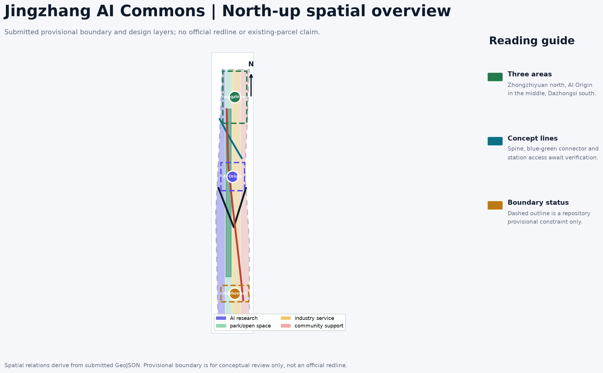
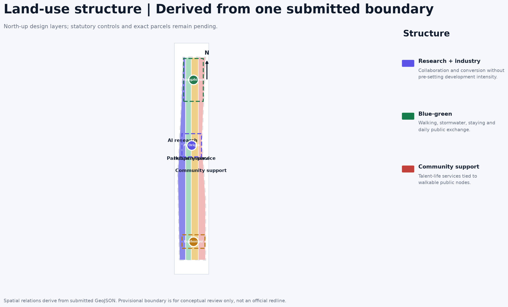
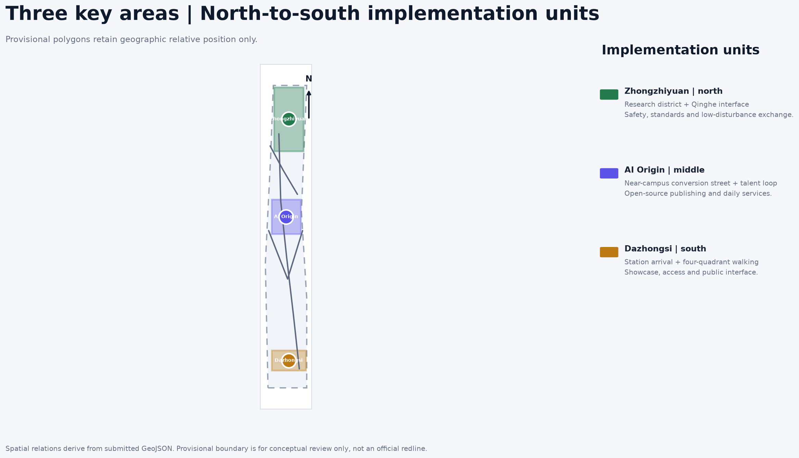
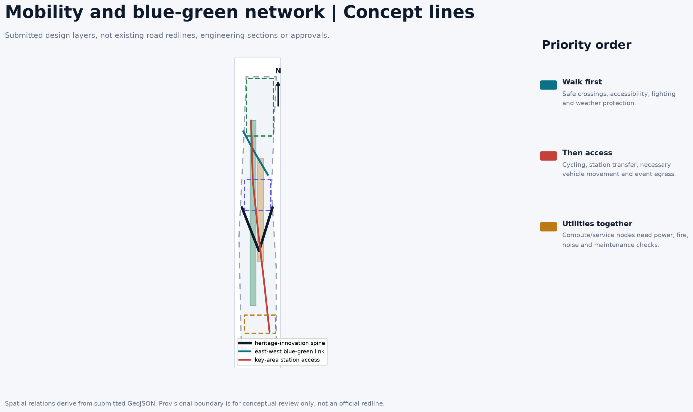
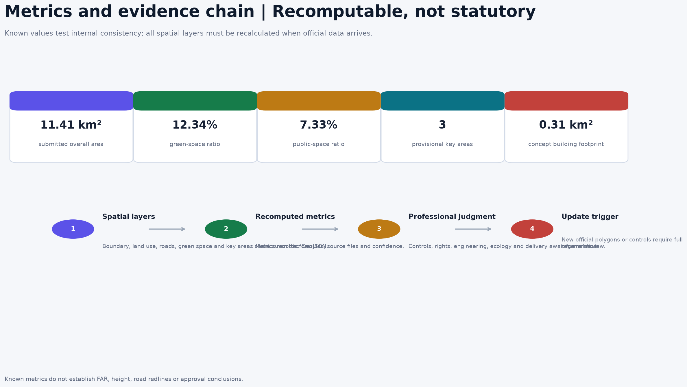

# Jingzhang AI Commons: Three Anchors, One Public Innovation Belt

> **Design judgment:** use the continuous Jingzhang heritage public space as an urban operating system. A walkable, observable and human-reviewable innovation spine connects Zhongzhiyuan, Beijing AI Origin Community and Dazhongsi AI Industry Cluster. The three areas take distinct roles—research and governance, conversion and daily life, and industry and global showcase [data:geometry/roads.geojson#ROAD-001] [data:geometry/key_areas.geojson#PROV-KEY-001] [data:geometry/key_areas.geojson#PROV-KEY-002].

AI is treated as a verifiable urban-service and operations method rather than a decorative label. Public data can help identify slow-mobility breaks, but a human review is required before maintenance advice is issued. Open-source publishing, standards governance, technology transfer, talent services and global events are located as public nodes. All spatial moves are conceptual suggestions for professional teams to deepen; the provisional boundary is not an official redline and all areas, roads, green space, buildings and phasing must be recalculated when official polygons and controls arrive [source:AGENT-TASKBOOK] [standard:PROJECT-AGENT-OPEN-CALL-TASKBOOK].

## 1. Design basis, scope and data limits

The package follows the official open-call announcement, the agent taskbook and the maintained site package. The 43.6 km² coordinated research area frames the industrial ecosystem and future-city strategy; the 11.4 km² overall design area frames urban renewal, mobility, municipal support and character; the 368.4 ha key-area scope frames detailed design [source:OFFICIAL-ANNOUNCEMENT] [depth:three_level_scope_framework].

The official detailed boundary and the three key-area polygons are not yet supplied as cleared polygons. This package therefore uses the repository's explicitly provisional constraint files. They support conceptual review, concept generation and reproducible visualization only. They must not be described as an approved redline, cadastral parcel, statutory control or precise professional area basis. Official data, eligibility, scoring, acceptance, publication and merge remain pending maintainer and organizer decisions [data:geometry/site_boundary.geojson#SITE-001] [data:geometry/key_areas.geojson#PROV-KEY-001].

## 2. Spatial concept: one belt, three anchors, multiple scenarios

The overall structure is a heritage–blue-green–slow-mobility belt with three innovation anchors and a distributed network of AI service nodes. The belt is not an additional statutory boundary: it is a design framework linking the heritage park, universities, enterprises, communities and rail access. The land-use partition is complete and non-overlapping within the submitted provisional boundary [data:geometry/land_use.geojson#LU-001] [depth:land_use_layout].

The design identity is **Jingzhang AI Commons / 京张智廊**. Its visual system uses a dark railway-blue base, a green public-space line, amber innovation nodes and a three-part mark suggesting rail, code brackets and a public square. This is a concept identity only; final type, logo, imagery, portraits and enterprise marks require rights clearance [source:AGENT-TASKBOOK] [depth:overall_spatial_structure].

### Industry-to-space structure: a public face for the innovation chain

The proposal turns “university-originated research — open-source collaboration — enterprise conversion — public experience — international communication” into a continuous service chain rather than separating research, offices, commerce and parkland. Zhongzhiyuan hosts the more stable professional settings for model safety, standards and testing; AI Origin Community hosts open publishing, transfer and talent-life services; Dazhongsi combines showcase, business reception, intelligent-device experience and rail arrival in one walkable network. The Jingzhang heritage park and its slow-mobility spaces connect the three so that people outside an innovation campus can still encounter its public value [data:geometry/roads.geojson#ROAD-001] [depth:overall_spatial_structure].

Each space type has an operational “front door”: research space supports professional collaboration, transfer space supports teams and universities, public space supports residents and visitors, and event space supports demonstration and exchange. This prevents AI from becoming only a screen or exhibition and prevents a closed campus from replacing urban public life. Enterprise tenancy, institutional partnerships, compute supply and event hosting remain future operating matters requiring confirmation by rights holders, authorities and professional teams.

## 3. Three key areas

**Zhongzhiyuan AI Acceleration Area** is a garden-like full-stack research district. The proposal connects model testing, standard workshops, safety governance, low-carbon innovation and public-facing technology demonstration through a green interface. Building retain/renovate/new-build decisions remain subject to official controls, ownership and engineering evidence [data:geometry/key_areas.geojson#PROV-KEY-001] [depth:three_key_area_detailed_design].

**Beijing AI Origin Community** is a near-campus conversion and talent district. It combines open-source publishing, university–enterprise transfer, talent services, daily life and a stitched school–park–community walking network. The proposal favors small, reversible public-space and service interventions before any parcel-level renewal decision [data:geometry/key_areas.geojson#PROV-KEY-002].

**Dazhongsi AI Industry Cluster** is an urban intelligent-economy district. It focuses on station integration, four-quadrant pedestrian continuity, intelligent agents and devices, content consumption, data-service interpretation and a global showcase lounge. Commercial, enterprise and public-space interfaces remain concept recommendations pending transport, rights and municipal verification [data:geometry/key_areas.geojson#PROV-KEY-003].

### Spatial moves and implementation units for the three areas

**Zhongzhiyuan** uses a “research district plus Qinghe innovation interface” as its implementation unit. The waterside is prioritized for low-disturbance walking, stormwater and meeting space, while adaptable demonstration, collaboration and testing foyers connect the research buildings inside. Model-safety and standards work is presented through bookable, explainable and staffed public interfaces; testing does not become unauthorized data collection. Retention, renovation or new-build decisions require building, ownership, structural and fire-safety evidence for each building [data:geometry/key_areas.geojson#PROV-KEY-001].

**AI Origin Community** uses a “near-campus conversion street plus talent-life loop.” Open-source releases, demonstrations, intellectual-property and legal support sit at walkable ground-floor and public-space nodes, while learning, food, sport and small community events sustain evening activity. Connections between campus, park and community begin with reversible wayfinding, continuous paving, accessibility and bicycle-order measures; the proposal does not infer campus crossings or building changes without rights confirmation [data:geometry/key_areas.geojson#PROV-KEY-002].

**Dazhongsi** uses a “station arrival hall plus four-quadrant walking network plus industry showcase lounge.” It first resolves the continuous walk from rail to commerce, enterprise and public space, then turns agents, devices, content and data services into interfaces that visitors can enter, use and leave. Major events require professional transport and safety checks for crowds, evacuation, curb use and fire access; this proposal identifies spatial relationships for that review rather than certifying them [data:geometry/key_areas.geojson#PROV-KEY-003] [depth:traffic_rail_slow_parking].

## 4. AI ecosystem, people and scenario cards

The ecosystem links university research, open-source collaboration, enterprise conversion, public experience and international communication. Five user groups shape the public-service brief: open-source developers need publishing and peer collaboration; start-ups need affordable work, compute access and test space; enterprise visitors need showcase and recruitment; residents need low-disruption daily services; and students need conversion, learning and safe walking [source:AGENT-TASKBOOK] [standard:PROJECT-AGENT-OPEN-CALL-TASKBOOK].

The ten scenario cards are: (1) open-source publishing hall, (2) safety-governance sandbox, (3) edge-compute service stop, (4) AI slow-mobility navigation, (5) Dazhongsi global showcase lounge, (6) Qinghe low-carbon innovation corridor, (7) near-campus technology-transfer street, (8) data-element commons, (9) AI daily-service sample street, and (10) global AI event-week route. Every card must state its space, data source, privacy boundary, human review and operating party in the machine-audit layer; no card authorizes personal profiling or autonomous planning approval [data:geometry/public_space.geojson#PUBLIC-001] [metric:public_space_ratio].

At least three industry validation scenarios are proposed: model safety and red-team testing at Zhongzhiyuan; university–enterprise technology transfer and open-source release at AI Origin Community; and intelligent-device, content and data-service demonstration around Dazhongsi. These are test settings for professional deepening, not confirmed facilities or investment commitments.

### Scenario operating loop: from experience to human review

Every AI+ scenario follows five steps: user, spatial host, minimum necessary data, human review and operating responsibility. For example, slow-mobility navigation may use public facility information, site observation and consented aggregate feedback to flag accessibility or crowding issues; it cannot replace decisions by transport, planning or facility-management authorities. The safety-governance sandbox requires booked participation, traceable records and human review. The data-element commons displays licensed processes and examples only, never uncleared enterprise or personal data [standard:PROJECT-AGENT-OPEN-CALL-TASKBOOK].

The operational rhythm is proposed at three scales: daily services maintained by district and campus actors; quarterly open days for universities, enterprises and communities to test the experience; and an annual public program connecting heritage, open-source results and international exchange. Frequency, budget, host organizations and safety plans remain to be agreed; the package supplies the spatial and governance framework.

## 5. Land use, buildings and renewal logic

The submitted land-use layer partitions the provisional design area into AI research, blue-green/open space, industry services and community support. The building layer shows a concept research footprint, while the proposal uses a retain–renovate–demolish/new-build decision tree rather than pretending that current ownership or building condition is known [data:geometry/buildings.geojson#BLDG-001] [depth:retain_renovate_demolish].

The floor-area ratio, statutory height, road redlines, setbacks, fire access, ownership, heritage controls and engineering conditions remain pending official confirmation. The only numeric building statement in this package is the recomputable footprint metric; it is not a development entitlement [metric:building_footprint_area_sqm] [standard:MOHURD-CONTROL-DETAILED-PLANNING].

### Building and block renewal method

Before formal surveys and ownership checks, the building strategy uses a four-step screen rather than a pre-set conclusion: identify heritage, public-service or industrial-synergy value; verify structure, safety, fire and utility conditions; compare retention, adaptation, functional replacement and cautious new-build through carbon and operating effects; then confirm an implementation path with rights, planning, engineering and community representatives. The design prioritizes accessible ground floors, stayable corners and roof potential subject to professional assessment, not additional floor area as an end in itself [depth:retain_renovate_demolish] [depth:height_massing_character].

At land-use level, the key task is compatibility between research, industry service, community support and blue-green open space: research-service fronts need quiet collaboration, community support needs daily access, and open space needs continuity and maintainability. Any FAR, height, setback, daylight, fire or parking number must wait for statutory and engineering material.

## 6. Mobility, municipal services and public space

Three concept mobility lines—ROAD-001 heritage/innovation spine, ROAD-002 east–west blue-green connector and ROAD-003 key-area station connector—link public spaces, green space and AI service nodes. Their alignments are design proposals, not road redlines. The mobility strategy prioritizes rail–public-space integration, safe crossings, walking and cycling continuity, bicycle parking, accessible routes and a managed curb before any final cross-section is selected [data:geometry/roads.geojson#ROAD-001] [depth:traffic_rail_slow_parking].

Municipal deepening should test distributed energy, edge compute, water, drainage, flood safety, fire access, waste and conventional utilities together. A public-service node should minimize data collection, publish purpose and retention, and require a human operator for any safety, access or maintenance decision [data:geometry/constraints.geojson#CONSTRAINTS] [depth:municipal_new_infrastructure].

### Integrated arrival, utilities and public service

The mobility sequence starts with daily walking, then layers cycling, feeder access and necessary vehicle organization. Around stations, the desired arrival sequence is legible exit, safe crossing, continuous shade or rain cover, bicycle parking and a visible public-service entrance. At park-community edges, priority goes to dead-end connections, crossing waits, accessible ramps, night lighting and routes used by children and older people. The three road lines locate relationships that require site verification; they do not replace professional street-section design.

Edge compute, distributed energy and public-service nodes should attach to existing civic buildings, corner service points or adaptable ground floors rather than create isolated technology objects. Every device location needs power, cooling, fire, noise, stormwater, maintenance and data-security verification before implementation [depth:municipal_new_infrastructure].

## 7. Blue-green structure, landmarks and cultural narrative

The Jingzhang heritage park is the primary public-space narrative. Qinghe and Xiaoyuehe are treated as blue-green connectors, while the innovation belt is experienced through a slow route that joins railway memory, Zhongguancun innovation culture and emerging AI culture. Green and public-space ratios are design evidence, not a substitute for official ecological, flood or park data [data:geometry/green_space.geojson#GREEN-001] [metric:green_ratio].

Three proposed AI pilgrimage or honor-display nodes are: **The Commons Gate** at the heritage-park arrival, a public contribution wall and open-source archive at AI Origin Community, and the **Trust & Test Court** at Zhongzhiyuan. They should celebrate verifiable contributions, public-interest experiments and human review; they are not claims of approved landmarks or built facilities [depth:blue_green_public_space].

### Public-space kit and cultural narrative

The public realm is not one linear landscape. It is a kit of stayable pocket squares, shaded walking segments, shared courtyards for small events, wayfinding nodes that read Jingzhang memory and rain gardens that can be maintained daily. Railway heritage is carried through route, material, signage and story; AI culture is carried through open-source contribution, explainable testing and public-service experience, rather than turning historic places into generic technology stages.

The Commons Gate, contribution wall/archive and Trust & Test Court represent arrival, collaboration and careful innovation. Their role is to make a readable civic interface, not to announce new landmark construction. Names, form, exact locations, artists and delivery methods require official material, rights clearance and professional review [depth:blue_green_public_space].

## 8. Renewal projects, policy and phasing

The renewal list includes: JZ-01 heritage-park slow-mobility stitching; JZ-02 Qinghe innovation interface; JZ-03 near-campus technology-transfer street; JZ-04 Dazhongsi station four-quadrant walking continuity; JZ-05 AI public-service and edge-compute nodes; and JZ-06 a global AI public route. Phase 1 prioritizes reversible walking, public-space and service pilots; Phase 2 tests building and enterprise interfaces after control confirmation; Phase 3 establishes a long-term governance and maintenance cycle [data:geometry/phasing.geojson#PHASE-001] [depth:phasing_implementation].

Long-term operations are proposed as a yearly AI Commons program, quarterly developer-community sessions, recurring scenario open days, a public route and an international knowledge exchange. Participation data should be aggregated, opt-in and purpose-limited. The operating model must remain open to residents, schools, enterprises and independent developers, with human governance as the final decision layer [source:AGENT-TASKBOOK] [standard:PROJECT-AGENT-OPEN-CALL-TASKBOOK].

### Phasing gates and responsibility

The near term focuses on reversible, low-disturbance repairs to connection: wayfinding, lighting, bicycle parking, accessibility and temporary activity equipment, alongside verification of boundaries, roads, utilities, ownership, buildings and ecology. The medium term can advance street-interface renewal, station-access improvements, service nodes and industry collaboration space after verification and agreement. The long term establishes cross-district public-space maintenance, event governance, data compliance and outcome review so that renewal does not depend on one-off events.

Every phase has a gate: spatially, confirm redlines and engineering constraints; institutionally, identify rights and operators; for data, confirm authorization, minimization and human review; and publicly, hear residents, schools, enterprises and users. Projects that do not pass a gate remain research or pilots rather than being upgraded to construction commitments [data:geometry/phasing.geojson#PHASE-001] [depth:phasing_implementation].

## 9. Metrics, evidence and compliance

The package currently reports a submitted provisional site area of 11.41 km², a green-space ratio of 12.34%, a public-space ratio of 7.33%, three key areas and a 0.31 km² concept building footprint. Each known metric includes a formula, source files, confidence and assumptions; approved FAR and other statutory controls remain unknown until official material is supplied [metric:site_area_sqm] [metric:green_ratio] [metric:public_space_ratio].

`compliance_matrix.json` covers announcement sections 1.3, 1.4 and 1.5 plus agent.1–agent.6. `standard_matrix.json` maps professional references to proposal sections, drawings, geometry and metrics. `design_depth_matrix.json` covers the required formal depth items. The structured files are authoritative; the figures and PDFs are human-readable presentation layers [source:SOURCE-REGISTRY] [depth:metrics_recalculation].

### How metrics inform design decisions

The recomputed site area, green space, public space, building footprint and key-area count test whether the submitted layers share one spatial logic; they do not derive statutory development controls. Design decisions should also ask whether routes connect, whether public interfaces invite staying, whether spaces can be maintained and whether the limits of missing data are respected. When official material arrives, professional teams should recompute the metrics and compare the change instead of treating the present provisional values as final targets.

## 10. Risks, copyright and professional boundaries

This is an AI-generated concept submission, not an approved plan, statutory control, construction package or implementation commitment. The provisional boundary and key areas are clearly labeled; official replacement triggers recalculation. Missing controls, ownership, engineering, heritage, transport and municipal information are recorded in `assumptions.json`. Public and cleared sources are recorded in `sources.json`; generated diagrams use original layout and locally bundled assets. Human and professional review remains mandatory [depth:risk_missing_data] [source:SITE-PACKAGE].
