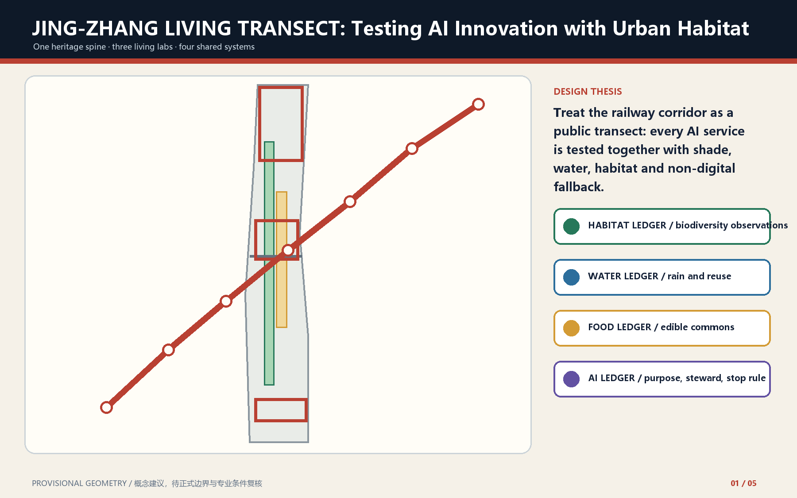
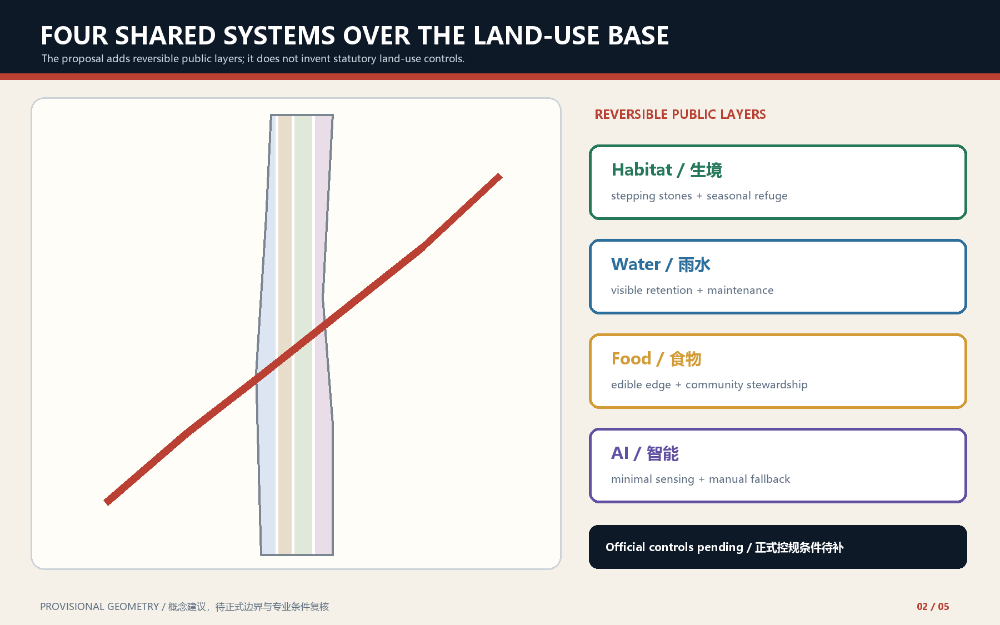
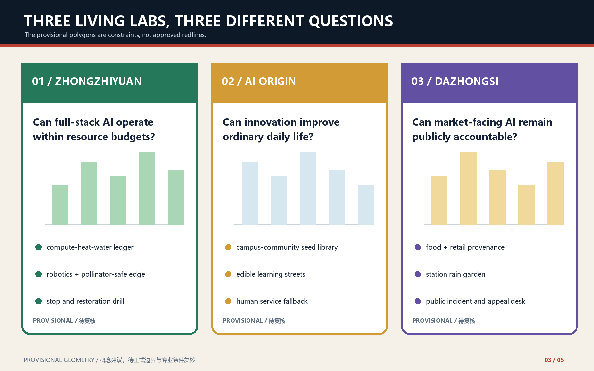
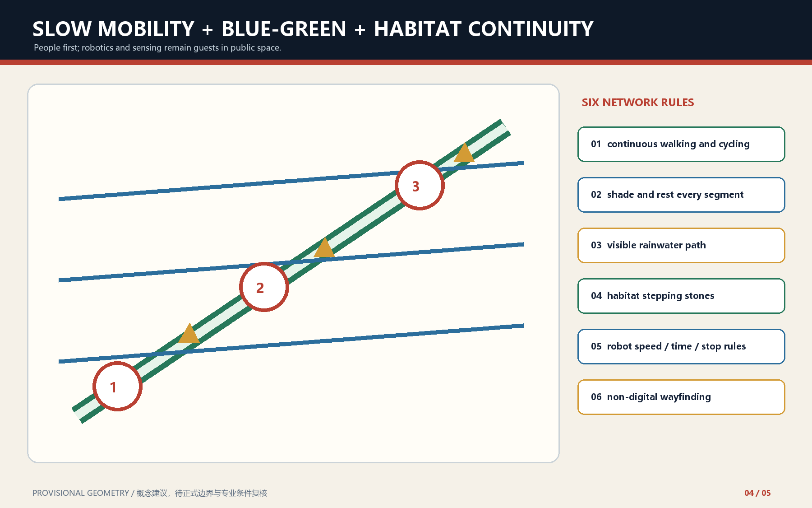
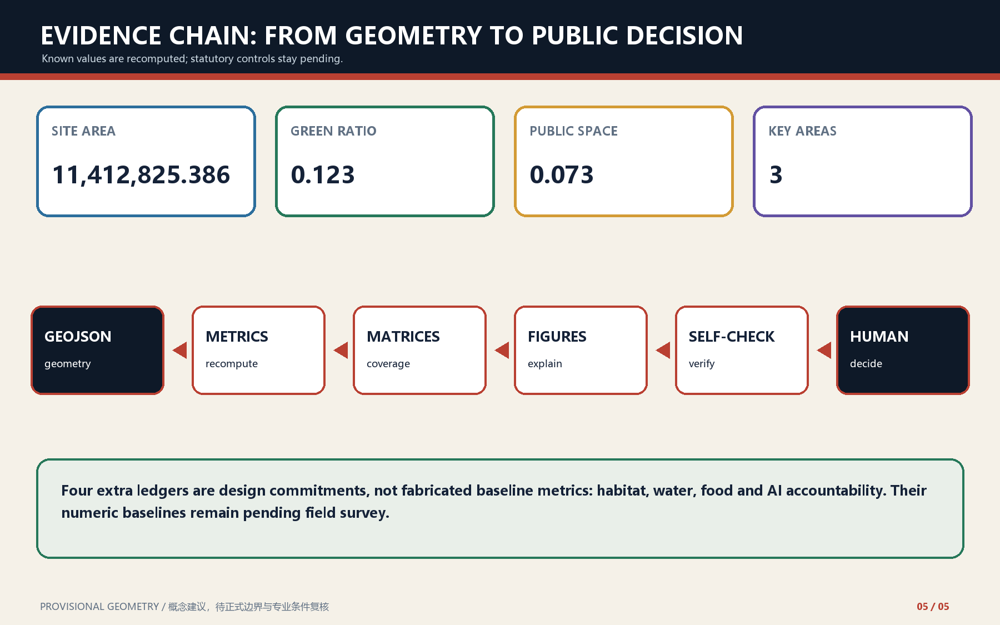

# JING-ZHANG LIVING TRANSECT: Testing AI Innovation with Urban Habitat

> **Design thesis.** Every AI service must answer who it serves, what resources it occupies, which habitat it affects, who may stop it, and how the ordinary city is restored.

## Design basis and source inventory

This proposal reads the official announcement, cleared agent taskbook, registered public sources and local professional snapshots as separate evidence classes. It uses provisional geometry only for generation and intake review. The official site and key-area polygons, statutory controls, existing-building survey and engineering conditions remain pending. [source:OFFICIAL-ANNOUNCEMENT] [source:AGENT-TASKBOOK] [depth:existing_conditions_diagnosis]

Repository [Issue #1029](https://github.com/open-city-ai/haidian/issues/1029) demonstrates that `PROV-KEY-003` is an order-and-area placeholder near Beijing North Railway Station, not a station-anchored Dazhongsi boundary [source:ISSUE-1029]. This proposal does not move the shared provisional geometry and does not use it as location evidence for the Dazhongsi four-quadrant walking task.

## Three-level scope framework

The 43.6 km² coordinated research area frames ecosystem and future-city questions; the 11.4 km² overall design area carries the spatial and renewal structure; the three key areas test detailed delivery. The Living Transect links these levels without inventing a new redline. [data:geometry/site_boundary.geojson#SITE-001] [depth:three_level_scope_framework] [standard:PROJECT-OFFICIAL-ANNOUNCEMENT]

## Industry and future-city strategy

The AI ecosystem is organized as a learning loop: full-stack research and validation at Zhongzhiyuan, open-source translation and everyday services at AI Origin, and market-facing demonstration and public accountability at Dazhongsi. Five to eight global precedents are treated as mechanisms to verify, not objects to copy. [source:AGENT-TASKBOOK] [standard:MOHURD-URBAN-DESIGN-MEASURES] [depth:overall_spatial_structure]

## Urban renewal and regulatory-plan-depth urban design

The plan adds reversible public layers over the submitted land-use partition: habitat stepping stones, visible rainwater infrastructure, edible community edges and accountable AI interfaces. FAR, height, road redlines and parcel-level retain-renovate-demolish decisions remain pending official data. [data:geometry/land_use.geojson#LU-001] [data:geometry/buildings.geojson#BLDG-001] [depth:development_intensity_controls]

## Detailed design for three key areas

Zhongzhiyuan tests whether full-stack AI can remain within compute, heat and water budgets. AI Origin tests whether innovation improves ordinary daily life through a seed library, edible learning street and human-service fallback. Dazhongsi tests whether market-facing AI remains publicly accountable through provenance, rain-garden and appeal interfaces. All three polygons are provisional constraints. [data:geometry/key_areas.geojson#PROV-KEY-001] [data:geometry/key_areas.geojson#PROV-KEY-002] [depth:three_key_area_detailed_design]

The Dazhongsi station-integration response is therefore a non-georeferenced conceptual task until official key-area and station-anchor data arrive. No alignment, walking distance or engineering feasibility is inferred from `PROV-KEY-003` [source:ISSUE-1029].

## AI ecosystem, personas and AI+ scenarios

Twelve scenario cards serve developers and operators, resident families, students and start-ups, people requiring accessible human support, and domestic or international visitors. Three industry tests cover resource-ledger consistency, embodied-AI speed/stop/recovery, and non-digital equivalence plus appeal. Every scenario states data scope, steward, human checkpoint and stop rule. [data:geometry/public_space.geojson#PUBLIC-001] [metric:public_space_ratio] [depth:ai_scenarios]

## Land use, building scale and retain-renovate-demolish logic

The GeoJSON partition is the auditable land-use base. The Living Transect does not recode parcels or fabricate approved development intensity. Existing buildings are first surveyed and classified by safety, heritage, embodied carbon, adaptability, public value and ownership; only professional follow-up may turn this method into parcel decisions. [standard:MNR-LAND-USE-CLASSIFICATION-GUIDE] [data:geometry/buildings.geojson#BLDG-001] [metric:building_footprint_area_sqm]

## Mobility, rail, municipal and public services

Walking and cycling continuity, shade and rest, visible rainwater paths, habitat stepping stones, robot speed/time/stop rules and non-digital wayfinding form one network. Rail integration and municipal upgrades remain subject to official engineering conditions. [data:geometry/roads.geojson#ROAD-001] [depth:mobility_transit_parking]

## Blue-green public space and urban character

The railway heritage spine is treated as a seasonal public transect rather than a decorative green strip. Low-contrast provisional boundaries keep attention on continuous public space, shade, habitat and civic learning. Baseline biodiversity and stormwater values remain pending field survey. [data:geometry/green_space.geojson#GREEN-001] [metric:green_ratio] [depth:blue_green_public_space]

## Renewal projects, policy and phasing

Phase 1 establishes field surveys, four ledger templates and light-touch demonstration sections. Phase 2 links the three living labs after professional checks. Phase 3 institutionalizes quarterly transect surveys, half-year public reviews and an annual Living Transect Week. Any failed scenario returns to a non-AI baseline and records restoration. [data:geometry/phasing.geojson#PHASE-001] [depth:implementation_phasing]

## Metrics, recomputation and compliance

Known site, green, public-space, building-footprint and key-area metrics are recomputed from submitted geometry. Habitat, rainwater, food and AI-accountability ledgers are commitments whose numeric baselines remain pending, not invented metrics. Complete coverage stays in the structured matrices. [metric:site_area_sqm] [metric:green_ratio] [depth:metrics_recalculation]

## Living Transect ledgers

The habitat ledger records observation method, season, reviewer and intervention boundary. The water ledger records catchment, retention, overflow and maintenance. The food ledger records seed source, steward, safety, harvest and compost. The AI ledger records purpose, minimal data, accountable steward, human takeover, appeal and exit recovery. Missing stewardship or stop conditions keeps a scenario in display or closed testing. [standard:GENERATIVE-AI-INTERIM-MEASURES] [depth:risk_missing_data]

These ledgers are survey and governance protocols, not claimed baseline datasets. Site biodiversity, catchment and runoff modelling, community-food need and safety assessment, and compute-energy/waste-heat/water metering remain pending. No ecological gain, runoff reduction, food yield or resource saving is claimed before dated, scoped and reviewable field baselines exist.

## Risk, copyright and legal boundary

This is an open, AI-generated conceptual proposal, not an approved plan, statutory control, engineering conclusion or implementation commitment. Local derived figures are generated from the submission evidence layer; no remote map tiles or unlicensed imagery are used. Official polygons and professional surveys trigger full recomputation. [source:SITE-PACKAGE] [data:geometry/constraints.geojson#CONSTRAINTS] [standard:BARRIER-FREE-ENVIRONMENT-LAW]

## References

See `sources.json`, `metrics.json`, all GeoJSON layers, compliance matrices and local reference snapshots for the complete machine-audit layer.
