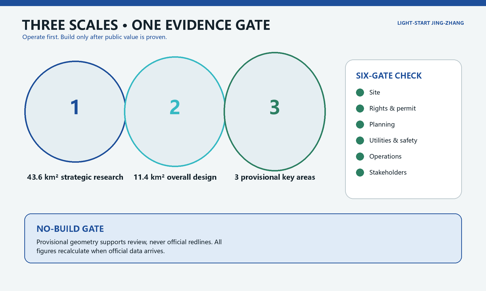
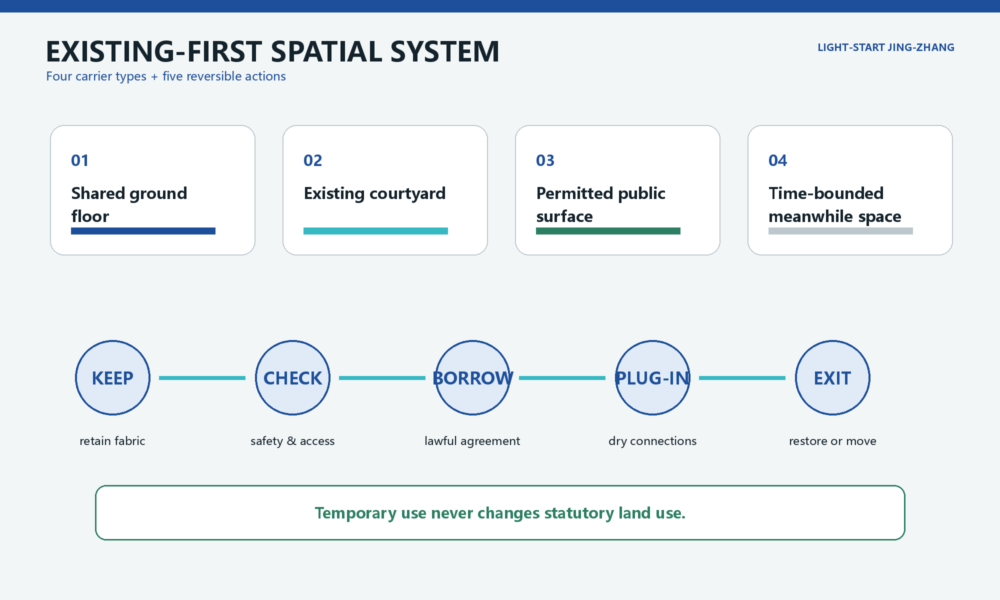
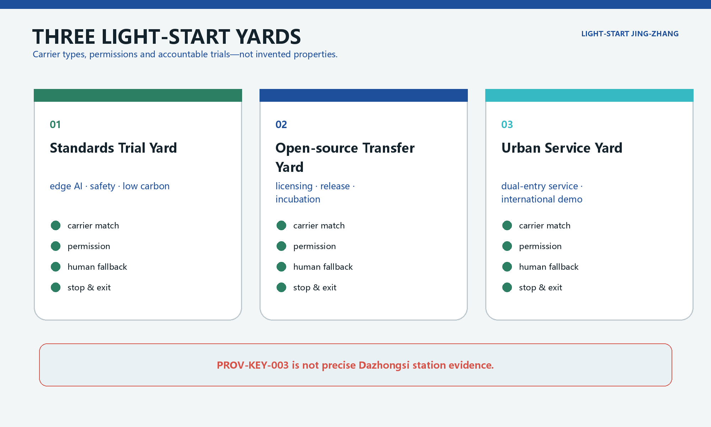
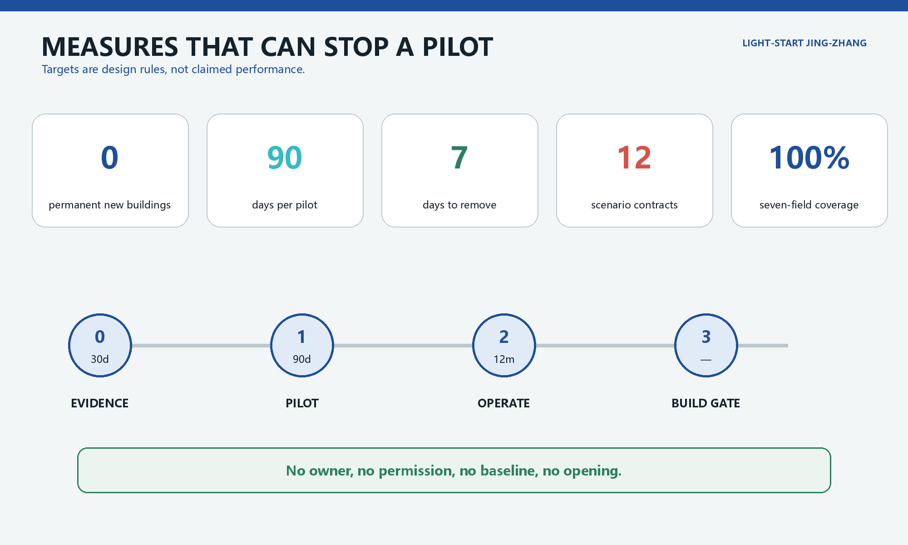
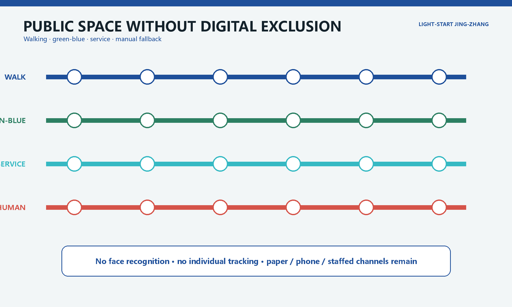

# Light-Start Jing-Zhang

> **Operate first, build later; prove public value before fixing space in concrete.** This is open-source conceptual research based on provisional repository geometry. It is not an official plan, site survey, statutory control or construction commitment.

## Design basis and source inventory

The official announcement requires three working scales: 43.6 km² strategic research, about 11.4 km² overall urban design and about 368.4 ha across three detailed-design areas. It calls for an AI industrial ecosystem, urban renewal, transport and utilities, public space and implementable detailed design [source:OFFICIAL-ANNOUNCEMENT] [standard:PROJECT-OFFICIAL-ANNOUNCEMENT]. The proposal also addresses the Agent Taskbook's five functions, six tasks, open scenarios and operating requirements [source:AGENT-TASKBOOK] [standard:PROJECT-AGENT-OPEN-CALL-TASKBOOK].

GeoJSON, metrics and matrices remain the controlling review evidence. `SITE-001` and all three `PROV-KEY` polygons are provisional constraints. In particular, `PROV-KEY-003` is not evidence of the precise Dazhongsi station or four-quadrant intersection location [data:geometry/site_boundary.geojson#SITE-001] [data:geometry/key_areas.geojson#PROV-KEY-003] [depth:existing_conditions_diagnosis]. Site conditions, ownership, existing buildings, statutory planning, utilities, fire, heritage and stakeholder evidence remain incomplete; all precision-sensitive work must be recalculated when official data arrives.

## Core judgment: design temporariness as a civic institution

The costliest mistake is not failing to add a building; it is making an untested demand and unclear responsibility permanent. Light-Start establishes a **No-Build Gate**. Phases 0 and 1 permit no new permanent building, only reversible prototypes in lawfully usable existing space [metric:phase_1_permanent_new_buildings] [depth:phasing_implementation]. A permanent intervention may be considered only after six gates pass: site evidence, rights and permission, planning, utilities/fire/accessibility, operating viability and stakeholder evidence.

The structure is “one line, three yards, two wings and four public ledgers.” The heritage-park corridor is the Light-Start Line. The three yards are a Standards Trial Yard at Zhongzhiyuan, an Open-source Transfer Yard at the AI Origin Community and an Urban Service Yard at Dazhongsi. The two wings exchange services with university-origin innovation and enterprise application resources; they are not invented new districts. Four ledgers disclose usable carriers, pilot contracts, objections and asset exits [depth:three_level_scope_framework] [depth:overall_spatial_structure].

| Not this | Instead |
|---|---|
| Guess which real building is vacant | Publish lawful carrier requirements before matching a location |
| Prove “intelligence” through surveillance | Collect only the minimum aggregate data needed for a service |
| Make a successful pilot permanent by default | Stop automatically at expiry; renewal requires new evidence |
| Replace staff with AI | Keep an equally accessible staffed route for every public service |

## Three-scale working framework

At the strategic scale, the proposal links university research, open-source collaboration, enterprise testing, public commissioning and international communication. At the overall-design scale, it identifies carrier types: lawful shared ground floors, existing courtyards, permitted activity surfaces and time-bounded meanwhile space. At the key-area scale, it designs carrier requirements, permissions and reversible kits rather than fabricating properties [data:geometry/land_use.geojson#LU-001] [depth:land_use_layout]. Temporary operation never changes statutory land use [standard:MNR-LAND-USE-CLASSIFICATION-GUIDE].

Building action follows five verbs: keep, check, borrow, plug in and exit. Existing fabric comes first; structure, fire, accessibility, heritage and utilities are checked; a lawful agreement enables use; dry-connected elements are installed; the site is restored or the asset moves. No real building receives a retain/alter/demolish conclusion without an inventory [data:geometry/buildings.geojson#BLDG-001] [depth:retain_renovate_demolish]. Height, FAR and other statutory controls remain pending official data [metric:floor_area_ratio] [depth:development_intensity_controls].

## Strategic industry and future-city research

Light-Start creates three auditable paths. University and open-source work enters a 90-day service trial through the Origin Yard. Enterprise tools enter safety, energy and standards testing through the Standards Yard. Resident and visitor needs enter a public problem pool through a staffed service point at the Urban Service Yard. A trial opens only after the property manager, operator, technology provider and independent reviewer are named in its contract. The Haidian OPC consultation document is policy context only; it does not promise project funding or space [source:BJHD-OPC-2026-DRAFT].

The identity system uses four fields consistently in Chinese and English: opening date, expiry date, staffed route and asset's next destination. Visitors see responsibility and exit conditions, not only a demonstration. Railway memory is translated into a clear sequence and “next stop” asset logic, rather than nostalgic stage scenery.

## Overall urban renewal and regulatory-depth design

Four carrier types are screened: lawful shared ground floors, existing paved courtyards, permitted surfaces in built public space and time-bounded space that will not delay a long-term project. Each candidate must disclose owner/manager, allowed use, term, cost and energy, fire, accessibility, nuisance, loading, insurance and reinstatement. A failed gate means no location. London's meanwhile-use guidance transfers only the method of defining duration, parties, funds, obligations and exit in advance; London property and planning law does not transfer to Beijing [source:LONDON-MEANWHILE-USE] [source:LONDON-PLAN-H3].

Repository geometry retains verifiable land-use, building, road and public-space layers; an activity licence is never presented as a land-use change [data:geometry/public_space.geojson#PUBLIC-001] [standard:MOHURD-CONTROL-DETAILED-PLANNING]. The provisional site area is used only for package consistency [metric:site_area_sqm].

## Detailed design for the three key areas

### Zhongzhiyuan: Standards Trial Yard

The required carrier is a separately closable existing test room plus a permitted edge of built green space. Movable benches, metering and a staffed safety point test edge AI, low-carbon equipment and assistive technology. Flood, river, energy, fire and site permissions must be checked. JTC's multi-party living-lab model informs trial governance, but its funding and regulatory structure do not transfer [source:JTC-JID-LIVING-LAB] [data:geometry/key_areas.geojson#PROV-KEY-001].

### Beijing AI Origin Community: Open-source Transfer Yard

The carrier type is a shareable ground floor plus bookable teaching or meeting space. Demountable acoustic screens, captioning, an open-source licence desk and staffed legal/accessibility hours support release and transfer. Models, data, licences and safety boundaries must be registered before public use. No campus data or university participation is assumed [data:geometry/key_areas.geojson#PROV-KEY-002] [depth:three_key_area_detailed_design].

### Dazhongsi: Urban Service Yard

Until official station, road and property data arrive, the design specifies only a carrier type: an existing transit-adjacent ground floor with safe indoor-outdoor queuing. Digital self-service and a staffed counter have equal visibility. Four-quadrant walking construction remains a transport-specialist task. The known `PROV-KEY-003` location problem is disclosed and not used for distance or engineering claims [data:geometry/key_areas.geojson#PROV-KEY-003] [depth:traffic_rail_slow_parking].

## AI ecosystem, personas and AI+ scenarios

Five inferred user groups are university researchers and students; startups; enterprise staff and international visitors; nearby residents; and older, disabled or non-smartphone users. They are hypotheses, not interview findings. Haidian's AI+elderly action plan informs a district-street-community demand-collection method, but provides no project authorization or data [source:BJHD-AI-ELDERLY-2026].

| ID / scenario | Carrier and users | 90-day measure | Stop, staffed fallback and exit |
|---|---|---|---|
| LS-01 Open-source clinic | Origin shared ground floor | 12 sessions; ≥80% issue closure | Stop on permission/privacy incident; staffed advice; equipment to teaching space |
| LS-02 Model safety bench | Standards test room | 3 industry validations; 100% risk register | Unregistered model rejected; safety officer; bench returns to store |
| LS-03 Low-carbon edge cabinet | Compliant equipment room | 100% energy/water baseline | Stop without capacity or baseline; staffed booking; cabinet removed |
| LS-04 Accessible device library | Shared across three yards | Staff help and fault log for every item | Stop after a severe safety event; staffed lending; transfer to lawful institution |
| LS-05 Dual-entry service corner | Urban Service carrier | Staffed-route visibility 100%; completion rates separated | Rectify if channel gap exceeds 20 points; staffed desk; remove within seven days |
| LS-06 Walking-break work orders | Permitted built-park point | Anonymous work orders only; ≥70% closure | Stop if tracking appears; paper/phone route; signs stored |
| LS-07 Rain-garden modules | Edge of existing hardscape | ≥95% maintenance attendance; no flood claim | Close on ponding/trip risk; manual inspection; modules move |
| LS-08 Shared lunch table | Lawful food/courtyard carrier | 100% food compliance; surplus by weight only | Stop on food incident or unresolved nuisance; staffed booking; tables reused |
| LS-09 Quiet evening workshop | Compliant interior | Complaint status public within five days | Stop after repeated time-limit breach; steward; acoustic kit removed |
| LS-10 International demo room | Existing Dazhongsi ground floor type | 100% bilingual equivalence and rights ledger | Unlicensed material removed; staffed translation hours; display kit stored |
| LS-11 Objection desk | Entrances to all yards | Anonymous status public in five working days [metric:unresolved_objection_publication_days] | Related pilot pauses without owner; paper/phone route; desk reused |
| LS-12 Asset next-stop desk | On/offline inventory | 100% destination record; seven-day removal target | No procurement without destination; manual audit; repair, transfer or recycle |

Every card requires owner, permission, baseline, KPI, stop rule, staffed fallback and exit; target coverage is 100% [metric:pilot_contract_coverage_ratio] [metric:scenario_card_count]. AI is limited to booking, knowledge retrieval, aggregate issue classification and assisted translation. No facial recognition, individual tracking, credit scoring, automatic enforcement or unauthorized profiling is proposed [source:CAC-GENAI-MEASURES].

## Land use, building capacity and retain/alter/demolish method

Statutory planning and land-use controls remain authoritative; temporary agreements do not change land use. Current polygons support topology and concept discussion only and do not prove that a parcel can be leased, altered or built upon [data:geometry/land_use.geojson#LU-001] [standard:MNR-LAND-USE-CLASSIFICATION-GUIDE]. Building footprint is also conceptual. FAR, height, density, setbacks and demolition permissions remain pending official planning, ownership, survey, structure, fire and heritage evidence [metric:floor_area_ratio] [depth:development_intensity_controls].

Phase 1 is restricted to non-structural dry fit-out, movable furniture and recoverable service connections. Work affecting structure, facade, fire compartmentation, permanent utilities or heritage fabric leaves the Light-Start stage and requires licensed professional design [data:geometry/buildings.geojson#BLDG-001] [depth:retain_renovate_demolish].

## Transport, rail, utilities and public services

Phase 1 excavates no new road and promises no cross-ring infrastructure. Staffed audits, accessible work orders and short observations create a walking baseline. Camera or location data would need separate approval and are excluded by default. Movable elements cannot reduce fire access, accessible clear width or bicycle order [data:geometry/roads.geojson#ROAD-001] [depth:traffic_rail_slow_parking].

Each carrier records electricity, water, drainage, heat rejection, network, fire and equipment load. Edge computing opens only after capacity and energy/water baselines are confirmed, with an offline service mode. Unknown utilities remain constraints, never inferred engineering [data:geometry/constraints.geojson#CONSTRAINTS] [depth:municipal_new_infrastructure].

## Blue-green space, public space and character

Existing trees, green space and railway memory take priority. Components use dry bolts, replaceable skins, low-glare lighting and reusable asset numbers. Rain-garden modules are movable educational prototypes and make no flood-performance claim. Provisional green and public-space ratios support internal checking only [data:geometry/green_space.geojson#GREEN-001] [metric:green_ratio] [metric:public_space_ratio].

Public space is not a free laboratory. Every activity sets pedestrian width, wheelchair turning, fire access, root protection, quiet limits, loading times and extreme-weather closure. The operator performs daily opening and closing checks; serious access, safety or nuisance triggers a stop [depth:blue_green_public_space] [data:geometry/public_space.geojson#PUBLIC-001].

The visual language uses precision metal, low-iron glass, recycled stone and restrained blue accents. It avoids giant screens, robot spectacle and science-fiction landmarks. Generated views are labelled conceptual and must be recalibrated against heritage, trees, daylight and frontage evidence [standard:MOHURD-URBAN-DESIGN-MEASURES] [depth:height_massing_character].

## Project list, policy and phasing

| Phase | Entry | Deliverable | Continue/stop decision |
|---|---|---|---|
| 0 Evidence Month | 30 days after organizer authorization | Site record, carrier list, stakeholder map, objection baseline, permission gaps | Any unclear gate blocks that location |
| 1 Light-Start Season | 90 days after lawful opening [metric:phase_1_pilot_duration_days] | Three yard pilots, 12 contracts, weekly public status | Renew only after thresholds pass and serious objections close |
| 2 Operating Year | 12 months with new permission | Accounts, inclusion, energy/water, asset cycle, independent evaluation | Selective renewal proposed only after public value is evidenced |
| 3 Build Gate | No preset date | Professional plan backed by statutory, rights, engineering and participation evidence | Otherwise remain in existing-space operation or exit |

Near-term projects are carrier verification, three pilots and public ledgers. Medium-term work is evidence-led adaptation of existing buildings. Long-term mobility, utilities or building projects require professional evidence [data:geometry/phasing.geojson#PHASE-001] [depth:renewal_project_list]. Non-safety reversible kit targets removal within seven days [metric:reversible_removal_target_days]. No named responsible party means no opening.

## Metrics, recalculation and compliance matrix

Spatial metrics are recalculated from GeoJSON; operating metrics are explicitly design targets or pending baselines. Site area, footprint, three key areas and provisional zoning check package consistency rather than establish statutory facts [metric:site_area_sqm] [metric:building_footprint_area_sqm] [metric:key_area_count]. Zero permanent construction, 90 days, seven-day removal, 12 contracts and complete seven-field coverage are proposal rules, not observed performance [metric:pilot_contract_coverage_ratio] [depth:metrics_recalculation].

Official updates to boundaries, buildings, roads, ownership or controls trigger coordinated regeneration of geometry, metrics, figures, drawings and both HTML layers [metric:green_ratio] [metric:public_space_ratio] [source:BOUNDARY-SOURCE].

## Site and stakeholder evidence

The author has not completed an organizer-authorized site visit, property verification or interviews with residents, workers, students, owners, operators, older people or disability groups. Personas are unvalidated. Phase 0 must co-define time, noise, access, data and exit conditions with affected groups. De-identified objection status remains public, and paper, phone and staffed channels are available without mandatory QR use [source:PRC-BARRIER-FREE-LAW] [depth:risk_missing_data].

## Risk, copyright and compliance

Risks include provisional geometry, lack of lawful carriers, temporary use drifting into permanence, nuisance, accessibility failure, utility overload, data misuse, vendor lock-in, stranded assets and false case transfer. Controls are conspicuous provisional labelling, automatic expiry, equal staffed access, capacity checks, minimal data, open formats and recorded asset destinations [depth:risk_missing_data] [data:geometry/constraints.geojson#CONSTRAINTS].

Personal-data incidents, life safety, blocked fire/access routes or expired permission stop the relevant trial immediately. AI does not replace approval, enforcement, medical diagnosis or stakeholder judgment [source:CAC-GENAI-MEASURES] [source:PRC-BARRIER-FREE-LAW]. All generated images are synthetic concepts, not site records, verified opinion or official renderings. Rights, provenance, assumptions and hashes are recorded in the structured package [source:SOURCE-REGISTRY].

## References

The official announcement and Agent Taskbook define project requirements [source:OFFICIAL-ANNOUNCEMENT] [source:AGENT-TASKBOOK]. National urban-design, planning, land-use, generative-AI and accessibility sources establish professional and legal boundaries. Haidian policy documents are context only and consultation drafts require final-version checks [source:BJHD-AI-ELDERLY-2026] [source:BJ-GREEN-BUILDING-2026-DRAFT]. London and JTC sources transfer limited operating methods, never law, land systems, finance or authorization [source:LONDON-MEANWHILE-USE] [source:JTC-JID-LIVING-LAB]. Full status, permitted use and limitations are in `sources.json`.
