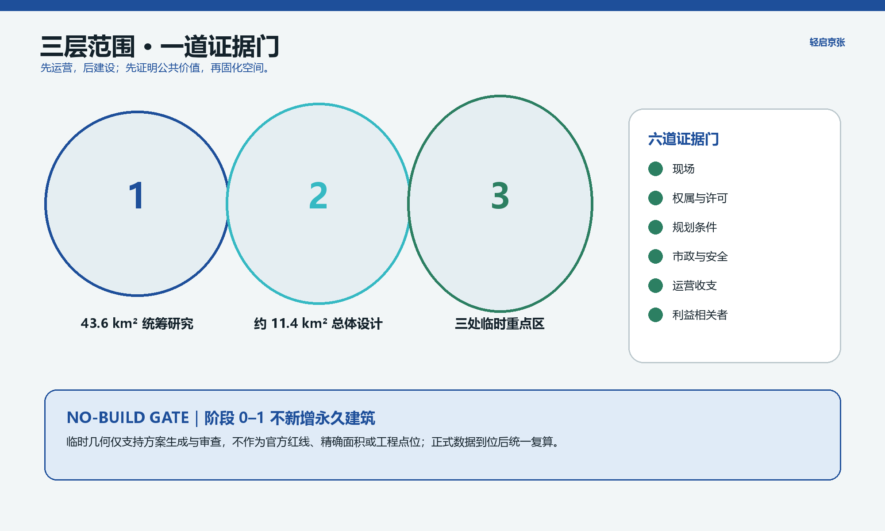
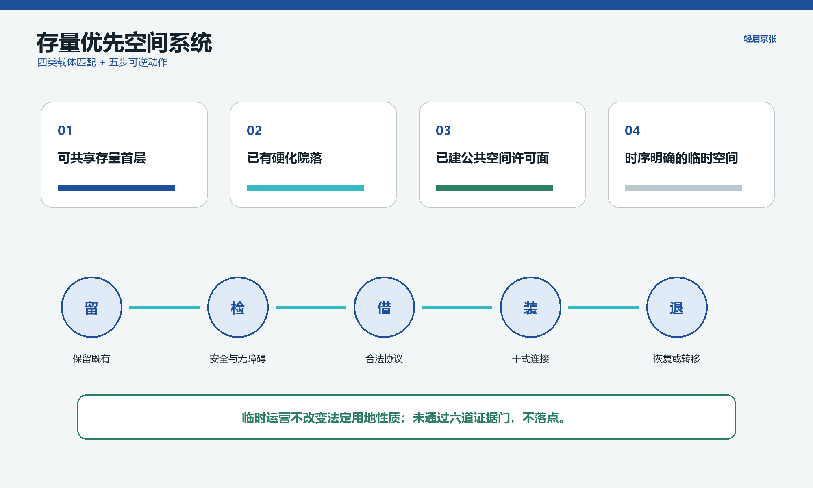
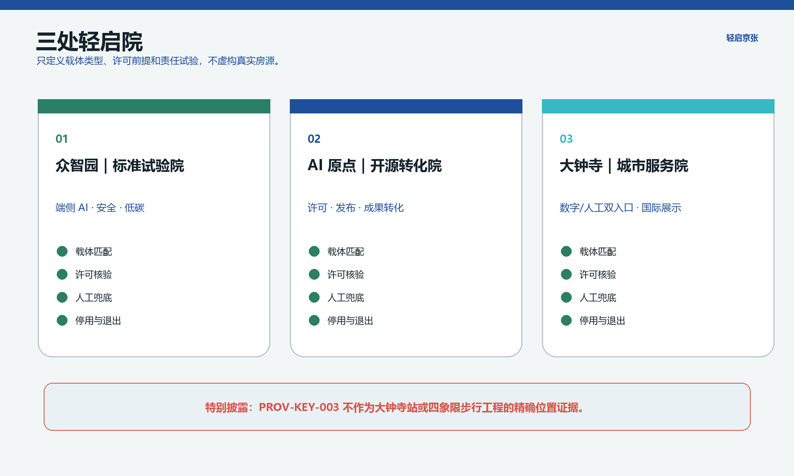
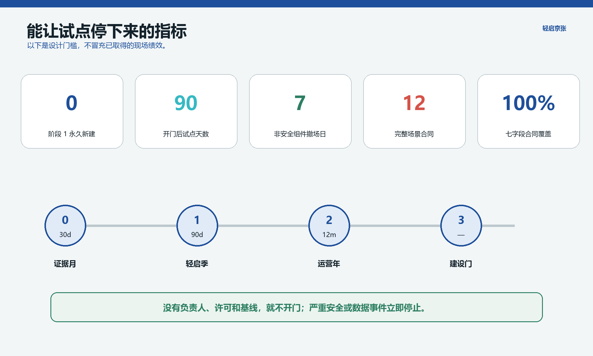
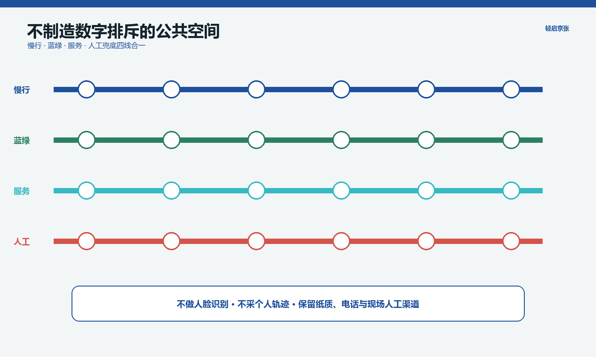

# 轻启京张 / Light-Start Jing-Zhang

> **先运营，后建设；先证明公共价值，再固化空间。** 本方案是基于仓库临时几何的开源概念研究，不是官方方案、现场调查、控规结论或建设承诺。

## 设计依据与资料清单

官方公告要求从 43.6 平方公里统筹研究、约 11.4 平方公里总体设计和约 368.4 公顷三处重点区三个层次，建立 AI 产业生态、城市更新、交通市政、公共空间和详细设计体系 [source:OFFICIAL-ANNOUNCEMENT] [standard:PROJECT-OFFICIAL-ANNOUNCEMENT]。本方案同时响应智能体任务书的五大功能、六项任务、场景开放和运营要求 [source:AGENT-TASKBOOK] [standard:PROJECT-AGENT-OPEN-CALL-TASKBOOK]。

边界、重点区、用地、建筑、道路、绿地、公共空间和分期以结构化文件为审查主证据。当前 `SITE-001` 与三处 `PROV-KEY` 均为临时约束范围；尤其 `PROV-KEY-003` 不作为大钟寺站或路口四象限的精确位置证据 [data:geometry/site_boundary.geojson#SITE-001] [data:geometry/key_areas.geojson#PROV-KEY-003] [depth:existing_conditions_diagnosis]。现场、权属、现状建筑、控规、市政、消防、文保和利益相关者证据尚未齐备，所有精度敏感结论待正式资料补齐后复算。

## 核心判断：把“暂时”设计成制度

创新带最昂贵的错误不是少建一栋楼，而是在需求、权属和运营责任尚未验证时，把错误永久化。“轻启”不是拒绝发展，而是一道 **No-Build Gate**：阶段 0 和阶段 1 不新增永久建筑，只允许在依法可用的存量空间中放入可撤装、可复用、无个人追踪的服务原型 [metric:phase_1_permanent_new_buildings] [depth:phasing_implementation]。任何永久建设建议必须同时通过现场、权属/许可、规划、市政/消防/无障碍、运营收支、利益相关者六道证据门。

空间结构为“一线、三院、两翼、四张公开表”。一线是京张遗址公园串联的轻启线；三院分别是众智园标准试验院、AI 原点开源转化院和大钟寺城市服务院；两翼不是新增园区，而是与高校策源和企业应用资源建立可撤销的服务交换；四张表为可用空间表、试点合同表、异议处理表和资产退出表。它把“三区两翼”从口号转成供需与责任链 [depth:three_level_scope_framework] [depth:overall_spatial_structure]。

| 不是 | 而是 |
|---|---|
| 猜测哪栋楼空置 | 先发布合法载体匹配清单，再决定点位 |
| 用传感器证明“智能” | 只采集完成服务所需的最少聚合数据 |
| 试点成功就自动永久化 | 到期自动停止，续期需重新举证 |
| AI 取代窗口人员 | 每项公共服务保留同等可达的人工路径 |

## 三层范围工作框架

统筹研究层形成高校策源、开源协作、企业验证、公共采购与国际传播的服务链；总体设计层识别可依法共享的首层、院落、边角地和已建公共空间类型；重点区层只做“载体类型 + 许可前提 + 可撤装组件”的详细设计，不虚构具体房源 [data:geometry/land_use.geojson#LU-001] [depth:land_use_layout]。现有土地分类保持仓库可校验编码，临时运营不改变法定用地性质 [standard:MNR-LAND-USE-CLASSIFICATION-GUIDE]。

建筑采用“留、检、借、装、退”五步法：先保留；检验结构、消防、无障碍、文保和设备；通过合法协议借用；以干式连接装入轻设施；试点结束恢复或转移。缺少建筑清单时，不对任何真实建筑作拆改留结论，也不提出伪精确高度、容积率或规模 [data:geometry/buildings.geojson#BLDG-001] [depth:retain_renovate_demolish] [depth:height_massing_character]。法定强度继续标记待正式数据补齐 [metric:floor_area_ratio] [depth:development_intensity_controls]。

## 统筹研究范围产业与未来城市研究

“轻启”将创新资源组织为三条可审计路径：高校/开源成果通过原点院进入 90 天服务试验；企业工具通过众智园院进入安全、能耗和标准验证；居民与访客需求通过大钟寺院的人工支持窗口进入公开问题池。区级统筹角色只提出规则建议；街道、产权人、运营方、技术方和第三方评估角色必须在单个合同中具名后才能启动。海淀 OPC 征求意见材料仅作为创业生态政策背景，不被解释为项目资金或空间承诺 [source:BJHD-OPC-2026-DRAFT]。

全球品牌不做新 logo 崇拜，而使用“开门日期 / 到期日期 / 人工窗口 / 撤场去向”四个统一识别字段。访客看到的不只是演示效果，也能看到谁负责、何时复评、如何投诉和如何退出。这一识别系统可在中英文场景卡、地面编号与可访问网页中一致传播。

## 总体设计范围城市更新与控规深度城市设计

空间上优先匹配四类载体：合规可共享的存量首层、已有硬化院落、已建公共空间的许可活动面、建设时序明确且不妨碍长期项目的临时空间。每一候选点先完成权属/管理人、允许用途、期限、租金与能源、消防、无障碍、噪声、装卸、保险和恢复责任核验；未通过则不落点。伦敦 meanwhile-use 指南关于期限、各方义务、资金和退出先约定的做法可迁移为合同清单，但其规划和产权制度不适用于北京 [source:LONDON-MEANWHILE-USE] [source:LONDON-PLAN-H3]。

用地结构、建筑基底、道路和公共空间仍由仓库几何承担可复核表达，不将活动占用误写为用途调整 [data:geometry/public_space.geojson#PUBLIC-001] [standard:MOHURD-CONTROL-DETAILED-PLANNING]。总体范围的面积来自临时边界复算，仅用于方案一致性检查 [metric:site_area_sqm]。

## 三处重点区域详细设计

### 众智园：标准试验院

匹配“可独立关闭的存量测试间 + 已建绿地边缘活动面”，以可移动测试台、能源计量箱和人工安全员验证端侧 AI、低碳设备与无障碍辅具。启动前必须确认清河、防洪、能源、消防与场地许可；不以临时图形声称具体场址。JTC 以园区业主、企业、方案方和公共机构共同定义试验及复制条件的做法可作运营参考，但其资金和监管结构不转移 [source:JTC-JID-LIVING-LAB] [data:geometry/key_areas.geojson#PROV-KEY-001]。

### 北京 AI 原点社区：开源转化院

匹配“可共享首层 + 可预约教室/会议室”，采用可拆声学屏、移动字幕设备、开源许可台和人工法务/无障碍服务时段。成果必须先完成数据、模型、许可证和安全边界登记，再进入公众试用；不读取校园内部数据，不声称高校已参与 [data:geometry/key_areas.geojson#PROV-KEY-002] [depth:three_key_area_detailed_design]。

### 大钟寺：城市服务院

在官方站点、道路和权属资料到位前，仅提出“轨道邻近既有首层 + 可安全排队的室内外过渡空间”的载体要求。设置双入口服务：数字自助与同等醒目的人工窗口；任何四象限连通工程均留待交通专项。临时 `PROV-KEY-003` 的质心偏差已被显著披露，不用于步行距离或工程设计 [data:geometry/key_areas.geojson#PROV-KEY-003] [depth:traffic_rail_slow_parking]。

## AI 创新生态、人才画像与 AI+ 场景

五类推定使用者为高校师生、初创团队、企业员工与国际访客、周边居民、老年人/残障人士/不使用智能手机者。它们是待验证画像而非访谈结论。海淀“人工智能+养老”行动计划提出区-街道-社区分层需求采集，可作为组织方法参考；本方案不声称获得其中资源或授权 [source:BJHD-AI-ELDERLY-2026]。

| ID / 场景 | 载体与服务对象 | 90 天指标 | 停用阈值 / 人工兜底 / 退出 |
|---|---|---|---|
| LS-01 开源门诊 | 原点共享首层；师生、初创 | 12 场、问题闭环率≥80% | 许可/隐私事故即停；人工咨询；设备转社区教室 |
| LS-02 模型安全台 | 众智园测试间；企业 | 3 项产业验证、100%风险登记 | 未登记模型即拒绝；安全员复核；测试台回库 |
| LS-03 低碳算力柜 | 众智园合规设备间；团队 | 能水基线覆盖100% | 越过场地容量或无基线即停；人工预约；柜体撤走 |
| LS-04 无障碍辅具库 | 三院共享；老年/残障用户 | 每件辅具均有现场协助与故障记录 | 一次安全严重事件即停；人工借还；资产移交合规机构 |
| LS-05 双入口办事角 | 大钟寺载体类型；公众 | 人工路径可见率100%，任务完成率单列 | 两路径差距>20个百分点即整改；柜台常开；7日撤装 |
| LS-06 慢行断点工单 | 已建公园许可点；通勤者 | 只记录匿名障碍工单，闭环率≥70% | 出现轨迹采集即停；纸质/电话工单；标识回库 |
| LS-07 雨园积木 | 已建硬化面许可边缘；公众 | 维护到场率≥95%，不宣称防洪绩效 | 积水/绊倒风险即封闭；人工巡检；模块移走 |
| LS-08 午间共餐桌 | 存量餐饮/院落；员工居民 | 食品合规100%，剩食只记重量 | 食安或扰民投诉未闭环即停；人工订座；桌组复用 |
| LS-09 夜间安静工坊 | 合规室内；开发者居民 | 噪声投诉5日内公开状态 | 连续2周超约定时段即停；值守员；声屏撤走 |
| LS-10 国际演示间 | 大钟寺存量首层；访客企业 | 中英材料一致率100%，权利清单100% | 未清权内容即下架；人工翻译时段；展具回库 |
| LS-11 反对意见桌 | 三院入口；所有受影响者 | 5工作日内公开匿名状态 [metric:unresolved_objection_publication_days] | 无负责人或逾期即暂停相关试点；纸笔/电话；台桌转用 |
| LS-12 资产下一站 | 线上线下清单；产权/运营方 | 资产去向登记100%，7日撤除目标 | 去向未定不得采购；人工盘点；修复、转移或合规回收 |

每张卡必须具备七字段合同：负责人、许可、基线、指标、停用、人工兜底、退出；覆盖率目标为 100% [metric:pilot_contract_coverage_ratio] [metric:scenario_card_count]。AI 仅做预约、知识检索、聚合问题分类和辅助翻译；不得做人脸识别、个体轨迹、信用评分、自动执法或未经授权画像。生成式 AI 服务遵守最小必要、显著提示、可投诉和人工复核边界 [source:CAC-GENAI-MEASURES]。

## 用地、建筑规模与拆改留方案

正式用地性质仍以法定规划和国土空间用途管制为准，临时使用协议不改变土地用途。当前用地分区只为提交包拓扑与方案讨论服务，不能证明某一真实地块可租、可改或可建设 [data:geometry/land_use.geojson#LU-001] [standard:MNR-LAND-USE-CLASSIFICATION-GUIDE]。建筑基底同样是概念表达；总建筑面积、容积率、高度、密度、退线和拆除许可因缺少正式控规、权属、测绘、结构、消防和文保资料而保持待补，不用推测值制造精确感 [metric:floor_area_ratio] [depth:development_intensity_controls]。

“留、检、借、装、退”决定建筑动作：可以留用不等于可以开放；只有结构和安全检查、允许用途、无障碍、设备容量、保险及恢复责任全部确认，才进入可撤装适配。阶段 1 的建筑动作限定为非结构性的干式内装、可移动家具和可恢复设备连接；涉及承重、外立面、消防分区、永久管线或文保本体的工程全部退出轻启阶段，转入持证专业团队深化 [data:geometry/buildings.geojson#BLDG-001] [depth:retain_renovate_demolish]。

## 交通、轨道、市政与公共服务设施

阶段 1 不新挖道路、不承诺跨环工程。先用人工巡查、可访问工单和短时行为观察建立慢行断点基线；任何摄像或定位数据另行论证且默认不用。可移动设施不得压缩消防通道、无障碍通行或非机动车秩序 [data:geometry/roads.geojson#ROAD-001] [depth:traffic_rail_slow_parking]。

每个载体须填写电力、给排水、排热、网络、消防和设备重量清单。端侧算力只有在容量和能水基线确认后进入，且保留断网服务模式；未知管线与工程条件进入约束清单，不以概念图代替专项 [data:geometry/constraints.geojson#CONSTRAINTS] [depth:municipal_new_infrastructure]。

## 蓝绿空间、公共空间与城市风貌

既有树木、绿地和铁路记忆优先于装置。组件使用干式螺栓、可替换表皮、低眩光照明和可回收编号；不在未知文保构件上固定。雨园积木仅作为可移动教育和小尺度滞蓄原型，不声称达到防洪绩效。临时几何中的绿地和公共空间比例只用于包内复核 [data:geometry/green_space.geojson#GREEN-001] [metric:green_ratio] [metric:public_space_ratio]。

公共空间不是免费的试验场。每项活动先划定行人净宽、轮椅回转、消防通道、树木根区、安静边界、装卸时段和极端天气关闭条件；运营方每日开闭场检查，严重通行、安全或扰民问题触发停用。景观模块以可搬移花池、遮荫、坐凳和饮水/充电界面构成，不替代海绵城市、防洪或公园工程专项 [depth:blue_green_public_space] [data:geometry/public_space.geojson#PUBLIC-001]。

风貌语言采用精密金属、低铁玻璃、再生石材和克制蓝色识别，回应 AI 创新但避免巨屏、机器人陈列和科幻地标。铁路文化通过铺地细线、构件编号与“下一站”资产台账转译，而不是复制怀旧车站。所有效果图均标注概念表现，并在正式场地资料到位后按文保、树木、日照和城市界面要求重新校准 [standard:MOHURD-URBAN-DESIGN-MEASURES] [depth:height_massing_character]。

## 更新项目清单、实施政策与分期计划

| 阶段 | 时间与准入 | 交付物 | 继续/停止决定 |
|---|---|---|---|
| 0 证据月 | 30 天；组织方授权后 | 现场记录、载体表、利益相关者图、异议基线、许可缺口 | 六门任一不清，相关点位不启动 |
| 1 轻启季 | 开门后 90 天 [metric:phase_1_pilot_duration_days] | 3 个院级试点、12 场景合同、周度公开状态 | 达阈值且无未处置严重异议才申请续期 |
| 2 运营年 | 12 个月；重新许可 | 运营收支、包容性、能水、资产循环、第三方评估 | 证明公共价值后提出选择性更新项目 |
| 3 建设门 | 无预设日期 | 正式控规/权属/工程/公众参与支撑的专业方案 | 未通过六道证据门则保持存量运营或退出 |

近期项目是载体核验、三院试点和公开台账；中期项目是经评估后的存量建筑适应性改造；长期才可能包括专业论证后的慢行、市政或建设工程 [data:geometry/phasing.geojson#PHASE-001] [depth:renewal_project_list]。非安全类可撤装组件从停止决定到撤除目标不超过 7 天 [metric:reversible_removal_target_days]。

RACI 原则：组织/规划角色确认边界和公共利益门槛；产权/管理人负责合法使用与场地安全；运营方负责服务、人工兜底和投诉；技术方负责模型/数据/设备；第三方负责无障碍、安全和结果复核。没有具名主体的卡不得开门。

## 指标体系、面积复算与合规矩阵

空间指标以 GeoJSON 复算，运营指标以设计目标或待采基线标记。总体面积、建筑基底、三处重点区数量和临时分区用于机器一致性，不升级为法定事实 [metric:site_area_sqm] [metric:building_footprint_area_sqm] [metric:key_area_count]。评分前应核对 `metrics.json`、任务覆盖矩阵、专业标准矩阵和设计深度矩阵。

本方案把零永久新建、90 天期限、7 天撤场、12 张合同卡和 100% 七字段覆盖写入指标，但它们是方案规则，不是已经取得的绩效。开门前另采空间可用率、服务完成率、人工/数字差距、能水消耗、投诉和资产去向基线；数据按群体和渠道做最小必要聚合，不发布小样本个人信息 [metric:pilot_contract_coverage_ratio] [metric:phase_1_pilot_duration_days] [depth:metrics_recalculation]。

绿地率、公共空间率和建筑基底来自当前几何模型；容积率等法定强度仍是未知。官方边界、重点区、现状建筑、道路、权属或控规任一更新，都必须统一重算几何、指标、五张图、两套图纸和网页，而不是只改正文数字 [metric:green_ratio] [metric:public_space_ratio] [source:BOUNDARY-SOURCE]。

## 现场与利益相关者证据

作者尚未完成组织方授权的现场踏勘，也没有取得经授权的居民、员工、学生、产权人、运营者、老年或残障群体访谈数据。因此本方案不声称需求已被验证。阶段 0 必须邀请受影响群体共同确定可接受时段、噪声、通行、数据和退出条件；未解决的反对意见与责任状态在去标识后公开。任何群体可使用纸质、电话和现场人工渠道，不以扫码作为参与前提 [source:PRC-BARRIER-FREE-LAW] [depth:risk_missing_data]。

## 风险、版权与合规说明

主要风险包括：临时边界误读、无合法载体、试点漂移成永久占用、活动扰民、无障碍失败、设备能水超载、数据越界、供应商锁定、资产闲置与国际案例误迁移。对应措施是显著临时标识、到期自动停止、人工同等入口、容量核验、最少数据、开放格式、资产下一站和本地法定程序优先 [depth:risk_missing_data] [data:geometry/constraints.geojson#CONSTRAINTS]。

如果出现人身安全、未授权个人数据、消防/无障碍通道受阻或许可失效，相关试点立即停止；一般服务质量问题进入限期整改，未闭环不得续期。AI 不替代审批、执法、医疗诊断或利益相关者意见，供应商不能以商业秘密阻断事故审计。任何长期运营或建设建议都必须重新经过专业审查和公众参与 [source:CAC-GENAI-MEASURES] [source:PRC-BARRIER-FREE-LAW]。

所有生成图像均为合成概念表现，不是现场记录、真实公众意见或官方效果图；不含可识别真人、商标或官方标识。完整权利、来源、生成方法、假设与文件哈希分别见 `report/copyright_statement.md`、`sources.json`、`assumptions.json` 和 `manifest.json` [source:SOURCE-REGISTRY]。

## 参考资料

官方公告与任务书是项目要求主来源；住建部城市设计和控规规则、自然资源部用地分类、生成式 AI 管理与无障碍法律提供专业及合规边界 [source:OFFICIAL-ANNOUNCEMENT] [source:AGENT-TASKBOOK]。这些来源用于说明任务、专业方法和行为底线，不被扩展为特定点位批准、资金安排或实施承诺。

海淀 OPC 征求意见材料、AI+养老行动计划、北京绿色建筑征求意见材料只作政策背景。其中征求意见稿必须在实施前核对正式版本，AI+养老计划只迁移需求采集层级，不假设本项目获得其组织和数据 [source:BJHD-AI-ELDERLY-2026] [source:BJ-GREEN-BUILDING-2026-DRAFT]。

伦敦临时使用与新加坡裕廊创新区只迁移合同期限、义务、退出和多方试验治理方法，不迁移法权、土地制度、资金规模或实施承诺。仓库临时边界只用于生成和审查，不能升级为官方红线。每条材料的状态、许可、用途和限制见 `sources.json`；事实应回到原始官方页面复核 [source:SOURCE-REGISTRY] [source:LONDON-MEANWHILE-USE] [source:JTC-JID-LIVING-LAB]。
