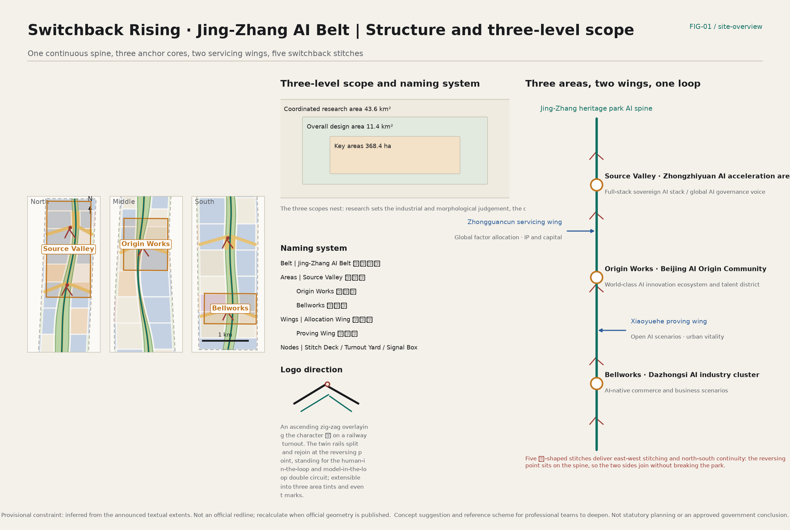
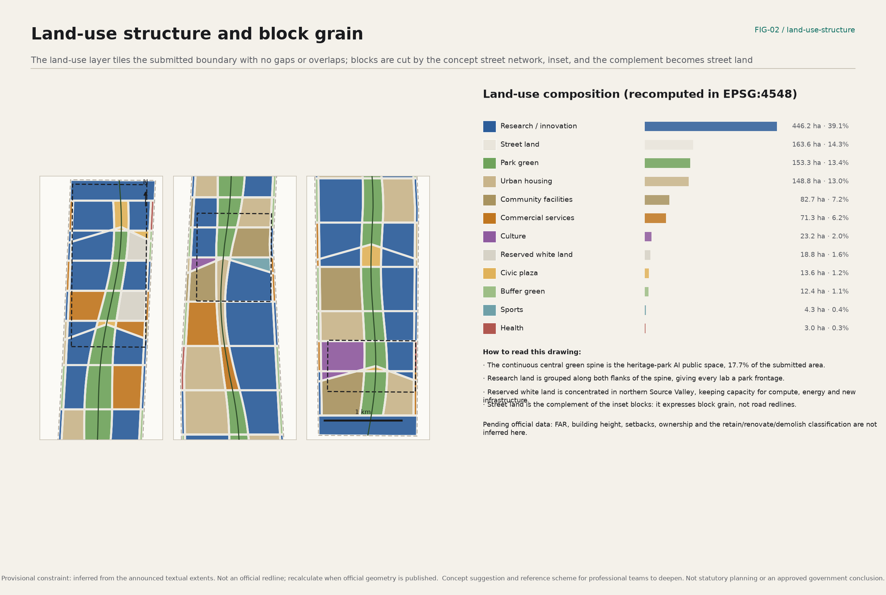
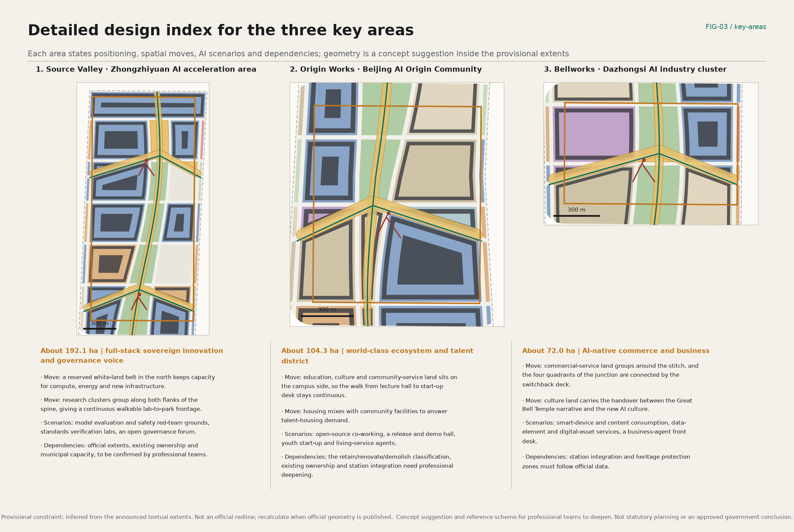
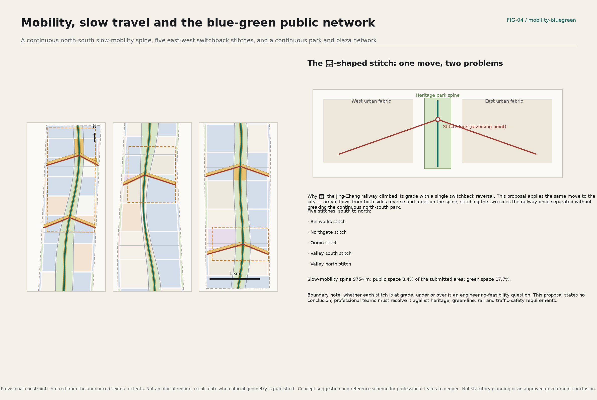
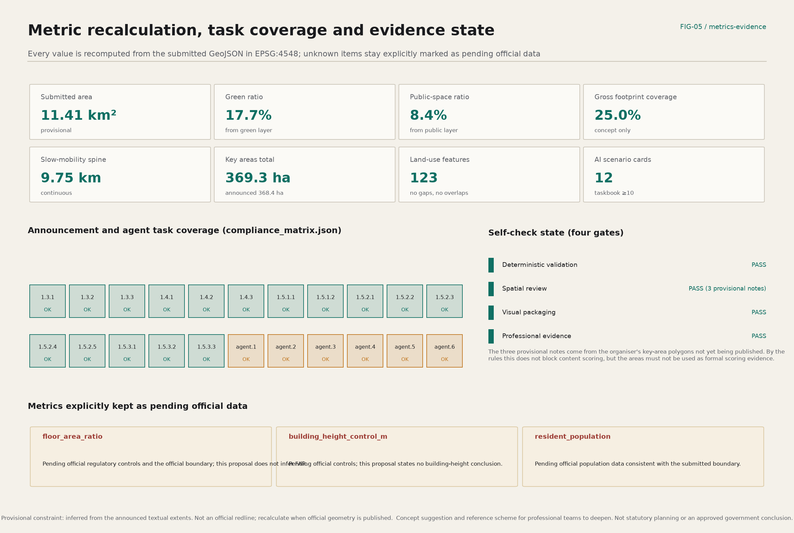

# Switchback Rising — The Jing-Zhang AI Belt

**The proposal in one sentence:** the switchback the Jing-Zhang railway used to climb the Guangou pass is translated from a railway device into an urban one — arrival flows from the two sides that the railway once separated reverse and meet on the heritage-park spine, so a single move delivers both east-west stitching and north-south continuity, and that spine becomes the public-space and scenario backbone of the AI innovation belt.

**Chinese main name:** 人字上行 · 京张智带. **English main name:** Switchback Rising — The Jing-Zhang AI Belt.

## Design Basis and Source List

The primary basis is the pre-qualification announcement for the Centennial Jing-Zhang AI Innovation Belt international urban design open call issued by the Haidian branch of the Beijing Municipal Commission of Planning and Natural Resources, together with the agent-facing open-call taskbook extract. Together they fix the three scope levels, the three key areas, the three positioning statements, the five functions and the six agent tasks [source:OFFICIAL-ANNOUNCEMENT] [source:AGENT-TASKBOOK].

For spatial data, the organiser has not yet published official `SITE_BOUNDARY` or `KEY_AREA` polygons. This package therefore uses the maintainer-registered provisional rough boundaries for generation, display and self-check, and labels them everywhere — in prose, drawings, metrics and structured files — as a provisional constraint. They are never called an official redline and are never used as formal area-scoring evidence [source:BOUNDARY-SOURCE] [data:geometry/site_boundary.geojson#SITE-001].

Source usability follows the repository registry: formal-ready material, background-only material and provisional-only material are kept strictly apart, and background or provisional records are never promoted into statutory controls or government implementation commitments [source:SOURCE-REGISTRY]. The complete source list, licences, retrieval dates and limitations live in `sources.json`; standard responses live in the professional standard matrix; depth responses live in the design depth matrix. The prose keeps only the anchor that sits closest to each claim.

Readability and auditability are organised as two layers: a reader who never opens a JSON file should still understand the design judgement, while a reviewer who does open them should be able to recompute every number [depth:existing_conditions_diagnosis]. The largest diagnostic gap is the absence of official boundaries, ownership, regulatory controls and municipal capacity data; each gap is registered in `assumptions.json` with an explicit recalculation trigger.

## Three-Level Scope Framework

The three levels in the announcement are not three independent drawing sets but one working chain that runs from judgement to plan to verification. The coordinated research area of about 43.6 km² answers questions about the industrial ecosystem and future urban form; the overall design area of about 11.4 km² turns those answers into a recomputable spatial structure; and the key detailed-design areas of about 368.4 ha test whether the judgement survives contact with a specific district [depth:three_level_scope_framework] [metric:coordinated_research_area_sqm].

The handover between levels is the organising method here. The research-level judgement — that an innovation chain needs a continuous public interface — becomes, at the overall design level, a continuous north-south green spine with research land grouped along both flanks, and is then tested at the key-area level against real block grain, walking distances and scenario locations [data:geometry/land_use.geojson#LU-001] [depth:overall_spatial_structure].

This chain matters because agent-generated proposals usually break exactly here: the macro vision is written confidently, and then nothing at the land-use or block level can be recomputed. The method used here is to lock the adopted provisional constraint first, then generate land use, green space, public space, building footprints, roads and phasing, and finally recompute every metric back from those layers. Any area, ratio or count that cannot be recomputed from the structured data does not enter a conclusion.

One limitation must stay visible: all three scope boundaries are inferred from the announced textual extents. Their areas sit within 0.3% of the announced values, but their polylines carry no statutory meaning. When official geometry is published, land use, green space, public space, buildings, roads, phasing and all metrics must be regenerated as a set rather than patched file by file [source:BOUNDARY-SOURCE].

## Coordinated Research Area: Industry and Future City Research

The research-level question is blunt: Haidian already holds the densest concentration of universities, institutes and AI firms in the country, so why does it need a belt at all? The judgement here is that factor density is already sufficient, but the factors lack a continuous, walkable, exhibitable, operable public interface between them. The Jing-Zhang heritage park is the only plausible carrier for that interface: it runs the full length of the corridor and belongs to no single owner [standard:PROJECT-OFFICIAL-ANNOUNCEMENT] [depth:overall_spatial_structure].

The research-level strategy is therefore compressed into one innovation chain: university origination, open-source collaboration, enterprise conversion, public experience, international communication. Spatially that chain becomes one spine, three cores and two wings — the spine carries public experience and international communication, the three cores carry origination, collaboration and conversion, and the two wings carry factor allocation and scenario proving [source:AGENT-TASKBOOK].

The future-city research avoids technology-vision language and answers three testable questions instead. First, does AI change the time distribution of commuting and visiting, and therefore the hours in which public space is used? Second, can research, exhibition and consumption frontages now sit on the same street? Third, how much reservable urban space does AI infrastructure — compute, energy, data — actually need? The third question gets an explicit spatial answer: a reserved white-land belt in northern Source Valley keeps capacity for compute, energy and new infrastructure instead of locking its use in advance [data:geometry/land_use.geojson#LU-ROAD-001].

On regional synergy, the belt is proposed as an allocation hub rather than a walled park: a research-to-pilot-to-industrialisation relay northward with Future Science City and Huairou Science City, a capital and IP interface southward with the Zhongguancun service system, and a manufacturing and scenario interface eastward with the economic development area. All of this is a concept suggestion and reference scheme for professional teams to deepen, not a confirmed government arrangement or investment commitment.

Five global AI ecosystem cases are cited, all from public reporting and official websites, as strategic reference rather than formal scoring data [metric:ecosystem_case_count]:

| Case | Location | What it informs here | Use boundary |
| --- | --- | --- | --- |
| Zhongguancun native ecosystem | Haidian, Beijing | Proximity between institutional density and enterprise conversion | Local baseline |
| King's Cross Knowledge Quarter | London, UK | Stitching research institutions with public space and culture | Background only |
| Station F | Paris, France | Concentrated start-up services under one roof | Background only |
| Mila research cluster | Montreal, Canada | An academically led open research network | Background only |
| one-north | Singapore | A state-led research district mixed with housing | Background only |

What the cases share is distilled into one design judgement: what works is not the park wall but whether researchers, founders and residents repeatedly meet each other in the same walkable public space. That is why this proposal concentrates its resources on the spine and the stitches.

## Overall Design Area: Urban Renewal and Regulatory-Plan-Level Urban Design

The overall design area must reach the urban-design depth of a regulatory detailed plan. The structure is one spine, three cores, two wings and five stitches: a continuous slow-mobility spine of about 9.75 km runs the whole belt along the heritage park; the three key areas act as anchors; the Zhongguancun servicing wing and the Xiaoyuehe proving wing plug in from west and east; and five 人-shaped stitch decks reverse the arrival flows of both sides onto the spine [metric:slow_mobility_spine_length_m] [depth:overall_spatial_structure].

The land-use structure is generated in three steps — cut blocks with the concept street network, inset each block, take the complement as street land — so the layer tiles the submitted boundary with no gaps and no overlaps across 123 features [metric:land_use_feature_count] [data:geometry/land_use.geojson#LU-001]. Research land takes the largest share and is grouped along both flanks of the spine, so every research cluster gets a park frontage; commercial-service land concentrates in Bellworks to the south and around each stitch; housing and community facilities stay on the inner side of the existing fabric [standard:MNR-LAND-USE-CLASSIFICATION-GUIDE].

On development intensity, this proposal deliberately states no FAR, height, density or setback conclusion. The public site package contains no approved regulatory controls, and any intensity number an agent invents would contaminate the professional work that follows, so these indicators are kept explicitly as pending official data [depth:development_intensity_controls] [standard:MOHURD-CONTROL-DETAILED-PLANNING].

Height, massing and character are answered only at the level that can honestly be stated: a low–medium–low sectional rhythm along the spine, a measured landmark massing on either side of each stitch to form legible urban gateways, and continuity with the existing fabric elsewhere. Actual height zoning must be set by professional teams against official controls, daylight, heritage and sightline requirements [depth:height_massing_character] [standard:MOHURD-URBAN-DESIGN-MEASURES].

Carrying-capacity assessment is limited in the same way: recomputable land-use, green, public-space and footprint areas are provided, but no municipal, traffic or population capacity calculation is attempted. That work belongs to professional teams.

## Detailed Design of Key Areas

All three key areas follow the same structure — positioning, spatial moves, AI scenarios, dependencies — so each district carries both a design judgement and an explicit statement of what cannot yet be fixed [depth:three_key_area_detailed_design].

**Source Valley (Zhongzhiyuan AI acceleration area, about 192.1 ha)** carries the full-stack sovereign AI system and China's voice in global AI governance. Two spatial moves: a reserved white-land belt in the north keeps capacity for compute, energy and new infrastructure rather than locking uses early; and research clusters group along both flanks of the spine to form a continuous walkable lab-to-park frontage. Scenarios centre on model evaluation and safety red-team grounds, standards verification labs and an open governance forum. Dependencies include the official extents, existing corporate ownership and municipal capacity, all pending professional confirmation [data:geometry/key_areas.geojson#PROV-KEY-001].

**Origin Works (Beijing AI Origin Community, about 104.3 ha)** carries the world-class innovation ecosystem and the talent district. The spatial move concentrates education, culture and community-service land on the campus side so the path from lecture hall to start-up desk stays spatially continuous, and mixes housing with community facilities to answer talent-housing demand. Scenarios centre on open-source co-working, a release and demo hall, and youth start-up and living-service agents. Dependencies include the retain/renovate/demolish classification, existing residential ownership and station integration [data:geometry/key_areas.geojson#PROV-KEY-002].

**Bellworks (Dazhongsi AI industry cluster, about 72.0 ha)** carries AI-native commerce and business scenarios. The spatial move groups commercial-service land around the stitch and connects the four quadrants of the junction through the switchback deck; culture land carries the handover between the Great Bell Temple narrative and the new AI culture. Scenarios centre on smart-device and content consumption, data-element and digital-asset services, and a business-agent front desk. Dependencies include station integration, heritage protection zones and construction control zones, which must follow official data [data:geometry/key_areas.geojson#PROV-KEY-003].

One caution: all three districts are laid out inside provisional constraints, and the rectangular edges must not be read as parcel lines or road redlines. When official key-area polygons are published, the land use, buildings, public space and metrics of all three must be recomputed as a whole [source:KEY-AREA-SOURCE].

## AI Innovation Ecosystem, Personas, and AI+ Scenarios

The ecosystem map is organised in three layers — factors, actors, space. Factors are land, space, industry, capital, talent, compute, data and scenarios. Actors are universities and institutes, leading firms, start-up teams, open-source communities, public service bodies and residents. Space maps to the three cores, two wings and the scenario nodes along the spine. In this map the Zhongguancun servicing wing carries global factor allocation and the capital and IP interface, while the Xiaoyuehe proving wing carries scenario opening and urban vitality [source:AGENT-TASKBOOK] [standard:PROJECT-AGENT-OPEN-CALL-TASKBOOK].

**Six personas** (the taskbook asks for at least five) [metric:persona_count]: graduate researchers, who care about low-cost experimental conditions and peer density; start-up founders, who care about concentrated services and exposure; engineers at leading firms, who care about commuting efficiency and daily amenities; long-term residents including older people, who care about quiet, safety and access; visiting international developers and conference guests, who care about legible wayfinding and concentrated experience; and users with accessibility needs together with their carers, who care about continuous barrier-free routes and non-digital alternatives.

**Twelve AI scenario cards** (the taskbook asks for at least ten) [metric:ai_scenario_card_count]. Each card states its users, spatial carrier, data boundary and human-review method:

| ID | Scenario | Primary users | Spatial carrier | Data and review boundary |
| --- | --- | --- | --- | --- |
| S-01 | Heritage-park guidance and barrier-free navigation | Residents / visitors / accessibility users | Spine promenade | Public geodata only; staffed enquiry points retained |
| S-02 | Stitch-deck flow and safety operations review | Operators | The five stitches | Aggregate counts only, no identification, anomalies confirmed by staff |
| S-03 | Time-shared right of way for low-speed delivery robots | Firms / residents | Collectors and local links | Time-boxed and revocable; conflicts handed to human dispatch |
| S-04 | Campus-to-district commuting agent | Students / engineers | Stitches and station surroundings | Opt-in only, with a non-app alternative |
| S-05 | Enterprise-service copilot | Start-up teams | Origin Works service desks | Answers public policy and process only; conclusions confirmed by staff |
| S-06 | Open compute and model-evaluation booking | Researchers | Source Valley evaluation ground | Usage records public; results must be reproducible |
| S-07 | Smart-device and content consumption | Visitors / residents | Bellworks retail frontage | Experience data stays local; off by default for minors |
| S-08 | Age- and disability-friendly travel companion | Older people / carers | Belt-wide public space | Staffed service windows and offline routes retained |
| S-09 | Community energy and waste-heat visualisation | Residents / operators | Community facilities | Aggregated to building level or above, never per household |
| S-10 | Public-space programming and opening | Citizens / organisers | Plazas and stitches | Rules published; disputes settled by people |
| S-11 | Self-reporting street furniture | Operators | Along the spine | Device status only, no image recognition |
| S-12 | Jing-Zhang history and new AI culture guidance | Visitors / students | Spine and culture land | Historical facts follow public records; no speculative claims |

**Four industry test and validation scenarios** (the taskbook asks for at least three) [metric:industry_test_scenario_count]: the model safety red-team and evaluation ground in Source Valley; a low-speed autonomous vehicle and delivery-robot urban test segment formed by the spine and the stitches; a real-environment validation block for smart devices and human-machine interaction in Bellworks; and an urban data-element and privacy-computing sandbox in Origin Works. All four are stated as supervised pilots, never as approved operations [standard:GENERATIVE-AI-INTERIM-MEASURES].

Privacy and human review are hard constraints in this section: no scenario may depend on personal identification, use non-public data, or deploy automated decisions that cannot be reviewed by a person; services aimed at older people and accessibility users must retain a non-digital alternative [standard:BARRIER-FREE-ENVIRONMENT-LAW] [standard:ELDERLY-SMART-TECH-PLAN-2020-45].

## Land Use, Building Scale, and Retain-Renovate-Demolish Strategy

The land-use judgement treats park frontage as the scarce resource to be allocated: research land gets the spine frontage first, commercial-service land gets the stitch frontage first, and housing and community facilities get the quiet inner frontage. The rule can be checked directly against the land-use layer rather than remaining a written assertion [depth:land_use_layout] [data:geometry/land_use.geojson#LU-001].

On building scale, what is provided is a set of concept block-interface footprints — 76 features, about 25.0% gross footprint coverage — used only for internal comparison and block-grain checking [metric:building_feature_count] [metric:building_coverage_ratio] [data:geometry/buildings.geojson#BLDG-001]. These are not architectural design outputs and cannot serve as an approved basis for building scale. Total floor area, FAR and height are not inferred; those conclusions wait for official regulatory controls and professional teams [standard:MOHURD-ARCH-DESIGN-DEPTH-2016].

On retain-renovate-demolish, this proposal offers a **classification method**, not parcel conclusions [depth:retain_renovate_demolish]. Four checkable criteria are suggested: whether a building sits on the connecting path of the spine and the stitches; how well its current use fits the AI innovation chain; whether its structure and safety condition allow continued use; and the adjustment cost implied by ownership and occupancy. The first two can be pre-screened from the layers submitted here; the last two require survey and ownership records.

Accordingly no demolition, renovation or retention conclusion is stated for any specific parcel, and no change is proposed to corporate buildings or tenured space. Every statement touching this topic is a concept suggestion and reference scheme for professional teams to deepen. The actual classification should be produced by qualified professional teams once ownership, structural and regulatory data are available.

Reserved white land is a deliberate choice in this section: about 18.8 ha in northern Source Valley is kept without a preset use, holding urban space for compute, energy and infrastructure that does not exist yet. For a belt built around AI, keeping the capacity to host a use nobody has defined yet is itself a planning judgement.

## Transport, Rail, Municipal Infrastructure, and Public Services

The transport backbone is a continuous north-south slow-mobility spine of about 9,754 m, flanked by servicing collectors, plus five east-west switchback links. Concept road and slow-mobility centrelines total about 41.7 km, all stated as schematic and never as road redlines, alignments or engineering conclusions [metric:road_centerline_length_m] [data:geometry/roads.geojson#ROAD-003] [depth:traffic_rail_slow_parking].

The rail-interchange strategy is to bring the station into the spine rather than to attach the spine to the station: the five stitches are placed near existing rail and major junctions, so interchange flows enter a continuous pedestrian system as soon as they reach the park. Dazhongsi station integration and four-quadrant pedestrian connection are the key southern moves, but their engineering form — at grade, under or over — is a feasibility question this proposal does not decide.

Parking and cycle parking are proposed as concentrated at the stitches and dispersed along block edges, keeping the interior of the spine as continuous car-free public space. Supply volumes must follow official provision standards and demand modelling, and no number is given here.

Municipal and new infrastructure is handled in two layers. Conventional utilities follow later professional deepening. New infrastructure — edge compute, distributed energy, charging and swapping, data access — is proposed on a reservable, expandable, revocable principle and concentrated in the reserved white land and the below- and semi-below-grade space around the stitches [depth:municipal_new_infrastructure]. Municipal capacity, energy load and routing are not calculated and remain a declared data gap.

For public services, community facilities, education, culture, sports and health land are placed as a service band along the spine. Facility sizes, service radii and provision standards must follow official standards and population data, and the public sources currently lack a population series consistent with the submitted boundary [metric:resident_population].

## Blue-Green Network, Public Space, and Urban Character

The blue-green system centres on one continuous park spine, supplemented by block-level green space and buffer green along the edges, totalling about 202.4 ha, or 17.7% of the submitted area [metric:green_ratio] [data:geometry/green_space.geojson#GREEN-SPINE-001] [depth:blue_green_public_space]. The spine widens at the stitches to form activity grounds and narrows in constrained stretches to keep passage continuous; that rhythm of widening and narrowing is itself the spatial signature of the heritage park.

Public space has three parts: the continuous north-south promenade, the five switchback stitches, and the plazas and honour-display grounds, totalling about 95.6 ha, or 8.4% of the submitted area [metric:public_space_ratio] [data:geometry/public_space.geojson#PUBLIC-PROM-001]. The stitch is the critical type: it is simultaneously an east-west connection, a north-south node, and the carrier of AI scenarios and honour display [metric:switchback_stitch_count].

**Four AI pilgrimage landmarks** (the taskbook asks for at least three) [metric:pilgrimage_landmark_count]: the Switchback Deck viewing platform at the Origin stitch, as the belt's principal landmark; the Source Stele open-source contributor wall in Source Valley, which keeps recording contributors and proposal records; the Bell Hall in Bellworks, hosting the dialogue between the Great Bell Temple narrative and the new AI culture; and the Signal Boxes distributed along the spine as open display stations for how the city's AI actually runs. All four are defined as operable, updatable, non-spectacle public facilities, avoiding social-media-driven or trivialising treatment.

Urban character is described as restrained technical: railway vocabulary — turnouts, signals, milestones — becomes the prototype for a public-space component library, and three area tints distinguish district identity, so AI is never reduced to dazzling visual decoration. The cultural narrative starts from the Jing-Zhang railway that opened in 1909 and its 人-shaped switchback at Qinglongqiao, moves through Zhongguancun's innovation culture, and lands on a new AI culture defined by open-source collaboration and human-machine co-creation; the historical passages follow public records without speculative claims [source:PROCESSED-FACT-PACK]. Wayfinding and the belt logo are kept in separate layers: the logo states the identity of the belt, wayfinding states paths and nodes, and the two are not mixed.

## Renewal Projects, Implementation Policy, and Phasing

The renewal project list is ordered public-first [depth:renewal_project_list]: first, spine continuity works, including a continuous promenade, barrier-free retrofits and lighting; second, public-space construction at the five stitches; third, public-service gap-filling inside the three key areas; fourth, site preparation and reserved connections on the white land; fifth, scenario pilot facilities — evaluation ground, test segment, validation block and data sandbox. All of these are concept project directions and constitute no investment, approval or construction arrangement.

Three implementation policy directions are proposed. First, a published scenario-opening list, so firms and developers can see which urban scenarios are available and at what cost of entry. Second, a revocable-pilot rule, giving every AI scenario pilot an assessment period and an exit path. Third, a contribution-memory mechanism that keeps open-source contributors and proposal records in a durable public knowledge base. These are policy directions, not confirmed policy arrangements.

Phasing is proposed in three stages, all as a concept sequence [depth:phasing_implementation] [data:geometry/phasing.geojson#PHASE-001]: phase one concentrates on the five stitches and the continuous spine, so the public skeleton is completed first, covering about 720.2 ha [metric:phase_1_area_sqm]; phase two deepens detailed design and scenario pilots in the three key areas; phase three extends to two-wing coordination and belt-wide scenario operation.

**Long-term operation and event system** (answering the sixth agent task): an annual Jing-Zhang Open Source Week; quarterly AI Scenario Open Days; an annual Switchback Challenge aimed at agents and developers; and continuous wandering programmes along the pilgrimage route. Developer-community operation runs on standing open-source desks, a mentor scheme and issue bounties in Origin Works. Scenario operation runs on the opening list and the revocable-pilot rule. International communication and conversion follow an open-scenario, pilot-permit, assessment, scale-up path. All of these are concepts, not confirmed government events or funding arrangements.

## Metrics, Area Recalculation, and Compliance Matrix

Every metric is recomputed from the submitted GeoJSON after projection to EPSG:4548, matching the repository's own review script, so a reviewer can reproduce each number independently [depth:metrics_recalculation] [metric:site_area_sqm]. The submitted area is about 11.41 km², within 0.2% of the announced 11.4 km²; the three key areas total about 369.3 ha, within 0.3% of the announced 368.4 ha [metric:key_area_total_sqm].

Core ratios are a green ratio of 17.7%, a public-space ratio of 8.4%, gross footprint coverage of 25.0%, and about 163.6 ha of street land [metric:street_land_area_sqm]. Two cautions: street land is the complement of the inset blocks and expresses block grain rather than road redlines, and gross footprint coverage is an internal comparison figure, not a density control indicator.

Three metrics are explicitly kept as pending official data: floor area ratio, building height control and resident population. None of these is an omission; each is a deliberate refusal to guess. The public package holds no approved regulatory controls and no population series consistent with the submitted boundary, and an invented value would put the professional work that follows at risk.

The compliance matrix covers all mandatory tasks in announcement sections 1.3, 1.4 and 1.5 together with agent tasks agent.1 to agent.6 — 22 entries, each mapped to specific chapters, layers, metrics, drawings and visualisation blocks. The standard matrix covers 9 standards, and the design depth matrix covers all 15 required depth items, each marked complete [standard:PROJECT-OFFICIAL-ANNOUNCEMENT] [standard:PROJECT-AGENT-OPEN-CALL-TASKBOOK].

## Risk, Copyright, and Compliance

Three risks most need human review [depth:risk_missing_data]. The first is spatial precision: every boundary is inferred, and while the areas sit very close to the announced values, the polyline positions carry no statutory meaning; once official data arrives the package must be regenerated as a whole rather than patched. The second is policy uncertainty: development intensity, street sections, public safety and data governance rules all await confirmation by the competent authorities, so every related statement here is a concept suggestion. The third is scenario ethics and equity: AI scenarios can exclude older people, accessibility users and residents who do not use smart devices, so every scenario must retain a non-digital alternative and a human review step.

Boundary statement: every spatial suggestion in this proposal is a concept suggestion, a reference scheme or material for professional teams to deepen. It does not replace statutory planning, does not constitute an approved government conclusion, and states no conclusion on regulatory plan adjustment, FAR, building height, parcel-level demolition, road alignment, rail alignment, bridge or tunnel engineering, utility routing, underground feasibility, land tenure, investment estimation or approval. Events, policy mechanisms and coordination relationships mentioned here are proposals, not confirmed decisions or implementation arrangements.

Copyright and data compliance: this package uses only public sources and cleared material registered in the repository. It uses no non-public government data, no internal corporate data and no personal data, and no unlicensed trademark, typeface, image, portrait or paper figure. Every drawing is generated from this package's own structured data using an open-source Chinese typeface, and no third-party copyrighted material appears in any figure. The case citations use only factual descriptions from public reporting and official websites and are explicitly marked as background reference.

Generation disclosure: this package was produced by an AI agent from repository material and public sources. Geometry, metrics, figures and visualisation are all generated by re-runnable scripts from the same inputs, and the process, assumptions and limits are recorded in the assumptions file and the changelog. Final judgement rests with people and professional teams; the role of this package is to offer a structured, recomputable, extendable open co-creation suggestion.

## References

The complete record of basis and provenance lives in `sources.json`, standard responses in the professional standard matrix, depth responses in the design depth matrix, task coverage in the compliance matrix, and assumptions and data gaps in `assumptions.json` [source:SITE-PACKAGE] [source:SOURCE-REGISTRY].

The principal basis includes the project pre-qualification announcement and the agent-facing open-call taskbook extract; the registered provisional rough boundaries and key-area extents; and the local reference snapshots of the land-use classification guide, the urban design administrative measures and the regulatory detailed planning measures, together with the snapshots of the interim measures for generative AI services, the barrier-free environment construction law and the implementation plan on older people's difficulties with smart technology [standard:MOHURD-URBAN-DESIGN-MEASURES] [standard:MNR-LAND-USE-CLASSIFICATION-GUIDE].

The global case section cites publicly available information about districts and research institutions purely as background reference for strategy. It is not formal evidence, and it does not imply any cooperation with or endorsement by those institutions. The usability boundary of every source follows the repository registry.
